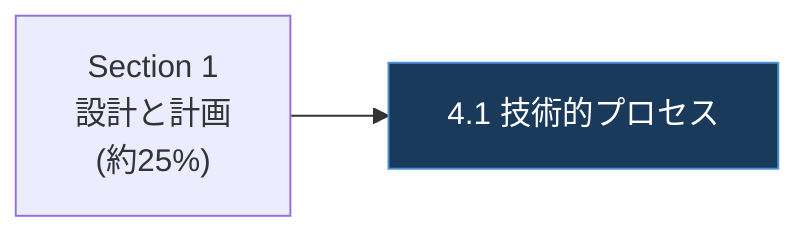

# Markdown → HTML 変換規則

最終更新: 2026-08-18

内容の正は `<ガイド名>.md`、デザインの正は `Gcp-pca-section4-process-optimization.html`。
本書は両者の実測から導いた**変換規則の全表**である。

> [!CAUTION]
> 変換は機械的な Markdown レンダリングでは**ない**。目次・脚注・チェックリストの 3 構造は
> 意味に応じて別要素へ再型付けし、hero とサイドバーは新規に組み立てる。
> ただし **原本の文言を削る・要約する・言い換えることは一切許されない**。
> 「短くした方が図が綺麗」は理由にならない。図に入り切らない語句は本文側へ移す。

## 1. 骨格の対応

| 原本 Markdown | 生成 HTML |
|---|---|
| `# タイトル` | `<title>` と hero の `<h1>`（**原本の文をそのまま**） |
| `## 目次` とそのリンク一覧 | `<nav id="sidebarNav">` の `<a>` 群。見出しにも本文にもしない |
| `## N. タイトル` | `<h2 id="<目次アンカー>">N. タイトル</h2>`（採番を外さない） |
| `### N.M タイトル` | `<h3 id="<目次アンカー>">N.M タイトル</h3>` |
| `#### タイトル` | `<h4>タイトル</h4>` |
| `---`（水平線） | `<hr />` |
| `[^n]` | `.footnote-ref` の `<a>`（§4） |
| `[^n]: 名称. URL` | `.ref-card`（§4） |

**`<section>` でくくらない。** `SECTION 01` のような通し番号ラベルも付けない。
本文は `<main class="main">` 直下に平坦に並べる。

## 2. 見出しの id は目次アンカーをそのまま使う

原本の `## 目次` は GitHub 互換のアンカーを持つ。

```markdown
- [1. Section 4の全体像](#1-section-4の全体像)
  - [1.1 配点と出題範囲](#11-配点と出題範囲)
```

生成 HTML はこの文字列を**そのまま** `id` と `href` に使う。

```html
<a href="#1-section-4の全体像" class="">1. Section 4の全体像</a>
<a href="#11-配点と出題範囲" class="lvl3">1.1 配点と出題範囲</a>
...
<h2 id="1-section-4の全体像">1. Section 4の全体像</h2>
<h3 id="11-配点と出題範囲">1.1 配点と出題範囲</h3>
```

- **英語 kebab-case へ翻訳しない。** 日本語のまま使う
- 目次アンカー ≡ 見出しの `id` ≡ サイドバーの `href` の三者一致を監査が blocking で強制する
- 原本の目次に無い見出しを足さない。足すなら原本 `.md` の目次にも足す（`.md` が正）

サイドバーの `<a>` は h2 が既定クラス、h3 が `class="lvl3"`。
h4 以下はサイドバーに載せない。

## 3. 本文要素の対応

| 原本 | 生成 HTML |
|---|---|
| 段落 | `<p>…</p>` |
| `- 項目` | `<ul><li>…</li></ul>` |
| `1. 項目` | `<ol><li>…</li></ol>` |
| GFM 表 | `<div class="table-scroll"><table><thead><tr class="header">…</tr></thead><tbody><tr class="odd">…</tr></tbody></table></div>` |
| `**強調**` | `<strong>強調</strong>` |
| `*書名*` | `<em>書名</em>` |
| `` `コマンド` `` | `<code>コマンド</code>` |
| `[文字列](URL)` | `<a href="URL">文字列</a>`（`target` / `rel` は付けない） |
| `**ベストプラクティス**` + 箇条書き | `.callout-practice`（`references/design-system.md` §5.3） |
| チェックリスト（`- [ ] 項目`、または「チェックリスト」節の箇条書き） | `.checklist-card`（同 §5.4） |

表の `<tr>` は**全行に class が要る**。`thead` は `header`、`tbody` は先頭から
`odd` / `even` を交互に付ける。

`- **要点。** 続きの文` は `<li><strong>要点。</strong>続きの文</li>` にする。

## 4. 脚注の変換（本 repo 固有）

原本は Pandoc 形式の脚注を使う。**本文中の参照 1 箇所ごとに `.footnote-ref` を 1 つ**置き、
**脚注番号 1 つにつき `.ref-card` を 1 つだけ**置く。
同じ `[^1]` が本文に 2 回現れるなら `.footnote-ref` は 2 つ、`.ref-card` は 1 つである。

### 4.1 本文中の参照

```markdown
…認定する資格です[^1]。
```

```html
<p>
    …認定する資格です<a class="footnote-ref" href="#ref1" id="fnref1" role="doc-noteref"
        ><sup>1</sup></a
    >。
</p>
```

- `href` は脚注番号に対応する `.ref-card` の `id`（`[^1]` → `#ref1`）
- `id="fnrefN"` の N は**本文中の出現順の通し番号**。脚注番号とは一致しない
  （同じ `[^1]` が 2 回出れば `fnref1` と `fnref2` になる）
- `<sup>` の中身は脚注番号そのもの

### 4.2 参考文献セクション

```markdown
## 7. 参考文献

[^1]: Professional Cloud Architect Certification | Learn | Google Cloud. https://cloud.google.com/learn/certification/cloud-architect
```

```html
<h2 id="7-参考文献">7. 参考文献</h2>
<div class="ref-grid" id="referenceGrid">
    <div class="ref-card" id="ref1">
        <div class="num">1</div>
        <div class="txt">
            Professional Cloud Architect Certification | Learn | Google Cloud.
            <a href="https://cloud.google.com/learn/certification/cloud-architect"
                >https://cloud.google.com/learn/certification/cloud-architect</a
            >
        </div>
    </div>
</div>
```

- `.num` は脚注番号、`.ref-card` の `id` は `ref1` からの連番。原本の脚注が
  `[^1]` から連番であれば両者は一致する
- 末尾の URL は `.txt` の中で `<a>` にする。**リンクテキストは URL そのもの**
- `<a>` に `target="_blank"` / `rel="noopener"` は**付けない**

`audit_content_parity.mjs` は脚注定義の本文を `.ref-card .txt` と突き合わせる。
`[^n]` と `<sup>n</sup>` は両側から除去して照合するため、記法の違いは漏れ扱いされない。

## 5. Mermaid の変換

fence 1 つにつき `pre.mermaid` を 1 つ置く。**`var DIAGRAMS` は使わない。**

````markdown

````

```html
<pre class="mermaid">
flowchart LR
    S1["Section 1&lt;br/&gt;設計と計画&lt;br/&gt;(約25%)"] --&gt; S4a["4.1 技術的プロセス"]

    classDef highlightFill fill:#1a3a5c,stroke:#4a90d9,color:#ffffff;
    class S4a highlightFill</pre
>
```

### ソースの書き換え規則

| 原本の書き方 | 生成 HTML |
|---|---|
| `<`, `>`, `&` | `&lt;`, `&gt;`, `&amp;` に実体化（`-->` は `--&gt;`） |
| 行頭のインデント | **そのまま保持してよい** |
| `style X fill:…,stroke:…,color:…` | `classDef <役>Fill …;` + `class X <役>Fill`（値は変えない） |
| 同じ `style` が複数ノードに付く | `classDef` を 1 つ定義し `class A,B,C <役>Fill` にまとめる |
| ラベル内の `（）` `：` `／` | Mermaid パーサ対策で半角化・空白化してよい（**本文側は据え置き**） |

ノードラベルは常にダブルクォートで囲む。

> [!WARNING]
> **ラベルの語句を消してはならない。** 図に入り切らない補足（英語名・詳細説明）は、
> 削除するのではなく**本文の段落・表へ移す**。
> `audit_content_parity.mjs` はラベルの語句がページのどこにも無いことを検出して exit 1 にする。

配色は `references/design-system.md` §8 の 4 役 9 色のみ。
原本 Markdown に明色パレットが混ざっていたら、原本側を直してから変換する。

## 6. 全角文字は正規化しない

**原本の `（）` `／` `：` はそのまま HTML へ運ぶ。**
`2.1 ソフトウェア開発ライフサイクル（SDLC）` は括弧を含めて逐語で移す。

例外は Mermaid のラベルだけで、これはパーサの制約による（§5）。
その場合も語句自体は消さない。

`&` は**本文・属性値のどちらでも `&amp;` へ実体化する**。URL のクエリ文字列も例外ではない
（`?a=1&b=2` は `href="...?a=1&amp;b=2"` と書く）。`<` と `>` が本文に出る場合も
`&lt;` / `&gt;` にする。これらは表示上の見た目を変えないため、原本の文言を変えたことにはならない。

装飾目的で使ってよい実体参照は `&middot;`（hero と sidebar の中黒）だけである。
Mermaid ソース内の `&lt;` `&gt;` `&amp;` は §5 のエスケープ規則による。

## 7. 整形

生成 HTML は `prettier.config.cjs`（`tabWidth: 4` / `printWidth: 100` / `singleQuote`）に従う。

> [!NOTE]
> **`prettier` はこのリポジトリの `package.json` に固定されていない。**
> `bunx prettier --write` を既存ファイルに掛けると、別バージョンの整形差分
> （`</pre\n>` → `</pre>` など）が広範囲に混ざる。既存ファイルの一括整形はしない。
> 新規に書く箇所だけ、周囲のインデント（本文は 16 スペース）に合わせる。

## 8. 監査で警告として出るが許容される差分

`audit_content_parity.mjs` は以下を **blocking にせず警告**として列挙する。
警告が出た項目は「本文ごと落ちていないか」を必ず目視し、正当と判断した理由を
コミットメッセージ本文に書き残す。

| 警告カテゴリ | 典型例 |
|---|---|
| 文言がページに見当たらない小見出し | `### …のベストプラクティス` が `.callout-practice` のラベルになった |
| 見出しレベルが変わった項目 | `### ステップ1:` が本文の `<strong>` になった |
| 図のラベルが短縮・書き換えされた項目 | `["A<br/>B"]` が `["A"]` になった（語句 B が本文に残っていれば blocking ではない） |

blocking になるのは次だけである。ここに出たものは**必ず転写して解消する**。

- h1 / h2 の消失（見出し要素として実在しないこと）
- 段落・リスト項目・表行の消失
- 外部リンクの消失
- 脚注定義の本文の消失
- 脚注参照の不一致（参照の件数差 / `fnrefN` が連番でない /
  `<sup>` の表示番号が参照先 `.ref-card` の番号と違う / 同じ脚注の参照先が割れている）
- 目次アンカー / 見出し `id` / サイドバー `href` の不一致
- Mermaid の図数不一致
- Mermaid ラベルの語句がページのどこにも無い
- `pre.mermaid` にデザインシステム外の配色が残っている

## 9. 関連

- `references/design-system.md` — コンポーネントの確定 markup
- `templates/skeleton.html.tmpl` — ページ雛形
- `.agents/skills/markdown-formatter/SKILL.md` — 原本 Markdown 側の書式修正
