# AWS Certified Solutions Architect - Associate (SAA-C03)
# ドメイン2: 回復力のあるアーキテクチャの設計 完全ガイド（初級者向け）

> 本ガイドは AWS 公式試験ガイド [SAA-C03 Exam Guide](https://docs.aws.amazon.com/aws-certification/latest/solutions-architect-associate-03/solutions-architect-associate-03.html) および [Domain 2 詳細ページ](https://docs.aws.amazon.com/aws-certification/latest/solutions-architect-associate-03/solutions-architect-associate-03-domain2.html) に基づき、出題範囲の各知識・スキル項目をステップバイステップで解説します。フローチャートは Mermaid、図解・比較表は Markdown 記法で統一し、ASCII 図は使用していません。

---

## 0. このガイドについて

### 0.1 SAA-C03 試験全体における位置づけ

SAA-C03 試験は 4 つのドメインで構成されており、ドメイン2「回復力のあるアーキテクチャの設計」は出題比率 **26%** と、4 ドメインの中で最大の比重を占めます。

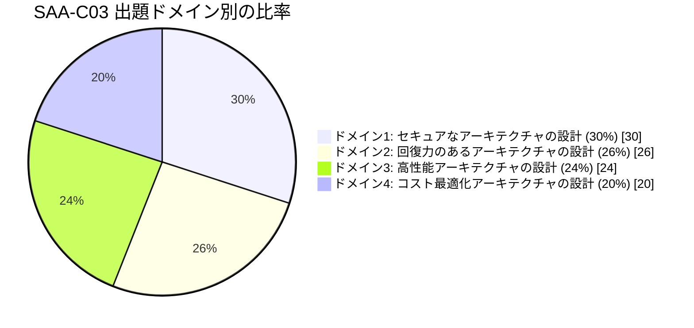

### 0.2 ドメイン2の2つのタスク

AWS公式試験ガイドでは、ドメイン2は以下の2つのタスクステートメントに分かれています。

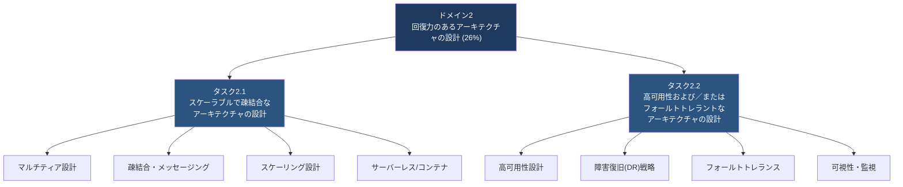

本ガイドはこの2タスクの構成に沿って、初級者でも理解できるようステップバイステップで解説していきます。

---

## 1. タスク2.1: スケーラブルで疎結合なアーキテクチャの設計

### 1.1 マルチティア（多層）アーキテクチャの基本

**なぜ必要か**: 1台のサーバーにすべての処理（画面表示・業務ロジック・データ保存）を詰め込むと、負荷が増えたときにサーバー全体を止めてスケールアップするしかなく、可用性もスケーラビリティも低くなります。マルチティアアーキテクチャは、役割ごとにサーバー群（ティア）を分離することで、各層を独立してスケール・保守できるようにする設計です。

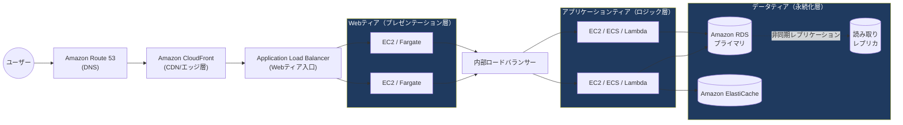

**各層の役割**

| ティア | 役割 | 代表サービス |
|---|---|---|
| プレゼンテーション層 | ユーザーからのリクエストを受け取り画面を返す | CloudFront, ALB, EC2, S3(静的ホスティング) |
| アプリケーション層 | ビジネスロジックの実行 | EC2, ECS/EKS, Lambda, API Gateway |
| データ層 | データの永続化・キャッシュ | RDS, DynamoDB, ElastiCache, EFS |

**ベストプラクティス**
- 各ティアはセキュリティグループ／サブネットで分離し、最小権限で通信させる（Webティアのみインターネット向け、データ層はプライベートサブネットに配置）。
- 層と層の間は疎結合にし、片方の層の障害・スケーリングがもう片方に直接影響しないようにする（詳細は次節）。
- 各ティアを独立した Auto Scaling グループ／サービスとして構成し、負荷特性に応じて個別にスケールできるようにする。

出典: [AWS Well-Architected Framework - Reliability Pillar](https://docs.aws.amazon.com/wellarchitected/latest/reliability-pillar/welcome.html)

---

### 1.2 疎結合アーキテクチャとメッセージング（SQS / SNS / EventBridge）

**密結合の問題点**: あるコンポーネントが別のコンポーネントを直接同期呼び出しする設計（密結合）では、呼び出し先が遅い・落ちているとリクエスト全体が失敗し、障害が連鎖的に広がります（カスケード障害）。**疎結合**では、コンポーネント間にキューやイベントバスのような緩衝材を挟み、互いの可用性やスケーリング状況に依存しない設計にします。

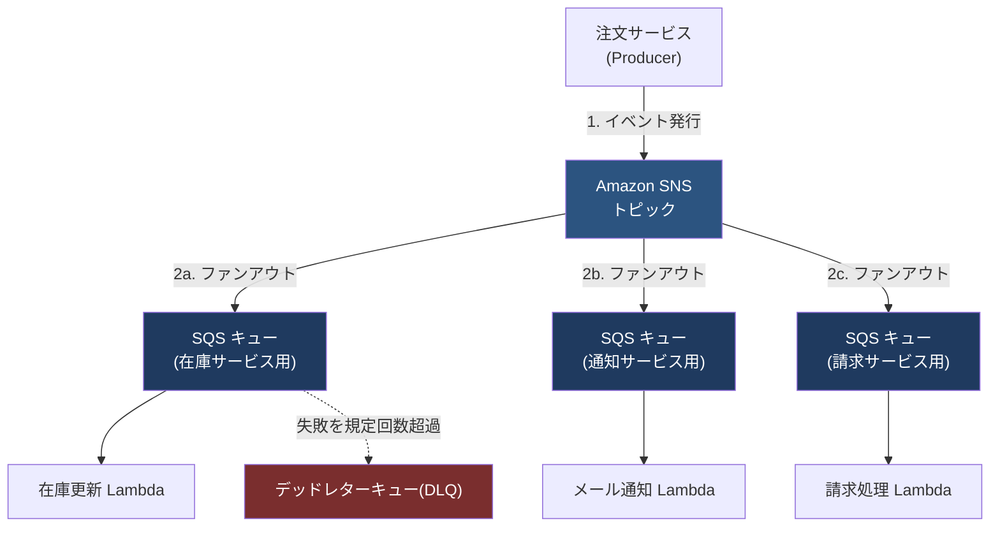

**主要サービスの役割**

| サービス | モデル | 特徴 |
|---|---|---|
| Amazon SQS | キュー（Point-to-Point） | メッセージを一時的に保持。Producer と Consumer の処理速度差を吸収するバッファ。可視性タイムアウト・DLQ・遅延キューをサポート |
| Amazon SNS | Pub/Sub（Publish/Subscribe） | 1つのメッセージを複数のサブスクライバーに同時配信（ファンアウト） |
| Amazon EventBridge | イベントバス | 複数の AWS サービスや SaaS からのイベントをルールに基づき多数のターゲットにルーティング。スキーマレジストリも提供 |

**ベストプラクティス**
- SQS の可視性タイムアウトは、Consumer の平均処理時間より長く設定する（処理中に他のワーカーが同じメッセージを取得しないようにする）。
- 一定回数処理に失敗したメッセージは **デッドレターキュー(DLQ)** に退避させ、失敗したメッセージでキューが詰まる（ポイズンメッセージ問題）のを防ぐ。
- 1つの発行元から複数の購読者に同時配信したい場合は SNS + SQS のファンアウトパターンを使う。
- 複数のイベントソース・多様なターゲットへの複雑なルーティングが必要な場合は EventBridge を検討する。
- 疎結合にすることで、各コンポーネントを個別に Auto Scaling でき、あるコンポーネントの障害が他に伝播しにくくなる。

出典: [SNS or SQS or EventBridge 選択ガイド](https://docs.aws.amazon.com/decision-guides/latest/sns-or-sqs-or-eventbridge/sns-or-sqs-or-eventbridge.html) / [Publish-subscribe パターン (Prescriptive Guidance)](https://docs.aws.amazon.com/prescriptive-guidance/latest/cloud-design-patterns/publish-subscribe.html)

---

### 1.3 API の作成・公開・管理（Amazon API Gateway）

API Gateway は、バックエンド（Lambda、EC2、他の AWS サービス、オンプレミス等）への「フロントドア」として、REST/HTTP/WebSocket API を作成・公開・保護・監視するためのフルマネージドサービスです。

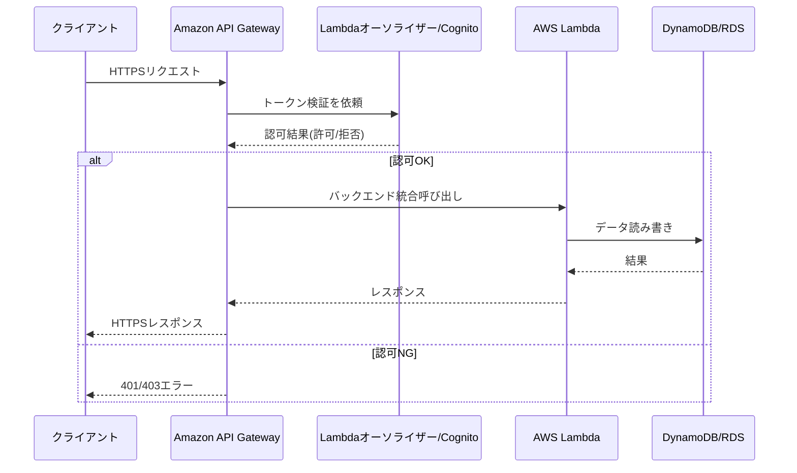

**REST API と HTTP API の比較**

| 項目 | REST API | HTTP API |
|---|---|---|
| 機能セット | フル機能（APIキー、リクエストバリデーション、WAF統合、キャッシュ等） | 軽量・低コスト（プロキシ機能中心） |
| コスト | 相対的に高い | REST APIより低コスト |
| 用途 | 高度なAPI管理機能が必要な場合 | シンプルなプロキシ／低レイテンシが目的の場合 |

**ベストプラクティス**
- スロットリング（レート制限・バーストリミット）を設定し、バックエンドをトラフィック急増から保護する。
- レスポンスキャッシュを有効化し、頻繁に呼ばれる同一リクエストへのバックエンド負荷を減らす。
- IAM、Lambda オーソライザー、Amazon Cognito ユーザープールなどで認証・認可を必ず実装する。
- Amazon CloudWatch と統合してAPI呼び出し数・レイテンシ・エラー率を監視する。

出典: [Amazon API Gateway とは](https://docs.aws.amazon.com/apigateway/latest/developerguide/welcome.html) / [REST APIとHTTP APIの選択](https://docs.aws.amazon.com/apigateway/latest/developerguide/http-api-vs-rest.html)

---

### 1.4 水平スケーリングと垂直スケーリング（Amazon EC2 Auto Scaling）

**垂直スケーリング（スケールアップ／ダウン）**: インスタンスタイプを大きく（または小さく）することでリソースを増減させる方式。単純だが上限があり、変更時にダウンタイムが生じやすい。

**水平スケーリング（スケールアウト／イン）**: インスタンスの「台数」を増減させる方式。台数を分散させることで単一障害点を減らしつつ需要に追従できる、クラウドネイティブなスケーリング手法です。

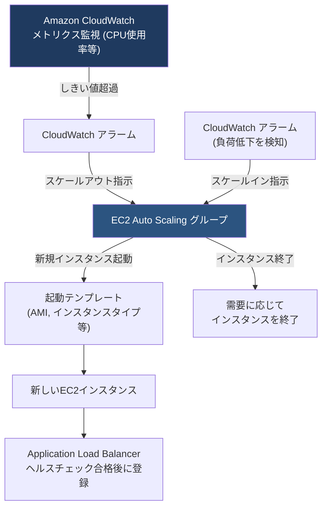

**Auto Scaling の主要スケーリングポリシー**

| ポリシー種別 | 説明 |
|---|---|
| ターゲット追跡スケーリング | CPU使用率など特定メトリクスを目標値に維持するよう自動調整（推奨・最も簡単） |
| ステップスケーリング | アラームの逸脱幅に応じて段階的にスケール量を変える |
| シンプルスケーリング | 単一の増減幅でスケール（旧世代の方式） |
| スケジュールスケーリング | 予測できる負荷パターン（毎朝9時など）に合わせて事前にスケール |

**ベストプラクティス**
- 複数の Availability Zone にまたがって Auto Scaling グループを構成し、AZ障害時にも自動復旧できるようにする。
- ヘルスチェック（EC2 + ELB）を有効にし、不健全なインスタンスを自動的に入れ替える。
- ウォームプールやライフサイクルフックを使い、起動時間の長いアプリケーションでも迅速にスケールできるようにする。
- 垂直スケーリングは根本的な上限があるため、可用性・回復性の観点では水平スケーリングを優先する設計が推奨される。

出典: [Amazon EC2 Auto Scaling とは](https://docs.aws.amazon.com/autoscaling/ec2/userguide/what-is-amazon-ec2-auto-scaling.html) / [スケーリングプランのベストプラクティス](https://docs.aws.amazon.com/autoscaling/plans/userguide/best-practices-for-scaling-plans.html)

---

### 1.5 ロードバランシングの概念（ALB / NLB / GWLB）

Elastic Load Balancing (ELB) は複数のターゲットにトラフィックを分散し、単一障害点を排除しながら可用性を高めるサービスです。用途に応じて3種類のロードバランサーを使い分けます。

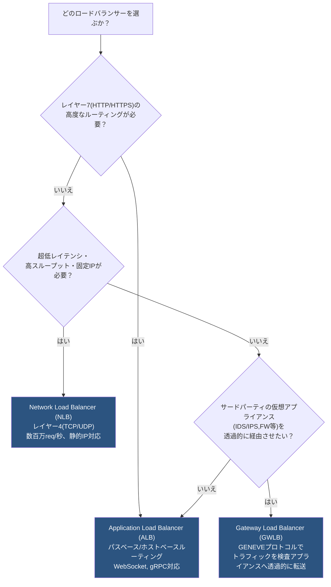

| 種別 | レイヤー | 主なユースケース |
|---|---|---|
| Application Load Balancer (ALB) | L7 | Webアプリ、マイクロサービス、コンテナ、パス/ホストベースルーティング |
| Network Load Balancer (NLB) | L4 | 超高スループット、低レイテンシ、TCP/UDPベースのアプリ、固定IP要件 |
| Gateway Load Balancer (GWLB) | L3/GENEVE | ファイアウォールやIDS/IPSなどセキュリティアプライアンスへの透過的なトラフィック転送 |

**ベストプラクティス**
- ロードバランサー自体は複数AZにまたがる形でデプロイし、クロスゾーン負荷分散を有効化する。
- ALB / NLB のヘルスチェックを適切な間隔・しきい値で設定し、不健全なターゲットに即座にトラフィックを送らないようにする。
- ロードバランサーを Auto Scaling グループと組み合わせることで、需要に応じたスケーラブルかつ高可用なフロントエンドを構築する。

出典: [EKS ベストプラクティス - ロードバランシング](https://docs.aws.amazon.com/eks/latest/best-practices/load-balancing.html)

---

### 1.6 キャッシング戦略（Amazon CloudFront / ElastiCache / DAX）

キャッシュは「よく使われるデータ」をオリジンより近い場所・高速な媒体に一時保存することで、レイテンシ削減とバックエンド負荷の軽減を同時に実現する、パフォーマンスと回復性の両面で重要な技術です。

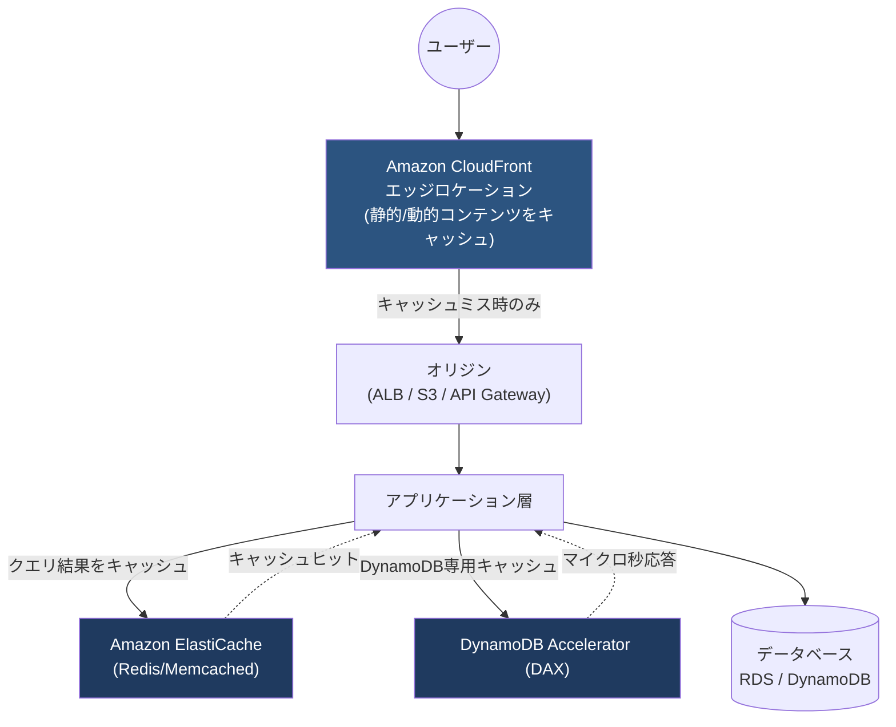

| サービス | キャッシュ対象 | 特徴 |
|---|---|---|
| Amazon CloudFront | 静的/動的コンテンツ、API応答 | 世界中のエッジロケーションでユーザーに最も近い場所から配信、オリジン負荷を大幅軽減 |
| Amazon ElastiCache (Redis/Memcached) | DBクエリ結果、セッション情報等 | インメモリで数ミリ秒未満の応答、アプリ層とDB層の間に設置 |
| DynamoDB Accelerator (DAX) | DynamoDBの読み取り結果 | マイクロ秒単位の応答、DynamoDB API互換でコード変更が少ない |

**ベストプラクティス**
- 静的アセット（画像・CSS・JS）は CloudFront で積極的にキャッシュし、TTL（有効期限）を適切に設定する。
- セッション情報など「ステートフルなデータ」はアプリケーションサーバーではなく ElastiCache のような外部ストアに保持し、アプリ層をステートレスにする（1.9節参照）。
- キャッシュ更新（無効化）戦略を設計段階で決めておく（Cache-Aside、Write-Through等）。
- キャッシュはパフォーマンス向上だけでなく、バックエンドDBへの負荷集中を防ぎ、結果的にDB層の可用性・回復性向上にも寄与する。

出典: [AWS Caching Solutions](https://aws.amazon.com/caching/aws-caching/)

---

### 1.7 サーバーレス技術とコンピューティングオプションの選択

サーバーレスとは、サーバーのプロビジョニングやパッチ適用、スケーリング管理を AWS 側に任せ、開発者がコードとビジネスロジックに集中できるモデルです。回復性の観点では、サーバー管理を排除することで人為的ミスによる障害要因を減らせる利点があります。

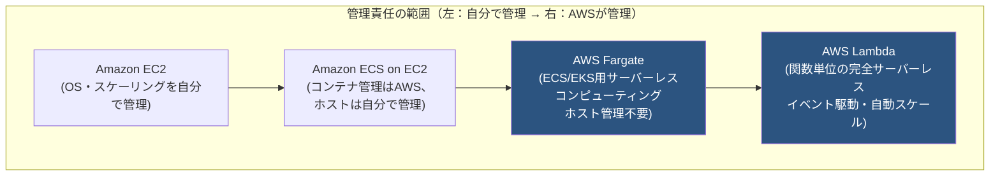

**Lambda と Fargate の使い分け**

| 観点 | AWS Lambda | AWS Fargate |
|---|---|---|
| 適した処理 | イベント駆動・短時間実行のタスク | 長時間実行、複雑な複数サービス構成 |
| 起動単位 | 関数（リクエストごとに環境をプロビジョニング） | タスク/Pod単位でコンテナを起動 |
| 実行時間の制約 | 最大15分 | 制約なし（長時間稼働可能） |
| スケーリング | リクエスト数に応じ自動・瞬時 | ECS/EKSのオートスケーリング設定に依存 |

**ベストプラクティス**
- 単純なイベント処理（画像リサイズ、APIバックエンドの一部処理等）は Lambda を検討する。
- 常駐が必要な複雑なアプリケーションやマイクロサービスは Fargate（サーバーレスコンテナ）を検討し、EC2インスタンスの管理負担を減らす。
- サーバーレス化によって「単一のEC2インスタンス障害」という単一障害点を根本的に排除できる点が、回復性向上の観点で重要。

出典: [Fargate or Lambda 選択ガイド](https://docs.aws.amazon.com/decision-guides/latest/fargate-or-lambda/fargate-or-lambda.html) / [AWS Fargate](https://aws.amazon.com/fargate/)

---

### 1.8 コンテナの移行とオーケストレーション（Amazon ECS / Amazon EKS）

コンテナは、アプリケーションとその依存関係をパッケージ化し、環境に依存せず一貫して動作させる技術です。AWS ではコンテナの実行・管理（オーケストレーション）のために ECS と EKS の2つのマネージドサービスを提供しています。

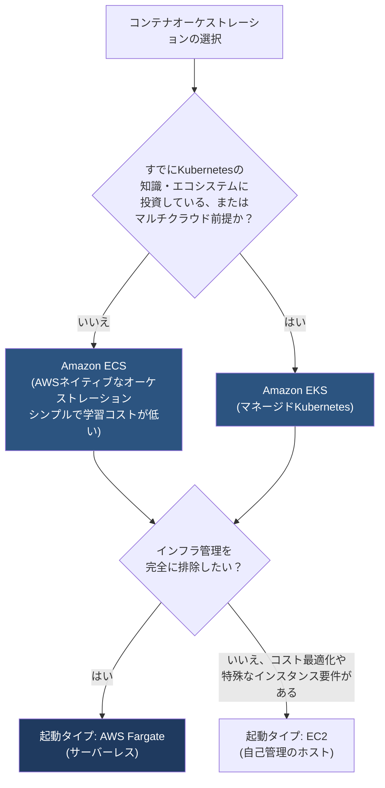

**ベストプラクティス**
- タスク／Podは複数のAZに分散配置し、単一AZ障害時にもサービスを継続できるようにする。
- コンテナは「イミュータブル（不変）」に扱い、変更が必要な場合は新しいイメージをビルドしてデプロイする（1.20節/2.4節で詳述）。
- ローリングアップデートやBlue/Greenデプロイと組み合わせ、更新時のダウンタイムを回避する。
- 既存のオンプレミスアプリケーションをコンテナ化して移行する場合は AWS App2Container のようなツールでの移行も選択肢となる。

出典: [Amazon ECS とは](https://docs.aws.amazon.com/AmazonECS/latest/developerguide/Welcome.html) / [AWSコンテナサービスの選択ガイド](https://docs.aws.amazon.com/decision-guides/latest/containers-on-aws-how-to-choose/choosing-aws-container-service.html)

---

### 1.9 マイクロサービス設計原則：ステートレス vs ステートフル

**ステートフルなアプリケーション**は、セッション情報やユーザーの状態をサーバー自身のメモリ／ディスクに保持します。この場合、そのユーザーは常に「同じサーバー」に接続し続ける必要があり（スティッキーセッション）、そのサーバーが落ちると状態を失い、スケールアウトも困難になります。

**ステートレスなアプリケーション**は、状態を一切保持せず、外部の共有ストア（ElastiCache、DynamoDB等）に状態を移すことで、**どのサーバーに接続してもリクエストを処理できる**ようにする設計です。これは水平スケーリング・自己修復（Auto Scaling による自動置き換え）を実現するための基盤となる考え方です。

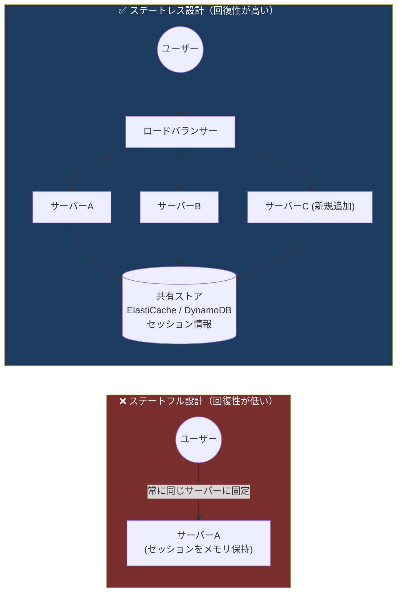

**ベストプラクティス**
- セッション状態は ElastiCache（Redis）や DynamoDB のような外部の耐久性あるストアに保存する。
- アプリケーションサーバーのローカルディスクに重要なデータを保存しない（インスタンス終了とともに失われるため）。
- ステートレス設計により、任意のサーバーが障害を起こしても Auto Scaling が別のサーバーに置き換えるだけで、ユーザー体験への影響を最小化できる。

出典: [AWS Well-Architected Framework - Reliability Pillar](https://docs.aws.amazon.com/wellarchitected/latest/reliability-pillar/welcome.html)

---

### 1.10 イベント駆動アーキテクチャとワークフローオーケストレーション（AWS Step Functions）

複数のサービスが連携する処理では、**イベント駆動（Choreography）** と **オーケストレーション（Orchestration）** という2つの制御スタイルがあります。

- **Choreography（振り付け型）**: 各サービスがイベントを発行し合い、中央の管理者なしに連鎖的に処理が進む（EventBridge等を利用）。疎結合だが、全体のフローの見通しは悪くなりがち。
- **Orchestration（オーケストレーション型）**: 中央のワークフローエンジン（AWS Step Functions）が各ステップの実行順序・リトライ・エラー処理を明示的に管理する。

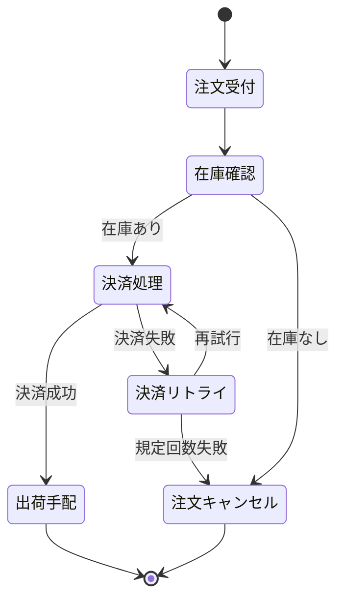

**ベストプラクティス**
- 複数ステップにまたがる長時間処理・複雑な条件分岐・エラーハンドリングが必要な場合は Step Functions によるオーケストレーションを検討する。
- Step Functions の **Standard ワークフロー**（長時間実行・厳密な実行回数保証が必要な場合）と **Express ワークフロー**（高頻度・短時間のイベント処理に最適化）を用途に応じて使い分ける。
- Step Functions は AWS X-Ray と統合してワークフロー全体のトレースを可視化できる（2.8節参照）。

出典: [AWS Step Functions と X-Ray の統合](https://docs.aws.amazon.com/step-functions/latest/dg/concepts-xray-tracing.html)

---

### 1.11 ストレージタイプの選択（オブジェクト／ブロック／ファイルストレージ）

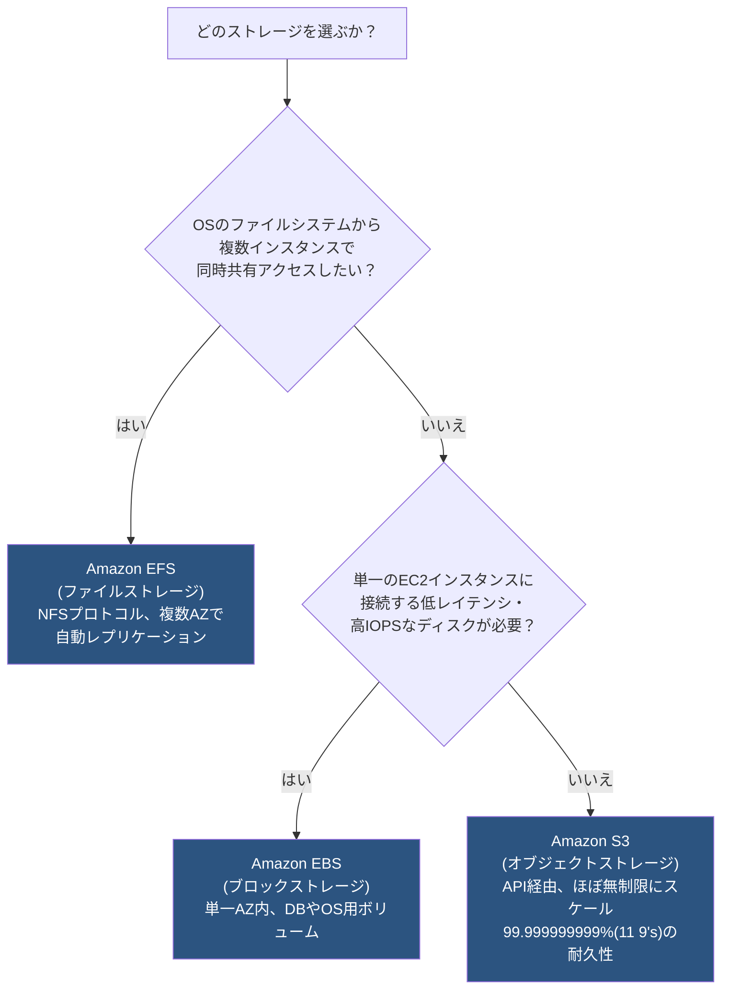

| 種別 | サービス例 | スコープ | 主な用途 |
|---|---|---|---|
| オブジェクトストレージ | Amazon S3 | リージョン内で自動的に複数AZへ複製 | 静的コンテンツ、バックアップ、データレイク、ログ保管 |
| ブロックストレージ | Amazon EBS | 単一AZ、単一インスタンスに接続（Multi-Attach可） | データベースのデータボリューム、OSブートボリューム |
| ファイルストレージ | Amazon EFS | リージョン内で複数AZ、複数インスタンス共有 | 複数サーバーで共有するファイル領域、コンテンツ管理システム |

**ベストプラクティス**
- 大量の非構造化データ（画像・動画・ログ・バックアップ）は S3 に保存し、ストレージクラス（Standard, IA, Glacier等）でコストと耐久性のバランスを取る。
- データベースなど高いIOPSと低レイテンシが必要なワークロードは EBS（Provisioned IOPS等）を使用する。
- 複数のコンテナ／インスタンスから同じファイルに同時アクセスする必要がある場合は EFS を選択する。

出典: [Amazon S3 ストレージクラス概要](https://docs.aws.amazon.com/AmazonS3/latest/userguide/storage-class-intro.html) / [Amazon EFS を選ぶべき時](https://aws.amazon.com/efs/when-to-choose-efs/)

---

### 1.12 リードレプリカによる読み取りスケーリング

Amazon RDS の **リードレプリカ** は、プライマリDBインスタンスの変更を非同期でコピーした「読み取り専用」のインスタンスです。読み取りが多いワークロードで、読み取りトラフィックをレプリカに逃がすことでプライマリの負荷を軽減し、スケーラビリティを高めます（同一リージョン内・クロスリージョンの両方が可能）。

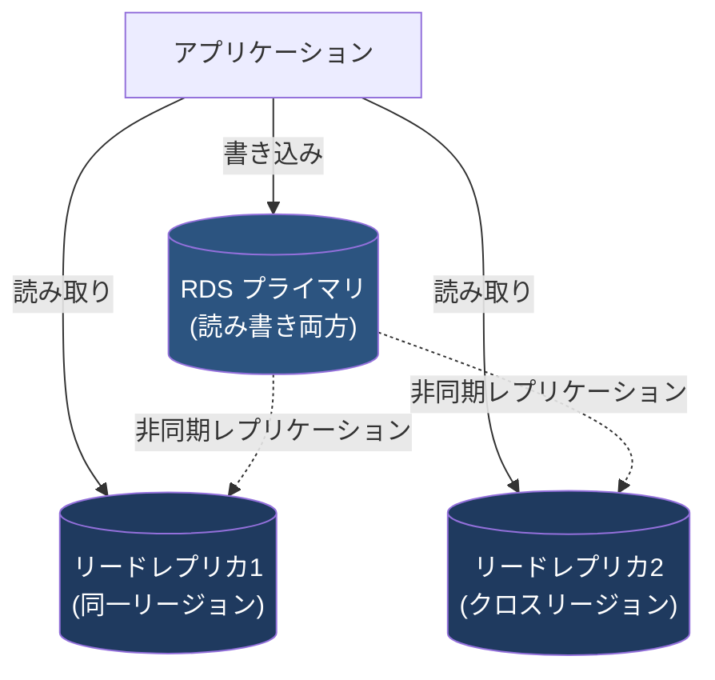

**ベストプラクティス**
- リードレプリカはあくまで「読み取りスケーリング」が主目的であり、レプリケーションが非同期のため、障害復旧の主手段としては Multi-AZ 配置（2.2節参照）と役割を分けて考える。
- クロスリージョンのリードレプリカは、読み取り性能向上に加えてディザスタリカバリの補助（プライマリへ昇格させる）としても活用できる。
- レプリカ数が増えるとレプリケーションラグが発生しうるため、アプリケーション側で結果整合性を許容できるかを設計時に検討する。

出典: [Amazon RDS リードレプリカの利用](https://docs.aws.amazon.com/AmazonRDS/latest/UserGuide/USER_ReadRepl.html)

---

## 2. タスク2.2: 高可用性・フォールトトレラントなアーキテクチャの設計

### 2.1 AWSグローバルインフラストラクチャ（リージョン・アベイラビリティゾーン）

高可用性設計の出発点は、AWSの物理的なインフラ構造を理解することです。

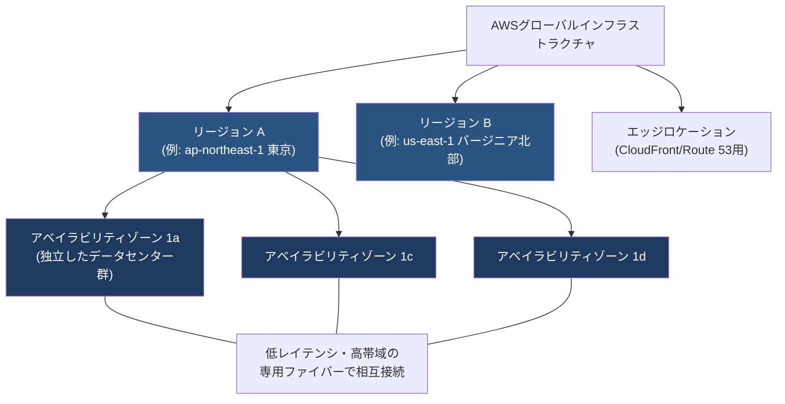

**重要な設計原則**
- 各リージョンは最低3つの、物理的に離れた（が低レイテンシで接続された）AZで構成されており、1つのAZで火災・洪水・電源障害が起きても他のAZは影響を受けない設計。
- リージョンは互いに完全に独立しているため、単一リージョンの大規模障害から保護するにはマルチリージョン設計（2.2節）が必要になる。
- ワークロードを単一AZに閉じずに複数AZへ分散配置することが、高可用性設計の最も基本的かつ重要な手段。

**ベストプラクティス**
- 本番ワークロードは最低2つ、理想的には3つ以上のAZにまたがって配置する。
- Auto Scaling グループ、RDS Multi-AZ、複数AZにまたがるELBなど、マルチAZをネイティブサポートするサービスを積極的に利用する。

出典: [AWS リージョンとアベイラビリティゾーン](https://docs.aws.amazon.com/global-infrastructure/latest/regions/aws-regions-availability-zones.html) / [AWS グローバルインフラストラクチャ](https://aws.amazon.com/about-aws/global-infrastructure/regions_az/)

---

### 2.2 障害復旧（ディザスタリカバリ）戦略と RPO / RTO

**RPO（目標復旧時点: Recovery Point Objective）**: 障害発生時に許容できる「データ損失の最大時間」。例えば RPO=1時間なら、直近1時間分のデータ損失までは許容される。

**RTO（目標復旧時間: Recovery Time Objective）**: 障害発生からサービスを復旧させるまでに許容できる「最大時間」。

AWSでは、コストとRTO/RPOのトレードオフに応じて主に4つのDR戦略が定義されています。

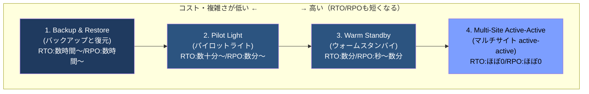

**各戦略の解説**

| 戦略 | 概要 | 平常時のセカンダリリージョンの状態 |
|---|---|---|
| Backup & Restore | データを定期的にバックアップし、障害時に別リージョンでリソースを新規作成して復元 | リソース稼働なし（最も低コスト） |
| Pilot Light | 中核となるデータベース等は常時レプリケーションしておくが、アプリケーション層は最小限（起動していない、または最小サイズ） | DBのみ起動、その他は停止 |
| Warm Standby | 縮小版ながら本番と同じ構成のスタックを常時稼働させておき、障害時にスケールアップして切り替え | フルスタックが縮小規模で常時稼働 |
| Multi-Site Active-Active | 複数リージョンで同時にフル本番トラフィックを処理し、片方が落ちてももう片方が即座に引き継ぐ | フル規模で常時稼働・トラフィック処理中 |

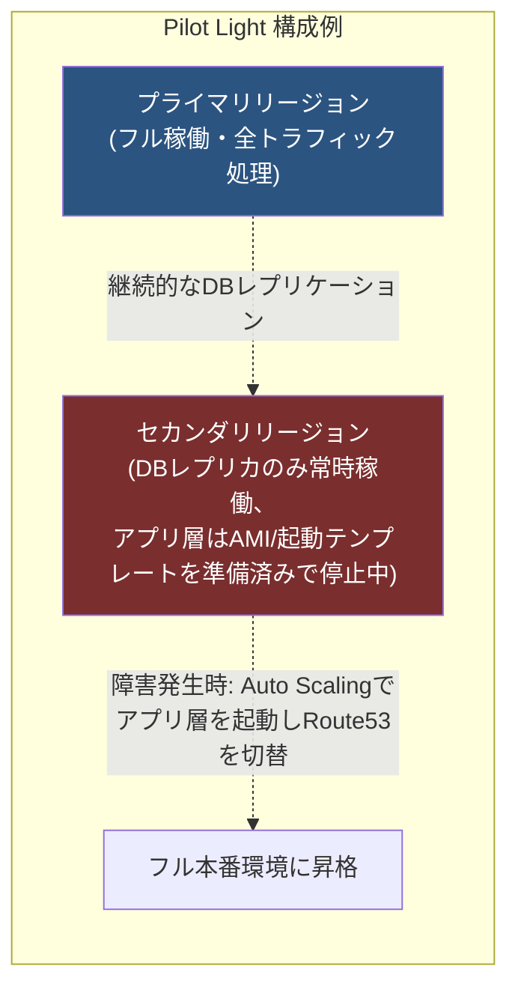

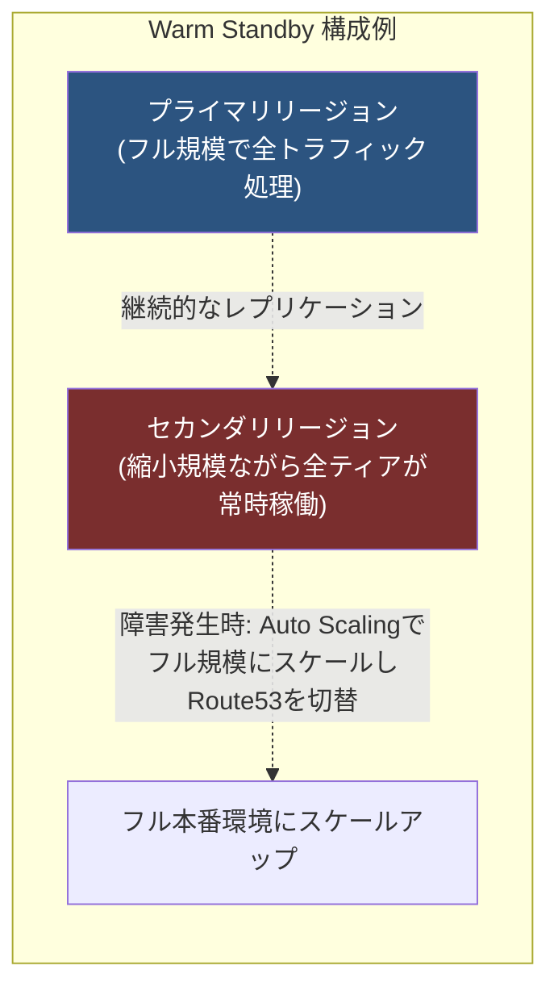

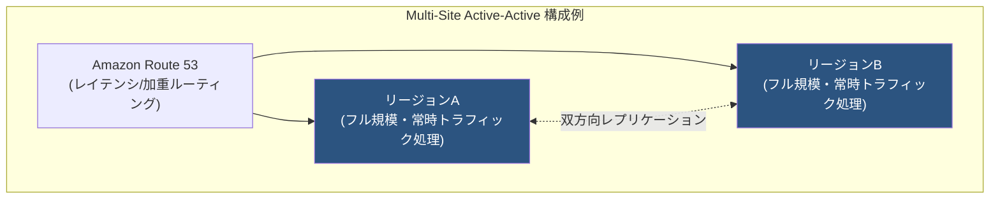

**ベストプラクティス**
- ビジネス要件（許容できるダウンタイム・データ損失量）から逆算してRTO/RPOを定義し、それに見合った戦略を選ぶ（過剰な戦略はコスト増、過小な戦略はビジネスリスク増）。
- DR戦略は定期的に **実際にフェイルオーバーの訓練（ゲームデー等）** を行い、机上の設計だけで終わらせない。
- Backup & Restore ではバックアップの保存先（S3クロスリージョンレプリケーション等）と復元手順の自動化（CloudFormation/Terraform）が重要。

出典: [AWS ディザスタリカバリー戦略ホワイトペーパー](https://docs.aws.amazon.com/whitepapers/latest/disaster-recovery-workloads-on-aws/disaster-recovery-options-in-the-cloud.html) / [Reliability Pillar - 障害復旧の計画](https://docs.aws.amazon.com/wellarchitected/latest/reliability-pillar/rel_planning_for_recovery_disaster_recovery.html) / [DRアーキテクチャ Part III: Pilot Light & Warm Standby](https://aws.amazon.com/blogs/architecture/disaster-recovery-dr-architecture-on-aws-part-iii-pilot-light-and-warm-standby) / [DRアーキテクチャ Part IV: Multi-Site Active-Active](https://aws.amazon.com/blogs/architecture/disaster-recovery-dr-architecture-on-aws-part-iv-multi-site-active-active/)

---

### 2.3 フェイルオーバー戦略（Amazon Route 53 ルーティングポリシー）

Amazon Route 53 は、ヘルスチェックと組み合わせることで、障害が起きたエンドポイントから自動的に正常なエンドポイントへトラフィックを切り替える（フェイルオーバー）ことができるDNSサービスです。

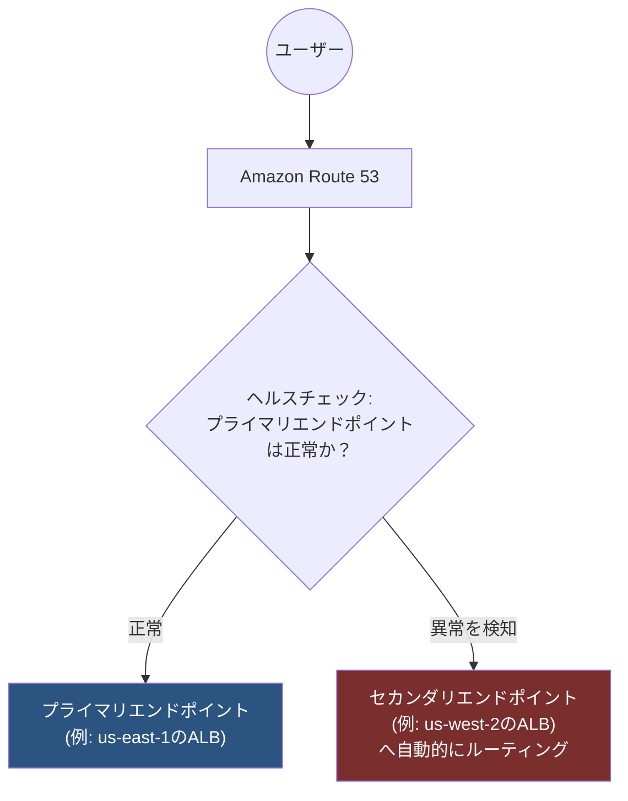

**代表的なルーティングポリシー**

| ポリシー | 説明 |
|---|---|
| シンプル | 単一リソースへの基本的なルーティング |
| 加重（Weighted） | 指定した比率でトラフィックを複数リソースに振り分け（Blue/Greenやカナリアに活用） |
| レイテンシベース | ユーザーから見て最もレイテンシが低いリージョンにルーティング |
| フェイルオーバー | ヘルスチェック結果に基づきプライマリ/セカンダリを自動切替 |
| 地理位置情報 | ユーザーの地理的位置に基づきルーティング（コンプライアンス要件等） |
| 複数値回答 | 複数の正常なIPをランダムに返す（簡易的な負荷分散） |

**ベストプラクティス**
- ヘルスチェックはアプリケーションの実際の状態（単なるTCP疎通ではなく、DB接続を含むエンドポイント応答等）を反映するよう設計する。
- フェイルオーバールーティングと、2.2節のDR戦略（Pilot Light / Warm Standby / Active-Active）を組み合わせて、実際に切替が発動する仕組みを構築する。
- TTL（Time To Live）を適切に短く設定し、フェイルオーバー発生時にDNS変更が速やかにクライアントへ反映されるようにする。

出典: [Route 53 DNSフェイルオーバーの仕組み](https://docs.aws.amazon.com/Route53/latest/DeveloperGuide/dns-failover.html) / [DNSフェイルオーバーの構成パターン](https://docs.aws.amazon.com/Route53/latest/DeveloperGuide/dns-failover-types.html)

---

### 2.4 分散設計パターンとイミュータブルインフラストラクチャ

**イミュータブル（不変）インフラストラクチャ**とは、本番稼働中のサーバーに対して直接パッチ適用や設定変更を行わず、変更が必要な場合は新しいインフラを構築してデプロイし、検証後にトラフィックを切り替えるという設計モデルです。これにより「設定ドリフト（環境ごとの差異の蓄積）」を防ぎ、デプロイの信頼性を高めます。

```mermaid
flowchart TD
    Start["新バージョンのデプロイが必要"] --> Build["新しいAMI/コンテナイメージを<br/>ビルド(Blue環境とは別に)"]
    Build --> Green["Green環境<br/>(新バージョン)を<br/>新しいAuto Scalingグループで起動"]
    Green --> Test["Green環境をテスト・検証"]
    Test -->|問題なし| Switch["Route 53 の加重ルーティングまたは<br/>ELBの向き先を切り替え<br/>トラフィックをGreenへ"]
    Test -->|問題あり| Rollback["Blue環境のまま維持<br/>(Greenは破棄)"]
    Switch --> Monitor["監視: 問題があれば<br/>即座にBlueへロールバック"]
    Monitor --> Decommission["問題なければ<br/>旧Blue環境を終了"]

    style Green fill:#2c5480,color:#fff
    style Switch fill:#7c9eff,color:#000
```

**ベストプラクティス**
- AWS CodeDeploy や AWS Elastic Beanstalk の Blue/Green デプロイ機能を活用し、切替とロールバックを自動化する。
- カナリアデプロイ（一部トラフィックのみ新バージョンに向ける）と組み合わせ、影響範囲を限定しながら段階的に展開する。
- イミュータブルなデプロイは「デプロイは成功するか、何も変わらないか（部分的な中途半端な状態にならない）」という信頼性を提供する。

出典: [REL08-BP04 イミュータブルインフラストラクチャによるデプロイ](https://docs.aws.amazon.com/wellarchitected/latest/framework/rel_tracking_change_management_immutable_infrastructure.html)

---

### 2.5 プロキシ概念によるデータベース回復性の向上（Amazon RDS Proxy）

アプリケーションが大量の同時接続をデータベースに直接張ると、DB側の接続数上限を圧迫し、特にLambdaのようにスケール時に接続数が急増するアーキテクチャでは問題が顕在化しやすくなります。**Amazon RDS Proxy** はアプリケーションとRDS/Auroraの間に立つ完全マネージドのコネクションプーラーで、接続を効率的にプール・再利用し、DBフェイルオーバー時の切替も高速化します。

```mermaid
flowchart LR
    subgraph Clients["大量の同時クライアント"]
        L1["Lambda 実行環境 x 100+"]
    end
    Clients -->|多数の短命な接続| Proxy["Amazon RDS Proxy<br/>(コネクションプーリング)"]
    Proxy -->|少数の安定した接続| DB[("RDS / Aurora<br/>プライマリ")]
    DB -.フェイルオーバー発生.-> Standby[("スタンバイ<br/>インスタンス")]
    Proxy -.フェイルオーバーを自動検知し<br/>透過的に新プライマリへ再接続.-> Standby

    style Proxy fill:#2c5480,color:#fff
```

**ベストプラクティス**
- Lambda など接続数が急増しやすいサーバーレスアーキテクチャでは RDS Proxy の利用を検討し、DBの「too many connections」エラーを防ぐ。
- RDS Proxy はフェイルオーバー時の接続切替を高速化するため、アプリケーション側での複雑な再接続ロジックの実装が不要になり、可用性向上に寄与する。
- IAM認証と組み合わせることでDB認証情報の管理も簡素化できる。

出典: [Amazon RDS Proxy とは](https://docs.aws.amazon.com/AmazonRDS/latest/UserGuide/rds-proxy.html)

---

### 2.6 ストレージの耐久性とレプリケーション設計

「耐久性（Durability）」と「可用性（Availability）」は似て非なる概念です。**耐久性**は「データが失われない確率」、**可用性**は「必要なときにアクセスできる確率」を指します。

```mermaid
flowchart TD
    S3Obj["S3オブジェクト<br/>アップロード"] --> AZ1s["AZ 1に複製"]
    S3Obj --> AZ2s["AZ 2に複製"]
    S3Obj --> AZ3s["AZ 3に複製"]
    AZ1s & AZ2s & AZ3s --> Result["99.999999999%<br/>(イレブンナイン)の年間耐久性<br/>= 1000万個のオブジェクトを<br/>1万年保管して平均1個を失う程度"]

    style Result fill:#2c5480,color:#fff
```

**ベストプラクティス**
- Amazon S3 は標準（Standard）ストレージクラスで、最低3つのAZにまたがってオブジェクトを冗長化し、単一AZの喪失を想定した耐久性設計になっている（S3 One Zone-IAは単一AZのみのためコストは下がるが耐久性は劣る）。
- リージョン全体の障害に備える場合は、S3のクロスリージョンレプリケーション（CRR）でデータを別リージョンにも複製する。
- 誤削除・ランサムウェア対策として、S3のバージョニングとMFA Delete、Object Lock（WORM）を組み合わせる。
- EBSボリュームは単一AZに紐づくため、EBSスナップショットをS3（リージョンサービス）に定期取得することで、AZ障害からのデータ保護を行う。

出典: [Amazon S3 のデータ保護（耐久性）](https://docs.aws.amazon.com/AmazonS3/latest/userguide/DataDurability.html)

---

### 2.7 サービスクォータとスロットリングを考慮した設計

**サービスクォータ（旧称: 制限/limits）**は、AWSアカウントで作成・利用できるリソースの上限値です。**スロットリング**は、APIリクエストの「頻度」が一定を超えた場合にリクエストを拒否・遅延させる仕組みです。この2つを理解せずに設計すると、スケールした瞬間に予期しないエラーで障害が発生することがあります。

```mermaid
flowchart TD
    Design["アーキテクチャ設計"] --> Check["主要サービスの<br/>デフォルトクォータを事前に確認"]
    Check --> DR["DR用セカンダリリージョンの<br/>クォータも同様に確認・引き上げ申請"]
    DR --> Monitor["AWS Service Quotas /<br/>Trusted Advisor でクォータ使用率を監視"]
    Monitor --> Alarm["CloudWatchアラームで<br/>80%到達時に通知"]
    Alarm --> Increase["必要に応じて<br/>事前にクォータ引き上げをリクエスト"]

    style Check fill:#2c5480,color:#fff
    style Monitor fill:#1f3a5f,color:#fff
```

**ベストプラクティス**
- 固定的なクォータ（例: Lambdaのペイロードサイズ上限、API Gatewayのスロットルバーストレート）は変更できないため、アーキテクチャ側で制約を吸収する設計にする。
- DR用のセカンダリリージョンでも本番と同等のクォータが確保されているかを事前に確認する（フェイルオーバー時にクォータ不足で復旧できないという事態を防ぐ）。
- スロットリングエラーに対してはアプリケーション側で指数バックオフ・ジッターを用いたリトライを実装する。

出典: [Service Quotas とは](https://docs.aws.amazon.com/servicequotas/latest/userguide/intro.html) / [Reliability Pillar - サービスクォータの管理](https://docs.aws.amazon.com/wellarchitected/latest/reliability-pillar/rel_manage_service_limits_limits_considered.html)

---

### 2.8 ワークロードの可視性（AWS X-Ray による分散トレーシング）

マイクロサービス化・疎結合化が進むほど、「どのリクエストが、どのサービスで、なぜ遅い/失敗したのか」を追跡することが難しくなります。**AWS X-Ray** は分散システム全体をエンドツーエンドでトレースし、サービスマップとして可視化することで、ボトルネックや障害箇所の特定を容易にします。

```mermaid
flowchart LR
    Req["1つのユーザーリクエスト"] --> AG2["API Gateway"]
    AG2 --> L2["Lambda"]
    L2 --> DDB["DynamoDB"]
    L2 --> S3b["S3"]
    L2 --> Ext["外部API"]

    AG2 -.トレースセグメント送信.-> XRay["AWS X-Ray"]
    L2 -.トレースセグメント送信.-> XRay
    DDB -.トレースセグメント送信.-> XRay
    XRay --> Map["サービスマップとして可視化<br/>(どこで遅延/エラーが<br/>発生しているか一目瞭然)"]

    style XRay fill:#2c5480,color:#fff
    style Map fill:#7c9eff,color:#000
```

**ベストプラクティス**
- Lambda、ECS、EC2、API Gateway など主要コンポーネントに X-Ray SDK/エージェントを組み込み、アプリケーション全体を通したトレーシングを有効化する。
- 個々のサービスのログ・メトリクスだけでなく、リクエスト単位の「横断的な」可視性を持つことで、疎結合アーキテクチャにおける障害切り分け時間を短縮できる。
- Step Functions のワークフローとも統合し、ステートマシン全体の実行状況を追跡できる。

出典: [AWS X-Ray とは](https://docs.aws.amazon.com/xray/latest/devguide/aws-xray.html)

---

### 2.9 レガシー・クラウド非対応アプリケーションの信頼性向上

すべてのアプリケーションが最初からクラウドネイティブに設計されているわけではありません。既存のモノリシックなアプリケーションや、リファクタリングが困難なレガシーシステムでも、以下のようなAWSサービスを組み合わせることで、大きくコードを変えずに回復性を向上できます。

| 課題 | 対応するAWSの仕組み |
|---|---|
| アプリケーションがスケールしない | Application Load Balancer + Auto Scaling グループ配下に配置 |
| DBの直接接続数が多くフェイルオーバーに弱い | Amazon RDS Proxy を挟んでコネクションプーリング（2.5節） |
| インフラ管理の負担が大きい | AWS Elastic Beanstalk でプラットフォーム管理を任せる |
| コンテナ化を進めたいが移行作業が大変 | AWS App2Container 等の移行支援ツールを活用 |
| 単一AZでしか稼働していない | Multi-AZ配置・EFSでの共有ストレージ化 |

**ベストプラクティス**
- 一足飛びに全面的な作り直し（リアーキテクト）を狙うのではなく、まずロードバランサー配下への移動・Multi-AZ化・RDS Proxyの導入など「変更コストが低く効果が高い」対策から段階的に適用する。
- Elastic Beanstalk のようなマネージドプラットフォームを使うことで、パッチ適用やスケーリングの設定をAWSに任せつつ、既存コードをほぼそのまま活用できる。

出典: [AWS Well-Architected Framework - Reliability Pillar](https://docs.aws.amazon.com/wellarchitected/latest/reliability-pillar/welcome.html)

---

## 3. まとめ：出題頻出ポイント チェックリスト

| # | チェック項目 | 関連キーワード |
|---|---|---|
| 1 | 疎結合の実現手段（SQS/SNS/EventBridge）の使い分けを説明できる | Point-to-Point, Pub/Sub, ファンアウト, DLQ |
| 2 | ステートレス設計の意味とセッションの外部化を説明できる | ElastiCache, DynamoDB, スティッキーセッション |
| 3 | ALB/NLB/GWLBの違いとユースケースを判別できる | L7/L4/L3, パスベースルーティング, 固定IP |
| 4 | 水平/垂直スケーリングの違いとAuto Scalingのポリシーを説明できる | ターゲット追跡, ステップスケーリング |
| 5 | S3/EBS/EFSの違い（オブジェクト/ブロック/ファイル）を判別できる | 11 9's耐久性, 単一AZ, マルチAZ共有 |
| 6 | RTO/RPOの定義と4つのDR戦略の違いを説明できる | Backup&Restore, Pilot Light, Warm Standby, Active-Active |
| 7 | Route 53のルーティングポリシー、特にフェイルオーバーの仕組みを説明できる | ヘルスチェック, 加重ルーティング |
| 8 | イミュータブルインフラ・Blue/Greenデプロイの利点を説明できる | 設定ドリフト, カナリアリリース |
| 9 | RDS Proxyの目的（コネクションプーリング、フェイルオーバー高速化）を説明できる | Lambda + RDS接続数問題 |
| 10 | サービスクォータとスロットリングの違い、DRリージョンでの考慮点を説明できる | Service Quotas, Trusted Advisor, 指数バックオフ |
| 11 | X-Rayによる分散トレーシングの目的を説明できる | サービスマップ, ボトルネック特定 |
| 12 | リードレプリカとMulti-AZの目的の違い（読み取りスケーリング vs 高可用性）を説明できる | 非同期レプリケーション, 同期レプリケーション |

---

## 4. 参考文献・出典一覧

- [SAA-C03 Exam Guide（試験ガイド全体）](https://docs.aws.amazon.com/aws-certification/latest/solutions-architect-associate-03/solutions-architect-associate-03.html)
- [SAA-C03 Domain 2 詳細（タスクステートメント）](https://docs.aws.amazon.com/aws-certification/latest/solutions-architect-associate-03/solutions-architect-associate-03-domain2.html)
- [AWS Well-Architected Framework - Reliability Pillar (Welcome)](https://docs.aws.amazon.com/wellarchitected/latest/reliability-pillar/welcome.html)
- [AWS Well-Architected Framework - Reliability (フレームワーク概要)](https://docs.aws.amazon.com/wellarchitected/latest/framework/reliability.html)
- [SNS or SQS or EventBridge 選択ガイド](https://docs.aws.amazon.com/decision-guides/latest/sns-or-sqs-or-eventbridge/sns-or-sqs-or-eventbridge.html)
- [Publish-Subscribe パターン (Prescriptive Guidance)](https://docs.aws.amazon.com/prescriptive-guidance/latest/cloud-design-patterns/publish-subscribe.html)
- [Amazon API Gateway とは](https://docs.aws.amazon.com/apigateway/latest/developerguide/welcome.html)
- [REST APIとHTTP APIの選択](https://docs.aws.amazon.com/apigateway/latest/developerguide/http-api-vs-rest.html)
- [Amazon EC2 Auto Scaling とは](https://docs.aws.amazon.com/autoscaling/ec2/userguide/what-is-amazon-ec2-auto-scaling.html)
- [スケーリングプランのベストプラクティス](https://docs.aws.amazon.com/autoscaling/plans/userguide/best-practices-for-scaling-plans.html)
- [Amazon EKS ベストプラクティス - ロードバランシング](https://docs.aws.amazon.com/eks/latest/best-practices/load-balancing.html)
- [AWS Caching Solutions（CloudFront/ElastiCache）](https://aws.amazon.com/caching/aws-caching/)
- [Fargate or Lambda 選択ガイド](https://docs.aws.amazon.com/decision-guides/latest/fargate-or-lambda/fargate-or-lambda.html)
- [AWS Fargate 製品ページ](https://aws.amazon.com/fargate/)
- [Amazon ECS とは](https://docs.aws.amazon.com/AmazonECS/latest/developerguide/Welcome.html)
- [AWSコンテナサービスの選択ガイド](https://docs.aws.amazon.com/decision-guides/latest/containers-on-aws-how-to-choose/choosing-aws-container-service.html)
- [AWS Step Functions と X-Ray の統合](https://docs.aws.amazon.com/step-functions/latest/dg/concepts-xray-tracing.html)
- [Amazon S3 ストレージクラス概要](https://docs.aws.amazon.com/AmazonS3/latest/userguide/storage-class-intro.html)
- [Amazon EFS を選ぶべき時](https://aws.amazon.com/efs/when-to-choose-efs/)
- [Amazon RDS リードレプリカの利用](https://docs.aws.amazon.com/AmazonRDS/latest/UserGuide/USER_ReadRepl.html)
- [AWS リージョンとアベイラビリティゾーン](https://docs.aws.amazon.com/global-infrastructure/latest/regions/aws-regions-availability-zones.html)
- [AWS グローバルインフラストラクチャ](https://aws.amazon.com/about-aws/global-infrastructure/regions_az/)
- [AWS ディザスタリカバリー戦略ホワイトペーパー](https://docs.aws.amazon.com/whitepapers/latest/disaster-recovery-workloads-on-aws/disaster-recovery-options-in-the-cloud.html)
- [Reliability Pillar - 障害復旧の計画](https://docs.aws.amazon.com/wellarchitected/latest/reliability-pillar/rel_planning_for_recovery_disaster_recovery.html)
- [DRアーキテクチャブログ Part III: Pilot Light & Warm Standby](https://aws.amazon.com/blogs/architecture/disaster-recovery-dr-architecture-on-aws-part-iii-pilot-light-and-warm-standby)
- [DRアーキテクチャブログ Part IV: Multi-Site Active-Active](https://aws.amazon.com/blogs/architecture/disaster-recovery-dr-architecture-on-aws-part-iv-multi-site-active-active/)
- [Route 53 DNSフェイルオーバーの仕組み](https://docs.aws.amazon.com/Route53/latest/DeveloperGuide/dns-failover.html)
- [DNSフェイルオーバーの構成パターン](https://docs.aws.amazon.com/Route53/latest/DeveloperGuide/dns-failover-types.html)
- [REL08-BP04 イミュータブルインフラストラクチャによるデプロイ](https://docs.aws.amazon.com/wellarchitected/latest/framework/rel_tracking_change_management_immutable_infrastructure.html)
- [Amazon RDS Proxy とは](https://docs.aws.amazon.com/AmazonRDS/latest/UserGuide/rds-proxy.html)
- [Amazon S3 のデータ保護（耐久性）](https://docs.aws.amazon.com/AmazonS3/latest/userguide/DataDurability.html)
- [Service Quotas とは](https://docs.aws.amazon.com/servicequotas/latest/userguide/intro.html)
- [Reliability Pillar - サービスクォータの管理](https://docs.aws.amazon.com/wellarchitected/latest/reliability-pillar/rel_manage_service_limits_limits_considered.html)
- [AWS X-Ray とは](https://docs.aws.amazon.com/xray/latest/devguide/aws-xray.html)
