# AWS Certified Solutions Architect - Associate (SAA-C03)
# ドメイン3: 高性能アーキテクチャの設計（Design High-Performing Architectures）

> **出題比率: 24%**（4ドメイン中2番目に高い比重）
> 本ガイドは [AWS公式Exam Guide (SAA-C03) ドメイン3](https://docs.aws.amazon.com/aws-certification/latest/solutions-architect-associate-03/solutions-architect-associate-03-domain3.html) の公式タスクステートメントに基づき、初級者向けにステップバイステップで解説する技術文書です。

---

## この章で学ぶこと

ドメイン3は「パフォーマンス」と「スケーラビリティ」を軸に、AWSの主要な5つの技術領域を横断します。試験では以下の5つのタスク（Task）に分かれて出題されます。

| タスク番号 | タスク名（公式） | 日本語訳 |
|---|---|---|
| Task 3.1 | Determine high-performing and/or scalable storage solutions | 高性能かつ／またはスケーラブルなストレージソリューションの決定 |
| Task 3.2 | Design high-performing and elastic compute solutions | 高性能で弾力性のあるコンピューティングソリューションの設計 |
| Task 3.3 | Determine high-performing database solutions | 高性能なデータベースソリューションの決定 |
| Task 3.4 | Determine high-performing and/or scalable network architectures | 高性能かつ／またはスケーラブルなネットワークアーキテクチャの決定 |
| Task 3.5 | Determine high-performing data ingestion and transformation solutions | 高性能なデータ取り込み・変換ソリューションの決定 |

出典: [Content Domain 3: Design High-Performing Architectures（AWS公式）](https://docs.aws.amazon.com/aws-certification/latest/solutions-architect-associate-03/solutions-architect-associate-03-domain3.html)

### ドメイン3の全体像

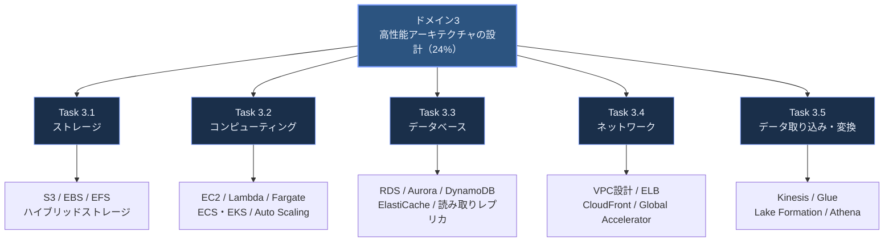
```mermaid
flowchart TD
    D3["ドメイン3<br/>高性能アーキテクチャの設計（24%）"]
    D3 --> T1["Task 3.1<br/>ストレージ"]
    D3 --> T2["Task 3.2<br/>コンピューティング"]
    D3 --> T3["Task 3.3<br/>データベース"]
    D3 --> T4["Task 3.4<br/>ネットワーク"]
    D3 --> T5["Task 3.5<br/>データ取り込み・変換"]

    T1 --> T1a["S3 / EBS / EFS<br/>ハイブリッドストレージ"]
    T2 --> T2a["EC2 / Lambda / Fargate<br/>ECS・EKS / Auto Scaling"]
    T3 --> T3a["RDS / Aurora / DynamoDB<br/>ElastiCache / 読み取りレプリカ"]
    T4 --> T4a["VPC設計 / ELB<br/>CloudFront / Global Accelerator"]
    T5 --> T5a["Kinesis / Glue<br/>Lake Formation / Athena"]

    style D3 fill:#2c5480,stroke:#7c9eff,stroke-width:2px,color:#eef4ff
    style T1 fill:#1a2f4a,stroke:#7c9eff,color:#eef4ff
    style T2 fill:#1a2f4a,stroke:#7c9eff,color:#eef4ff
    style T3 fill:#1a2f4a,stroke:#7c9eff,color:#eef4ff
    style T4 fill:#1a2f4a,stroke:#7c9eff,color:#eef4ff
    style T5 fill:#1a2f4a,stroke:#7c9eff,color:#eef4ff
```

---

## 目次

1. [Task 3.1: 高性能・スケーラブルなストレージソリューション](#task-31-高性能スケーラブルなストレージソリューション)
2. [Task 3.2: 高性能で弾力性のあるコンピューティングソリューション](#task-32-高性能で弾力性のあるコンピューティングソリューション)
3. [Task 3.3: 高性能なデータベースソリューション](#task-33-高性能なデータベースソリューション)
4. [Task 3.4: 高性能・スケーラブルなネットワークアーキテクチャ](#task-34-高性能スケーラブルなネットワークアーキテクチャ)
5. [Task 3.5: 高性能なデータ取り込み・変換ソリューション](#task-35-高性能なデータ取り込み変換ソリューション)
6. [参考文献](#参考文献)

---

## Task 3.1: 高性能・スケーラブルなストレージソリューション

### 出題される知識・スキル項目（公式）

**知識:**
- ビジネス要件を満たすハイブリッドストレージソリューション
- 適切なユースケースを伴うストレージサービス（例: Amazon S3、Amazon EFS、Amazon EBS）
- 関連する特性を持つストレージタイプ（例: オブジェクト、ファイル、ブロック）

**スキル:**
- パフォーマンス要件を満たすストレージサービスと構成の決定
- 将来のニーズに対応してスケールできるストレージサービスの決定

出典: [Task 3.1（AWS公式Exam Guide）](https://docs.aws.amazon.com/aws-certification/latest/solutions-architect-associate-03/solutions-architect-associate-03-domain3.html#solutions-architect-associate-03-domain3-task1)

### 3.1.1 ストレージ3種類の基本特性

AWSのストレージは大きく **オブジェクト・ファイル・ブロック** の3タイプに分類されます。この分類を理解することが、どのサービスを選ぶべきかの土台になります。

| 特性 | オブジェクトストレージ (Amazon S3) | ファイルストレージ (Amazon EFS / FSx) | ブロックストレージ (Amazon EBS / インスタンスストア) |
|---|---|---|---|
| データの単位 | オブジェクト（フラットな名前空間、メタデータ付き） | ファイル階層（ディレクトリ構造） | 固定サイズのブロック |
| アクセス方法 | HTTP(S) API（REST） | NFS / SMBプロトコル | OSのファイルシステム経由 |
| 同時アクセス | 多数のクライアントから並行アクセス可能 | 多数のEC2/オンプレミスから同時マウント可能 | 基本的に1つのEC2インスタンスに1対1でアタッチ（io2 Block Expressのマルチアタッチは例外） |
| 典型的ユースケース | 静的ウェブサイト、バックアップ、データレイク、ログ、メディア配信 | 共有ホームディレクトリ、CMS、コンテンツ管理、ビッグデータ解析の共有領域 | データベースのボリューム、OSブートボリューム、低レイテンシが必要なトランザクション処理 |
| スケーラビリティ | 事実上無制限（自動） | 自動でペタバイト規模までスケール（EFS） | ボリュームごとに事前にサイズ・IOPSを指定（gp3/io2は変更可能） |

出典: [Amazon S3の概要](https://docs.aws.amazon.com/AmazonS3/latest/userguide/Welcome.html) / [Amazon EFSとは](https://docs.aws.amazon.com/efs/latest/ug/whatisefs.html) / [Amazon EBSの概要](https://docs.aws.amazon.com/AWSEC2/latest/UserGuide/AmazonEBS.html)

### ストレージ選定の判断フロー

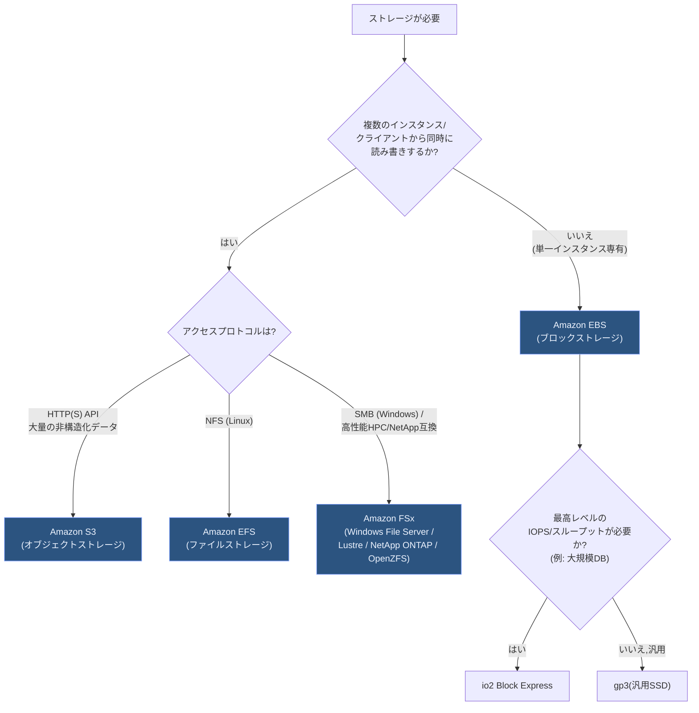
```mermaid
flowchart TD
    Start["ストレージが必要"] --> Q1{"複数のインスタンス/<br/>クライアントから同時に<br/>読み書きするか?"}
    Q1 -- はい --> Q2{"アクセスプロトコルは?"}
    Q1 -- いいえ<br/>(単一インスタンス専有) --> EBS["Amazon EBS<br/>(ブロックストレージ)"]

    Q2 -- "HTTP(S) API<br/>大量の非構造化データ" --> S3["Amazon S3<br/>(オブジェクトストレージ)"]
    Q2 -- "NFS (Linux)" --> EFS["Amazon EFS<br/>(ファイルストレージ)"]
    Q2 -- "SMB (Windows) /<br/>高性能HPC/NetApp互換" --> FSx["Amazon FSx<br/>(Windows File Server /<br/>Lustre / NetApp ONTAP / OpenZFS)"]

    EBS --> Q3{"最高レベルの<br/>IOPS/スループットが必要か?<br/>(例: 大規模DB)"}
    Q3 -- はい --> io2["io2 Block Express"]
    Q3 -- いいえ,汎用 --> gp3["gp3(汎用SSD)"]

    style S3 fill:#2c5480,stroke:#7c9eff,color:#eef4ff
    style EFS fill:#2c5480,stroke:#7c9eff,color:#eef4ff
    style FSx fill:#2c5480,stroke:#7c9eff,color:#eef4ff
    style EBS fill:#2c5480,stroke:#7c9eff,color:#eef4ff
```

### 3.1.2 Amazon S3: ストレージクラスとライフサイクル管理

Amazon S3は**単一のバケット内でオブジェクトごとに異なるストレージクラスを混在**させることができます。パフォーマンス試験対策では「アクセス頻度」と「取得速度要件」の2軸でクラスを選ぶ考え方が重要です。

| ストレージクラス | 想定アクセス頻度 | 取得時間 | 可用性/耐久性の特徴 |
|---|---|---|---|
| S3 Standard | 頻繁 | ミリ秒 | 複数AZに複製、汎用の高性能 |
| S3 Intelligent-Tiering | 不明・変動する | ミリ秒（頻繁/低頻度層）〜時間（アーカイブ層） | アクセスパターンを自動監視し階層間を自動移動 |
| S3 Standard-IA | 低頻度だが即時アクセス必要 | ミリ秒 | Standardと同等の低レイテンシ、保存コストは低い |
| S3 One Zone-IA | 低頻度・再作成可能なデータ | ミリ秒 | 単一AZのみに保存（AZ障害でロスト可能）、最安のIA |
| S3 Express One Zone | 超高頻度・低レイテンシ最優先 | 1桁ミリ秒 | 単一AZ、S3で最速のアクセス速度 |
| S3 Glacier Instant Retrieval | 四半期に1回程度だが即時性が必要 | ミリ秒 | アーカイブ用途で最安クラスの即時取得層 |
| S3 Glacier Flexible Retrieval | 年1〜2回程度のアクセス | 数分〜数時間 | 低コストアーカイブ、非同期取得 |
| S3 Glacier Deep Archive | ほぼアクセスしない長期保管 | 標準12時間以内 | S3で最安、コンプライアンス/長期保存向け |

出典: [Amazon S3 ストレージクラス（公式）](https://aws.amazon.com/s3/storage-classes/) / [S3 Intelligent-Tiering](https://aws.amazon.com/s3/storage-classes/intelligent-tiering/) / [S3 Glacierストレージクラス](https://aws.amazon.com/s3/storage-classes/glacier/)

### S3ライフサイクルポリシーによる自動階層化

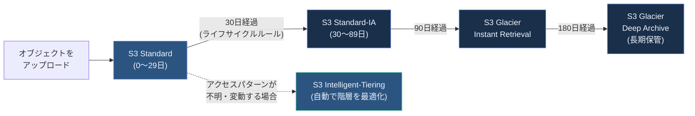
```mermaid
flowchart LR
    Upload["オブジェクトを<br/>アップロード"] --> Standard["S3 Standard<br/>(0〜29日)"]
    Standard -- "30日経過<br/>(ライフサイクルルール)" --> IA["S3 Standard-IA<br/>(30〜89日)"]
    IA -- "90日経過" --> GIR["S3 Glacier<br/>Instant Retrieval"]
    GIR -- "180日経過" --> DeepArchive["S3 Glacier<br/>Deep Archive<br/>(長期保管)"]

    Standard -. "アクセスパターンが<br/>不明・変動する場合" .-> IT["S3 Intelligent-Tiering<br/>(自動で階層を最適化)"]

    style Standard fill:#2c5480,stroke:#7c9eff,color:#eef4ff
    style IA fill:#1a2f4a,stroke:#7c9eff,color:#eef4ff
    style GIR fill:#1a2f4a,stroke:#7c9eff,color:#eef4ff
    style DeepArchive fill:#1a2f4a,stroke:#7c9eff,color:#eef4ff
    style IT fill:#2c5480,stroke:#5fd4a8,color:#eef4ff
```

> **ベストプラクティス:** アクセスパターンが読めない、または変動するワークロード（例: 新規サービスのログデータ）には、手動でライフサイクルルールを設計するより先に **S3 Intelligent-Tiering** を検討する。監視・自動化の追加料金のみで、取得料金や早期削除料金が発生しない。

### 3.1.3 Amazon EBS: ボリュームタイプの選択

| ボリュームタイプ | 種別 | 最大IOPS目安 | 主な用途 |
|---|---|---|---|
| gp3（汎用SSD） | SSD | 最大16,000 IOPS（IOPSとスループットを個別に課金・調整可能） | ほとんどの汎用ワークロード、仮想デスクトップ、開発/テスト環境 |
| gp2（汎用SSD・旧世代） | SSD | ボリュームサイズに比例（バーストクレジット方式） | レガシー互換、小規模ワークロード |
| io2 Block Express（プロビジョンドIOPS SSD） | SSD | 最大256,000 IOPS | ミッションクリティカルな大規模DB（Oracle、SAP HANA等）、サブミリ秒レイテンシが必要な用途 |
| io1/io2（プロビジョンドIOPS SSD） | SSD | 最大64,000 IOPS | 高いIOPSが必要なI/O集約型DB |
| st1（スループット最適化HDD） | HDD | — （スループット課金） | ビッグデータ、データウェアハウス、ログ処理などシーケンシャルI/O |
| sc1（コールドHDD） | HDD | — | アクセス頻度が低い大容量データ、最安コスト |

出典: [Amazon EBSボリュームタイプ（公式）](https://docs.aws.amazon.com/AWSEC2/latest/UserGuide/ebs-volume-types.html)

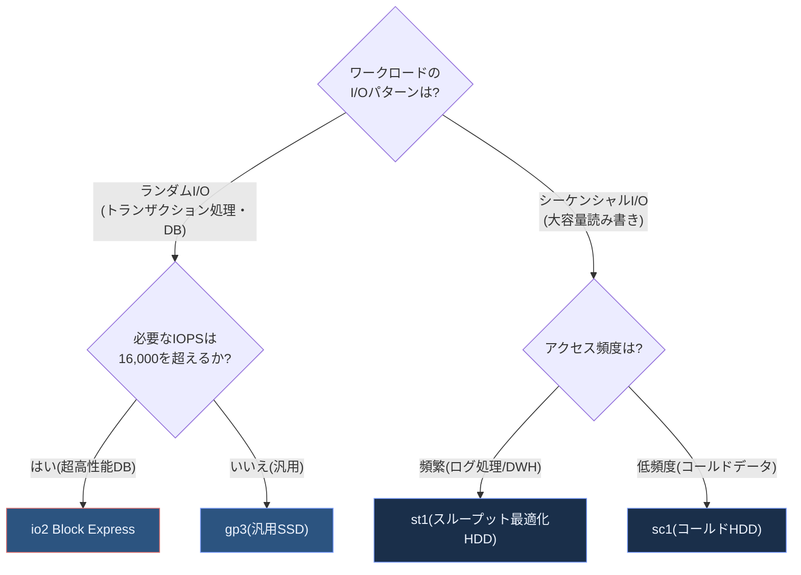
```mermaid
flowchart TD
    Q1{"ワークロードの<br/>I/Oパターンは?"}
    Q1 -- "ランダムI/O<br/>(トランザクション処理・DB)" --> Q2{"必要なIOPSは<br/>16,000を超えるか?"}
    Q1 -- "シーケンシャルI/O<br/>(大容量読み書き)" --> Q3{"アクセス頻度は?"}

    Q2 -- "はい(超高性能DB)" --> io2["io2 Block Express"]
    Q2 -- "いいえ(汎用)" --> gp3["gp3(汎用SSD)"]

    Q3 -- "頻繁(ログ処理/DWH)" --> st1["st1(スループット最適化HDD)"]
    Q3 -- "低頻度(コールドデータ)" --> sc1["sc1(コールドHDD)"]

    style gp3 fill:#2c5480,stroke:#7c9eff,color:#eef4ff
    style io2 fill:#2c5480,stroke:#e2716f,color:#eef4ff
    style st1 fill:#1a2f4a,stroke:#7c9eff,color:#eef4ff
    style sc1 fill:#1a2f4a,stroke:#7c9eff,color:#eef4ff
```

> **ベストプラクティス:** EC2インスタンスとEBSボリュームの間の帯域（EBS最適化）がボトルネックにならないよう、**EBS最適化対応インスタンスタイプ**を選ぶ。また、単一EC2インスタンス停止時にもデータを永続化したい場合はEBS（インスタンスストアは一時的でインスタンス停止/終了時にデータが消える点に注意）。

### 3.1.4 Amazon EFS: 弾力性のある共有ファイルストレージ

Amazon EFSはLinuxベースのワークロード向けにNFSプロトコルで複数のAZ・複数のインスタンスから同時マウントできるマネージド型ファイルストレージです。

**パフォーマンスモード:**
- **General Purpose**: 低レイテンシ優先。大半のユースケースのデフォルト。
- **Max I/O**: 数百〜数千のクライアントからの高い並列アクセスが必要な場合（レイテンシは若干犠牲）。

**スループットモード:**
- **Bursting Throughput**: ストレージ容量に比例してスループットがスケール（バーストクレジット方式）。
- **Elastic Throughput**: ワークロードのI/Oパターンに応じて自動的にスループットをスケール（予測不能なワークロードに最適）。
- **Provisioned Throughput**: 容量に依存せず必要なスループットを明示的に指定。

**ストレージクラス（S3同様のライフサイクル管理）:**
- EFS Standard / EFS Standard-IA
- EFS One Zone / EFS One Zone-IA（単一AZでコスト削減）

出典: [Amazon EFSのパフォーマンス](https://docs.aws.amazon.com/efs/latest/ug/performance.html) / [Amazon EFSストレージクラス](https://docs.aws.amazon.com/efs/latest/ug/storage-classes.html)

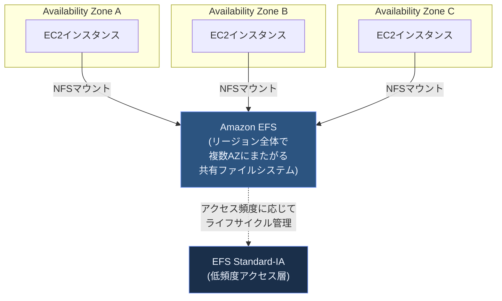
```mermaid
flowchart TD
    subgraph AZ1["Availability Zone A"]
        EC2a["EC2インスタンス"]
    end
    subgraph AZ2["Availability Zone B"]
        EC2b["EC2インスタンス"]
    end
    subgraph AZ3["Availability Zone C"]
        EC2c["EC2インスタンス"]
    end

    EC2a -- "NFSマウント" --> EFS["Amazon EFS<br/>(リージョン全体で<br/>複数AZにまたがる<br/>共有ファイルシステム)"]
    EC2b -- "NFSマウント" --> EFS
    EC2c -- "NFSマウント" --> EFS

    EFS -. "アクセス頻度に応じて<br/>ライフサイクル管理" .-> EFSIA["EFS Standard-IA<br/>(低頻度アクセス層)"]

    style EFS fill:#2c5480,stroke:#7c9eff,color:#eef4ff
    style EFSIA fill:#1a2f4a,stroke:#7c9eff,color:#eef4ff
```

> **ベストプラクティス:** EFSは「複数のAZ・複数のEC2から同時に同じファイルへアクセスする」要件（例: CMS、コンテンツリポジトリ、共有ホームディレクトリ）で採用する。単一インスタンス専有の高性能ブロックストレージが必要ならEBS、Windows(SMB)やHPC(Lustre)、NetApp ONTAP互換が必要ならFSxファミリーを検討する。

### 3.1.5 ハイブリッドストレージ: AWS Storage Gateway

オンプレミス環境とAWSのストレージをシームレスに統合するためのサービスです。試験では「オンプレミスのレガシーアプリをそのまま使いながらクラウドのストレージを活用したい」という要件で問われます。

| Storage Gatewayタイプ | 提供プロトコル | 主なユースケース |
|---|---|---|
| Amazon S3 File Gateway | NFS / SMB | オンプレミスアプリからファイルとしてS3にアクセス（S3上はネイティブオブジェクトとして保存） |
| Amazon FSx File Gateway | SMB | オンプレミスからFSx for Windows File Serverへ低レイテンシアクセス |
| Volume Gateway（キャッシュ型） | iSCSI | オンプレミスのプライマリデータをS3に保存しつつ、よく使うデータのみローカルにキャッシュ |
| Volume Gateway（保管型） | iSCSI | オンプレミスにプライマリデータを保持しつつ、非同期でS3にバックアップ（災害復旧用） |
| Tape Gateway | iSCSI仮想テープライブラリ(VTL) | 既存のテープバックアップソフトウェアをそのまま使い、実体はS3/Glacierに保存 |

出典: [AWS Storage Gatewayとは（公式）](https://docs.aws.amazon.com/storagegateway/latest/userguide/WhatIsStorageGateway.html)

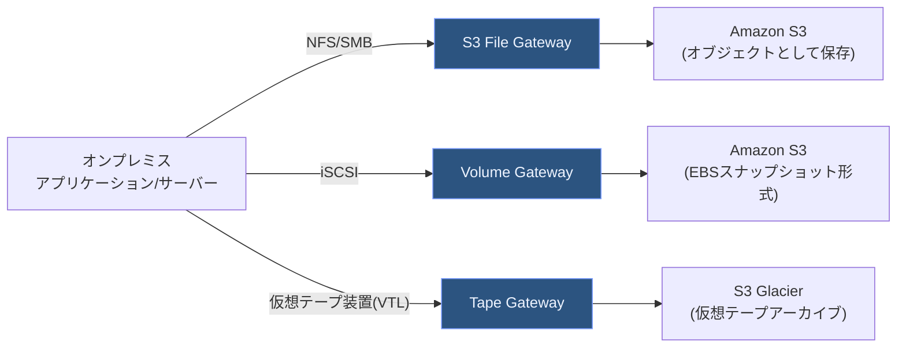
```mermaid
flowchart LR
    OnPrem["オンプレミス<br/>アプリケーション/サーバー"]

    OnPrem -- "NFS/SMB" --> FileGW["S3 File Gateway"]
    OnPrem -- "iSCSI" --> VolGW["Volume Gateway"]
    OnPrem -- "仮想テープ装置(VTL)" --> TapeGW["Tape Gateway"]

    FileGW --> S3["Amazon S3<br/>(オブジェクトとして保存)"]
    VolGW --> S3B["Amazon S3<br/>(EBSスナップショット形式)"]
    TapeGW --> Glacier["S3 Glacier<br/>(仮想テープアーカイブ)"]

    style FileGW fill:#2c5480,stroke:#7c9eff,color:#eef4ff
    style VolGW fill:#2c5480,stroke:#7c9eff,color:#eef4ff
    style TapeGW fill:#2c5480,stroke:#7c9eff,color:#eef4ff
```

> **ベストプラクティス:** 「オンプレミスのファイルサーバーを段階的にクラウド移行したい」→ **File Gateway**。「オンプレミスのブロックストレージ(iSCSI)をバックアップ/DR目的でクラウド化したい」→ **Volume Gateway**。「既存のテープバックアップ運用を変えずにコストだけ削減したい」→ **Tape Gateway**。大量データの一括移行なら **AWS Snow Family**、継続的な同期・転送が必要なら **AWS DataSync**（Task 3.5で詳述）を使い分ける。

---

## Task 3.2: 高性能で弾力性のあるコンピューティングソリューション

### 出題される知識・スキル項目（公式）

**知識:**
- 適切なユースケースを伴うAWSコンピューティングサービス（例: AWS Batch、Amazon EMR、AWS Fargate）
- AWSのグローバルインフラストラクチャとエッジサービスがサポートする分散コンピューティングの概念
- キューイングとメッセージングの概念（例: パブリッシュ/サブスクライブ）
- 適切なユースケースを伴うスケーラビリティ機能（例: Amazon EC2 Auto Scaling、AWS Auto Scaling）
- サーバーレステクノロジーとパターン（例: AWS Lambda、Fargate）
- コンテナのオーケストレーション（例: Amazon ECS、Amazon EKS）

**スキル:**
- コンポーネントが独立してスケールできるようにワークロードを疎結合化する
- スケーリングアクションを実行するための指標と条件の特定
- ビジネス要件を満たす適切なコンピューティングオプションと機能の選択（例: EC2インスタンスタイプ）
- ビジネス要件を満たす適切なリソースタイプとサイズの選択（例: Lambdaメモリの量）

出典: [Task 3.2（AWS公式Exam Guide）](https://docs.aws.amazon.com/aws-certification/latest/solutions-architect-associate-03/solutions-architect-associate-03-domain3.html#solutions-architect-associate-03-domain3-task2)

### 3.2.1 コンピューティングサービスの全体マップ

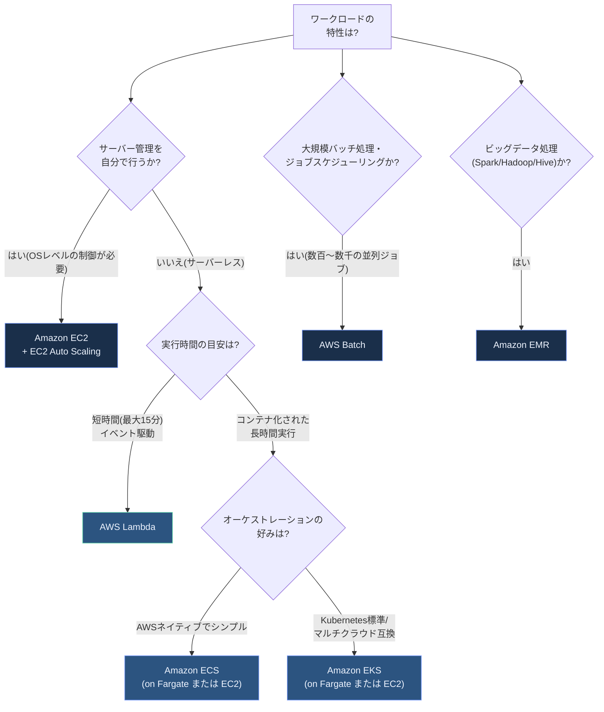
```mermaid
flowchart TD
    Start["ワークロードの<br/>特性は?"]

    Start --> Q1{"サーバー管理を<br/>自分で行うか?"}
    Q1 -- "はい(OSレベルの制御が必要)" --> EC2["Amazon EC2<br/>+ EC2 Auto Scaling"]
    Q1 -- "いいえ(サーバーレス)" --> Q2{"実行時間の目安は?"}

    Q2 -- "短時間(最大15分)<br/>イベント駆動" --> Lambda["AWS Lambda"]
    Q2 -- "コンテナ化された<br/>長時間実行" --> Q3{"オーケストレーションの<br/>好みは?"}

    Q3 -- "AWSネイティブでシンプル" --> ECS["Amazon ECS<br/>(on Fargate または EC2)"]
    Q3 -- "Kubernetes標準/<br/>マルチクラウド互換" --> EKS["Amazon EKS<br/>(on Fargate または EC2)"]

    Start --> Q4{"大規模バッチ処理・<br/>ジョブスケジューリングか?"}
    Q4 -- "はい(数百〜数千の並列ジョブ)" --> Batch["AWS Batch"]

    Start --> Q5{"ビッグデータ処理<br/>(Spark/Hadoop/Hive)か?"}
    Q5 -- "はい" --> EMR["Amazon EMR"]

    style EC2 fill:#1a2f4a,stroke:#7c9eff,color:#eef4ff
    style Lambda fill:#2c5480,stroke:#5fd4a8,color:#eef4ff
    style ECS fill:#2c5480,stroke:#7c9eff,color:#eef4ff
    style EKS fill:#2c5480,stroke:#7c9eff,color:#eef4ff
    style Batch fill:#1a2f4a,stroke:#7c9eff,color:#eef4ff
    style EMR fill:#1a2f4a,stroke:#7c9eff,color:#eef4ff
```

| サービス | 管理レベル | 典型的ユースケース | ソース |
|---|---|---|---|
| Amazon EC2 | ユーザーがOS/ミドルウェアまで管理 | 汎用ワークロード、レガシーアプリ移行、細かなインスタンスタイプ選択が必要な場合 | [EC2ユーザーガイド](https://docs.aws.amazon.com/AWSEC2/latest/UserGuide/concepts.html) |
| AWS Lambda | サーバーレス（コードのみ管理） | イベント駆動処理、APIバックエンド、ETLの軽量変換、非同期処理 | [Lambda開発者ガイド](https://docs.aws.amazon.com/lambda/latest/dg/welcome.html) |
| AWS Fargate | サーバーレス（コンテナのみ管理） | サーバー管理をしたくないコンテナワークロード（ECS/EKS上で稼働） | [AWS Fargateとは](https://docs.aws.amazon.com/AmazonECS/latest/userguide/what-is-fargate.html) |
| Amazon ECS | AWSネイティブなコンテナオーケストレーション | AWS標準機能で完結させたいコンテナ運用 | [Amazon ECSとは](https://docs.aws.amazon.com/AmazonECS/latest/developerguide/Welcome.html) |
| Amazon EKS | マネージドKubernetes | 既にKubernetesを運用中/マルチクラウド前提の組織 | [Amazon EKSとは](https://docs.aws.amazon.com/eks/latest/userguide/what-is-eks.html) |
| AWS Batch | フルマネージドバッチスケジューラ | 大量の計算集約型バッチジョブ(ゲノム解析、金融シミュレーション等) | [AWS Batchとは](https://docs.aws.amazon.com/batch/latest/userguide/what-is-batch.html) |
| Amazon EMR | マネージドHadoop/Sparkクラスタ | ビッグデータ処理、ETL、機械学習の前処理 | [Amazon EMRとは](https://docs.aws.amazon.com/emr/latest/ManagementGuide/emr-what-is-emr.html) |

### 3.2.2 EC2 Auto Scalingによる弾力性の実現

高性能アーキテクチャの中核は「需要に応じて自動的にリソースを増減する」弾力性（Elasticity）です。EC2 Auto Scalingは **起動テンプレート** と **Auto Scalingグループ(ASG)** を使ってこれを実現します。

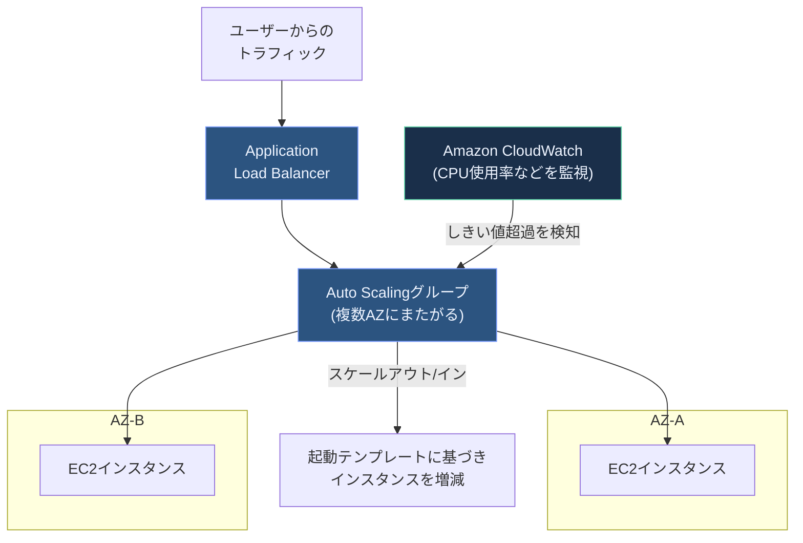
```mermaid
flowchart TD
    Users["ユーザーからの<br/>トラフィック"] --> ALB["Application<br/>Load Balancer"]
    ALB --> ASG["Auto Scalingグループ<br/>(複数AZにまたがる)"]

    subgraph AZ_A["AZ-A"]
        EC2_1["EC2インスタンス"]
    end
    subgraph AZ_B["AZ-B"]
        EC2_2["EC2インスタンス"]
    end

    ASG --> EC2_1
    ASG --> EC2_2

    CW["Amazon CloudWatch<br/>(CPU使用率などを監視)"] -- "しきい値超過を検知" --> ASG
    ASG -- "スケールアウト/イン" --> LaunchTemplate["起動テンプレートに基づき<br/>インスタンスを増減"]

    style ALB fill:#2c5480,stroke:#7c9eff,color:#eef4ff
    style ASG fill:#2c5480,stroke:#7c9eff,color:#eef4ff
    style CW fill:#1a2f4a,stroke:#5fd4a8,color:#eef4ff
```

**スケーリングポリシーの種類:**

| ポリシー種別 | 動作 | 適したシナリオ |
|---|---|---|
| ターゲット追跡スケーリング | 指定した指標（例: 平均CPU使用率50%）を維持するよう自動調整 | 最も一般的でシンプル。多くのケースで第一選択 |
| ステップスケーリング | しきい値超過の度合いに応じて段階的にスケール量を変える | 負荷の急増に細かく対応したい場合 |
| シンプルスケーリング | 1つのアラームに基づき固定量でスケール | レガシー的な手法、現在はターゲット追跡が推奨 |
| スケジュールに基づくスケーリング | 既知の時間帯（例: 毎朝9時）に合わせて事前にスケール | 予測可能なトラフィックパターン（月末バッチ等） |
| 予測スケーリング | 機械学習で将来の負荷を予測し事前にスケール | 周期的なトラフィックパターンがある場合 |

出典: [Amazon EC2 Auto Scalingのスケーリングポリシー](https://docs.aws.amazon.com/autoscaling/ec2/userguide/as-scaling-simple-step.html) / [AWS Auto Scalingとは](https://docs.aws.amazon.com/autoscaling/plans/userguide/what-is-aws-auto-scaling.html)

> **ベストプラクティス:** **AWS Auto Scaling**（複数サービス横断）と**Amazon EC2 Auto Scaling**（EC2専用）の違いに注意。前者はEC2・ECS・DynamoDB・Auroraなど複数リソースのスケーリングを一元管理するための上位サービスであり、後者はEC2のASGそのものを指す。試験では文脈でどちらを指しているか読み分ける。

### 3.2.3 サーバーレスコンピューティング: AWS Lambda

| 項目 | 仕様の目安 |
|---|---|
| メモリ設定範囲 | 128 MB 〜 10,240 MB（64 MB単位で調整可能） |
| CPU | メモリ量に比例して自動割り当て（メモリを増やすとCPUも増える） |
| 最大実行時間 | 900秒（15分） |
| /tmp一時ストレージ | デフォルト512 MB、最大10,240 MBまで拡張可能 |
| デプロイパッケージサイズ | 展開後250 MBまで（レイヤー含む） |

出典: [Lambda関数のメモリ設定](https://docs.aws.amazon.com/lambda/latest/dg/configuration-memory.html) / [Lambdaの設定に関するトラブルシューティング](https://docs.aws.amazon.com/lambda/latest/dg/troubleshooting-configuration.html)

> **ベストプラクティス:** CPU集約的な処理で実行時間が長い場合、まず**メモリを増やす**ことを検討する（メモリ増加=CPU増加のため、処理が速くなり結果的にコストが変わらない、あるいは下がることがある）。15分の実行時間上限を超えるバッチ処理は、**AWS Step Functions**で複数のLambda関数をオーケストレーションするか、**AWS Batch**/**Amazon EMR**などLambda以外のコンピューティングオプションを検討する。

### 3.2.4 コンテナオーケストレーション: ECS vs EKS vs Fargate

「オーケストレーター（何が管理するか）」と「起動タイプ（どこで実行されるか）」は独立した軸として理解する。

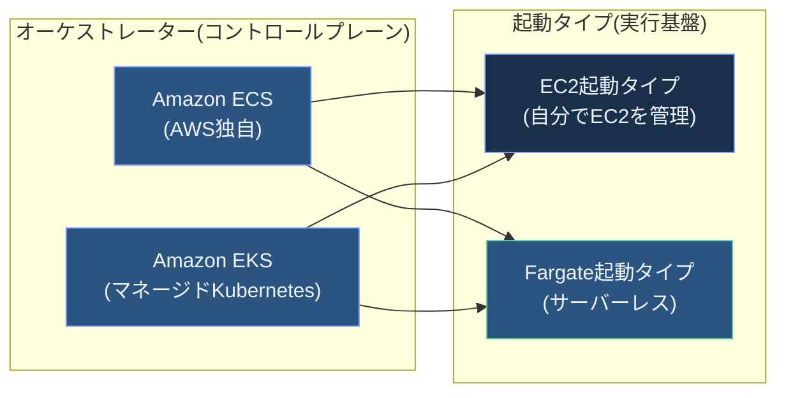
```mermaid
flowchart LR
    subgraph Orchestrator["オーケストレーター(コントロールプレーン)"]
        ECS_o["Amazon ECS<br/>(AWS独自)"]
        EKS_o["Amazon EKS<br/>(マネージドKubernetes)"]
    end

    subgraph LaunchType["起動タイプ(実行基盤)"]
        EC2_l["EC2起動タイプ<br/>(自分でEC2を管理)"]
        Fargate_l["Fargate起動タイプ<br/>(サーバーレス)"]
    end

    ECS_o --> EC2_l
    ECS_o --> Fargate_l
    EKS_o --> EC2_l
    EKS_o --> Fargate_l

    style ECS_o fill:#2c5480,stroke:#7c9eff,color:#eef4ff
    style EKS_o fill:#2c5480,stroke:#7c9eff,color:#eef4ff
    style Fargate_l fill:#2c5480,stroke:#5fd4a8,color:#eef4ff
    style EC2_l fill:#1a2f4a,stroke:#7c9eff,color:#eef4ff
```

出典: [AWS Fargateとは](https://docs.aws.amazon.com/AmazonECS/latest/userguide/what-is-fargate.html) / [Amazon ECSとEKSの選択に関する考え方](https://docs.aws.amazon.com/eks/latest/userguide/what-is-eks.html)

> **ベストプラクティス:** 「サーバーのパッチ適用やキャパシティ管理から解放されたい」→ **Fargate起動タイプ**。「既にKubernetesの知識・マニフェストが社内に蓄積されている、またはオンプレミス/他クラウドとの一貫性が必要」→ **EKS**。「AWSに閉じたシンプルな構成にしたい」→ **ECS**。

### 3.2.5 ワークロードの疎結合化: キューイングとパブリッシュ/サブスクライブ

高性能アーキテクチャでは、コンポーネント同士を疎結合にすることで、それぞれが独立してスケールできるようにします。代表的な2つのパターンです。

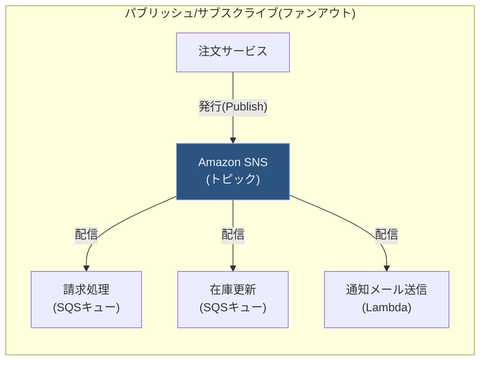
```mermaid
flowchart LR
    subgraph PubSub["パブリッシュ/サブスクライブ(ファンアウト)"]
        Producer["注文サービス"] -- "発行(Publish)" --> SNS["Amazon SNS<br/>(トピック)"]
        SNS -- "配信" --> Sub1["請求処理<br/>(SQSキュー)"]
        SNS -- "配信" --> Sub2["在庫更新<br/>(SQSキュー)"]
        SNS -- "配信" --> Sub3["通知メール送信<br/>(Lambda)"]
    end

    style SNS fill:#2c5480,stroke:#7c9eff,color:#eef4ff
```

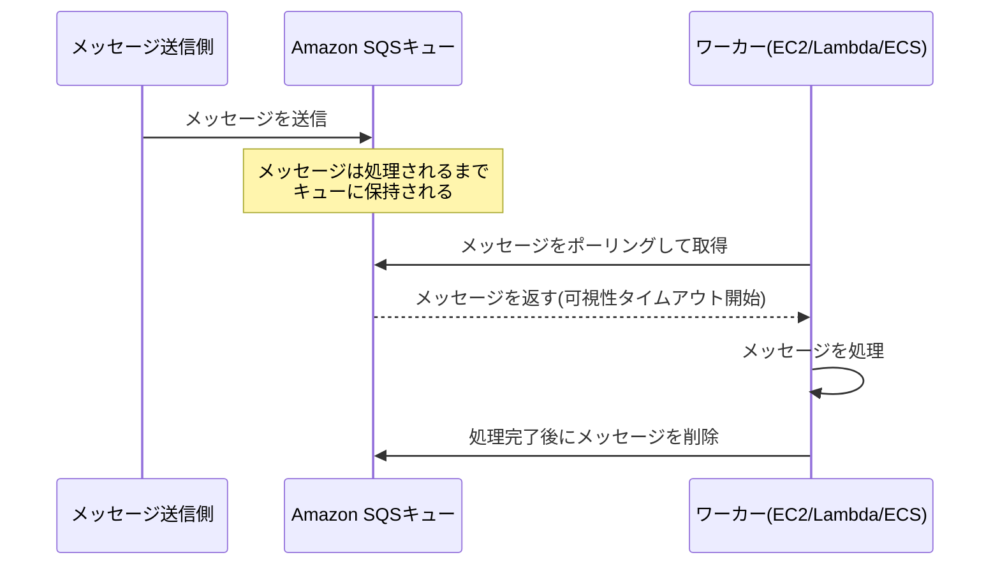
```mermaid
sequenceDiagram
    participant Producer as メッセージ送信側
    participant SQS as Amazon SQSキュー
    participant Consumer as ワーカー(EC2/Lambda/ECS)

    Producer->>SQS: メッセージを送信
    Note over SQS: メッセージは処理されるまで<br/>キューに保持される
    Consumer->>SQS: メッセージをポーリングして取得
    SQS-->>Consumer: メッセージを返す(可視性タイムアウト開始)
    Consumer->>Consumer: メッセージを処理
    Consumer->>SQS: 処理完了後にメッセージを削除
```

| 概念 | サービス | 特徴 |
|---|---|---|
| キュー(1対1) | Amazon SQS | メッセージはキューに保持され、1つのコンシューマーが処理。処理側の急増するバックログを吸収するバッファとして機能し、送信側と受信側の速度差を吸収する |
| パブリッシュ/サブスクライブ(1対多) | Amazon SNS | 1つのメッセージを複数のサブスクライバー（SQSキュー、Lambda、HTTPSエンドポイント等）に同時配信（ファンアウト） |
| イベントルーティング | Amazon EventBridge | イベントの内容に基づき複数のターゲットへルールベースでルーティング。SaaS連携も可能 |

出典: [Amazon SQSとは](https://docs.aws.amazon.com/AWSSimpleQueueService/latest/SQSDeveloperGuide/welcome.html) / [Amazon SNSとは](https://docs.aws.amazon.com/sns/latest/dg/welcome.html) / [Amazon EventBridgeとは](https://docs.aws.amazon.com/eventbridge/latest/userguide/eb-what-is.html)

> **ベストプラクティス:** フロントエンドが受け付けた大量のリクエストをバックエンドの処理速度に関わらず受け止めたい場合、間に**SQSキュー**を挟んで疎結合化する。これにより、バックエンドの処理が一時的に遅れてもリクエストが失われず、バックエンド側は自分のペースでAuto Scalingしながら処理できる（バッファリングによる負荷平準化）。

---

## Task 3.3: 高性能なデータベースソリューション

### 出題される知識・スキル項目（公式）

**知識:**
- AWSグローバルインフラストラクチャ（例: アベイラビリティーゾーン、AWSリージョン）
- キャッシング戦略とサービス（例: Amazon ElastiCache）
- データアクセスパターン（例: 読み取り集約型と書き込み集約型の比較）
- データベースのキャパシティプランニング（例: キャパシティユニット、インスタンスタイプ、プロビジョンドIOPS）
- データベース接続とプロキシ
- 適切なユースケースを伴うデータベースエンジン（例: 異種間移行、同種間移行）
- データベースレプリケーション（例: 読み取りレプリカ）
- データベースのタイプとサービス（例: サーバーレス、リレーショナルと非リレーショナルの比較、インメモリ）

**スキル:**
- ビジネス要件を満たす読み取りレプリカの構成
- データベースアーキテクチャの設計
- 適切なデータベースエンジンの決定（例: MySQLとPostgreSQLの比較）
- 適切なデータベースタイプの決定（例: Amazon Aurora、Amazon DynamoDB）
- ビジネス要件を満たすキャッシングの統合

出典: [Task 3.3（AWS公式Exam Guide）](https://docs.aws.amazon.com/aws-certification/latest/solutions-architect-associate-03/solutions-architect-associate-03-domain3.html#solutions-architect-associate-03-domain3-task3)

### 3.3.1 データベースタイプの選択フロー

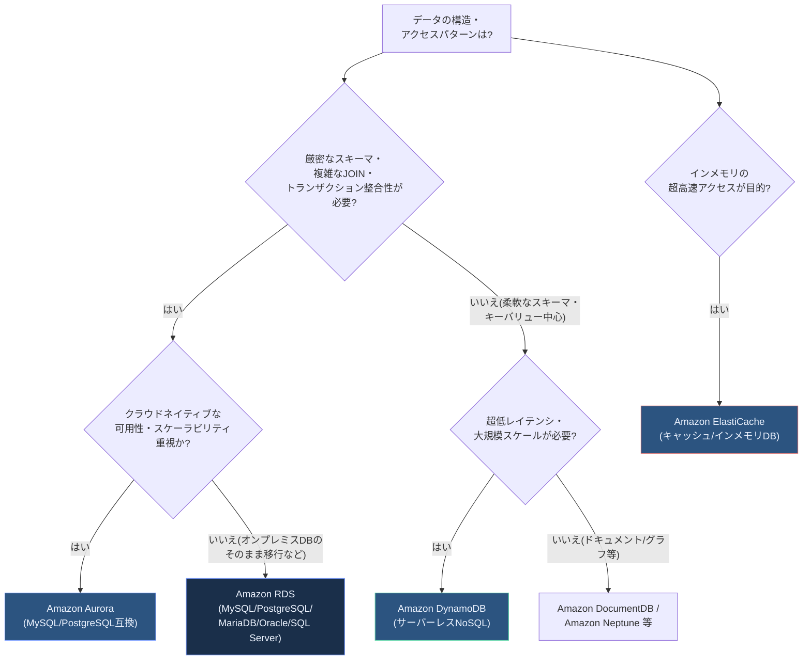
```mermaid
flowchart TD
    Start["データの構造・<br/>アクセスパターンは?"]

    Start --> Q1{"厳密なスキーマ・<br/>複雑なJOIN・<br/>トランザクション整合性が必要?"}
    Q1 -- はい --> Q2{"クラウドネイティブな<br/>可用性・スケーラビリティ<br/>重視か?"}
    Q2 -- はい --> Aurora["Amazon Aurora<br/>(MySQL/PostgreSQL互換)"]
    Q2 -- "いいえ(オンプレミスDBの<br/>そのまま移行など)" --> RDS["Amazon RDS<br/>(MySQL/PostgreSQL/<br/>MariaDB/Oracle/SQL Server)"]

    Q1 -- "いいえ(柔軟なスキーマ・<br/>キーバリュー中心)" --> Q3{"超低レイテンシ・<br/>大規模スケールが必要?"}
    Q3 -- はい --> DynamoDB["Amazon DynamoDB<br/>(サーバーレスNoSQL)"]
    Q3 -- "いいえ(ドキュメント/グラフ等)" --> Other["Amazon DocumentDB /<br/>Amazon Neptune 等"]

    Start --> Q4{"インメモリの<br/>超高速アクセスが目的?"}
    Q4 -- はい --> ElastiCache["Amazon ElastiCache<br/>(キャッシュ/インメモリDB)"]

    style Aurora fill:#2c5480,stroke:#7c9eff,color:#eef4ff
    style RDS fill:#1a2f4a,stroke:#7c9eff,color:#eef4ff
    style DynamoDB fill:#2c5480,stroke:#5fd4a8,color:#eef4ff
    style ElastiCache fill:#2c5480,stroke:#e2716f,color:#eef4ff
```

出典: [Amazon RDSとは](https://docs.aws.amazon.com/AmazonRDS/latest/UserGuide/Welcome.html) / [Amazon Auroraとは](https://docs.aws.amazon.com/AmazonRDS/latest/AuroraUserGuide/CHAP_AuroraOverview.html) / [Amazon DynamoDBとは](https://docs.aws.amazon.com/amazondynamodb/latest/developerguide/Introduction.html)

### 3.3.2 Amazon RDS: マルチAZ配置と読み取りレプリカ

**マルチAZ（高可用性）** と **読み取りレプリカ（性能スケーリング）** は目的が異なる点に注意が必要です。

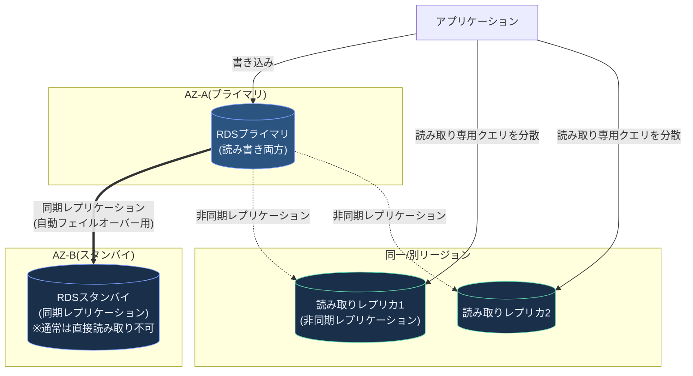
```mermaid
flowchart TD
    App["アプリケーション"]

    subgraph Primary_AZ["AZ-A(プライマリ)"]
        Primary[("RDSプライマリ<br/>(読み書き両方)")]
    end
    subgraph Standby_AZ["AZ-B(スタンバイ)"]
        Standby[("RDSスタンバイ<br/>(同期レプリケーション)<br/>※通常は直接読み取り不可")]
    end
    subgraph ReadReplica_Region["同一/別リージョン"]
        RR1[("読み取りレプリカ1<br/>(非同期レプリケーション)")]
        RR2[("読み取りレプリカ2")]
    end

    App -- "書き込み" --> Primary
    Primary == "同期レプリケーション<br/>(自動フェイルオーバー用)" ==> Standby
    Primary -. "非同期レプリケーション" .-> RR1
    Primary -. "非同期レプリケーション" .-> RR2
    App -- "読み取り専用クエリを分散" --> RR1
    App -- "読み取り専用クエリを分散" --> RR2

    style Primary fill:#2c5480,stroke:#7c9eff,color:#eef4ff
    style Standby fill:#1a2f4a,stroke:#7c9eff,color:#eef4ff
    style RR1 fill:#1a2f4a,stroke:#5fd4a8,color:#eef4ff
    style RR2 fill:#1a2f4a,stroke:#5fd4a8,color:#eef4ff
```

| 目的 | 機能 | ポイント |
|---|---|---|
| **可用性(HA)** | マルチAZ配置 | 同期レプリケーション。障害時に自動フェイルオーバー。スタンバイは通常のクエリには使えない |
| **読み取り性能のスケーリング** | 読み取りレプリカ | 非同期レプリケーション。読み取り集約型ワークロードの負荷を複数レプリカに分散。同一リージョン内だけでなくクロスリージョンにも作成可能（DR用途にも活用） |

出典: [Amazon RDSのマルチAZ配置](https://docs.aws.amazon.com/AmazonRDS/latest/UserGuide/Concepts.MultiAZ.html) / [Amazon RDS読み取りレプリカの操作](https://docs.aws.amazon.com/AmazonRDS/latest/UserGuide/USER_ReadRepl.html)

> **ベストプラクティス:** 「読み取りが集中してDBがボトルネックになっている」→ **読み取りレプリカ**を追加してSELECTクエリを分散する。「DB障害時にダウンタイムを最小化したい」→ **マルチAZ配置**で自動フェイルオーバーを構成する。両方を組み合わせる（マルチAZ+複数の読み取りレプリカ）のが一般的な高性能・高可用性構成。

### 3.3.3 Amazon Aurora: クラウドネイティブなストレージアーキテクチャ

Auroraは、コンピュート層とストレージ層を分離し、ストレージを自動的に複数AZ・6つのコピーへ複製する独自アーキテクチャにより、RDS標準のMySQL/PostgreSQLより高いスループットと耐障害性を実現します。

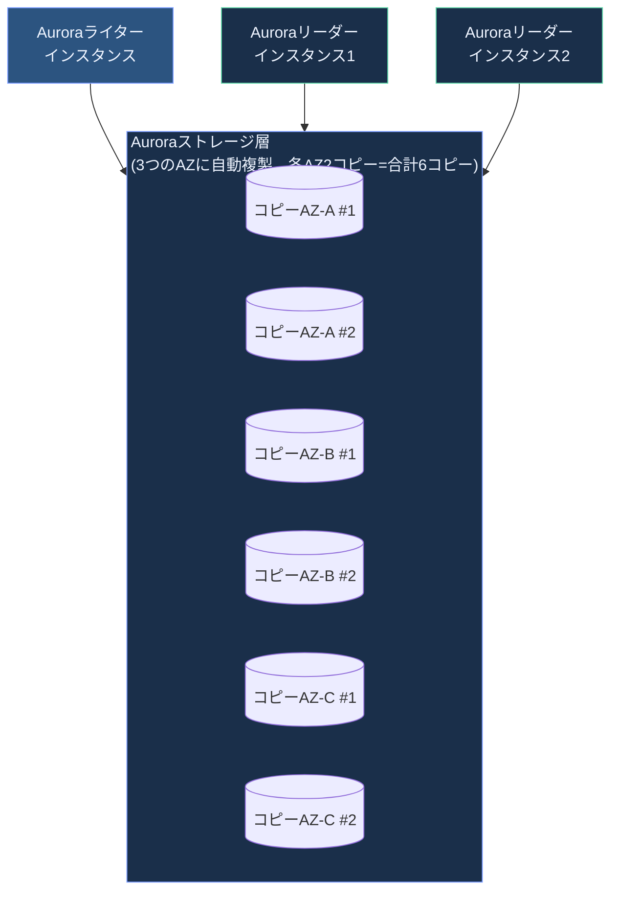
```mermaid
flowchart TD
    Writer["Auroraライター<br/>インスタンス"]
    Reader1["Auroraリーダー<br/>インスタンス1"]
    Reader2["Auroraリーダー<br/>インスタンス2"]

    subgraph Storage["Auroraストレージ層<br/>(3つのAZに自動複製、各AZ2コピー=合計6コピー)"]
        S1[("コピーAZ-A #1")]
        S2[("コピーAZ-A #2")]
        S3[("コピーAZ-B #1")]
        S4[("コピーAZ-B #2")]
        S5[("コピーAZ-C #1")]
        S6[("コピーAZ-C #2")]
    end

    Writer --> Storage
    Reader1 --> Storage
    Reader2 --> Storage

    style Writer fill:#2c5480,stroke:#7c9eff,color:#eef4ff
    style Reader1 fill:#1a2f4a,stroke:#5fd4a8,color:#eef4ff
    style Reader2 fill:#1a2f4a,stroke:#5fd4a8,color:#eef4ff
    style Storage fill:#1a2f4a,stroke:#7c9eff,color:#eef4ff
```

**Aurora特有の高性能機能:**
- **Aurora Serverless**: トラフィックに応じてコンピュート容量を自動でスケールアップ/ダウン（断続的・予測不能なワークロードに最適）
- **Aurora Global Database**: 複数リージョンにまたがるレプリケーション（1秒未満のレプリケーションラグ）でグローバルな読み取り性能とDRを両立
- **Auroraレプリカ**: 最大15台まで作成可能（標準MySQLは最大5台）で読み取りスケーリングの上限が高い

出典: [Amazon Auroraのストレージと信頼性](https://docs.aws.amazon.com/AmazonRDS/latest/AuroraUserGuide/Aurora.Overview.StorageReliability.html) / [Aurora Serverless v2](https://docs.aws.amazon.com/AmazonRDS/latest/AuroraUserGuide/aurora-serverless-v2.html) / [Aurora Global Database](https://docs.aws.amazon.com/AmazonRDS/latest/AuroraUserGuide/aurora-global-database.html)

### 3.3.4 データベースエンジンの移行: 同種間 vs 異種間

| 移行タイプ | 定義 | 使用するツール |
|---|---|---|
| **同種間移行(Homogeneous)** | 同じデータベースエンジン間の移行（例: オンプレミスMySQL → Amazon RDS for MySQL） | AWS DMS（ネイティブレプリケーション/バックアップリストアも可） |
| **異種間移行(Heterogeneous)** | 異なるデータベースエンジン間の移行（例: Oracle → Amazon Aurora PostgreSQL） | AWS SCT（スキーマ変換）+ AWS DMS（データ移行） |

出典: [AWS Database Migration Serviceとは](https://docs.aws.amazon.com/dms/latest/userguide/Welcome.html) / [AWS Schema Conversion Toolとは](https://docs.aws.amazon.com/SchemaConversionTool/latest/userguide/CHAP_Welcome.html)

> **ベストプラクティス:** 試験で「MySQL同士」のようにエンジンが同じ移行が問われたら**DMSのみ**で完結できると考える。「Oracle→Aurora PostgreSQL」のようにエンジンが異なる移行では、まず**SCT**でスキーマ・ストアドプロシージャ等を変換し、その後**DMS**でデータそのものを移行する2段階アプローチになる。

### 3.3.5 Amazon DynamoDB: キャパシティモードとアクセスパターン

| キャパシティモード | 特徴 | 適したシナリオ |
|---|---|---|
| オンデマンドモード | リクエスト数に応じて自動的にスケール、使った分だけ課金 | トラフィックが予測不能・変動が激しいワークロード |
| プロビジョンドモード | 読み取り/書き込みキャパシティユニット(RCU/WCU)を事前に指定 | トラフィックが予測可能で、コストを最適化したい場合（Auto Scalingと組み合わせも可） |

**データアクセスパターンの設計:**
- **読み取り集約型(Read-heavy)**: DynamoDB Accelerator (DAX) によるマイクロ秒レベルのインメモリキャッシュ、または読み取りレプリカ/ElastiCacheの活用を検討
- **書き込み集約型(Write-heavy)**: パーティションキーの設計を分散させ「ホットパーティション」を避ける。オンデマンドモードやWCUの適切な設計が重要

出典: [DynamoDBの読み取り/書き込みキャパシティモード](https://docs.aws.amazon.com/amazondynamodb/latest/developerguide/HowItWorks.ReadWriteCapacityMode.html) / [DynamoDB Accelerator (DAX)](https://docs.aws.amazon.com/amazondynamodb/latest/developerguide/DAX.html)

### 3.3.6 キャッシング戦略: Amazon ElastiCache

ElastiCacheは3つのエンジン（**Valkey**・**Redis OSS**・**Memcached**）から選択できるフルマネージド型インメモリデータストアです。AWSは新規構築のワークロードに対して、オープンソースでコスト効率の高い **Valkey** を推奨しています（Redis OSSからのコマンド・クライアント互換のドロップイン代替）。

| エンジン | 特徴 |
|---|---|
| Valkey | Linux Foundation管理のオープンソース、Redis OSS完全互換、AWSが新規ワークロードに推奨、料金面で優位 |
| Redis OSS | 複雑なデータ構造、レプリケーション、Pub/Sub、トランザクションをサポート |
| Memcached | シンプルなマルチスレッド型キャッシュ、水平分割（パーティショニング）に強いが永続化・複製機能はない |

出典: [Amazon ElastiCache for Valkeyの発表](https://aws.amazon.com/about-aws/whats-new/2024/10/amazon-elasticache-valkey) / [ElastiCacheのエンジン選択](https://docs.aws.amazon.com/AmazonElastiCache/latest/dg/SelectEngine.html)

**代表的なキャッシング戦略（Redis OSS/Valkey互換）:**

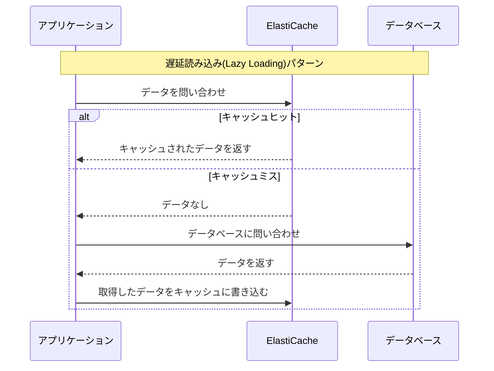
```mermaid
sequenceDiagram
    participant App as アプリケーション
    participant Cache as ElastiCache
    participant DB as データベース

    Note over App,DB: 遅延読み込み(Lazy Loading)パターン
    App->>Cache: データを問い合わせ
    alt キャッシュヒット
        Cache-->>App: キャッシュされたデータを返す
    else キャッシュミス
        Cache-->>App: データなし
        App->>DB: データベースに問い合わせ
        DB-->>App: データを返す
        App->>Cache: 取得したデータをキャッシュに書き込む
    end
```

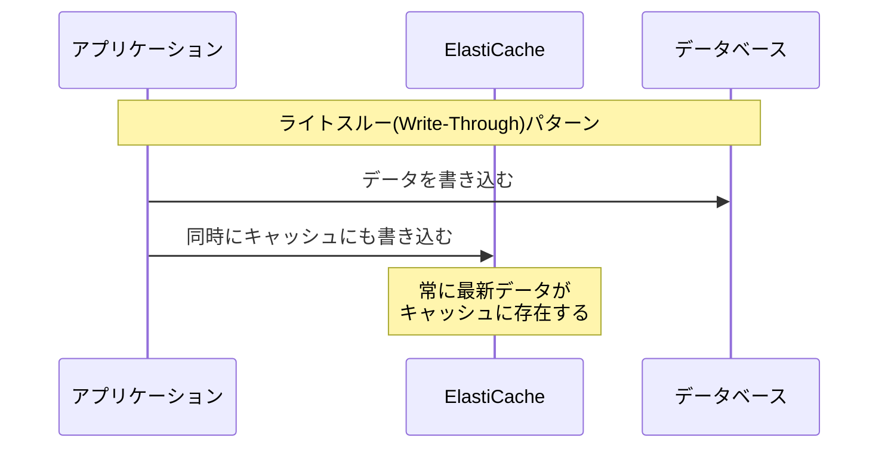
```mermaid
sequenceDiagram
    participant App as アプリケーション
    participant Cache as ElastiCache
    participant DB as データベース

    Note over App,DB: ライトスルー(Write-Through)パターン
    App->>DB: データを書き込む
    App->>Cache: 同時にキャッシュにも書き込む
    Note over Cache: 常に最新データが<br/>キャッシュに存在する
```

| 戦略 | メリット | デメリット |
|---|---|---|
| 遅延読み込み(Lazy Loading) | 実際にリクエストされたデータのみキャッシュ（無駄が少ない） | 初回アクセス時はキャッシュミスによる遅延(cache penalty)が発生 |
| ライトスルー(Write-Through) | キャッシュのデータが常に最新 | 書き込みのたびにキャッシュ更新が発生し書き込みレイテンシが増える。使われないデータもキャッシュされがち |

出典: [キャッシング戦略のベストプラクティス](https://docs.aws.amazon.com/AmazonElastiCache/latest/dg/Strategies.html)

> **ベストプラクティス:** 読み取り集約型で、同じデータに何度もアクセスされるパターン（商品カタログ、セッション情報等）には**遅延読み込み**が適している。データの鮮度が極めて重要な場合（在庫数など）は**ライトスルー**を検討するが、TTL（有効期限）を併用して古いデータの残留リスクを軽減する。

### 3.3.7 データベース接続とプロキシ: Amazon RDS Proxy

サーバーレス（Lambda）やマイクロサービスのように大量の短命なコネクションを発生させるアーキテクチャでは、RDS/Auroraのコネクション数上限に達しやすいという課題があります。

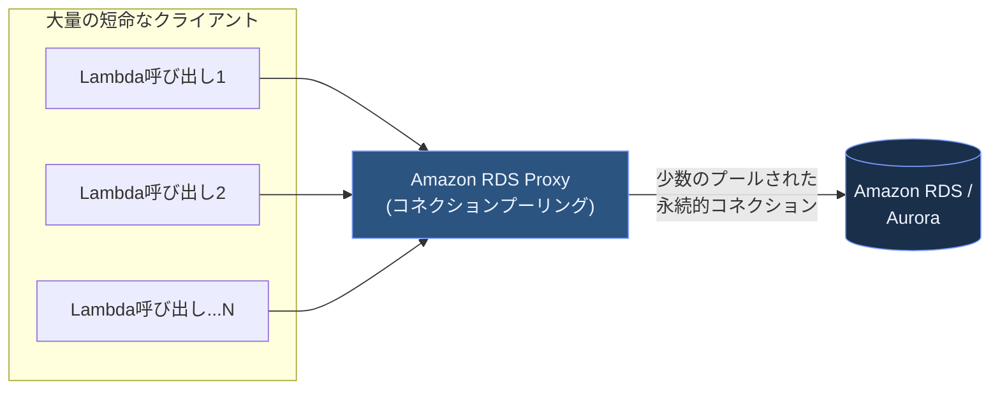
```mermaid
flowchart LR
    subgraph Clients["大量の短命なクライアント"]
        L1["Lambda呼び出し1"]
        L2["Lambda呼び出し2"]
        L3["Lambda呼び出し...N"]
    end

    L1 --> Proxy["Amazon RDS Proxy<br/>(コネクションプーリング)"]
    L2 --> Proxy
    L3 --> Proxy

    Proxy -- "少数のプールされた<br/>永続的コネクション" --> DB[("Amazon RDS /<br/>Aurora")]

    style Proxy fill:#2c5480,stroke:#7c9eff,color:#eef4ff
    style DB fill:#1a2f4a,stroke:#7c9eff,color:#eef4ff
```

出典: [Amazon RDS Proxyとは](https://docs.aws.amazon.com/AmazonRDS/latest/UserGuide/rds-proxy.html)

> **ベストプラクティス:** 「Lambda関数からRDSへの接続で"too many connections"エラーが発生する」という試験の典型的シナリオには**RDS Proxy**が正解になりやすい。RDS Proxyはコネクションプーリングに加え、フェイルオーバー時の切り替え時間も短縮する。

---

## Task 3.4: 高性能・スケーラブルなネットワークアーキテクチャ

### 出題される知識・スキル項目（公式）

**知識:**
- 適切なユースケースを伴うエッジネットワーキングサービス（例: Amazon CloudFront、AWS Global Accelerator）
- ネットワークアーキテクチャの設計方法（例: サブネット階層、ルーティング、IPアドレッシング）
- ロードバランシングの概念（例: Application Load Balancer）
- ネットワーク接続オプション（例: AWS VPN、AWS Direct Connect、AWS PrivateLink）

**スキル:**
- さまざまなアーキテクチャ（グローバル、ハイブリッド、マルチティア等）向けのネットワークトポロジの作成
- 将来のニーズに対応してスケールできるネットワーク構成の決定
- ビジネス要件を満たす適切なリソース配置の決定
- 適切なロードバランシング戦略の選択

出典: [Task 3.4（AWS公式Exam Guide）](https://docs.aws.amazon.com/aws-certification/latest/solutions-architect-associate-03/solutions-architect-associate-03-domain3.html#solutions-architect-associate-03-domain3-task4)

### 3.4.1 VPCのマルチティア・サブネット設計

高性能・高可用性の基本形は「**複数AZにまたがる、階層化されたサブネット設計**」です。

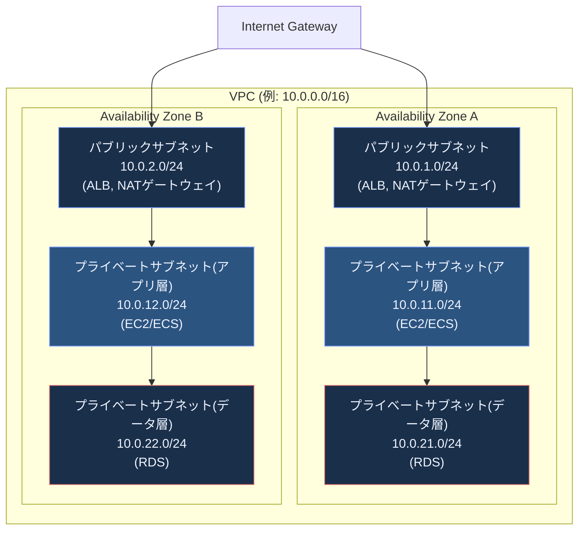
```mermaid
flowchart TD
    IGW["Internet Gateway"]

    subgraph VPC["VPC (例: 10.0.0.0/16)"]
        subgraph AZ_A["Availability Zone A"]
            PubA["パブリックサブネット<br/>10.0.1.0/24<br/>(ALB, NATゲートウェイ)"]
            AppA["プライベートサブネット(アプリ層)<br/>10.0.11.0/24<br/>(EC2/ECS)"]
            DataA["プライベートサブネット(データ層)<br/>10.0.21.0/24<br/>(RDS)"]
        end
        subgraph AZ_B["Availability Zone B"]
            PubB["パブリックサブネット<br/>10.0.2.0/24<br/>(ALB, NATゲートウェイ)"]
            AppB["プライベートサブネット(アプリ層)<br/>10.0.12.0/24<br/>(EC2/ECS)"]
            DataB["プライベートサブネット(データ層)<br/>10.0.22.0/24<br/>(RDS)"]
        end
    end

    IGW --> PubA
    IGW --> PubB
    PubA --> AppA
    PubB --> AppB
    AppA --> DataA
    AppB --> DataB

    style PubA fill:#1a2f4a,stroke:#7c9eff,color:#eef4ff
    style PubB fill:#1a2f4a,stroke:#7c9eff,color:#eef4ff
    style AppA fill:#2c5480,stroke:#7c9eff,color:#eef4ff
    style AppB fill:#2c5480,stroke:#7c9eff,color:#eef4ff
    style DataA fill:#1a2f4a,stroke:#e2716f,color:#eef4ff
    style DataB fill:#1a2f4a,stroke:#e2716f,color:#eef4ff
```

出典: [VPCとサブネット](https://docs.aws.amazon.com/vpc/latest/userguide/configure-subnets.html) / [VPCのシナリオとサンプル構成](https://docs.aws.amazon.com/vpc/latest/userguide/vpc-example-private-subnets-nat.html)

**サブネット設計のポイント:**
- **パブリックサブネット**: インターネットゲートウェイへの経路を持つルートテーブルに関連付けられたサブネット（ALB、NATゲートウェイ、踏み台サーバー等）
- **プライベートサブネット**: インターネットゲートウェイへの直接経路を持たないサブネット（アプリケーション層・データ層）。アウトバウンド通信が必要な場合はNATゲートウェイを経由
- **CIDR設計**: 将来の拡張を見越して、各サブネットに十分なIPアドレス余裕を持たせる（/24なら251個の使用可能IPアドレス、AWSは各サブネットの先頭4個+末尾1個を予約）

> **ベストプラクティス:** 最低でも**2つのAZ**にまたがるサブネット設計を行い、単一AZ障害でもサービスを継続できるようにする。データ層のサブネットには**インターネットゲートウェイへの経路を一切持たせない**ことで、データベースへの直接的なインターネットアクセスを構造的に排除する（多層防御）。

### 3.4.2 ロードバランシング戦略の選択

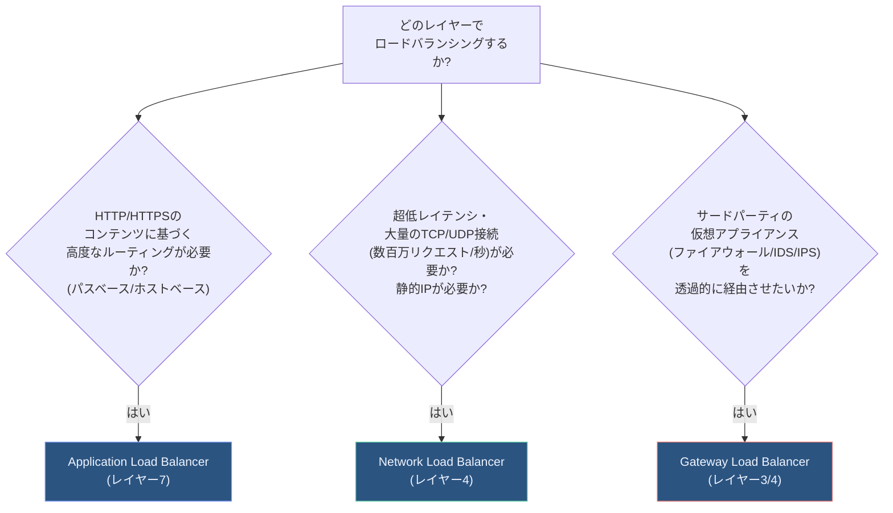
```mermaid
flowchart TD
    Start["どのレイヤーで<br/>ロードバランシングするか?"]

    Start --> Q1{"HTTP/HTTPSの<br/>コンテンツに基づく<br/>高度なルーティングが必要か?<br/>(パスベース/ホストベース)"}
    Q1 -- はい --> ALB["Application Load Balancer<br/>(レイヤー7)"]

    Start --> Q2{"超低レイテンシ・<br/>大量のTCP/UDP接続<br/>(数百万リクエスト/秒)が必要か?<br/>静的IPが必要か?"}
    Q2 -- はい --> NLB["Network Load Balancer<br/>(レイヤー4)"]

    Start --> Q3{"サードパーティの<br/>仮想アプライアンス<br/>(ファイアウォール/IDS/IPS)を<br/>透過的に経由させたいか?"}
    Q3 -- はい --> GWLB["Gateway Load Balancer<br/>(レイヤー3/4)"]

    style ALB fill:#2c5480,stroke:#7c9eff,color:#eef4ff
    style NLB fill:#2c5480,stroke:#5fd4a8,color:#eef4ff
    style GWLB fill:#2c5480,stroke:#e2716f,color:#eef4ff
```

| ロードバランサー | レイヤー | 主な特徴 | 典型的ユースケース |
|---|---|---|---|
| Application Load Balancer (ALB) | L7 | パスベース/ホストベースルーティング、WebSocket、gRPC対応、コンテナ向けのターゲットグループ | マイクロサービス、コンテナ化されたWebアプリケーション |
| Network Load Balancer (NLB) | L4 | 超高スループット、静的/Elastic IP対応、TLSパススルー | 極端に高いパフォーマンスが必要なTCP/UDPワークロード、レガシーアプリ |
| Gateway Load Balancer (GWLB) | L3/L4 | GENEVEプロトコルでトラフィックを透過的に仮想アプライアンスへ転送 | ファイアウォール等のセキュリティアプライアンスの水平スケーリング |

出典: [Elastic Load Balancingの機能比較](https://docs.aws.amazon.com/elasticloadbalancing/latest/userguide/introduction.html) / [Application Load Balancerとは](https://docs.aws.amazon.com/elasticloadbalancing/latest/application/introduction.html) / [Network Load Balancerとは](https://docs.aws.amazon.com/elasticloadbalancing/latest/network/introduction.html)

### ALBによるパスベース/ホストベースルーティング

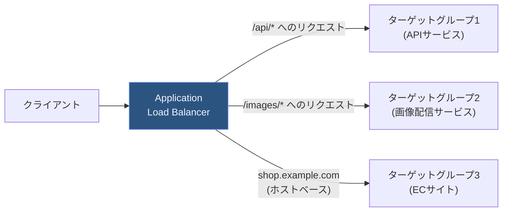
```mermaid
flowchart LR
    Client["クライアント"] --> ALB["Application<br/>Load Balancer"]

    ALB -- "/api/* へのリクエスト" --> TG1["ターゲットグループ1<br/>(APIサービス)"]
    ALB -- "/images/* へのリクエスト" --> TG2["ターゲットグループ2<br/>(画像配信サービス)"]
    ALB -- "shop.example.com<br/>(ホストベース)" --> TG3["ターゲットグループ3<br/>(ECサイト)"]

    style ALB fill:#2c5480,stroke:#7c9eff,color:#eef4ff
```

### 3.4.3 エッジネットワーキング: CloudFront と Global Accelerator

| サービス | 動作原理 | 適したシナリオ |
|---|---|---|
| Amazon CloudFront | エッジロケーションで**コンテンツをキャッシュ**するCDN | 静的コンテンツ(画像・動画・JS/CSS)、動的コンテンツのTLS終端、DDoS吸収 |
| AWS Global Accelerator | AWSのグローバルネットワークを経由し**最適な経路にルーティング**（キャッシュはしない） | 非HTTP(S)プロトコル（TCP/UDP）、複数リージョンでのフェイルオーバー、静的Anycast IPが必要な場合 |

出典: [Amazon CloudFrontとは](https://docs.aws.amazon.com/AmazonCloudFront/latest/DeveloperGuide/Introduction.html) / [AWS Global Acceleratorとは](https://docs.aws.amazon.com/global-accelerator/latest/dg/what-is-global-accelerator.html)

```mermaid
flowchart TD
    User["世界中のユーザー"]

    User -- "コンテンツをキャッシュして配信" --> CF["Amazon CloudFront<br/>(CDN)"]
    CF --> Origin["オリジン<br/>(S3 / ALB / EC2)"]

    User -- "AWSのバックボーン経由で<br/>最適経路にルーティング<br/>(キャッシュなし)" --> GA["AWS Global Accelerator"]
    GA --> RegionA["リージョンA<br/>のエンドポイント"]
    GA --> RegionB["リージョンB<br/>のエンドポイント<br/>(フェイルオーバー先)"]

    style CF fill:#2c5480,stroke:#7c9eff,color:#eef4ff
    style GA fill:#2c5480,stroke:#5fd4a8,color:#eef4ff
```

> **ベストプラクティス:** 「静的コンテンツの配信を高速化したい」「動画配信のキャッシュ効率を上げたい」→ **CloudFront**。「TCP/UDPベースのゲームサーバー・IoTなどHTTP以外のプロトコルを高速化したい」「複数リージョン間で瞬時にフェイルオーバーしたい」→ **Global Accelerator**。両者は併用可能（例: CloudFrontで静的コンテンツ、Global AcceleratorでAPIのTCP接続を最適化）。

### 3.4.4 ハイブリッド接続: VPN・Direct Connect・PrivateLink

```mermaid
flowchart TD
    Start["オンプレミスと<br/>AWSをどう接続するか?"]

    Start --> Q1{"迅速に接続したい・<br/>予算重視か?"}
    Q1 -- はい --> VPN["AWS Site-to-Site VPN<br/>(インターネット経由の暗号化トンネル)"]

    Start --> Q2{"専用線による安定した<br/>帯域・低レイテンシが必要か?<br/>(大容量データ転送)"}
    Q2 -- はい --> DX["AWS Direct Connect<br/>(専用線接続)"]

    Start --> Q3{"特定のAWSサービス/<br/>他社VPC内サービスへ<br/>プライベート接続したいだけか？<br/>(VPCピアリング不要)"}
    Q3 -- はい --> PL["AWS PrivateLink<br/>(サービス単位のプライベート接続)"]

    style VPN fill:#1a2f4a,stroke:#7c9eff,color:#eef4ff
    style DX fill:#2c5480,stroke:#7c9eff,color:#eef4ff
    style PL fill:#2c5480,stroke:#5fd4a8,color:#eef4ff
```

| 接続方式 | 経路 | 特徴 |
|---|---|---|
| AWS Site-to-Site VPN | パブリックインターネット(IPsecで暗号化) | 短期間で構築可能、帯域はインターネット状況に依存 |
| AWS Direct Connect | 専用の物理線 | 一貫した低レイテンシ・高帯域、データ転送コスト削減、DXとVPNを組み合わせた暗号化専用線構成も可能 |
| AWS PrivateLink | AWSのプライベートネットワーク内 | VPC間・オンプレミス間でIPアドレス重複やルーティング設定を意識せず、特定サービスにインターフェースエンドポイント経由で接続 |

出典: [AWS Site-to-Site VPNとは](https://docs.aws.amazon.com/vpn/latest/s2svpn/VPC_VPN.html) / [AWS Direct Connectとは](https://docs.aws.amazon.com/directconnect/latest/UserGuide/Welcome.html) / [AWS PrivateLinkとは](https://docs.aws.amazon.com/vpc/latest/privatelink/what-is-privatelink.html)

> **ベストプラクティス:** VPCピアリングやルートテーブルの複雑な管理を避けつつ、特定のサービス（自社のマイクロサービスや、SaaSベンダーが提供するサービス）にだけ安全にアクセスしたい場合は**PrivateLink（インターフェースVPCエンドポイント）**を使う。IPアドレス空間が重複していても問題なく接続できる点が、VPCピアリングに対する大きな利点。

---

## Task 3.5: 高性能なデータ取り込み・変換ソリューション

### 出題される知識・スキル項目（公式）

**知識:**
- 適切なユースケースを伴うデータ分析・可視化サービス（例: Amazon Athena、AWS Lake Formation、Amazon QuickSuite）
- データ取り込みパターン（例: 頻度）
- 適切なユースケースを伴うデータ転送サービス（例: AWS DataSync、AWS Storage Gateway）
- 適切なユースケースを伴うデータ変換サービス（例: AWS Glue）
- 取り込みアクセスポイントへのセキュアなアクセス
- ビジネス要件を満たすために必要なサイズと速度
- 適切なユースケースを伴うストリーミングデータサービス（例: Amazon Kinesis）

**スキル:**
- データレイクの構築とセキュリティ確保
- データストリーミングアーキテクチャの設計
- データ転送ソリューションの設計
- 可視化戦略の実装
- データ処理に適したコンピューティングオプションの選択（例: Amazon EMR）
- 取り込みに適した構成の選択
- フォーマット間のデータ変換（例: .csvから.parquetへ）

出典: [Task 3.5（AWS公式Exam Guide）](https://docs.aws.amazon.com/aws-certification/latest/solutions-architect-associate-03/solutions-architect-associate-03-domain3.html#solutions-architect-associate-03-domain3-task5)

> **補足（サービス名の変遷）:** Amazon QuickSightは2025年10月に **Amazon Quick Suite** へと進化し、AIエージェント機能（Quick Research、Quick Flows等）が追加されました。既存のQuickSightのダッシュボード・データセット・権限設定はそのまま引き継がれます。出典: [Amazon QuickSightからAmazon Quick Suiteへの進化（AWS公式ブログ）](https://aws.amazon.com/blogs/business-intelligence/reimagine-business-intelligence-amazon-quicksight-evolves-to-amazon-quick-suite/)。同様に、Amazon Kinesis Data Firehoseは**Amazon Data Firehose**という名称に変更されています。

### 3.5.1 データレイクアーキテクチャの全体像

```mermaid
flowchart TD
    subgraph Sources["データソース"]
        DB["業務データベース"]
        Logs["アプリケーションログ"]
        Stream["リアルタイムイベント"]
        OnPrem["オンプレミスファイル"]
    end

    subgraph Ingestion["取り込み層"]
        DMS_i["AWS DMS"]
        Kinesis_i["Amazon Kinesis"]
        DataSync_i["AWS DataSync"]
    end

    subgraph Lake["データレイク"]
        S3_dl[("Amazon S3<br/>(データレイク本体)")]
        LF["AWS Lake Formation<br/>(アクセス権限・ガバナンス)"]
        Glue_Catalog["AWS Glueデータカタログ<br/>(メタデータ管理)"]
    end

    subgraph Processing["処理・変換層"]
        Glue_ETL["AWS Glue ETL"]
        EMR_p["Amazon EMR"]
    end

    subgraph Consumption["分析・可視化層"]
        Athena_c["Amazon Athena<br/>(SQLクエリ)"]
        Redshift_c["Amazon Redshift<br/>(DWH)"]
        Quick_c["Amazon Quick Suite<br/>(BI/可視化)"]
    end

    DB --> DMS_i --> S3_dl
    Logs --> Kinesis_i --> S3_dl
    Stream --> Kinesis_i
    OnPrem --> DataSync_i --> S3_dl

    S3_dl <--> LF
    S3_dl <--> Glue_Catalog
    S3_dl --> Glue_ETL --> S3_dl
    S3_dl --> EMR_p --> S3_dl

    S3_dl --> Athena_c --> Quick_c
    S3_dl --> Redshift_c --> Quick_c

    style S3_dl fill:#2c5480,stroke:#7c9eff,color:#eef4ff
    style LF fill:#1a2f4a,stroke:#5fd4a8,color:#eef4ff
    style Glue_Catalog fill:#1a2f4a,stroke:#5fd4a8,color:#eef4ff
```

出典: [AWS Lake Formationとは](https://docs.aws.amazon.com/lake-formation/latest/dg/what-is-lake-formation.html) / [AWS Glueとは](https://docs.aws.amazon.com/glue/latest/dg/what-is-glue.html) / [Amazon Athenaとは](https://docs.aws.amazon.com/athena/latest/ug/what-is.html)

| コンポーネント | 役割 |
|---|---|
| Amazon S3 | データレイクの実体（オブジェクトストレージ）。ほぼ無制限にスケール |
| AWS Lake Formation | データレイクの構築を自動化し、テーブル・列・行レベルのきめ細かなアクセス制御を一元管理 |
| AWS Glue データカタログ | S3上のデータのメタデータ（スキーマ、パーティション等）を一元管理し、Athena/EMR/Redshiftから参照可能にする |
| AWS Glue ETL | サーバーレスのSparkベースETL。クローラでスキーマを自動検出し、ジョブでデータを変換 |
| Amazon Athena | S3上のデータに対してサーバーレスでSQLクエリを直接実行（事前のロード不要） |

> **ベストプラクティス:** 複数の部門・チームがデータレイクにアクセスする場合、IAMポリシーだけで細かい権限（特定の列だけ、特定の行だけ）を管理するのは煩雑になりがちなので、**Lake Formation**の一元的な権限管理を使う。「S3に溜まったデータをすぐにSQLで分析したいが、DWHを構築するほどではない」という要件には**Athena**が適している。

### 3.5.2 ストリーミングデータの取り込み: Amazon Kinesis

```mermaid
flowchart LR
    Producer["データ生成元<br/>(IoTデバイス/<br/>アプリログ/<br/>クリックストリーム)"]

    Producer --> KDS["Kinesis Data Streams<br/>(リアルタイム取り込み<br/>シャード単位でスケール)"]

    KDS --> Firehose["Amazon Data Firehose<br/>(旧Kinesis Data Firehose)<br/>(配信・変換をマネージド化)"]
    KDS --> KDA["Managed Service for<br/>Apache Flink<br/>(旧Kinesis Data Analytics)<br/>(ストリーム上でリアルタイム分析)"]

    Firehose --> S3_f[("Amazon S3")]
    Firehose --> Redshift_f[("Amazon Redshift")]
    Firehose --> OpenSearch_f[("Amazon OpenSearch<br/>Service")]

    KDA --> Dashboard["リアルタイム<br/>ダッシュボード/アラート"]

    style KDS fill:#2c5480,stroke:#7c9eff,color:#eef4ff
    style Firehose fill:#2c5480,stroke:#5fd4a8,color:#eef4ff
    style KDA fill:#1a2f4a,stroke:#7c9eff,color:#eef4ff
```

出典: [Amazon Kinesis Data Streamsとは](https://docs.aws.amazon.com/streams/latest/dev/introduction.html) / [Amazon Data Firehoseとは](https://docs.aws.amazon.com/firehose/latest/dev/what-is-this-service.html)

| サービス | 役割 | ポイント |
|---|---|---|
| Kinesis Data Streams | リアルタイムのストリームデータをシャード単位で取り込み、複数のコンシューマーが同時に読み取り可能 | 取り込み後のカスタム処理ロジックを自分で書きたい場合に選択 |
| Amazon Data Firehose | ストリームデータをS3/Redshift/OpenSearch等へ自動的に配信するフルマネージドサービス | サーバーレスで運用不要、ETLの軽微な変換（Lambda連携）も可能 |
| Managed Service for Apache Flink | ストリーム上でリアルタイムに集計・異常検知等の分析を実行 | ウィンドウ集計やパターンマッチングが必要な場合 |

> **ベストプラクティス:** 「取り込んだストリームデータを複数の異なるアプリケーションが同時に処理する必要がある」→ **Kinesis Data Streams**（コンシューマーを複数アタッチ可能）。「単純にストリームデータをS3やRedshiftに流し込みたいだけで、運用の手間を減らしたい」→ **Amazon Data Firehose**。

### 3.5.3 バッチ vs ストリーミング: 取り込み頻度の設計

```mermaid
flowchart TD
    Start["データ取り込みの<br/>頻度要件は?"]

    Start --> Q1{"リアルタイム性が<br/>必要か?<br/>(秒〜分単位の遅延許容度)"}
    Q1 -- "はい" --> Streaming["ストリーミング取り込み<br/>Kinesis Data Streams /<br/>Amazon MSK"]
    Q1 -- "いいえ(時間〜日単位で十分)" --> Batch["バッチ取り込み<br/>AWS Glueジョブ /<br/>Amazon EMR / DataSync"]

    style Streaming fill:#2c5480,stroke:#5fd4a8,color:#eef4ff
    style Batch fill:#1a2f4a,stroke:#7c9eff,color:#eef4ff
```

> **ベストプラクティス:** 不正取引検知やリアルタイムダッシュボードなど「今すぐの反応」が価値を持つユースケースはストリーミングを選ぶ。日次バッチのレポーティングなど、多少の遅延が許容できコスト効率を優先する場合はバッチ処理（Glue/EMRのスケジュール実行）を選ぶ。

### 3.5.4 データ変換: AWS Glue ETLとフォーマット変換

```mermaid
flowchart LR
    S3_raw[("Amazon S3<br/>(生データ: CSV/JSON)")]
    Crawler["AWS Glueクローラ<br/>(スキーマを自動検出)"]
    Catalog["AWS Glueデータカタログ<br/>(テーブル定義を登録)"]
    ETL["AWS Glue ETLジョブ<br/>(Apache Spark)"]
    S3_processed[("Amazon S3<br/>(変換後: Parquet等)")]

    S3_raw --> Crawler --> Catalog --> ETL
    S3_raw --> ETL
    ETL -- "CSV → Parquet<br/>(列指向・圧縮フォーマットへ変換)" --> S3_processed

    style Crawler fill:#1a2f4a,stroke:#7c9eff,color:#eef4ff
    style Catalog fill:#1a2f4a,stroke:#7c9eff,color:#eef4ff
    style ETL fill:#2c5480,stroke:#7c9eff,color:#eef4ff
```

出典: [AWS Glueクローラとは](https://docs.aws.amazon.com/glue/latest/dg/add-crawler.html) / [AWS GlueのETLプログラミング](https://docs.aws.amazon.com/glue/latest/dg/aws-glue-programming-etl.html)

> **ベストプラクティス:** Athenaでの分析コストとクエリ性能を最適化するために、CSV/JSONのような行指向フォーマットから **Parquet** のような列指向・圧縮フォーマットへ変換する（スキャンするデータ量が減り、クエリ料金・実行時間の両方を削減できる）。この変換は**AWS Glue ETLジョブ**で自動化するのが一般的なパターン。

### 3.5.5 データ転送: DataSync と Storage Gateway の使い分け

```mermaid
flowchart TD
    Start["オンプレミスから<br/>AWSへのデータ転送要件は?"]

    Start --> Q1{"継続的な同期・<br/>大量ファイルの<br/>高速なワンタイム/定期転送か?"}
    Q1 -- はい --> DataSync["AWS DataSync<br/>(ネットワーク経由の高速転送)"]

    Start --> Q2{"オンプレミスアプリから<br/>継続的にファイル/ブロックとして<br/>アクセスし続けたいか?"}
    Q2 -- はい --> SGW["AWS Storage Gateway<br/>(常時アクセス可能なハイブリッドストレージ)"]

    Start --> Q3{"ペタバイト級の<br/>一括移行で、<br/>ネットワーク帯域が不足か?"}
    Q3 -- はい --> Snow["AWS Snow Family<br/>(物理デバイスによるオフライン転送)"]

    style DataSync fill:#2c5480,stroke:#7c9eff,color:#eef4ff
    style SGW fill:#2c5480,stroke:#5fd4a8,color:#eef4ff
    style Snow fill:#1a2f4a,stroke:#e2716f,color:#eef4ff
```

出典: [AWS DataSyncとは](https://docs.aws.amazon.com/datasync/latest/userguide/what-is-datasync.html) / [AWS Storage Gatewayとは](https://docs.aws.amazon.com/storagegateway/latest/userguide/WhatIsStorageGateway.html) / [AWS Snow Familyとは](https://docs.aws.amazon.com/snowball/latest/developer-guide/whatisSnowball.html)

| サービス | 転送方式 | 適したシナリオ |
|---|---|---|
| AWS DataSync | ネットワーク経由（専用エージェント使用） | 定期的な同期、移行のワンタイム転送、NFS/SMB/S3/EFS/FSx間のデータ移動 |
| AWS Storage Gateway | ネットワーク経由（常時稼働のゲートウェイ） | オンプレミスアプリからの継続的なファイル/ブロックアクセス（Task 3.1参照） |
| AWS Snow Family | 物理デバイスの配送 | 数十TB〜PB級のデータで、ネットワーク帯域では現実的な時間で転送できない場合 |

**セキュアな取り込みアクセスポイントの設計:**
- 取り込み用のS3バケットへは **VPCエンドポイント（Gateway型/Interface型）** 経由でアクセスし、インターネットを経由させない
- IAMポリシーとS3バケットポリシーで、取り込み専用のロール/ユーザーに最小権限（PutObjectのみ等）を付与
- Kinesisへのデータ投入元は、**IAM認証**や**VPCエンドポイント**を使って未認可のクライアントからの投入を防ぐ

出典: [Amazon S3向けVPCエンドポイント](https://docs.aws.amazon.com/AmazonS3/latest/userguide/privatelink-interface-endpoints.html)

---

## 参考文献

### 試験ガイド（公式）

| ソース | URL |
|---|---|
| AWS Certified Solutions Architect - Associate (SAA-C03) Exam Guide | https://docs.aws.amazon.com/aws-certification/latest/solutions-architect-associate-03/solutions-architect-associate-03.html |
| Content Domain 3: Design High-Performing Architectures | https://docs.aws.amazon.com/aws-certification/latest/solutions-architect-associate-03/solutions-architect-associate-03-domain3.html |
| In-Scope AWS Services | https://docs.aws.amazon.com/aws-certification/latest/solutions-architect-associate-03/saa-03-in-scope-services.html |

### Task 3.1: ストレージ関連

| ソース | URL |
|---|---|
| Amazon S3 ユーザーガイド | https://docs.aws.amazon.com/AmazonS3/latest/userguide/Welcome.html |
| Amazon S3 ストレージクラス（公式） | https://aws.amazon.com/s3/storage-classes/ |
| S3 Intelligent-Tiering | https://aws.amazon.com/s3/storage-classes/intelligent-tiering/ |
| S3 Glacier ストレージクラス | https://aws.amazon.com/s3/storage-classes/glacier/ |
| Amazon EBS の概要 | https://docs.aws.amazon.com/AWSEC2/latest/UserGuide/AmazonEBS.html |
| Amazon EBS ボリュームタイプ | https://docs.aws.amazon.com/AWSEC2/latest/UserGuide/ebs-volume-types.html |
| Amazon EFS とは | https://docs.aws.amazon.com/efs/latest/ug/whatisefs.html |
| Amazon EFS のパフォーマンス | https://docs.aws.amazon.com/efs/latest/ug/performance.html |
| Amazon EFS ストレージクラス | https://docs.aws.amazon.com/efs/latest/ug/storage-classes.html |
| AWS Storage Gateway とは | https://docs.aws.amazon.com/storagegateway/latest/userguide/WhatIsStorageGateway.html |

### Task 3.2: コンピューティング関連

| ソース | URL |
|---|---|
| Amazon EC2 の概念 | https://docs.aws.amazon.com/AWSEC2/latest/UserGuide/concepts.html |
| AWS Lambda 開発者ガイド | https://docs.aws.amazon.com/lambda/latest/dg/welcome.html |
| Lambda 関数のメモリ設定 | https://docs.aws.amazon.com/lambda/latest/dg/configuration-memory.html |
| Lambda の設定に関するトラブルシューティング | https://docs.aws.amazon.com/lambda/latest/dg/troubleshooting-configuration.html |
| AWS Fargate とは | https://docs.aws.amazon.com/AmazonECS/latest/userguide/what-is-fargate.html |
| Amazon ECS とは | https://docs.aws.amazon.com/AmazonECS/latest/developerguide/Welcome.html |
| Amazon EKS とは | https://docs.aws.amazon.com/eks/latest/userguide/what-is-eks.html |
| AWS Batch とは | https://docs.aws.amazon.com/batch/latest/userguide/what-is-batch.html |
| Amazon EMR とは | https://docs.aws.amazon.com/emr/latest/ManagementGuide/emr-what-is-emr.html |
| EC2 Auto Scaling のスケーリングポリシー | https://docs.aws.amazon.com/autoscaling/ec2/userguide/as-scaling-simple-step.html |
| AWS Auto Scaling とは | https://docs.aws.amazon.com/autoscaling/plans/userguide/what-is-aws-auto-scaling.html |
| Amazon SQS とは | https://docs.aws.amazon.com/AWSSimpleQueueService/latest/SQSDeveloperGuide/welcome.html |
| Amazon SNS とは | https://docs.aws.amazon.com/sns/latest/dg/welcome.html |
| Amazon EventBridge とは | https://docs.aws.amazon.com/eventbridge/latest/userguide/eb-what-is.html |

### Task 3.3: データベース関連

| ソース | URL |
|---|---|
| Amazon RDS とは | https://docs.aws.amazon.com/AmazonRDS/latest/UserGuide/Welcome.html |
| Amazon RDS マルチAZ配置 | https://docs.aws.amazon.com/AmazonRDS/latest/UserGuide/Concepts.MultiAZ.html |
| Amazon RDS 読み取りレプリカ | https://docs.aws.amazon.com/AmazonRDS/latest/UserGuide/USER_ReadRepl.html |
| Amazon Aurora の概要 | https://docs.aws.amazon.com/AmazonRDS/latest/AuroraUserGuide/CHAP_AuroraOverview.html |
| Amazon Aurora のストレージと信頼性 | https://docs.aws.amazon.com/AmazonRDS/latest/AuroraUserGuide/Aurora.Overview.StorageReliability.html |
| Aurora Serverless v2 | https://docs.aws.amazon.com/AmazonRDS/latest/AuroraUserGuide/aurora-serverless-v2.html |
| Aurora Global Database | https://docs.aws.amazon.com/AmazonRDS/latest/AuroraUserGuide/aurora-global-database.html |
| Amazon DynamoDB 開発者ガイド | https://docs.aws.amazon.com/amazondynamodb/latest/developerguide/Introduction.html |
| DynamoDB 読み取り/書き込みキャパシティモード | https://docs.aws.amazon.com/amazondynamodb/latest/developerguide/HowItWorks.ReadWriteCapacityMode.html |
| DynamoDB Accelerator (DAX) | https://docs.aws.amazon.com/amazondynamodb/latest/developerguide/DAX.html |
| AWS Database Migration Service とは | https://docs.aws.amazon.com/dms/latest/userguide/Welcome.html |
| AWS Schema Conversion Tool とは | https://docs.aws.amazon.com/SchemaConversionTool/latest/userguide/CHAP_Welcome.html |
| Amazon ElastiCache for Valkey の発表 | https://aws.amazon.com/about-aws/whats-new/2024/10/amazon-elasticache-valkey |
| ElastiCache のエンジン選択 | https://docs.aws.amazon.com/AmazonElastiCache/latest/dg/SelectEngine.html |
| ElastiCache キャッシング戦略 | https://docs.aws.amazon.com/AmazonElastiCache/latest/dg/Strategies.html |
| Amazon RDS Proxy とは | https://docs.aws.amazon.com/AmazonRDS/latest/UserGuide/rds-proxy.html |

### Task 3.4: ネットワーク関連

| ソース | URL |
|---|---|
| VPC とサブネットの設定 | https://docs.aws.amazon.com/vpc/latest/userguide/configure-subnets.html |
| VPC プライベートサブネット+NATのシナリオ | https://docs.aws.amazon.com/vpc/latest/userguide/vpc-example-private-subnets-nat.html |
| Elastic Load Balancing の概要 | https://docs.aws.amazon.com/elasticloadbalancing/latest/userguide/introduction.html |
| Application Load Balancer とは | https://docs.aws.amazon.com/elasticloadbalancing/latest/application/introduction.html |
| Network Load Balancer とは | https://docs.aws.amazon.com/elasticloadbalancing/latest/network/introduction.html |
| Amazon CloudFront とは | https://docs.aws.amazon.com/AmazonCloudFront/latest/DeveloperGuide/Introduction.html |
| AWS Global Accelerator とは | https://docs.aws.amazon.com/global-accelerator/latest/dg/what-is-global-accelerator.html |
| AWS Site-to-Site VPN とは | https://docs.aws.amazon.com/vpn/latest/s2svpn/VPC_VPN.html |
| AWS Direct Connect とは | https://docs.aws.amazon.com/directconnect/latest/UserGuide/Welcome.html |
| AWS PrivateLink とは | https://docs.aws.amazon.com/vpc/latest/privatelink/what-is-privatelink.html |

### Task 3.5: データ分析・取り込み関連

| ソース | URL |
|---|---|
| AWS Lake Formation とは | https://docs.aws.amazon.com/lake-formation/latest/dg/what-is-lake-formation.html |
| AWS Glue とは | https://docs.aws.amazon.com/glue/latest/dg/what-is-glue.html |
| AWS Glue クローラ | https://docs.aws.amazon.com/glue/latest/dg/add-crawler.html |
| AWS Glue の ETL プログラミング | https://docs.aws.amazon.com/glue/latest/dg/aws-glue-programming-etl.html |
| Amazon Athena とは | https://docs.aws.amazon.com/athena/latest/ug/what-is.html |
| Amazon QuickSightからAmazon Quick Suiteへの進化（AWS公式ブログ） | https://aws.amazon.com/blogs/business-intelligence/reimagine-business-intelligence-amazon-quicksight-evolves-to-amazon-quick-suite/ |
| Amazon Kinesis Data Streams とは | https://docs.aws.amazon.com/streams/latest/dev/introduction.html |
| Amazon Data Firehose とは | https://docs.aws.amazon.com/firehose/latest/dev/what-is-this-service.html |
| AWS DataSync とは | https://docs.aws.amazon.com/datasync/latest/userguide/what-is-datasync.html |
| AWS Snow Family とは | https://docs.aws.amazon.com/snowball/latest/developer-guide/whatisSnowball.html |
| Amazon S3 向け VPC エンドポイント（PrivateLink） | https://docs.aws.amazon.com/AmazonS3/latest/userguide/privatelink-interface-endpoints.html |

---

*本ガイドは2026年7月時点のAWS公式ドキュメントおよびAWS公式ブログの情報に基づいて作成しています。AWSのサービス仕様・料金・名称は変更される可能性があるため、実際の試験対策・設計判断の際は必ず最新の公式ドキュメントを参照してください。*
