# ドメイン4: コスト最適化アーキテクチャの設計 完全ガイド

**AWS Certified Solutions Architect - Associate (SAA-C03) 試験対応**

---

## はじめに

このガイドは、AWS Certified Solutions Architect - Associate (SAA-C03) 試験の**ドメイン4「コスト最適化アーキテクチャの設計 (Design Cost-Optimized Architectures)」**を、初級者の方でも一つずつ理解できるようにステップバイステップで解説するものです。

ドメイン4は試験全体の**20%**を占め、4つのタスクで構成されています。

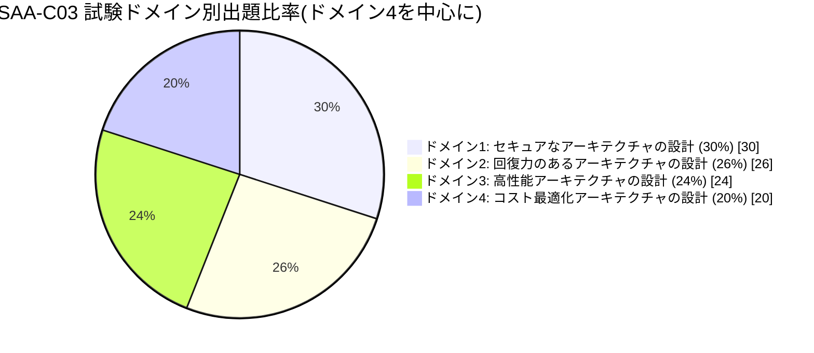

コスト最適化は「安ければ良い」という単純な話ではありません。AWS Well-Architected Framework のコスト最適化の柱では、**ビジネス要件を満たしながら最も低いコストで結果を出す**ことが目的とされています。つまり、可用性やパフォーマンスとのバランスを取りながら「無駄なお金を使わない設計」を選ぶスキルが問われます。

> 出典: [AWS Well-Architected Framework - コスト最適化の柱](https://docs.aws.amazon.com/wellarchitected/latest/cost-optimization-pillar/welcome.html)

### このドメインの4つのタスク

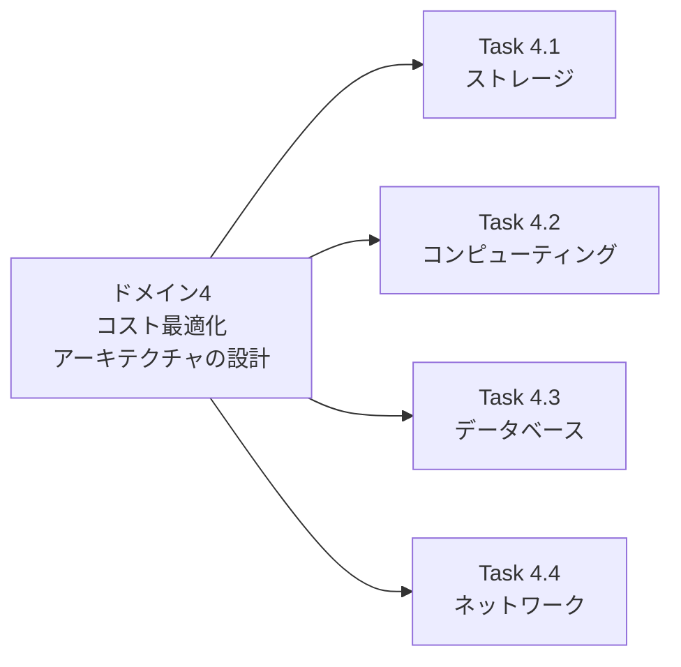

4つのタスクすべてに共通して登場する知識項目があります。それが「AWSコスト管理サービスの機能」と「AWSコスト管理ツール」です。先にこの共通項目を解説してから、各タスクの詳細に入ります。

---

## 目次

- [0. 全タスク共通:AWSコスト管理ツールとサービス機能](#0-全タスク共通awsコスト管理ツールとサービス機能)
- [Task 4.1: コスト最適化ストレージソリューションの設計](#task-41-コスト最適化ストレージソリューションの設計)
- [Task 4.2: コスト最適化コンピューティングソリューションの設計](#task-42-コスト最適化コンピューティングソリューションの設計)
- [Task 4.3: コスト最適化データベースソリューションの設計](#task-43-コスト最適化データベースソリューションの設計)
- [Task 4.4: コスト最適化ネットワークアーキテクチャの設計](#task-44-コスト最適化ネットワークアーキテクチャの設計)
- [参考文献](#参考文献)

---

## 0. 全タスク共通:AWSコスト管理ツールとサービス機能

Task 4.1〜4.4 のすべてに「AWSコスト管理サービスの機能(例: コスト配分タグ、マルチアカウント請求)」「AWSコスト管理ツール(例: Cost Explorer、Budgets、Cost and Usage Report)」という知識項目が繰り返し登場します。まずこれらの土台を理解しておくと、各タスクの学習がスムーズになります。

### 0.1 コスト管理ツールの全体像

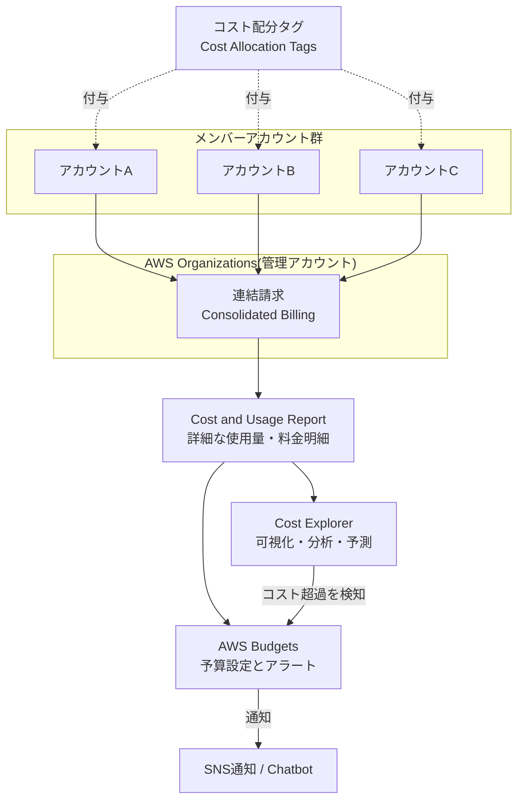

### 0.2 各ツール・機能の役割

| ツール/機能 | 主な役割 | 初級者向けポイント |
|---|---|---|
| **AWS Organizations 連結請求(マルチアカウント請求)** | 複数のAWSアカウントを1つの管理アカウントに集約し、請求を一本化する | 各アカウントの利用量をまとめることで、ボリュームディスカウントやリザーブド購入の共有(共有RI/Savings Plans)が受けやすくなる |
| **コスト配分タグ** | リソースにタグ(例: `Project=Sales`, `Environment=Prod`)を付けてコストを分類する | タグを付けないと「誰が」「何のために」使った費用か分からなくなる。プロジェクト別・部門別のコスト可視化に必須 |
| **AWS Cost and Usage Report (CUR)** | 最も詳細な使用量・コストのデータをS3に出力する | Athena や QuickSight (Amazon Quick Suite) と連携し、時間単位・リソース単位で深掘り分析ができる |
| **AWS Cost Explorer** | コストと使用量をグラフで可視化し、傾向分析や将来予測を行う | 「先月よりなぜ高くなったか」を調べる、Savings Plans/RI購入前のシミュレーションに使う |
| **AWS Budgets** | 予算のしきい値を設定し、超過(または超過予測)時にアラートを出す | 「使いすぎ防止」の仕組み。しきい値到達時にSNS通知やアクション(IAMポリシーの自動適用など)を実行可能 |
| **AWS Trusted Advisor**(補助的) | コスト最適化・パフォーマンス・セキュリティなどの観点からベストプラクティスをチェック | 未使用のEIPや低使用率インスタンスなど「使っていないのに課金されているもの」を検出 |
| **AWS Compute Optimizer**(補助的) | 過去のリソース使用率を機械学習で分析し、最適なインスタンスタイプ・サイズを推奨 | 「オーバープロビジョニング(過剰なスペック)」の是正に活用 |

> 出典:
> [AWS Cost Explorer とは](https://docs.aws.amazon.com/cost-management/latest/userguide/ce-what-is.html) /
> [AWS Budgets を使用したコスト管理](https://docs.aws.amazon.com/cost-management/latest/userguide/budgets-managing-costs.html) /
> [AWS Cost and Usage Report とは](https://docs.aws.amazon.com/cur/latest/userguide/what-is-cur.html) /
> [コスト配分タグの使用](https://docs.aws.amazon.com/awsaccountbilling/latest/aboutv2/cost-alloc-tags.html) /
> [AWS Organizations の連結請求](https://docs.aws.amazon.com/organizations/latest/userguide/orgs_manage_accounts_consolidated-billing.html) /
> [AWS Trusted Advisor](https://docs.aws.amazon.com/awssupport/latest/user/trusted-advisor.html) /
> [AWS Compute Optimizer とは](https://docs.aws.amazon.com/compute-optimizer/latest/ug/what-is.html)

### 0.3 ベストプラクティス(共通)

- タグ付けポリシーを組織レベルで統一し、`CostCenter`・`Environment`・`Project` のような必須タグを Tag Policies で強制する。
- 連結請求はメンバーアカウントの支払いをまとめるだけでなく、**Savings Plans や Reserved Instances の割引をアカウント間で共有**できる点が最大のコストメリット。
- Cost Explorer で異常検知(Cost Anomaly Detection)を有効にし、想定外のスパイクを早期発見する。
- Budgets はコスト予算だけでなく、使用量予算(Usage Budgets)やRI/Savings Plansの利用率予算も設定できる。

---

## Task 4.1: コスト最適化ストレージソリューションの設計

### 4.1.1 ストレージタイプの理解(object / file / block)

まず、AWSのストレージは大きく3種類に分類されることを理解しましょう。

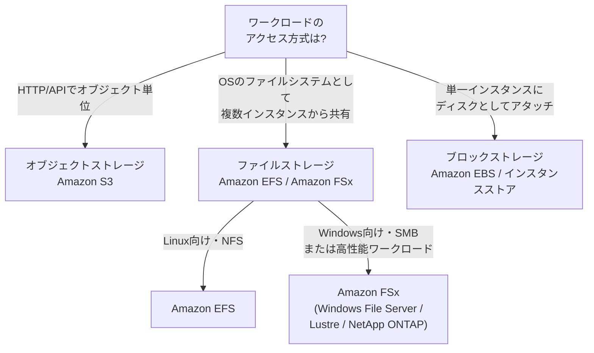

| ストレージタイプ | 代表サービス | 特徴 | 主なコスト最適化ポイント |
|---|---|---|---|
| オブジェクト | Amazon S3 | 事実上無制限の容量、HTTP経由でアクセス、静的Webサイトやデータレイクに最適 | ストレージクラスの階層化、ライフサイクルルール |
| ファイル | Amazon EFS, Amazon FSx | 複数のEC2から同時マウント可能な共有ファイルシステム | EFSの「インフリークエントアクセス」階層、FSxのバックアップ保持設定 |
| ブロック | Amazon EBS, インスタンスストア | 単一EC2インスタンスにアタッチする低レイテンシーディスク | ボリュームタイプの適正選択、不要なスナップショット削除 |

> 出典: [Amazon S3 とは](https://docs.aws.amazon.com/AmazonS3/latest/userguide/Welcome.html) / [Amazon EFS とは](https://docs.aws.amazon.com/efs/latest/ug/whatisefs.html) / [Amazon FSx](https://aws.amazon.com/fsx/) / [Amazon EBS ボリュームタイプ](https://docs.aws.amazon.com/ebs/latest/userguide/ebs-volume-types.html)

### 4.1.2 S3ストレージクラスとライフサイクル管理(ストレージ階層化)

S3のコスト最適化で最も出題頻度が高いのが「**ストレージクラス**」と「**ライフサイクルルール**」です。アクセス頻度が下がるデータを自動的に安価な階層に移動させることで、コストを大幅に削減できます。

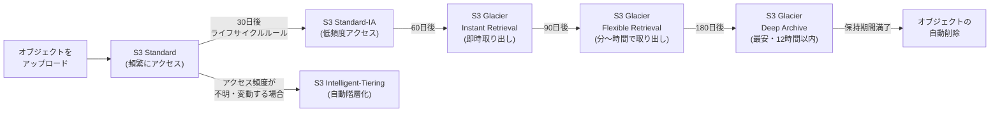

| ストレージクラス | 想定用途 | 取り出し時間 | コスト特性 |
|---|---|---|---|
| S3 Standard | 頻繁にアクセスするデータ | 即時 | 保存コスト高め、取り出し無料 |
| S3 Intelligent-Tiering | アクセスパターンが読めないデータ | 即時(一部階層を除く) | 監視・自動階層化の小額手数料はかかるが取り出し料金なし |
| S3 Standard-IA / One Zone-IA | 月1回程度アクセスするバックアップなど | 即時 | 保存コストは低いが取り出し料金が発生 |
| S3 Glacier Instant Retrieval | 四半期に1回程度アクセスするアーカイブ | ミリ秒 | 低コストかつ即時アクセスが必要な場合に最適 |
| S3 Glacier Flexible Retrieval | 年1〜2回程度のアクセス | 数分〜数時間 | さらに低コスト |
| S3 Glacier Deep Archive | 法規制で長期保管が必要なデータ | 最大12時間 | 最安のストレージクラス |

**スキル: S3オブジェクトライフサイクルの管理**

- ライフサイクルルールで「◯日後に別クラスへ移行」「◯日後に削除」を自動化する。
- マルチパートアップロードの未完了パーツは、放置すると課金され続けるため、ライフサイクルルールで自動削除する設定を忘れずに行う。
- バージョニングを有効にしている場合、旧バージョンにも別途ライフサイクルルールを設定しないとコストが積み上がる。

> 出典: [Amazon S3 ストレージクラス](https://docs.aws.amazon.com/AmazonS3/latest/userguide/storage-class-intro.html) / [S3 オブジェクトライフサイクル管理](https://docs.aws.amazon.com/AmazonS3/latest/userguide/object-lifecycle-mgmt.html)

### 4.1.3 アクセスオプション: Requester Pays

通常、S3のデータ転送・リクエスト料金は「バケット所有者」が支払います。しかし **Requester Pays** を有効にすると、リクエストしたユーザー(ダウンロードする側)がデータ転送とリクエストの費用を負担します。

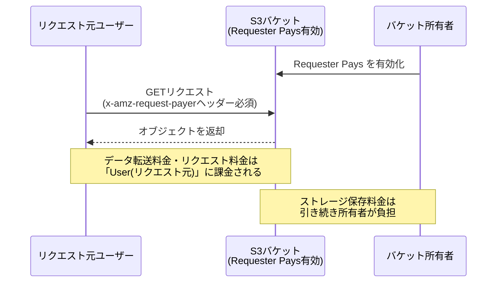

- 想定用途: 研究データセットや公開データを大勢に配布したいが、**転送コストを配布先に負担してもらいたい**場合。
- リクエスト側は認証されたAWSアカウントである必要があり、匿名アクセスはできない。

> 出典: [Requester Pays バケットの使用](https://docs.aws.amazon.com/AmazonS3/latest/userguide/RequesterPaysBuckets.html)

### 4.1.4 ブロックストレージオプション(EBSボリュームタイプ)

EBSは用途に応じて多くのボリュームタイプがあり、**過剰なスペックを選ばないこと**がコスト最適化の鍵です。

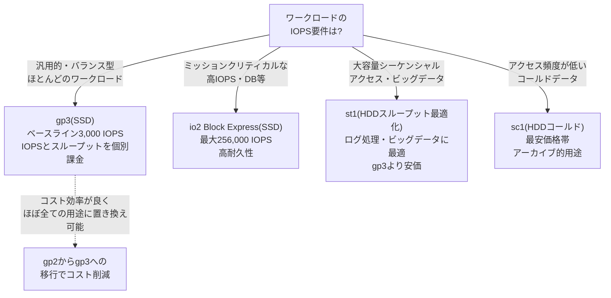

| ボリュームタイプ | 種別 | 主な用途 | コスト最適化のポイント |
<br/>
|---|---|---|---|
| gp3 | SSD(汎用) | Webサーバー、開発・テスト環境、ほとんどの汎用ワークロード | gp2より約20%安価。IOPSとスループットを個別にプロビジョニングできるため、必要な分だけ課金される |
| io2 / io2 Block Express | SSD(プロビジョンドIOPS) | 大規模データベース(SAP HANA、Oracleなど) | 過剰スペックにならないよう、実測IOPSに基づいてサイジングする |
| st1 | HDD(スループット最適化) | ビッグデータ、ログ処理、データウェアハウス | gp3よりも大幅に安いが、ブート用途には使えない点に注意 |
| sc1 | HDD(コールドHDD) | アクセス頻度が非常に低いデータ | 最安価格帯だが低頻度アクセス向け |

> 出典: [Amazon EBS ボリュームタイプ](https://docs.aws.amazon.com/ebs/latest/userguide/ebs-volume-types.html)

### 4.1.5 ハイブリッドストレージオプション(オンプレミスとの連携)

オンプレミス環境からAWSへデータを移行・連携する際、**データ量・接続環境・頻度**によって最適なサービスが異なります。

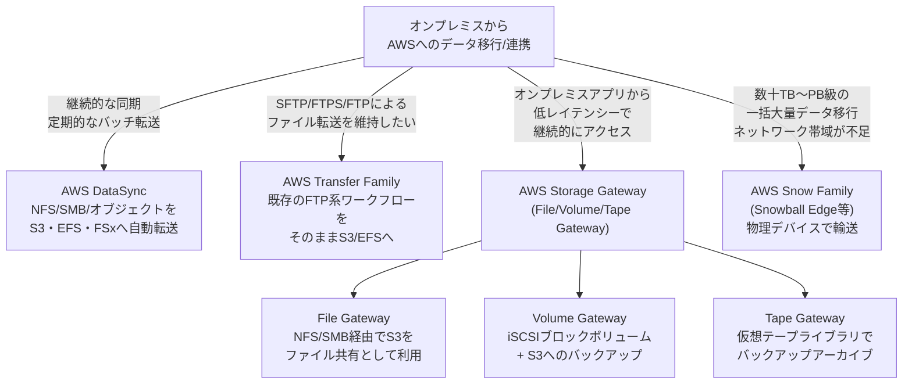

**スキル: 最も低コストな転送方式の判断**

| 状況 | 推奨サービス | 理由 |
|---|---|---|
| 帯域幅が十分にあり、継続的にファイルを同期したい | AWS DataSync | 転送の自動化・スケジューリング・帯域制御が可能 |
| 既存のSFTPクライアント資産を変えたくない | AWS Transfer Family | プロトコル互換性を保ったままS3/EFSに移行できる |
| オンプレミスアプリがローカルディスクのように扱いたい | Storage Gateway | キャッシュ層を持ちながら裏側はS3に保存されコスト効率が良い |
| ネットワーク経由では数週間〜数ヶ月かかる大容量データ | Snow Family | 物理輸送によりネットワークコストと時間を削減 |
| **バッチアップロードか個別アップロードか** | S3への大量オブジェクトは**バッチ(マルチパートアップロード/S3 Batch Operations)** | リクエスト数を減らしAPIコール課金とオーバーヘッドを削減 |

> 出典: [AWS DataSync とは](https://docs.aws.amazon.com/datasync/latest/userguide/what-is-datasync.html) / [AWS Transfer Family とは](https://docs.aws.amazon.com/transfer/latest/userguide/what-is-aws-transfer-family.html) / [AWS Storage Gateway とは](https://docs.aws.amazon.com/storagegateway/latest/userguide/WhatIsStorageGateway.html) / [AWS Snow Family](https://aws.amazon.com/snow/)

### 4.1.6 バックアップ戦略とデータライフサイクル

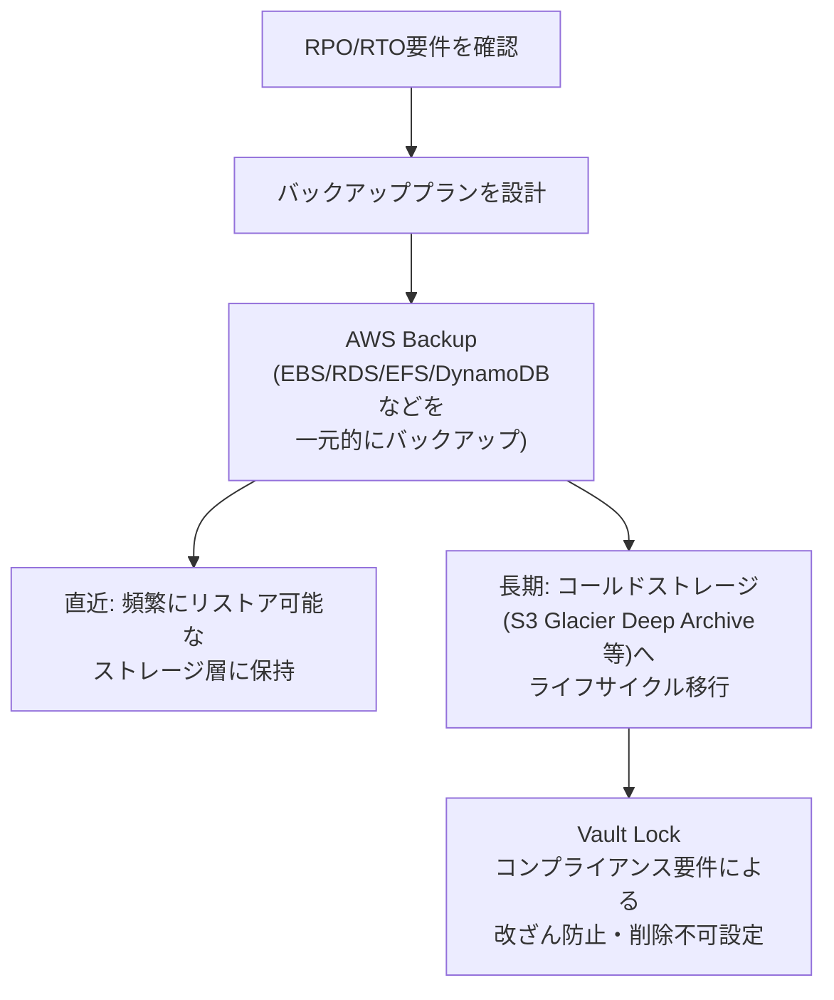

- **バックアップ頻度とスナップショット保持数**はコストに直結する。「毎時バックアップを90日保持」は「毎日バックアップを30日保持」より大幅に高コストになるため、実際のRPO要件に合わせる。
- 増分スナップショット(EBSスナップショットなど)は差分のみ課金されるため、頻度を上げても劇的にはコストが増えにくいが、**保持世代数**の管理が重要。
- コンプライアンス上の長期保持データは、S3 Glacier Deep Archiveのようなアーカイブ層へライフサイクル移行することでコストを最小化する。

> 出典: [AWS Backup とは](https://docs.aws.amazon.com/aws-backup/latest/devguide/whatisbackup.html) / [S3 Glacier Vault Lock](https://docs.aws.amazon.com/amazonglacier/latest/dev/vault-lock.html)

### 4.1.7 Task 4.1 ベストプラクティスまとめ

| 項目 | ベストプラクティス |
|---|---|
| ストレージ選択 | ワークロードのアクセスパターン(頻度・並行性・レイテンシー要件)に応じてオブジェクト/ファイル/ブロックを選ぶ |
| S3階層化 | アクセスパターンが不明ならIntelligent-Tiering、既知ならライフサイクルルールで明示的に階層移行 |
| EBS | gp2は原則gp3へ移行。IOPS要件を正確に見積り過剰プロビジョニングを避ける |
| データ移行 | 帯域幅・データ量・継続性の3軸で DataSync / Transfer Family / Storage Gateway / Snow Family を選定 |
| バックアップ | RPO/RTOに基づく頻度・保持期間設計、長期保管はアーカイブ層へライフサイクル移行 |

---

## Task 4.2: コスト最適化コンピューティングソリューションの設計

### 4.2.1 EC2購入オプション

コンピューティングのコスト最適化で最重要なのが「**どの購入オプションを使うか**」です。

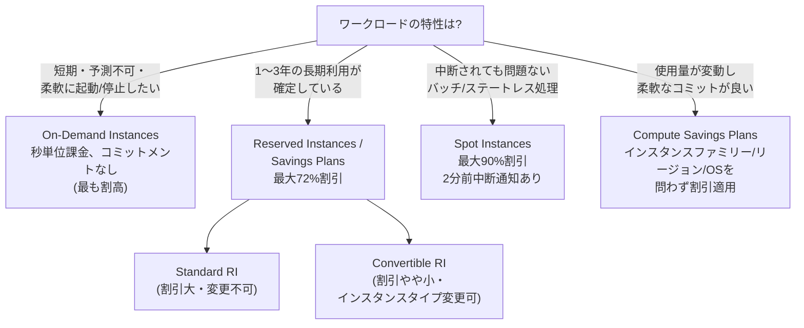

| 購入オプション | 割引率の目安 | コミットメント | 適した用途 |
|---|---|---|---|
| On-Demand | 割引なし(基準) | なし | 短期テスト、予測不能なワークロード |
| Reserved Instances | 最大72% | 1年 or 3年 | 定常稼働する既知のワークロード(DBサーバー等) |
| Savings Plans(Compute/EC2 Instance) | 最大72% | 1年 or 3年の**支払い額**をコミット | インスタンスファミリーやリージョンが変わる可能性がある場合 |
| Spot Instances | 最大90% | なし(いつでも中断される可能性) | バッチ処理、CI/CD、ステートレスなWebサーバー、ビッグデータ処理 |

**スキル: 適切なスケーリング方式の判断(水平 vs 垂直)**

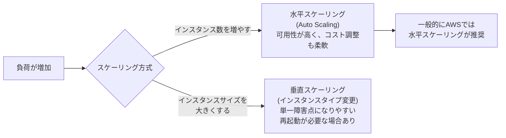

> 出典: [Amazon EC2 インスタンス購入オプション](https://docs.aws.amazon.com/AWSEC2/latest/UserGuide/instance-purchasing-options.html) / [Spotインスタンスの使用](https://docs.aws.amazon.com/AWSEC2/latest/UserGuide/using-spot-instances.html) / [Savings Plans とは](https://docs.aws.amazon.com/savingsplans/latest/userguide/what-is-savings-plans.html) / [リザーブドインスタンス](https://docs.aws.amazon.com/AWSEC2/latest/UserGuide/ec2-reserved-instances.html)

### 4.2.2 コンピューティングサービスの選択(EC2 / Lambda / Fargate)

利用率最適化の観点では、「常時起動のサーバー(EC2)」よりも「使った分だけ課金されるサーバーレス/コンテナ」の方が合理的な場合が多くあります。

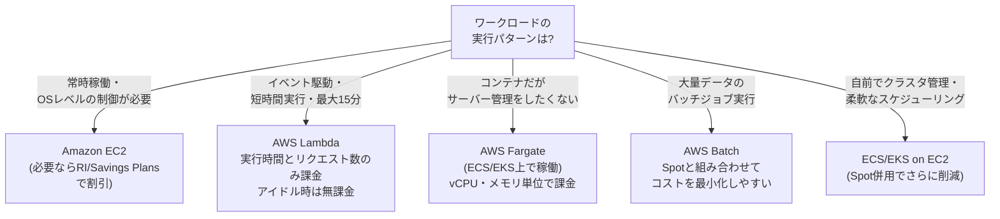

| サービス | 課金単位 | コスト最適化ポイント |
|---|---|---|
| Amazon EC2 | 起動時間(秒単位) | 使用率が低い時間帯があるならAuto Scalingで台数を調整、または予約系割引を活用 |
| AWS Lambda | リクエスト数 + 実行時間(ミリ秒) × メモリ | アイドルタイムの課金が発生しないため、断続的な処理に最適 |
| AWS Fargate | 使用したvCPU・メモリ×時間 | ホストEC2の管理コストが不要になる分、単価はEC2より高めだが運用コスト込みで有利な場合が多い |
| AWS Batch | 内部で使うコンピューティングリソース(EC2/Fargate/Spot)に依存 | Spotインスタンスと組み合わせることで大幅なコスト削減が可能 |

**スキル: ワークロードクラス別の可用性要件の判断**

- 本番稼働(Production)ワークロード: マルチAZ・Auto Scaling・On-Demand or RI中心で高可用性を優先。
- 非本番(開発・テスト)ワークロード: シングルAZでも許容されることが多く、Spotインスタンスや自動停止スケジュールでコスト削減。

> 出典: [AWS Lambda とは](https://docs.aws.amazon.com/lambda/latest/dg/welcome.html) / [AWS Fargate とは](https://docs.aws.amazon.com/AmazonECS/latest/userguide/what-is-fargate.html) / [AWS Batch とは](https://docs.aws.amazon.com/batch/latest/userguide/what-is-batch.html)

### 4.2.3 スケーリング戦略とEC2 Hibernate

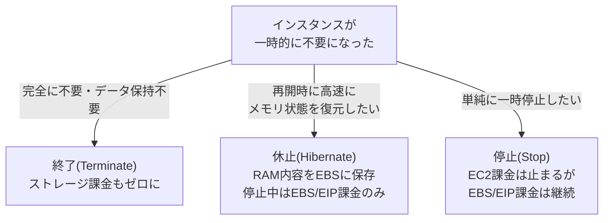

- Auto Scaling は需要予測(Predictive Scaling)やスケジュールベース(business hoursのみ稼働)と組み合わせることで、夜間・週末のリソースを削減できる。
- Hibernateは頻繁な再起動が必要なワークロード(開発環境など)で、起動時間短縮とコスト削減を両立できる。

> 出典: [Amazon EC2 Auto Scaling とは](https://docs.aws.amazon.com/autoscaling/ec2/userguide/what-is-amazon-ec2-auto-scaling.html) / [EC2 インスタンスの休止(Hibernate)](https://docs.aws.amazon.com/AWSEC2/latest/UserGuide/Hibernate.html)

### 4.2.4 ロードバランシング戦略

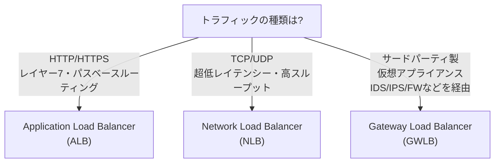

| ロードバランサー | レイヤー | 主な用途 | コスト最適化の観点 |
|---|---|---|---|
| ALB | L7(HTTP/HTTPS) | Webアプリ、マイクロサービス、コンテナ | 1台のALBで複数のターゲットグループにルーティングでき、サービスごとのALB乱立を防げる |
| NLB | L4(TCP/UDP/TLS) | 超高スループット・静的IPが必要なワークロード | 必要な場合のみ使用(ALBで十分な要件にNLBは過剰) |
| GWLB | L3(ネットワーク層) | ファイアウォールなど仮想アプライアンスの透過的挿入 | 集中管理により個別アプライアンスの重複導入コストを削減 |

> 出典: [Elastic Load Balancing とは](https://docs.aws.amazon.com/elasticloadbalancing/latest/userguide/elastic-load-balancing.html) / [Application Load Balancer](https://docs.aws.amazon.com/elasticloadbalancing/latest/application/introduction.html) / [Network Load Balancer](https://docs.aws.amazon.com/elasticloadbalancing/latest/network/introduction.html) / [Gateway Load Balancer](https://docs.aws.amazon.com/elasticloadbalancing/latest/gateway/introduction.html)

### 4.2.5 ハイブリッド・分散コンピューティング

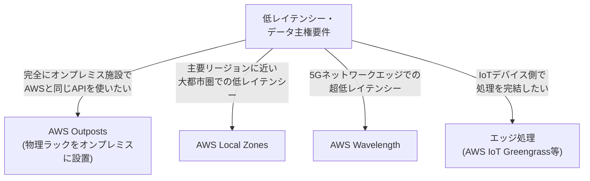

- これらはいずれも「データをリージョンまで転送するコスト・遅延」を削減する目的で使われる。全ワークロードに必要なわけではなく、**低レイテンシー要件やデータ主権規制がある場合にのみ選択**するのがコスト最適化の考え方。

> 出典: [AWS Outposts とは](https://docs.aws.amazon.com/outposts/latest/userguide/what-is-outposts.html) / [AWS Local Zones とは](https://docs.aws.amazon.com/local-zones/latest/ug/what-is-aws-local-zones.html) / [AWS Wavelength とは](https://docs.aws.amazon.com/wavelength/latest/developerguide/what-is-wavelength.html)

### 4.2.6 Task 4.2 ベストプラクティスまとめ

| 項目 | ベストプラクティス |
|---|---|
| 購入オプション | 定常負荷はReserved/Savings Plans、変動・中断可能な負荷はSpot、短期はOn-Demand |
| コンピューティング選択 | 常時稼働ならEC2、イベント駆動ならLambda、コンテナ運用の手間を減らすならFargate |
| スケーリング | 水平スケーリングを基本とし、需要予測・スケジュールベースのAuto Scalingを併用 |
| ロードバランサー | 用途に応じALB/NLB/GWLBを使い分け、不要な重複導入を避ける |
| インスタンスサイズ | Compute Optimizerを使い実測値に基づいてファミリー・サイズを適正化 |

---

## Task 4.3: コスト最適化データベースソリューションの設計

### 4.3.1 データベースタイプとサービスの選択

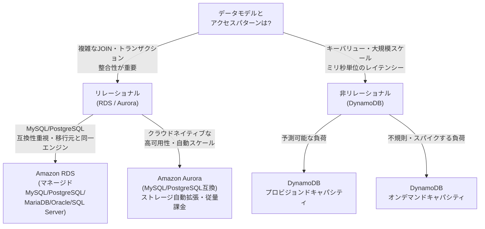

| 観点 | リレーショナル(RDS/Aurora) | 非リレーショナル(DynamoDB) |
|---|---|---|
| コスト構造 | インスタンスサイズ×稼働時間+ストレージ | 読み書きキャパシティユニット(RCU/WCU)またはオンデマンドのリクエスト数 |
| スケーリング | 垂直スケーリングが中心(Auroraは読み取りは水平も可) | 自動で水平スケール、サーバー管理不要 |
| 向いているワークロード | 複雑なクエリ、既存アプリの移行 | 超大規模・低レイテンシーが必要なキーバリュー型アクセス |
| コスト最適化の鍵 | 適切なインスタンスサイズ選定、Aurora Serverless v2による自動スケール | オンデマンド vs プロビジョンドの選択、DynamoDB Auto Scaling |

**スキル: コスト効率の良いデータベースタイプの判断(時系列・列指向)**

- 時系列データ(IoTセンサーなど大量の時刻付きデータ)は Amazon Timestream のような時系列特化型サービスがコスト効率に優れる。
- 分析用途で列指向(カラムナー)フォーマットが必要な場合は Amazon Redshift やS3 + Athena(Parquet形式)がコスト効率的。

> 出典: [Amazon RDS とは](https://docs.aws.amazon.com/AmazonRDS/latest/UserGuide/Welcome.html) / [Amazon Aurora の概要](https://docs.aws.amazon.com/AmazonRDS/latest/AuroraUserGuide/CHAP_AuroraOverview.html) / [Amazon DynamoDB とは](https://docs.aws.amazon.com/amazondynamodb/latest/developerguide/Introduction.html)

### 4.3.2 データベースキャパシティプランニング

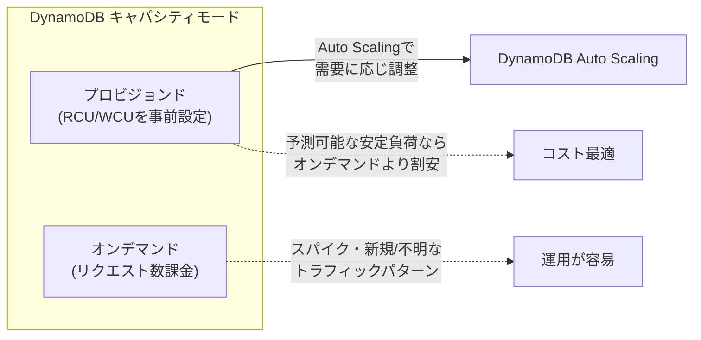

- 安定していて予測可能なワークロードは**プロビジョンドキャパシティ + Auto Scaling**の方が、オンデマンドより低コストになりやすい。
- 新規サービスや負荷が読めない場合はオンデマンドから始め、パターンが分かった時点でプロビジョンドへ切り替えるのが定石。

> 出典: [DynamoDB の読み込み/書き込みキャパシティモード](https://docs.aws.amazon.com/amazondynamodb/latest/developerguide/HowItWorks.ReadWriteCapacityMode.html)

### 4.3.3 データベース接続とプロキシ

サーバーレス(Lambda)からリレーショナルDBに直接接続すると、同時実行数増加時に**接続数の枯渇**が発生しコスト・パフォーマンス両面で問題になります。

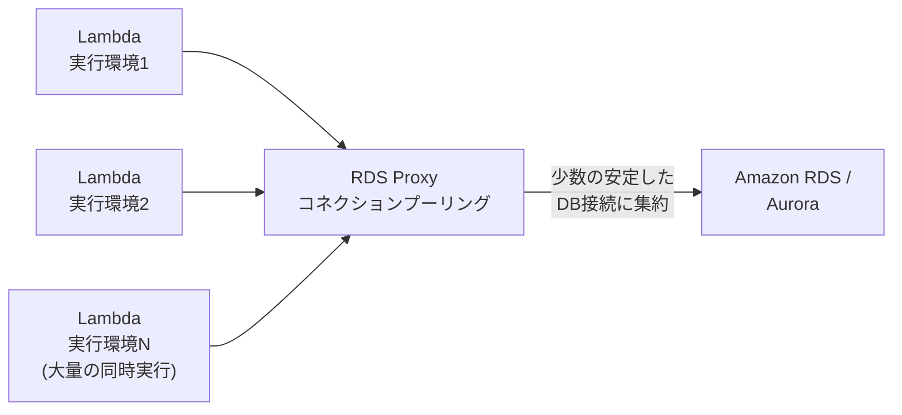

- RDS Proxyはコネクションプールを管理し、DBインスタンスへの接続数を抑えることで、より小さい(安価な)インスタンスクラスでも同じ同時実行数を処理できる場合がある。
- フェイルオーバー時の接続切り替えも高速化されるため、可用性の観点でも有効。

> 出典: [Amazon RDS Proxy](https://docs.aws.amazon.com/AmazonRDS/latest/UserGuide/rds-proxy.html)

### 4.3.4 データベースレプリケーション(読み取りレプリカ)

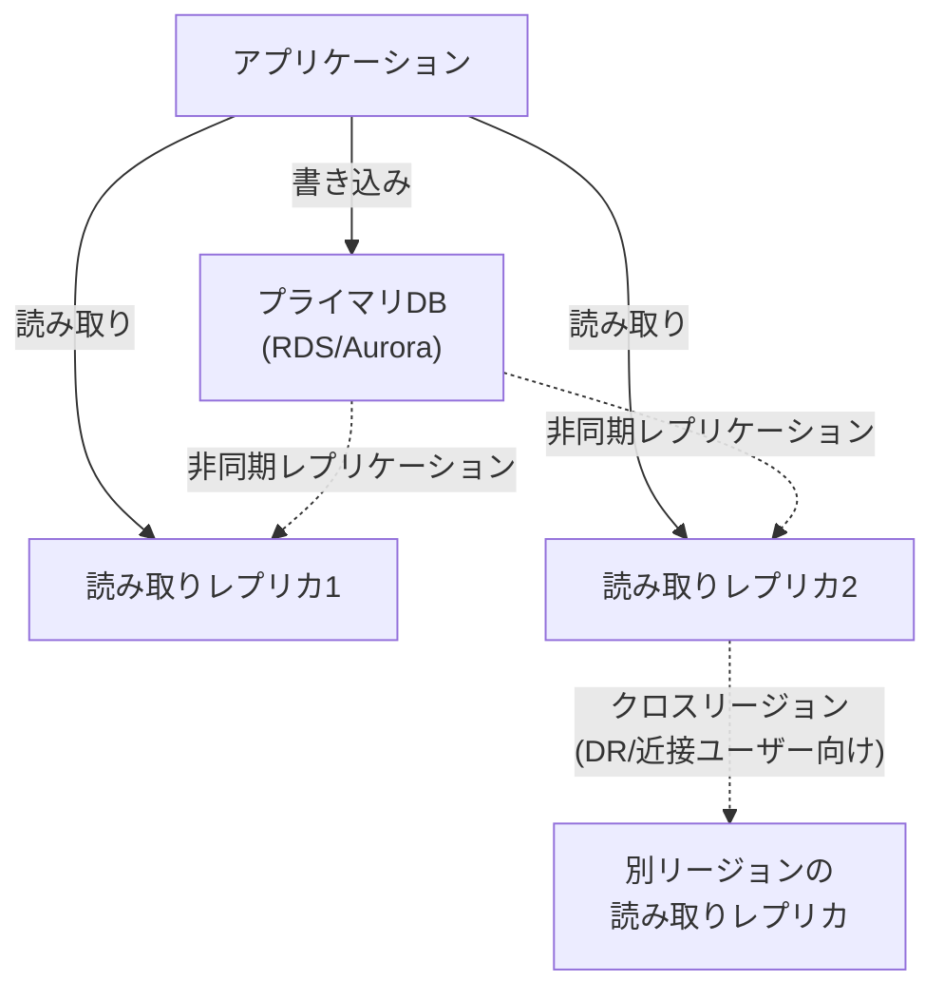

- 読み取りレプリカでリード処理を分散すれば、**プライマリインスタンスのサイズを不要に大きくせずに済む**(スケールアップではなくスケールアウト)。
- Auroraは最大15個のレプリカを低レイテンシーで追加でき、Auto Scalingでレプリカ数を需要に応じ増減できるため、常時最大構成を維持するより安価。

> 出典: [Amazon RDS の読み取りレプリカの使用](https://docs.aws.amazon.com/AmazonRDS/latest/UserGuide/USER_ReadRepl.html)

### 4.3.5 キャッシング戦略

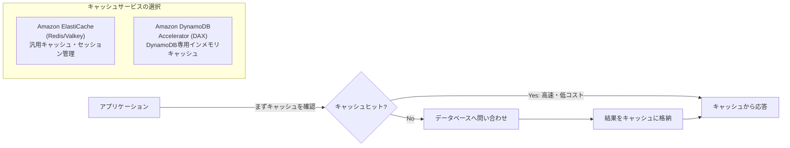

- キャッシュ導入により、DB側の読み取りリクエスト数(=課金対象)そのものを削減できる。特にRDBの読み取りレプリカを増やすより、キャッシュ層追加の方が低コストな場合が多い。
- DynamoDBワークロードで読み取りが集中する場合はDAXがマイクロ秒レベルの応答を実現しつつ、DynamoDBの読み取りキャパシティ消費を抑える。

> 出典: [Amazon ElastiCache とは](https://docs.aws.amazon.com/AmazonElastiCache/latest/red-ug/WhatIs.html) / [DynamoDB Accelerator (DAX)](https://docs.aws.amazon.com/amazondynamodb/latest/developerguide/DAX.html)

### 4.3.6 バックアップと保持ポリシー

```mermaid
flowchart TD
    Req["データ保持要件<br/>(法規制/RPO)を確認"]
    Req --> Auto["自動バックアップ<br/>(RDS: 1〜35日保持)"]
    Req --> Manual["手動スナップショット<br/>(削除するまで保持・課金継続)"]
    Manual -->|不要になったら<br/>削除を徹底| Cleanup["定期的な棚卸しで<br/>コスト削減"]
    Auto -->|ポイントインタイム<br/>リカバリが必要| PITR["トランザクションログの保持"]
```

- 手動スナップショットは**明示的に削除するまで課金され続ける**ため、放置すると気づかぬうちにコストが積み上がる典型例。定期棚卸しが重要。
- スナップショット頻度は、実際のRPO要件(「何分前までのデータ復旧が必要か」)に基づいて設計し、過剰な頻度を避ける。

> 出典: [Amazon RDS の自動バックアップの使用](https://docs.aws.amazon.com/AmazonRDS/latest/UserGuide/USER_WorkingWithAutomatedBackups.html)

### 4.3.7 データベース移行(homogeneous / heterogeneous)

```mermaid
flowchart TD
    Migrate["データベース移行"]
    Migrate -->|同一エンジン間<br/>例: MySQL→MySQL| Homo["同種移行(Homogeneous)<br/>AWS DMSのみで完結"]
    Migrate -->|異なるエンジン間<br/>例: Oracle→Aurora PostgreSQL| Hetero["異種移行(Heterogeneous)<br/>AWS SCTでスキーマ変換<br/>+ AWS DMSでデータ移行"]
```

- 異種移行はライセンスコストの高い商用DB(Oracle/SQL Server)からオープンソース互換のAurora/RDSへ移行し、**ライセンス費用そのものを削減する**代表的なコスト最適化手法。
- エンジン選定時は「MySQL互換 vs PostgreSQL互換」など機能要件と移行のしやすさを比較する。

> 出典: [AWS Database Migration Service とは](https://docs.aws.amazon.com/dms/latest/userguide/Welcome.html) / [AWS Schema Conversion Tool](https://docs.aws.amazon.com/SchemaConversionTool/latest/userguide/CHAP_Welcome.html)

### 4.3.8 Task 4.3 ベストプラクティスまとめ

| 項目 | ベストプラクティス |
|---|---|
| DB種別選択 | トランザクション整合性が必要ならRDS/Aurora、超大規模・低レイテンシーならDynamoDB |
| キャパシティ | 安定負荷はプロビジョンド+Auto Scaling、不明な負荷はオンデマンドから開始 |
| 接続管理 | サーバーレスからの接続はRDS Proxyでプーリングしインスタンスサイズを抑制 |
| スケーリング | 読み取りはレプリカ・キャッシュで水平分散し、プライマリの垂直スケールを避ける |
| ライセンス | 商用DBからオープンソース互換DBへの移行でライセンスコストを削減 |
| バックアップ | 手動スナップショットの棚卸しを定期実施 |

---

## Task 4.4: コスト最適化ネットワークアーキテクチャの設計

### 4.4.1 NATゲートウェイの配置戦略

NAT Gatewayは**アベイラビリティゾーン(AZ)ごとの配置**が可用性のベストプラクティスですが、コストとのトレードオフがあります。

```mermaid
flowchart TD
    Design["NAT配置設計"]
    Design -->|コスト最優先<br/>可用性の一部妥協可| Single["シングル共有NAT Gateway<br/>1つのAZに配置<br/>他AZからはAZ間データ転送料が発生"]
    Design -->|可用性最優先<br/>本番ワークロード| PerAZ["AZごとにNAT Gateway<br/>AZ障害の影響を局所化<br/>AZ間転送料は発生しない"]
    Design -->|開発/テスト環境で<br/>コスト最小化| NATInstance["NATインスタンス(EC2)<br/>時間課金なしだが<br/>自己管理・スケーリングの手間"]
```

| 方式 | コスト | 可用性 | 運用負荷 |
|---|---|---|---|
| NAT Gateway(AZごと) | 高(AZ数分のNAT Gateway時間料金) | 高(1AZ障害が他AZに波及しない) | 低(フルマネージド) |
| NAT Gateway(共有・単一AZ) | 中(NAT Gateway 1台分+AZ間データ転送料) | 低(単一障害点) | 低 |
| NATインスタンス | インスタンス時間料金のみ(小さいインスタンスで代替可) | 自分でAuto Scaling/冗長化を設計する必要あり | 高(パッチ適用・スケーリングを自前管理) |

> 出典: [NATゲートウェイ](https://docs.aws.amazon.com/vpc/latest/userguide/vpc-nat-gateway.html)

### 4.4.2 ネットワーク接続オプション(Direct Connect / VPN / インターネット)

```mermaid
flowchart TD
    Q["オンプレミス〜AWS間の<br/>接続要件は?"]
    Q -->|一時的・低コストで<br/>すぐに開始したい| VPN["AWS Site-to-Site VPN<br/>インターネット経由の暗号化トンネル<br/>時間課金+データ転送料"]
    Q -->|安定した帯域幅・低レイテンシーが<br/>継続的に必要| DX["AWS Direct Connect<br/>専用線接続<br/>ポート時間課金(帯域幅により変動)"]
    Q -->|DXの導入までの<br/>暫定的な暗号化経路| DXVPN["Direct Connect + VPN<br/>(DX上でVPNを併用)"]

    DX -->|帯域幅選択| Speed["50Mbps〜100Gbpsまで<br/>必要な帯域幅を選択<br/>(過剰な帯域は無駄なコスト)"]
```

| 接続方式 | 初期コスト | 帯域の安定性 | データ転送コスト |
|---|---|---|---|
| インターネット経由 | なし | 不安定 | リージョンのアウトバウンド料金 |
| Site-to-Site VPN | 低(時間課金のみ) | インターネット品質に依存 | VPN経由でもインターネットのデータ転送料が適用 |
| Direct Connect | 高(専用線敷設・ポート契約) | 安定・低レイテンシー | Direct Connց経由の方がインターネット経由より一般的に割安 |

**スキル: 適切な帯域幅の選定**

- Direct Connectはポートスピードごとに課金されるため、実測トラフィックに対して過剰なポートスピードを契約しない。
- 複数のVPN接続が必要か、1本のDirect Connectで足りるかをトラフィック量から判断する(単一VPNの帯域上限と可用性のトレードオフ)。

> 出典: [AWS Direct Connect とは](https://docs.aws.amazon.com/directconnect/latest/UserGuide/Welcome.html) / [AWS Site-to-Site VPN](https://docs.aws.amazon.com/vpn/latest/s2svpn/VPC_VPN.html)

### 4.4.3 ネットワークルーティング・トポロジー・ピアリング

```mermaid
flowchart TD
    subgraph Naive["非効率な構成"]
        VPCA1["VPC A"] <--> VPCB1["VPC B"]
        VPCA1 <--> VPCC1["VPC C"]
        VPCB1 <--> VPCC1
        Note1["VPC数が増えるほど<br/>ピアリング数が指数的に増加<br/>(N×(N-1)/2)"]
    end

    subgraph Optimized["Transit Gatewayによる集約"]
        TGW["AWS Transit Gateway"]
        VPCA2["VPC A"] --> TGW
        VPCB2["VPC B"] --> TGW
        VPCC2["VPC C"] --> TGW
        TGW --> OnPrem["オンプレミス<br/>(Direct Connect経由)"]
    end
```

- VPCピアリングは無料(データ転送料は別途発生)だが、VPC数が増えるとメッシュ状の接続管理が複雑化する。
- Transit Gatewayは時間課金+データ処理料金が発生するが、多数のVPCを接続する場合は**運用コストと将来の拡張性**の観点で有利になりやすい。少数VPC(2〜3個)ならピアリングの方がシンプルでコスト効率が良い場合もある。

**VPCエンドポイントによるコスト削減**

```mermaid
flowchart LR
    subgraph Before["VPCエンドポイントなし"]
        EC2A["EC2<br/>(プライベートサブネット)"] --> NATA["NAT Gateway<br/>(データ処理料金が発生)"]
        NATA --> IGWA["インターネットゲートウェイ"]
        IGWA --> S3A["Amazon S3"]
    end

    subgraph After["Gateway VPCエンドポイント使用"]
        EC2B["EC2<br/>(プライベートサブネット)"] --> EndpointB["S3 Gateway Endpoint<br/>(無料・AWS内部経路)"]
        EndpointB --> S3B["Amazon S3"]
    end
```

- S3やDynamoDBへのアクセスは**Gateway型VPCエンドポイント**を使うことで、NAT Gateway経由のデータ処理料金を回避できる(Gateway型エンドポイント自体は無料)。
- その他のAWSサービスへは**Interface型VPCエンドポイント(PrivateLink)**を使うことでインターネットゲートウェイ・NAT経由を避けられるが、こちらは時間課金+データ処理料金が発生するため、通信量とのバランスで判断する。

> 出典: [AWS Transit Gateway とは](https://docs.aws.amazon.com/vpc/latest/tgw/what-is-transit-gateway.html) / [VPCピアリングとは](https://docs.aws.amazon.com/vpc/latest/peering/what-is-vpc-peering.html) / [VPCエンドポイント](https://docs.aws.amazon.com/vpc/latest/privatelink/vpc-endpoints.html)

### 4.4.4 データ転送コストの最小化

```mermaid
flowchart TD
    Traffic["データ転送の種類"]
    Traffic -->|同一AZ内<br/>プライベートIP経由| Free1["無料"]
    Traffic -->|同一リージョン<br/>AZ間| Cost1["有料(比較的安価)<br/>設計でAZ間通信を最小化"]
    Traffic -->|リージョン間| Cost2["有料(より高価)<br/>本当に必要な場合のみ<br/>クロスリージョン通信を設計"]
    Traffic -->|インターネットへの<br/>アウトバウンド| Cost3["最も高価<br/>CloudFront経由で<br/>キャッシュ・削減可能"]
    Traffic -->|AWSサービス間<br/>S3等・エンドポイント経由| Free2["Gatewayエンドポイント経由なら無料"]
```

| 通信経路 | コスト傾向 | 最適化手法 |
|---|---|---|
| 同一AZ内 | 無料 | 可能な限り同一AZ内で完結する設計(ただし可用性とのトレードオフに注意) |
| AZ間(同一リージョン) | 低コストだが有料 | Auto Scalingグループやマイクロサービス間通信の配置を意識 |
| リージョン間 | 高コスト | 本当にマルチリージョンが必要かを精査し、不要な複製を避ける |
| インターネットへのアウトバウンド | 最も高コスト | CloudFrontでキャッシュしオリジンへのアクセス自体を削減 |

> 出典: [Amazon EC2 オンデマンド料金(データ転送)](https://aws.amazon.com/ec2/pricing/on-demand/) / [AWSの料金の仕組み: データ転送](https://docs.aws.amazon.com/whitepapers/latest/how-aws-pricing-works/data-transfer.html)

### 4.4.5 CDN・エッジキャッシングの活用

```mermaid
flowchart LR
    User["世界中のユーザー"] --> Edge["Amazon CloudFront<br/>エッジロケーション<br/>(キャッシュ)"]
    Edge -->|キャッシュヒット| User
    Edge -->|キャッシュミスのみ<br/>オリジンへ| Origin["オリジン<br/>(S3 / ALB / EC2)"]
    User2["リアルタイム性が<br/>重要なアプリ"] --> GA["AWS Global Accelerator<br/>(AWSグローバルネットワーク経由で<br/>最寄りのエンドポイントへルーティング)"]
    GA --> App["アプリケーションエンドポイント"]
```

- CloudFrontでコンテンツをキャッシュすることで、オリジン(S3やEC2)へのリクエスト数・データ転送量を削減し、直接的にコストダウンにつながる。
- Global Acceleratorは静的コンテンツのキャッシュではなく、TCP/UDPトラフィックをAWSのバックボーンネットワーク経由でルーティングし、レイテンシー改善とDDoS耐性を提供する(コスト最適化というよりパフォーマンス/可用性寄りだが、ネットワーク経路のコスト構造として出題される)。

> 出典: [Amazon CloudFront とは](https://docs.aws.amazon.com/AmazonCloudFront/latest/DeveloperGuide/Introduction.html) / [AWS Global Accelerator とは](https://docs.aws.amazon.com/global-accelerator/latest/dg/what-is-global-accelerator.html)

### 4.4.6 スロットリング戦略

```mermaid
flowchart TD
    Client["クライアント"] --> APIGW["Amazon API Gateway"]
    APIGW -->|レート制限内| Backend["バックエンド<br/>(Lambda等)"]
    APIGW -->|レート制限超過| Throttle["429 Too Many Requests<br/>リクエストを拒否"]
    Throttle -.バックエンドの過剰な<br/>スケールアウトを防止.-> CostSave["コスト超過の防止"]
```

- スロットリング(使用量プランやレート制限)は、意図しない大量リクエストによるバックエンドの過剰スケーリング・想定外の高額請求を防ぐガードレールとして機能する。
- API Gatewayの使用量プラン(Usage Plans)でAPIキーごとにレート制限・クォータを設定し、特定クライアントによるコスト暴走を防ぐ。

> 出典: [Amazon API Gateway でのリクエストスロットリング](https://docs.aws.amazon.com/apigateway/latest/developerguide/api-gateway-request-throttling.html)

### 4.4.7 Task 4.4 ベストプラクティスまとめ

| 項目 | ベストプラクティス |
|---|---|
| NAT配置 | 本番はAZごとに配置して可用性確保、開発環境などコスト優先時は共有NATやNATインスタンスも検討 |
| 接続方式 | 継続的・大容量通信はDirect Connect、一時的・小規模はVPNから開始 |
| ルーティング | VPC数が多い場合はTransit Gatewayで集約、少数ならピアリングで十分な場合も |
| VPCエンドポイント | S3/DynamoDBはGatewayエンドポイントで無料化、他サービスはInterfaceエンドポイントとNAT経由コストを比較 |
| データ転送 | AZ間・リージョン間・インターネットの順にコストが上がることを意識した設計 |
| CDN活用 | CloudFrontでオリジンアクセスを削減し、転送量そのものを圧縮 |
| スロットリング | 使用量プランで想定外の高額請求を未然に防止 |

---

## 参考文献

### コスト管理ツール・機能

- [AWS Cost Explorer とは](https://docs.aws.amazon.com/cost-management/latest/userguide/ce-what-is.html)
- [AWS Budgets を使用したコスト管理](https://docs.aws.amazon.com/cost-management/latest/userguide/budgets-managing-costs.html)
- [AWS Cost and Usage Report とは](https://docs.aws.amazon.com/cur/latest/userguide/what-is-cur.html)
- [コスト配分タグの使用](https://docs.aws.amazon.com/awsaccountbilling/latest/aboutv2/cost-alloc-tags.html)
- [AWS Organizations の連結請求](https://docs.aws.amazon.com/organizations/latest/userguide/orgs_manage_accounts_consolidated-billing.html)
- [AWS Trusted Advisor](https://docs.aws.amazon.com/awssupport/latest/user/trusted-advisor.html)
- [AWS Compute Optimizer とは](https://docs.aws.amazon.com/compute-optimizer/latest/ug/what-is.html)
- [AWS Well-Architected Framework - コスト最適化の柱](https://docs.aws.amazon.com/wellarchitected/latest/cost-optimization-pillar/welcome.html)

### ストレージ(Task 4.1)

- [Amazon S3 とは](https://docs.aws.amazon.com/AmazonS3/latest/userguide/Welcome.html)
- [Amazon S3 ストレージクラス](https://docs.aws.amazon.com/AmazonS3/latest/userguide/storage-class-intro.html)
- [S3 オブジェクトライフサイクル管理](https://docs.aws.amazon.com/AmazonS3/latest/userguide/object-lifecycle-mgmt.html)
- [Requester Pays バケットの使用](https://docs.aws.amazon.com/AmazonS3/latest/userguide/RequesterPaysBuckets.html)
- [Amazon EBS ボリュームタイプ](https://docs.aws.amazon.com/ebs/latest/userguide/ebs-volume-types.html)
- [Amazon EFS とは](https://docs.aws.amazon.com/efs/latest/ug/whatisefs.html)
- [Amazon FSx](https://aws.amazon.com/fsx/)
- [AWS DataSync とは](https://docs.aws.amazon.com/datasync/latest/userguide/what-is-datasync.html)
- [AWS Transfer Family とは](https://docs.aws.amazon.com/transfer/latest/userguide/what-is-aws-transfer-family.html)
- [AWS Storage Gateway とは](https://docs.aws.amazon.com/storagegateway/latest/userguide/WhatIsStorageGateway.html)
- [AWS Snow Family](https://aws.amazon.com/snow/)
- [AWS Backup とは](https://docs.aws.amazon.com/aws-backup/latest/devguide/whatisbackup.html)
- [S3 Glacier Vault Lock](https://docs.aws.amazon.com/amazonglacier/latest/dev/vault-lock.html)

### コンピューティング(Task 4.2)

- [Amazon EC2 インスタンス購入オプション](https://docs.aws.amazon.com/AWSEC2/latest/UserGuide/instance-purchasing-options.html)
- [Spotインスタンスの使用](https://docs.aws.amazon.com/AWSEC2/latest/UserGuide/using-spot-instances.html)
- [Savings Plans とは](https://docs.aws.amazon.com/savingsplans/latest/userguide/what-is-savings-plans.html)
- [リザーブドインスタンス](https://docs.aws.amazon.com/AWSEC2/latest/UserGuide/ec2-reserved-instances.html)
- [Amazon EC2 インスタンスタイプ](https://docs.aws.amazon.com/AWSEC2/latest/UserGuide/instance-types.html)
- [Amazon EC2 Auto Scaling とは](https://docs.aws.amazon.com/autoscaling/ec2/userguide/what-is-amazon-ec2-auto-scaling.html)
- [EC2 インスタンスの休止(Hibernate)](https://docs.aws.amazon.com/AWSEC2/latest/UserGuide/Hibernate.html)
- [AWS Lambda とは](https://docs.aws.amazon.com/lambda/latest/dg/welcome.html)
- [AWS Fargate とは](https://docs.aws.amazon.com/AmazonECS/latest/userguide/what-is-fargate.html)
- [AWS Batch とは](https://docs.aws.amazon.com/batch/latest/userguide/what-is-batch.html)
- [Elastic Load Balancing とは](https://docs.aws.amazon.com/elasticloadbalancing/latest/userguide/elastic-load-balancing.html)
- [Application Load Balancer](https://docs.aws.amazon.com/elasticloadbalancing/latest/application/introduction.html)
- [Network Load Balancer](https://docs.aws.amazon.com/elasticloadbalancing/latest/network/introduction.html)
- [Gateway Load Balancer](https://docs.aws.amazon.com/elasticloadbalancing/latest/gateway/introduction.html)
- [AWS Outposts とは](https://docs.aws.amazon.com/outposts/latest/userguide/what-is-outposts.html)
- [AWS Local Zones とは](https://docs.aws.amazon.com/local-zones/latest/ug/what-is-aws-local-zones.html)
- [AWS Wavelength とは](https://docs.aws.amazon.com/wavelength/latest/developerguide/what-is-wavelength.html)

### データベース(Task 4.3)

- [Amazon RDS とは](https://docs.aws.amazon.com/AmazonRDS/latest/UserGuide/Welcome.html)
- [Amazon Aurora の概要](https://docs.aws.amazon.com/AmazonRDS/latest/AuroraUserGuide/CHAP_AuroraOverview.html)
- [Amazon DynamoDB とは](https://docs.aws.amazon.com/amazondynamodb/latest/developerguide/Introduction.html)
- [DynamoDB の読み込み/書き込みキャパシティモード](https://docs.aws.amazon.com/amazondynamodb/latest/developerguide/HowItWorks.ReadWriteCapacityMode.html)
- [Amazon RDS Proxy](https://docs.aws.amazon.com/AmazonRDS/latest/UserGuide/rds-proxy.html)
- [Amazon RDS の読み取りレプリカの使用](https://docs.aws.amazon.com/AmazonRDS/latest/UserGuide/USER_ReadRepl.html)
- [Amazon ElastiCache とは](https://docs.aws.amazon.com/AmazonElastiCache/latest/red-ug/WhatIs.html)
- [DynamoDB Accelerator (DAX)](https://docs.aws.amazon.com/amazondynamodb/latest/developerguide/DAX.html)
- [Amazon RDS の自動バックアップの使用](https://docs.aws.amazon.com/AmazonRDS/latest/UserGuide/USER_WorkingWithAutomatedBackups.html)
- [AWS Database Migration Service とは](https://docs.aws.amazon.com/dms/latest/userguide/Welcome.html)
- [AWS Schema Conversion Tool](https://docs.aws.amazon.com/SchemaConversionTool/latest/userguide/CHAP_Welcome.html)

### ネットワーク(Task 4.4)

- [NATゲートウェイ](https://docs.aws.amazon.com/vpc/latest/userguide/vpc-nat-gateway.html)
- [AWS Direct Connect とは](https://docs.aws.amazon.com/directconnect/latest/UserGuide/Welcome.html)
- [AWS Site-to-Site VPN](https://docs.aws.amazon.com/vpn/latest/s2svpn/VPC_VPN.html)
- [AWS Transit Gateway とは](https://docs.aws.amazon.com/vpc/latest/tgw/what-is-transit-gateway.html)
- [VPCピアリングとは](https://docs.aws.amazon.com/vpc/latest/peering/what-is-vpc-peering.html)
- [VPCエンドポイント](https://docs.aws.amazon.com/vpc/latest/privatelink/vpc-endpoints.html)
- [Amazon EC2 オンデマンド料金(データ転送)](https://aws.amazon.com/ec2/pricing/on-demand/)
- [AWSの料金の仕組み: データ転送](https://docs.aws.amazon.com/whitepapers/latest/how-aws-pricing-works/data-transfer.html)
- [Amazon CloudFront とは](https://docs.aws.amazon.com/AmazonCloudFront/latest/DeveloperGuide/Introduction.html)
- [AWS Global Accelerator とは](https://docs.aws.amazon.com/global-accelerator/latest/dg/what-is-global-accelerator.html)
- [Amazon API Gateway でのリクエストスロットリング](https://docs.aws.amazon.com/apigateway/latest/developerguide/api-gateway-request-throttling.html)

### 試験ガイド本体

- [AWS Certified Solutions Architect - Associate (SAA-C03) Exam Guide](https://docs.aws.amazon.com/aws-certification/latest/solutions-architect-associate-03/solutions-architect-associate-03.html)
- [Content Domain 4: Design Cost-Optimized Architectures](https://docs.aws.amazon.com/aws-certification/latest/solutions-architect-associate-03/solutions-architect-associate-03-domain4.html)
