# AWS Certified Solutions Architect – Associate (SAA-C03) 完全対策ガイド

> 本ガイドは AWS 公式 [Exam Guide (SAA-C03)](https://docs.aws.amazon.com/aws-certification/latest/solutions-architect-associate-03/solutions-architect-associate-03.html) の対象バージョン (SAA-C03) の内容構成（4ドメイン・14タスクステートメント）に沿った構成であり、初級者が「何を」「なぜ」「どのサービスで」解決するかを段階的に理解できるよう構成しています。

---

## 目次

1. [試験の全体像](#1-試験の全体像)
2. [ドメイン1: セキュアなアーキテクチャの設計（30%）](#2-ドメイン1-セキュアなアーキテクチャの設計30)
3. [ドメイン2: 回復力のあるアーキテクチャの設計（26%）](#3-ドメイン2-回復力のあるアーキテクチャの設計26)
4. [ドメイン3: 高性能アーキテクチャの設計（24%）](#4-ドメイン3-高性能アーキテクチャの設計24)
5. [ドメイン4: コスト最適化アーキテクチャの設計（20%）](#5-ドメイン4-コスト最適化アーキテクチャの設計20)
6. [AWS Well-Architected Framework（6つの柱）](#6-aws-well-architected-framework6つの柱)
7. [学習の進め方・試験当日のコツ](#7-学習の進め方試験当日のコツ)
8. [参考文献・出典一覧](#8-参考文献出典一覧)

---

## 1. 試験の全体像

### 1.1 対象者像

AWS公式ガイドでは、対象受験者は **「クラウドソリューションの設計業務で、AWSサービスを使った実務経験を最低1年有すること」** と定義されています。試験は AWS Well-Architected Framework に基づいてソリューションを設計する能力を検証するものです。[^guide]

試験が検証する能力は次の3点です。

- 現在のビジネス要件と将来の予測ニーズの両方を満たすAWSサービスを組み込んだソリューションの設計
- セキュア・回復力がある・高性能・コスト最適化されたアーキテクチャの設計
- 既存ソリューションのレビューと改善点の特定

### 1.2 出題形式とスコアリング

| 項目 | 内容 |
|---|---|
| 出題形式 | 択一選択（正解1・誤答3）／複数選択（5択以上から2つ以上正解） |
| 総問題数 | 65問（採点対象50問＋非採点15問。非採点問題は試験内で判別不可） |
| 採点方式 | コンペンサトリー方式＝ドメインごとの合格ラインはなく、**全体の合計点のみ**で合否判定 |
| スコア範囲 | 100〜1000点のスケールスコア |
| 合格ライン | **720点** |
| 無回答の扱い | 不正解として扱われる（=当て推量にペナルティなし、必ず何かを選ぶこと） |

出典: [Exam content — AWS Certification](https://docs.aws.amazon.com/aws-certification/latest/solutions-architect-associate-03/solutions-architect-associate-03.html#solutions-architect-associate-03-exam-content)

> **初級者向けポイント**: スコアレポートにはドメイン別の強み・弱みの目安が表示されますが、合否を分けるのは総合点のみです。苦手ドメインがあっても他のドメインでカバーできるため、「全ドメイン70点必須」のような誤解をしないようにしましょう。

### 1.3 ドメイン構成と配点

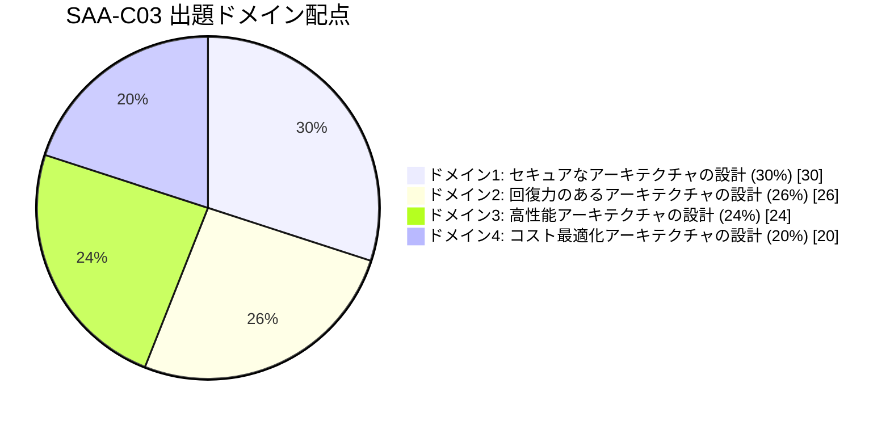

| ドメイン | 配点 | タスクステートメント数 |
|---|---|---|
| ドメイン1: セキュアなアーキテクチャの設計 | 30% | 3 |
| ドメイン2: 回復力のあるアーキテクチャの設計 | 26% | 2 |
| ドメイン3: 高性能アーキテクチャの設計 | 24% | 5 |
| ドメイン4: コスト最適化アーキテクチャの設計 | 20% | 4 |

出典: [Content outline — AWS Certification](https://docs.aws.amazon.com/aws-certification/latest/solutions-architect-associate-03/solutions-architect-associate-03.html#solutions-architect-associate-03-domains)

> **学習の優先順位**: 配点だけを見るとドメイン1（セキュリティ）とドメイン2（回復力）で56%を占めるため、IAM・VPC・可用性設計を最優先で固めるのが効率的です。ただしドメイン3は5つのタスクにまたがりサービス数が非常に多いため、実際の暗記量は最大になりがちです。

---

## 2. ドメイン1: セキュアなアーキテクチャの設計（30%）

出典: [Content Domain 1: Design Secure Architectures](https://docs.aws.amazon.com/aws-certification/latest/solutions-architect-associate-03/solutions-architect-associate-03-domain1.html)

### 2.0 AWS責任共有モデル（Shared Responsibility Model）

ドメイン1全体の前提となる考え方です。AWSと利用者の責任範囲を正しく理解していないと、多くの設問で誤答してしまいます。

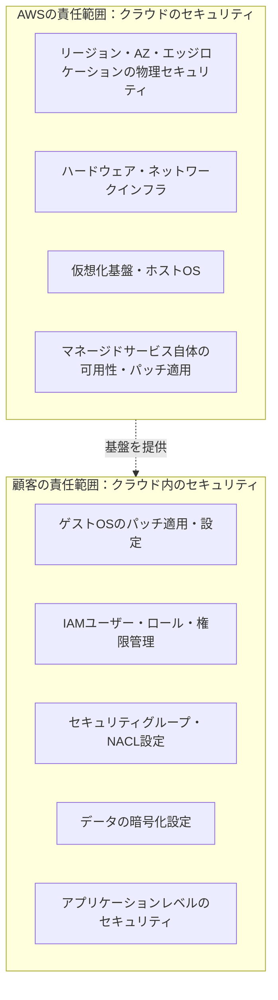

| サービス種別 | 責任分界点の例 |
|---|---|
| IaaS（EC2, EBS, VPC） | OSパッチ・ミドルウェア・アプリ・データは顧客責任。ハイパーバイザー以下はAWS責任 |
| マネージド型（RDS） | DBエンジンのパッチはAWSが一部担当。DBユーザー管理・データ暗号化設定は顧客責任 |
| サーバーレス（Lambda, DynamoDB） | 顧客責任はコードとIAM権限・データ設定に限定され、AWS側の責任範囲が最も広い |

**ベストプラクティス**
- サービスがIaaSに近いほど顧客の責任が重くなる、という相関を常に意識する
- 「このサービスでOSパッチは誰の責任か？」という設問パターンは頻出

---

### 2.1 タスク1.1: AWSリソースへのセキュアなアクセス設計

#### IAMの基本構成要素

| 要素 | 役割 | 主なベストプラクティス |
|---|---|---|
| ユーザー（User） | 個人に紐づく恒久的な認証情報 | 日常作業では使わず、極力IAMロールに置き換える |
| グループ（Group） | ユーザーの集合に権限をまとめて付与 | 権限はユーザーではなくグループに付与する |
| ロール（Role） | 一時的にアクセス許可を引き受ける仕組み（Assume Role） | EC2・Lambda等のAWSサービスにはロールを使い、アクセスキーを埋め込まない |
| ポリシー（Policy） | JSON形式で許可・拒否を定義するドキュメント | 最小権限の原則（Principle of Least Privilege）を徹底する |

#### ルートユーザーとMFAのベストプラクティス

- ルートユーザーは**アカウント作成時の初期設定以外では使用しない**
- ルートユーザーには必ず **MFA（多要素認証）** を設定する
- 日常運用は IAM Identity Center（旧AWS SSO）経由のフェデレーションユーザーで行う
- ルートユーザーのアクセスキーは基本的に発行しない・発行済みなら削除する

#### IAMポリシー評価ロジック

「どのポリシーが優先されるか」は頻出論点です。評価順序を正しく理解しましょう。

```mermaid
flowchart TD
    Start([リクエスト発生]) --> Explicit{明示的な<br/>Denyが存在する?}
    Explicit -->|はい| Deny[アクセス拒否<br/>常に最優先]
    Explicit -->|いいえ| SCP{SCPで<br/>許可されている?}
    SCP -->|いいえ| Deny
    SCP -->|はい| PB{Permissions Boundaryで<br/>許可されている?}
    PB -->|いいえ| Deny
    PB -->|はい| Session{Session Policy / PDPで<br/>許可されている?}
    Session -->|いいえ| Deny
    Session -->|はい| RCP{Resource Control Policy (RCP)で<br/>許可されている?}
    RCP -->|いいえ| Deny
    RCP -->|はい| CheckAllow{Identity-based または<br/>Resource-based ポリシーで<br/>明示的 Allow がある?}
    CheckAllow -->|いいえ| ImplicitDeny[デフォルト拒否<br/>暗黙のDeny]
    CheckAllow -->|はい| Allow[アクセス許可]
```

> **重要**: 明示的な `Deny` は常に他のあらゆる `Allow` に優先します。また、何も明示されていない場合はデフォルトで拒否（暗黙のDeny）される点も忘れずに。

#### アイデンティティベース vs リソースベースポリシー

| 種類 | 付与対象 | 具体例 | 特徴 |
|---|---|---|---|
| アイデンティティベースポリシー | ユーザー・グループ・ロール | IAMポリシー | 「誰が何をできるか」を主体側に定義 |
| リソースベースポリシー | リソース自体 | S3バケットポリシー、KMSキーポリシー、SQSキューポリシー | クロスアカウントアクセスの許可に有効。`Principal`要素で許可対象を指定できる |

#### マルチアカウント戦略

大規模組織では単一アカウントではなく、**AWS Organizations** を使った複数アカウント運用が推奨されます。

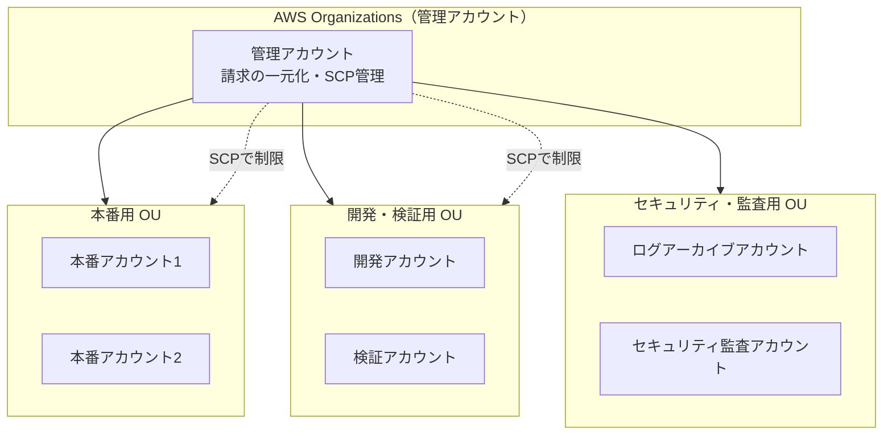

| 機能 | 説明 |
|---|---|
| AWS Organizations | 複数アカウントを統合管理し、一括請求（Consolidated Billing）を実現 |
| SCP（Service Control Policies） | OUやアカウント単位で「許可できる操作の上限」を設定するガードレール。IAMポリシーとは異なり**権限を積極的に付与することはできない**（許可の天井を作るのみ） |
| AWS Control Tower | Organizations・SCP・ログ集約・ガードレールをベストプラクティスに沿って自動セットアップするサービス |
| クロスアカウントロール（STS AssumeRole） | 一時的な認証情報を発行し、他アカウントのロールを引き受けてリソースにアクセスする仕組み |

**ベストプラクティス**
- ワークロードごと（本番／開発／検証）にAWSアカウントを分離し、爆発半径（blast radius）を最小化する
- SCPは「ガードレール」であり「権限付与」ではないことを混同しない（SCPだけではアクセス許可は発生しない。IAMポリシーとの掛け算で最終許可が決まる）
- クロスアカウントアクセスはIAMユーザーの共有ではなく、STSによる一時的なロール引き受け（AssumeRole）で行う
- フェデレーション（Active Directory等の既存IDプロバイダー）はSAML 2.0またはIAM Identity Centerと連携し、AWS内に恒久的なユーザーを増やさない

---

### 2.2 タスク1.2: セキュアなワークロードとアプリケーションの設計

#### VPCとネットワークセグメンテーション

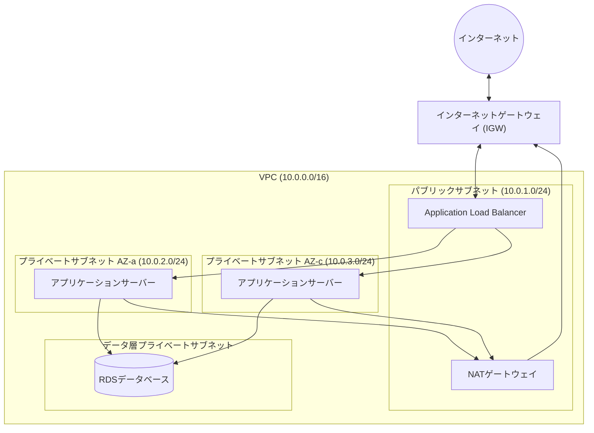

| コンポーネント | 役割 |
|---|---|
| インターネットゲートウェイ（IGW） | VPCとインターネットを双方向に接続 |
| NATゲートウェイ | プライベートサブネットからインターネットへの**アウトバウンド通信のみ**を許可（インバウンド接続は不可） |
| ルートテーブル | サブネットごとの通信経路を定義。パブリックサブネットは `0.0.0.0/0 → IGW`、プライベートサブネットは `0.0.0.0/0 → NATゲートウェイ` |
| セキュリティグループ（SG） | インスタンスレベルのファイアウォール。**ステートフル**（戻りの通信は自動的に許可） |
| ネットワークACL（NACL） | サブネットレベルのファイアウォール。**ステートレス**（インバウンド・アウトバウンドを個別にルール設定する必要あり） |

#### セキュリティグループ vs NACL 比較表

| 比較項目 | セキュリティグループ | ネットワークACL |
|---|---|---|
| 適用単位 | ENI（インスタンス）単位 | サブネット単位 |
| ステート | ステートフル | ステートレス |
| ルール | Allowのみ（Denyルールは書けない） | AllowとDenyの両方を記述可能 |
| ルール評価 | 全ルールを評価してAllowを探す | 番号の小さい順に評価し、最初にマッチしたルールを適用 |
| デフォルト | すべてのインバウンドを拒否、アウトバウンドは全許可 | デフォルトNACLは全通信を許可 |

**ベストプラクティス**
- パブリックサブネットにはロードバランサーやNATゲートウェイなど「インターネット向き」のリソースのみ配置し、DBやアプリ本体はプライベートサブネットに置く
- セキュリティグループはできるだけ「送信元をセキュリティグループIDで指定」し、IPレンジのハードコーディングを避ける（構成変更に強くなる）
- 多層防御（Defense in Depth）としてSGとNACLを併用する

#### セキュアなアプリケーション設計に関わる主要サービス

| サービス | 用途 | 主なベストプラクティス |
|---|---|---|
| AWS Secrets Manager | DB認証情報・APIキー等の**動的なローテーションが必要な機密情報**を管理 | アプリにクレデンシャルをハードコードせず、SDK経由で取得。自動ローテーションを有効化 |
| AWS Systems Manager Parameter Store | 設定値・パラメータの管理（Secrets Managerより低コスト） | ローテーション頻度が低い設定値・非機密パラメータに使用（機密情報はSecretsManager推奨） |
| Amazon Cognito | Web・モバイルアプリのユーザー認証・認可（サインアップ／サインイン、ソーシャルログイン） | User PoolsとIdentity Poolsを使い分け、アプリ側で認証基盤を自作しない |
| Amazon GuardDuty | VPCフローログ・CloudTrail・DNSログを機械学習で分析する**脅威検知**サービス | 全リージョン・全アカウントで有効化し、Security Hubと統合してアラートを一元化 |
| Amazon Macie | S3内の**個人情報（PII）を機械学習で自動検出**するデータセキュリティサービス | コンプライアンス要件のあるS3バケットに定期スキャンを設定 |
| AWS WAF | Layer 7（アプリケーション層）のWebアプリケーションファイアウォール。SQLi・XSS等を防御 | マネージドルールグループを活用し、ALB/CloudFront/API Gatewayの手前で適用 |
| AWS Shield（Standard/Advanced） | DDoS攻撃（Layer 3/4中心）からの保護 | Standardは全ユーザーに無償で自動適用。重要な本番環境はShield Advanced + WAFの併用を検討 |
| AWS Certificate Manager (ACM) | TLS/SSL証明書の発行・自動更新 | ALB・CloudFront・API Gatewayに無料で証明書を発行し、手動更新の運用負荷をなくす |

#### 外部接続のセキュリティ

| 接続方式 | 特徴 | ユースケース |
|---|---|---|
| Site-to-Site VPN | インターネット経由の暗号化トンネル（IPsec） | 迅速に構築したい・帯域要件がそこまで高くない拠点間接続 |
| AWS Direct Connect | 専用線による物理接続 | 大容量・低遅延・安定した帯域が必要なオンプレミス接続 |
| Direct Connect + VPN（併用） | 専用線を暗号化して使う、またはDCの障害時のフェイルオーバー用にVPNを併用 | セキュリティ要件が厳しい・DCの可用性を高めたい場合 |

**ベストプラクティス**
- インターネットを経由させたくない機密性の高い通信は Direct Connect または VPN を選択する。なお Direct Connect 単体では通信が暗号化されないため、暗号化が必要な場合は「Direct Connect + Site-to-Site VPN」または対応環境での MACsec を利用する
- 迅速な構築が優先ならVPN、帯域保証・低レイテンシが優先ならDirect Connectを選ぶ、という二択の判断軸を持つ

---

### 2.3 タスク1.3: 適切なデータセキュリティコントロールの決定

#### 暗号化アーキテクチャ

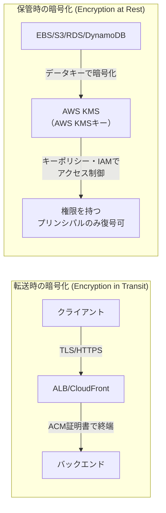

| 概念 | 説明 |
|---|---|
| AWS KMS（Key Management Service） | 暗号化キーの作成・管理・ローテーションを行うマネージドサービス。CloudTrailと連携し利用履歴を監査可能 |
| AWSマネージドキー | AWSがキーを自動管理（ローテーションも自動）。追加コストなしで多くのサービスがデフォルトで利用 |
| カスタマーマネージドキー | 顧客がキーポリシーで詳細なアクセス制御・手動/自動ローテーション設定を行える |
| エンベロープ暗号化 | KMSのマスターキーで「データキー」自体を暗号化し、大容量データはデータキーで暗号化する仕組み。KMSのAPI呼び出し回数を削減できる |
| ACM（AWS Certificate Manager） | 転送時暗号化（TLS）用の証明書を無料で発行・自動更新 |

**ベストプラクティス**
- 保管データは可能な限り **デフォルトで暗号化を有効化**する（S3のデフォルト暗号化、EBSのデフォルト暗号化設定など）
- キーポリシーとIAMポリシーの両方でアクセス制御を行い、最小権限を徹底する
- コンプライアンス要件（PCI-DSS、HIPAA等）に応じて、カスタマーマネージドキーで独自のローテーション・監査ポリシーを設定する
- 証明書の手動更新漏れによる障害を防ぐため、ACMで自動更新を利用する

#### データ保護・可用性・ガバナンス

| 項目 | 主なサービス・機能 | ベストプラクティス |
|---|---|---|
| バックアップ | AWS Backup（一元的なバックアップ管理）、RDS自動スナップショット、S3バージョニング | バックアップポリシーを一元化し、頻度・保持期間をタグベースで自動適用 |
| レプリケーション | S3クロスリージョンレプリケーション（CRR）、RDSリードレプリカ、DynamoDBグローバルテーブル | 災害復旧要件（RPO）に応じてレプリケーション範囲を決定 |
| データライフサイクル | S3ライフサイクルルール、DLM（Data Lifecycle Manager、EBSスナップショット自動化） | 保持期間・アーカイブポリシーをコンプライアンス要件と合わせて設計（詳細はドメイン4で解説） |
| データ分類・ガバナンス | AWS Macie、タグベースのアクセス制御（ABAC） | 機密データを自動検出し、アクセス制御をタグに紐づけて一貫性を持たせる |

---

## 3. ドメイン2: 回復力のあるアーキテクチャの設計（26%）

出典: [Content Domain 2: Design Resilient Architectures](https://docs.aws.amazon.com/aws-certification/latest/solutions-architect-associate-03/solutions-architect-associate-03-domain2.html)

### 3.1 タスク2.1: スケーラブルで疎結合なアーキテクチャの設計

#### 疎結合（Loose Coupling）とは

コンポーネント同士が直接依存せず、片方が停止・遅延しても他方に即座に影響しない設計です。キューやイベントを介して非同期に連携させることで実現します。

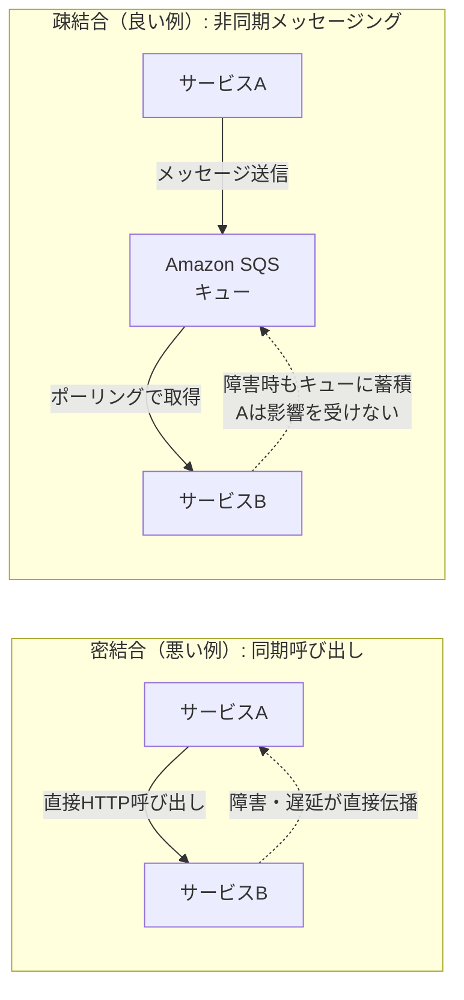

#### メッセージング・イベント駆動サービス比較

| サービス | 通信パターン | 特徴 |
|---|---|---|
| Amazon SQS | ポイントツーポイント（キュー） | メッセージを一時保持し、コンシューマーがポーリングして処理。標準キュー（高スループット・At-Least-Once配信）とFIFOキュー（順序保証・重複排除）の2種類 |
| Amazon SNS | Pub/Sub（ファンアウト） | 1つのメッセージを複数のサブスクライバー（SQS、Lambda、Email、HTTPSなど）に同時配信 |
| Amazon EventBridge | イベントバス | AWSサービスやSaaS、カスタムアプリからのイベントをルールベースでルーティング。スキーマレジストリでイベント構造を管理可能 |
| AWS Step Functions | ワークフローオーケストレーション | Lambda・ECSタスク等を順序立てて実行するステートマシンを視覚的に定義。エラーハンドリング・リトライを組み込みで実装 |

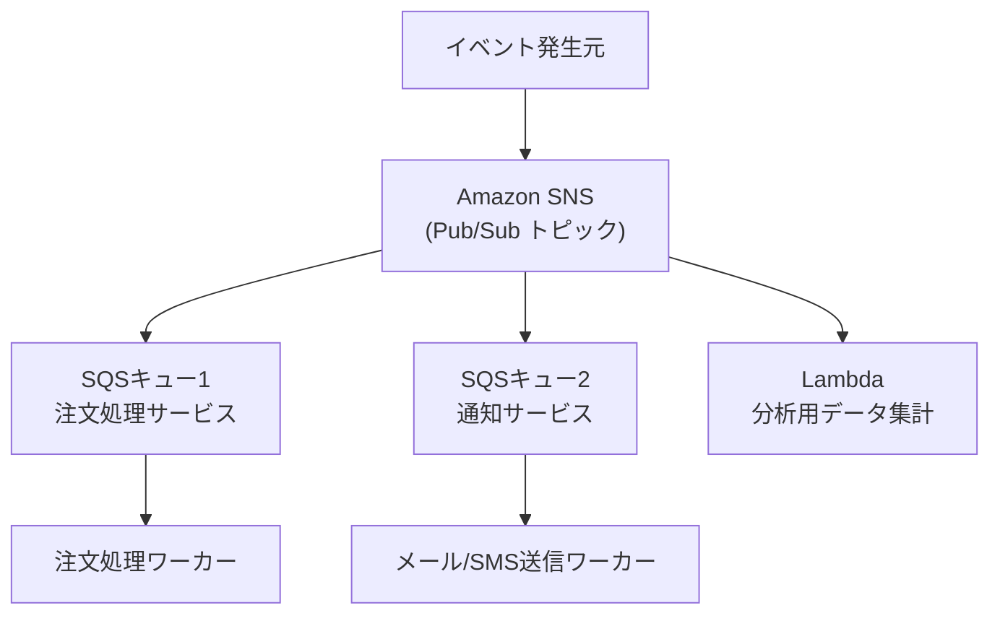

**ベストプラクティス**
- 「ファンアウト（1つのイベントを複数の処理系に配信）」が求められたら SNS→SQS のファンアウトパターンを検討する
- 順序保証・重複排除が必要な場合はSQS FIFOキューを選択する（スループットは標準キューより低い点に注意）
- 複数ステップにまたがる業務ロジックのオーケストレーションはStep Functionsを使い、Lambda内にワークフロー制御ロジックを持たせない

#### ロードバランシングとスケーリング

| ロードバランサー種別 | レイヤー | 主な用途 |
|---|---|---|
| Application Load Balancer (ALB) | Layer 7（HTTP/HTTPS） | パスベース・ホストベースルーティング、マイクロサービス、コンテナ(ECS)との統合 |
| Network Load Balancer (NLB) | Layer 4（TCP/UDP） | 超低レイテンシ・高スループット、静的IP/Elastic IPが必要な場合 |
| Gateway Load Balancer (GWLB) | Layer 3/4 | サードパーティ製のセキュリティ・検査アプライアンスをトラフィックパスに透過的に挿入 |

| スケーリング方式 | 説明 |
|---|---|
| 水平スケーリング（Scale Out） | インスタンス数を増減させる。ステートレスな設計と相性が良く、クラウドネイティブなスケーリング手法として推奨 |
| 垂直スケーリング（Scale Up） | インスタンスタイプ自体を大きくする。停止・変更・再起動が必要でダウンタイムが発生しやすい |

#### コンテナ・サーバーレスの活用

| サービス | 特徴 |
|---|---|
| Amazon ECS | AWS独自のコンテナオーケストレーションサービス。学習コストが低くAWSサービスとの統合が容易 |
| Amazon EKS | マネージドKubernetes。Kubernetesの標準APIやエコシステムをそのまま利用したい場合に選択 |
| AWS Fargate | ECS/EKS向けのサーバーレスコンピューティングエンジン。EC2インスタンスの管理が不要になる |
| AWS Lambda | イベント駆動のサーバーレス関数実行環境。実行時間・呼び出し回数課金で、アイドル時のコストが発生しない |

**ベストプラクティス**
- Kubernetesの知見やマルチクラウド戦略があるならEKS、AWS内で完結しシンプルに運用したいならECSを選ぶ
- インフラ管理を極小化したいならFargate、コスト最適化のためにインスタンスタイプを細かく制御したい場合はEC2起動タイプのECS/EKSを選ぶ
- 短時間・イベント駆動の処理（画像リサイズ、APIバックエンド等）はLambda、長時間稼働・常駐型ワークロードはコンテナかEC2を検討する

---

### 3.2 タスク2.2: 高可用性・フォールトトレラントアーキテクチャの設計

#### マルチAZ・マルチリージョン設計

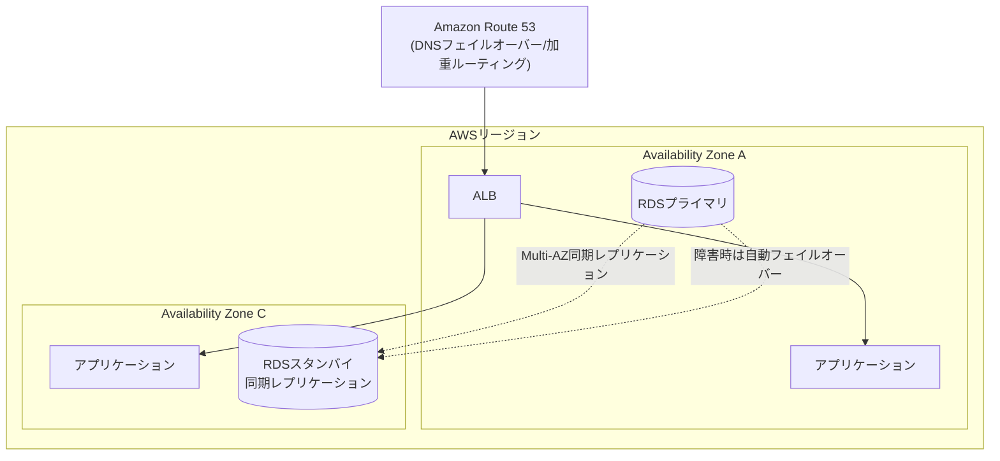

| 概念 | 説明 |
|---|---|
| Availability Zone（AZ） | 独立した電源・ネットワーク・冷却設備を持つ物理的に離れたデータセンター群。1つのリージョンに複数存在 |
| Multi-AZ配置 | 単一AZの障害（電源断・災害等）でもサービスを継続させるための基本設計。RDSのMulti-AZは同期レプリケーション＋自動フェイルオーバーを提供 |
| Multi-Region設計 | リージョン全体の障害に備える。RTO/RPO要件が非常に厳しい場合や、地理的な法規制対応で採用 |

#### Route 53 ルーティングポリシー

| ポリシー | 用途 |
|---|---|
| シンプルルーティング | 単一リソースへの固定的な名前解決 |
| フェイルオーバールーティング | ヘルスチェック結果に基づきプライマリ→セカンダリへ自動切替 |
| 加重ルーティング | トラフィックを比率で分散（例: Blue/Greenデプロイ、カナリアリリース） |
| レイテンシーベースルーティング | ユーザーから最も低レイテンシのリージョンへ誘導 |
| 位置情報ルーティング | ユーザーの地理的位置に基づきコンテンツを出し分け |
| 地理的近接ルーティング | Route 53トラフィックフローを用い、地理的なバイアスを調整して誘導 |

#### 災害復旧（DR）戦略

RTO（目標復旧時間）とRPO（目標復旧時点）のトレードオフを理解することが最重要ポイントです。

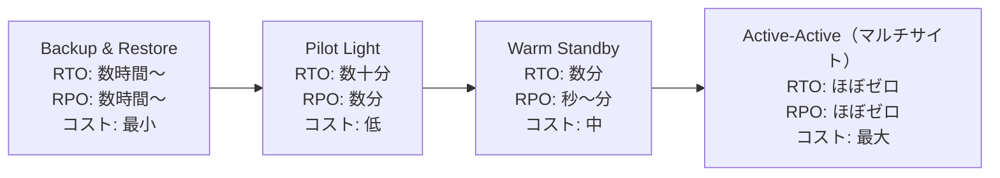

| DR戦略 | 説明 |
|---|---|
| Backup & Restore | 定期的にバックアップを取得し、災害時にゼロから環境を再構築。最もコストが低いがRTO/RPOは長い |
| Pilot Light | 最小限のコアコンポーネント（DBレプリケーション等）のみを常時稼働させ、災害時に残りをスケールアップ |
| Warm Standby | 縮小版のフル稼働環境を別リージョンに常時稼働させ、災害時にスケールアップして本番負荷を受け持つ |
| Active-Active（マルチサイト） | 複数リージョンで同時に本番トラフィックを処理。RTO/RPOはほぼゼロだがコストと運用複雑性が最大 |

**ベストプラクティス**
- ビジネス要件（RTO/RPO目標値）を最初に確認してからDR戦略を選ぶ。「コストを抑えたい」なら軽量な戦略、「ダウンタイムを絶対に許容できない」ならActive-Activeを選択する、という判断軸を持つ
- DR戦略の選択問題では、まず設問中のRTO/RPOの数値・コスト制約条件を探すことが解答の近道

#### 単一障害点の排除とレガシーアプリケーション対応

| 手法・サービス | 説明 |
|---|---|
| Auto Scaling + ヘルスチェック | 異常なインスタンスを自動検出し終了・再起動して自己修復（Self-Healing） |
| Amazon RDS Proxy | DB接続をプールし、フェイルオーバー時の接続断や大量接続によるDB過負荷を緩和。特にLambdaのようなコネクション数が急増するワークロードに有効 |
| Elastic Load Balancing | 複数AZにトラフィックを分散し、単一インスタンス・単一AZへの依存を排除 |
| AWS X-Ray | 分散システムのリクエストをトレースし、ボトルネックや障害箇所を可視化（ワークロードの可観測性） |
| イミュータブルインフラストラクチャ | サーバーを直接変更せず、新しいイメージ（AMI等）から都度作り直すことで構成ドリフトを防止 |
| サービスクォータ・スロットリング | DR発動時にスタンバイ環境のクォータ（EC2上限等)が不足しないよう、事前に引き上げ申請しておく |

**ベストプラクティス**
- クラウド向けに再設計できないレガシーアプリケーションには、Elastic Load Balancing・Auto Scaling・RDS Multi-AZなどのマネージド機能を「外側から」適用し、可用性を底上げする
- 可用性向上の自動化（Auto Scalingのヘルスチェック、Route 53フェイルオーバー等）を優先し、手動オペレーションへの依存を減らす

---

## 4. ドメイン3: 高性能アーキテクチャの設計（24%）

出典: [Content Domain 3: Design High-Performing Architectures](https://docs.aws.amazon.com/aws-certification/latest/solutions-architect-associate-03/solutions-architect-associate-03-domain3.html)

### 4.1 タスク3.1: 高性能・スケーラブルなストレージソリューション

#### ストレージタイプの選択

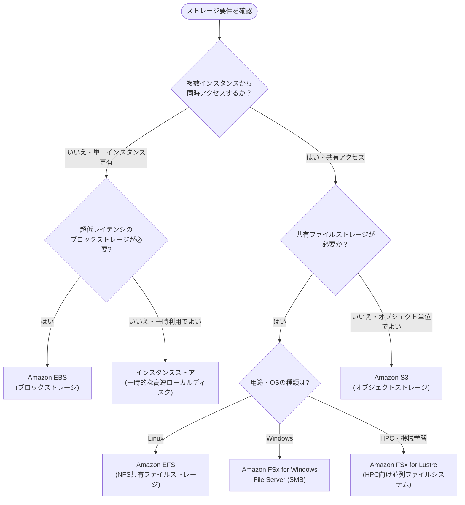

| ストレージ種別 | サービス例 | 特徴 |
|---|---|---|
| オブジェクトストレージ | Amazon S3 | ほぼ無制限のスケール、HTTP(S)経由のAPIアクセス、11 9's（99.999999999%）の耐久性 |
| ブロックストレージ | Amazon EBS | 単一EC2インスタンスにアタッチする低レイテンシボリューム。スナップショットでバックアップ |
| ファイルストレージ | Amazon EFS / FSx | 複数インスタンスから同時マウント可能な共有ファイルシステム |

| EBSボリュームタイプ | 用途 |
|---|---|
| gp3 (汎用SSD) | 大半のワークロードに適したデフォルト選択。IOPSとスループットを独立して調整可能 |
| io2 Block Express | 高IOPS・低レイテンシが必要なミッションクリティカルDB向け |
| st1 (スループット最適化HDD) | ビッグデータ・ログ処理などシーケンシャルアクセス中心のワークロード |
| sc1 (Cold HDD) | アクセス頻度が低い大容量データ向けの最安価格帯 |

**ベストプラクティス**
- 「複数インスタンスからの同時読み書き」という要件が出たらEBSではなくEFS/FSxを検討する（EBSは基本的に単一インスタンス専有）
- Linuxワークロードの共有ストレージはEFS、Windowsワークロードの共有ストレージはFSx for Windows File Serverを選ぶ
- HPC（高性能計算）・機械学習の大規模並列処理にはFSx for Lustreを検討する
- ハイブリッド環境ではAWS Storage GatewayでオンプレミスからS3をシームレスに利用できるようにする

---

### 4.2 タスク3.2: 高性能で弾力性のあるコンピューティングソリューションの設計

#### EC2インスタンスファミリー

| ファミリー | 最適化対象 | 主な用途 |
|---|---|---|
| M（汎用） | バランス型 | Webサーバー、中小規模DB、一般的なアプリケーション |
| C（コンピューティング最適化） | 高いCPU性能 | バッチ処理、動画エンコード、科学計算、ゲームサーバー |
| R（メモリ最適化） | 大容量メモリ | インメモリDB、リアルタイムビッグデータ分析 |
| I（ストレージ最適化） | 高速ローカルNVMe SSD | NoSQL DB、高IOPSのトランザクションDB |
| D（ストレージ最適化） | 高密度HDDストレージ（D2/D3/D3en） | データレイク、分散ファイルシステム、ログ解析 |
| G / P（高速コンピューティング） | GPU | 機械学習トレーニング、グラフィックスレンダリング |

#### Auto Scalingの仕組み

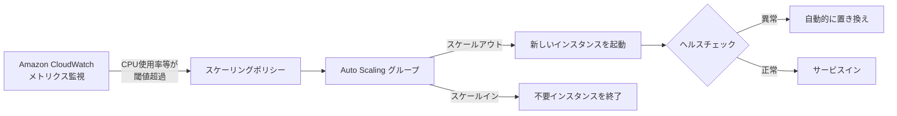

| スケーリングポリシー | 説明 |
|---|---|
| ターゲット追跡スケーリング | CPU使用率など特定メトリクスを目標値に維持するよう自動調整。最も推奨されるシンプルな方式 |
| ステップスケーリング | 閾値超過の度合いに応じて段階的にキャパシティを調整 |
| スケジュールスケーリング | 予測可能な負荷パターン（毎朝9時に増加等）に対して事前にスケジュール設定 |
| 予測スケーリング | 過去の負荷パターンを機械学習で予測し、事前にスケールアウト |

#### サーバーレス・コンテナの性能設計

- **AWS Lambda**: 割り当てメモリ量を増やすとCPU性能も比例して向上する。CPUバウンドな処理が遅い場合は、まずメモリ設定の見直しを検討する
- **AWS Fargate**: vCPUとメモリの組み合わせを指定してタスクを実行。EC2管理が不要な分、インスタンスレベルの細かいチューニングはできない
- **AWS Batch**: 大量のバッチ計算ジョブをスケジューリング・実行し、必要に応じてSpotインスタンスを自動選択してコストと性能のバランスを取る
- **Amazon EMR**: Hadoop/Sparkなどのビッグデータフレームワークをマネージドクラスターで実行

**ベストプラクティス**
- インスタンスタイプ選定では「どのリソース（CPU/メモリ/ストレージ/GPU）がボトルネックか」をまず特定する
- Lambdaのレイテンシ問題は多くの場合メモリ割り当て不足が原因であることを覚えておく
- ワークロードをできる限り疎結合にし、コンポーネント単位で独立してスケールできるようにする

---

### 4.3 タスク3.3: 高性能データベースソリューションの決定

#### データベースサービスの比較

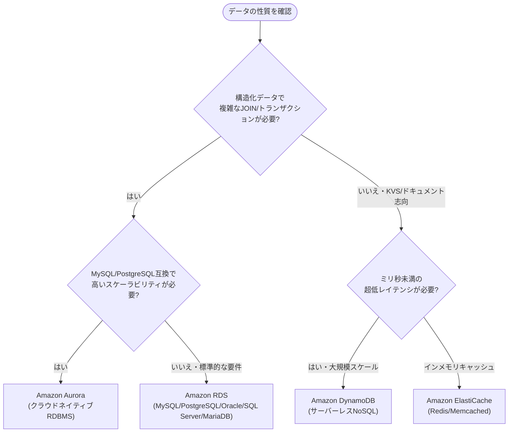

| データベース | 種別 | 特徴 |
|---|---|---|
| Amazon RDS | リレーショナル | MySQL, PostgreSQL, MariaDB, Oracle, SQL Serverをマネージドで提供。異機種間移行にはAWS DMS/SCTを利用 |
| Amazon Aurora | リレーショナル（AWS独自） | MySQL/PostgreSQL互換、ストレージが自動で最大128TiBまで拡張、最大15台のリードレプリカ、Auroraグローバルデータベースでマルチリージョン展開が可能 |
| Amazon DynamoDB | NoSQL（キーバリュー/ドキュメント） | サーバーレスで自動スケール、1桁ミリ秒のレイテンシ、DynamoDB Acceleratorでマイクロ秒台のキャッシュも可能 |
| Amazon ElastiCache | インメモリキャッシュ | Redis（永続化・レプリケーション対応）とMemcached（シンプルな水平分割キャッシュ）から選択 |

#### 読み取りレプリカとキャッシング戦略

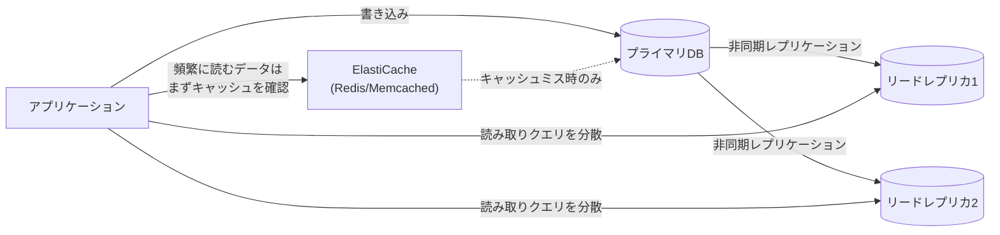

| 手法 | 説明 |
|---|---|
| リードレプリカ | 読み取り負荷の高いワークロードで、読み取りクエリをレプリカに分散して書き込みDBの負荷を軽減。非同期レプリケーションのためレプリカラグ（遅延）に注意 |
| DynamoDB DAX | DynamoDB専用のインメモリキャッシュ層。マイクロ秒単位の読み取りレイテンシを実現 |
| ElastiCache | アプリケーション層でのキャッシュ（Cache-Aside/Lazy Loadingパターンが一般的） |

**ベストプラクティス**
- 読み取りが極めて多いワークロードには、まずリードレプリカ、次にキャッシュ層（ElastiCache/DAX）の追加を検討する
- MySQL/PostgreSQL互換でクラウドネイティブなスケーラビリティが必要ならAurora、オンプレミスのDB資産をそのまま移行したいだけならRDSを選ぶ
- アクセスパターンが単純なキーバリューかつ超大規模・低レイテンシならDynamoDB、複雑なリレーショナルクエリが必要ならRDS/Auroraという判断軸を持つ

---

### 4.4 タスク3.4: 高性能・スケーラブルなネットワークアーキテクチャの決定

#### エッジネットワーキングサービス

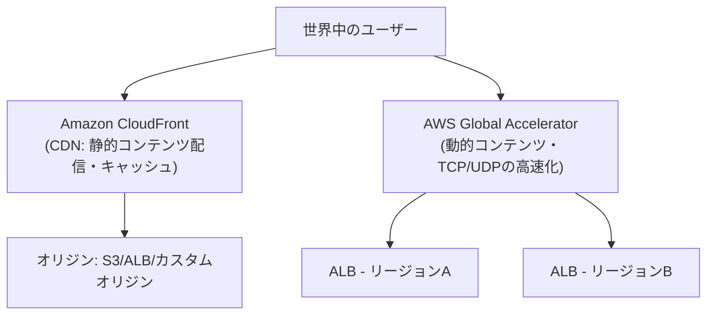

| サービス | 用途 |
|---|---|
| Amazon CloudFront | 静的/動的コンテンツをエッジロケーションにキャッシュ配信するCDN。オリジンへの負荷とレイテンシを削減 |
| AWS Global Accelerator | AWSのグローバルネットワークを使い、Anycast IPで最寄りのエッジからバックエンド（ALB/NLB/EIP）まで最適経路を選択。TCP/UDPレベルで高速化し、リージョン障害時のフェイルオーバーにも利用 |

#### 接続オプションの比較

| 接続方式 | レイヤー/特徴 | ユースケース |
|---|---|---|
| AWS VPN | インターネット経由の暗号化トンネル | 迅速・低コストな拠点間/リモート接続 |
| AWS Direct Connect | 専用線接続 | 大容量・安定した帯域、低レイテンシが必要な基幹接続 |
| AWS PrivateLink | ENIを介したVPCとAWSサービス／公開サービス間のプライベート接続 | インターネットに公開せずSaaSや他アカウントの特定リソースにアクセスしたい場合 |
| VPCピアリング | 2つのVPC間を1対1で直接接続 | 少数のVPC間で全面的なネットワーク到達性が必要な場合 |
| AWS Transit Gateway | 多数のVPC・オンプレミスをハブ&スポーク型で集約接続 | 数十〜数百のVPCを接続するハイブリッド/マルチVPC環境 |

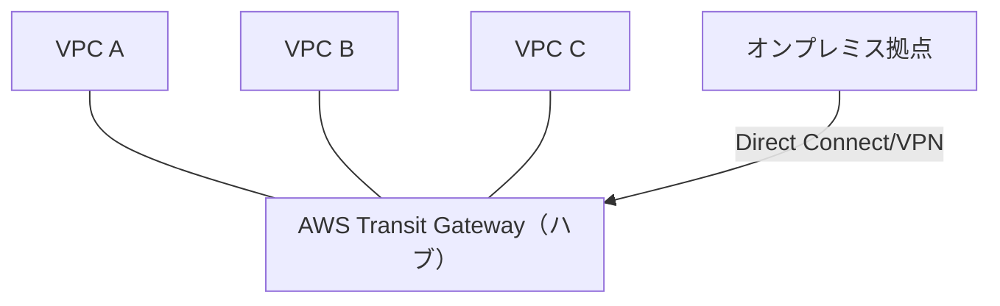

**ベストプラクティス**
- 静的コンテンツ・キャッシュ可能なコンテンツの配信高速化にはCloudFront、動的コンテンツ・非HTTPプロトコルの高速化・グローバルなフェイルオーバーにはGlobal Acceleratorを選ぶ
- VPCの数が少なければVPCピアリングでも管理できるが、数が増えるほどTransit Gatewayによる集約管理がスケールする（ピアリングはフルメッシュになるほど管理が煩雑化するため）
- サブネット設計時はIPアドレス範囲の将来的な拡張余地を残しておく（CIDRブロックは後から縮小できない）

---

### 4.5 タスク3.5: 高性能データ取り込み・変換ソリューションの決定

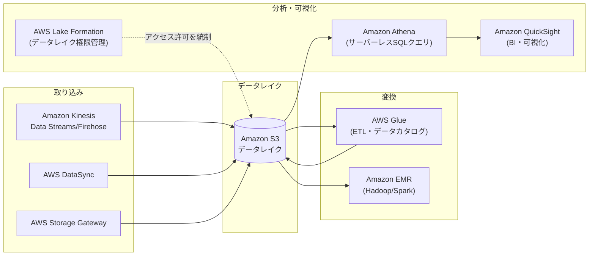

| サービス | 役割 |
|---|---|
| Amazon Kinesis Data Streams | リアルタイムのストリーミングデータ取り込み（カスタムコンシューマーで処理） |
| Amazon Kinesis Data Firehose | ストリーミングデータをS3/Redshift/OpenSearch等へ配信（サーバーレスでスケーリング不要） |
| AWS Glue | サーバーレスETL、データカタログでスキーマを一元管理、フォーマット変換（例: CSV→Parquet）に利用 |
| Amazon Athena | S3上のデータに対しサーバーレスでSQLクエリを実行。使った分だけ課金 |
| AWS Lake Formation | データレイクの一元的なアクセス許可・ガバナンス管理 |
| AWS DataSync | オンプレミス・他クラウドとAWSストレージ間の大容量データ転送を自動化・高速化 |
| AWS Storage Gateway | オンプレミスとS3をシームレスに接続するハイブリッドストレージゲートウェイ（ファイル/ボリューム/テープ型） |
| Amazon EMR | Hadoop/Spark/Hive等のビッグデータフレームワークをマネージドクラスターで実行 |

**ベストプラクティス**
- 高頻度・低レイテンシで到着し続けるストリーミングデータにはKinesis、バッチ・スケジュールベースのETLにはGlueを使い分ける
- データフォーマットは行指向（CSV/JSON）より列指向（Parquet/ORC）に変換することで、Athena等のクエリコスト・速度を大幅に改善できる
- データレイクの権限管理はS3バケットポリシーだけに頼らず、Lake Formationで列・行レベルのきめ細かいアクセス制御を行う

---

## 5. ドメイン4: コスト最適化アーキテクチャの設計（20%）

出典: [Content Domain 4: Design Cost-Optimized Architectures](https://docs.aws.amazon.com/aws-certification/latest/solutions-architect-associate-03/solutions-architect-associate-03-domain4.html)

### 5.1 タスク4.1: コスト最適化ストレージソリューションの設計

#### S3ストレージクラスとライフサイクル管理

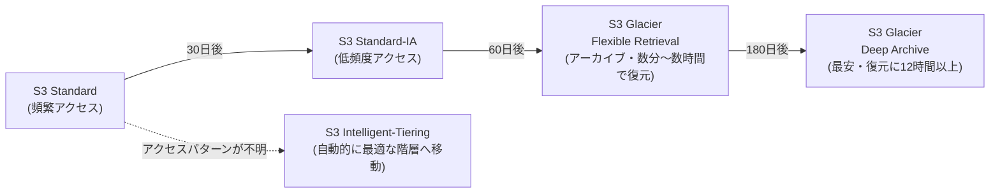

| ストレージクラス | 適したユースケース |
|---|---|
| S3 Standard | 頻繁にアクセスするアクティブなデータ |
| S3 Intelligent-Tiering | アクセスパターンが不明・変動するデータ（監視料は発生するが階層移動は自動） |
| S3 Standard-IA / One Zone-IA | 月1回程度のアクセス頻度のバックアップ・DR用データ（One Zoneは単一AZのみでコストを抑える） |
| S3 Glacier Instant Retrieval | 四半期に1回程度アクセスするが、即時取得が必要なアーカイブ |
| S3 Glacier Flexible Retrieval | 年に1〜2回程度のアクセスで、数分〜数時間の取得時間が許容できるアーカイブ |
| S3 Glacier Deep Archive | 法規制対応などで長期保存が必要で、ほぼアクセスしない最安価格帯のアーカイブ（取得に12時間程度） |

| コスト管理機能 | 説明 |
|---|---|
| S3ライフサイクルルール | 経過日数に応じて自動的にストレージクラスを移行・削除するポリシー |
| Requester Pays | データ転送・リクエスト料金をバケット所有者ではなくリクエスト送信者に課金する設定 |
| S3 Storage Lens | 組織全体のS3使用状況・コストの可視化 |

**ベストプラクティス**
- アクセス頻度が明確に予測できるデータはライフサイクルルールで手動階層設計、予測が難しいデータはIntelligent-Tieringに任せる
- 頻繁な小容量アップロードよりも、可能であればバッチでまとめてアップロードしリクエスト数課金を抑える
- バックアップの保存期間・世代数はコンプライアンス要件を満たす最小限に設定し、過剰な保持によるコスト増を避ける
- ブロックストレージ（EBS）は用途に合わせてgp3/st1/sc1等を選び、オーバープロビジョニングを避ける

---

### 5.2 タスク4.2: コスト最適化コンピューティングソリューションの設計

#### EC2購入オプションの比較

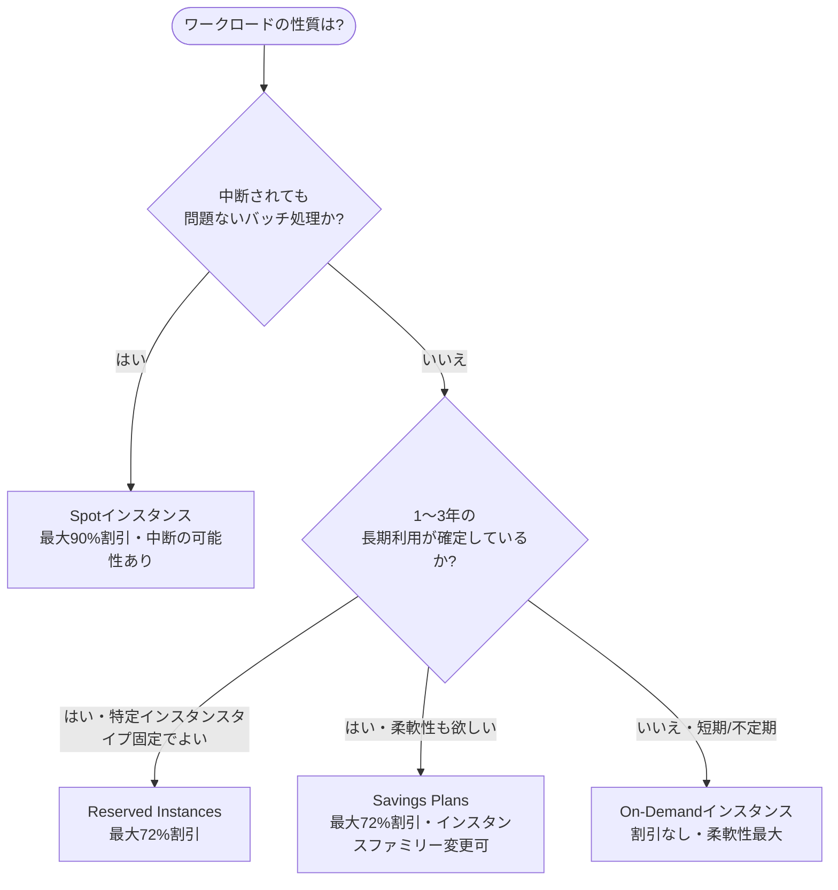

| 購入オプション | 割引率目安 | 特徴 |
|---|---|---|
| On-Demand | 割引なし | 秒単位課金、コミットメント不要。短期・予測不能なワークロードに最適 |
| Reserved Instances (RI) | 最大72% | 1年/3年の期間コミットで割引。特定のインスタンスファミリー・リージョンに紐づく（Standard RI）か、一定の柔軟性を持つ（Convertible RI） |
| Savings Plans | 最大72% | 時間あたりの一定の利用額をコミットする代わりに割引。Compute Savings Plansはインスタンスファミリー・リージョン・OSをまたいで柔軟に適用可能 |
| Spot Instances | 最大90% | AWSの余剰キャパシティをスポット価格で利用。2分前通知で中断される可能性があるため、フォールトトレラントな処理向け |

**ベストプラクティス**
- 常時起動する予測可能な本番ワークロードにはSavings Plans/RIを適用し、コミットメントによる割引を最大化する
- バッチ処理・ステートレスなWebサーバー・CI/CDビルド等、中断耐性のあるワークロードにはSpotインスタンスを積極活用する
- 柔軟性（インスタンスファミリー変更の可能性）が重要ならSavings Plans、確実な予約割引を最大化したいなら条件を固定したRIを選ぶ
- Auto Scalingグループ内でOn-Demand・Spotを組み合わせる「混在インスタンスポリシー」でコストと可用性のバランスを取る
- AWS Compute Optimizerでインスタンスタイプの過剰プロビジョニングを検出し、適正サイズへ見直す

#### サーバーレス・コンテナによるコスト最適化

- Lambdaは通常のオンデマンド実行時（Provisioned Concurrency除く）、リクエスト数と実行時間の両方で課金され、アイドル時の実行環境料金が原則発生しないため、リクエスト数が変動するワークロードでコスト効率が良い
- Fargate SpotはFargateタスクにもSpot割引を適用でき、バッチ的なコンテナワークロードのコストを削減できる
- EC2 Hibernate（休止）機能で、開発・検証環境など断続利用のインスタンスの起動時間を短縮しコストを抑える

---

### 5.3 タスク4.3: コスト最適化データベースソリューションの設計

| 手法・サービス | 説明 |
|---|---|
| DynamoDBのキャパシティモード | オンデマンドモード（予測不能なトラフィック向け、リクエスト課金）とプロビジョンド+Auto Scaling（安定した予測可能な負荷向け、事前確保でコスト効率化）を使い分ける |
| Aurora Serverless | 負荷に応じて自動でキャパシティをスケールし、アイドル時のコストを抑制。開発環境や断続的な利用パターンのワークロードに有効 |
| RIによるDBコスト削減 | RDS/Auroraにも予約インスタンス（Reserved DB Instances）があり、長期稼働が確定した本番DBに適用してコスト削減 |
| バックアップ・スナップショット戦略 | 保持期間・頻度をデータの重要度に応じて最適化し、不要な長期保持によるストレージコスト増を避ける |
| キャッシング（ElastiCache） | DBへの読み取りリクエストを削減し、DB側のインスタンスサイズ・IOPSを抑制することで間接的にコストを最適化 |

**ベストプラクティス**
- トラフィックが読めない新規サービスはDynamoDBオンデマンド、安定稼働後はプロビジョンド+Auto Scalingへ移行してコストを最適化する
- 開発・検証・不定期利用のAuroraクラスターはAurora Serverless v2を検討し、アイドル時間のコストを削減する
- 異なるDBエンジン間の移行（異機種間移行）でライセンスコストの高いエンジン（Oracle/SQL Server）からオープンソース互換のAurora/PostgreSQLへ移行することもコスト最適化の一手段

---

### 5.4 タスク4.4: コスト最適化ネットワークアーキテクチャの設計

#### NATゲートウェイのコスト設計

| 構成 | コスト | 可用性 |
|---|---|---|
| AZごとに個別のNATゲートウェイ | 高い（AZの数だけ課金） | 高い（AZ障害の影響を他AZが受けない） |
| 単一の共有NATゲートウェイ | 低い | 低い（そのAZが落ちると他AZからの通信も影響を受ける） |
| NATインスタンス（EC2で自前運用） | インスタンス代のみ（小規模なら割安） | 自分で冗長化構成を組む必要があり運用負荷が高い |

**ベストプラクティス**
- 可用性要件が高い本番環境はAZごとのNATゲートウェイ、コスト優先の開発環境は単一の共有NATゲートウェイという使い分けをする

#### データ転送コストの最適化

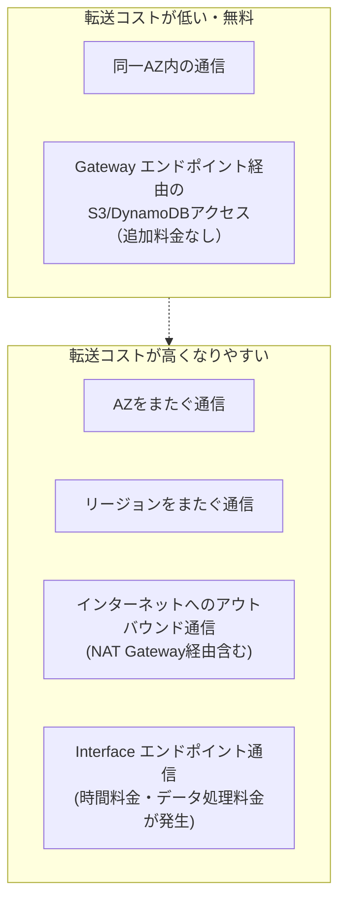

| 手法 | 説明 |
|---|---|
| VPCエンドポイント（Gateway型/Interface型） | S3・DynamoDB等へのアクセスをNATゲートウェイやインターネットを経由せず、プライベートに直結。データ転送料とNATゲートウェイ処理料を削減 |
| 同一AZ配置の徹底 | 頻繁に通信するコンポーネント同士は可能な限り同一AZに配置し、AZ間データ転送料を削減 |
| CloudFrontによるオリジン保護 | エッジでキャッシュすることでオリジンへのリクエスト数・データ転送量そのものを削減 |
| Direct Connectの帯域選定 | 必要な帯域を過不足なく見積もり、複数の低速回線か単一の高速回線かをコストと冗長性の要件で比較検討する |

**ベストプラクティス**
- Gatewayエンドポイント（S3/DynamoDB向け、無料）とInterfaceエンドポイント（PrivateLink経由の他サービス向け、時間課金）の違いを理解し、コストが発生する点を把握しておく
- アーキテクチャレビューでは「不要なAZ間・リージョン間・インターネットへのデータ転送が発生していないか」を必ずチェックする

#### コスト管理・監視ツール

| ツール | 用途 |
|---|---|
| AWS Cost Explorer | 過去のコスト・使用量の可視化とグラフ分析、将来コストの予測 |
| AWS Budgets | 予算のしきい値を設定し、超過（見込み含む）時にアラート通知 |
| AWS Cost and Usage Report (CUR) | 最も詳細な粒度のコスト・使用状況データをS3に出力し、Athena等で分析 |
| コスト配分タグ | プロジェクト・部門・環境ごとにリソースへタグ付けし、コストを按分・集計 |
| AWS Trusted Advisor | コスト最適化・パフォーマンス・セキュリティ・耐障害性の観点でベストプラクティスとの差分をチェック |
| AWS Compute Optimizer | 過去の使用率メトリクスに基づき、EC2/Lambda/EBS等の適正サイズを推奨 |

---

## 6. AWS Well-Architected Framework（6つの柱）

4つの試験ドメインは、Well-Architected Frameworkの各柱と密接に対応しています。全体像を押さえておくと、ドメインをまたいだ設問の意図を掴みやすくなります。

```mermaid
flowchart TB
    subgraph WAF["AWS Well-Architected Framework"]
        P1["運用上の優秀性<br/>Operational Excellence"]
        P2["セキュリティ<br/>Security<br/>(≒ ドメイン1)"]
        P3["信頼性<br/>Reliability<br/>(≒ ドメイン2)"]
        P4["パフォーマンス効率<br/>Performance Efficiency<br/>(≒ ドメイン3)"]
        P5["コスト最適化<br/>Cost Optimization<br/>(≒ ドメイン4)"]
        P6["持続可能性<br/>Sustainability"]
    end
```

| 柱 | 中心的な問い |
|---|---|
| 運用上の優秀性 | システムを運用・監視し、継続的に手順を改善できているか |
| セキュリティ | データ・システムを保護し、最小権限を徹底できているか |
| 信頼性 | 障害から復旧し、需要を満たし続けられるか |
| パフォーマンス効率 | コンピューティングリソースを効率的に活用し、需要の変化に適応できるか |
| コスト最適化 | 最も低いコストでビジネス価値を実現できているか |
| 持続可能性 | 環境への影響を最小化する設計になっているか |

出典: [AWS Well-Architected Framework](https://docs.aws.amazon.com/wellarchitected/latest/framework/welcome.html)

---

## 7. 学習の進め方・試験当日のコツ

### 7.1 学習ステップ（初級者向け）

| ステップ | 内容 |
|---|---|
| 1. 基礎サービスのハンズオン | IAM・EC2・S3・VPC・RDSを実際にコンソールで触り、無料利用枠内で構築・削除を経験する |
| 2. ドメイン別の暗記表整理 | 本ガイドの比較表（SG vs NACL、RI vs Savings Plans等）を自分の言葉で書き出す |
| 3. アーキテクチャ図を描く練習 | 「疎結合」「マルチAZ」「DR戦略」等のキーワードから自分でMermaid/ホワイトボード図を描いてみる |
| 4. 模擬試験で弱点特定 | 公式模擬試験・サンプル問題でドメイン別正答率を確認し、弱いドメインの表を再学習する |
| 5. 直前の総復習 | RTO/RPO、ストレージクラス、購入オプションなど「数値・選択肢が近い概念」の比較表を最終確認する |

### 7.2 頻出の「二択・多択」判断軸まとめ

| 判断軸 | 選択肢A | 選択肢B |
|---|---|---|
| セキュリティの適用単位 | セキュリティグループ（インスタンス・ステートフル） | NACL（サブネット・ステートレス） |
| 疎結合のパターン | SQS（1対1キュー） | SNS（1対多ファンアウト） |
| コンテナオーケストレーション | ECS（AWS独自・低学習コスト） | EKS（標準Kubernetes・移植性） |
| DBの性質 | RDS/Aurora（リレーショナル・複雑なクエリ） | DynamoDB（NoSQL・超低レイテンシ） |
| コンピューティング購入 | Reserved/Savings Plans（安定稼働の割引） | Spot（中断耐性ある処理の大幅割引） |
| ネットワーク接続 | VPN（迅速・低コスト） | Direct Connect（専用線・高帯域・低遅延） |
| ストレージ共有可否 | EBS（単一インスタンス専有） | EFS/FSx（複数インスタンス共有） |

### 7.3 試験当日のコツ

- 設問文に登場する**数値要件（RTO/RPO、予算、レイテンシ、帯域）**に必ず下線を引く意識で読み、それに最も合致する選択肢を選ぶ
- 「最もコストが低い」「最も運用負荷が低い」「最も可用性が高い」など**評価軸を1つに絞るキーワード**を見逃さない
- 分からない問題はマークして次に進み、無回答のまま提出しない（無回答は不正解と同じ扱いのため）
- 選択肢に複数の正しそうな案がある場合、AWSの推奨アーキテクチャパターン（マネージドサービス優先、疎結合、マルチAZ）に最も近いものを選ぶ

---

## 8. 参考文献・出典一覧

- [AWS Certified Solutions Architect - Associate (SAA-C03) Exam Guide（全体）](https://docs.aws.amazon.com/aws-certification/latest/solutions-architect-associate-03/solutions-architect-associate-03.html)
- [Content Domain 1: Design Secure Architectures](https://docs.aws.amazon.com/aws-certification/latest/solutions-architect-associate-03/solutions-architect-associate-03-domain1.html)
- [Content Domain 2: Design Resilient Architectures](https://docs.aws.amazon.com/aws-certification/latest/solutions-architect-associate-03/solutions-architect-associate-03-domain2.html)
- [Content Domain 3: Design High-Performing Architectures](https://docs.aws.amazon.com/aws-certification/latest/solutions-architect-associate-03/solutions-architect-associate-03-domain3.html)
- [Content Domain 4: Design Cost-Optimized Architectures](https://docs.aws.amazon.com/aws-certification/latest/solutions-architect-associate-03/solutions-architect-associate-03-domain4.html)
- [AWS Well-Architected Framework](https://docs.aws.amazon.com/wellarchitected/latest/framework/welcome.html)
- [AWS Identity and Access Management ドキュメント](https://docs.aws.amazon.com/IAM/latest/UserGuide/introduction.html)
- [Amazon VPC ユーザーガイド](https://docs.aws.amazon.com/vpc/latest/userguide/what-is-amazon-vpc.html)
- [Amazon S3 ストレージクラス](https://docs.aws.amazon.com/AmazonS3/latest/userguide/storage-class-intro.html)
- [Amazon EC2 インスタンスタイプ](https://docs.aws.amazon.com/ec2/latest/instancetypes/instance-types.html)
- [Amazon RDS ユーザーガイド](https://docs.aws.amazon.com/AmazonRDS/latest/UserGuide/Welcome.html)
- [AWS 購入オプション（Savings Plans）](https://docs.aws.amazon.com/savingsplans/latest/userguide/what-is-savings-plans.html)
- [AWS Cost Management ドキュメント](https://docs.aws.amazon.com/cost-management/latest/userguide/what-is-costmanagement.html)

[^guide]: [AWS Certified Solutions Architect - Associate (SAA-C03) Exam Guide](https://docs.aws.amazon.com/aws-certification/latest/solutions-architect-associate-03/solutions-architect-associate-03.html)
