# Accelerate（Lean と DevOps の科学）— 初学者向けステップバイステップ解説ガイド

> 原題: *Accelerate: The Science of Lean Software and DevOps — Building and Scaling High Performing Technology Organizations*
> 著者: Nicole Forsgren, PhD / Jez Humble / Gene Kim　出版: IT Revolution Press（2018年3月、288ページ）
> 出典：[O'Reilly — Accelerate](https://www.oreilly.com/library/view/accelerate/9781457191435/)

## この記事について

本ガイドは、DevOps・SRE・プラットフォームエンジニアリングを学び始めた方向けに、書籍『Accelerate』の内容を章立てに沿って解説するものです。ASCII図解は使用せず、フローチャートはすべて Mermaid、比較・一覧情報はすべて Markdown テーブルで表現しています。2026年8月24日時点の情報をもとにWeb検索を行い、Martin FowlerやGoogle Cloud DORAチームなど、著名で国際的な発信者の一次情報を優先して参照しました。各章末に出典を明記し、末尾に参考文献一覧を掲載しています。

---

## 目次

0. [この本の基本情報](#0-この本の基本情報)
1. [なぜこの本が重要なのか — Martin Fowlerの警戒と転向](#1-なぜこの本が重要なのか--martin-fowlerの警戒と転向)
2. [研究の全体像：4年間・数千社・数万件の調査](#2-研究の全体像4年間数千社数万件の調査)
3. [ソフトウェアデリバリーパフォーマンスの測り方：4つの鍵指標](#3-ソフトウェアデリバリーパフォーマンスの測り方4つの鍵指標four-keys)
4. [速度と安定性は両立する — ハイパフォーマーの実像](#4-速度と安定性は両立する--ハイパフォーマーの実像)
5. [24の主要ケイパビリティ：全体マップ](#5-24の主要ケイパビリティ全体マップ)
6. [継続的デリバリー（Continuous Delivery）ケイパビリティ](#6-継続的デリバリーcontinuous-deliveryケイパビリティ)
7. [アーキテクチャケイパビリティ：疎結合とConwayの法則](#7-アーキテクチャケイパビリティ疎結合とconwayの法則)
8. [製品・プロセスケイパビリティ：リーンプロダクトマネジメント](#8-製品プロセスケイパビリティリーンプロダクトマネジメント)
9. [リーン管理・モニタリングケイパビリティ](#9-リーン管理モニタリングケイパビリティ)
10. [情報セキュリティ（Infosec）の統合](#10-情報セキュリティinfosecの統合)
11. [文化的ケイパビリティ：Westrumの組織文化モデル](#11-文化的ケイパビリティwestrumの組織文化モデル)
12. [燃え尽き症候群とデプロイメントペイン](#12-燃え尽き症候群とデプロイメントペイン)
13. [従業員満足度・アイデンティティ・エンゲージメント](#13-従業員満足度アイデンティティエンゲージメント)
14. [リーダーとマネージャーの役割：変革型リーダーシップ](#14-リーダーとマネージャーの役割変革型リーダーシップ)
15. [統計的手法の裏側：心理測定学とPLS-SEM超入門](#15-統計的手法の裏側心理測定学とpls-sem超入門)
16. [Accelerateから現在へ：2018→2026年DORAレポートの進化](#16-accelerateから現在へ20182026年doraレポートの進化)
17. [実践ロードマップ：初学者が明日から始める10ステップ](#17-実践ロードマップ初学者が明日から始める10ステップ)
18. [よくある誤解とアンチパターン](#18-よくある誤解とアンチパターン)
19. [まとめ：実践チェックリスト](#19-まとめ実践チェックリスト)
20. [参考文献](#20-参考文献)

---

## 0. この本の基本情報

『Accelerate』は、2014〜2017年にかけて実施された「State of DevOps Report」（Puppet社と共同運営）の調査データをベースに、ソフトウェアデリバリーのパフォーマンスを統計的に裏付けようとした一冊です。全体は3部構成・16章＋付録3本からなり、実務者向けの「何がわかったか（Part One）」と、研究者向けの「その根拠となる科学（Part Two）」、そして実践事例を扱う「変革（Part Three）」に分かれています。

```mermaid
flowchart TB
    Title["Accelerate<br/>The Science of Lean Software and DevOps"]
    Title --> P1
    Title --> P2
    Title --> P3

    subgraph P1["Part One: What We Found（実務者向け）"]
        direction TB
        C1["第1章 Accelerate<br/>（導入）"]
        C2["第2章 パフォーマンスの測定"]
        C3["第3章 文化の測定と変革"]
        C4["第4章 技術的プラクティス"]
        C5["第5章 アーキテクチャ"]
        C6["第6章 Infosecの統合"]
        C7["第7章 ソフトウェアの管理プラクティス"]
        C8["第8章 プロダクト開発"]
        C9["第9章 持続可能な働き方"]
        C10["第10章 従業員満足度"]
        C11["第11章 リーダーとマネージャー"]
    end

    subgraph P2["Part Two: The Research（研究者向け）"]
        direction TB
        C12["第12章 本書を支える科学"]
        C13["第13章 心理測定学入門"]
        C14["第14章 なぜ調査手法を使うのか"]
        C15["第15章 プロジェクトのデータ"]
    end

    subgraph P3["Part Three: Transformation（実践編）"]
        direction TB
        C16["第16章 ハイパフォーマンスな<br/>リーダーシップとマネジメント"]
        Concl["結論 + 付録A/B/C"]
    end

    classDef part fill:#1b2a4a,stroke:#7c9eff,color:#eef2ff
    class P1,P2,P3 part
```

| 項目 | 内容 |
|---|---|
| 原著刊行 | 2018年3月（IT Revolution Press） |
| ページ数 | 288ページ／読了目安 約5時間17分 |
| 巻頭言 | Martin Fowler、Courtney Kissler（Nordstrom） |
| 受賞歴 | Shingo Institute Publication Award（リーン・オペレーショナルエクセレンスの新知見に対して） |
| 調査規模 | 4年間・約2,000組織・23,000件超の回答（後述） |
| 著者の立場 | Nicole Forsgren：DORA創業者、Google Cloud（買収後）を経てMicrosoft Researchパートナー／Jez Humble：*Continuous Delivery*（2010）共著者、*The DevOps Handbook*共著者／Gene Kim：*The Phoenix Project*（2013）著者、Tripwire創業者 |

出典：[O'Reilly — Accelerate 目次](https://www.oreilly.com/library/view/accelerate/9781457191435/)、[IT Revolution — Accelerate](https://itrevolution.com/product/accelerate/)

---

## 1. なぜこの本が重要なのか — Martin Fowlerの警戒と転向

巻頭言を寄せたMartin Fowler（*Refactoring*著者、ThoughtWorksチーフサイエンティスト）は、業界に溢れる「ITパフォーマンスとビジネス成果の相関」を謳う調査レポートに長年懐疑的でした。彼は自身のブログで、多くのそうした主張を「科学を装った眉唾もの」として切り捨ててきたと率直に述べています。しかし2014年版のState of DevOps Reportだけは違いました。共著者に信頼する同僚Jez Humbleの名前があったためです。Fowlerが電話でNicole Forsgrenに調査手法を尋ねたところ、通常の業界レポートには見られない水準の統計的厳密性があることに納得し、以後State of DevOpsの継続的な支持者になったといいます。

この逸話が象徴するのは、本書の核心的な価値です。ソフトウェア工学の言説は往々にして権威者の経験談やベンダーのマーケティングに依拠しがちですが、Accelerateは心理測定学（psychometrics）由来の構成概念妥当性の検証や、PLS構造方程式モデリング（PLS-SEM）といった、社会科学の厳密な統計手法を用いて「何が効くのか」を検証した点で異彩を放っています。

出典：[Martin Fowler — Foreword to Accelerate](https://martinfowler.com/articles/accelerate-foreword.html)

---

## 2. 研究の全体像：4年間・数千社・数万件の調査

Accelerateの土台となったデータは、Puppet社と共同で運営された年次調査「State of DevOps Report」に由来します。2014年から2017年にかけて実施された4回分の調査データを統合し、業界・組織規模（従業員5名未満から1万名超まで）・グリーンフィールド／レガシーを問わず、幅広い技術組織から回答を集めました。

研究の中心的な問いは「ソフトウェアデリバリーのパフォーマンスは統計的に意味のある形で測定できるか」「そのパフォーマンスは組織の収益性・市場シェア・生産性といった事業成果と結びついているか」というものでした。結論として、著者らは技術的プラクティスと文化的プラクティスの双方がソフトウェアデリバリー・パフォーマンスを予測し、そのパフォーマンスが非営利組織を含む組織パフォーマンス全体を予測することを、統計的に裏付けたとしています。

出典：[Accelerate 目次 — Part Two: The Research](https://www.oreilly.com/library/view/accelerate/9781457191435/)

---

## 3. ソフトウェアデリバリーパフォーマンスの測り方：4つの鍵指標（Four Keys）

Accelerateが提示した最も広く知られた成果が、後に「DORA Four Keys」と呼ばれるようになった4つの指標です。著者らはこれらの指標が、開発チームの規模やアーキテクチャの複雑さに関わらず、スループット（速度）と安定性（品質）の両方を同時に捉えられる点を重視しました。

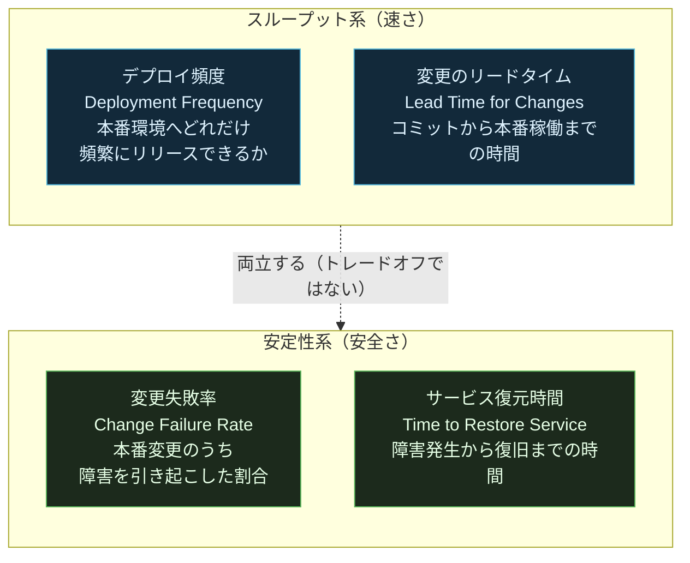

| 指標 | 定義 | エリートパフォーマー（参考値の傾向） |
|---|---|---|
| デプロイ頻度 | 本番環境へのリリース頻度 | オンデマンド・1日に複数回 |
| 変更のリードタイム | コミットから本番稼働までの所要時間 | 1時間未満〜1日未満 |
| 変更失敗率 | 変更が原因で障害・ロールバック等を招いた割合 | 概ね0〜15%程度 |
| サービス復元時間（MTTR） | 障害から回復するまでの時間 | 1時間未満 |

これらは互いにトレードオフの関係にあると考えられがちですが、Accelerateの分析結果はその通念を覆すものでした。速く届けるチームほど安定性も高い、という相関がハイパフォーマー群で一貫して観測されています。

なお、DORAの調査では2024年に5つ目のソフトウェアデリバリー指標として「Rework Rate（手戻り率）」が追加されました。2025年は調査そのものが「State of AI-assisted Software Development Report」へ改題され、AI活用が中心テーマになった年です。また、信頼性（Reliability）は2021年に追加された運用パフォーマンス指標であり、Rework Rateとは別系統の変更です（詳細は第16章）。

出典：[Google Cloud — 2025 DORA State of AI-assisted Software Development Report](https://cloud.google.com/resources/content/2025-dora-ai-assisted-software-development-report)、[GitHub — dora-team/fourkeys](https://github.com/dora-team/fourkeys)

---

## 4. 速度と安定性は両立する — ハイパフォーマーの実像

Accelerateの調査では、回答組織をクラスタ分析によって「ロー」「ミディアム」「ハイ」「エリート」の4段階のパフォーマンス層に分類しました。重要なのは、この分類が単一指標ではなく4つの鍵指標の複合パターンから統計的に導かれている点です。

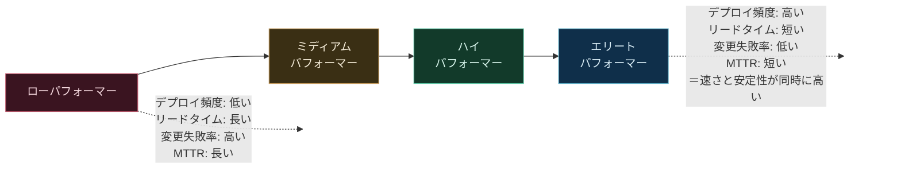

著者らはさらに、エリートパフォーマー企業は組織の業績目標（収益性・生産性・市場シェアなど、営利・非営利を問わない目標）を達成する可能性が高いという相関も報告しています。これは「技術的卓越性はコストセンターではなく競争優位の源泉である」という、本書全体を貫くメッセージの中核です。

出典：[Accelerate — Chapter 2: Measuring Performance（目次）](https://www.oreilly.com/library/view/accelerate/9781457191435/13-ch2.xhtml)

---

## 5. 24の主要ケイパビリティ：全体マップ

本書の実務的な核心は、ソフトウェアデリバリーパフォーマンス（そして文化・組織パフォーマンス）を予測することが統計的に確認された、24の「ケイパビリティ（能力）」の一覧です。これらは5つのカテゴリーに整理されています。

出典：[Software Meadows — "Accelerate" One Sheet Summary](https://www.softwaremeadows.com/posts/one_sheet_summary-_accelerate-_the_science_of_lean_software_and_devop/images/accelerate.pdf)、[Accelerate — Appendix A: Capabilities to Drive Improvement（目次）](https://www.oreilly.com/library/view/accelerate/9781457191435/32-app_A.xhtml)

---

## 6. 継続的デリバリー（Continuous Delivery）ケイパビリティ

継続的デリバリー（CD）は、Jez Humbleが2010年の著書『Continuous Delivery』で体系化した考え方であり、Accelerateの技術的プラクティスの土台になっています。CDとは「いつでもリリース可能な状態を保ちながら、ビルド・テスト・デプロイのプロセスを自動化し続けること」を指し、単なるツール導入ではなく組織的な規律です。

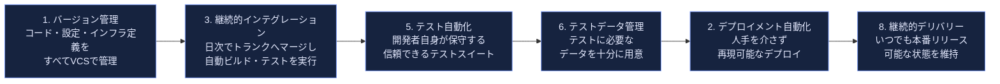

### トランクベース開発（4. Trunk-Based Development）

Accelerateの調査で特に議論を呼んだ発見のひとつが、長命なフィーチャーブランチ運用よりも、トランク（main/master）への頻繁なマージが高パフォーマンスと相関していたという結果です。マージ前に長時間分岐したブランチはマージコンフリクトのリスクを高め、統合のフィードバックを遅らせます。

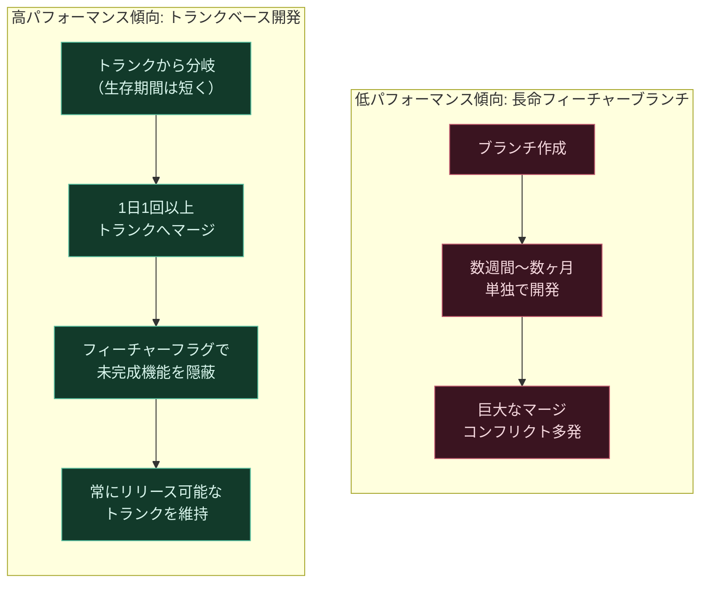

### セキュリティのシフトレフト（7. Shift Left on Security）

セキュリティレビューをリリース直前の関門にするのではなく、設計段階から組み込む考え方です。詳細は第10章で扱います。

出典：[Accelerate — Chapter 4: Technical Practices（目次）](https://www.oreilly.com/library/view/accelerate/9781457191435/15-ch4.xhtml)、[dora.dev — Resources](https://dora.dev/resources/)

---

## 7. アーキテクチャケイパビリティ：疎結合とConwayの法則

Accelerateにおけるアーキテクチャの議論は、「特定の技術（マイクロサービス、モノリスなど）」ではなく「疎結合性（loose coupling）」という性質そのものがパフォーマンスを予測するという発見に基づいています。チームが他チームとの調整をほぼ必要とせず、独立してテスト・デプロイできるかどうかが鍵です。

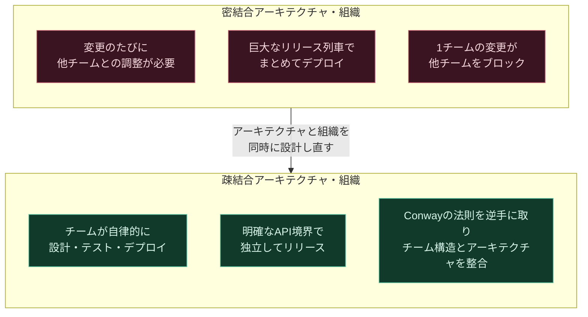

もう一つのアーキテクチャケイパビリティが「チームへの権限委譲（empowered teams）」です。チームがアーキテクチャ上の意思決定を、外部の承認を待たずに行える度合いを指します。Accelerateはここで、著名なソフトウェアアーキテクトの間で広く知られる「Conwayの法則（組織のコミュニケーション構造がシステム設計に反映される）」を明示的に引用し、疎結合な技術アーキテクチャを実現したいなら、それを担うチーム構造も疎結合にする必要があると論じています。

出典：[Accelerate — Chapter 5: Architecture（目次）](https://www.oreilly.com/library/view/accelerate/9781457191435/16-ch5.xhtml)

---

## 8. 製品・プロセスケイパビリティ：リーンプロダクトマネジメント

このカテゴリーは、Eric Riesの『リーンスタートアップ』に代表される仮説駆動型のプロダクト開発思想を、Accelerateの実証研究に接続したものです。ポイントは「作ったものが顧客に価値を届けているか」を頻繁に検証するループを組み込むことにあります。

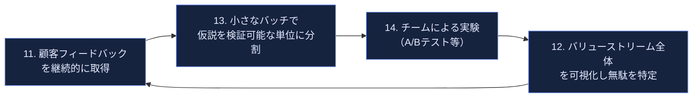

Accelerateはここで、「アウトプット（機能を作ったこと）」と「アウトカム（顧客・事業に価値をもたらしたこと）」を混同する典型的なアンチパターンにも触れています。バリューストリーム全体を可視化できているチームは、要求からリリースまでの流れのどこにボトルネックがあるかを組織全体で認識できるため、局所最適化に陥りにくいとされます。

出典：[Accelerate — Chapter 8: Product Development（目次）](https://www.oreilly.com/library/view/accelerate/9781457191435/19-ch8.xhtml)

---

## 9. リーン管理・モニタリングケイパビリティ

このカテゴリーは、トヨタ生産方式に代表されるリーン生産方式の考え方を、ソフトウェア開発のマネジメントプラクティスに翻訳したものです。

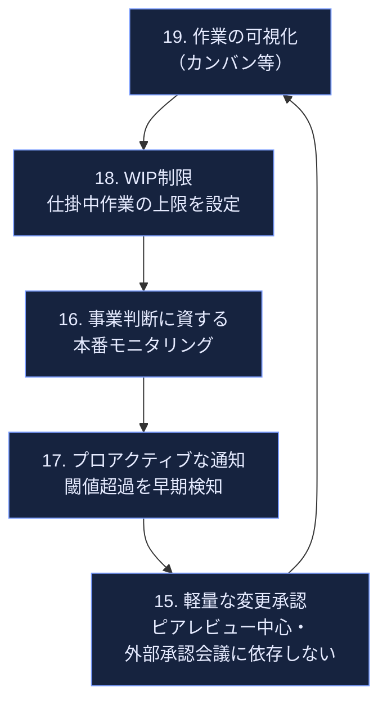

### 変更承認プロセス：重量級 vs 軽量級

Accelerateの調査で興味深いのは、多くの組織が安全策として導入している「外部変更諮問委員会（CAB）による事前承認」が、実はソフトウェアデリバリーパフォーマンスと負の相関を示した、という結果です。

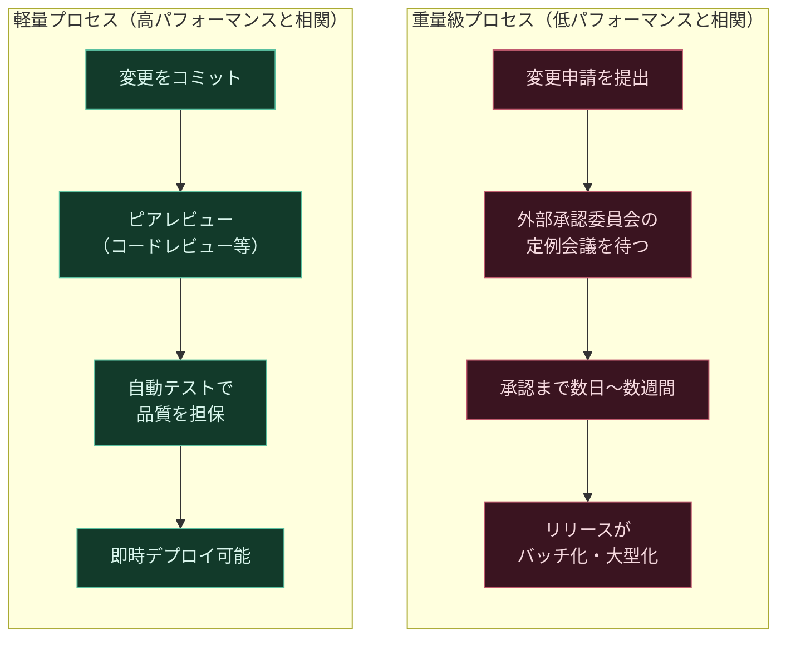

著者らは、これは「承認プロセスをなくせ」という主張ではなく、「変更のリスクに見合わない重量級のゲートは、かえってバッチサイズを増大させ、リスクを高める」という逆説を指摘するものだと強調しています。

出典：[Accelerate — Chapter 7: Management Practices for Software（目次）](https://www.oreilly.com/library/view/accelerate/9781457191435/18-ch7.xhtml)

---

## 10. 情報セキュリティ（Infosec）の統合

Accelerateは、セキュリティを開発プロセスの最後（リリース直前の監査）に置くのではなく、設計・実装の初期段階から組み込む「シフトレフト」の重要性を、統計データで裏付けています。

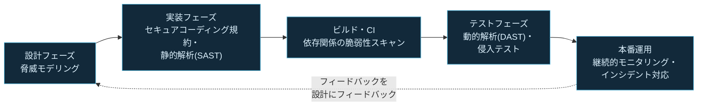

ポイントは、Infosecチームを「ゲートキーパー」から「デリバリーチームに寄り添うイネーブラー」へと役割転換させることです。セキュリティ担当者がツールやガイドラインを早期に提供し、開発者自身が日常のワークフローの中でセキュリティ上の問題を発見・修正できる状態を目指します。

出典：[Accelerate — Chapter 6: Integrating Infosec into the Delivery Lifecycle（目次）](https://www.oreilly.com/library/view/accelerate/9781457191435/17-ch6.xhtml)

---

## 11. 文化的ケイパビリティ：Westrumの組織文化モデル

Accelerateの文化論の中核をなすのが、社会学者Ron Westrumが提唱した組織文化の類型論です。著者らはこの類型を「情報がどれだけ組織内をスムーズに流れるか」という軸で捉え直し、生成的（創成型）文化こそが高いソフトウェアデリバリーパフォーマンスを予測すると論じています。

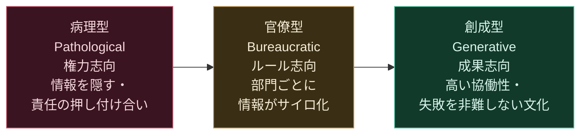

Westrumの理論の根底には「事故調査が『ヒューマンエラー』という結論で止まってしまう組織は、危険である」という考え方があります。本当のヒューマンエラーは調査の終着点ではなく出発点であるべきだ、という視点です。Accelerateはこの理論を裏付ける関連研究として、Googleの社内リサーチ「効果的なチームの条件」（心理的安全性の重要性を明らかにした調査）にも言及しています。

文化を変えるための著者らの助言は明快です。「人の考え方を変えようとする前に、まず人の行動を変えるところから始める」——つまり、価値観の啓蒙よりも、継続的デリバリーやリーン管理といった具体的なプラクティスの導入が、結果として文化を変えていくという因果の方向性を重視しています。

出典：[Accelerate — Chapter 3: Measuring and Changing Culture（目次）](https://www.oreilly.com/library/view/accelerate/9781457191435/14-ch3.xhtml)、[Software Meadows — Accelerate Notes and Quotes](https://www.softwaremeadows.com/devops/accelerate_notes_and_quotes/)

---

## 12. 燃え尽き症候群とデプロイメントペイン

Accelerateは、技術的プラクティスの巧拙が従業員の心身の健康にまで波及することを定量的に示した点でも注目されました。「デプロイメントペイン（deployment pain）」——すなわちリリース作業そのものへの恐怖や苦痛——が高い組織ほど、燃え尽き症候群のリスクが高いという関連が確認されています。

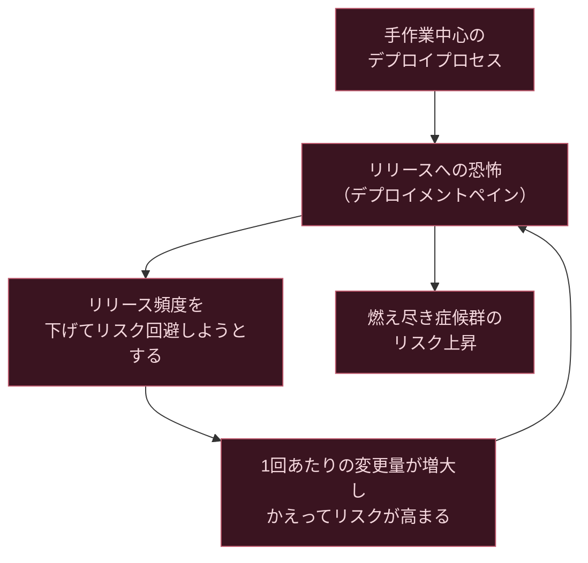

このループを断ち切る処方箋として、Accelerateは継続的デリバリーのケイパビリティ群（自動化・小さなバッチ・トランクベース開発）への投資を一貫して推奨しています。手作業とバッチサイズを減らすことが、皮肉にもデプロイの「痛み」を最小化する最短経路だという主張です。

出典：[Accelerate — Chapter 9: Making Work Sustainable（目次）](https://www.oreilly.com/library/view/accelerate/9781457191435/20-ch9.xhtml)

---

## 13. 従業員満足度・アイデンティティ・エンゲージメント

第10章では、従業員満足度（employee Net Promoter Score等の指標を含む）とソフトウェアデリバリーパフォーマンスの関係が扱われます。ここでの核心的な発見は、高い技術力への投資が単なる生産性向上策ではなく、従業員が自組織にとどまり、より意欲的に働くための土台にもなっているという点です。

| 要因 | 従業員満足度への影響（Accelerateの示唆） |
|---|---|
| デプロイメントペインの低さ | 低いほど満足度・定着率が高い傾向 |
| 生成的（創成型）文化 | 心理的安全性が高く、離職意向が下がる傾向 |
| 意味のある仕事へのアクセス | ツール・リソースが十分だと感じるほど満足度が高い |
| 変革型リーダーシップの存在 | エンゲージメントとパフォーマンスの双方に正の影響 |

出典：[Accelerate — Chapter 10: Employee Satisfaction, Identity, and Engagement（目次）](https://www.oreilly.com/library/view/accelerate/9781457191435/21-ch10.xhtml)

---

## 14. リーダーとマネージャーの役割：変革型リーダーシップ

Accelerateは、リーダーシップのスタイルそのものを定量的な調査対象として扱った点でも先駆的でした。用いられたのは組織心理学で確立された「変革型リーダーシップ（Transformational Leadership）」の尺度で、著者らはこれを5つの次元に分解しています。

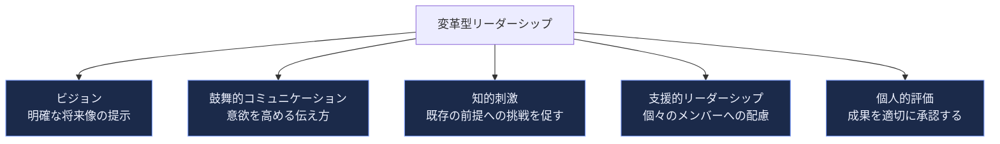

重要な発見は、変革型リーダーシップ自体は直接的にソフトウェアデリバリーパフォーマンスを生み出すわけではなく、24のケイパビリティへの投資を後押しする「増幅器（amplifier）」として機能するという構造です。つまりリーダーの役割は、現場のプラクティス改善を代替することではなく、それを可能にする条件（時間・裁量・心理的安全性）を整えることにあります。

出典：[Accelerate — Chapter 11: Leaders and Managers（目次）](https://www.oreilly.com/library/view/accelerate/9781457191435/22-ch11.xhtml)、[Accelerate — Chapter 16: High-Performance Leadership and Management（目次）](https://www.oreilly.com/library/view/accelerate/9781457191435/29-ch16.xhtml)

---

## 15. 統計的手法の裏側：心理測定学とPLS-SEM超入門

Part Two（第12〜15章）は、実務者向けというより研究の透明性を担保するための章群です。初学者が押さえておくべき要点は3つあります。

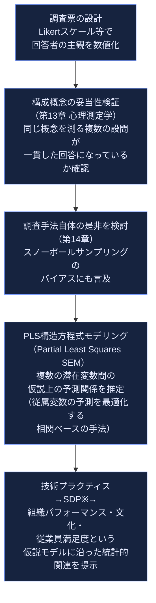

※SDP = Software Delivery Performance（ソフトウェアデリバリーパフォーマンス）

ここで注意すべきは、PLS-SEMが示すのはあくまで**仮説として置いたモデルに沿った潜在変数間の予測関係（統計的関連）**であり、因果関係の証明ではない点です。PLS-SEMは従属変数の予測（説明された分散）を最適化することを目的とした相関ベースの手法であり、本調査のような横断的な自己申告データから因果推論を行うことはできません。

自己申告データであるがゆえの限界（ダニング＝クルーガー効果のような自己評価バイアスの可能性）についても、Martin Fowlerが巻頭言で触れているとおり、著者ら自身が意識的に議論の対象としています。統計に強くない読者であっても、第1部（Part One）の実務的な結論だけを読み、根拠づけの詳細（第2部）は必要に応じて参照する、という読み方が現実的です。

出典：[Accelerate — Chapter 12〜15（目次）](https://www.oreilly.com/library/view/accelerate/9781457191435/24-ch12.xhtml)、[Martin Fowler — Foreword to Accelerate](https://martinfowler.com/articles/accelerate-foreword.html)

---

## 16. Accelerateから現在へ：2018→2026年DORAレポートの進化

Accelerateの刊行後、Nicole Forsgren率いるDORA（DevOps Research and Assessment）チームはGoogle Cloudに参画し、「State of DevOps Report」を年次で継続してきました。2026年8月時点で最も大きな転換点は、2025年に実施された調査が「State of AI-assisted Software Development Report」へと改題されたことです。

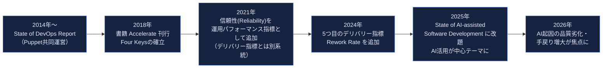

### DORA指標の現在地（2024年の第5指標追加以降）

| 指標 | 分類 | 概要 |
|---|---|---|
| デプロイ頻度 | Accelerate当時の4指標（現行5指標にも継続） | 本番リリースの頻度 |
| 変更のリードタイム | Accelerate当時の4指標（現行5指標にも継続） | コミットから本番稼働までの時間 |
| 変更失敗率 | Accelerate当時の4指標（現行5指標にも継続） | 変更が障害を招いた割合 |
| Failed Deployment Recovery Time（デプロイ失敗からの復旧時間） | Accelerate当時は MTTR（サービス復旧時間）。2023年に「失敗したデプロイからの復旧時間」へ定義変更 | 失敗したデプロイを復旧させるまでの時間。旧MTTRが障害全般を対象としていたのに対し、対象をデプロイ起因の失敗に限定した点が異なる |
| Rework Rate（手戻り率） | 2024年追加の第5のデリバリー指標 | 計画外の再デプロイ・修正対応がどれだけ発生しているか |
| Reliability（信頼性） | 2021年追加の運用パフォーマンス指標（デリバリー指標とは別系統） | 可用性・パフォーマンス等、ユーザー体感の安定性 |

DORA の近年のレポートは、AIコーディングアシスタントの普及によって個々の開発者が感じる生産性やスループットは向上する一方で、AI活用度の高まりがデリバリーの安定性（変更失敗率）や手戻り（Rework Rate）の悪化と結びつく傾向を報告しています。これはAccelerateが確立した「速度と安定性は両立する」という命題そのものへの反論ではなく、AIが導入プロセスの規律（レビュー・テスト自動化・小さなバッチ）を伴わない場合に、その両立が崩れうることを示す新たな知見と位置づけられます。

出典：[Google Cloud — 2025 DORA State of AI-assisted Software Development Report](https://cloud.google.com/resources/content/2025-dora-ai-assisted-software-development-report)、[dora.dev — DORA Report 2025](https://dora.dev/dora-report-2025/)、[dora.dev — Insights: 4つの鍵から現行の5指標モデルへ](https://dora.dev/insights/)、[Future Processing — DORA metrics in the age of AI-driven delivery](https://www.future-processing.com/blog/dora-devops-metrics/)、[Oobeya — DORA Metrics Are Not Enough in 2026](https://www.oobeya.io/blog/dora-metrics-not-enough-2026)

---

## 17. 実践ロードマップ：初学者が明日から始める10ステップ

Accelerateは特定の技術スタックを推奨する本ではなく、どんな環境からでも着手できるケイパビリティ投資の優先順位を示唆しています。以下は、本書の内容と、その後のDORA/IT Revolutionコミュニティの実践知見を踏まえた、初学者向けの導入順序の一例です。

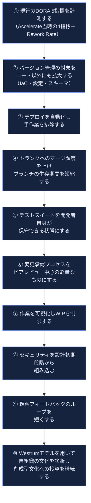

著者らが繰り返し強調する原則は「まず1つのチームで深く実践してから、横展開する（"go deep before you go wide"）」ことです。全社一律の大規模な変革プログラムよりも、1チームで技術的プラクティスとリーン管理・文化醸成を同時並行で徹底的に実践し、その成功パターンを他チームへ伝播させる方が、持続的な変革につながるとされています。

出典：[Medium — Book Summary: Accelerate（Tim de Vroome）](https://tdevroome.medium.com/book-summary-accelerate-c531efe4c34c)

---

## 18. よくある誤解とアンチパターン

| 誤解・アンチパターン | Accelerateが示す実際の知見 |
|---|---|
| 速さを追うと品質が犠牲になる | 統計的にはむしろ逆で、速さと安定性は同時に高まる傾向がある |
| 成熟度モデル（マチュリティモデル）で段階的に到達すればよい | 著者らは「一度到達したら終わり」という静的な成熟度モデルの考え方自体に否定的で、能力（ケイパビリティ）への継続的投資という動的な捉え方を提唱している |
| アウトプット（機能数・コード行数）で生産性を測る | アウトプットではなく、顧客・事業へのアウトカムやバリューストリーム全体の流れを見るべき |
| 特定のツール・技術（例：特定のクラウド、特定の言語）を採用すればパフォーマンスが上がる | 技術そのものではなく、疎結合性やトランクベース開発のような「プラクティスの型」がパフォーマンスを予測する |
| 重量級の変更承認プロセスほど安全である | 外部承認委員会への依存は、リリースの大型化・遅延を招き、むしろリスクを高める方向に相関する |
| セキュリティは最後にまとめてチェックすればよい | シフトレフトしたセキュリティ統合の方が、速度と安全性を両立しやすい |

出典：[Koalr — Accelerate Book Summary: Key Takeaways for Engineering Leaders](https://koalr.com/blog/accelerate-book-summary)

---

## 19. まとめ：実践チェックリスト

- [ ] 自チームの現行DORA 5指標（デプロイ頻度・変更のリードタイム・変更失敗率・Failed Deployment Recovery Time・Rework Rate）を計測できる状態にした
- [ ] うち前者4つが Accelerate 刊行当時の「4つの鍵指標」に対応することを理解した（MTTR は2023年に Failed Deployment Recovery Time へ再定義済み）
- [ ] バージョン管理の対象をアプリケーションコードだけでなく、インフラ定義・設定・テストデータにまで広げた
- [ ] デプロイメント作業から手作業を排除し、再現可能な自動化パイプラインを整備した
- [ ] フィーチャーブランチの生存期間を短縮し、トランクへのマージ頻度を上げた
- [ ] 変更承認プロセスをピアレビュー中心の軽量なものに見直した
- [ ] 作業をカンバン等で可視化し、WIP（仕掛中作業）に上限を設けた
- [ ] セキュリティチームを開発の初期段階から巻き込む体制を作った
- [ ] Westrumモデルに照らして自組織の文化（病理型・官僚型・創成型）を診断した
- [ ] リーダー・マネージャーが変革型リーダーシップの5要素（ビジョン・鼓舞・知的刺激・支援・評価）を意識的に実践している
- [ ] 1つのチームで実践を深めてから他チームへ横展開する計画を立てた

---

## 20. 参考文献

1. O'Reilly Online Learning — *Accelerate*（書誌・全16章目次） https://www.oreilly.com/library/view/accelerate/9781457191435/
2. IT Revolution Press — *Accelerate* 製品ページ https://itrevolution.com/product/accelerate/
3. Martin Fowler — *Foreword to Accelerate*（巻頭言全文） https://martinfowler.com/articles/accelerate-foreword.html
4. Software Meadows — *"Accelerate" by Forsgren, Humble, and Kim: One Sheet Summary*（24ケイパビリティ一覧） https://www.softwaremeadows.com/posts/one_sheet_summary-_accelerate-_the_science_of_lean_software_and_devop/images/accelerate.pdf
5. Software Meadows — *'Accelerate' Book Notes And Quotes*（Westrumモデル・リーン管理の要点） https://www.softwaremeadows.com/devops/accelerate_notes_and_quotes/
6. Roman Imankulov — *Accelerate. Five-minute summary*（5カテゴリー構成の解説） https://roman.pt/posts/accelerate/
7. Koalr — *Accelerate Book Summary: Key Takeaways for Engineering Leaders* https://koalr.com/blog/accelerate-book-summary
8. Tim de Vroome (Medium) — *Book Summary: Accelerate*（実践ロードマップ関連） https://tdevroome.medium.com/book-summary-accelerate-c531efe4c34c
9. Google Cloud — *2025 DORA State of AI-assisted Software Development Report* https://cloud.google.com/resources/content/2025-dora-ai-assisted-software-development-report
10. dora.dev — *DORA Report 2025* https://dora.dev/dora-report-2025/
11. dora.dev — *Insights*（4つの鍵から現行モデルへの移行） https://dora.dev/insights/
12. dora.dev — *Resources*（Four Keysオープンソースツール等） https://dora.dev/resources/
13. GitHub — *dora-team/fourkeys*（DORA公式の指標計測ツール） https://github.com/dora-team/fourkeys
14. Future Processing — *DORA metrics in the age of AI-driven delivery*（2025年の指標拡張の解説） https://www.future-processing.com/blog/dora-devops-metrics/
15. Oobeya — *DORA Metrics Are Not Enough in 2026: What Elite Engineering Teams Track Instead* https://www.oobeya.io/blog/dora-metrics-not-enough-2026
16. GetDX — *DORA metrics: the complete guide to measuring DevOps performance in the AI era* https://getdx.com/blog/dora-metrics/

---

*本ガイドは書籍『Accelerate』の内容を要約・翻案した二次的な学習教材であり、原著の文章を逐語的に引用するものではありません。正確な内容は必ず原著（[O'Reilly](https://www.oreilly.com/library/view/accelerate/9781457191435/) / IT Revolution Press刊）をご参照ください。*
