# Google Cloud ACE 試験対策 - Section 1: Setting up a Cloud Solution Environment

## 中級者〜上級者向け 完全詳細解説ガイド

> **試験配点**: 全体の約 **20%**（新試験ガイド 2025年6月30日〜）  
> **公式試験ガイド**: https://services.google.com/fh/files/misc/063026_associate_cloud_engineer_exam_guide_english.pdf  
> **認定ページ**: https://cloud.google.com/learn/certification/cloud-engineer?hl=en

---

## 📋 Section 1 の出題範囲マップ

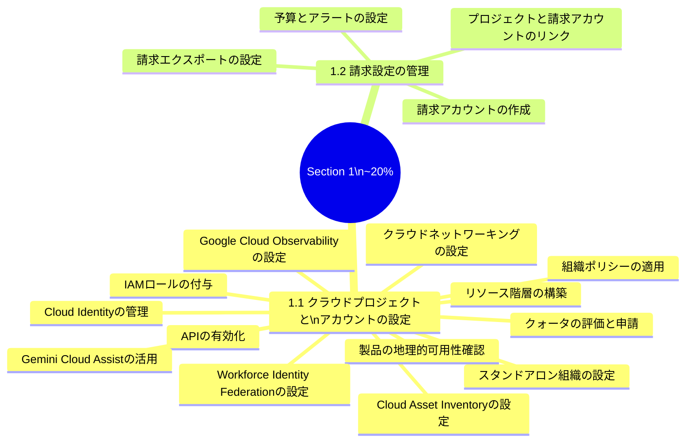

---

## 目次

1. [1.1 クラウドプロジェクトとアカウントの設定](#11-クラウドプロジェクトとアカウントの設定)
   - [1.1.1 リソース階層の構築](#111-リソース階層の構築)
   - [1.1.2 組織ポリシーの適用](#112-組織ポリシーの適用)
   - [1.1.3 IAMロールの付与](#113-iamロールの付与)
   - [1.1.4 Cloud Identityのユーザー・グループ管理](#114-cloud-identityのユーザーグループ管理)
   - [1.1.5 APIの有効化](#115-apiの有効化)
   - [1.1.6 Google Cloud Observabilityの設定](#116-google-cloud-observabilityの設定)
   - [1.1.7 クォータの評価と申請](#117-クォータの評価と申請)
   - [1.1.8 スタンドアロン組織の設定](#118-スタンドアロン組織の設定)
   - [1.1.9 クラウドネットワーキングの設定](#119-クラウドネットワーキングの設定)
   - [1.1.10 製品の地理的可用性の確認](#1110-製品の地理的可用性の確認)
   - [1.1.11 Cloud Asset InventoryとGemini Cloud Assist](#1111-cloud-asset-inventoryとgemini-cloud-assist)
   - [1.1.12 Workforce Identity Federationの設定](#1112-workforce-identity-federationの設定)
2. [1.2 請求設定の管理](#12-請求設定の管理)
   - [1.2.1 請求アカウントの作成](#121-請求アカウントの作成)
   - [1.2.2 プロジェクトと請求アカウントのリンク](#122-プロジェクトと請求アカウントのリンク)
   - [1.2.3 予算とアラートの設定](#123-予算とアラートの設定)
   - [1.2.4 請求エクスポートの設定](#124-請求エクスポートの設定)
3. [試験頻出パターンと対策](#試験頻出パターンと対策)
4. [Section 1 チェックリスト](#section-1-チェックリスト)

---

## 1.1 クラウドプロジェクトとアカウントの設定

---

### 1.1.1 リソース階層の構築

#### 概念と構造

Google Cloud のすべてのリソースは、以下の4層の厳密な階層で管理される。この階層を正確に理解することが、試験において最頻出かつ最重要のテーマの一つである。

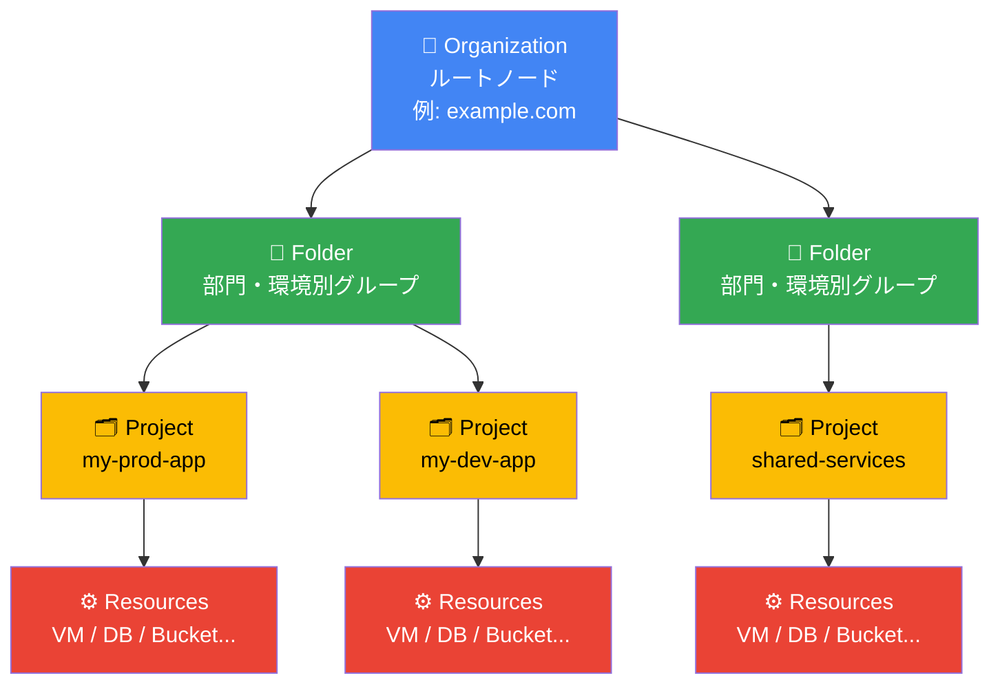

#### 各レベルの詳細

| レベル | 特徴 | 主な役割 |
|--------|------|----------|
| **Organization** | 階層のルートノード。Google Workspace または Cloud Identity ドメインに自動紐付け | 組織全体のポリシー・IAM 管理の起点 |
| **Folder** | オプション。最大10階層まで入れ子可能 | 部門・事業部・環境（prod/dev）の分離 |
| **Project** | リソースの基本単位。課金・API・IAMの境界 | リソースの作成・管理コンテナ |
| **Resource** | 実際のクラウドサービス（VM、DB、Storageなど） | ビジネスロジックを実行する実体 |

#### Project の識別子

各プロジェクトには3種類の識別子が存在する。

| 識別子 | 特性 | 例 |
|--------|------|-----|
| **Project ID** | グローバルに一意、作成後**変更不可** | `my-webapp-prod-20250101` |
| **Project Number** | Google が自動採番する数値 ID、変更不可 | `123456789012` |
| **Project Name** | 表示名のみ、変更可能・一意性不要 | `My Webapp Production` |

> **試験ポイント**: Project ID はグローバルに一意で変更不可。削除されたプロジェクトと同一の ID は、再利用できないケースがある。

#### IAMポリシーの継承メカニズム

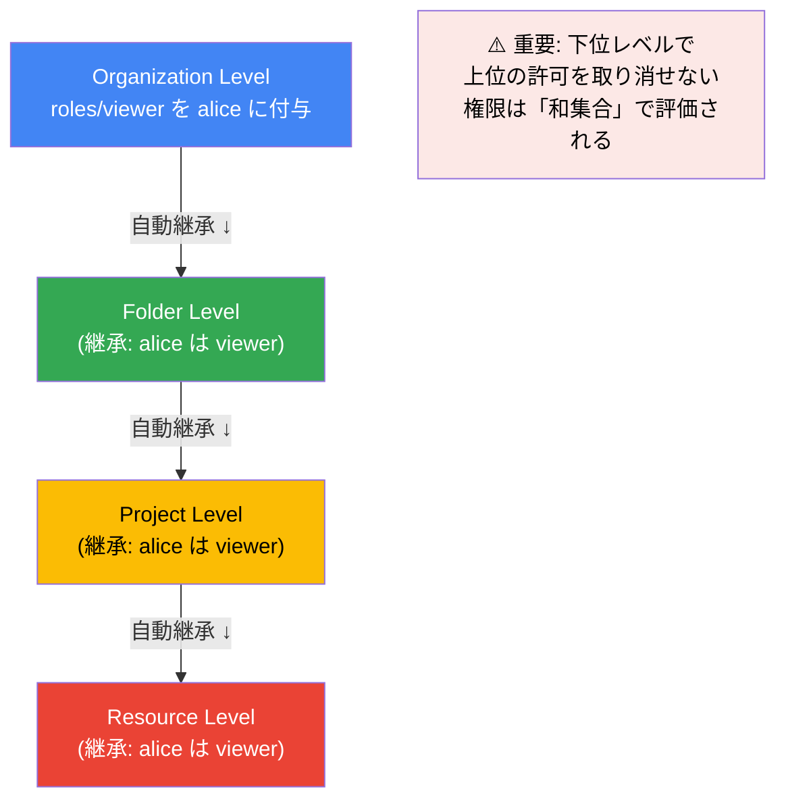

**継承の重要ルール**:
- IAM ポリシーは **上位から下位へ自動継承**される
- 有効な権限は、リソース自身に付与されたポリシーと、すべての親リソースから継承されたポリシーの**和集合（Union）**
- 下位レベルで上位の許可を「取り消す」ことは**できない**（Deny Policy を除く）
- 複数プロジェクトに共通の権限は、**親フォルダレベル**で付与することで管理オーバーヘッドを削減できる

#### gcloud コマンドでの操作

```bash
# プロジェクトの作成
gcloud projects create PROJECT_ID \
  --name="My Project" \
  --folder=FOLDER_ID

# 組織配下のプロジェクト一覧
gcloud projects list --filter="parent.id=ORG_ID"

# プロジェクトの詳細確認
gcloud projects describe PROJECT_ID

# 削除（30日間の猶予あり）
gcloud projects delete PROJECT_ID

# 削除のキャンセル（30日以内）
gcloud projects undelete PROJECT_ID
```

#### ✅ ベストプラクティス

| # | プラクティス | 根拠 |
|---|------------|------|
| 1 | 企業の組織構造をフォルダ階層に反映する | 権限管理が直感的になり、ポリシーの継承が自然に機能する |
| 2 | 開発・ステージング・本番を**別プロジェクト**に分離する | セキュリティ境界・課金・アクセス制御を独立管理できる |
| 3 | 複数プロジェクト共通の権限は**親フォルダレベル**で付与 | 個別設定の手間を省き、設定漏れを防止する |
| 4 | 同じ信頼境界を持つリソースを同一プロジェクトに配置 | セキュリティポリシーの一貫性を保持できる |
| 5 | 組織を持つ企業は Google Workspace または Cloud Identity を紐付ける | Organization ノードを取得し、階層管理を有効化できる |

> **公式ドキュメント**: https://docs.cloud.google.com/resource-manager/docs/cloud-platform-resource-hierarchy  
> **IAM 継承**: https://docs.cloud.google.com/iam/docs/resource-hierarchy-access-control

---

### 1.1.2 組織ポリシーの適用

#### 概念: IAMとの違い

組織ポリシーと IAM はよく混同されるが、役割が根本的に異なる。

| 観点 | IAM | Organization Policy |
|------|-----|---------------------|
| **制御対象** | **誰が** 何をできるか（アクセス制御） | **何を** どう設定できるか（リソース設定の強制） |
| **設定対象** | Principal（ユーザー・SA・グループ） | リソースの設定値・構成 |
| **例** | alice が VM を作成できる | 外部 IP を持つ VM は誰も作成できない |
| **優先度** | IAM Deny Policy で上書き可能 | Organization Policy は IAM より強制力が高い |

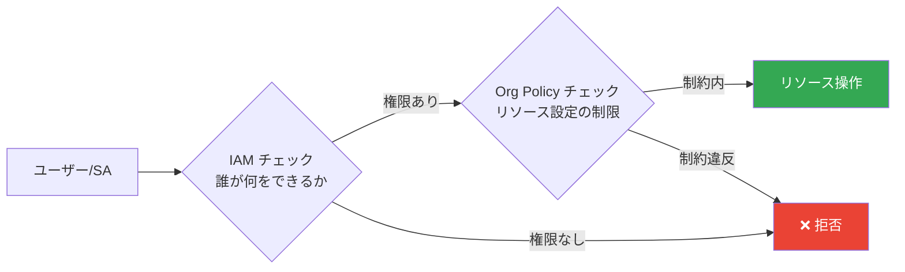

#### 主要な制約（Constraints）一覧

**セキュリティ強化系**

| 制約名 | 効果 | 推奨設定 |
|--------|------|----------|
| `constraints/iam.disableServiceAccountKeyCreation` | SA の静的 JSON キー生成を禁止 | 組織全体で有効化 |
| `constraints/iam.disableServiceAccountKeyUpload` | 外部キーのアップロードを禁止 | 組織全体で有効化 |
| `constraints/compute.requireOsLogin` | 全 VM で OS Login を強制 | 有効化推奨 |
| `constraints/iam.allowedPolicyMemberDomains` | IAM に追加できるドメインを限定 | 自社ドメインのみ許可 |

**ネットワーク制限系**

| 制約名 | 効果 |
|--------|------|
| `constraints/compute.disableExternalIpAddresses` | 外部 IP を持つ VM の作成を禁止 |
| `constraints/compute.vmExternalIpAccess` | 外部 IP を許可する VM のリストを制限 |
| `constraints/compute.restrictCloudNATUsage` | Cloud NAT の使用を特定サブネットに制限 |

**データ主権・コンプライアンス系**

| 制約名 | 効果 |
|--------|------|
| `constraints/gcp.resourceLocations` | リソースを特定リージョン/ゾーンに限定 |
| `constraints/storage.uniformBucketLevelAccess` | Cloud Storage でバケットレベルアクセスを強制 |
| `constraints/storage.publicAccessPrevention` | Cloud Storage のパブリックアクセスを禁止 |

#### 継承と上書き

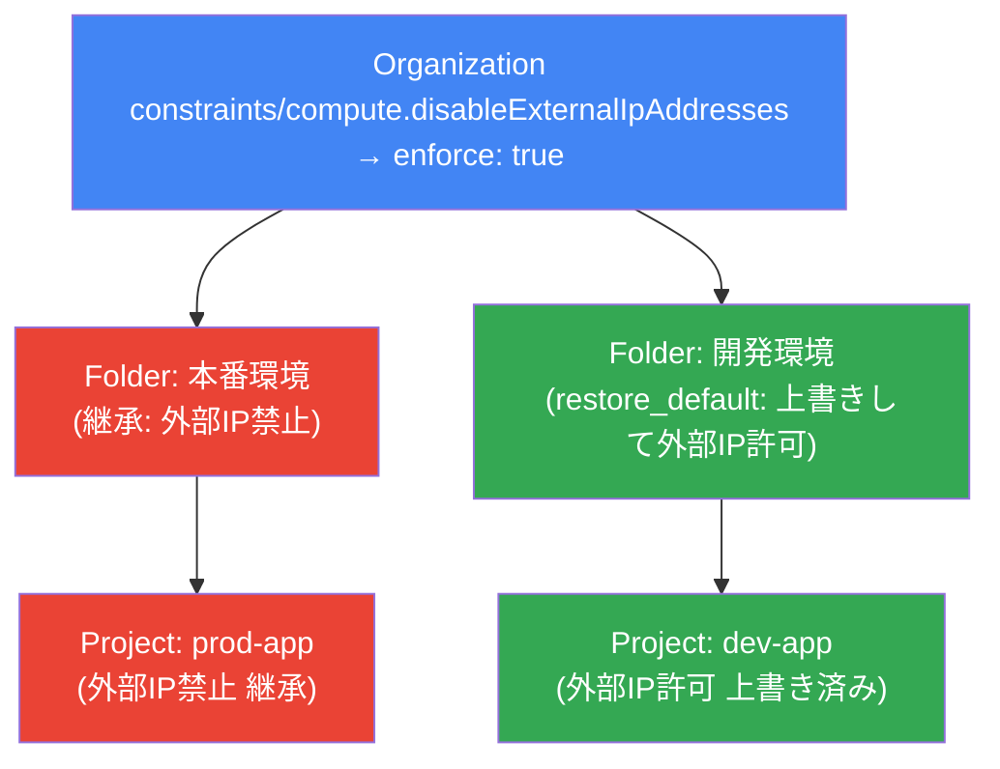

#### Dry-Run モード（2025年新機能）

ポリシーを本番に適用する前にテストできる。

```bash
# Dry-Run モードで組織ポリシーを設定（違反はログに記録されるが拒否されない）
gcloud org-policies set-policy policy.yaml \
  --dry-run

# 有効なポリシーの確認
gcloud org-policies describe \
  constraints/compute.disableExternalIpAddresses \
  --organization=ORG_ID \
  --effective
```

#### gcloud コマンドでの操作

```bash
# 制約の一覧確認
gcloud org-policies list-constraints --organization=ORG_ID

# 特定制約の適用（外部IP禁止）
gcloud resource-manager org-policies enable-enforce \
  constraints/compute.disableExternalIpAddresses \
  --organization=ORG_ID

# ポリシーをプロジェクトに適用（YAMLファイル使用）
gcloud org-policies set-policy policy.yaml \
  --project=PROJECT_ID

# 現在の有効ポリシーを確認
gcloud org-policies describe \
  constraints/gcp.resourceLocations \
  --effective \
  --project=PROJECT_ID
```

**policy.yaml の例（リージョン制限）**:

```yaml
name: projects/PROJECT_ID/policies/gcp.resourceLocations
spec:
  rules:
  - values:
      allowedValues:
      - in:asia-northeast1-locations  # 東京
      - in:asia-northeast2-locations  # 大阪
```

#### ✅ ベストプラクティス

| # | プラクティス | 根拠 |
|---|------------|------|
| 1 | `constraints/iam.disableServiceAccountKeyCreation` を組織全体で有効化 | SA キーの漏洩リスクを根本排除できる |
| 2 | `constraints/gcp.resourceLocations` でデータを法域内に限定 | GDPR・個人情報保護法への準拠 |
| 3 | 本番環境への適用前に **Dry-Run モード**でテスト | 意図しないサービス停止を防止できる |
| 4 | 開発環境では制約を緩和し、本番は厳格に設定 | 開発効率と本番セキュリティのバランスを実現 |
| 5 | Policy Recommender でポリシー違反を定期的に確認 | 継続的なコンプライアンス維持 |

> **公式ドキュメント**: https://docs.cloud.google.com/organization-policy/overview  
> **制約一覧**: https://cloud.google.com/resource-manager/docs/organization-policy/org-policy-constraints

---

### 1.1.3 IAMロールの付与

#### IAMの3要素

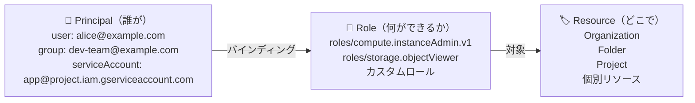

#### ロールの3種類

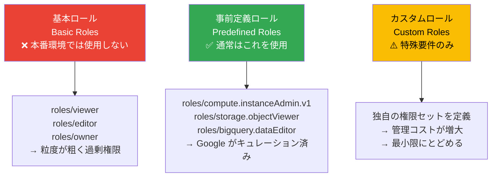

#### 主要な事前定義ロール（試験頻出）

**Compute Engine**

| ロール | 権限の概要 |
|--------|----------|
| `roles/compute.admin` | Compute Engine の完全管理 |
| `roles/compute.instanceAdmin.v1` | VM の作成・管理（ネットワーク変更は不可） |
| `roles/compute.osLogin` | OS Login での SSH（sudo なし） |
| `roles/compute.osAdminLogin` | OS Login での SSH（sudo あり） |
| `roles/compute.networkAdmin` | ネットワークリソースの管理 |

**Cloud Storage**

| ロール | 権限の概要 |
|--------|----------|
| `roles/storage.admin` | バケット・オブジェクトの完全管理 |
| `roles/storage.objectAdmin` | オブジェクトの完全管理（バケット設定変更不可） |
| `roles/storage.objectCreator` | オブジェクトのアップロードのみ |
| `roles/storage.objectViewer` | オブジェクトの読み取りのみ |

**IAM**

| ロール | 権限の概要 |
|--------|----------|
| `roles/iam.serviceAccountAdmin` | SA の作成・管理 |
| `roles/iam.serviceAccountUser` | SA を VM にアタッチする権限 |
| `roles/iam.serviceAccountTokenCreator` | SA の短期トークン生成（権限借用） |
| `roles/iam.workloadIdentityUser` | Workload Identity 経由での SA アクセス |

#### gcloud コマンドでの操作

```bash
# プロジェクトに IAM バインディングを追加
gcloud projects add-iam-policy-binding PROJECT_ID \
  --member="user:alice@example.com" \
  --role="roles/compute.instanceAdmin.v1"

# グループにロールを付与（推奨）
gcloud projects add-iam-policy-binding PROJECT_ID \
  --member="group:dev-team@example.com" \
  --role="roles/run.developer"

# IAM Conditions（時間制限付き権限）
gcloud projects add-iam-policy-binding PROJECT_ID \
  --member="user:contractor@partner.com" \
  --role="roles/viewer" \
  --condition='title=TemporaryAccess,expression=request.time < timestamp("2025-12-31T23:59:59Z")'

# 現在の IAM ポリシーを確認
gcloud projects get-iam-policy PROJECT_ID

# ロールを削除
gcloud projects remove-iam-policy-binding PROJECT_ID \
  --member="user:alice@example.com" \
  --role="roles/compute.instanceAdmin.v1"

# カスタムロールの作成
gcloud iam roles create customDeployer \
  --project=PROJECT_ID \
  --file=custom-role.yaml
```

#### ✅ ベストプラクティス

| # | プラクティス | 根拠 |
|---|------------|------|
| 1 | **最小特権の原則**を徹底（必要な権限だけ付与） | アカウント侵害時の被害を最小化 |
| 2 | 個人ではなく**グループ**にロールを付与 | メンバー変更時の管理を自動化できる |
| 3 | 基本ロール（Editor/Owner）は本番環境で**原則使用禁止** | 過剰権限によるリスクを排除 |
| 4 | **Policy Recommender** で不要な権限を定期的に削除 | 権限のクリープ（肥大化）防止 |
| 5 | 一時的な作業には **IAM Conditions** で有効期限を設定 | 永続権限のリスクを排除 |

> **公式ドキュメント**: https://docs.cloud.google.com/iam/docs/resource-hierarchy-access-control  
> **IAM ベストプラクティス**: https://cloud.google.com/blog/products/identity-security/iam-best-practice-guides-available-now

---

### 1.1.4 Cloud Identityのユーザー・グループ管理

#### Cloud Identity と Google Workspace の違い

| 項目 | Google Workspace | Cloud Identity (Free) | Cloud Identity (Premium) |
|------|-----------------|----------------------|--------------------------|
| Gmail / Drive | ✅ あり | ❌ なし | ❌ なし |
| Google Cloud 利用 | ✅ | ✅ | ✅ |
| Organization ノード | ✅ 自動作成 | ✅ 自動作成 | ✅ 自動作成 |
| MDM（モバイル管理） | 一部 | ❌ | ✅ |
| コスト | 有料 | **無料** | 有料 |

#### ユーザー管理の方法（手動 vs 自動化）

**手動管理**:

```bash
# gcloud での操作（管理者権限が必要）
# Cloud Identity / Workspace Admin Console での操作が主流

# グループへのメンバー追加（gcloud コマンドでの例）
gcloud identity groups memberships add \
  --group-email=dev-team@example.com \
  --member-email=alice@example.com \
  --roles=MEMBER

# グループの一覧
gcloud identity groups list \
  --organization=ORG_ID
```

**自動化（Directory Sync）**:

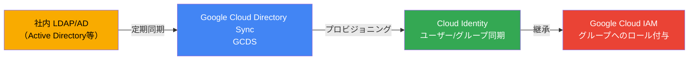

**SCIM（自動プロビジョニング）**: IdP（Okta、Azure AD 等）から Cloud Identity への自動ユーザー同期が可能。

#### ✅ ベストプラクティス

| # | プラクティス | 根拠 |
|---|------------|------|
| 1 | 退職者管理は Cloud Identity での無効化を基点にする | IAM から自動的にアクセスが失効する |
| 2 | GCDS または SCIM で **自動プロビジョニング**を設定 | 人的ミスと管理コストを削減 |
| 3 | `allUsers` / `allAuthenticatedUsers` への権限付与を禁止 | 意図しないパブリックアクセスを防止 |

> **公式ドキュメント**: https://cloud.google.com/identity/docs/overview

---

### 1.1.5 APIの有効化

#### なぜデフォルトで無効か

新規プロジェクトではほとんどの API がデフォルトで無効化されている。これは**攻撃面（Attack Surface）を最小化**するためのセキュリティ設計である。

#### API の有効化方法

```bash
# 単一APIの有効化
gcloud services enable compute.googleapis.com \
  --project=PROJECT_ID

# 複数APIを一括有効化
gcloud services enable \
  compute.googleapis.com \
  container.googleapis.com \
  run.googleapis.com \
  sqladmin.googleapis.com \
  cloudfunctions.googleapis.com \
  secretmanager.googleapis.com \
  --project=PROJECT_ID

# 有効化されているAPIの確認
gcloud services list --enabled --project=PROJECT_ID

# APIの無効化
gcloud services disable compute.googleapis.com \
  --project=PROJECT_ID
```

#### 主要API と対応するサービス

| API 名 | 対応サービス |
|--------|------------|
| `compute.googleapis.com` | Compute Engine |
| `container.googleapis.com` | Google Kubernetes Engine |
| `run.googleapis.com` | Cloud Run |
| `sqladmin.googleapis.com` | Cloud SQL |
| `bigquery.googleapis.com` | BigQuery |
| `cloudfunctions.googleapis.com` | Cloud Functions |
| `pubsub.googleapis.com` | Pub/Sub |
| `secretmanager.googleapis.com` | Secret Manager |
| `cloudkms.googleapis.com` | Cloud KMS |
| `monitoring.googleapis.com` | Cloud Monitoring |
| `logging.googleapis.com` | Cloud Logging |
| `cloudasset.googleapis.com` | Cloud Asset Inventory |
| `geminicloudassist.googleapis.com` | Gemini Cloud Assist |

#### Terraform による API 管理

```hcl
# 必要な API をコードで管理（再現性確保）
resource "google_project_service" "apis" {
  for_each = toset([
    "compute.googleapis.com",
    "container.googleapis.com",
    "run.googleapis.com",
  ])

  project            = var.project_id
  service            = each.value
  disable_on_destroy = false  # Terraform 削除時にAPIを無効化しない
}
```

#### ✅ ベストプラクティス

| # | プラクティス | 根拠 |
|---|------------|------|
| 1 | 必要なAPIのみを有効化する（最小権限の原則） | 攻撃面を最小化できる |
| 2 | Terraform / Config Connector で API 有効化を IaC 管理する | 環境の再現性・一貫性を確保できる |
| 3 | `disable_on_destroy = false` を設定する | Terraform 削除時の意図しないサービス中断を防止 |

---

### 1.1.6 Google Cloud Observabilityの設定

#### Google Cloud Observabilityとは

Google Cloud の可観測性スイートには以下のサービスが含まれる。

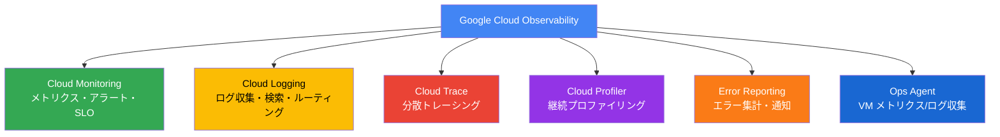

#### 初期設定で必須の作業

```bash
# 1. Monitoring API と Logging API の有効化
gcloud services enable monitoring.googleapis.com logging.googleapis.com \
  --project=PROJECT_ID

# 2. Ops Agent のインストール（Compute Engine VM に対して）
# VM にSSH後、以下を実行:
curl -sSO https://dl.google.com/cloudagents/add-google-cloud-ops-agent-repo.sh
sudo bash add-google-cloud-ops-agent-repo.sh --also-install

# 3. Managed Service for Prometheus の有効化（GKE用）
gcloud container clusters update CLUSTER_NAME \
  --enable-managed-prometheus \
  --region=REGION

# 4. Workspaces（旧 Monitoring Workspaces）の確認
# Cloud Console → Monitoring → Settings で確認
```

#### ✅ ベストプラクティス

| # | プラクティス | 根拠 |
|---|------------|------|
| 1 | プロジェクト作成直後に Monitoring/Logging API を有効化 | 初期からのメトリクス・ログ収集が可能になる |
| 2 | Compute Engine VM には**必ず Ops Agent をインストール** | メモリ使用量などデフォルトでは収集されないメトリクスを取得 |
| 3 | GKE には **Managed Service for Prometheus** を設定 | オープンソース互換で運用コストを最小化できる |

> **公式ドキュメント**: https://cloud.google.com/products/observability

---

### 1.1.7 クォータの評価と申請

#### クォータとは

Google Cloud のクォータ（Quota）は、リソースの過剰使用を防ぐための**使用上限**である。サービスごと、リージョンごと、プロジェクトごとに設定されている。

| クォータの種類 | 例 |
|--------------|-----|
| レート制限 | 1 秒あたりの API リクエスト数 |
| リソース制限 | プロジェクトあたりの VM 数、vCPU 数 |
| ストレージ制限 | GCS バケット数 |

#### クォータの確認と申請

```bash
# プロジェクトのクォータ確認
gcloud compute project-info describe --project=PROJECT_ID

# 特定サービスのクォータ確認
gcloud services quota list \
  --service=compute.googleapis.com \
  --project=PROJECT_ID

# クォータ使用状況の確認（Cloud Monitoring 経由）
# Cloud Console → IAM と管理 → クォータ
```

**申請手順（Console 経由）**:

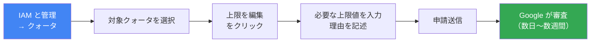

#### ✅ ベストプラクティス

| # | プラクティス | 根拠 |
|---|------------|------|
| 1 | 大規模デプロイ前に**事前にクォータ申請**を行う | 申請から承認まで数日かかる場合があるため |
| 2 | Cloud Monitoring でクォータ使用率を監視 | クォータ超過によるサービス停止を事前に防止 |
| 3 | プロジェクト数を増やす前にデフォルト上限（一部制限あり）を確認 | 組織内のプロジェクト作成にもレート制限がある |

> **公式ドキュメント**: https://cloud.google.com/docs/quota

---

### 1.1.8 スタンドアロン組織の設定

#### スタンドアロン組織とは

既存の Google Workspace / Cloud Identity ドメインなしに、Google Cloud のみで**独立した Organization ノード**を作成する設定。主に特定のエンタープライズシナリオで使用される。

**通常の組織作成フロー**:

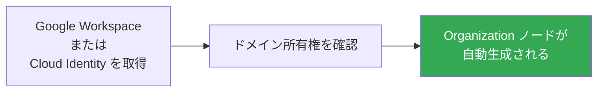

**スタンドアロン設定の考慮事項**:
- Google Workspace / Cloud Identity なしでの Organization 作成は特定条件下でのみ可能
- 通常はドメイン認証済みの Cloud Identity アカウントが必要
- セキュリティポリシーや監査証跡の管理が複雑になる

#### ✅ ベストプラクティス

| # | プラクティス |
|---|------------|
| 1 | 可能な限り Google Workspace または Cloud Identity を使用して Organization を作成する |
| 2 | 個人用 Gmail (@gmail.com) での本番環境構築は避ける |

---

### 1.1.9 クラウドネットワーキングの設定

#### 初期設定で考慮すべき項目

Section 1 の文脈では、**ネットワーキングの初期セットアップ**が問われる。詳細な設計は Section 2 だが、以下の基本設定を理解する必要がある。

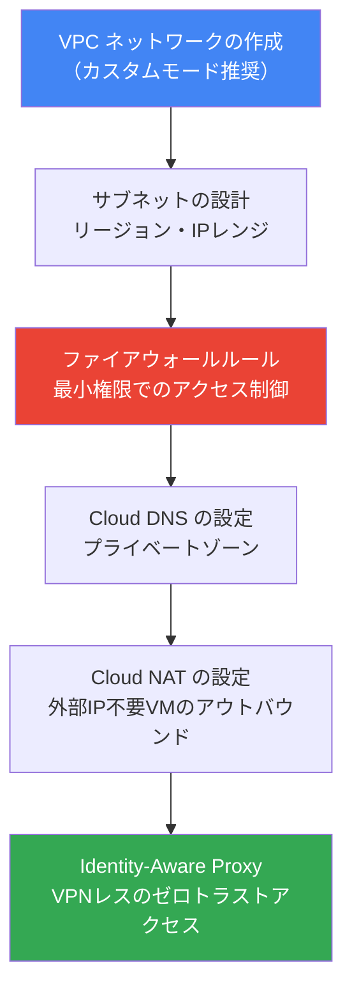

#### デフォルト VPC vs カスタム VPC

| 項目 | デフォルト VPC | カスタム VPC |
|------|--------------|------------|
| 自動作成 | ✅ 各リージョンに自動 | ❌ 手動で作成 |
| サブネット | 自動（10.128.0.0/9） | 手動で設計 |
| 本番環境での推奨 | ❌ 非推奨 | ✅ 推奨 |
| 理由 | IP 範囲が固定で VPC Peering に制限がある | IP 範囲を自由に設計でき、管理しやすい |

```bash
# カスタムモード VPC の作成
gcloud compute networks create my-vpc \
  --subnet-mode=custom \
  --project=PROJECT_ID

# サブネットの作成
gcloud compute networks subnets create my-subnet \
  --network=my-vpc \
  --region=asia-northeast1 \
  --range=10.1.0.0/24 \
  --project=PROJECT_ID
```

#### ✅ ベストプラクティス

| # | プラクティス | 根拠 |
|---|------------|------|
| 1 | デフォルト VPC は削除し、**カスタムモード VPC** を使用 | IP 範囲の計画的な管理と VPC Peering 対応 |
| 2 | プロジェクト作成直後にファイアウォールルールをレビューする | デフォルトルールに過剰な許可がある場合がある |
| 3 | VM には外部 IP を付与せず、**Cloud NAT + IAP** を使用 | 攻撃面を最小化できる |

> **公式ドキュメント**: https://docs.cloud.google.com/vpc/docs/overview

---

### 1.1.10 製品の地理的可用性の確認

#### リージョンとゾーンの概念

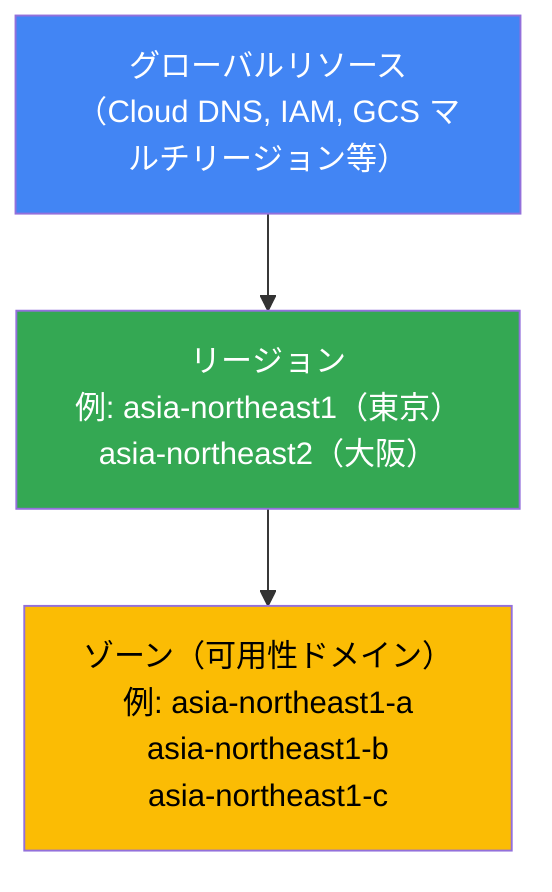

#### 可用性の確認方法

```bash
# 利用可能なリージョンの一覧
gcloud compute regions list

# 特定リージョンのゾーン一覧
gcloud compute zones list --filter="region:asia-northeast1"

# 特定リージョンで利用可能なマシンタイプ
gcloud compute machine-types list \
  --filter="zone:asia-northeast1-a"
```

**Cloud Console での確認**:
- Google Cloud コンソール → 各サービスのページ → ロケーション設定で利用可能リージョンを確認
- **Product and geographic availability ページ**: https://cloud.google.com/about/locations

#### 地域別の製品可用性の考慮点

| 考慮事項 | 詳細 |
|---------|------|
| **データ主権** | 特定国のデータを国外に出せない規制への対応 |
| **レイテンシ** | ユーザーに近いリージョンを選択 |
| **可用性** | 複数ゾーンへの分散でゾーン障害に備える |
| **コスト** | リージョンによって料金が異なる |
| **サービス対応** | 一部サービスはリージョンによって提供されない場合がある |

---

### 1.1.11 Cloud Asset InventoryとGemini Cloud Assist

#### Cloud Asset Inventory

組織全体の Google Cloud リソースと IAM ポリシーを**一元管理・分析・エクスポート**するサービス。

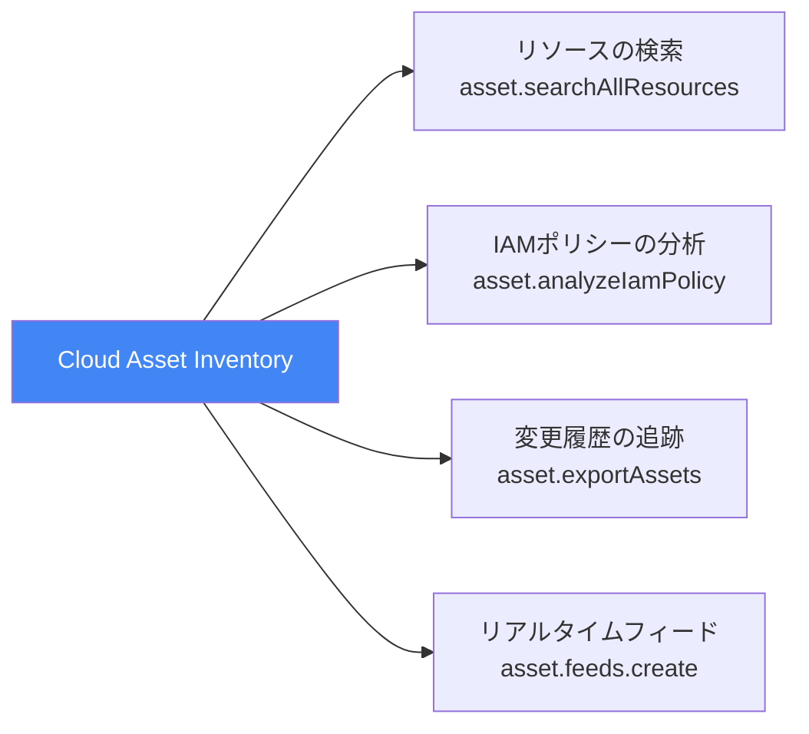

**主な活用シナリオ**:

```bash
# 組織全体の GKE クラスタを検索
gcloud asset search-all-resources \
  --asset-types='container.googleapis.com/Cluster' \
  --scope='organizations/ORG_ID'

# 外部 IP を持つ VM を特定（セキュリティ監査）
gcloud asset search-all-resources \
  --asset-types='compute.googleapis.com/Instance' \
  --scope='organizations/ORG_ID' \
  --query='networkInterfaces.accessConfigs.natIP:*'

# 特定リソースへのアクセス権を持つ全Identityを分析
gcloud asset analyze-iam-policy \
  --organization=ORG_ID \
  --full-resource-name='//storage.googleapis.com/projects/_/buckets/my-sensitive-bucket'

# Cloud Asset Inventory API を有効化
gcloud services enable cloudasset.googleapis.com
```

#### Gemini Cloud Assist の設定と活用

**設定手順**:

```bash
# 1. Gemini Cloud Assist API を有効化
gcloud services enable geminicloudassist.googleapis.com \
  --project=PROJECT_ID

# 2. 必要な IAM ロールを付与
gcloud projects add-iam-policy-binding PROJECT_ID \
  --member="user:alice@example.com" \
  --role="roles/geminicloudassist.user"

# Cloud Asset Viewer も必要
gcloud projects add-iam-policy-binding PROJECT_ID \
  --member="user:alice@example.com" \
  --role="roles/cloudasset.viewer"
```

**活用できる機能**:

| 機能 | 説明 |
|------|------|
| **リソース分析** | 自然言語でクラウドリソースを質問・分析 |
| **アーキテクチャ提案** | ベストプラクティスに基づく構成提案 |
| **IaC 生成** | Terraform テンプレートの自動生成 |
| **根本原因分析（RCA）** | ログ・メトリクス・設定変更を横断的に分析 |
| **コスト最適化提案** | 無駄なリソースの特定と削減提案 |

#### ✅ ベストプラクティス

| # | プラクティス | 根拠 |
|---|------------|------|
| 1 | **Cloud Asset Inventory のリアルタイムフィード**を設定して変更を監視 | リソース設定変更を即時検知できる |
| 2 | Gemini Cloud Assist に `roles/cloudasset.viewer` を付与 | リソース分析機能が正常に動作する |
| 3 | 定期的に `analyze-iam-policy` で過剰な権限を棚卸しする | 最小特権の原則の継続的な維持 |

> **Cloud Asset Inventory**: https://cloud.google.com/asset-inventory/docs/overview  
> **Gemini Cloud Assist**: https://cloud.google.com/products/gemini/cloud-assist  
> **Gemini Cloud Assist 設定**: https://docs.cloud.google.com/cloud-assist/set-up-gemini

---

### 1.1.12 Workforce Identity Federationの設定

#### Workforce Identity Federation とは

外部の IdP（Okta、Azure AD、ADFS 等）のユーザー ID を**直接 Google Cloud にフェデレーション**する仕組み。Google アカウントを持たない社外ユーザーや既存の IdP ユーザーが Google Cloud リソースにアクセスできる。

**Workload Identity Federation（アプリ用）との違い**:

| 項目 | Workforce Identity Federation | Workload Identity Federation |
|------|-------------------------------|------------------------------|
| **対象** | 人間ユーザー（従業員・パートナー） | アプリケーション・CI/CD・外部クラウドリソース |
| **設定レベル** | 組織（Organization）レベル | プロジェクト（Project）レベル |
| **用途** | コンソールアクセス・gcloud CLI | API アクセス（SA キー不要） |

#### 設定フロー

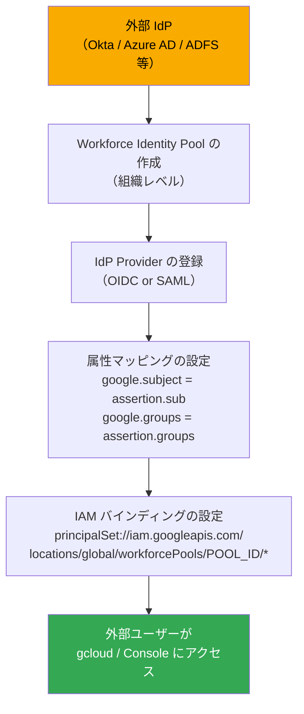

**設定コマンド**:

```bash
# 1. Workforce Identity Pool の作成
gcloud iam workforce-pools create my-workforce-pool \
  --organization=ORG_ID \
  --location=global \
  --display-name="Corporate IdP Pool"

# 2. OIDC プロバイダーの登録（Okta の例）
gcloud iam workforce-pools providers create-oidc okta-provider \
  --workforce-pool=my-workforce-pool \
  --location=global \
  --display-name="Okta OIDC" \
  --issuer-uri="https://myorg.okta.com/oauth2/default" \
  --client-id="MY_CLIENT_ID" \
  --attribute-mapping="google.subject=assertion.sub,google.groups=assertion.groups,attribute.department=assertion.department"

# 3. 外部ユーザーグループに IAM ロールを付与
gcloud projects add-iam-policy-binding PROJECT_ID \
  --member="principalSet://iam.googleapis.com/locations/global/workforcePools/my-workforce-pool/attribute.department/engineering" \
  --role="roles/viewer"
```

#### ✅ ベストプラクティス

| # | プラクティス | 根拠 |
|---|------------|------|
| 1 | 属性マッピングでグループ情報を取得し、IAM はグループ単位で管理 | 個人ごとの設定を排除できる |
| 2 | Pool ID はグローバルに一意な意味のある名前を付ける | 組織をまたいで参照可能なため |
| 3 | SAML より **OIDC を優先**する（標準準拠・JWT 活用） | セキュリティと互換性が高い |
| 4 | `attribute-condition` で信頼する IdP の範囲を限定する | 不正なトークンでのアクセスを防止 |

> **公式ドキュメント**: https://docs.cloud.google.com/iam/docs/workforce-identity-federation

---

## 1.2 請求設定の管理

---

### 1.2.1 請求アカウントの作成

#### 請求の全体構造

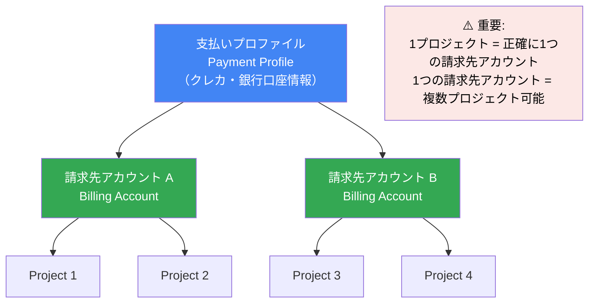

#### 請求先アカウントの種類

| 種類 | 支払い方法 | 対象 |
|------|-----------|------|
| **Self-serve（セルフサービス）** | クレジットカードで自動引き落とし | 個人・スタートアップ |
| **Invoiced（請求書払い）** | 月次請求書による支払い | エンタープライズ（Google による設定が必要） |

#### 請求先アカウントの IAM ロール

| ロール | 権限 | 付与対象例 |
|--------|------|-----------|
| `roles/billing.admin` | 請求アカウントの完全管理 | 財務部門の管理者 |
| `roles/billing.viewer` | 請求情報の閲覧のみ | 財務部門の一般担当者 |
| `roles/billing.projectManager` | プロジェクトを請求アカウントにリンク・アンリンク | プロジェクト管理者 |
| `roles/billing.costsManager` | 予算とアラートの管理 | FinOps 担当者 |

```bash
# 請求先アカウントの一覧確認
gcloud billing accounts list

# 請求先アカウントの IAM ポリシー確認
gcloud billing accounts get-iam-policy BILLING_ACCOUNT_ID

# 請求先アカウントに IAM ロールを付与
gcloud billing accounts add-iam-policy-binding BILLING_ACCOUNT_ID \
  --member="user:finance@example.com" \
  --role="roles/billing.viewer"
```

#### ✅ ベストプラクティス

| # | プラクティス | 根拠 |
|---|------------|------|
| 1 | 部門・事業単位で**請求先アカウントを分離**してコストを独立管理 | 部門別の費用対効果の分析が可能 |
| 2 | `roles/billing.admin` は最小限の担当者のみに付与 | 課金設定の誤変更リスクを軽減 |
| 3 | リソースに**ラベル（Labels）**を付けてコストセンター別分析を可能にする | 請求アカウントをまたいだコスト分析ができる |

> **公式ドキュメント**: https://docs.cloud.google.com/billing/docs/concepts

---

### 1.2.2 プロジェクトと請求アカウントのリンク

#### リンクの仕組み

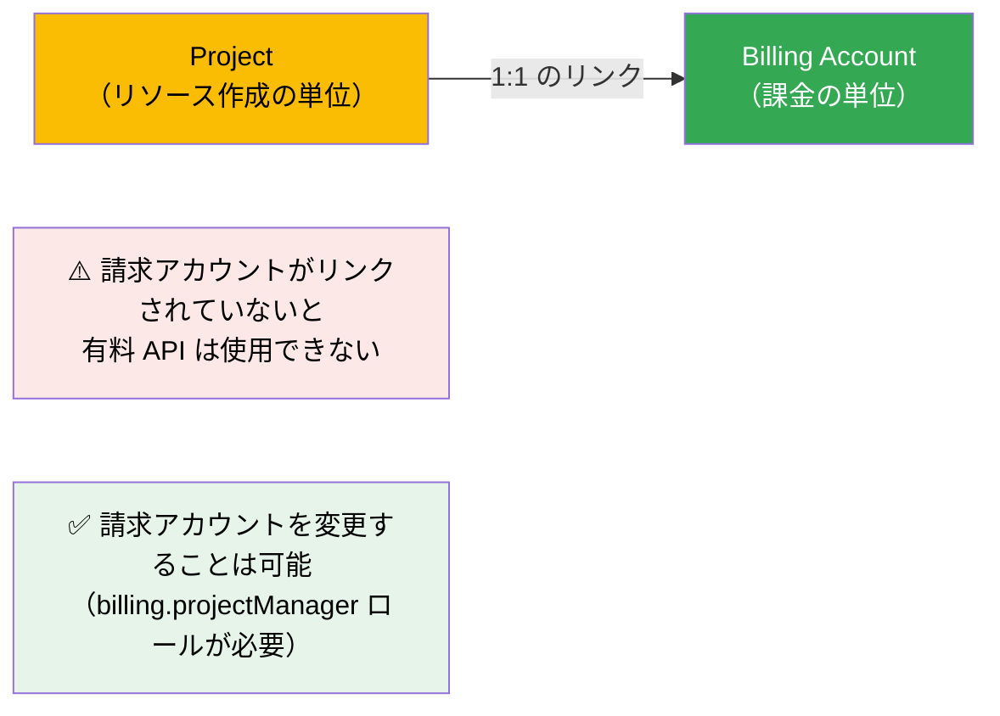

```bash
# プロジェクトを請求先アカウントにリンク
gcloud billing projects link PROJECT_ID \
  --billing-account=BILLING_ACCOUNT_ID

# プロジェクトの請求先アカウントを確認
gcloud billing projects describe PROJECT_ID

# 請求先アカウントとリンクされているプロジェクト一覧
gcloud billing projects list \
  --billing-account=BILLING_ACCOUNT_ID

# 請求先アカウントのリンクを解除（全リソースが停止）
gcloud billing projects unlink PROJECT_ID
```

> **警告**: 請求先アカウントのリンクを解除すると、プロジェクト内のすべてのリソースが停止する。

---

### 1.2.3 予算とアラートの設定

#### 最重要: 予算上限はリソースを止めない

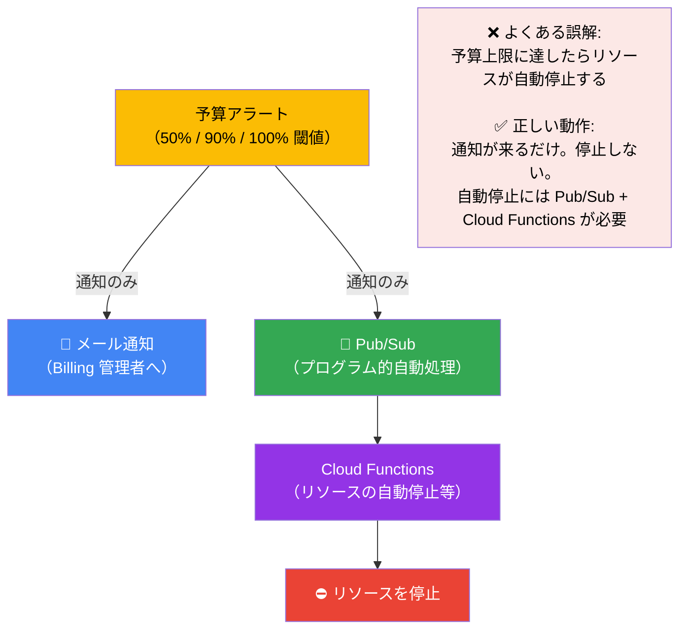

#### 予算の作成方法

```bash
# 予算の作成（gcloud コマンド）
gcloud billing budgets create \
  --billing-account=BILLING_ACCOUNT_ID \
  --display-name="Monthly Prod Budget" \
  --budget-amount=100000JPY \
  --threshold-rule=percent=50 \
  --threshold-rule=percent=90 \
  --threshold-rule=percent=100 \
  --filter-projects=projects/my-prod-project

# 予算一覧の確認
gcloud billing budgets list \
  --billing-account=BILLING_ACCOUNT_ID

# 予算の詳細確認
gcloud billing budgets describe BUDGET_ID \
  --billing-account=BILLING_ACCOUNT_ID
```

#### 自動コスト制御アーキテクチャ（試験頻出）

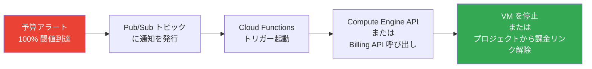

**Cloud Functions によるプロジェクト課金停止の例（Python）**:

```python
import base64
import json
import googleapiclient.discovery

def stop_billing(event, context):
    """予算超過時にプロジェクトの請求を停止する"""
    pubsub_data = base64.b64decode(event['data']).decode('utf-8')
    data = json.loads(pubsub_data)
    
    cost_amount = data.get('costAmount', 0)
    budget_amount = data.get('budgetAmount', float('inf'))
    
    if cost_amount >= budget_amount:
        billing = googleapiclient.discovery.build('cloudbilling', 'v1')
        # 請求先アカウントのリンクを解除
        billing.projects().updateBillingInfo(
            name='projects/MY_PROJECT_ID',
            body={'billingAccountName': ''}
        ).execute()
```

#### 予算のスコープ設定

| スコープ | 説明 |
|---------|------|
| 組織全体 | 組織全体の総コストを監視 |
| 特定フォルダ | フォルダ配下のコストを監視 |
| 特定プロジェクト | プロジェクト単位のコストを監視 |
| 特定サービス | 例: Compute Engine のみのコスト |
| 特定ラベル | 例: `env=production` タグ付きリソースのみ |

#### ✅ ベストプラクティス

| # | プラクティス | 根拠 |
|---|------------|------|
| 1 | **すべてのプロジェクトに予算アラートを設定** | 予期せぬ課金の早期発見 |
| 2 | **50% / 90% / 100% の3段階**でアラートを設定 | 段階的な把握と対応が可能 |
| 3 | 100% 閾値には **Pub/Sub 通知も設定**して自動制御 | 緊急時の自動停止を実現できる |
| 4 | 予算金額は **前月支出の 120%** などで設定 | 異常なコスト増を早期検知できる |
| 5 | **セキュリティリスクによるコスト急増**にも備える | 認証情報漏洩 → 暗号資産マイニング等の対策 |

> **公式ドキュメント**: https://docs.cloud.google.com/billing/docs/how-to/budgets

---

### 1.2.4 請求エクスポートの設定

#### エクスポートの種類

| エクスポート種別 | 内容 | 用途 |
|--------------|------|------|
| **標準使用コストデータ** | 日次の基本的なコスト・使用量データ | 日常のコスト分析 |
| **詳細使用コストデータ（リソースレベル）** | VM・SSD などリソース単位の詳細コスト | 細粒度のコスト分配・FinOps |
| **料金データ** | SKU ごとの公開料金表 | コスト見積もり・予測 |

#### BigQuery へのエクスポート設定

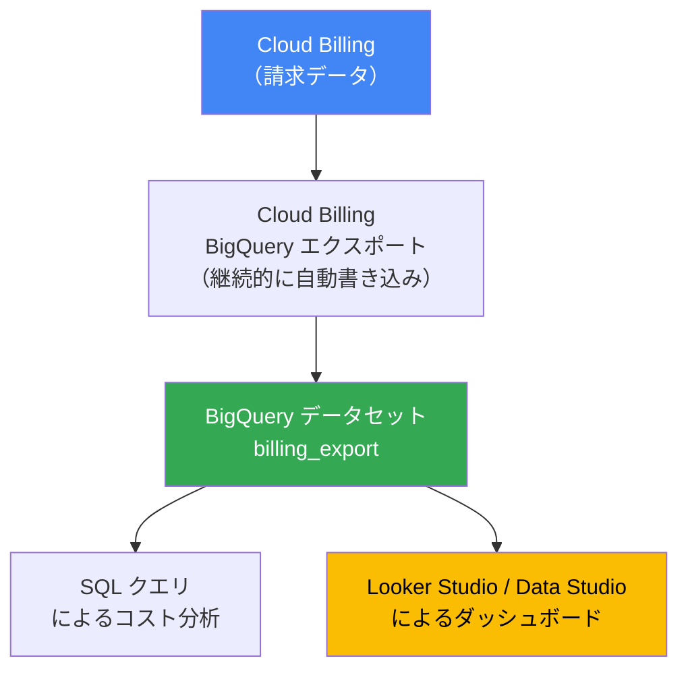

**設定手順（Console）**:

1. Google Cloud Console → **お支払い** → 請求先アカウントを選択
2. **課金データのエクスポート** をクリック
3. **BigQuery エクスポート** タブを選択
4. プロジェクト・データセットを指定して保存

**必要な IAM ロール**:
- `roles/billing.costsManager` または `roles/billing.admin`（請求側）
- `roles/bigquery.user`（BigQuery 側）

#### BigQuery でのコスト分析クエリ例

```sql
-- プロジェクト別の月次コストを集計（過去3ヶ月）
SELECT
  project.id AS project_id,
  FORMAT_DATE('%Y-%m', DATE(usage_start_time)) AS month,
  SUM(cost) AS total_cost,
  currency
FROM
  `my_project.billing_export.gcp_billing_export_v1_XXXXXXXX`
WHERE
  DATE(usage_start_time) >= DATE_SUB(CURRENT_DATE(), INTERVAL 3 MONTH)
GROUP BY
  project_id, month, currency
ORDER BY
  month DESC, total_cost DESC;

-- サービス別コストのトップ10（当月）
SELECT
  service.description AS service_name,
  ROUND(SUM(cost), 2) AS total_cost
FROM
  `my_project.billing_export.gcp_billing_export_v1_XXXXXXXX`
WHERE
  DATE(usage_start_time) >= DATE_TRUNC(CURRENT_DATE(), MONTH)
GROUP BY
  service_name
ORDER BY
  total_cost DESC
LIMIT 10;

-- ラベル（チーム）別のコスト分析
SELECT
  labels.value AS team,
  SUM(cost) AS total_cost
FROM
  `billing_export.gcp_billing_export_v1_XXXXXXXX`,
  UNNEST(labels) AS labels
WHERE
  labels.key = 'team'
  AND DATE(usage_start_time) >= DATE_TRUNC(CURRENT_DATE(), MONTH)
GROUP BY
  team
ORDER BY
  total_cost DESC;
```

#### ✅ ベストプラクティス

| # | プラクティス | 根拠 |
|---|------------|------|
| 1 | BigQuery への Billing エクスポートは**プロジェクト作成直後に有効化** | 過去データは遡って取得できないため |
| 2 | **標準**と**詳細**の両エクスポートを有効化する | リソースレベルの精緻な分析が可能になる |
| 3 | すべてのリソースに**ラベルを付けるポリシー**を組織で策定 | チーム・環境・コストセンター別の分析が可能 |
| 4 | Looker Studio でコストダッシュボードを作成して定期共有 | ステークホルダーへの可視性を提供できる |
| 5 | **コミット使用割引（CUD）** を活用して定常的な Compute Engine の利用コストを削減 | 最大57%のコスト削減が可能 |

> **公式ドキュメント**: https://docs.cloud.google.com/billing/docs/how-to/export-data-bigquery  
> **BigQuery エクスポート設定**: https://docs.cloud.google.com/billing/docs/how-to/export-data-bigquery-setup

---

## 試験頻出パターンと対策

### パターン①: リソース階層の設計問題

**典型的な問題**:
「A 社は開発部・営業部・財務部の3部門を持ち、各部門が dev・prod 環境を持つ。最適な階層は？」

**解答の考え方**:

```mermaid
graph TD
    ORG["Organization: a-company.com"]
    F1["Folder: 開発部"]
    F2["Folder: 営業部"]
    F3["Folder: 財務部"]
    P1["Project: dev-dept-dev"]
    P2["Project: dev-dept-prod"]
    P3["Project: sales-dept-dev"]
    P4["Project: sales-dept-prod"]
    P5["Project: finance-dept-dev"]
    P6["Project: finance-dept-prod"]

    ORG --> F1 & F2 & F3
    F1 --> P1 & P2
    F2 --> P3 & P4
    F3 --> P5 & P6

    style ORG fill:#4285F4,color:#fff
    style F1 fill:#34A853,color:#fff
    style F2 fill:#34A853,color:#fff
    style F3 fill:#34A853,color:#fff
```

### パターン②: 予算・コスト管理の自動化問題

**典型的な問題**:
「開発チームの予算が超過した場合に VM を自動停止したい。どのアーキテクチャが正しいか？」

**正解パターン**:
`予算アラート（Pub/Sub 通知設定）→ Pub/Sub トピック → Cloud Functions → Compute Engine API で VM 停止`

**よくある不正解**:
「予算に上限金額を設定すれば自動停止される」→ **誤り**！予算上限でリソースは止まらない。

### パターン③: IAM の最小権限問題

**典型的な問題**:
「全プロジェクトの Cloud Storage を管理する Jane に必要な最小権限を付与するには？」

**正解**: Jane をグループに追加し、そのグループに `roles/storage.objectAdmin` を**組織レベル**で付与する
**不正解**: Jane に `roles/editor` を付与する（過剰権限）

### パターン④: 組織ポリシーと IAM の使い分け問題

**典型的な問題**:
「本番環境のVMで外部IPを持つものを作成できないよう強制したい。どうするか？」

**正解**: **組織ポリシー** `constraints/compute.disableExternalIpAddresses` を本番環境フォルダに適用
**IAM との違い**:
- IAM: 「誰が VM を作成できるか」を制御
- 組織ポリシー: 「どんな VM を作れるか」を制御（admin も制限される）

---

## Section 1 チェックリスト

### 1.1 クラウドプロジェクトとアカウントの設定

#### リソース階層

- [ ] `Organization → Folder → Project → Resource` の順序を説明できる
- [ ] IAM ポリシーが上位から下位へ**継承**されることを理解している
- [ ] 下位レベルで上位の IAM ポリシーを**取り消せない**ことを知っている
- [ ] Project ID は**グローバルに一意で変更不可**だと知っている
- [ ] 削除したプロジェクトは**30日以内**なら復元できることを知っている
- [ ] Google Workspace または Cloud Identity なしでは Organization は作れないことを理解している

#### 組織ポリシー

- [ ] 組織ポリシーと IAM の違い（**設定の強制** vs **アクセス制御**）を説明できる
- [ ] `constraints/iam.disableServiceAccountKeyCreation` の効果を説明できる
- [ ] `constraints/gcp.resourceLocations` でリソースを特定リージョンに限定できることを知っている
- [ ] Dry-Run モードで本番適用前にポリシーをテストできることを知っている

#### IAM

- [ ] 基本ロール（Editor/Owner）を本番で使うべきでない理由を説明できる
- [ ] 個人ではなく**グループ**にロールを付与する理由を説明できる
- [ ] IAM Conditions で有効期限付きの権限を付与できることを知っている

#### Cloud Identity・ユーザー管理

- [ ] Cloud Identity（Free）と Google Workspace の違いを説明できる
- [ ] GCDS または SCIM で自動プロビジョニングを設定できることを知っている

#### API 管理

- [ ] 新規プロジェクトでは API を個別に有効化する必要があることを知っている
- [ ] `gcloud services enable` で API を有効化できる

#### Cloud Asset Inventory と Gemini Cloud Assist

- [ ] Cloud Asset Inventory で組織全体のリソースを一元検索できることを知っている
- [ ] Gemini Cloud Assist を使うために必要な IAM ロールを知っている

#### Workforce Identity Federation

- [ ] Workforce Identity Federation と Workload Identity Federation の違いを説明できる
- [ ] Pool は**組織レベル**で作成することを知っている

### 1.2 請求設定の管理

- [ ] 1 プロジェクトは**正確に 1 つ**の請求先アカウントにリンクされることを知っている
- [ ] 予算アラートが上限に達してもリソースは**自動停止しない**ことを知っている
- [ ] 自動停止には **Pub/Sub + Cloud Functions** が必要なことを知っている
- [ ] BigQuery への Billing データエクスポートの目的と設定方法を知っている
- [ ] ラベルを使ったコストセンター別分析の方法を知っている
- [ ] DDoS → オートスケール → コスト急増のリスクと対策（Cloud Armor）を知っている

---

## 📚 公式ドキュメント・参考 URL まとめ

| トピック | URL |
|---------|-----|
| ACE 認定ページ | https://cloud.google.com/learn/certification/cloud-engineer?hl=en |
| 試験ガイド（2025年6月30日〜） | https://services.google.com/fh/files/misc/063026_associate_cloud_engineer_exam_guide_english.pdf |
| リソース階層 | https://docs.cloud.google.com/resource-manager/docs/cloud-platform-resource-hierarchy |
| IAM 継承とアクセス制御 | https://docs.cloud.google.com/iam/docs/resource-hierarchy-access-control |
| IAM ベストプラクティス | https://cloud.google.com/blog/products/identity-security/iam-best-practice-guides-available-now |
| 組織ポリシーの概要 | https://docs.cloud.google.com/organization-policy/overview |
| 組織ポリシー制約一覧 | https://cloud.google.com/resource-manager/docs/organization-policy/org-policy-constraints |
| Cloud Identity の概要 | https://cloud.google.com/identity/docs/overview |
| Workforce Identity Federation | https://docs.cloud.google.com/iam/docs/workforce-identity-federation |
| Cloud Asset Inventory | https://cloud.google.com/asset-inventory/docs/overview |
| Gemini Cloud Assist 設定 | https://docs.cloud.google.com/cloud-assist/set-up-gemini |
| Gemini Cloud Assist IAM 要件 | https://docs.cloud.google.com/cloud-assist/iam-requirements |
| Google Cloud Observability | https://cloud.google.com/products/observability |
| Cloud Billing の概要 | https://docs.cloud.google.com/billing/docs/concepts |
| 予算アラートの設定 | https://docs.cloud.google.com/billing/docs/how-to/budgets |
| BigQuery へのエクスポート | https://docs.cloud.google.com/billing/docs/how-to/export-data-bigquery |
| BigQuery エクスポート設定 | https://docs.cloud.google.com/billing/docs/how-to/export-data-bigquery-setup |
| クォータの管理 | https://cloud.google.com/docs/quota |
| VPC ネットワーク概要 | https://docs.cloud.google.com/vpc/docs/overview |
| 製品の地理的可用性 | https://cloud.google.com/about/locations |
