# Google Cloud Associate Cloud Engineer

## Section 3: Ensuring the Successful Operation of a Cloud Solution

## 完全攻略ガイド（中級〜上級者向け）

> **試験配点**: Section 3 は全体の **~30%** を占める最重量セクション  
> **試験ガイド**: 2026年6月30日改訂版（063026）準拠  
> **対象レベル**: GCPの基礎知識があり、実運用経験を深めたいエンジニア

---

## 📋 目次

1. [Section 3 全体像と出題構造](#section-3-全体像と出題構造)
2. [3.1 コンピューティングリソースの管理](#31-コンピューティングリソースの管理)
   - [Compute Engine の運用管理](#compute-engine-の運用管理)
   - [スナップショットとイメージ管理](#スナップショットとイメージ管理)
   - [GKE クラスタの運用管理](#gke-クラスタの運用管理)
   - [Pod オートスケーリング](#pod-オートスケーリング)
   - [Cloud Run の運用管理](#cloud-run-の運用管理)
   - [GPU / TPU アタッチメント](#gpu--tpu-アタッチメント)
   - [Agent Runtime / Workbench / Cloud Workstations](#agent-runtime--workbench--cloud-workstations)
3. [3.2 ストレージとデータソリューションの管理](#32-ストレージとデータソリューションの管理)
   - [Cloud Storage の操作とセキュリティ](#cloud-storage-の操作とセキュリティ)
   - [ライフサイクル管理ポリシー](#ライフサイクル管理ポリシー)
   - [データベースクエリと操作](#データベースクエリと操作)
   - [バックアップとリストア](#バックアップとリストア)
   - [Database Center と CMEK](#database-center-と-cmek)
4. [3.3 ネットワークリソースの管理](#33-ネットワークリソースの管理)
   - [サブネット拡張と IP アドレス管理](#サブネット拡張と-ip-アドレス管理)
   - [カスタム静的ルート](#カスタム静的ルート)
   - [Cloud DNS と Cloud NAT](#cloud-dns-と-cloud-nat)
   - [VPC ファイアウォールと Cloud NGFW](#vpc-ファイアウォールと-cloud-ngfw)
5. [3.4 モニタリングとロギング](#34-モニタリングとロギング)
   - [Cloud Monitoring アラート](#cloud-monitoring-アラート)
   - [カスタムメトリクス](#カスタムメトリクス)
   - [監査ログの設定](#監査ログの設定)
   - [ログのエクスポートとルーティング](#ログのエクスポートとルーティング)
   - [診断ツール群](#診断ツール群)
   - [Ops Agent と Managed Prometheus](#ops-agent-と-managed-prometheus)
   - [AI支援ツール群（Gemini / Active Assist / Cloud Hub）](#ai支援ツール群)
6. [試験攻略チェックリストと頻出ポイント](#試験攻略チェックリストと頻出ポイント)

---

## Section 3 全体像と出題構造

Section 3 は「**デプロイされたソリューションを正常に稼働させ続けること**」が主題です。  
インフラの設計・構築（Section 2）を終えた後の**Day2 Operations**（日常運用・変更管理・障害対応）に特化しています。

### 出題サブセクション別 比重

| サブセクション | テーマ | 出題比重（目安） |
|---|---|---|
| **3.1** | コンピューティングリソースの管理 | ★★★★ |
| **3.2** | ストレージとデータソリューションの管理 | ★★★ |
| **3.3** | ネットワークリソースの管理 | ★★★ |
| **3.4** | モニタリングとロギング | ★★★★ |

### Section 3 全体の運用フロー

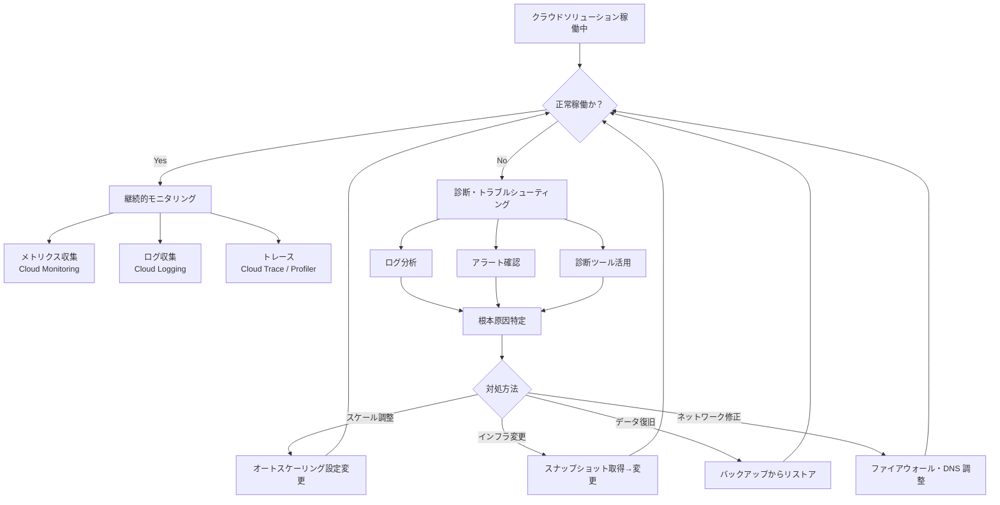

---

## 3.1 コンピューティングリソースの管理

### Compute Engine の運用管理

#### リモート接続の方法

Compute Engine インスタンスへのリモート接続には複数の方法があります。試験では**IAP（Identity-Aware Proxy）経由の接続**が特に重要です。

##### 接続方法の比較

| 接続方法 | 要件 | セキュリティ | 推奨場面 |
|---|---|---|---|
| **gcloud SSH（直接）** | 外部IP 必要 | 中 | 開発・検証環境 |
| **IAP トンネル SSH** | 外部IP 不要、IAP APIが必要 | 高 | 本番環境・外部IPなしVM |
| **OS Login** | OS Login API有効化 | 高 | 組織管理された環境 |
| **Google Cloud Console** | ブラウザのみ | 中 | 簡易操作 |
| **Serial Console** | シリアルポート有効化必要 | 中 | OS起動不能時の緊急対応 |

##### IAP 経由 SSH 接続フロー

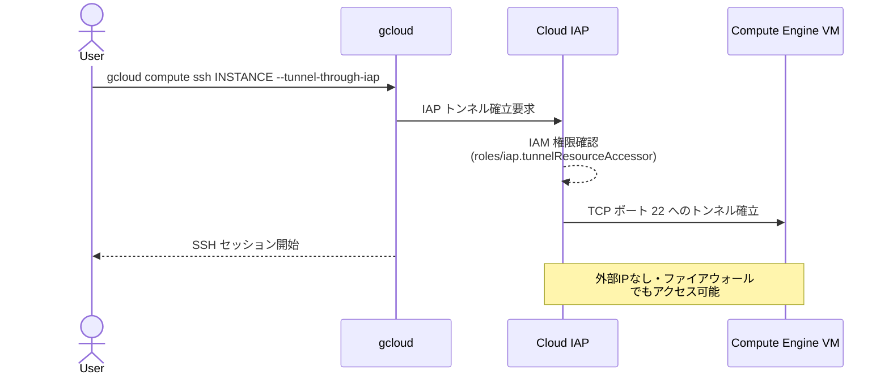

##### 主要な gcloud コマンド

```bash
# 通常の SSH 接続
gcloud compute ssh INSTANCE_NAME --zone=ZONE

# IAP トンネル経由 SSH（外部IPなしVMへのアクセス）
gcloud compute ssh INSTANCE_NAME --zone=ZONE --tunnel-through-iap

# SCP によるファイル転送（IAP経由）
gcloud compute scp --tunnel-through-iap LOCAL_FILE INSTANCE_NAME:~/

# インスタンス一覧の表示
gcloud compute instances list

# インスタンスの詳細表示
gcloud compute instances describe INSTANCE_NAME --zone=ZONE

# インスタンスの起動・停止・削除
gcloud compute instances start INSTANCE_NAME --zone=ZONE
gcloud compute instances stop INSTANCE_NAME --zone=ZONE
gcloud compute instances delete INSTANCE_NAME --zone=ZONE
```

##### OS Login 設定

OS Login は SSH鍵をIAMに紐付けて一元管理する仕組みです。

```bash
# プロジェクト全体でOS Loginを有効化
gcloud compute project-info add-metadata \
    --metadata enable-oslogin=TRUE

# 特定インスタンスでOS Login有効化
gcloud compute instances add-metadata INSTANCE_NAME \
    --metadata enable-oslogin=TRUE

# OS Login用のIAMロール付与
gcloud projects add-iam-policy-binding PROJECT_ID \
    --member="user:USER_EMAIL" \
    --role="roles/compute.osLogin"

# sudo権限が必要な場合
gcloud projects add-iam-policy-binding PROJECT_ID \
    --member="user:USER_EMAIL" \
    --role="roles/compute.osAdminLogin"
```

> ✅ **ベストプラクティス: リモート接続**
> - 本番環境では**外部IPを割り当てず**、IAP トンネル経由で接続する
> - OS Login を有効化して SSH 鍵の個別管理を廃止する
> - `roles/iap.tunnelResourceAccessor` ロールを最小権限で付与する
> - シリアルコンソールは緊急時のみ有効化し、通常時は無効にしておく

📎 参照: https://cloud.google.com/compute/docs/connect/ssh-using-iap  
📎 参照: https://cloud.google.com/compute/docs/oslogin

---

### スナップショットとイメージ管理

スナップショットとイメージは目的が異なります。試験では**使い分けの判断**が問われます。

#### スナップショット vs イメージの違い

| 比較項目 | スナップショット | カスタムイメージ |
|---|---|---|
| **主な用途** | バックアップ・ポイントインタイムリカバリ | VM テンプレート・新VM作成 |
| **保存方式** | 増分バックアップ（初回のみフル） | 完全コピー |
| **スコープ** | プロジェクト（共有可） | グローバル（プロジェクト跨ぎ可） |
| **作成元** | Persistent Disk, Hyperdisk | Persistent Disk / スナップショット / 別VM |
| **復元** | 新しいディスクとして復元 | 新しいVMを作成 |
| **コスト** | 低（増分） | 中（フル） |

#### スナップショット操作

```bash
# スナップショットの作成
gcloud compute disks snapshot DISK_NAME \
    --snapshot-names=SNAPSHOT_NAME \
    --zone=ZONE \
    --storage-location=REGION  # マルチリージョンも指定可能

# スナップショットの一覧表示
gcloud compute snapshots list

# スナップショットから新しいディスクを作成
gcloud compute disks create NEW_DISK \
    --source-snapshot=SNAPSHOT_NAME \
    --zone=ZONE

# スナップショットの削除
gcloud compute snapshots delete SNAPSHOT_NAME

# スナップショットスケジュールの作成（定期自動スナップショット）
gcloud compute resource-policies create snapshot-schedule POLICY_NAME \
    --region=REGION \
    --max-retention-days=7 \
    --on-source-disk-delete=keep-auto-snapshots \
    --daily-schedule \
    --start-time=04:00

# ディスクへのスケジュールポリシー適用
gcloud compute disks add-resource-policies DISK_NAME \
    --resource-policies=POLICY_NAME \
    --zone=ZONE
```

#### カスタムイメージ操作

```bash
# 実行中のVMからイメージを作成（ディスクを停止してから推奨）
gcloud compute images create IMAGE_NAME \
    --source-disk=DISK_NAME \
    --source-disk-zone=ZONE \
    --family=IMAGE_FAMILY  # イメージファミリーで最新版を管理

# スナップショットからイメージを作成
gcloud compute images create IMAGE_NAME \
    --source-snapshot=SNAPSHOT_NAME

# イメージの一覧表示
gcloud compute images list --filter="family=IMAGE_FAMILY"

# 最新イメージの取得（ファミリー使用）
gcloud compute images describe-from-family IMAGE_FAMILY \
    --project=PROJECT_ID

# イメージの削除
gcloud compute images delete IMAGE_NAME

# イメージのプロジェクト間共有（IAM）
gcloud compute images add-iam-policy-binding IMAGE_NAME \
    --member="serviceAccount:OTHER_PROJECT_SA" \
    --role="roles/compute.imageUser"
```

#### スナップショット管理の意思決定フロー

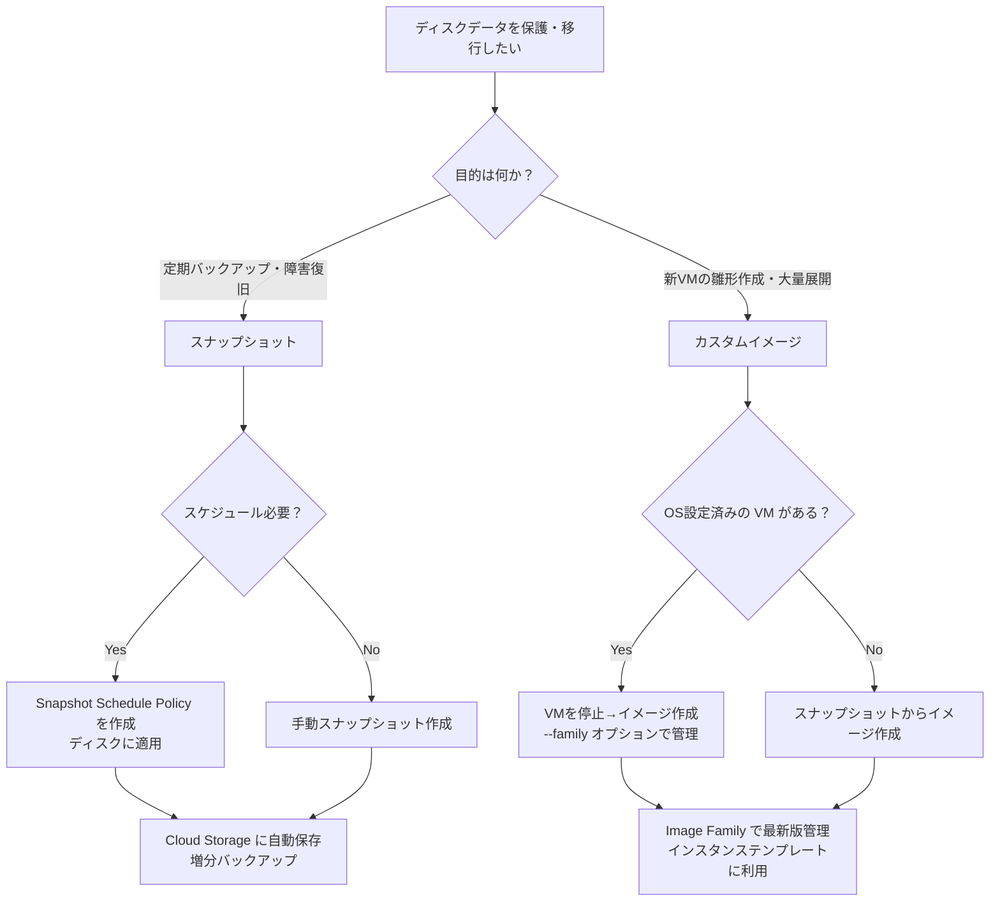

> ✅ **ベストプラクティス: スナップショット・イメージ**
> - **スナップショットスケジュール**を使って本番ディスクの定期バックアップを自動化する
> - イメージは `--family` オプションで管理し、`describe-from-family` で常に最新版を参照する
> - スナップショットの保存場所（`--storage-location`）はデータ主権要件に合わせてリージョンを指定する
> - VM停止中にスナップショット取得することでデータ整合性を確保する（稼働中取得も可能だが整合性リスクあり）

📎 参照: https://cloud.google.com/compute/docs/disks/create-snapshots  
📎 参照: https://cloud.google.com/compute/docs/images/create-custom

---

### GKE クラスタの運用管理

#### クラスタ・ノード・Pod・サービスのインベントリ確認

```bash
# kubectl 設定（認証情報の取得）
gcloud container clusters get-credentials CLUSTER_NAME \
    --zone=ZONE \
    --project=PROJECT_ID

# ノード一覧
kubectl get nodes -o wide

# 全 Namespace の Pod 一覧
kubectl get pods --all-namespaces -o wide

# 特定 Namespace の Pod 詳細
kubectl describe pod POD_NAME -n NAMESPACE

# Service 一覧
kubectl get services --all-namespaces

# Deployment 一覧
kubectl get deployments --all-namespaces

# StatefulSet 一覧
kubectl get statefulsets --all-namespaces

# Pod のログ確認
kubectl logs POD_NAME -n NAMESPACE --tail=100 -f

# Pod へのexec（デバッグ）
kubectl exec -it POD_NAME -n NAMESPACE -- /bin/bash
```

#### GKE から Artifact Registry へのアクセス設定

GKE が Artifact Registry からコンテナイメージを Pull するための認証設定が必要です。

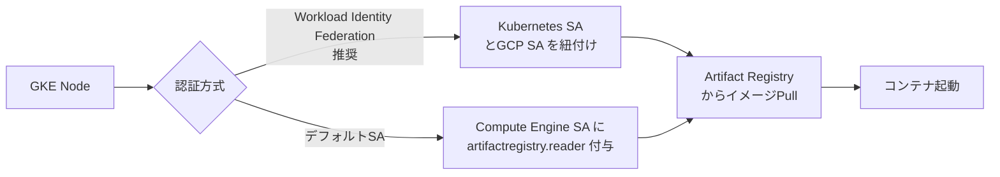

```bash
# ノードプールのService AccountにArtifact Registryアクセス権を付与
gcloud projects add-iam-policy-binding PROJECT_ID \
    --member="serviceAccount:NODE_SA_EMAIL" \
    --role="roles/artifactregistry.reader"

# Workload Identity Federationの設定（推奨）
# Step1: クラスタでWorkload Identity有効化
gcloud container clusters update CLUSTER_NAME \
    --workload-pool=PROJECT_ID.svc.id.goog \
    --zone=ZONE

# Step2: GCP Service Account作成
gcloud iam service-accounts create gke-sa

# Step3: Artifact Registry の権限付与
gcloud projects add-iam-policy-binding PROJECT_ID \
    --member="serviceAccount:gke-sa@PROJECT_ID.iam.gserviceaccount.com" \
    --role="roles/artifactregistry.reader"

# Step4: KSA と GSA の紐付け
gcloud iam service-accounts add-iam-policy-binding gke-sa@PROJECT_ID.iam.gserviceaccount.com \
    --role="roles/iam.workloadIdentityUser" \
    --member="serviceAccount:PROJECT_ID.svc.id.goog[NAMESPACE/KSA_NAME]"

# Step5: Kubernetes SA へアノテーション付与
kubectl annotate serviceaccount KSA_NAME \
    --namespace=NAMESPACE \
    iam.gke.io/gcp-service-account=gke-sa@PROJECT_ID.iam.gserviceaccount.com
```

#### ノードプールの管理

```bash
# ノードプールの一覧
gcloud container node-pools list --cluster=CLUSTER_NAME --zone=ZONE

# ノードプールの追加
gcloud container node-pools create POOL_NAME \
    --cluster=CLUSTER_NAME \
    --zone=ZONE \
    --num-nodes=3 \
    --machine-type=e2-standard-4 \
    --disk-size=100GB \
    --enable-autoscaling \
    --min-nodes=1 \
    --max-nodes=10

# ノードプールのオートスケーリング有効化
gcloud container node-pools update POOL_NAME \
    --cluster=CLUSTER_NAME \
    --zone=ZONE \
    --enable-autoscaling \
    --min-nodes=1 \
    --max-nodes=10

# ノードプールのサイズ変更（手動スケール）
gcloud container clusters resize CLUSTER_NAME \
    --node-pool=POOL_NAME \
    --num-nodes=5 \
    --zone=ZONE

# ノードプールの削除
gcloud container node-pools delete POOL_NAME \
    --cluster=CLUSTER_NAME \
    --zone=ZONE
```

#### Kubernetes リソース管理（Pod / Service / StatefulSet）

##### Pod の操作

```bash
# Pod の作成（マニフェストから）
kubectl apply -f pod.yaml

# Pod の削除
kubectl delete pod POD_NAME -n NAMESPACE

# Pod の強制削除（graceful shutdown をスキップ）
kubectl delete pod POD_NAME -n NAMESPACE --grace-period=0 --force

# Deployment のローリングアップデート
kubectl set image deployment/MY_DEPLOYMENT \
    container-name=NEW_IMAGE:TAG \
    -n NAMESPACE

# ローリングアップデートの状況確認
kubectl rollout status deployment/MY_DEPLOYMENT -n NAMESPACE

# ロールバック
kubectl rollout undo deployment/MY_DEPLOYMENT -n NAMESPACE
```

##### StatefulSet の特徴と操作

StatefulSet は Pod に**固定の識別子・安定したネットワーク・永続ストレージ**を提供します。データベースや分散ストレージに使用します。

| 特性 | Deployment | StatefulSet |
|---|---|---|
| **Pod 名** | ランダムサフィックス | 順番付き（pod-0, pod-1, ...） |
| **起動順序** | 同時起動 | 順番に起動（0→1→2） |
| **ストレージ** | 共有（可） | 各Podに固有のPV |
| **DNS** | Service経由 | 各Podに固有のDNS |
| **ユースケース** | ステートレスアプリ | DB、Kafka、Zookeeper |

```yaml
# StatefulSet マニフェスト例
apiVersion: apps/v1
kind: StatefulSet
metadata:
  name: mysql
spec:
  serviceName: "mysql"
  replicas: 3
  selector:
    matchLabels:
      app: mysql
  template:
    metadata:
      labels:
        app: mysql
    spec:
      containers:
      - name: mysql
        image: mysql:8.0
        volumeMounts:
        - name: data
          mountPath: /var/lib/mysql
  volumeClaimTemplates:  # 各Podに固有のPVCを自動作成
  - metadata:
      name: data
    spec:
      accessModes: ["ReadWriteOnce"]
      resources:
        requests:
          storage: 10Gi
```

---

### Pod オートスケーリング

#### HPA vs VPA の違い

| 比較項目 | HPA（Horizontal） | VPA（Vertical） |
|---|---|---|
| **スケール方向** | Pod数を増減 | Pod の CPU/Memory リソースを増減 |
| **対象** | Deployment, ReplicaSet, StatefulSet | 全 Pod |
| **ユースケース** | ステートレスアプリのトラフィック対応 | データベース・バッチ処理の最適化 |
| **制限** | ステートレスなアプリに向く | Pod の再起動が発生する |
| **GKE Autopilot** | 自動管理 | Pod Resource Request を管理 |

#### HPA（Horizontal Pod Autoscaler）の設定

```bash
# CPU使用率に基づくHPAの作成（簡易コマンド）
kubectl autoscale deployment MY_DEPLOYMENT \
    --cpu-percent=70 \
    --min=2 \
    --max=10

# HPA の確認
kubectl get hpa
kubectl describe hpa MY_DEPLOYMENT

# HPA マニフェスト（カスタムメトリクス含む）
```

```yaml
# HPA マニフェスト例（CPU + メモリ）
apiVersion: autoscaling/v2
kind: HorizontalPodAutoscaler
metadata:
  name: my-app-hpa
spec:
  scaleTargetRef:
    apiVersion: apps/v1
    kind: Deployment
    name: my-app
  minReplicas: 2
  maxReplicas: 20
  metrics:
  - type: Resource
    resource:
      name: cpu
      target:
        type: Utilization
        averageUtilization: 70
  - type: Resource
    resource:
      name: memory
      target:
        type: Utilization
        averageUtilization: 80
```

#### VPA（Vertical Pod Autoscaler）の設定

```yaml
# VPA マニフェスト例
apiVersion: autoscaling.k8s.io/v1
kind: VerticalPodAutoscaler
metadata:
  name: my-app-vpa
spec:
  targetRef:
    apiVersion: "apps/v1"
    kind: Deployment
    name: my-app
  updatePolicy:
    updateMode: "Auto"  # Auto / Initial / Off
  resourcePolicy:
    containerPolicies:
    - containerName: "*"
      minAllowed:
        cpu: 100m
        memory: 50Mi
      maxAllowed:
        cpu: 2
        memory: 2Gi
```

#### GKE Autopilot の Pod Resource Request 管理

GKE Autopilot では Pod に正確な Resource Request を設定することがコスト最適化の鍵です。

```yaml
# Autopilot 向け Resource Request の正しい設定
apiVersion: apps/v1
kind: Deployment
spec:
  template:
    spec:
      containers:
      - name: app
        resources:
          requests:
            cpu: "500m"      # 必ず指定する
            memory: "512Mi"  # 必ず指定する
          limits:
            cpu: "1000m"
            memory: "1Gi"
```

> ✅ **ベストプラクティス: オートスケーリング**
> - HPA と Cluster Autoscaler を組み合わせて Pod 数とノード数を両方自動調整する
> - `minReplicas` は 2 以上に設定して単一障害点を排除する
> - VPA の `updateMode: Auto` は Pod 再起動を伴うため、本番環境では `Initial` または `Off` 推奨
> - Autopilot では全コンテナに必ず `resources.requests` を設定する（設定しないと過剰課金になる）

📎 参照: https://cloud.google.com/kubernetes-engine/docs/concepts/horizontalpodautoscaler  
📎 参照: https://cloud.google.com/kubernetes-engine/docs/concepts/verticalpodautoscaler

---

### Cloud Run の運用管理

#### 新バージョンのデプロイとトラフィック分割

Cloud Run はデプロイのたびに**新しいリビジョン**が作成されます。トラフィックをリビジョン間で分割することで、カナリアデプロイやA/Bテストが可能です。

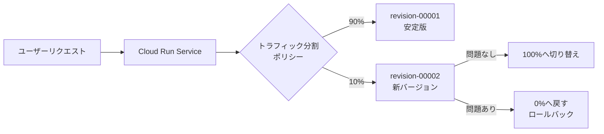

```bash
# 新バージョンのデプロイ（トラフィックは0%で開始）
gcloud run deploy SERVICE_NAME \
    --image=IMAGE_URL \
    --region=REGION \
    --no-traffic  # デプロイするが traffic は向けない

# トラフィック分割の設定（カナリアデプロイ）
gcloud run services update-traffic SERVICE_NAME \
    --to-revisions=revision-00002=10,revision-00001=90 \
    --region=REGION

# 最新リビジョンに100%切り替え
gcloud run services update-traffic SERVICE_NAME \
    --to-latest \
    --region=REGION

# 特定リビジョンに100%切り替え（ロールバック）
gcloud run services update-traffic SERVICE_NAME \
    --to-revisions=revision-00001=100 \
    --region=REGION

# リビジョン一覧の確認
gcloud run revisions list --service=SERVICE_NAME --region=REGION

# リビジョンの詳細確認
gcloud run revisions describe REVISION_NAME --region=REGION
```

#### Cloud Run のオートスケーリング設定

```bash
# オートスケーリングのパラメータ設定
gcloud run services update SERVICE_NAME \
    --region=REGION \
    --min-instances=1 \   # 最小インスタンス数（コールドスタート防止）
    --max-instances=100 \ # 最大インスタンス数
    --concurrency=80      # 1インスタンスあたりの同時リクエスト数

# CPU・メモリの設定
gcloud run services update SERVICE_NAME \
    --region=REGION \
    --cpu=2 \
    --memory=1Gi

# 実行タイムアウトの設定
gcloud run services update SERVICE_NAME \
    --region=REGION \
    --timeout=3600  # 秒単位（最大3600秒）
```

#### Cloud Run オートスケーリング パラメータの理解

| パラメータ | 説明 | 推奨設定 |
|---|---|---|
| `--min-instances` | アイドル状態でも維持するインスタンス数 | レイテンシ重視: 1以上、コスト重視: 0 |
| `--max-instances` | スケールアップの上限 | 上流のAPIレート制限・DBコネクション数を考慮して設定 |
| `--concurrency` | 1インスタンスあたりの同時リクエスト数 | CPUバウンド: 1、I/Oバウンド: 80〜1000 |
| `--cpu-throttling` | アイドル時にCPUをスロットル | デフォルトTrue（コスト削減） |

> ✅ **ベストプラクティス: Cloud Run**
> - 本番リリース前に `--no-traffic` でデプロイし、段階的にトラフィックを切り替える
> - レイテンシが重要なサービスは `--min-instances=1` 以上に設定してコールドスタートを防ぐ
> - `--max-instances` は必ずバックエンドの制約（DBコネクション数、外部API制限）に合わせて設定する
> - Cloud Run Functionsも同じトラフィック分割コマンドで管理可能

📎 参照: https://cloud.google.com/run/docs/deploying  
📎 参照: https://cloud.google.com/run/docs/configuring/autoscaling  
📎 参照: https://cloud.google.com/run/docs/rollouts-rollbacks-traffic-migration

---

### GPU / TPU アタッチメント

#### GPU アタッチメント手順

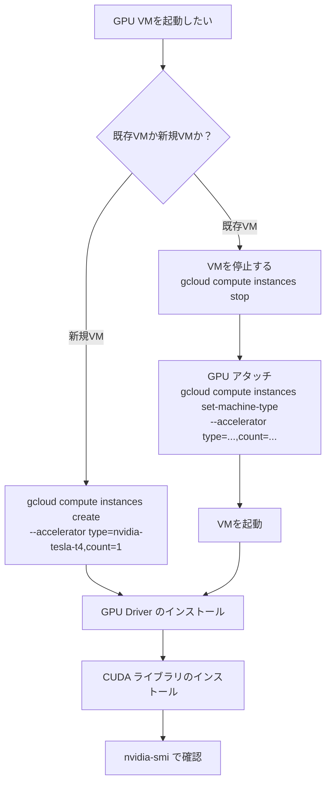

```bash
# GPU付きVMの作成
gcloud compute instances create GPU_INSTANCE \
    --zone=us-central1-a \
    --machine-type=n1-standard-4 \
    --accelerator="type=nvidia-tesla-t4,count=1" \
    --maintenance-policy=TERMINATE \  # GPU使用時は必須
    --image-family=debian-11 \
    --image-project=debian-cloud \
    --boot-disk-size=50GB

# GPU Driver の自動インストール（起動スクリプト）
gcloud compute instances create GPU_INSTANCE \
    --metadata="install-nvidia-driver=True"

# VM内でのGPU確認
# nvidia-smi

# TPU付きVMの作成（Cloud TPU）
gcloud compute tpus tpu-vm create TPU_NAME \
    --zone=ZONE \
    --accelerator-type=v4-8 \
    --version=tpu-vm-tf-2.12.0
```

> ✅ **ベストプラクティス: GPU/TPU**
> - GPU VMは `--maintenance-policy=TERMINATE` を必ず設定する（ライブマイグレーション非対応）
> - ドライバインストールは起動スクリプト（`install-nvidia-driver=True` メタデータ）で自動化する
> - AI/ML学習ジョブには `--provisioning-model=SPOT` を使いコストを最大90%削減する
> - TPU は学習規模に応じてv4/v5のタイプを選択する

📎 参照: https://cloud.google.com/compute/docs/gpus

---

### Agent Runtime / Workbench / Cloud Workstations

#### Cloud Workstations の管理

Cloud Workstations はクラウドホストの開発環境です。

```bash
# Workstation クラスタの作成
gcloud workstations clusters create CLUSTER_NAME \
    --region=REGION \
    --network=VPC_NAME \
    --subnetwork=SUBNET_NAME

# Workstation 設定の作成
gcloud workstations configs create CONFIG_NAME \
    --cluster=CLUSTER_NAME \
    --region=REGION \
    --machine-type=e2-standard-4 \
    --container-predefined-image=codeoss

# Workstation インスタンスの作成
gcloud workstations create WORKSTATION_NAME \
    --cluster=CLUSTER_NAME \
    --config=CONFIG_NAME \
    --region=REGION

# Workstation の起動・停止
gcloud workstations start WORKSTATION_NAME --cluster=CLUSTER_NAME --config=CONFIG_NAME --region=REGION
gcloud workstations stop WORKSTATION_NAME --cluster=CLUSTER_NAME --config=CONFIG_NAME --region=REGION
```

> ✅ **ベストプラクティス: 開発者環境**
> - Workstations は未使用時に自動停止（`--idle-timeout`）を設定してコストを削減する
> - Workstations ネットワークはプライベートサブネットに配置し、IAP 経由でアクセスする
> - BigQuery Notebooks と Vertex AI Workbench は JupyterLab ベースで共通の操作感

📎 参照: https://cloud.google.com/workstations/docs

---

## 3.2 ストレージとデータソリューションの管理

### Cloud Storage の操作とセキュリティ

#### オブジェクト操作の基本

```bash
# バケットの作成
gcloud storage buckets create gs://BUCKET_NAME \
    --location=REGION \
    --default-storage-class=STANDARD \
    --uniform-bucket-level-access  # 推奨

# オブジェクトのアップロード
gcloud storage cp LOCAL_FILE gs://BUCKET_NAME/
gcloud storage cp -r LOCAL_DIR gs://BUCKET_NAME/  # ディレクトリ

# オブジェクトの一覧表示
gcloud storage ls gs://BUCKET_NAME/
gcloud storage ls -l gs://BUCKET_NAME/  # サイズ・更新日時含む

# オブジェクトのダウンロード
gcloud storage cp gs://BUCKET_NAME/OBJECT_NAME LOCAL_FILE

# オブジェクトの削除
gcloud storage rm gs://BUCKET_NAME/OBJECT_NAME
gcloud storage rm -r gs://BUCKET_NAME/PREFIX/  # プレフィックス以下を削除

# オブジェクトの移動（コピー+削除）
gcloud storage mv gs://SOURCE_BUCKET/OBJECT gs://DEST_BUCKET/OBJECT

# バケット間の同期
gcloud storage rsync -r gs://SOURCE_BUCKET gs://DEST_BUCKET
```

#### Cloud Storage のセキュリティ設定

##### IAM vs ACL の違いと推奨

| 方式 | 説明 | 推奨度 |
|---|---|---|
| **Uniform Bucket-Level Access（IAM）** | バケット全体にIAMポリシーを適用 | ✅ 推奨 |
| **Fine-grained（ACL）** | オブジェクト個別にACLを設定可能 | ❌ レガシー・非推奨 |

```bash
# Uniform Bucket-Level Access（UBLA）の有効化（推奨）
gcloud storage buckets update gs://BUCKET_NAME \
    --uniform-bucket-level-access

# バケットへのIAM権限付与
gcloud storage buckets add-iam-policy-binding gs://BUCKET_NAME \
    --member="user:USER_EMAIL" \
    --role="roles/storage.objectViewer"

# 特定プレフィックスのみアクセス許可（IAM Conditions使用）
gcloud storage buckets add-iam-policy-binding gs://BUCKET_NAME \
    --member="serviceAccount:SA_EMAIL" \
    --role="roles/storage.objectAdmin" \
    --condition="expression=resource.name.startsWith('projects/_/buckets/BUCKET_NAME/objects/PREFIX/'),title=prefix-access"

# バケットの公開アクセス防止（推奨）
gcloud storage buckets update gs://BUCKET_NAME \
    --no-public-access-prevention
# または公開を完全にブロック
gcloud storage buckets update gs://BUCKET_NAME \
    --public-access-prevention
```

#### Cloud Storage のデータ保護機能

| 機能 | 説明 | 用途 |
|---|---|---|
| **バージョニング** | オブジェクトの過去バージョンを保持 | 誤削除・誤上書きからの復旧 |
| **オブジェクトロック（WORM）** | 一定期間の削除・上書きを防止 | 規制対応・コンプライアンス |
| **保持ポリシー** | バケット全体の最小保持期間を設定 | コンプライアンス・監査 |
| **ソフトデリート** | 削除されたオブジェクトを一定期間復元可能 | 誤削除からの復旧（7日〜90日） |

```bash
# バージョニングの有効化
gcloud storage buckets update gs://BUCKET_NAME --versioning

# 保持ポリシーの設定（30日間削除・変更禁止）
gcloud storage buckets update gs://BUCKET_NAME \
    --retention-period=30d

# ソフトデリートの設定（30日間復元可能）
gcloud storage buckets update gs://BUCKET_NAME \
    --soft-delete-duration=30d

# 削除済みオブジェクトのリストア
gcloud storage restore gs://BUCKET_NAME/OBJECT_NAME#GENERATION_ID
```

> ✅ **ベストプラクティス: Cloud Storage**
> - すべてのバケットで **Uniform Bucket-Level Access** を有効化する
> - **Public Access Prevention** を組織ポリシーで強制する（誤公開防止）
> - 機密データのバケットには**保持ポリシー**と**オブジェクトロック**を設定する
> - Cross-Region Replication は DR（災害復旧）が必要なデータにのみ適用してコストを最適化する
> - バケット名はグローバルでユニークなため、`PROJECT_ID-bucket-name` のような命名規則を使う

📎 参照: https://cloud.google.com/storage/docs/access-control  
📎 参照: https://cloud.google.com/storage/docs/uniform-bucket-level-access

---

### ライフサイクル管理ポリシー

オブジェクトのストレージクラスを自動変更したり、一定期間後に自動削除する設定です。

#### ストレージクラスと保存コストの比較

| ストレージクラス | アクセス頻度目安 | 最小保存期間 | GB/月 コスト目安 |
|---|---|---|---|
| **Standard** | 頻繁（毎日） | なし | $0.020 |
| **Nearline** | 月1回 | 30日 | $0.010 |
| **Coldline** | 四半期1回 | 90日 | $0.004 |
| **Archive** | 年1回以下 | 365日 | $0.0012 |

#### ライフサイクルポリシーの設定

```json
// lifecycle.json
{
  "lifecycle": {
    "rule": [
      {
        "action": {
          "type": "SetStorageClass",
          "storageClass": "NEARLINE"
        },
        "condition": {
          "age": 30,
          "matchesStorageClass": ["STANDARD"]
        }
      },
      {
        "action": {
          "type": "SetStorageClass",
          "storageClass": "COLDLINE"
        },
        "condition": {
          "age": 90
        }
      },
      {
        "action": {
          "type": "Delete"
        },
        "condition": {
          "age": 365
        }
      },
      {
        "action": {
          "type": "Delete"
        },
        "condition": {
          "numNewerVersions": 3,
          "isLive": false
        }
      }
    ]
  }
}
```

```bash
# ライフサイクルポリシーの適用
gcloud storage buckets update gs://BUCKET_NAME \
    --lifecycle-file=lifecycle.json

# ライフサイクルポリシーの確認
gcloud storage buckets describe gs://BUCKET_NAME \
    --format="json(lifecycle)"
```

> ✅ **ベストプラクティス: ライフサイクル管理**
> - ログ・バックアップデータには**段階的なストレージクラス遷移**を設定する（Standard→Nearline→Coldline→Archive）
> - バージョニング有効時は `numNewerVersions` 条件で古いバージョンを自動削除する（ストレージコスト制御）
> - `age` 条件はオブジェクト作成日からの日数であることに注意（最終アクセス日ではない）

📎 参照: https://cloud.google.com/storage/docs/lifecycle

---

### データベースクエリと操作

#### Cloud SQL の操作

```bash
# Cloud SQL インスタンス一覧
gcloud sql instances list

# Cloud SQL への接続（Cloud SQL Auth Proxy 経由）
# まず Cloud SQL Auth Proxy を起動
./cloud-sql-proxy PROJECT_ID:REGION:INSTANCE_NAME --port=5432 &

# PostgreSQL クライアントで接続
psql "host=127.0.0.1 port=5432 dbname=DATABASE user=USER"

# または gcloud SQL コマンド（Cloud Shell）
gcloud sql connect INSTANCE_NAME --user=USER --database=DATABASE

# データベース一覧
gcloud sql databases list --instance=INSTANCE_NAME

# ユーザー一覧
gcloud sql users list --instance=INSTANCE_NAME
```

#### BigQuery のクエリとコスト管理

```bash
# BigQuery へのクエリ実行（CLIから）
bq query --use_legacy_sql=false \
    'SELECT name, COUNT(*) as cnt FROM `PROJECT.DATASET.TABLE` GROUP BY name LIMIT 10'

# ドライランでコスト試算（データスキャン量の確認）
bq query --use_legacy_sql=false --dry_run \
    'SELECT * FROM `PROJECT.DATASET.TABLE`'

# テーブル情報の確認
bq show PROJECT:DATASET.TABLE

# データセット一覧
bq ls PROJECT:

# BigQuery でのテーブル作成（Cloud Storage からロード）
bq load --source_format=CSV \
    DATASET.TABLE \
    gs://BUCKET_NAME/data.csv \
    schema.json
```

#### BigQuery クエリコスト試算のフロー

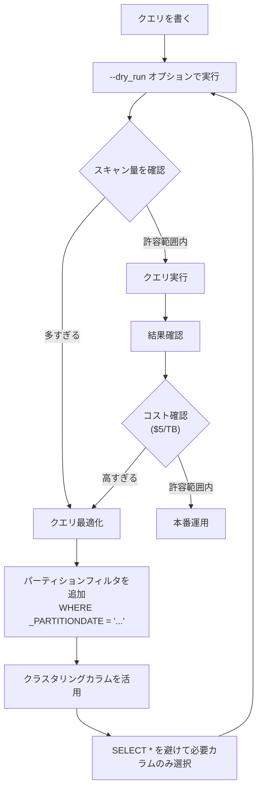

```sql
-- コスト最適化: パーティションフィルタの使用
SELECT
  customer_id,
  SUM(amount) as total
FROM `project.dataset.orders`
WHERE DATE(_PARTITIONTIME) = '2025-01-01'  -- パーティションフィルタ（必須設定可）
  AND status = 'completed'
GROUP BY customer_id;

-- スロットの使用状況確認（INFORMATION_SCHEMAを使用）
SELECT
  job_id,
  total_slot_ms,
  total_bytes_processed
FROM `region-us`.INFORMATION_SCHEMA.JOBS_BY_PROJECT
WHERE creation_time > TIMESTAMP_SUB(CURRENT_TIMESTAMP(), INTERVAL 1 DAY)
ORDER BY total_bytes_processed DESC
LIMIT 10;
```

#### Spanner / Bigtable / Firestore / AlloyDB の操作

```bash
# Cloud Spanner データベース接続・クエリ
gcloud spanner databases execute-sql DATABASE_NAME \
    --instance=INSTANCE_NAME \
    --sql="SELECT * FROM Users WHERE UserId = 1"

# Bigtable データの確認
cbt -instance=INSTANCE_NAME ls  # テーブル一覧
cbt -instance=INSTANCE_NAME read TABLE_NAME  # データ読み取り

# Firestore コレクション一覧（gcloud）
gcloud firestore databases list

# AlloyDB 接続（Auth Proxy経由）
./alloydb-auth-proxy \
    "projects/PROJECT_ID/locations/REGION/clusters/CLUSTER/instances/INSTANCE" &
psql "host=127.0.0.1 port=5432 dbname=DB user=USER"
```

> ✅ **ベストプラクティス: データベースクエリ**
> - BigQuery では `--dry_run` で**事前にスキャン量とコストを確認**してから本番実行する
> - Cloud SQL へは**Cloud SQL Auth Proxy**または**Cloud SQL Connector**経由で接続し、直接インターネット接続を避ける
> - BigQuery の高コストクエリには**パーティション化**と**クラスタリング**を適用する
> - Spanner のクエリプランは`EXPLAIN`で確認してインデックス効率を最適化する

📎 参照: https://cloud.google.com/bigquery/docs/best-practices-performance-compute  
📎 参照: https://cloud.google.com/sql/docs/mysql/connect-auth-proxy

---

### バックアップとリストア

#### データベース別バックアップ・リストア方法

| サービス | バックアップ種別 | コマンド | RTO/RPO |
|---|---|---|---|
| **Cloud SQL** | 自動・オンデマンド・PITR | `gcloud sql backups create` | PITR: 秒単位 |
| **AlloyDB** | 自動・オンデマンド・PITR | `gcloud alloydb backups create` | PITR: 秒単位 |
| **Spanner** | フルバックアップ・PITR (7日間) | `gcloud spanner backups create` | PITR: 秒単位 |
| **Firestore** | Managed Export (Cloud Storage) | `gcloud firestore export` | エクスポート時点 |
| **Bigtable** | Export to Cloud Storage / バックアップ | `cbt createbackup` / Dataflow | バックアップ時点 |

```bash
# Cloud SQL バックアップの作成
gcloud sql backups create \
    --instance=INSTANCE_NAME \
    --description="Manual backup before migration"

# バックアップ一覧の確認
gcloud sql backups list --instance=INSTANCE_NAME

# Cloud SQL のリストア（同一インスタンスへの復元）
gcloud sql instances restore-backup INSTANCE_NAME \
    --backup-id=BACKUP_ID

# 別インスタンスへのリストア
gcloud sql instances restore-backup TARGET_INSTANCE \
    --backup-id=BACKUP_ID \
    --restore-instance=SOURCE_INSTANCE

# Cloud SQL の PITR（特定時点への復元）
gcloud sql instances restore-backup TARGET_INSTANCE \
    --restore-instance=SOURCE_INSTANCE \
    --backup-time="2025-01-15T10:00:00Z"  # UTC形式

# AlloyDB バックアップの作成
gcloud alloydb backups create BACKUP_ID \
    --cluster=CLUSTER_NAME \
    --region=REGION

# Spanner バックアップの作成
gcloud spanner backups create BACKUP_NAME \
    --instance=INSTANCE_NAME \
    --database=DATABASE_NAME \
    --expiration-date="2025-06-30T00:00:00Z"

# Firestore のエクスポート
gcloud firestore export gs://BACKUP_BUCKET/firestore-backup \
    --collection-ids=COLLECTION1,COLLECTION2

# Firestore のインポート
gcloud firestore import gs://BACKUP_BUCKET/firestore-backup

# Bigtable バックアップの作成（gcloud）
gcloud bigtable backups create BACKUP_NAME \
    --instance=INSTANCE_NAME \
    --cluster=CLUSTER_NAME \
    --table=TABLE_NAME \
    --expiration-date="2025-06-30"

# Bigtable バックアップからのリストア
gcloud bigtable backups restore \
    --source=BACKUP_NAME \
    --source-instance=SOURCE_INSTANCE \
    --source-cluster=SOURCE_CLUSTER \
    --destination=NEW_TABLE_NAME \
    --destination-instance=INSTANCE_NAME
```

---

### Database Center と CMEK

#### Database Center

Database Center は Google Cloud 上の全データベース（Cloud SQL、Spanner、AlloyDB、Bigtable など）を一元的に管理・監視するダッシュボードです。

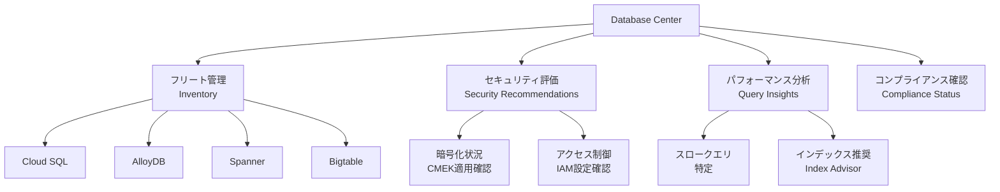

```bash
# Database Center は Cloud Console から確認
# URL: https://console.cloud.google.com/databases/database-center
```

#### CMEK（Customer-Managed Encryption Keys）の設定

デフォルトでは Google 管理のキーで暗号化されますが、CMEK を使うと**顧客がキーを完全に管理**できます。

```bash
# Cloud KMS キーリングの作成
gcloud kms keyrings create KEY_RING_NAME \
    --location=REGION

# KMS 暗号化キーの作成
gcloud kms keys create KEY_NAME \
    --keyring=KEY_RING_NAME \
    --location=REGION \
    --purpose=encryption

# Cloud SQL で CMEK を使用してインスタンスを作成
gcloud sql instances create INSTANCE_NAME \
    --database-version=POSTGRES_15 \
    --tier=db-n1-standard-4 \
    --region=REGION \
    --disk-encryption-key=projects/PROJECT_ID/locations/REGION/keyRings/KEY_RING/cryptoKeys/KEY_NAME

# Cloud Storage バケットで CMEK を設定
gcloud storage buckets create gs://BUCKET_NAME \
    --location=REGION \
    --default-encryption-key=projects/PROJECT_ID/locations/REGION/keyRings/KEY_RING/cryptoKeys/KEY_NAME

# BigQuery で CMEK を使用してデータセットを作成
bq mk --dataset \
    --default_kms_key=projects/PROJECT_ID/locations/REGION/keyRings/KEY_RING/cryptoKeys/KEY_NAME \
    PROJECT_ID:DATASET_NAME
```

> ✅ **ベストプラクティス: バックアップと CMEK**
> - Cloud SQL は PITR（ポイントインタイムリカバリ）を有効化して最大7日間の任意時点に復元できるようにする
> - Firestore エクスポートは**定期 Cloud Scheduler**で自動化する
> - CMEK を使う場合、KMS キーへのアクセスを失うとデータも失うため、**キーのバックアップと復旧手順**を事前に整備する
> - バックアップは**本番とは別のリージョン**に保存してリージョン障害に備える

📎 参照: https://cloud.google.com/sql/docs/mysql/backup-recovery/pitr  
📎 参照: https://cloud.google.com/kms/docs/cmek  
📎 参照: https://cloud.google.com/database-center

---

## 3.3 ネットワークリソースの管理

### サブネット拡張と IP アドレス管理

#### サブネットの IPv4 アドレス範囲の拡張

VPC サブネットは**拡張（広げる）のみ可能**です。縮小はできません。

```bash
# 現在のサブネット情報を確認
gcloud compute networks subnets describe SUBNET_NAME \
    --region=REGION

# サブネットの IP 範囲を拡張（/24 → /22 など）
gcloud compute networks subnets expand-ip-range SUBNET_NAME \
    --region=REGION \
    --prefix-length=22  # 現在より小さい値（より広い範囲）を指定

# 変更後の確認
gcloud compute networks subnets describe SUBNET_NAME --region=REGION
```

#### サブネット拡張の制約事項

| 制約 | 説明 |
|---|---|
| **縮小不可** | 一度拡張したサブネットは縮小できない |
| **既存IPとの重複不可** | 他のサブネットや予約済みIPと重複しないこと |
| **プレフィックス長の制限** | `/16`より小さくはできない（最大65,534 IPアドレス）|
| **セカンダリ範囲** | プライマリ範囲のみ拡張可能。セカンダリ範囲は別途追加 |

#### 静的外部・内部 IP アドレスの予約

```bash
# 静的内部IPの予約（プライベートIP）
gcloud compute addresses create INTERNAL_IP_NAME \
    --region=REGION \
    --subnet=SUBNET_NAME \
    --addresses=10.0.0.100  # 特定IPを指定（省略するとGCPが自動選択）

# 静的外部IPの予約（グローバル）
gcloud compute addresses create GLOBAL_IP_NAME \
    --global  # グローバルロードバランサー用

# 静的外部IPの予約（リージョナル）
gcloud compute addresses create REGIONAL_IP_NAME \
    --region=REGION

# 予約済みIPのVM への割り当て（インスタンス作成時）
gcloud compute instances create VM_NAME \
    --zone=ZONE \
    --address=EXTERNAL_IP_NAME

# 予約済みIPの一覧
gcloud compute addresses list

# 未使用の予約済みIPを解放（課金停止）
gcloud compute addresses delete IP_NAME --region=REGION
```

> ⚠️ **注意**: 予約された静的IPは VM に割り当てられていなくても課金されます。不要な予約IPは速やかに解放してください。

---

### カスタム静的ルート

```bash
# カスタム静的ルートの追加（特定の宛先をVPNゲートウェイ経由にする）
gcloud compute routes create ROUTE_NAME \
    --network=VPC_NAME \
    --destination-range=10.20.0.0/16 \
    --next-hop-vpn-tunnel=VPN_TUNNEL_NAME \
    --next-hop-vpn-tunnel-region=REGION \
    --priority=1000

# 次ホップとして VM を指定（NAT インスタンスなど）
gcloud compute routes create ROUTE_NAME \
    --network=VPC_NAME \
    --destination-range=0.0.0.0/0 \
    --next-hop-instance=NAT_INSTANCE \
    --next-hop-instance-zone=ZONE \
    --priority=800  # デフォルトルートより高い優先度

# ルート一覧の確認
gcloud compute routes list --filter="network=VPC_NAME"

# ルートの削除
gcloud compute routes delete ROUTE_NAME
```

---

### Cloud DNS と Cloud NAT

#### Cloud DNS の管理

```bash
# マネージドゾーンの作成（パブリック）
gcloud dns managed-zones create ZONE_NAME \
    --description="Public DNS zone" \
    --dns-name="example.com." \
    --visibility=public

# マネージドゾーンの作成（プライベート・VPC内部用）
gcloud dns managed-zones create PRIVATE_ZONE \
    --description="Internal DNS zone" \
    --dns-name="internal.example.com." \
    --visibility=private \
    --networks=VPC_NAME

# DNS レコードの追加
gcloud dns record-sets create www.example.com. \
    --zone=ZONE_NAME \
    --type=A \
    --ttl=300 \
    --rrdatas=34.100.0.1

# CNAME レコードの追加
gcloud dns record-sets create api.example.com. \
    --zone=ZONE_NAME \
    --type=CNAME \
    --ttl=300 \
    --rrdatas=backend.example.com.

# DNS レコードの一覧
gcloud dns record-sets list --zone=ZONE_NAME

# DNS レコードの削除
gcloud dns record-sets delete www.example.com. \
    --zone=ZONE_NAME \
    --type=A
```

#### Cloud NAT の管理

Cloud NAT は外部IPを持たない VM がインターネットに**アウトバウンド接続**するための NAT ゲートウェイです。

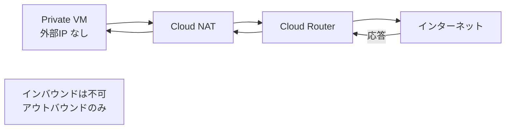

```bash
# Cloud Router の作成（Cloud NAT に必要）
gcloud compute routers create ROUTER_NAME \
    --region=REGION \
    --network=VPC_NAME

# Cloud NAT の作成
gcloud compute routers nats create NAT_NAME \
    --router=ROUTER_NAME \
    --region=REGION \
    --auto-allocate-nat-external-ips \  # GCPが自動でIPを割り当て
    --nat-all-subnet-ip-ranges          # VPC内の全サブネットをNAT対象

# 特定サブネットのみNAT対象にする場合
gcloud compute routers nats create NAT_NAME \
    --router=ROUTER_NAME \
    --region=REGION \
    --auto-allocate-nat-external-ips \
    --nat-custom-subnet-ip-ranges=SUBNET_NAME

# Cloud NAT のログを有効化
gcloud compute routers nats update NAT_NAME \
    --router=ROUTER_NAME \
    --region=REGION \
    --enable-logging

# Cloud NAT の設定確認
gcloud compute routers nats describe NAT_NAME \
    --router=ROUTER_NAME \
    --region=REGION

# Cloud NAT の削除
gcloud compute routers nats delete NAT_NAME \
    --router=ROUTER_NAME \
    --region=REGION
```

> ✅ **ベストプラクティス: ネットワーク管理**
> - 本番環境の VM には外部IPを割り当てず、**Cloud NAT + IAP**の組み合わせでアウトバウンド通信と管理アクセスを分離する
> - プライベート DNS ゾーンを作成してVPC内のサービス間通信をサービス名で解決できるようにする
> - 静的IPは必ずタグ・ラベルを付けて管理し、未使用のものを定期的に棚卸しする
> - Cloud NAT のログを有効化して通信の監査証跡を残す

📎 参照: https://cloud.google.com/nat/docs/overview  
📎 参照: https://cloud.google.com/dns/docs

---

### VPC ファイアウォールと Cloud NGFW

#### VPC ファイアウォールルールの管理

```bash
# ファイアウォールルールの作成（SSH を特定IPからのみ許可）
gcloud compute firewall-rules create allow-ssh-from-corp \
    --network=VPC_NAME \
    --action=ALLOW \
    --direction=INGRESS \
    --rules=tcp:22 \
    --source-ranges=203.0.113.0/24 \
    --target-tags=web-server \
    --priority=1000

# ファイアウォールルールの作成（特定タグを持つVMへのHTTPS許可）
gcloud compute firewall-rules create allow-https \
    --network=VPC_NAME \
    --action=ALLOW \
    --direction=INGRESS \
    --rules=tcp:443 \
    --source-ranges=0.0.0.0/0 \
    --target-tags=https-server

# Egress ルール（送信トラフィックの制御）
gcloud compute firewall-rules create deny-egress-to-untrusted \
    --network=VPC_NAME \
    --action=DENY \
    --direction=EGRESS \
    --rules=all \
    --destination-ranges=10.99.0.0/16 \
    --priority=500

# ファイアウォールルールの一覧
gcloud compute firewall-rules list --filter="network=VPC_NAME"

# ファイアウォールルールの更新
gcloud compute firewall-rules update RULE_NAME \
    --source-ranges=203.0.113.0/24,198.51.100.0/24

# ファイアウォールルールの無効化（削除せず）
gcloud compute firewall-rules update RULE_NAME \
    --disabled

# ファイアウォールルールの削除
gcloud compute firewall-rules delete RULE_NAME
```

#### Cloud NGFW（Next Generation Firewall）ポリシー

Cloud NGFW は従来のファイアウォールより高機能な、L7（アプリケーション層）対応のファイアウォールです。

| 比較項目 | VPC ファイアウォールルール | Cloud NGFW ポリシー |
|---|---|---|
| **適用スコープ** | プロジェクト内VPC | 組織・フォルダ・プロジェクト |
| **L7 フィルタリング** | 不可 | 可能（FQDN、TLS inspectionなど）|
| **集中管理** | 個別VPC | 階層的ポリシーで一元管理 |
| **脅威防御** | なし | 侵入防御（IPS）対応 |

```bash
# NGFW ネットワークファイアウォールポリシーの作成
gcloud compute network-firewall-policies create POLICY_NAME \
    --global

# NGFW ポリシーにルール追加（安全タグを使用）
gcloud compute network-firewall-policies rules create 1000 \
    --firewall-policy=POLICY_NAME \
    --direction=INGRESS \
    --action=allow \
    --src-ip-ranges=10.0.0.0/8 \
    --layer4-configs=tcp:443 \
    --global-firewall-policy

# NGFW ポリシーをVPCネットワークに関連付け
gcloud compute network-firewall-policies associations create \
    --firewall-policy=POLICY_NAME \
    --network=VPC_NAME \
    --global-firewall-policy
```

> ✅ **ベストプラクティス: ファイアウォール**
> - **最小権限原則**: デフォルトで全て拒否し、必要なトラフィックのみを許可する（Allowlist方式）
> - `0.0.0.0/0` からの SSH/RDP を許可するルールは作成しない。必ず IAP 経由にする
> - 複数プロジェクトに共通のポリシーは**Cloud NGFW の階層型ポリシー**で一元管理する
> - ファイアウォールルールには必ず**説明（description）を記載**してレビュー可能な状態を保つ
> - ファイアウォールルールのログを有効化して通信の監査証跡を残す

📎 参照: https://cloud.google.com/firewall/docs/firewalls  
📎 参照: https://cloud.google.com/firewall/docs/network-firewall-policies

---

## 3.4 モニタリングとロギング

### Cloud Monitoring アラート

Cloud Monitoring はメトリクスを収集してアラートを発火させる基盤です。

#### アラートポリシーの構造

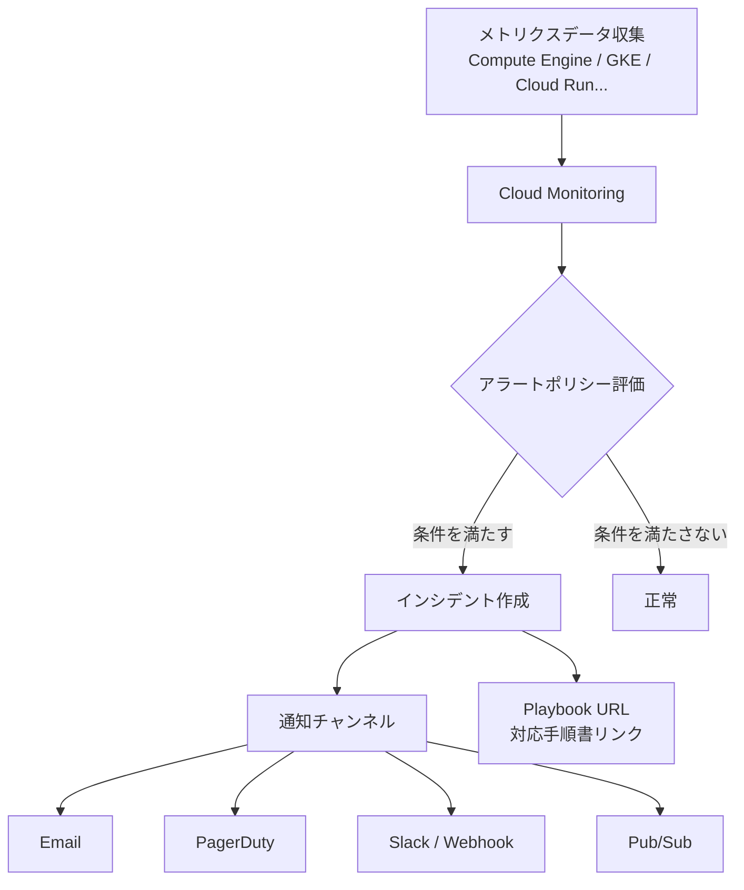

#### アラートポリシーの作成

```bash
# 通知チャンネルの作成（Email）
gcloud monitoring channels create \
    --display-name="Ops Team" \
    --type=email \
    --channel-labels=email_address=ops@example.com

# 通知チャンネルの一覧確認
gcloud monitoring channels list

# アラートポリシーの作成（JSONファイルから）
gcloud alpha monitoring policies create \
    --policy-from-file=alert_policy.json
```

```yaml
# alert_policy.yaml の例
displayName: "High CPU Usage Alert"
conditions:
  - displayName: "CPU utilization > 80% for 5 minutes"
    conditionThreshold:
      filter: >
        resource.type = "gce_instance" AND
        metric.type = "compute.googleapis.com/instance/cpu/utilization"
      comparison: COMPARISON_GT
      thresholdValue: 0.8
      duration: "300s"
      aggregations:
        - alignmentPeriod: "60s"
          perSeriesAligner: ALIGN_MEAN
combiner: OR
notificationChannels:
  - projects/PROJECT_ID/notificationChannels/CHANNEL_ID
alertStrategy:
  autoClose: "604800s"  # 7日後に自動クローズ
documentation:
  content: "CPU使用率が80%を超えました。Runbook: https://..."
  mimeType: "text/markdown"
```

> ✅ **ベストプラクティス: アラート設計**
> - **症状ベースのアラート**（サービスが応答しない、エラー率が高い）を優先し、原因ベースのアラートを減らしてノイズを削減する
> - SLO（Service Level Objective）に基づいたバーンレートアラートを設定する
> - アラートには必ず **Playbook / Runbook の URL** を含めて対応手順を明確にする
> - 全てのアラートに通知チャンネルを設定し、見落としを防ぐ

📎 参照: https://cloud.google.com/monitoring/alerts  
📎 参照: https://cloud.google.com/monitoring/alerting/policies-api

---

### カスタムメトリクス

アプリケーション固有のビジネスメトリクスを Cloud Monitoring に送信できます。

```python
# Python SDK でカスタムメトリクスを送信する例
from google.cloud import monitoring_v3
import time

client = monitoring_v3.MetricServiceClient()
project_name = f"projects/{PROJECT_ID}"

# タイムシリーズデータの作成
series = monitoring_v3.TimeSeries()
series.metric.type = "custom.googleapis.com/myapp/active_users"
series.metric.labels["environment"] = "production"
series.resource.type = "gce_instance"
series.resource.labels["instance_id"] = "INSTANCE_ID"
series.resource.labels["zone"] = "us-central1-a"

now = time.time()
seconds = int(now)
nanos = int((now - seconds) * 10 ** 9)
interval = monitoring_v3.TimeInterval(
    {"end_time": {"seconds": seconds, "nanos": nanos}}
)
point = monitoring_v3.Point(
    {"interval": interval, "value": {"int64_value": 1234}}
)
series.points = [point]

client.create_time_series(name=project_name, time_series=[series])
```

```bash
# ログベースのメトリクス作成（ログからメトリクスを抽出）
gcloud logging metrics create error-rate-metric \
    --description="Count of ERROR level logs" \
    --log-filter='severity="ERROR"'

# ログベースのメトリクス確認
gcloud logging metrics list
gcloud logging metrics describe error-rate-metric
```

---

### 監査ログの設定

#### 監査ログの種類

| ログ種別 | 記録内容 | デフォルト状態 | 無効化 |
|---|---|---|---|
| **Admin Activity** | リソースの設定変更（VM作成・削除・IAM変更など） | 常に有効 | 不可 |
| **Data Access** | データの読み取り・書き込み | 無効（ビッグデータは除く） | 可能 |
| **System Event** | Google システムによる自動操作 | 常に有効 | 不可 |
| **Policy Denied** | VPC Service Controls によるブロック | 有効 | 可能 |

#### 特殊ログの有効化

```bash
# Data Access 監査ログの有効化（プロジェクト全体）
# Cloud Console の IAM & Admin > Audit Logs から設定推奨

# gcloud を使った Data Access ログの有効化
gcloud projects get-iam-policy PROJECT_ID --format=json > policy.json
# policy.json に以下を追加:
# "auditConfigs": [{
#   "service": "allServices",
#   "auditLogConfigs": [{"logType": "DATA_READ"}, {"logType": "DATA_WRITE"}]
# }]
gcloud projects set-iam-policy PROJECT_ID policy.json

# VPC Flow Logs の有効化（サブネット単位）
gcloud compute networks subnets update SUBNET_NAME \
    --region=REGION \
    --enable-flow-logs \
    --logging-filter-expr="src_ip != '10.0.0.1'"  # フィルタリング可能 \
    --logging-aggregation-interval=interval-5-sec \
    --logging-flow-sampling=0.5  # サンプリング率（0.0〜1.0）

# ファイアウォールログの有効化（ルール単位）
gcloud compute firewall-rules update RULE_NAME \
    --enable-logging
```

---

### ログのエクスポートとルーティング

#### ログルーターの仕組み

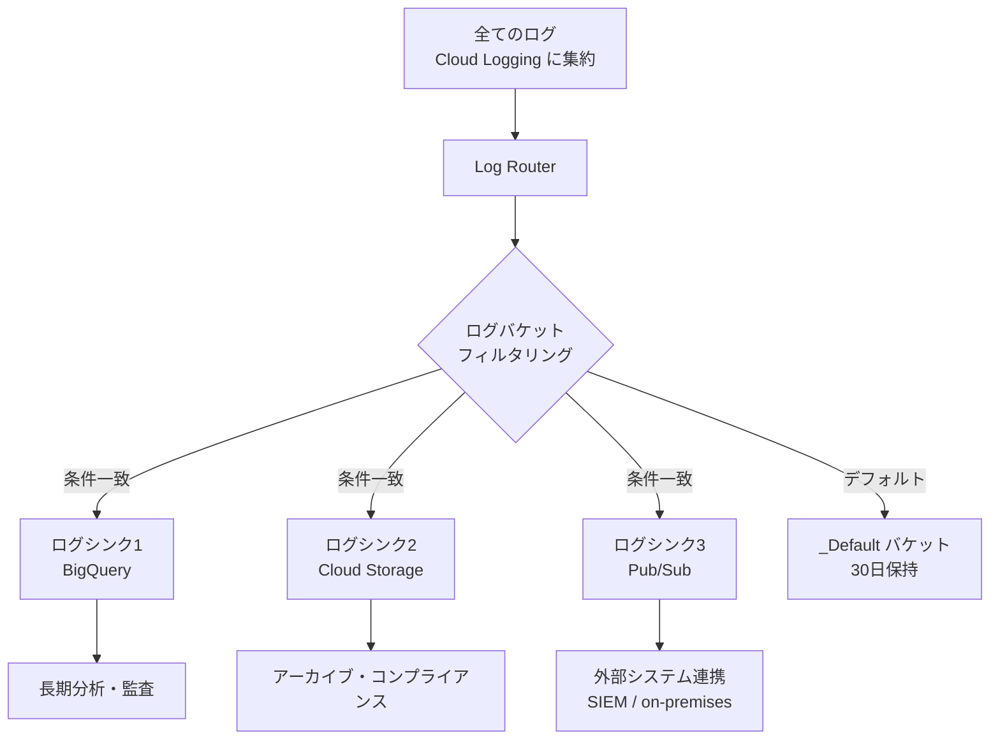

```bash
# BigQuery へのログシンクの作成
gcloud logging sinks create bq-audit-sink \
    bigquery.googleapis.com/projects/PROJECT_ID/datasets/DATASET_NAME \
    --log-filter='logName="projects/PROJECT_ID/logs/cloudaudit.googleapis.com%2Factivity"' \
    --description="Admin activity logs to BigQuery"

# シンク作成後、表示されるSA（serviceAccount:...）にBigQueryのDataEditorロールを付与
gcloud projects add-iam-policy-binding PROJECT_ID \
    --member="serviceAccount:p123456789-XXXXXX@gcp-sa-logging.iam.gserviceaccount.com" \
    --role="roles/bigquery.dataEditor"

# Cloud Storage へのログシンクの作成
gcloud logging sinks create gcs-compliance-sink \
    storage.googleapis.com/BUCKET_NAME \
    --log-filter='severity>=WARNING' \
    --description="Warning+ logs to Cloud Storage"

# Pub/Sub へのログシンクの作成（外部SIEMへの転送など）
gcloud logging sinks create pubsub-sink \
    pubsub.googleapis.com/projects/PROJECT_ID/topics/TOPIC_NAME \
    --log-filter='resource.type="gce_instance"'

# シンクの一覧確認
gcloud logging sinks list

# ログバケットの作成（カスタム保持期間）
gcloud logging buckets create BUCKET_NAME \
    --location=REGION \
    --retention-days=365 \
    --description="Long-term audit log storage"

# ログバケットへのルーターの作成
gcloud logging sinks create long-term-sink \
    "logging.googleapis.com/projects/PROJECT_ID/locations/REGION/buckets/BUCKET_NAME" \
    --log-filter='logName="projects/PROJECT_ID/logs/cloudaudit.googleapis.com%2Factivity"'
```

#### ログの閲覧とフィルタリング

```bash
# ログの閲覧（直近1時間のERRORログ）
gcloud logging read 'severity="ERROR"' \
    --limit=50 \
    --freshness=1h \
    --format=json

# 特定のリソースのログ
gcloud logging read 'resource.type="gce_instance" AND resource.labels.instance_id="INSTANCE_ID"' \
    --limit=100

# 特定のログ名のみ取得
gcloud logging read 'logName="projects/PROJECT_ID/logs/cloudaudit.googleapis.com%2Factivity"' \
    --limit=50
```

##### Cloud Logging フィルタ構文チートシート

| フィルタ | 説明 | 例 |
|---|---|---|
| `severity` | ログの重大度 | `severity="ERROR"` |
| `resource.type` | リソースタイプ | `resource.type="gce_instance"` |
| `logName` | ログ名 | `logName=~"cloudaudit"` |
| `timestamp` | 時刻範囲 | `timestamp>="2025-01-01T00:00:00Z"` |
| `textPayload` | テキスト検索 | `textPayload:"OutOfMemory"` |
| `jsonPayload.key` | JSON フィールド | `jsonPayload.httpRequest.status=500` |
| `labels.key` | ラベル | `labels."k8s-pod/app"="my-app"` |

---

### 診断ツール群

#### Cloud Trace

分散アプリケーションのレイテンシを分析するトレーシングツールです。

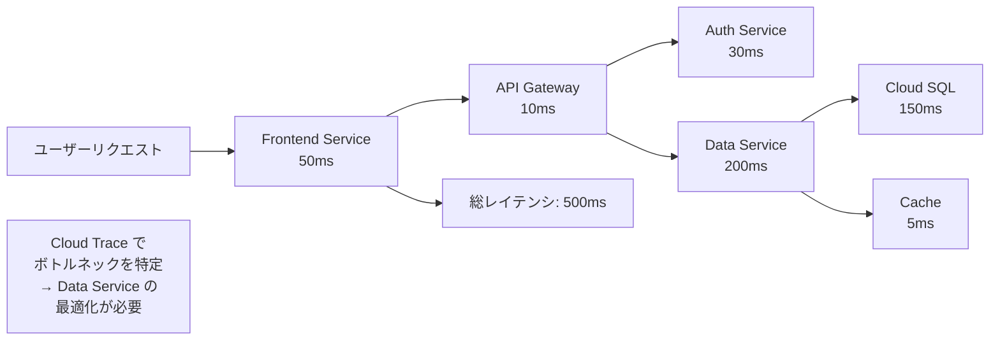

```python
# Python での Cloud Trace 設定（Flask アプリ例）
from opentelemetry import trace
from opentelemetry.exporter.cloud_trace import CloudTraceSpanExporter
from opentelemetry.sdk.trace import TracerProvider
from opentelemetry.sdk.trace.export import BatchSpanProcessor

provider = TracerProvider()
cloud_trace_exporter = CloudTraceSpanExporter(project_id=PROJECT_ID)
provider.add_span_processor(BatchSpanProcessor(cloud_trace_exporter))
trace.set_tracer_provider(provider)

tracer = trace.get_tracer(__name__)

def process_order(order_id):
    with tracer.start_as_current_span("process_order") as span:
        span.set_attribute("order.id", order_id)
        # ビジネスロジック
        return result
```

#### Cloud Profiler

本番環境で動作中のアプリのCPU・メモリ使用状況を継続的にプロファイリングします。

```bash
# Cloud Profiler の有効化（プロジェクト）
gcloud services enable cloudprofiler.googleapis.com

# Java アプリへのProfiler エージェント追加（例）
# -agentpath:/opt/cprof/profiler_java_agent.so=-logtostderr,-cprof_project_id=PROJECT_ID
```

#### Query Insights と Index Advisor（Cloud SQL / AlloyDB）

```bash
# Cloud SQL Query Insights の有効化
gcloud sql instances patch INSTANCE_NAME \
    --insights-config-query-insights-enabled \
    --insights-config-query-string-length=1024 \
    --insights-config-record-application-tags \
    --insights-config-record-client-address
```

Query Insights は以下を自動分析します:
- **スロークエリの特定**: 実行時間・スキャン行数が多いクエリ
- **待機イベント分析**: ロック待ち・I/O待ちの可視化
- **Index Advisor**: 追加すべきインデックスの自動提案

---

### Ops Agent と Managed Prometheus

#### Ops Agent の設定とデプロイ

Ops Agent は Compute Engine VM 上で動作し、ログとメトリクスを収集して Cloud Monitoring/Logging に送信します。

```bash
# Ops Agent のインストール（Debian/Ubuntu）
curl -sSO https://dl.google.com/cloudagents/add-google-cloud-ops-agent-repo.sh
sudo bash add-google-cloud-ops-agent-repo.sh --also-install

# Ops Agent のステータス確認
sudo systemctl status google-cloud-ops-agent

# Ops Agent の設定ファイル（/etc/google-cloud-ops-agent/config.yaml）
```

```yaml
# Ops Agent 設定ファイル例（カスタムログ収集）
logging:
  receivers:
    app_logs:
      type: files
      include_paths:
        - /var/log/myapp/*.log
      record_log_file_path: true
  processors:
    parse_json:
      type: json_parser
      field: message
  exporters:
    google:
      type: google_cloud_logging
  service:
    pipelines:
      app_pipeline:
        receivers: [app_logs]
        processors: [parse_json]
        exporters: [google]

metrics:
  receivers:
    nginx:
      type: nginx
      stub_status_url: http://localhost/nginx_status
  exporters:
    google:
      type: google_cloud_monitoring
  service:
    pipelines:
      nginx_pipeline:
        receivers: [nginx]
        exporters: [google]
```

```bash
# 設定の検証と適用
sudo google-cloud-ops-agent diagnose
sudo systemctl restart google-cloud-ops-agent
```

#### Google Cloud Managed Service for Prometheus

GKE 上の Prometheus メトリクスをフルマネージドで収集するサービスです。

```bash
# Managed Prometheus の有効化（GKEクラスタ作成時）
gcloud container clusters create CLUSTER_NAME \
    --zone=ZONE \
    --enable-managed-prometheus

# 既存クラスタへの有効化
gcloud container clusters update CLUSTER_NAME \
    --zone=ZONE \
    --enable-managed-prometheus

# PodMonitoring リソースのデプロイ（Namespace のメトリクス収集）
```

```yaml
# PodMonitoring マニフェスト例
apiVersion: monitoring.googleapis.com/v1
kind: PodMonitoring
metadata:
  name: my-app-monitoring
  namespace: default
spec:
  selector:
    matchLabels:
      app: my-app
  endpoints:
  - port: metrics
    interval: 30s
    path: /metrics
```

---

### AI支援ツール群

#### Gemini Cloud Assist for Cloud Monitoring

Gemini Cloud Assist はメトリクスの分析、アラートの根本原因特定、対処方法の提案を AI が支援します。

```bash
# Gemini Cloud Assist は Cloud Console から使用
# Cloud Monitoring ダッシュボード → "Ask Gemini" ボタン
# 例: "Why is CPU usage spiking on my VM at midnight?"
# 例: "What are the top 5 errors in my application logs from the last hour?"
```

#### Active Assist によるリソース最適化

Active Assist は AI ベースの推奨エンジンで、以下を自動提案します。

| 推奨種別 | 内容 | ツール |
|---|---|---|
| **VM Right-sizing** | 過剰スペックのVMのダウンサイズ提案 | Recommender |
| **Idle Resource** | 未使用リソースの削除提案 | Recommender |
| **IAM** | 過剰な権限の最小化提案 | IAM Recommender |
| **Firewall** | 未使用ファイアウォールルールの削除提案 | Firewall Insights |
| **BigQuery** | 未使用テーブル・高コストクエリの提案 | BigQuery Recommender |

```bash
# Recommender を使ったリソース最適化の確認
gcloud recommender recommendations list \
    --recommender=google.compute.instance.MachineTypeRecommender \
    --location=ZONE \
    --project=PROJECT_ID \
    --format="json"

# IAM 推奨事項の確認
gcloud recommender recommendations list \
    --recommender=google.iam.policy.Recommender \
    --location=global \
    --project=PROJECT_ID
```

#### Cloud Hub によるイベント監視

Cloud Hub はアクティブなインシデントとアプリケーション健全性を一元的に可視化するダッシュボードです。

- **Google Cloud のサービス障害**とユーザーのリソースへの影響を統合表示
- **Personalized Service Health Dashboard** で自分のプロジェクトに影響するイベントを優先表示

```bash
# Service Health の確認（gcloud）
gcloud services list --available | grep cloudhealth

# Cloud Console でのアクセス
# URL: https://console.cloud.google.com/cloud-health
```

> ✅ **ベストプラクティス: モニタリングとロギング**
> - 全 Compute Engine VM に **Ops Agent** をデプロイしてシステムメトリクスとアプリログを収集する
> - GKE には **Managed Prometheus** を有効化してアプリメトリクスを標準化する
> - Admin Activity 監査ログは**常に有効**で無効化不可のため、Data Access ログは機密データ向けにのみ有効化してコストを制御する
> - ログシンクで **BigQuery** にエクスポートして Log Analytics で長期的な分析・コンプライアンスレポートに活用する
> - **Active Assist の推奨**を月次で確認してリソースの無駄を継続的に排除する
> - アラートには必ずドキュメント（Playbook URL）を添付する

📎 参照: https://cloud.google.com/monitoring/docs  
📎 参照: https://cloud.google.com/logging/docs  
📎 参照: https://cloud.google.com/trace/docs  
📎 参照: https://cloud.google.com/profiler/docs  
📎 参照: https://cloud.google.com/stackdriver/docs/solutions/agents/ops-agent  
📎 参照: https://cloud.google.com/managed-prometheus  
📎 参照: https://cloud.google.com/recommender/docs

---

## 試験攻略チェックリストと頻出ポイント

### Section 3.1 コンピューティング 重要ポイント

| 項目 | チェック | 試験での頻出パターン |
|---|---|---|
| IAP 経由 SSH 接続 | ☐ | 「外部IPなしVMに接続するには？」 |
| OS Login の設定方法 | ☐ | 「組織で SSH 鍵を一元管理するには？」 |
| スナップショットスケジュール | ☐ | 「定期バックアップを自動化するには？」 |
| イメージファミリーの使い方 | ☐ | 「常に最新イメージで VM を作成するには？」 |
| GKE ノードプールの追加・削除 | ☐ | 「GPU ワークロード用ノードプールを追加するには？」 |
| StatefulSet の特性 | ☐ | 「DB を GKE で動かすのに適したリソースは？」 |
| HPA vs VPA の使い分け | ☐ | 「トラフィック増加に対応するオートスケールは？」 |
| Cloud Run トラフィック分割 | ☐ | 「新バージョンを安全にリリースするには？」 |
| Cloud Run --min-instances | ☐ | 「コールドスタートを防ぐには？」 |

### Section 3.2 ストレージ・データ 重要ポイント

| 項目 | チェック | 試験での頻出パターン |
|---|---|---|
| Uniform Bucket-Level Access | ☐ | 「オブジェクトACLを使わないセキュアな方法は？」 |
| ライフサイクルポリシー（age条件）| ☐ | 「30日後に自動でNearlineに移行するには？」 |
| BigQuery --dry_run | ☐ | 「クエリコストを事前に確認するには？」 |
| Cloud SQL Auth Proxy | ☐ | 「Cloud SQLへのセキュアな接続方法は？」 |
| Cloud SQL PITR | ☐ | 「特定時点にDBを復元するには？」 |
| Firestore エクスポート先 | ☐ | 「Firestoreのバックアップ先は？」 |
| CMEK の KMS キー管理 | ☐ | 「顧客管理キーで暗号化するには？」 |

### Section 3.3 ネットワーク 重要ポイント

| 項目 | チェック | 試験での頻出パターン |
|---|---|---|
| サブネット拡張（縮小不可）| ☐ | 「IPアドレスが枯渇したサブネットを拡張するには？」 |
| 静的 IP の予約と課金 | ☐ | 「未割当の静的IPは課金される」 |
| Cloud NAT の目的 | ☐ | 「外部IPなしVMがインターネットにアクセスするには？」 |
| Cloud Router の関係 | ☐ | 「Cloud NAT には Cloud Router が必要」 |
| ファイアウォールルールの優先度 | ☐ | 「複数ルールが競合した場合の評価順は？」 |

### Section 3.4 モニタリング・ロギング 重要ポイント

| 項目 | チェック | 試験での頻出パターン |
|---|---|---|
| Admin Activity ログは無効化不可 | ☐ | 「常に有効な監査ログは？」 |
| Data Access ログのデフォルト | ☐ | 「Data Access ログはデフォルト無効」 |
| VPC Flow Logs の設定場所 | ☐ | 「サブネット単位で設定する」 |
| ログシンクの SA 権限付与 | ☐ | 「シンク作成後に SA への権限付与が必要」 |
| Ops Agent のインストール | ☐ | 「VM のシステムメトリクスを取得するには？」 |
| Active Assist の用途 | ☐ | 「AI によるリソース最適化推奨」 |
| Cloud Trace vs Cloud Profiler | ☐ | 「Trace=レイテンシ分析、Profiler=CPU/メモリ分析」 |

---

## 公式参照リソース一覧

| カテゴリ | リソース | URL |
|---|---|---|
| **試験情報** | ACE 試験概要ページ | https://cloud.google.com/learn/certification/cloud-engineer |
| **試験情報** | 試験ガイド PDF（2026年6月版）| https://services.google.com/fh/files/misc/063026_associate_cloud_engineer_exam_guide_english.pdf |
| **試験情報** | サンプル問題 | https://docs.google.com/forms/d/e/1FAIpQLSfexWKtXT2OSFJ-obA4iT3GmzgiOCGvjrT9OfxilWC1yPtmfQ/viewform |
| **Compute Engine** | IAP経由SSH接続 | https://cloud.google.com/compute/docs/connect/ssh-using-iap |
| **Compute Engine** | OS Login | https://cloud.google.com/compute/docs/oslogin |
| **Compute Engine** | スナップショット | https://cloud.google.com/compute/docs/disks/create-snapshots |
| **Compute Engine** | カスタムイメージ | https://cloud.google.com/compute/docs/images/create-custom |
| **Compute Engine** | GPU アタッチメント | https://cloud.google.com/compute/docs/gpus |
| **GKE** | ノードプール管理 | https://cloud.google.com/kubernetes-engine/docs/concepts/node-pools |
| **GKE** | HPA | https://cloud.google.com/kubernetes-engine/docs/concepts/horizontalpodautoscaler |
| **GKE** | VPA | https://cloud.google.com/kubernetes-engine/docs/concepts/verticalpodautoscaler |
| **GKE** | Artifact Registry アクセス | https://cloud.google.com/artifact-registry/docs/integrate-gke |
| **GKE** | Workload Identity | https://cloud.google.com/kubernetes-engine/docs/how-to/workload-identity |
| **Cloud Run** | デプロイとトラフィック分割 | https://cloud.google.com/run/docs/rollouts-rollbacks-traffic-migration |
| **Cloud Run** | オートスケーリング | https://cloud.google.com/run/docs/configuring/autoscaling |
| **Cloud Storage** | アクセス制御 | https://cloud.google.com/storage/docs/access-control |
| **Cloud Storage** | Uniform Bucket-Level Access | https://cloud.google.com/storage/docs/uniform-bucket-level-access |
| **Cloud Storage** | ライフサイクル | https://cloud.google.com/storage/docs/lifecycle |
| **BigQuery** | クエリ最適化 | https://cloud.google.com/bigquery/docs/best-practices-performance-compute |
| **Cloud SQL** | バックアップとPITR | https://cloud.google.com/sql/docs/mysql/backup-recovery/pitr |
| **Cloud SQL** | Auth Proxy | https://cloud.google.com/sql/docs/mysql/connect-auth-proxy |
| **Database Center** | フリート管理 | https://cloud.google.com/database-center |
| **CMEK** | 顧客管理暗号化キー | https://cloud.google.com/kms/docs/cmek |
| **ネットワーク** | Cloud NAT | https://cloud.google.com/nat/docs/overview |
| **ネットワーク** | Cloud DNS | https://cloud.google.com/dns/docs |
| **ファイアウォール** | VPC ファイアウォール | https://cloud.google.com/firewall/docs/firewalls |
| **ファイアウォール** | Cloud NGFW | https://cloud.google.com/firewall/docs/network-firewall-policies |
| **Monitoring** | アラートポリシー | https://cloud.google.com/monitoring/alerts |
| **Logging** | ログルーター・シンク | https://cloud.google.com/logging/docs/export/configure_export_v2 |
| **Logging** | 監査ログ | https://cloud.google.com/logging/docs/audit |
| **Logging** | VPC Flow Logs | https://cloud.google.com/vpc/docs/flow-logs |
| **Ops Agent** | インストール・設定 | https://cloud.google.com/stackdriver/docs/solutions/agents/ops-agent |
| **Managed Prometheus** | GKE 統合 | https://cloud.google.com/managed-prometheus |
| **Cloud Trace** | 分散トレーシング | https://cloud.google.com/trace/docs |
| **Cloud Profiler** | プロファイリング | https://cloud.google.com/profiler/docs |
| **Active Assist** | リソース推奨 | https://cloud.google.com/recommender/docs |
| **Cloud Workstations** | 開発者環境 | https://cloud.google.com/workstations/docs |
| **Cloud Hub** | サービス健全性 | https://cloud.google.com/cloud-hub |

---

*本ガイドは Google Cloud Associate Cloud Engineer 試験（Section 3）の学習用に作成されています。*  
*最新の試験情報・サービス仕様は必ず公式サイトでご確認ください。*  
*試験ガイド準拠バージョン: 063026（2026年6月30日施行）*  
*作成日: 2026年6月*
