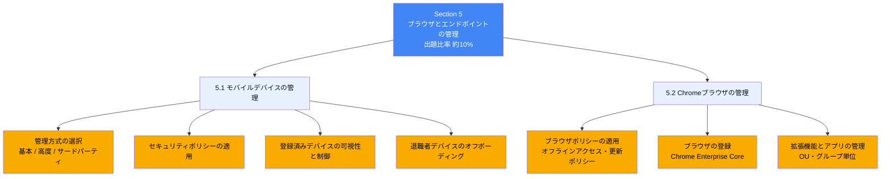
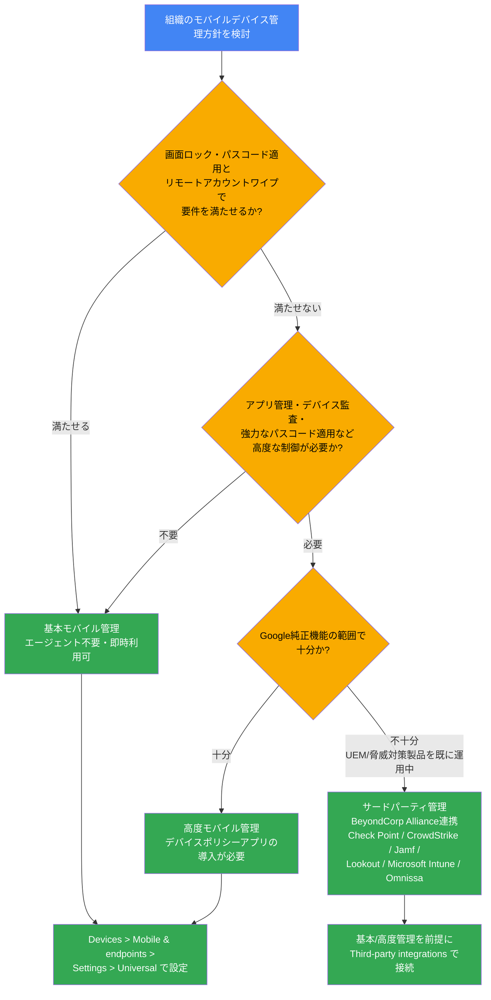
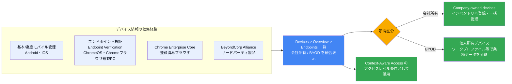
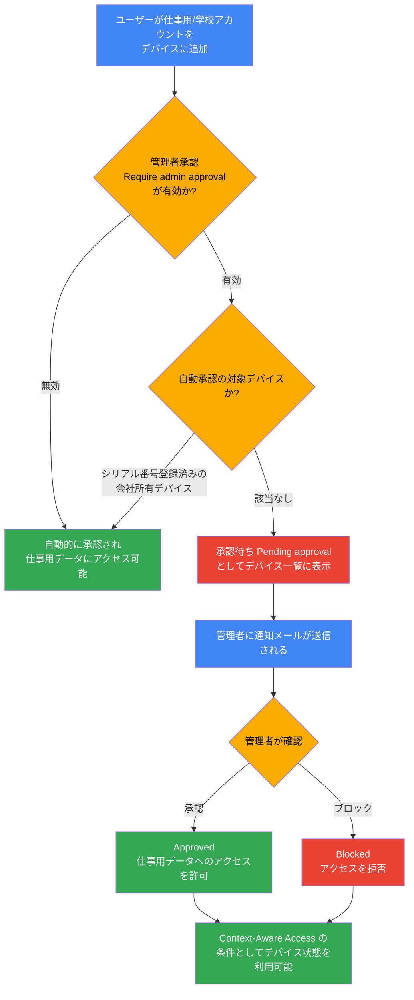
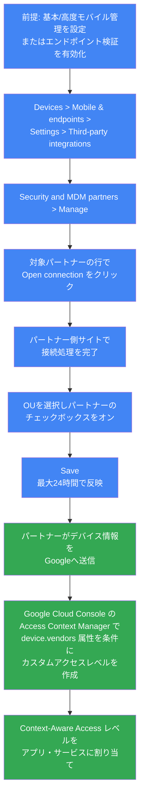
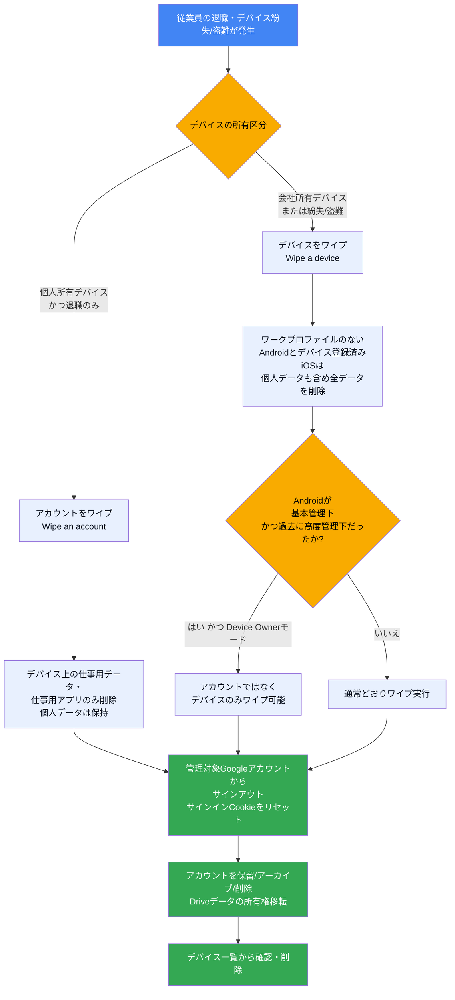
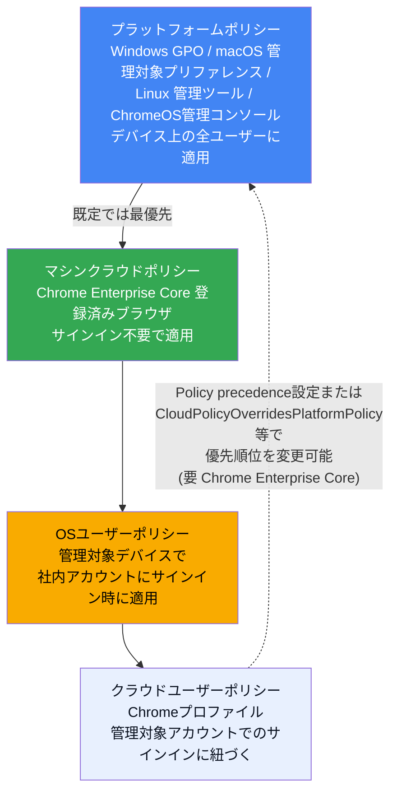
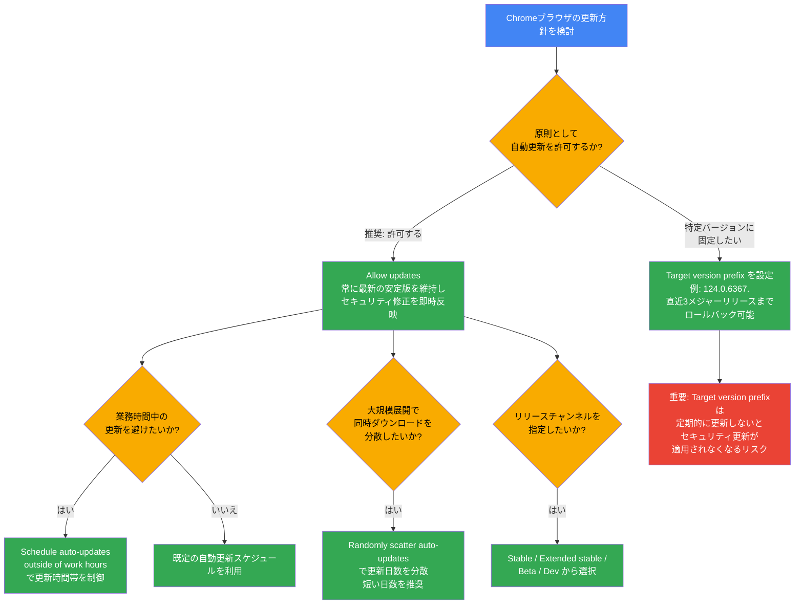
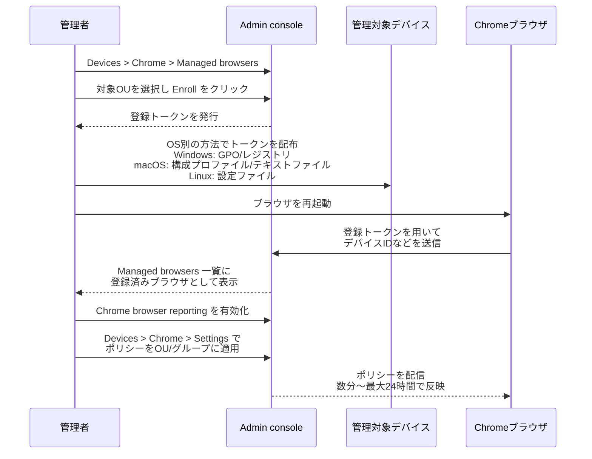
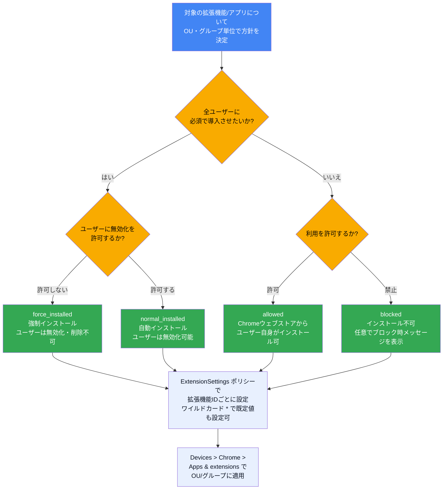

# Associate Google Workspace Administrator 試験対策ガイド
# Section 5: ブラウザとエンドポイントの管理（Managing browsers and endpoints）

> 出題比率: 約10%（公式Exam Guideより。全6セクション中最も比率が低いが、モバイルデバイスとChromeブラウザという「エンドユーザーが日常的に触れる接点」を扱うため、実務では頻出するトピック群である）
>
> 対応タスク: 5.1 モバイルデバイスの管理 / 5.2 Chromeブラウザの管理
>
> 公式ソース:
> - 認定ページ: https://cloud.google.com/learn/certification/associate-google-workspace-administrator?hl=en
> - 公式Exam Guide（PDF）: https://services.google.com/fh/files/misc/associate_google_workspace_administrator_exam_guide_english.pdf

---

## 目次

1. [Section 5の全体像](#section-5の全体像)
2. [5.1 モバイルデバイスの管理](#51-モバイルデバイスの管理)
   - [5.1.1 基本・高度・サードパーティ管理ソリューションの使い分け](#511-基本高度サードパーティ管理ソリューションの使い分け)
   - [5.1.2 Google基本モバイル管理によるセキュリティポリシーの適用](#512-google基本モバイル管理によるセキュリティポリシーの適用)
   - [5.1.3 登録済みデバイスの可視性と制御の維持（会社所有・BYOD）](#513-登録済みデバイスの可視性と制御の維持会社所有byod)
   - [5.1.4 退職者のモバイルデバイスのオフボーディング](#514-退職者のモバイルデバイスのオフボーディング)
3. [5.2 Chromeブラウザの管理](#52-chromeブラウザの管理)
   - [5.2.1 Chromeブラウザポリシーの適用（オフラインアクセス・更新ポリシー）](#521-chromeブラウザポリシーの適用オフラインアクセス更新ポリシー)
   - [5.2.2 ブラウザの登録とポリシーの適用](#522-ブラウザの登録とポリシーの適用)
   - [5.2.3 拡張機能とアプリの管理](#523-拡張機能とアプリの管理)
4. [学習チェックリスト](#学習チェックリスト)
5. [参考文献](#参考文献)

---

## Section 5の全体像

Section 5は「Google endpoint management（旧称: Google Mobile Management）」と「Chrome Enterprise Core（旧称: Chrome Browser Cloud Management, CBCM）」という、Google Workspaceのデバイス管理機構の中核をなす2つの柱で構成される。両者は密接に連携しており、Devices（デバイス）メニュー配下の Mobile & endpoints と Chrome という隣接する設定領域から管理する。

Section 5は2タスクのみとシンプルだが、出題範囲は「モバイルデバイス（スマートフォン・タブレット）」と「Chromeブラウザが動く任意のコンピューター（Windows / macOS / Linux / ChromeOS）」という異なる2種類のエンドポイントにまたがる。試験対策では、この2系統の管理機構が**別々の設定画面・別々のライセンス要件・別々の登録トークン方式**を持つことを明確に区別して理解することが重要である。

---

## 5.1 モバイルデバイスの管理

Google Workspaceにおけるモバイルデバイス管理は、公式には「Google endpoint management」と総称される機能群の一部であり、Android・iPhone・iPadを対象とする。管理レベルは大きく「基本（Basic）」「高度（Advanced）」の2段階に分かれ、これに加えて外部のUEM（統合エンドポイント管理）製品と連携する「サードパーティ管理」という選択肢がある。

### 5.1.1 基本・高度・サードパーティ管理ソリューションの使い分け

#### 基本モバイル管理（Basic mobile management）

組織では既定で基本モバイル管理が有効になっている。この機能は、デバイスにエージェントアプリを一切インストールすることなく、ユーザーが仕事用アカウントでモバイルデバイスにアクセスする際の基礎的な保護を提供する。

基本管理の特徴は次のとおりである。

- Android・iPhone・iPadに対応する。
- **エージェントレス管理**（デバイス側にアプリのインストールが不要）である。
- OSバージョンや暗号化ステータスの同期には数日かかる場合があり、この間はContext-Aware Accessを使用しているとアクセスに影響が出ることがある。
- 設定は Devices > Mobile & endpoints > Settings > Universal > General > Mobile management から行い、Basicを選択して保存する。この操作には「Mobile Device Management」管理者権限が必要である。

#### 高度モバイル管理（Advanced mobile management）

基本管理では組織のセキュリティ要件を満たせない場合に、高度管理へ切り替える。高度管理では、デバイスへの「デバイスポリシーアプリ」のインストールが必要になる（Androidユーザーは手動インストールせず、画面の案内に従う。iOSでは登録時にプロファイルのインストールを促される）。

高度管理を有効にすると、デバイスポリシー・パスワードに対するより強力な制御、Android・iOS双方でのアプリ管理、デバイス全体のリモートワイプが可能になる。ただし、Business Starter・Business Standard、Education Fundamentals、Essentials、Cloud Identity Freeのエディションでは利用できない点に注意する。

#### 基本管理と高度管理の機能比較

| 機能 | 基本管理 | 高度管理 |
| --- | --- | --- |
| エージェントレス管理（アプリ不要） | ✔ | — |
| デバイスインベントリ | ✔ | ✔ |
| 基本のパスコード適用 | ✔ | ✔ |
| モバイルレポート | ✔ | ✔ |
| ハイジャック防止 | ✔ | ✔ |
| リモートアカウントワイプ | ✔ | ✔ |
| Androidアプリ管理 | ✔ | ✔ |
| デバイス監査とアラート | ✔（一部エディションのみ） | ✔（一部エディションのみ） |
| デバイス管理ルール | ✔ | ✔ |
| デバイスのブロック・ブロック解除 | ✔ | ✔ |
| 標準/強力なパスコード適用 | — | ✔ |
| デバイス承認（Device approvals） | — | ✔ |
| リモートデバイスワイプ（全データ） | — | ✔ |
| iOSアプリ管理 | — | ✔ |
| Androidワークプロファイル | — | ✔ |
| セキュリティポリシー | — | ✔ |
| 会社所有デスクトップの一括登録 | — | ✔ |
| 会社所有Androidの一括登録（ゼロタッチ） | — | ✔ |
| 会社所有iOSデバイス管理 | — | ✔ |
| デバイス証明書の配布 | — | ✔ |

*出典: [Compare mobile management features](https://knowledge.workspace.google.com/admin/devices/compare-mobile-management-features)*

#### サードパーティ管理（BeyondCorp Alliance）

組織が既にUEM製品や脅威対策製品を運用している場合、Google WorkspaceはBeyondCorp Allianceパートナーとの統合をサポートする。対応パートナーは **Check Point・CrowdStrike・Jamf・Lookout・Microsoft Intune（デスクトップデバイスのみ）・Omnissa** である。連携後は、パートナー製品が収集したデバイス情報をGoogle側のデバイスインベントリに取り込み、Context-Aware Accessの条件として利用できる。

サードパーティ連携を利用するには、前提として基本または高度モバイル管理（モバイルデバイス向け）、またはエンドポイント検証（コンピューター向け）を有効にしておく必要がある。なお、Googleはサードパーティが送信するデバイスデータの正確性については責任を負わない点も押さえておきたい。

##### ベストプラクティス

- 特別な要件がない限り、まず基本管理を使い続け、必要になった時点で高度管理へ段階的に移行する。高度管理はデバイス側の操作（デバイスポリシーアプリのインストール）をユーザーに要求するため、展開前に十分な周知期間を設ける。
- 高度管理へ切り替える際は対応エディションを事前に確認する（Business Starter・Business Standardなど一部エディションは非対応）。
- 既存のUEM/EDR製品への投資がある場合は、Google純正の高度管理を重複導入するのではなく、BeyondCorp Alliance連携によって既存投資を活かす選択肢を優先的に検討する。
- 高度管理から基本管理へダウングレードする場合は専用の手順（Downgrade device management from advanced to basic）に従う。Android端末では、直前まで高度管理下にあった端末はアカウントではなくデバイス全体のワイプしかできなくなる場合がある点に注意する。

---

### 5.1.2 Google基本モバイル管理によるセキュリティポリシーの適用

基本モバイル管理を有効にした後、管理者は以下の設定をカスタマイズできる。

1. **パスワード要件のカスタマイズ**: 管理対象モバイルデバイスに対して、画面ロックまたはパスワードの設定を必須にする。パスワードの最小文字数などを指定できる。
2. **Android向けの管理対象アプリのセットアップ**: Web and mobile appsリストに追加することで、業務用Androidアプリを「管理対象」にし、不正アクセスを防止する。

基本管理下でも次の操作が可能である。

- デバイスが紛失・盗難に遭った場合、ユーザーのアカウントをモバイルデバイスからワイプする。
- モバイルデバイスのアクティビティアラートを設定する。
- 組織のデータにアクセスするモバイルデバイスを定期的にレビューする。

基本管理は「エージェントレス」であるがゆえに、OSバージョン・暗号化ステータスなどのデバイス属性の同期に数日単位の遅延が生じうる。この遅延は、Context-Aware Accessでデバイス属性を条件に使っている場合、一時的なアクセス不能や誤判定につながる可能性があるため、高度管理への切り替えを検討する材料となる。

##### ベストプラクティス

- Device management security checklist（デバイス管理セキュリティチェックリスト）に沿って、まず「パスワード要件の設定」と「紛失デバイスからのデータのロックダウン/ワイプ」の2点を最優先で有効化する。
- 管理対象Androidアプリのリストは、業務上必須なアプリのみに絞り込み、強制インストールするセキュリティアプリ（マルウェア対策など）を明確に区別して管理する。
- モバイルデバイスのアクティビティアラート（デバイス監査とアラート）は、Frontline Standard/Plus、Enterprise Standard/Plus、Business Plus、Education Standard/Plus、G Suite Business、Cloud Identity Premiumなど対応エディションでのみ利用可能な点に留意する。

---

### 5.1.3 登録済みデバイスの可視性と制御の維持（会社所有・BYOD）

管理者は、組織のデータにアクセスする全デバイス（会社所有・BYODの両方）について、一元的な可視性を維持する必要がある。この可視性を支える仕組みは複数存在し、デバイスの種類によって使い分ける。

#### エンドポイント検証（Endpoint Verification）

エンドポイント検証は、ChromeOSまたはChromeブラウザが動作するコンピューター（macOS El Capitan以降、ChromeOS 110以降、Linux Debian/Ubuntu、Windows 10/11）について、OS・デバイス・ユーザーに関する詳細情報を取得する仕組みである。個人所有・組織所有のいずれのデバイスにも利用できる。

セットアップは次の4ステップで構成される。

1. Admin consoleでエンドポイント検証を有効化する（既定でオンになっていることが多い）。
2. エンドポイント検証拡張機能をデバイスにインストールする（ユーザー自身によるインストール、Admin consoleからの強制インストール、ポリシーによる配布のいずれか）。
3. 必要に応じてヘルパーアプリをインストールする（CrowdStrike Falcon ZTA連携や証明書ベースアクセスを使う場合など）。
4. 任意でデバイス承認を設定する。

#### デバイス承認（Require admin approval for device access）

高度管理下のAndroid・iOSデバイスでは、ユーザー所有デバイスが仕事用/学校用アカウントへ初めてアクセスしようとした際に、管理者による個別承認を要求できる。

シリアル番号によって会社所有デバイスとして事前登録されているデバイス（ワークプロファイル付きAndroidを除く）は、承認要求の対象であっても自動的に承認される。またDrive for desktopを「承認済みデバイスのみ」に制限している場合、その条件を満たす会社所有デバイスも自動承認の対象になる。

#### サードパーティ連携によるデバイス情報の統合

BeyondCorp Allianceパートナーとの連携フローは次のとおりである。

接続作業はSuper Admin権限で行う必要がある。パートナー接続を有効化しただけでは特定のOUに適用されず、Step 2の「OUごとの有効化」を別途行って初めてそのOU配下のユーザーに反映される点は誤解しやすいポイントである。

##### ベストプラクティス

- BYODを許容する組織では、デバイス承認（Require admin approval）を有効にし、承認待ち/ブロック状態をContext-Aware Accessの条件に組み込むことで、「野良デバイス」からのアクセスを構造的に防止する。
- エンドポイント検証は、モバイルデバイス向けの基本/高度管理ではカバーされない「Chromeブラウザが動くPC」の可視性を補完する位置づけであることを理解し、両者を併用する。
- iOSデバイスでサードパーティ連携を使う場合、Safariの有効化状態によって重複デバイスエントリが発生しうるため、Context-Aware Accessによる意図しないブロックが起きていないか定期的に確認する。

---

### 5.1.4 退職者のモバイルデバイスのオフボーディング

従業員の退職時や、デバイスの紛失・盗難時には、組織データを保護するための迅速な対応が求められる。Google Workspaceは「デバイスをワイプする」ことと「アカウントをワイプする」ことを明確に区別しており、この区別を正しく理解することが実務・試験の両面で重要である。

#### ワイプの2種類

| 操作 | 用途 | 削除対象 |
| --- | --- | --- |
| デバイスをワイプ（Wipe a device） | 会社所有デバイス、または個人所有で紛失・盗難に遭ったデバイス | 仕事用データ・アプリを削除。ワークプロファイルのないAndroidやデバイス登録済みiOSでは個人データ・個人アプリも含め全削除 |
| アカウントをワイプ（Wipe an account） | 個人所有デバイスを使う従業員が退職する場合 | デバイス上の仕事用アカウントとそれに紐づくデータのみ削除。個人データは保持される |

Android端末が「現在は基本管理下だが、過去に高度管理下にあり、かつDevice Ownerモード（会社所有デバイスまたは『仕事専用』として設定された個人デバイス）」という条件を満たす場合は、アカウント単位ではなくデバイス全体のワイプしかできない点に注意する。

#### サインアウトによる即時アクセス遮断

デバイスワイプに加えて、管理対象Googleアカウントのサインインクッキーをリセットすることで、モバイルデバイス・ブラウザなど全デバイスから即座にサインアウトさせることができる。ユーザーを一時停止（Suspend）すると、サインインクッキーは自動的にリセットされる。ただし、この操作はGmail・Google Drive for desktopなどアプリレベルのセッションまでは切断しないため、必要に応じてアプリのサインアウトも別途行う。

##### ベストプラクティス

- オフボーディング手順は「デバイスワイプ/アカウントワイプの実行」「サインインCookieのリセット（またはアカウント一時停止）」「Driveデータの所有権移転」「ライセンス解除・アカウントの保留orアーカイブor削除」という順序をテンプレート化し、都度の判断のばらつきを防ぐ。
- 退職が確定した時点で速やかにユーザーを一時停止し、その後にワイプや所有権移転などのデータ保全作業を行う（アクセス遮断とデータ保全の順序を誤ると、退職者による意図的なデータ持ち出しリスクが残る）。
- BYODで働く従業員の退職では「アカウントのワイプ」を選択し、私物データを誤って削除しないよう区別を徹底する。
- モバイルデバイス一覧を定期的に棚卸しし、退職済みユーザーや長期間非アクティブなデバイスが残っていないか確認する。

---

## 5.2 Chromeブラウザの管理

Chromeブラウザの管理は、Google Workspace自体の機能ではなく、**Chrome Enterprise Core**（旧称: Chrome Browser Cloud Management, CBCM）というChrome専用の管理レイヤーを通じて行う。Windows・macOS・Linuxで動作するChromeブラウザは、OSやデバイスがGoogle Workspaceに登録されていなくても、Chrome Enterprise Coreに個別に登録することでクラウドから一元管理できる点が最大の特徴である。

### 5.2.1 Chromeブラウザポリシーの適用（オフラインアクセス・更新ポリシー）

#### ポリシーの適用範囲と優先順位

Chromeポリシーには4種類の適用経路があり、既定では次の優先順位で適用される（同じポリシーが複数の経路で設定されている場合、上位の経路が優先され、下位は無視される）。

Chrome Enterprise Coreでブラウザフリートを管理している場合に限り、Admin consoleの「Policy precedence」設定、またはCloudPolicyOverridesPlatformPolicy／CloudUserPolicyOverridesCloudMachinePolicyポリシーによって、この優先順位を4通りの組み合わせに変更できる。また、リストやディクショナリ形式のポリシー（ExtensionSettingsなど）は「Policy mergelist」設定やワイルドカード`*`を使うことで、複数ソースからの値をマージすることも可能である。

#### オフラインアクセス

「オフラインアクセス」は、Google Docs・Sheets・Slidesをインターネット未接続のコンピューターから利用できるようにする機能で、既定で組織に対して有効になっており、ユーザーは自分のアカウントで個別にオン/オフを切り替えられる。Chrome BrowserとMicrosoft Edgeブラウザで利用でき、Google Drive for desktopには適用されない別機能である。

管理者は次の2つの方式から選択する。

- **オプション1（推奨）: ユーザーにオフラインアクセスの有効化を許可する** — Apps > Google Workspace > Drive and Docs > Features and Applicationsで「Allow users to enable offline access」を選択する。最も簡便な方法。
- **オプション2: デバイスポリシーでオフラインアクセスを制御する** — Windows/macOS/Linuxの管理対象コンピューターに、Google Docs Offline拡張機能（ID: `ghbmnnjooekpmoecnnnilnnbdlolhkhi`）を許可するポリシー（ADMX/plist/設定ファイル）を配布したうえで、Admin console側で「Control offline access using device policies」を選択する。ポリシーが導入されていないコンピューターではオフラインアクセスがブロックされる。

**注意**: オプション2へ切り替える前にポリシーを導入しておかないと、既にオフラインアクセスを利用していたユーザーは24時間後にアクセスを失う。

#### 更新ポリシー

Chromeブラウザの自動更新は既定で有効であり、Googleはセキュリティ修正・新機能を継続的に届けるためオンのままにすることを推奨している。管理者が更新の挙動を調整する主な手段は次のとおりである。

- **Target version prefix**: 特定バージョン（例: `124.`）を指定して更新を留め置く／ロールバックする設定。直近3メジャーリリースまでロールバック可能。設定したままにするとセキュリティ更新が適用されなくなるため、定期的な見直しが前提となる。
- **更新のスキャッター（分散）**: 大量のデバイスが同時に更新をダウンロードして帯域を圧迫しないよう、数日間にわたって更新タイミングを分散させる。分散期間を長くしすぎると、一部ユーザーが複数バージョン遅れる可能性があるため、できるだけ短い日数を選ぶ。
- **業務時間外への更新スケジューリング**: 自動更新が業務のピーク時間帯に発生しないよう制御する。
- **コンポーネント更新の無効化**: 特定コンポーネントの自動更新のみを止めることも可能（一部のコンポーネントは対象外）。
- **リリースチャンネル**: Stable・Extended stable・Beta・Devから選択できる（Chrome 90以降でGoogle Software Updateがサポート）。

##### ベストプラクティス

- 特別な理由がない限り自動更新は常にオンにしておく。バージョン固定はセキュリティリスクとのトレードオフであることを常に念頭に置く。
- Target version prefixで特定バージョンに固定する場合は、固定解除の担当者・レビュー周期をあらかじめ運用ルールとして定めておく。
- オフラインアクセスは「全ユーザー許可」を既定の推奨パスとし、コンプライアンス上デバイス単位の制御が必要な場合のみポリシー配布方式に切り替える。
- ポリシーの優先順位について、既存のグループポリシー（GPO）などプラットフォームポリシーとAdmin console側のマシンクラウドポリシーが競合していないか、`chrome://policy`で実際の適用結果を確認する習慣をつける。

---

### 5.2.2 ブラウザの登録とポリシーの適用

Chrome Enterprise Coreでブラウザを管理するには、まず対象デバイスの「登録（Enrollment）」を行う必要がある。登録することで、そのデバイス上でChromeブラウザを開いた全ユーザーにポリシーを適用できるようになる。

#### ステップ1: 登録トークンの生成

Devices > Chrome > Managed browsersで対象のOU（トップレベルまたは特定の子OU）を選択し、Enrollをクリックする。初回登録時にはChrome Enterprise CoreのTerms of Serviceへの同意が求められる。生成されたトークンはOUごとに1つのみアクティブにできる（無効化して再生成すると、以前のトークンで登録済みのブラウザはそのまま登録状態を維持する）。

#### ステップ2: OS別の登録方法

| OS | 主な登録方法 |
| --- | --- |
| Windows | グループポリシー管理エディタで`CloudManagementEnrollmentToken`ポリシーを設定、またはレジストリを直接編集、または配布用.regファイルを利用 |
| macOS | Apple Profile Manager・Jamf・Omnissa Workspace ONEなどのMDMツールでポリシーとして配布、またはテキストファイルとして`/Library/Google/Chrome/`に配置 |
| Linux | `/etc/opt/chrome/policies/enrollment`にトークンのみを記載したテキストファイルを配置 |
| Android / iOS | Google endpoint management経由でChrome Enterprise Coreの登録トークンを配布 |

Windows・macOSでは、登録が失敗した場合に「Chromeを未管理状態のまま起動させる」か「起動自体をブロックする」かを`CloudManagementEnrollmentMandatory`ポリシーで選択できる。

#### ステップ3: 登録の確認とポリシー適用

登録後、Managed browsersの一覧に対象ブラウザが表示される（Windowsではシステムレベルのインストールのみサポート）。詳細なレポート情報を得るには、別途Chromeブラウザレポートを有効化する必要がある。

ポリシーはDevices > Chrome > Settings（Chrome Enterprise Coreに申し込んでいる場合はChrome browser > Settings）から、OUまたはグループ単位で設定する。設定は数分で反映されることが多いが、最大24時間かかる場合がある。異なるOUに移したいブラウザは、Managed browsers一覧からMoveで移動できる。

##### ベストプラクティス

- 登録トークンはOUと1対1で紐づくため、部門・拠点ごとに異なるポリシーを適用したい場合は、登録前にOU設計（Section 1.2）を完了させておく。
- Windows環境でMDMツールを持たない組織は「レジストリ編集」または「.regファイル配布」、既にActive Directoryを運用している組織は「グループポリシー」を選ぶという判断基準を持つ。
- 同一ソースからのイメージでWindows端末を大量展開する場合は、Sysprepの`/generalize`オプションを使い、各端末のMachineGUIDが重複しないようにする（重複するとChrome Enterprise Coreが個別デバイスとして認識できない）。
- 登録トークンは一度登録が完了すれば失効させても既存の登録状態には影響しないため、トークン漏洩時は速やかに無効化・再生成する運用を徹底する。

---

### 5.2.3 拡張機能とアプリの管理

管理者は、OUまたはグループ単位で、Chromeウェブストアの拡張機能・アプリのインストールを許可・ブロック・強制インストールできる。設定は`ExtensionSettings`ポリシーで管理され、拡張機能IDごと、またはワイルドカード`*`による既定値として指定する。

#### インストールモード

| installation_mode | 説明 | ユーザーによる無効化・削除 |
| --- | --- | --- |
| `allowed`（既定値） | Chromeウェブストアからユーザー自身がインストール可能 | 可能（そもそも任意インストール） |
| `blocked` | インストール不可。カスタムのブロックメッセージ（最大1,000文字）を表示できる | — |
| `force_installed` | ユーザー操作なしで自動インストール | 不可（強制インストールされたものは無効化・削除できない） |
| `normal_installed` | ユーザー操作なしで自動インストール | 可能（インストール後にユーザーが無効化できる） |

代表的な運用パターンは次の2つである。

- **「原則許可、一部ブロック」**: 既定を`allowed`にしたうえで、危険と判断した特定の拡張機能のみ`blocked`に設定する。
- **「原則禁止、許可リスト運用」**: 既定を`blocked`にし、業務上必要な拡張機能のみを個別に`allowed`または`force_installed`に設定する。ユーザーからの拡張機能リクエストを受け付ける「Extension workflows」機能と組み合わせることもできる。

強制インストールされた拡張機能・アプリは、Chromeウェブストアサービス自体がオフになっていても引き続き自動インストールされ、ブロック設定よりも優先される。設定はUsers & browsers単位のほか、User app settings画面からも構成でき、グループとアプリ数の組み合わせで500件という上限がある点にも注意する。

自社サーバーでホストする独自拡張機能（Chromeウェブストア外）を自動インストールする場合は、パッケージ済みの`.crx`ファイルをダウンロードできるURLを`update_url`として指定する。Windowsで独自拡張機能を自動インストールするには、コンピューターがMicrosoft Active Directoryドメインに参加している必要がある。

##### ベストプラクティス

- 業務に必須の拡張機能（例: オフラインアクセス用のGoogle Docs Offline）は`force_installed`で確実に配布し、ユーザーが誤って無効化する事故を防ぐ。
- セキュリティ上のリスクが高い組織（規制業種など）では「原則禁止、許可リスト運用」を採用し、拡張機能の来歴を管理しやすくする。
- ブロックする拡張機能にはカスタムメッセージを設定し、なぜブロックされているのか・どこに問い合わせればよいのかをユーザーに明示することで、ヘルプデスクへの問い合わせを削減する。
- 拡張機能・アプリの使用状況レポート（View app and extension usage details）を定期的に確認し、許可リストの棚卸しに活用する。

---

## 学習チェックリスト

- [ ] 基本モバイル管理と高度モバイル管理の機能差分（エージェントの要否、パスコード強度、デバイス承認、アプリ管理の対象OSなど）を表で説明できる
- [ ] BeyondCorp Allianceパートナー（Check Point・CrowdStrike・Jamf・Lookout・Microsoft Intune・Omnissa）を挙げられる
- [ ] デバイス承認（Require admin approval）で自動承認されるデバイスの条件を説明できる
- [ ] エンドポイント検証（Endpoint Verification）が対象とするOSと、モバイル管理との違いを説明できる
- [ ] 「デバイスをワイプ」と「アカウントをワイプ」の違いと、それぞれを使うべき場面を判断できる
- [ ] Chromeポリシーの4つの適用経路（プラットフォーム・マシンクラウド・OSユーザー・クラウドユーザー）とその既定の優先順位を説明できる
- [ ] オフラインアクセスの2つの設定方式（全ユーザー許可 vs デバイスポリシー制御）の違いを説明できる
- [ ] Target version prefixによるバージョン固定のメリットとリスクを説明できる
- [ ] Chrome Enterprise Coreへのブラウザ登録手順（トークン生成→OS別配布→確認）を説明できる
- [ ] 拡張機能の4つのインストールモード（allowed/blocked/force_installed/normal_installed）の違いを説明できる

---

## 参考文献

### Google公式（認定・試験ガイド）

- [Associate Google Workspace Administrator 認定ページ](https://cloud.google.com/learn/certification/associate-google-workspace-administrator?hl=en)
- [公式Exam Guide（PDF）](https://services.google.com/fh/files/misc/associate_google_workspace_administrator_exam_guide_english.pdf)

### モバイルデバイス管理（Google Workspace Help / knowledge.workspace.google.com）

- [Set up basic mobile device management](https://knowledge.workspace.google.com/admin/devices/set-up-basic-mobile-device-management)
- [Set up advanced mobile management](https://knowledge.workspace.google.com/admin/devices/set-up-advanced-mobile-management)
- [Compare mobile management features](https://knowledge.workspace.google.com/admin/devices/compare-mobile-management-features)
- [Set up third-party partner integrations](https://knowledge.workspace.google.com/admin/devices/set-up-third-party-partner-integrations)
- [Turn endpoint verification on or off](https://knowledge.workspace.google.com/admin/devices/turn-endpoint-verification-on-or-off)
- [Require admin approval for device access](https://knowledge.workspace.google.com/admin/devices/require-admin-approval-for-device-access)
- [Wipe corporate data from a device](https://knowledge.workspace.google.com/admin/devices/wipe-corporate-data-from-a-device)
- [Sign a user out of a managed Google Account](https://knowledge.workspace.google.com/admin/devices/sign-a-user-out-of-a-managed-google-account)
- [Device management security checklist](https://knowledge.workspace.google.com/admin/devices/device-management-security-checklist)

### Chromeブラウザ管理（Chrome Enterprise and Education Help）

- [2. Enroll cloud-managed Chrome browsers](https://support.google.com/chrome/a/answer/9301891?hl=en)
- [4. Set policies for enrolled Chrome browsers](https://support.google.com/chrome/a/answer/9301892?hl=en)
- [Understand Chrome policy management](https://support.google.com/chrome/a/answer/9037717?hl=en)
- [Allow or block apps and extensions](https://support.google.com/chrome/a/answer/6177431?hl=en)
- [Automatically install apps and extensions](https://support.google.com/chrome/a/answer/6306504?hl=en)
- [Set Chrome app and extension policies (Windows)](https://support.google.com/chrome/a/answer/7532015?hl=en)
- [Manage Chrome updates (Chrome Enterprise Core)](https://support.google.com/chrome/a/answer/9838774?hl=en)
- [Manage Chrome updates (Mac)](https://support.google.com/chrome/a/answer/7591084?hl=en)

### オフラインアクセス（Drive & Docs）

- [Set up offline access to Docs, Sheets & Slides](https://knowledge.workspace.google.com/admin/drive/set-up-offline-access-to-docs-sheets-and-slides)

---

*本ガイドは2026年8月時点のGoogle公式ヘルプセンター・Exam Guideの内容に基づいて作成されている。Admin consoleのUIやポリシー名は将来的に変更される可能性があるため、実際の設定作業の際は必ず公式ヘルプの最新版を確認すること。*
