# Associate Google Workspace Administrator試験対策ガイド
## Section 2: コアWorkspaceサービスの管理（出題比率 約23%）

> 本ガイドはGoogle Cloud公式の[Associate Google Workspace Administrator認定ページ](https://cloud.google.com/learn/certification/associate-google-workspace-administrator?hl=en)および[公式Exam Guide PDF](https://services.google.com/fh/files/misc/associate_google_workspace_administrator_exam_guide_english.pdf)が定義するSection 2「Managing core Workspace services」の7つのタスク（2.1〜2.7）に厳密に対応し、Google Workspace管理者ヘルプセンター（`support.google.com/a`および`knowledge.workspace.google.com`）の一次情報に基づいて、中級者〜上級者向けに実務レベルの詳細解説とGoogle推奨ベストプラクティスをまとめたものです。

---

## 目次

- [Section 2の全体像](#section-2の全体像)
- [2.1 Gmailの設定](#21-gmailの設定)
  - [2.1.1 MXレコードの設定](#211-mxレコードの設定)
  - [2.1.2 基本的なメールルーティングの設定](#212-基本的なメールルーティングの設定)
  - [2.1.3 コンテンツコンプライアンスルール](#213-コンテンツコンプライアンスルール)
  - [2.1.4 スパム・フィッシング・マルウェア対策](#214-スパムフィッシングマルウェア対策)
  - [2.1.5 添付ファイルサイズ制限とブロックするファイル形式](#215-添付ファイルサイズ制限とブロックするファイル形式)
  - [2.1.6 Gmail転送とPOP/IMAPアクセス](#216-gmail転送とpopimapアクセス)
  - [2.1.7 Google推奨のメールセキュリティ対策（SPF・DKIM・DMARC）](#217-google推奨のメールセキュリティ対策spfdkimdmarc)
  - [2.1.8 メールデータの移行](#218-メールデータの移行)
  - [2.1.9 Gmailアクセスの委任](#219-gmailアクセスの委任)
  - [2.1.10 コンプライアンスフッターとメール隔離（Quarantine）](#2110-コンプライアンスフッターとメール隔離quarantine)
- [2.2 Google DriveとDocsの設定](#22-google-driveとdocsの設定)
  - [2.2.1 新規ファイルのデフォルト共有設定](#221-新規ファイルのデフォルト共有設定)
  - [2.2.2 Drive信頼ルール（Trust Rules）](#222-drive信頼ルールtrust-rules)
  - [2.2.3 組織ポリシーに基づく外部共有の制限](#223-組織ポリシーに基づく外部共有の制限)
  - [2.2.4 ターゲットオーディエンスの管理](#224-ターゲットオーディエンスの管理)
  - [2.2.5 カスタムDocsテンプレートの設定](#225-カスタムdocsテンプレートの設定)
  - [2.2.6 共有ドライブの作成と管理](#226-共有ドライブの作成と管理)
  - [2.2.7 ストレージ容量の設定と調整](#227-ストレージ容量の設定と調整)
  - [2.2.8 Google Drive for desktopの許可・禁止](#228-google-drive-for-desktopの許可禁止)
  - [2.2.9 ファイル・フォルダの所有権移転](#229-ファイルフォルダの所有権移転)
  - [2.2.10 Driveラベルの管理](#2210-driveラベルの管理)
  - [2.2.11 オフラインアクセスの有効化・無効化](#2211-オフラインアクセスの有効化無効化)
- [2.3 Google Calendarの設定](#23-google-calendarの設定)
  - [2.3.1 リソースカレンダーの作成と管理](#231-リソースカレンダーの作成と管理)
  - [2.3.2 リソースの予約ポリシーの設定](#232-リソースの予約ポリシーの設定)
  - [2.3.3 カレンダー・リソースアクセスの委任](#233-カレンダーリソースアクセスの委任)
  - [2.3.4 プライマリ・セカンダリカレンダーのデフォルト内部共有設定](#234-プライマリセカンダリカレンダーのデフォルト内部共有設定)
  - [2.3.5 チーム・グループ向け共有カレンダーの設定](#235-チームグループ向け共有カレンダーの設定)
  - [2.3.6 カレンダーの外部共有オプションの管理](#236-カレンダーの外部共有オプションの管理)
  - [2.3.7 イベント所有権の移転](#237-イベント所有権の移転)
  - [2.3.8 不明な送信者からの招待の防止](#238-不明な送信者からの招待の防止)
- [2.4 Google Meetの設定](#24-google-meetの設定)
  - [2.4.1 組織・OU単位でのMeetの有効化・無効化](#241-組織ou単位でのmeetの有効化無効化)
  - [2.4.2 Meetセーフティ設定の構成](#242-meetセーフティ設定の構成)
  - [2.4.3 Meetビデオ設定の構成（画質・録画・文字起こし・ノートテイキング）](#243-meetビデオ設定の構成画質録画文字起こしノートテイキング)
- [2.5 Google Chatの設定](#25-google-chatの設定)
  - [2.5.1 組織・OU単位でのChatの有効化・無効化](#251-組織ou単位でのchatの有効化無効化)
  - [2.5.2 Admin consoleでのChat設定](#252-admin-consoleでのchat設定)
  - [2.5.3 Chat招待設定の管理](#253-chat招待設定の管理)
  - [2.5.4 Chatアプリの追加](#254-chatアプリの追加)
- [2.6 Google Workspaceにおける生成AIの活用](#26-google-workspaceにおける生成aiの活用)
  - [2.6.1 生成AI利用時の組織データのプライバシーとセキュリティ確保](#261-生成ai利用時の組織データのプライバシーとセキュリティ確保)
  - [2.6.2 組織・OU単位でのGeminiの有効化・無効化](#262-組織ou単位でのgeminiの有効化無効化)
  - [2.6.3 Geminiアプリ向けGoogle Workspace拡張機能の有効化](#263-geminiアプリ向けgoogle-workspace拡張機能の有効化)
  - [2.6.4 Gemini利用状況レポートの生成](#264-gemini利用状況レポートの生成)
- [2.7 Workspace開発のサポート](#27-workspace開発のサポート)
  - [2.7.1 AppSheetとApps Scriptのユースケース](#271-appsheetとapps-scriptのユースケース)
  - [2.7.2 組織・OU単位でのAppSheetの有効化](#272-組織ou単位でのappsheetの有効化)
- [Section 2 ベストプラクティス総括表](#section-2-ベストプラクティス総括表)
- [学習チェックリスト](#学習チェックリスト)
- [参考文献](#参考文献)

---

## Section 2の全体像

Exam Guideにおいて、Section 2「Managing core Workspace services」はSection 1（ユーザー・ドメイン・ディレクトリ管理、約20%）に次いで出題比率が最も高い領域の一つで、**約23**%を占めます。対象範囲はGmail、Google DriveとDocs、Google Calendar、Google Meet、Google Chat、生成AI（Gemini）、そしてAppSheet／Apps Scriptによる開発支援の7タスクにまたがり、Google Workspaceの「日常業務で最も使われるコアサービス」を管理者としてどう構成し、どう安全に運用するかが問われます。

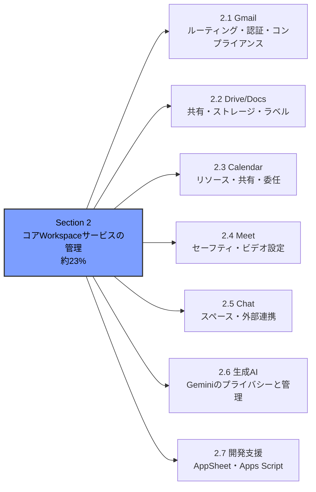

これらのタスクに共通する設計思想は、**Admin console上の「組織部門（OU）」または「設定グループ（Configuration Group）」を単位として、サービスごとに粒度の細かいポリシーを適用する**という一貫したモデルです。この構造を理解しておくことは、Section 2全体、さらには試験全体を通じて有効です。

---

## 2.1 Gmailの設定

### 2.1.1 MXレコードの設定

MXレコード（Mail Exchange record）は、ドメイン宛のメールをどのメールサーバーに配送するかを指定するDNSレコードです。Google Workspaceを利用するには、ドメインのMXレコードをGoogleのメールサーバーに向ける必要があります。

**2023年4月の仕様変更**として、Googleはそれまでの複数レコード構成（`ASPMX.L.GOOGLE.COM`などの5レコード、優先度違い）から、**単一のMXレコード`smtp.google.com`**に設定を簡素化しました。既存の複数レコード構成（レガシー値）は引き続きサポートされており、正常に機能している場合は変更不要です。新規セットアップでは単一レコード方式が推奨されます。

**設定手順の概要：**

1. ドメインレジストラ（お名前.com、Cloudflare、GoDaddyなど）のDNS管理画面にサインインする
2. 既存のMXレコードをすべて削除する（残存すると配送障害の原因になる）
3. 新しいMXレコードを追加する

| 項目 | 値 |
| --- | --- |
| Type | MX |
| Name / Host | 空欄または`@`（サブドメインの場合はサブドメイン名） |
| TTL | レジストラのデフォルト値、または`1`（3600秒/1時間を推奨するレジストラもある） |
| Priority | `1` |
| Value / Destination | `smtp.google.com`（レジストラによっては末尾にピリオドが必要：`smtp.google.com.`） |

4. 変更を保存する（DNS伝播に**最大72時間**かかる場合がある）
5. Admin consoleで「アカウント」→「ドメイン」→「ドメインを管理」→対象ドメインの「Gmailを有効にする」をクリックし、MXレコードの検証を行う（**ドメイン設定の管理者権限**が必要）

**トラブルシューティングのポイント：**

- ドメインの所有権確認（TXTレコードによるベリフィケーション）が完了しているか確認する
- レジストラごとのフォーマット差異（末尾ピリオドの有無など）を確認する
- [Admin Toolbox Dig](https://toolbox.googleapps.com/apps/dig/#MX/)を使って、実際にインターネット上に公開されているMXレコードを検証する
- レジストラのサポートに問い合わせる（レジストラが不明な場合はドメインレジストラの特定方法を参照）

**特殊なルーティングシナリオ：**

Gmailだけがメール処理を行うとは限らないケースがあります。

- **オンプレミスのメールハイジーン／ジャーナリング製品を前段に置く場合**：MXレコードはオンプレミスサービスを指し、そこからGoogle Workspaceへ配送する構成にする
- **ハイブリッドメール環境（一部ユーザーがGoogle Workspace、一部がオンプレミスのExchangeなど）**：MXレコードは通常どおり`smtp.google.com`のままにし、Admin console側でSplit Delivery（分割配信）を設定する

> **ベストプラクティス：** MXレコードを切り替える前に、必ず新しいGoogle Workspaceのユーザーアカウントを作成しておくこと。MXレコード切り替え前にアカウントが存在しないと、メールがバウンス（配送不能）する原因になる。

### 2.1.2 基本的なメールルーティングの設定

Google Workspaceには**Default routing**（デフォルトルーティング）と**Routing**（ルーティング）という2つの主要なルーティング設定があり、この2つの使い分けが試験でも実務でも頻出のポイントです。

| 設定 | 用途 | 優先度 |
| --- | --- | --- |
| **Default routing** | 組織全体、またはOU全体に対する既定のメール配送方法を設定する（例：組織のほぼ全メールを2つの受信箱に配送するデュアルデリバリー） | コンテンツ／添付ファイルコンプライアンス設定より**低い**優先度。最大1000件まで作成可能で、優先順位を並べ替え可能 |
| **Routing** | より特定条件に基づく高度な配送ルールを設定する。Default routingの挙動を上書きする用途にも使う（例：CEO宛メールのコピーをアシスタントにも送る） | Default routingより高い優先度 |

代表的なルーティングシナリオは以下の3つです。

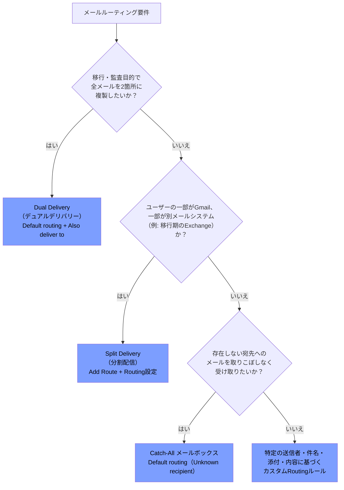

1. **デュアルデリバリー（Dual delivery）**：受信メッセージを2つ以上の受信箱に配送する。組織移行時の監査や、外部アーカイブシステムとの並行運用に利用される。Admin consoleでは「Gmail」→「Routing」（レガシーの「Email routing」設定は非推奨化され順次廃止予定）で設定し、「Also deliver to」で追加の宛先を指定する。
2. **分割配信（Split delivery）**：ドメイン内で一部のユーザーがGoogle Workspace、一部が別のメールシステムを使っている場合に、受信者に応じて配送先を分岐させる。事前に「Add Route」設定で非Gmailサーバーを追加しておく必要がある。Microsoft 365との共存移行（フェーズドマイグレーション）で特によく使われる。
3. **キャッチオールメールボックス（Catch-all mailbox）**：誤って宛先を間違えたメールや、存在しない宛先宛のメールを取りこぼさないように、Default routingで「Unknown recipient」に対する配送ルールを設定する。

**設定手順（共通）：** Admin console → 「アプリ」→「Google Workspace」→「Gmail」→「Routing」または「Default routing」→ 「設定」または「別のルールを追加」。変更の反映には最大24時間かかる（通常はより早く反映される）。

> **ベストプラクティス：** ルーティングルールのテストは、いきなり全社展開せず、まず特定のOUやテストユーザーに絞り込んで検証してから全社展開する（Googleの「より高速なルールのテストに関するベストプラクティス」を参照）。

### 2.1.3 コンテンツコンプライアンスルール

コンテンツコンプライアンス（Content compliance）は、メール本文や件名が特定の条件（キーワード、正規表現、事前定義された検出器）に一致した場合に、そのメッセージをどう処理するかを制御する高度なフィルタリング機能です。

**設定場所：** Admin console → 「アプリ」→「Google Workspace」→「Gmail」→「コンプライアンス」（**Gmail設定の管理者権限**が必要）

**主な用途：**

- 送信メール（Outbound）に「confidential」という単語が含まれる場合、配送を拒否する
- 特定のIPアドレス範囲からの受信メールを隔離（Quarantine）する
- 特定のテキストパターンに一致するメッセージを法務部門にルーティングする
- ホワイトリスト化（第三者フィッシングシミュレーションサービスなど）にも応用可能

**適用範囲の指定：** ルールは「Inbound（受信）」「Outbound（送信）」「Internal-sending／Internal-receiving（組織内送受信）」のいずれか、または組み合わせに適用できる。ここでの「内部（internal）」とは、検証済みのWorkspaceドメインまたはそのサブドメイン・親ドメインを指す。

**事前定義された検出器（Predefined content detectors）：** クレジットカード番号や社会保障番号、パスポート番号など、機密データを検出するために、正規表現を自前で書かなくても使える組み込みの検出器が用意されている。これらはキーワードや正規表現と組み合わせて、より高度なポリシーを構築できる。

**アタッチメントコンプライアンス（Attachment compliance）：** ファイルの種類・ファイル名・メッセージサイズに基づいてメッセージの扱いを指定する別設定。暗号化された添付ファイルの検出にも対応し、ファイル拡張子を偽装したファイルでも実際のファイル種別を検出できる。

> **重要な注意点：** コンテンツフィルタは正規表現やその他のパラメータに基づく確率的な一致判定であり、すべての機微情報や添付ファイルを100%検出できることを保証するものではない（誤検知・見逃しが発生し得る）。

複数のコンプライアンスルールを設定した場合、どのルールが優先されるかは条件と優先順位によって決まる（「How multiple settings affect message behavior」を参照）。

### 2.1.4 スパム・フィッシング・マルウェア対策

「Spam, Phishing and Malware」設定は、Gmailの標準的なスパム判定を補完・上書きするための管理者向けコントロールです。試験で問われる主要な要素は次の4つです。

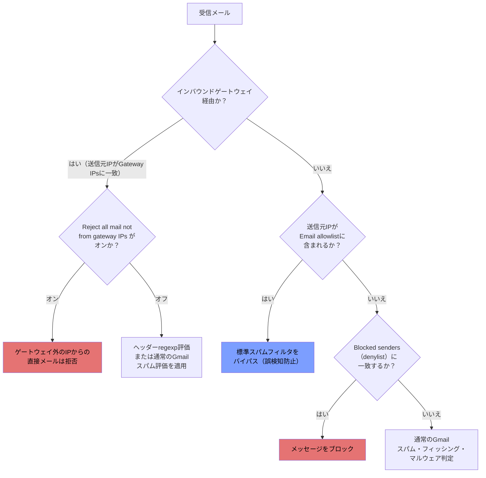

| 機能 | 説明 | 用途 |
| --- | --- | --- |
| **Email allowlist（許可リスト）** | 特定の送信元IPアドレスからのメールについて、Gmailの標準スパムフィルタを完全にバイパスする。**ドメイン全体に対してのみ設定可能で、OU単位では許可リストを設定できない** | 正規の一斉配信サービス（フィッシング訓練ツールなど）からのメールが誤ってスパム判定されるのを防ぐ |
| **Blocked senders（denylist）** | 特定のメールアドレスまたはドメインをブロックする | 既知の迷惑送信元を明示的に遮断する |
| **Inbound gateway（インバウンドゲートウェイ）** | 自組織にメールを中継する前段のメールサーバー（セキュリティゲートウェイなど）のIPアドレスを指定する。トップレベル組織でのみ設定可能で、全組織に適用される | オンプレミスのメールセキュリティ製品やサードパーティの一斉送信サービスを経由させる場合 |
| **IP allowlist（インバウンドゲートウェイ内）** | インバウンドゲートウェイ設定内で「Gateway IPs」として登録したIPからのメールを信頼する | ゲートウェイ経由のメールに対してGmail自体のスパム評価を無効化し、ヘッダー値のみで判定させることも可能（`Disable Gmail spam evaluation on mail from this gateway; only use header value`） |

**設定場所：** Admin console → 「アプリ」→「Google Workspace」→「Gmail」→「スパム、フィッシング、マルウェア」

> **ベストプラクティス：**
> - IPアドレスによる許可リストは、ドメイン全体に影響するため慎重に使用し、可能な限りコンテンツコンプライアンスルールやアドレスリストとの組み合わせでスコープを絞り込む
> - インバウンドゲートウェイを設定する場合、`Reject all mail not from gateway IPs`のチェックは、本当にそのゲートウェイ以外からの直接配信を完全に禁止したい場合のみ有効にする（誤設定すると正規メールが届かなくなるリスクがある）
> - 許可リストへの追加は「配送性を上げる」ための機能であり、フィッシング対策そのものを弱体化させる可能性があるため、追加するIPは信頼できる送信元に限定する

### 2.1.5 添付ファイルサイズ制限とブロックするファイル形式

コンプライアンス設定内の「Attachment compliance（添付ファイルコンプライアンス）」を使うと、ファイルの種類、ファイル名、メッセージサイズに基づいて、メッセージの扱い（拒否・隔離・変更など）を指定できます。

**制御できる主な観点：**

- 特定の拡張子（`.exe`、`.bat`など実行可能ファイル）を持つ添付ファイルの拒否
- ファイル名パターンによるフィルタリング
- メッセージ全体のサイズ上限に基づく制御
- アーカイブファイル（ZIPなど）**内部**のファイル名もスキャン対象にできる
- ファイル拡張子を偽装（リネーム）した悪意あるファイルも、実際のファイル種別を検出してブロックできる
- 暗号化された添付ファイルの検出（アーカイブサーバーへの非暗号化コピー送付などに活用）

> **ベストプラクティス：** 添付ファイルコンプライアンスルールは、コンテンツコンプライアンスルールと同様に複数設定できるが、複数ルールが競合した場合の優先順位（条件とルールの並び順）を必ず確認し、意図しないブロック・許可が発生しないようテストすること。

### 2.1.6 Gmail転送とPOP/IMAPアクセス

**自動転送（Automatic forwarding）：**

- エンドユーザーは自身のGmail設定（「Forwarding and POP/IMAP」タブ）から個人的な転送先アドレスを1つ設定できる。転送先には確認メールが送られ、受信者側でリンクをクリックして初めて有効化される
- 管理者は、ユーザーによる自動転送設定そのものを許可・禁止するコントロールを持つ（Admin console → Gmail → エンドユーザーアクセス）
- 組織レベルでより高度な転送・複製が必要な場合は、個人設定ではなく管理者によるRouting設定（アドレスマップによる転送、コンプライアンスルールと組み合わせた外部転送のブロックなど）を使う

**POP/IMAPアクセス：**

- 管理者はユーザーまたはOU単位でPOP・IMAPアクセスのオン・オフを制御できる（Admin console → Gmail → ユーザー設定 → 「POPとIMAPアクセス」）
- **2025年5月1日以降**、Google WorkspaceアカウントはOAuthを使用しないサードパーティアプリ・デバイスからのログイン（いわゆる「安全性の低いアプリ」）をサポートしなくなった。サードパーティのメールクライアントを使う場合はOAuth認証が必須
- OAuthクライアントIDを指定して、特定のクライアントのみに同期を限定するオプションもある（この場合、サービスアカウントによるドメイン全体の委任を使うクライアントはサポート対象外になる点に注意）

> **ベストプラクティス：** 外部への自動転送は情報漏えいのリスクがあるため、必要なOU以外では転送機能自体を無効化し、どうしても外部転送が必要な場合はコンテンツコンプライアンスルールで「外部への自動転送をブロックする」設定と組み合わせて多層防御にする。

### 2.1.7 Google推奨のメールセキュリティ対策（SPF・DKIM・DMARC）

SPF・DKIM・DMARCは、送信ドメイン認証（メールなりすまし対策）の三本柱であり、試験・実務の両面で最重要トピックの一つです。

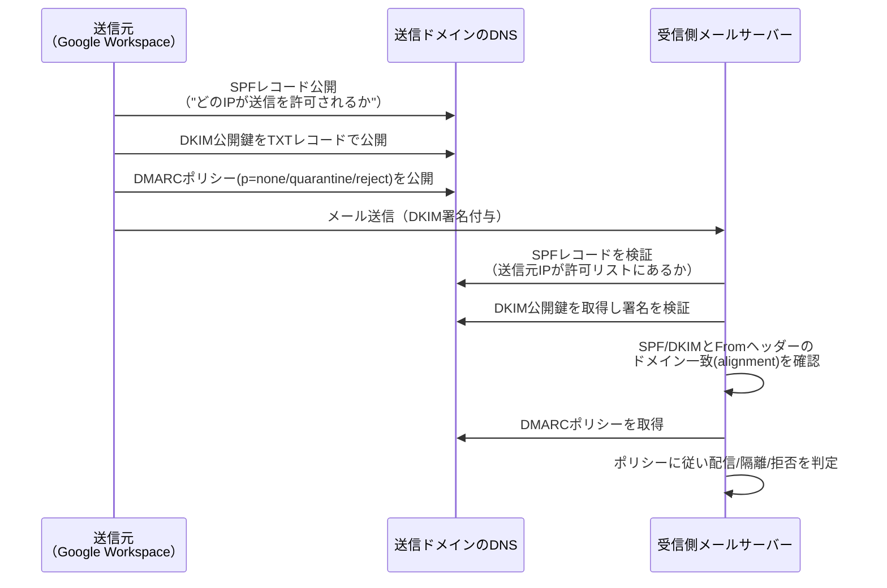

| 項目 | 役割 | Google Workspaceでの設定要点 |
| --- | --- | --- |
| **SPF**（Sender Policy Framework） | 「どのメールサーバーがこのドメインの代理で送信してよいか」をDNS TXTレコードで宣言する | `include:_spf.google.com`を含むSPFレコードをDNSに公開する。**1ドメインにつきSPFレコードは1つのみ**（複数ある場合はマージが必要）。反映まで最大48時間 |
| **DKIM**（DomainKeys Identified Mail） | メールに暗号署名を付与し、経路上での改ざんがないことと送信ドメインの真正性を証明する | Admin console →「Gmail」→「メールを認証」でDKIM鍵ペア（1024ビットまたは2048ビット）を生成し、公開鍵をTXTレコードとしてDNSに公開後、「認証を開始」をクリックして有効化する |
| **DMARC**（Domain-based Message Authentication, Reporting & Conformance） | SPF・DKIMの結果と`From:`ヘッダーのドメイン一致（アライメント）を基に、認証に失敗したメールをどう扱うか（`none`／`quarantine`／`reject`）をポリシーとして宣言し、レポートを受け取る | `_dmarc.yourdomain.com`にTXTレコードとしてDMARCポリシーを公開する。**まず`p=none`から開始**し、レポートを分析しながら段階的に`quarantine`→`reject`へ引き上げるロールアウトが推奨される |

**Googleの送信者ガイドライン（Email sender guidelines）：**

- すべての送信者：SPFまたはDKIMのいずれかの設定が必須
- 大量送信者（1日5,000通以上のメッセージをGmail宛に送信する場合）：**SPF・DKIM・DMARCすべての設定が必須**（2024年2月施行）

> **ベストプラクティス：**
> - SPF・DKIM・DMARCは単独ではなく**必ず三点セットで運用**する。DMARCはSPF/DKIMの検証結果を土台にしているため、土台なしでDMARCだけ設定しても効果が限定的
> - DMARCは`p=none`（モニタリングのみ）から始め、集計レポートで正規の送信元をすべて洗い出してから段階的に強制力を高める「Recommended DMARC rollout」に従う
> - SPFレコードは新しいメール配信サービスを追加・廃止するたびに更新し、使われなくなったドメイン・IPを削除して古いレコードを放置しない
> - 追加のブランド対策として、DMARCの上にBIMI（ブランドロゴのメール表示）の導入も検討できる

### 2.1.8 メールデータの移行

他のメールプロバイダやGoogle Workspaceの別アカウントからGmailへメールデータを移行するには、Googleが提供する複数の移行ツールを使い分けます。

| ツール | 用途 | アクセス場所 |
| --- | --- | --- |
| **新しいデータ移行サービス（Data migration, GA）** | Google Workspace同士、Gmail（個人アカウント）、IMAP対応メールサーバーからのメール移行。デルタ移行（差分同期）に対応し、既存データを重複させずに新着・更新分のみ取り込める | Admin console →「データ」→「データのインポートとエクスポート」→「データ移行」 |
| **データインポートツール（Data import）** | Microsoft Exchange Online、IMAPベースのWebメール（Yahoo!、iCloud Mail、GoDaddy、Zohoなど）、別のWorkspaceアカウント、個人のGmailアカウントからのインポート | Admin console →「データ」→「データのインポートとエクスポート」→「データインポート」 |
| **レガシーData Migration Service（DMS）app** | 従来型の移行アプリ。引き続き利用可能（`admin.google.com/ac/dms`） | Admin console内 |

**移行フローの要点（Gmailアカウントからの移行の例）：**

1. スーパー管理者としてサインインし、移行先のAdmin consoleで移行元アドレスを指定して「認証をリクエスト」する
2. 移行元アカウントの所有者が接続リクエストを承認する（自分自身が所有者であればAdmin console上で直接承認できる）
3. 承認後、移行を実行する
4. Advanced Protection Program（高度な保護機能プログラム）に登録済みのユーザーは、移行前・移行中は同プログラムを一時的にオフにする必要がある

> **ベストプラクティス：**
> - 大規模な移行では、まず少人数のパイロットグループで移行してから全社展開する
> - 移行完了後もデルタ移行（差分インポート）を実行し、初回移行後に追加・更新されたデータや、初回移行で失敗したデータを再取り込みする
> - Exchange OnlineやMicrosoft 365からの移行では、Data Importが「ドメイン全体の委任（Domain-wide delegation）」のAPIクライアントとして認証される点を踏まえ、事前にMicrosoft 365側でグローバル管理者権限を用意しておく

### 2.1.9 Gmailアクセスの委任

メールの委任（Mail delegation）を使うと、あるユーザー（アカウント所有者）が別のユーザー（委任先）に対して、自分の受信トレイの閲覧・送信・管理権限を付与できます。

**設定手順：**

1. Admin console →「アプリ」→「Google Workspace」→「Gmail」→「ユーザー設定」→「メールの委任」
2. 「ユーザーがメールボックスへのアクセスをドメイン内の他のユーザーに委任できるようにする」をオンにする
3. 委任者が送信したメールの送信者情報として、アカウント所有者・委任者のどちらのアドレスを受信者に表示するかを管理者が選択する
4. エンドユーザーに対し、個人単位・Googleグループ単位で委任先を追加できることを周知する

**押さえるべきポイント：**

- **Googleグループをアカウントの委任先として追加できる**（1つのグループは1人の委任者としてカウントされる）
- メールエイリアスはGoogleアカウントではないため、委任先として設定できない
- 委任先は受信トレイの閲覧・送信・返信・削除ができるが、パスワード変更やアカウント設定の変更はできない

**委任 vs 共有メールボックス（Collaborative Inbox）：** 1対1の代理対応（秘書によるメール代理管理など）には委任、複数人でチケットのように受信箱を分担管理する場合はGoogleグループのCollaborative Inbox機能が適している（Section 1のグループ管理も参照）。

### 2.1.10 コンプライアンスフッターとメール隔離（Quarantine）

**コンプライアンスフッター（Append footer）：** 法的な免責事項や社内ポリシーの通知など、定型のフッターテキストを送信メッセージに自動的に追加する機能。Admin console →「Gmail」→「コンプライアンス」→「フッターを追加」で設定する。

**メール隔離（Email quarantine）：** コンテンツコンプライアンスルールやDLPルールに一致したメッセージを、配信もブロックもせず一時的に「隔離エリア」に留め置き、管理者や指定ユーザーがレビューして解放・削除を判断できるようにする仕組み。

**Quarantineへのアクセス権付与のベストプラクティス：**

| オプション | 方法 | 用途 |
| --- | --- | --- |
| **オプション1：全隔離メッセージへのアクセスを付与** | `Access Admin Quarantine`権限を持つカスタム管理者ロールを作成し、ユーザーに割り当てる | 全社のセキュリティチームなど、すべての隔離メッセージを横断的にレビューする担当者向け |
| **オプション2：特定の隔離メッセージのみへのアクセスを付与** | `Access Restricted Quarantines`権限を持つカスタムロールを作成し、Googleグループと紐づけて、隔離設定作成時に該当グループへのアクセスを許可する | 例：個人情報や機密情報を含むメッセージのレビューをコンプライアンスチームに限定する場合 |

> **ベストプラクティス：** Quarantineへのアクセスはスーパー管理者に限定せず、必要最小限の権限を持つカスタムロールを作成して委任する（最小権限の原則）。全メッセージへの無制限アクセスを安易に多数の担当者へ配布しない。

---

## 2.2 Google DriveとDocsの設定

### 2.2.1 新規ファイルのデフォルト共有設定

Google Driveのファイル共有ポリシーの起点となるのが「General access default（全般的なアクセスのデフォルト設定）」です。Admin console →「アプリ」→「Google Workspace」→「Drive and Docs」→「共有設定」→「全般的なアクセスのデフォルト設定」から構成します（**Drive & Docs管理者権限**が必要）。

**既定の選択肢：**

- **Restricted（限定公開）**：ファイルはオーナーのみアクセス可能で、ユーザーが明示的に共有するまで非公開。**Googleが多くのユーザーに推奨する既定値**であり、ユーザーが準備できたときにだけ共有し、個人ファイルは非公開のままにできる
- **your organization（組織全体）**：組織内の全ユーザーがアクセス可能

さらに「ターゲットオーディエンス（後述2.2.4）」を作成することで、この2択に加えて任意のカスタムオーディエンス（例：特定部門、Employees Onlyなど）を選択肢に追加できます。

**内部共有 vs 外部共有：** Google WorkspaceのAdmin consoleには「内部共有」を直接制限する専用トグルは存在せず、内部共有の制御は主に「全般的なアクセスのデフォルト設定」と「ターゲットオーディエンス」の組み合わせで実現します。一方、「外部共有」については専用の制御群（2.2.3参照）が用意されています。

> **ベストプラクティス：** 一般ユーザー向けには`Restricted`をデフォルトにし、ターゲットオーディエンスで「Employees Only」のようなオーディエンスを作成した上でこれを優先（プライマリ）オーディエンスに設定することで、ユーザーが誤って外部ベンダーなどに広く共有してしまうリスクを下げる。

### 2.2.2 Drive信頼ルール（Trust Rules）

Trust Rulesは、外部ドメイン・特定の組織部門（OU）・特定のグループ・特定のユーザーを基準に、Driveファイルの共有を**許可**（Allow）・**拒否**（Deny）・**警告表示**（Warn）という形で制御するルールベースの新しい制御フレームワークです。従来の「Drive共有設定」（外部共有のオン・オフ、信頼済みドメインの許可リスト）を置き換えるものとして提供されています。

**Trust Rulesが有効なユースケース：**

- 財務部門が所有するファイルを、社内の他部署とは共有できないようにブロックする
- 契約関係のある特定の外部ドメインとのみ共有を許可する
- 外部ユーザーからのスパム・フィッシングファイル共有を防ぐため、通常は外部との共有が発生しないOUに対して「信頼できるドメインの外部ユーザーのみ共有を許可する」ルールを適用する
- 一時プロジェクトにおいて、一定期間後に外部コラボレーターのアクセスを自動的に失効させる

**既存のDrive共有設定との関係：** Trust Rulesを有効化すると、既存の「組織外との共有」設定は自動的にTrust Rulesへ変換される（プレビュー可能）。Trust Rulesを有効化した時点で、対応するDrive共有設定は無効になる（Trust Rulesはいつでもオフに戻し、従来のDrive共有設定に戻すことも可能）。

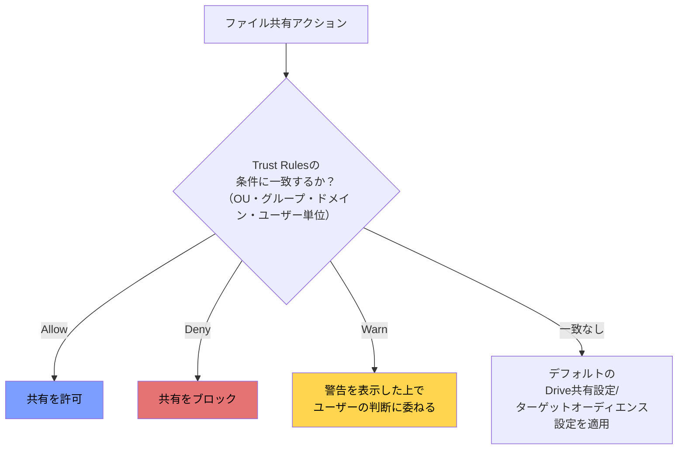

**いつTrust Rulesを使うべきか（試験ポイント）：** 「Identifying when Drive trust rules should be used」という出題観点に対応する判断基準は、**単純な組織全体のオン・オフでは表現できない、部門・グループ・ドメイン単位できめ細かい共有制御が必要な場合**にTrust Rulesを選択する、という点です。

### 2.2.3 組織ポリシーに基づく外部共有の制限

外部共有の制御はAdmin console →「Drive and Docs」→「共有設定」に集約されており、主な制御レバーは次の通りです。

| 制御 | 説明 |
| --- | --- |
| **オン／オフ／制限** | 外部共有を全面許可、全面禁止、または特定条件下でのみ許可に設定する（全面禁止は高セキュリティ環境以外では稀） |
| **信頼済み（許可リスト）ドメイン** | 全面許可・全面禁止の二択ではなく、パートナー企業など特定ドメインとの共有のみを許可し、それ以外をブロックする |
| **ターゲットオーディエンス** | 「組織内全員」のような推奨共有先を提示し、ユーザーが安易に「リンクを知っている全員」を選択しないよう誘導する |
| **外部共有時の警告** | 組織外への共有を行おうとした際にDriveが警告を表示し、意図しない外部共有（ヒューマンエラー）に気づかせる |

**Visitor Sharing（訪問者共有）：** Googleアカウントを持たない外部ユーザー（非Google利用者）に対して、確認コードベースでファイルへの一時アクセスを許可する機能。外部共有を厳格に制限しつつ、特定の非Google利用者とだけ安全に共有したい場合に利用する。

> **ベストプラクティス（外部共有の5層防御モデル）：**
> 1. 信頼済み外部ドメイン（契約関係のあるパートナー・ベンダー）を許可リスト化する
> 2. ターゲットオーディエンスと組み合わせ、ワンクリックで定義済みの外部グループに共有できるようにする
> 3. 信頼済みドメインだからといって無制限アクセスにはならない点に留意する（信頼はあくまで摩擦を減らすためのものであり、権限レベルはファイルオーナーが個別に付与する）
> 4. 高リスク部門（法務・財務など）はTrust Rulesで外部共有を個別にブロックする
> 5. Security CenterでDrive/Gmailの共有アクティビティを継続的に監視し、ポリシー違反のアラートを設定する

### 2.2.4 ターゲットオーディエンスの管理

ターゲットオーディエンス（Target audiences）は、共有ダイアログでユーザーに提示される「推奨共有先」のリストであり、Drive/Docs・Chatサービスで利用できます（対応エディションはFrontline Plus、Business Plus、Enterprise Standard/Plus、Education Standard/Plusなど）。

**展開のベストプラクティス（Googleの公式推奨手順）：**

1. **すべての正社員を含む「Employees Only」オーディエンスを作成する**：ダイナミックグループ（対応エディションの場合）または全社員を含む既存グループを使う
2. **組織の全ユーザーを含む「Employees and Vendors」等のオーディエンスも作成する**：全ユーザーを含むグループを作成して追加する
3. **ターゲットオーディエンス向けのDrive/Docs共有ポリシーを作成する**：全社、または特定OU・設定グループに適用する
4. **「Employees Only」をプライマリ（優先）オーディエンスに設定する**：優先オーディエンスをドラッグ操作で最上位に配置することで、ユーザーが誤ってベンダーを含む広いオーディエンスと共有するのを防ぎやすくなる

**設定場所：** Admin console →「Drive and Docs」→「共有設定」→「ターゲットオーディエンス」

> **注意点：** ターゲットオーディエンスの構成グループとして、ダイナミックグループ（Dynamic groups）を組み合わせると、入退社に応じてメンバーが自動的に更新されるため、手動メンテナンスの負荷を大幅に減らせる（Section 1のグループ管理を参照）。

### 2.2.5 カスタムDocsテンプレートの設定

組織独自のブランドを反映したテンプレート（Docs、Sheets、Slides、Forms、Sitesなど）をテンプレートギャラリーに追加できます。

**設定手順：**

1. Admin console →「Drive and Docs」→「テンプレート」→「テンプレートギャラリーの設定」
2. 「組織のカスタムテンプレートを有効にする」にチェックを入れて保存する
3. （任意）カテゴリを追加する：例）マーケティング、営業、人事などのチーム別カテゴリ
4. テンプレート送信の承認ポリシーを設定する：

| 送信モード | 説明 |
| --- | --- |
| **Open（オープン）** | 組織内の誰でも承認なしにテンプレートを追加・削除できる |
| **Moderated（モデレート）** | Docs Templates権限を持つ管理者に新規テンプレート追加のメール承認リクエストが届く。いずれかの管理者が応答すると完了。承認されたテンプレートはカスタムギャラリーに追加され、却下された場合は再提出できる |
| **Restricted（制限）** | Docs Templates権限を持つ管理者のみがテンプレートを追加できる |

**関連する管理者権限：** 「Docs Templates」権限を持つ管理者は、テンプレートギャラリー内のテンプレートの削除・カテゴリ分けができ、モデレート方式の場合はテンプレート送信の承認・却下も行える。

> **ベストプラクティス：** ブランドガイドラインが厳格な組織ではRestrictedを選び、少人数のデザイン・広報チームのみがテンプレートを管理する体制にする。全社的なテンプレート活用を促進したい組織ではModeratedを使い、品質管理をしながら現場からの提案も取り入れる。

### 2.2.6 共有ドライブの作成と管理

共有ドライブ（Shared drives）は、特定の個人ではなくチーム・部門が所有者となるファイルストレージ空間で、メンバーの退職・異動があってもファイルが失われない点がマイドライブ（My Drive）との大きな違いです。

**共有ドライブの作成許可：** Admin console →「Drive and Docs」→「共有設定」→「共有ドライブの作成」で、組織全体または一部のユーザーにのみ共有ドライブの作成を許可できる。作成を許可しないユーザーであっても、他者が作成した共有ドライブに追加されて利用することは可能。

**OUへの割り当てとポリシーの継承：** 既定では、トップレベル組織部門で設定したポリシーがすべての共有ドライブに適用される。共有ドライブを子OUに割り当てることで、そのOU固有のポリシー（データ共有・セキュリティ・ストレージ）を個別に適用できる。既定でどのOUに共有ドライブが作成されるかも設定可能。

**ストレージ容量の管理：**

- 既定の共有ドライブ容量上限は**100GB**
- Admin console →「ストレージ」→「ストレージ設定を管理」→対象OUを選択→「共有ドライブのストレージ上限」で、OUごとに異なる上限を設定できる
- プロジェクト単位で一時的により多くのストレージが必要なユーザー向けに、設定グループ（Configuration group）を作成し、そのグループのメンバーをOUのストレージ上限から除外することも可能

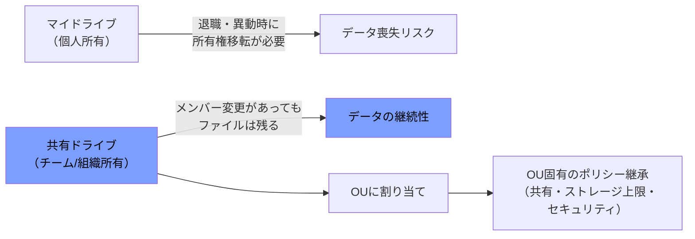

> **ベストプラクティス：** 部門・プロジェクト単位の永続的なファイル資産（契約書、会計資料、進行中プロジェクトの成果物）は個人のマイドライブではなく共有ドライブに保存する運用を徹底し、退職者データ喪失リスクを構造的に排除する。ストレージ使用状況は「ストレージ設定」画面から定期的にレビューし、上位使用者・共有ドライブを把握する。

### 2.2.7 ストレージ容量の設定と調整

Google Workspaceのストレージは、Drive・Gmail・Google Photosで共有される「プールドストレージ（Pooled storage）」というモデルを採用しています。ライセンスごとに割り当てられたストレージが組織全体のプールに加算され、個々のユーザーはライセンス割り当て量を超えて利用することも可能です（プール全体に余裕がある限り）。

**ユーザー単位のストレージ上限設定：** Admin console →「ストレージ」→「ストレージ設定を管理」からOU単位でストレージ上限を設定できる。ユーザーが「ストレージ容量不足」の通知を受け取った場合、多くのケースでサポートに連絡する必要はなく、Admin console側でストレージ上限の設定を見直すことで解決する。

**モニタリングツール：** ストレージ管理ツールでは、以下が確認できる：

- 製品別（Drive、Gmailなど）のストレージ使用量
- 組織内でストレージを最も使用しているユーザーの一覧
- ストレージを最も使用している共有ドライブの一覧
- ストレージ上限に近づいている警告

> **ベストプラクティス：** ストレージポリシーを変更・強制する際は、事前にユーザーへポリシー変更の通知テンプレートを用いて周知し、不要なファイルの削除を促してから上限を適用する。バックアップ・アーカイブ用途でのDrive利用は推奨されておらず（Google Workspaceはリアルタイムコラボレーションと共有に最適化されている）、大容量アーカイブには別のストレージソリューションを案内する。

### 2.2.8 Google Drive for desktopの許可・禁止

Drive for desktop（旧Drive File Stream / Backup and Sync）は、ローカルコンピュータ上でGoogle Driveのファイルをストリーミング形式で利用可能にするデスクトップクライアントです。管理者はAdmin console →「Drive and Docs」→「機能とアプリケーション」から、組織またはOU単位で許可・禁止を制御できます。

**関連設定：**

- **Drive SDK**：Drive SDK APIを介したユーザーのDriveアクセスを許可するか
- **アドオン**：Docsのアドオンストア経由でのアドオンインストールを許可するか
- **ランサムウェア検出と復元**（Drive for desktop向け）：Drive for desktop環境でのランサムウェア検出・復元機能を有効化できる

> **ベストプラクティス：** マネージドデバイスにはDrive for desktopの配布・自動更新ポリシーを適用し（Google Workspace Updatesの管理）、BYOD（私物端末）環境では組織のセキュリティポリシーに応じて許可の可否を判断する。ファイアウォール・プロキシ環境がある場合は、Drive/Sitesのファイアウォール要件を事前に確認しておく。

### 2.2.9 ファイル・フォルダの所有権移転

ユーザーの退職や異動の際、そのユーザーが所有していたDriveファイルの所有権を別のユーザーへ移転できます。

**設定手順：**

1. Admin console →「Drive and Docs」→「所有権の移転」を開く
2. 移転元ユーザー（現在の所有者）と移転先ユーザー（新しい所有者）を指定する
3. 移転を実行する

**必要な管理者権限：** 「Drive & Docsサービスの設定」権限、「データ移行（Data Transfer）」権限、「ユーザー：読み取り専用」権限の3つが必要（Admin consoleでの「所有権の移転」設定へのアクセスには加えて「Driveサービス」権限も必要）。この権限セットはOU単位に限定できない（組織全体に適用される）。

**移転後の挙動：** 所有権移転後、元の所有者にはそのファイルへの編集権限が付与された状態が維持される（元所有者が削除されたり、編集権限を明示的に外されたりしない限り、引き続きアクセス可能）。

> **試験・実務でのポイント：** ユーザーを削除する前に必ず所有権移転を実施することが重要である。これはユーザー作成者が去った後もチームの重要データを失わないための基本的な運用手順であり、Section 1の「アカウントの削除・保留・アーカイブ」（1.1）とも密接に関連する。

### 2.2.10 Driveラベルの管理

Driveラベル（Classification labels）は、ファイルにメタデータ（機密度、承認ステータス、期限など）を付与し、検索性の向上、ポリシーの自動適用、DLPとの連携を可能にする分類機能です（Gmailメッセージへのラベル付けはベータ機能として提供）。

**ラベルの作成：** Admin console →「セキュリティ」→「アクセスとデータ管理」→「ラベルマネージャ」（**Manage Classification Labels管理者権限**が必要）。1組織で最大**150個**のラベル（バッジ付きラベルを含む）を作成可能。

**自動適用の3つの方法：**

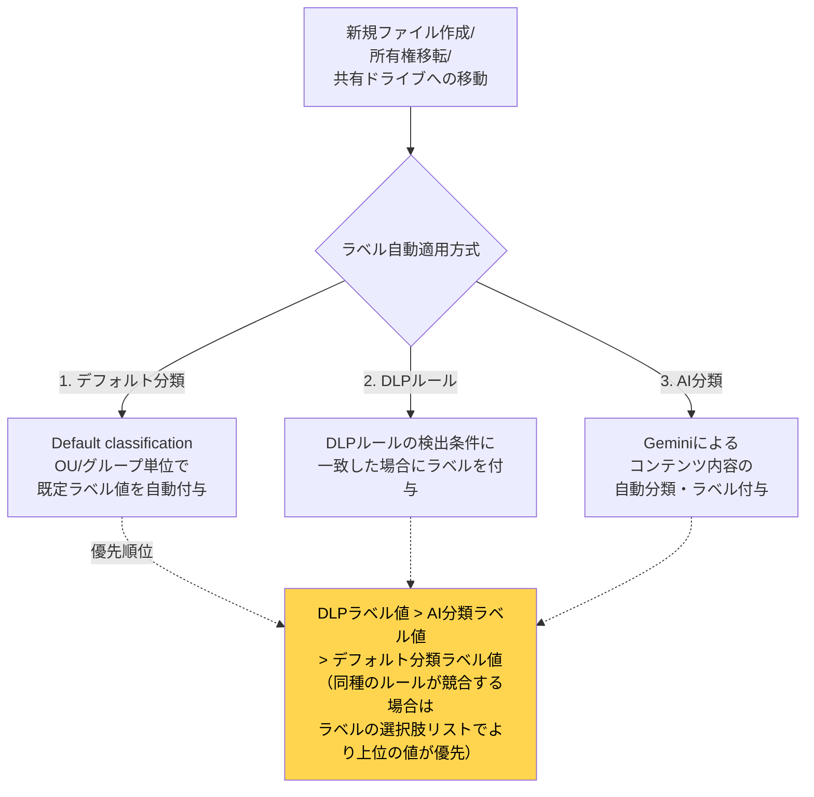

**ロックの概念：** デフォルト分類、DLP、Vault保持ルールのいずれかでラベルが参照されると、そのラベルはラベルマネージャ内で「ロック」され、編集・無効化・削除ができなくなる（ビジネスポリシーを壊すような変更を防止するため）。ロックを解除するには、すべてのデフォルト分類ポリシーからそのラベルを削除する必要がある。

**閲覧・適用権限：** ラベルの閲覧・適用にはファイルへの閲覧権限に加え、ラベル自体への閲覧権限が必要。管理者は「レポート」権限があれば、ラベルマネージャ権限がなくてもDriveのレポート・監査でラベル情報を確認できる。

> **ベストプラクティス：** ラベル名・フィールド名・選択肢に機密情報そのものを含めない（ラベルマネージャの閲覧権限を持つ全管理者に見えてしまうため）。ユーザーにラベル入力を促す場合は「必須フィールド」設定を活用し、未入力時にバナー表示で入力を促す（ただし必須フィールド未入力でも共有・編集自体はブロックされない点に注意）。

### 2.2.11 オフラインアクセスの有効化・無効化

オフラインアクセスは、インターネット接続がない状態でもDocs・Sheets・Slidesを作成・編集できるようにする機能です。既定では組織全体でオンになっており、ユーザーは自分のアカウントで個別にオン・オフを切り替えられます。

**制御オプション（Admin console →「Drive and Docs」→「機能とアプリケーション」→「オフライン」）：**

| オプション | 説明 |
| --- | --- |
| **全ユーザーにオフラインアクセスを許可（推奨）** | 最も簡便な方法。ユーザーは自分の端末・信頼する端末でオフラインアクセスを有効化できる |
| **デバイスポリシーでオフラインアクセスを制御** | マネージドデバイスにポリシーを導入して制御する。**ポリシーを導入しないままこのオプションを選ぶと、以前オフラインアクセスできていたユーザーが24時間後にアクセスできなくなる**点に要注意 |

**適用範囲の限界：** この設定はChrome・Microsoft Edgeブラウザ上でのDocs/Sheets/Slidesのオフライン利用に対するものであり、**Google Drive for desktopには適用されない**（Drive for desktopのオフラインファイル利用は別の仕組み）。

> **ベストプラクティス：** 機密情報や社外秘ファイルを扱うユーザー（役員、法務、人事など）に対しては、端末紛失時の情報漏えいリスクを踏まえてオフラインアクセスを無効化することを検討する。それ以外の一般ユーザーには利便性を優先してオンのままにするのが一般的な運用。

---

## 2.3 Google Calendarの設定

### 2.3.1 リソースカレンダーの作成と管理

リソースカレンダー（会議室、車両、機材など）の設定は、Section 1で扱う「建物とリソース管理」（1.5）の実務基盤の上に成り立っています。ここではCalendarサービスの観点から、リソースの予約・共有をどう運用するかを扱います。

**基本構造：**

1. **建物（Buildings）** をまず作成する（最大10,000棟／ドメイン）
2. 建物に **フロア（Floors）** を定義する
3. **機能（Features）**（プロジェクター、ホワイトボード、車椅子対応など）を最大100個まで作成する
4. **リソース（Resources）**（会議室 = Conference room、それ以外 = Other）を最大10,000件まで作成し、建物・フロア・機能と紐づける

**設定場所：** Admin console →「ディレクトリ」→「建物とリソース」→「概要」（**建物とリソースの管理者権限**が必要）。CSVによる一括アップロードやAPI（`resources.buildings`、`resources.features`、`resources.calendars`）による一括更新にも対応。

**Enterprise Plus / Assured Controls限定機能：** リソースを特定の組織部門（OU）に割り当てることで、そのリソースカレンダーのイベントデータが当該OUのデータリージョンポリシーなどのデータポリシーを継承するようにできる（リソースのメタデータ自体はルート組織のポリシーに従う）。

> **ベストプラクティス：** リソース名には「建物-フロア-フロアセクション-リソース名（収容人数）[機能]」形式の自動生成命名規則を活用し、ユーザーが予約画面で場所と設備を一目で判断できるようにする。

### 2.3.2 リソースの予約ポリシーの設定

リソース予約の承認フローには、大きく分けて「自動承認」と「リソースマネージャーによる手動承認」の2パターンがあります。

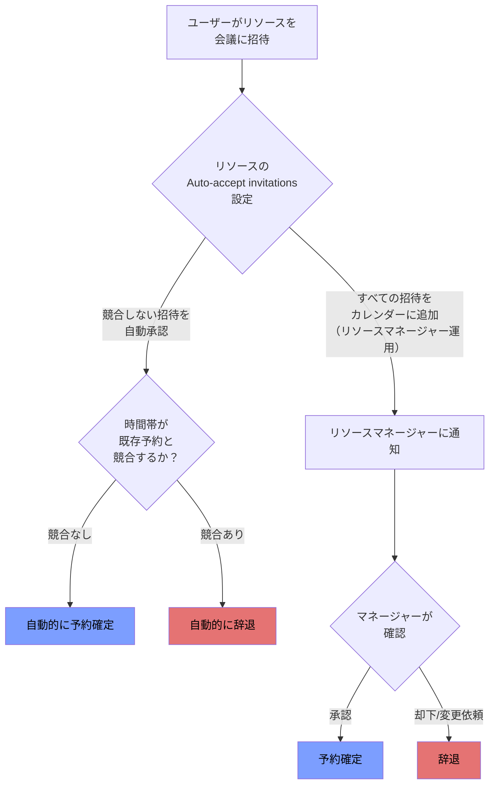

**リソースマネージャー方式の設定手順：**

1. スーパー管理者権限を持つ管理者としてGoogleカレンダーにサインインする
2. リソースを組織全体、または特定の人に共有する
3. リソースマネージャーとなるユーザーにもリソースを共有し、「変更を加える権限」および「共有を管理する権限」を付与する
4. リソースの「カレンダーの詳細」タブで、Auto-accept invitationsを「すべての招待を自動的にこのカレンダーに追加する」に設定する
5. リソースマネージャーはリソース通知を受け取る設定を行い、招待が入るたびに承認・辞退・仮承諾を判断する

**Free/Busy共有リソースの予約許可：** リソースが「Free/busyのみ表示」で共有されている場合、既定ではユーザーはそのリソースを予約できる。管理者はAdmin console →「Calendar」→「全般設定」→「リソースの予約権限」で、「See only free/busyとして共有されているリソースの予約をユーザーに許可する」のチェックを制御できる（機密性の高いイベント情報を隠しつつ予約自体は可能にする、という使い分けができる）。スーパー管理者は、この設定に関わらず常に全リソースを予約できる。

> **ベストプラクティス：** 高需要の会議室（大会議室、役員会議室など）はリソースマネージャーによる手動承認にし、稼働状況をコントロールする。一般的な小会議室・電話ブースは自動承認にして、従業員の摩擦を減らす。

### 2.3.3 カレンダー・リソースアクセスの委任

カレンダーの委任は、Gmailのメール委任（2.1.9）と対になる概念で、管理職のカレンダー管理をアシスタントに任せるようなシナリオで利用されます。

**設定方法：** カレンダー所有者がGoogleカレンダーの「設定と共有」からカレンダーを特定のユーザーに共有し、「予定の変更」権限を付与することで、事実上の委任が成立する（Gmailのメール委任のような専用の「委任」ボタンではなく、共有権限の付与という形で実現される点に注意）。

**Google Workspace Sync for Microsoft Outlook（GWSMO）を利用する場合：** Outlookからカレンダー・メールの委任機能を使いたい場合は、まずGoogleカレンダー側で共有設定を行った上で、委任先ユーザーが自分のOutlookプロファイルに委任元のGoogle Workspaceアカウントを追加する、という手順を踏む。委任先は委任元のパスワード変更や他のアカウント設定変更はできない。

**建物・リソースの管理権限としての「委任」：** リソースカレンダーについては、前述のリソースマネージャー方式が実質的な「委任」の役割を果たす。

> **試験ポイント：** 「カレンダーとリソースへのアクセスを別のユーザーに委任する」という出題観点は、(1) 個人カレンダーの委任＝共有権限の付与、(2) リソースカレンダーの委任＝リソースマネージャー設定、という2つの異なるメカニズムを区別して理解しているかを問うている。

### 2.3.4 プライマリ・セカンダリカレンダーのデフォルト内部共有設定

Admin console →「Calendar」→「共有設定」で、組織内でカレンダーがどの程度共有されるかの既定値を設定できます。OU単位で異なるポリシーを適用でき、たとえば学校・教育機関ではより制限的な設定にし、一般企業ではよりオープンな設定にするといった使い分けが可能です。

**内部共有の一般的な選択肢（制限が緩い順）：**

- 予定の詳細をすべて共有する（Share all information）
- 空き時間・予定ありのみ共有する（Free/busy情報のみ、時間帯は見えるが内容は見えない）
- 共有しない（デフォルトでは他ユーザーから見えない）

**OU間の共有制限：** 部門間・学生グループ間でのカレンダー共有によるプライバシー・情報漏えいリスクを軽減するために、OUごとに「内部共有オプション（プライマリカレンダー用）」をより制限的な値に設定できる。合わせて「外部共有オプション」も無効化することで、OU単位での多層防御が可能。

> **ベストプラクティス：** 役員・人事・法務など機密性の高い予定を扱う部門は、内部共有のデフォルトを「Free/busyのみ」以下に制限し、一般部門はコラボレーションを促進するためより開かれた設定にする、というOUベースの階層化ポリシーを設計する。

### 2.3.5 チーム・グループ向け共有カレンダーの設定

チームやプロジェクト単位で共有するグループカレンダー（Secondary calendar）を作成・共有することで、個人のプライマリカレンダーとは別に、チーム全体のイベント（休暇予定、チーム定例、プロジェクトマイルストーンなど）を一元管理できます。

**作成の流れ（概要）：**

1. 管理者またはカレンダー作成権限を持つユーザーがセカンダリカレンダーを新規作成する
2. 対象チーム・グループに対して適切なアクセスレベル（閲覧のみ／予定の変更／管理権限）で共有する
3. 必要に応じてGoogleグループのメンバー全体に一括共有する（Section 1「グループのすべてのユーザーへの追加」参照）

**「マイカレンダー」に他ユーザーのカレンダーが表示される理由：** 管理者が明示的にユーザーへ共有した、あるいはユーザー自身が「マイカレンダー」欄に追加したカレンダー（他ユーザーのカレンダーやリソースカレンダーなど）は、そのユーザーのカレンダー一覧に表示され続ける。これは共有設定に起因する正常な挙動であり、トラブルシューティングの際にユーザーからの問い合わせの原因になりやすいポイントである。

> **ベストプラクティス：** チームカレンダーの命名規則（例：`[チーム名] Team Calendar`）を統一し、検索・識別性を高める。カレンダーの「管理権限」を持つメンバーは最小限に絞り、誤削除・誤設定変更のリスクを抑える。

### 2.3.6 カレンダーの外部共有オプションの管理

組織外のユーザーとカレンダーを共有する範囲も、Admin console →「Calendar」→「共有設定」の「外部共有オプション」でOU単位に制御します。

**外部共有制限の効果：** 組織の外部共有を制限すると、ユーザーは個々のイベント単位でその制限を超えた共有はできなくなる（例：組織レベルでFree/busyのみに制限していれば、個別のイベントでそれ以上の詳細を外部共有することはできない）。

**外部ゲスト招待時の確認プロンプト：** ユーザーが組織外のゲストを含むイベントを作成すると、既定では「本当に組織外のゲストを含めてよいか」の確認プロンプトが表示される。Admin console →「Calendar」→「共有設定」→「外部での招待」で、このプロンプトの表示・非表示をOU単位で切り替えられる（例：日常的に外部顧客とやり取りする営業部門はプロンプトを無効化し、それ以外の部門は有効のままにする）。

> **ベストプラクティス：** 外部共有オプションは、Drive/Docsの外部共有制御（2.2.3）と一貫したポリシー思想（信頼できる相手とのコラボレーションは円滑に、それ以外は摩擦を残す）で設計し、部門ごとに整合性を持たせる。

### 2.3.7 イベント所有権の移転

イベントの主催者（オーナー）が退職・異動する際、そのユーザーが作成したイベントの所有権を別のユーザーに移す必要があります。

**エンドユーザー操作（イベント単位）：** Googleカレンダーで自分がオーナーであるイベントを開き、「その他のオプション」→「オーナーの変更」から新しいオーナーのメールアドレスを入力する。

**管理者によるユーザー削除前の一括対応：** ユーザーを削除する前に、そのユーザーが所有するイベントおよびセカンダリカレンダーを取り消すか、他のユーザーに移管する必要がある（「ユーザーを削除する前にイベントやセカンダリカレンダーをキャンセル・移管する」手順）。対応しないまま削除すると、他の参加者のカレンダー上でイベントが不正な状態のまま残る可能性がある。

> **試験ポイント：** Drive/Docsのファイル所有権移転（2.2.9）と同様に、「ユーザー削除の**前に**所有物の移転・整理を行う」という運用順序が、Calendar・Drive双方で共通する重要な原則である。

### 2.3.8 不明な送信者からの招待の防止

見知らぬ送信者からのスパム的なカレンダー招待は、ユーザーのカレンダーを埋め尽くし、フィッシングの温床にもなり得るため、Google Workspaceには専用の対策が用意されています。

**組織レベルの制御（管理者）：** Admin console →「Calendar」→「共有設定」→「外部での招待」で、「送信者とやり取りしたことがある招待のみを表示する」オプションを選択する。この設定を有効にすると、ユーザーが既に何らかの形でやり取りしたことのある送信者（連絡先に登録済み、Gmailでやり取り済み、同一Workspaceドメインなど）からの招待のみが自動的にカレンダーに追加され、それ以外の招待はカレンダーに自動追加されなくなる。

**ユーザーレベルの制御：** ユーザー個人でも、Googleカレンダーの設定→「予定の設定」→「マイカレンダーへの招待の追加」で「送信元が判明している場合のみ」を選択できる。判定基準は、送信者が連絡先に登録されている、Gmailでメールをやり取りしたことがある、同一Workspaceドメインに所属している、のいずれかを満たす場合。

**スパム招待への対応で避けるべき行動：** 不審な招待に対して「欠席」を含むいかなる返信（欠席・出席・未定・コメント付き返信）も行わないことが推奨される。返信すると招待元（スパム送信者）に「このアドレスは有効で監視されている」という情報を与えてしまい、標的として狙われやすくなる。安全な対応は「スパムとして報告」「返信せず削除」、またはそのまま無視することのみ。

> **ベストプラクティス：** この設定を全社的に有効化した場合でも、既にカレンダーに登録されてしまった過去のスパムイベントは自動削除されないため、ユーザー自身での手動クリーンアップが必要になる点をヘルプデスク対応時に案内しておく。法務・金融など標的型攻撃のリスクが高い部門では、Gmailの外部送信者警告設定（2.1章）と組み合わせて多層的に対策する。

---

## 2.4 Google Meetの設定

### 2.4.1 組織・OU単位でのMeetの有効化・無効化

Google Meetのサービス自体のオン・オフは、他のWorkspaceサービスと同様に、Admin console →「アプリ」→「Google Workspace」→「Google Meet」から、組織全体または特定のOU・設定グループ単位で制御します（**Service Settings管理者権限**が必要）。

**基本的な考え方：** サービスをオフにしたユーザーは、既存の会議への参加や新規会議の開催ができなくなる。段階的な展開（パイロット部門から先行導入し、順次全社展開する）を行う場合は、OUまたは設定グループを使って対象範囲を絞り込む。

> **ベストプラクティス：** 大規模組織や大人数の会議（全社集会、ウェビナー等）を予定している場合は、事前に「大規模組織向けのGoogle Meetセットアップ」ガイドに従い、ネットワーク要件の事前確認・会議スペースの設計・サポート体制の準備を行う。

### 2.4.2 Meetセーフティ設定の構成

Meetのセーフティ設定は、会議中の不正参加・荒らし行為（Zoombombing的な被害）を防ぐための中核的な管理機能です。中心となる概念が **Host Management（ホスト管理）** です。

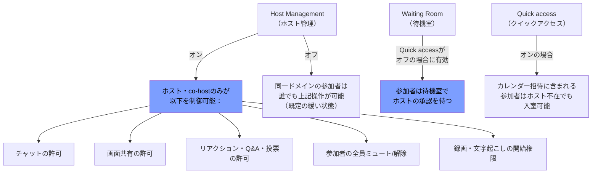

| 設定 | 概要 | 既定値 |
| --- | --- | --- |
| **Host Management** | ホスト・co-hostに会議内コントロール（チャット、画面共有、ミュート、録画・文字起こし開始権限など）を集約させる機能。オフの場合、ドメイン内の参加者は誰でもこれらの操作が可能 | Business系エディションは**既定でオフ**、Education系・Frontlineは**既定でオン**（管理者がAdmin console上のデフォルト状態を変更可能） |
| **Waiting Room（待機室）** | 参加者を待機室に留め、ホストが個別に入室を許可する。ホストは待機中の参加者にメッセージを送ったり、会議添付資料などの情報を共有したりできる | Quick accessがオフの場合に事実上の待機室として機能する |
| **Quick access** | カレンダー招待に事前に含まれている参加者、または既に会議に参加している組織内メンバーから招待された参加者は、ホスト不在でも入室できる | Google Workspace全顧客・レガシーG Suite Basic/Business顧客で既定オン |
| **外部参加者への追加の予防措置** | 外部参加者が「リクエストなしで」参加できるのは、(a) 会議開始前のカレンダー招待に含まれている、または(b) 既に会議に参加している組織内メンバーから招待された場合で、かつ(c) 予定開始時刻の前後15分以内、のいずれかを満たす場合のみ | 常時適用される仕様 |

**設定場所：** Admin console →「Google Meet」→「Meetセーフティ設定」

**その他のセキュリティ・プライバシー機能：**

- **会議コード**：長く推測困難なコード体系で不正アクセスを防止
- **電話でのダイヤルイン**：電話番号とPINは、予定されている会議時間内のみ有効
- **SAML SSOによる追加認証**：全エディションでSAMLベースのシングルサインオンに対応
- **監査ログ**：Admin console上でMeetの監査ログを確認可能
- **アクセス透過性（Access Transparency）**：管理者がMeet録画にアクセスするたびにログとその理由を記録
- **データリージョン**：録画データをGoogle Driveに保存する地理的リージョン（米国・欧州など）を指定可能

> **ベストプラクティス：** 外部参加者を含む機密性の高い会議（人事面談、取締役会など）では、Host Managementを明示的にオンにし、待機室を併用する。全社集会・ウェビナーのような大規模会議では、Quick accessをオンにしたままHost Managementでチャット・画面共有権限のみを制限する、といった使い分けが実務的。

### 2.4.3 Meetビデオ設定の構成（画質・録画・文字起こし・ノートテイキング）

Admin console →「Google Meet」→「Meetビデオ設定」から、会議の画質・録画・文字起こし・Gemini によるノートテイキングを制御します。

**主なビデオ設定項目：**

| 設定 | 説明 |
| --- | --- |
| **既定の動画画質（Default video quality）** | 会議の画質を選択する（帯域幅要件に影響） |
| **録画（Recording）** | 「ユーザーに会議の録画を許可する」設定。既定では**3か月間**録画データが保存される。録画のダウンロード・コピーを既定で許可するかも設定可能。Host Managementがオンでホストが録画を許可していない場合、録画は利用不可。ブレイクアウトルーム内では録画不可 |
| **ストリーム（Stream）** | 組織内、信頼済みドメイン、またはYouTube経由でのライブ配信を許可するか |
| **ゲートウェイの相互運用性** | サードパーティのビデオ会議システムのユーザーが自組織のMeet会議に参加できるようにする（追加設定が必要） |
| **クライアントログのアップロード** | ユーザーのメールアドレスを含むブラウザ・モバイルアプリのログ情報の収集を許可し、サポート対応に活用する |

**文字起こし（Transcripts）：** Education（学生ライセンス）を除く全エディションで既定オン。会議の音声のみが文字起こし対象で（チャットメッセージの記録には録画が必要）、文字起こし結果は会議主催者のGoogle Driveに保存される。Host Managementがオンの場合、Transcriptsを開始できるのはホスト・co-hostのみに制限される。

**自動的な会議成果物の設定（録画・文字起こし・Gemini ノートテイキングの自動化）：** Admin console →「Google Meet」→「Meetビデオ設定」→「自動文字起こし」「自動録画」、および「Google Meetの設定」→「Gemini設定」から、新規作成される会議について録画・文字起こし・「自分の代わりにメモを取る（Gemini ノートテイキング）」を既定でオンにできる。ホスト・co-hostはカレンダー招待や会議中にこれらの設定を編集・オフにできる。これらの成果物がオンの場合、参加者には入室時に通知される。「自分の代わりにメモを取る」機能はGemini Business/Enterprise/EducationまたはAI Meetings & Messagesアドオンが必要。

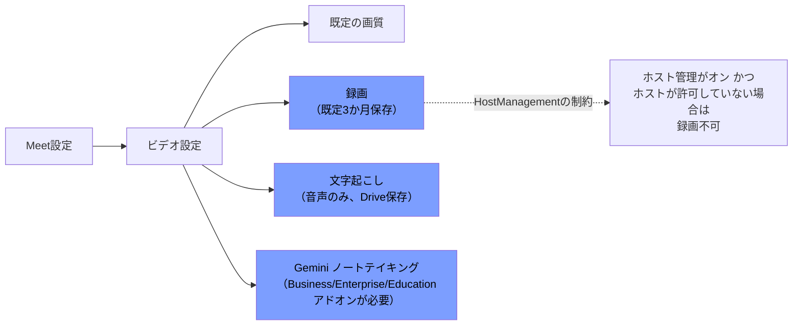

> **ベストプラクティス：** 「営業商談やタウンホールなど、常に記録を残したい会議シリーズ」に対しては、自動録画・自動文字起こしをOU/グループ単位でオンにし、手動操作への依存をなくす。一方、機密性の高いミーティングが多い部門では、既定オフのままにして、必要な場合にホストが都度有効化する運用にする。

---

## 2.5 Google Chatの設定

### 2.5.1 組織・OU単位でのChatの有効化・無効化

Chatサービスの有効化・無効化は、Admin console →「アプリ」→「Google Workspace」→「Google Chat」→「Chatを有効または無効にする」から、組織全体・OU単位・グループ単位で制御します。

**Chat設定の初期展開（Set up Chat for your organization）の流れ：**

1. 要件を確認する
2. ディレクトリの連絡先共有をオンにする（ユーザー同士がChatで検索・発見できるようにするため）
3. Chatサービス自体のオン・オフを設定する
4. Chatの履歴設定をオン・オフにする（2.5.2参照）
5. スペースの履歴オプションを設定する
6. Chat招待の自動承諾を設定する（2.5.3参照）
7. 外部ユーザーとのやり取りを制御する
8. Chatアプリのインストールを許可する（2.5.4参照）
9. GIFピッカーのオン・オフを設定する
10. ユーザーへの告知・トレーニングを行う

> **ベストプラクティス：** Chatの全社展開前に、まずディレクトリ連絡先共有の設定を確認する（オフのままだとユーザー同士が検索できずChatの利便性が著しく損なわれる）。

### 2.5.2 Admin consoleでのChat設定

**チャット履歴（History for chats）：** 1対1メッセージやグループメッセージの履歴を保持するかどうかの既定値を制御する。

**スペース履歴（History for spaces）：** インラインスレッド形式のスペースにおける履歴の既定設定。選択肢は以下の4種類：

| オプション | 動作 |
| --- | --- |
| History is ON by default（ユーザーが変更可） | 既定オンだが個々のスペースで変更できる |
| History is OFF by default（ユーザーが変更可） | 既定オフだが個々のスペースで変更できる |
| History is ALWAYS ON（変更不可） | 常にオンで固定、ユーザーは変更できない |
| History is ALWAYS OFF（変更不可） | 常にオフで固定、ユーザーは変更できない |

「Let History for chats setting override Space history setting」のチェックボックスにより、1対1・グループメッセージの履歴設定がスペースの履歴設定より優先されるかどうかを制御できる。両者を意図的に逆方向で強制すると、グループ会話をスペースにアップグレードした際に履歴設定が切り替わる可能性があるため注意。

**外部ドメインとのChat・スペース：**

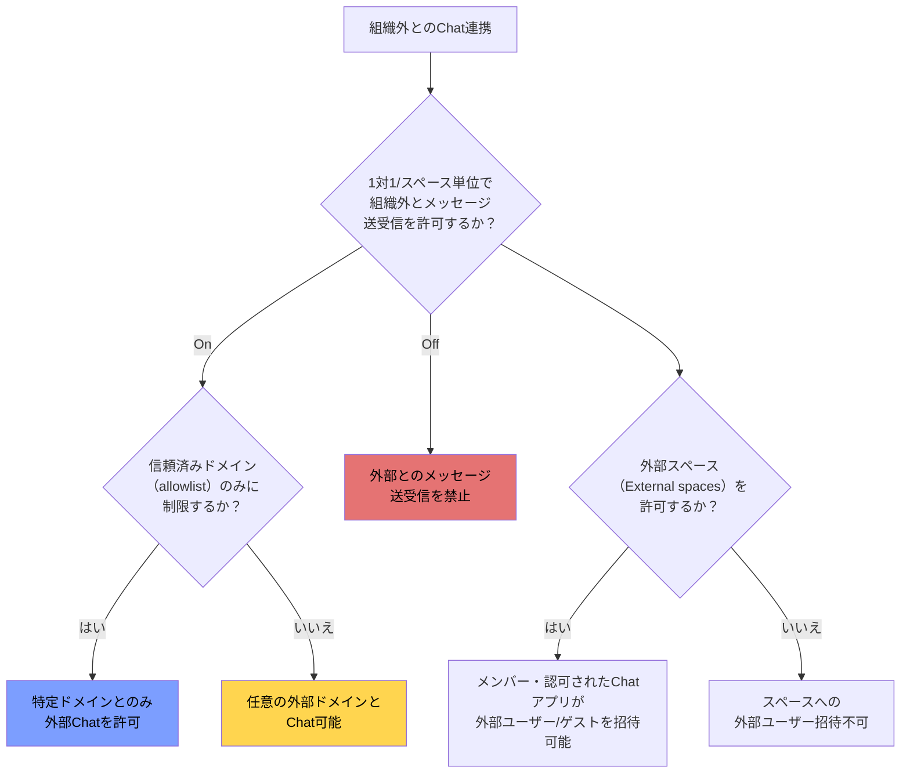

**外部チャットの設定手順：** Admin console →「Google Chat」→「External Chat Settings」で、「組織外へのメッセージ送信をユーザーに許可する」をオン・オフし、オンの場合は「許可リスト化されたドメインのみに制限する」「面識のある外部ゲスト・ユーザーからの招待を自動承諾する」を任意で追加設定できる。

**ゲストアカウントと外部ユーザーの違い：** 外部ユーザーはGoogleアカウントを保有する組織外の人物、ゲストはGoogleアカウントを持たない人物を指し、ゲストにはアカウント作成の招待が送られる。外部ユーザー・ゲストはグループメッセージには直接追加できず、1対1メッセージまたは外部メンバーを許可するスペースでのみやり取りできる。信頼済みドメインを設定すると、Workspaceアカウントを持たないコンシューマー向けGoogleアカウント利用者とのコラボレーションができなくなる点に注意（業務用メールで作成された個人アカウントとの意図しない連携を防ぐ効果もある）。

**コンテンツモデレーション（Moderation）：** ユーザーが不適切なメッセージを報告できる仕組みを、Admin console →「Google Chat」→コンテンツ保護設定から有効化する。報告はモデレーターロールを持つ管理者のみが確認可能（Google自身はレポート内容を閲覧しない）。管理者はレポートカテゴリ・対象となる会話タイプを管理し、報告されたコンテンツに対してアクションを実行できる。2020年12月以前に作成された外部ユーザーを含むグループ会話は、Chat／クラシックHangoutsの仕様変更により報告対象外となる。

**設定場所まとめ：** すべてAdmin console →「アプリ」→「Google Workspace」→「Google Chat」配下（**Service Settings管理者権限**、モデレーションなど一部は**Google Chat管理者権限**が必要）。

> **ベストプラクティス：** コンプライアンス要件が厳しい業界（金融・医療）では、履歴を「ALWAYS ON」に固定し、Vaultによる法的保持・eDiscovery対応を前提とした運用にする。外部連携が多い営業・パートナーシップ部門は「External Chat Settings」で信頼済みドメインの許可リストを整備し、それ以外の部門は外部Chatをオフのままにする。

### 2.5.3 Chat招待設定の管理

**Chat招待の自動承諾（Automatically accept chat invitations）：** 組織内の他ユーザーからのChat招待を自動的に承諾させるかどうかを制御する。オフの場合、既定では新しい連絡先からの招待をユーザーが手動で承諾する必要がある。設定場所：Admin console →「Google Chat」→「Chat Invitations」で、OU単位でオン・オフを選択する。

**Chat・スペースの作成制限（Chat and Space restrictions）：** 特定のユーザーグループに対して、新規の1対1メッセージ・グループメッセージ・スペースの作成を制限できる。制限対象グループは、既存の会話へのメンバー管理操作も制限される。設定場所：Admin console →「Google Chat」→「Chat and Space restrictions」。

> **ベストプラクティス：** 大規模組織では新入社員のオンボーディング時の摩擦を減らすため、自動承諾を組織内でオンにしておくことが一般的。逆に、外部からの不審な招待を警戒すべき業種では、手動承諾のままにしてユーザーの判断を介在させる。

### 2.5.4 Chatアプリの追加

Chatアプリ（ポーリング、タスク管理、サードパーティ連携ボットなど）のインストール許可も、Admin console →「Google Chat」→「Chat apps」で制御します。

**ユーザーによるインストールの許可：** Admin console →「Google Chat」→「Chat apps」でOU単位に許可を設定する。一部のアプリはトップレベル組織単位でのアクセスを要求する場合があり、これを許可しないとChat APIが正しく動作しない可能性がある点に注意。

**管理者による組織への一括インストール：** 管理者はGoogle Workspace Marketplaceからアプリを選び、「管理者としてインストール」→対象を「組織内の全員」に設定してインストールできる。この場合、ユーザーは自分でインストール操作をせずとも「アプリ」セクションにそのアプリが表示され、利用可能になる（通知はオフにできるが、アンインストールはユーザー側ではできない）。

**自動インストール（2025年9月以降）：** ユーザーが最初にアプリの機能を使おうとした時点（例：投票アプリで初めて投票を作成しようとした時）に自動的にそのアプリがインストールされ、以降はどのスペースでもすぐに利用できるようになる仕組みが導入されている。自動インストールを望まない場合、管理者は特定のアプリのインストール自体を禁止するか、特定スペースでのアプリインストール権限を制限することで防止できる。

**アプリ権限（App authorization）：** Chatアプリがユーザーのように振る舞うための権限（メッセージの送受信など）はOAuth 2.0スコープ（`https://www.googleapis.com/auth/chat.app.*`）で要求される。アプリ権限はユーザー権限と異なりOUごとに付与範囲を絞ることができない点も押さえておくべき。

> **ベストプラクティス：** 生産性向上に資する社内標準アプリ（承認ワークフロー、勤怠管理ボットなど）は管理者が組織全体に一括インストールし、利用開始の障壁をなくす。一方、サードパーティ製の汎用チャットアプリはMarketplaceの許可リスト（Section 4「Marketplaceの許可リスト管理」も参照）で個別審査してから許可する。

---

## 2.6 Google Workspaceにおける生成AIの活用

### 2.6.1 生成AI利用時の組織データのプライバシーとセキュリティ確保

Gemini for Google Workspaceは、エンタープライズ利用を前提としたデータガバナンスモデルの上に構築されています。管理者としてまず理解すべきは、**Geminiのデータ取り扱いポリシーが通常のGoogle Workspaceサービスと同様の契約・プライバシー保護の枠内にある**という点です。

**Googleが明示するデータ保護の原則：**

- ユーザーのデータはユーザー自身のものであり、Googleの所有物ではない
- Googleはユーザーデータを広告目的で利用しない
- Googleはユーザーデータを第三者に販売しない
- データは転送時に暗号化され、Google Driveに保存される会議録画等は保存時にも暗号化される
- Vaultを使ってGeminiに関連するデータ（例：Meet録画）の保持ポリシーを設定できる
- HIPAAやFedRAMP Highなど、規制業界のコンプライアンス要件をサポート

**Workspace Intelligence（サイドパネルのGemini）のデータソース制御：** Gmail・Drive・Calendar・Chatの各サービスについて、Geminiがバックグラウンドでアクティブに検索対象とするかどうかを個別にオン・オフできる。特定サービスをオフにすると、Geminiはそのアプリを能動的に検索しなくなる。

**会話履歴の保持ポリシー：** 管理者は以下を選択できる：

- ユーザーによる個別会話の手動削除を許可する（既定で有効）
- 一定期間（3か月、18か月、3年など）でGeminiの会話履歴を自動削除する
- 組織として無期限に会話を保持する

Gemini会話履歴がオフの場合でも、新しいチャットはサービス提供とフィードバック処理のために最大72時間、ユーザーアカウント内に一時保存される（この72時間分のデータはGemini Apps Activityには表示されない）。

**プロンプトインジェクション対策：** Geminiは新興の攻撃ベクトルであるプロンプトインジェクションに対して、多層防御戦略（layered defense strategy）で対応するよう設計されている。

> **ベストプラクティス：**
> - 業務上不要なサービスへのGeminiのアクセスは、Workspace Intelligenceのデータソース設定でオフにし、最小権限の原則を適用する
> - 規制業界（医療・金融・公共部門）では、Vaultを用いたGemini関連データの保持ポリシー設定を、既存の他サービスの保持ポリシーと整合させる
> - 個人アカウントとしてGeminiアプリを追加サービスとして利用しているユーザーには、機密情報・社外秘情報を入力しないよう周知する（追加サービスとしてのGeminiは、Workspaceアカウントに紐づく組織ポリシーの一部が適用されない場合がある）

### 2.6.2 組織・OU単位でのGeminiの有効化・無効化

Geminiの有効化・無効化には、**複数のレイヤー**が存在する点が試験・実務双方で頻出の理解ポイントです。

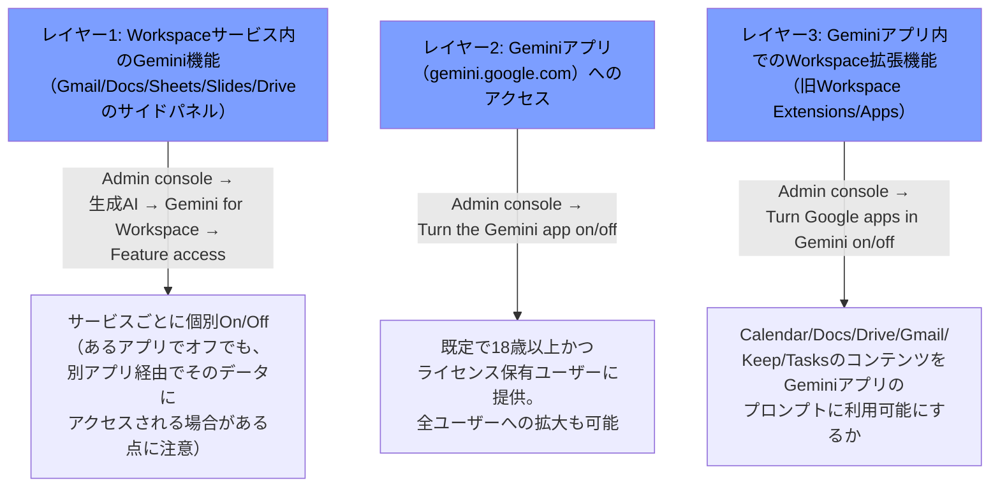

| レイヤー | 設定名 | 設定場所 | 既定値・補足 |
| --- | --- | --- | --- |
| **① Workspaceサービス内のGemini機能** | Feature access | Admin console →「生成AI」→「Gemini for Workspace」→「Feature access」パネル | 既定オン。あるアプリでGeminiをオフにしても、別のアプリ経由でそのデータをGeminiが参照できる場合がある（例：Driveでオフでも、GmailからGeminiにDriveファイルについて質問すると参照される） |
| **② Geminiアプリ自体へのアクセス** | Turn the Gemini app on or off | Admin console →「生成AI」→「Gemini App」 | 既定で18歳以上かつ対応ライセンスを持つ全ユーザーに提供。ライセンスの有無に関わらず全ユーザーへのアクセス拡大も設定可能。モバイルアプリ専用の管理者コントロールは存在しないが、デバイス管理設定でアプリ自体をブロックすることは可能 |
| **③ Geminiアプリ内のWorkspace拡張機能** | Turn Google apps in Gemini on or off | Admin console →「生成AI」→「Gemini App」→「Apps」 | Geminiアプリの利用には会話履歴のオンが前提。組織側で該当のWorkspaceサービス（例：Tasks）自体をオフにしている場合、対応する拡張機能も利用不可 |

**利用の前提条件：** Workspace拡張機能（Apps）を使うには **Gemini会話履歴（Gemini conversation history）** をオンにする必要がある。また、複数のアプリ・サービスをまたぐ複合的なプロンプト（例：「カレンダーに予定を作成し、リマインダーも追加して」）を実行する場合、関与するすべてのサービス（この例ではCalendarとTasks）が有効になっていないと、一部のアクションが実行されないまま終わってしまう。

**Gemini for App Creation / Gemini in AppSheet Solutions：** AppSheet関連のGemini機能（自然言語でのアプリ作成、自動化タスクへのAI組み込み）は別個の設定として、チーム単位でオン・オフできる（2.7も参照）。

> **ベストプラクティス：** 段階的ロールアウトの初期フェーズでは、パイロットOUのみでレイヤー①②③をすべてオンにして検証し、フィードバックを収集してから全社展開する。生成AIの利用に消極的な組織は、まずレイヤー①（Workspaceアプリ内の機能）のみを許可し、レイヤー③（外部アプリであるGeminiアプリへのWorkspaceデータ連携）は慎重に判断する、という段階的な導入戦略も有効。

### 2.6.3 Geminiアプリ向けGoogle Workspace拡張機能の有効化

「Turn Google apps in Gemini on or off」（Workspace apps、旧称Workspace Extensions）は、Geminiアプリ（gemini.google.com）がCalendar・Docs・Drive・Gmail・Keep・Tasksなどのユーザーコンテンツを参照し、より文脈に沿った応答を返せるようにする設定です。

**この機能で可能になること：**

- Gmailに関する追加情報へのリンク（引用）をGeminiの応答に含める
- ユーザーがDriveファイルをGeminiアプリやGemの指示（Gem instructions）にアップロードして利用する

**オフにした場合の挙動：** 既にWorkspace apps機能を使って行われたチャットのやり取り自体はユーザーに引き続き表示されるが、Geminiアプリは元のプロンプトに応答するために必要だった情報以外へのアクセスができなくなる（再度オンにするまで、Workspaceからの追加情報取得はできない）。

**適用対象外のケース：** 追加サービスとしてGeminiにアクセスしているユーザー（＝Workspaceの標準ライセンスに含まれない形でGeminiアプリのみ追加提供されているケース）は、Workspace appsを利用できない。

> **ベストプラクティス：** Workspace appsをオンにする際は、Drive内のファイルアクセス制御（本人が所有またはアクセス権を持つファイルのみ、共有ドライブ経由のファイルは除く）が、既存のDrive共有ポリシーと一貫していることを確認し、意図せず機密ファイルへのアクセス経路が広がらないようにする。

### 2.6.4 Gemini利用状況レポートの生成

管理者は、Gemini機能の利用状況を可視化し、導入効果・利用パターン・潜在的なセキュリティリスクを把握するための複数のレポートにアクセスできます。

**設定場所：** Admin console →「生成AI」→「Gemini reports」→「ユーザーレベルの使用状況」

**主なレポートの種類：**

| レポート | 内容 |
| --- | --- |
| **組織レベルの利用状況（Org-level usage）** | アクティブなGeminiユーザー数、ライセンス割り当て状況、全体の利用推移、アプリ別の利用状況（Gemini Adoption per app） |
| **ユーザーレベルの利用状況（User-level usage）** | 利用強度（高・中・低・ゼロ）、アクティブ日数、ユーザーごとのアプリ別詳細な利用状況、利用上限に達した日数（Days at limit） |
| **利用インタラクション（Usage per interaction）** | Gmailの「文章作成のヒント」やSheetsでのデータ整理支援など、機能単位での詳細な利用実績 |

**フィルタリング：** OU単位・グループ単位でレポートをフィルタリングできる。組織構造の変更が反映されるまで最大72時間かかり、組織変更前の履歴データはその変更を遡って反映されない点に注意。

**Gemini監査ログ（Reporting API経由）：** Admin SDKのReporting APIを通じて、Geminiアプリ・Workspaceアプリ内でのユーザーのアクティビティ（実行されたアクション、使用されたアプリ、使用された機能、最終利用日時など）をより詳細に取得できる。このデータはセキュリティ調査ツール・監査調査ツールでも利用可能。

**活用シーン：**

- 利用状況が高いパワーユーザーを特定し、他ユーザーへの展開・トレーニングのアンバサダーとして活用する
- ライセンス上限（使用制限）に達しているユーザーの傾向から、アドオン（AI Expanded Accessなど）へのアップグレード要否を判断する
- 特定ユーザーのGemini利用パターンの急激な変化から、潜在的な誤用・セキュリティリスクの兆候を検知する

> **ベストプラクティス：** ライセンスコストの最適化のため、四半期ごとにGemini利用状況レポートをレビューし、利用実績が「ゼロ」のユーザーからライセンスを再配布することを検討する。同時に、利用強度が「高」のユーザー層を特定し、そのユースケースを社内のベストプラクティス共有会で展開する。

---

## 2.7 Workspace開発のサポート

### 2.7.1 AppSheetとApps Scriptのユースケース

AppSheetとApps Scriptは、いずれも「コードを書かずに、または最小限のコードでGoogle Workspaceを拡張・自動化する」ためのツールですが、性質が異なり、試験でも両者の使い分けの理解が問われます。

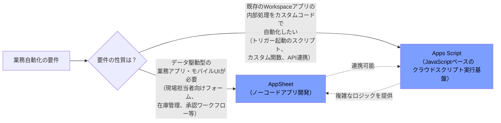

**AppSheetの主なユースケース：**

- Google Sheetsのデータからモバイル対応の業務アプリを作成する
- 出張申請フローで、申請が行われた際に上長を自動検索してChatまたはメールで承認通知を送る
- 現場作業員がモバイル端末で撮影した点検写真をDriveにアップロードし、監査担当者がアクセスできるよう共有設定を自動調整する
- シフト・予約管理の簡易Webインターフェースを提供し、予約が入るとCalendarに自動でイベントを作成し招待する
- Google Chat内でアプリを起動する（Launch apps in Google Chat）

**Apps Scriptの主なユースケース：**

- ボタンクリックでカレンダーの予定を作成する
- 新しい行が追加された際にスライドを自動追加する
- フォーム経由でアップロードされた写真をDriveに保存し、特定の人と自動共有する
- テーブルデータから監査ログとしてGoogle Docsファイルを自動生成する
- 外部の機械学習サービスを呼び出し、予測結果を新しい行のデータとして書き戻す

**AppSheet Apps Scriptコネクタ：** AppSheetの自動化（Automation）から直接Apps Scriptの関数を呼び出せるコネクタが提供されており、AppSheetアプリからGoogle Workspace API（Drive、Docs、Sheets、Admin SDKなど）やYouTube、Google Analytics、BigQueryなど他のGoogleサービスにアクセスするワークフローを構築できる。この連携により、AppSheetのノーコードの手軽さと、Apps Scriptの柔軟なカスタムロジックを組み合わせられる。**Apps Scriptサービスが組織で有効になっている必要がある**点に注意（AppSheetの自動化からApps Scriptを呼び出すための前提条件）。

**制約事項：** AppSheetからはスタンドアロンのApps Scriptスクリプトのみ呼び出し可能で、コンテナバインド型のスクリプト（特定のスプレッドシート等に紐づくスクリプト）は現時点でサポートされていない。また、Apps Scriptは常にヘッドデプロイメント（最新の保存済みバージョン）を実行し、特定のデプロイバージョンを指定して呼び出すことはできない。

> **試験のポイント：** 「AppSheetとApps Scriptのユースケースを特定する」という出題観点は、両者の**二者択一ではなく、組み合わせて使うケースが多い**ことを理解しているかを問う。AppSheetは「UI・データ入力・ワークフロートリガーの民主化」、Apps Scriptは「Workspaceサービスへの深いプログラマティックな統合」という役割分担で捉えるのが実務的。

### 2.7.2 組織・OU単位でのAppSheetの有効化

AppSheetは他の追加Googleサービスと同様に、Admin console上で組織・OU・グループ単位の粒度で有効化・無効化を制御できます。

**設定手順：** Admin console →「アプリ」→「追加のGoogleサービス」→「AppSheetの設定」から、組織全体または特定のOU・グループ・ユーザー単位でオン・オフを切り替える。

**サブスクリプションがない場合の挙動（過去の移行時の仕様）：** AppSheetのサブスクリプションを契約していない組織では、「個別に管理されないサービスへのアクセス管理」設定がOUごとにオン・オフ混在している場合、AppSheetの制御はそのOUレベルの設定に自動的に整合する。全OUでオフに設定されている組織では、AppSheet自体も全体でオフになる。

**AppSheet管理の階層構造：**

| 概念 | 説明 |
| --- | --- |
| **Organization（組織）** | Google Workspace管理者に組織内の全チームを管理する一元的なツールを提供し、チーム管理をチーム管理者に委任できる |
| **Team（チーム）** | 個々のアプリ開発チーム単位。Gemini for App Creation（自然言語でのアプリ作成）などの機能はチーム単位でオン・オフを設定する |
| **AppSheet Admin Console** | サブスクリプションのライセンス購入・割り当て・使用状況を可視化するための専用管理コンソール |

**Gemini関連機能の有効化：**

- **Gemini for App Creation**：自然言語の指示だけでAppSheetアプリを構築できる機能。チーム単位で有効化を制御
- **Gemini in AppSheet Solutions**：自動化（Automation）内にAIタスクを追加し、情報の抽出・分類を行える機能。どのアプリ作成者がAI機能を自動化内で使えるかを管理者が制御可能

> **ベストプラクティス：** AppSheetを初めて全社導入する際は、まず「Organization」機能を使って部門ごとの「Team」を作成し、各チームにチーム管理者を委任することで、シャドーIT化を防ぎながらも現場主導のアプリ開発を促進する、というガバナンスモデルを構築する。Apps Script同様、既定では組織全体でオンになっているため、まだ利用ポリシーが整っていない組織は、正式な運用ルール策定までの間、Admin console上で意図的にオフに設定しておくことも選択肢となる。

---

## Section 2 ベストプラクティス総括表

| サービス | 重要設定 | ベストプラクティスの要点 |
| --- | --- | --- |
| **Gmail** | MXレコード | `smtp.google.com`単一レコードへの移行、切り替え前のユーザー作成完了 |
| **Gmail** | ルーティング | Default routing（既定配送）とRouting（特定条件配送）を使い分け、テストは小規模OUから開始 |
| **Gmail** | コンテンツコンプライアンス | 事前定義された検出器を活用し、正規表現の自作を最小化。ルール優先順位を必ず検証 |
| **Gmail** | スパム・フィッシング対策 | IPアレースリストはドメイン全体に影響するため範囲を絞り込み、インバウンドゲートウェイの`Reject all mail not from gateway IPs`は慎重に判断 |
| **Gmail** | メール認証 | SPF・DKIM・DMARCを三点セットで運用し、DMARCは`p=none`から段階的に`reject`へロールアウト |
| **Gmail** | 移行 | パイロットグループでの先行移行、デルタ移行による差分同期の活用 |
| **Gmail** | Quarantine | 最小権限のカスタムロール（Access Admin Quarantine/Access Restricted Quarantines）でアクセスを委任 |
| **Drive/Docs** | デフォルト共有 | `Restricted`を既定にし、ターゲットオーディエンスの「Employees Only」をプライマリに設定 |
| **Drive/Docs** | Trust Rules | 部門・ドメイン・グループ単位の細かい共有制御が必要な場合に採用し、既存Drive共有設定からの変換をプレビューで確認 |
| **Drive/Docs** | 共有ドライブ | 永続的なチーム資産は共有ドライブに保存し、退職時のデータ喪失リスクを構造的に排除 |
| **Drive/Docs** | ストレージ | プールドストレージの使用状況を定期レビューし、ポリシー変更前にユーザー通知テンプレートで周知 |
| **Drive/Docs** | ラベル | ラベル名・選択肢に機密情報を含めず、必須フィールドで入力を促す |
| **Calendar** | リソース予約 | 高需要リソースはリソースマネージャーによる手動承認、一般リソースは自動承認 |
| **Calendar** | 委任 | 個人カレンダー＝共有権限付与、リソースカレンダー＝リソースマネージャー設定、と使い分けを明確化 |
| **Calendar** | 不明送信者対策 | 「やり取りしたことがある送信者のみ表示」をOU単位で有効化し、既存スパムイベントは手動クリーンアップが必要な点をユーザーに周知 |
| **Meet** | セーフティ | 機密性の高い会議はHost Managementをオン＋待機室併用、大規模会議はQuick accessオン＋チャット権限制限 |
| **Meet** | ビデオ設定 | 記録が必須の会議シリーズ（商談等）は自動録画・自動文字起こしをOU/グループ単位で有効化 |
| **Chat** | 履歴設定 | 規制業界は履歴をALWAYS ONに固定しVaultで法的保持に対応 |
| **Chat** | 外部連携 | External Chat Settingsで信頼済みドメインの許可リストを部門単位に整備 |
| **Chat** | アプリ | 社内標準アプリは管理者が一括インストール、サードパーティアプリはMarketplace許可リストで審査 |
| **生成AI** | データ保護 | Workspace Intelligenceのデータソース設定で不要なサービスへのアクセスをオフにし最小権限を徹底 |
| **生成AI** | 有効化の階層 | Feature access／Geminiアプリアクセス／Workspace apps in Geminiの3層を区別して段階的に展開 |
| **生成AI** | 利用状況レポート | 四半期ごとにレビューし、未利用ユーザーのライセンス再配布とパワーユーザーの知見共有を実施 |
| **開発支援** | AppSheet/Apps Script | AppSheet＝UI・トリガーの民主化、Apps Script＝深いプログラマティック統合、という役割分担で組み合わせて活用 |
| **開発支援** | ガバナンス | AppSheet「Organization/Team」構造でチーム管理者に委任し、シャドーIT化を防止 |

---

## 学習チェックリスト

- [ ] MXレコードを単一レコード方式（`smtp.google.com`）とレガシー方式（複数aspmxレコード）の両方について説明できる
- [ ] Default routingとRoutingの優先順位の違い、およびデュアルデリバリー・分割配信・キャッチオールの使い分けを説明できる
- [ ] コンテンツコンプライアンスと添付ファイルコンプライアンスの違い、事前定義検出器の役割を説明できる
- [ ] Email allowlist・Blocked senders・Inbound gatewayの3つの機能の違いと適用範囲（ドメイン全体かOU単位か）を説明できる
- [ ] SPF・DKIM・DMARCそれぞれの役割と、大量送信者（1日5,000通以上）に対する必須要件を説明できる
- [ ] データ移行サービス（Data migration）とデータインポートツール（Data import）の対象範囲の違いを説明できる
- [ ] Gmailの委任機能（個人・グループ）とCollaborative Inboxの使い分けを説明できる
- [ ] Email quarantineへのアクセス権を委任する2つの方法（全体アクセス／グループ単位アクセス）を説明できる
- [ ] Drive共有の「全般的なアクセスのデフォルト設定」とターゲットオーディエンスの関係を説明できる
- [ ] Trust Rulesが従来のDrive共有設定（外部共有オン・オフ・信頼済みドメイン）とどう関係し、いつ採用すべきかを説明できる
- [ ] 共有ドライブのOU割り当てとストレージ上限のカスタマイズ方法を説明できる
- [ ] カスタムDocsテンプレートの3つの送信モード（Open/Moderated/Restricted）の違いを説明できる
- [ ] Driveラベルの3つの自動適用方法（デフォルト分類・DLP・AI分類）とその優先順位を説明できる
- [ ] オフラインアクセス設定がDrive for desktopには適用されない点を説明できる
- [ ] 建物・フロア・機能・リソースの階層構造とリソース予約の自動承認/手動承認の使い分けを説明できる
- [ ] カレンダー・リソースの委任のメカニズムの違い（共有権限 vs リソースマネージャー）を説明できる
- [ ] 「送信元が判明している場合のみ」設定によるカレンダースパム対策のロジックを説明できる
- [ ] Host Management・Waiting Room・Quick accessの3つの関係性を説明できる
- [ ] Meet録画・文字起こし・Geminiノートテイキングの自動化設定とその前提ライセンスを説明できる
- [ ] Chatの履歴設定（Chat履歴 vs Space履歴)とオーバーライドの仕組みを説明できる
- [ ] External Chat SettingsとExternal spacesの設定の違い、ゲストと外部ユーザーの違いを説明できる
- [ ] Geminiの有効化を構成する3つのレイヤー（Feature access／Geminiアプリ／Workspace apps in Gemini）を説明できる
- [ ] Gemini利用状況レポートで取得できる情報の種類（組織レベル・ユーザーレベル・インタラクション単位）を説明できる
- [ ] AppSheetとApps Scriptの役割分担、および両者を連携させるAppSheet Apps Scriptコネクタの仕組みを説明できる

---

## 参考文献

すべてGoogle公式ドキュメント（`support.google.com/a`、`knowledge.workspace.google.com`、`workspaceupdates.googleblog.com`、`developers.google.com`）を一次情報として使用しています。

**認定試験公式情報**
- [Associate Google Workspace Administrator 認定ページ（Google Cloud）](https://cloud.google.com/learn/certification/associate-google-workspace-administrator?hl=en)
- [Associate Google Workspace Administrator Exam Guide（PDF）](https://services.google.com/fh/files/misc/associate_google_workspace_administrator_exam_guide_english.pdf)

**2.1 Gmail**
- [Set up MX records for Google Workspace](https://knowledge.workspace.google.com/admin/domains/set-up-mx-records-for-google-workspace)
- [Avoid issues when changing MX records](https://knowledge.workspace.google.com/admin/domains/avoid-issues-when-changing-mx-records)
- [Email routing and delivery options for Google Workspace](https://support.google.com/a/answer/2685650?hl=en)
- [Set up Default routing for your organization](https://support.google.com/a/answer/2368153)
- [Send email to 2 email systems with split delivery](https://support.google.com/a/answer/12971016?hl=en)
- [Set up rules for advanced email content filtering](https://knowledge.workspace.google.com/admin/gmail/advanced/set-up-rules-for-advanced-email-content-filtering)
- [Enhance rules for advanced email content filtering with predefined detectors](https://support.google.com/a/answer/6280516?hl=en)
- [Filter messages with attachments](https://support.google.com/a/answer/2364580?hl=en)
- [Add IP addresses to allowlists in Gmail](https://knowledge.workspace.google.com/admin/gmail/advanced/add-ip-addresses-to-allowlists-in-gmail)
- [Working with Gmail Admin settings in Google Workspace](https://support.google.com/a/answer/2786758?hl=en)
- [Turn POP & IMAP on or off for users](https://support.google.com/a/answer/105694?hl=en)
- [Let users automatically forward their own Gmail emails](https://support.google.com/a/answer/14724207?hl=en)
- [Set up SPF](https://knowledge.workspace.google.com/admin/security/set-up-spf)
- [Set up DKIM](https://knowledge.workspace.google.com/admin/security/set-up-dkim)
- [Set up DMARC](https://knowledge.workspace.google.com/admin/security/set-up-dmarc)
- [Migrate email from a Gmail account](https://knowledge.workspace.google.com/admin/migrate/migrate-email-from-a-gmail-account?hl=en)
- [Import email with the data import tool](https://support.google.com/a/answer/9476255?hl=en)
- [Delegate a user's email address](https://knowledge.workspace.google.com/admin/users/delegate-a-users-email-address)
- [Give your users access to email quarantine](https://knowledge.workspace.google.com/admin/gmail/advanced/give-your-users-access-to-email-quarantine)

**2.2 Google DriveとDocs**
- [Set general access sharing options for your organization](https://support.google.com/a/answer/12732365?hl=en)
- [Create and manage trust rules for Drive sharing](https://knowledge.workspace.google.com/admin/security/create-and-manage-trust-rules-for-drive-sharing)
- [Best practices for deploying target audiences](https://support.google.com/a/answer/10356781?hl=en)
- [Turn custom Drive templates on or off for users](https://support.google.com/a/answer/3055325)
- [Manage data policies for specific shared drives](https://knowledge.workspace.google.com/admin/drive/manage-data-policies-for-specific-shared-drives)
- [4. Set storage limits（Getting started）](https://support.google.com/a/answer/12033430?hl=en)
- [Google Workspace storage FAQ for admins](https://support.google.com/a/answer/9214707?hl=en)
- [Get started: Drive setup guide for admins](https://knowledge.workspace.google.com/admin/drive/get-started-drive-setup-guide-for-admins)
- [Create classification labels for your organization](https://knowledge.workspace.google.com/admin/security/create-classification-labels-for-your-organization)
- [Apply Default classification labels to new files automatically](https://support.google.com/a/answer/11280938)
- [Get started as a classification labels admin](https://support.google.com/a/answer/9292382?hl=en-)
- [Set up offline access to Docs, Sheets & Slides](https://support.google.com/a/answer/1642623?hl=en)
- [Administrator privilege definitions](https://knowledge.workspace.google.com/admin/users/administrator-privilege-definitions)

**2.3 Google Calendar**
- [Create buildings, features & Calendar resources](https://knowledge.workspace.google.com/admin/calendar/create-buildings-features-and-calendar-resources)
- [Approve or deny Calendar room & resource bookings](https://support.google.com/a/answer/7046439?hl=en)
- [Allow Free/Busy Google Calendar room booking](https://knowledge.workspace.google.com/admin/calendar/allow-free-busy-google-calendar-room-booking)
- [Allow external invitations in Google Calendar events](https://knowledge.workspace.google.com/admin/calendar/allow-external-invitations-in-google-calendar-events)
- [Delegate access to your mail or calendar](https://support.google.com/a/users/answer/168126?hl=en)

**2.4 Google Meet**
- [Google Meet security & privacy for IT admins](https://support.google.com/a/answer/7582940)
- [Manage waiting room settings for your users](https://knowledge.workspace.google.com/admin/meet/manage-waiting-room-settings-for-your-users)
- [Manage Meet settings (for admins)](https://knowledge.workspace.google.com/admin/meet/manage-meet-settings)
- [Turn Meet recording on or off for your organization](https://knowledge.workspace.google.com/admin/meet/turn-meet-recording-on-or-off-for-your-organization)
- [Use Transcripts with Google Meet](https://support.google.com/meet/answer/12849897?hl=en)

**2.5 Google Chat**
- [Set up Chat for your organization](https://support.google.com/a/answer/9269628)
- [Set a space history option for users](https://knowledge.workspace.google.com/admin/chat/set-a-space-history-option-for-users)
- [Chatting with external users & guest accounts](https://knowledge.workspace.google.com/admin/chat/chatting-with-external-users)
- [Control external Chat & spaces chat options](https://knowledge.workspace.google.com/admin/chat/control-external-chat-and-spaces-chat-options)
- [Set up content moderation for Chat](https://support.google.com/a/answer/13471510)
- [Automatically accept chat invitations](https://support.google.com/a/answer/9269535?hl=en)
- [Allow users to install Chat apps](https://support.google.com/a/answer/7651360)
- [Set up app authorization for Chat](https://knowledge.workspace.google.com/admin/chat/set-up-app-authorization-for-chat)

**2.6 生成AI（Gemini）**
- [Enterprise security controls for Gemini in Google Workspace](https://workspace.google.com/blog/ai-and-machine-learning/enterprise-security-controls-google-workspace-gemini)
- [Generative AI in Google Workspace Privacy Hub](https://support.google.com/a/answer/15706919?hl=en)
- [Manage access to Gemini features in Workspace services](https://knowledge.workspace.google.com/admin/generative-ai/workspace-with-gemini/manage-access-to-gemini-features-in-workspace-services)
- [Turn the Gemini app on or off](https://support.google.com/a/answer/14571493)
- [Control Google Apps in Gemini on or off（Turn Google apps in Gemini on or off）](https://knowledge.workspace.google.com/admin/gemini/turn-google-apps-in-gemini-on-or-off)
- [Review Gemini usage in your organization](https://knowledge.workspace.google.com/admin/generative-ai/review-gemini-usage-in-your-organization)
- [Manage access to Gemini in AppSheet](https://knowledge.workspace.google.com/admin/appsheet/manage-access-to-gemini-in-appsheet)

**2.7 Workspace開発のサポート**
- [Manage AppSheet in your organization](https://knowledge.workspace.google.com/admin/appsheet/manage-appsheet-in-your-organization)
- [Call Apps Script from an automation（AppSheet Help）](https://support.google.com/appsheet/answer/11997142?hl=en)
- [Announcing the Apps Script connector for AppSheet（Google Developers Blog）](https://developers.googleblog.com/en/announcing-the-apps-script-connector-for-appsheet-automate-workflows-for-google-workspace/)
- [Turn Apps Script on or off for users](https://knowledge.workspace.google.com/admin/users/access/turn-apps-script-on-or-off-for-users)
- [Google Workspace Updates: Control access to AppSheet with a new Admin console setting](https://workspaceupdates.googleblog.com/2020/11/admin-control-appsheet.html?m=1)

---

*本ガイドはGoogle Workspace管理者ヘルプセンターの公開情報（2026年8月時点）に基づいて作成されています。Admin consoleのUIやポリシーはGoogleにより随時更新されるため、実際の設定時は必ず最新の公式ヘルプページを確認してください。*
