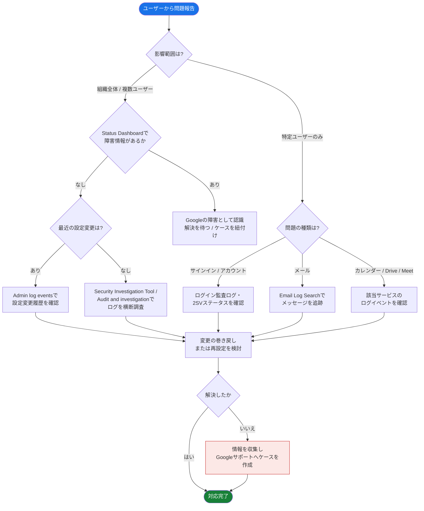
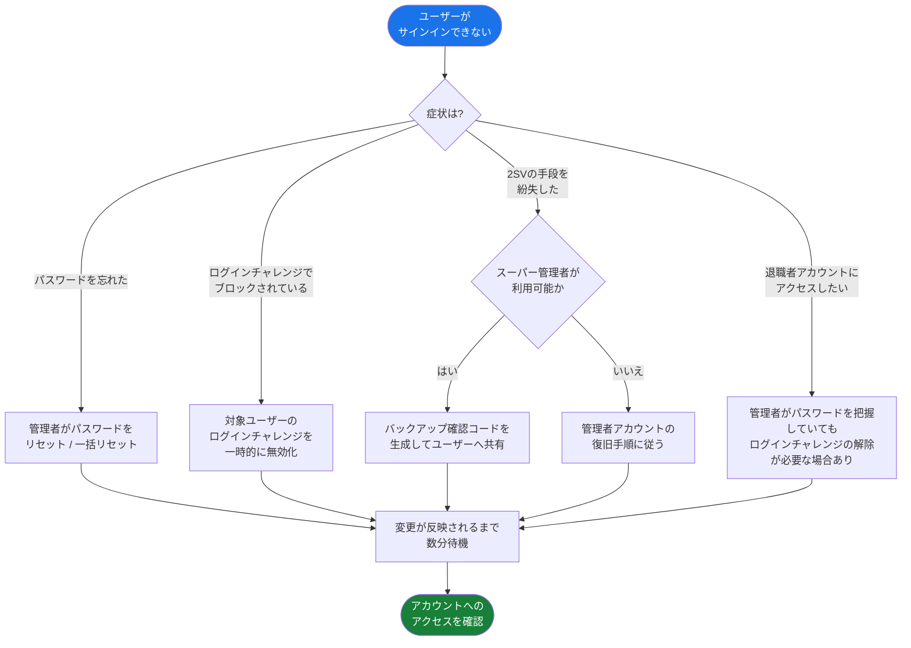
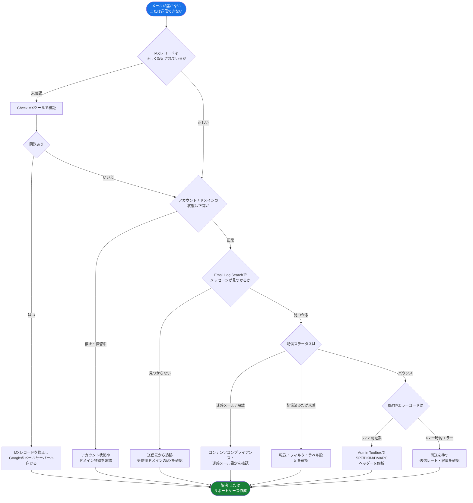
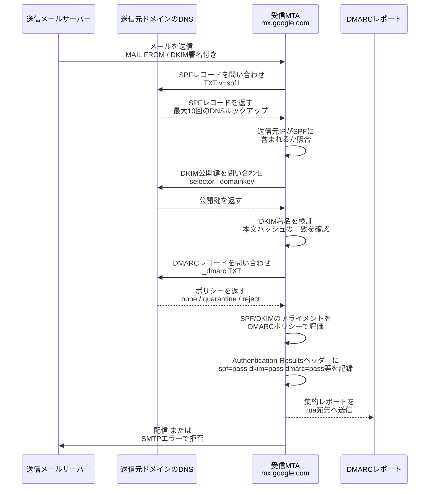
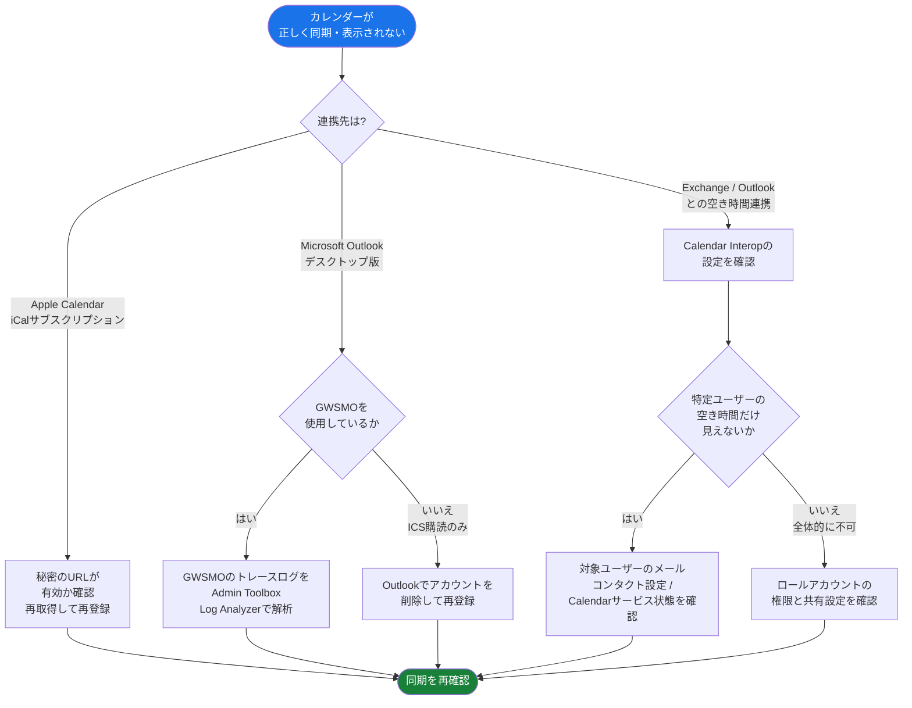
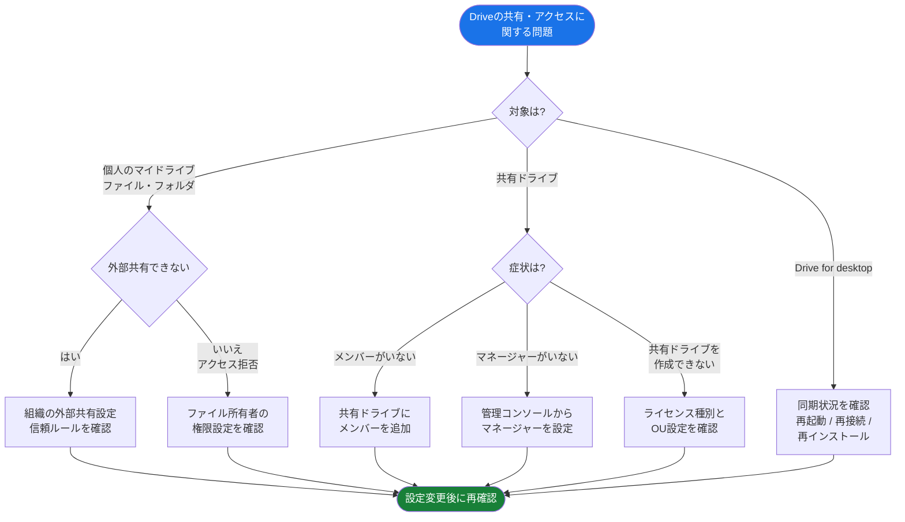
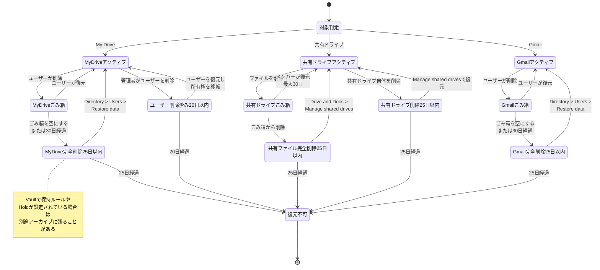
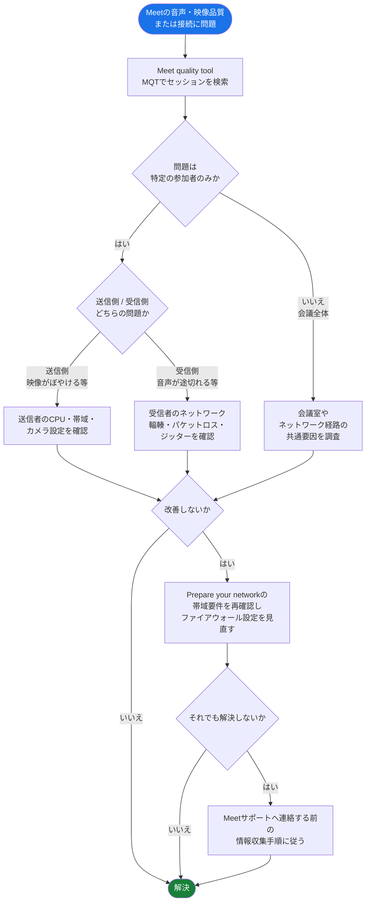
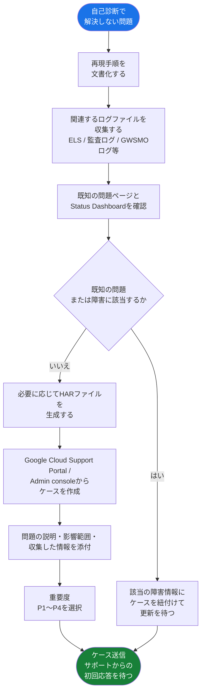

# Associate Google Workspace Administrator 試験対策ガイド

## Section 6: 監視とトラブルシューティング（Monitoring and troubleshooting common issues）

> 出題比率: 約13%（Google公式Exam Guideに基づく）
> 対象レベル: 中級者〜上級者
> 前提知識: Section 1〜5（ユーザー管理、コアサービス、データガバナンス、セキュリティ、ブラウザ・エンドポイント管理）の内容を理解していること

---

## この章で扱う範囲

Section 6は、Associate Google Workspace Administrator認定の中で唯一「診断・障害対応・サポート活用」という運用フェーズに焦点を当てたセクションです。他のセクションが「正しく設定する」ことを問うのに対し、このセクションは「設定した後に何かがうまくいかないとき、どう突き止め、どう直し、どう報告するか」という管理者の日常業務そのものを問います。

公式Exam Guideは本セクションを4つのタスクに分けています。

```mermaid
flowchart TD
    S6["Section 6<br/>監視とトラブルシューティング<br/>出題比率 約13%"]
    S6 --> T61["6.1 Workspace問題の特定と診断<br/>監査ログ / Status Dashboard / メール配信"]
    S6 --> T62["6.2 一般的な問題の<br/>トラブルシューティングと解決<br/>アカウント・メール・カレンダー・Drive・Meet"]
    S6 --> T63["6.3 レポートと監査ログの<br/>表示・作成・管理"]
    S6 --> T64["6.4 サポートリソースの活用"]

    T61 --> T61a["監査ログへのアクセス"]
    T61 --> T61b["ログエントリの解釈"]
    T61 --> T61c["Status Dashboardでの障害確認"]
    T61 --> T61d["メール配信問題の解決策提案"]

    T62 --> T62a["アカウント・パスワード・2SV"]
    T62 --> T62b["メール配信<br/>ELS / ヘッダー / 転送・フィルタ"]
    T62 --> T62c["カレンダー<br/>同期・共有・空き時間"]
    T62 --> T62d["Drive<br/>共有・デスクトップ・復元・オフライン"]
    T62 --> T62e["Meet<br/>品質ツール・接続問題"]

    T63 --> T63a["アプリ使用状況"]
    T63 --> T63b["ストレージ上限"]
    T63 --> T63c["監査レポート"]
    T63 --> T63d["デバイスアクティビティ"]

    T64 --> T64a["再現手順の文書化"]
    T64 --> T64b["ログファイルの収集"]
    T64 --> T64c["既知の問題の検索"]
    T64 --> T64d["HARファイル生成"]
    T64 --> T64e["サポートケースの<br/>ベストプラクティス"]

    style S6 fill:#1a73e8,color:#fff,stroke:#174ea6
    style T61 fill:#e8f0fe,stroke:#1a73e8
    style T62 fill:#e8f0fe,stroke:#1a73e8
    style T63 fill:#e8f0fe,stroke:#1a73e8
    style T64 fill:#e8f0fe,stroke:#1a73e8
```

### タスク別出題範囲一覧

| タスク | 名称 | 主な出題項目数 | 中心となる管理コンソール機能 |
|---|---|---|---|
| 6.1 | Workspace問題の特定と診断 | 4項目 | Audit and investigation、Status Dashboard |
| 6.2 | 一般的な問題のトラブルシューティングと解決 | 13項目 | Email Log Search、Admin Toolbox、Meet quality tool 他 |
| 6.3 | レポートと監査ログの表示・作成・管理 | 4項目 | Reporting > Overview、各種Appsレポート |
| 6.4 | サポートリソースの活用 | 6項目 | Google Cloud Support Portal、HAR Analyzer |

試験ではこの4タスクを横断して「症状から原因を切り分け、適切なツールを選び、必要であれば正しい情報を添えてサポートにエスカレーションする」という一連の判断プロセスが問われます。単一の設定画面の操作を覚えるのではなく、**どのツールが何のために存在し、どの順番で使うべきか**という判断軸を身につけることが合格の鍵になります。

---

## 目次

- [6.1 Workspace問題の特定と診断](#61-workspace問題の特定と診断)
  - [6.1.1 管理コンソールでの監査ログへのアクセス](#611-管理コンソールでの監査ログへのアクセス)
  - [6.1.2 ログエントリの解釈](#612-ログエントリの解釈)
  - [6.1.3 Status Dashboardでのサービス障害確認](#613-status-dashboardでのサービス障害確認)
  - [6.1.4 メール配信問題に関する解決策の提案](#614-メール配信問題に関する解決策の提案)
- [6.2 一般的な問題のトラブルシューティングと解決](#62-一般的な問題のトラブルシューティングと解決)
  - [6.2.1 アカウント・パスワード・2段階認証・サービスアクセスの問題](#621-アカウントパスワード2段階認証サービスアクセスの問題)
  - [6.2.2 Email Log Searchによるメール配信問題のトラブルシューティング](#622-email-log-searchによるメール配信問題のトラブルシューティング)
  - [6.2.3 メッセージヘッダーとAdmin Toolboxによるメール配信問題の解析](#623-メッセージヘッダーとadmin-toolboxによるメール配信問題の解析)
  - [6.2.4 メール転送・フィルタ・ラベルの問題支援](#624-メール転送フィルタラベルの問題支援)
  - [6.2.5 カレンダーの同期問題](#625-カレンダーの同期問題)
  - [6.2.6 カレンダーの共有・権限管理問題](#626-カレンダーの共有権限管理問題)
  - [6.2.7 カレンダーの空き時間情報共有問題](#627-カレンダーの空き時間情報共有問題)
  - [6.2.8 Driveの共有・権限管理問題](#628-driveの共有権限管理問題)
  - [6.2.9 Drive for Desktopの問題解決](#629-drive-for-desktopの問題解決)
  - [6.2.10 誤って削除されたファイル・メールの復元](#6210-誤って削除されたファイルメールの復元)
  - [6.2.11 Driveオフラインアクセスの問題](#6211-driveオフラインアクセスの問題)
  - [6.2.12 Meet品質ツールによるネットワーク診断](#6212-meet品質ツールによるネットワーク診断)
  - [6.2.13 Meetの問題のトラブルシューティング](#6213-meetの問題のトラブルシューティング)
- [6.3 レポートと監査ログの表示・作成・管理](#63-レポートと監査ログの表示作成管理)
- [6.4 サポートリソースの活用](#64-サポートリソースの活用)
- [ベストプラクティス総括表](#ベストプラクティス総括表)
- [学習チェックリスト](#学習チェックリスト)
- [参考文献](#参考文献)

---

## 6.1 Workspace問題の特定と診断

公式Exam Guideは6.1を次の4つの考慮事項として定義しています。管理コンソールで監査ログにアクセスすること、ログエントリを解釈してエラーメッセージ・異常なアクティビティ・パターンを識別すること、Status Dashboardでサービス障害を確認すること、そしてメール配信問題に関する解決策（メールポリシー変更の実施など）を提案することです。

これは「診断のための情報収集」フェーズであり、6.2で扱う個別サービスのトラブルシューティングの前提となる基礎スキルです。

### 6.1.1 管理コンソールでの監査ログへのアクセス

Google Workspaceの監査ログ機能は、エディションによって2つの入り口があります。

| 入り口 | 名称 | 主な用途 | 必要な管理者権限 |
|---|---|---|---|
| 基本 | Audit and investigationツール（Admin log events） | 管理コンソール内での操作履歴の確認 | Audit & Investigation 管理者権限 |
| 高度 | Security Investigation Tool | セキュリティ調査、条件検索、一括アクション実行 | Security center 管理者権限 |

Reporting > Audit and investigation > Admin log eventsからアクセスするAudit and investigationツールでは、まずデータソースを選び、次に1つ以上のフィルタを設定して検索します。デフォルトでは直近7日間のイベントが表示され、日付範囲は自由に変更できます。フィルタはActor（操作を行ったユーザー）、Event（イベント種別）、IPアドレス、Domain nameなど多数の属性で絞り込みが可能です。

一方、より高度な機能を持つSecurity Investigation Toolは、Security > Security center > Investigation toolからアクセスし、データソースごとにAttribute・Operator・Valueの組み合わせで条件（Condition）を作成する検索モデルを採用しています。AND/ORによるネストされたクエリの作成や、検索結果に対する直接的なアクション（メッセージの削除・隔離、疑わしいログイン試行への対応など）が可能な点が、基本ツールとの決定的な違いです。この高度なツールは、Frontline Standard/Plus、Enterprise Standard/Plus、Education Standard/Plus、Enterprise Essentials Plus、Cloud Identity Premiumなど特定のエディションでのみ利用できます。

監査ログは対象サービスごとに種類が分かれており、主なログイベントカテゴリは以下の通りです。

| ログイベントカテゴリ | 記録される内容の例 |
|---|---|
| Admin log events | 管理コンソールでの設定変更、ユーザー追加、サービスのON/OFFなど |
| Gmail log events | メッセージが迷惑メール判定された、隔離から解放された、管理者隔離に送られたなど |
| Drive log events | ファイルの共有・アクセス・ダウンロードなど |
| Calendar log events | イベントの作成・共有設定の変更など |
| SAML log events | SSO認証の成功・失敗 |
| OAuth log events | サードパーティアプリへのトークン発行・取り消し |
| Device log events | 登録デバイスの状態変化 |

> **ベストプラクティス:** ログイベントデータはCloud LoggingへのGoogle Cloud転送をオプトインで有効にできます。BigQueryへのエクスポートと組み合わせることで、90日を超える長期保持やSQLベースの高度な分析が可能になります。監査要件が厳しい組織や、SIEM連携が必要な組織では、管理コンソール単体の保持期間に頼らず、この転送機能を早期に有効化しておくことが推奨されます。

### 6.1.2 ログエントリの解釈

ログエントリの解釈で重要なのは、単に「何が起きたか」を読むのではなく、次の3つの観点で異常を判定することです。

1. **エラーメッセージの識別** — SMTPエラーコード、認証失敗コード、API呼び出しエラーなど、明示的なエラーを含むイベントを抽出する。
2. **異常なアクティビティの識別** — 通常のパターンから外れた行動（深夜の大量ダウンロード、普段使われない国からのログインなど）を見つける。
3. **パターンの識別** — 単発のイベントではなく、同一ユーザーや同一IPからの繰り返しといった傾向を見つける。

Security Investigation Toolの検索結果には、Actor（操作者）、Actor application name（操作を行ったアプリケーション名。サードパーティアプリの特定に有用）、IP address、IP ASN（自律システム番号。プロキシ経由やVPN経由の判定に有用）、Resources（影響を受けたリソースの詳細）、Old value / New value（設定変更の前後の値）といった属性列を追加でき、これらを組み合わせることで単なるログの一覧を「調査に使える証跡」に変換できます。

また、Google Workspaceは監査ログのスキーマとイベントモデリングを継続的に更新しており、レガシーイベントを使用している既存のクエリ・アラート・レポートには影響が及ぶ可能性があります。新旧両方のイベントが並行して利用可能な移行期間が設けられるため、既存のフィルタやレポーティングルールが正しく機能しているかを定期的に見直すことがベストプラクティスです。

> **ベストプラクティス:** 調査結果は「投資（Investigation）」として保存・共有できます。繰り返し発生する種類の問題に対しては、毎回ゼロから検索条件を組み立てるのではなく、保存済みの調査をテンプレートとして再利用することで、対応の一貫性とスピードを両立できます。

### 6.1.3 Status Dashboardでのサービス障害確認

Google Workspace Status Dashboardは、Gmail、Google Calendar、Google Meet、Geminiなどコアサービスの現在および過去のステータスを確認できる公開ページです。個別ユーザーの問題を調査する前に、まずこのダッシュボードを確認し、Google側の広域障害でないかを切り分けることが、効率的なトラブルシューティングの出発点になります。

障害が発生している場合、ダッシュボードには通知が表示され、クリックすると解決見込み時刻を含む詳細情報を確認できます。問題が解決すると最終更新が投稿されます。

| 確認方法 | 特徴 |
|---|---|
| Status Dashboardページの直接閲覧 | ページ下部の「View history」で過去365日分のインシデントを一覧し、サービス名の「See more」からサービスごとに最大5年分を確認できる |
| RSSフィード購読 | Gmailサービス自体が影響を受けていても、メールに依存せず最速で障害通知を受け取れる |
| JSON History | 監視システムへのプログラム的な統合に利用可能 |
| システム定義ルール（Apps outage alert） | 管理コンソールのRulesページから設定し、アラートセンターやメールで通知を受け取れる。ただしRSSより通知が遅れる場合がある |

> **ベストプラクティス:** RSSフィードの購読を強く推奨します。Gmailサービス自体が障害の影響を受けている状況では、メール通知よりもRSSやシステム定義ルールのほうが確実に障害情報を届けられます。Status Dashboardと履歴ページは公開されているため、履歴確認にsuper administratorでのサインインは不要です。過去365日の一覧と、サービスごとの最大5年分の履歴を使ってインシデントの再発パターンを分析できます。

### 6.1.4 メール配信問題に関する解決策の提案

6.1.4は、6.1で唯一「診断」ではなく「解決策の提案」を明示的に求めるサブタスクです。管理者は、診断で得られた情報（MXレコードの状態、Email Log Searchの結果、SMTPエラーコードなど）をもとに、メールポリシーの変更という具体的なアクションを提案・実施できる必要があります。

典型的な解決策のパターンは次の通りです。

| 診断結果 | 提案すべき解決策の例 |
|---|---|
| MXレコードがGoogleのメールサーバーを指していない | ドメインホストでMXレコードを修正する |
| 送信メッセージが正当な受信者側で迷惑メール判定される | SPF/DKIM/DMARCの設定を見直す、送信ガイドラインに準拠させる |
| 特定の添付ファイルが原因でブロックされる | 添付ファイルサイズ上限・ブロック対象ファイル形式のポリシーを調整する |
| 特定の内容（クレジットカード番号など）を含むメールが拒否される | コンテンツコンプライアンスルールの条件を見直す |
| カスタムルールによる拒否（gcdpエラー） | 管理者が作成したルーティング・コンプライアンスルールを確認・修正する |

このサブタスクは6.2.2〜6.2.4で扱う具体的なツール（Email Log Search、Admin Toolbox、SMTPエラーコード解釈）の知識と統合して初めて完結するため、次節と併せて学習することが効果的です。

---

## 6.2 一般的な問題のトラブルシューティングと解決

6.2は本セクションの中核であり、Exam Guide上でも最も多くの箇条書き項目（13項目）を含みます。対象はアカウント、Gmail、Calendar、Drive、Meetという主要サービス全体に及びます。ここでは各サービスに固有の切り分けフローと、共通して使われる診断ツールを整理します。

まず、6.2全体を通じて繰り返し登場する診断アプローチを俯瞰しておきます。

このフローの要点は、**「Googleの障害か、自組織の設定変更か、個別ユーザーの問題か」を最初に切り分ける**という一点に集約されます。これを誤ると、Google側の障害を自組織の設定ミスと誤認して不要な変更を加えたり、逆に自組織の設定ミスをGoogleの障害だと思い込んで無為に待機したりする、という典型的な失敗につながります。

### 6.2.1 アカウント・パスワード・2段階認証・サービスアクセスの問題

ユーザーがサインインできない、パスワードを忘れた、2段階認証（2SV）の手段を紛失した、といった問題は管理者への問い合わせの中でも頻度が高いカテゴリです。

代表的な症状と対処法は次の表の通りです。

| 症状 | 主な原因 | 対処方法 |
|---|---|---|
| パスワードを忘れた | ユーザー自身の失念 | 管理者がユーザーのパスワードをリセット。多人数の場合はCSVによる一括更新も可能 |
| ログインチャレンジでブロックされる | 新しい端末・場所からのサインインをGoogleが不審と判定 | 対象ユーザーのログインチャレンジを一時的に無効化する（反映まで数分かかる場合がある） |
| 2SVの手段（セキュリティキー・端末）を紛失した | 端末の紛失・機種変更など | スーパー管理者がバックアップ確認コードを生成し、ユーザーに安全な手段で共有する |
| 新規ユーザーが2SV登録期間内にサインインできない | 2SVが強制されているのに登録が完了していない | 設定グループを使い、登録期間中は2SVを免除する運用にする |
| 退職者アカウントに管理者がアクセスしたい | ログインチャレンジがパスワードを知っていてもブロックする場合がある | ログインチャレンジを一時的に無効化してからサインインする |

> **ベストプラクティス:** Googleは管理者アカウントに対する2SVの強制（enforcement）を進めています。管理者アカウントについては、予備のセキュリティキーを最低1つ追加で登録し、安全な場所に保管しておくこと、そしてスーパー管理者は他の管理者のためにバックアップコードを事前に生成・印刷しておくことが推奨されています。これにより、単一のロックアウトが組織全体の管理機能停止に発展するリスクを避けられます。

新規ユーザーへの2SV適用については、組織単位（OU）の階層構造にも注意が必要です。子OUに設定された2SVポリシーは、常に設定グループの免除設定より優先されます。そのため、設定グループによる免除を機能させるには、対象ユーザーが所属するすべての子OUで2SVが強制されていないことを確認する必要があります。

### 6.2.2 Email Log Searchによるメール配信問題のトラブルシューティング

Email Log Search（ELS）は、組織内のユーザーが送受信したメッセージを検索できる管理コンソール機能です。メッセージの内容自体を閲覧することはできませんが、送信日時・サイズ・添付ファイル数・配信ステータスといったメタデータを確認できます。

ELSでのトラブルシューティングの起点は、メッセージの送受信パターンによって異なります。

| メッセージの流れ | 最初に確認すべきこと |
|---|---|
| 組織内ユーザー → 組織外のメールプロバイダ | ELSにメッセージが存在するか確認する（存在すれば送信成功を意味する）。存在すれば受信側ドメインのネットワークや配信問題を調べる。存在しなければ送信元から追跡する |
| 組織内ユーザー → 組織内の別ユーザー | ELSにメッセージが存在するか確認する。存在しなければ受信者ドメインのMXレコードを検証する |
| 組織外のメールプロバイダ → 組織内ユーザー | ELSでメッセージを検索する |

これらの入口を踏まえたうえで、メール配信問題全体の切り分けは次のような一連の流れで進めるのが効率的です。

この流れが示す通り、メール配信のトラブルシューティングは「インフラレベル（MXレコード）→ アカウントレベル → メッセージレベル（ELS）→ 認証・ポリシーレベル（SPF/DKIM/DMARC、コンテンツコンプライアンス）」という順序で、疑わしい層を外側から内側へ絞り込んでいく構造になっています。この順序を踏まずにいきなりDKIM鍵の検証から始めるといった対応は、多くの場合遠回りになります。

ELSには「Predefined search（定義済み検索）」と「Custom Search（カスタム検索）」の2つのタブがあります。定義済み検索は「今日・昨日・直近7日間のすべてのメッセージ」といった基本的な検索に使い、カスタム検索は送信者・受信者・日付範囲・メッセージIDなど自分で条件を指定する検索に使います。日付範囲を「30日以上前」に設定する場合を除き、Dateフィールド以外はすべて任意項目です。検索結果は1分から1時間程度で返され、メッセージ数が多いほど時間がかかります。

検索結果はGoogle SheetsまたはCSVファイルへエクスポートでき、メッセージのラベル・保存場所・迷惑メール判定の有無・配信後に削除されたかどうかといった詳細情報を確認できます。

> **ベストプラクティス:** ELSは「監査目的の非侵襲的な調査ツール」であり、メッセージへの削除・隔離・復元といったアクションは実行できません。アクションが必要な場合は、より高度なライセンス（Enterprise Plus、Education Plusなど）で利用可能なSecurity Investigation ToolのGmail log eventsデータソースを使う必要があります。この違いを理解しておくことは、試験でもよく問われるポイントです。

### 6.2.3 メッセージヘッダーとAdmin Toolboxによるメール配信問題の解析

ELSで解決しない、あるいはより詳細な配信経路の分析が必要な場合、Google Admin Toolbox（toolbox.googleapps.com）の各ツールが役立ちます。

| ツール名 | 主な用途 |
|---|---|
| Check MX | MXレコードの設定ミスを検出するDNS検証ツール。SPF/DKIM/DMARCの検出結果、DNSルックアップ回数、MTA-STSレコードの有無なども表示 |
| Messageheader | SMTPメッセージヘッダーを解析し、配信遅延の根本原因や誤設定されたサーバー・メールルーティングの問題を特定 |
| Dig | Unixのdigコマンドに相当するWebベースのDNS照会ツール |
| Log Analyzer / Log Analyzer 2 | Chrome、Google Workspace Sync for Microsoft Outlook（GWSMO）、Google Cloud Directory Sync（GCDS）などGoogle製品が生成するログファイルを解析 |
| HAR Analyzer | キャプチャしたHARファイルを解析 |
| Browserinfo | ブラウザ環境の詳細情報を取得。サポートケースへの添付にも使われる |

メッセージヘッダー解析は、SPF・DKIM・DMARCの認証結果を確認する上で中心的な役割を果たします。次のシーケンス図は、送信メッセージが受信側MTA（mx.google.com）でどのように認証されるかを示しています。

3つの認証方式にはそれぞれ固有のトラブルシューティングポイントがあります。

| 認証方式 | よくある問題 | 確認方法 |
|---|---|---|
| SPF | DNSルックアップ回数がRFC上限の10回を超過している | Check MXツールでルックアップ回数を確認し、重複するinclude機構や同一ドメインを参照する機構を削除する。ネストされたルックアップ（includeされたドメインがさらに別ドメインをincludeする場合）も上限にカウントされる点に注意 |
| DKIM | TXTレコードの文字数制限（255文字）により2048ビット鍵が分割・切り詰められる | Admin Toolboxのdigツールで公開鍵の値を照合し、管理コンソール側の値と一致するか確認する。転送されたメッセージはDKIMに失敗することがある点も理解しておく |
| DMARC | outgoingメッセージがSPF・DKIM・DMARCすべてを通過しているか不明 | DMARC日次レポートを確認する。ポリシーがnoneでもメッセージが迷惑メール扱いされる場合、原因はDMARC以外にある可能性がある |

また、SMTPエラーメッセージの構造を理解しておくことも重要です。エラーメッセージには、Googleのすべてのエラーに付与されるgsmtp（Google SMTP）識別子と、管理者が作成したカスタムルールに起因するエラーに付与されるgcdp（Google Custom Domain Policies）識別子が含まれます。たとえば「550 5.7.1 This message violates example.com email policy. - gcdp - gsmtp」というエラーは、管理者がコンテンツコンプライアンスルールなどで独自に作成したポリシーによってブロックされたことを意味します。

> **ベストプラクティス:** SPF・DKIM・DMARCはバルク送信者（1日5,000通以上）に対してGoogleが必須要件として求めています。バルク送信者でなくても、送信ドメインの信頼性を高めるために3つすべてを設定し、DMARCレポートを定期的に確認する運用を確立しておくことが推奨されます。

### 6.2.4 メール転送・フィルタ・ラベルの問題支援

ユーザーレベルのGmail設定（転送、フィルタ、ラベル）に起因する問題は、管理者側の設定ではなくユーザー自身の設定ミスであることが多いカテゴリです。管理者としての役割は、原因の切り分けを支援することにあります。

代表的な確認ポイントは次の通りです。

- **転送が機能しない場合** — Gmailの転送設定（Forwarding and POP/IMAP）で転送が有効になっているか、フィルタのアクションに正しく「転送する」が指定されているかを確認する。転送フィルタは新規メッセージにのみ適用され、既存の会話には遡って適用されない点に注意する。
- **フィルタでラベルが適用されない場合** — フィルタ条件をGmail検索ボックスで先に実行し、意図した検索結果が返るかを検証してから、フィルタを作成することが推奨される。ラベルは適用されているが受信トレイに残ってしまう場合は、「受信トレイをスキップ（アーカイブする）」オプションが選択されていない可能性がある。
- **接続済みアプリが干渉している場合** — サードパーティアプリがフィルタとは独立してメールのラベルや状態を変更することがある。未使用の接続済みアプリのアクセス権を見直すことが有効な切り分け手段になる。

これらのユーザー側設定の問題は、6.2.2で扱ったEmail Log Searchと組み合わせることで、「メッセージ自体は正しく配信されているが、ユーザー側のルールで意図しない場所に移動している」のか「そもそも配信されていない」のかを明確に切り分けられます。

### 6.2.5 カレンダーの同期問題

Google Calendarと外部カレンダークライアント（Apple Calendar、Microsoft Outlook）との同期問題は、連携方式によって切り分け方が大きく異なります。

主要な連携パターンとトラブルシューティングの要点は以下の通りです。

| 連携方式 | 特徴 | よくある問題と対処 |
|---|---|---|
| Apple CalendarへのiCalサブスクリプション | 秘密のURL（Secret address）を用いた片方向購読 | URLを再生成すると古い購読は無効になる。イベントが更新されない場合はURLの再取得と再登録が必要 |
| Google Workspace Sync for Microsoft Outlook（GWSMO） | Outlook向けの双方向同期ツール | オフライン表示になる場合はネットワーク接続やOutlookのオフラインモードを確認する。同期エラーが起きる場合はPSTファイルのサイズ上限（Unlimitedを選択している場合）を疑う。詳細な診断にはAdmin ToolboxのLog Analyzerへトレースログを提出する |
| Calendar Interop | Google WorkspaceとMicrosoft Exchange/Exchange Online間の空き時間（free/busy）相互参照 | 特定ユーザーの空き時間だけ見えない場合、Exchange側のカスタムコンタクトでメールが有効になっているかを確認する。全体的に見えない場合はロールアカウントの権限とカレンダーサービスの状態（オンの場合にInteropが正しく機能しないことがある）を確認する |

> **ベストプラクティス:** GWSMOの同期問題は、Windowsのタスクバーアイコンがオフライン表示になっているという単純な兆候から始まることが多く、まずネットワーク接続とOutlookのオフラインモードを確認するのが最も効率的な第一歩です。それでも解決しない場合にのみ、トレースログの収集とLog Analyzerでの解析に進むという段階的アプローチを徹底することで、不要な深掘りを避けられます。

### 6.2.6 カレンダーの共有・権限管理問題

カレンダーの共有権限は、「組織全体のデフォルト設定」と「個々のカレンダー所有者による上書き設定」の2層構造になっており、この2層の関係を理解しないまま調査すると誤診断につながります。

管理コンソールのCalendar > Sharing settingsで設定する内部共有オプション（Internal sharing options for primary calendars）には、次の3段階があります。

| 設定値 | ユーザーに与える影響 |
|---|---|
| No sharing（共有なし） | ユーザーが自分でカレンダーを共有しない限り共有されない。モバイルアプリの「Find a time」機能が使えなくなる |
| Only free/busy information（空き時間のみ） | 予定の詳細は表示されず、空き/予定ありの状態のみ表示される |
| Share all information（すべての情報を共有） | ユーザーが自分の設定を変更しない限り、すべての情報が組織内に公開される |

重要なのは、**組織レベルの外部共有制限は、個々のユーザーが設定できる共有レベルの上限として機能する**という点です。たとえば組織の外部共有をFree/Busyまでに制限した場合、あるユーザーが自分のカレンダーを外部と「すべての詳細を共有」に設定していても、外部から見えるのは空き時間情報のみになります。また、外部モバイルユーザーが制限前に同期した予定は引き続き詳細情報を保持し続けることがあるため、アクセスを完全に取り消すにはデバイスのワイプと再同期が必要です。

さらに、super administratorおよびManage Calendars権限を持つ管理者は、カレンダーの共有設定にかかわらずすべてのイベント詳細を閲覧できるという例外があります。この点はユーザーから「共有制限をかけているのに管理者から見えてしまう」という問い合わせを受けた際の説明材料として重要です。

会議室・設備などのリソースカレンダーについては、共有設定に加えて「予約権限（Resource booking permissions）」という別レイヤーの設定が存在します。リソースが「空き時間のみ」で共有されている場合でも、Allow users to book resources that are shared as "See only free/busy"を有効にすることで、詳細情報を隠したまま予約自体は許可するという運用が可能です。

> **ベストプラクティス:** リソースカレンダーの予定に機密情報が含まれる可能性がある場合（役員会議室など）、「空き時間のみ共有」と「予約許可」を組み合わせることで、プライバシーと利便性を両立できます。ユーザーからの「会議室を予約できない」という問い合わせの多くは、この予約権限設定の見落としが原因です。

### 6.2.7 カレンダーの空き時間情報共有問題

6.2.6が組織内の共有権限全般を扱うのに対し、6.2.7はより狭く「空き時間（free/busy）情報が正しく相互参照できない」という症状に焦点を当てます。この問題は特にGoogle Workspaceと他システム（Exchange/Outlook）が混在する環境で発生しやすいカテゴリです。

Calendar Interop環境で空き時間の相互参照に失敗する場合の主な原因パターンは以下の通りです。

| 症状 | 原因 | 対処 |
|---|---|---|
| Exchange側が「ユーザーが見つからない」エラーを返す。他のユーザーは正常 | Exchange/Exchange Online側に作成したカスタムコンタクトでメールが有効化されていない | カスタムコンタクトのメール有効化設定を確認する |
| 一部のExchangeユーザーの空き時間だけ参照できない | Google Workspace側に、そのExchangeユーザーと同じメールアドレスを持つアカウントが存在する | 管理コンソールでそのメールアドレスを検索し、重複を解消する |
| ユーザーが「Busy」と表示されるべきところが「Available」と表示される、またはその逆 | Google Workspaceユーザー側でCalendarサービスがオンになっている | 該当ユーザー（別のGoogle Workspaceアカウントであっても）のCalendarサービスをオフに設定する |
| イベント詳細機能は有効なのに、Exchangeユーザーには空き時間ブロックしか表示されない | ロールアカウントが必要なカレンダー・イベント詳細へのアクセス権を持っていない | ロールアカウントでサインインし、問題のあるGoogle Calendarへ実際にアクセスできるか、詳細を閲覧できるかを確認する |

> **ベストプラクティス:** Calendar Interopのトラブルシューティングは「全ユーザーに共通する問題か、特定ユーザーに限定される問題か」で切り分けの筋道が大きく変わります。特定ユーザーに限定される場合はそのユーザー固有の設定（重複アカウント、Calendarサービスの状態）を、全体的な問題の場合はロールアカウントの権限を優先的に疑うという順序を徹底することで、調査時間を大幅に短縮できます。

### 6.2.8 Driveの共有・権限管理問題

Google Driveの共有・アクセス問題は、対象が「個人のマイドライブ」か「共有ドライブ」かによって確認すべき設定レイヤーが異なります。

共有ドライブ特有の問題として、Google公式ヘルプは「メンバーがいない共有ドライブ」と「マネージャーがいない共有ドライブ」を明確に区別しています。

| 状態 | 影響 | 管理者による対処 |
|---|---|---|
| メンバーが1人もいない共有ドライブ | ユーザー間のコラボレーション能力が大きく制限される | 管理コンソールのDrive and Docs設定から、少なくとも1人のメンバーを追加する |
| マネージャーが1人もいない共有ドライブ | メンバーの追加・削除など一部の操作が管理コンソールからしかできなくなり、共有ドライブとしての実効性が下がる | 既存メンバーの誰かをマネージャーに昇格するか、新たにマネージャーを追加する |
| ユーザーが共有ドライブを作成できない | ライセンスが共有ドライブ機能をサポートしていない、またはOU/設定グループで機能が無効化されている | Directory > Usersでライセンス種別を確認し、OU設定を見直す |

外部共有・アクセス拒否に関する切り分けでは、次の3層構造を意識することが重要です。

1. **組織全体の外部共有ポリシー** — 管理コンソールで外部共有そのものが許可されているか。
2. **信頼ルール（Trust rules）** — 特定のOU・グループ・ドメイン・ユーザーに対する共有の許可/ブロックがルールベースで設定されていないか。
3. **ファイル・フォルダ個別の共有設定** — 所有者が実際に対象ユーザーへ共有し、適切な権限（閲覧者・コメント可・編集者）を付与しているか。

管理者は共有ドライブのマネージャーとして、ファイルを組織外と共有できないようにする制限や、Content managerやContributor・閲覧者による大量ダウンロード・コピー・印刷を禁止する制限を設定できます。これらの制限は個々のファイル・フォルダの共有設定よりも優先され、上書きされます。

> **ベストプラクティス:** 「共有できない」という問い合わせを受けたとき、まず組織のBusiness Starterエディションのようにシステムデフォルトへのリセットしかできないエディション制約がないかを確認します。エディションによっては共有設定のカスタマイズ機能自体が制限されているため、設定操作そのものより先にライセンス種別を確認することで無駄な調査を避けられます。

### 6.2.9 Drive for Desktopの問題解決

Drive for desktop（旧Drive File Stream）は、クラウド上のDriveファイルをローカルのファイルシステムとしてマウントするデスクトップクライアントです。同期に関する問題は、まず一般的な切り分け手順を試し、それでも解決しない場合に高度な設定へ進むという段階的アプローチが基本です。

| 段階 | 対処内容 |
|---|---|
| 基本トラブルシューティング | インターネット接続を確認する／Drive for desktopを再起動する／コンピュータを再起動する／アカウントを一度切断して再接続する／アプリを再インストールする |
| 環境要因の確認 | ウイルススキャンソフトがDrive for desktopの動作を妨げていないか確認し、除外設定を行う／システムクリーナーアプリ（構成データを誤って書き換えることがある）を確認する／ファイアウォールやプロキシの設定がDrive for desktopの通信を妨げていないか確認する |
| 権限関連の問題 | ストリーミング用フォルダに対して読み取り・書き込み権限が正しく付与されているか確認する（macOSの場合はFinderの「情報を見る」から確認） |
| ログを用いた高度な診断 | Drive for desktopのフィードバック送信機能で診断ログを含めて送信する。またはAdmin ToolboxのLog Analyzerへログを提出する |

共有ドライブへのファイル追加ができない場合は、ディスク容量不足、組織のストレージ容量超過、同期権限の不足のいずれかが典型的な原因です。また、Google Docs/Sheets/Slides/DrawingsのコピーはDrive for desktop上では直接サポートされておらず、ブラウザ経由でのコピー操作が必要になる点も、ユーザーからの問い合わせで頻出するポイントです。

> **ベストプラクティス:** Drive for desktopの同期トラブルは、まず「アカウントの切断・再接続」という最も低コストな手順から始め、それでも解決しない場合にのみ再インストールやログ収集に進むという段階的なエスカレーションを徹底します。試験でも、いきなり高度な手順を選ぶ選択肢ではなく、段階的なアプローチを問う設問が想定されます。

### 6.2.10 誤って削除されたファイル・メールの復元

My Driveのファイル、共有ドライブのファイル、Gmailメッセージはいずれも、まず対応するゴミ箱から復元できるかを確認します。ただし、完全削除後の管理者経路は、My Drive、共有ドライブ、Gmailで異なります。特にDriveは所有モデルに応じて管理画面と必要権限が変わるため、対象を先に判別します。

#### Driveファイルの復元

##### My Drive

My Driveのファイルやフォルダはユーザーのゴミ箱で30日間保持されます。ユーザーがゴミ箱を空にした場合、または30日が経過して完全削除された場合、User management権限を持つ管理者は完全削除から25日以内にDirectory > Users > More options > Restore dataを開き、日付範囲とDriveを指定して復元します。

My Driveの管理者復元は個別のファイル・フォルダを選択できず、指定期間に完全削除された全データが対象です。復元先は削除前と同じ場所ですが、共有相手へ再共有する必要があります。ユーザーまたは組織のストレージ上限に達すると復元は停止します。

ユーザーアカウント自体を削除した場合は、削除から20日以内にユーザーを復元するか、削除時にDriveファイルの所有権を別のアクティブユーザーへ移転します。この20日制限、所有権移転、フォルダ構造、ストレージ上限に関する注意はDriveデータに限定され、Gmailメッセージの復元手順には適用しません。

##### 共有ドライブ

共有ドライブ内のファイルは個人ユーザーではなく組織（チーム）に帰属します。そのため、作成者のアカウントを削除してもファイルは共有ドライブに残り、My Driveの所有権移転や削除済みユーザーの20日制限は適用されません。共有ドライブのロールに応じて、Contributor以上はごみ箱からファイルを復元でき、Managerはごみ箱のファイルを完全削除できます。管理者復元にはDrive and Docsの管理権限が必要です。

共有ドライブのごみ箱にあるファイルは最大30日間、メンバーが復元できます。ごみ箱から完全削除されたファイルを管理者が戻す場合は、完全削除から25日以内にApps > Google Workspace > Drive and Docs > Manage shared drivesを開き、対象の共有ドライブと日付範囲を選んでRestore Dataを実行します。

共有ドライブ自体を削除した場合も、削除から25日以内であればApps > Google Workspace > Drive and Docs > Manage shared drivesでStatusをDeletedに絞り、対象ドライブのRestoreを実行できます。ドライブ内ファイルと共有ドライブ自体のどちらも管理者経路はManage shared drivesですが、前者はファイルが共有ドライブのごみ箱から削除された日、後者は共有ドライブ自体が削除された日を基準に25日以内の日付範囲を指定します。

#### Gmailメッセージの復元

Gmailメッセージもゴミ箱で30日間保持され、その間はユーザー自身が復元できます。30日経過またはゴミ箱からの完全削除後は、管理者に追加で25日間の復元期間があります。管理者はDirectory > Users > More options > Restore dataで過去25日以内の日付範囲とGmailを選び、復元後にユーザーの受信トレイを確認します。

Gmailでは、25日を超えて完全削除されたデータ、迷惑メールから削除されたメッセージ、削除済みの下書き、ラベルやラベル階層を復元できません。復元処理は開始後に停止・一時停止できず、データ量によって反映まで数日かかる場合があります。

Vaultを利用している組織では、DriveとGmailの標準復元期限を過ぎても、保持ルールやホールドの対象データを検索・エクスポートできる場合があります。ただし、Vaultから元のDriveやGmailアカウントへ直接復元する機能ではありません。

> **ベストプラクティス:** まず対象をMy Drive、共有ドライブ、Gmailに分け、対応するごみ箱を確認します。My DriveはDirectory > Users > Restore data、共有ドライブ内の完全削除ファイルと削除済み共有ドライブはApps > Google Workspace > Drive and Docs > Manage shared drivesへ進み、いずれも25日以内の期限を確認します。My Driveでは対象期間の全データとストレージ、共有ドライブでは組織所有と操作ロール、Gmailでは復元不可のメッセージ種別を事前に確認します。

### 6.2.11 Driveオフラインアクセスの問題

Google Docs・Sheets・SlidesのWeb版オフラインアクセスは、管理コンソールでの組織全体の設定（デフォルトでオン）と、ユーザー個人による有効化という2段階の許可モデルを持ちます。

| 設定レベル | 設定場所 | 効果 |
|---|---|---|
| 組織全体 | Admin console > Apps > Google Workspace > Drive and Docs > Features and Applications | 「Allow users to enable offline access（推奨）」を選択すると、ユーザーは自分のDocs/Drive設定から手動でオフラインアクセスを有効化できるようになる |
| 管理対象デバイスへの強制 | 同じくFeatures and Applicationsのポリシー設定 | 管理対象デバイスポリシーをインストールした端末でのみオフラインアクセスを許可する、より厳格な運用も可能。ポリシー未適用の端末ではオフラインアクセスがブロックされる |
| ユーザー個人 | drive.google.com > 設定 > Offline | 組織で許可されていれば、ユーザーは自分の端末でOfflineのトグルをオンにできる |

トラブルシューティングの典型的な流れは次の通りです。

1. 組織レベルでオフラインアクセスが許可されているかを確認する。
2. ユーザーがChromeまたはMicrosoft Edgeブラウザを使用しているか確認する（この機能はこの2つのブラウザでのみサポートされる。またDrive for desktopには適用されない別機能である点に注意）。
3. プライベートブラウジング（シークレットモード）で開いていないか確認する。
4. Google Docs Offline Chrome拡張機能がインストール・有効化されているかを確認する。
5. 一度オフライン設定をオフにしてから再度オンにし、設定を再適用する。
6. ネットワーク接続の問題がないか確認する（オフラインファイルの初期同期には接続が必要なため）。

> **ベストプラクティス:** 「Drive for desktopのオフラインアクセス」と「Docs/Sheets/Slides Web版のオフラインアクセス」は名称が似ていますが、全く別の機能・設定です。前者はローカルファイルシステムへのストリーミング全般を扱い、後者はブラウザ内でのオフライン編集機能に限定されます。ユーザーからの問い合わせでこの2つが混同されるケースが多いため、まずどちらの機能について質問されているかを明確にすることが、正確な回答への近道です。

### 6.2.12 Meet品質ツールによるネットワーク診断

Meet quality tool（MQT）は、Google Meetのセッションパフォーマンスを事後的に分析するための管理者向けツールです。管理コンソールのApps > Google Workspace > Google Meet > Meet quality toolからアクセスします。

MQTの主な特性を理解しておくことが重要です。

| 特性 | 内容 |
|---|---|
| データの性質 | MQTは事後分析（fixing problems）のためのツールであり、リアルタイム監視ツールではない。情報が反映されるまで遅延が生じることがある |
| データ保持期間 | 30日間 |
| 表示単位 | Meetings（会議単位）、Participants（参加者単位）、Devices（Meetハードウェア単位）で切り替えて表示できる |
| 表示される指標 | ネットワーク輻輳（congestion）、パケットロス、ジッター、参加者からのフィードバックスコア（5段階評価）など |
| アクセス権限 | Admin quality dashboard access権限、またはGoogle Meet管理者権限が必要 |

参加者本人が問題に気づいた場合、Meetの3点メニューから「Troubleshooting and Help」を選択すると、ローカルのデスクトップ環境やネットワーク環境が会議品質にどう影響しているかをその場で確認できます。これはリアルタイムの自己診断機能であり、MQTによる事後分析とは補完関係にあります。

Meet Hardware（会議室のデバイス）については、別途「Monitor the health of devices」機能でデバイスごとに接続品質・映像帯域・解像度・音声キャプチャの診断テストを実行し、直近10回分の結果を分析できます。

> **ベストプラクティス:** 問題が「送信者側で発生しているのか、受信者側で発生しているのか」を切り分けることが、Meetのトラブルシューティングにおける最初の分岐点です。ある参加者から見て全員の映像が乱れて見える場合は受信側（自分のネットワーク）の問題である可能性が高く、逆に全員から見てある1人の映像だけが乱れる場合は送信側（その人のネットワークやデバイス）の問題である可能性が高いという原則を、ユーザーへのヒアリング時に活用します。

### 6.2.13 Meetの問題のトラブルシューティング

ネットワーク・品質面の問題（6.2.12）とは別に、「そもそも会議に参加できない」という接続レベルの問題も6.2の範囲に含まれます。

主な確認項目は次の通りです。

| 症状 | 確認ポイント |
|---|---|
| 会議に参加できない | サポートされているブラウザ、正しい会議コード・リンク、招待状況を確認する。匿名参加の可否は組織ポリシー、会議単位のアクセス設定（Open / Trusted / Restricted）、会議種別、参加者の認証状態で決まる。Education環境では匿名ユーザーが制限される場合があり、クライアントサイド暗号化会議では認証済みの招待参加者に限定される |
| 音声が聞こえない/相手に届かない | Meet設定で正しいマイク・スピーカーが選択されているか。macOSの場合、Chrome/Firefoxにマイクへのアクセス権限が付与されているか（システム環境設定 > プライバシーとセキュリティ） |
| 映像品質が悪い | 受信解像度をHDに設定しているか。ネットワークが不安定な場合は帯域・遅延を測定する。有線Ethernet接続や5GHz帯Wi-Fiへの切り替えを試す |
| ハードウェアファイアウォール/セキュリティ機器の影響 | Meetトラフィックを検査・改変するセキュリティ機器が映像品質を低下させることがある。管理者はPrepare your networkのガイドラインに従いネットワークを構成する |

Meetサポートへ連絡する前に管理者が収集すべき情報として、Google公式ヘルプは次のような項目を挙げています。問題の内容（エコー、映像品質低下、接続問題など）の説明、問題が発生している参加者の特定、クライアントのハードウェア情報（デバイス種別、CPU）、クライアントのソフトウェア情報（OS、ブラウザバージョンまたはモバイルアプリバージョン）、影響を受けた参加者のメールアドレス、会議室ハードウェアを使用している場合はそのシリアル番号とドメイン、会議が行われた日時・タイムゾーン、そしてChrome Connectivity Diagnosticsアプリで収集したネットワークログです。

> **ベストプラクティス:** Meetの接続・品質問題は原因の切り分けが難しく、ユーザーからの曖昧な報告（「Meetが重い」など）だけでは対応が困難です。6.2.12・6.2.13の内容を踏まえたヒアリングシート（影響範囲・タイミング・ネットワーク環境・使用デバイス）を事前に用意しておくことで、サポートへのエスカレーションを含めた対応全体のスピードが大きく向上します。

---

## 6.3 レポートと監査ログの表示・作成・管理

6.3は6.1・6.2で扱った「個別の問題への対応」から一歩引いて、「組織全体の傾向を継続的に監視する」という予防的な運用に焦点を当てます。公式Exam Guideはこのタスクを、アプリ使用状況の監視、ストレージ上限の監視、監査レポートの活用、デバイスアクティビティの監視という4項目で定義しています。

管理コンソールのReporting配下には、目的の異なる複数のレポート体系が存在します。それぞれの違いを理解することが、6.3のみならず本ガイド全体の理解を助けます。

| レポート体系 | アクセス経路 | 主な内容 |
|---|---|---|
| Reports overview（概要） | Reporting > Overview | アプリ使用状況、アカウント状態、ストレージ、外部共有状況、セキュリティの主要指標をダッシュボード形式で俯瞰する |
| Apps reports（アプリレポート） | Reporting配下の各種チャート・グラフ | ユーザー・管理者の活動傾向をチャートで可視化 |
| User reports: Apps usage（ユーザーレポート：アプリ使用状況） | Reporting > User Reports > Apps usage | 送信メール数、作成・共有したファイル数、Driveストレージ上限に近いユーザーなど、ユーザー単位の詳細な利用実態 |
| User reports: Security（ユーザーレポート：セキュリティ） | Reporting > User Reports > Security | 2SVの利用状況、モバイルへのサードパーティアプリインストール状況、ドキュメントの外部共有状況など |
| Audit and investigation（監査調査） | Reporting > Audit and investigation | 特定イベント（管理者操作、モバイルアクティビティなど）の詳細な検索・調査 |

### 6.3.1 アプリ使用状況の監視

Reports overviewのパネルでは、Gmail・Drive・Meet・Calendar・Classroomといったコアサービスの週次アクティブユーザー数（週に1回以上サインインしてUIを操作したユーザー数）が確認できます。この指標が期待より低い場合、Google公式ヘルプはApps Usage Activityレポートとログイン監査ログを組み合わせてWorkspaceを利用していないユーザーを特定し、個別にトレーニングプログラムなどで働きかけることを推奨しています。

より詳細な粒度が必要な場合は、User Reports > Apps usageに進みます。ここでは送信メール数、作成・共有したファイル数、Driveストレージ上限に近づいているユーザー、デバイス種別ごとの検索クエリ数、チャットメッセージの送信数と種類など、個人単位で活動を追跡できます。ただし、App PasswordsによるIMAPログインはこのレポートに記録されない点に注意が必要です。

### 6.3.2 ストレージ上限の監視

Storageページ（Admin console > Storage）は、組織全体のストレージ使用状況を一元的に確認・管理するための専用ツールです。多くのGoogle Workspaceエディションはプールドストレージ（Pooled storage）モデルを採用しており、組織全体のストレージ上限はすべてのユーザーの合計使用量の上限として機能します。

Storageページの「Shared drives using the most storage（最もストレージを消費している共有ドライブ）」セクションでは、ストレージを大量に消費している共有ドライブを一覧できます。また、ユーザー個人またはOU単位でストレージ上限を個別に設定・調整することも可能です。

Reports overviewの「What's the storage being used?」パネルからも、組織全体の使用可能なストレージ容量を俯瞰できます。詳細を確認したい場合は「View Details」からより深い分析画面に遷移できます。

> **ベストプラクティス:** ストレージ上限に関する問い合わせの多くは、実際には「不要なファイルの蓄積」が原因です。上限そのものを引き上げる前に、まずApps usageレポートで上限に近いユーザーを特定し、共有ドライブのストレージ消費状況と照らし合わせることで、根本原因（重複ファイル、大容量の動画添付、放置された古いバックアップなど）を特定できる場合があります。

### 6.3.3 監査レポートの活用

「監査レポートを確認する（Using the audit reports to check）」というExam Guideの表現は意図的に汎用的であり、これは6.1.1・6.1.2で扱った監査ログの知識と、6.3.1・6.3.2で扱ったレポート機能の両方を統合的に活用する能力を指していると解釈するのが妥当です。

具体的な活用シーンとしては、次のようなものが想定されます。

- ユーザーの最終サインイン日時を確認し、休眠アカウントを特定する（View your users' last sign-inレポート）。
- 特定のファイルが誰によって、いつ、どこから共有されたかをDrive log eventsで追跡する。
- 管理者が実施した設定変更の履歴をAdmin log eventsで時系列に確認し、意図しない変更がなかったかを監査する。
- 大規模タスク（一括ユーザー登録など）の処理状況をCheck task statusページで確認する。

### 6.3.4 デバイスアクティビティの監視

デバイスアクティビティの監視は、Device log eventsを通じた監査ログベースのアプローチと、Devicesページでのリアルタイムなインベントリ確認という2つのアプローチを組み合わせます。デバイス管理そのものの詳細（基本/高度なモバイル管理の使い分け、BeyondCorp Allianceとの連携など）はSection 5で扱った範囲と重なりますが、6.3の文脈では「登録済みデバイスの活動状況を継続的にモニタリングする」という運用面に焦点が当たります。

管理者はデバイスの登録・ワイプ・状態変化といったイベントをAudit and investigationツールのDevice log eventsデータソースから検索でき、退職者のデバイスオフボーディング（Section 5.1で扱う内容）が正しく完了したかを事後的に確認する際にもこの監査ログが役立ちます。

---

## 6.4 サポートリソースの活用

6.4は、管理者自身での解決が困難な問題に直面したときに、いかに効率よくGoogleサポートを活用するかを扱います。公式Exam Guideは、エンドユーザーによる再現手順の文書化、適切なログファイル種類の収集、アプリケーションのステータスと既知の問題の検索、HARファイルの生成、Googleサポートへのケースオープンに関するGoogle推奨のベストプラクティスの特定、そしてGoogle Workspace Updatesブログ・Status Dashboard・リリースカレンダーを用いたサービスリリースや障害情報の把握という6項目を挙げています。

### 6.4.1 問題再現手順のドキュメント化

サポートへの問い合わせを効率化する最初のステップは、エンドユーザーの操作手順を正確に記録することです。Google公式ヘルプは、サポート担当者がユーザーが実際に体験しているエラーや挙動を確認するために、正確なエラーメッセージ・コンテキスト・スクリーンショットが有用であると案内しています。組織や会社にヘルプデスクがある場合は、ヘルプデスクにユーザーからの情報・詳細の収集を依頼することも推奨されています。

**重要な注意点として、パスワードや政府発行のID番号などの機密情報はサポートケースやその添付ファイルに含めてはいけません。**

### 6.4.2 適切なログファイルタイプの収集

問題の種類によって、収集すべきログファイルの種類は異なります。

| 問題領域 | 収集すべき情報の例 |
|---|---|
| メール配信 | Email Log Searchの結果、メッセージヘッダー、送信者IPアドレス |
| ネットワーク・DNS関連 | 該当するコマンド出力情報（ドメイン管理者向けガイドで指定される形式）、ネットワーク数（問題が発生している別ネットワークの数） |
| GWSMO（Outlook同期） | トレースログファイル（uncompressedまたはZIP形式でLog Analyzerに提出） |
| ブラウザ関連の問題 | Google Admin Toolbox Browserinfoツールの実行結果 |
| 特定の操作で再現する問題 | HARファイル（後述） |

サポートに情報を提供する前に、Gmailの高度な設定機能をオフにしてから問題を再現する、複数ネットワークで発生しているかどうかを記録する、同一コンピュータで別のユーザーアカウントを使って再現を試みる、といった事前の切り分け作業を行うことで、サポート側の初動調査を大幅に効率化できます。

### 6.4.3 アプリケーションのステータスと既知の問題の検索

新しいケースを作成する前に、すでに認識されている問題でないかを確認することが推奨されます。Google Workspace Known Issuesページには、次の3つの条件を満たす問題が掲載されます。

1. 不具合が一貫して再現できること。
2. エンジニアが実際に修正へ向けて対応中であること。
3. 問題がグローバルに観測されており、多数のサポートケースを生んでいること。

低影響の問題や個別ケース固有の問題はこのページに掲載されないことがある点に注意が必要です。また、進行中の障害についてはStatus Dashboardが一次情報源であり、Known Issuesページは「障害ではないが、継続して認識されている不具合」を扱う点でStatus Dashboardとは役割が異なります。

Google Cloud Support Portalの検索バーで問題を説明すると、既存のヘルプコンテンツが提案されます。これらの提案で解決しない場合に初めて新規ケースを作成する、という流れが公式に推奨されています。

### 6.4.4 HARファイルの生成

HAR（HTTP Archive）は、Webブラウザとサイトとのやり取りをJSON形式で記録したアーカイブファイル形式です。ブラウザ側での再現性のある問題（特定の操作でのみ発生するエラーなど）をサポートに伝える際、テキストによる説明だけでは伝わらない詳細なネットワーク・タイミング情報を提供できます。

HARファイルの記録手順はブラウザごとに異なり、Admin ToolboxのHAR Analyzerページから各ブラウザ向けの記録手順を確認できます。記録したHARファイルは、問題が実際に発生している最中に取得し、サポートケースに添付します。

大容量のログファイルでケースへの直接アップロードが困難な場合は、Google Driveでファイルをホストし、リンクをサポートと共有する方法も利用できます。この場合、共有期限を設定し、ケースが解決したらGoogleサポートのアクセス権を取り消すことが推奨されるプライバシー配慮です。

> **ベストプラクティス:** HARファイルにはCookieやセッショントークンなど機微な情報が含まれる可能性があります。共有前に必要最小限の情報のみが含まれているかを確認し、共有期限を設定したうえでGoogle Driveのリンク共有を利用するといった、プライバシーに配慮した受け渡し方法を徹底することが推奨されます。

### 6.4.5 Googleサポートへのケースオープンのベストプラクティス

ケースを作成する主な経路は2つあります。管理コンソールから直接開くChat/Phoneサポートと、Google Cloud Support Portal（Customer Care Portal）を使う方法です。多くの実務者は、基本情報の再入力を避けられるという理由からSupport/Customer Care Portal経由でのケース作成を好む傾向があります。

ケース作成の流れは次の通りです。

1. Google Cloud Support Portalを開き、検索バーで問題を説明する。
2. 提案されたヘルプコンテンツで解決しない場合、Create support caseをクリックする。
3. Issue area（例: Google Workspace）とタイトルを指定する。
4. Issue type、カテゴリを選択する（Assured Controls顧客の場合はRegulatory Regimeも選択）。
5. Case descriptionで、事前に収集した情報（6.4.1〜6.4.4）を提供する。
6. 必要なファイル（HARファイル、ログファイルなど）を添付する。
7. 重要度（Severity）を選択して送信する。

重要度の選択はサポートの初回応答時間に直結します。Standard Supportでは、P1（最重要）ケースに対して24時間365日で4時間のサービスレベル目標（SLO）が提供されます。より高速な応答が必要な組織向けには、Enhanced SupportやPremium Supportといった上位のサポートプランも用意されています。

| サポートケースの重要度目安 | 使用場面の例 |
|---|---|
| P1 | サービス全体が停止しているなど、業務に甚大な影響がある緊急事態 |
| P2〜P3 | 切り分け・トラブルシューティングを実施したが解決に至らない機能面の問題 |
| P4 | 一般的な質問や設定方法に関する問い合わせ |

ケースは他のユーザー（組織内外を問わない）と共有することもでき、共有された相手はGoogle Cloud Support Portalへのアクセス権を持たなくても、メール経由でケースを追跡し、返信することでコメントできます。

> **ベストプラクティス:** ケースの説明欄には、個人を特定できる情報（PII）を含めないことが強く推奨されています。ユーザーの実名やメールアドレスが問題の再現に必須の場合でも、可能な限り最小限の情報に留め、詳細な機微情報はサポート担当者から個別に要求された場合にのみ、適切なチャネル（暗号化された共有方法など）で提供するという運用を徹底します。

### 6.4.6 Workspace Updatesブログ、Status Dashboard、リリースカレンダーの活用

継続的な運用においては、問題が起きてから対応するだけでなく、Googleが発表する変更を先取りして把握しておくことも管理者の重要な役割です。この目的のために、Googleは3つの補完的な情報源を提供しています。

| 情報源 | 特徴 | 主な用途 |
|---|---|---|
| Google Workspace Updatesブログ | 新機能・変更点を個別の記事として詳細に解説する公式フィード | 特定の機能変更の背景や影響範囲を深く理解したいとき |
| Google Workspaceリリースカレンダー | カレンダー形式でリリース・アップデート・トレーニングリソースを可視化。Rapid Release／Scheduled Releaseなどリリーストラックごとに色分け表示 | 今後のリリーススケジュールを俯瞰し、社内周知のタイミングを計画するとき |
| 「What's new in Google Workspace」ヘルプページ | ブログで発表されなかった小規模な変更も含め、週次で更新される一覧表 | ブログには載らない細かな変更も含めて漏れなく確認したいとき |

これら3つの情報源は互いに補完関係にあり、リリースカレンダー上のイベントをクリックするとブログ記事や関連ヘルプページに遷移する構造になっています。機能が実際にいつユーザーに届くかは、組織が選択しているリリーストラック（Rapid ReleaseかScheduled Releaseか）によって異なる点も理解しておく必要があります。

> **ベストプラクティス:** 大規模な組織変更（部門再編、M&Aによる大量アカウント統合など）を控えている場合、事前にリリースカレンダーを確認し、破壊的な変更（UIの大幅刷新、既定動作の変更など）が計画期間中に重ならないよう調整することで、変更管理の負荷を軽減できます。週次のWeekly Recap記事を購読しておくと、個別記事を読み逃すリスクも減らせます。

---

## ベストプラクティス総括表

Section 6全体を横断する重要な判断原則を一覧にまとめます。

| # | 原則 | 該当タスク |
|---|---|---|
| 1 | 個別ユーザーの問題を調査する前に、必ずStatus Dashboardで広域障害の有無を確認する | 6.1.3 |
| 2 | ELSはメタデータの調査専用であり、メッセージへのアクション実行にはSecurity Investigation Toolが必要 | 6.2.2 |
| 3 | SPF/DKIM/DMARCの検証にはメッセージヘッダーとAdmin Toolboxを組み合わせる | 6.2.3 |
| 4 | GWSMOなどのクライアント同期問題は、まずネットワーク接続とオフラインモードという低コストな確認から始める | 6.2.5 |
| 5 | カレンダー・Driveの共有権限は「組織全体の上限設定」と「個別の共有設定」の2層で考える | 6.2.6, 6.2.8 |
| 6 | My DriveはDirectory > Users > Restore data、共有ドライブのファイルとドライブ自体はDrive and Docs > Manage shared drivesから25日以内に復元する。共有ドライブは組織所有で、My Driveの削除済みアカウント復元は20日以内。Gmailはごみ箱30日、完全削除後の管理者復元25日以内 | 6.2.10 |
| 7 | Meetの品質問題は送信側/受信側のどちらで発生しているかをまず切り分ける | 6.2.12 |
| 8 | ストレージ問題は上限を上げる前に消費の内訳（共有ドライブ、個人ユーザー）を分析する | 6.3.2 |
| 9 | サポートケースを開く前に既知の問題ページとStatus Dashboardを必ず確認する | 6.4.3 |
| 10 | サポートへの情報提供では、PIIやパスワードなどの機密情報を含めない | 6.4.1, 6.4.5 |
| 11 | 大規模な変更を予定する際は、事前にリリースカレンダーで機能変更との重複を確認する | 6.4.6 |

---

## 学習チェックリスト

- [ ] Audit and investigationツールとSecurity Investigation Toolの違い（対応エディション、検索モデル、実行可能なアクション）を説明できる
- [ ] Status Dashboardの3つの確認方法（Webページ、RSS、システム定義ルール）とそれぞれの通知速度の違いを説明できる
- [ ] Email Log Searchで確認できる情報と、確認できない情報（メッセージ内容）を区別できる
- [ ] SPF・DKIM・DMARCそれぞれのトラブルシューティング手順とAdmin Toolboxの活用方法を説明できる
- [ ] SMTPエラーメッセージのgsmtp識別子とgcdp識別子の違いを説明できる
- [ ] 2SVロックアウト時のバックアップコード発行手順と、子OUの2SV設定が設定グループの免除に優先する仕組みを説明できる
- [ ] Calendar Interopで空き時間が正しく相互参照できない場合の主要な原因パターンを列挙できる
- [ ] カレンダー・Driveの共有権限における「組織レベルの上限」と「個別設定」の関係を説明できる
- [ ] My Drive、共有ドライブ内ファイル、削除済み共有ドライブの復元経路と25日期限、共有ドライブの組織所有・権限モデル、My Driveのアカウント削除20日制限、Gmailの復元期限を正確に説明できる
- [ ] Meet quality toolの特性（事後分析ツールであること、30日間のデータ保持）を説明できる
- [ ] Reports overview、Apps usageレポート、Storageページの役割の違いを説明できる
- [ ] サポートケースを開く前に確認すべき情報源（Known Issues、Status Dashboard）の順序を説明できる
- [ ] HARファイルの用途と、共有時に配慮すべきプライバシー上の注意点を説明できる
- [ ] Workspace Updatesブログ、リリースカレンダー、「What's new」ヘルプページの役割の違いを説明できる

---

## 参考文献

### 公式認定情報

- [Associate Google Workspace Administrator 認定ページ](https://cloud.google.com/learn/certification/associate-google-workspace-administrator?hl=en)
- [Associate Google Workspace Administrator Exam Guide（公式PDF）](https://services.google.com/fh/files/misc/associate_google_workspace_administrator_exam_guide_english.pdf)

### 監査ログ・レポート

- [Admin log events（Google Workspace Help）](https://support.google.com/a/answer/4579579?hl=en)
- [Admin log events（knowledge.workspace.google.com）](https://knowledge.workspace.google.com/admin/reports/admin-log-events)
- [Admin auditing for the security center](https://support.google.com/a/answer/7632917?hl=en)
- [Reports overview](https://support.google.com/a/answer/6000244?hl=en)
- [Reports overview（knowledge.workspace.google.com）](https://knowledge.workspace.google.com/admin/reports/reports-overview)
- [User reports: Apps usage](https://support.google.com/a/answer/4579578?hl=en)
- [Monitor usage & security with reports](https://support.google.com/a/answer/6000239?hl=en)
- [Review storage use across your organization](https://knowledge.workspace.google.com/admin/storage/review-storage-use-across-your-organization)
- [Reports API Overview（Admin SDK）](https://developers.google.com/workspace/admin/reports/v1/overview)

### Status Dashboard

- [Check the status of a Google Workspace service](https://support.google.com/a/answer/139569?hl=en)
- [Check the status of a Google Workspace service（knowledge.workspace.google.com）](https://knowledge.workspace.google.com/admin/reports/check-the-status-of-a-google-workspace-service?hl=en)
- [Google Workspace Status Dashboard](https://www.google.com/appsstatus/dashboard/)

### メール配信トラブルシューティング

- [Troubleshoot message delivery with Email Log Search](https://support.google.com/a/answer/7513679?hl=en)
- [Understand Email Log Search results](https://support.google.com/a/answer/2618876)
- [Find messages with Email Log Search](https://knowledge.workspace.google.com/admin/support/troubleshooting/find-messages-with-email-log-search)
- [Troubleshoot problems receiving emails in Gmail](https://knowledge.workspace.google.com/admin/support/troubleshooting/troubleshoot-problems-receiving-emails-in-gmail?hl=en)
- [About SMTP error messages](https://support.google.com/a/answer/3221692?hl=en)
- [Gmail SMTP errors and codes](https://knowledge.workspace.google.com/admin/support/troubleshooting/gmail-smtp-errors-and-codes?hl=en)
- [SMTP relay service error messages](https://support.google.com/a/answer/6140680?hl=en)

### SPF / DKIM / DMARC・Admin Toolbox

- [Troubleshoot SPF issues](https://support.google.com/a/answer/10685928?hl=en)
- [Troubleshoot DKIM issues](https://support.google.com/a/answer/11612790?hl=en)
- [Troubleshoot DMARC issues](https://support.google.com/a/answer/10032578?hl=en)
- [Set up SPF](https://support.google.com/a/answer/33786?hl=en)
- [Set up DKIM](https://support.google.com/a/answer/174124?hl=en)
- [Google Admin Toolbox（トップページ）](https://toolbox.googleapps.com/apps/main/)
- [Admin Toolbox: Check MX](https://toolbox.googleapps.com/apps/checkmx/)
- [Admin Toolbox: Messageheader](https://toolbox.googleapps.com/apps/messageheader/)

### ユーザーアクセス・2SVトラブルシューティング

- [Troubleshoot login challenges, 2-Step Verification, & sign-in issues](https://support.google.com/a/answer/10710447?hl=en)
- [Recover an account protected by 2-Step Verification](https://support.google.com/a/answer/9176734?hl=en)
- [Avoid account lockouts when 2-Step Verification is enforced by your organization](https://support.google.com/a/answer/9176805?hl=en)

### カレンダートラブルシューティング

- [Troubleshoot Calendar Interop issues](https://knowledge.workspace.google.com/admin/sync/troubleshoot-calendar-interop-issues)
- [Synchronization issues（GWSMO）](https://support.google.com/a/users/answer/163644?hl=en)
- [Share room and resource calendars](https://support.google.com/a/answer/1034381?hl=en)
- [Set Google Calendar sharing options](https://support.google.com/a/answer/60765?hl=en)
- [Allow Free/Busy Google Calendar room booking](https://support.google.com/a/answer/6262207?hl=en)

### Driveトラブルシューティング

- [Troubleshoot shared drives for your users](https://support.google.com/a/answer/7337638?hl=en)
- [Troubleshoot issues with shared drives](https://support.google.com/a/users/answer/12382709?hl=en)
- [Fix problems in Drive for desktop](https://support.google.com/drive/answer/2565956?hl=en)
- [Fix common issues in Google Drive](https://support.google.com/drive/answer/2456903?hl=en)
- [Recover deleted files and folders for Drive users](https://knowledge.workspace.google.com/admin/drive/recover-deleted-files-and-folders-for-drive-users)
- [Restore a deleted user's Drive files](https://knowledge.workspace.google.com/admin/drive/restore-a-deleted-users-drive-files)
- [Set up offline access to Docs, Sheets & Slides](https://support.google.com/a/answer/1642623?hl=en)
- [Turn Google Drive and Docs on or off for users](https://support.google.com/a/answer/6115117?hl=en)

### Gmailデータ復元

- [Restore a user's permanently deleted email](https://knowledge.workspace.google.com/admin/support/troubleshooting/restore-a-users-permanently-deleted-email?hl=en)
- [Delete or recover deleted Gmail messages](https://support.google.com/mail/answer/7401?hl=en)

### Meetトラブルシューティング

- [Track meeting quality & statistics（Meet quality tool）](https://support.google.com/a/answer/9204857?hl=en)
- [Troubleshoot Meet network, audio, & video issues](https://knowledge.workspace.google.com/admin/support/troubleshooting/troubleshoot-meet-network-audio-and-video-issues)
- [What admins can do before contacting Meet support](https://support.google.com/a/answer/7322168?hl=en)
- [Troubleshoot video & audio quality in a meeting](https://support.google.com/meet/answer/10620583?hl=en)
- [Monitor the health of devices（Meet hardware）](https://support.google.com/a/answer/6386674?hl=en-EN)
- [Join a meeting](https://support.google.com/meet/answer/9303069?hl=en)
- [Tips to control meeting access and participation](https://support.google.com/a/users/answer/11989526?hl=en)

### サポートリソース

- [Before you contact support: Gather key information](https://knowledge.workspace.google.com/admin/support/before-you-contact-support-gather-key-information)
- [File & review support cases](https://support.google.com/a/answer/10759436?hl=en)
- [Contact Google Workspace support](https://knowledge.workspace.google.com/admin/support/contact-google-workspace-support)
- [Google Workspace Known Issues](https://support.google.com/a/answer/6166309?hl=en)
- [Privacy best practices when working with Google Cloud Support（HARファイルの取り扱い）](https://knowledge.workspace.google.com/admin/support/privacy-best-practices-when-working-with-google-cloud-support)
- [Google Workspace Support offerings](https://knowledge.workspace.google.com/admin/support/google-workspace-support-offerings)
- [What's new in Google Workspace（recent releases）](https://knowledge.workspace.google.com/admin/releases/whats-new)
- [Google Workspace Release Calendar](https://workspace.google.com/whatsnew/)
- [Google Workspace Updatesブログ](https://workspaceupdates.googleblog.com/)

---

*本ガイドはGoogle公式のAssociate Google Workspace Administrator認定ページおよびExam Guide PDF、そしてGoogle Workspace公式ヘルプセンター（support.google.com/a、knowledge.workspace.google.com）の情報をもとに作成しています。管理コンソールのUIやツールの仕様は継続的に更新されるため、実際の試験対策・実務運用にあたっては、上記の一次情報源で最新の情報を確認してください。*
