# Google Cloud ネットワークセキュリティ実践ガイド
## VPC・ファイアウォール・IAP・ロードバランシングをゼロから理解する

> 対象読者: Google Cloud のネットワークとセキュリティをこれから学ぶ初学者
> ゴール: 「なぜそうするのか」を理解したうえで、安全なネットワークを自分で設計・構築できるようになる

---

## 目次

1. [全体像 — このガイドで学ぶこと](#1-全体像--このガイドで学ぶこと)
2. [VPC ネットワークの基礎](#2-vpc-ネットワークの基礎)
3. [ファイアウォールルールの設計](#3-ファイアウォールルールの設計)
4. [IAM とサービスアカウント — 最小権限の原則](#4-iam-とサービスアカウント--最小権限の原則)
5. [IAP — 踏み台サーバーを排除する安全なアクセス](#5-iap--踏み台サーバーを排除する安全なアクセス)
6. [外部 Application Load Balancer と Cloud Armor](#6-外部-application-load-balancer-と-cloud-armor)
7. [内部ロードバランサ (ILB)](#7-内部ロードバランサ-ilb)
8. [総合演習 — セキュアなネットワークを設計する](#8-総合演習--セキュアなネットワークを設計する)
9. [ベストプラクティス チェックリスト](#9-ベストプラクティス-チェックリスト)
10. [参考ソース (公式ドキュメント URL)](#10-参考ソース-公式ドキュメント-url)

---

## 1. 全体像 — このガイドで学ぶこと

クラウド上で動くアプリケーションを安全に運用するには、「誰が・どこから・どのリソースに・どのポートで」アクセスできるかを厳密にコントロールする必要があります。Google Cloud では、この制御を以下のレイヤーで実現します。

| レイヤー | 役割 | 主なサービス |
|---|---|---|
| ネットワーク分離 | 環境を隔離し、通信境界を作る | VPC / サブネット |
| パケットフィルタ | IP・ポート単位で通信を許可/拒否 | ファイアウォールルール |
| ID ベースアクセス | 「誰が」操作できるかを制御 | IAM / サービスアカウント |
| ゼロトラスト接続 | 外部 IP なしで安全に管理アクセス | Identity-Aware Proxy (IAP) |
| トラフィック分散 | 可用性とスケーラビリティ | ロードバランサ |
| エッジ防御 | L7 攻撃をバックエンド到達前に遮断 | Cloud Armor |

これらがどう連携するかを、まず1枚の図で俯瞰します。

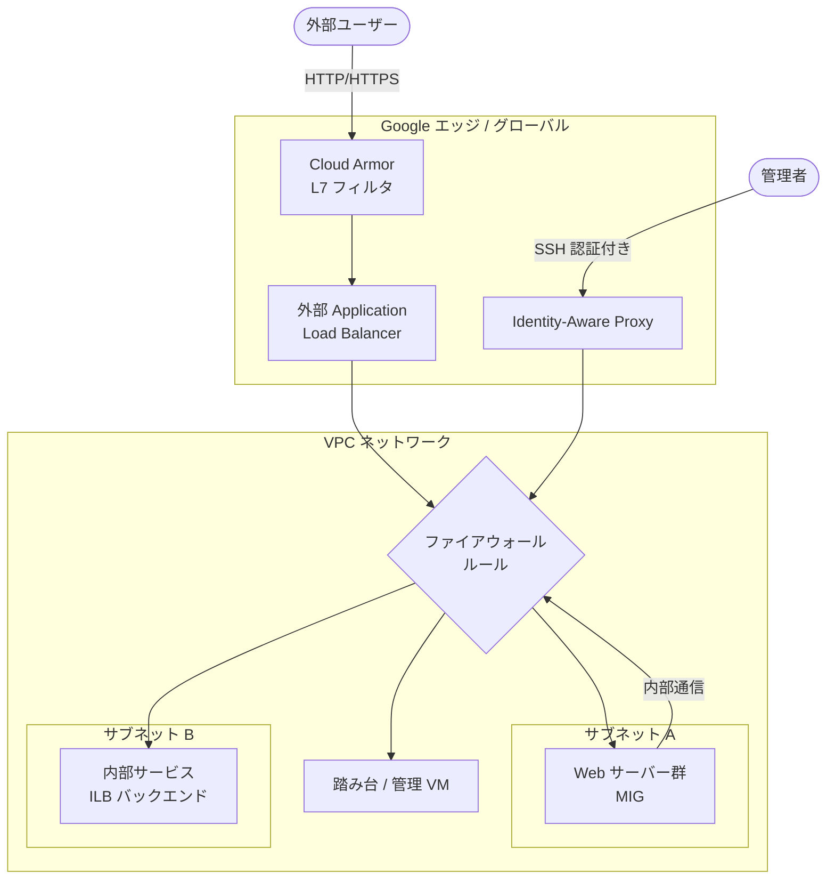

> **読み方のヒント**: 外部からの通信は必ず「エッジ → ファイアウォール → バックエンド」の順に通過します。各レイヤーで「不要な通信を落とす」ことが、多層防御 (defense in depth) の基本です。

---

## 2. VPC ネットワークの基礎

### 2-1. VPC とは何か

**定義**: VPC (Virtual Private Cloud) は、Google Cloud 上に作る論理的に隔離された仮想ネットワークです。物理的なデータセンターを意識せず、IP アドレス範囲・サブネット・ルーティング・ファイアウォールを自分で設計できます。

**なぜ必要か**: VPC は既定で「隔離されたプライベートネットワーク」です。異なる VPC 同士は、たとえ同じリージョンにあっても内部 IP では通信できません。この隔離こそがセキュリティの第一歩です。

### 2-2. 自動モード vs カスタムモード

サブネットの作られ方で2種類に分かれます。

| 項目 | 自動モード (Auto) | カスタムモード (Custom) |
|---|---|---|
| サブネット作成 | 全リージョンに自動生成 | 自分で必要な分だけ作成 |
| IP 範囲 | Google が自動割り当て | 自分で CIDR を指定 |
| 向いている用途 | 検証・学習 | 本番環境 |
| 制御の自由度 | 低い | 高い (推奨) |

> **ベストプラクティス**: 本番環境では**カスタムモード**を使います。サブネットを意図的に設計することで、IP の重複を防ぎ、リージョン配置を明示的に管理できるためです。

### 2-3. カスタム VPC を作る (コンソール / gcloud)

コンソールでの基本手順:

1. ナビゲーションメニュー → **VPC ネットワーク** → **VPC ネットワーク**
2. **VPC ネットワークを作成** をクリック
3. 名前を入力 (例: `privatenet`)
4. サブネット作成モードで **カスタム** を選択
5. サブネット名・リージョン・IPv4 範囲 (例: `172.16.0.0/24`) を指定
6. **作成** をクリック

同じ操作を gcloud で行う例:

```bash
# カスタムモードの VPC を作成
gcloud compute networks create privatenet --subnet-mode=custom

# サブネットを作成 (リージョンと CIDR を明示)
gcloud compute networks subnets create privatesubnet-1 \
  --network=privatenet \
  --region=us-central1 \
  --range=172.16.0.0/24
```

> **コンソールの「同等のコマンドライン」ボタンを活用しよう**: コンソールで設定した内容は、作成前に gcloud コマンドとして確認できます。これを `Infrastructure as Code` (IaC) 化の出発点にすると、再現性が高まります。

### 2-4. ネットワーク間の通信ルール — 重要な3原則

ラボの検証から導かれる、内部通信の鉄則です。

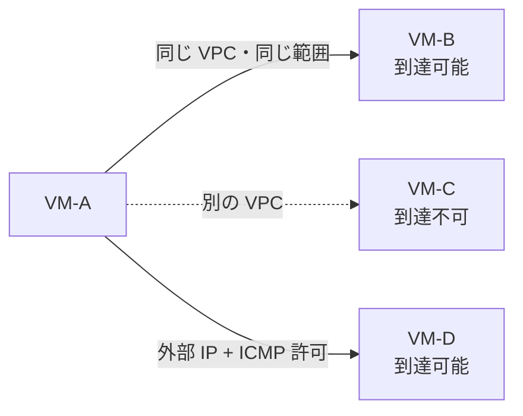

| ケース | 内部 IP での疎通 | 理由 |
|---|---|---|
| 同じ VPC 内 (別ゾーン・別リージョンでも可) | ✅ 可能 | VPC はグローバルリソース。内部通信が許可されている |
| 異なる VPC 間 | ❌ 不可 | VPC は既定で隔離される |
| 外部 IP 経由 | ファイアウォール次第 | ICMP/SSH を許可していれば疎通する |

> **重要**: 異なる VPC 間で内部通信したい場合は、**VPC ピアリング** または **Cloud VPN** を別途設定する必要があります。「同じリージョンだから通信できるはず」という思い込みは事故のもとです。

### 2-5. 複数ネットワークインターフェース (マルチ NIC)

1台の VM に複数の NIC を持たせ、複数の VPC に同時接続できます (インスタンスタイプにより最大8個)。

**注意すべき挙動 — デフォルトルート**:

- 各 NIC は自分のサブネット向けのルートを持つ
- ただし**デフォルトルートは primary インターフェース (eth0) のみ**に紐づく
- 直接接続されたサブネット以外への通信は、すべて eth0 から出ていく

```bash
# マルチ NIC VM のルーティングテーブルを確認
ip route
# 出力例: default via 172.16.0.1 dev eth0  ← デフォルトは eth0 のみ
```

> **落とし穴**: マルチ NIC は便利ですが、ルーティングの挙動を理解しないと「なぜか通信できない」という事態に陥ります。複雑な構成が必要な場合は、ポリシールーティングの設定を検討してください。また、マルチ NIC を使う前に「VPC ピアリングで十分ではないか」を必ず検討しましょう。

---

## 3. ファイアウォールルールの設計

### 3-1. ファイアウォールルールの構成要素

VPC ファイアウォールルールは、以下の要素で「どの通信を許可/拒否するか」を定義します。

| 要素 | 説明 | 例 |
|---|---|---|
| 方向 (Direction) | Ingress (受信) / Egress (送信) | Ingress |
| アクション | allow / deny | allow |
| ターゲット | ルールを適用する VM | ネットワークタグ `web-server` |
| ソースフィルタ | 通信元の指定 | IPv4 範囲 `0.0.0.0/0` |
| プロトコル/ポート | 許可する通信種別 | `tcp:80`, `icmp` |
| 優先度 (Priority) | 数値が小さいほど優先 | 1000 |

### 3-2. ネットワークタグ — 粒度の高い制御の鍵

**定義**: ネットワークタグは、VM に付ける「ラベル」です。ファイアウォールルールのターゲットをタグで指定すると、そのタグを持つ VM だけにルールが適用されます。

**なぜ重要か**: 「全インスタンスに適用」ではなく、タグで対象を絞ることで、**最小権限の原則**を実現できます。

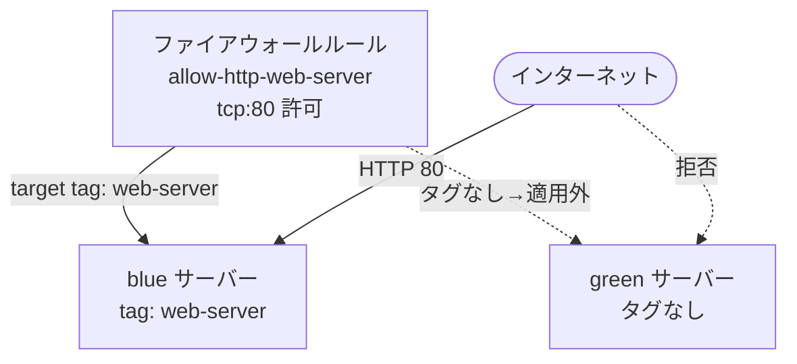

上図の例では、`web-server` タグを持つ `blue` だけが外部から HTTP アクセス可能で、タグのない `green` には外部からアクセスできません。

### 3-3. 良い例 / 悪い例

```bash
# ❌ 悪い例: 全 VM に対し、全 IP から SSH を許可
gcloud compute firewall-rules create bad-ssh \
  --direction=INGRESS --action=allow \
  --rules=tcp:22 --source-ranges=0.0.0.0/0

# ✅ 良い例: 特定タグの VM にのみ、IAP の範囲からだけ SSH を許可
gcloud compute firewall-rules create allow-ssh-from-iap \
  --direction=INGRESS --action=allow \
  --rules=tcp:22 \
  --source-ranges=35.235.240.0/20 \
  --target-tags=allow-iap-ssh
```

| 観点 | 悪い例 | 良い例 |
|---|---|---|
| ソース範囲 | `0.0.0.0/0` (全世界) | `35.235.240.0/20` (IAP のみ) |
| ターゲット | 全 VM | 特定タグの VM のみ |
| 攻撃面 | 非常に広い | 最小限 |

> **ベストプラクティス**: ソース範囲は**できる限り狭く**します。Google も公式に「`default-allow-ssh` / `default-allow-rdp` のデフォルトルール (全 IP から SSH/RDP を許可) は削除または無効化を推奨」としています。

### 3-4. 暗黙のルール

VPC には、最初から2つの暗黙のルールが存在します。

| ルール | 内容 | 優先度 |
|---|---|---|
| implied allow egress | 全送信トラフィックを許可 | 65535 |
| implied deny ingress | 全受信トラフィックを拒否 | 65535 |

つまり、**何も設定しなければ外部からの受信はすべてブロックされます**。あなたが作る `allow` ルールは「この拒否の上に穴を開ける」行為です。だからこそ、開ける穴は最小限にすべきなのです。

---

## 4. IAM とサービスアカウント — 最小権限の原則

### 4-1. なぜサービスアカウントを使うのか

**定義**: サービスアカウントは、人間ではなく**アプリケーションや VM** が使う特別な Google アカウントです。

**なぜ重要か**: VM が Google Cloud API を操作する際、個人ユーザーの権限を使うのは危険です。サービスアカウントに「必要なロールだけ」を割り当てることで、**最小権限の原則 (principle of least privilege)** を守れます。

### 4-2. ネットワーク管理向けの2つのロール

ネットワーク管理を職務分掌 (separation of duties) するため、Google は2つのロールを用意しています。

| ロール | できること | できないこと |
|---|---|---|
| **Compute Network Admin** | ネットワーク・サブネット・ルートの作成/変更/削除、ファイアウォールルールの**閲覧** | ファイアウォールルールの変更/削除、SSL 証明書の管理 |
| **Compute Security Admin** | ファイアウォールルール・SSL 証明書の作成/変更/削除 | (ネットワークリソース全般の管理は対象外) |

ラボでの検証結果をまとめると:

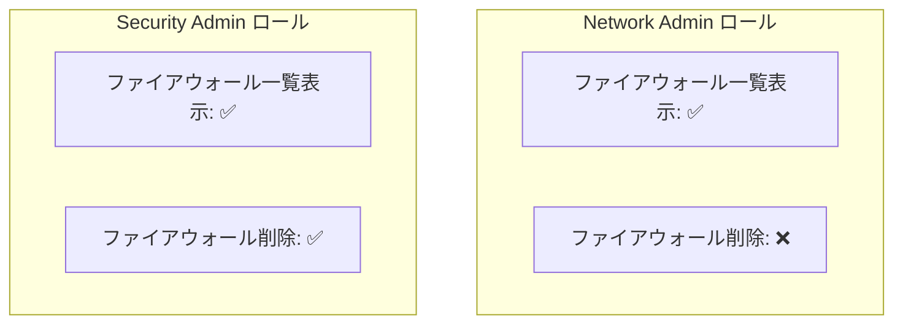

> **設計思想**: ネットワーク構成を作る人と、セキュリティルール (ファイアウォール) を管理する人を分けることで、「1人の権限が大きすぎる」リスクを減らせます。これが職務分掌です。

### 4-3. サービスアカウント運用の注意点

ラボでは学習のため JSON キーをダウンロードして VM に渡しますが、**本番ではこれを避けるべき**です。

| 方法 | セキュリティ | 推奨度 |
|---|---|---|
| JSON キーをダウンロードして配布 | キー漏洩リスクが高い | ⚠️ 非推奨 |
| VM にサービスアカウントを直接アタッチ | キーレス・自動ローテーション | ✅ 推奨 |
| Workload Identity (GKE) | キーレス | ✅ 推奨 |

> **ベストプラクティス**: サービスアカウントキー (JSON) は可能な限り発行しないでください。VM には作成時にサービスアカウントを直接アタッチし、必要な API スコープ/ロールを付与する方式が安全です。

---

## 5. IAP — 踏み台サーバーを排除する安全なアクセス

### 5-1. IAP TCP フォワーディングとは

**定義**: Identity-Aware Proxy (IAP) TCP フォワーディングは、暗号化されたトンネルを通じて SSH・RDP などの TCP トラフィックを VM に転送する仕組みです。

**何が嬉しいのか**: VM に**外部 IP アドレスを付けずに**、安全に管理アクセスできます。従来必要だった踏み台サーバー (bastion) や VPN を不要にできるのが最大の利点です。

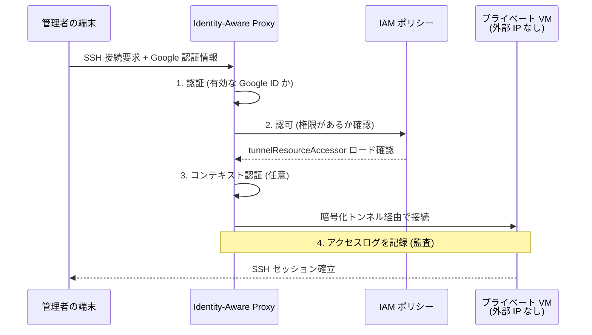

IAP は接続時に4つの機能を実行します: **認証** (有効な Google 認証情報の確認)、**認可** (IAM ポリシーの確認)、**コンテキスト認識アクセス** (端末・場所の検証、任意)、**監査** (接続の成否をログ記録)。

### 5-2. IAP を有効にする3ステップ

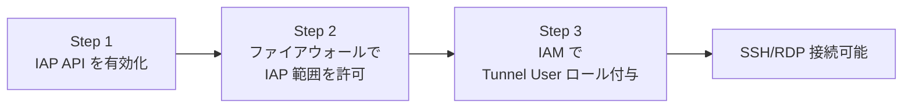

**Step 1: API の有効化**
ナビゲーションメニュー → API とサービス → ライブラリ → 「Cloud Identity-Aware Proxy API」を有効化。

**Step 2: ファイアウォールルールの作成**
IAP は固定の IP 範囲 `35.235.240.0/20` からアクセスします。この範囲からの SSH (22) / RDP (3389) を許可します。

```bash
gcloud compute firewall-rules create allow-ingress-from-iap \
  --direction=INGRESS \
  --action=allow \
  --rules=tcp:22,tcp:3389 \
  --source-ranges=35.235.240.0/20
```

| 設定項目 | 値 |
|---|---|
| 名前 | `allow-ingress-from-iap` |
| 方向 | Ingress |
| ソース IPv4 範囲 | `35.235.240.0/20` |
| プロトコル/ポート | `tcp:22`, `tcp:3389` |

> **なぜこの IP 範囲なのか**: `35.235.240.0/20` は、IAP が TCP フォワーディングに使うすべての IP を含む範囲です。この範囲だけを許可すれば、「IAP 経由のアクセスだけ」を受け入れられます。(IPv6 VM の場合は `2600:2d00:1:7::/64` を使用)

**Step 3: IAM ロールの付与**
セキュリティ → Identity-Aware Proxy → 「SSH and TCP Resources」タブで対象 VM を選択し、接続を許可したいユーザー/サービスアカウントに **Cloud IAP > IAP-Secured Tunnel User** ロールを付与します。

### 5-3. トンネルを使った接続

```bash
# SSH (外部 IP がなければ自動的に IAP トンネルを使用)
gcloud compute ssh linux-iap --tunnel-through-iap

# RDP 用にローカルポートへトンネルを張る
gcloud compute start-iap-tunnel windows-iap 3389 \
  --local-host-port=localhost:0 \
  --zone=us-central1-a
# → "Listening on port [XXXX]" と表示されたら、
#    RDP クライアントで localhost:XXXX に接続
```

> **ベストプラクティス**: 外部 IP を持たない VM へは IAP を標準的なアクセス手段にしましょう。`--tunnel-through-iap` フラグを明示すると、常に IAP 経由になることを保証できます。さらに Chrome Enterprise Premium のアクセスレベルと組み合わせると、端末の状態 (デバイスポスチャ) に基づく**コンテキスト認識アクセス**で、ゼロトラストを強化できます。

---

## 6. 外部 Application Load Balancer と Cloud Armor

### 6-1. グローバル外部 Application Load Balancer の仕組み

**定義**: グローバル外部 Application Load Balancer (L7) は、ユーザートラフィックを Google エッジ (PoP: Point of Presence) で受け取り、Google のプライベート光ファイバーバックボーン経由で最も近い健全なバックエンドへルーティングします。

**何が嬉しいのか**: 世界中のユーザーに対し、**1つのグローバル IP** で低遅延・高可用性のアクセスを提供できます。

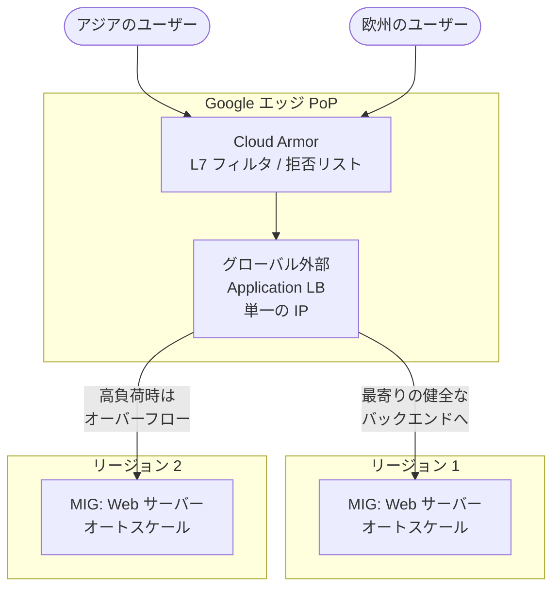

### 6-2. 構成要素

| コンポーネント | 役割 |
|---|---|
| 転送ルール / フロントエンド | グローバル IP・ポート・プロトコルを定義 |
| バックエンドサービス | トラフィック分散方法とヘルスチェックを管理 |
| インスタンステンプレート | VM の設計図 (マシンタイプ・イメージ・起動スクリプト) |
| マネージドインスタンスグループ (MIG) | 同一構成 VM の集合。自動スケール・自己修復 |
| ヘルスチェック | 健全なインスタンスだけにトラフィックを送る |

### 6-3. 必須のファイアウォールルール2つ

外部 LB を機能させるには、2つのルールが必要です。

```bash
# 1. ユーザーからの HTTP を許可 (http-server タグの VM へ)
gcloud compute firewall-rules create default-allow-http \
  --network=default --action=allow --direction=ingress \
  --rules=tcp:80 \
  --source-ranges=0.0.0.0/0 \
  --target-tags=http-server

# 2. Google のヘルスチェックを許可 (専用の範囲から)
gcloud compute firewall-rules create default-allow-health-check \
  --network=default --action=allow --direction=ingress \
  --rules=tcp \
  --source-ranges=130.211.0.0/22,35.191.0.0/16 \
  --target-tags=http-server
```

> **超重要 — ヘルスチェックの IP 範囲**: ヘルスチェックのプローブは `130.211.0.0/22` と `35.191.0.0/16` から来ます。この2つの範囲からの通信を許可しないと、バックエンドが「unhealthy」と判定され、**トラフィックが一切流れません**。LB のトラブルの大半はこの設定漏れが原因です。

### 6-4. 負荷分散モード

バックエンドごとに「どう限界を判定するか」を選べます。

| 分散モード | 判定基準 | 設定例 |
|---|---|---|
| Rate (レート) | 1秒あたりのリクエスト数 (RPS) | 最大 50 RPS/インスタンス |
| Utilization (使用率) | CPU 使用率 | 最大 80% |

> **挙動のポイント**: 通常トラフィックは「最寄りのバックエンド」に送られますが、負荷が非常に高くなると、別リージョンのバックエンドへ**オーバーフロー**します。これがクロスリージョンのフェイルオーバーと耐障害性を実現します。

### 6-5. Cloud Armor — エッジでの防御

**定義**: Cloud Armor は、Google エッジで L7 フィルタリングと IP 制御を行うサービスです。

**なぜ重要か**: 悪意あるトラフィック (L7 フラッドなど) を、**VPC やバックエンドに到達する前に**エッジで遮断できます。バックエンドのリソースを消費させません。

拒否リスト (denylist) ポリシーの作成例:

| 設定項目 | 値 |
|---|---|
| ポリシー名 | `denylist-siege` |
| デフォルトルール | Allow (許可) |
| 追加ルール条件 | 攻撃元 IP (例: `203.0.113.10/32`) |
| アクション | Deny (拒否) |
| レスポンスコード | 403 (Forbidden) |
| 優先度 | 1000 |
| ターゲット | バックエンドサービス (`http-backend`) |

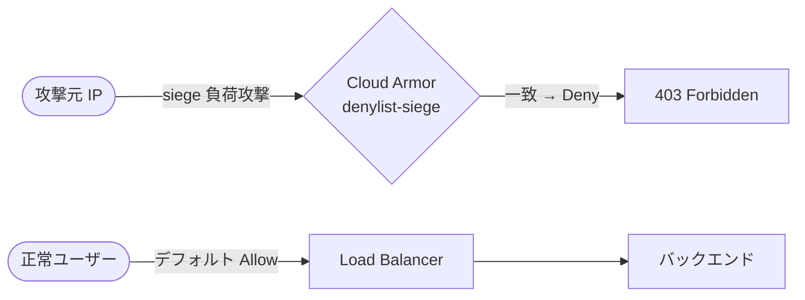

> **ベストプラクティス**: 防御の発想は2通りあります。(1) デフォルト Allow + 攻撃元を拒否リスト化、(2) デフォルト Deny + 許可した IP だけを許可リスト化。よりセキュアなのは**(2) の許可リスト方式**です。Cloud Armor のログを有効にすれば、いつ・どの IP がブロックされたかを後から追跡できます。

---

## 7. 内部ロードバランサ (ILB)

### 7-1. ILB とは

**定義**: 内部ロードバランサ (ILB) は、TCP/UDP トラフィックを**プライベートネットワーク内**の VM へ分散する**リージョナル**サービスです。

**何が嬉しいのか**: マイクロサービス・API エンドポイント・データベースなど、「インターネットには公開したくないが、内部サービスからは高可用に使いたい」リソースに、**単一の安定したプライベート IP** を提供します。

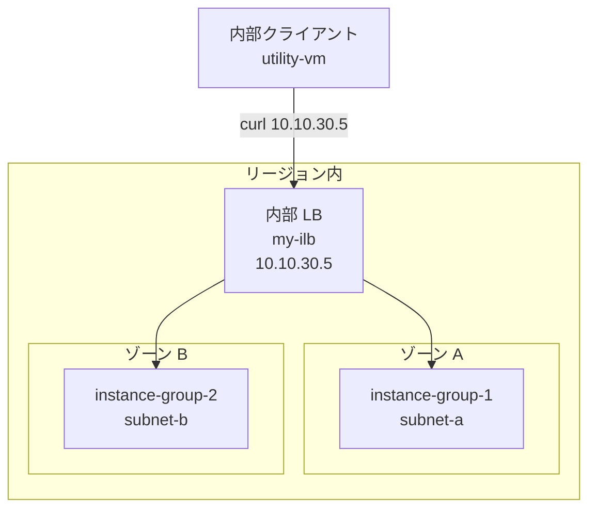

### 7-2. 外部 LB との違い

| 項目 | 外部 Application LB | 内部 LB (passthrough) |
|---|---|---|
| スコープ | グローバル | リージョナル |
| 公開範囲 | インターネット | VPC 内部のみ |
| IP | 外部グローバル IP | 内部プライベート IP |
| レイヤー | L7 (HTTP/HTTPS) | L4 (TCP/UDP) |
| 主な用途 | 公開 Web アプリ | 内部マイクロサービス |

### 7-3. 高可用性のための配置設計

ILB はリージョナルサービスなので、**複数ゾーン**にバックエンドを配置することがゾーン障害への耐性を生みます。

```bash
# subnet-a と subnet-b は同一リージョンの異なるゾーンに配置
# → 1つのゾーンが落ちても、もう一方が稼働を継続
```

ヘルスチェックのファイアウォール範囲は外部 LB と同じく `130.211.0.0/22` と `35.191.0.0/16` を許可します。バックエンドへの HTTP は、内部通信用に VPC の CIDR (例: `10.10.0.0/16`) からのみ許可します。

> **ベストプラクティス**: ILB のバックエンド VM には**外部 IP を付けない** (External IPv4 Address: None) ようにします。内部サービスはインターネットに露出させないのが原則です。

---

## 8. 総合演習 — セキュアなネットワークを設計する

ここまでの知識を統合した「あるべき構成」を考えます。題材は「公開 Web アプリ (juice-shop) を持つ小規模サイトのセキュリティ強化」です。

### 8-1. 要件

| # | 要件 |
|---|---|
| 1 | 踏み台 (bastion) は**公開 IP を持たない** |
| 2 | bastion への SSH は **IAP 経由のみ** |
| 3 | アプリサーバーへの SSH は **bastion 経由のみ** |
| 4 | アプリサーバーへは **HTTP だけ**を世界に公開 |

### 8-2. アクセス経路の設計

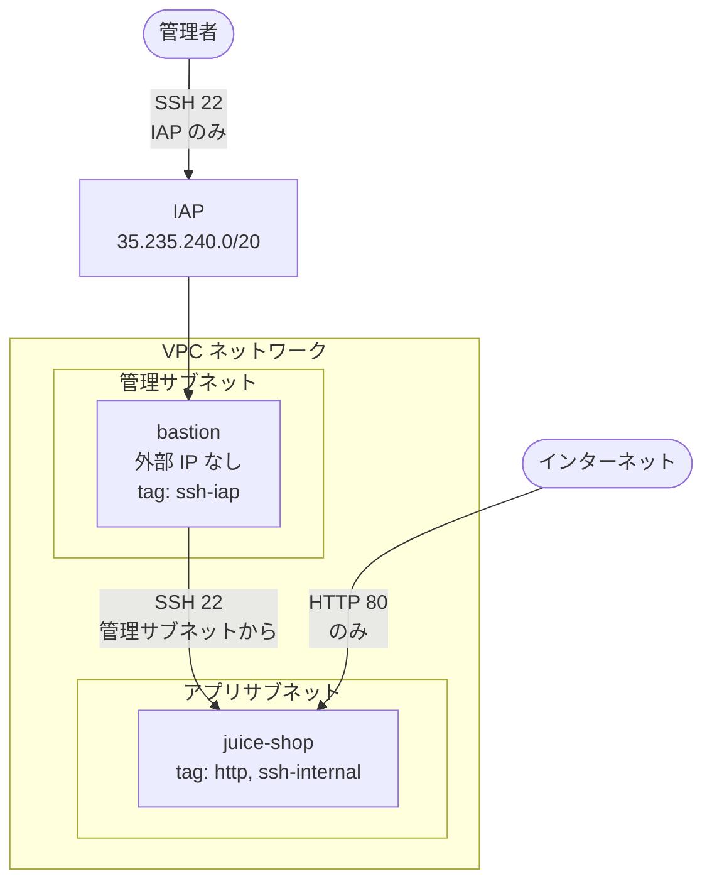

### 8-3. 必要なファイアウォールルール (タグ設計)

| ルール | 方向 | 許可 | ソース | ターゲットタグ |
|---|---|---|---|---|
| IAP からの SSH | Ingress | tcp:22 | `35.235.240.0/20` | `ssh-iap` (bastion) |
| 世界への HTTP | Ingress | tcp:80 | `0.0.0.0/0` | `http` (juice-shop) |
| bastion からの内部 SSH | Ingress | tcp:22 | 管理サブネットの CIDR | `ssh-internal` (juice-shop) |

### 8-4. 設計の要点

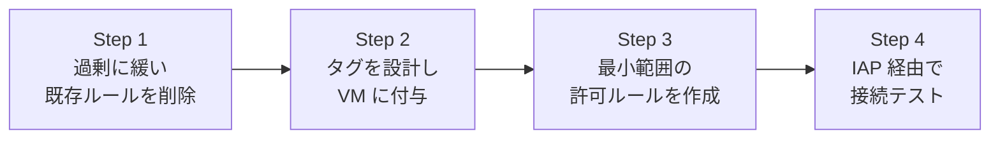

> **最重要原則 — 最小権限**: ソース範囲は必ず**最小限**にします。「とりあえず `0.0.0.0/0`」は SSH では絶対に避け、SSH は IAP 範囲か管理サブネットの CIDR に限定します。HTTP だけは公開サービスの性質上 `0.0.0.0/0` が妥当ですが、それ以外のポートは公開しません。過度に緩い設定は、本番でもセキュリティ評価でも「不正解」です。

> **トラブル時のヒント**: `gcloud compute ssh` や IAP トンネルで接続できないときは、`--troubleshoot` フラグを付けると、ファイアウォール・IAM・ネットワーク到達性を自動診断してくれます。

---

## 9. ベストプラクティス チェックリスト

### ネットワーク設計

- [ ] 本番ではカスタムモード VPC を使い、サブネットを意図的に設計する
- [ ] サブネットの CIDR は重複させない (特にマルチ NIC や VPC ピアリングで必須)
- [ ] 異なる VPC 間通信は VPC ピアリング/VPN で明示的に設定する

### ファイアウォール

- [ ] ソース範囲は最小限にする (`0.0.0.0/0` を SSH/RDP に使わない)
- [ ] ターゲットはネットワークタグで絞り、「全インスタンス」適用を避ける
- [ ] `default-allow-ssh` / `default-allow-rdp` のデフォルトルールは削除/無効化する
- [ ] ロードバランサ利用時は `130.211.0.0/22` と `35.191.0.0/16` からのヘルスチェックを許可する

### アクセス制御

- [ ] 外部 IP なしの VM へは IAP TCP フォワーディングでアクセスする
- [ ] IAP は `35.235.240.0/20` のみを許可するファイアウォールと組み合わせる
- [ ] IAP-Secured Tunnel User ロールは VM/プロジェクト単位で最小限に付与する
- [ ] 可能なら Chrome Enterprise Premium のアクセスレベルでコンテキスト認識アクセスを追加する

### IAM / サービスアカウント

- [ ] 最小権限の原則に従い、必要なロールだけを付与する
- [ ] ネットワーク管理とセキュリティ管理のロールを分離する (職務分掌)
- [ ] サービスアカウントキー (JSON) の発行を避け、VM への直接アタッチを使う

### ロードバランシング / エッジ防御

- [ ] バックエンドは複数ゾーン/リージョンに配置して可用性を確保する
- [ ] 内部サービスのバックエンド VM には外部 IP を付けない
- [ ] Cloud Armor は可能なら「デフォルト Deny + 許可リスト」方式にする
- [ ] Cloud Armor とヘルスチェックのログを有効にして可観測性を確保する

---

## 10. 参考ソース (公式ドキュメント URL)

### Identity-Aware Proxy (IAP)

- IAP TCP フォワーディングの使用: https://cloud.google.com/iap/docs/using-tcp-forwarding
- IAP TCP フォワーディングのセットアップ: https://cloud.google.com/iap/docs/tcp-by-host
- IAP のトラブルシューティング / FAQ: https://cloud.google.com/iap/docs/faq
- 外部 Application Load Balancer のセットアップ (IAP): https://cloud.google.com/iap/docs/load-balancer-howto

### VPC ネットワーク / ファイアウォール

- VPC ネットワークの概要: https://cloud.google.com/vpc/docs/vpc
- VPC ファイアウォールルールの概要: https://cloud.google.com/firewall/docs/firewalls
- SSH ネットワークアクセス制御のベストプラクティス: https://cloud.google.com/compute/docs/connect/ssh-best-practices/network-access
- 複数ネットワークインターフェース: https://cloud.google.com/vpc/docs/create-use-multiple-interfaces

### IAM / サービスアカウント

- IAM の概要: https://cloud.google.com/iam/docs/overview
- Compute Engine の IAM ロール: https://cloud.google.com/compute/docs/access/iam
- サービスアカウントのベストプラクティス: https://cloud.google.com/iam/docs/best-practices-service-accounts

### ロードバランシング

- Cloud Load Balancing の概要: https://cloud.google.com/load-balancing/docs/load-balancing-overview
- ヘルスチェックの概要 (IP 範囲): https://cloud.google.com/load-balancing/docs/health-check-concepts
- ヘルスチェックの使用: https://cloud.google.com/load-balancing/docs/health-checks
- 外部 Application Load Balancer のセットアップ: https://cloud.google.com/load-balancing/docs/https/setting-up-https
- 内部 passthrough Network Load Balancer: https://cloud.google.com/load-balancing/docs/internal

### Cloud Armor

- Google Cloud Armor の概要: https://cloud.google.com/armor/docs/cloud-armor-overview
- セキュリティポリシーの設定: https://cloud.google.com/armor/docs/configure-security-policies

### スキルバッジ (元ラボ)

- Build a Secure Google Cloud Network: https://www.cloudskillsboost.google/course_templates/635

---

> **学習を次に進めるために**: 各ラボの手順を一度なぞったら、必ず「なぜこの設定なのか」を自問してください。特に「ソース範囲は最小か」「タグで絞れているか」「外部 IP は本当に必要か」の3点は、本番設計でもセキュリティレビューでも問われ続ける核心です。