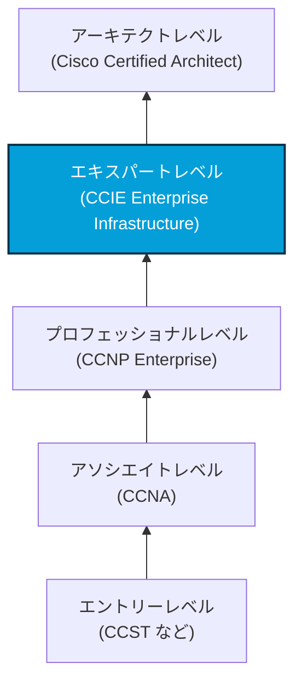
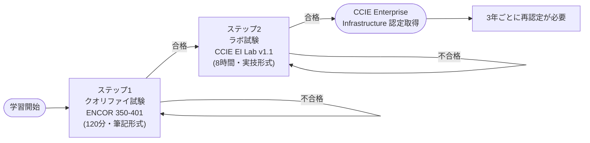
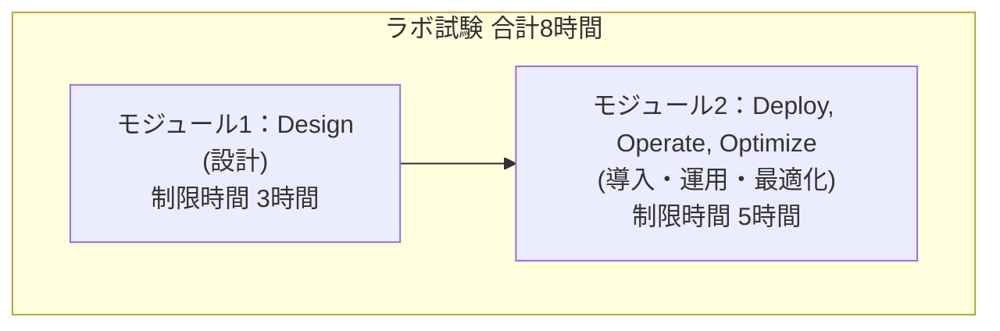
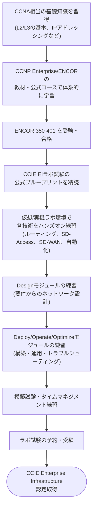

# CCIE Enterprise Infrastructure 認定 完全ガイド

### 〜初学者のためのステップバイステップ解説〜

> **本ガイドについて**
> 本ドキュメントは、Cisco公式サイトおよび公式試験ブループリント（試験内容PDF）を一次情報源として作成しています。CCIE認定プログラムは技術トレンドに合わせて頻繁に改訂されるため、最終的な受験判断の前には必ず末尾の「参考ソース」に記載した公式URLで最新情報をご確認ください。
> 本ガイドの情報基準日：2026年7月

---

## 目次

1. [CCIE Enterprise Infrastructureとは](#1-ccie-enterprise-infrastructureとは)
2. [認定取得までの全体像（2ステップ構成）](#2-認定取得までの全体像2ステップ構成)
3. [ステップ1：クオリファイ試験（ENCOR 350-401）](#3-ステップ1クオリファイ試験encor-350-401)
4. [ステップ2：ラボ試験（CCIE Enterprise Infrastructure Lab）](#4-ステップ2ラボ試験ccie-enterprise-infrastructure-lab)
5. [受験前提条件・推奨経験](#5-受験前提条件推奨経験)
6. [費用の内訳](#6-費用の内訳)
7. [再認定（Recertification）](#7-再認定recertification)
8. [初学者向け学習ロードマップ](#8-初学者向け学習ロードマップ)
9. [よくある質問](#9-よくある質問)
10. [参考ソース](#10-参考ソース)

---

## 1. CCIE Enterprise Infrastructureとは

CCIE（Cisco Certified Internetwork Expert）Enterprise Infrastructureは、Ciscoの認定体系の中で最上位に位置する**エキスパートレベル**の資格の一つです。複雑なエンタープライズネットワークインフラストラクチャの**設計・導入・運用・最適化・自動化**という、ネットワークライフサイクル全体にわたるスキルを証明するものです。

Ciscoの認定体系全体における位置づけは次のとおりです。

CCIEにはEnterprise Infrastructure以外にも、Enterprise Wireless／Data Center／Security／Service Provider／Collaborationなど複数のトラックが存在しますが、本ガイドは**Enterprise Infrastructure（略称：CCIE EI）**に絞って解説します。

---

## 2. 認定取得までの全体像（2ステップ構成）

CCIE Enterprise Infrastructure認定を取得するには、以下の**2つの試験に合格する必要があります**。

| ステップ | 試験名 | 形式 | 位置づけ |
|---|---|---|---|
| ステップ1 | Implementing and Operating Cisco Enterprise Network Core Technologies（ENCOR 350-401） | 筆記（選択式・ドラッグ&ドロップ等） | コア技術の知識を問う。合格するとスペシャリスト認定も取得できる |
| ステップ2 | CCIE Enterprise Infrastructure Lab Exam | 8時間のハンズオン実技試験 | 設計〜導入〜運用〜最適化までのライフサイクル全体を実機/仮想環境で検証 |

なお、ENCOR 350-401は**CCNP Enterprise**の必須コア試験と共通です。そのためENCORに合格した時点で、追加のコンセントレーション試験（ENARSI、ENWLSI、ENSDWI など）を1つ受験すればCCNP Enterpriseも取得できます。CCIE EIを目指す場合はこのコンセントレーション試験は必須ではなく、ENCOR合格後に直接ラボ試験へ進むことも可能です。

---

## 3. ステップ1：クオリファイ試験（ENCOR 350-401）

### 3.1 試験の基本情報

| 項目 | 内容 |
|---|---|
| 試験名 | Implementing Cisco Enterprise Network Core Technologies（350-401 ENCOR）v1.2 |
| 試験時間 | 120分 |
| 試験言語 | 日本語、英語 |
| 受験会場 | ピアソンVUE（テストセンターまたはオンライン監督形式） |
| 受験料 | 400 USD |
| 関連資格 | CCNP Enterprise、CCIE Enterprise Infrastructure、CCIE Enterprise Wireless、Cisco Certified Specialist - Enterprise Core |

### 3.2 出題ドメインと比率（v1.2ブループリント）

Cisco公式の試験内容PDFに基づく出題比率は以下のとおりです。

| No | ドメイン | 出題比率 | 主な内容 |
|---|---|---|---|
| 1 | アーキテクチャ | 15% | 2階層/3階層設計、ファブリック、クラウド、高可用性（FHRP、SSO）、SD-WAN/SD-Accessの動作原理、QoS設定の理解 |
| 2 | 仮想化 | 10% | ハイパーバイザ（Type1/2）、仮想マシン、仮想スイッチング、VRF、GRE/IPsecトンネリング、LISP、VXLAN |
| 3 | インフラストラクチャ | 30% | L2（802.1qトランク、EtherChannel、STP/RSTP/MST）、L3（EIGRP・OSPF比較、OSPFv2/v3設定、eBGP、PBR）、IPサービス（NTP/PTP、NAT/PAT、HSRP/VRRP、マルチキャスト） |
| 4 | ネットワークアシュアランス | 10% | デバッグ・トレースルート・SNMP・syslogによる診断、Flexible NetFlow、SPAN/RSPAN/ERSPAN、IP SLA、Cisco Catalyst Center、NETCONF/RESTCONF |
| 5 | セキュリティ | 20% | デバイスアクセス制御、AAA、ACL、CoPP、REST APIセキュリティ、脅威防御・エンドポイントセキュリティ・NGFW、TrustSec/MACsec |
| 6 | 自動化と人工知能 | 15% | Python基礎、JSON、YANGなどのデータモデリング言語、Catalyst Center/SD-WAN Manager API、EEMアプレット、エージェント/エージェントレス型オーケストレーションツールの比較 |

> **初学者への補足**：出題比率が最も高いのは「インフラストラクチャ」（30%）と「セキュリティ」（20%）です。学習の優先順位を決める際は、この比率を参考に時間配分を決めると効率的です。「自動化と人工知能」ドメインは近年のブループリント改訂で強化された分野であり、Python・API操作の基礎は避けて通れません。

### 3.3 推奨される準備方法

- Cisco公式コース「Implementing Cisco Enterprise Network Core Technologies (ENCOR)」の受講
- 公式試験内容PDF（末尾の参考ソース参照）を精読し、出題範囲の抜け漏れを確認
- ルーティング（EIGRP/OSPF/BGP）とQoS、セキュリティ機能は実機または仮想ラボでのハンズオン練習を並行して行う

---

## 4. ステップ2：ラボ試験（CCIE Enterprise Infrastructure Lab）

### 4.1 試験の基本情報

| 項目 | 内容 |
|---|---|
| 試験名 | CCIE Enterprise Infrastructure Lab Exam v1.1 |
| 試験時間 | 8時間（ハンズオン実技） |
| 受験資格 | ENCOR 350-401 合格が前提 |
| 受験料 | 1,600 USD（テストセンター受験、またはBYODモバイルラボ）／1,900 USD（Ciscoキット利用のモバイルラボ受験） |
| 出題形式 | クローズドブック（外部資料の持ち込み不可） |
| 認定有効期間 | 3年間 |

### 4.2 試験構成（2モジュール制）

現行のラボ試験は、以下の2つのモジュールから構成されています。

- **Designモジュール（3時間）**：要件に基づいてネットワークを設計する能力を問われます。
- **Deploy, Operate, Optimize（DOO）モジュール（5時間）**：実際に機器を構築・導入し、運用およびトラブルシューティング・最適化を行う能力が問われます。

> **今後の変更予定について**：Cisco Learning Networkの公式発表によると、2027年3月23日以降に予約されるCCIEラボ試験からは、AIをツールとして活用しながら導入・運用・最適化を行う新しい「AI DOO」モジュールが追加される予定です。本ガイド執筆時点（2026年7月）ではまだ適用されていませんが、今後受験を予定する場合は公式サイトで最新の試験形式を確認してください。

### 4.3 出題ドメインと比率（v1.1ブループリント）

Cisco公式ブループリントに基づく出題比率は以下のとおりです。

| No | ドメイン | 出題比率 | 主な内容 |
|---|---|---|---|
| 1 | ネットワークインフラストラクチャ | 30% | スイッチドキャンパス（VLAN、EtherChannel、STP、L2プロトコル）、ルーティング概念（VRF-Lite、ルートリーキング、再配送）、EIGRP、OSPF（v2/v3）、BGP、マルチキャスト |
| 2 | ソフトウェア定義インフラストラクチャ | 25% | Cisco SD-Access（アンダーレイ/オーバーレイ、ファブリック設計・展開、境界ハンドオフ、セグメンテーション）、Cisco SD-WAN（vManage/vBond/vSmartのコントローラアーキテクチャ、OMP、集中/ローカルポリシー） |
| 3 | トランスポート技術とソリューション | 15% | 静的P2P GREトンネル、MPLS（LDP、L3VPN、PE-CE BGP）、DMVPN（Phase 3、NHRP、IPsec/IKEv2） |
| 4 | インフラストラクチャセキュリティとサービス | 15% | デバイスセキュリティ（CoPP、AAA）、スイッチ/ルータセキュリティ機能（DHCPスヌーピング、ARPインスペクション、IPv6セキュリティ）、QoS、ネットワークサービス（FHRP、NTP/PTP、DHCP、NAT）、SPAN/ERSPAN、トラブルシューティングツール |
| 5 | インフラストラクチャの自動化とプログラマビリティ | 15% | JSON/XML/YAML/Jinja、EEMアプレット、Guest Shell（Linux環境・Python）、vManage APIおよびCisco DNA Center APIとの連携、モデル駆動型テレメトリ（gRPC） |

> **初学者への補足**：ラボ試験では「ソフトウェア定義インフラストラクチャ」（SD-Access／SD-WAN）が25%と非常に高い比率を占めます。従来型のルーティング・スイッチング技術（ドメイン1）に加えて、SD-Access・SD-WANの設計・構築経験がなければ合格は難しい構成になっています。

---

## 5. 受験前提条件・推奨経験

Cisco公式サイトによれば、CCIE Enterprise Infrastructureには**正式な前提条件はありません**（ENCOR合格は必須ですが、CCNAやCCNPの保有そのものは必須ではありません）。ただし、以下の経験が推奨されています。

- エンタープライズネットワーキング技術・ソリューションの**設計・導入・運用・最適化について5年から7年の実務経験**
- ENCOR 350-401の出題範囲を十分に理解していること
- ラボ試験の出題範囲（SD-Access、SD-WAN、自動化・プログラマビリティを含む）を実機・仮想環境で経験していること

---

## 6. 費用の内訳

| 項目 | 費用目安 | 備考 |
|---|---|---|
| ENCOR 350-401（クオリファイ試験） | 400 USD | 受験ごとに発生（不合格の場合は再受験費用も同額） |
| CCIE EIラボ試験 | 1,600 USD（テストセンター／BYODモバイルラボ） | Ciscoキット利用のモバイルラボの場合は1,900 USD |
| トレーニング教材・書籍・仮想ラボ環境利用料 | 個人差が大きい（数百〜数千USD規模） | 独学か公式トレーニング受講かで大きく変動 |
| 渡航・宿泊費 | 変動 | ラボ試験会場は世界の一部拠点に限定されるため、遠方受験の場合は交通・宿泊費が発生 |

> 上記のうちCisco公式サイトで明記されているのは、ENCORの受験料（400 USD）とラボ試験の受験料（1,600 USD／1,900 USD）です。教材費や渡航費を含めた総額の見積もりは受験者ごとに幅があるため、あくまで目安としてご覧ください。

---

## 7. 再認定（Recertification）

CCIE Enterprise Infrastructure認定の**有効期間は3年間**です。有効期限内に以下のいずれかの方法で再認定を行う必要があります（詳細は末尾の再認定ポリシーページを参照）。

- 該当分野の試験に再度合格する
- Cisco Continuing Education（CE）プログラムのクレジットを取得する
- 上記を組み合わせる

---

## 8. 初学者向け学習ロードマップ

これから学習を始める方向けに、一般的な学習ステップの流れをまとめました。

学習期間はバックグラウンドによって大きく異なりますが、実務経験が浅い場合は数年単位、実務経験が豊富な場合でも半年〜1年程度の集中学習を要することが一般的とされています。

---

## 9. よくある質問

**Q. CCNAやCCNPを持っていないとCCIE EIは受験できませんか？**
A. 公式な前提資格はありません。ENCOR 350-401に合格すればラボ試験の受験資格を得られます。ただし出題範囲を考えると、CCNA〜CCNPレベルの知識は事実上前提になります。

**Q. ラボ試験はどこでも受けられますか？**
A. 世界の一部のテストセンターでのみ実施されるほか、自分のPCを持ち込んで受験する「BYODモバイルラボ」形式も用意されています。詳細は公式サイトの試験会場ページで確認してください。

**Q. ENCOR合格後、すぐにラボ試験を受けなければなりませんか？**
A. 明確な期限は設けられていませんが、出題内容がバージョンアップされる可能性があるため、公式サイトで最新のブループリントを定期的に確認することをおすすめします。

---

## 10. 参考ソース

本ガイドの内容は、以下のCisco公式ページおよび公式PDF文書を情報源としています。

- CCIE Enterprise Infrastructure 認定とトレーニングプログラム（Cisco公式・日本語）
  https://www.cisco.com/c/ja_jp/training-events/training-certifications/certifications/expert/ccie-enterprise-infrastructure.html
- Implementing Cisco Enterprise Network Core Technologies (350-401 ENCOR)（Cisco公式・日本語）
  https://www.cisco.com/c/ja_jp/training-events/training-certifications/exams/current-list/encor-350-401.html
- ENCOR 350-401 試験内容（出題ブループリント）PDF（Cisco公式・日本語）
  https://www.cisco.com/c/dam/global/ja_jp/training-events/training-certifications/exam-topics/350-401-ENCOR.pdf
- CCIE Enterprise Infrastructure v1.1 Exam Topics（ラボ試験ブループリントPDF、Cisco公式）
  https://learningcontent.cisco.com/documents/marketing/exam-topics/CCIE_EI_v1.1_Blue_Print.pdf
- Cisco Expert Certifications Exams and Training（受験料・再認定等、Cisco公式）
  https://www.cisco.com/site/us/en/learn/training-certifications/certifications/expert/exams-training.html
- CCIE Enterprise Infrastructure（Cisco Learning Network公式コミュニティページ）
  https://learningnetwork.cisco.com/s/ccie-enterprise
- CCIE Practical Exam Format（ラボ試験形式、AI DOOモジュールに関する公式アナウンス）
  https://learningnetwork.cisco.com/s/article/CCIE-Practical-Exam-Format-with-AI-Module
- 再認定ポリシー（Cisco公式・日本語）
  https://www.cisco.com/c/ja_jp/training-events/training-certifications/recertification-policy.html
- CCIE Enterprise Infrastructure (v1.1) 機器とソフトウェアリスト（Cisco公式PDF）
  https://www.cisco.com/c/dam/global/ja_jp/training-events/training-certifications/certifications/expert/CCIEEI-v1-1-equipment-and-SW.pdf

> 注：本ガイド内の一部の費用感（教材費・渡航費など）については公式サイトに明記がないため、複数の受験体験レポート等を参考に目安として記載しています。正確な受験料は必ず上記の公式ページでご確認ください。
