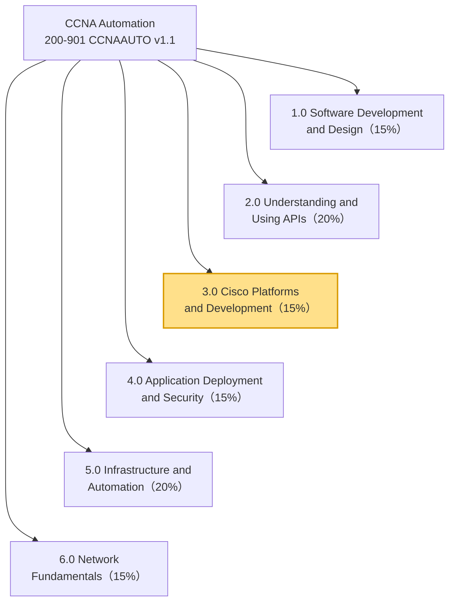
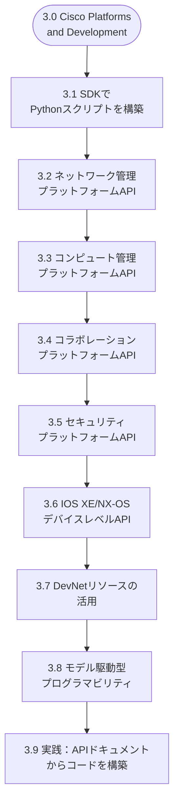
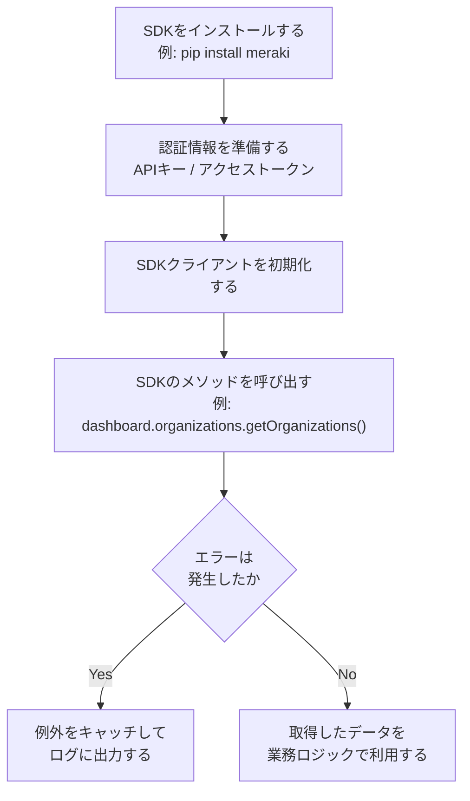
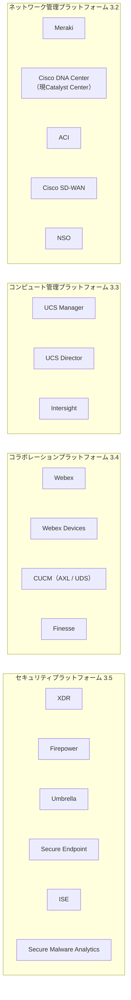
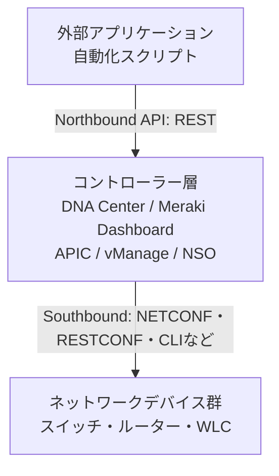
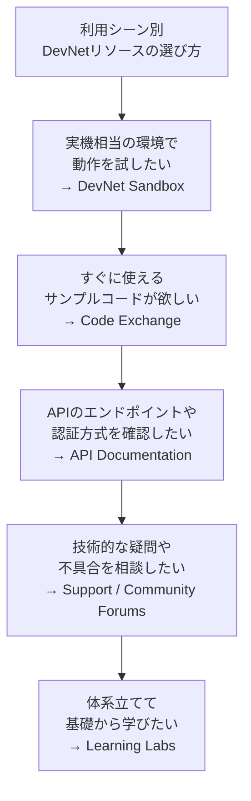
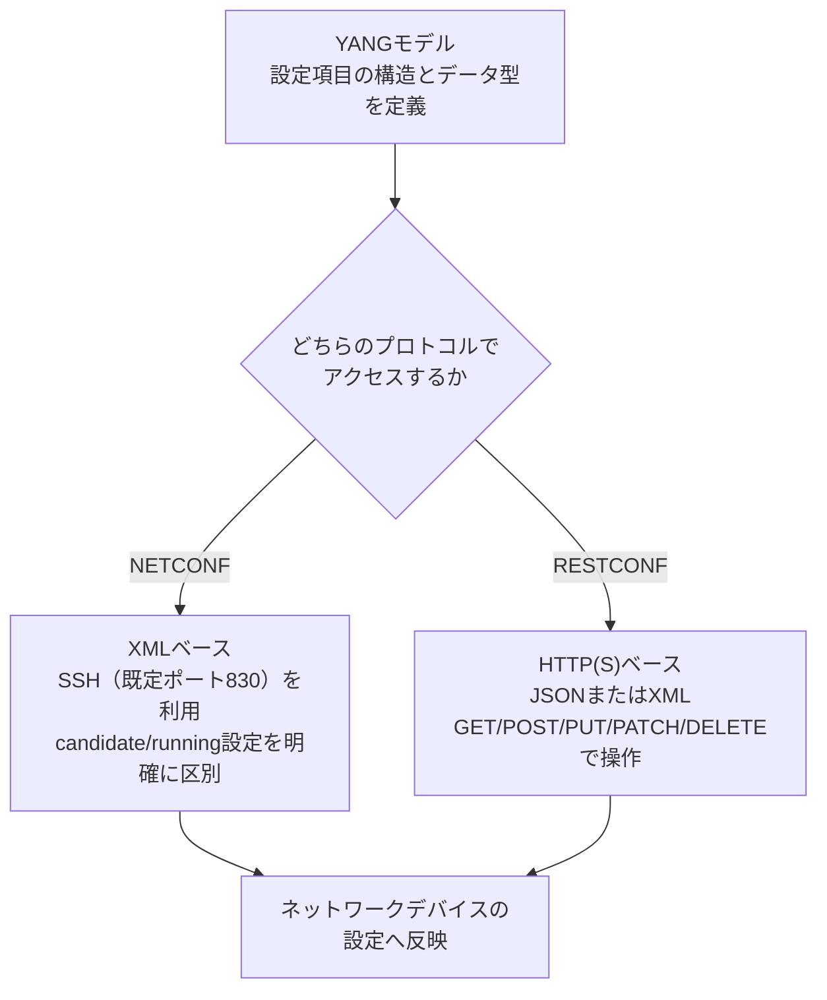
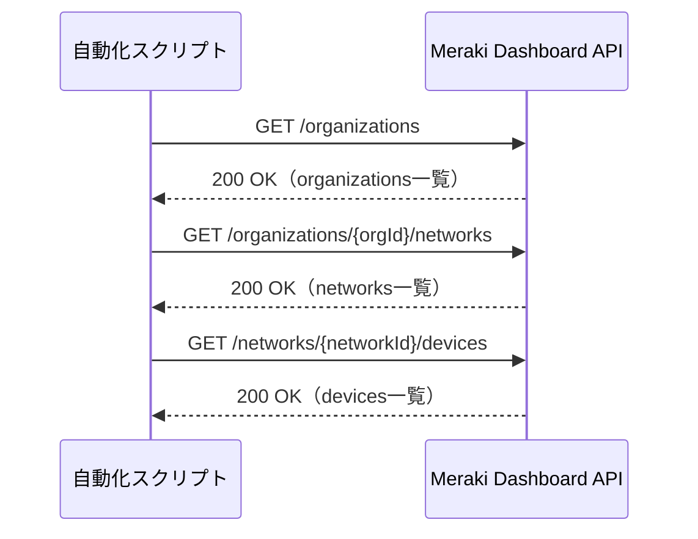
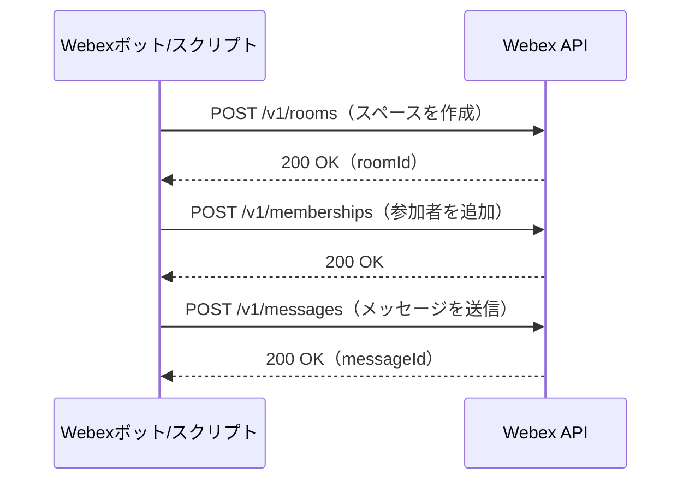
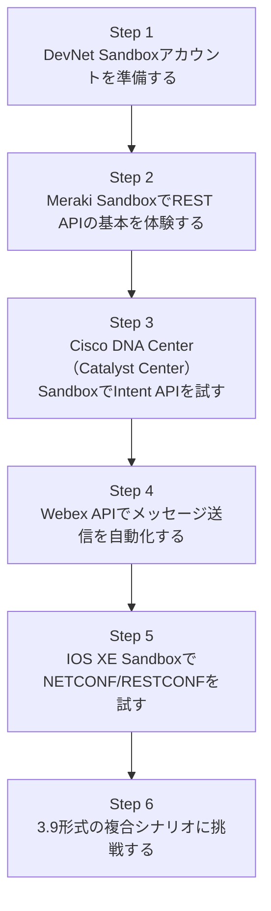

# CCNA Automation認定試験 徹底解説：Cisco Platforms and Development（Cisco製品プラットフォームと開発）

> 本ガイドは、Cisco社の公式認定試験「CCNA Automation（200-901 CCNAAUTO v1.1）」の6つの試験ドメインのうち、**3.0 Cisco Platforms and Development**（配点15%）を初学者向けにステップバイステップで解説するものです。
>
> 2026年2月3日より、本試験は旧称「Cisco Certified DevNet Associate（DEVASC）」から「CCNA Automation」へと名称変更されましたが、試験内容そのものは変更されていません。本ガイドでも、公式ブループリントに準拠した最新の名称（例：Secure Endpoint、XDRなど）を使用しつつ、旧名称（AMP、ThreatGridなど）にも適宜言及します。

---

## 目次

1. [はじめに](#はじめに)
2. [CCNA Automation試験の全体像とこのドメインの位置づけ](#ccna-automation試験の全体像とこのドメインの位置づけ)
3. [Cisco Platforms and Developmentドメインの全体マップ](#cisco-platforms-and-developmentドメインの全体マップ)
4. [3.1 Cisco SDKを使ったPythonスクリプトの構築](#31-cisco-sdkを使ったpythonスクリプトの構築)
5. [3.2〜3.5 Cisco製品プラットフォームとAPIの全体像](#32-35-cisco製品プラットフォームとapiの全体像)
6. [3.6 IOS XE / NX-OSのデバイスレベルAPIと動的インターフェース](#36-ios-xe--nx-osのデバイスレベルapiと動的インターフェース)
7. [3.7 シナリオに応じたDevNetリソースの選択](#37-シナリオに応じたdevnetリソースの選択)
8. [3.8 モデル駆動型プログラマビリティ（YANG / NETCONF / RESTCONF）](#38-モデル駆動型プログラマビリティyang--netconf--restconf)
9. [3.9 実践：APIドキュメントを基にしたコード構築](#39-実践apiドキュメントを基にしたコード構築)
10. [学習ロードマップ：ハンズオンの進め方](#学習ロードマップハンズオンの進め方)
11. [試験対策のポイントとよくある誤解](#試験対策のポイントとよくある誤解)
12. [まとめ](#まとめ)
13. [参考文献・出典一覧](#参考文献出典一覧)

---

## はじめに

CCNA Automation認定は、Ciscoが提供する自動化・プログラマビリティ分野の入門レベル認定です。ネットワークエンジニアがソフトウェア開発のスキルを身につけ、逆にソフトウェア開発者がネットワークの基礎を理解するための「橋渡し」となる資格として位置づけられています。

このガイドで扱う**「3.0 Cisco Platforms and Development」**ドメインは、平たく言えば「Ciscoの各種製品（ネットワーク管理・コンピュート・コラボレーション・セキュリティ）を、それぞれのAPIを使ってプログラムから操作する方法を理解しているか」を問う分野です。個々の製品の細かい操作方法を丸暗記するのではなく、**「どの製品が何のためにあり、どんな種類のAPIを持っているか」を体系的に把握すること**が合格への近道になります。

---

## CCNA Automation試験の全体像とこのドメインの位置づけ

CCNA Automation認定を取得するには、単一の試験「**Automating Networks Using Cisco Platforms（200-901 CCNAAUTO）v1.1**」に合格する必要があります。試験時間は120分、受験言語は英語と日本語に対応しています。

試験は以下の6つのドメインで構成されており、それぞれに配点比率が定められています。

| ドメイン番号 | ドメイン名（英語） | 配点比率 |
|---|---|---|
| 1.0 | Software Development and Design | 15% |
| 2.0 | Understanding and Using APIs | 20% |
| **3.0** | **Cisco Platforms and Development** | **15%** |
| 4.0 | Application Deployment and Security | 15% |
| 5.0 | Infrastructure and Automation | 20% |
| 6.0 | Network Fundamentals | 15% |



「2.0 Understanding and Using APIs」がAPIの**一般的な仕組み**（REST、HTTPメソッド、認証方式など）を扱うのに対し、「3.0 Cisco Platforms and Development」は、その知識を**Cisco固有の製品**に適用する力を問う点が違いです。両ドメインはセットで学習すると理解が深まります。

> 💡 **ポイント**：Ciscoは認定試験のブループリントを定期的に見直しており、DevNet Associate（v1.0）からCCNA Automation（v1.1）への移行時にも、セキュリティ製品の名称更新（AMP→Secure Endpoint、ThreatGrid→Secure Malware Analytics、XDRの追加）など細かな改訂が行われています。学習の際は必ず最新の公式ブループリントを確認してください。

---

## Cisco Platforms and Developmentドメインの全体マップ

このドメインは、公式ブループリント上で以下の9つの学習項目（3.1〜3.9）に細分化されています。

| 番号 | 学習項目（要約） |
|---|---|
| 3.1 | Cisco SDKのドキュメントを基にPythonスクリプトを構築する |
| 3.2 | ネットワーク管理プラットフォームとAPIの機能を説明する（Meraki, Cisco DNA Center, ACI, Cisco SD-WAN, NSO） |
| 3.3 | コンピュート管理プラットフォームとAPIの機能を説明する（UCS Manager, UCS Director, Intersight） |
| 3.4 | コラボレーションプラットフォームとAPIの機能を説明する（Webex, Webex Devices, CUCM（AXL/UDS）, Finesse） |
| 3.5 | セキュリティプラットフォームとAPIの機能を説明する（XDR, Firepower, Umbrella, Secure Endpoint, ISE, Secure Malware Analytics） |
| 3.6 | IOS XEおよびNX-OSのデバイスレベルAPIと動的インターフェースを説明する |
| 3.7 | シナリオに応じて適切なDevNetリソースを特定する（Sandbox, Code Exchange, サポート, フォーラム, Learning Labs, APIドキュメント） |
| 3.8 | モデル駆動型プログラマビリティの概念を適用する（YANG, RESTCONF, NETCONF） |
| 3.9 | 要件とAPIリファレンスドキュメントに基づき、特定の操作を行うコードを構築する |

これを学習の流れとして図にすると、以下のようになります。



前半（3.1〜3.6）が「各プラットフォームを**知る**」フェーズ、後半（3.7〜3.9）が「学んだ知識を**使う**」フェーズだとイメージすると理解しやすくなります。

---

## 3.1 Cisco SDKを使ったPythonスクリプトの構築

### SDKとは何か、なぜ使うのか

SDK（Software Development Kit）とは、APIを直接叩く（HTTPリクエストを自分で組み立てる）代わりに、あらかじめ用意された関数やクラスを呼び出すだけでAPI操作ができるようにしたライブラリです。生のREST APIを`requests`ライブラリで叩く場合と比較すると、次のようなメリットがあります。

- 認証ヘッダーの付与やURLの組み立てを自動化してくれる
- レスポンスのJSONを、扱いやすいPythonオブジェクトとして受け取れる
- エラー発生時に、わかりやすい例外（Exception）として通知してくれる

### 基本的なワークフロー



### コード例：Meraki SDKで組織一覧を取得する

```python
import meraki

# APIキーはMerakiダッシュボードの
# Organization > Configure > API & Webhooks から発行する
API_KEY = "YOUR_API_KEY"

# SDKクライアントを初期化する
dashboard = meraki.DashboardAPI(API_KEY, suppress_logging=True)

# 所属する組織（Organization）の一覧を取得する
organizations = dashboard.organizations.getOrganizations()

for org in organizations:
    print(f"組織名: {org['name']} / ID: {org['id']}")
```

このように、Meraki公式のPython SDK（`meraki`パッケージ）を使うと、認証ヘッダーの組み立てやページネーション処理をSDKが肩代わりしてくれるため、開発者は「何を取得したいか」に集中できます。試験では、SDKのドキュメント（メソッド名・引数・戻り値）を読んで、空欄になったコードを補完する形式の設問が出題される傾向があります。

> 💡 **試験対策**：SDKの内部実装を暗記する必要はありません。「このSDKはどの製品向けか」「認証にはどんな情報が必要か」「戻り値はどんな形（リスト／辞書）か」を、公式ドキュメントを見ながら読み解く練習をしておきましょう。

---

## 3.2〜3.5 Cisco製品プラットフォームとAPIの全体像 <a id="32-35-cisco製品プラットフォームとapiの全体像"></a>

3.2から3.5までは、いずれも「**特定のCisco製品群が、どんなAPIを持ち、何ができるかを説明する**」という共通のパターンを持つ学習項目です。まずは全体像を俯瞰してから、各カテゴリーの詳細を見ていきましょう。



| ドメイン | 代表的なCisco製品 | 主なAPIの形式 |
|---|---|---|
| 3.2 ネットワーク管理 | Meraki, Cisco DNA Center, ACI, Cisco SD-WAN, NSO | REST（Meraki Dashboard API、DNA Center Intent APIなど） |
| 3.3 コンピュート管理 | UCS Manager, UCS Director, Intersight | XML API（UCS Manager）、REST（UCS Director / Intersight） |
| 3.4 コラボレーション | Webex, Webex Devices, CUCM, Finesse | REST（Webex API）、SOAP（CUCM AXL）、REST（CUCM UDS） |
| 3.5 セキュリティ | XDR, Firepower, Umbrella, Secure Endpoint, ISE, Secure Malware Analytics | REST（各製品ともにREST APIを提供） |

### 3.2 ネットワーク管理プラットフォームとAPI

このカテゴリーは、複数のネットワークデバイスを一元的に管理する「コントローラー」製品群です。試験対策として、まず押さえておきたいのはそれぞれの製品が**どの領域を管理するか**という役割分担です。

- **Meraki**：クラウド管理型のスイッチ・アクセスポイント・セキュリティアプライアンスを、Meraki Dashboard（クラウドUI）とそのREST APIから一元管理する。組織（Organization）> ネットワーク（Network）> デバイス（Device）という階層構造を持つ点が特徴。
- **Cisco DNA Center（現Catalyst Center）**：エンタープライズキャンパスネットワークのインテントベース管理コントローラー。「Intent API」と呼ばれるノースバウンドREST APIを通じて、ビジネス意図（例：新しいSSIDを展開したい）を宣言的に指定できる。
- **ACI（Application Centric Infrastructure）**：データセンターネットワークをポリシーベースで自動化するSDN基盤。APIC（Application Policy Infrastructure Controller）が中心的なコントローラーとなる。
- **Cisco SD-WAN**：拠点間WANをソフトウェア定義で管理する製品群。vManageコントローラーがAPIの窓口となる。
- **NSO（Network Services Orchestrator）**：マルチベンダー環境でのサービス単位のオーケストレーションを担う製品。YANGモデルを核としたサービスパッケージという概念を持つ。



**コード例：Cisco DNA Center（Catalyst Center）のIntent APIでデバイス一覧を取得する**

```python
import requests

DNAC = "https://sandboxdnac.cisco.com"
AUTH = ("devnetuser", "Cisco123!")

# 1. 認証トークンを取得する（Intent API）
resp = requests.post(f"{DNAC}/dna/system/api/v1/auth/token", auth=AUTH, timeout=10)
resp.raise_for_status()
token = resp.json()["Token"]

# 2. 取得したトークンをヘッダーに設定してデバイス一覧を取得する
headers = {"X-Auth-Token": token}
devices = requests.get(
    f"{DNAC}/dna/intent/api/v1/network-device",
    headers=headers,
    timeout=10,
)
devices.raise_for_status()

for device in devices.json()["response"]:
    print(device["hostname"], device["managementIpAddress"])
```

### 3.3 コンピュート管理プラットフォームとAPI

サーバー（コンピュート）リソースを管理するための製品群です。

- **UCS Manager**：シャーシに組み込まれたブレードサーバー群を管理する組み込み型の管理ソフトウェア。XMLベースのAPIを提供する。
- **UCS Director**：データセンター全体のインフラ（コンピュート・ストレージ・ネットワーク）を横断的にオーケストレーションするプラットフォーム。REST APIを提供する。
- **Intersight**：クラウドベースのインフラ管理プラットフォーム。API認証にAPIキー＋秘密鍵によるHTTPリクエスト署名（signature）方式を採用しており、単純なAPIキー方式のMerakiやDNA Centerとは認証方式が異なる点が試験でも問われやすいポイントです。

### 3.4 コラボレーションプラットフォームとAPI

- **Webex**：チャット・ビデオ会議・通話などを提供するコラボレーションプラットフォーム。ブループリント上は歴史的経緯から「Webex Teams」と表記されることがありますが、製品としては「Webex」に統合されています。REST APIで、スペース（部屋）・メンバーシップ（参加者）・メッセージなどのリソースを操作します。
- **Webex Devices**：Webex Room KitやDeskシリーズなどの物理デバイスを制御するxAPI（デバイス側のAPI）。
- **CUCM（Cisco Unified Communication Manager）**：企業向けのIP電話交換基盤。**AXL**（SOAPベースの管理系API、ユーザーや電話機の設定操作向け）と、**UDS**（RESTベースのユーザー向けAPI、ディレクトリ検索など）という2種類のインターフェースを持つ点が試験の頻出ポイントです。
- **Finesse**：コンタクトセンター向けのエージェントデスクトップアプリケーションで、REST APIおよびJavaScript向けのAPIを提供する。

**コード例：Webex APIでメッセージを送信する（webexpythonsdk／旧webexteamssdk）**

```python
from webexteamssdk import WebexTeamsAPI

# 環境変数 WEBEX_TEAMS_ACCESS_TOKEN からアクセストークンを自動読込
api = WebexTeamsAPI()

# 指定したスペース（部屋）にメッセージを送信する
api.messages.create(roomId="ROOM_ID_HERE", text="自動化スクリプトからの通知です")
```

> 💡 **豆知識**：かつて`ciscosparkapi`という名前だったこのライブラリは、Webex Teamsへのブランド変更に伴い`webexteamssdk`に改称され、現在はさらに`webexpythonsdk`（Python 3.10以降向け）へと移行が進んでいます。試験のブループリント上の表記（Webex Teams）と、実際の開発現場での最新の呼称（Webex／webexpythonsdk）にはズレがあることを理解しておきましょう。

### 3.5 セキュリティプラットフォームとAPI

セキュリティ製品群です。v1.1のブループリントでは、下記のように一部の製品名が更新されています。

| 旧名称（DEVASC v1.0） | 現行名称（CCNAAUTO v1.1） | 役割 |
|---|---|---|
| － | XDR（新規追加） | 複数のセキュリティ製品からのテレメトリを統合し、脅威検知・対応を自動化するプラットフォーム |
| Firepower | Firepower（変更なし） | 次世代ファイアウォール（NGFW）。FMC（管理センター）やFDM（デバイスマネージャー）経由でREST APIを提供 |
| Umbrella | Umbrella（変更なし） | クラウドベースのDNS/Webセキュリティサービス。Investigate APIやEnforcement APIを提供 |
| AMP | Secure Endpoint | エンドポイント（PCやサーバー）向けのマルウェア対策・EDR製品 |
| ISE | ISE（変更なし） | Identity Services Engine。ネットワークアクセス制御（NAC）を担う。ERS APIやpxGrid連携が代表的 |
| ThreatGrid | Secure Malware Analytics | サンドボックス型のマルウェア解析プラットフォーム |

このカテゴリーは「Describe（説明する）」レベルの知識が中心のため、コードを暗記するよりも、**それぞれの製品が守る対象（ネットワーク境界／エンドポイント／DNS／ID）と役割の違い**を整理しておくことが得点につながります。

---

## 3.6 IOS XE / NX-OSのデバイスレベルAPIと動的インターフェース

3.2〜3.5がコントローラー経由の管理であったのに対し、3.6では**デバイス単体（IOS XEを搭載したルーター／スイッチ、NX-OSを搭載したデータセンタースイッチ）に直接組み込まれたプログラマビリティ機能**を扱います。

- **NETCONF / RESTCONF**：デバイス上で直接有効化できる、標準化されたモデル駆動型のプロトコル（詳細は次章で解説）。
- **gRPC / gNMI**：ストリーミングテレメトリなど、より高頻度・低遅延なデータ収集に向く比較的新しいインターフェース。
- **NX-API**：NX-OSデバイス向けのREST風API。CLIコマンドをそのままJSON/XML経由で実行できる点が特徴。
- **Guest Shell / On-box Python**：デバイスのOS内に隔離されたLinuxコンテナ環境（Guest Shell）を用意し、その中でPythonスクリプトを直接実行できる「動的インターフェース」。デバイス自身にちょっとした自動化ロジックを持たせたい場合に使う。
- **EEM（Embedded Event Manager）**：デバイス内で発生したイベント（インターフェースダウンなど）をトリガーに、あらかじめ登録したアクション（Tclスクリプトなど）を自動実行する仕組み。

**コード例：NETCONFでIOS XEデバイスの設定を取得する（ncclientライブラリ）**

```python
from ncclient import manager

# DevNet常設Sandbox（IOS XE on CSR）に接続する
with manager.connect(
    host="ios-xe-mgmt.cisco.com",
    port=10000,
    username="developer",
    password="C1sco12345",
) as m:
    # YANGフィルタを使ってinterface設定のみを取得する
    filter_xml = """
    <filter>
      <native xmlns="http://cisco.com/ns/yang/Cisco-IOS-XE-native">
        <interface/>
      </native>
    </filter>
    """
    result = m.get_config(source="running", filter=filter_xml)
    print(result)
```

> 💡 **試験対策**：「コントローラー経由（3.2〜3.5）」と「デバイス直接（3.6）」の違いを混同しないようにしましょう。同じNETCONF/RESTCONFという技術要素でも、3.6ではデバイス単体への適用、3.8ではその背景にあるモデル駆動の考え方そのものが問われます。

---

## 3.7 シナリオに応じたDevNetリソースの選択

Cisco DevNetは、開発者向けに複数の学習・検証リソースを無償で提供しています。試験では「このような状況で、あなたはどのリソースを使うべきか」という選択式の設問が出題されます。



| リソース | 主な用途 |
|---|---|
| DevNet Sandbox | 実機相当の仮想環境を無料で予約・常設利用し、APIコールやコードの動作確認を行う（Always-On型／Reservation型の2種類がある） |
| Code Exchange | Ciscoおよびコミュニティが公開するサンプルコード・SDK・Ansible/Terraformコンテンツを検索・参照する |
| API Documentation | 各プラットフォームのエンドポイント仕様・パラメータ・認証方式を確認する一次情報源 |
| Support / Community Forums | 技術的な質問や不具合の相談、他の開発者との情報交換を行う場 |
| Learning Labs | ステップバイステップで体系的に学べる学習コンテンツ（試験対策にも活用しやすい） |

> 💡 **豆知識**：DevNet SandboxにはAlways-On（予約不要・常時稼働・共有環境）とReservation（事前予約制・自分専用の隔離環境）の2種類があります。管理者権限が必要な検証を行いたい場合はReservation型を選ぶ必要がある、という違いも押さえておきましょう。

---

## 3.8 モデル駆動型プログラマビリティ（YANG / NETCONF / RESTCONF）

### なぜ「モデル駆動」なのか

従来、ネットワーク機器の設定はCLI（コマンドラインインターフェース）を通じて行われてきました。しかしCLIの出力形式はベンダーやOSバージョンによってまちまちで、プログラムから解析するのは非常に手間がかかります。そこで登場したのが、**設定項目の構造とデータ型をあらかじめ「モデル」として定義しておき、そのモデルに沿ってプログラムから安全に設定を読み書きする**という考え方です。この中核を担うのが**YANG**というデータモデリング言語です。



### NETCONFとRESTCONFの比較

| 項目 | NETCONF | RESTCONF |
|---|---|---|
| トランスポート | SSH（既定ポート830） | HTTPS（既定ポート443） |
| データ形式 | XML | JSONまたはXML |
| 操作モデル | RPCベース（`get-config`、`edit-config`など） | HTTP動詞ベース（GET/POST/PUT/PATCH/DELETE） |
| データストアの扱い | running／candidate／startupを明確に区別できる | 基本的にrunning相当のデータストアのみを対象とする |
| ベースとなるモデル | YANG | YANG |
| 向いている用途 | トランザクション性を要する一括設定変更 | REST APIに慣れた開発者による単純なCRUD操作 |

**コード例：RESTCONFでIOS XEデバイスのインターフェース一覧を取得する**

```python
import requests

# DevNet常設Sandbox（IOS XE on CSR）のRESTCONFエンドポイント
url = "https://ios-xe-mgmt.cisco.com:9443/restconf/data/ietf-interfaces:interfaces"
headers = {"Accept": "application/yang-data+json"}
auth = ("developer", "C1sco12345")

resp = requests.get(url, headers=headers, auth=auth, timeout=10)
resp.raise_for_status()
print(resp.json())
```

> 💡 **試験対策**：NETCONF・RESTCONFの「既定ポート」と「DevNet Sandboxで実際に使われるポート」は異なる場合があります（例：常設Sandboxでは踏み台の都合上、NETCONFが10000番、RESTCONFが9443番になっていることがある）。試験では一般的な既定値（NETCONF=830、RESTCONF=443）で問われることが多いため、まずは標準ポートを正確に覚え、その上で実機演習時の差異は「環境固有の設定」として区別して理解しましょう。

---

## 3.9 実践：APIドキュメントを基にしたコード構築

3.9は、これまで学んだ知識を統合し、「与えられたAPIリファレンスドキュメントを読んで、具体的な操作を行うコードを完成させる」実践的な項目です。公式に例示されている代表的なシナリオは次の2つです。

- **3.9.a**：Meraki、Cisco DNA Center、ACI、Cisco SD-WAN、NSOのいずれかを使って、ネットワークデバイスの一覧を取得する
- **3.9.b**：Webex（Webex Teams）でスペース・参加者・メッセージを管理する

### 3.9.a：Meraki APIでネットワークデバイス一覧を取得する

Merakiの管理構造は「組織（Organization）→ ネットワーク（Network）→ デバイス（Device）」という階層になっており、デバイス一覧を得るには、まず組織を取得し、その中のネットワークをたどってデバイスを収集するという流れになります。



```python
import meraki

dashboard = meraki.DashboardAPI("YOUR_API_KEY", suppress_logging=True)

# 1. 組織一覧を取得する
orgs = dashboard.organizations.getOrganizations()

# 2. 各組織のネットワークをたどり、デバイスを収集する
for org in orgs:
    networks = dashboard.organizations.getOrganizationNetworks(org["id"])
    for net in networks:
        devices = dashboard.networks.getNetworkDevices(net["id"])
        for device in devices:
            print(f"{org['name']} / {net['name']} / {device.get('name', device['serial'])}")
```

### 3.9.b：Webex APIでスペース・参加者・メッセージを管理する



```python
from webexteamssdk import WebexTeamsAPI

api = WebexTeamsAPI()

# 1. 新しいスペース（部屋）を作成する
room = api.rooms.create(title="自動化通知スペース")

# 2. 参加者（メンバー）を追加する
api.memberships.create(room.id, personEmail="teammate@example.com")

# 3. メッセージを送信する
api.messages.create(room.id, text="スペースの準備が整いました")
```

このように、3.9は単体の知識ではなく、**「どのAPIをどの順番で呼び出せば目的を達成できるか」という設計力**を問う項目です。試験ではコードの一部が空欄になった穴埋め形式（ドラッグ＆ドロップ）で出題される傾向があるため、単純な暗記ではなく「このAPI呼び出しの後には、論理的に何をする必要があるか」を考える練習をしておくとよいでしょう。

---

## 学習ロードマップ：ハンズオンの進め方

知識のインプットだけでなく、実際に手を動かすことがこのドメインの理解を大きく助けます。以下の順序でDevNet Sandboxを活用した学習を進めることをおすすめします。



1. **Step 1**：`developer.cisco.com`でDevNetアカウントを作成し、Sandboxカタログにアクセスできる状態にする。
2. **Step 2**：Meraki Always-On Sandboxを使い、組織・ネットワーク・デバイスの階層構造を実際のAPIレスポンスで確認する。
3. **Step 3**：Cisco DNA Center（Catalyst Center）Sandboxで認証トークンを取得し、Intent APIでデバイス一覧を取得する。
4. **Step 4**：自分のWebexアカウントでアクセストークンを発行し、スペース作成からメッセージ送信までを自動化するスクリプトを書く。
5. **Step 5**：IOS XE Always-On Sandboxに対して、`ncclient`（NETCONF）と`requests`（RESTCONF）の両方でアクセスし、挙動の違いを体感する。
6. **Step 6**：Meraki＋Webexなど複数のAPIを組み合わせ、「特定の条件を満たしたらWebexへ通知する」といった3.9形式の複合シナリオを自作してみる。

---

## 試験対策のポイントとよくある誤解

- **製品名の変更に注意する**：AMP→Secure Endpoint、ThreatGrid→Secure Malware Analytics、DNA Center→Catalyst Centerなど、Ciscoは製品ブランドを頻繁に見直しています。ブループリント上の表記と、実際の開発現場での最新名称の両方を把握しておきましょう。
- **NETCONFとRESTCONFのポート番号を混同しない**：一般的な既定値はNETCONF=830（SSH）、RESTCONF=443（HTTPS）です。DevNet Sandbox特有の代替ポート（例：10000番、9443番）は環境固有の設定であり、試験の一般知識としては標準ポートを優先して覚えましょう。
- **Meraki APIの階層構造を理解する**：Organization（組織）> Network（ネットワーク）> Device（デバイス）という3階層をたどらないとデバイス情報にたどり着けない点は頻出のポイントです。
- **CUCMのAXLとUDSを混同しない**：AXLは管理者向けのSOAP API（設定変更を伴う操作向け）、UDSはエンドユーザー向けのREST API（ディレクトリ検索など、比較的軽量な参照操作向け）という役割の違いを押さえましょう。
- **「コントローラー経由」と「デバイス直接」を区別する**：3.2〜3.5で学ぶプラットフォームは基本的に複数デバイスをまとめて管理するコントローラー層であり、3.6・3.8で学ぶNETCONF/RESTCONF/YANGはデバイス単体（またはコントローラーの背後にある技術基盤）に関する知識です。
- **DevNetリソースの使い分け**：「試したい」ならSandbox、「コードが欲しい」ならCode Exchange、「仕様を調べたい」ならAPI Documentation、「相談したい」ならSupport/Forums、「体系的に学びたい」ならLearning Labs、という対応関係を整理しておくと選択式問題で迷いません。

---

## まとめ

「3.0 Cisco Platforms and Development」ドメインは、Cisco製品群を横断的に俯瞰する力を問う分野です。個々のAPIエンドポイントを丸暗記するのではなく、

1. **その製品が何を管理するものか**（ネットワーク／コンピュート／コラボレーション／セキュリティ／デバイス単体）
2. **どんな種類のAPIを提供しているか**（REST／SOAP／XML／NETCONF／RESTCONF）
3. **どのDevNetリソースを使えば効率よく学べるか**

という3つの軸で整理しながら学習を進めることで、着実に得点力を伸ばすことができます。ぜひDevNet Sandboxを積極的に活用し、実際にAPIを呼び出しながら知識を定着させてください。

---

## 参考文献・出典一覧

本ガイドの作成にあたり、以下の一次情報源を参照しました。試験直前には必ず最新の公式情報をご確認ください。

1. Cisco. "CCNA Automation Certification" (試験概要ページ・ユーザー提供URL)
   https://www.cisco.com/site/us/en/learn/training-certifications/certifications/automation/ccna-automation/index.html
2. Cisco. "CCNA Automation Exam and Training"（試験名・試験時間・受験言語・受験料等）
   https://www.cisco.com/site/us/en/learn/training-certifications/certifications/automation/ccna-automation/exams-and-training.html
3. Cisco Learning Network. "200-901 CCNAAUTO Exam Topics and Study Guide"（公式ブループリント）
   https://learningnetwork.cisco.com/s/ccnaauto-exam-topics
4. Cisco Learning Network. "DevNet Certifications: Evolving to CCNA, CCNP, and CCIE Automation"（DevNetからAutomationへのリブランディング公式告知、「試験内容は変更なし、名称のみ変更」の記載）
   https://learningnetwork.cisco.com/s/question/0D5Kd0000Be56OZKQY/devnet-certifications-evolving-to-ccna-ccnp-and-ccie-automation-
5. Cisco Live. George Koukis, Kareem Iskander. "BRKCRT-2080: Preparing for the DevNet Associate Certification"（2024年、公式セッション資料。3.1〜3.9の詳細な学習項目およびv1.0→v1.1の変更点を掲載）
   https://www.ciscolive.com/c/dam/r/ciscolive/global-event/docs/2024/pdf/BRKCRT-2080.pdf
6. Cisco DevNet. "Cisco DNA Center Platform APIs and Integrations Overview"（Intent APIの説明）
   https://developer.cisco.com/docs/dna-center/2-3-5/overview/
7. Cisco Meraki Developer Hub. "Introduction - Meraki Dashboard API v1"
   https://developer.cisco.com/meraki/api-v1/
8. Cisco Meraki Developer Hub. "Getting Started - Meraki Dashboard API v1"（組織→ネットワーク→デバイスの階層構造、Python SDKの使用例）
   https://developer.cisco.com/meraki/api-v1/getting-started/
9. Cisco DevNet. "Sandbox"（DevNet Sandboxの概要、Always-On／Reservationの違い）
   https://developer.cisco.com/site/sandbox/
10. Cisco DevNet. "Cisco DevNet Sandbox Technical documentation"
    https://developer.cisco.com/docs/sandbox/
11. DevNet Sandbox Catalog
    https://devnetsandbox.cisco.com/
12. webexteamssdk documentation. "Introduction"（Webex Python SDKの使用例、ciscosparkapi→webexteamssdk→webexpythonsdkへの変遷）
    https://webexteamssdk.readthedocs.io/en/latest/user/intro.html
13. WebexCommunity. "WebexPythonSDK" GitHubリポジトリ（ライブラリ名称変遷の経緯）
    https://github.com/WebexCommunity/WebexPythonSDK
14. Roger Perkin (CCIE #50038). "What is Cisco Catalyst Center?"（DNA CenterからCatalyst Centerへの名称変更に関する解説）
    https://www.rogerperkin.co.uk/cisco-catalyst-center/what-is-cisco-catalyst-center/
15. Cisco. "Cisco Catalyst Center Data Sheet"（Catalyst Centerが旧DNA Centerであることの公式記載）
    https://www.cisco.com/c/en/us/products/collateral/cloud-systems-management/dna-center/nb-06-dna-center-data-sheet-cte-en.html
16. Cisco Community. "IOS XE on CSR Recommended Code Always On Sandbox" 関連スレッド（NETCONF/RESTCONFの接続情報：ホスト名・ポート番号・認証情報）
    https://community.cisco.com/t5/devnet-sandbox/ios-xe-on-csr-recommended-code-always-on-sandbox-offline/td-p/4393089
