# CCNA Automation 試験対策ガイド：Infrastructure and Automation（インフラストラクチャと自動化）

> 対象試験：**Automating Networks Using Cisco Platforms v1.1（CCNAAUTO 200-901）**
> 対象ドメイン：**5.0 Infrastructure and Automation（出題比率 20%）**
> 難易度：初学者〜ネットワーク自動化を学び始めた方向け
> 最終確認日：2026年7月

---

## この記事について

CCNA Automation認定（旧DevNet Associateに相当する自動化系認定）の中核試験である **200-901 CCNAAUTO** は、6つのドメインで構成されています。本記事はその中でも配点が最も高いドメインの1つである **「5.0 Infrastructure and Automation」（出題比率20%）** に焦点を当て、公式出題項目（5.1〜5.14）を初学者でも理解できるようステップバイステップで解説します。

### 試験全体における本ドメインの位置づけ

| # | ドメイン名 | 出題比率 |
|---|---|---|
| 1.0 | Software Development and Design | 15% |
| 2.0 | Understanding and Using APIs | 20% |
| 3.0 | Cisco Platforms and Development | 15% |
| **5.0** | **Infrastructure and Automation** | **20%（本記事で解説）** |
| 4.0 | Application Deployment and Security | 15% |
| 6.0 | Network Fundamentals | 15% |

「Understanding and Using APIs」と並んで最も配点の高いドメインであり、試験全体の1/5を占めます。内容は大きく分けると次の3つの塊に整理できます。

1. **自動化の考え方・原則**（5.1, 5.2, 5.5, 5.13）
2. **自動化を支えるツールと仕組み**（5.3, 5.4, 5.6）
3. **既存のコード／出力を読み解く力**（5.7〜5.12, 5.14）

CCNAAUTOでは「自分で書く」より「与えられたコードや出力を読んで、何が起きているかを説明できる」ことが繰り返し問われるのが特徴です。そのため本記事も、各項目で **具体的なサンプル（YAML・Python・Bash・XML/JSON・diff）を読み解く練習** を重視して構成しています。

### 全体の自動化ライフサイクルから見る5.0ドメイン

5.1〜5.14の各項目は、実務での自動化ワークフロー（意図の設計 → コード化 → レビュー → CI/CD → テスト → 本番適用）のどこかに対応しています。まずは全体像を掴みましょう。

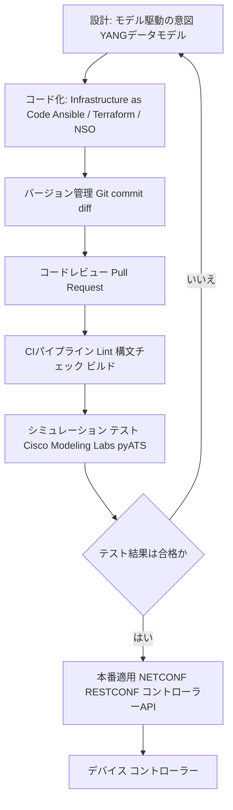

| ライフサイクルの段階 | 対応する出題項目 |
|---|---|
| 設計（モデル駆動プログラマビリティ） | 5.1, 5.11 |
| コード化（IaC / 自動化ツール） | 5.5, 5.6, 5.8, 5.9 |
| バージョン管理・レビュー | 5.12, 5.13 |
| CI/CDパイプライン | 5.4 |
| テスト・シミュレーション | 5.3 |
| 本番適用・運用管理 | 5.2, 5.7, 5.10 |
| コミュニケーション（設計共有） | 5.14 |

それでは、出題項目の番号順に1つずつ見ていきます。

---

## 目次

1. [5.1 モデル駆動プログラマビリティの価値](#51-モデル駆動プログラマビリティの価値)
2. [5.2 コントローラーレベル管理とデバイスレベル管理の比較](#52-コントローラーレベル管理とデバイスレベル管理の比較)
3. [5.3 ネットワークシミュレーション・テストツール（Cisco Modeling Labs, pyATS）](#53-ネットワークシミュレーションテストツールcisco-modeling-labs-pyats)
4. [5.4 インフラ自動化におけるCI/CDパイプラインの構成要素と利点](#54-インフラ自動化におけるcicdパイプラインの構成要素と利点)
5. [5.5 Infrastructure as Code（IaC）の原則](#55-infrastructure-as-codeiacの原則)
6. [5.6 自動化ツールの機能（Ansible, Terraform, Cisco NSO）](#56-自動化ツールの機能ansible-terraform-cisco-nso)
7. [5.7 PythonスクリプトのワークフローをCisco APIから読み解く](#57-pythonスクリプトのワークフローをcisco-apiから読み解く)
8. [5.8 Ansible Playbookのワークフローの解釈](#58-ansible-playbookのワークフローの解釈)
9. [5.9 Bashスクリプトのワークフローの解釈](#59-bashスクリプトのワークフローの解釈)
10. [5.10 RESTCONF/NETCONFクエリ結果の解釈](#510-restconfnetconfクエリ結果の解釈)
11. [5.11 基本的なYANGモデルの解釈](#511-基本的なyangモデルの解釈)
12. [5.12 Unified Diffの解釈](#512-unified-diffの解釈)
13. [5.13 コードレビューの原則と利点](#513-コードレビューの原則と利点)
14. [5.14 APIコールを含むシーケンス図の解釈](#514-apiコールを含むシーケンス図の解釈)
15. [まとめ・学習の進め方](#まとめ学習の進め方)
16. [参考文献・出典](#参考文献出典)

---

## 5.1 モデル駆動プログラマビリティの価値

### 解説

従来のネットワーク自動化は、SSHでCLIにログインし `show` コマンドの出力（人間向けのテキスト）を正規表現などで解析する **「スクリーンスクレイピング」** が主流でした。しかしこの方法には次のような弱点があります。

- OSのバージョンが変わるだけで出力フォーマットが変わり、解析ロジックが壊れる
- ベンダーやプラットフォームごとに解析コードを個別に書く必要がある
- 出力が「表示用」であり、そもそも構造化されていないため解析が不安定

これに対して **モデル駆動プログラマビリティ（Model-Driven Programmability）** は、`YANG` という **データモデリング言語** で定義された構造化データを、`NETCONF` や `RESTCONF` といったプロトコルでやり取りする方式です。データが最初から構造化されている（JSON/XML）ため、パースが安定し、機種やベンダーが変わっても同じデータモデルであれば同じコードで扱えます。

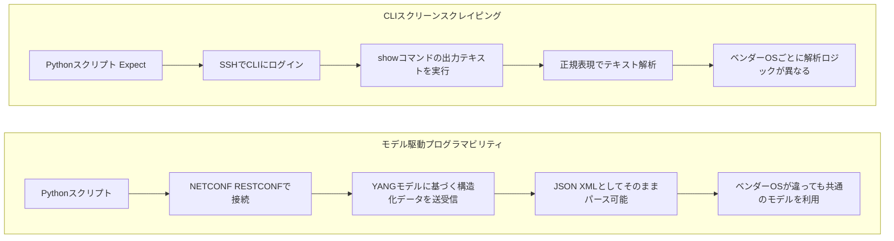

### 比較表

| 観点 | CLIスクリーンスクレイピング | モデル駆動プログラマビリティ |
|---|---|---|
| データ形式 | 非構造化テキスト（表示用） | 構造化データ（XML/JSON、YANGベース） |
| 安定性 | OSバージョンで出力が変わり壊れやすい | データモデルが変わらない限り安定 |
| 移植性 | ベンダー/機種ごとに書き直しが必要 | 同一モデルなら共通コードで再利用可能 |
| 検証（Validation） | クライアント側で独自に実装 | モデル定義（型・制約）に基づき検証可能 |
| 主なプロトコル | SSH + CLI | NETCONF, RESTCONF, gNMI |

### 学習のポイント

出題では「なぜモデル駆動プログラマビリティが価値を持つのか」を **一貫性・自動化のしやすさ・スケーラビリティ** という観点で説明できるかが問われます。丸暗記ではなく「CLI出力は人間向け、YANGモデルは機械向け」という軸で理解すると応用が効きます。

---

## 5.2 コントローラーレベル管理とデバイスレベル管理の比較

### 解説

ネットワークの自動化・管理には大きく2つのアプローチがあります。

- **デバイスレベル管理**：各デバイスに個別に接続し、NETCONF/RESTCONF/CLIなどで1台ずつ設定する方式。
- **コントローラーレベル管理**：Cisco Catalyst Center、ACI APIC、Meraki Dashboardのような **コントローラー** に対して指示を出し、コントローラーが配下の多数のデバイスへ設定を配布・一元管理する方式。

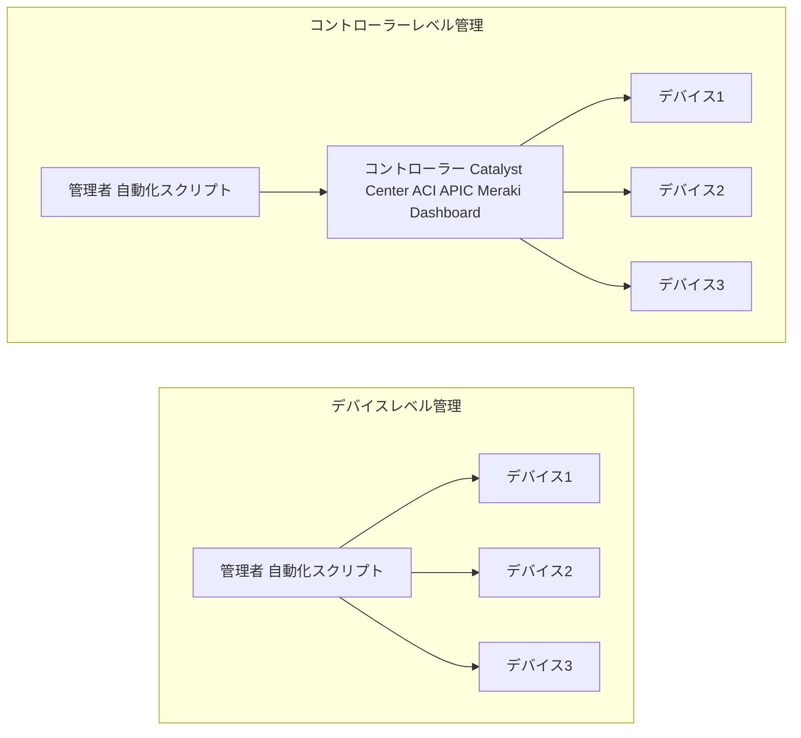

### 比較表

| 観点 | コントローラーレベル管理 | デバイスレベル管理 |
|---|---|---|
| 抽象度 | 高い（意図ベースの単一API） | 低い（デバイス個別のAPI/CLI） |
| スケーラビリティ | 高い（多数デバイスを一括操作） | 低い（台数分の接続・処理が必要） |
| 一貫性の担保 | コントローラーが状態を一元管理 | スクリプト側で整合性を担保する必要 |
| きめ細かい制御 | コントローラーの機能範囲に依存 | デバイス固有機能へフルアクセス可能 |
| 代表例 | Cisco Catalyst Center, ACI APIC, Meraki Dashboard | 各デバイスへのNETCONF/RESTCONF/CLI接続 |

### 学習のポイント

「規模が大きくなるほどコントローラーレベルの価値が高まる」「デバイス固有の細かい機能を使いたい場合はデバイスレベルが必要になる場合がある」という **トレードオフ** の理解が重要です。

---

## 5.3 ネットワークシミュレーション・テストツール（Cisco Modeling Labs, pyATS）

### 解説

自動化コードや設定変更は、本番環境にいきなり適用するとリスクが大きいため、**仮想環境での事前検証** が欠かせません。

- **Cisco Modeling Labs（CML）**：仮想ルーター/スイッチなどでネットワークトポロジーをまるごとシミュレーションできるプラットフォーム。設計・テスト・トラブルシューティング・学習に使われます。
- **pyATS（Python Automated Test System）**：Python製のテスト自動化フレームワーク。ネットワーク機器に対する検証（状態確認、設定差分検出など）をコードとして記述し、CI/CDパイプラインに組み込めます。

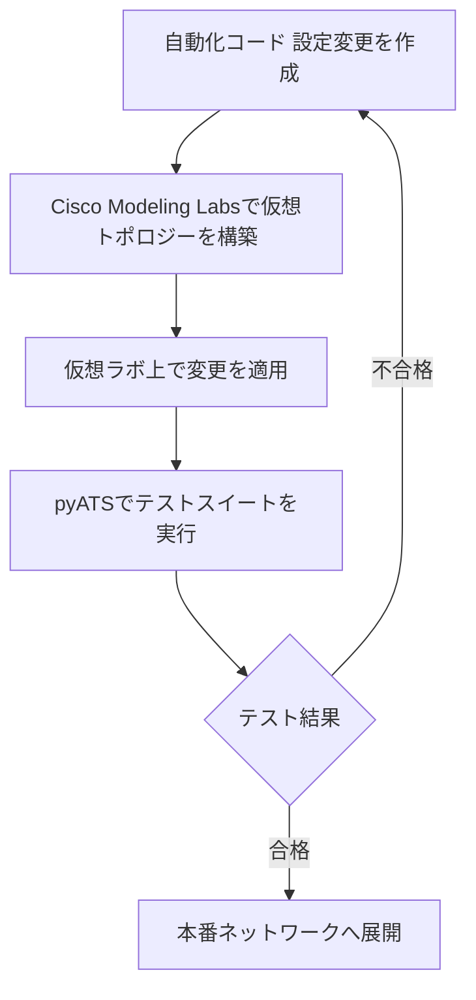

### 比較表

| ツール | 主な役割 | 特徴 |
|---|---|---|
| Cisco Modeling Labs（CML） | 仮想ネットワークの構築・シミュレーション | 実機イメージに近い仮想ノードでトポロジーを再現、GUIとAPIの両方を提供 |
| pyATS | ネットワークの自動テスト・検証 | Python製、CI/CDに統合しやすい、Genieライブラリと組み合わせて機種差分を吸収 |

### 学習のポイント

CMLは「作る前に試す（設計・検証用の仮想環境）」、pyATSは「作った後に確かめる（自動テスト・検証フレームワーク）」という役割分担で覚えると整理しやすいです。

---

## 5.4 インフラ自動化におけるCI/CDパイプラインの構成要素と利点

### 解説

CI/CD（継続的インテグレーション／継続的デリバリー）は、ソフトウェア開発の考え方をネットワークインフラの変更管理に適用したものです。コードの変更を **小さく、頻繁に、自動テストを通しながら** 本番へ届けることで、変更に伴うリスクを下げます。

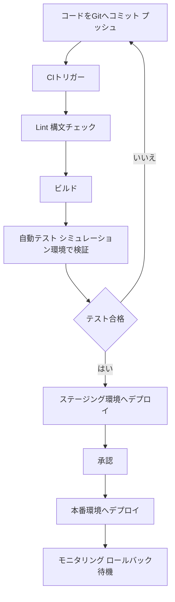

### 構成要素と利点

| 構成要素 | 役割 |
|---|---|
| バージョン管理（Git） | 変更内容と履歴の一元管理、トリガーの起点 |
| Lint／構文チェック | コードやAnsible Playbookなどの記述ミスを早期検出 |
| ビルド | 必要なアーティファクト（パッケージ、コンテナイメージ等）の生成 |
| 自動テスト | CML/pyATSなどを用いた仮想環境での事前検証 |
| ステージング環境 | 本番に近い環境での最終確認 |
| 承認プロセス | 人間によるレビュー・ゲート |
| デプロイ（本番適用） | 自動化ツールによる実際の設定投入 |
| モニタリング／ロールバック | 異常時に前の状態へ迅速に戻す仕組み |

| 利点 | 説明 |
|---|---|
| リスクの低減 | 小さい変更を都度検証するため大規模障害を防ぎやすい |
| 再現性 | 誰が実行しても同じ手順・同じ結果になる |
| スピード | 手動作業を排除し、変更のリードタイムを短縮 |
| 可視化 | パイプラインの各段階の成功／失敗が記録・追跡できる |

---

## 5.5 Infrastructure as Code（IaC）の原則

### 解説

Infrastructure as Code（IaC）とは、サーバーやネットワークの構成を **手作業ではなくコードとして記述し、バージョン管理・自動適用する** 考え方です。

代表的な原則は次の通りです。

- **宣言的（Declarative）**：「どうやるか」ではなく「どうあるべきか（Desired State）」を記述する
- **冪等性（Idempotency）**：同じコードを何度実行しても結果が変わらない
- **単一の情報源（Single Source of Truth）**：構成はコードリポジトリが正であり、手作業の変更は「ドリフト」とみなす
- **再現性・一貫性**：同じコードから何度でも同じ環境を再現できる
- **バージョン管理との統合**：変更履歴・レビュー・ロールバックがコードの管理と一体化する

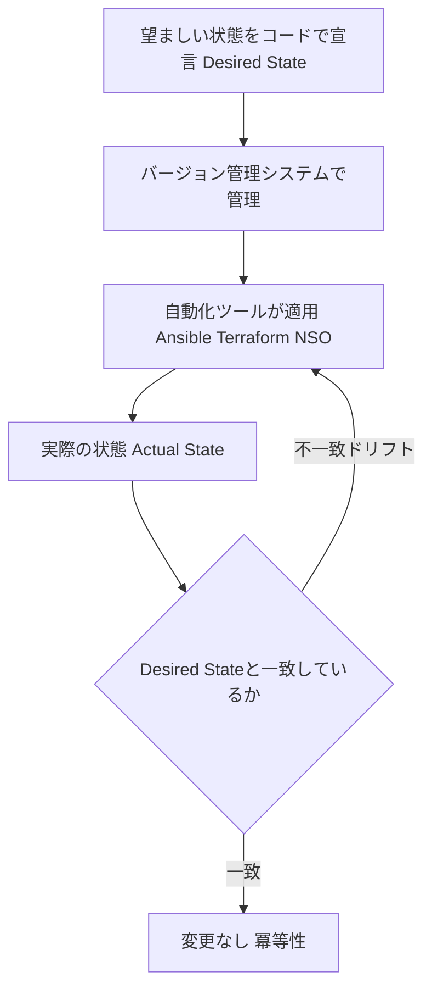

### 学習のポイント

「宣言的」と「冪等性」の2語は頻出です。**「同じPlaybook/Terraformコードを2回実行しても2回目は何も変わらない」** という感覚がまさに冪等性であり、IaCの信頼性の根幹です。

---

## 5.6 自動化ツールの機能（Ansible, Terraform, Cisco NSO）

### 解説

CCNAAUTOでは、代表的な3つの自動化ツールの **役割の違い** を理解しているかが問われます。

| ツール | 主な用途 | 記述言語 | 動作方式 | 状態管理 |
|---|---|---|---|---|
| **Ansible** | サーバー/ネットワーク機器の構成管理、アプリ配備 | YAML（Playbook） | エージェントレス（SSH/APIでプッシュ型） | 実行のたびに現在の状態をチェックし収束させる |
| **Terraform** | クラウドやインフラリソースのプロビジョニング（VM、ネットワーク、サブネット等） | HCL | 宣言的、プロバイダー経由でAPIを呼び出す | ステートファイルで管理対象の状態を保持 |
| **Cisco NSO** | マルチベンダー環境でのネットワークサービスのオーケストレーション | YANGベースのサービスモデル | トランザクション的（全成功 or 全ロールバック） | サービスモデルと実機構成の同期を一元管理 |

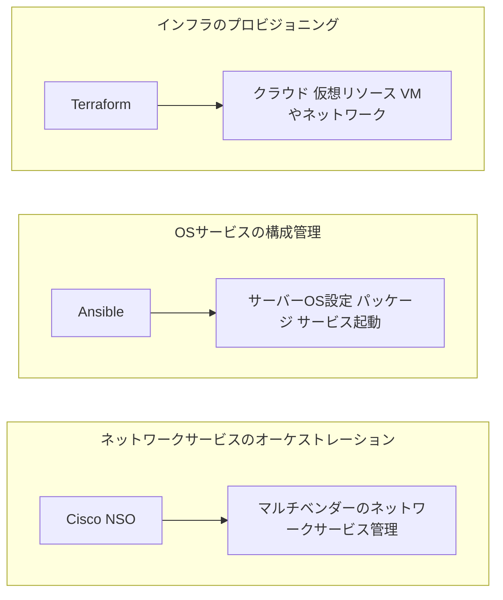

### 学習のポイント

3つは競合というより **補完関係** にあることが多いです。Terraformで土台となるインフラを用意し、Ansibleでその上のOS/サービスを構成し、NSOで複数ベンダーのネットワークサービスを一元的にオーケストレーションする、という組み合わせがよく使われます。

---

## 5.7 PythonスクリプトのワークフローをCisco APIから読み解く

### 解説

出題では、Meraki・Cisco Catalyst Center・ACI・RESTCONFなどのAPIを呼び出すPythonスクリプトが提示され、「このスクリプトは何を自動化しているか」を特定させる形式が出ます。読み解く際は次の流れを意識します。

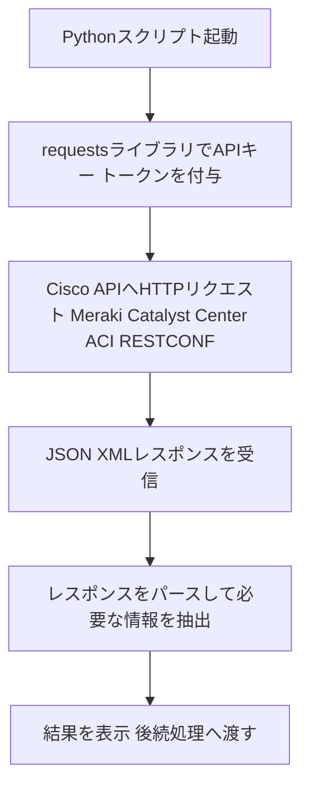

### サンプルコード（Meraki APIでネットワーク配下のデバイス一覧を取得）

```python
import requests

BASE_URL = "https://api.meraki.com/api/v1"
headers = {
    "Authorization": "Bearer <API_KEY>",
    "Content-Type": "application/json",
}

network_id = "N_123456789"
response = requests.get(
    f"{BASE_URL}/networks/{network_id}/devices",
    headers=headers,
)

if response.status_code == 200:
    devices = response.json()
    for device in devices:
        print(device["name"], device["model"], device["serial"])
else:
    print(f"エラー: {response.status_code}")
```

### 読み解きのポイント

| 確認するポイント | このスクリプトでの内容 |
|---|---|
| どのAPIエンドポイントを呼んでいるか | `/networks/{network_id}/devices` |
| 認証方式は何か | Bearerトークン（カスタムトークン方式） |
| HTTPメソッドは何か | GET（取得系の操作） |
| レスポンスをどう扱っているか | JSONをパースしてデバイス名・機種・シリアルを表示 |
| このスクリプトが自動化している業務 | 特定ネットワーク配下のデバイス一覧の取得 |

### Cisco主要プラットフォームAPIの早見表

| プラットフォーム | 領域 | 典型的なタスク例 |
|---|---|---|
| Meraki | クラウド管理型ネットワーク | デバイス一覧取得、クライアント一覧取得、ネットワーク設定変更 |
| Cisco Catalyst Center | エンタープライズネットワーク管理 | デバイスインベントリ取得、テンプレート適用、ヘルス状態確認 |
| ACI | データセンターSDN | テナント/EPG（エンドポイントグループ）の作成・照会 |
| RESTCONF | デバイス単体のモデル駆動API | インターフェース設定の取得・変更（YANGモデルベース） |

---

## 5.8 Ansible Playbookのワークフローの解釈

### 解説

Ansible Playbookは、対象ホストに対して行う一連の作業（Task）をYAMLで記述したものです。出題では「このPlaybookは何をしているか」を読み解く力が問われます。特に **パッケージ管理・サービスに関連するユーザー管理・基本的なサービス設定・起動停止** がよく出るパターンです。

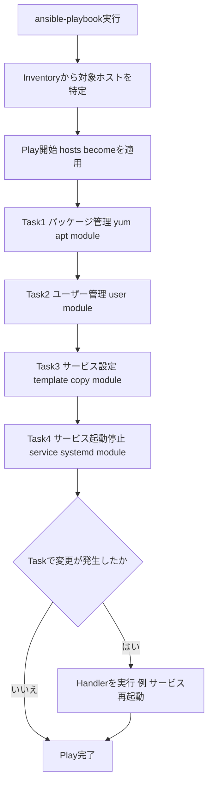

### サンプルPlaybook

```yaml
---
- name: Webサーバーの基本セットアップ
  hosts: web_servers
  become: true

  tasks:
    - name: nginxパッケージをインストール
      apt:
        name: nginx
        state: present

    - name: webadminユーザーを作成
      user:
        name: webadmin
        groups: www-data
        shell: /bin/bash

    - name: nginx設定ファイルを配置
      template:
        src: nginx.conf.j2
        dest: /etc/nginx/nginx.conf
      notify: nginxを再起動

    - name: nginxサービスを起動し自動起動を有効化
      service:
        name: nginx
        state: started
        enabled: true

  handlers:
    - name: nginxを再起動
      service:
        name: nginx
        state: restarted
```

### 読み解きのポイント

| Playbookの要素 | このサンプルでの内容 |
|---|---|
| 対象ホスト（hosts） | `web_servers` グループ |
| 権限昇格（become） | 有効（root権限で実行） |
| パッケージ管理タスク | `apt` モジュールで `nginx` をインストール |
| ユーザー管理タスク | `user` モジュールで `webadmin` を作成 |
| サービス設定タスク | `template` モジュールで設定ファイルを配置 |
| 起動・停止タスク | `service` モジュールで起動＋自動起動を有効化 |
| Handler（変更時のみ実行） | 設定ファイルが変更された場合のみ `nginx` を再起動 |

---

## 5.9 Bashスクリプトのワークフローの解釈

### 解説

Bashスクリプトは、ファイル管理・アプリのインストール・ユーザー管理・ディレクトリ操作などをまとめて自動化する際によく使われます。出題では、スクリプトを読んで「何を目的とした処理か」を答える形式が中心です。

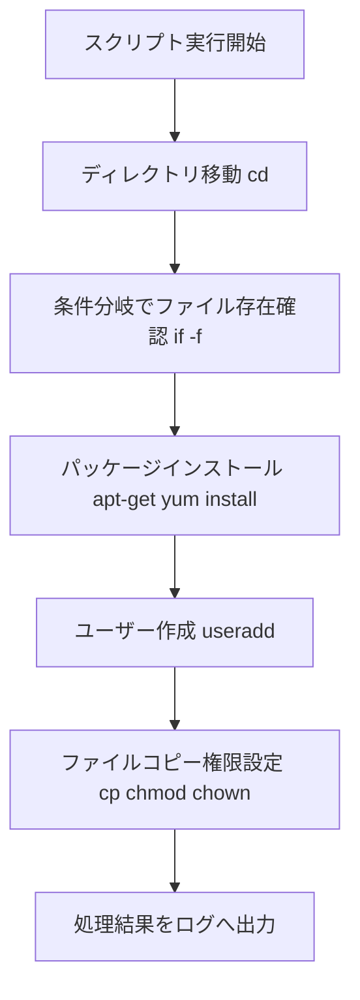

### サンプルスクリプト

```bash
#!/bin/bash
set -e

APP_DIR="/opt/myapp"
LOG_FILE="/var/log/myapp_setup.log"

cd "$APP_DIR" || exit 1

if [ ! -f "$APP_DIR/config.yaml" ]; then
    echo "config.yamlが見つかりません。新規作成します。" >> "$LOG_FILE"
    cp "$APP_DIR/config.yaml.default" "$APP_DIR/config.yaml"
fi

apt-get update && apt-get install -y python3-pip

if ! id "appuser" &>/dev/null; then
    useradd -m -s /bin/bash appuser
fi

chown -R appuser:appuser "$APP_DIR"
chmod 750 "$APP_DIR"

echo "セットアップ完了: $(date)" >> "$LOG_FILE"
```

### 読み解きのポイント

| 行・処理 | 意味 |
|---|---|
| `set -e` | コマンドが失敗した時点でスクリプトを終了する（エラー時の安全策） |
| `cd "$APP_DIR"` | 作業ディレクトリへ移動（ディレクトリナビゲーション） |
| `if [ ! -f ... ]` | ファイルが存在しない場合のみ処理を実行する条件分岐 |
| `apt-get install` | パッケージ（アプリ）のインストール |
| `id ... \|\| useradd` | ユーザーが存在しなければ作成する（ユーザー管理） |
| `chown` / `chmod` | 所有者・権限設定（ファイル管理） |
| ログ出力 | 実行結果を後から追跡できるよう記録 |

---

## 5.10 RESTCONF/NETCONFクエリ結果の解釈

### 解説

RESTCONFとNETCONFは、どちらも **YANGデータモデルに基づくモデル駆動プログラマビリティ** を実現するプロトコルですが、トランスポートやデータ形式に違いがあります。

| 観点 | RESTCONF | NETCONF |
|---|---|---|
| トランスポート | HTTPS | SSH |
| データ形式 | JSON（またはXML） | XML |
| 操作方法 | GET/POST/PUT/PATCH/DELETEなどHTTPメソッド | `<get-config>`, `<edit-config>` などのRPC操作 |
| 設計思想 | RESTfulなWeb API親和性 | トランザクション性・複数candidate/runningデータストア管理に強み |
| 主なユースケース | Web/自動化ツールとの連携がしやすい | 厳密な設定変更のトランザクション管理 |

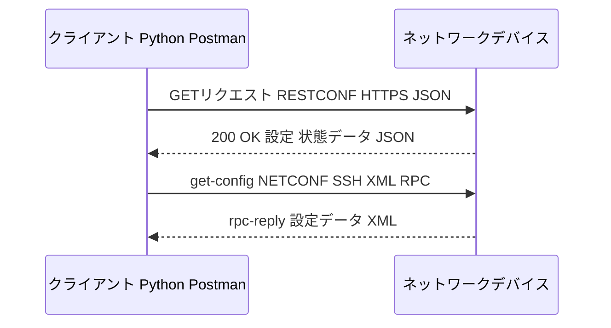

### RESTCONFレスポンス例（JSON）

```json
{
  "ietf-interfaces:interface": [
    {
      "name": "GigabitEthernet0/1",
      "type": "iana-if-type:ethernetCsmacd",
      "enabled": true,
      "ietf-ip:ipv4": {
        "address": [
          { "ip": "192.0.2.1", "netmask": "255.255.255.0" }
        ]
      }
    }
  ]
}
```

### NETCONFレスポンス例（XML／rpc-reply）

```xml
<rpc-reply message-id="101" xmlns="urn:ietf:params:xml:ns:netconf:base:1.0">
  <data>
    <interfaces xmlns="urn:ietf:params:xml:ns:yang:ietf-interfaces">
      <interface>
        <name>GigabitEthernet0/1</name>
        <enabled>true</enabled>
      </interface>
    </interfaces>
  </data>
</rpc-reply>
```

### 読み解きのポイント

- RESTCONFの結果は基本的に **JSONのキーバリュー構造** としてそのままPythonの辞書に変換しやすい。
- NETCONFの結果は **XMLの入れ子構造**（`<rpc-reply>` → `<data>` → モデルの要素）になっており、XPathやXMLパーサーで要素を辿って値を取得する。
- どちらも「どのYANGモデルの、どの要素の値を取得・設定しているか」を対応づけて読むのが基本です。

---

## 5.11 基本的なYANGモデルの解釈

### 解説

YANG（Yet Another Next Generation）は、ネットワーク機器の設定・状態データを **構造化して定義するためのデータモデリング言語** です（RFC 7950）。NETCONFやRESTCONFでやり取りされるデータの「型定義書」のような役割を果たします。

主なYANGの構成要素は次の通りです。

| 要素 | 意味 |
|---|---|
| `module` | YANGモデル全体の名前空間・単位 |
| `container` | 関連するデータをグループ化する入れ物（リストではない） |
| `list` | 複数のインスタンスを持てる要素（`key` で一意に識別） |
| `leaf` | 単一の値を持つデータ項目（型を持つ） |
| `leaf-list` | 同じ型の値を複数持てるリスト |
| `key` | `list` 内の各エントリを一意に識別するための項目 |
| `type` | データ型（string, boolean, uint16など） |

### サンプルYANGモデル（簡略版・ietf-interfacesの一部を模したもの）

```yang
module example-interfaces {
  namespace "urn:example:interfaces";
  prefix "if";

  container interfaces {
    list interface {
      key "name";

      leaf name {
        type string;
      }
      leaf enabled {
        type boolean;
      }
      leaf mtu {
        type uint16;
      }
      leaf-list address {
        type string;
      }
    }
  }
}
```

### モデルの階層構造

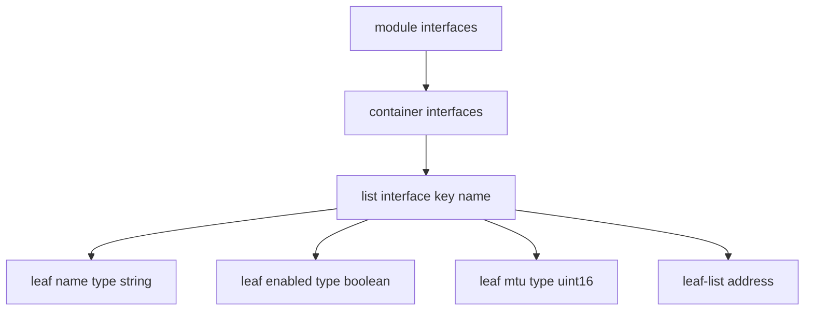

### 学習のポイント

出題では複雑なYANGモデル定義そのものを暗記する必要はなく、「`list` はキーを持つ複数エントリ、`leaf` は単一の値、`container` は単なるグループ化」という **構造上の役割の違い** を読み取れれば十分対応できます。

---

## 5.12 Unified Diffの解釈

### 解説

Unified Diff（統一diff形式）は、Gitなどのバージョン管理システムで **2つのファイル（変更前・変更後）の差分** を表現する標準的なフォーマットです。コードレビューやPull Requestの差分表示で日常的に目にします。

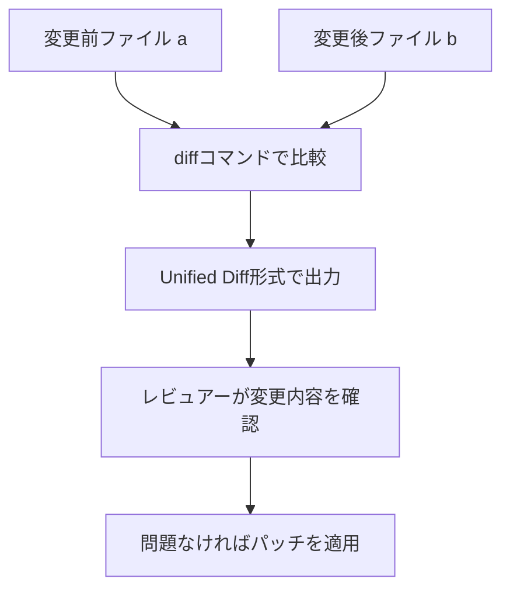

### Unified Diffのサンプル

```diff
--- a/playbook.yml
+++ b/playbook.yml
@@ -5,7 +5,7 @@
   tasks:
     - name: nginxパッケージをインストール
       apt:
-        name: nginx
+        name: nginx=1.18.0-6ubuntu14
         state: present

     - name: webadminユーザーを作成
       user:
```

### 構文要素の意味

| 記号・要素 | 意味 |
|---|---|
| `--- a/...` | 変更前ファイル（オリジナル）を示す行 |
| `+++ b/...` | 変更後ファイルを示す行 |
| `@@ -5,7 +5,7 @@` | ハンク（変更箇所）の位置。変更前ファイルの5行目から7行分、変更後も5行目から7行分を意味する |
| 行頭が `-` | 変更前ファイルにのみ存在した行（削除された行） |
| 行頭が `+` | 変更後ファイルにのみ存在する行（追加された行） |
| 行頭が空白 | 変更前後で変わらない「文脈（コンテキスト）」の行 |

### 読み解きのポイント

上記の例では、`nginx` パッケージのバージョン指定なしのインストールを、`nginx=1.18.0-6ubuntu14` という **特定バージョン固定のインストール** に変更していることが読み取れます。「何が削除され、何が追加されたか」を `-` と `+` の行から素早く特定する練習をしておきましょう。

---

## 5.13 コードレビューの原則と利点

### 解説

コードレビューは、他のメンバーが書いたコード（Playbook、Terraformコード、Pythonスクリプトなど）を **マージ前に第三者が確認するプロセス** です。インフラ自動化ではコード1つの誤りが本番ネットワーク全体に影響しうるため、特に重要視されます。

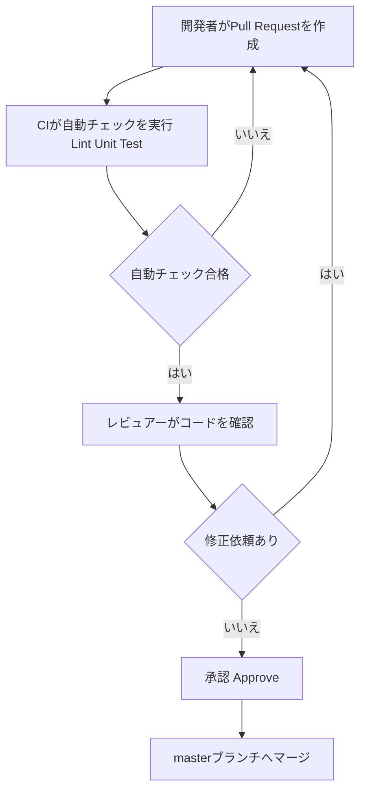

### コードレビューの原則

| 原則 | 説明 |
|---|---|
| 小さい単位でレビューする | 変更が大きすぎるとレビューの質が下がるため、小さく分割する |
| 客観的な基準を持つ | スタイルガイドやチェックリストに基づいて評価する |
| 自動チェックを併用する | Lintやユニットテストで機械的に検出できる問題は自動化に任せる |
| 建設的なフィードバック | 個人攻撃ではなく、コードの改善点を具体的に伝える |

### コードレビューの利点

| 利点 | 説明 |
|---|---|
| 品質向上 | バグや設計上の問題を本番投入前に発見できる |
| 知識共有 | チーム内でコードやシステムの理解が広がる |
| 一貫性の担保 | コーディング規約や設計方針の統一が図れる |
| リスク低減 | 重大な設定ミスがネットワーク全体に波及する前に防止できる |

---

## 5.14 APIコールを含むシーケンス図の解釈

### 解説

シーケンス図（Sequence Diagram）は、複数のコンポーネント（クライアント、APIサーバー、認証サーバー、デバイスなど）が **時間の流れに沿ってどのようにやり取りするか** を表現する図です。API連携の全体的な流れを理解・説明する際によく使われます。

読み方の基本ルールは次の通りです。

| 図の要素 | 意味 |
|---|---|
| 縦の線（ライフライン） | 各参加者（Participant）が存在する時間軸 |
| 実線の矢印（→） | 同期的なリクエスト（呼び出し） |
| 破線の矢印（-->） | レスポンス（応答） |
| 上から下への時間順 | 図の上にあるやり取りほど時間的に先に発生する |

### サンプルのシーケンス図

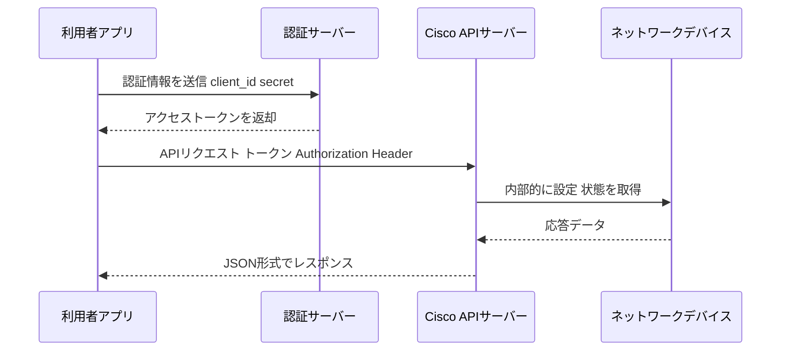

### 読み解きのポイント

上記の図から、次のような流れを説明できるようになることが目標です。

1. 利用者アプリはまず認証サーバーに認証情報（client_id/secretなど）を送信する
2. 認証サーバーはアクセストークンを発行して利用者アプリへ返す
3. 利用者アプリは、そのトークンをAuthorizationヘッダーに付けてCisco APIサーバーへリクエストする
4. Cisco APIサーバーは内部的にネットワークデバイスへ問い合わせる
5. 得られた応答データはJSON形式で最終的に利用者アプリへ返却される

このように「誰が」「誰に」「何を」送り、「どんな順序で」応答が返ってくるかを、矢印の向きと上下の順序から追えるようにしておきましょう。

---

## まとめ・学習の進め方

### 5.0 Infrastructure and Automation 全項目の早見表

| 項目 | タイトル | ひとことまとめ |
|---|---|---|
| 5.1 | モデル駆動プログラマビリティの価値 | YANG構造化データによる自動化の一貫性・スケーラビリティ |
| 5.2 | コントローラー vs デバイスレベル管理 | 抽象度とスケールのトレードオフ |
| 5.3 | シミュレーション・テストツール | CMLで作る前に試し、pyATSで作った後に確かめる |
| 5.4 | CI/CDパイプライン | 小さく・頻繁に・自動テストしながら安全に届ける |
| 5.5 | Infrastructure as Codeの原則 | 宣言的・冪等性・単一の情報源 |
| 5.6 | 自動化ツール（Ansible/Terraform/NSO） | プロビジョニング・構成管理・オーケストレーションの補完関係 |
| 5.7 | Pythonスクリプトのワークフロー識別 | どのAPI・どの操作・何を自動化しているかを特定する |
| 5.8 | Ansible Playbookの解釈 | Task単位で処理内容とHandlerの発火条件を追う |
| 5.9 | Bashスクリプトの解釈 | ファイル/ユーザー/パッケージ操作の目的を読み取る |
| 5.10 | RESTCONF/NETCONFクエリ結果の解釈 | JSON(REST)とXML(NETCONF)の構造を読み解く |
| 5.11 | YANGモデルの解釈 | module/container/list/leafの役割の違い |
| 5.12 | Unified Diffの解釈 | `-`/`+`/文脈行から変更内容を特定する |
| 5.13 | コードレビューの原則と利点 | 品質・知識共有・一貫性・リスク低減 |
| 5.14 | シーケンス図の解釈 | 参加者・矢印の向き・時間順序を追う |

### 学習の進め方のおすすめ

1. まず **5.5（IaCの原則）と5.6（ツールの役割分担）** で全体感を掴む
2. 次に **5.1・5.2・5.11** でモデル駆動プログラマビリティとYANGの基礎を固める
3. **5.7〜5.10・5.12・5.14** は、実際に短いサンプルコード／出力／図を読んで「何をしているか」を口頭で説明する練習を繰り返す（試験本番と同じ形式の練習になります）
4. **5.3・5.4・5.13** はプロセス・原則の理解が中心なので、キーワード（CI/CD、シミュレーション、コードレビュー）と目的をセットで覚える

---

## 参考文献・出典

本記事は以下の一次情報源に基づいて作成しています。

| 情報源 | 内容 | URL |
|---|---|---|
| Cisco | CCNA Automation certification（認定概要） | https://www.cisco.com/site/us/en/learn/training-certifications/certifications/automation/ccna-automation/index.html |
| Cisco | CCNA Automation Exam and Training（試験詳細） | https://www.cisco.com/site/us/en/learn/training-certifications/certifications/automation/ccna-automation/exams-and-training.html |
| Cisco Learning Network | CCNAAUTO 200-901 Exam Topics（出題項目一覧ページ） | https://learningnetwork.cisco.com/s/ccnaauto-exam-topics |
| Cisco | Automating Networks Using Cisco Platforms v1.1（200-901）公式出題項目PDF（一次情報源・本記事5.0ドメインの項目番号の出典） | https://learningcontent.cisco.com/documents/marketing/exam-topics/200-901-CCNAAUTO_v.1.1.pdf |
| Cisco DevNet | Cisco Modeling Labs（CML）製品情報 | https://developer.cisco.com/modeling-labs/ |
| Cisco DevNet | pyATSドキュメント | https://developer.cisco.com/docs/pyats/ |
| Cisco DevNet | Cisco Network Services Orchestrator（NSO） | https://developer.cisco.com/site/nso/ |
| IETF | RFC 7950: The YANG 1.1 Data Modeling Language | https://www.rfc-editor.org/rfc/rfc7950 |
| IETF | RFC 6241: Network Configuration Protocol（NETCONF） | https://www.rfc-editor.org/rfc/rfc6241 |
| IETF | RFC 8040: RESTCONF Protocol | https://www.rfc-editor.org/rfc/rfc8040 |
| Ansible | Ansible公式ドキュメント | https://docs.ansible.com/ |
| HashiCorp | Terraform公式ドキュメント | https://developer.hashicorp.com/terraform/docs |
| Git | git-diff公式ドキュメント（Unified Diff形式） | https://git-scm.com/docs/git-diff |

> **免責事項**：出題比率・出題項目の番号（5.1〜5.14）はCiscoが公開する公式出題項目PDF（上表参照）に基づいていますが、Cisco公式の記載どおり「実際の試験ではガイドラインに記載のない関連トピックが出題される場合があり、内容は予告なく変更される可能性があります」。最新の出題範囲は必ず上記のCisco公式ページで確認してください。
