# CCNA Automation 試験対策ガイド：Network Fundamentals ドメイン徹底解説

> 対象試験：**Automating Networks Using Cisco Platforms v1.1（200-901 CCNAAUTO）**
> 対象ドメイン：**6.0 Network Fundamentals（出題比率 15%）**
> 対象読者：ネットワーク自動化を学び始めたばかりの初学者

---

## 目次

1. [はじめに：このガイドの位置づけ](#overview)
2. [Step 0：Network Fundamentalsドメインの全体像](#step0)
3. [Step 1：MACアドレスとVLAN（6.1）](#step1)
4. [Step 2：IPアドレス・ルート・サブネットマスク/プレフィックス・ゲートウェイ（6.2）](#step2)
5. [Step 3：ネットワーク機器の役割（6.3）](#step3)
6. [Step 4：ネットワークトポロジ図の読み方（6.4）](#step4)
7. [Step 5：Management / Data / Control Plane（6.5）](#step5)
8. [Step 6：IPサービス（DHCP・DNS・NAT・SNMP・NTP）（6.6）](#step6)
9. [Step 7：プロトコルとポート番号（6.7）](#step7)
10. [Step 8：アプリケーション接続トラブルの切り分け（6.8）](#step8)
11. [Step 9：ネットワーク制約がアプリケーションに与える影響（6.9）](#step9)
12. [まとめ：学習のポイント](#summary)
13. [参考情報源](#references)

---

## はじめに：このガイドの位置づけ

**CCNA Automation** は、Cisco が2026年に「DevNet Associate」から名称変更した資格で、ネットワークの基礎知識とソフトウェア開発・自動化スキルの両方を証明する認定資格です。取得には、120分の試験 **200-901 CCNAAUTO（Automating Networks Using Cisco Platforms v1.1）** に合格する必要があります。日本語での受験も可能です。

この試験は次の6つのドメインで構成されており、その中で本ガイドが扱う **「6.0 Network Fundamentals」は出題比率15%** を占めます。

| ドメイン番号 | ドメイン名 | 出題比率 |
|---|---|---|
| 1.0 | Software Development and Design | 15% |
| 2.0 | Understanding and Using APIs | 20% |
| 3.0 | Cisco Platforms and Development | 15% |
| 4.0 | Application Deployment and Security | 15% |
| 5.0 | Infrastructure and Automation | 20% |
| **6.0** | **Network Fundamentals** | **15%** |

「自動化やプログラミングの資格なのに、なぜネットワークの基礎知識が問われるのか？」と疑問に思うかもしれません。理由はシンプルで、**ネットワークの仕組みを理解していないと、API呼び出しの失敗やアプリケーションの接続不良が「コードの問題」なのか「ネットワークの問題」なのかを切り分けられない** からです。このドメインは、自動化エンジニアが最低限押さえておくべきネットワークの土台を確認するためのものです。

---

## Step 0：Network Fundamentalsドメインの全体像

このドメインは、公式Exam Topicsにおいて 6.1〜6.9 の9つの小項目に分かれています。まずは全体像を掴みましょう。

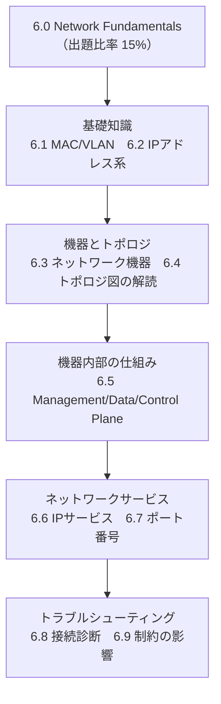

| 項番 | 学習内容 | このガイドの該当ステップ |
|---|---|---|
| 6.1 | MACアドレスとVLANの目的・使い方 | Step 1 |
| 6.2 | IPアドレス、ルート、サブネットマスク/プレフィックス、ゲートウェイ | Step 2 |
| 6.3 | スイッチ・ルーター・ファイアウォール・ロードバランサーなど機器の機能 | Step 3 |
| 6.4 | 基本的なネットワークトポロジ図の解読 | Step 4 |
| 6.5 | ネットワーク機器のManagement/Data/Control Planeの機能 | Step 5 |
| 6.6 | DHCP・DNS・NAT・SNMP・NTPというIPサービスの機能 | Step 6 |
| 6.7 | SSH・Telnet・HTTP・HTTPS・NETCONFなど代表的なポート番号 | Step 7 |
| 6.8 | NAT不良・ポート遮断・プロキシ・VPNに起因する接続トラブルの診断 | Step 8 |
| 6.9 | ネットワークの制約がアプリケーションに与える影響 | Step 9 |

---

## Step 1：MACアドレスとVLAN（6.1）

### MACアドレスとは

MACアドレス（Media Access Control Address）は、ネットワークインターフェース（NIC）ごとに割り当てられた **48ビット（6バイト）の物理アドレス** です。IPアドレスのように後から人間が変更する前提のものではなく、機器の出荷時に焼き込まれる一意な識別子です。

| 構成要素 | ビット数 | 説明 |
|---|---|---|
| OUI（Organizationally Unique Identifier） | 上位24ビット | 製造ベンダーを識別する部分（IEEEが割り当て） |
| デバイス固有部分 | 下位24ビット | ベンダー内で一意になるように製造時に割り当てられる部分 |

表記例：`AA:BB:CC:11:22:33`（コロン区切り16進数）。スイッチはこのMACアドレスをもとに **MACアドレステーブル** を作成し、どのポートの先にどの端末がいるかを学習してフレームを転送します。

### VLANとは

VLAN（Virtual LAN）は、**1台の物理スイッチを論理的に複数のネットワークへ分割する** 技術です。同じVLANに属するポート同士は同じブロードキャストドメインとして通信できますが、異なるVLAN同士は直接通信できず、通信させるにはルーターやL3スイッチによるルーティングが必要になります。

VLANを使う主な理由：

- 部署やシステムの単位でネットワークを論理分離し、セキュリティを高める
- ブロードキャストトラフィックの範囲を限定し、無駄な通信を減らす
- 物理的な配線を変更せずに、ポートの割り当て変更だけでネットワーク構成を変えられる

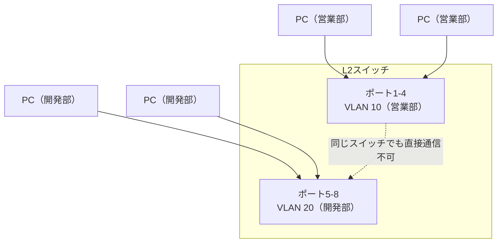

上図のように、同じスイッチに接続していても、VLAN 10とVLAN 20の端末同士は直接通信できません。両者を通信させたい場合は、後述するルーター（またはL3スイッチ）が間に入る必要があります。

---

## Step 2：IPアドレス・ルート・サブネットマスク/プレフィックス・ゲートウェイ（6.2）

### IPアドレスの基本

IPv4アドレスは32ビットで構成され、`192.168.1.10` のように8ビットずつ4つに区切った10進数（オクテット）で表記します。ネットワークを自動化する上では、**「どこまでがネットワーク部で、どこからがホスト部か」** を正しく読めることが重要です。

### サブネットマスクとプレフィックス表記

サブネットマスクは、IPアドレスのうちネットワーク部を示すビットを表します。近年はサブネットマスクの代わりに **CIDR表記（プレフィックス表記）** である `/24` のような形式がよく使われます。

| CIDR表記 | サブネットマスク | ネットワーク部のビット数 | 1ネットワークあたりの利用可能ホスト数（目安） |
|---|---|---|---|
| /24 | 255.255.255.0 | 24ビット | 254台 |
| /25 | 255.255.255.128 | 25ビット | 126台 |
| /26 | 255.255.255.192 | 26ビット | 62台 |
| /16 | 255.255.0.0 | 16ビット | 約65,534台 |
| /8 | 255.0.0.0 | 8ビット | 約1,677万台 |

### プライベートIPアドレス range

社内ネットワークなど、インターネットに直接公開しないネットワークでは、以下のプライベートIPアドレス範囲（RFC 1918）が使われます。

| 範囲 | CIDR表記 | 主な用途 |
|---|---|---|
| 10.0.0.0 〜 10.255.255.255 | 10.0.0.0/8 | 大規模企業ネットワーク |
| 172.16.0.0 〜 172.31.255.255 | 172.16.0.0/12 | 中規模ネットワーク |
| 192.168.0.0 〜 192.168.255.255 | 192.168.0.0/16 | 家庭用・小規模オフィス |

### デフォルトゲートウェイとルート

**デフォルトゲートウェイ** とは、端末が「自分と異なるネットワーク宛て」の通信を送るときに最初に転送する先（通常はルーターのインターフェース）です。**ルート（経路情報）** は、「どの宛先ネットワークには、どのインターフェース・次のホップを通れば到達できるか」という情報で、ルーターはこの情報をもとにパケットを転送します。

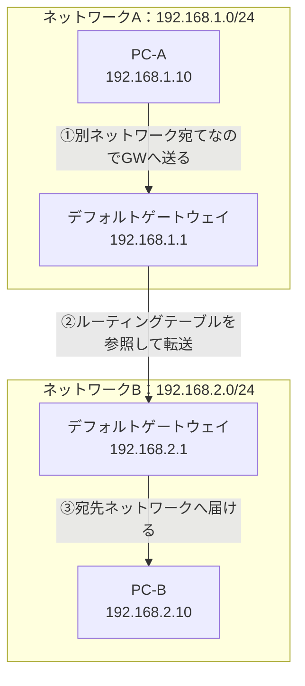

PC-Aが同じネットワーク（192.168.1.0/24）内の端末と通信する場合はゲートウェイを経由せず直接通信しますが、PC-Bのような別ネットワーク宛ての通信は、必ずデフォルトゲートウェイ（ルーター）を経由します。

---

## Step 3：ネットワーク機器の役割（6.3）

自動化対象となる代表的なネットワーク機器と、その役割を整理します。まず前提として、OSI参照モデルの主要レイヤーを簡単に押さえておくと機器の役割が理解しやすくなります。

| レイヤー | 名称 | 関連する技術・機器の例 |
|---|---|---|
| L7 | アプリケーション層 | HTTP、DNS、ロードバランサーのURLベース振り分け |
| L4 | トランスポート層 | TCP/UDP、ポート番号、L4ロードバランシング |
| L3 | ネットワーク層 | IPアドレス、ルーティング、ルーター |
| L2 | データリンク層 | MACアドレス、VLAN、スイッチ |
| L1 | 物理層 | ケーブル、光ファイバー、物理ポート |

### 代表的なネットワーク機器

| 機器 | 主なレイヤー | 役割 |
|---|---|---|
| スイッチ（L2スイッチ） | L2 | MACアドレステーブルをもとにフレームを転送。VLANによるセグメント分割を行う |
| ルーター | L3 | IPアドレス・ルーティングテーブルをもとに、異なるネットワーク間でパケットを転送する |
| ファイアウォール | L3〜L7 | 通信のフィルタリング、アクセス制御、脅威検知・防御を行う |
| ロードバランサー | L4〜L7 | 1つの仮想IP（VIP）宛ての通信を複数のサーバーへ振り分け、可用性と拡張性を高める |

自動化の観点では、これらの機器はそれぞれ異なるAPI・プロトコル（RESTCONF、NETCONF、ベンダー独自API等）で操作されることが多く、**「どの機器が、どのレイヤーで、何をしているか」を理解していないと自動化スクリプトが何を制御しているのか把握できない** 点がポイントです。

---

## Step 4：ネットワークトポロジ図の読み方（6.4）

試験では、スイッチ・ルーター・ファイアウォール・ロードバランサー・ポート番号などを含む基本的なトポロジ図を読み解く問題が出題されます。以下は典型的な構成例です。

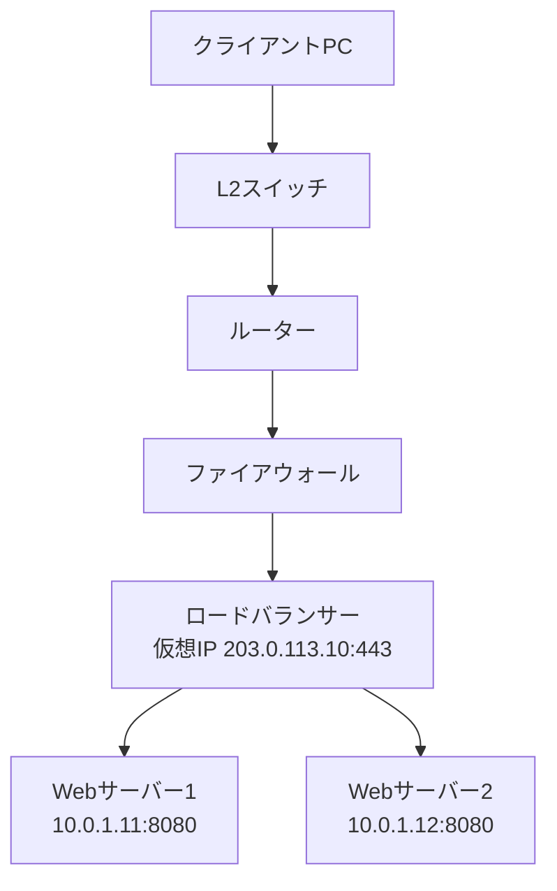

このようなトポロジ図を読み解くときのチェックポイント：

- **通信の入口から出口までの経路**：クライアント→スイッチ→ルーター→ファイアウォール→ロードバランサー→サーバー、という順に、どの機器を経由するかを追う
- **境界（レイヤーの切り替わり地点）**：VLANの境界はスイッチ、ネットワークの境界はルーター、というようにどこで何が変わるかを意識する
- **ポート番号の意味**：`203.0.113.10:443` のような表記は「そのIPアドレスの443番ポート（HTTPS）で待ち受けている」ことを示す
- **通信がどこで変換・分散されるか**：ロードバランサーの仮想IP宛ての通信が、内部的にどのサーバーへ振り分けられるか

---

## Step 5：Management / Data / Control Plane（6.5）

ネットワーク機器（ルーターやスイッチ）の内部動作は、役割ごとに3つの「プレーン」に分けて理解すると自動化の対象範囲が明確になります。

| プレーン | 役割 | 具体例 |
|---|---|---|
| Management Plane（管理プレーン） | 機器の設定・監視・運用管理を行う | SSH、SNMP、NETCONF/RESTCONFによるアクセス |
| Control Plane（制御プレーン） | 経路情報や制御情報の学習・交換を行う（いわば機器の「頭脳」） | OSPFやBGPなどのルーティングプロトコル、STP、MACアドレステーブルの学習 |
| Data Plane（データプレーン） | 実際のユーザートラフィック（パケット/フレーム）を転送する（いわば機器の「手足」） | 受信したパケットの実転送処理（フォワーディング） |

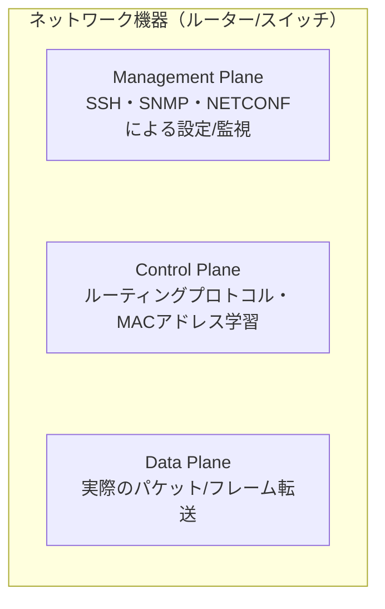

自動化スクリプトの多くは **Management Plane** を経由して機器を操作します（例：NETCONFで設定を投入する、SNMPで状態を取得する）。一方で、実際にユーザーの通信を運ぶのは **Data Plane** であり、両者は別物であることを区別して理解しておくことが重要です。

---

## Step 6：IPサービス（DHCP・DNS・NAT・SNMP・NTP）（6.6）

ネットワーク自動化の現場でも頻繁に登場する、5つの代表的なIPサービスを解説します。

| サービス | 正式名称 | 主な役割 | 主なポート |
|---|---|---|---|
| DHCP | Dynamic Host Configuration Protocol | IPアドレス等をクライアントへ自動的に割り当てる | UDP 67（サーバー）／68（クライアント） |
| DNS | Domain Name System | ドメイン名とIPアドレスを相互に変換する（名前解決） | UDP/TCP 53 |
| NAT | Network Address Translation | プライベートIPアドレスとグローバルIPアドレスを変換する | ポートではなくアドレス変換の技術 |
| SNMP | Simple Network Management Protocol | 機器の状態監視、情報収集、障害の自発通知を行う | UDP 161（ポーリング）／162（Trap） |
| NTP | Network Time Protocol | ネットワーク機器間で時刻を同期する | UDP 123 |

### DHCP：IPアドレスの自動割り当て

DHCPは「DORA」と呼ばれる4段階のやり取りでIPアドレスを割り当てます。

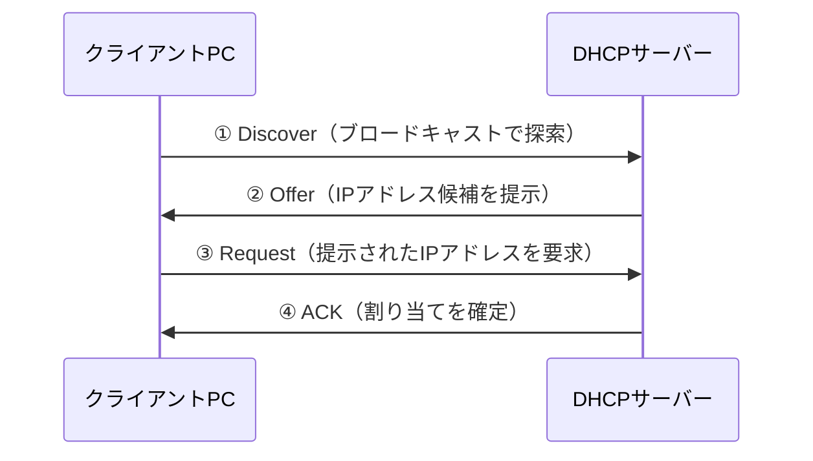

### DNS：名前解決の流れ

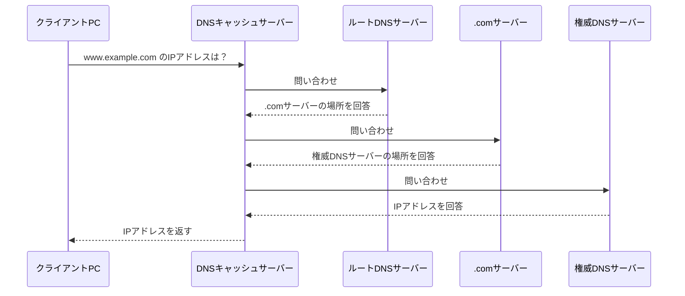

### NAT：アドレス変換の考え方

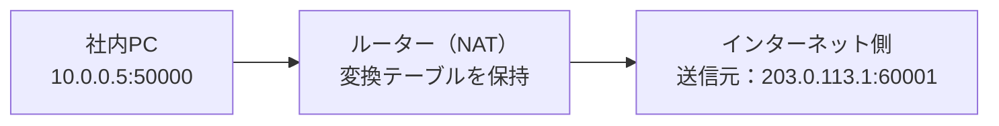

社内のプライベートIPアドレスは、インターネットへ出る際にルーター（またはファイアウォール）でグローバルIPアドレスへ変換されます。この変換テーブルの不整合や枯渇が、後述する「NAT Problem」の原因になります。

### SNMP：機器の監視

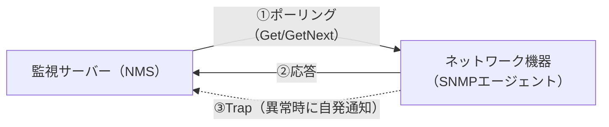

### NTP：時刻同期の階層構造

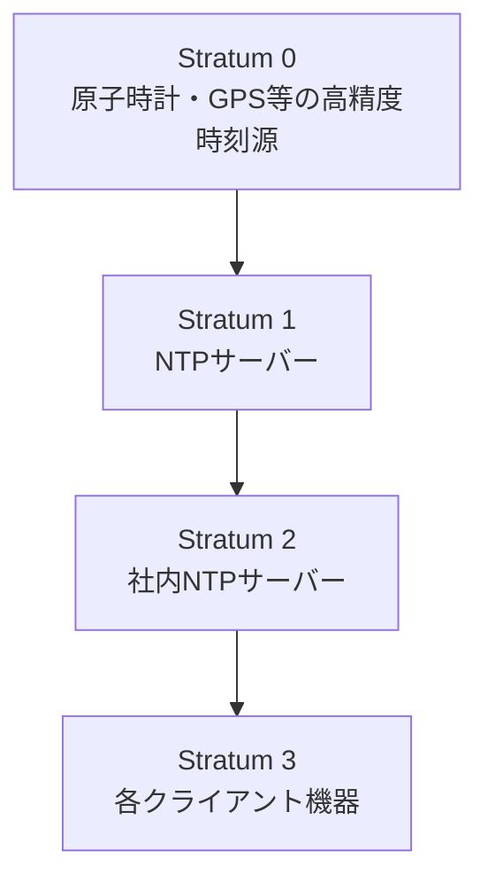

NTPでは、時刻源からの距離（階層）を「Stratum」という数値で表します。ログの時刻がずれていると障害発生時刻の突き合わせができなくなるため、自動化・運用の現場でも時刻同期は地味に重要な要素です。

---

## Step 7：プロトコルとポート番号（6.7）

自動化スクリプトでAPIやCLIに接続する際、どのポートを使うかを把握しておくことは、接続トラブルの切り分けにも直結します。

| プロトコル | ポート番号 | トランスポート | 主な用途 |
|---|---|---|---|
| SSH | 22 | TCP | 機器へのセキュアなリモートログイン・管理プレーンアクセス |
| Telnet | 23 | TCP | 暗号化されないリモートログイン（現在は非推奨） |
| HTTP | 80 | TCP | 平文でのWebアクセス・REST APIアクセス |
| HTTPS | 443 | TCP | TLSで暗号化されたWebアクセス・REST APIアクセス |
| NETCONF | 830 | TCP（SSH上） | モデル駆動型プログラマビリティによる機器の設定取得・投入 |
| DNS | 53 | UDP/TCP | 名前解決 |
| DHCP | 67 / 68 | UDP | IPアドレスの自動割り当て |
| SNMP | 161 / 162 | UDP | 機器の監視・自発通知（Trap） |
| NTP | 123 | UDP | 時刻同期 |

これらのポート番号は、後述する「アプリケーション接続トラブルの切り分け」において、ファイアウォールでどのポートが遮断されているかを特定する際の基礎知識になります。

---

## Step 8：アプリケーション接続トラブルの切り分け（6.8）

自動化スクリプトやAPIクライアントから接続できないとき、原因を「NAT不良」「ポート遮断」「プロキシ」「VPN」の観点で切り分ける考え方を整理します。

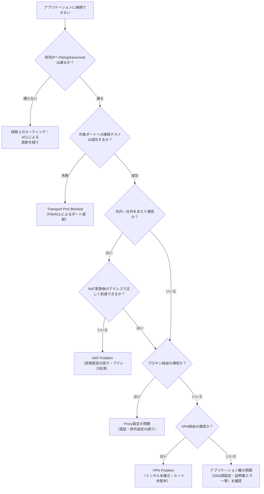

### 症状から原因を推測するための早見表

| 症状 | 疑われる原因 | 確認方法の例 |
|---|---|---|
| 特定サーバーの特定ポートにだけ接続できない | Transport Port Blocked | 対象ポートへの接続テスト、FW/ACLのログ確認 |
| 社外から社内のアプリケーションに到達できない | NAT Problem | NAT変換テーブル、グローバルIPの割当状況の確認 |
| 特定URL・宛先だけアクセスできない | Proxy設定の誤り | プロキシの除外リスト・認証設定の確認 |
| 拠点間の通信だけ失敗する | VPN Problem | VPNトンネルの状態、ルーティング配布状況の確認 |

このような切り分けの考え方は、「まずネットワーク経路を疑い、その後にアプリケーション層を疑う」という順序で進めるのが基本です。自動化エンジニアであっても、コードを直す前にネットワークパスを確認する習慣が重要になります。

---

## Step 9：ネットワーク制約がアプリケーションに与える影響（6.9）

最後に、ネットワークの物理的・構成的な制約が、アプリケーションの動作にどう影響するかを整理します。

| ネットワーク制約 | アプリケーションへの影響 | 対策の例 |
|---|---|---|
| 帯域幅（Bandwidth）不足 | レスポンス遅延、タイムアウトの増加 | QoS設定、帯域増強、キャッシュの活用 |
| 遅延（Latency）／RTTの増大 | リアルタイム性の低下（音声・映像品質の劣化） | CDNの活用、エッジコンピューティングの活用 |
| MTU／パケットフラグメンテーション | パケット分割によるオーバーヘッド、通信エラー | MTUサイズの調整、Path MTU Discoveryの利用 |
| パケットロス | 再送増加によるスループット低下 | 信頼性の高いプロトコルの選択、QoSの適用 |
| ファイアウォール／ACLによる通信制限 | 特定ポート・プロトコルの通信が失敗する | 事前の通信要件確認、必要なポートの申請・開放 |

これらは一見「ネットワーク側の話」に見えますが、自動化やアプリケーション開発を行う上でも、**「なぜこのAPI呼び出しはタイムアウトするのか」「なぜこの自動化ジョブは特定拠点でだけ失敗するのか」** を理解するための土台になります。

---

## まとめ：学習のポイント

- **Network Fundamentalsは出題比率15%** で、6つのドメインの中では中程度の比率だが、他ドメイン（特に「5.0 Infrastructure and Automation」）の理解の土台になる
- **6.1〜6.4** は「モノの名前と役割」を覚える暗記寄りの範囲：MACアドレス、VLAN、IPアドレス、サブネット、ゲートウェイ、各種ネットワーク機器、トポロジ図の読み方
- **6.5** は機器内部の「動作の分類」（Management/Control/Data Plane）を理解する範囲
- **6.6〜6.7** はIPサービス（DHCP・DNS・NAT・SNMP・NTP）とポート番号という「実務で頻出する具体的な仕組み」を押さえる範囲
- **6.8〜6.9** は「トラブルシューティングの考え方」を問う応用範囲であり、他の項目の理解を前提とした総合問題になりやすい
- 学習の順序としては、**用語（6.1〜6.4）→ 仕組み（6.5〜6.7）→ 応用・診断（6.8〜6.9）** の順に進めると理解しやすい

---

## 参考情報源

本ガイドの内容は、以下のCisco公式情報源に基づいて作成しています。最新情報は変更される可能性があるため、学習の際は必ず一次情報を確認してください。

- CCNA Automation Certification（資格概要）
  https://www.cisco.com/site/us/en/learn/training-certifications/certifications/automation/ccna-automation/index.html
- CCNA Automation Exam and Training（試験概要・受験情報：試験名、時間、言語、費用など）
  https://www.cisco.com/site/us/en/learn/training-certifications/certifications/automation/ccna-automation/exams-and-training.html
- Automating Networks Using Cisco Platforms v1.1（200-901）Exam Topics（公式出題範囲PDF：本ガイドの6.1〜6.9の項目立てはこの一次資料に基づく）
  https://learningcontent.cisco.com/documents/marketing/exam-topics/200-901-CCNAAUTO_v.1.1.pdf
- Cisco Learning Network：CCNAAUTO Exam Topics and Study Guide（コミュニティ上の出題範囲ページ）
  https://learningnetwork.cisco.com/s/ccnaauto-exam-topics

> 補足：CCNA Automationは、Ciscoが2026年に「DevNet Associate」から名称変更した資格です。既存のDevNet Associate資格保有者は、自動的にCCNA Automation資格保有者として扱われます。
