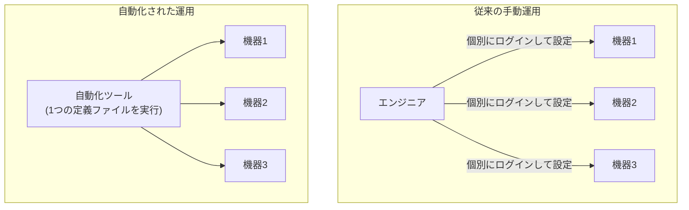
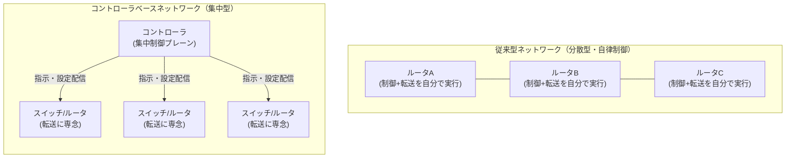
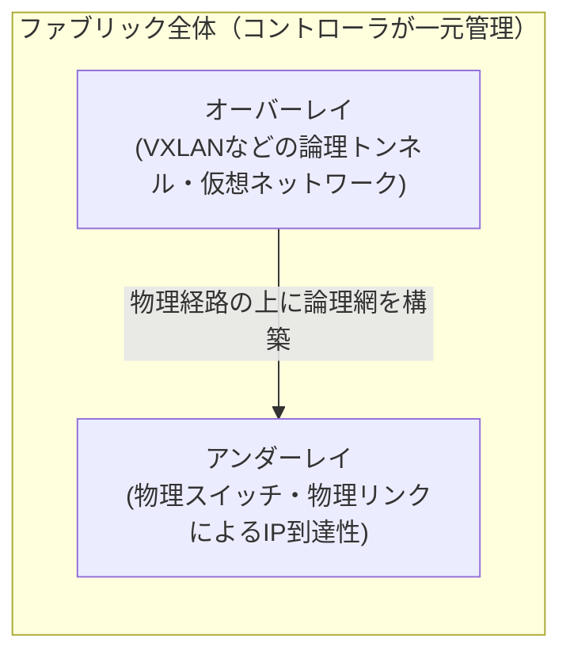
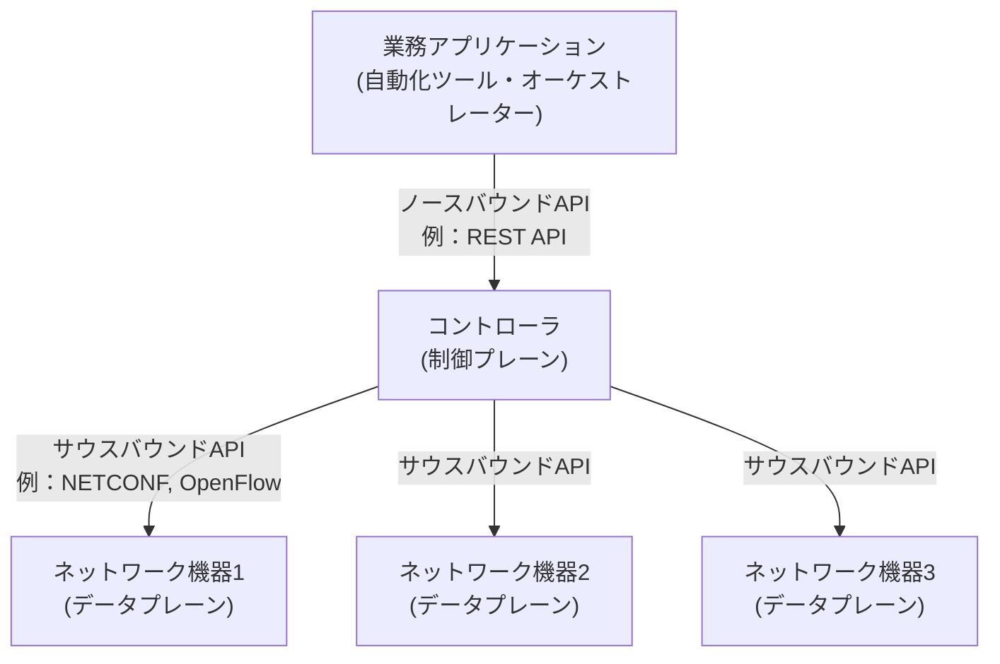
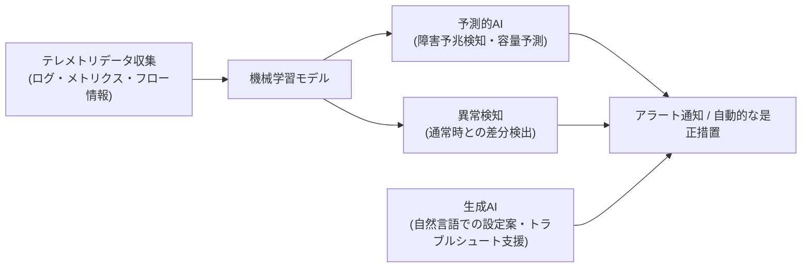
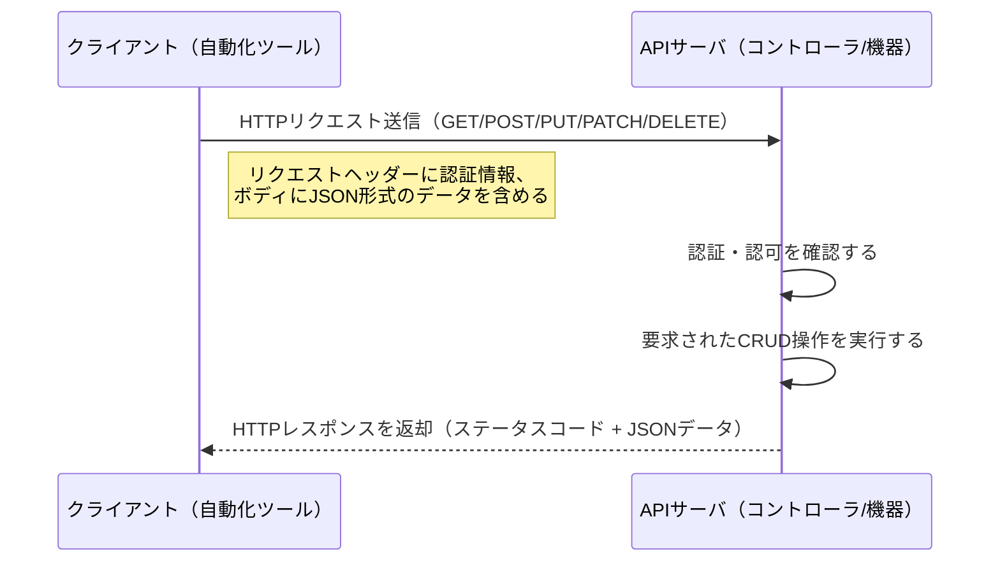
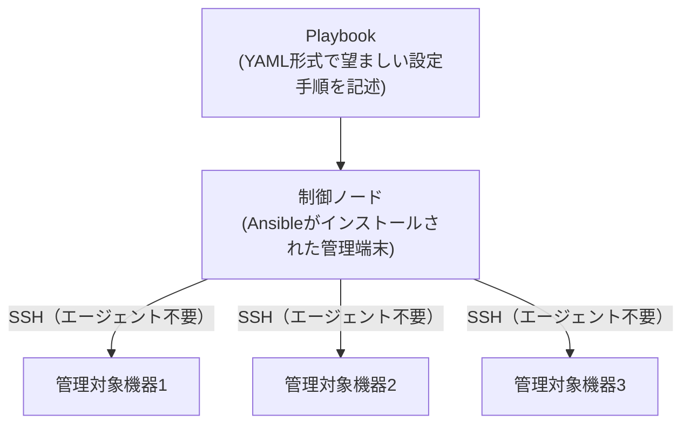

# CCNA 200-301 試験対策ガイド
## 6.0 自動化とプログラマビリティ（Automation and Programmability）

> 本ガイドは、Cisco CCNA 200-301 認定試験（v1.1 ブループリント）の出題範囲のうち、
> **ドメイン6「自動化とプログラマビリティ」**（出題比率 **10%**）を、
> ネットワーク自動化を学び始めたばかりの人でも理解できるよう、ステップバイステップで解説するものです。

---

## 目次

1. [このドメインの全体像](#このドメインの全体像)
2. [6.1 自動化がネットワーク管理に与える影響](#61-自動化がネットワーク管理に与える影響)
3. [6.2 従来のネットワークとコントローラベースネットワーキングの比較](#62-従来のネットワークとコントローラベースネットワーキングの比較)
4. [6.3 コントローラベース・SDNアーキテクチャ](#63-コントローラベースsdnアーキテクチャ)
5. [6.4 ネットワーク運用におけるAI（生成的・予測的）と機械学習](#64-ネットワーク運用におけるai生成的予測的と機械学習)
6. [6.5 REST APIの特徴](#65-rest-apiの特徴)
7. [6.6 構成管理メカニズム（Ansible、Terraformなど）](#66-構成管理メカニズムansibleterraformなど)
8. [6.7 JSONエンコードデータの構成要素](#67-jsonエンコードデータの構成要素)
9. [まとめと学習のポイント](#まとめと学習のポイント)
10. [出典・参考資料](#出典参考資料)

---

## このドメインの全体像

CCNA 200-301 試験は、以下の6つのドメインから構成されています。ドメイン6「自動化とプログラマビリティ」は出題比率こそ10%と最も低い部類ですが、**2024年8月20日に施行されたv1.1ブループリントで最も内容が刷新されたドメイン**でもあり、生成AI・機械学習・Terraformといった新しいキーワードが追加されています。

| ドメイン番号 | ドメイン名 | 出題比率 |
|---|---|---|
| 1.0 | ネットワークの基礎 (Network Fundamentals) | 20% |
| 2.0 | ネットワークアクセス (Network Access) | 20% |
| 3.0 | IP接続性 (IP Connectivity) | 25% |
| 4.0 | IPサービス (IP Services) | 10% |
| 5.0 | セキュリティの基礎 (Security Fundamentals) | 15% |
| **6.0** | **自動化とプログラマビリティ** | **10%** |

> 📌 **初学者向け補足**：出題比率が低いからといって軽視してよいわけではありません。特にこのドメインは「読んで理解できれば得点できる」暗記寄りの領域が多く、CLIでの実機操作を問われることはほぼありません。コストパフォーマンスの高い得点源です。

### v1.1ブループリントでの変更点まとめ

| 項目番号 | 内容 | v1.1での変更点 |
|---|---|---|
| 6.1 | 自動化がネットワーク管理に与える影響を説明する | 変更なし |
| 6.2 | 従来のネットワークとコントローラベースネットワーキングを比較する | 変更なし |
| 6.3 | コントローラベース・SDNアーキテクチャ（オーバーレイ、アンダーレイ、ファブリック）を説明する | 変更なし |
| 6.3.a | 制御プレーンとデータプレーンの分離 | 変更なし |
| 6.3.b | ノースバウンドAPIとサウスバウンドAPI | 変更なし |
| 6.4 | ネットワーク運用における（生成的および予測的）AIと機械学習を説明する | **新規**。旧v1.0の「従来型のキャンパスデバイス管理とCisco DNA Centerによるデバイス管理の比較」から置き換えられた |
| 6.5 | REST APIの特徴（**認証方式**、CRUD、HTTPメソッド、データエンコーディング）を説明する | **認証方式（authentication types）が追加** |
| 6.6 | 構成管理の仕組み（**Ansible、Terraform**など）を認識する | **旧v1.0のPuppet／ChefからAnsible／Terraformへ変更** |
| 6.7 | JSONエンコードされたデータの構成要素を認識する | 変更なし |

---

## 6.1 自動化がネットワーク管理に与える影響

### 従来型の運用スタイル

従来のネットワーク運用では、エンジニアが1台ずつ機器にSSHやコンソールでログインし、CLI（コマンドラインインターフェース）でコマンドを打ち込んで設定します。機器の台数が少ないうちは問題になりませんが、数十台・数百台規模になると、以下のような課題が顕在化します。

- **作業時間の増大**：1台あたり数分の作業でも、100台になれば膨大な時間がかかる
- **設定ミスのリスク**：手作業でのコピー&ペーストやタイプミスによる人為的ミス
- **設定の不整合**：同じ役割の機器でも、担当者や作業日によって微妙に設定が異なってしまう
- **変更履歴の追跡困難**：「いつ・誰が・何を変更したか」が残りにくい

### 自動化による解決

自動化（Automation）とは、人手による繰り返し作業をスクリプトやツールに代行させる手法です。あらかじめ「あるべき設定（テンプレート）」を定義しておき、それを多数の機器へ一括で適用します。



### 自動化がもたらす主なメリット

| メリット | 説明 |
|---|---|
| 一貫性 (Consistency) | 同じ定義から設定を投入するため、機器間の設定ブレがなくなる |
| 拡張性 (Scalability) | 機器が10台でも1,000台でも、同じ作業手順で対応できる |
| 迅速性 (Speed) | 手作業に比べて圧倒的に短時間で設定変更が完了する |
| 人為的ミスの低減 | タイプミスやコピー漏れなどのヒューマンエラーを削減できる |
| 再現性・文書化 | 設定定義（コード）自体が「何を設定したか」の記録として残る |
| コンプライアンス強化 | 定期的に「あるべき状態」との差分チェックを自動実行できる |

---

## 6.2 従来のネットワークとコントローラベースネットワーキングの比較

### 従来型ネットワークの特徴

従来型のネットワークでは、各機器（ルータ・スイッチ）が**自律的に**動作します。それぞれの機器が個別に「制御プレーン（経路計算などの頭脳部分）」と「データプレーン（実際にパケットを転送する部分）」の両方を持ち、隣接機器とルーティングプロトコルなどで情報交換しながら独立して判断を下します。

### コントローラベースネットワークの特徴

コントローラベースネットワーク（SDN：Software-Defined Networking の考え方）では、ネットワーク全体の制御ロジックを**1つの集中管理ポイント（コントローラ）**に集約します。個々の機器は主に「データプレーン（転送処理）」に専念し、経路計算などの判断はコントローラが代行して各機器に指示を出します。



### 比較表

| 観点 | 従来型ネットワーク | コントローラベースネットワーク |
|---|---|---|
| 制御ロジックの所在 | 各機器が個別に保持（分散） | コントローラに集約（集中） |
| 設定変更の方法 | 機器ごとにCLIで個別設定 | コントローラのGUI/APIから一括投入 |
| ネットワーク全体の可視性 | 機器ごとの情報を個別に確認する必要がある | コントローラが全体トポロジを一元的に把握 |
| 拡張性 | 機器台数の増加に伴い運用負荷が線形に増加 | ポリシーベースで一括管理でき運用負荷を抑えやすい |
| 代表例 | 従来のルータ/スイッチによるネットワーク | Cisco DNA Center、Cisco ACI など |

---

## 6.3 コントローラベース・SDNアーキテクチャ

コントローラベースのSDNアーキテクチャは、一般的に「アンダーレイ」「オーバーレイ」「ファブリック」という3つの概念で説明されます。

- **アンダーレイ (Underlay)**：物理的なスイッチ・ルータ・ケーブルで構成される、実際のIP到達性を提供する土台のネットワーク
- **オーバーレイ (Overlay)**：アンダーレイの上に構築される論理的なネットワーク。VXLANなどのトンネリング技術を使い、物理構成を意識せずに仮想ネットワークを自由に設計できる
- **ファブリック (Fabric)**：アンダーレイとオーバーレイを組み合わせ、コントローラによって一元的に管理・自動化された、ネットワーク全体の総称



### 6.3.a 制御プレーンとデータプレーンの分離

SDNの中心的な考え方が「制御プレーンとデータプレーンの分離」です。

- **制御プレーン (Control Plane)**：「どの経路でパケットを送るべきか」を判断する頭脳部分。SDNではコントローラに集約される
- **データプレーン (Data Plane)**：制御プレーンの指示に従って、実際にパケットを転送する実行部分。各機器（スイッチ・ルータ）が担う

この分離により、ネットワーク機器はシンプルな「転送装置」に徹することができ、複雑な経路計算ロジックはコントローラ側にまとめて実装・更新できるようになります。

### 6.3.b ノースバウンドAPIとサウスバウンドAPI

コントローラは、上位のアプリケーションと下位のネットワーク機器の両方とやり取りします。この2方向の通信インターフェースを、それぞれ「ノースバウンドAPI」「サウスバウンドAPI」と呼びます。

- **ノースバウンドAPI (Northbound API)**：コントローラと、その上位にある業務アプリケーション・自動化ツール・オーケストレーターとの間のインターフェース。一般にREST APIが使われる
- **サウスバウンドAPI (Southbound API)**：コントローラと、その下位にあるネットワーク機器との間のインターフェース。NETCONF、OpenFlow、SNMPなどが使われる

> 📌 **覚え方**：地図の方位と同様に「北（ノース）＝上（アプリケーション側）」「南（サウス）＝下（機器側）」とイメージすると覚えやすいです。



---

## 6.4 ネットワーク運用におけるAI（生成的・予測的）と機械学習

この項目は**v1.1ブループリントで新規に追加された**、最も新しいトピックです。旧v1.0にあった「従来型キャンパスデバイス管理とCisco DNA Centerの比較」という項目が削除され、代わりに設けられました。

### 機械学習 (Machine Learning) とは

ネットワークが日々生成する大量のテレメトリデータ（ログ、トラフィック統計、機器の状態情報など）を学習し、そこから「通常時のパターン」を自動的に導き出す技術です。CCNAレベルでは、実装方法ではなく「何ができるのか」を高いレベルで理解していれば十分です。

### 予測的AI (Predictive AI) の役割

過去のデータパターンから将来を予測する用途です。ネットワーク運用における代表例は次のとおりです。

- 障害の予兆検知（機器の劣化・リンク品質の低下などを、故障が発生する前に検出）
- トラフィック量の将来予測に基づく容量計画（キャパシティプランニング）
- 異常なトラフィックパターンの検出（セキュリティインシデントの早期発見）

### 生成的AI (Generative AI) の役割

既存のデータやパターンから、新しいコンテンツ（文章・設定案など）を生成する用途です。ネットワーク運用における代表例は次のとおりです。

- 自然言語での問い合わせに応じた設定コマンド案の生成
- トラブルシューティング時の原因候補・対処方法の提案
- 運用ドキュメントやレポートの自動生成



### 比較まとめ

| 種類 | 主な目的 | ネットワーク運用での代表例 |
|---|---|---|
| 予測的AI (Predictive AI) | 過去データから未来の状態を予測する | 障害予兆検知、キャパシティプランニング |
| 生成的AI (Generative AI) | 新しいコンテンツ（テキスト・設定案）を生成する | 設定コマンドの提案、トラブルシュート支援、レポート自動生成 |
| 機械学習 (Machine Learning) | データからパターンを学習し、判断の基盤を作る | 異常検知、上記2つのAI活用の土台となる技術 |

---

## 6.5 REST APIの特徴

### REST APIとは

> 📌 **初学者向け補足**：API（Application Programming Interface）とは、ソフトウェア同士が情報をやり取りするための「窓口」のようなものです。REST APIは、Web上で広く使われている「HTTP」という通信方式を利用して、この窓口を実現する設計思想（アーキテクチャスタイル）の1つです。

REST APIでは、HTTPの標準的なメソッド（動詞）を使って、リソース（例：VLAN設定、インターフェース情報など）に対する操作を表現します。この操作は「CRUD」という4つの基本操作に対応づけられます。

### HTTPメソッドとCRUD操作の対応

| HTTPメソッド | CRUD操作 | 説明 |
|---|---|---|
| POST | Create（作成） | 新しいリソースを作成する |
| GET | Read（読み取り） | リソースの情報を取得する（参照のみ、変更なし） |
| PUT | Update（更新） | リソース全体を置き換える形で更新する |
| PATCH | Update（更新） | リソースの一部分のみを更新する |
| DELETE | Delete（削除） | リソースを削除する |

### 認証方式（v1.1で追加）

REST APIを利用する際は、「誰がアクセスしているのか」を確認するための認証（Authentication）が必要です。

| 認証方式 | 概要 |
|---|---|
| Basic認証 | ユーザー名とパスワードをBase64エンコードし、リクエストヘッダーに付与する簡易的な方式 |
| APIキー | あらかじめ発行された固有の文字列（キー）をリクエストに含めて認証する方式 |
| Bearerトークン | 認証後に発行されたトークンを、Authorizationヘッダーに付与してアクセスする方式 |
| OAuth 2.0 | 認可サーバーがアクセストークンを発行し、有効期限やアクセス範囲（スコープ）を細かく制御できる方式 |

### データエンコーディング

REST APIでやり取りするデータの形式（エンコーディング）としては、**JSON**が現在最も一般的に使われています（XMLが使われる場合もあります）。JSONの詳細は「6.7」で解説します。

### リクエスト〜レスポンスの流れ



---

## 6.6 構成管理メカニズム（Ansible、Terraformなど）

構成管理ツールは、多数の機器に対して「あるべき設定」を一括で適用・維持するためのツールです。v1.1ブループリントでは、旧v1.0にあった「Puppet、Chef」という記載が、**「Ansible、Terraformなど」**に置き換えられました。

### 主要な構成管理ツールの考え方

- **Ansible**：SSHなどの標準的な通信手段を使い、エージェント（常駐プログラム）を機器側にインストールすることなく設定を投入できる「エージェントレス」ツール。設定は「Playbook」と呼ばれるYAML形式のファイルに手順として記述する
- **Terraform**：クラウドやネットワークの「インフラをコードとして定義する（Infrastructure as Code）」ためのツール。「最終的にどのような状態であるべきか」を宣言的に記述し、Terraformがその状態に近づけるよう自動で調整する



### ツール比較表

| 項目 | Ansible | Terraform | Puppet / Chef（参考：旧v1.0範囲） |
|---|---|---|---|
| 記述スタイル | 手続き型（手順を順番に記述） | 宣言型（あるべき状態を記述） | 宣言型 |
| エージェントの要否 | 不要（SSH/API経由） | 不要 | 必要（マスタ-エージェント型が一般的） |
| 主な用途 | 機器への設定投入・繰り返し作業の自動化 | インフラ全体のプロビジョニング（IaC） | 継続的な構成準拠の維持 |
| 記述言語 | YAML | HCL（HashiCorp Configuration Language） | Puppet DSL / Ruby |
| CCNA v1.1での位置づけ | 明示的に追加・強調 | 新規追加 | v1.1のブループリントからは削除 |

> 📌 **初学者向け補足**：CCNAレベルでは、これらのツールで実際にコードを書けるようになる必要はありません。「Ansibleはエージェントレスで手順を記述する」「Terraformは望ましい状態を宣言してインフラを構築する」という**特徴の違いを説明・識別できること**が求められます。

---

## 6.7 JSONエンコードデータの構成要素

### JSONとは

JSON（JavaScript Object Notation）は、REST APIなどで最も広く使われているデータ形式です。人間にも読みやすく、かつプログラムでも扱いやすいテキスト形式で、「キーと値のペア」を基本単位としてデータを表現します。

### JSONの基本データ型

| データ型 | 説明 | 例 |
|---|---|---|
| 文字列 (string) | ダブルクォート `" "` で囲んだ文字の並び | `"hostname": "R1"` |
| 数値 (number) | 整数または小数 | `"vlan_id": 10` |
| 真偽値 (boolean) | `true` または `false` の2値 | `"enabled": true` |
| 配列 (array) | 角括弧 `[ ]` で囲んだ、値を順序付けて並べたリスト | `"interfaces": ["Gi0/1", "Gi0/2"]` |
| オブジェクト (object) | 波括弧 `{ }` で囲んだ、キーと値のペアの集合 | `{ "vlan": { "id": 10 } }` |
| null | 値が存在しない・未定義であることを示す | `"description": null` |

### JSONデータの例

以下は、あるルータのインターフェース情報をJSON形式で表現した例です。

```json
{
  "hostname": "R1",
  "vlan_id": 10,
  "interfaces": [
    {
      "name": "GigabitEthernet0/1",
      "ip_address": "192.168.1.1",
      "subnet_mask": "255.255.255.0",
      "enabled": true
    },
    {
      "name": "GigabitEthernet0/2",
      "ip_address": "192.168.2.1",
      "subnet_mask": "255.255.255.0",
      "enabled": false
    }
  ],
  "description": null
}
```

この例からわかるように、JSONは「オブジェクトの中に配列があり、配列の中にさらにオブジェクトがある」というように、要素を入れ子（ネスト）にして複雑なデータ構造も柔軟に表現できます。REST APIのリクエスト・レスポンスの中身は、多くの場合このJSON形式でやり取りされます。

---

## まとめと学習のポイント

| 項目 | 学習のポイント |
|---|---|
| 6.1 自動化の影響 | 「一貫性・拡張性・迅速性」など、自動化のメリットをキーワードで説明できるようにする |
| 6.2 従来型 vs コントローラベース | 「制御が分散か集中か」という軸で両者を対比できるようにする |
| 6.3 SDNアーキテクチャ | 制御プレーン/データプレーンの分離、ノースバウンド/サウスバウンドAPIの方向を混同しない |
| 6.4 AIと機械学習 | 「生成的AI＝作る」「予測的AI＝予測する」という役割の違いを説明できるようにする |
| 6.5 REST API | HTTPメソッドとCRUD操作の対応表を暗記する（POST=Create、GET=Read等） |
| 6.6 構成管理 | Ansible＝エージェントレス・手続き型、Terraform＝宣言型・IaCという特徴を区別する |
| 6.7 JSON | オブジェクト・配列・文字列・数値・真偽値・nullの6種類の要素を識別できるようにする |

> 📌 **試験対策のコツ**：このドメインはCLIでの設定作業を問われることがほぼなく、「説明する（Explain）」「認識する（Recognize）」「比較する（Compare）」というレベルの動詞が中心です。したがって、**概念や用語の違いを正確に言葉で説明できること**が得点への近道です。JSONの構文やREST APIのHTTPメソッドは、実際に手を動かして簡単なAPIコールを試してみると記憶に定着しやすくなります。

---

## 出典・参考資料

本ガイドの内容は、以下のCisco公式情報源に基づいて作成しています。

- Cisco CCNA認定 公式ページ（試験範囲の概要）
  https://www.cisco.com/c/ja_jp/training-events/training-certifications/certifications/associate/ccna.html
- Cisco 200-301 CCNA Exam Topics（v1.0 出題範囲PDF、6.1〜6.7の基本構成の出典）
  https://learningcontent.cisco.com/documents/200_301_CCNA_v1.0_2.pdf
- Cisco Learning Network — CCNA Exam Topics（最新の出題範囲一覧）
  https://learningnetwork.cisco.com/s/ccna-exam-topics
- Cisco Blogs — 「Inside the CCNA v1.1 exam update: AI, machine learning, and more」（v1.1での6.4・6.5・6.6の変更点の解説）
  https://blogs.cisco.com/learning/understanding-the-updated-ccna-v1-1-with-ai-machine-learning-and-more
- Cisco Networking Academy — CCNA: ENSA Supplemental Module（v1.1追加分の学習教材、6.4〜6.6を対象範囲として明記）
  https://www.netacad.com/modules/ensa-supplemental

※ Ciscoは「これらの出題範囲はガイドラインであり、実際の試験では関連する他のトピックも出題される可能性がある」としています。最新の情報は必ず上記のCisco公式ソースでご確認ください。
