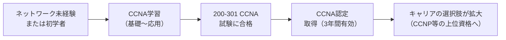
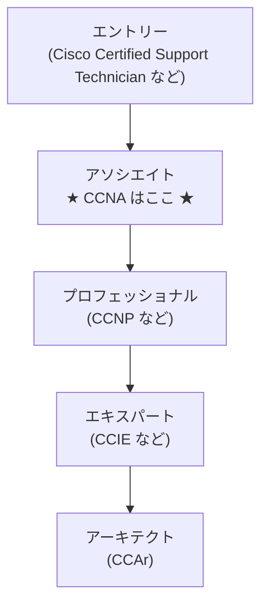
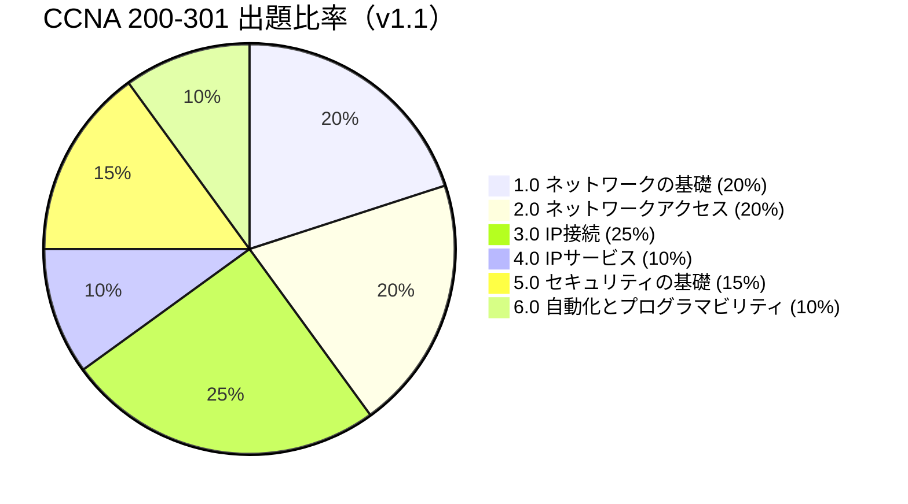
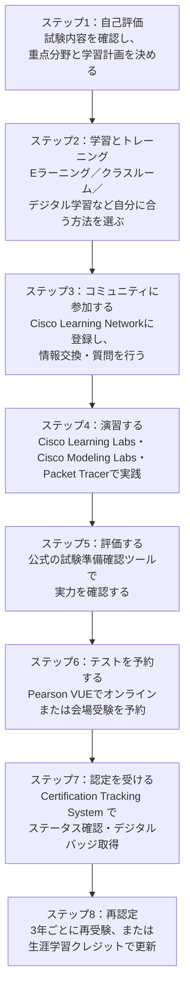
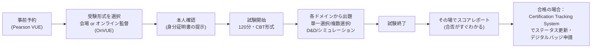

# Cisco CCNA試験 完全ガイド ― 初学者のためのステップバイステップ解説

> 本ガイドは、シスコ公式サイトの情報（2026年7月時点）をもとに、ネットワーク資格試験「CCNA」について、前提知識ゼロの方でも理解できるように整理したものです。各セクションの末尾に根拠となる出典URLを明記しています。

---

## 目次

1. [CCNAとは何か](#1-ccnaとは何か)
2. [CCNA認定の全体像](#2-ccna認定の全体像)
3. [200-301 CCNA試験の基本情報](#3-200-301-ccna試験の基本情報)
4. [試験の出題範囲（6つのドメイン）](#4-試験の出題範囲6つのドメイン)
5. [各ドメインの詳細な学習内容](#5-各ドメインの詳細な学習内容)
6. [出題形式（どんな問題が出るのか）](#6-出題形式どんな問題が出るのか)
7. [合格までの学習ロードマップ（8ステップ）](#7-合格までの学習ロードマップ8ステップ)
8. [試験当日の流れ](#8-試験当日の流れ)
9. [【重要・最新情報】2027年のCCNA試験改定（v2.0）](#9-重要最新情報2027年のccna試験改定v20)
10. [初学者がつまずきやすいポイントと対策](#10-初学者がつまずきやすいポイントと対策)
11. [よくある質問（FAQ）](#11-よくある質問faq)
12. [参考情報源（出典一覧）](#12-参考情報源出典一覧)

---

## 1. CCNAとは何か

**CCNA（Cisco Certified Network Associate）** は、ネットワーク機器最大手のシスコシステムズ（Cisco Systems）が提供する、ネットワーク技術者向けの認定資格です。

シスコ公式サイトでは、CCNA認定について次のように説明されています。CCNA試験は、ネットワークの基礎・IPサービス・セキュリティの基礎・自動化とプログラマビリティを対象としており、今日の高度なネットワークを最適化・管理するために必要なスキルを保持していることを証明するものだとされています。

一言でいえば、**「ネットワークエンジニアとして最低限必要な基礎知識と実務スキルを持っている」ことを客観的に証明するための世界共通資格**です。

出典：[CCNA - Training & Certifications（Cisco公式）](https://www.cisco.com/c/ja_jp/training-events/training-certifications/certifications/associate/ccna.html)

---

## 2. CCNA認定の全体像

CCNAは「資格試験」そのものと「その資格が証明する立ち位置」の2つの側面があります。まずは全体像を表で整理します。

| 項目 | 内容 |
|---|---|
| 認定レベル | アソシエイト（Cisco認定の中でもエントリーに近い階層） |
| 対応可能な職種 | エントリーレベルのネットワークエンジニア／ヘルプデスク技術者／ネットワーク管理者／ネットワークサポート技術者 |
| 前提条件 | 正式な前提条件は**なし**（ただし、シスコ ソリューションの導入・管理経験が1年以上あることが推奨） |
| 認定の有効期間 | 3年間 |
| 再認定の方法 | ①認定試験に再度合格する、または ②生涯学習（Continuing Education）クレジットを30ポイント取得する、のいずれか |

出典：[CCNA - Training & Certifications（Cisco公式）](https://www.cisco.com/c/ja_jp/training-events/training-certifications/certifications/associate/ccna.html)

### Ciscoの認定資格全体におけるCCNAの位置づけ

シスコの認定資格は、難易度別に複数の階層に分かれています。CCNAは「アソシエイト」レベルに位置し、その上に「プロフェッショナル（CCNP）」「エキスパート（CCIE）」「アーキテクト（CCAr）」が続く構造です。

出典：[アソシエイト認定（Cisco公式）](https://www.cisco.com/c/en/us/training-events/training-certifications/certifications/associate.html)

---

## 3. 200-301 CCNA試験の基本情報

CCNA認定を取得するために受験する試験が、**「200-301 CCNA」** という名称の試験です（試験番号がそのまま試験名になっています）。

| 項目 | 内容 |
|---|---|
| 試験番号 | 200-301 |
| 試験時間 | 120分 |
| 試験言語 | 日本語、英語 |
| 出題数の目安 | 公式には正確な問題数は公表されていません（受験者の報告では、おおむね90〜120問程度とされることが多いです） |
| 受験料 | 300 USD（為替レートにより日本円換算額は変動。2026年時点でおおよそ4万円台半ば〜後半が目安） |
| 受験方法 | Pearson VUEを通じて、①テストセンターでの会場受験、または②自宅などからのオンライン監督試験（OnVUE）を選択可能 |
| 合格基準点 | 公式には非公開（スコアレポートは1000点満点のスケールで表示されますが、具体的な合格ラインの数値はシスコから公表されていません） |
| 推奨トレーニング | Implementing and Administering Cisco Solutions（CCNA）コース |

> ⚠️ **受験料についての注意**：受験料は米ドル建てのため、申込時の為替レートによって日本円換算額は変動します。正確な金額は、予約時にPearson VUEの公式サイトで必ず確認してください。

出典：
- [Cisco Certified Network Associate (200-301 CCNA)（Cisco公式）](https://www.cisco.com/c/ja_jp/training-events/training-certifications/exams/current-list/ccna-200-301.html)
- [Pearson VUE（試験予約サイト）](https://www.pearsonvue.co.jp/cisco)

---

## 4. 試験の出題範囲（6つのドメイン）

200-301 CCNA試験は、大きく **6つの分野（ドメイン）** から出題されます。それぞれの分野には出題比率（重み付け）が公式に定められており、試験対策の優先順位を決めるうえで非常に重要な情報です。

| # | ドメイン名 | 出題比率 |
|---|---|---|
| 1.0 | ネットワークの基礎 | 20% |
| 2.0 | ネットワークアクセス | 20% |
| 3.0 | IP接続（IP Connectivity） | 25% |
| 4.0 | IPサービス | 10% |
| 5.0 | セキュリティの基礎 | 15% |
| 6.0 | 自動化とプログラマビリティ | 10% |

**ポイント**：「3.0 IP接続」が25%と最大の比重を占めており、ルーティングの仕組み（スタティックルート、OSPF等）の理解が合否を大きく左右します。一方で、どのドメインも0にはならないため、**苦手分野を作らずまんべんなく学習することが合格の鍵**になります。

出典：[200-301 CCNA 試験内容PDF（Cisco公式・v1.1）](https://www.cisco.com/c/dam/global/ja_jp/training-events/training-certifications/exam-topics/200-301-CCNA.pdf)

---

## 5. 各ドメインの詳細な学習内容

ここでは、公式の試験内容PDFに基づき、各ドメインで具体的にどのようなトピックが問われるのかを一覧化します。初学者の方は、まず用語だけでも眺めて「知らない言葉に印をつける」ところから始めるとよいでしょう。

### 5.1 ネットワークの基礎（20%）

| 主要トピック | 具体的な内容 |
|---|---|
| ネットワーク機器の役割 | ルータ／レイヤ2・3スイッチ／次世代ファイアウォールとIPS／アクセスポイント／コントローラ／エンドポイント／サーバー／PoE |
| ネットワークトポロジ | 2階層・3階層アーキテクチャ、スパインリーフ、WAN、SOHO、オンプレミスとクラウド |
| 物理層 | シングル/マルチモードファイバ・銅線の比較、接続方式、ケーブル関連の障害特定 |
| プロトコル基礎 | TCPとUDPの比較 |
| IPアドレッシング | IPv4のアドレス割り当て・サブネット化、プライベートIPv4、IPv6のアドレス割り当て・プレフィックス、IPv6アドレスタイプ（ユニキャスト／エニーキャスト／マルチキャスト／修正EUI-64） |
| 無線の基礎 | 非オーバーラップWi-Fiチャネル、SSID、RF、暗号化 |
| 仮想化の基礎 | サーバー仮想化、コンテナ、VRF |
| スイッチング概念 | MACラーニング・エージング、フレームスイッチング／フラッディング、MACアドレステーブル |

### 5.2 ネットワークアクセス（20%）

| 主要トピック | 具体的な内容 |
|---|---|
| VLAN | 複数スイッチにまたがるVLAN設定、アクセスポート、デフォルトVLAN、VLAN間接続 |
| スイッチ間接続 | トランクポート、802.1Q、ネイティブVLAN |
| 検出プロトコル | Cisco Discovery Protocol、LLDP |
| EtherChannel | LACPによるレイヤ2/3のリンク集約 |
| スパニングツリー | Rapid PVST+の基本動作、ルートポート／ルートブリッジ、PortFast、ルートガード等 |
| 無線アーキテクチャ | シスコワイヤレスアーキテクチャ、APモード、WLANコンポーネント（AP、WLC等） |
| 管理アクセス | Telnet、SSH、HTTP/HTTPS、コンソール、TACACS+/RADIUS、クラウド管理 |
| 無線LAN GUI設定 | WLAN作成、セキュリティ設定、QoSプロファイル |

### 5.3 IP接続（25%・最重要ドメイン）

| 主要トピック | 具体的な内容 |
|---|---|
| ルーティングテーブル | プロトコルコード、プレフィックス、ネットマスク、ネクストホップ、アドミニストレーティブディスタンス、メトリック |
| 転送先決定ロジック | 最長プレフィックス一致、AD、ルーティングメトリック |
| スタティックルーティング | IPv4/IPv6のデフォルトルート、ネットワークルート、ホストルート、フローティングスタティック |
| OSPFv2 | 単一エリアOSPFv2の設定・確認、ネイバー隣接関係、DR/BDR選択、ルータID |
| 冗長化 | ファーストホップ冗長プロトコル（FHRP）の目的と概念 |

### 5.4 IPサービス（10%）

| 主要トピック | 具体的な内容 |
|---|---|
| NAT | スタティック・プールを使った内部ソースNAT |
| 時刻同期 | NTP（クライアント／サーバーモード） |
| 名前解決とアドレス割当 | DHCP、DNSの役割、DHCPクライアント/リレーの設定 |
| 監視 | SNMP、syslog（ファシリティ・重大度レベル含む） |
| QoS | 分類、マーキング、キューイング、輻輳、ポリシング、シェーピング |
| リモートアクセス | SSHによるリモート管理設定 |
| ファイル転送 | TFTP/FTPの用途と機能 |

### 5.5 セキュリティの基礎（15%）

| 主要トピック | 具体的な内容 |
|---|---|
| セキュリティ概念 | 脅威、脆弱性、エクスプロイト、軽減技術の定義 |
| セキュリティプログラム | ユーザー啓発、トレーニング、物理的アクセス制御 |
| デバイスアクセス制御 | ローカルパスワードによる設定・確認 |
| パスワードポリシー | 多要素認証、証明書、生体認証などの代替手段 |
| VPN | IPsecリモートアクセス／サイト間VPNの概要 |
| ACL | アクセス制御リストの設定・確認 |
| レイヤ2セキュリティ | DHCPスヌーピング、ダイナミックARPインスペクション、ポートセキュリティ |
| AAA | 認証・許可・アカウンティングの概念比較 |
| 無線セキュリティ | WPA/WPA2/WPA3、GUIでのWPA2 PSK設定 |

### 5.6 自動化とプログラマビリティ（10%）

| 主要トピック | 具体的な内容 |
|---|---|
| 自動化の影響 | ネットワーク管理における自動化のインパクト |
| SDN | 従来型ネットワークとコントローラベースネットワークの比較、オーバーレイ／アンダーレイ／ファブリック、制御プレーンとデータプレーンの分離、ノースバウンド/サウスバウンドAPI |
| AI・ML | ネットワーク運用における生成AI・予測AI・機械学習の役割 |
| API | RESTベースAPIの特性（認証タイプ、CRUD、HTTP動詞、データエンコーディング） |
| 構成管理ツール | Ansible、Terraformなどの機能理解 |
| データ形式 | JSONエンコードされたデータの構造理解 |

出典：[200-301 CCNA 試験内容PDF（Cisco公式・v1.1、2024年発行）](https://www.cisco.com/c/dam/global/ja_jp/training-events/training-certifications/exam-topics/200-301-CCNA.pdf)

---

## 6. 出題形式（どんな問題が出るのか）

CCNA試験はCBT（Computer Based Testing）方式で実施され、複数の出題形式が組み合わされます。

| 出題形式 | 概要 |
|---|---|
| 単一選択問題 | 選択肢の中から正解を1つ選ぶ、最も一般的な形式 |
| 複数選択問題 | 正解が複数ある問題から、該当するものをすべて選ぶ |
| ドラッグ&ドロップ問題 | 用語や設定項目をドラッグして正しい場所に当てはめる |
| シミュレーション問題 | 仮想的なルータ／スイッチのCLI環境を操作し、実際にコマンドを入力して設定・検証を行う |

シミュレーション問題は、実機やPacket Tracerなどのシミュレータでの操作経験がないと特に難しく感じやすいポイントです。座学だけでなく、必ずハンズオンでの演習を組み込むことが推奨されます。

出典：[Cisco Certified Network Associate (200-301 CCNA)（Cisco公式）](https://www.cisco.com/c/ja_jp/training-events/training-certifications/exams/current-list/ccna-200-301.html)

---

## 7. 合格までの学習ロードマップ（8ステップ）

シスコ公式サイトでは、CCNA取得までの流れを **8つのステップ** として案内しています。以下のフローチャートは、その公式ステップを図解したものです。

各ステップで使えるツール・リソースは以下の通りです。

| ステップ | 主な活用リソース |
|---|---|
| ①自己評価 | 公式試験内容一覧、CCNA At-a-glance資料 |
| ②学習・トレーニング | Eラーニング購入、クラス検索、Ciscoデジタルラーニング、プライベートグループトレーニング |
| ③コミュニティ参加 | CCNAコミュニティ、ラーニングマップ、トレーニング動画 |
| ④演習 | Cisco Learning Labs、Cisco Modeling Labs、Packet Tracer |
| ⑤評価 | 試験準備確認ツール（Exam Review Tool） |
| ⑥試験予約 | オンライン試験、会場試験、試験チュートリアル |
| ⑦認定取得 | Certification Tracker、デジタルバッジ |
| ⑧再認定 | 再認定ポリシー、生涯学習（Continuing Education） |

出典：[CCNA - Training & Certifications（Cisco公式・「CCNA取得までのステップ」セクション）](https://www.cisco.com/c/ja_jp/training-events/training-certifications/certifications/associate/ccna.html)

---

## 8. 試験当日の流れ

初めて受験する方が不安に感じやすい「当日の流れ」を、時系列で整理します（Pearson VUEでの受験を想定）。

出典：
- [Pearson VUE（試験予約サイト）](https://www.pearsonvue.co.jp/cisco)
- [CCNA - Training & Certifications（Cisco公式）](https://www.cisco.com/c/ja_jp/training-events/training-certifications/certifications/associate/ccna.html)

---

## 9. 【重要・最新情報】2027年のCCNA試験改定（v2.0）

これからCCNA学習を始める方にとって非常に重要な最新動向です。2026年5月20日、シスコはCisco Live 2026（ラスベガス）において、**CCNA 200-301試験の大幅な内容改定（v1.1 → v2.0）** を正式に発表しました。

| 項目 | 内容 |
|---|---|
| 発表日 | 2026年5月20日（Cisco Live 2026にて） |
| 現行版（v1.1）が受験可能な最終日 | 2027年2月2日 |
| 新版（v2.0）の開始日 | 2027年2月3日 |
| 試験番号 | 変更なし（引き続き「200-301」） |
| 改定の方向性 | ネットワークインフラ、トラブルシューティング・問題解決、セキュリティファーストの考え方、AIの役割の理解、という4本柱を軸にした大幅なブループリント刷新（設定作成→トラブルシューティング重視への大きなシフト） |

> 📌 **これから学習を始める方へ**：2027年2月2日までに合格を目指せるスケジュールであれば、現行のv1.1で学習を進めて問題ありません。取得したCCNAは合格日から3年間有効なので、v1.1の最終日に合格しても2030年まで有効です。一方で、学習開始が2027年後半以降になりそうな場合は、v2.0のブループリントを見据えた学習計画が必要になります。
> ⚠️ この改定情報は、Claudeの標準的な知識範囲（2026年1月まで）より後の出来事であるため、複数の情報源を横断して裏付けを取っていますが、最終的な詳細は必ずシスコの公式発表でご確認ください。

出典：
- [CCNA v2.0公式アナウンス（Cisco Learning Network）](https://learningnetwork.cisco.com/s/blogs/a0DQO00000616W92AI/steps-to-the-future-the-modern-ccna)
- [Big Changes Are Coming To The CCNA Exam in 2027（Boson Blog）](https://blog.boson.com/big-changes-are-coming-to-the-ccna-exam-in-2027)
- [Cisco Announces CCNA v2.0 and AI-Integrated CCIE Updates at Cisco Live 2026（SPOTO）](https://cciedump.spoto.net/news/cisco-announces-ccna-v20-and-ai-integrated-ccie-updates-at-cisco-live-2026-las-vegas.html)

---

## 10. 初学者がつまずきやすいポイントと対策

| つまずきやすいポイント | 対策 |
|---|---|
| サブネッティング（IPv4/IPv6のアドレス計算） | 公式・手順を暗記するだけでなく、実際に手を動かして何十問も計算練習を繰り返す |
| OSPFなどルーティングプロトコルの動作理解 | 図を描きながら「どのルータが何を送受信しているか」を追う。座学だけで理解しようとしない |
| シミュレーション問題（CLI操作） | Packet Tracerやシスコ公式のラボ環境で、実際にコマンドを打つ練習を積む |
| 出題範囲の広さに圧倒される | 6ドメインの出題比率を意識し、配点の大きい「IP接続」「ネットワークの基礎」「ネットワークアクセス」から優先的に学習する |
| 独学の方向性が定まらない | Cisco Learning Networkのコミュニティに参加し、他の受験者や合格者の学習法を参考にする |

---

## 11. よくある質問（FAQ）

**Q1. CCNAに受験資格や前提資格は必要ですか？**
A. 正式な前提条件はなく、誰でも受験できます。ただし、ネットワーク関連の実務経験が1年以上あることが推奨されています。

**Q2. 試験は日本語で受けられますか？**
A. はい。200-301 CCNA試験は日本語・英語の両方に対応しています。

**Q3. CCNAの有効期限はありますか？**
A. あります。認定日から3年間有効で、期限切れ前に再受験するか、生涯学習クレジット30ポイントの取得で更新できます。

**Q4. 今から学習を始める場合、v1.1とv2.0のどちらを目指すべきですか？**
A. 2027年2月2日までに合格できる見込みがあるなら、現行のv1.1で問題ありません。学習開始が遅く、2027年後半以降に受験見込みとなる場合は、v2.0のブループリントを踏まえた学習が必要です。

**Q5. 合格基準点は何点ですか？**
A. シスコは具体的な合格基準点を公式には公表していません。スコアレポートは1000点満点のスケールで表示されますが、正確な合格ラインは非公開です。

---

## 12. 参考情報源（出典一覧）

本ガイドの作成にあたり、以下の情報源を参照しました。

### シスコ公式情報

- CCNA認定 総合ページ：https://www.cisco.com/c/ja_jp/training-events/training-certifications/certifications/associate/ccna.html
- 200-301 CCNA試験ページ：https://www.cisco.com/c/ja_jp/training-events/training-certifications/exams/current-list/ccna-200-301.html
- 200-301 CCNA試験内容PDF（v1.1）：https://www.cisco.com/c/dam/global/ja_jp/training-events/training-certifications/exam-topics/200-301-CCNA.pdf
- アソシエイト認定ページ：https://www.cisco.com/c/en/us/training-events/training-certifications/certifications/associate.html
- Pearson VUE（試験予約）：https://www.pearsonvue.co.jp/cisco
- CCNA v2.0アナウンス（Cisco Learning Network）：https://learningnetwork.cisco.com/s/blogs/a0DQO00000616W92AI/steps-to-the-future-the-modern-ccna

### 補足・裏付け情報源（2027年試験改定関連の非公式まとめ記事）

- Big Changes Are Coming To The CCNA Exam in 2027（Boson）：https://blog.boson.com/big-changes-are-coming-to-the-ccna-exam-in-2027
- Cisco Announces CCNA v2.0 and AI-Integrated CCIE Updates at Cisco Live 2026（SPOTO）：https://cciedump.spoto.net/news/cisco-announces-ccna-v20-and-ai-integrated-ccie-updates-at-cisco-live-2026-las-vegas.html
- New CCNA v2.0 Exam Coming in 2027（AJS Networking）：https://www.ajsnetworking.com/new-ccna-v2-2027/
- CCNA Is Changing in 2027（Training Camp）：https://trainingcamp.com/articles/ccna-is-changing-in-2027-take-the-current-exam-or-wait-for-v2-0/

### 受験料の日本円換算・目安（非公式・参考情報）

- CCNA受験料に関する解説記事：https://ton-hare.com/ccna-exam-fee/
- CCNA受験料・割引に関する解説記事：https://inunuit.com/2025/10/07/【2025年最新】ccnaの受験料はいくら？試験概要とお得な受験料/

> ※非公式の情報源は、公式情報を補完する目的でのみ使用しています。金額や日程などの重要事項は、必ず上記シスコ公式サイトで最新情報をご確認ください。
