# CCNA 200-301「Network Access」セクション徹底解説 — 初学者向けステップバイステップガイド

> 対象試験: Implementing and Administering Cisco Solutions (200-301 CCNA)
> 対象ドメイン: **2.0 Network Access**（現行 v1.1 ブループリントで配点 **20%**)
> 前提知識: なし（Layer 2 スイッチングの基礎から解説します）

---

## 目次

1. [このセクションの全体像](#1-このセクションの全体像)
2. [前提知識の確認：スイッチングの基礎](#2-前提知識の確認スイッチングの基礎)
3. [2.1 VLANの設定と検証](#3-21-vlanの設定と検証)
4. [2.2 スイッチ間接続（トランク）の設定と検証](#4-22-スイッチ間接続トランクの設定と検証)
5. [2.3 レイヤー2ディスカバリプロトコル（CDP・LLDP）](#5-23-レイヤー2ディスカバリプロトコルcdplldp)
6. [2.4 EtherChannel（LACP）](#6-24-etherchannellacp)
7. [2.5 Rapid PVST+ スパニングツリープロトコル](#7-25-rapid-pvst-スパニングツリープロトコル)
8. [2.6 Ciscoワイヤレスアーキテクチャ と APモード](#8-26-ciscoワイヤレスアーキテクチャ-と-apモード)
9. [2.7 WLANコンポーネントの物理接続](#9-27-wlanコンポーネントの物理接続)
10. [2.8 ネットワークデバイスの管理アクセス](#10-28-ネットワークデバイスの管理アクセス)
11. [2.9 ワイヤレスLAN GUI設定の解釈](#11-29-ワイヤレスlan-gui設定の解釈)
12. [試験対策：頻出の引っかけポイント](#12-試験対策頻出の引っかけポイント)
13. [ハンズオン学習の進め方](#13-ハンズオン学習の進め方)
14. [セクション全体のまとめ表](#14-セクション全体のまとめ表)
15. [参考資料・出典](#15-参考資料出典)

---

## 1. このセクションの全体像

CCNA 200-301試験は6つのドメインで構成されており、その中で「**Network Access**」はスイッチング技術（レイヤー2）とワイヤレスの基礎を扱うドメインです。VLAN、トランク、EtherChannel、スパニングツリー、そして無線LANの仕組みまで、**企業ネットワークの「入り口」となるアクセス層の技術**が範囲になります。

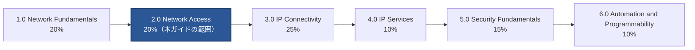

Network Accessドメインは、以下の9つの試験トピック（2.1〜2.9）で構成されています。

| 番号 | トピック | ひとことで言うと |
|---|---|---|
| 2.1 | VLANの設定と検証 | 1台のスイッチをどう論理的に分割するか |
| 2.2 | スイッチ間接続（トランク） | 複数のVLANを1本のリンクでどう運ぶか |
| 2.3 | CDP・LLDP | 隣接機器をどう自動的に発見するか |
| 2.4 | EtherChannel（LACP） | 複数の物理リンクを1本にまとめる方法 |
| 2.5 | Rapid PVST+ | ループをどう防ぐか |
| 2.6 | ワイヤレスアーキテクチャ・APモード | 無線APの動作方式の違い |
| 2.7 | WLANコンポーネントの物理接続 | AP・WLC・LAGがどう配線されるか |
| 2.8 | デバイス管理アクセス | 管理者はどうやって機器にログインするか |
| 2.9 | ワイヤレスLAN GUI設定 | WLCのGUIでどうSSIDを作るか |

> **⚠️ 2026年7月時点の重要な注意事項**
> Ciscoは2026年5月20日に、200-301 CCNAの大規模改訂版「**v2.0**」を発表しました。v2.0は**2027年2月3日**から実施され、それまでは現行の**v1.1が引き続き有効**です。v2.0ではNetwork Accessドメインは「**Switching and Network Access**」に改称され配点が20%→25%に増加し、"troubleshoot（トラブルシュートせよ）"という動詞を使った出題が大幅に増える予定です。本ガイドは**現行v1.1**の内容に基づいて解説しています。受験予定日がv2.0切り替え後になる方は、Cisco Learning Networkで最新のブループリントを必ず確認してください。

---

## 2. 前提知識の確認：スイッチングの基礎

VLANやトランクを理解する前に、スイッチが行っている最も基本的な動作を押さえておきましょう。これは1.0 Network Fundamentalsドメインの範囲ですが、Network Accessを理解する土台になります。

- **MACアドレステーブル**：スイッチは受信したフレームの送信元MACアドレスと、それが届いたポート番号を対応づけて記憶します。
- **フレームの転送（フォワーディング）**：宛先MACアドレスがテーブルにあれば、該当ポートだけにフレームを送ります（ユニキャスト転送）。
- **フラッディング**：宛先MACアドレスがテーブルにない場合、受信したポート以外の全ポートにフレームをコピーして送信します。

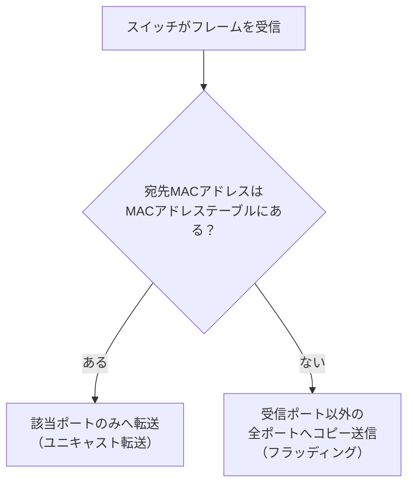

この「1つのスイッチは1つのブロードキャストドメイン」という前提を、VLANによってどう分割するかが次章のテーマです。

---

## 3. 2.1 VLANの設定と検証

### 3.1 VLANとは何か、なぜ必要か

VLAN（Virtual LAN）は、1台の物理スイッチを複数の論理的なブロードキャストドメインに分割する技術です。物理的な配線を変えずに、部署やフロアごとにネットワークを分離できます。

**VLANを使う主な理由**

| 理由 | 説明 |
|---|---|
| セキュリティ | 部署間の通信を論理的に分離できる |
| ブロードキャスト制御 | ブロードキャストの届く範囲を小さくし、無駄なトラフィックを減らす |
| 柔軟性 | 物理的な配置に関係なく、同じ部署のユーザーを同じVLANに所属させられる |
| 管理のしやすさ | 論理グループごとにポリシーやIPサブネットを適用しやすい |

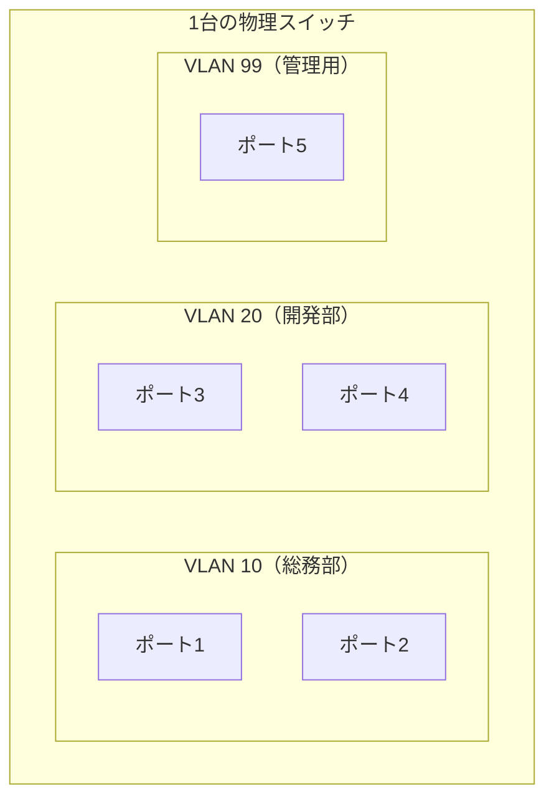

同じVLAN内のポート同士はレイヤー2で自由に通信できますが、VLANをまたぐ通信（InterVLAN Routing）にはレイヤー3のルーティング機能が必要です。これは次のドメイン（3.0 IP Connectivity）で扱う範囲ですが、試験トピック2.1では「異なるVLAN間は直接通信できない」という概念の理解までが範囲になります。

### 3.2 アクセスポート（データVLANとボイスVLAN）

アクセスポートは、単一のVLANにのみ所属するスイッチポートです。PCやプリンタなどのエンドデバイスを接続するのが基本用途です。

CiscoのIP電話を接続する場合は、1つの物理ポートに**データVLAN**と**ボイスVLAN**の2つを割り当てることができます。IP電話にPCを直列接続（デイジーチェーン）する構成が典型例です。

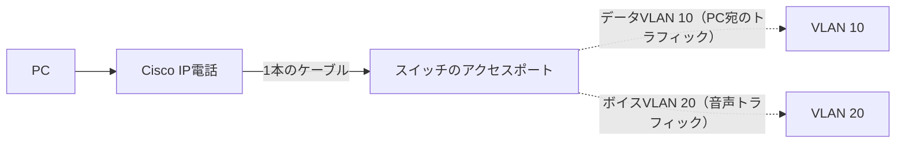

**代表的な設定コマンド**

| コマンド | 目的 |
|---|---|
| `vlan 10` | VLAN 10を作成 |
| `name SOMU` | VLANに名前を付ける |
| `interface gi0/1` | 設定対象のインターフェイスに入る |
| `switchport mode access` | ポートをアクセスモードに固定する |
| `switchport access vlan 10` | データVLANを10番に割り当てる |
| `switchport voice vlan 20` | ボイスVLANを20番に割り当てる |
| `show vlan brief` | VLANとポートの割り当て状況を確認する |
| `show interfaces gi0/1 switchport` | ポートのモードとVLAN設定を検証する |

### 3.3 デフォルトVLAN

Cisco Catalystスイッチは、工場出荷時点で**VLAN 1**が存在し、すべてのポートがデフォルトでVLAN 1に所属しています。

| 特性 | VLAN 1について |
|---|---|
| 削除できるか | できない（作成・削除不可の特殊VLAN） |
| デフォルトの用途 | 全ポートの初期所属VLAN |
| 運用上の推奨 | ユーザーデータ用には使わず、管理VLANやユーザーVLANを別途明示的に作成する |
| CDP/VTP/STPなどの制御プロトコル | デフォルトでVLAN 1上を流れる |

セキュリティのベストプラクティスとして、VLAN 1をそのまま使い続けず、未使用ポートは別のVLAN（いわゆる「ブラックホールVLAN」）に割り当てておくという考え方も、実務およびCCNAの理解として押さえておくとよいでしょう。

### 3.4 検証コマンドのまとめ

| コマンド | 確認できる内容 |
|---|---|
| `show vlan brief` | VLAN ID・名前・所属ポート一覧 |
| `show interfaces status` | 各ポートのVLAN所属とリンク状態 |
| `show mac address-table` | MACアドレスとVLAN・ポートの対応 |

---

## 4. 2.2 スイッチ間接続（トランク）の設定と検証

### 4.1 トランクポートとは

VLANが複数のスイッチにまたがる場合、スイッチ同士を結ぶリンクで**複数のVLANのトラフィックを1本の物理リンクで運ぶ**必要があります。このためのポートモードが**トランクポート**です。

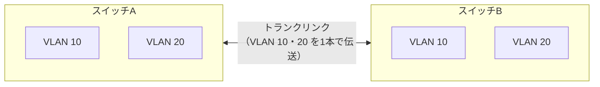

### 4.2 IEEE 802.1Q タギング

トランクリンクを通過するフレームには、802.1Qという規格に基づき**4バイトのVLANタグ**が挿入され、どのVLANに属するフレームかを識別できるようにします。

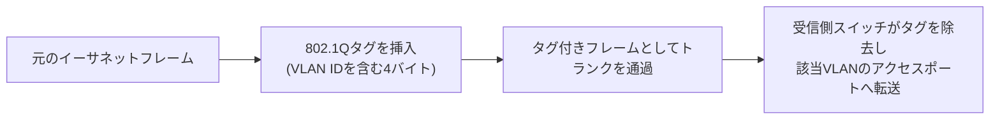

**代表的な設定コマンド**

| コマンド | 目的 |
|---|---|
| `interface gi0/1` | 対象インターフェイスへ移動 |
| `switchport mode trunk` | トランクモードに固定する |
| `switchport trunk encapsulation dot1q` | カプセル化方式を802.1Qに指定（機種による） |
| `switchport trunk allowed vlan 10,20,30` | トランクを通過させるVLANを制限する |
| `switchport trunk native vlan 99` | ネイティブVLANを変更する |
| `show interfaces trunk` | トランクの状態・許可VLAN・ネイティブVLANを確認 |

### 4.3 ネイティブVLAN

802.1Qでは、1つだけ**タグを付けずに送るVLAN**を指定でき、これを**ネイティブVLAN**と呼びます（デフォルトはVLAN 1）。

試験で頻出なのが「**ネイティブVLANミスマッチ**」です。トランクの両端でネイティブVLANの設定が食い違っていると、CDPが警告ログを出し、そのVLANのトラフィックが意図しないVLANに漏れる、あるいはループの原因になることがあります。

| 状態 | 結果 |
|---|---|
| 両端のネイティブVLANが一致 | 正常に動作 |
| 両端のネイティブVLANが不一致 | ログにネイティブVLANミスマッチの警告が出力される／セキュリティ・到達性の問題が発生し得る |

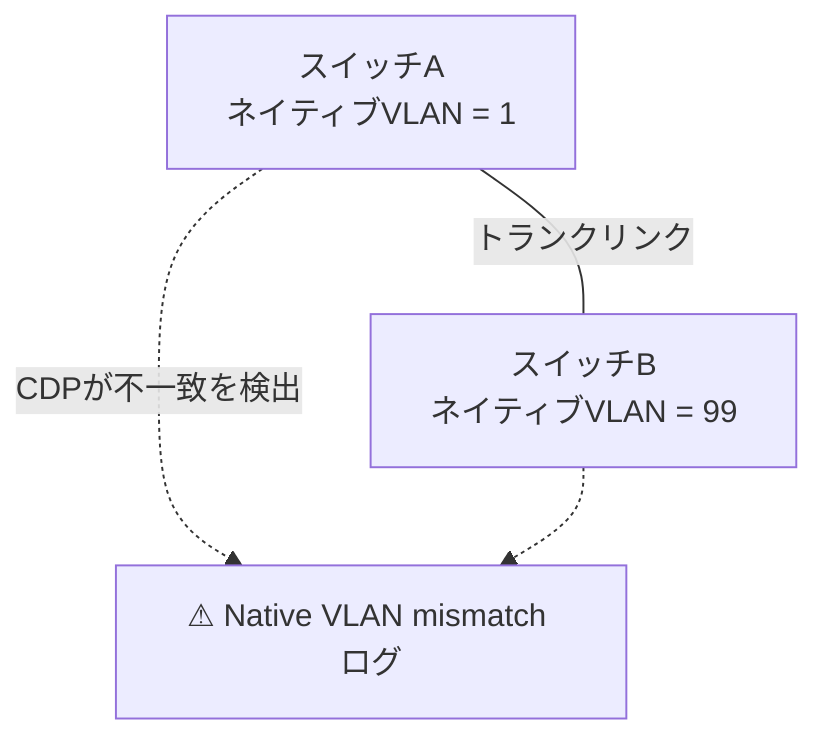

---

## 5. 2.3 レイヤー2ディスカバリプロトコル（CDP・LLDP）

隣接するネットワーク機器を自動的に発見し、ネットワーク構成図（トポロジー）の正確性を検証するための仕組みです。

| 項目 | CDP（Cisco Discovery Protocol） | LLDP（Link Layer Discovery Protocol） |
|---|---|---|
| 標準化 | Cisco独自プロトコル | IEEE 802.1AB（ベンダー中立の業界標準） |
| 対応機器 | 主にCisco機器 | Cisco機器・他ベンダー機器の両方 |
| デフォルト状態 | 多くのCisco機器で有効 | 機種により無効の場合あり（有効化が必要なことがある） |
| 取得できる情報の例 | 機器種別、OSバージョン、隣接ポート、IPアドレスなど | 同様の隣接情報（TLV形式） |

**代表的な設定・確認コマンド**

| コマンド | 目的 |
|---|---|
| `show cdp neighbors` | CDPで検出した隣接機器の一覧を表示 |
| `show cdp neighbors detail` | 隣接機器の詳細情報（IPアドレス・OSなど）を表示 |
| `cdp run` / `no cdp run` | CDPをグローバルで有効化／無効化 |
| `lldp run` | LLDPをグローバルで有効化 |
| `show lldp neighbors` | LLDPで検出した隣接機器の一覧を表示 |

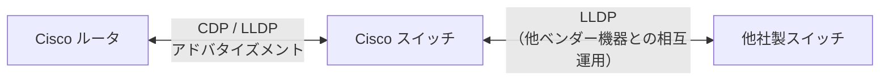

> **試験のポイント**：Cisco機器同士であればCDPを利用できますが、異なるベンダーの機器が混在する環境で相互運用する場合はLLDPが必要になります。「ベンダーが違う環境でネイバー情報を取得したい」という問題文が出たら、LLDPが正解になる可能性が高いです。

---

## 6. 2.4 EtherChannel（LACP）

### 6.1 EtherChannelの目的

複数の物理リンクを論理的に束ねて1本の高帯域なリンクとして扱う技術です。帯域幅の増加に加え、リンク冗長性（1本が切れても通信が継続する）というメリットもあります。

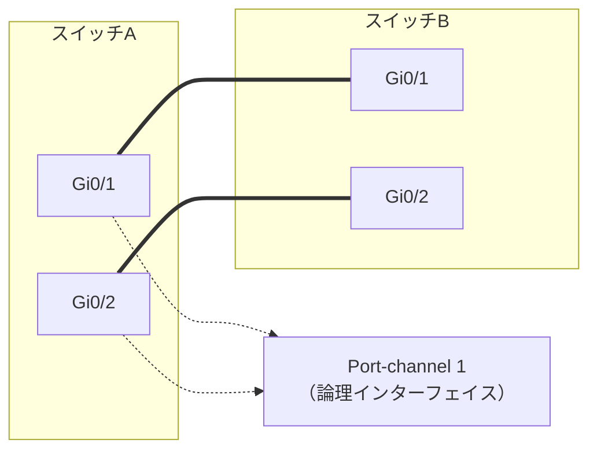

### 6.2 EtherChannelのネゴシエーションプロトコル

EtherChannelを自動的にネゴシエートするプロトコルには2種類あり、CCNAで問われるのは主にLACPです。

| プロトコル | 標準化 | モードの組み合わせ例 |
|---|---|---|
| LACP（Link Aggregation Control Protocol） | IEEE 802.3ad（業界標準） | active + active／active + passive |
| PAgP（Port Aggregation Protocol） | Cisco独自 | desirable + desirable／desirable + auto |

**LACPのモード**

| モード | 動作 |
|---|---|
| `active` | 積極的にLACPネゴシエーションを開始する |
| `passive` | 相手からのネゴシエーション要求を待つ（自分からは開始しない） |

**静的EtherChannel（プロトコル非使用）**

- `on` : ネゴシエーションを行わず強制的にチャネルを形成するモード（プロトコルを使用しない静的設定）。

> **重要**：`passive` 同士の組み合わせではネゴシエーションが成立せず、EtherChannelは形成されません。必ずどちらか一方が `active` である必要があります。

**代表的な設定コマンド**

| コマンド | 目的 |
|---|---|
| `interface range gi0/1-2` | 束ねる複数ポートを一括選択 |
| `channel-group 1 mode active` | LACP activeモードでPort-channel 1に参加 |
| `interface port-channel 1` | 論理インターフェイスの設定に入る |
| `show etherchannel summary` | EtherChannelの状態を一覧確認 |
| `show interfaces port-channel 1` | 論理インターフェイスの詳細を確認 |

---

## 7. 2.5 Rapid PVST+ スパニングツリープロトコル

### 7.1 なぜスパニングツリーが必要か

冗長化のためにスイッチ同士を複数のリンクで接続すると、レイヤー2ではループが発生し、ブロードキャストストームやMACアドレステーブルの不安定化を引き起こします。スパニングツリープロトコル（STP）は、冗長リンクの一部を論理的にブロックすることでループを防ぎます。

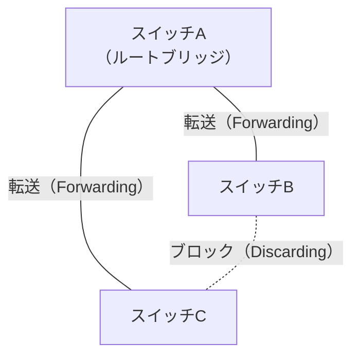

### 7.2 ルートブリッジの選出

STPはまず、トポロジー内から基準となる**ルートブリッジ**を1台選出します。

| 選出基準（優先順） | 内容 |
|---|---|
| 1. ブリッジプライオリティが最小 | デフォルトは32768。値が小さいほど優先される |
| 2. MACアドレスが最小 | プライオリティが同値の場合のタイブレーク |

運用では、意図的にルートブリッジにしたいスイッチのプライオリティを下げて固定することが一般的です。

**代表的な設定コマンド**

| コマンド | 目的 |
|---|---|
| `spanning-tree vlan 10 root primary` | VLAN10でこのスイッチをルートブリッジ（プライマリ）にする |
| `spanning-tree vlan 10 root secondary` | ルートブリッジのバックアップに指定する |
| `spanning-tree vlan 10 priority 4096` | プライオリティを直接指定する |
| `show spanning-tree vlan 10` | ルートブリッジ・各ポートの役割を確認 |

### 7.3 ポートの役割（ロール）

| 役割 | 説明 |
|---|---|
| ルートポート（Root Port） | 非ルートブリッジ上で、ルートブリッジへの最短コストを持つ1ポート |
| 指定ポート（Designated Port） | 各セグメントで転送を担当する1ポート |
| 非指定ポート（Non-Designated / Blocking） | ループ防止のため転送をブロックされるポート |

### 7.4 ポートの状態（Rapid PVST+ = RSTPベース）

従来の802.1D STPでは4つの状態（Blocking→Listening→Learning→Forwarding）でしたが、Rapid PVST+の基盤であるRSTP（802.1w）ではこれが集約され、収束が大幅に高速化されています。

| 従来のSTP（802.1D） | Rapid PVST+ / RSTP（802.1w） |
|---|---|
| Blocking | Discarding |
| Listening | Discarding |
| Learning | Learning |
| Forwarding | Forwarding |
| 収束に数十秒 | 収束は数秒以内 |

### 7.5 PortFastとガード機能

| 機能 | 目的 |
|---|---|
| PortFast | エンドデバイス（PCなど）を接続するアクセスポートで、STPの各段階を待たず即座にForwarding状態にする |
| BPDU Guard | PortFastが有効なポートでBPDUを受信した場合、ポートを即座にerr-disable状態にする（不正なスイッチ接続を防止） |
| BPDU Filter | 該当ポートでBPDUの送受信自体を行わないようにする |
| Root Guard | 指定したポートで、より優れたBPDU（＝ルートブリッジになろうとする機器）を受信した場合にそのポートをブロックし、意図しないルートブリッジの変更を防止する |
| Loop Guard | 本来BPDUを受信し続けるはずのポートでBPDUが届かなくなった場合に、誤って転送状態へ遷移することを防ぐ |

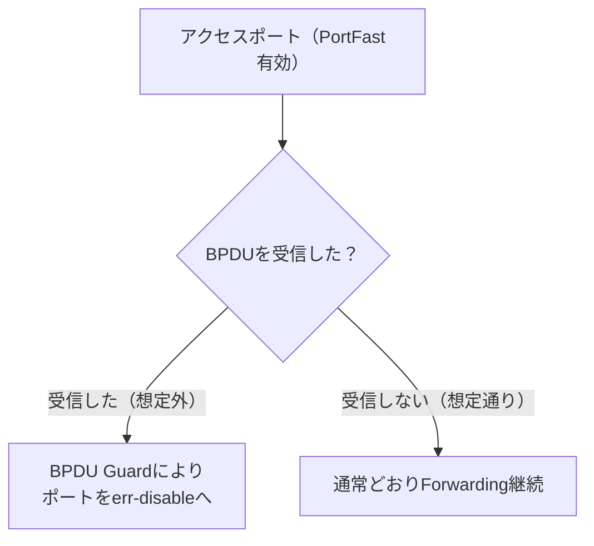

> **試験のポイント**：PortFastは「PCなど末端デバイス用」、BPDU GuardやRoot Guardは「不正な機器やトポロジー変更を防ぐための保護機能」という役割の違いを混同しないようにしましょう。

---

## 8. 2.6 Ciscoワイヤレスアーキテクチャ と APモード

| アーキテクチャ | 概要 | 制御プレーンの場所 |
|---|---|---|
| 自律型（Autonomous）AP | AP単体で無線制御（RF管理・認証など）を完結させる | AP自身 |
| 分離MAC（Split-MAC）／集中型（コントローラベース） | AP（Lightweight AP）はデータ転送に専念し、無線制御はWLC（Wireless LAN Controller）に集約する | WLC（コントローラ） |
| クラウド管理型 | APの管理・可視化をクラウド上のダッシュボードで行う（例：Cisco Meraki） | クラウド上のコントローラ |

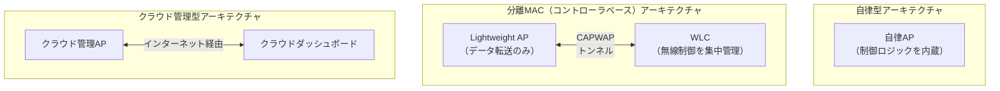

> コントローラベースのアーキテクチャでは、APとWLCの間の通信は**CAPWAP**（Control And Provisioning of Wireless Access Points）というトンネルプロトコルでカプセル化されます。多数のAPを一元管理できることが最大のメリットです。

---

## 9. 2.7 WLANコンポーネントの物理接続

コントローラベースのワイヤレス環境における、実際の配線と論理構成を確認します。

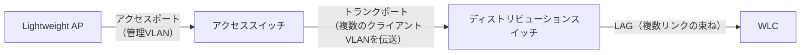

| コンポーネント | 接続タイプ | 補足 |
|---|---|---|
| AP → アクセススイッチ | アクセスポート（多くは管理用VLAN） | PoEで給電されることが多い |
| アクセススイッチ → 上位スイッチ | トランクポート | 複数のクライアントVLANを一括で伝送 |
| 上位スイッチ → WLC | LAG（Link Aggregation） | WLCに集中する多数のAPトラフィックを高帯域・冗長構成で受け止める |

---

## 10. 2.8 ネットワークデバイスの管理アクセス

ネットワーク機器へ管理者としてログインする方法は複数あり、セキュリティ特性が異なります。

| 方式 | 暗号化 | 主な用途 |
|---|---|---|
| コンソール | なし（物理接続のため通常は暗号化不要） | 初期設定・障害時のアウトオブバンド接続 |
| Telnet | 暗号化なし（平文） | 現在は非推奨。試験では「安全でない」選択肢として登場しやすい |
| SSH | 暗号化あり | リモート管理の標準的な方式 |
| HTTP | 暗号化なし | Web GUI管理（非推奨） |
| HTTPS | 暗号化あり | Web GUI管理（推奨） |
| TACACS+ / RADIUS | 標準RADIUSはパケット全体を暗号化せず主にUser-Password属性を保護、TACACS+は完全暗号化ではなくパケット本体の難読化（セキュアなトランスポート推奨） | 集中管理されたAAA（認証・認可・アカウティング）サーバーとの連携 |
| クラウド管理 | クラウドサービス側の暗号化通信に依存 | Meraki等のクラウドダッシュボード経由での管理 |

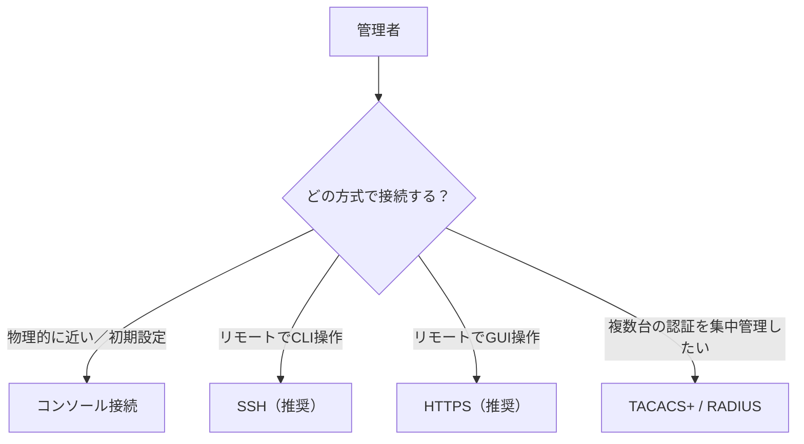

> **試験のポイント**：「安全な管理アクセス方法はどれか」と問われたら、Telnet/HTTPではなくSSH/HTTPSを選ぶのが基本です。

---

## 11. 2.9 ワイヤレスLAN GUI設定の解釈

このトピックは、WLCのGUI画面上で行うWLAN作成の流れを「読み解ける」ことが求められます（CLIでのフルコンフィグではなく、GUI操作の理解が中心です）。

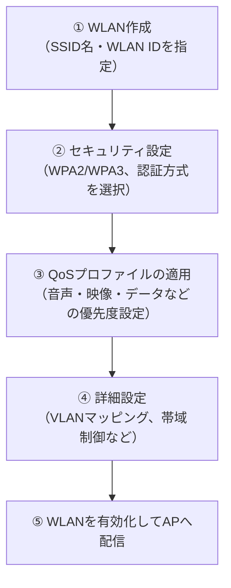

| 設定項目 | GUI上で確認・設定する内容 |
|---|---|
| WLAN作成 | SSID名、WLAN ID、有効/無効の切り替え |
| セキュリティ設定 | WPA2-Personal（PSK）／WPA2-Enterprise／WPA3などの選択、事前共有キーの設定 |
| QoSプロファイル | Platinum（音声）／Gold（映像）／Silver（ベストエフォート）／Bronze（バックグラウンド）といった優先度クラス |
| 詳細設定 | クライアントVLANのマッピング、ブロードキャストSSIDの有無、セッションタイムアウトなど |

---

## 12. 試験対策：頻出の引っかけポイント

| 引っかけやすいポイント | 正しい理解 |
|---|---|
| VLANとIPサブネットを同一視してしまう | VLANはレイヤー2のブロードキャストドメイン、サブネットはレイヤー3の概念。多くの設計では1対1で対応させるが、概念としては別物 |
| ネイティブVLANはタグが付くと誤解する | ネイティブVLANのフレームだけはタグなしで送信される |
| LACP passive同士で組んでしまう | passive同士ではネゴシエーションが成立しないため、必ず片方はactiveにする |
| PortFastとBPDU Guardを混同する | PortFastは「早く転送状態にする」機能、BPDU Guardは「不正なBPDU受信時にポートを止める」保護機能 |
| STPのポート状態を旧バージョンの4状態で覚えてしまう | Rapid PVST+（RSTP）ではDiscarding／Learning／Forwardingの3状態に整理されている |
| CDPを他ベンダー機器でも使えると誤解する | CDPはCisco専用。ベンダー混在環境ではLLDPを使う |
| Telnet・HTTPを安全な管理方式として選んでしまう | 暗号化されないため非推奨。SSH・HTTPSが基本 |

---

## 13. ハンズオン学習の進め方

読むだけでなく、実際に手を動かすことがこのドメインの理解を大きく左右します。Cisco Packet Tracerなどのシミュレータで、以下のような構成を組んで検証すると効果的です。

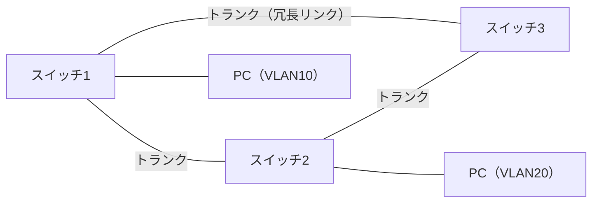

**おすすめの演習ステップ**

1. 3台のスイッチで上図のようなループのあるトポロジーを作り、2つ以上のVLANを作成する
2. 各スイッチ間のリンクをトランクとして設定し、`show interfaces trunk` で許可VLANとネイティブVLANを確認する
3. `show spanning-tree vlan 10` を実行し、どのスイッチがルートブリッジになっているか、どのポートがブロックされているかを確認する
4. `spanning-tree vlan 10 priority 4096` で意図的にルートブリッジを変更し、収束後のポート役割の変化を観察する
5. 2本のリンクでEtherChannelを構成し、`channel-group 1 mode active` で束ね、`show etherchannel summary` で状態を確認する
6. 1本のリンクをあえて切断し、EtherChannelとSTPそれぞれの挙動（フェイルオーバーの速さ）を比較する

---

## 14. セクション全体のまとめ表

| 試験トピック | キーワード | 主要コマンド例 |
|---|---|---|
| 2.1 VLAN | アクセスポート、データ/ボイスVLAN、デフォルトVLAN | `switchport access vlan`, `show vlan brief` |
| 2.2 トランク | 802.1Q、ネイティブVLAN | `switchport mode trunk`, `show interfaces trunk` |
| 2.3 CDP/LLDP | 隣接機器の自動検出 | `show cdp neighbors`, `show lldp neighbors` |
| 2.4 EtherChannel | LACP active/passive | `channel-group mode active`, `show etherchannel summary` |
| 2.5 Rapid PVST+ | ルートブリッジ、ポート役割・状態、PortFast、各種ガード | `spanning-tree vlan root primary`, `show spanning-tree` |
| 2.6 無線アーキテクチャ | 自律型／分離MAC／クラウド管理型 | （GUI・概念理解が中心） |
| 2.7 WLAN物理接続 | AP・WLC・LAGの配線 | （物理構成の理解が中心） |
| 2.8 管理アクセス | Telnet/SSH/HTTP/HTTPS/TACACS+/RADIUS | （安全性の比較理解が中心） |
| 2.9 WLAN GUI設定 | SSID作成、セキュリティ、QoSプロファイル | （WLC GUI操作の理解が中心） |

---

## 15. 参考資料・出典

本ガイドの試験範囲・配点・トピック構成は、以下のCisco公式情報および関連情報に基づいています。

- Cisco公式 CCNA認定ページ（日本語）：
  https://www.cisco.com/c/ja_jp/training-events/training-certifications/certifications/associate/ccna.html
- Cisco公式 200-301 CCNA試験トピックス v1.1（英語PDF、現行ブループリント）：
  https://learningcontent.cisco.com/documents/marketing/exam-topics/200-301-CCNA-v1.1.pdf
- Cisco公式 200-301 CCNA試験トピックス（日本語PDF）：
  https://www.cisco.com/c/dam/global/ja_jp/training-events/training-certifications/exam-topics/200-301-CCNA.pdf
- Cisco公式 200-301 CCNA v2.0試験トピックス（2027年2月3日開始予定の次期ブループリント）：
  https://learningcontent.cisco.com/documents/marketing/exam-topics/200-301_CCNA_v2.0_Exam_Topics_PDF.pdf
- CCNA v1.1からv2.0への移行スケジュールに関する解説記事：
  https://trainingcamp.com/articles/ccna-is-changing-in-2027-take-the-current-exam-or-wait-for-v2-0/

> 試験トピックスはCiscoの都合により予告なく変更される場合があります。受験前には必ずCisco Learning Network（https://learningnetwork.cisco.com/s/ccna-exam-topics ）で最新のブループリントをご確認ください。
