# CCNA試験対策：セキュリティの基礎（Security Fundamentals）徹底解説

> 対象：Cisco CCNA 200-301 試験（v1.1ブループリント）
> ドメイン：**5.0 Security Fundamentals（セキュリティの基礎）**　※出題比率 **15%**
> 対象読者：ネットワーク初学者、CCNA受験を目指す方

---

## 0. この記事の位置づけ

CCNA 200-301（v1.1）試験は、以下の6つのドメインで構成されています。

| ドメイン番号 | ドメイン名 | 出題比率 |
|---|---|---|
| 1.0 | Network Fundamentals（ネットワークの基礎） | 20% |
| 2.0 | Network Access（ネットワークアクセス） | 20% |
| 3.0 | IP Connectivity（IP接続） | 25%（最大） |
| 4.0 | IP Services（IPサービス） | 10% |
| **5.0** | **Security Fundamentals（セキュリティの基礎）** | **15%** |
| 6.0 | Automation and Programmability（自動化とプログラマビリティ） | 10% |

本記事は、この中の **ドメイン5.0「セキュリティの基礎」** を初学者向けに解説します。Cisco公式のv1.1試験ブループリントでは、このドメインは以下の10個のサブトピック（5.1〜5.10）で構成されています。

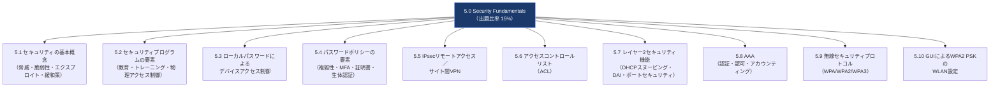

それでは、1つずつステップバイステップで見ていきましょう。

---

## 5.1 セキュリティの基本概念（脅威・脆弱性・エクスプロイト・緩和策）

### 概要

セキュリティを学ぶ最初の一歩は、**4つの基本用語の違い**を正確に理解することです。この4つは混同されがちですが、CCNA試験でも「用語の定義」を問う問題が頻出します。

| 用語（英語） | 用語（日本語） | 意味 | 具体例 |
|---|---|---|---|
| Vulnerability | 脆弱性 | システムやプロセスに存在する「弱点・欠陥」 | パッチ未適用のOS、初期パスワードのまま運用しているルーター |
| Threat | 脅威 | 脆弱性を突いて損害を与える可能性のある存在・事象 | 攻撃者、マルウェア、内部不正、自然災害 |
| Exploit | エクスプロイト | 脆弱性を実際に悪用するための具体的な手段・コード | バッファオーバーフロー攻撃コード、フィッシングメール |
| Mitigation | 緩和策 | 脅威やエクスプロイトの影響を減らすための対策 | パッチ適用、ファイアウォール、多要素認証、教育 |

### 4つの関係性を図で理解する

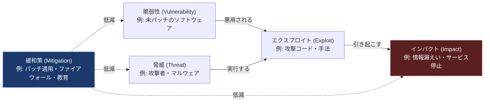

### 覚え方のポイント

- **脆弱性は「弱点」そのもの**（受け身の存在）。攻撃者がいなくても脆弱性は存在し得る。
- **脅威は「弱点を突こうとする主体・事象」**。人（攻撃者）だけでなく、自然災害やハードウェア故障も脅威になり得る。
- **エクスプロイトは「実際に悪用する手段」**。脆弱性があっても、エクスプロイトが存在しなければ実害には直結しない。
- **緩和策は「対策」**。脆弱性を塞ぐ（パッチ）、脅威を検知する（IDS/IPS）、教育で人的リスクを下げる、など多層的に行う。

代表的な脅威の分類には、マルウェア（ウイルス・ワーム・ランサムウェア）、ソーシャルエンジニアリング（フィッシング）、DoS/DDoS攻撃、スプーフィング（なりすまし）などがあります。CCNA試験では、これらの**名称と特徴の組み合わせ**を問う設問が出やすいため、代表例を一通り押さえておきましょう。

---

## 5.2 セキュリティプログラムの要素（ユーザー教育・トレーニング・物理アクセス制御）

### 概要

技術的対策（ファイアウォールやACLなど）だけでは組織のセキュリティは守れません。CCNAブループリントでは、**組織的なセキュリティプログラムの3要素**が明示されています。

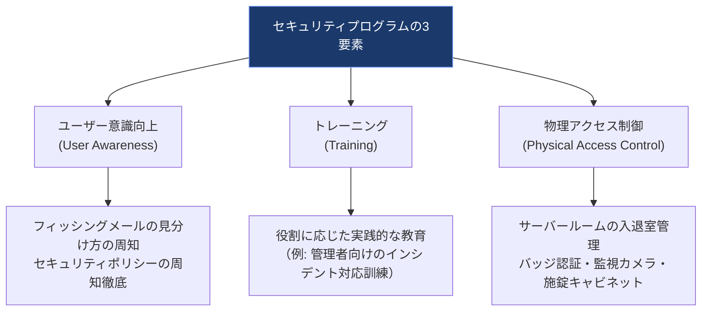

### それぞれの役割

| 要素 | 目的 | 具体的な施策例 |
|---|---|---|
| ユーザー意識向上（Awareness） | 全従業員に「セキュリティは自分ごと」という認識を持たせる | 社内ポスター、定期メール、フィッシング訓練メール |
| トレーニング（Training） | 役割ごとに必要な実務スキルを身につけさせる | 新人研修、管理者向けの技術研修、模擬インシデント対応演習 |
| 物理アクセス制御（Physical Access Control） | 建物・部屋・機器への物理的な不正アクセスを防ぐ | ICカード錠、生体認証ゲート、監視カメラ、来訪者管理簿 |

**ポイント**：情報セキュリティの多くのインシデントは、技術的な脆弱性よりも「人」に起因する部分が大きいと言われています。そのため、CCNAでは技術知識だけでなく、こうした組織運営面の基礎も出題範囲に含まれています。

---

## 5.3 ローカルパスワードによるデバイスアクセス制御

### 概要

Ciscoルーター・スイッチへの不正アクセスを防ぐ、最も基本的な方法が**ローカルパスワードの設定**です。主なアクセス経路は次の3つです。

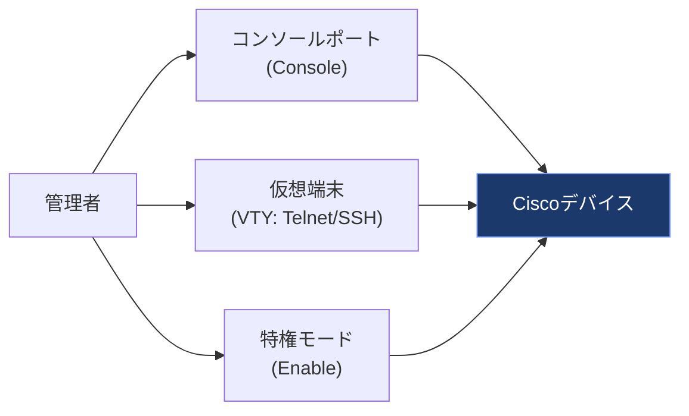

### 設定コマンド例

```
! コンソールポートへのパスワード設定
Router(config)# line console 0
Router(config-line)# password Cisco123!
Router(config-line)# login

! VTY（Telnet/SSHでのリモートアクセス）へのパスワード設定
Router(config)# line vty 0 4
Router(config-line)# password Cisco123!
Router(config-line)# login

! 特権EXECモードへのパスワード設定（enable secretは暗号化される）
Router(config)# enable secret MyStrongSecret!

! 平文で保存されるパスワードを暗号化して表示させる
Router(config)# service password-encryption
```

### 覚えておきたいポイント

- `enable password` は非推奨（平文に近い弱い暗号化）。**必ず `enable secret` を使う**のがベストプラクティス。
- `login` コマンドを入れ忘れると、パスワードを設定してもログイン時に要求されないため注意。
- ローカルアカウントを使う場合は `username <name> secret <password>` と `login local` の組み合わせを使う（後述のAAAの基礎にもつながる）。

```
Router(config)# username admin secret StrongPass123!
Router(config)# line vty 0 4
Router(config-line)# login local
Router(config-line)# transport input ssh
```

---

## 5.4 パスワードポリシーの要素（管理・複雑性・パスワード代替手段）

### 概要

強固なパスワード運用のためには、単に「複雑なパスワードを設定する」だけでなく、**組織的なポリシー**として管理する必要があります。

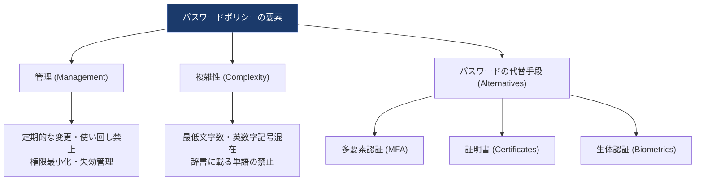

### 各要素の詳細

| 要素 | 内容 |
|---|---|
| 管理（Management） | パスワードの発行・変更・失効のライフサイクル管理。使い回し防止、定期変更ポリシーなど |
| 複雑性（Complexity） | 文字数・文字種（大小英字・数字・記号）の組み合わせ要件。辞書攻撃・総当たり攻撃への耐性を高める |
| 多要素認証（MFA） | 「知識情報（パスワード）」＋「所持情報（スマホ・トークン）」など複数要素を組み合わせる認証 |
| 証明書（Certificates） | デジタル証明書（公開鍵基盤 / PKI）を用いた認証。パスワードそのものへの依存を減らす |
| 生体認証（Biometrics） | 指紋・顔認証・虹彩認証など、身体的特徴による認証 |

**なぜパスワードだけに頼らないのか**：パスワードは「知識情報」であるため、フィッシングや使い回しにより漏洩しやすいという弱点があります。MFAや証明書、生体認証を組み合わせることで、**パスワードが漏れても不正ログインを防ぎやすくなる**（多層防御 / Defense in Depth の考え方）のがポイントです。

---

## 5.5 IPsecリモートアクセス／サイト間VPN

### 概要

VPN（Virtual Private Network）は、インターネットのような信頼できないネットワーク上に、暗号化された仮想的な専用線を作る技術です。CCNAでは**IPsecを使った2つのVPN構成パターン**の違いを理解することが求められます。

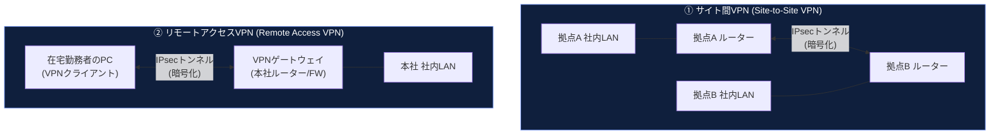

### 2つのVPN方式の違い

| 項目 | サイト間VPN (Site-to-Site) | リモートアクセスVPN (Remote Access) |
|---|---|---|
| 主な用途 | 拠点間（本社⇔支社など）を常時接続 | 個人端末から社内ネットワークへ一時的に接続 |
| 接続元 | ルーターやファイアウォール同士 | PC・スマートフォンなどのクライアント端末 |
| 典型的な利用者 | ネットワーク管理者が拠点全体を接続 | 在宅勤務者・出張者など個人ユーザー |
| 常時接続か | 常時接続が一般的 | 必要な時だけ接続（オンデマンド） |

### IPsecの基本要素（概要レベル）

IPsecは単一のプロトコルではなく、複数の要素を組み合わせた「フレームワーク」です。CCNAレベルでは、以下の役割を大まかに理解しておけば十分です。

| 要素 | 役割 |
|---|---|
| IKE (Internet Key Exchange) | 通信相手との間で暗号鍵を安全に交換・管理する |
| ESP (Encapsulating Security Payload) | データそのものを暗号化し、機密性を確保する |
| AH (Authentication Header) | データの改ざん検知（完全性・送信元認証）を行う（暗号化はしない） |

**CCNAレベルでは、細かいコマンド設定よりも「サイト間VPNとリモートアクセスVPNの違い」「VPNが提供する機密性・完全性・認証という3つの価値」を理解しておくことが重要**です。

---

## 5.6 アクセスコントロールリスト（ACL）

### 概要

ACL（Access Control List）は、ルーターやスイッチを通過するパケットを、送信元/宛先IPアドレスやポート番号などの条件で**許可（permit）／拒否（deny）**するためのルールの集合です。CCNA試験では、**設定と検証（コンフィグレーション問題）が頻出する重要トピック**です。

### ACLの種類

| 種類 | 番号範囲（Numbered） | 判定基準 | 特徴 |
|---|---|---|---|
| 標準ACL（Standard） | 1〜99, 1300〜1999 | 送信元IPアドレスのみ | シンプルだが細かい制御はできない |
| 拡張ACL（Extended） | 100〜199, 2000〜2699 | 送信元/宛先IP、プロトコル、ポート番号など | 柔軟な制御が可能。実務でも主流 |
| 名前付きACL（Named） | 番号ではなく名前を使用 | 標準・拡張どちらも作成可能 | 可読性が高く、行の追加・削除が容易 |

### パケットがACLで処理される流れ

ACLの動作を理解する上で最も重要なポイントは、「**上から順に照合し、最初にマッチしたルールで即座に確定する**」という点と、「**リストの最後には暗黙のdeny allが存在する**」という点です。

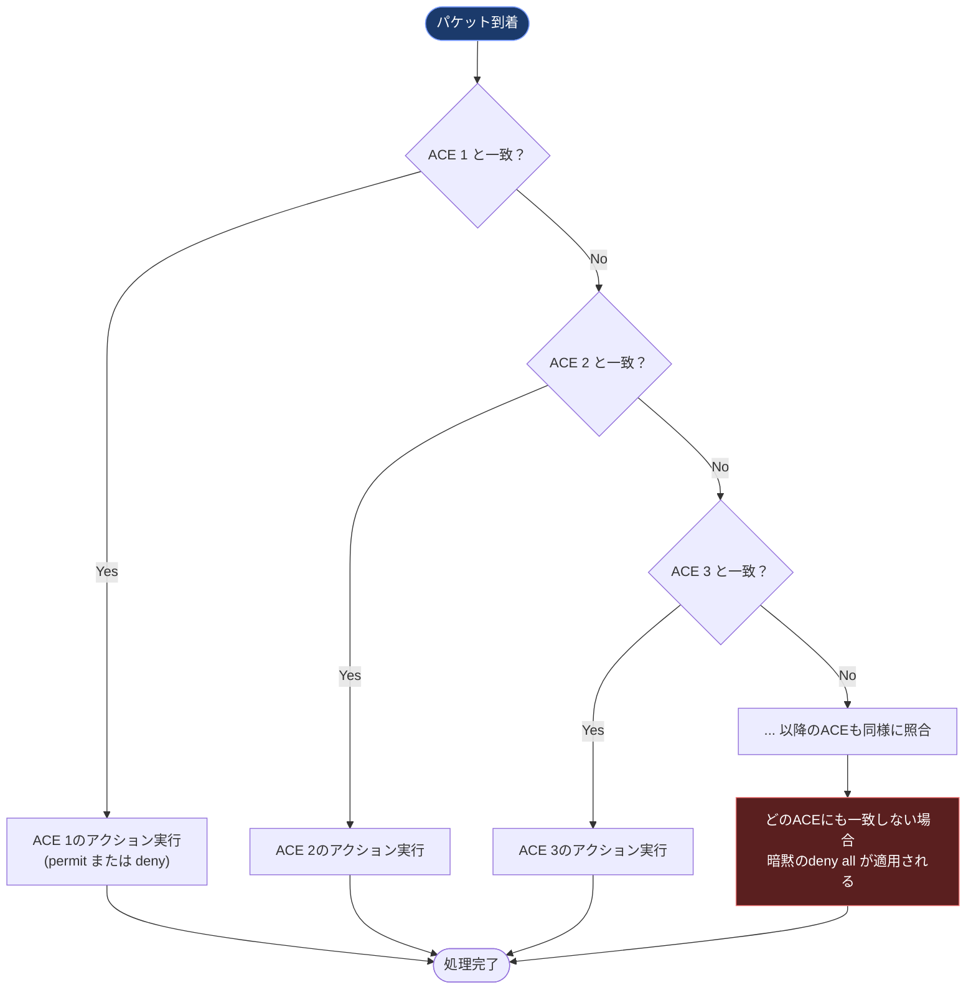

### 設定コマンド例

```
! 標準ACL：192.168.10.0/24からのアクセスのみ許可
Router(config)# access-list 10 permit 192.168.10.0 0.0.0.255
Router(config)# access-list 10 deny any

! 拡張ACL：192.168.10.0/24からWebサーバー(HTTPS)へのアクセスのみ許可
Router(config)# access-list 110 permit tcp 192.168.10.0 0.0.0.255 host 203.0.113.10 eq 443
Router(config)# access-list 110 deny ip any any

! 名前付き拡張ACLの例
Router(config)# ip access-list extended BLOCK-TELNET
Router(config-ext-nacl)# deny tcp any any eq 23
Router(config-ext-nacl)# permit ip any any

! インターフェースへの適用（inbound方向）
Router(config)# interface GigabitEthernet0/1
Router(config-if)# ip access-group 110 in
```

### 設定・検証時のよくあるミス（試験で狙われやすいポイント）

- **ワイルドカードマスクとサブネットマスクを混同する**（ワイルドカードは「0=一致必須, 1=無視」で通常のマスクと考え方が逆）。
- ACLの**適用方向（in/out）を間違える**。
- ルールの**順序を誤り**、意図しないパケットが早い段階でマッチしてしまう。
- 最後の**暗黙のdeny allを忘れ**、想定より多くの通信がブロックされてしまう。
- `show ip access-lists` や `show access-lists` で、**マッチ件数（matches）を確認して意図通り動作しているか検証する**習慣をつける。

---

## 5.7 レイヤー2セキュリティ機能（DHCPスヌーピング・動的ARPインスペクション・ポートセキュリティ）

### 概要

レイヤー3（ACLなど）だけでなく、**レイヤー2（スイッチ）レベルでの防御**もCCNAの重要トピックです。この3つの機能は、それぞれ役割が異なりますが、互いに連携して動作する「セット」として理解すると学習効率が上がります。

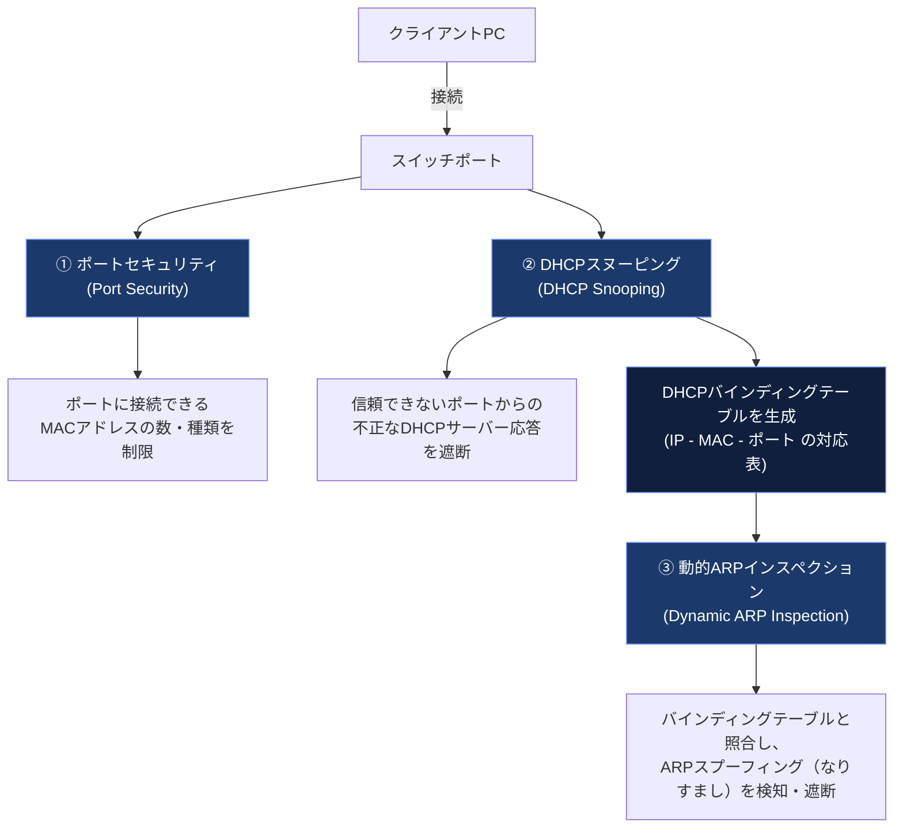

**学習のコツ**：この3つは「① ポートセキュリティで“誰が繋げるか”を制限 → ② DHCPスヌーピングで“正しいDHCPサーバーの情報だけ”を信頼 → ③ その情報（バインディングテーブル）を使ってDAIが“ARPの嘘”を見抜く」という順番でストーリーとして覚えると整理しやすくなります。

### 各機能の比較表

| 機能 | 目的 | 監視対象 | 主なコマンド例 |
|---|---|---|---|
| ポートセキュリティ | ポートに接続できるMACアドレス数・種類を制限 | スイッチポートのMACアドレス | `switchport port-security` |
| DHCPスヌーピング | 不正なDHCPサーバーからの応答を遮断 | DHCPメッセージ（Offer/Ackなど） | `ip dhcp snooping` |
| 動的ARPインスペクション（DAI） | ARPスプーフィング（なりすまし）を防止 | ARPリクエスト/リプライ | `ip arp inspection` |

### 設定コマンド例

```
! --- ① ポートセキュリティ ---
Switch(config)# interface FastEthernet0/1
Switch(config-if)# switchport mode access
Switch(config-if)# switchport port-security
Switch(config-if)# switchport port-security maximum 2
Switch(config-if)# switchport port-security violation restrict
Switch(config-if)# switchport port-security mac-address sticky

! --- ② DHCPスヌーピング ---
Switch(config)# ip dhcp snooping
Switch(config)# ip dhcp snooping vlan 10
Switch(config)# interface GigabitEthernet0/1
Switch(config-if)# ip dhcp snooping trust
! ↑ 正規のDHCPサーバーに接続するアップリンクポートのみ「信頼」に設定する

! --- ③ 動的ARPインスペクション (DAI) ---
Switch(config)# ip arp inspection vlan 10
Switch(config)# interface GigabitEthernet0/1
Switch(config-if)# ip arp inspection trust
! ↑ DHCPスヌーピングと同じアップリンクポートを信頼設定にする
```

### ポートセキュリティの違反モード（Violation Mode）

| モード | 動作 |
|---|---|
| protect | 超過したフレームを破棄。ログや通知は出さない |
| restrict | 超過したフレームを破棄し、ログ・SNMPトラップを送信 |
| shutdown（デフォルト） | ポート自体をerr-disable状態にしてシャットダウンする |

---

## 5.8 AAA（認証・認可・アカウンティング）の概念比較

### 概要

AAAとは、ネットワーク機器へのアクセス管理を体系化する考え方で、**Authentication（認証）・Authorization（認可）・Accounting（アカウンティング）** の頭文字です。

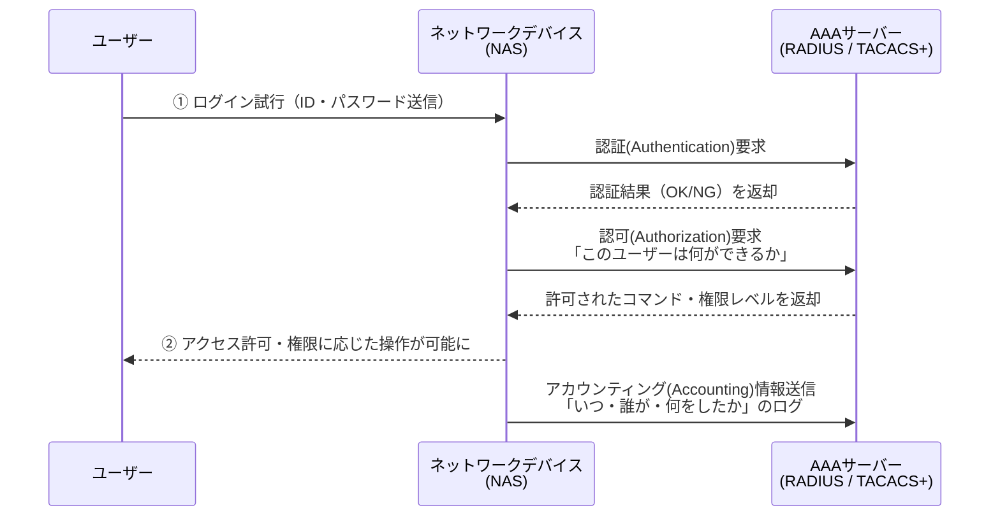

### 3つの要素の役割

| 要素 | 意味 | 具体例 |
|---|---|---|
| Authentication（認証） | 「あなたは誰か」を確認する | ユーザー名とパスワードでログイン、証明書認証 |
| Authorization（認可） | 「あなたに何が許可されているか」を決定する | 一般ユーザーはshowコマンドのみ、管理者はconfigも可能 |
| Accounting（アカウンティング） | 「いつ・誰が・何をしたか」を記録する | ログイン日時、実行したコマンドの履歴を記録 |

### RADIUSとTACACS+の比較

CCNAでは、AAAを実現する代表的なプロトコルとして **RADIUS** と **TACACS+** の違いも問われます。

| 項目 | RADIUS | TACACS+ |
|---|---|---|
| 開発元 | 業界標準（オープン） | Cisco独自プロトコル |
| トランスポート層 | UDP | TCP |
| 暗号化範囲 | パスワード部分のみ暗号化 | パケット全体を暗号化 |
| 認証と認可 | 認証と認可を一体で処理 | 認証・認可・アカウンティングを分離して処理可能 |
| 主な用途 | ネットワークアクセス認証（Wi-Fi、VPNなど）で広く利用 | Cisco機器の管理アクセス（デバイスログイン）で多用 |

### 設定コマンド例（概念理解用）

```
Router(config)# aaa new-model
Router(config)# radius server MyRadius
Router(config-radius-server)# address ipv4 192.168.1.100
Router(config-radius-server)# key MySharedSecret

Router(config)# aaa authentication login default group radius local
! ↑ まずRADIUSサーバーで認証し、応答がなければローカルアカウントにフォールバック
```

---

## 5.9 無線セキュリティプロトコル（WPA・WPA2・WPA3）

### 概要

無線LAN（Wi-Fi）は電波を使うため、有線LANよりも盗聴・不正接続のリスクが高くなります。そのため、暗号化・認証の規格が段階的に強化されてきました。

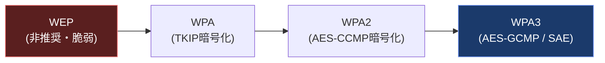

### WPA / WPA2 / WPA3 の比較

| 項目 | WPA | WPA2 | WPA3 |
|---|---|---|---|
| 暗号化方式 | TKIP（RC4ベース、脆弱性あり） | AES-CCMP | AES-GCMP（強度が高い） |
| 個人向け認証 | PSK（事前共有鍵） | PSK | SAE（Simultaneous Authentication of Equals、より安全な鍵交換） |
| オフライン辞書攻撃への耐性 | 低い | 中程度 | 高い（SAEにより大幅強化） |
| 企業向け認証 | 802.1X/EAP対応 | 802.1X/EAP対応 | 802.1X/EAP対応（暗号強度が向上） |
| 現状の位置づけ | 事実上非推奨 | 長らく業界標準として普及 | 最新の推奨規格 |

### 覚えておきたいポイント

- **WPA2のPSKモードは「事前共有鍵（パスフレーズ）」を全端末で共有する方式**で、家庭やSOHO環境で一般的。
- **WPA3のSAEは、通信を盗聴されても事前共有鍵を推測しにくい**よう設計されており、WPA2 PSKの弱点（オフライン辞書攻撃）を大きく改善している。
- 企業環境では、個人ごとに異なる認証情報を使う **802.1X（AAAと連携したエンタープライズモード）** がより安全とされる。

---

## 5.10 GUIによるWLAN（WPA2 PSK）設定の考え方

### 概要

CCNAブループリントの5.10では、CLIコマンドではなく、**WLC（Wireless LAN Controller）のGUI上でWLANを作成し、WPA2 PSKを設定する一連の流れを理解すること**が求められます。実際の試験ではGUIのスクリーンショットを使った出題（シミュレーション形式）がある点が特徴です。

### GUI設定の一般的な流れ

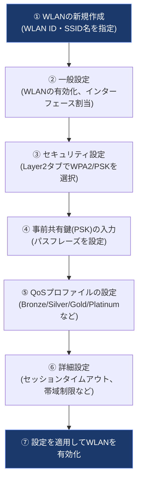

### 各ステップのポイント

| ステップ | 画面（タブ） | 設定内容 |
|---|---|---|
| ① WLAN作成 | WLANs > Create New | WLAN ID、Profile Name、SSID名を設定 |
| ② 一般設定 | General | WLANの有効/無効、割り当てるインターフェース（VLAN）を選択 |
| ③ セキュリティ設定 | Security > Layer2 | Layer 2 Securityで「WPA2」を選択し、認証方式で「PSK」を選択 |
| ④ 事前共有鍵入力 | Security > Layer2 | PSK Formatを選択し、実際のパスフレーズ（8〜63文字）を入力 |
| ⑤ QoS設定 | QoS | トラフィックの優先度（音声・動画を優先するプロファイルなど）を設定 |
| ⑥ 詳細設定 | Advanced | セッションタイムアウトやP2Pブロッキングなどのオプション設定 |

**試験対策のヒント**：CLIの丸暗記よりも、「**どのタブでどんな設定をするのか、大まかな位置関係と流れ**」を理解しておくことが得点につながります。特に「セキュリティ設定はLayer2タブで行う」という点は狙われやすいポイントです。

---

## まとめ：ドメイン5.0の学習優先順位

| 優先度 | サブトピック | 理由 |
|---|---|---|
| ★★★ | 5.6 ACL、5.7 レイヤー2セキュリティ | 設定・検証（シミュレーション）問題が出やすく配点も大きい |
| ★★★ | 5.8 AAA | 概念問題・RADIUS/TACACS+比較が頻出 |
| ★★☆ | 5.9 無線セキュリティ、5.5 IPsec VPN | 概念理解中心。用語の比較が問われやすい |
| ★★☆ | 5.1〜5.4 基本概念・パスワードポリシー | 用語定義の暗記が中心。得点しやすい基礎パート |
| ★☆☆ | 5.10 GUIでのWLAN設定 | 出題頻度は比較的低いが、流れを押さえておけば失点を防げる |

セキュリティの基礎（5.0）は出題比率こそ15%ですが、**ACLやAAA、レイヤー2セキュリティは他ドメイン（IP Connectivity、Network Access）とも関連が深く**、実務でもよく使う内容です。単なる暗記ではなく、「なぜその機能が必要なのか」というストーリーで理解することをおすすめします。

---

## 参考ソース

本記事の内容は、以下のCisco公式情報を根拠として作成しています。

- Cisco CCNA認定資格 公式ページ（日本語）：
  https://www.cisco.com/c/ja_jp/training-events/training-certifications/certifications/associate/ccna.html
- CCNA 200-301 Exam Topics v1.1（公式試験ブループリントPDF、英語）：
  https://learningcontent.cisco.com/documents/marketing/exam-topics/200-301-CCNA-v1.1.pdf
- Cisco Learning Network（200-301 CCNA Exam Topics 一覧ページ）：
  https://learningnetwork.cisco.com/s/article/200-301-ccna-exam-topics

※ブループリントは予告なく更新される場合があるため、受験前に必ず上記Cisco公式ページで最新情報をご確認ください。v1.1は2024年8月20日に発効し、2027年2月2日まで有効とされています（v2.0への切り替えは2027年2月3日予定）。
