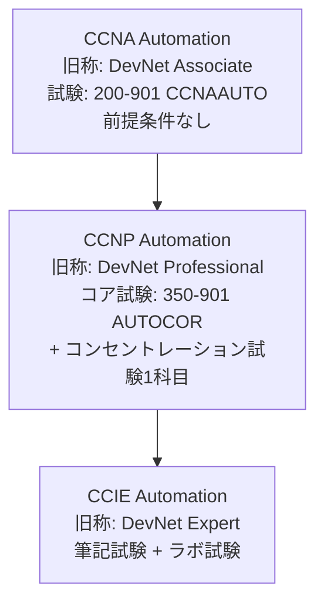
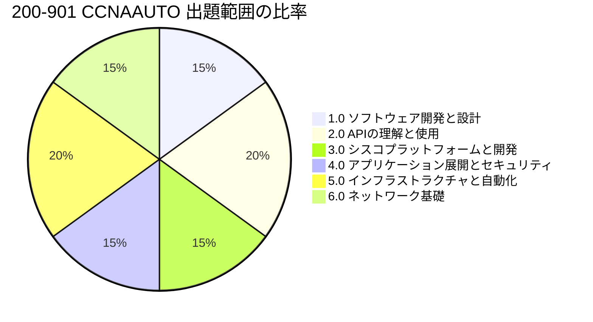
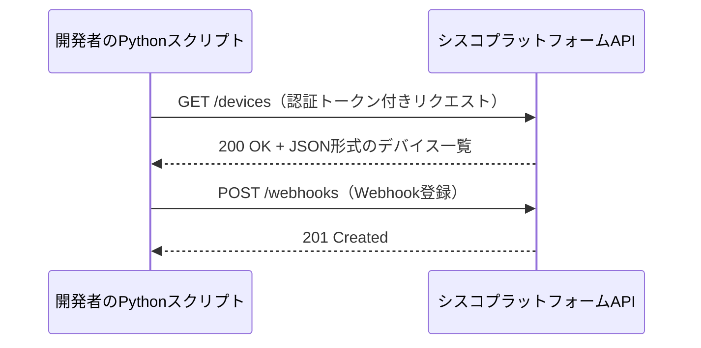
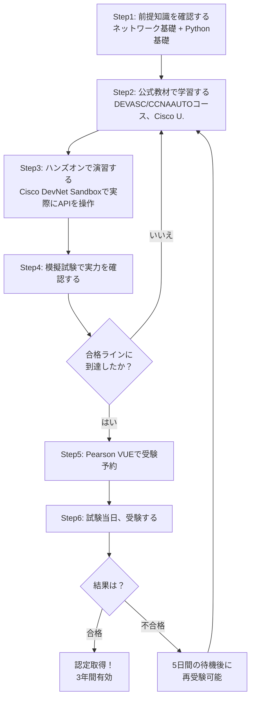

# Cisco Certified DevNet Associate 試験 完全ガイド（初学者向け）

> 本ガイドは、シスコ公式サイトおよびシスコ公式ブログの情報をもとに、初学者向けにステップバイステップで解説したものです。ASCII図解は使用せず、フローチャート等はすべてMermaid、一覧はすべてMarkdown表で表現しています。各記述の根拠となる一次情報源URLは、本文中および末尾の「参考文献・ソース一覧」に記載しています。

## 目次

1. [【重要】名称変更に関するお知らせ（2026年2月〜）](#section1)
2. [DevNet Associate認定とは何か](#section2)
3. [Cisco資格体系における位置づけ](#section3)
4. [試験の基本情報](#section4)
5. [出題範囲と配分](#section5)
6. [各ドメインを初心者向けに解説](#section6)
7. [受験の前提条件・推奨スキル](#section7)
8. [出題形式](#section8)
9. [学習ロードマップ（ステップバイステップ）](#section9)
10. [再認定（recertification）](#section10)
11. [まとめ](#section11)
12. [参考文献・ソース一覧](#section12)

---

## 1. 【重要】名称変更に関するお知らせ（2026年2月〜）

このガイドを書いている2026年7月時点で、**「Cisco Certified DevNet Associate」という名称そのものはすでに移行済み**です。ご質問にあったシスコ公式ページ（日本語版）は現在も「DevNet Associate」の名称で表示されていますが、シスコ公式ブログによると、2026年2月3日をもって認定名称が刷新されています。

- 2025年5月にシスコが発表し、2026年2月3日付けで、DevNet認定トラック全体が「Automation」トラックへ改称されました。
- **試験内容・出題範囲はAssociateレベルではほぼ変更なし**（「Same test, new names（試験は同じ、名前が新しくなっただけ）」と公式ブログが明言）。
- 名称変更のタイミングでアクティブな認定を保持していた人は、自動的に新名称の認定として扱われ、再受験は不要です。

| 項目 | 旧名称（〜2026年2月2日） | 新名称（2026年2月3日〜） |
|---|---|---|
| Associateレベル認定 | Cisco Certified DevNet Associate | **CCNA Automation** |
| Associateレベル試験コード | 200-901 DEVASC | **200-901 CCNAAUTO** |
| Professionalレベル認定 | Cisco Certified DevNet Professional | **CCNP Automation** |
| Professionalコア試験 | 350-901 DEVCOR | **350-901 AUTOCOR**（出題範囲が大幅刷新） |
| Expertレベル認定 | Cisco Certified DevNet Expert | **CCIE Automation** |

また、以下の4つのスペシャリスト認定は2026年2月2日付けで**移行措置なしに廃止**されています：SAUTO、SPAUTO、CLAUTO、DEVOPS。

以降の本文では、現在の正式名称である「**CCNA Automation（旧DevNet Associate）**」として解説します。試験コードは 200-901 です。

---

## 2. DevNet Associate認定とは何か

CCNA Automation（旧DevNet Associate）は、シスコプラットフォーム上で動くアプリケーションの開発・運用スキルを証明する、**エントリー〜アソシエイトレベル**の認定です。

対象としているのは次のような人たちです。

- ソフトウェア開発者（ネットワークの知識を身につけたい人）
- ネットワークエンジニア（プログラミングや自動化のスキルを身につけたい人）
- DevOpsエンジニア、自動化スペシャリスト
- その他のソフトウェア専門職

ポイントは「**トレーニングは１つ、試験も１つ**」というシンプルな構成で、1つの試験に合格するだけで取得できることです。

---

## 3. Cisco資格体系における位置づけ

CCNA Automationは、Automationトラック（旧DevNetトラック）における最初のステップです。上位にProfessional、Expertレベルが存在し、段階的にキャリアアップしていく構成になっています。

なお、CCNA Automationの取得に、一般的なネットワーク資格であるCCNA（200-301）の取得は必須ではありません。自動化・API・プログラミングを軸にしたい人はCCNA Automationから直接始めることができます。

---

## 4. 試験の基本情報

| 項目 | 内容 |
|---|---|
| 認定名称 | CCNA Automation（旧称: Cisco Certified DevNet Associate） |
| 試験名 | Automating Networks Using Cisco Platforms |
| 試験コード | 200-901 CCNAAUTO（旧: 200-901 DEVASC） |
| 試験時間 | 120分 |
| 受験言語 | 日本語、英語 |
| 出題形式 | 選択問題（単一回答/複数回答）、ドラッグ&ドロップ、穴埋め、シミュレーションなど |
| 出題数の目安 | 90〜110問程度（Cisco公式は具体的な問題数を公表していません） |
| 受験方法 | Pearson VUEでの試験予約（テストセンター/オンライン監督いずれか） |
| 受験料 | 300 USD（税別・目安。国や為替により変動するためPearson VUE公式ページで要確認） |
| 認定有効期間 | 3年間 |
| 前提条件 | 公式な前提条件なし（推奨経験は後述） |

> 合格に必要なスコア（カットスコア）は、シスコが公式には固定値を公表していません。1000点満点中おおむね750〜850点前後が目安とされていますが、これは非公式の推定値である点に注意してください。

---

## 5. 出題範囲と配分

試験は6つのドメイン（出題領域）から構成されます。配分（重み）は以下の通りです。

| No. | ドメイン名 | 配分 |
|---|---|---|
| 1.0 | ソフトウェア開発と設計 | 15% |
| 2.0 | APIの理解と使用 | 20% |
| 3.0 | シスコプラットフォームと開発 | 15% |
| 4.0 | アプリケーションの展開とセキュリティ | 15% |
| 5.0 | インフラストラクチャと自動化 | 20% |
| 6.0 | ネットワーク基礎 | 15% |

「APIの理解と使用」と「インフラストラクチャと自動化」の2領域で試験全体の40%を占めており、この試験の核となる部分であることが分かります。

---

## 6. 各ドメインを初心者向けに解説

### 6.1 ソフトウェア開発と設計（15%）

プログラマーとしての「土台」となる知識です。初学者はまずここから固めるとスムーズです。

| 学習項目 | 初心者向けポイント |
|---|---|
| データ形式（XML、JSON、YAML） | 3つの形式を見分け、Pythonの辞書やリストに変換できるようにする |
| テスト駆動開発（TDD） | 「先にテストを書いてから実装する」という考え方を理解する |
| 開発手法（アジャイル、リーン、ウォーターフォール） | それぞれの違い（反復的か、一括か）を説明できるようにする |
| コードの構造化 | 関数・クラス・モジュールに分ける利点（再利用性、保守性）を理解する |
| 設計パターン（MVC、Observer） | 「見た目」「データ」「制御」を分離する考え方（MVC）などを押さえる |
| バージョン管理（Git） | clone / add・remove / commit / push・pull / branch / merge / diff の基本操作を実際に手を動かして覚える |

### 6.2 APIの理解と使用（20%・最重要領域の1つ）

シスコ製品に限らず、現代のIT開発で必須のREST API知識が問われます。

| 学習項目 | 初心者向けポイント |
|---|---|
| RESTリクエストの作成 | API仕様書を見てGET/POST/PUT/DELETEを組み立てられるようにする |
| Webhook | 「イベントが起きたらAPI側から通知が来る仕組み」を理解する |
| HTTPレスポンスコード | 200系（成功）、400系（クライアント側エラー）、500系（サーバー側エラー）の代表例を覚える |
| レスポンスの構成要素 | ステータスコード・ヘッダー・ボディの3要素を読み解けるようにする |
| 認証方式 | Basic認証、カスタムトークン、APIキーの違いを理解する |
| APIスタイル | REST、RPC、同期/非同期の違いを比較できるようにする |
| requestsライブラリ | Pythonの`requests`モジュールでAPIを呼び出すコードを実際に書いてみる |

### 6.3 シスコプラットフォームと開発（15%）

シスコ独自のプラットフォーム群のAPI・SDKに関する知識です。

| プラットフォーム分野 | 代表製品・API |
|---|---|
| ネットワーク管理 | Meraki、Cisco Catalyst Center（旧Cisco DNA Center）、ACI、Cisco Catalyst SD-WAN（旧Cisco SD-WAN）、NSO |
| コンピューティング管理 | UCS Manager、Intersight |
| コラボレーション | Webex、Webex デバイス、Cisco Unified Communications Manager（AXL・UDSインターフェイス含む） |
| セキュリティ | XDR、Firepower、Secure Connect（旧Umbrella）、Cisco Secure Endpoint、ISE、Secure Malware Analytics |
| デバイスレベルAPI | IOS XE、NX-OSのダイナミックインターフェイス |
| モデル駆動型プログラマビリティ | YANG、RESTCONF、NETCONF |

> 注記: 上表の「Cisco Catalyst Center」「Cisco Catalyst SD-WAN」「Secure Connect」は、2025年更新の最新版試験ガイド（英語版）での呼称です。旧称（DNA Center、SD-WAN、Umbrella）を使った教材もまだ多く出回っているため、両方の名前を覚えておくと安心です。

初学者は、いきなり全プラットフォームを深掘りするのではなく、**Cisco DevNet Sandbox**（無料の仮想学習環境）でMerakiやWebexなど代表的なAPIを1つずつ実際に叩いてみるのがおすすめです。

### 6.4 アプリケーションの展開とセキュリティ（15%）

「作ったアプリをどう安全に動かすか」がテーマです。

| 学習項目 | 初心者向けポイント |
|---|---|
| 展開モデル | プライベートクラウド／パブリッククラウド／ハイブリッドクラウド／エッジの違い |
| 展開タイプ | 仮想マシン／ベアメタル／コンテナの違いと使い分け |
| CI/CDパイプライン | コードのビルド〜テスト〜デプロイを自動化する一連の流れ |
| Dockerの基礎 | Dockerfileの読み方、ローカル環境でのDockerイメージ利用 |
| アプリケーションセキュリティ | 機密情報の保護、保管時・転送時の暗号化 |
| ネットワーク要素の役割 | ファイアウォール、DNS、ロードバランサ、リバースプロキシ |
| OWASP脅威 | XSS、SQLインジェクション、CSRFなど代表的な脆弱性の概要 |
| Bashコマンド | ファイル操作、ディレクトリ移動、環境変数の基本 |
| DevOpsの原則 | 開発と運用を一体で継続的に改善していく考え方 |

### 6.5 インフラストラクチャと自動化（20%・最重要領域の1つ）

ネットワークインフラを「コードで」管理・自動化する領域です。

| 学習項目 | 初心者向けポイント |
|---|---|
| モデル駆動型プログラマビリティ | 手作業のCLI設定ではなく、構造化データでネットワークを制御する考え方 |
| コントローラレベル vs デバイスレベル管理 | 集中管理（コントローラ経由）と個別管理（デバイス直接）の違い |
| ネットワークシミュレーション/テストツール | Cisco Modeling Labs、pyATSなどの役割 |
| Infrastructure as Code（IaC） | インフラ構成をコードとして管理し、バージョン管理できるようにする考え方 |
| 自動化ツール | Ansible、Terraform、Cisco NSOそれぞれの得意分野 |
| Ansibleプレイブック | パッケージ管理、ユーザー管理、サービスの起動/停止などのワークフローを読み解く |
| RESTCONF/NETCONF | クエリ結果の読み方、基本的なYANGモデルの解釈 |
| unified diff | 差分表示（diff）の読み方 |
| コードレビュー | レビューを行う目的とメリット |
| シーケンス図 | API呼び出しを含むシーケンス図を読み解けるようにする |

### 6.6 ネットワーク基礎（15%）

ネットワークエンジニア出身でない人（ソフトウェア開発者など）にとって重要な基礎領域です。

| 学習項目 | 初心者向けポイント |
|---|---|
| MACアドレス、VLAN | それぞれの目的と用途 |
| IPアドレス、ルート、サブネットマスク、ゲートウェイ | 基本的なIPアドレッシングの考え方 |
| ネットワーク機器 | スイッチ、ルータ、ファイアウォール、ロードバランサの役割 |
| トポロジ図の読解 | 基本的なネットワーク構成図を読めるようにする |
| 管理・データ・制御プレーン | ネットワーク機器内部の3つの機能面の違い |
| IPサービス | DHCP、DNS、NAT、SNMP、NTPの機能 |
| ポート番号 | SSH、Telnet、HTTP、HTTPS、NETCONFなど代表的なポート番号 |
| 接続トラブルの原因特定 | NATの問題、ポートブロック、プロキシ、VPNなどが接続に与える影響 |

---

## 7. 受験の前提条件・推奨スキル

シスコ公式には**正式な前提条件はありません**。ただし、以下の経験があることが推奨されています。

- Pythonプログラミングを含む、1年以上のソフトウェア開発経験

前提条件がないとはいえ、上記の6ドメインを見て分かる通り「ネットワークの基礎知識」と「プログラミング（特にPython）」の両方が求められるため、まったくの未経験からいきなり合格を狙うにはハードルがあります。

---

## 8. 出題形式

Cisco認定試験全般に共通する出題形式です（公式のCisco Certification Exam Tutorialより）。

| 出題形式 | 概要 |
|---|---|
| 選択問題（単一回答） | 選択肢の中から正解を1つ選ぶ |
| 選択問題（複数回答） | 選択肢の中から正解を複数選ぶ |
| ドラッグ&ドロップ | 項目をドラッグして正しい位置・順序に配置する |
| 穴埋め（Fill in the blank） | 空欄にキーワードなどを入力する |
| シミュレーション | 実際の操作画面を模した環境でタスクを実行する |

一度回答した問題には後から戻れない試験方式なので、次の問題に進む前に見直しをしっかり行うことが推奨されます。

---

## 9. 学習ロードマップ（ステップバイステップ）

初学者が実際にどう進めればよいか、大まかな流れを示します。

**各ステップの補足**

1. **前提知識の確認**: ネットワークの基本用語（IP、VLAN、ルーティングなど）とPythonの基本文法（変数、関数、辞書/リスト操作）をおさらいする。
2. **公式教材で学習**: 「Developing Applications and Automating Workflows using Cisco Core Platforms」コース、またはCisco U.上の学習コンテンツを利用する。
3. **ハンズオン演習**: Cisco DevNet Sandboxで実際にMeraki APIやWebex APIを叩いてみる。座学だけでなく手を動かすことが定着の鍵。
4. **模擬試験**: 公式または信頼できる模試で自分の弱点ドメインを把握する。
5. **受験予約**: Pearson VUEのアカウントを作成し、テストセンターまたはオンライン監督形式を選んで予約する。
6. **受験**: 120分間で挑む。不合格の場合は5日間の待機期間後に再受験可能（受験料は都度必要）。

---

## 10. 再認定（recertification）

| 項目 | 内容 |
|---|---|
| 有効期間 | 3年間 |
| 更新方法の例 | 同じ試験（200-901）に再合格する／より上位の認定を取得する／継続教育（CE）クレジットを積む |
| 詳細 | シスコ公式の再認定ポリシーページを参照 |

---

## 11. まとめ

- CCNA Automation（旧DevNet Associate、試験コード200-901）は、シスコプラットフォーム上でのソフトウェア開発・自動化スキルを証明するエントリー〜アソシエイトレベルの認定。
- 2026年2月3日付けでDevNet Associateから名称が変わったが、**試験の中身自体はほぼ変わっていない**。
- 出題範囲は6ドメイン。中でも「APIの理解と使用」「インフラストラクチャと自動化」がそれぞれ20%を占める最重要領域。
- 前提条件は公式には無いが、Pythonを含む1年以上のソフトウェア開発経験が推奨される。
- ネットワークの基礎とプログラミングの両方をバランスよく学ぶ必要がある点が、この試験の最大の特徴。

---

## 12. 参考文献・ソース一覧

本ガイドの内容は、以下のシスコ公式情報源、およびシスコ公式ブログを一次情報源として作成しています。

- Cisco Certified DevNet Associate 認定とトレーニングプログラム（日本語版・ユーザー提供URL）
  https://www.cisco.com/c/ja_jp/training-events/training-certifications/certifications/devnet/cisco-certified-devnet-associate.html
- DevNet Associate (DEVASC 200-901) 試験ページ（日本語版）
  https://www.cisco.com/c/ja_jp/training-events/training-certifications/exams/current-list/devasc-200-901.html
- DevNet Associate Exam v1.1（200-901）出題内容PDF（日本語版）
  https://www.cisco.com/c/dam/global/ja_jp/training-events/training-certifications/exam-topics/200-901-DEVASC.pdf
- DevNet 認定 - トレーニング & 認定（認定トラック全体、日本語版）
  https://www.cisco.com/c/ja_jp/training-events/training-certifications/certifications/devnet.html
- Cisco Blogs: Learn with Cisco: Evolving for the Age of AI, Automation, and Cloud（名称変更の公式アナウンス）
  https://blogs.cisco.com/learning/par-merat-announces-learn-with-cisco
- Cisco Blogs: CCNP Automation: A Renamed Certification, Reimagined（名称変更の詳細解説）
  https://blogs.cisco.com/learning/views-from-an-insider-on-the-ccnp-automation-track-autocor-edition
- Cisco Blogs: Introducing CCNA Automation Prep（CCNA Automationへの改称に関する補足）
  https://blogs.cisco.com/learning/introducing-ccna-automation-prep-a-live-interactive-series-for-the-automation-community
- CCNA Automation Certification（英語公式ページ）
  https://www.cisco.com/site/us/en/learn/training-certifications/certifications/automation/ccna-automation/index.html
- CCNA Automation Exam and Training（英語公式ページ、試験コード確認用）
  https://www.cisco.com/site/us/en/learn/training-certifications/certifications/automation/ccna-automation/exams-and-training.html
- 200-901 CCNAAUTO 試験概要（英語公式ページ）
  https://www.cisco.com/site/us/en/learn/training-certifications/exams/ccnaauto.html
- Automating Networks Using Cisco Platforms v1.1（200-901）出題内容PDF（英語版・最新）
  https://learningcontent.cisco.com/documents/marketing/exam-topics/200-901-CCNAAUTO_v.1.1.pdf
- 再認定ポリシー（日本語版）
  https://www.cisco.com/c/ja_jp/training-events/training-certifications/recertification-policy.html
- 200-901 DEVASC Associate exam voucher（受験料の参考情報）
  https://govstore.pearsonvue.com/p/vchstr-200-901

> 注: シスコの認定・試験情報は予告なく変更されることがあります。受験前には必ず上記の公式ページで最新情報をご確認ください。
