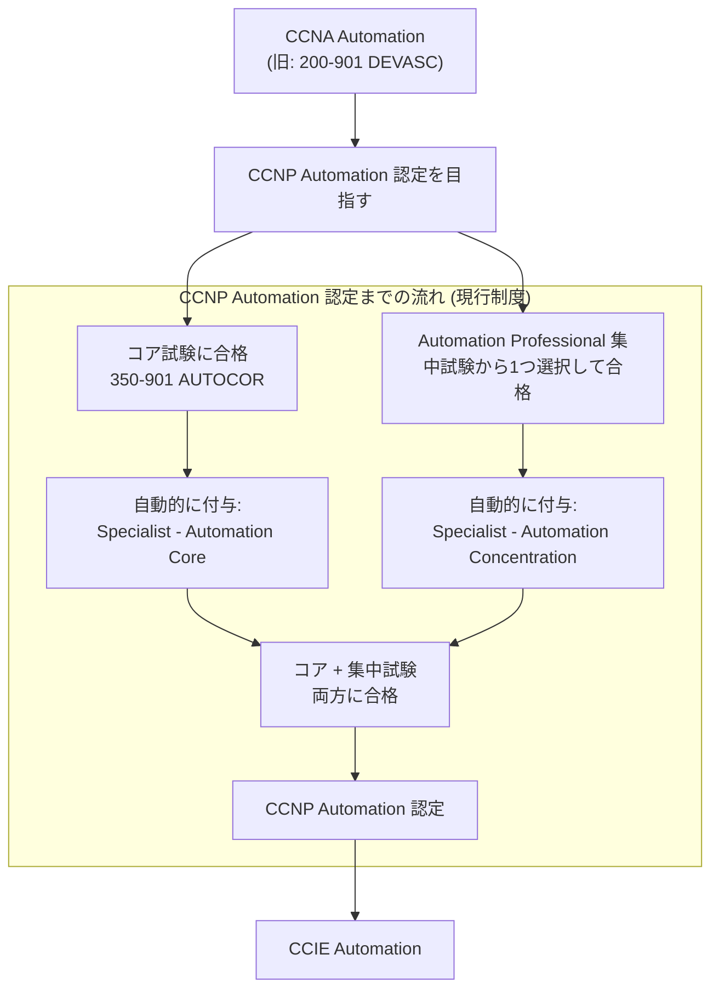
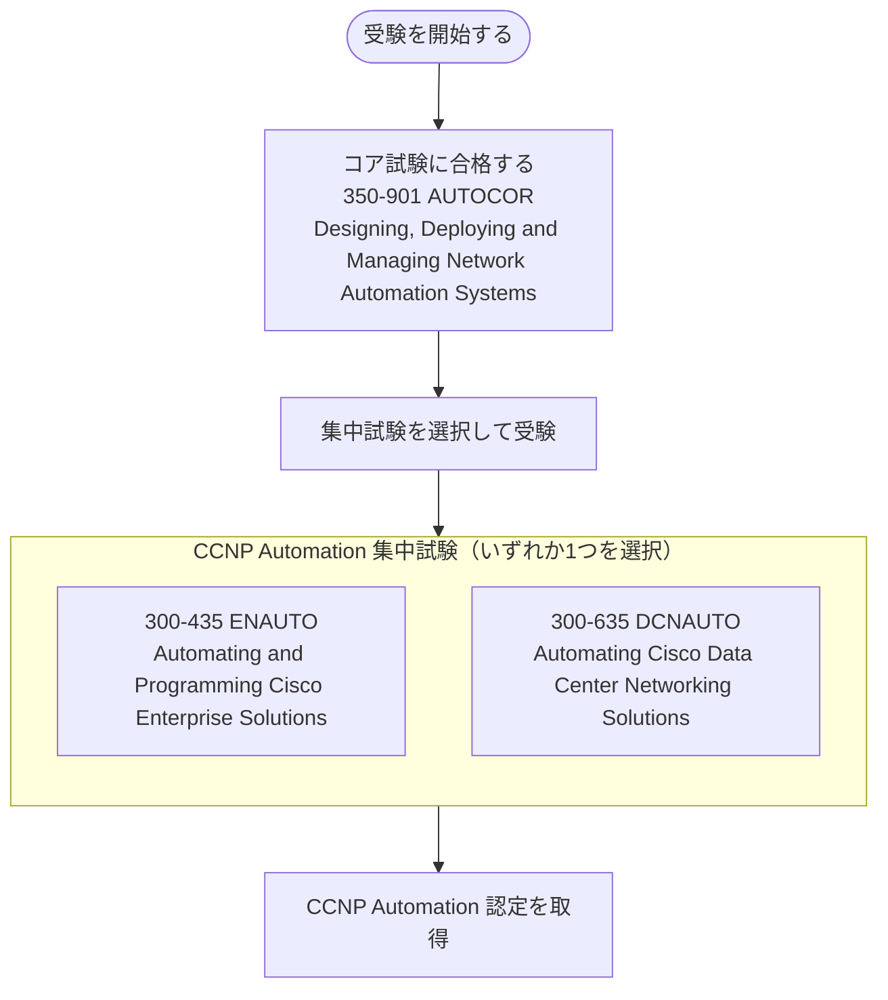
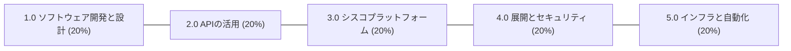
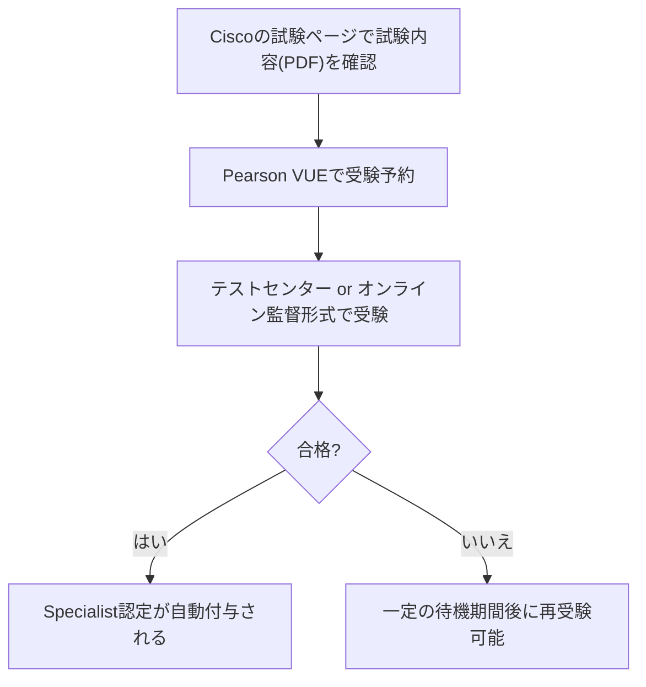
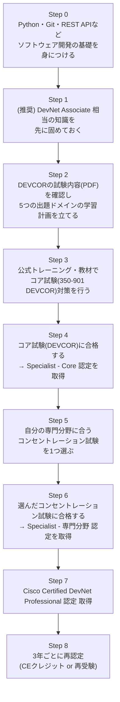
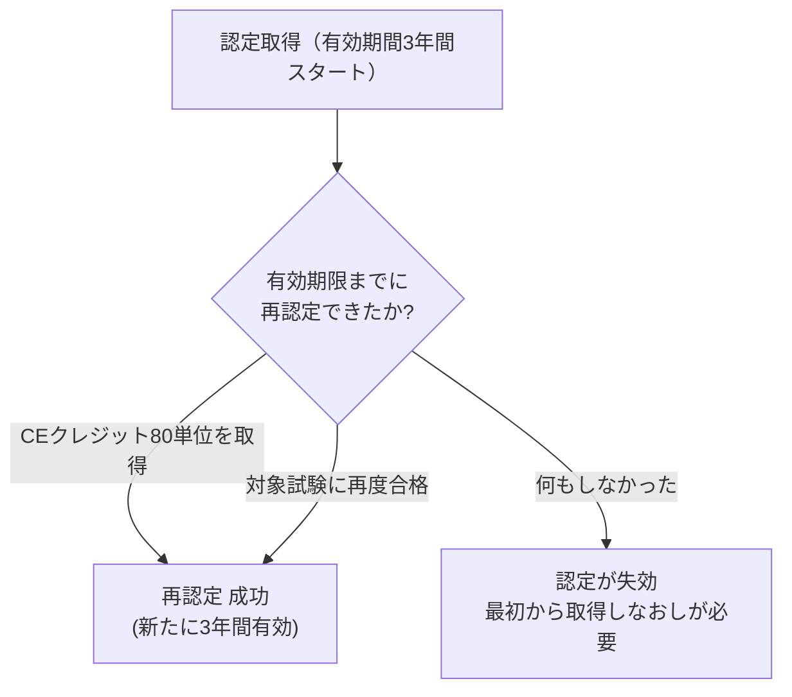

## 〜初学者のためのステップバイステップ入門〜

> このガイドは、Cisco 公式サイトの情報をもとに、**Cisco Certified DevNet Professional** 認定について「そもそも何を証明する資格なのか」「どんな試験に合格すればよいのか」「どう学習を進めればよいのか」を、初めて DevNet 認定に触れる方でも理解できるように整理したものです。
> 図解はすべて Mermaid のフローチャートで、比較情報はすべて Markdown の表で表現しています。

---

## 目次

1. このガイドの前提知識
2. DevNet認定とは何か（CCNA/CCNPとの違い）
3. Cisco認定全体における DevNet Professional の位置づけ
4. Cisco Certified DevNet Professional の概要
5. 受験資格・前提条件
6. 認定取得の仕組み（コア試験＋コンセントレーション試験）
7. コア試験「350-901 DEVCOR」を徹底解説
8. コンセントレーション試験（専門分野選択式試験）一覧
9. 試験形式・受験方法
10. 合格までの学習ロードマップ（ステップバイステップ）
11. 再認定（Recertification）制度
12. まとめ：DevNet Professionalはこんな人におすすめ
13. 参考ソース一覧

---

## 1. このガイドの前提知識

DevNet Professional はネットワーク技術者向けの資格として語られることが多いですが、実態は「**ソフトウェア開発の知識**」と「**シスコ製品・ネットワークの知識**」の両方が問われる、やや特殊な資格です。このガイドを読み進める前に、以下の用語だけ押さえておくと理解がスムーズです。

| 用語 | 初学者向けの説明 |
|---|---|
| API | 別のアプリケーションやシステムの機能を呼び出すための「窓口」。DevNet試験では特に REST API が中心 |
| REST API | HTTP通信（GET/POST/PUT/DELETEなど）を使ってデータをやり取りする、現在最も一般的なAPIの設計方式 |
| Python | DevNet認定全体で標準的に使われるプログラミング言語。自動化スクリプトの記述に使用 |
| CI/CD | コードの変更を自動でテスト・統合・配布する開発の仕組み（Continuous Integration / Continuous Delivery） |
| Ansible / Terraform | インフラの設定を「コード」として管理し自動化するためのツール（Infrastructure as Code） |
| コンセントレーション試験 | 「集中」「専門分野」を意味する語で、DevNet Professionalでは自分の得意領域を選んで受験する試験を指す |

---

## 2. DevNet認定とは何か（CCNA/CCNPとの違い）

Cisco には従来からある CCNA・CCNP・CCIE のようなネットワーク運用・設計を中心とした認定トラックがありますが、**DevNet認定**は「シスコプラットフォーム上で動くアプリケーションの開発・自動化・保守」に焦点を当てた、比較的新しい認定プログラムです。

- ネットワーク機器の「設定」ではなく、ネットワークやシスコ製品を**プログラムから操作・自動化する力**を証明する資格
- 対象は、ソフトウェア開発者、DevOpsエンジニア、自動化スペシャリストなど

（出典: [Cisco Certified DevNet Professional 認定とトレーニングプログラム](https://www.cisco.com/c/ja_jp/training-events/training-certifications/certifications/devnet/cisco-certified-devnet-professional.html)）

---

## 3. Cisco認定全体における DevNet Professional の位置づけ

DevNet認定には、易しい順に「Associate → Specialist → Professional → Expert（現在の名称は CCIE Automation）」という段階があります。ポイントは、**Specialist認定は単独で取得する試験ではなく、Professional取得の過程で自動的に得られる「副産物」の認定**であるという点です。

- **CCNA Automation**：正式な前提条件はないが、1年以上のPython開発経験が推奨される入門レベル
- **CCNP Automation**（現行制度）：350-901 AUTOCOR コア試験＋Automation Professional 集中試験（2種類から選択）の合格が必要
- **CCIE Automation**：コア試験に加え、実技（ハンズオンラボ）試験に合格する必要がある最上位レベル

> **注記（2026年2月2日以前の旧制度について）**：旧制度では「Cisco Certified DevNet Professional」として350-901 DEVCORおよび8種類の旧コンセントレーション試験が運用されていました。現在は「CCNP Automation」制度へ完全改定されています。

---

## 4. Cisco Certified DevNet Professional の概要

| 項目 | 内容 |
|---|---|
| 認定が証明するスキル | シスコプラットフォーム上に構築されたアプリケーションの**開発・運用**に関するプロフェッショナルレベルのスキル |
| 必要な試験数 | 2つ（コア試験 1つ + コンセントレーション試験 1つ） |
| 認定の有効期間 | 3年間 |
| 前提資格 | 公式な前提資格は不要 |
| 主な対象者 | ソフトウェア開発者、ネットワークプロフェッショナル、または両方の役割を担う人 |

（出典: [Cisco Certified DevNet Professional 認定とトレーニングプログラム](https://www.cisco.com/c/ja_jp/training-events/training-certifications/certifications/devnet/cisco-certified-devnet-professional.html)）

---

## 5. 受験資格・前提条件

Cisco の認定試験には共通する特徴として、「**受験資格そのものに公式な制限はない**」というものがあります。DevNet Professional も例外ではありません。

- 正式な前提条件は設けられていない
- ただし、受験前に試験範囲の内容を十分理解しておくことが推奨されている
- 推奨される実務経験の目安は、**Pythonプログラミングを含む3〜5年程度のソフトウェア開発経験**

つまり「受けようと思えば誰でも受験できるが、内容的にはある程度の開発経験を積んだ人向けの試験」という位置づけです。DevNet Associate（1年以上のPython経験が目安）と比べても、一段階レベルが上がっていることが分かります。

（出典: [Cisco Certified DevNet Professional 認定とトレーニングプログラム](https://www.cisco.com/c/ja_jp/training-events/training-certifications/certifications/devnet/cisco-certified-devnet-professional.html)）

---

## 6. 認定取得の仕組み（コア試験＋コンセントレーション試験）

現在の **CCNP Automation** 認定を取得するための試験構成は、以下の2階建てになっています。

1. **コア試験（必須）**：350-901 AUTOCOR (Designing, Deploying and Managing Network Automation Systems)
2. **コンセントレーション試験（選択）**：対象の集中試験から1つを選択して受験（300-435 ENAUTO: Automating and Programming Cisco Enterprise Solutions または 300-635 DCNAUTO: Automating Cisco Data Center Networking Solutions）

- 必須のコア試験（350-901 AUTOCOR）と選択コンセントレーション試験（300-435 ENAUTO / 300-635 DCNAUTO のいずれか）の両方に合格することで、**CCNP Automation 認定**が授与されます。

### 【参考】旧制度（過去の DevNet 認定体系）

以前の制度体系（DevNet Professional / DevNet Specialist）に関する情報は以下の通りです。現在の制度とは異なる歴史的経緯の情報としてご参照ください。

- **旧認定名称**: DevNet Specialist (Core / 各分野), DevNet Professional
- **旧選択試験の例**:
  - `300-910 DEVOPS` (DevOps Solutions & Practices)
  - `300-920 DEVWBX` (Webex Applications & Devices)

（出典: [Cisco Certified DevNet Professional 認定とトレーニングプログラム](https://www.cisco.com/c/ja_jp/training-events/training-certifications/certifications/devnet/cisco-certified-devnet-professional.html)、[DevNet Professional At-a-Glance（PDF）](https://www.cisco.com/c/dam/global/ja_jp/training-events/training-certifications/certifications/devnet/jp-devnet-professional-at-a-glance.pdf)）

---

## 7. コア試験「350-901 DEVCOR」を徹底解説

### 7-1. 基本情報

| 項目 | 内容 |
|---|---|
| 試験コード | 350-901（DEVCOR） |
| 正式名称 | Developing Applications using Cisco Core Platforms and APIs |
| 試験時間 | 120分 |
| 関連する認定 | Cisco Certified DevNet Professional、Cisco Certified DevNet Specialist - Core |
| 推奨トレーニング | Developing Applications Using Cisco Core Platforms and APIs（DEVCOR） |

（出典: [350-901 DEVCOR 試験ページ](https://www.cisco.com/c/ja_jp/training-events/training-certifications/exams/current-list/devcor-350-901.html)）

### 7-2. 出題ドメインと比率

DEVCORの出題範囲は、大きく5つの分野に**均等に20%ずつ**配分されています。1つの分野に偏った学習ではなく、幅広くバランスよく対策する必要があることが分かります。

| 出題比率 | 分野 | 主な学習ポイント（要約） |
|---|---|---|
| 20% | 1.0 ソフトウェアの開発と設計 | 分散アプリケーションの考え方、可用性・保守性・オブザーバビリティを意識した設計、データベース選定、アーキテクチャパターン（モノリシック/マイクロサービス等）、Gitの高度な操作 |
| 20% | 2.0 APIの活用 | REST APIのエラー処理、HTTPキャッシュの最適化、ページネーション対応、OAuth2の三者間認可フローの理解 |
| 20% | 3.0 シスコプラットフォーム | Webex・Firepower・Meraki・Intersight・UCS・Cisco DNA Center・AppDynamicsなど、各種シスコ製品のAPI活用 |
| 20% | 4.0 アプリケーションの展開とセキュリティ | CI/CDパイプラインのトラブル診断、Dockerによるコンテナ化、12-Factor Appの原則、OWASPの脅威対策、証明書設定 |
| 20% | 5.0 インフラストラクチャと自動化 | モデル駆動型テレメトリ、RESTCONFによるネットワーク設定、Ansible/Terraformを使ったワークフロー作成 |

（出典: [350-901 DEVCOR 試験内容（PDF・出題トピック一覧）](https://www.cisco.com/c/dam/global/ja_jp/training-events/training-certifications/exam-topics/350-901-DEVCOR.pdf)）

> **初学者向けポイント**：DEVCORは「シスコ製品の設定方法」を暗記する試験ではなく、「一般的なソフトウェアエンジニアリングの原則（設計・API・CI/CD・セキュリティ）をシスコのプラットフォーム上でどう実践するか」を問う試験です。Webエンジニアやバックエンド開発の経験があると理解が早い分野が多く含まれています。

---

## 8. コンセントレーション試験（専門分野選択式試験）一覧

### 現行制度（CCNP Automation）の集中試験

| 試験コード | 正式名称（略称） | 試験時間 | 主な学習内容 |
|---|---|---|---|
| 300-910 DEVOPS | Implementing DevOps Solutions and Practices using Cisco Platforms | 90分 | クラウドマイクロサービス、インフラプロセスの自動コンフィグレーション・管理・スケーラビリティ |
| 300-920 DEVWBX | Developing Applications for Cisco Webex and Webex Devices | 90分 | Webex API基礎、Meetings、デバイス、メッセージング、管理とコンプライアンス |

> **2026年2月2日以前の旧制度（参考）**：旧DevNet Professional制度では 350-901 DEVCOR をコア試験とし、300-435 ENAUTO, 300-835 CLAUTO, 300-635 DCAUTO, 300-535 SPAUTO, 300-735 SAUTO, 300-915 DEVIOT 等のコンセントレーション試験が提供されていました。現在これらは各トラックの自動化集中試験および旧制度情報として明確に区分されています。

### コンセントレーション試験の選び方（考え方の目安）

- 普段からネットワークの自動化業務（Enterprise/Data Center/Security等）に関わっている → 対応する自動化系試験（ENAUTO/DCAUTO/SAUTO等）
- クラウド・コンテナ・CI/CDなど「DevOps」寄りの働き方をしている → DEVOPS
- IoTデバイスやエッジコンピューティングに関心がある → DEVIOT
- チャットボットや会議連携などWebexのアプリ開発をしたい → DEVWBX

（出典: 各試験ページ　[ENAUTO](https://www.cisco.com/c/ja_jp/training-events/training-certifications/exams/current-list/enauto-300-435.html)、[CLAUTO](https://www.cisco.com/c/ja_jp/training-events/training-certifications/exams/current-list/clauto-300-835.html)、[DCAUTO](https://www.cisco.com/c/ja_jp/training-events/training-certifications/exams/current-list/dcauto-300-635.html)、[SPAUTO](https://www.cisco.com/c/ja_jp/training-events/training-certifications/exams/current-list/spauto-300-535.html)、[SAUTO](https://www.cisco.com/c/ja_jp/training-events/training-certifications/exams/current-list/sauto-300-735.html)、[DEVOPS](https://www.cisco.com/c/ja_jp/training-events/training-certifications/exams/current-list/devops-300-910.html)、[DEVIOT](https://www.cisco.com/c/ja_jp/training-events/training-certifications/exams/current-list/deviot-300-915.html)、[DEVWBX](https://www.cisco.com/c/ja_jp/training-events/training-certifications/exams/current-list/devwbx-300-920.html)）

---

## 9. 試験形式・受験方法

- 試験の予約・受験は、Cisco公式の試験配信パートナーである **Pearson VUE** を通じて行う
- 出題形式（画面操作のチュートリアル等）は Cisco Learning Network 上で事前確認できる
- コア試験（DEVCOR）は日本語・英語の両方に対応していることが試験ページで明記されている試験もある（コンセントレーション試験の対応言語は試験ごとに異なるため、受験前に各試験ページで要確認）

（出典: [350-901 DEVCOR 試験ページ](https://www.cisco.com/c/ja_jp/training-events/training-certifications/exams/current-list/devcor-350-901.html)、[再認定ポリシー（再受験の待機期間を含む）](https://www.cisco.com/c/ja_jp/training-events/training-certifications/recertification-policy.html)）

> 補足：不合格の場合の再受験までの待機期間は、Cisco Exam Safeguardを購入していない限り、アソシエイト／プロフェッショナル／スペシャリストレベルの試験では**不合格日の翌日から5暦日**とされています（再認定ポリシーページに基づく一般規定）。

---

## 10. 合格までの学習ロードマップ（ステップバイステップ）

初学者がゼロからDevNet Professionalを目指す場合の、一般的な学習の流れを整理しました。

各ステップのポイントを補足します。

| ステップ | ポイント |
|---|---|
| Step 0〜1 | 公式な前提条件はないが、実務上はPythonでのAPI操作経験が重要。DevNet Associateの学習内容は土台として非常に有効 |
| Step 2〜3 | DEVCORは5分野が均等配点のため、得意分野に偏らずまんべんなく学習計画を立てる |
| Step 4 | コア試験に合格した時点で、既に「Specialist」の肩書きが得られる（途中経過も評価される） |
| Step 5 | 普段の業務内容や興味に合わせてコンセントレーションを選ぶことで、学習効率と実務への応用度が上がる |
| Step 6〜7 | コンセントレーション試験も合格すれば、その時点でDevNet Professional認定が成立する |
| Step 8 | 認定の有効期間は3年間。継続教育（CE）クレジットの取得か、試験の再受験で更新する |

（出典: [Cisco Certified DevNet Professional 認定とトレーニングプログラム](https://www.cisco.com/c/ja_jp/training-events/training-certifications/certifications/devnet/cisco-certified-devnet-professional.html)、[再認定ポリシー](https://www.cisco.com/c/ja_jp/training-events/training-certifications/recertification-policy.html)）

---

## 11. 再認定（Recertification）制度

DevNet Professional 認定は、取得後**3年間**有効です。有効期限が切れる前に、以下いずれかの方法で再認定を行う必要があります。

| レベル | 再認定に必要な継続教育（CE）クレジット | 備考 |
|---|---|---|
| アソシエイト | 30 CEクレジット | |
| スペシャリスト | 40 CEクレジット | |
| **プロフェッショナル（DevNet Professionalが該当）** | **80 CEクレジット** | 試験の再受験でも代替可能 |
| CCIE／CCDE（エキスパート） | 120 CEクレジット | |

- 有効期間中であれば、既存試験の再受験・上位試験への挑戦・CEクレジット取得・その両方の組み合わせ、いずれの方法でも再認定が可能
- 認定の有効期限が切れた場合は、再認定ではなく認定取得プロセスを最初からやり直す必要がある
- 認定ステータスの管理責任は認定保有者自身にある
- 延長は認められていない

（出典: [再認定ポリシー](https://www.cisco.com/c/ja_jp/training-events/training-certifications/recertification-policy.html)）

---

## 12. まとめ：DevNet Professionalはこんな人におすすめ

- ネットワークエンジニアとして、これからの「自動化・NetDevOps」の波に対応したい人
- 既にソフトウェア開発者だが、シスコ製品と連携するアプリケーション開発に強みを持ちたい人
- CCNPなど別トラックのプロフェッショナル認定と組み合わせて、専門性を広げたい人（コンセントレーション試験がCCNPと共通のものが多いため）
- 3〜5年程度のソフトウェア開発経験（Pythonを含む）がある人

DevNet Professionalは「コア試験＋コンセントレーション試験」という2階建て構造によって、**共通のソフトウェア開発力**と**個々の専門分野の実践力**の両方を証明できる設計になっている点が最大の特徴です。まずは出題比率が均等な5分野を意識してDEVCORの学習計画を立て、その後に自分の得意分野でコンセントレーション試験を選ぶ、という順序で進めるとスムーズに学習できます。

---

## 13. 参考ソース一覧

本ガイドの内容は、以下のCisco公式ページ・公式PDF資料を根拠として作成しています。

- [Cisco Certified DevNet Professional 認定とトレーニングプログラム](https://www.cisco.com/c/ja_jp/training-events/training-certifications/certifications/devnet/cisco-certified-devnet-professional.html)
- [DevNet Professional At-a-Glance（PDF）](https://www.cisco.com/c/dam/global/ja_jp/training-events/training-certifications/certifications/devnet/jp-devnet-professional-at-a-glance.pdf)
- [DevNet 認定 - トレーニング & 認定（認定トラック全体）](https://www.cisco.com/c/ja_jp/training-events/training-certifications/certifications/devnet.html)
- [Cisco Certified DevNet Associate 認定とトレーニングプログラム](https://www.cisco.com/c/ja_jp/training-events/training-certifications/certifications/devnet/cisco-certified-devnet-associate.html)
- [CCIE Automation（旧 Cisco Certified DevNet Expert）](https://www.cisco.com/site/us/en/learn/training-certifications/certifications/automation/ccie-automation/index.html)
- [350-901 DEVCOR 試験ページ](https://www.cisco.com/c/ja_jp/training-events/training-certifications/exams/current-list/devcor-350-901.html)
- [350-901 DEVCOR 試験内容（PDF・出題トピック一覧）](https://www.cisco.com/c/dam/global/ja_jp/training-events/training-certifications/exam-topics/350-901-DEVCOR.pdf)
- [300-435 ENAUTO 試験ページ](https://www.cisco.com/c/ja_jp/training-events/training-certifications/exams/current-list/enauto-300-435.html)
- [300-835 CLAUTO 試験ページ](https://www.cisco.com/c/ja_jp/training-events/training-certifications/exams/current-list/clauto-300-835.html)
- [300-635 DCAUTO 試験ページ](https://www.cisco.com/c/ja_jp/training-events/training-certifications/exams/current-list/dcauto-300-635.html)
- [300-535 SPAUTO 試験ページ](https://www.cisco.com/c/ja_jp/training-events/training-certifications/exams/current-list/spauto-300-535.html)
- [300-735 SAUTO 試験ページ](https://www.cisco.com/c/ja_jp/training-events/training-certifications/exams/current-list/sauto-300-735.html)
- [300-910 DEVOPS 試験ページ](https://www.cisco.com/c/ja_jp/training-events/training-certifications/exams/current-list/devops-300-910.html)
- [300-915 DEVIOT 試験ページ](https://www.cisco.com/c/ja_jp/training-events/training-certifications/exams/current-list/deviot-300-915.html)
- [300-920 DEVWBX 試験ページ](https://www.cisco.com/c/ja_jp/training-events/training-certifications/exams/current-list/devwbx-300-920.html)
- [再認定ポリシー](https://www.cisco.com/c/ja_jp/training-events/training-certifications/recertification-policy.html)

> **注意**：試験時間・出題比率・試験コード・認定の名称や再認定制度は、Ciscoの都合により**予告なく変更される場合があります**。最終的な受験判断の前には、必ず上記の公式ページで最新情報をご確認ください。
