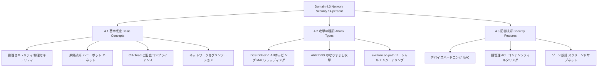
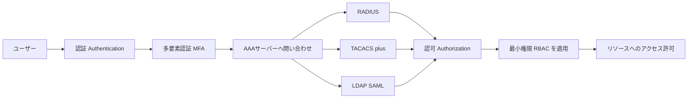
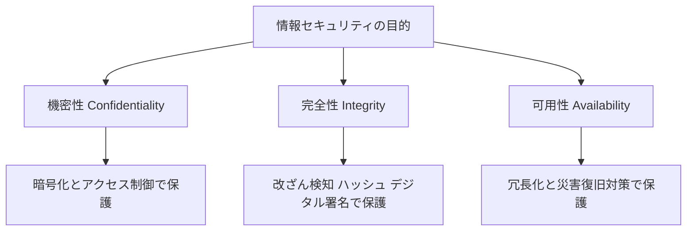
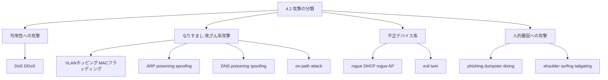
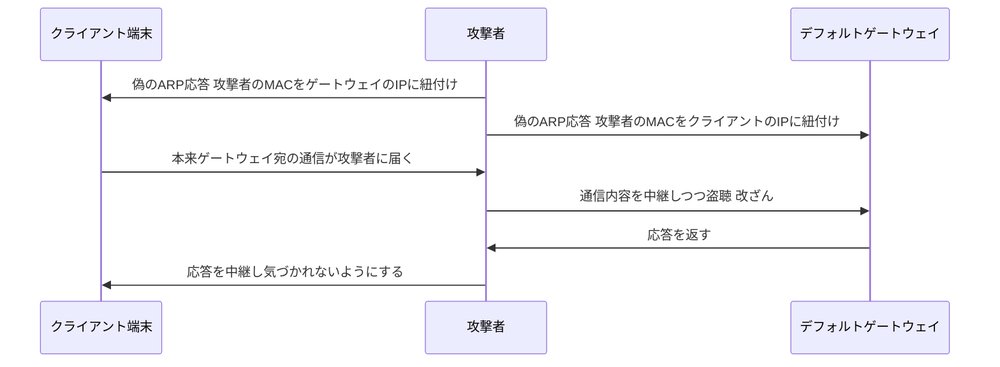
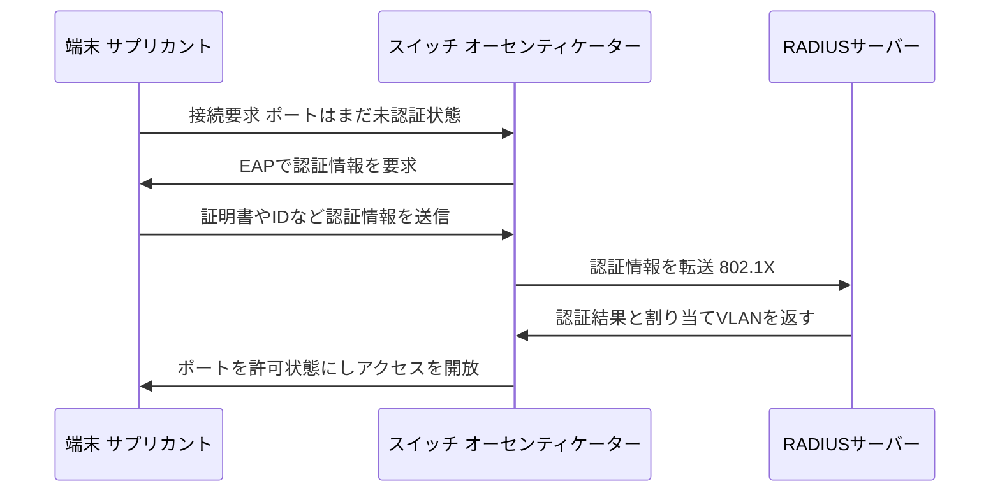
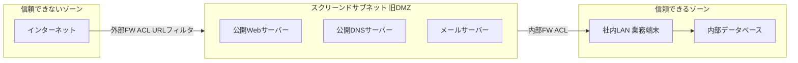

# CompTIA Network+ (N10-009) ドメイン4.0「ネットワークセキュリティ」完全ガイド

> 対象: CompTIA Network+ 認定試験(試験コード: N10-009 / V9)を学習中の初学者
> テーマ: ドメイン 4.0 Network Security(出題比率 14%)
> 表記方針: 日本語での解説をベースに、試験に出る英語の技術用語はそのまま併記します

---

## この記事について

CompTIA Network+ は、ネットワークの構築・運用・トラブルシューティングに関する基礎力を証明する認定試験です。2024年6月に改訂された最新バージョン(N10-009)では、出題内容が5つの「ドメイン」に分かれており、そのうちの1つが本記事のテーマである **4.0 Network Security(ネットワークセキュリティ)** です。

このドメインは出題比率こそ14%とそこまで大きくありませんが、

- 認証・認可の仕組み(IAM)
- 代表的な攻撃手法とその対処法
- ネットワークを「ゾーン」に分けて守る考え方

など、実務でもそのまま役立つ内容が凝縮されています。本記事では、この4.0ドメインを **4.1 → 4.2 → 4.3** の3ステップに分解し、図解と表を使いながら初学者にもわかる形で解説します。

---

## このガイドの使い方

1. まず「STEP 0: 全体像」で、ドメイン4.0が試験全体のどこに位置し、どんなサブトピックで構成されているかを掴みます。
2. 続く STEP 1〜3 で、公式の出題範囲(Exam Objectives)に沿って、各サブトピックを1つずつ学びます。
3. 各セクションには「これは何を守るための技術か」「なぜ必要か」という視点を添えています。丸暗記ではなく、仕組みの理解を優先してください。
4. 最後に「ドメイン4.0チェックリスト」で理解度を自己確認できます。

---

## STEP 0: 全体像 — 試験におけるネットワークセキュリティの位置づけ

### 0-1 試験の基本情報

| 項目 | 内容 |
|---|---|
| 試験コード | N10-009(V9) |
| リリース日 | 2024年6月20日 |
| 出題数 | 最大90問(多肢選択式 + performance-based question) |
| 試験時間 | 90分 |
| 合格ライン | 720点(100〜900点満点) |
| 推奨経験 | CompTIA A+ 取得済み、または9〜12ヶ月程度のネットワーク実務経験 |

### 0-2 5つのドメインと出題比率

| ドメイン番号 | ドメイン名 | 出題比率 |
|---|---|---|
| 1.0 | Networking Concepts(ネットワークの基礎概念) | 23% |
| 2.0 | Network Implementation(ネットワークの実装) | 20% |
| 3.0 | Network Operations(ネットワークの運用) | 19% |
| **4.0** | **Network Security(ネットワークセキュリティ)** | **14%** |
| 5.0 | Network Troubleshooting(トラブルシューティング) | 24% |

ドメイン4.0は単体の比率としては最も小さいですが、CompTIA自身が「より深いセキュリティの内容は Security+ 側で扱う」という設計思想を取っているため、Network+ 側では **ネットワーク技術者が最低限押さえるべき土台部分** に絞られています。裏を返せば、ここに出てくる内容はネットワーク運用者にとって「知らないでは済まされない」基礎知識ということです。

### 0-3 ドメイン4.0の構造(3つのサブ目標)

| サブ目標 | 公式タイトル(意訳) | 一言でいうと |
|---|---|---|
| 4.1 | 基本的なネットワークセキュリティの概念を説明する | 「何を」「なぜ」守るのかという土台の考え方 |
| 4.2 | さまざまな攻撃の種類とネットワークへの影響を要約する | 「どう攻撃されるか」を知る |
| 4.3 | シナリオに基づき、セキュリティ機能・防御技術・ソリューションを適用する | 「どう防ぐか」を実践する |

この3ステップは「概念 → 脅威 → 対策」という自然な学習の流れになっています。次のSTEP 1から順に見ていきましょう。

---

## STEP 1: 4.1 基本的なネットワークセキュリティの概念

### 1-1 論理セキュリティ(Logical Security)

論理セキュリティとは、物理的な鍵やカメラではなく、**データやアクセス権そのものを技術的に保護する仕組み** を指します。

#### (a) 暗号化(Encryption)

データは「動いている状態」と「止まっている状態」の2つの場面で保護する必要があります。

| 状態 | 英語表記 | 具体例 |
|---|---|---|
| 通信中のデータ | Data in transit | HTTPS、VPN、TLSによる暗号化通信 |
| 保存中のデータ | Data at rest | ディスク暗号化、データベースの暗号化 |

#### (b) 証明書と公開鍵基盤(PKI)

- **PKI(Public Key Infrastructure)**: 公開鍵と秘密鍵のペアを使い、通信相手の身元と、通信内容の暗号化・改ざん検知を同時に実現する仕組み。
- **自己署名証明書(Self-signed certificate)**: 第三者の認証局(CA)を通さず自分で発行した証明書。社内検証環境などでは使われるが、外部向けサービスでは信頼性の面で推奨されません。

#### (c) IAM(Identity and Access Management)— 認証と認可の仕組み

IAMは「誰が」「何に」「どこまで」アクセスできるかを制御する枠組み全体を指します。試験では特に、次の要素を区別できることが重要です。

| 要素 | 意味 |
|---|---|
| Authentication(認証) | 「あなたは誰か」を確認するプロセス |
| Authorization(認可) | 認証された相手に「何を許可するか」を決めるプロセス |
| MFA(Multifactor Authentication) | パスワードに加え、SMSコードや生体認証など複数の要素で認証を強化する方式 |
| SSO(Single Sign-On) | 1回のログインで複数のシステムにアクセスできる仕組み |

認証・認可でよく使われるプロトコルの比較は次の通りです。

| プロトコル | 主な用途 | 通信の暗号化 | 特徴 |
|---|---|---|---|
| RADIUS | ネットワーク機器・VPN・Wi-Fiの認証 | ペイロードの一部のみ暗号化 | AAA(認証・認可・アカウンティング)の代表的プロトコル。UDPベース |
| TACACS+ | ネットワーク機器の管理者アクセス制御 | 全体を暗号化 | Cisco系機器で多用。認証・認可・アカウンティングを分離して制御可能 |
| LDAP | ディレクトリサービスへの問い合わせ | 標準では平文(LDAPSで暗号化) | ユーザー情報やグループ情報を一元管理 |
| SAML | Webアプリのシングルサインオン | XMLベースのアサーションを署名・暗号化 | クラウドサービスとの連携(SSO)で多用 |

これらは以下のような流れで組み合わさって動作します。

その他、押さえておきたい関連用語:

- **Time-based authentication**: 時刻に基づくワンタイムパスワードなど、時間の要素を組み込んだ認証。
- **Least privilege(最小権限の原則)**: ユーザーには業務に必要な最小限の権限だけを与えるという考え方。
- **RBAC(Role-Based Access Control)**: 個人ではなく「役割(ロール)」単位で権限を割り当てる方式。
- **Geofencing(ジオフェンシング)**: 位置情報をもとに、特定の地理的範囲内からのみアクセスを許可する仕組み。

### 1-2 物理セキュリティ(Physical Security)

論理セキュリティだけでは不十分で、サーバールームや配線盤への物理的な侵入対策も必要です。

- **Camera(監視カメラ)**: 不正な立ち入りの抑止・記録。
- **Locks(施錠)**: ラックや部屋そのものへの物理的アクセス制限。

### 1-3 欺瞞技術(Deception Technologies)

攻撃者を「おとり」に誘導し、実際の資産を守りながら攻撃の手口を観察するための技術です。

| 用語 | 説明 |
|---|---|
| Honeypot(ハニーポット) | 攻撃者を引きつけるためにわざと用意した、脆弱に見える単体のシステムやサービス |
| Honeynet(ハニーネット) | ハニーポットを複数組み合わせて構築した、より本物らしいおとりのネットワーク環境 |

### 1-4 セキュリティの基本用語

まずリスクに関する4つの用語の関係を整理しましょう。

| 用語 | 意味 |
|---|---|
| Threat(脅威) | 損害を引き起こす可能性のある要因そのもの(攻撃者、自然災害など) |
| Vulnerability(脆弱性) | 攻撃者に悪用され得る、システムやプロセスの弱点 |
| Exploit(エクスプロイト) | 脆弱性を実際に悪用するための具体的な手段・コード |
| Risk(リスク) | 脅威が脆弱性を突いて実際に損害が発生する可能性とその影響度 |

続いて、情報セキュリティの目的を表す代表的なフレームワークが **CIA Triad** です。

| 要素 | 意味 | 侵害された場合の例 |
|---|---|---|
| Confidentiality(機密性) | 許可された者だけが情報にアクセスできる状態を保つこと | 顧客情報の漏えい |
| Integrity(完全性) | 情報が改ざんされず正確な状態を保つこと | 送金額の不正な書き換え |
| Availability(可用性) | 必要な時に情報やシステムへアクセスできる状態を保つこと | DDoS攻撃によるサービス停止 |

CIA Triadは米国立標準技術研究所(NIST)の情報セキュリティ文書群でも共通の基本モデルとして使われている、業界標準の考え方です。

### 1-5 監査と規制コンプライアンス

企業ネットワークは、業界や地域ごとの法規制・基準に準拠する必要があります。

| 項目 | 概要 |
|---|---|
| Data locality(データローカリティ) | データを特定の国・地域内に保存・処理する義務や制約 |
| PCI DSS(Payment Card Industry Data Security Standard) | クレジットカード情報を扱う事業者向けのセキュリティ基準 |
| GDPR(General Data Protection Regulation) | EU域内の個人データ保護に関する規則。域外の事業者にも適用され得る |

### 1-6 ネットワークセグメンテーション

すべての機器を1つのフラットなネットワークに置くと、1台が侵害された際の被害範囲が広がります。そこで、用途やリスクの性質ごとにネットワークを分割します。

| セグメント | 対象 | 分離する理由 |
|---|---|---|
| IoT / IIoT | スマート機器、産業用IoT機器 | 一般に更新頻度が低くセキュリティパッチが遅れがちなため |
| SCADA / ICS / OT | 産業制御システム、運用技術全般 | 可用性が最優先され、停止や誤動作が物理的な事故に直結するため |
| Guest(ゲスト) | 来訪者用のネットワーク | 社内システムへの直接アクセスを防ぐため |
| BYOD(Bring Your Own Device) | 従業員の私物端末 | 会社が管理しきれない端末からのリスクを限定するため |

---

## STEP 2: 4.2 攻撃の種類とネットワークへの影響

まずは全体の分類を俯瞰します。

### 2-1 攻撃の一覧表

| 攻撃 | 何をするか | 主な影響 | 代表的な対策 |
|---|---|---|---|
| DoS / DDoS | 大量のトラフィックやリクエストでシステムを過負荷にする | 可用性の喪失(サービス停止) | レート制限、DDoS対策サービス、冗長構成 |
| VLANホッピング | タグ付けの不備を突いて、本来アクセスできないVLANへ侵入する | セグメンテーションの突破 | ネイティブVLANの変更、不要なトランクポートの無効化 |
| MACフラッディング | 大量の偽MACアドレスでスイッチのMACテーブルを溢れさせる | スイッチがハブ化しトラフィックが盗聴される | ポートセキュリティ、MACアドレス数の制限 |
| ARP poisoning / spoofing | 偽のARP応答でMACアドレスの対応関係を書き換える | 通信の盗聴・改ざん(on-path攻撃の前段階) | Dynamic ARP Inspection、静的ARPエントリ |
| DNS poisoning / spoofing | DNSキャッシュや応答を偽装し、不正なIPアドレスへ誘導する | フィッシングサイトへの誘導、通信の傍受 | DNSSEC、信頼できるリゾルバの利用 |
| Rogue devices / services | 許可されていないDHCPサーバーやAPをネットワークに接続する | 誤ったIP配布や通信の乗っ取り | DHCP snooping、NACによる端末認証 |
| Evil twin | 正規のAPになりすました偽のアクセスポイントを設置する | 通信内容の盗聴、認証情報の窃取 | エンタープライズ認証(802.1X)、Wi-Fi異常検知 |
| On-path attack | 通信経路上に割り込み、当事者に気づかれず通信を中継・傍受する | 通信内容の盗聴・改ざん | 暗号化通信(TLS)、証明書検証、ARP監視 |
| Social engineering | 技術ではなく人間の心理や行動の隙を突く | 認証情報の詐取、不正な物理侵入 | セキュリティ教育、入退室管理の徹底 |

### 2-2 ARP poisoningからon-path attackへの流れ

ARP poisoningは、on-path attack(いわゆる中間者攻撃)を成立させるための代表的な手口です。攻撃の流れを時系列で見てみましょう。

このように、ARP応答には本来「認証」の仕組みがないため、同一セグメント内であれば比較的容易に偽装できてしまう点が弱点です。これが、STEP 3で扱う「セグメンテーション」や「監視」が重要になる理由の一つです。

### 2-3 ソーシャルエンジニアリングの手口

技術的な脆弱性ではなく、人の心理的な隙を突く攻撃も試験範囲に含まれます。

| 手口 | 内容 |
|---|---|
| Phishing(フィッシング) | 正規の相手を装ったメールやメッセージで、認証情報や機密情報をだまし取る |
| Dumpster diving(ダンプスターダイビング) | 廃棄されたゴミの中から、書類やメモなど機密情報を探し出す |
| Shoulder surfing(ショルダーサーフィン) | 背後や近くから画面や入力内容を盗み見る |
| Tailgating(テールゲーティング) | 認証された人の後ろにこっそりついて、施錠区画へ不正に入室する |

### 2-4 Malware(マルウェア)

ウイルス、ワーム、ランサムウェアなど、悪意のあるソフトウェア全般を指す総称です。Network+ではネットワーク経由での拡散や、感染した端末がネットワーク全体に与える影響という観点で押さえておけば十分です。

---

## STEP 3: 4.3 セキュリティ機能・防御技術・ソリューションの適用

STEP 1・2で「何を」「どう」守るかを学んだので、最後に具体的な防御の実装方法を見ていきます。

### 3-1 デバイスハードニング(Device Hardening)

機器そのものの攻撃対象領域(アタックサーフェス)を減らす基本的な対策です。

- 使っていないポートやサービスを無効化する
- 初期設定のパスワード(デフォルトパスワード)を必ず変更する

### 3-2 NAC(Network Access Control)

ネットワークに接続しようとする端末を、接続前に検査・認証する仕組みです。

| 手法 | 概要 |
|---|---|
| Port security(ポートセキュリティ) | スイッチのポートごとに接続を許可するMACアドレス数や種類を制限する |
| 802.1X | ポートベースの認証規格。RADIUSサーバーと連携し、認証が通るまでポートを閉じておく |
| MAC filtering(MACフィルタリング) | 許可リストに登録されたMACアドレスの端末のみ接続を許可する |

802.1Xによる認証の流れは次の通りです。

### 3-3 鍵管理(Key Management)

暗号化に使う鍵を、生成・配布・保管・失効までライフサイクル全体で適切に管理することです。鍵が漏えいすれば、暗号化そのものの意味がなくなるため、PKIやVPNの運用において重要な位置づけを持ちます。

### 3-4 セキュリティルール

| 機能 | 概要 |
|---|---|
| ACL(Access Control List) | IPアドレスやポート番号などの条件で、通過させる通信・拒否する通信を定義するルール |
| URL filtering(URLフィルタリング) | 特定のWebサイトへのアクセスをURL単位で制限する |
| Content filtering(コンテンツフィルタリング) | 通信内容の種類(ファイル形式など)に基づいてアクセスを制限する |

### 3-5 ゾーン設計:trusted / untrusted / screened subnet

ネットワークを「信頼度」で区切り、境界に防御を集中させる考え方です。

| ゾーン | 信頼度 | 主な用途 |
|---|---|---|
| Untrusted zone(信頼できないゾーン) | 最も低い | インターネットなど、管理外のネットワーク |
| Screened subnet(スクリーンドサブネット) | 中間 | 外部公開が必要なWeb・DNS・メールサーバーなどを配置する緩衝地帯。以前はDMZ(demilitarized zone)と呼ばれていた |
| Trusted zone(信頼できるゾーン) | 高い | 社内LANや内部データベースなど、外部から直接アクセスさせない領域 |

この設計により、仮に外部公開サーバーが一台侵害されても、内部FWがもう一段の壁となり、社内LANまで一気に到達されることを防ぎます。

---

## ドメイン4.0 チェックリスト

学習の最後に、公式の出題範囲(Exam Objectives)に沿って理解度を確認しましょう。

| 項目 | 理解できたか |
|---|---|
| 暗号化(in transit / at rest)の違いを説明できる | ☐ |
| PKI・証明書の役割を説明できる | ☐ |
| RADIUS / TACACS+ / LDAP / SAML の違いを説明できる | ☐ |
| MFA・SSO・最小権限・RBACの意味を説明できる | ☐ |
| ハニーポットとハニーネットの違いを説明できる | ☐ |
| Risk / Vulnerability / Exploit / Threat の関係を説明できる | ☐ |
| CIA Triad の3要素を説明できる | ☐ |
| PCI DSS と GDPR の違いを説明できる | ☐ |
| IoT/OT/Guest/BYODをなぜ分離するか説明できる | ☐ |
| DoS/DDoS、VLANホッピング、MACフラッディングの違いを説明できる | ☐ |
| ARP poisoning/spoofing と DNS poisoning/spoofing の違いを説明できる | ☐ |
| Evil twin と on-path attack の関係を説明できる | ☐ |
| 代表的なソーシャルエンジニアリングの手口を4つ挙げられる | ☐ |
| デバイスハードニングの基本2点を説明できる | ☐ |
| Port security / 802.1X / MAC filtering の違いを説明できる | ☐ |
| ACL・URLフィルタリング・コンテンツフィルタリングの違いを説明できる | ☐ |
| Screened subnet(旧DMZ)の役割を説明できる | ☐ |

すべてにチェックが付けば、ドメイン4.0の基礎は固まっています。次はドメイン5.0(Network Troubleshooting)に進み、実際の障害シナリオの中でこれらのセキュリティ知識がどう関わってくるかを学ぶと、知識がより実践的に定着します。

---

## 参考文献・出典(References)

本記事は以下の一次情報・専門情報源を根拠に作成しています。内容の正確性を確認したい場合や、より詳しく学びたい場合はあわせてご参照ください。

### 公式情報源(Primary sources)

- CompTIA Network+ 公式認定ページ(試験概要・出題比率のサマリー)
  https://www.comptia.org/en-us/certifications/network/
- CompTIA Network+ N10-009 Certification Exam: Exam Objectives(Version 4.0, 公式PDF。ドメイン4.0の詳細な出題範囲の一次情報)
  https://comptiacdn.azureedge.net/webcontent/docs/default-source/exam-objectives/comptia-network-n10-009-exam-objectives-(4-0)-(1).pdf

### 補足・専門用語の確認に使った情報源(Supplementary sources)

- NIST CSRC Glossary「confidentiality, integrity, availability」(CIA Triadの定義確認)
  https://csrc.nist.gov/glossary/term/confidentiality_integrity_availability
- Wikipedia「ARP spoofing」(ARPポイズニング/スプーフィングの仕組みの確認)
  https://en.wikipedia.org/wiki/ARP_spoofing
- Wikipedia「Screened subnet」(スクリーンドサブネット/DMZの構造の確認)
  https://en.wikipedia.org/wiki/Screened_subnet

> 注記: CompTIAの出題範囲は改訂される可能性があります。実際の受験前には、必ず上記の公式ページで最新の試験コード・出題比率・出題範囲をご確認ください。
