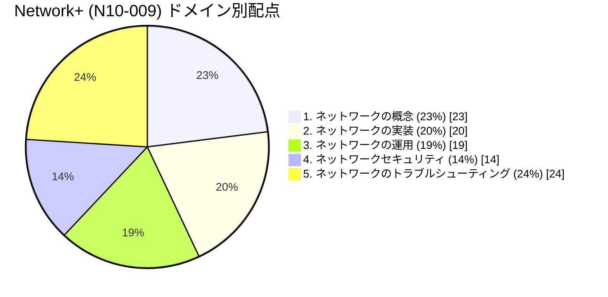
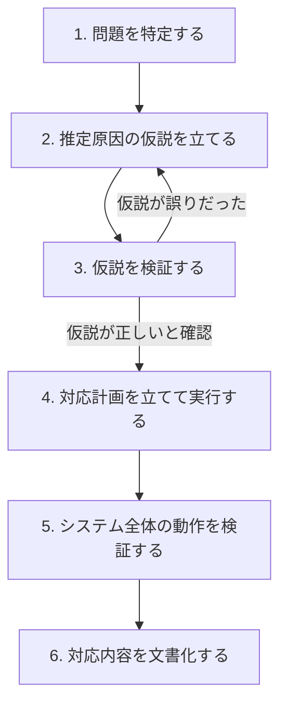
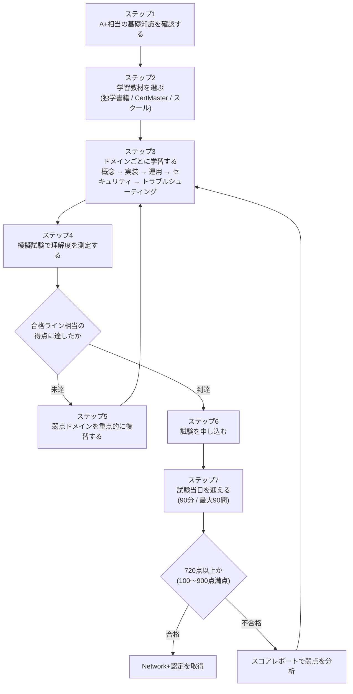
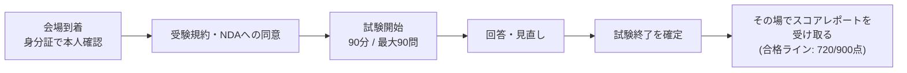

# CompTIA Network+ 試験 完全ガイド

## ― 初学者のためのステップバイステップ解説 ―

> 本ガイドは、世界トップクラスのインフラアーキテクト／ソフトウェアエンジニアの視点から、CompTIA Network+ 資格について「何を」「なぜ」「どう学ぶか」を初学者にもわかりやすく整理したものです。
> 最新の公式試験情報（V9 / 試験コード N10-009）に基づいています。

---

## 目次

1. [CompTIA Network+ とは何か](#1-comptia-network-とは何か)
2. [この資格はどんな人に向いているか](#2-この資格はどんな人に向いているか)
3. [試験の基本情報](#3-試験の基本情報)
4. [出題範囲と配点（5つのドメイン）](#4-出題範囲と配点5つのドメイン)
5. [各ドメインの詳細解説](#5-各ドメインの詳細解説)
6. [基礎知識：OSI参照モデル](#6-基礎知識osi参照モデル)
7. [学習を始めるステップバイステップ](#7-学習を始めるステップバイステップ)
8. [学習教材の選び方](#8-学習教材の選び方)
9. [試験当日の流れ](#9-試験当日の流れ)
10. [学習時間の目安](#10-学習時間の目安)
11. [よくある質問（FAQ）](#11-よくある質問faq)
12. [まとめ](#12-まとめ)
13. [参考文献・出典](#13-参考文献出典)

---

## 1. CompTIA Network+ とは何か

CompTIA Network+ は、米国の非営利業界団体 CompTIA が提供するベンダーニュートラル（特定メーカーに依存しない）なネットワーク技術者向け認定資格です。特定企業の製品知識ではなく、TCP/IP・ルーティング・スイッチング・無線LAN・クラウド・セキュリティといった「ネットワークの基礎体力」そのものを証明する資格として、業界で広く認知されています。

この資格を取得すると、以下のような能力を持つことを客観的に証明できます。

- 有線・無線ネットワーク機器を設計・導入できる
- ネットワークのドキュメント化やライフサイクル管理ができる
- クラウドや仮想ネットワークの基本概念を理解している
- 障害を体系的な手順で切り分け、復旧できる
- 基本的なセキュリティ対策を実装できる

Network+ は「CompTIA Core」シリーズの一部で、前段の A+（PCやOSの基礎）から一歩進み、次段の Security+ や Cloud+、CCNA などへの橋渡し役を担う、いわば **ネットワークエンジニアとしての最初の共通言語** を身につける資格です。

---

## 2. この資格はどんな人に向いているか

| 項目 | 内容 |
| --- | --- |
| 主な対象者 | 未経験からネットワーク・インフラ分野を目指す人、社内SE、ヘルプデスク担当者、サーバー/インフラエンジニア志望者 |
| 推奨される前提資格 | CompTIA A+（必須ではないが推奨） |
| 推奨される実務経験 | ジュニアネットワーク管理者・ネットワークサポート技術者として9〜12ヶ月程度の実務経験 |
| 取得後に想定される職務（NICE/DoD 8140の職務区分に基づく） | テクニカルサポートスペシャリスト、ネットワークオペレーションスペシャリスト、システム管理者 |
| 次のステップとして繋がる資格例 | CompTIA Security+、CompTIA Cloud+、ベンダー資格（CCNAなど） |

実務未経験でも受験は可能ですが、公式には上記の経験レベルが推奨されています。独学の場合は、自宅ラボやシミュレーターで手を動かしながら学ぶことが理解の定着に役立ちます。

---

## 3. 試験の基本情報

2026年7月時点で最新の試験バージョンは **V9（試験コード N10-009）** です。旧バージョン N10-008 からの改訂版として、2024年6月20日にリリースされました。

| 項目 | 内容 |
| --- | --- |
| 試験バージョン | V9 |
| 試験コード | N10-009 |
| リリース日 | 2024年6月20日 |
| 問題数 | 最大90問（多肢選択式 + パフォーマンスベース問題の混在） |
| 試験時間 | 90分 |
| 合格ライン | 720点（100〜900点のスケール中） |
| 出題言語 | 英語・ドイツ語・日本語・ポルトガル語・スペイン語 |
| 退役（後継版への切り替え）目安 | リリースからおよそ3年後（2027年頃と推定） |

「パフォーマンスベース問題」とは、選択肢から選ぶだけでなく、シミュレーション画面上でネットワーク構成やコマンド操作を実際に行わせるタイプの実技系設問です。知識の暗記だけでなく、実際の操作手順を体で覚えておく必要があります。

---

## 4. 出題範囲と配点（5つのドメイン）

Network+ (N10-009) の出題範囲は、以下の5つの「ドメイン」に分かれています。ドメインごとの配点比率を把握することは、学習の優先順位を決めるうえで非常に重要です。

| No. | ドメイン名 | 配点比率 | ひとことで言うと |
| --- | --- | --- | --- |
| 1 | ネットワークの概念 | 23% | 用語・OSIモデル・プロトコル・トポロジーなどの土台知識 |
| 2 | ネットワークの実装 | 20% | ルーティング・スイッチング・無線設定など「構築する力」 |
| 3 | ネットワークの運用 | 19% | ドキュメント化・監視・災害復旧など「運用する力」 |
| 4 | ネットワークセキュリティ | 14% | 認証・攻撃手法・防御策など「守る力」 |
| 5 | ネットワークのトラブルシューティング | 24% | 障害を切り分け、直す「診断する力」 |

最も配点が高いのは「トラブルシューティング（24%）」で、次いで「概念（23%）」です。この2つだけで全体の約半分を占めるため、学習の軸に据えるべき分野といえます。

---

## 5. 各ドメインの詳細解説

### 5.1 ネットワークの概念（23%）

ネットワークを理解するための「語彙」と「地図」にあたる分野です。

- **OSI参照モデルの7層**（後述の第6章で詳しく解説）
- **ネットワーク機器**：ルーター、スイッチ、ファイアウォール、IDS/IPS、ロードバランサー、プロキシ、NAS、SANなど
- **クラウドの基礎概念**：NFV（ネットワーク機能仮想化）、VPC、クラウドゲートウェイ、デプロイモデル（パブリック/プライベート/ハイブリッド）、サービスモデル（SaaS/IaaS/PaaS）
- **ポートとプロトコル**：FTP、SFTP、SSH、Telnet、SMTP、DNS、DHCP、HTTP/HTTPS、SNMP、LDAP、RDP、SIPなど
- **トラフィックの種類**：ユニキャスト、マルチキャスト、エニーキャスト、ブロードキャスト
- **伝送メディア**：無線（802.11、セルラー、衛星）、有線（光ファイバー、同軸ケーブル、DACケーブル）
- **コネクタ・トランシーバー**：SC、LC、ST、MPO、RJ11、RJ45、F型、BNCなど
- **ネットワークトポロジー**：メッシュ、ハイブリッド、スター型、スパイン&リーフ、ポイントツーポイント、3層構造、コラプスドコアなど
- **IPv4アドレッシング**：パブリック/プライベートアドレス、APIPA、RFC1918、ループバック、サブネット化（VLSM、CIDR）、アドレスクラス（A〜E）

### 5.2 ネットワークの実装（20%）

実際に「動くネットワーク」を組み立てる分野です。

- **ルーティング技術**：静的/動的ルーティング（BGP、EIGRP、OSPF）、経路選択、NAT、PAT、FHRP、VIP、サブインターフェース
- **スイッチング技術**：VLAN、インターフェース設定、スパニングツリー、MTU、ジャンボフレーム
- **無線機器の設定**：チャネル、周波数帯、SSID、ネットワークタイプ、暗号化方式、ゲストネットワーク、認証方式、アンテナ、アクセスポイント
- **物理的な設置**：設置上の注意点、電源要件、環境要因

### 5.3 ネットワークの運用（19%）

構築したネットワークを「維持し続ける」ための分野です。

- **ドキュメント管理**：物理図/論理図、ラック図、ケーブルマップ、ネットワーク図、資産管理、IPAM、SLA、無線サーベイ
- **ライフサイクル管理**：EOL（提供終了）、EOS（サポート終了）、ソフトウェア管理、廃棄・撤去
- **変更管理**：変更申請プロセスの追跡
- **構成管理**：本番構成、バックアップ構成、ベースライン構成
- **ネットワーク監視**：SNMP、フローデータ、パケットキャプチャ、ベースラインメトリクス、ログ集約、API連携、ポートミラーリング
- **災害復旧**：RPO、RTO、MTTR、MTBF、コールド/ウォーム/ホットサイト、アクティブ-アクティブ/アクティブ-パッシブ構成、復旧テスト
- **ネットワークサービス**：DHCP、SLAAC、DNS、NTP、PTP、NTS
- **アクセス管理**：VPN、SSH、GUI、API、コンソール接続

### 5.4 ネットワークセキュリティ（14%）

配点は最も低いですが、実務では最重要とも言える分野です。

- **論理的セキュリティ**：暗号化（通信中/保管中データ）、PKI、IAM、多要素認証（MFA）、SSO、RADIUS、LDAP、SAML、TACACS+、時間ベース認証、最小権限の原則、ロールベースアクセス制御、ジオフェンシング
- **物理的セキュリティ**：監視カメラ、施錠管理
- **欺瞞技術**：ハニーポット、ハニーネット
- **セキュリティ用語**：リスク、脆弱性、エクスプロイト、脅威、CIAトライアド（機密性・完全性・可用性）
- **監査とコンプライアンス**：データローカリティ、PCI DSS、GDPR
- **ネットワークセグメンテーション**：IoT、IIoT、SCADA、ICS、OT、ゲストネットワーク、BYOD
- **攻撃の種類**：DoS/DDoS、VLANホッピング、MACフラッディング、ARPポイズニング、DNSポイズニング、不正機器・不正サービス、Evil Twin、中間者攻撃、ソーシャルエンジニアリング（フィッシング、ダンプスター・ダイビング、ショルダーサーフィン、テールゲーティング）
- **防御機能**：デバイスハードニング、NAC、鍵管理、ACL、URL/コンテンツフィルタリング、信頼/非信頼ゾーン、スクリーンドサブネット

### 5.5 ネットワークのトラブルシューティング（24%）― 最重要ドメイン

配点が最も高いこのドメインの核心は、**体系立った障害切り分けの手順（トラブルシューティング方法論）** です。CompTIAが定義する手順は以下の流れで進みます。

この6ステップは Network+ に限らず、A+ や Security+ でも共通する CompTIA 標準の障害対応フレームワークであり、実務でも極めて有効な思考の型です。

このドメインでは、この方法論に加えて以下も問われます。

- **ケーブル・物理層の問題**：ケーブル種別の誤り、信号劣化、終端処理の不良、TX/RXの入れ違い、インターフェースのエラーカウンタ増加、PoE不良、トランシーバーの規格不一致
- **ネットワークサービスの問題**：STPやVLAN割り当ての不備、ACL設定ミス、ルーティングテーブルやデフォルトゲートウェイの誤り、アドレスプールの枯渇
- **性能問題**：輻輳、レイテンシ、パケットロス、無線干渉
- **診断ツール**：プロトコルアナライザー、コマンドラインツール（ping、tracert/traceroute、nslookupなど）、ケーブルテスター、Wi-Fiアナライザー

---

## 6. 基礎知識：OSI参照モデル

ネットワークの概念ドメインで必ず出題されるのが OSI参照モデルです。7つの層それぞれの役割を最初に押さえておくと、以降のプロトコル学習が格段に理解しやすくなります。

| レイヤー | 名称 | 役割のイメージ | 代表的なプロトコル・技術例 |
| --- | --- | --- | --- |
| 7 | アプリケーション層 | 利用者が触れるアプリの通信仕様 | HTTP/HTTPS, DNS, SMTP |
| 6 | プレゼンテーション層 | データの形式変換・暗号化・圧縮 | SSL/TLS, JPEG |
| 5 | セッション層 | 通信の開始・維持・終了の管理 | NetBIOS, RPC |
| 4 | トランスポート層 | 信頼性のあるデータ転送の制御 | TCP, UDP |
| 3 | ネットワーク層 | 経路選択（ルーティング） | IP, ICMP |
| 2 | データリンク層 | 同一ネットワーク内の通信制御 | Ethernet, MACアドレス, スイッチ |
| 1 | 物理層 | 電気信号・光信号などの物理伝送 | ケーブル, コネクタ, ハブ |

学習のコツとして、上位層（7〜5）は「アプリやセッションの世界」、中位層（4〜3）は「データを届ける仕組み」、下位層（2〜1）は「物理的な配線の世界」と大まかに区分して覚えると整理しやすくなります。

---

## 7. 学習を始めるステップバイステップ

以下は、初学者がゼロから合格までたどる標準的な学習ロードマップです。

ポイントは、ステップ3〜5の「学習 → 模擬試験 → 復習」のループを、配点の高いドメイン（トラブルシューティング24%・概念23%）を中心に何周も回すことです。一度で完璧を目指すより、反復による定着を重視するほうが効率的です。

---

## 8. 学習教材の選び方

CompTIAは公式学習製品として「CertMaster」シリーズを提供しており、学習段階に応じて4種類から選べます。

| 製品 | 主な対象者 | 主な内容 | 目安学習時間 |
| --- | --- | --- | --- |
| CertMaster Perform | 実務経験ゼロから、実技力もまとめて身につけたい人 | 講義・動画・インタラクティブ教材・実機/シミュレーション両方のラボ・模擬試験 | 30〜60時間 |
| CertMaster Learn | 基礎知識をゼロから体系的に積み上げたい人 | 講義・動画・インタラクティブ教材・シミュレーションラボ・模擬試験 | 25〜40時間 |
| CertMaster Practice | 一定の知識・経験があり、弱点を確認して仕上げたい人 | タイム制の模擬試験、分野別クイズ、習熟度スコア | 10〜20時間 |
| CertMaster Labs | 実際の操作を通じて実践力を鍛えたい人 | 実際の仮想マシン環境でのハンズオン課題 | 15〜25時間 |

**独学で進める場合の考え方：**

- 知識ゼロに近い場合 → Learn（またはPerform）で基礎から積み上げる
- ある程度知識がある場合 → Practiceで弱点を把握してから、必要な範囲だけLearnで補強する
- 手を動かす経験が不足している場合 → Labsやホームラボ（中古スイッチ・ルーター、あるいはGNS3/Packet Tracerなどのシミュレーターソフト）を併用する

---

## 9. 試験当日の流れ

試験はテストセンターでの受験、またはオンライン監督下（オンラインプロクタリング）での受験のいずれかを選べるのが一般的です（詳細な受験方式や予約方法は、公式サイトまたは試験申込プラットフォームで最新情報を確認してください）。

---

## 10. 学習時間の目安

学習教材ごとの目安時間（第8章）を踏まえると、経験レベル別のおおよその総学習期間は次のように整理できます。あくまで一般的な目安であり、個人差があります。

| 経験レベル | 想定される学習アプローチ | 目安総学習時間 |
| --- | --- | --- |
| IT未経験・A+未取得 | Learn（またはPerform）でゼロから体系的に学習 | 40〜60時間程度 |
| A+取得済み・実務未経験 | Learn + Practiceで知識を補強しつつ演習 | 25〜40時間程度 |
| 実務経験あり（9〜12ヶ月相当） | Practice中心に弱点補強 | 10〜20時間程度 |

1日1〜2時間の学習ペースであれば、未経験者でもおおむね1〜2ヶ月程度で一巡できる計算になります。ただし、トラブルシューティング（24%）と概念（23%）は反復学習が必要なため、余裕を持ったスケジュールを組むことをおすすめします。

---

## 11. よくある質問（FAQ）

**Q1. CompTIA A+ を先に取っていないと受験できませんか？**
A+ は必須の前提資格ではありません。ただし公式には「A+相当の知識 + 9〜12ヶ月の実務経験」が推奨レベルとして示されているため、未経験者はA+の内容（PCやOSの基礎）に軽く触れておくと理解がスムーズです。

**Q2. パフォーマンスベース問題とは何ですか？**
選択肢を選ぶだけの設問とは異なり、シミュレーション画面上でネットワーク構成やコマンド操作を実際に行わせる実技形式の設問です。知識だけでなく操作手順の習熟が求められます。

**Q3. 不合格だった場合はどうすればよいですか？**
試験後に配布されるスコアレポートで、ドメインごとの得点傾向を確認できます。弱点ドメインを重点的に復習し、再受験の計画を立てましょう（本ガイドのステップ7〜ステップ5のループを参照）。

**Q4. Network+ の次に取得すべき資格は？**
セキュリティ分野に進みたい場合は CompTIA Security+、クラウド分野に進みたい場合は CompTIA Cloud+、特定ベンダー技術を深めたい場合はCisco CCNAなどが一般的な進路として挙げられます。

---

## 12. まとめ

CompTIA Network+ (N10-009) は、以下の5ドメインから幅広く出題される、ベンダーニュートラルなネットワーク基礎資格です。

1. ネットワークの概念（23%）
2. ネットワークの実装（20%）
3. ネットワークの運用（19%）
4. ネットワークセキュリティ（14%）
5. ネットワークのトラブルシューティング（24%）

配点の高い「トラブルシューティング」と「概念」を学習の軸に据え、「学習 → 模擬試験 → 弱点復習」のループを回すことが、効率的な合格への近道です。OSI参照モデルのような基礎的な地図を最初に頭に入れておくことで、以降の学習全体の理解速度が大きく変わります。

---

## 13. 参考文献・出典

本ガイドの試験詳細・出題範囲・学習教材情報は、以下のCompTIA公式ページの内容に基づいています（アクセス日: 2026年7月21日）。

- CompTIA公式サイト「Network+ (Plus) Certification」
  https://www.comptia.org/en-us/certifications/network/

> 注：試験内容・配点・料金・退役時期などは予告なく変更される場合があります。受験前に必ず上記の公式サイトで最新情報をご確認ください。
