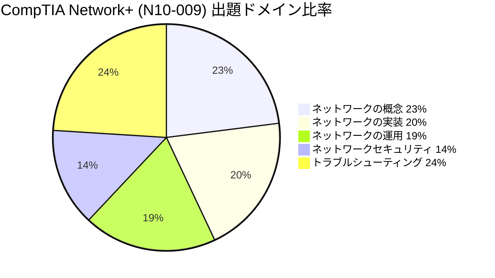
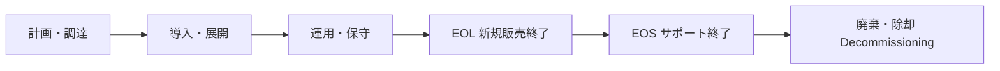
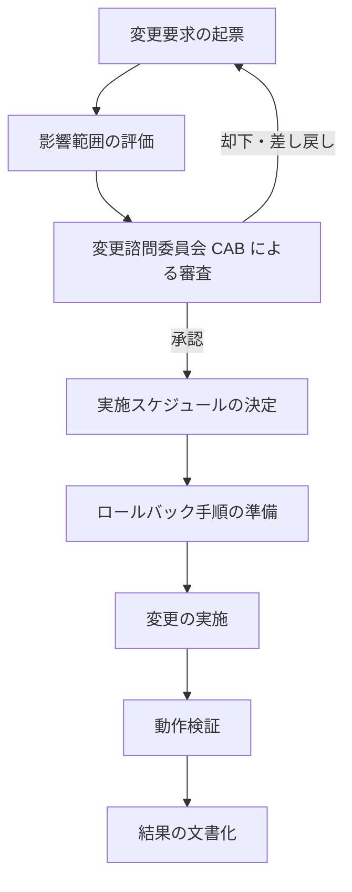
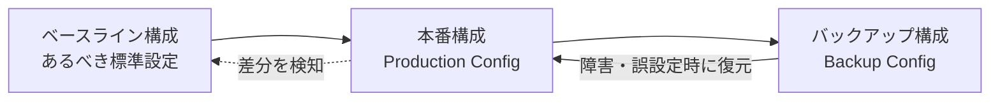
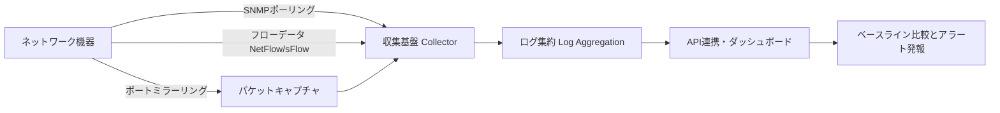
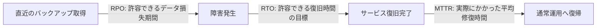
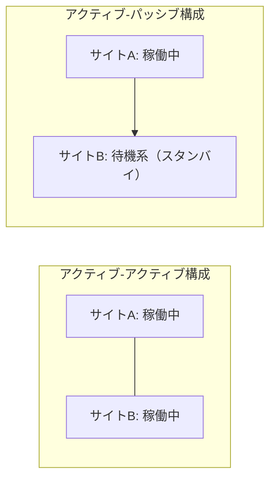
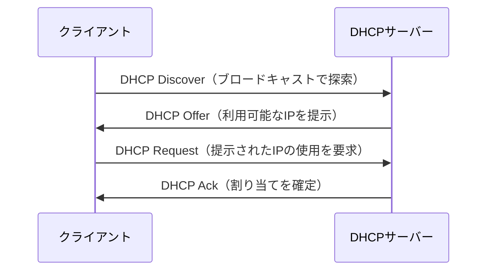
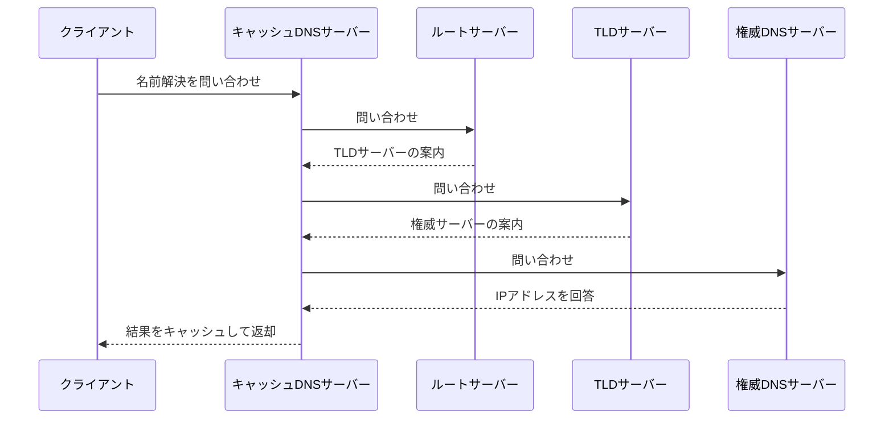
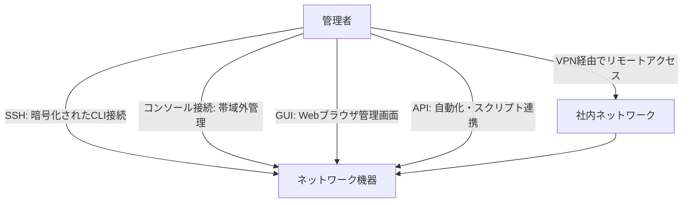

# CompTIA Network+ (N10-009)「ネットワークの運用」徹底解説ガイド

> 対象ドメイン: **Domain 3.0 Network Operations（ネットワークの運用）** / 出題比率 **19%**
> 対象読者: CompTIA Network+ 初学者、ネットワーク運用・NOC・システム管理者を目指す方

---

## この記事の使い方

このガイドは、CompTIA Network+（V9 / 試験コード N10-009）の5つの出題ドメインのうち、「Network Operations（ネットワークの運用）」を初学者でも迷わず理解できるように、以下の流れで解説します。

1. 試験全体の中での位置づけを確認する
2. サブトピックを8つに分解する
3. 各サブトピックを「概要 → 図解 → 試験で問われやすいポイント」の順で学ぶ

各セクションの図はすべて **Mermaid** で描画しており、テキストベースの箱線図（ASCIIアート）は使用していません。表とMermaid図だけで視覚的に理解できる構成にしています。

---

## 1. CompTIA Network+ 試験の全体像

### 1-1. 試験の基本情報

| 項目 | 内容 |
|---|---|
| 試験バージョン | V9 |
| 試験コード | N10-009 |
| リリース日 | 2024年6月20日 |
| 出題数 | 最大90問（多肢選択式 ＋ パフォーマンスベース問題 PBQ） |
| 試験時間 | 90分 |
| 合格スコア | 720（100〜900点満点） |
| 出題言語 | 英語、ドイツ語、日本語、ポルトガル語、スペイン語 |
| 推奨事前知識 | CompTIA A+、または9〜12か月程度のネットワーク運用実務経験 |

### 1-2. 出題ドメインと比率

Network+ は5つのドメインで構成されており、「ネットワークの運用」はそのうちの1つです。

| ドメイン | 比率 | 主な内容 |
|---|---|---|
| 1.0 ネットワークの概念 | 23% | OSI参照モデル、IPアドレッシング、トポロジーなど |
| 2.0 ネットワークの実装 | 20% | ルーティング／スイッチング、無線設計など |
| **3.0 ネットワークの運用** | **19%** | **ドキュメント化、監視、変更管理、災害復旧など（本ガイドの範囲）** |
| 4.0 ネットワークセキュリティ | 14% | 認証、暗号化、攻撃手法と対策など |
| 5.0 トラブルシューティング | 24% | 障害切り分け手法、ツール活用など |

---

## 2.「ネットワークの運用」ドメインの全体構成

このドメインは、日々のネットワーク運用業務（NOC業務）そのものを体系化した内容です。大きく8つのサブトピックに分解できます。

| No. | サブトピック | 一言でいうと |
|---|---|---|
| 1 | ドキュメンテーション | ネットワークの「地図」と「台帳」を整備する |
| 2 | ライフサイクル管理 | 機器・ソフトウェアの寿命を管理する |
| 3 | 変更管理 | 変更作業を安全に承認・実施する仕組み |
| 4 | 構成管理 | 設定情報を正しい状態に保つ |
| 5 | ネットワーク監視 | 異常を早期に検知する |
| 6 | 災害復旧 | 障害・災害から事業を復旧させる計画 |
| 7 | ネットワークサービス | DHCP・DNS・時刻同期などの基盤サービス |
| 8 | アクセスと管理 | 機器へ安全にログインし管理する手段 |

それでは、1つずつ順番に見ていきましょう。

---

## 3. ドキュメンテーション（Documentation）

### 概要

ネットワークは「今どうなっているか」を正確に記録していないと、障害対応も変更作業もできません。ドキュメンテーションは運用の土台です。

| 種類 | 説明 | 具体例 |
|---|---|---|
| 物理図（Physical Diagram） | 実際の配線・機器の配置を示す図 | フロアマップ上のケーブル配線 |
| 論理図（Logical Diagram） | IPアドレスやVLANなど論理構成を示す図 | ネットワークトポロジー図 |
| ラック図（Rack Diagram） | サーバールーム内の機器の搭載位置 | ラックの何U目に何の機器があるか |
| ケーブルマップ（Cable Map） | ケーブル1本ごとの接続元・接続先 | パッチパネルとポートの対応表 |
| 資産管理台帳（Asset Inventory） | 機器の型番・シリアル番号・保守期限などの一覧 | 資産管理システムの台帳 |
| IPAM（IP Address Management） | IPアドレスの割り当て状況を一元管理する仕組み | どのサブネットが空いているかの把握 |
| SLA（Service Level Agreement） | サービス提供者と利用者間で合意した稼働率などの基準 | 「稼働率99.9%を保証」といった契約 |
| 無線サイトサーベイ（Wireless Site Survey） | 電波状況を調査し、APの最適配置を決める調査 | 建物内の電波干渉・カバレッジ確認 |

### 試験で問われやすいポイント

- 「物理図」と「論理図」の違い（配線そのもの か、IP/VLANなどの論理構成か）を混同しないこと
- IPAMは「今どのIPが使われているか」を管理する仕組みであり、DHCPそのものではない点

---

## 4. ライフサイクル管理（Life-Cycle Management）

### 概要

機器やソフトウェアには「寿命」があります。これを計画的に管理しないと、セキュリティリスクや突然の故障につながります。

| 用語 | 正式名称 | 意味 |
|---|---|---|
| EOL | End-of-Life | メーカーが新規販売・製造を終了する時点 |
| EOS | End-of-Support | メーカーが保守・パッチ提供を終了する時点 |
| 除却（Decommissioning） | - | 機器を安全にデータ消去のうえ運用から外すこと |

### 試験で問われやすいポイント

- EOLは「販売終了」、EOSは「サポート終了」であり、EOSの方が後に来る（＝EOSを過ぎると脆弱性が放置されるリスクが高い）
- 除却時はデータの完全消去（サニタイズ）が求められる

---

## 5. 変更管理（Change Management）

### 概要

「思いつきで設定を変える」ことは障害の最大要因の一つです。変更管理は、変更を安全に評価・承認・実施・記録するためのプロセスです。

| 用語 | 意味 |
|---|---|
| RFC（Request for Change） | 変更要求そのもの |
| CAB（Change Advisory Board） | 変更内容を審査する承認機関 |
| ロールバック計画 | 変更が失敗した場合に元の状態へ戻す手順 |
| メンテナンスウィンドウ | 変更作業を許可された時間帯 |

### 試験で問われやすいポイント

- 変更管理の目的は「変更を止めること」ではなく「リスクを管理しながら変更を進めること」
- ロールバック計画は変更実施前に必ず用意しておく

---

## 6. 構成管理（Configuration Management）

### 概要

「今の設定」「あるべき設定（ベースライン）」「過去の設定（バックアップ）」の3つを常に整合させる考え方です。

| 用語 | 意味 |
|---|---|
| ベースライン構成 | 「正しい状態」として定義された標準設定 |
| 本番構成 | 現在機器で稼働している実際の設定 |
| バックアップ構成 | 定期的に取得した設定の複製 |
| 構成ドリフト | 本番構成がベースラインから徐々にずれていく現象 |

### 試験で問われやすいポイント

- ベースラインとの差分（ドリフト）を定期的にチェックする重要性
- バックアップ構成は「戻すため」、ベースラインは「あるべき姿を定義するため」という役割の違い

---

## 7. ネットワーク監視（Network Monitoring）

### 概要

異常を「起きてから気づく」のではなく「起きる前後にすぐ検知する」ための仕組みです。

| 用語 | 説明 |
|---|---|
| SNMP（Simple Network Management Protocol） | 機器の状態情報を取得・監視する標準プロトコル |
| フローデータ（NetFlow / sFlow） | 通信のトラフィック傾向（誰が・どこと・どれだけ通信したか）を記録するデータ |
| パケットキャプチャ | 通信内容そのものを取得して詳細分析する手法 |
| ポートミラーリング | スイッチの特定ポートの通信を別ポートへ複製し監視すること |
| ベースラインメトリクス | 「平常時の状態」を数値化した基準値 |
| ログ集約 | 複数機器のログを一元的に収集・保管すること |

### 試験で問われやすいポイント

- SNMPは「機器の状態値」、フローデータは「通信の傾向」、パケットキャプチャは「通信の中身」を見るという役割の違い
- 異常検知には「平常時のベースライン」との比較が前提になる

---

## 8. 災害復旧（Disaster Recovery）

### 概要

障害や災害が起きた際に、どれだけのデータ損失・停止時間まで許容できるかを事前に定義し、復旧手段を準備しておく考え方です。

| 用語 | 正式名称 | 意味 |
|---|---|---|
| RPO | Recovery Point Objective | どの時点のデータまで復元できればよいかという目標値（許容できるデータ損失量） |
| RTO | Recovery Time Objective | 障害発生からどれだけの時間で復旧すべきかという目標値 |
| MTTR | Mean Time To Repair | 実際の修復にかかる平均時間の実績値 |
| MTBF | Mean Time Between Failures | 故障と故障の間隔の平均値（機器の信頼性指標） |

### サイト戦略の比較

| サイト種別 | 復旧速度 | コスト | 特徴 |
|---|---|---|---|
| コールドサイト（Cold Site） | 遅い | 低い | 設備のみで機器・データは未配置 |
| ウォームサイト（Warm Site） | 中程度 | 中程度 | 一部機器やデータを事前配置済み |
| ホットサイト（Hot Site） | 速い | 高い | 本番同等の環境が常時稼働 |

| 方式 | 説明 |
|---|---|
| アクティブ-アクティブ | 複数サイトが同時に稼働し、負荷を分散する方式 |
| アクティブ-パッシブ | 普段は片方のみ稼働し、障害時にもう一方へ切り替える方式 |

### DR計画のテスト手法

| テスト種別 | 内容 |
|---|---|
| 机上訓練（Tabletop Exercise） | 関係者が集まり手順を口頭で確認する |
| ウォークスルー | 実際の手順書に沿って動作を確認する |
| シミュレーション | 模擬的な障害シナリオで訓練する |
| 並行テスト（Parallel Test） | 本番を止めずにDRサイトも並行稼働させて検証する |
| フル中断テスト（Full Interruption Test） | 本番を実際に停止してDRサイトへ完全切替する |

### 試験で問われやすいポイント

- RPOは「データ」、RTOは「時間」という軸の違いを混同しないこと
- ホットサイトほど復旧は速いがコストも高いというトレードオフ

---

## 9. ネットワークサービス（Network Services）

### 概要

ネットワーク運用の裏側で動いている基盤サービス群です。特にDHCPとDNSの流れは頻出です。

### DHCPの割り当てプロセス（DORA）

### DNS名前解決の流れ

### 時刻同期サービスの比較

| サービス | 正式名称 | 特徴 |
|---|---|---|
| NTP | Network Time Protocol | 一般的な時刻同期プロトコル |
| PTP | Precision Time Protocol | ミリ秒以下の高精度同期が必要な環境向け |
| NTS | Network Time Security | NTPに認証・改ざん防止を加えたセキュア版 |
| SLAAC | Stateless Address Autoconfiguration | IPv6環境でDHCPなしにアドレスを自動生成する仕組み |

### 試験で問われやすいポイント

- DHCPの4ステップ（Discover → Offer → Request → Ack）の順序
- SLAACはIPv6特有の仕組みであり、DHCPv4とは別物であること

---

## 10. アクセスと管理（Access and Management）

### 概要

管理者がネットワーク機器へどのように安全にアクセスするか、という手段の整理です。

| 手段 | 特徴 |
|---|---|
| SSH（Secure Shell） | 暗号化されたコマンドライン接続。Telnetの安全な代替 |
| コンソール接続 | ネットワーク経由に依存しない直接接続（初期設定や障害時に有効） |
| GUI | Webブラウザなどを用いた画面操作型の管理 |
| API | プログラムから自動的に設定・取得を行う手段 |
| VPN | 拠点外から社内ネットワークへ安全にトンネル接続する手段 |

### 試験で問われやすいポイント

- コンソール接続は、ネットワーク経由に依存しないローカル物理アクセス手段（専用管理インターフェースやコンソールサーバーなどの OOB 管理経路を組み合わせて利用可能）である点
- Telnetは平文通信のため非推奨、SSHが標準という位置づけ

---

## 11. まとめ：学習の進め方

| ステップ | やること |
|---|---|
| 1 | 本ガイドの8サブトピックを一通り読み、全体像を掴む |
| 2 | 用語（EOL/EOS、RPO/RTO、DORAなど）を表で整理して暗記する |
| 3 | 各Mermaid図を自分の手で描き直してみる（理解の定着に効果的） |
| 4 | 公式または信頼できる問題集でサブトピックごとに演習する |
| 5 | 弱点分野だけをもう一度、本ガイドの該当セクションに戻って復習する |

「ネットワークの運用」ドメインは、実際のNOC（Network Operations Center）業務やネットワーク管理者・システム管理者の日常業務にそのまま直結する内容です。暗記だけでなく「なぜこの手順が必要なのか」という業務上の意味を意識しながら学習すると定着しやすくなります。

---

## 参考文献・出典

- CompTIA公式 Network+ 認定ページ（試験概要・ドメイン別出題比率・Network Operationsの構成要素の出典）: https://www.comptia.org/en-us/certifications/network/
- CompTIA 認定資格全体の一覧: https://www.comptia.org/en-us/certifications/

> 注記: 出題比率・試験詳細（試験コード、出題数、合格スコアなど）は上記CompTIA公式ページの記載（2026年7月時点）に基づいています。CompTIAは試験内容を定期的に見直すため、受験前に必ず公式ページで最新情報をご確認ください。
