# CompTIA Network+ (N10-009) ステップバイステップガイド

## Domain 1.0: Networking Concepts（出題比率 23%）

---

## この章について

CompTIA Network+ は、企業ネットワークの構築・運用・保守・トラブルシューティングに必要な知識を証明する資格です。試験は5つのドメイン（分野）で構成されており、その中でも **Domain 1.0 Networking Concepts** は出題比率が23%と、Domain 5.0 Network Troubleshooting（24%）に次いで2番目に大きい配点を占めています。

この章は、公式の Exam Objectives（試験目標）に定義された **1.1 〜 1.8** の8つのサブ目標を、そのままステップ1〜8として扱い、初学者でも順を追って理解できるように解説します。ASCIIアートは使わず、図解はすべて Mermaid、比較や一覧はすべて Markdown の表を使用しています。

> 本ガイドは学習用の解説であり、CompTIA の公式教材ではありません。試験直前は必ず公式サイト（末尾の参考文献を参照）で最新情報を確認してください。

### 目次

| ステップ | 対応する公式目標 | 内容 |
| --- | --- | --- |
| ステップ1 | 1.1 | OSI参照モデル |
| ステップ2 | 1.2 | ネットワーク機器・アプリケーション・機能 |
| ステップ3 | 1.3 | クラウドの概念と接続オプション |
| ステップ4 | 1.4 | ポート・プロトコル・トラフィックの種類 |
| ステップ5 | 1.5 | 伝送メディアとトランシーバー |
| ステップ6 | 1.6 | ネットワークトポロジーとアーキテクチャ |
| ステップ7 | 1.7 | IPv4アドレッシング |
| ステップ8 | 1.8 | 進化するネットワーク環境のユースケース |

---

## ステップ1（1.1）: OSI参照モデルを理解する

OSI（Open Systems Interconnection）参照モデルは、ネットワーク通信を7つの層に分解した概念モデルです。実際のプロトコルスタック（TCP/IPモデル）と1対1で対応するわけではありませんが、「どの層で何が起きているか」を整理して考えるための共通言語として、試験でも実務でも頻繁に使われます。

### 1-1. 7つの層

| 層番号 | 層の名前（英語） | 日本語 | 主なPDU（データ単位） | 代表的な例 |
| --- | --- | --- | --- | --- |
| 7 | Application | アプリケーション層 | Data | HTTP, DNS, SMTP |
| 6 | Presentation | プレゼンテーション層 | Data | 暗号化, 文字コード変換, 圧縮 |
| 5 | Session | セッション層 | Data | セッションの確立・維持・終了 |
| 4 | Transport | トランスポート層 | Segment (TCP) / Datagram (UDP) | TCP, UDP |
| 3 | Network | ネットワーク層 | Packet | IP, ルーター |
| 2 | Data Link | データリンク層 | Frame | Ethernet, スイッチ, MACアドレス |
| 1 | Physical | 物理層 | Bit | ケーブル, コネクタ, 電気信号・光信号 |

### 1-2. 層の並び（上位層から下位層へ）

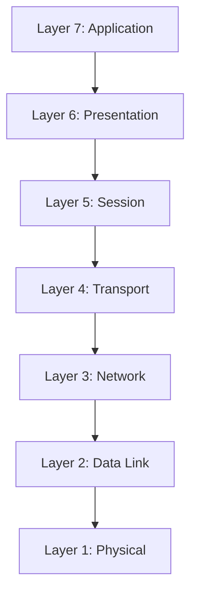

### 1-3. カプセル化と非カプセル化

データを送信するとき、Application層で作られたデータは各層を降りるたびにヘッダー（制御情報）が付加されていきます。これを「カプセル化（encapsulation）」と呼びます。受信側では逆に、各層でヘッダーを取り除きながら上位層へ渡していきます。これが「非カプセル化（de-encapsulation）」です。

```mermaid
flowchart LR
    subgraph Sender["送信側: カプセル化"]
        direction TB
        SA["Application data"] --> SP["+ Presentation"]
        SP --> SS["+ Session"]
        SS --> ST["+ Transport header (segment/datagram)"]
        ST --> SN["+ Network header (packet)"]
        SN --> SD["+ Data Link header/trailer (frame)"]
        SD --> SPh["Physical: bit列"]
    end
    subgraph Receiver["受信側: 非カプセル化"]
        direction TB
        RPh["Physical: bit列を受信"] --> RD["Data Link を処理"]
        RD --> RN["Network を処理"]
        RN --> RT["Transport を処理"]
        RT --> RS["Session を処理"]
        RS --> RP["Presentation を処理"]
        RP --> RA["Application data を受け取る"]
    end
    SPh -->|"ネットワーク経由で伝送"| RPh
```

### 1-4. 学習のポイント

- トラブルシューティングでは「OSIモデルの上から下（またはその逆）に切り分けていく」という考え方（Domain 5.0 で扱う手法）の土台になる。
- スイッチは基本的にLayer 2、ルーターはLayer 3で動作するが、マルチレイヤースイッチのようにLayer 3機能を持つ機器も存在する。
- 「Please Do Not Throw Sausage Pizza Away（Physical, Data Link, Network, Transport, Session, Presentation, Application）」のような語呂合わせで下位層から順に覚えると定着しやすい。

---

## ステップ2（1.2）: ネットワーク機器・アプリケーション・機能

このステップでは、ネットワークを構成する物理/仮想アプライアンス、アプリケーション、機能を整理します。

### 2-1. 物理/仮想アプライアンス

| 機器 | 主に動作するOSI層 | 役割 |
| --- | --- | --- |
| Router（ルーター） | Layer 3 | 異なるネットワーク（サブネット）間でパケットを転送する経路選択装置 |
| Switch（スイッチ） | Layer 2（一部Layer 3対応） | MACアドレスを基に同一ネットワーク内でフレームを転送する |
| Firewall（ファイアウォール） | Layer 3〜7 | 通信ルールに基づき許可/拒否を判断し、ネットワークを保護する |
| IDS/IPS（侵入検知・防御システム） | Layer 3〜7 | 不正な通信パターンを検知（IDS）または遮断（IPS）する |
| Load balancer（ロードバランサー） | Layer 4〜7 | 複数サーバーへ通信を分散し、可用性とスケーラビリティを向上させる |
| Proxy（プロキシ） | Layer 7 | クライアントに代わって外部と通信を仲介し、キャッシュやフィルタリングを行う |
| NAS（Network-Attached Storage） | Layer 7（ファイル単位） | ネットワーク経由でファイル単位のストレージを提供する |
| SAN（Storage Area Network） | 専用ネットワーク | ブロック単位のストレージを高速な専用ネットワークで提供する |
| Wireless Access Point（AP） | Layer 1〜2 | 無線クライアントを有線ネットワークへ接続する |
| Wireless Controller | 管理プレーン | 複数のAPを一元的に構成・管理する |

### 2-2. アプリケーションと機能

| 用語 | 説明 |
| --- | --- |
| CDN（Content Delivery Network） | コンテンツを地理的に分散したサーバーにキャッシュし、利用者に近い場所から配信することで速度と可用性を高める |
| VPN（Virtual Private Network） | 公衆ネットワーク上に暗号化されたトンネルを作り、プライベートな通信を実現する機能 |
| QoS（Quality of Service） | 音声やビデオなど遅延に敏感なトラフィックを優先的に処理する仕組み |
| TTL（Time to Live） | パケットがネットワーク上を巡回し続けないよう、ホップごとに減算されるカウンター（0になると破棄） |

### 2-3. 一般的な配置イメージ

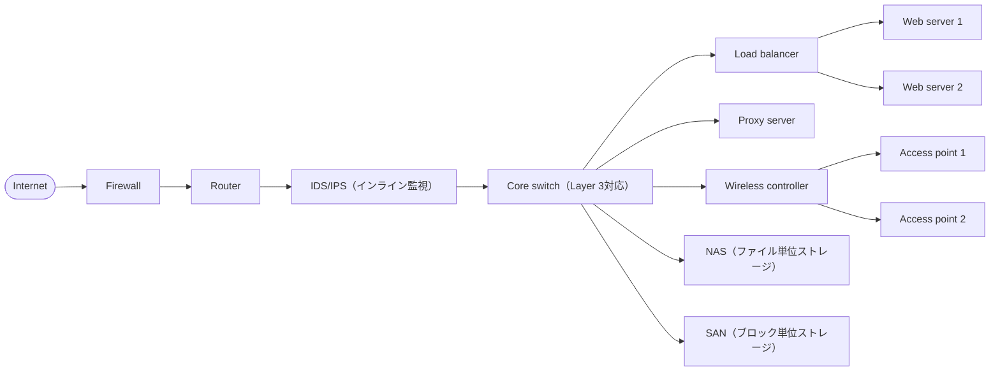

---

## ステップ3（1.3）: クラウドの概念と接続オプション

### 3-1. 基本用語

| 用語 | 説明 |
| --- | --- |
| NFV（Network Functions Virtualization） | ルーターやファイアウォールなどのネットワーク機能をソフトウェアとして仮想化する技術 |
| VPC（Virtual Private Cloud） | パブリッククラウド内に論理的に分離された、専用のプライベートネットワーク空間 |
| Network security group | VPC内のリソース（インスタンス単位など）に適用するステートフルなファイアウォールルール |
| Network security list | サブネット単位で適用される、ステートレスなアクセス制御リスト |
| Internet gateway | VPC内のパブリックサブネットとインターネットを接続するゲートウェイ |
| NAT gateway | プライベートサブネットが送信専用でインターネットにアクセスするためのアドレス変換ゲートウェイ |
| Direct Connect | 公衆インターネットを経由せず、専用線でオンプレミス環境とクラウドを接続するサービス |
| Scalability（スケーラビリティ） | リソースを追加/削除して需要の変化に対応できる能力（計画的な拡張） |
| Elasticity（エラスティシティ） | 需要に応じてリソースを自動的に、かつ迅速に増減できる能力 |
| Multitenancy（マルチテナンシー） | 複数の顧客（テナント）が物理基盤を共有しつつ、論理的に分離された環境を利用する仕組み |

### 3-2. クラウドゲートウェイの構成イメージ

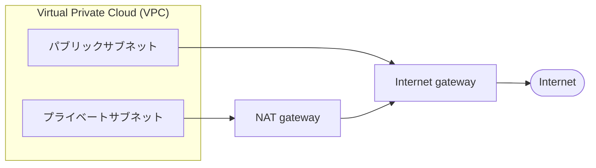

### 3-3. デプロイモデル（Deployment models）

| モデル | 説明 | 主な用途 |
| --- | --- | --- |
| Public（パブリック） | クラウド事業者が複数の顧客に共有基盤を提供 | コスト重視、迅速な立ち上げ |
| Private（プライベート） | 特定の組織専用の基盤（オンプレミスまたは専有クラウド） | 厳格な規制・セキュリティ要件 |
| Hybrid（ハイブリッド） | パブリックとプライベートを組み合わせて利用 | 機密データはプライベート、需要変動はパブリックで吸収 |

### 3-4. サービスモデル（Service models）と責任分界

| レイヤー | IaaS | PaaS | SaaS |
| --- | --- | --- | --- |
| アプリケーション・データ | 利用者が管理 | 利用者が管理 | 提供者が管理 |
| ランタイム・ミドルウェア | 利用者が管理 | 提供者が管理 | 提供者が管理 |
| OS | 利用者が管理 | 提供者が管理 | 提供者が管理 |
| 仮想化・サーバー・ストレージ・ネットワーク | 提供者が管理 | 提供者が管理 | 提供者が管理 |

- **IaaS（Infrastructure as a Service）**: 仮想サーバーやストレージなどインフラ部分のみを提供（例: 仮想マシンのレンタル）。
- **PaaS（Platform as a Service）**: OSやミドルウェアまで提供者が管理し、利用者はアプリケーション開発に集中できる。
- **SaaS（Software as a Service）**: アプリケーションそのものをサービスとして提供し、利用者はブラウザ等から利用するだけでよい。

---

## ステップ4（1.4）: ポート・プロトコル・トラフィックの種類

### 4-1. 主要なプロトコルとポート番号

| プロトコル | ポート番号 | トランスポート | 用途（概要） |
| --- | --- | --- | --- |
| FTP（File Transfer Protocol） | 20 / 21 | TCP | ファイル転送（20:データ, 21:制御）※非暗号化 |
| SFTP（Secure File Transfer Protocol） | 22 | TCP | SSH上で暗号化されたファイル転送 |
| SSH（Secure Shell） | 22 | TCP | 暗号化されたリモートCLIアクセス |
| Telnet | 23 | TCP | 非暗号化のリモートCLIアクセス（レガシー） |
| SMTP（Simple Mail Transfer Protocol） | 25 | TCP | メール送信 |
| DNS（Domain Name System） | 53 | TCP/UDP | ドメイン名の名前解決 |
| DHCP（Dynamic Host Configuration Protocol） | 67 / 68 | UDP | IPアドレスなどの自動配布（67:サーバー, 68:クライアント） |
| TFTP（Trivial File Transfer Protocol） | 69 | UDP | 認証なしの簡易ファイル転送（機器のファームウェア転送など） |
| HTTP（Hypertext Transfer Protocol） | 80 | TCP | 非暗号化のWeb通信 |
| NTP（Network Time Protocol） | 123 | UDP | 時刻同期 |
| SNMP（Simple Network Management Protocol） | 161 / 162 | UDP | 機器の監視・管理（161:問い合わせ, 162:トラップ通知） |
| LDAP（Lightweight Directory Access Protocol） | 389 | TCP | ディレクトリサービスへの問い合わせ |
| HTTPS（HTTP Secure） | 443 | TCP | TLSで暗号化されたWeb通信 |
| SMB（Server Message Block） | 445 | TCP | Windowsのファイル/プリンター共有 |
| Syslog | 514 | UDP | ログメッセージの収集 |
| SMTPS（SMTP Secure） | 587 | TCP | 暗号化されたメール送信（メール投稿用） |
| LDAPS（LDAP over SSL） | 636 | TCP | 暗号化されたディレクトリサービス通信 |
| SQL Server | 1433 | TCP | Microsoft SQL Serverへの接続 |
| RDP（Remote Desktop Protocol） | 3389 | TCP | Windowsのリモートデスクトップ接続 |
| SIP（Session Initiation Protocol） | 5060 / 5061 | TCP/UDP | VoIPの呼制御シグナリング（5061はTLS） |

### 4-2. IPの種類（Internet Protocol types）

| プロトコル | 説明 |
| --- | --- |
| ICMP（Internet Control Message Protocol） | ping や traceroute など、エラー通知・診断に使われる |
| TCP（Transmission Control Protocol） | コネクション指向で信頼性のある通信（再送・順序保証あり） |
| UDP（User Datagram Protocol） | コネクションレスで低遅延な通信（信頼性は上位層に委ねる） |
| GRE（Generic Routing Encapsulation） | 異なるプロトコルのパケットをカプセル化してトンネリングする |
| IPSec（Internet Protocol Security） | AH（Authentication Header）、ESP（Encapsulating Security Payload）、IKE（Internet Key Exchange）を用いてIP通信を暗号化・認証する |

### 4-3. トラフィックの種類

| 種類 | 説明 | 典型的な用途 |
| --- | --- | --- |
| Unicast（ユニキャスト） | 1台の送信元から1台の受信先へ送る通信 | Webアクセスなど一般的な通信 |
| Multicast（マルチキャスト） | 1台の送信元から、参加登録した複数の受信先へ送る通信 | IPTV配信、ルーティングプロトコルの通知 |
| Anycast（エニーキャスト） | 同じアドレスを持つ複数の宛先のうち、最も近い1台が応答する通信 | パブリックDNSサーバー、CDN |
| Broadcast（ブロードキャスト） | 同一ネットワークセグメント内の全ホストへ送る通信 | ARP要求、DHCP要求 |

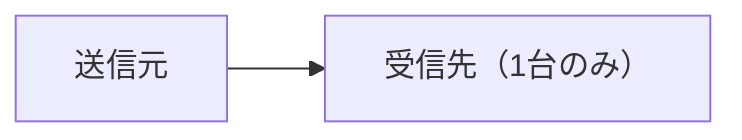
*Unicast: 送信元と受信先が1対1*

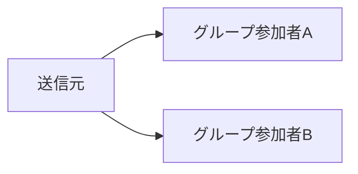
*Multicast: 参加登録した相手だけに届く（1対多だが対象は限定的）*

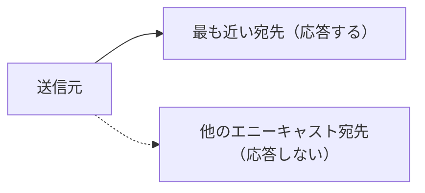
*Anycast: 同じアドレスを持つ複数拠点のうち最も近い1つが応答する*

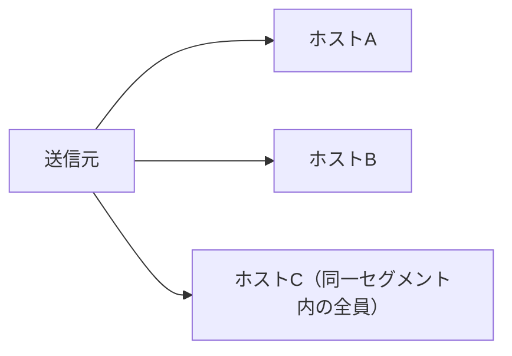
*Broadcast: 同一セグメント上の全ホストへ届く*

---

## ステップ5（1.5）: 伝送メディアとトランシーバー

### 5-1. 無線メディア（Wireless）

| 種類 | 内容 |
| --- | --- |
| 802.11 standards | Wi-Fiの規格群（例: 802.11a/b/g/n/ac/ax など、世代ごとに速度や周波数帯が異なる） |
| Cellular（セルラー） | 4G/5Gなど携帯電話network経由の通信 |
| Satellite（衛星） | 地上インフラが届かない地域での通信手段。レイテンシが比較的大きい |

### 5-2. 有線メディア（Wired）

| 種類 | 内容 |
| --- | --- |
| 802.3 standards | Ethernetの規格群（伝送速度やケーブル種別ごとに規定） |
| Single-mode fiber | コア径が細く、長距離・高速伝送に向く光ファイバー |
| Multimode fiber | コア径が太く、短〜中距離向けで比較的安価な光ファイバー |
| DAC（Direct Attach Copper）cable | 銅線を使った短距離の高速接続ケーブル（Twinaxial cableを含む） |
| Coaxial cable（同軸ケーブル） | 中心導体を絶縁体とシールドで覆った構造。ケーブルテレビ等で使用 |
| Cable speeds（ケーブル速度） | ケーブルやコネクタが対応する伝送速度（規格ごとに異なる） |
| Plenum vs. non-plenum cable | プレナム（空調用の天井裏など）で使用可能な難燃性ケーブルかどうかの区分 |

### 5-3. トランシーバー

| 分類 | 内容 |
| --- | --- |
| Protocol: Ethernet | 一般的なLAN/WAN向けのイーサネット通信を行うトランシーバー |
| Protocol: Fibre Channel（FC） | SANなど、ストレージ専用ネットワークで使われる高速プロトコル |
| Form factor: SFP（Small Form-factor Pluggable） | 小型の着脱式トランシーバーモジュール |
| Form factor: QSFP（Quad Small Form-factor Pluggable） | SFPの4チャネル版で、より高速な伝送に対応 |

### 5-4. コネクタの種類

| コネクタ | 主な用途 |
| --- | --- |
| SC（Subscriber Connector） | 光ファイバー用、プッシュプル式で着脱しやすい |
| LC（Local Connector） | 光ファイバー用、小型で高密度配線に向く |
| ST（Straight Tip） | 光ファイバー用、バヨネット式（回して固定） |
| MPO（Multi-fiber Push On） | 複数の光ファイバー心線を一括で接続する高密度コネクタ |
| RJ11（Registered Jack 11） | 電話回線用の小型コネクタ |
| RJ45（Registered Jack 45） | より対線（UTP/STP）を使ったEthernet用コネクタ |
| F-type | 同軸ケーブル用（ケーブルテレビ・ケーブルインターネットなど） |
| BNC（Bayonet Neill–Concelman） | 同軸ケーブル用、バヨネット式（古いEthernetや映像機器で使用） |

---

## ステップ6（1.6）: ネットワークトポロジーとアーキテクチャ

### 6-1. Mesh（メッシュ）

すべての、または多くのノードが相互に接続される構成。冗長性が高い一方、配線・管理コストが増加する。

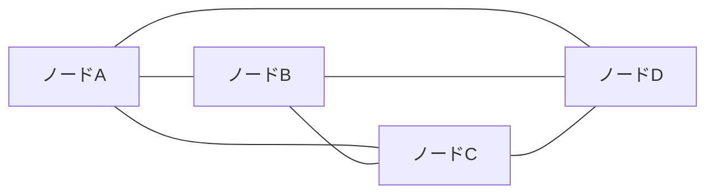

### 6-2. Star / Hub and spoke（スター型）

中心のハブ（スイッチなど）にすべてのノードが接続される構成。管理はしやすいが、中心が単一障害点になりやすい。

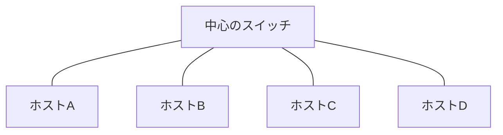

### 6-3. Hybrid（ハイブリッド）

複数のトポロジーを組み合わせた構成。例えば、冗長性の高いメッシュ構成のコアに、管理しやすいスター構成のアクセス層をぶら下げる。

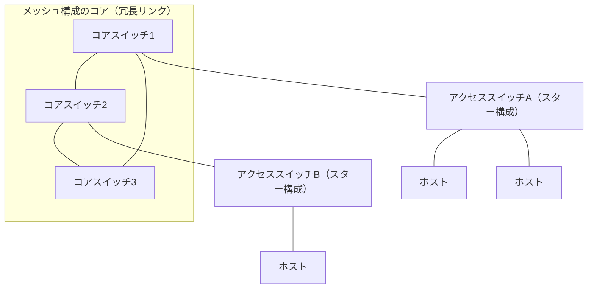

### 6-4. Spine and leaf（スパイン・リーフ）

データセンターでよく使われる構成。すべてのLeafスイッチがすべてのSpineスイッチに接続され、East-Westトラフィック（サーバー間通信）を高速かつ低遅延で処理できる。

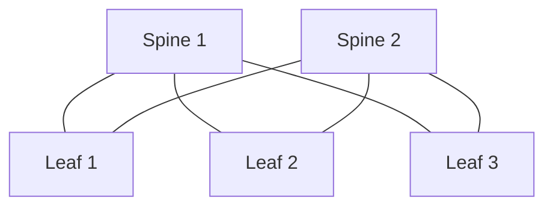

### 6-5. Point to point（ポイントツーポイント）

2つの拠点・機器間を直接1本のリンクで接続する、最もシンプルな構成。

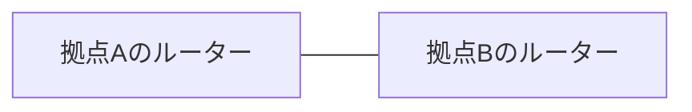

### 6-6. Three-tier hierarchical model（3層階層モデル）

Core（コア）、Distribution（ディストリビューション）、Access（アクセス）の3層で構成される、伝統的なエンタープライズネットワーク設計。

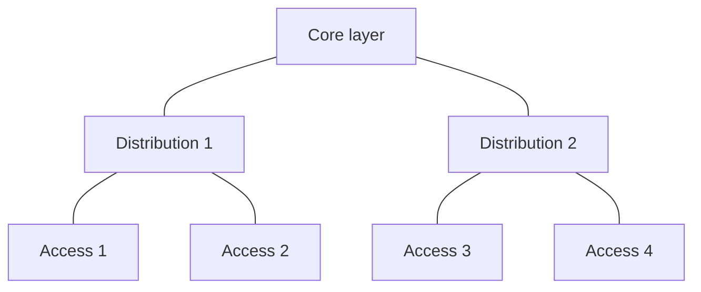

### 6-7. Collapsed core（コラプスドコア）

CoreとDistributionの役割を1つの層に統合し、2層構成にしたもの。小〜中規模のネットワークでコストと複雑さを抑えるために使われる。

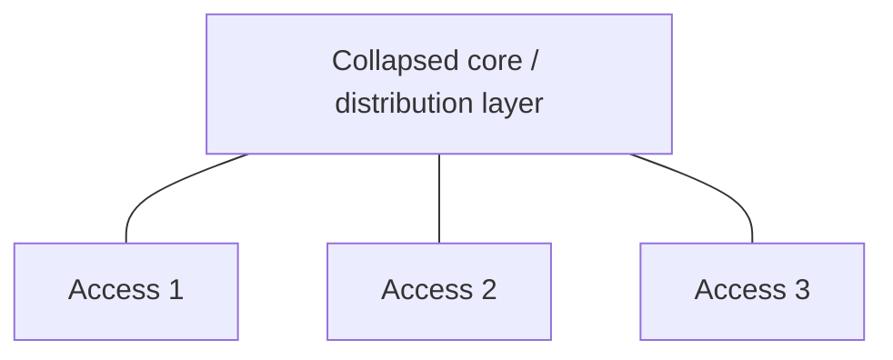

### 6-8. トラフィックフロー: North-South と East-West

- **North-South トラフィック**: データセンターの外部（インターネットやクライアント）と内部の間を流れる通信。
- **East-West トラフィック**: データセンター内部のサーバー間・階層内で流れる通信（例: Spine and leaf構成が最適化する対象）。

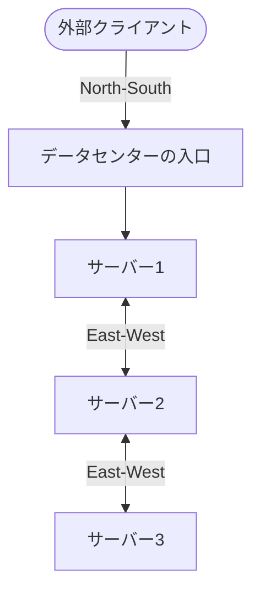

### 6-9. トポロジー比較表

| トポロジー | 冗長性 | 拡張性 | 管理の複雑さ | 代表的な利用場面 |
| --- | --- | --- | --- | --- |
| Mesh | 非常に高い | 低い（配線が急増） | 高い | 重要な基幹ネットワーク |
| Star/Hub and spoke | 低い（中心に依存） | 高い | 低い | 一般的なオフィスLAN |
| Hybrid | 部分ごとに調整可能 | 高い | 中程度 | 大規模企業ネットワーク |
| Spine and leaf | 高い | 非常に高い | 中程度 | データセンター |
| Point to point | なし（単一リンク） | 低い | 非常に低い | 拠点間専用線 |
| Three-tier | 高い | 高い | 高い | 大規模キャンパスネットワーク |
| Collapsed core | 中程度 | 中程度 | 低い | 中小規模ネットワーク |

---

## ステップ7（1.7）: IPv4アドレッシング

### 7-1. パブリックとプライベート

| 区分 | 内容 |
| --- | --- |
| Public IP（パブリックIP） | インターネット上で一意に識別されるアドレス |
| Private IP（プライベートIP） | 組織内など限定された範囲でのみ使われるアドレス（インターネットへは直接ルーティングされない） |
| RFC1918（プライベートアドレス範囲） | 10.0.0.0/8、172.16.0.0/12、192.168.0.0/16 の3つの範囲 |
| APIPA（Automatic Private IP Addressing） | DHCPサーバーが見つからない場合に自動的に割り当てられる 169.254.0.0/16 の範囲 |
| Loopback/localhost | 自分自身を指すアドレス。IPv4では 127.0.0.0/8（通常 127.0.0.1） |

### 7-2. IPv4アドレスクラス

| クラス | 先頭ビットパターン | 範囲（先頭オクテット） | デフォルトマスク | 用途 |
| --- | --- | --- | --- | --- |
| Class A | 0 | 1〜126 | /8（255.0.0.0） | 大規模ネットワーク |
| Class B | 10 | 128〜191 | /16（255.255.0.0） | 中規模ネットワーク |
| Class C | 110 | 192〜223 | /24（255.255.255.0） | 小規模ネットワーク |
| Class D | 1110 | 224〜239 | ― | マルチキャスト専用 |
| Class E | 1111 | 240〜255 | ― | 実験・予約用 |

### 7-3. サブネッティング: VLSMとCIDR

- **CIDR（Classless Inter-domain Routing）**: クラスの概念にとらわれず、「/24」のようなプレフィックス長でネットワーク部とホスト部の境界を柔軟に表現する記法。
- **VLSM（Variable Length Subnet Mask）**: 1つのネットワークを、必要なホスト数に応じて異なるサイズのサブネットに分割する手法。無駄なくアドレス空間を使える。

| CIDR表記 | サブネットマスク | ホストアドレス数（利用可能数） |
| --- | --- | --- |
| /24 | 255.255.255.0 | 254 |
| /25 | 255.255.255.128 | 126 |
| /26 | 255.255.255.192 | 62 |
| /27 | 255.255.255.224 | 30 |
| /28 | 255.255.255.240 | 14 |
| /29 | 255.255.255.248 | 6 |
| /30 | 255.255.255.252 | 2 |

計算式: 利用可能ホスト数 = 2^(32 − プレフィックス長) − 2（ネットワークアドレスとブロードキャストアドレスの2つを除く）

例: /27 の場合 → 2^(32−27) − 2 = 2^5 − 2 = 30

### 7-4. 同一サブネット判定の手順

2台のホストが同じサブネットにいるかどうかを判定する基本的な考え方を、手順として整理します。

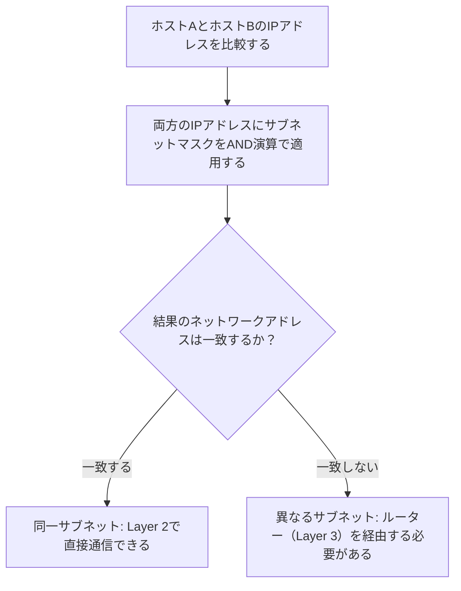

### 7-5. VLSM設計の考え方（例）

1つの 192.168.1.0/24 ネットワークを、必要なホスト数が異なる3つの部門に割り当てる例です。

| 部門 | 必要ホスト数 | 割り当てるCIDR | 割り当て範囲（例） |
| --- | --- | --- | --- |
| 営業部 | 100台 | /25（126台まで） | 192.168.1.0/25 |
| 開発部 | 50台 | /26（62台まで） | 192.168.1.128/26 |
| 管理部 | 20台 | /27（30台まで） | 192.168.1.192/27 |

必要な台数に近いサイズのサブネットを選ぶことで、アドレスの無駄遣いを防げるのがVLSMの考え方です。

---

## ステップ8（1.8）: 進化するネットワーク環境のユースケース

近年のネットワークは、ソフトウェアによる自動化・仮想化・セキュリティモデルの変化を強く受けています。ここではその代表的な概念を扱います。

### 8-1. SDN（Software-defined Network）とSD-WAN

SDNは、従来ネットワーク機器に分散していた「制御プレーン（どこに転送するか判断する部分）」を中央のコントローラーに集約し、「データプレーン（実際にパケットを転送する部分）」と分離する考え方です。SD-WANはこの考え方を、拠点間をつなぐWAN回線に適用したものです。

| 特性 | 内容 |
| --- | --- |
| Application aware | アプリケーションの種類を認識し、経路や優先度を最適化できる |
| Zero-touch provisioning | 機器を現地で手動設定せずに、自動でネットワークへ組み込める |
| Transport agnostic | 回線の種類（MPLS、broadband、LTEなど）を問わず利用できる |
| Central policy management | ポリシーを一元管理し、全拠点へ一括配布できる |

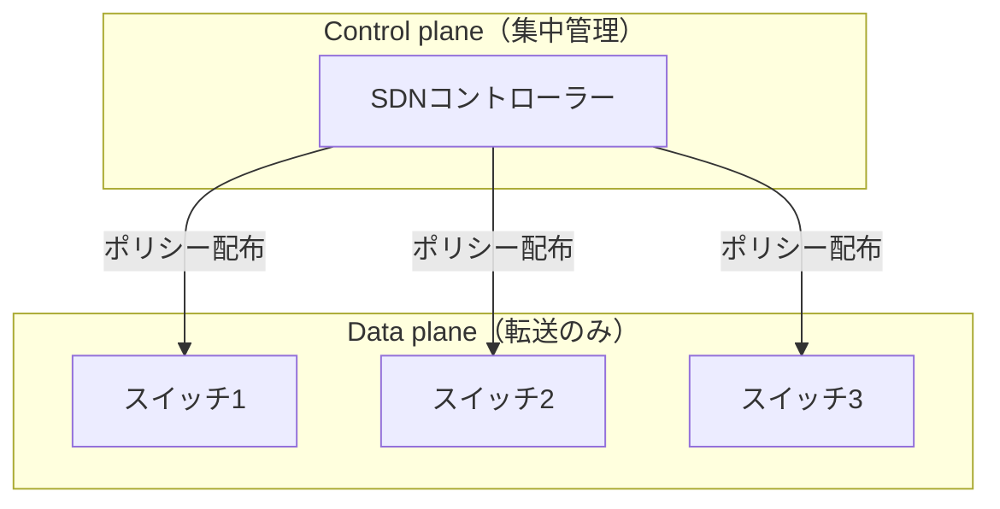

### 8-2. VXLAN（Virtual Extensible LAN）

VXLANは、Layer 2のフレームをLayer 3のUDPパケットでカプセル化し、離れたデータセンター同士でも同一のLayer 2セグメントを拡張できるようにする技術です。データセンター間接続（DCI: Data Center Interconnect）でよく使われます。

### 8-3. Zero Trust Architecture（ZTA）

「社内ネットワークだから安全」という前提を置かず、すべてのアクセスをその都度検証する考え方です。

| 原則 | 内容 |
| --- | --- |
| Policy-based authentication | 状況（誰が、どこから、どの端末で）に応じたポリシーで認証する |
| Authorization | 認証後も、そのリソースへのアクセスを許可するか個別に判断する |
| Least privilege access | 必要最小限の権限のみを付与する |

### 8-4. SASE（Secure Access Service Edge）/ SSE（Security Service Edge）

SASEは、SD-WANのようなネットワーク機能と、ファイアウォールやゼロトラストアクセスなどのセキュリティ機能をクラウド上で統合して提供するアーキテクチャです。SSEはそのうちセキュリティ機能部分に焦点を当てた概念です。

### 8-5. IaC（Infrastructure as Code）

ネットワーク機器の構成を、手作業ではなくコード（Playbook/Templateなど）として管理し、自動化・再現性・変更履歴の追跡を実現する考え方です。

| 分類 | 内容 |
| --- | --- |
| Automation（自動化） | Playbooks/templates/reusable tasks、構成ドリフト（Configuration drift）の検知とコンプライアンス確認、アップグレードの自動化、動的インベントリ |
| Source control（ソース管理） | バージョン管理、中央リポジトリでの一元管理、変更の競合検出、ブランチによる並行作業 |

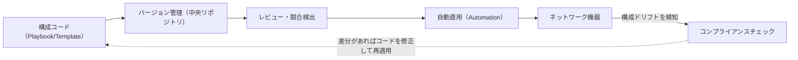

### 8-6. IPv6アドレッシング

IPv4アドレスの枯渇問題（Address exhaustion）を緩和するために設計された、128ビットのアドレス体系です。

| 移行技術 | 内容 |
| --- | --- |
| Tunneling（トンネリング） | IPv6パケットをIPv4ネットワーク上でカプセル化して伝送する |
| Dual stack（デュアルスタック） | 1台の機器がIPv4とIPv6の両方を同時に扱えるようにする |
| NAT64 | IPv6のみのネットワークからIPv4のリソースへアクセスできるようにアドレス変換する |

---

## まとめとポイント整理

| ステップ | 一言でまとめると |
| --- | --- |
| 1.1 OSIモデル | 通信を7層に分解して考える共通言語 |
| 1.2 ネットワーク機器 | 各機器がどのOSI層で何を担当するかを整理する |
| 1.3 クラウド概念 | デプロイモデル・サービスモデル・責任分界の理解が鍵 |
| 1.4 ポート/プロトコル | 代表的なポート番号と、TCP/UDPの違い、トラフィック種類を暗記する |
| 1.5 伝送メディア | 有線/無線、コネクタの種類と用途を対応づける |
| 1.6 トポロジー | 冗長性・拡張性・管理コストのトレードオフで比較する |
| 1.7 IPv4アドレッシング | クラス、プライベート範囲、CIDR/VLSMの計算に慣れる |
| 1.8 進化する環境 | SDN、VXLAN、ゼロトラスト、SASE、IaC、IPv6の概念レベルの理解 |

Networking Conceptsは他の全ドメイン（実装・運用・セキュリティ・トラブルシューティング）の土台になる分野です。特にOSIモデル、ポート番号、IPv4サブネッティングの3つは、他のドメインの問題を解く際にも繰り返し登場するため、優先的に固めておくことをお勧めします。

---

## 参考文献・出典

- CompTIA Network+ (Plus) Certification 公式ページ（試験概要・出題比率・スキル一覧）: https://www.comptia.org/en-us/certifications/network/
- CompTIA Network+ N10-009 Certification Exam: Exam Objectives Version 4.0（公式試験目標PDF、Domain 1.0 Networking Concepts の詳細な内訳の出典）: https://comptiacdn.azureedge.net/webcontent/docs/default-source/exam-objectives/comptia-network-n10-009-exam-objectives-(4-0)-(1).pdf
- CompTIA Blog「The New Network+ (N10-009) Exam: Your Questions Answered」（N10-008からN10-009への変更点）: https://www.comptia.org/en-us/blog/the-new-network-n10-009-exam-your-questions-answered/
