# Designing Data-Intensive Applications (DDIA) 初学者向け完全ガイド

**副題：信頼性・スケーラビリティ・保守性を支えるデータシステム設計の考え方をステップバイステップで学ぶ**

> 本ガイドは、Martin Kleppmann（マーティン・クレップマン）著（第2版からChris Riccomini共著）『Designing Data-Intensive Applications』（O'Reilly Media）の内容をベースに、初学者がゼロから体系的に学べるよう再構成した技術文書です。ASCII図解は使用せず、すべての図解はMermaid、比較表はMarkdownテーブルで表現しています。本文中の情報は2026年8月23日時点のWeb検索結果に基づいており、根拠となる出典URLは末尾の「参考文献」にまとめています。

---

## 目次

1. [DDIAとは何か](#1-ddiaとは何か)
2. [第1版と第2版：何が変わったか](#2-第1版と第2版何が変わったか)
3. [学習の進め方（ステップバイステップ・ロードマップ）](#3-学習の進め方ステップバイステップロードマップ)
4. [区分1：データシステムの基礎](#4-区分1データシステムの基礎)
5. [区分2：データの保存と検索](#5-区分2データの保存と検索)
6. [区分3：分散データ](#6-区分3分散データ)
7. [区分4：派生データ](#7-区分4派生データ)
8. [区分5：倫理と社会](#8-区分5倫理と社会)
9. [2026年の実務トレンドとDDIAの位置づけ](#9-2026年の実務トレンドとddiaの位置づけ)
10. [ベストプラクティス実践チェックリスト](#10-ベストプラクティス実践チェックリスト)
11. [学習後のネクストステップ](#11-学習後のネクストステップ)
12. [参考文献](#12-参考文献)

---

## 1. DDIAとは何か

**Designing Data-Intensive Applications**（通称「DDIA」、表紙のイノシシから「Wild Boar Book」とも呼ばれる）は、リレーショナルDB・NoSQL・データウェアハウス・メッセージキュー・分散システムなど、データを扱うあらゆるソフトウェアに共通する「原理原則」を1冊にまとめた技術書です。特定の製品の使い方を教えるマニュアルではなく、**なぜそのように設計されているのか**という設計思想と、**それぞれの選択肢がどのようなトレードオフを持つのか**を体系的に解説する点が最大の特徴です。

### 1.1 なぜエンジニアに読まれ続けているのか

初版（2017年）刊行から約10年が経過した今も、システム設計面接の定番教材、バックエンド/インフラエンジニアの必読書として挙げられ続けています。著名な開発者からも高く評価されており、例えば Apache Kafka の創作者であり Confluent 共同創業者の Jay Kreps は、本書が分散システムの理論と実務の間の大きなギャップを橋渡ししてくれる点を高く評価しています（参考文献4）。また Microsoft の CTO である Kevin Scott も、本書はソフトウェアエンジニアの必読書だとコメントしています（参考文献4）。

さらに、Google でデータベース関連の仕事をしていた経験を持ち、後に Amazon Web Services のプリンシパルエンジニアとなった Jaana Dogan も、本書を最も優れたリファレンス書の一冊として挙げています（参考文献4）。

### 1.2 著者について

| 項目 | 内容 |
|---|---|
| Martin Kleppmann | ケンブリッジ大学准教授。分散システムと暗号プロトコルの研究者。かつて LinkedIn や Rapportive で大規模データ基盤に従事。ローカルファースト・ソフトウェア運動の立ち上げにも関わる |
| Chris Riccomini（第2版から共著） | PayPal・LinkedIn・WePay で15年以上の経験を持つソフトウェアエンジニア。現在は Materialized View Capital を運営し、インフラ系スタートアップに投資 |

### 1.3 本書の全体像

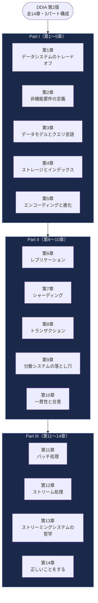

第2版の**公式の目次は3つのパート**で構成されています。Part I が第1〜5章、Part II が第6〜10章、Part III が第11〜14章（倫理を扱う第14章を含む）です。

なお、本ガイドの第4〜8章では、学習の負荷を段階的に上げるために公式のパートをさらに5つの「区分」へ細分化しています。**この5区分は本ガイド独自の再構成であり、書籍のパート番号とは一致しません**。対応関係は次のとおりです。

| 本ガイドの区分 | 該当章 | 書籍第2版の公式パート |
|---|---|---|
| 区分1：データシステムの基礎 | 第1〜2章 | Part I（第1〜5章） |
| 区分2：データの保存と検索 | 第3〜5章 | Part I（第1〜5章） |
| 区分3：分散データ | 第6〜10章 | Part II（第6〜10章） |
| 区分4：派生データ | 第11〜13章 | Part III（第11〜14章） |
| 区分5：倫理と社会 | 第14章 | Part III（第11〜14章） |

**基礎概念 → 単一ノードでのデータ保存 → 複数ノードに分散したデータ → 複数のデータストアをまたぐ派生データ → 技術と社会の関係**という順序で理解が積み上がるため、この順序どおりに学習を進めることが、初学者にとって最も挫折しにくいステップです。

---

## 2. 第1版と第2版：何が変わったか

2026年2月〜3月、約9年ぶりとなる**第2版**が Kleppmann と Riccomini の共著という形で刊行されました。参考文献2のURL（`.../9781491903063/`）は2017年刊行の**第1版**のページであるため、まずは両版の違いを正確に把握しておくことが重要です。

### 2.1 版の比較表

| 項目 | 第1版（2017年） | 第2版（2026年） |
|---|---|---|
| 著者 | Martin Kleppmann（単著） | Martin Kleppmann, Chris Riccomini（共著） |
| 刊行時期 | 2017年3月 | 2026年2月〜3月 |
| 章構成 | 全12章・3パート | 全14章・3パート |
| 想定読者 | 中級〜上級エンジニア | 中級〜上級エンジニア |
| 主な追加テーマ | ― | クラウドネイティブ・オブジェクトストレージ・ベクトル埋め込み・ローカルファースト同期・Durable Execution・AIとデータシステムの倫理章 |
| O'Reillyページ | `9781491903063` | `9781098119058` |

### 2.2 なぜ改訂されたのか

Kleppmann自身は、本書の中心となる「信頼性・スケーラビリティ・保守性」といった原理原則は数年〜数十年単位でしか変化しないため書籍としての鮮度は保たれていたが、**この10年でクラウドサービスの使われ方が根本的に変わった**ことが最大の改訂動機だったと語っています。特に象徴的なのが、ストレージの前提の変化です。第1版執筆時点ではデータベースのノードはローカルディスクにデータを保存し、レプリケーションはアプリケーション層で行うのが一般的なモデルでした。しかし現在は、**オブジェクトストレージ（すでにレプリケートされたリモートサービス）の上にデータベースを構築する**という、まったく新しいトレードオフの選択肢が実用段階に入っています。

共著者の Riccomini は、データベースアーキテクチャの変化として「**コントロールプレーン・データプレーン・コンピュートプレーンの分離**」がこの数年で広く受け入れられた設計パターンになったと指摘しており、これはSaaSとBYOC（Bring Your Own Cloud）の両方に対応する上で柔軟性をもたらしていると説明しています。

### 2.3 章構成の対応表（第1版 → 第2版）

| テーマ | 第1版の該当章 | 第2版の該当章 | 主な変更点 |
|---|---|---|---|
| 基礎 | 1章（信頼性・拡張性・保守性） | 1章＋2章に分割・拡張 | 1章内に「クラウド vs 自己ホスティング」節を追加、1章・2章の内容を再編・拡張 |
| データモデル | 2章 | 3章 | GraphQL・DataFrameを新規追加（Datalog・Property Graphは第1版から存在し、記述を再編・拡張） |
| ストレージ | 3章 | 4章 | ベクトル埋め込み・列指向クエリのベクトル化実行を追加 |
| エンコーディング | 4章 | 5章 | Durable Execution／Workflows・イベント駆動アーキテクチャを追加 |
| レプリケーション | 5章 | 6章 | Sync Engines・ローカルファースト・マルチリージョン運用を追加 |
| パーティショニング | 6章 | 7章（章題を「Sharding」に変更） | マルチテナンシー観点を追加 |
| トランザクション | 7章 | 8章 | 「Exactly-Once Message Processing」を再論 |
| 分散システムの問題 | 8章 | 9章 | 形式手法・ランダム化テストを追加 |
| 一貫性と合意 | 9章 | 10章 | ID生成器・論理クロックの節を新設 |
| バッチ処理 | 10章 | 11章 | オブジェクトストアを主軸に再構成 |
| ストリーム処理 | 11章 | 12章 | 第1版の「Partitioned Logs」「Event Sourcing」は第12章「Log-Based Message Brokers」として整理・改称。「Event Sourcing and CQRS」はデータモデルを扱う第3章へ移動 |
| 未来の展望 | 12章「データシステムの未来」 | 13章「ストリーミングシステムの哲学」に改題 | Unbundling Databasesの議論を継承・発展 |
| 倫理 | 12章の一節「正しいことをする」 | 14章「正しいことをする」（Part III 内で独立章化） | 予測分析・バイアス・プライバシー／トラッキングは第1版12章にも存在。AI時代を踏まえて再編・大幅加筆 |

---

## 3. 学習の進め方（ステップバイステップ・ロードマップ）

初学者がDDIAを最短距離で理解するための推奨ステップです。いきなり全章を通読しようとせず、以下の順番で「概念 → 単一ノード → 分散 → 応用」と段階的に負荷を上げていくことをお勧めします。

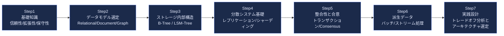

**ベストプラクティス（学習の心構え）**
- 各章を読んだら「自分が今使っているシステムはどの方式か」を必ず言語化する（例：「うちのMySQLはSingle-Leader Replicationで、非同期レプリケーションだからReplication Lagが起きうる」）
- 暗記ではなく**トレードオフの軸**を掴むことを優先する。DDIAに「絶対的な正解」は登場しない
- Kelsey Hightower（Google／CoreOSで著名なインフラエンジニア、『Kubernetes Up and Running』著者）はMonster SCALE Summitで、"他社のスケール事例を真似する前に、自分たちが本当にその規模の問題を抱えているかをまず確認すべきだ"という趣旨の助言をしています。DDIAで学ぶ技術も同様に、**「使えるから使う」ではなく「自分たちの負荷特性に合っているか」で選ぶ**姿勢が重要です

---

## 4. 区分1：データシステムの基礎

### 4.1 第1章：データシステムのトレードオフ

第2版で新設されたこの章は、個々の技術に入る前に「意思決定の軸」を整理するための章です。主なトレードオフは以下の3つです。

| トレードオフの軸 | 選択肢A | 選択肢B |
|---|---|---|
| ワークロードの性質 | OLTP（Operational／日常のトランザクション処理） | OLAP（Analytical／集計・分析処理） |
| ホスティング形態 | クラウドサービス（マネージド） | 自己ホスティング（オンプレミス／セルフマネージド） |
| ノード構成 | 単一ノード（Single-Node） | 分散システム（Distributed） |

- **OLTP vs OLAP**：OLTPは「注文を1件登録する」のような少量データへの高頻度アクセス、OLAPは「先月の売上を地域別に集計する」のような大量データへの低頻度・重いクエリという性質の違いがあります。多くの組織では、OLTP用のデータベース（System of Record＝正データ）から、ETLやCDCによってOLAP用のデータウェアハウス（Derived Data＝派生データ）へデータを流し込む二層構成を取ります。
- **クラウド vs 自己ホスティング**：クラウドサービスは運用負荷を下げる一方でベンダーロックインやコストの予測しづらさというリスクを伴います。近年はクラウドネイティブなアーキテクチャ（コントロール・データ・コンピュートプレーンの分離）が主流になりつつあります。
- **単一ノード vs 分散システム**：分散システムはスケーラビリティと可用性を得られる代わりに、ネットワーク分断・部分障害・整合性の管理という複雑さを引き受けることになります（この複雑さは第9章で詳しく扱われます）。

> **ベストプラクティス**
> - 新しいプロジェクトでは「本当に分散システムが必要か」を最初に問う。単一ノードのPostgreSQLで十分なスケールのプロダクトは非常に多い
> - OLTPとOLAPのワークロードを同じデータベースに混在させると、分析クエリが日常のトランザクション処理の性能を圧迫することがあるため、早い段階で分離戦略（レプリカ、専用DWHなど）を検討する

### 4.2 第2章：非機能要件の定義

「動くこと」だけでなく、**信頼性（Reliability）・スケーラビリティ（Scalability）・保守性（Maintainability）**という3本柱の非機能要件を明確に定義することが、データシステム設計の出発点になります。

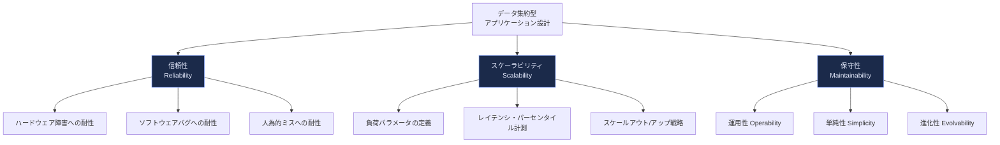

#### 信頼性（Reliability）

「システムが期待通りに動作し続けること」と定義され、以下の障害への耐性で構成されます。

| 障害の種類 | 具体例 | 主な対策 |
|---|---|---|
| ハードウェア障害 | ディスク故障、電源障害 | 冗長化（RAID、レプリケーション） |
| ソフトウェアエラー | バグ、リソースリーク、カスケード障害 | テスト、モニタリング、サーキットブレーカー |
| 人的エラー | 設定ミス、誤ったデプロイ | 設定検証・レビュープロセス、段階的リリース、ロールバック機構 |

#### スケーラビリティ（Scalability）

DDIAの最重要ポイントの一つは「スケーラビリティとは単一の指標ではなく、**負荷パラメータ（Load Parameters）を定義した上で『Xが増えたときにYはどうなるか』を問う概念**」だという考え方です。例えばTwitter/X型のSNSでは「フォロワー数」「投稿頻度」がリクエストレートに直結する負荷パラメータになります。

レスポンスタイムの評価では、平均値ではなく**パーセンタイル（p50・p95・p99）**を使うことが定石とされています。平均値は一部の極端に遅いリクエスト（テールレイテンシ）を隠してしまうためです。

| 指標 | 説明 | 用途 |
|---|---|---|
| p50（中央値） | リクエストの半数がこの時間以内に完了 | 典型的なユーザー体験の把握 |
| p95 / p99 | 上位5%・1%の遅いリクエストの境界値 | SLA設定、遅いリクエストの検知 |
| 平均（Average） | 全体の合計÷件数 | 参考値程度に留める（テールを隠しやすいため非推奨） |

#### 保守性（Maintainability）

保守性は「運用性（日々の運用のしやすさ）」「単純性（複雑さの管理）」「進化性（変更のしやすさ）」の3つに分解されます。第2版ではこの節がより体系的に整理され、**複雑さ（Complexity）をいかに管理するか**が強調されています。

> **ベストプラクティス**
> - スケーラビリティを議論する前に、必ず自分たちの「負荷パラメータ」を明文化する（例：DAU、秒間書き込み数、ホットキーの偏り）
> - レイテンシのSLA/SLOはp99など高いパーセンタイルで設定し、平均値だけで判断しない
> - 「進化性（Evolvability）」を軽視しない。要件は必ず変化するため、スキーマ変更やAPI変更を安全に行える設計（第5章）を早期から意識する

---

## 5. 区分2：データの保存と検索

### 5.1 第3章：データモデルとクエリ言語

データモデルの選択は、アプリケーション開発の初期段階で最も影響の大きい意思決定の一つです。DDIA第2版では、リレーショナル・ドキュメント・グラフの3大モデルに加え、GraphQL、Datalog、DataFrame/行列形式まで議論の幅が広がっています。

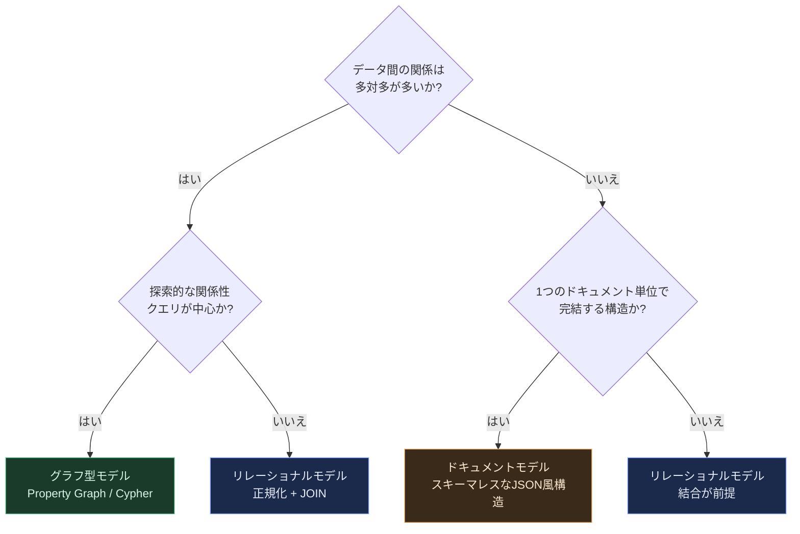

| モデル | 得意な用途 | 代表的なクエリ言語 | 弱点 |
|---|---|---|---|
| リレーショナル | 多対多の関係、複雑な結合、強いスキーマ | SQL | ドキュメント全体の局所性が低い |
| ドキュメント | ツリー構造、局所性の高いデータ、柔軟なスキーマ | JSON操作クエリ | 多対多関係の表現が苦手 |
| グラフ | 高度に相互接続したデータ（SNS、レコメンド） | Cypher、SPARQL、Datalog | 単純な表形式データには過剰 |

> **補足：GraphQLはこの分類には入らない**
> GraphQLはクライアントとサーバー間のAPI向けクエリ言語であり、背後のストレージモデル（リレーショナル／ドキュメント／グラフのいずれでも可）には依存しません。名前に「Graph」を含むためグラフDBのクエリ言語と混同されがちですが、Cypher・SPARQL・Datalogのようなグラフデータモデル向け言語とは層が異なります。

第2版で新たに加わったのは、**GraphQL**（クライアント主導で必要なフィールドを指定してデータを取得するAPI向けクエリ言語。ストレージモデルには依存しない）と、**DataFrame・行列形式**（機械学習・データ分析パイプラインで多用される表現）です。一方、**Datalog**（再帰的なクエリを表現できる宣言的言語）や**Property Graph**、**Event Sourcing**（状態の変更を追記型のイベント列として保存し、そこから現在の状態を再構成する方式）、**CQRS**（書き込みモデルと読み取りモデルを分離する設計パターン）は第1版でも扱われていたテーマであり、第2版では記述の再編・拡張が行われています。Event SourcingとCQRSはそれぞれ独立したパターンであり、単独でも採用できますが、併用されることが多い組み合わせです。

> **ベストプラクティス**
> - 「とりあえずドキュメントDB」「とりあえずリレーショナルDB」という思考停止を避け、データ間の関係の濃さで判断する
> - 多対多の関係が中心になるドメイン（レコメンド、ソーシャルグラフ、不正検知）では早期からグラフモデルを検討する
> - スキーマの柔軟性が欲しいだけであれば、リレーショナルDBのJSONカラム機能で十分なケースも多い

### 5.2 第4章：ストレージとインデックス

「データベースの内部でデータがどう保存されているか」を理解することは、パフォーマンスチューニングやデータベース選定において不可欠です。DDIAはOLTP用途の2大インデックス構造、**B-Tree**と**LSM-Tree（Log-Structured Merge-Tree）**を対比しながら解説します。

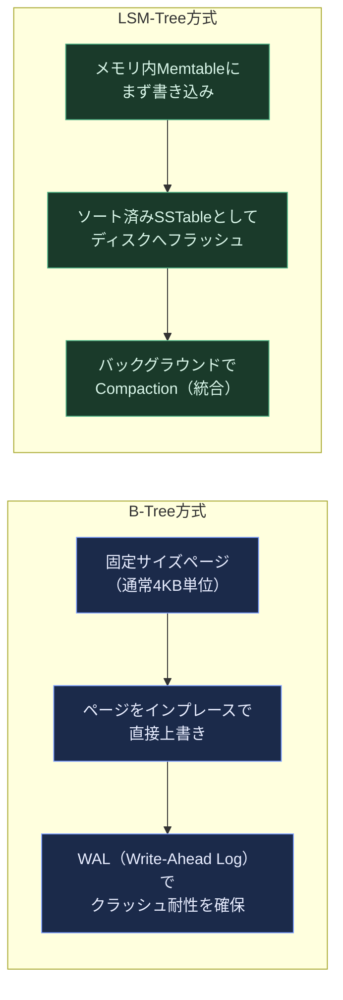

| 観点 | B-Tree | LSM-Tree |
|---|---|---|
| 書き込みパターン | インプレース更新 | 追記型（Append-Only） |
| 書き込みスループット | 中程度 | 高い（順次書き込みが中心） |
| 読み取り性能 | 安定して高速 | Compaction次第で変動しうる |
| 代表的な採用例 | 多くのRDBMS（MySQL/InnoDB、PostgreSQL） | Cassandra、RocksDB、LevelDB |
| 空間効率 | 断片化しやすい | Compactionで最適化されるが一時的に肥大化 |

分析（OLAP）用途に特化した**列指向ストレージ（Column-Oriented Storage）**と**マテリアライズドビュー・データキューブ**は第1版から扱われていたテーマで、第2版では記述が再編・拡張されています。一方、**クエリのコンパイル**、**ベクトル化実行**、生成AI時代を反映した**ベクトル埋め込み（Vector Embeddings）**、**全文検索**は第2版で新たに追加されたテーマです。ベクトル埋め込みはRAG（検索拡張生成）アプリケーションの基盤技術として、近年のデータベース設計で無視できないテーマになっています。

> **ベストプラクティス**
> - 書き込みが多いワークロード（ログ集約、時系列データ、IoT）ではLSM-Tree系のストレージエンジンを検討する
> - 読み取りが多く更新頻度が低いワークロードにはB-Tree系のRDBMSが安定した選択肢になりやすい
> - 分析用途を混在させる場合は、行指向（OLTP）と列指向（OLAP）を最初から分離する設計を検討する

### 5.3 第5章：エンコーディングとスキーマの進化

データをネットワークやディスクへ送る際には、メモリ上のオブジェクトを別の形式に変換（エンコード）する必要があります。この章は「**スキーマが時間とともに変化しても、新旧のコードが互いに読み書きできる**（後方互換性・前方互換性）」ことの重要性を扱います。

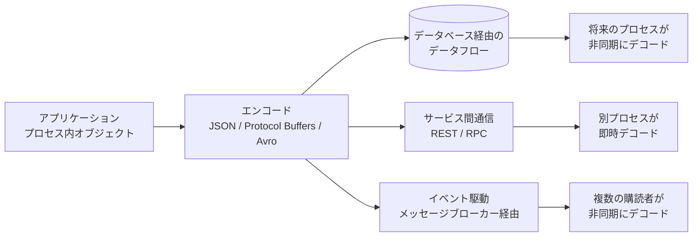

| フォーマット | 特徴 | スキーマ | 主な用途 |
|---|---|---|---|
| JSON / XML | 人間が読みやすい、テキストベース | 任意（緩い） | Web API、設定ファイル |
| Protocol Buffers | バイナリ、コンパクト、コード生成前提 | 必須（IDLで定義） | gRPC、内部サービス間通信 |
| Avro | バイナリ、スキーマをデータと分離管理 | 必須（動的にも対応） | Kafkaなどのストリーミング基盤 |

第2版では新たに、長時間にわたる処理を安全に継続実行するための**Durable Execution とワークフロー**、そして**イベント駆動アーキテクチャ（Event-Driven Architecture）**の節が追加され、マイクロサービス時代の非同期処理設計により踏み込んだ内容になっています。

> **ベストプラクティス**
> - APIやイベントスキーマを変更する際は「フィールドの追加は基本的に安全、削除・型変更は要注意」という後方/前方互換性の原則を徹底する
> - スキーマを持たないJSONに頼りきるのではなく、Protocol BuffersやAvroのような明示的スキーマ管理ツールを社内標準にすると事故が減る
> - サービス間の結合度が高くなりすぎないよう、同期RPCと非同期イベントを適材適所で使い分ける

---

## 6. 区分3：分散データ

ここからが本書の核心部分です。「1台のマシンに収まらないデータをどう扱うか」という問いに、レプリケーション・シャーディング・トランザクション・分散システムの落とし穴・一貫性と合意という5つの章で答えていきます。

### 6.1 第6章：レプリケーション

同じデータを複数のノードにコピーして保持する仕組みで、可用性の向上・読み取り負荷の分散・低レイテンシアクセスを目的とします。方式は大きく3つに分類されます。

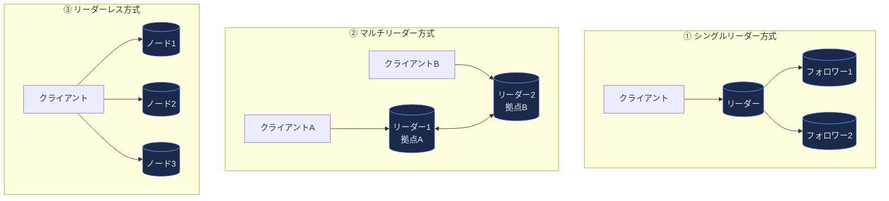

| 方式 | 書き込み経路 | 長所 | 短所 | 代表例 |
|---|---|---|---|---|
| シングルリーダー | すべての書き込みが1つのリーダーを経由 | 実装がシンプル、整合性を保ちやすい | リーダー障害時の切替コスト、地理的に遠いと書き込みが遅い | MySQL、PostgreSQLの標準レプリケーション |
| マルチリーダー | 複数の拠点それぞれにリーダーを配置 | 拠点ごとに低レイテンシ書き込みが可能 | 書き込み競合（Conflict）の解決が必要 | 複数リージョンにまたがるDB、オフライン対応アプリ |
| リーダーレス | どのノードにも書き込み可能、読み書きクォーラム（w + r > n）で読み取りの鮮度を調整 | 単一障害点がなく、一部ノードが落ちても読み書きを継続しやすい（実際の可用性・耐障害性はレプリケーション係数、読み取り／書き込みクォーラムの設定、修復と競合解決の実装に依存する） | レプリカ間の差分を埋める修復の仕組み（Read Repair、アンチエントロピー／ヒンテッドハンドオフ等）と、同時書き込みの競合解決（バージョンベクトル、LWW など）を設計する必要がある | Amazon Dynamo系（Cassandra、Riak） |

同期／非同期レプリケーションの選択も重要な論点です。同期は整合性を保証しやすい一方でレイテンシが増加し、非同期は高速だが**レプリケーションラグ（Replication Lag）**によって「書いた直後に自分の書き込みが読めない」といった不整合が起こり得ます。

第2版で新設された注目トピックが、**Sync Engines とローカルファースト・ソフトウェア**です。これはKleppmann自身の近年の研究テーマでもあり、オフライン中でもローカルで編集を続け、オンライン復帰時に自動的に同期・マージするアプリケーション設計を扱っています。なお「ローカルファースト」は、データの正本をユーザーの手元に置き、サーバーを同期の補助と位置付ける設計原則を指します。FigmaやLinearは**オフライン編集と同期に取り組んだ商用アプリの例**として参考になりますが、いずれもサーバー側に正本を持つアーキテクチャであり、ローカルファーストの定義を満たす実装として扱うべきではありません。

> **ベストプラクティス**
> - 決済や在庫確保のような業務整合性が必須な機能では、**レプリケーション方式の選択と業務ルールの保証を分けて考える**。レプリケーションは「どのノードがいつ最新データを持つか」を決めるだけであり、二重引き落としや在庫のマイナスを防ぐ責務は負わない
> - 業務整合性そのものは、**守りたい不変条件とアクセスパターン**に応じて必要な分離レベル・制約を選ぶ。単一行への条件付き原子更新（`UPDATE stock SET qty = qty - 1 WHERE id = ? AND qty >= 1`）や、在庫キー・オーダーIDへの一意性制約で安全に守れる不変条件なら Read Committed でも成立する。一方、複数行を読んでから判断する Write Skew 型の不変条件（「オンコール担当者を最低1人残す」など）は Snapshot Isolation でも防げないため、直列化可能性（Serializable）や `SELECT ... FOR UPDATE` のような明示的ロックが必要になる。いずれの場合も、操作の冪等性キーによる重複要求の排除を併用する
> - その上で、シングルリーダー構成は「書き込みの順序付け点が1つに定まる」という点で上記の制約・分離レベルを実装しやすく、同期レプリケーションはリーダー障害時のコミット済みデータ喪失を抑えるために選ぶ（＝耐久性の話であって、業務整合性の代用ではない）
> - グローバル分散が前提のアプリでは、書き込み競合の解決戦略（Last-Write-Wins、CRDT、アプリケーションレベルのマージ）を設計段階で決めておく
> - 「自分の書き込みを自分で読む（Read-Your-Writes）」保証が必要な機能があるなら、レプリケーションラグへの対策（書き込み直後は同一ノードから読むなど）を組み込む

### 6.2 第7章：シャーディング（パーティショニング）

1台のノードに収まらない量のデータを複数ノードに分割して保存する手法です。第2版では章題が「Partitioning」から「Sharding」に変更され、マルチテナンシー（複数の顧客・テナントのデータを1つの基盤で扱う設計）の観点が強化されています。

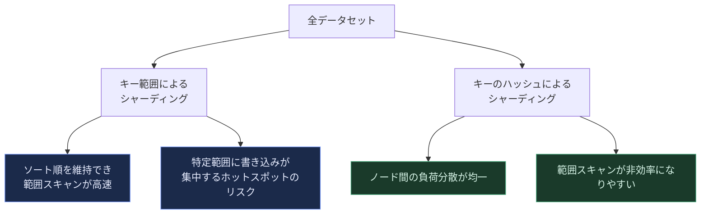

| 観点 | キー範囲シャーディング | ハッシュシャーディング |
|---|---|---|
| 範囲クエリ | 得意（隣接するキーが同じシャードに集まる） | 苦手（キーが分散するため複数シャードへの問い合わせが必要） |
| 負荷分散 | 偏りやすい（ホットスポットのリスク） | 均一になりやすい |
| リバランシング | 手動・自動どちらの運用も一般的 | ハッシュリングによる自動化がしやすい |

セカンダリインデックスの扱いも重要な論点で、**ローカルセカンダリインデックス**（各シャード内で完結、書き込みは速いが読み取り時に全シャードへの問い合わせが必要）と**グローバルセカンダリインデックス**（インデックス自体も別途シャーディング、読み取りは速いが書き込みが複雑）のトレードオフが解説されます。

> **ベストプラクティス**
> - テナントID・ユーザーIDのような自然なパーティションキーがある場合は、それを軸にシャーディングすることでクエリのローカリティを最大化できる
> - リバランシングは「自動化するが、いつ発火するかは運用者がコントロールできる」設計（Automatic but operator-triggered）が事故を減らす定石
> - ホットスポット対策として、キーの先頭にランダムなプレフィックスを付与する「ソルティング」も有効な選択肢の一つ

### 6.3 第8章：トランザクション

トランザクションはアプリケーション開発者が「複雑な障害シナリオを気にせずに済むようにする」ための抽象化です。**ACID**（Atomicity・Consistency・Isolation・Durability）という言葉自体は有名ですが、DDIAはこの言葉が実装によって意味がぶれやすいことを丁寧に解きほぐします。

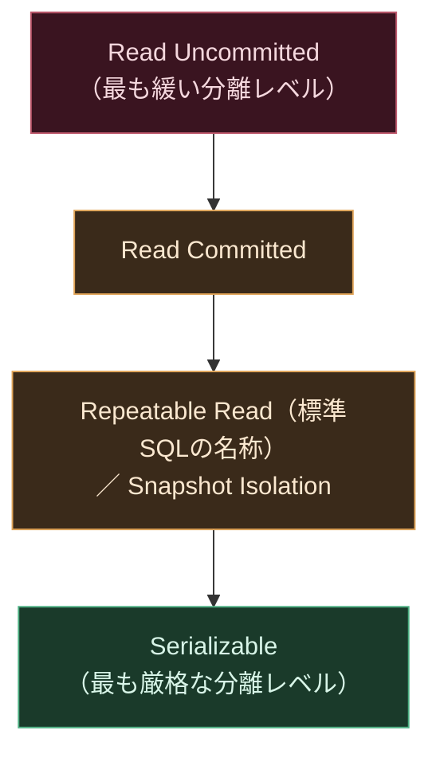

| 分離レベル | 防げる異常 | 防げない異常 | 代表的な実装 |
|---|---|---|---|
| Read Committed | Dirty Read | Non-Repeatable Read、Write Skew | 多くのRDBMSのデフォルト |
| Snapshot Isolation | Non-Repeatable Read、大半のLost Update | Write Skew、一部のPhantom | PostgreSQLの`REPEATABLE READ`はSnapshot Isolationとして実装されている。MySQL(InnoDB)の`REPEATABLE READ`は一貫性読み取りに加えロック読み取り（`SELECT ... FOR UPDATE`など）が最新コミットを見るなど挙動が異なり、Snapshot Isolationと同一視できない |
| Serializable | ほぼ全ての異常（トランザクションを直列実行したのと同じ結果を保証） | なし | Serializable Snapshot Isolation (SSI) など |

上図はあくまで「どの異常を防げるか」という保証の強弱の順序であり、**標準SQLの分離レベル名だけでは実際の保証内容は決まりません**。同じ`READ COMMITTED`や`REPEATABLE READ`でも実装（PostgreSQL、MySQL/InnoDB、Oracle、SQL Serverなど）ごとに防げる異常が異なるため、採用するDBのドキュメントで実際の挙動を確認する必要があります。

ただし Serializable が「異常を防げない」わけではない一方で、無償でもありません。2相ロックのような悲観的実装ではロック競合によりスループットが落ち、SSI のような楽観的実装では競合を検出した時点でトランザクションが**直列化失敗（serialization failure）**としてアボートされます。つまりコストは異常の見逃しではなく、実装コスト・スループット・**アプリケーション側でのリトライ実装**という形で現れます。

特に初学者がつまずきやすいのが**Write Skew**です。2つのトランザクションがそれぞれ異なる行を更新するため一見競合しないように見えても、両者が読んだ前提条件（例：「オンコール担当者が最低1人いること」）が同時に崩れてしまう現象で、Snapshot Isolationだけでは防げません。

分散トランザクションについては、**Two-Phase Commit (2PC)**の仕組みと、それが持つ「コーディネーター障害時にリソースがロックされたまま止まる」という弱点が解説されます。第2版ではメッセージングシステムにおける「Exactly-Once（正確に1回）」処理の実現方法も改めて論じられています。

> **ベストプラクティス**
> - 「トランザクションを使っているから安全」と思い込まず、実際の分離レベルを必ず確認する（多くのDBのデフォルトはSerializableではない）
> - Write Skewが起きうる業務ロジック（在庫の二重予約、シフトの最低人数チェックなど）では、明示的なロック（`SELECT ... FOR UPDATE`）やSerializableレベルの利用を検討する
> - 複数のデータストアをまたぐ分散トランザクションは複雑さとレイテンシのコストが大きいため、可能な限り「1トランザクション=1データストア」に設計を寄せ、それ以外はSagaパターンや冪等なリトライで対応する

### 6.4 第9章：分散システムの落とし穴

分散システムが単一ノードのシステムと決定的に異なるのは、「**部分的な障害（Partial Failure）**」が常態化する点です。この章はネットワーク・クロック・プロセスという3つの観点で、なぜ分散システムの設計が難しいのかを解説します。

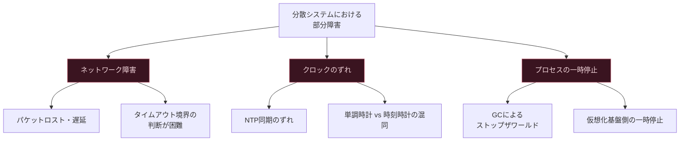

重要な洞察は、「**ノードから応答がないことは、そのノードが停止していることを意味しない**」という点です。ネットワーク遅延なのか、ノードが本当にダウンしているのか、処理が単に遅いだけなのかを外部から区別することは原理的に不可能であり、これが分散システム設計の根本的な難しさになっています。

| 落とし穴の種類 | 具体例 | 設計上の対策 |
|---|---|---|
| ネットワークの非同期性 | メッセージの遅延・順序逆転・重複 | タイムアウト設計、冪等な処理 |
| クロックの不正確さ | NTPドリフト、うるう秒 | 単調時計（Monotonic Clock）を経過時間計測に使う、時刻に依存したロジックを避ける |
| プロセスの一時停止 | GCポーズ、CPUスチール | リースの有効期限をフェンシングトークンで保護する |
| ビザンチン障害 | 悪意あるノード・不正なデータ送信 | 多くの一般的な分散DBでは想定外（信頼された環境が前提） |

> **ベストプラクティス**
> - タイムアウト値は固定値でなく、実測レイテンシの分布（p99等）に基づいて動的・保守的に設定する
> - リーダーのリース（Lease）を用いる設計では、必ず「フェンシングトークン」のような単調増加する識別子で古いリーダーからの書き込みを拒否できるようにする
> - 「起きてほしくないこと」ではなく「起きうること」を前提にリトライ・冪等性・タイムアウトを設計する

### 6.5 第10章：一貫性と合意

分散システムにおける最も理論的に難しいテーマが「一貫性（Consistency）」と「合意（Consensus）」です。

**線形化可能性（Linearizability）**は、分散システムがあたかも単一のコピーしか存在しないかのように振る舞う、**単一オブジェクトに対する強い一貫性（recency）保証**です。ただし「あらゆる意味で最も強い保証」ではなく、複数オブジェクトにまたがるトランザクションの直列化可能性と線形化可能性を合わせた**厳密直列化可能性（Strict Serializability）**のように、さらに強い保証も存在します。また強力である反面、達成のためのコストが大きく、**ネットワーク分断が発生している間は、線形化可能性と（分断された側の）可用性を同時に満たせない**というトレードオフ（いわゆるCAP的な制約）が存在します。分断が起きていない通常時にまで可用性を犠牲にするわけではない点に注意してください。

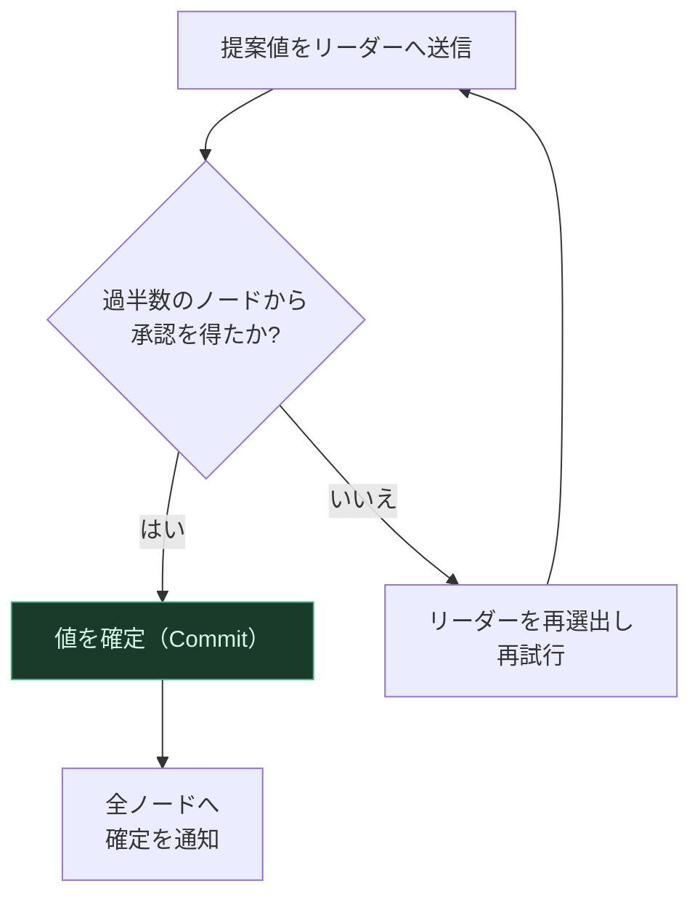

**合意アルゴリズム（Consensus）**は、複数のレプリカが「ある1つの値」または「コマンドの並び」について同じ決定に至り、**互いに矛盾する決定を決して行わない**ことを保証する**耐障害性のあるプリミティブ**です。ここでの中核は安全性（safety）——一度確定した決定が覆らず、ノード間で食い違わないこと——であり、リーダー選出・分散ロック・全順序ブロードキャストなどの基盤になります。代表的な実装にPaxos、Raft、Zabがあり、実務ではこれらを内包したZooKeeperやetcdのような「**コーディネーションサービス**」を直接利用するケースが一般的です。

一方、複数のノードにまたがる書き込みを「全員コミットするか、全員アボートするか」に揃える**2相コミット（2PC）**は、これとは別の抽象化です。2PCは**アトミックコミットプロトコル**であり、コーディネーターが準備フェーズ後に停止すると参加者はロックを握ったまま待ち続ける（**ブロックし得る**）という弱点を持ちます。Consensusはこの点で異なり、**過半数のノードが生存しているだけでなく、それらが互いに（そして必要に応じてクライアントとも）通信できている限り**進行できます。ここで注意したいのは、これが無条件の保証ではないという点です。PaxosやRaftはFLP不可能性を回避するために、障害検出のタイムアウトといったタイミング仮定と、メッセージがいずれ届くというネットワークの活性（liveness）仮定を置いています。ネットワーク分断や極端な遅延が続く間は、ノードが「生きている」だけでは合意は進みません。それでも、コーディネーター1台の停止で無期限にブロックし得る2PCとは対照的に、Consensusは少数派ノードの障害を乗り越えて進行を継続できます。両者は排他的ではなく、コーディネーターの決定ログを合意アルゴリズムで複製して単一障害点を減らす（いわゆる耐障害性のある2PC）という形で**併用される場合があります**。

第2版では新たに、**論理クロック（Logical Clocks）**と、それを応用した**線形化可能なID生成器**という節が追加され、分散システムにおける「順序」の扱いがより実践的に解説されています。

> **ベストプラクティス**
> - 自前でPaxosやRaftを実装しようとせず、ZooKeeper・etcd・Consulのような実績のあるコーディネーションサービスを利用する
> - 「強い一貫性」が本当に必要な操作（リーダー選出、分散ロック、一意なID発行）だけをコーディネーションサービスに任せ、その他の高頻度な処理には持ち込まない
> - 線形化可能性のコストを理解した上で、業務要件が許すなら「結果整合性（Eventual Consistency）」で十分な箇所を切り分ける

---

## 7. 区分4：派生データ

正データ（System of Record）から、検索インデックス・キャッシュ・分析基盤のような「派生データ（Derived Data）」を生成・維持する仕組みを扱う区分です（書籍第2版では Part III に含まれます）。

### 7.1 第11章：バッチ処理

大量データを一括で処理し、その結果を新しいデータセットとして生成するアプローチです。DDIAはUnixのパイプ（`cat file | grep | sort | uniq`のような思想）から始め、それを分散環境に拡張した**MapReduce**、そしてより柔軟な**Dataflowエンジン**（Spark、Flinkのバッチモードなど）へと解説を進めます。

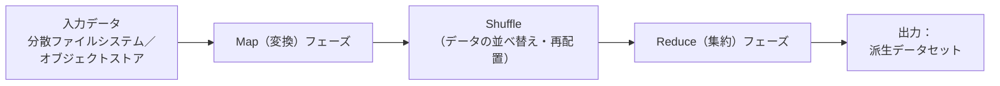

第2版で特筆すべき変更は、分散ファイルシステム（HDFSなど）と並んで**オブジェクトストア（S3、GCSなど）**がバッチ処理基盤の主役として明確に位置づけられたことです。これは本ガイドの「2.2 なぜ改訂されたのか」で紹介した「ストレージがローカルディスクからリモートのオブジェクトストレージへ」という業界全体のシフトを反映しています。

| 処理モデル | 特徴 | 代表例 |
|---|---|---|
| MapReduce | Map/Reduceの2段階、フォールトトレラント、ディスク経由が多い | Hadoop MapReduce |
| Dataflowエンジン | 演算子グラフを最適化して実行、中間結果をメモリ活用しやすい | Apache Spark、Apache Flink（バッチモード） |
| クエリ言語層 | SQLライクな高水準記述からジョブを生成 | Hive、Spark SQL |

> **ベストプラクティス**
> - バッチジョブは「入力データを変更しない（イミュータブル）」設計にすることで、失敗時の再実行や過去データの再処理（Reprocessing）の前提を整える。ただし**入力の不変性だけでは再実行は安全にならない**。リトライで同じ出力が二重に作られないよう、出力を冪等化（決定的なキーでの上書き）・重複排除することが必須条件になる
> - ETL（Extract–Transform–Load）パイプラインの出力は、既存の本番データストアへ直接上書き・追記せず、新しいテーブル／パーティションとして生成してから**アトミックに公開（切り替え）**する。公開前の中間出力は誰からも見えないため、失敗したジョブの部分出力をそのまま破棄でき、再実行時の重複行を防げる
> - メール送信や外部API呼び出しのような取り消せない副作用を伴うジョブでは、冪等キーによる重複排除を出力側に必ず設ける（副作用は「再実行すれば消える」ものではない）

### 7.2 第12章：ストリーム処理

バッチ処理が「一定期間分をまとめて処理する」のに対し、ストリーム処理は「イベントが発生した瞬間に近いタイミングで継続的に処理する」アプローチです。

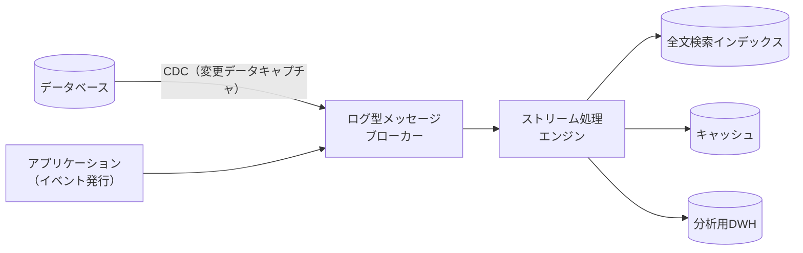

Apache Kafkaに代表される**ログ型メッセージブローカー（Log-Based Message Broker）**は、メッセージを消費後に削除する伝統的なメッセージキューとは異なり、追記型のログとしてイベントを保持します。保持されるのは無期限ではなく、**設定した保持期間（retention.ms）やサイズ上限（retention.bytes）の範囲内**です。この範囲内であれば、複数の消費者が独立して・後からでも過去のイベントを再生できます。逆に言えば、再生したい期間を保持設定が下回っていると古いイベントは失われるため、再処理の要件から保持設定を逆算しておく必要があります。

これとは別の仕組みが**ログコンパクション（log compaction）**です。コンパクションはバックグラウンドで非同期に古いレコードを削除し、少なくともキーごとの最新値を残すことを保証しますが、**イベント履歴全体を保持するものではありません**。したがって「保持期間内なら過去の全イベントを再生できる」性質はコンパクション対象トピックには当てはまらず、得られるのは各キーの最新状態のスナップショットに近いものです（削除を表すtombstoneレコードはさらに別の保持設定に従って削除されます）。時系列の全イベントを再生したい用途と、キー単位の最新状態を保持したい用途は、トピックを分けて設計するのが定石です。

**CDC（Change Data Capture）**は、データベースの変更（INSERT/UPDATE/DELETE）をイベントストリームとして捕捉し、他のデータストアへ反映する仕組みで、正データと派生データを同期させる代表的な手法です。

| 概念 | 説明 |
|---|---|
| ウィンドウ処理 | 一定の時間範囲（タンブリング／スライディングウィンドウ）でイベントを集約する |
| イベント時刻 vs 処理時刻 | イベントが実際に発生した時刻と、システムがそれを処理した時刻のズレをどう扱うかが重要な論点 |
| ストリーム結合（Stream-Stream Join、Stream-Table Join） | 複数のストリームやテーブルを結合する際、状態（State）の保持方法が性能・正確性を左右する |

第2版のインタビューでKleppmannは、ストリーム処理の実務が「行単位のコールバックAPIによる低レベルな実装」と、「SQLクエリを渡すだけでインクリメンタルにビューを維持してくれる高レベルなシステム（Materializeなど）」の二極化に向かいつつあるという見解を示しています。

> **ベストプラクティス**
> - リアルタイム性が本当に必要な機能（不正検知、リアルタイムダッシュボード）にのみストリーム処理を採用し、日次バッチで十分な処理まで無理にストリーム化しない
> - イベント時刻と処理時刻のズレ（Late Arriving Events）を前提に、**Watermark**（「このイベント時刻までのデータは出揃ったとみなす」というイベント時刻の進行シグナル）と、**許容遅延（allowed lateness）**（Watermark 通過後もウィンドウの状態を保持し、遅れて届いたイベントを受け付ける猶予）を、それぞれ独立した設定として設計段階で決めておく
> - CDCを導入する際は、スキーマ変更が下流の消費者を壊さないよう、第5章の互換性原則をあわせて徹底する

### 7.3 第13章：ストリーミングシステムの哲学

第1版の最終章「データシステムの未来」を発展的に改題した章で、複数の特化型データストアを組み合わせて大きなシステムを構築する際の設計思想を扱います。

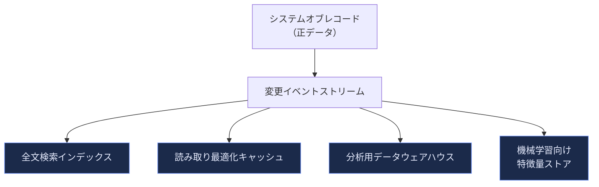

中心的な考え方は「**Unbundling Databases（データベースの分解）**」です。従来1つの製品に統合されていたインデックス作成・キャッシュ・クエリ実行といった機能を、独立したコンポーネントの組み合わせとして再構築し、それらをイベントストリームでつなぐという発想です。あわせて、**End-to-End Argument（両端の原則）**——正確性の保証はシステムの末端（アプリケーション）で行うのが最も確実であり、中間層だけに頼りすぎるべきではないという設計原則——も解説されます。

> **ベストプラクティス**
> - 1つのデータベースにすべての機能（トランザクション・全文検索・分析・キャッシュ）を詰め込もうとせず、CDC/イベントストリームで「正データ→派生データ」の一方向フローを構築する
> - 派生データストア（検索インデックスやキャッシュ）は「正データから再構築できる」設計にしておくと、障害時の復旧やスキーマ変更が大幅に楽になる。ただし再構築が成立するのは、**必要な復旧期間をカバーする履歴・スキーマ・変換ロジック・外部入力を保持している場合に限られる**。たとえばイベントストリームをKafkaで受けている場合、保持期間（retention）やサイズ上限を過ぎたレコード、コンパクション（log compaction）で削除された中間バージョンは失われるため、「全履歴をいつでも再生できる」前提を置かず、**必要な履歴の保持方針（長期保管先・スナップショット・変換ロジックのバージョン管理）を明示的に設計する**

---

## 8. 区分5：倫理と社会

### 8.1 第14章：正しいことをする

倫理を独立した章として立てたのが第2版の構成上の変更点です（章としては Part III の最終章にあたります）。テーマ自体は第1版12章の一節「Doing the Right Thing」で扱われていましたが、AIが意思決定プロセスに深く組み込まれるようになった現状を踏まえて再編・大幅に加筆され、独立章となりました。データシステムの設計者が技術的な正しさだけでなく**倫理的な責任**も負う、という問題意識が軸になっています。

| テーマ | 主な論点 |
|---|---|
| 予測分析とバイアス | 機械学習モデルが既存の社会的バイアスを増幅・固定化するリスク |
| 責任と説明責任 | 自動化された意思決定の結果に誰が責任を持つのか |
| フィードバックループ | 予測が現実に影響を与え、その影響がさらに予測データに反映される自己強化ループ |
| プライバシーとトラッキング | 監視・同意・データの利用目的の透明性 |
| データを資産・権力として捉える視点 | 産業革命期の教訓との比較、法制度と自主規制のバランス |

> **ベストプラクティス**
> - 予測モデルをプロダクトに組み込む前に、フィードバックループによって差別的な結果が固定化されないかをレビューするプロセスを設ける
> - 自動化された意思決定については、判断根拠の記録と異議申し立ての経路をシステム要件として最初から設計に含める

### 8.2 関連する見解：AIエージェントとデータベース（書籍本文外）

> **注記**：以下は第14章の本文ではなく、刊行後のインタビュー（参考文献5・7）で Kleppmann が述べた見解です。書籍の内容と混同しないよう、実務トレンドとして分けて扱います。

Kleppmann は、AIエージェントがデータベースに対して直接操作を行うようになる将来を見据え、「**AIに許可する操作は、あらかじめ明確に定義されたAPI経由に限定し、その操作が満たすべき整合性のルールを明示すべきだ**」という考えを示しています。人間とAIエージェントの双方が同じデータベースを共通の基盤としながら、互いの変更をレビュー・比較・マージできるワークフローの必要性を説いており、これは第6章のマルチリーダーレプリケーションにおける「競合解決」の考え方とも通じる発想です。

> **実務上の示唆（インタビュー由来）**
> - AIエージェントにデータベースへの書き込み権限を与える場合は、汎用的なSQL実行権限ではなく、業務的に意味のある操作に限定したAPIを経由させる

---

## 9. 2026年の実務トレンドとDDIAの位置づけ

DDIA第2版の刊行にあわせて行われたインタビューから、2026年時点で特に注目されているトレンドを整理します。

### 9.1 ストレージのオブジェクトストア化

第1版執筆時点のデータベースは「ノードがローカルディスクにデータを持ち、レプリケーションはアプリケーション層で行う」モデルが標準でした。現在は、**すでにレプリケートされたリモートサービスであるオブジェクトストレージの上にデータベースを構築する**という新しいトレードオフの選択肢が実用化しています。Kleppmannはこれを「一方が優れているわけではなく、新しいトレードオフ空間が生まれた」と評しています。

### 9.2 データベースの「移動可能性」とPostgres拡張エコシステム

Riccominiは、将来成功するデータベースは「ノートPC → サーバー → クラウド → 別のクラウド」へとシームレスに移動・スケールできる必要があるという仮説を提示しています。DuckDBとMotherDuck、組み込み用途に広がるPostgres（PGlite）、SQLiteの組み込み利用の広がりはこの流れを示す事例として挙げられています。

あわせて、PostgreSQLの拡張エコシステム（`pgvector`によるベクトル検索、`pg_search`による全文検索、`pg_duckdb`による分析）が非常に強力になっており、Riccominiは「まずPostgresで拡張機能を使い、本当にスケールやコア機能として必要になった段階で専用ストア（Pinecone、Turbopufferのようなベクトル検索専業サービスなど）に移行する」という段階的な戦略が有望だという分析・仮説を示しています。

### 9.3 コントロール／データ／コンピュートプレーンの分離

クラウドネイティブなデータシステムアーキテクチャの標準パターンとして、**制御を司るコントロールプレーン**・**実データを保持するデータプレーン**・**計算を実行するコンピュートプレーン**を分離する設計が広く採用されるようになりました。この分離により、SaaS型とBYOC（顧客のクラウド環境内で稼働させる形態）の両方に対応しやすくなっています。

### 9.4 ストリーミングとレイテンシ／スループットのトレードオフ

Riccominiは、あらゆるストリーム処理システムが直面する根本的なトレードオフとして「**レイテンシを下げようとするとスループットが犠牲になり、書き込みをバッチ化してスループットを上げようとするとレイテンシが増える**」という関係を挙げています。この基本原則は、ストリーム処理基盤を選定・チューニングする際の判断軸として引き続き有効です。

> **出典**：本節の内容は、ScyllaDBが実施したMartin Kleppmann・Chris Riccominiへのインタビュー記事に基づきます。詳細は参考文献を参照してください。

---

## 10. ベストプラクティス実践チェックリスト

- [ ] 新規プロジェクトで「本当に分散システムが必要か」を最初に検討したか
- [ ] スケーラビリティ要件を「負荷パラメータ」として明文化したか（DAU、秒間書き込み数など）
- [ ] レイテンシSLAをp99などの高パーセンタイルで定義し、平均値だけに頼っていないか
- [ ] データモデル選定時に「多対多の関係の濃さ」を判断基準に含めたか
- [ ] 書き込み中心か読み取り中心かでLSM-Tree系／B-Tree系ストレージエンジンを選び分けたか
- [ ] APIやイベントのスキーマ変更時に後方/前方互換性のルールを守っているか
- [ ] レプリケーション方式（シングルリーダー／マルチリーダー／リーダーレス）を業務要件に基づいて選定したか
- [ ] シャーディングキーの選択がホットスポットを生まないか検証したか
- [ ] トランザクションの実際の分離レベルを確認し、Write Skewのリスクを評価したか
- [ ] タイムアウト・リトライ・冪等性を「部分障害は必ず起きる」前提で設計したか
- [ ] 強い一貫性が必要な操作を、実績あるコーディネーションサービスに限定して任せているか
- [ ] 派生データ（検索インデックス、キャッシュ、DWH）を正データから再構築可能な設計にしているか（必要な復旧期間分の履歴・スキーマ・変換ロジックが保持されているかを含めて確認したか）
- [ ] AIエージェントにデータ操作権限を与える場合、汎用SQL実行ではなく限定APIを経由させているか

---

## 11. 学習後のネクストステップ

DDIAで得た「トレードオフを見極める視点」を、次のような形で実務・学習に接続していくことをお勧めします。

| ステップ | 内容 |
|---|---|
| 1. 自社システムの棚卸し | 使用中のDB/メッセージング基盤がDDIAのどの分類に当てはまるかをマッピングする |
| 2. 障害訓練 | Chaos Engineering的な手法で、第9章の「部分障害」を意図的に発生させ挙動を確認する |
| 3. 専門書への展開 | ストレージ内部をより深く知りたい場合はAlex Petrov著『Database Internals』、分散合意をさらに深く学びたい場合は原論文（Raft、Paxos）へ進む |
| 4. コミュニティ・カンファレンス | Monster SCALE Summit、QConなど、著者本人や実務家の講演を追う |

---

## 12. 参考文献

1. O'Reilly Media「Designing Data-Intensive Applications, 2nd Edition」目次・書誌情報（2026年）
   https://www.oreilly.com/library/view/designing-data-intensive-applications/9781098119058/
2. O'Reilly Media「Designing Data-Intensive Applications」（初版、2017年）
   https://www.oreilly.com/library/view/designing-data-intensive-applications/9781491903063/
3. Martin Kleppmann's website「Designing Data-Intensive Applications, 2nd Edition」出版案内・書評掲載
   https://martin.kleppmann.com/2026/03/24/designing-data-intensive-applications-2e.html
4. dataintensive.net（書籍公式サイト。Jay Kreps・Kevin Scott・Jaana Dogan らの推薦文を掲載）
   https://dataintensive.net/
5. ScyllaDB「Rethinking "Designing Data-Intensive Applications"」— Martin Kleppmann・Chris Riccominiインタビュー
   https://www.scylladb.com/2026/03/26/rethinking-designing-data-intensive-applications/
6. ScyllaDB「Kelsey Hightower's Take on Engineering at Scale」— Monster SCALE Summit講演レポート
   https://www.scylladb.com/2026/02/19/kelsey-hightower-engineering-at-scale/
7. ScyllaDB Tech Talk「Designing Data-Intensive Applications Second Edition」（Kleppmann・Riccomini・Tzach Livyatan）
   https://www.scylladb.com/tech-talk/designing-data-intensive-applications-second-edition/
8. Martin Kleppmann's website（著者プロフィール・出版物一覧）
   https://martin.kleppmann.com/

---

*本ガイドは教育目的の要約・解説であり、書籍本文の引用は最小限（15語未満）に留めています。詳細な内容は必ず原著（第2版）をご参照ください。*
