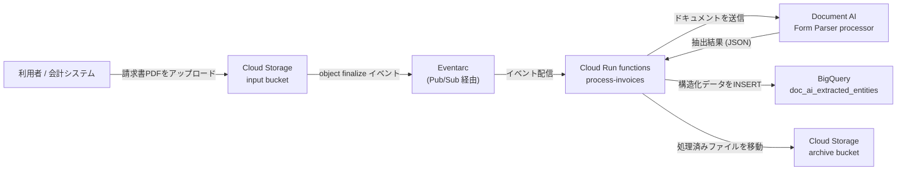
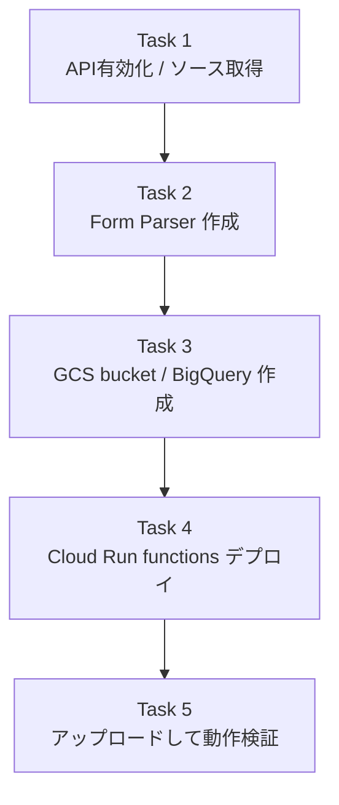
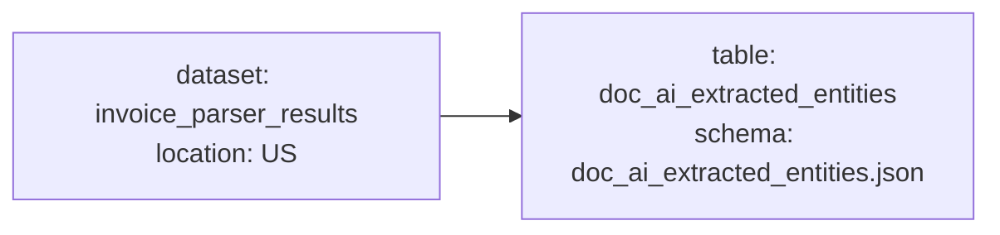
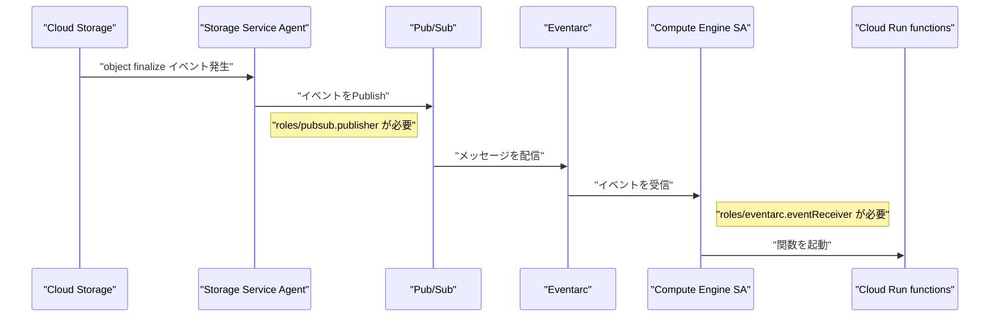
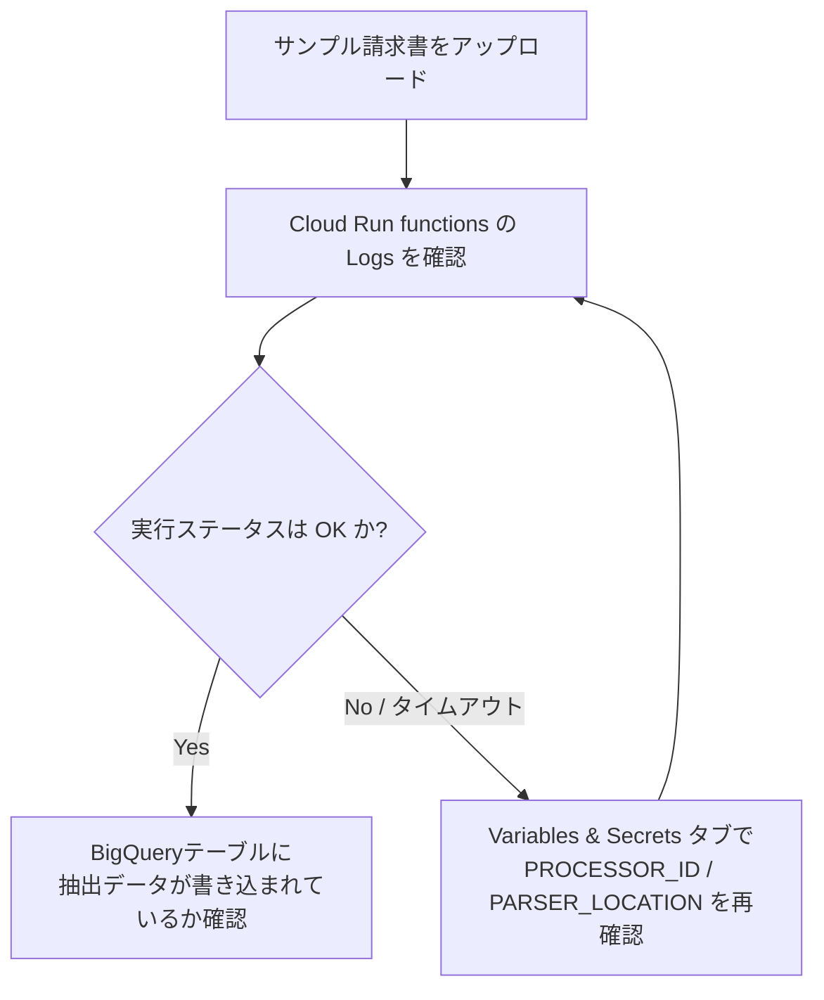

# Document AI Challenge Lab（GSP367）攻略ガイド

― 初学者のためのステップバイステップ ベストプラクティス解説

> 対象ラボ: *Automate Data Capture at Scale with Document AI: Challenge Lab*
> ラボURL: https://www.skills.google/course_templates/674/labs/616166
> このガイドは、ラボの手順を単に「なぞる」のではなく、**なぜそのコマンド・設定が必要なのか**を、Google Cloud のプロダクションベストプラクティスの観点から解説することを目的としています。

---

## 目次

1. [シナリオとゴールを理解する](#1-シナリオとゴールを理解する)
2. [Task 1: Document AI API の有効化とソース取得](#2-task-1-document-ai-api-の有効化とソース取得)
3. [Task 2: Document AI Form Parser プロセッサの作成](#3-task-2-document-ai-form-parser-プロセッサの作成)
4. [Task 3: Cloud Storage と BigQuery リソースの準備](#4-task-3-cloud-storage-と-bigquery-リソースの準備)
5. [Task 4: Cloud Run functions のデプロイと IAM 設計](#5-task-4-cloud-run-functions-のデプロイと-iam-設計)
6. [Task 5: エンドツーエンドのテストと検証](#6-task-5-エンドツーエンドのテストと検証)
7. [ベストプラクティスまとめ](#7-ベストプラクティスまとめ)
8. [よくあるトラブルと対処法](#8-よくあるトラブルと対処法)
9. [参考文献（ソース）](#9-参考文献ソース)

---

## 1. シナリオとゴールを理解する

このラボのシナリオは、インフラ管理企業の財務部門が抱える「請求書などの帳票を人手で検証・承認している」という課題を、**イベント駆動型のサーバーレス パイプライン**で自動化するというものです。

構成要素は次の4つに整理できます。

| コンポーネント | 役割 |
|---|---|
| Cloud Storage（input bucket） | 請求書ファイルのアップロード先。処理のトリガーになる |
| Cloud Run functions（2nd gen） | Storage イベントを受けて起動し、Document AI を呼び出す処理本体 |
| Document AI（Form Parser processor） | 帳票画像/PDFから項目（キー・バリュー）を抽出するAI |
| BigQuery | 抽出結果を構造化データとして永続化する分析基盤 |

これに加えて、処理済みファイルを退避する archive bucket も用意します。全体のデータフローを図で確認しておきましょう。



このガイドでは、上の図を実現するために必要な5つのタスクを、順を追って解説します。全体の作業フローは以下の通りです。



> **ポイント**: チャレンジラボは手順書がないため、公式ドキュメントを読みながら「不足しているパラメータ」を自分で埋める必要があります。以降の各セクションでは、ラボ本文に書かれていない**暗黙の前提**（環境変数の定義など）にも触れていきます。

---

## 2. Task 1: Document AI API の有効化とソース取得

まず Cloud Document AI API を有効化し、Cloud Shell にソースコード一式を取得します。

```bash
mkdir ./document-ai-challenge
gcloud storage cp -r gs://spls/gsp367/* ./document-ai-challenge/
```

このリポジトリには、Cloud Run functions のソースコードと、BigQuery テーブルの JSON スキーマ定義（`scripts/table-schema/doc_ai_extracted_entities.json`）が含まれています。

### ベストプラクティス

- **API有効化はコードでも行える**: コンソールからの有効化だけでなく、`gcloud services enable documentai.googleapis.com` のようにコマンド化しておくと、Terraform や CI/CD パイプラインに組み込みやすくなります。
- **環境変数を先に確定させる**: 後続タスクのコマンド例には `${PROJECT_ID}` や `${REGION}` といった変数が登場しますが、ラボ本文では明示的な定義箇所が省略されがちです。作業前に以下を実行し、変数を固定しておくと事故（意図しないリージョンへのデプロイなど）を防げます。

```bash
export PROJECT_ID=$(gcloud config get-value project)
export PROJECT_NUMBER=$(gcloud projects describe ${PROJECT_ID} --format='value(projectNumber)')
export REGION=us-central1   # プロセッサのPARSER_LOCATION（us）と混同しないよう注意
```

---

## 3. Task 2: Document AI Form Parser プロセッサの作成

### 何をするか

Document AI の **Processor Gallery** から、汎用の **Form Parser**（`FORM_PARSER_PROCESSOR`）を作成します。Form Parser は特定の帳票フォーマットに特化していない汎用処理系で、テキスト・キーバリューペア・テーブルをレイアウトから推論して抽出します[^1][^2]。

| 設定項目 | 値 |
|---|---|
| Processor Type | Form Parser |
| Processor Name | 任意（例: `processor-name`） |
| Region | US |

作成後は、**PROCESSOR ID** と **プロセッサのリージョン（= PARSER LOCATION）** を必ずメモしてください。これらは Task 4 で Cloud Run functions の環境変数として設定します。

### なぜこの処理系を選ぶのか

Document AI には OCR・Form Parser・Layout Parser・各種業種特化パーサー（請求書、給与明細、運転免許証など）が用意されています[^3]。今回のシナリオは「あらゆる種類の帳票」を扱う汎用パイプラインなので、レイアウトから汎用的にキー・バリューを抽出できる Form Parser が適しています。将来的に対象書類が「請求書」に限定されると分かっている場合は、より精度の高い `INVOICE_PROCESSOR` への切り替えを検討するのも一案です。

### ベストプラクティス

- **プロセッサのリージョンはあとから変更できない**: 作成時に `US`（マルチリージョン）を選んだら、そのロケーションが `PARSER_LOCATION` として固定されます。BigQuery データセットのロケーションとリージョンを揃えておくと、後の運用（監査・データレジデンシー対応）がシンプルになります。
- **PROCESSOR_ID と PARSER_LOCATION はSecret Managerで管理する**: 本ラボでは学習のために環境変数へ直接埋め込みますが、本番運用ではプロセッサIDのようなリソース識別子も Secret Manager 経由で注入し、コードリポジトリに残さない設計が推奨されます。

---

## 4. Task 3: Cloud Storage と BigQuery リソースの準備

### 4.1 Cloud Storage バケット

以下の3つのバケットを、**Uniform bucket-level access（均一バケットレベルのアクセス制御）を有効化**した状態で作成します[^4][^5]。

| バケット | 用途 | ストレージクラス | ロケーション |
|---|---|---|---|
| input bucket | 請求書のアップロード先（トリガー） | Standard | REGION |
| output bucket | 処理済みデータの保存先 | Standard | REGION |
| archive bucket | 処理済み原本の退避先 | Standard | REGION |

作成コマンドの例（`gcloud storage` CLI を使用）:

```bash
gcloud storage buckets create gs://${PROJECT_ID}-input-invoices \
  --location=${REGION} \
  --default-storage-class=STANDARD \
  --uniform-bucket-level-access

gcloud storage buckets create gs://${PROJECT_ID}-output-invoices \
  --location=${REGION} \
  --default-storage-class=STANDARD \
  --uniform-bucket-level-access

gcloud storage buckets create gs://${PROJECT_ID}-archive-invoices \
  --location=${REGION} \
  --default-storage-class=STANDARD \
  --uniform-bucket-level-access
```

Uniform bucket-level access を有効にすると、オブジェクトごとの ACL が無効化され、**アクセス制御が IAM に一本化**されます。これにより「誰が・どのバケットにアクセスできるか」の監査が大幅に簡素化されます[^6]。なお、この設定は90日間は無効化できますが、それ以降は恒久的にロックされる点も覚えておきましょう[^6]。

### 4.2 BigQuery データセットとテーブル



| リソース | 名前 | ロケーション |
|---|---|---|
| Dataset | `invoice_parser_results` | US |
| Table | `doc_ai_extracted_entities` | （データセットに従う） |

```bash
bq mk --dataset --location=US ${PROJECT_ID}:invoice_parser_results

bq mk --table \
  ${PROJECT_ID}:invoice_parser_results.doc_ai_extracted_entities \
  ./document-ai-challenge/scripts/table-schema/doc_ai_extracted_entities.json
```

JSON スキーマファイルを使う方式（`bq mk --table`）は、インライン指定と違い **RECORD（STRUCT）型・カラムの description・mode（REQUIRED/NULLABLE/REPEATED）を指定できる**という利点があります[^7][^8]。Document AI の抽出結果はネスト構造になりやすいため、この方式が実務的にも適しています。

### ベストプラクティス

- **バケットのロケーションと BigQuery データセットのロケーションを一致させる**: 今回はどちらも `US`（マルチリージョン）ですが、リージョンをまたぐデータ移動はレイテンシとコストの両面で不利になるため、設計段階で揃えておきます。
- **命名規則を最初に決める**: `${PROJECT_ID}-input-invoices` のようにプロジェクトIDを接頭辞にすることで、グローバルにユニークなバケット名の衝突を避けられます。

---

## 5. Task 4: Cloud Run functions のデプロイと IAM 設計

このタスクが本ラボで最も理解が難しいポイントです。「なぜこれだけの IAM ロールが必要なのか」を、イベント配信の仕組みから逆算して理解しましょう。

### 5.1 イベント配信の裏側（なぜ IAM バインディングが必要か）

Cloud Storage のイベント（オブジェクトのアップロード）を Cloud Run functions（2nd gen）がトリガーとして受け取る仕組みは、**Eventarc** が Cloud Storage の通知を **Pub/Sub** 経由で中継する構成になっています[^9][^10]。そのため、単に関数をデプロイするだけでは不十分で、各サービスエージェント（Google管理のサービスアカウント）に対して個別に権限を付与する必要があります。



この図に対応するのが、ラボで実行する以下の IAM バインディングです。

| 付与先（Principal） | ロール | 目的 |
|---|---|---|
| Compute Engine のデフォルトSA（`${PROJECT_NUMBER}-compute@...`） | `roles/eventarc.eventReceiver` | Eventarc からのイベントを受信し、関数を起動できるようにする[^10][^11] |
| Cloud Storage Service Agent | `roles/pubsub.publisher` | Storage が発生させたイベントを Pub/Sub トピックへ発行できるようにする[^9][^10] |
| Cloud Storage Service Agent | `roles/iam.serviceAccountTokenCreator` | （後述の注意点を参照） |
| Compute Engine のデフォルトSA | `roles/owner` | ラボの学習用途として、Document AI / Storage / BigQuery すべてへのアクセスをまとめて付与 |

> **深掘り**: 公式ドキュメントでは、`roles/iam.serviceAccountTokenCreator` は「2021年4月8日以前に Pub/Sub サービスエージェントを有効化していた場合に限り、**Pub/Sub サービスエージェント**（`service-PROJECT_NUMBER@gcp-sa-pubsub.iam.gserviceaccount.com`）に付与する」ロールとされています。それ以降に作成されたプロジェクトではデフォルトで付与済みのため不要です[^9][^12][^13]。ラボのスクリプトは、このロールを（Pub/Sub サービスエージェントではなく）**Cloud Storage サービスエージェント**に付与しており、これは多くの Qwiklabs / Skills Boost 系ラボで見られる「念のための安全マージン」的な記述です。実運用でこのラボ手順を流用する際は、公式ドキュメントの記載どおりの付与先になっているか、必ず確認してください。

### 5.2 デプロイコマンドの読み解き

```bash
gcloud functions deploy process-invoices \
  --gen2 \
  --region=${REGION} \
  --entry-point=process_invoice \
  --runtime=python313 \
  --service-account=${PROJECT_NUMBER}-compute@developer.gserviceaccount.com \
  --source=./document-ai-challenge/cloud-functions/process-invoices \
  --timeout=400 \
  --set-env-vars="PROJECT_ID=${PROJECT_ID},GCP_PROJECT=${PROJECT_ID},PROCESSOR_ID=<YOUR_PROCESSOR_ID>,PARSER_LOCATION=us,TIMEOUT=400" \
  --trigger-resource=${PROJECT_ID}-input-invoices \
  --trigger-event=google.storage.object.finalize \
  --allow-unauthenticated
```

主要フラグの意味を整理します。

| フラグ | 意味 |
|---|---|
| `--gen2` | Cloud Run functions（第2世代）としてデプロイする。内部的には Cloud Run + Eventarc 上で稼働する[^14] |
| `--entry-point` | ソースコード中のどの関数をエントリーポイントにするか |
| `--runtime=python313` | 実行環境。`python313` は2nd gen専用のランタイムとして提供されている[^15] |
| `--service-account` | 関数の**実行時ID**（ランタイムサービスアカウント）。この節では敢えて Compute Engine のデフォルトSAを流用している[^16] |
| `--timeout=400` | 関数の最大実行時間（秒）。Document AI の同期処理は時間がかかる場合があるため長めに設定 |
| `--set-env-vars` | `PROCESSOR_ID` と `PARSER_LOCATION` を渡すことで、コードから特定のプロセッサを指定できるようにする |
| `--trigger-resource` / `--trigger-event` | Cloud Storage の `object.finalize`（アップロード完了）イベントをトリガーに指定する、互換性維持のための記法 |
| `--allow-unauthenticated` | HTTP経由の未認証呼び出しを許可する |

> **注意**: `--trigger-resource` / `--trigger-event` は歴史的経緯のある指定方法で、Cloud Functions が内部で Eventarc トリガーへ変換してくれます。SDK のバージョンによっては、より明示的な `--trigger-event-filters="type=google.cloud.storage.object.v1.finalized"` 形式が案内されることもあるため、`gcloud functions deploy --help` で手元の SDK が対応しているフラグを確認する習慣をつけましょう[^17]。

デプロイ後、`PROCESSOR_ID` と `PARSER_LOCATION`（**必ず小文字**）を Task 2 で控えた実際の値に更新し、再デプロイします。`PARSER_LOCATION` の大文字小文字はラボで最もつまずきやすいポイントの一つです。

### ベストプラクティス

- **本番運用では `roles/owner` を避ける**: 基本ロール（Owner/Editor/Viewer）はプロジェクト内のほぼ全リソースに対する権限を持つため、最小権限の原則（Principle of Least Privilege）に反します[^18][^19]。本ラボでは学習の簡便化のために Owner を付与していますが、実運用では以下のような**サービス単位の事前定義ロール**に置き換えるべきです。

  | 目的 | 推奨ロール例 |
  |---|---|
  | Document AI の呼び出し | `roles/documentai.apiUser` |
  | 入力/出力/archiveバケットへの読み書き | `roles/storage.objectAdmin`（対象バケットに限定） |
  | BigQueryへの書き込み | `roles/bigquery.dataEditor` + `roles/bigquery.jobUser` |
  | Eventarcイベントの受信 | `roles/eventarc.eventReceiver` |

- **`--allow-unauthenticated` は用途を限定する**: ラボでは検証のしやすさを優先して未認証呼び出しを許可していますが、実運用でイベント駆動の関数を公開する場合、Eventarc からの呼び出しのみに制限する（＝未認証を許可しない）設計のほうが安全です[^14]。
- **ランタイムサービスアカウントは専用に切り出す**: Compute Engine のデフォルトSAは他の多くのワークロードと共有されがちです。関数専用のサービスアカウント（例: `process-invoices-sa@...`）を作成し、そこに必要最小限のロールだけを付与する設計にすると、影響範囲（blast radius）を絞り込めます[^16]。

---

## 6. Task 5: エンドツーエンドのテストと検証

`./document-ai-challenge/invoices` フォルダにあるサンプル請求書を input bucket にアップロードし、パイプラインの動作を確認します。

```bash
gcloud storage cp ./document-ai-challenge/invoices/*.pdf \
  gs://${PROJECT_ID}-input-invoices/
```

確認の流れは次の通りです。



- Cloud Run functions の「管理」セクションにある **Logs** から進行状況を確認します。
- タイムアウトなど、処理結果に大きな影響を与えないエラーが一時的に出ることもあります。BigQuery にデータが書き込まれない場合は、まず環境変数（特に `PARSER_LOCATION` の大文字小文字）を再確認してください。
- イベント一覧は自動更新されないため、手動でリロードする必要がある点に注意してください。

---

## 7. ベストプラクティスまとめ

| 観点 | ラボでの実装 | 本番運用での推奨アプローチ |
|---|---|---|
| IAM | Compute Engine SAに `roles/owner` を付与 | サービス単位の事前定義ロールを個別付与し、最小権限を徹底する[^18][^19] |
| 認証 | `--allow-unauthenticated` でHTTPを公開 | Eventarc経由のみに制限し、未認証呼び出しは許可しない |
| シークレット管理 | `PROCESSOR_ID` を環境変数に直書き | Secret Manager 経由で注入し、コードリポジトリに残さない |
| ストレージのアクセス制御 | Uniform bucket-level access を有効化 | 同左（ACLとIAMの併用を避け、IAMに一本化する）[^6] |
| BigQueryスキーマ | JSONファイルで事前定義 | 同左。REPEATED/RECORD構造にも対応できるため推奨[^7][^8] |
| べき等性・再処理防止 | archive bucket へ処理済みファイルを移動 | 加えて、BigQuery側にも一意キー（ファイル名+ハッシュ等）を持たせ、重複INSERTを防ぐ |
| モニタリング | Cloud Run functions の Logs を目視確認 | Cloud Monitoring のアラートポリシーやエラーレポートを常設する |

---

## 8. よくあるトラブルと対処法

| 症状 | 主な原因 | 対処法 |
|---|---|---|
| 関数デプロイ時に権限エラーが出る | IAM バインディングの反映に数分かかる | 2〜3分待ってから再実行する（ラボ本文にも明記されている既知の挙動） |
| ファイルをアップロードしても関数が起動しない | トリガー設定の bucket 名や event type の誤り、Eventarc 権限不足 | `roles/eventarc.eventReceiver` と `roles/pubsub.publisher` の付与先・ロールを再確認する[^9][^10] |
| 関数は実行されるがBigQueryにデータが入らない | `PROCESSOR_ID` / `PARSER_LOCATION` の誤り（特に大文字小文字） | Cloud Run のVariables & Secretsタブで値を確認し、`PARSER_LOCATION` は小文字（例: `us`）に統一する |
| タイムアウトのようなエラーログが出るが処理は継続している | Document AI の同期処理に時間がかかっている | ラボ本文にもある通り、処理全体に大きな影響がなければ無視して問題ないケースが多い |

---

## 9. 参考文献（ソース）

本ガイドの記述は、以下の Google Cloud 公式ドキュメントを根拠としています。

[^1]: Document AI overview — https://docs.cloud.google.com/document-ai/docs/overview
[^2]: Form Parser | Document AI — https://docs.cloud.google.com/document-ai/docs/form-parser
[^3]: Creating and managing processors | Document AI — https://docs.cloud.google.com/document-ai/docs/create-processor
[^4]: Create a bucket | Cloud Storage — https://docs.cloud.google.com/storage/docs/creating-buckets
[^5]: Quickstart: Discover object storage with the Google Cloud CLI — https://docs.cloud.google.com/storage/docs/discover-object-storage-gcloud
[^6]: Uniform bucket-level access | Cloud Storage — https://docs.cloud.google.com/storage/docs/uniform-bucket-level-access
[^7]: Create and use tables | BigQuery — https://docs.cloud.google.com/bigquery/docs/tables
[^8]: Specify a schema | BigQuery — https://docs.cloud.google.com/bigquery/docs/schemas
[^9]: Trigger functions from Cloud Storage using Eventarc | Cloud Run — https://docs.cloud.google.com/run/docs/tutorials/trigger-functions-storage
[^10]: Create triggers from Cloud Storage events | Cloud Run — https://docs.cloud.google.com/run/docs/triggering/storage-triggers
[^11]: Roles and permissions for Cloud Run targets | Eventarc Standard — https://docs.cloud.google.com/eventarc/docs/roles-permissions
[^12]: Receive direct events from Cloud Storage (Google Cloud console) | Eventarc Standard — https://docs.cloud.google.com/eventarc/standard/docs/run/create-trigger-storage-console
[^13]: Use Eventarc to receive events from Cloud Storage | Cloud Run — https://docs.cloud.google.com/run/docs/tutorials/eventarc
[^14]: Deploy a Cloud Run function — https://docs.cloud.google.com/run/docs/deploy-functions
[^15]: Cloud Run functions runtimes — https://docs.cloud.google.com/run/docs/runtimes/function-runtimes
[^16]: Function Identity | Cloud Run functions — https://docs.cloud.google.com/functions/docs/securing/function-identity
[^17]: gcloud functions deploy | Google Cloud SDK — https://docs.cloud.google.com/sdk/gcloud/reference/functions/deploy
[^18]: Roles and permissions | Identity and Access Management (IAM) — https://docs.cloud.google.com/iam/docs/roles-overview
[^19]: Cloud Storage triggers（1st gen, レガシーフラグの背景理解用）— https://docs.cloud.google.com/functions/1stgendocs/calling/storage

---

*本ガイドは Google Cloud Skills Boost のチャレンジラボ「GSP367」の内容を基に、公式ドキュメントを参照しながらベストプラクティスの観点を加筆したものです。ラボ環境の仕様変更により、UI表記やコマンドオプションが変わる場合があります。実行前に必ず上記ソースの最新版をご確認ください。*
