# Google Cloud Associate Cloud Engineer (ACE) 完全試験対策ガイド

## 中級者〜上級者向け：詳細解説 & ベストプラクティス集

> **試験公式ページ**: https://cloud.google.com/learn/certification/cloud-engineer?hl=en  
> **試験ガイド（PDF）**: https://services.google.com/fh/files/misc/associate_cloud_engineer_exam_guide_english.pdf  
> **対象レベル**: Google Cloud 中級者〜上級者（実務経験 6 ヶ月以上推奨）

---

## 試験概要と出題配分

| 項目 | Standard Exam | Renewal Exam |
|------|:---:|:---:|
| 試験時間 | 2時間 | 1時間 |
| 設問数 | 50〜60問 | 20問 |
| 受験料 | $125 | $75 |
| 有効期限 | 3年 | 3年 |

### ドメイン別配点比率

| ドメイン | 内容 | 配点比率 |
|---------|------|:-------:|
| Domain 1 | クラウドソリューション環境の設定 | **≈ 23%** |
| Domain 2 | クラウドソリューションの計画と実装 | **≈ 30%** |
| Domain 3 | 正常なオペレーションの確保 | **≈ 27%** |
| Domain 4 | アクセスとセキュリティの構成 | **≈ 20%** |

> Domain 2 が最大配点（≈30%）。コンピューティング・ストレージ・ネットワーク実装パターンを重点学習すること。

---

## 学習ロードマップ

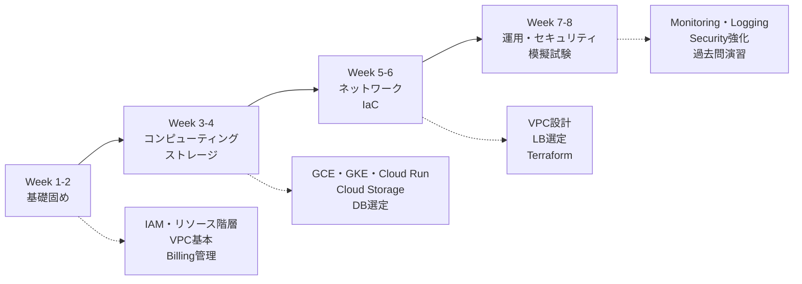

---

## Domain 1: クラウドソリューション環境の設定 (≈ 23%)

## 1.1 リソース階層（Resource Hierarchy）

### 階層の全体像

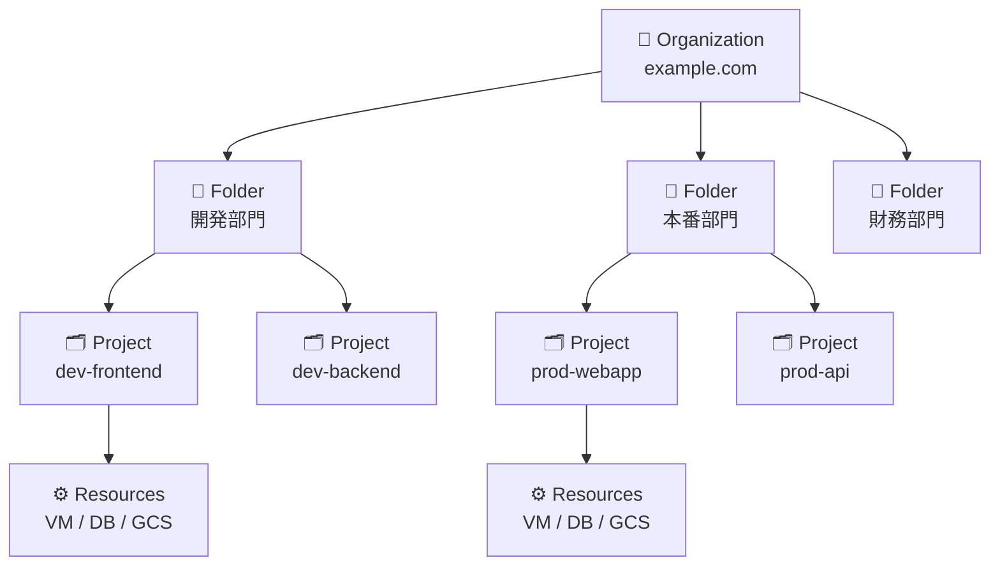

### 各レベルの役割と特性

| レベル | 役割 | 主な特性 |
|--------|------|---------|
| **Organization** | 企業・組織全体のルートノード | Google Workspace / Cloud Identity に紐付く。1ドメイン = 1 Organization |
| **Folder** | 部門・環境・プロジェクトグループの区分け | 最大 10 レベルのネスト。IAM ポリシーの集約点 |
| **Project** | ビリングと信頼境界の最小単位 | Project ID はグローバルに一意・変更不可 |
| **Resource** | 実際の GCP サービスリソース | 必ず 1 つのプロジェクトに属する |

### IAM ポリシーの継承メカニズム（最重要）

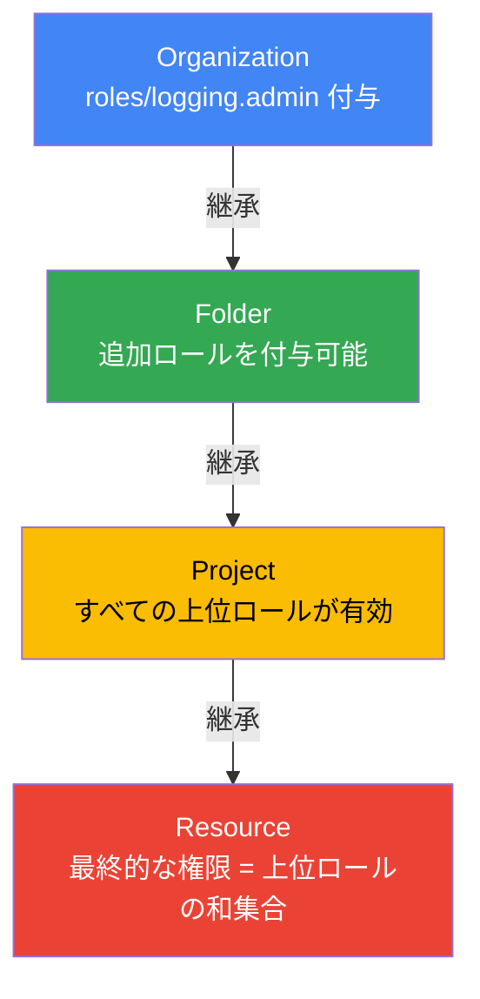

> **重要な法則**: 上位で付与されたロールは下位で**取り消せない**。権限は「和集合」として機能する。

### プロジェクトの識別子

| 識別子 | 例 | 変更 | 一意性 |
|--------|-----|:----:|:------:|
| **Project ID** | `my-webapp-prod-20240101` | ❌ 不可 | グローバルに一意 |
| **Project Number** | `123456789012` | ❌ 不可 | 自動採番 |
| **Project Name** | `My Webapp Production` | ✅ 可能 | 不要 |

### プロジェクトのライフサイクル

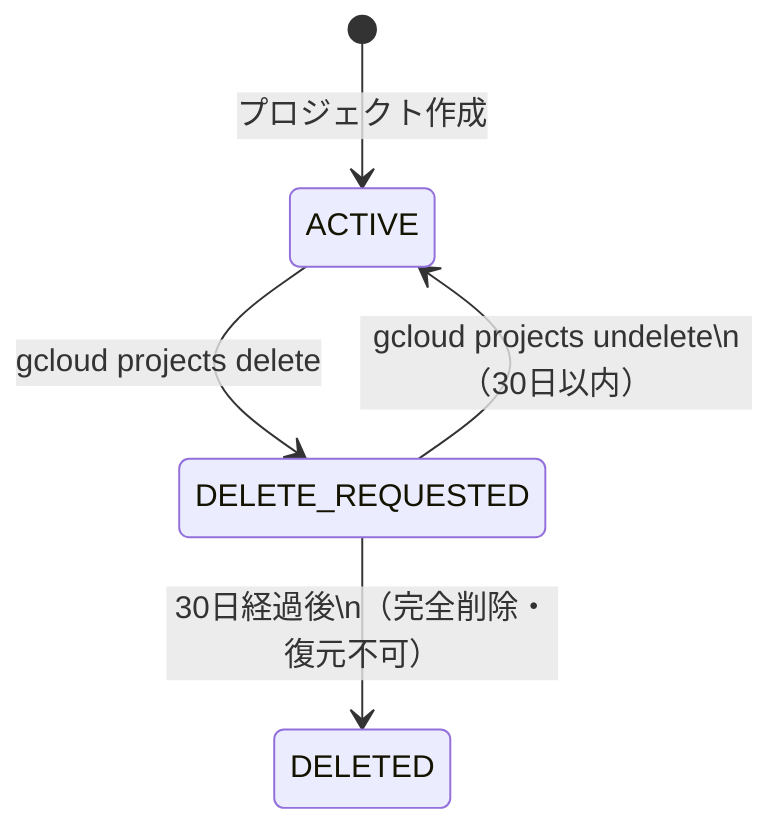

### ベストプラクティス

| # | プラクティス | 根拠 |
|---|------------|------|
| 1 | 企業の組織構造をフォルダ階層に反映する | IAM 管理の直感性と継承の活用 |
| 2 | 共通権限は親フォルダで付与する | 個別設定の手間と設定漏れを防止 |
| 3 | 同一信頼境界のリソースを同一 Project にまとめる | セキュリティポリシーの一貫性 |
| 4 | Organization レベルのロール付与は最小限に | 影響範囲が最大のため慎重に |

> 📖 **参考**: https://docs.cloud.google.com/resource-manager/docs/cloud-platform-resource-hierarchy  
> 📖 **IAM ベストプラクティス**: https://cloud.google.com/blog/products/identity-security/iam-best-practice-guides-available-now

---

## 1.2 組織ポリシー（Organization Policy）

### IAM vs 組織ポリシーの違い

| 観点 | IAM | 組織ポリシー |
|------|-----|------------|
| **制御対象** | 誰が（Who）何をできるか | リソースをどう設定できるか |
| **主体** | ユーザー・SA・グループ | リソース設定そのもの |
| **例** | alice は VM を作成できる | 誰であっても外部 IP を持つ VM を作れない |

### 主要な制約（Constraints）一覧

| カテゴリ | 制約名 | 効果 |
|---------|--------|------|
| **セキュリティ** | `constraints/iam.disableServiceAccountKeyCreation` | SA の静的 JSON キー生成を禁止 |
| **セキュリティ** | `constraints/iam.allowedPolicyMemberDomains` | IAM に追加できるユーザーを特定ドメインに限定 |
| **ネットワーク** | `constraints/compute.disableExternalIpAddresses` | 外部 IP を持つ VM の作成を禁止 |
| **ネットワーク** | `constraints/compute.requireOsLogin` | 全 VM で OS Login を強制 |
| **リージョン** | `constraints/gcp.resourceLocations` | リソースを特定リージョンに限定（データ主権対応） |

### ベストプラクティス

| # | プラクティス |
|---|------------|
| 1 | `constraints/iam.disableServiceAccountKeyCreation` を組織全体で有効化 |
| 2 | `constraints/gcp.resourceLocations` でデータ主権・規制対応を自動強制 |
| 3 | 開発環境は制約を緩和、本番環境は厳しく設定する |
| 4 | 組織ポリシーの変更は監査ログで追跡可能なことを確認する |

> 📖 **参考**: https://cloud.google.com/resource-manager/docs/organization-policy/overview

---

## 1.3 請求管理とコスト制御

### 請求先アカウントの構造

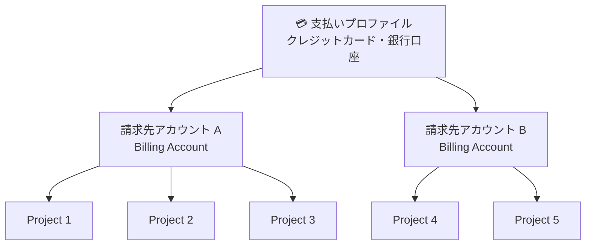

> **重要な仕様**: 1 プロジェクト = **正確に 1 つ**の請求先アカウントにリンク

### 請求先アカウントの IAM ロール

| ロール | 権限 | 付与対象例 |
|--------|------|-----------|
| `billing.admin` | 請求先アカウントの完全管理 | 財務部門の管理者 |
| `billing.viewer` | 請求情報の閲覧のみ | 財務部門の一般担当者 |
| `billing.projectManager` | プロジェクトのリンク・アンリンク | プロジェクト管理者 |
| `billing.costsManager` | 予算・アラートの管理 | FinOps 担当者 |

### 予算アラートの設定フロー

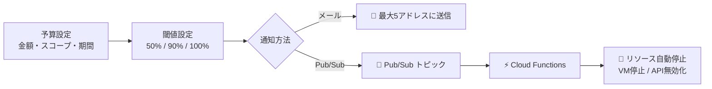

> ⚠️ **最重要（試験頻出）**: Google Cloud は予算の上限に達しても**リソースを自動停止しません**。自動停止には `Pub/Sub + Cloud Functions` のアーキテクチャが必要。

### セキュリティインシデントによるコスト急増リスクと対策

| リスク | 原因 | 対策 |
|--------|------|------|
| 暗号資産マイニング | SA キー漏洩 | キー生成禁止ポリシー・Secret Manager 使用 |
| DDoS によるオートスケール課金 | 大量リクエスト | **Cloud Armor** + MIG スケーリング上限設定 |

### ベストプラクティス

| # | プラクティス | 理由 |
|---|------------|------|
| 1 | Cloud Billing データを **BigQuery にエクスポート** | 詳細分析・監査証跡の確保 |
| 2 | **50% / 90% / 100%** の 3 段階でアラートを設定 | 段階的な把握と対応が可能 |
| 3 | 100% 閾値には **Pub/Sub** も設定 | 自動コスト制御の起点 |
| 4 | すべてのリソースに**ラベル**を付与 | コストセンター別の細粒度分析 |
| 5 | **Cloud Armor + MIG 上限設定**を必ず実施 | セキュリティ起因のコスト暴走を防止 |

> 📖 **参考**: https://docs.cloud.google.com/billing/docs/how-to/budgets  
> 📖 **コスト管理**: https://amnic.com/blogs/google-cloud-billing-reports

---

## 1.4 gcloud CLI の設定と管理

### 設定（Configuration）の管理

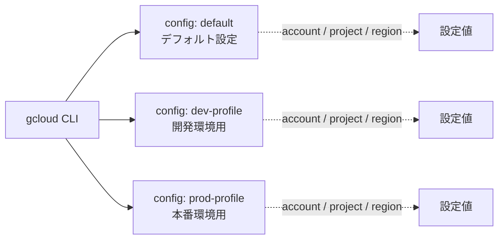

### 主要コマンド一覧

| コマンド | 説明 |
|---------|------|
| `gcloud config set project PROJECT_ID` | デフォルトプロジェクトを変更 |
| `gcloud config set compute/region asia-northeast1` | デフォルトリージョンを変更 |
| `gcloud config configurations create dev-profile` | 新しい設定プロファイルを作成 |
| `gcloud config configurations activate prod-profile` | 設定プロファイルを切り替え |
| `gcloud auth application-default login` | ADC（ローカル開発用認証情報）を設定 |
| `gcloud services enable compute.googleapis.com` | API を有効化 |

### ADC（Application Default Credentials）の検索順序

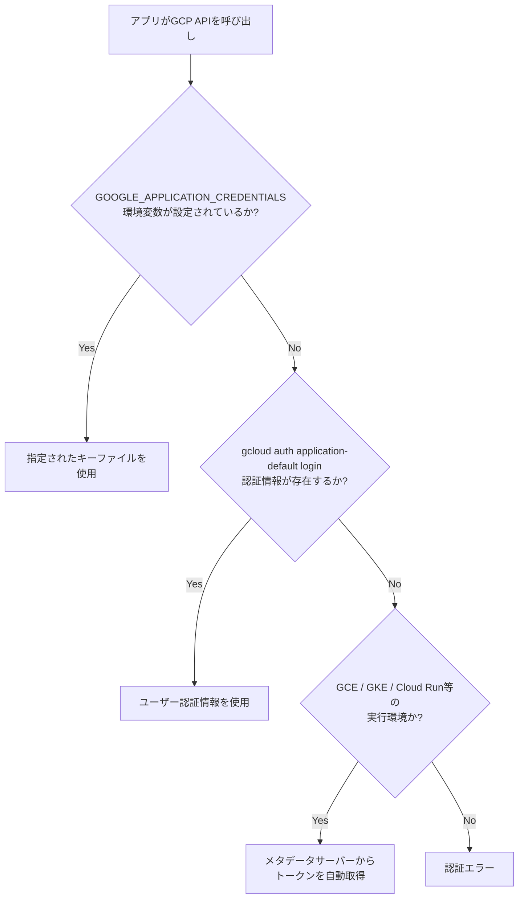

### ベストプラクティス

| # | プラクティス |
|---|------------|
| 1 | 環境（dev/prod）ごとに `gcloud config configurations` でプロファイルを作成 |
| 2 | ローカル開発には `gcloud auth application-default login` を使用（JSON キー禁止） |
| 3 | CI/CD では Workload Identity Federation を使用（JSON キー禁止） |
| 4 | スクリプトでは `--quiet` と `--format=json` で自動化に対応 |

> 📖 **参考**: https://cloud.google.com/sdk/docs/configurations

---

## Domain 2: クラウドソリューションの計画と実装 (≈ 30%)

## 2.1 コンピューティングサービス選定

### 選定フローチャート

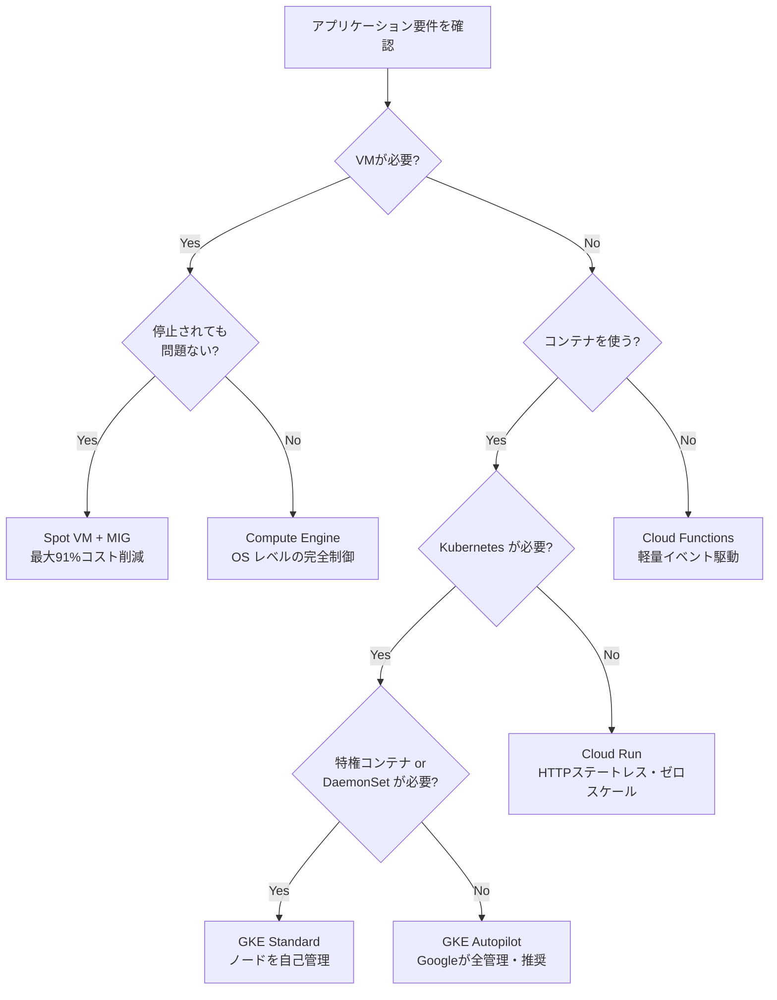

### コンピューティングサービス比較表

| サービス | 管理レベル | 課金モデル | 最適なユースケース |
|----------|:-------:|----------|-----------------|
| **Compute Engine** | フル制御 (IaaS) | vCPU/時間 | レガシー移行・特定 OS・特定ライセンス |
| **Spot VM** | フル制御 (IaaS) | 最大 91% 割引 | バッチ・ML・レンダリング（停止 OK） |
| **GKE Autopilot** | フルマネージド | Pod リソース単位 | 大規模マイクロサービス・運用負荷削減 |
| **GKE Standard** | 半マネージド | ノード (VM) 単位 | 特権コンテナ・カーネル設定・DaemonSet |
| **Cloud Run** | サーバーレス | リクエスト単位 | HTTP API・ゼロスケール・イベント駆動 |
| **Cloud Functions** | サーバーレス | 呼び出し回数 | Webhook・軽量グルーロジック |

---

## 2.2 Compute Engine (GCE) の詳細

### マシンファミリーの選択基準

| ファミリー | シリーズ例 | 用途 | 特徴 |
|-----------|---------|------|------|
| **General Purpose** | N2, E2, T2D | 汎用 Web・開発環境 | コストとパフォーマンスのバランス。E2 が最安 |
| **Compute Optimized** | C2, C2D | HPC・ゲームサーバー | CPU 性能を最優先 |
| **Memory Optimized** | M2, M3 | SAP HANA・大型 DB | 最大 12TB のメモリ |
| **Accelerator Optimized** | A2, A3, G2 | ML トレーニング・推論 | GPU/TPU 搭載 |

### ディスク種別の比較

| ディスク | IOPS（最大） | 特性 | 推奨用途 |
|---------|:-----------:|------|---------|
| **Balanced PD** | 80,000 | コストとパフォーマンスのバランス | 一般的なワークロード（デフォルト推奨） |
| **SSD PD** | 100,000 | 高 IOPS・低レイテンシ | 高負荷 DB・トランザクション処理 |
| **Standard PD** | 7,500 | 最安価 | バッチ処理・コールドデータ |
| **Extreme PD** | 120,000 | 最高性能 | SAP HANA・ミッションクリティカル DB |
| **Local SSD** | 2,400,000 | 物理接続・最速 | キャッシュ・一時データ（**VM 停止で消失**） |

> ⚠️ **Local SSD の注意点**: VM が停止・削除されるとデータが消えます。永続化が必要なデータには使用禁止。

### セキュアな SSH アクセス管理

#### ❌ アンチパターン：静的 SSH キー管理

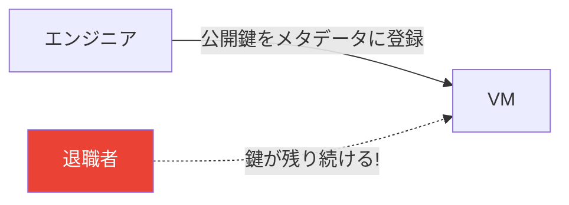

#### ✅ 推奨：OS Login によるアクセス管理

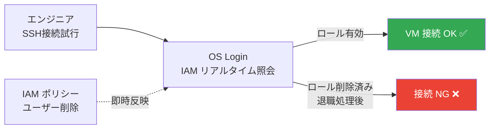

### OS Login の設定

| コマンド | 説明 |
|---------|------|
| `gcloud compute project-info add-metadata --metadata enable-oslogin=TRUE` | プロジェクト全体で OS Login を有効化 |
| `gcloud compute project-info add-metadata --metadata enable-oslogin-2fa=TRUE` | 2FA（二要素認証）を必須化 |

### OS Login に必要な IAM ロール

| ロール | SSH 権限 | sudo 権限 |
|--------|:-------:|:--------:|
| `roles/compute.osLogin` | ✅ | ❌ |
| `roles/compute.osAdminLogin` | ✅ | ✅ |

### JIT（Just-In-Time）アクセスの設計

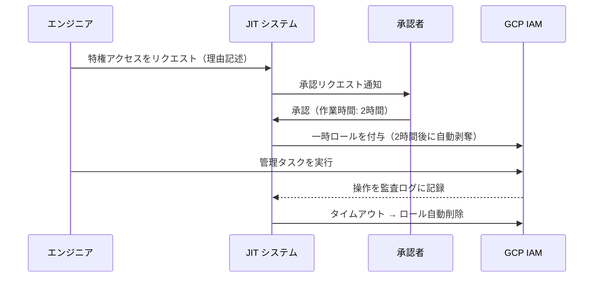

### ベストプラクティス

| # | プラクティス | 理由 |
|---|------------|------|
| 1 | **OS Login + 2FA** を本番環境で必須化 | 静的キーの漏洩・管理コストを排除 |
| 2 | **外部 IP を持たない VM 構成**（Cloud NAT でアウトバウンド） | アタックサーフェスを最小化 |
| 3 | **本番 VM への SSH は JIT アクセス**で一時的に付与 | 常時権限による被害を防止 |
| 4 | **Shielded VM** を有効化 | UEFI セキュアブートで VM の完全性を保証 |

> 📖 **参考**: https://docs.cloud.google.com/compute/docs/oslogin/set-up-oslogin  
> 📖 **SSH ベストプラクティス**: https://docs.cloud.google.com/compute/docs/connect/ssh-best-practices/login-access

---

## 2.3 Spot VM（スポット VM）

### Spot VM と Preemptible VM の比較

| 項目 | Preemptible VM（旧） | Spot VM（現在推奨） |
|------|:-------------------:|:-----------------:|
| 最大稼働時間 | **24時間**（強制停止） | **制限なし** |
| 停止通知 | 30秒前 | 30秒前 |
| 最大割引率 | ≈80% | **≈91%** |
| 推奨度 | ❌ レガシー | ✅ **推奨** |

### 終了アクション（Termination Action）の選択

| 設定値 | ローカル SSD データ | 再起動 | 推奨用途 |
|--------|:-----------------:|:------:|---------|
| `STOP` | ✅ 保持 | キャパシティ回復後に自動再起動 | データを保持したいバッチ処理 |
| `DELETE` | ❌ 消失 | MIG が新規 VM を作成 | 完全ステートレスなワークロード |

### プリエンプション対応の設計パターン

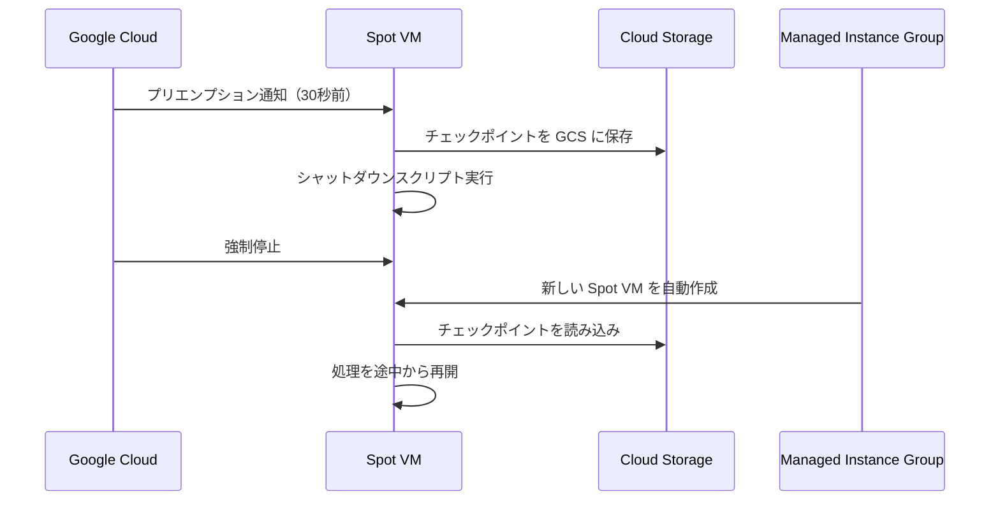

### ベストプラクティス

| # | プラクティス |
|---|------------|
| 1 | **MIG（Managed Instance Group）と組み合わせ**てプリエンプト後に自動再作成 |
| 2 | **チェックポイント機能を必ず実装**（Cloud Storage に進捗を保存） |
| 3 | 終了アクションは **`STOP`** を基本に（データ保持） |
| 4 | **シャットダウンスクリプト**を設定して 30 秒の猶予でクリーンに終了 |
| 5 | **複数ゾーンにわたる MIG** を構成してリスクを分散 |

> 📖 **参考**: https://docs.cloud.google.com/compute/docs/instances/create-use-spot  
> 📖 **ベストプラクティス**: https://cloud.google.com/blog/products/compute/google-cloud-spot-vm-use-cases-and-best-practices

---

## 2.4 Google Kubernetes Engine (GKE)

### Autopilot vs Standard の使い分け

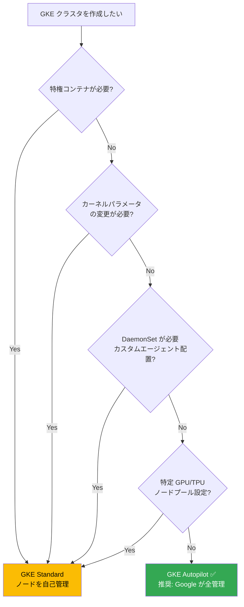

### Autopilot vs Standard の詳細比較

| 項目 | Autopilot | Standard |
|------|:---------:|:--------:|
| ノード管理 | Google が自動管理 | ユーザーが管理 |
| セキュリティ標準 | Kubernetes Baseline 強制 | ユーザー設定 |
| 特権コンテナ | ❌ | ✅ |
| Workload Identity | 自動有効化 | 手動設定 |
| DaemonSet | ❌（基本的に不可） | ✅ |
| 課金モデル | **Pod リソース単位**（アイドルコストなし） | **ノード（VM）単位** |
| 新規クラスタ推奨 | **✅ デフォルト推奨** | 特殊要件のみ |

### Workload Identity Federation（最重要）

#### ❌ アンチパターン：JSON キーを Kubernetes Secret に保存

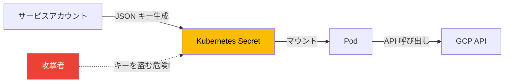

#### ✅ 推奨：Workload Identity

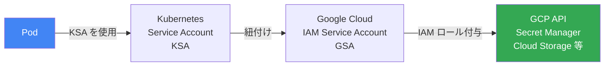

### GKE のオートスケーリング機能比較

| 機能 | 対象 | スケーリング指標 |
|------|------|---------------|
| **HPA** (Horizontal Pod Autoscaler) | Pod 数 | CPU / メモリ / カスタムメトリクス |
| **VPA** (Vertical Pod Autoscaler) | Pod のリソース量 | CPU / メモリのリクエスト自動調整 |
| **Cluster Autoscaler** | ノード数 | Pod のスケジュール可能性 |
| **KEDA** | Pod 数 | Pub/Sub キュー深さなど外部指標 |

### セキュリティ強化機能

| 機能 | 説明 | 設定 |
|------|------|------|
| **Binary Authorization** | 承認済みイメージのみデプロイ許可 | CI/CD でイメージに署名 |
| **Security Posture Dashboard** | CVE・設定ミスを自動スキャン | GKE コンソールから確認 |
| **Shielded GKE Nodes** | ノードの完全性を保証 | クラスタ作成時に有効化 |
| **Workload Identity** | Pod から GCP API へキーレスアクセス | クラスタレベルで有効化 |

### ベストプラクティス

| # | プラクティス | 理由 |
|---|------------|------|
| 1 | 新規クラスタは **Autopilot モードをデフォルト** で選択 | 運用負荷ゼロ・セキュリティが自動強化 |
| 2 | GCP API アクセスには必ず **Workload Identity** を使用（JSON キー禁止） | 認証情報の漏洩を根本的に防止 |
| 3 | **プライベートクラスタ**（外部 IP なし）で構築 | ノードへの直接攻撃を遮断 |
| 4 | **Binary Authorization** を有効化 | 未承認イメージのデプロイを阻止 |
| 5 | **リリースチャンネル（Regular）** を設定 | Kubernetes バージョンを自動管理 |

> 📖 **参考（Autopilot セキュリティ）**: https://docs.cloud.google.com/kubernetes-engine/docs/concepts/autopilot-security  
> 📖 **Autopilot vs Standard 比較**: https://docs.cloud.google.com/kubernetes-engine/docs/resources/autopilot-standard-feature-comparison

---

## 2.5 Cloud Run

### Cloud Run のデプロイフロー

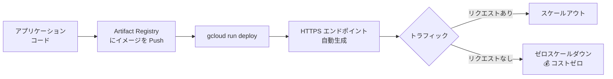

### 第 1 世代 vs 第 2 世代 実行環境

| 項目 | 第 1 世代 | 第 2 世代（推奨） |
|------|:--------:|:---------------:|
| ネットワーク接続 | VPC コネクタ | **Direct VPC Egress（高速）** |
| スループット | 制限あり | **最大 2Gbps** |
| 並行処理数 | 最大 250/インスタンス | **最大 1,000/インスタンス** |
| CPU | リクエスト中のみ | **常時利用可能** |

### トラフィック分割（カナリアデプロイ）

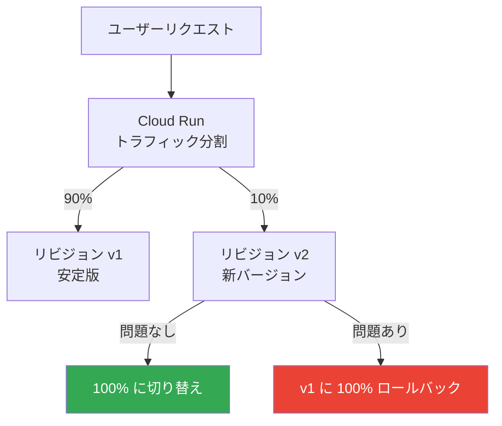

### ベストプラクティス

| # | プラクティス | 理由 |
|---|------------|------|
| 1 | **第 2 世代実行環境 + Direct VPC Egress** を使用 | スループット向上・VPC コネクタ不要 |
| 2 | **ステートレスな設計**（状態は Cloud SQL・Firestore に保存） | スケーリングへの対応 |
| 3 | **最小インスタンス数を設定**してコールドスタートを削減 | レイテンシの安定化 |
| 4 | **Secret Manager から環境変数を注入**してシークレット管理 | コードへの直接書き込みを防止 |
| 5 | **`--no-allow-unauthenticated`** で IAM 認証を必須に | 意図せぬ公開を防止 |

> 📖 **参考**: https://docs.cloud.google.com/run/docs/configuring/networking-best-practices

---

## 2.6 Cloud Storage

### ストレージクラスの選択基準

| クラス | GB 単価 | 取り出し料金 | 最小保存期間 | アクセス頻度目安 |
|--------|:-------:|:-----------:|:-----------:|:-------------:|
| **Standard** | $0.020 | 無料 | なし | 頻繁（日次以上） |
| **Nearline** | $0.010 | $0.01/GB | **30日** | 月 1 回程度 |
| **Coldline** | $0.004 | $0.02/GB | **90日** | 四半期 1 回程度 |
| **Archive** | $0.0012 | $0.05/GB | **365日** | 年 1 回以下 |

> ⚠️ **試験頻出**: 最小保存期間より前に削除しても、最小保存期間分の料金が発生します。

### Object Lifecycle Management (OLM) の自動化

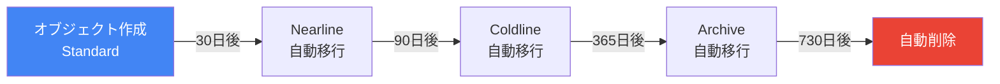

### バケットのセキュリティ設計

| ロケーションタイプ | 冗長性 | コスト | 推奨用途 |
|-----------------|:------:|:------:|---------|
| **Single Region** | ゾーン内 | 低 | 同一リージョン内でのデータ転送 |
| **Dual Region** | 2 リージョン間 | 中 | 地理的冗長性（東京 + 大阪） |
| **Multi Region** | リージョングループ内 | 高 | グローバルなコンテンツ配信 |

### アクセス制御モデルの比較

| モデル | 説明 | 推奨度 |
|--------|------|:------:|
| **ACL（Access Control List）** | オブジェクトごとの個別制御（旧モデル） | ❌ |
| **統一バケットレベルアクセス** | バケット全体に IAM ポリシーを適用 | **✅ 推奨** |

### データ保護機能の比較

| 機能 | 目的 | 取り消し可否 |
|------|------|:-----------:|
| **Soft Delete（論理削除）** | 誤削除からの復旧（デフォルト 7 日） | ✅ 可能 |
| **Object Versioning** | オブジェクトの変更履歴保持 | ✅ 可能 |
| **Bucket Lock** | 保持ポリシーを永久に変更不可にする | ❌ **不可逆！** |
| **Object Retention Lock** | オブジェクト単位の期限付き保護 | 設定による |

### ベストプラクティス

| # | プラクティス | 理由 |
|---|------------|------|
| 1 | **統一バケットレベルアクセスを有効化** | ACL の複雑さを排除、IAM で一元管理 |
| 2 | **OLM を必ず設定**してストレージクラスを自動移行 | コスト最適化の自動化 |
| 3 | **バケット名に PII・機密情報を含めない** | バケット名は URL に公開される |
| 4 | **署名付き URL** で一時アクセスを付与（最大 7 日間） | IAM ロール付与なしでセキュアな一時共有 |
| 5 | 規制データには **保持ポリシー + バケットロック** を適用 | コンプライアンス要件への対応 |

> 📖 **参考**: https://docs.cloud.google.com/storage/docs/best-practices

---

## 2.7 データベースサービス選定ガイド

### データベース選定フローチャート

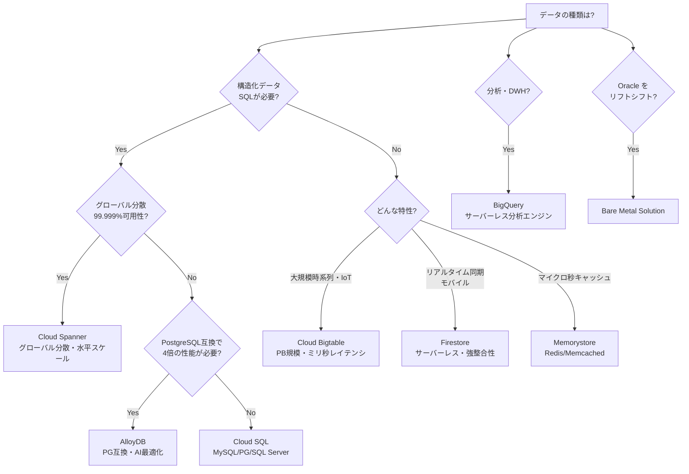

### データベース完全比較表

| サービス | 種別 | 可用性 SLA | 水平スケール | 主要ユースケース |
|----------|------|:----------:|:-----------:|---------------|
| **Cloud SQL** | リレーショナル | 99.95% (HA) | ❌ | Web アプリ・ERP・EC サイト |
| **Cloud Spanner** | リレーショナル | **99.999%** | ✅ | グローバル金融・在庫管理 |
| **AlloyDB** | リレーショナル (PG互換) | 99.99% | ❌（読取スケール可） | 高性能 OLTP・分析混在 |
| **Firestore** | NoSQL（ドキュメント） | 99.999% | ✅ | モバイルアプリ・IoT バックエンド |
| **Cloud Bigtable** | NoSQL（ワイドカラム） | 99.9% | ✅ | 時系列データ・ML フィーチャーストア |
| **Memorystore** | インメモリ | 99.9% | ✅（Redis Cluster） | キャッシュ・セッション・リーダーボード |
| **BigQuery** | データウェアハウス | 99.9% | ✅（自動） | BI・大規模ログ分析・ML |
| **Bare Metal Solution** | 専用ハードウェア | 99.9% | ❌ | Oracle リフト＆シフト |

### Cloud SQL 接続方法の比較

```mermaid
flowchart TD
    APP[アプリケーション] --> METHOD{接続方法}
    METHOD -->|推奨 1| PROXY[Cloud SQL Auth Proxy\nIAM 認証・SSL 自動処理]
    METHOD -->|推奨 2| PRIV[プライベート IP 直接接続\nVPC 内・最もセキュア]
    METHOD -->|非推奨| PUB[パブリック IP\n許可リスト方式]
    
    style PROXY fill:#34A853,color:#fff
    style PRIV fill:#34A853,color:#fff
    style PUB fill:#EA4335,color:#fff
```

### ベストプラクティス

| ユースケース | 推奨サービス | 理由 |
|------------|------------|------|
| WordPress・EC サイト | Cloud SQL (MySQL/PG) | 標準的な RDBMS・移行コスト低 |
| グローバル金融システム | Cloud Spanner | 99.999% SLA・グローバル強整合性 |
| PostgreSQL で高性能が必要 | AlloyDB | PG 互換のまま 4 倍の性能 |
| モバイルアプリのバックエンド | Firestore | リアルタイム同期・サーバーレス |
| IoT・時系列データ（PB 規模） | Cloud Bigtable | ペタバイトスケール・ミリ秒レイテンシ |
| セッション・キャッシュ | Memorystore（Redis） | マイクロ秒レスポンス |
| コスト分析・BI | BigQuery | サーバーレス DWH・SQL 分析 |
| Oracle の移行 | Bare Metal Solution | Oracle ライセンス・低レイテンシ HW |

> 📖 **参考**: https://cloud.google.com/blog/topics/developers-practitioners/your-google-cloud-database-options-explained  
> 📖 **DB 選定ガイド**: https://dataroots.io/blog/best-practices-for-choosing-a-database-on-google-cloud-platform-gcp

---

## 2.8 ネットワーク設計

### Google Cloud VPC の特徴

```mermaid
flowchart TD
    VPC[Google Cloud VPC\n【グローバルスコープ】] --> SUB1[サブネット\n東京 asia-northeast1]
    VPC --> SUB2[サブネット\n大阪 asia-northeast2]
    VPC --> SUB3[サブネット\n米国 us-central1]
    VPC --> SUB4[サブネット\n欧州 europe-west1]
    
    style VPC fill:#4285F4,color:#fff
```

> **他社クラウドとの違い**: 他社ではリージョンごとに VPC が必要。Google Cloud VPC は **1 つで全リージョンをカバー**。

### Shared VPC のアーキテクチャ

```mermaid
flowchart TD
    HOST[ホストプロジェクト\nネットワーク管理チーム] --> VPC[VPC ネットワーク\nサブネット・ファイアウォール集中管理]
    VPC --> SP1[サービスプロジェクト 1\nフロントエンドチーム]
    VPC --> SP2[サービスプロジェクト 2\nバックエンドチーム]
    VPC --> SP3[サービスプロジェクト 3\nDB チーム]
    
    SP1 -.->|Network User ロール付与| VPC
    SP2 -.->|Network User ロール付与| VPC
    SP3 -.->|Network User ロール付与| VPC
    
    style HOST fill:#4285F4,color:#fff
```

**Shared VPC のメリット**:
- ネットワーク設定を**一元管理**（セキュリティポリシーの統一）
- ネットワーク管理とアプリ開発の**職務分掌**
- 各チームのコストは**独立したプロジェクトで管理**

### VPC Network Peering の制約

```mermaid
flowchart LR
    A[VPC A] <-->|Peering ✅| B[VPC B]
    B <-->|Peering ✅| C[VPC C]
    A -. "直接通信 ❌\n（推移的でない）" .-> C
    
    style A fill:#4285F4,color:#fff
    style B fill:#34A853,color:#fff
    style C fill:#FBBC04,color:#000
```

> ⚠️ **VPC Peering の制約**: 推移的（Transitive）ではない。A-B-C で Peering しても、A-C 間の通信は**不可**。IP アドレスの重複があると Peering 不可。

### ロードバランサ選定フローチャート

```mermaid
flowchart TD
    START[どんなトラフィック?] --> HTTP{HTTP/HTTPS?}
    HTTP -->|Yes| ALB[Application Load Balancer L7]
    ALB --> GLOB{グローバル配信?}
    GLOB -->|Yes| GALB[Global External ALB\nPremium Tier 使用]
    GLOB -->|No| COMP{コンプライアンス要件\nデータ主権?}
    COMP -->|Yes| RALB[Regional ALB\n⚠️ 必ずリージョナルを選択]
    COMP -->|No| RALB2[Regional ALB]
    HTTP -->|No TCP/UDP 等| NLB[Network Load Balancer L4]
    NLB --> SSL{SSL オフロードが必要?}
    SSL -->|Yes| PNLB[Proxy Network LB\nSSL 終端・送信元 IP 失われる]
    SSL -->|No| PASS[Passthrough Network LB\n送信元 IP 保持・DSR]
    
    style GALB fill:#4285F4,color:#fff
    style RALB fill:#EA4335,color:#fff
    style PASS fill:#34A853,color:#fff
```

### ロードバランサ比較表

| ロードバランサ | レイヤ | 送信元 IP 保持 | SSL オフロード | スコープ |
|--------------|:------:|:-------------:|:-------------:|:-------:|
| **Global External ALB** | L7 | ❌ | ✅ | グローバル |
| **Regional External ALB** | L7 | ❌ | ✅ | リージョン |
| **Proxy Network LB** | L4 | ❌ | ✅ | グローバル/リージョン |
| **Passthrough Network LB** | L4 | **✅** | ❌ | リージョン |
| **Internal ALB** | L7 | ❌ | ✅ | リージョン（内部） |
| **Internal Passthrough NLB** | L4 | **✅** | ❌ | リージョン（内部） |

> ⚠️ **試験頻出**: データ主権・コンプライアンス要件がある場合は必ず**リージョナル** ロードバランサを選択！

### Cloud NAT のポート枯渇監視

| 項目 | 詳細 |
|------|------|
| **Cloud NAT の役割** | 外部 IP なし VM からインターネットへのアウトバウンドを確保 |
| **ポート枯渇のリスク** | 各 VM のポート割り当て上限を超えると新しい接続が確立できない |
| **監視用 MQL クエリ** | `fetch nat_gateway \| metric 'compute.googleapis.com/nat/port_usage'` |
| **対策** | `--min-ports-per-vm` を増加、または静的 NAT IP を追加 |

### ベストプラクティス

| # | プラクティス | 根拠 |
|---|------------|------|
| 1 | 大規模組織では **Shared VPC** でネットワーク管理を集中化 | 職務分掌・ポリシーの統一 |
| 2 | **カスタムモード VPC**（本番環境推奨）で IP 範囲を計画的に設計 | VPC Peering での IP 重複を防止 |
| 3 | コンプライアンス要件がある場合は必ず**リージョナル LB** を選択 | データ主権・規制対応 |
| 4 | **Cloud NAT のポート使用率**を Cloud Monitoring で継続監視 | ポート枯渇による接続障害を防止 |

> 📖 **VPC 設計**: https://docs.cloud.google.com/architecture/best-practices-vpc-design  
> 📖 **LB 選定**: https://docs.cloud.google.com/load-balancing/docs/choosing-load-balancer  
> 📖 **Cloud NAT**: https://cloud.google.com/blog/products/networking/6-best-practices-for-running-cloud-nat

---

## 2.9 Infrastructure as Code（Terraform）

### State ファイルの管理

```mermaid
flowchart TD
    CODE[Terraform コード\n.tf ファイル] <-->|マッピングを管理| STATE[terraform.tfstate\nState ファイル]
    STATE <-->|実際のリソース情報| GCP[GCP リソース]
    
    subgraph 推奨バックエンド
        GCS[Cloud Storage バケット\nリモートバックエンド]
        GCS -->|バージョニング有効| VER[変更履歴を保存]
        GCS -->|State ロック有効| LOCK[並行 apply を防止]
    end
    
    STATE -.->|保存| GCS
```

> ⚠️ **絶対禁止**: `terraform.tfstate` を手動で直接編集してはいけません。設定破損・リソースの意図しない削除を招きます。

### 安全なデプロイフロー

```mermaid
flowchart LR
    COMMIT[コードを\ngit commit] --> PLAN[terraform plan\n-out=tfplan]
    PLAN --> REVIEW[変更内容を\nレビュー]
    REVIEW --> APPLY[terraform apply\ntfplan]
    APPLY --> VERIFY[デプロイ結果\nを確認]
    
    style PLAN fill:#4285F4,color:#fff
    style APPLY fill:#34A853,color:#fff
```

### Terraform Import の方法比較

| 方法 | Terraform バージョン | 説明 | 推奨度 |
|------|:-----------------:|------|:------:|
| `terraform import` コマンド | < 1.5 | コマンドラインで個別インポート | 旧方式 |
| `import` ブロック | **≥ 1.5** | コード内に宣言、plan/apply に統合 | **✅ 推奨** |

### GitOps による環境管理

```mermaid
flowchart TD
    FEAT[feature ブランチ\nコード変更] -->|PR 作成| DEV[dev ブランチへ merge\n↓ Cloud Build トリガー]
    DEV -->|terraform apply| DEVENV[Dev 環境に自動適用]
    DEV -->|承認後 PR| MAIN[main ブランチへ merge\n↓ Cloud Build トリガー]
    MAIN -->|terraform apply| PRODENV[Prod 環境に自動適用]
    
    style DEVENV fill:#34A853,color:#fff
    style PRODENV fill:#EA4335,color:#fff
```

### ベストプラクティス

| # | プラクティス | 理由 |
|---|------------|------|
| 1 | State は必ず **Cloud Storage リモートバックエンド**に保存 | 競合・紛失防止 |
| 2 | State バケットは**バージョニングを有効化** | 誤操作からの復元 |
| 3 | **`terraform plan -out=tfplan`** を必ず実施してからレビュー | 意図しない変更の防止 |
| 4 | **State ファイルを手動編集禁止** | 設定破損リスク |
| 5 | CI/CD 認証は **Workload Identity / ADC** を使用（JSON キー禁止） | キー漏洩防止 |
| 6 | 環境ごとに**別ディレクトリ・別 State バケット**を使用 | 誤った環境への適用防止 |
| 7 | **`import` ブロック**（Terraform ≥ 1.5）で既存リソースを管理下へ | plan/apply の一貫したパイプライン |

> 📖 **参考**: https://docs.cloud.google.com/docs/terraform/best-practices/operations

## Domain 3: 正常なオペレーションの確保 (≈ 27%)

## 3.1 オブザーバビリティ（可観測性）の 4 つのシグナル

| シグナル | ツール | 目的 |
|---------|--------|------|
| **Metrics（メトリクス）** | Cloud Monitoring | 「何が」起きているか（定量的） |
| **Logs（ログ）** | Cloud Logging | 「何が」起きたか（イベント記録） |
| **Traces（トレース）** | Cloud Trace | 「どこで」遅延が発生しているか |
| **Profiles（プロファイル）** | Cloud Profiler | 「なぜ」遅いか（コードレベルの原因） |

---

## 3.2 Cloud Monitoring

### モニタリングシステムの全体像

```mermaid
flowchart TD
    subgraph データソース
        GCE[Compute Engine\nCPU/Network 自動収集]
        OPS[Ops Agent インストール\nメモリ/アプリログ収集]
        GKE[GKE\nManaged Prometheus]
        SAAS[Cloud Run / Cloud SQL\n自動収集]
    end
    
    subgraph Cloud Monitoring
        METRIC[メトリクス\nデータベース]
        DASH[カスタム\nダッシュボード]
        ALERT[アラート\nポリシー]
        SLO[SLO\nモニタリング]
    end
    
    subgraph 通知先
        EMAIL[📧 Email]
        SLACK[💬 Slack]
        PD[🔔 PagerDuty]
        PUBSUB[📨 Pub/Sub]
    end
    
    GCE --> METRIC
    OPS --> METRIC
    GKE --> METRIC
    SAAS --> METRIC
    METRIC --> DASH
    METRIC --> ALERT
    METRIC --> SLO
    ALERT --> EMAIL
    ALERT --> SLACK
    ALERT --> PD
    ALERT --> PUBSUB
```

### エージェントなしで取得できるメトリクス vs Ops Agent が必要なメトリクス

| カテゴリ | メトリクス例 | Ops Agent 必要? |
|---------|------------|:--------------:|
| CPU 使用率 | `compute.googleapis.com/instance/cpu/utilization` | ❌ 自動取得 |
| ネットワーク I/O | `compute.googleapis.com/instance/network/sent_bytes_count` | ❌ 自動取得 |
| **メモリ使用量** | `agent.googleapis.com/memory/percent_used` | **✅ 必要** |
| **ディスク使用率** | `agent.googleapis.com/disk/percent_used` | **✅ 必要** |
| **アプリケーションログ** | nginx / mysql / custom ログ | **✅ 必要** |

> ⚠️ **試験頻出**: メモリ使用量は Ops Agent がないと取得できません！

### Ops Agent のアーキテクチャ

```mermaid
flowchart LR
    VM[Compute Engine VM] --> OPS[Ops Agent]
    OPS --> FB[Fluent Bit\nログ収集エンジン]
    OPS --> OT[OpenTelemetry Collector\nメトリクス収集エンジン]
    FB --> LOG[Cloud Logging]
    OT --> MON[Cloud Monitoring]
    
    style OPS fill:#4285F4,color:#fff
    style LOG fill:#34A853,color:#fff
    style MON fill:#34A853,color:#fff
```

### Managed Service for Prometheus（GKE 向け）

```mermaid
flowchart LR
    GKE[GKE クラスタ] --> POD[アプリ Pod\n/metrics エンドポイント]
    POD --> PM[PodMonitoring CRD\nスクレイプ設定]
    PM --> MSP[Managed Service for Prometheus\nGoogle が管理]
    MSP --> MON[Cloud Monitoring\nPromQL でクエリ可能]
    
    style MSP fill:#4285F4,color:#fff
```

**従来の Prometheus との比較**:

| 項目 | セルフ管理 Prometheus | Managed Service for Prometheus |
|------|:--------------------:|:------------------------------:|
| サーバー管理 | 必要 | ❌ 不要 |
| ストレージ管理 | 必要 | ❌ 不要 |
| スケーリング | 手動 | ✅ 自動 |
| Prometheus 互換 | ✅ | ✅ |

### SLO（サービスレベル目標）の設計

| 概念 | 説明 | 例 |
|------|------|-----|
| **SLI** | 測定する指標 | リクエスト成功率 |
| **SLO** | 目標値 | 成功率 ≥ 99.9% |
| **SLA** | 契約上の約束 | 99.9% を下回ったら返金 |
| **エラーバジェット** | 許容できる失敗量 | 月間 43.8 分のダウンタイム（99.9% SLO の場合） |

### バーンレートアラート

```mermaid
flowchart LR
    EB[エラーバジェット\n月間 43.8分] --> BR{バーンレートを監視}
    BR -->|14.4倍速 - 1時間ウィンドウ| FAST[🔥 高速消費アラート\n緊急対応が必要]
    BR -->|1.0倍速 - 6時間ウィンドウ| SLOW[⚠️ 低速消費アラート\n調査が必要]
    BR -->|通常範囲| OK[✅ SLO 達成中]
    
    style FAST fill:#EA4335,color:#fff
    style SLOW fill:#FBBC04,color:#000
    style OK fill:#34A853,color:#fff
```

### ベストプラクティス

| # | プラクティス | 理由 |
|---|------------|------|
| 1 | **VM のメモリ監視には Ops Agent を必ずインストール** | デフォルトではメモリ取得不可 |
| 2 | **GKE には Managed Service for Prometheus** を使用 | Prometheus 互換・運用負荷ゼロ |
| 3 | **SLO ベースのアラートを優先**（CPU アラートより重要） | ユーザー体験に直結する指標を監視 |
| 4 | アラートには **runbook（対応手順）のリンクを含める** | 受け取った人が迷わず対応できる |
| 5 | **アラート疲れを防ぐ**: アクションできるアラートだけを設定 | 重要な通知を見逃さないため |

> 📖 **参考**: https://docs.cloud.google.com/monitoring/agent/ops-agent  
> 📖 **Managed Prometheus**: https://cloud.google.com/stackdriver/docs/managed-prometheus

---

## 3.3 スナップショット管理

### スナップショットの整合性レベル（試験頻出）

| 種類 | 取得方法 | 整合性 | アプリ停止 | 推奨用途 |
|------|---------|:------:|:---------:|---------|
| **クラッシュ整合性** | アプリ停止なしで取得 | OS 再起動後の整合性 | ❌ 不要 | OS ディスク・ステートレスアプリ |
| **アプリケーション整合性** | データをフラッシュしてから取得 | **完全な整合性** | ✅ 必要 | **DB（MySQL / PostgreSQL 等）** |

### アプリケーション整合性スナップショットの取得フロー

```mermaid
sequenceDiagram
    participant A as アプリ（MySQL）
    participant OS as Linux OS
    participant GCP as Google Cloud

    Note over A: fsfreeze または FLUSH TABLES WITH READ LOCK
    OS->>OS: sudo fsfreeze --freeze /data
    Note over OS: ファイルシステムを凍結（書き込み停止）
    OS->>GCP: gcloud compute disks snapshot
    GCP-->>OS: スナップショット取得完了
    OS->>OS: sudo fsfreeze --unfreeze /data
    Note over OS: ⚠️ 必ずフリーズ解除！忘れると書き込み不可
```

### Linux でのスナップショット最適化

| 方法 | コマンド | 効果 |
|------|---------|------|
| **fstrim の実行** | `sudo fstrim -v /` | 未使用ブロックを OS に通知 → サイズ削減 + 高速化 |
| **discard マウントオプション** | `/etc/fstab` に `discard` を追加 | TRIM を自動実行 |

### スナップショットスケジュールの設定

| 設定項目 | 推奨値 | 理由 |
|---------|:------:|------|
| **取得頻度** | 1時間ごと | RPO（目標復旧時点）を最大 1 時間以内に |
| **保持期間** | 7〜30 日 | コストとリカバリ可能期間のバランス |
| **保存場所** | 別リージョン | リージョン障害からの DR 対策 |

### ベストプラクティス

| # | プラクティス |
|---|------------|
| 1 | 本番環境は **スナップショットスケジュールで 1 時間ごとに自動取得** |
| 2 | DB は必ず**アプリケーション整合性スナップショット**を取得 |
| 3 | Linux では **`fstrim` を事前実行**してスナップショットを最適化 |
| 4 | **別リージョンに DR コピー**（`--storage-location` で指定） |
| 5 | `--max-retention-days` で古いスナップショットを**自動削除** |

> 📖 **参考**: https://docs.cloud.google.com/compute/docs/disks/snapshot-best-practices

---

## 3.4 Cloud Logging

### Cloud Logging のデータフロー

```mermaid
flowchart TD
    subgraph ログ発生源
        GCP_SVC[GCP サービス\nGKE / Cloud SQL / Cloud Run / LB]
        VM_OPS[Compute Engine VM\nOps Agent 経由]
        APP[アプリケーション\nCloud Logging API]
    end
    
    subgraph Cloud Logging
        INGEST[ログ受信・保存\nインデックス作成]
        ROUTER[Log Router\nシンク振り分け]
    end
    
    subgraph エクスポート先
        BKT[Cloud Logging バケット\nデフォルト 30日保持]
        BQ[BigQuery\n長期保存・SQL 分析]
        GCS[Cloud Storage\nアーカイブ・低コスト]
        PS[Pub/Sub\nリアルタイム処理・SIEM 連携]
    end
    
    GCP_SVC --> INGEST
    VM_OPS --> INGEST
    APP --> INGEST
    INGEST --> ROUTER
    ROUTER --> BKT
    ROUTER --> BQ
    ROUTER --> GCS
    ROUTER --> PS
```

### ログバケットのデフォルト保持期間

| ログバケット | デフォルト保持期間 | 変更可否 | 備考 |
|------------|:----------------:|:-------:|------|
| `_Required`（必須） | **400 日** | ❌ 変更不可 | 管理アクティビティ監査ログを含む |
| `_Default`（デフォルト） | **30 日** | ✅（最大 3650 日） | ほとんどのログ |
| カスタムバケット | 設定値 | ✅ | 独自に作成 |

### 監査ログ（Audit Logs）の 3 種類（試験最重要）

| 種別 | 内容 | デフォルト | 料金 | 無効化 |
|------|------|:---------:|:----:|:------:|
| **管理アクティビティ** | リソースの作成・削除・設定変更（IAM 変更等） | ✅ 常時有効 | 無料 | ❌ 不可 |
| **データアクセス** | データの読み書き（GCS オブジェクト読み取り等） | ❌ 無効 | 有料 | - |
| **システムイベント** | Google による自動操作（ライブマイグレーション等） | ✅ 常時有効 | 無料 | ❌ 不可 |

```mermaid
flowchart TD
    AUDIT[監査ログの種別] --> AA[管理アクティビティ\nAdmin Activity]
    AUDIT --> DA[データアクセス\nData Access]
    AUDIT --> SE[システムイベント\nSystem Event]
    
    AA -->|IAM 変更 / リソース作成削除| AA2[✅ 常時有効・無料\n❌ 無効化不可]
    DA -->|データの読み書き| DA2[❌ デフォルト無効\n手動有効化が必要・有料]
    SE -->|Google 自動操作| SE2[✅ 常時有効・無料\n❌ 無効化不可]
    
    style AA2 fill:#34A853,color:#fff
    style DA2 fill:#FBBC04,color:#000
    style SE2 fill:#34A853,color:#fff
```

### ログシンク（Log Router）の設定

| エクスポート先 | 主な用途 | 特徴 |
|-------------|---------|------|
| **BigQuery** | 長期保存 + SQL 分析 | 任意の期間でクエリ可能・コンプライアンス監査 |
| **Cloud Storage** | アーカイブ保存（低コスト） | Coldline ストレージ推奨・コスト最安 |
| **Pub/Sub** | SIEM 連携・リアルタイム処理 | セキュリティイベントの即時転送 |

### ログシンク作成フロー

```mermaid
sequenceDiagram
    participant LOG as Cloud Logging
    participant SINK as ログシンク
    participant BQ as BigQuery
    participant SA as シンク SA

    LOG->>SINK: シンクを作成（フィルタ + 送信先）
    SINK-->>SA: 書き込み用 SA が自動生成
    Note over SA: writerIdentity
    SA->>BQ: BigQuery へのデータ編集ロールを付与
    LOG->>SINK: ログをフィルタリング
    SINK->>BQ: 対象ログをエクスポート
```

### GKE における特別なロギングルール

| ルール | 内容 |
|--------|------|
| **GKE の監査ログは無効化不可** | セキュリティ上の強制仕様 |
| **Container-Optimized OS の auditd** | バイナリ実行履歴・ファイルアクセス・ネットワーク接続を追跡 |

### ベストプラクティス

| # | プラクティス | 理由 |
|---|------------|------|
| 1 | **管理アクティビティ監査ログを BigQuery にエクスポート** | 長期保存・詳細分析・監査証跡 |
| 2 | **機密データを扱う API はデータアクセス監査ログを有効化** | コンプライアンス・インシデント対応 |
| 3 | **GKE の auditd ログを有効化**（COS ノード） | バイナリ実行履歴の追跡 |
| 4 | **Cloud Storage の Coldline にアーカイブシンクを設定** | 低コストで長期保管 |
| 5 | `_Default` バケットの**保持期間を要件に合わせて延長** | デフォルト 30 日では監査に不十分な場合 |

> 📖 **参考**: https://cloud.google.com/blog/products/devops-sre/cloud-logging-cost-management-best-practices

---

## 3.5 Cloud Trace / Profiler / Error Reporting

### 分散トレーシング（Cloud Trace）

```mermaid
gantt
    title リクエストの処理時間内訳（Cloud Trace による可視化）
    dateFormat  X
    axisFormat  %L ms

    section API Gateway
    Routing & Auth      : 0, 50

    section Service A
    Business Logic      : 50, 250

    section Service B（問題箇所）
    DB Query (遅い!)    : 250, 2750

    section Database
    Query Execution     : 2750, 2900
```

> 上記のように Cloud Trace は「どのサービスが遅延の原因か」を特定します。

### Cloud Profiler（継続的プロファイリング）

| 機能 | 説明 |
|------|------|
| **目的** | 本番環境でどのコードが CPU/メモリを消費しているかを継続的に測定 |
| **特徴** | 本番環境への影響を最小化した継続的プロファイリング |
| **可視化** | フレームグラフ（Flame Graph）で CPU ホットパスを視覚化 |
| **対応言語** | Go, Java, Python, Node.js |

### Error Reporting

```mermaid
flowchart LR
    APP[アプリケーション\n例外・エラーを出力] --> LOG[Cloud Logging\nログに記録]
    LOG --> ER[Error Reporting\n自動スキャン]
    ER --> GROUP[同じエラーを\n自動グループ化]
    GROUP --> NOTIFY[新しいエラーを\n即時通知]
    GROUP --> TREND[発生頻度・\nトレンドを表示]
    GROUP --> STACK[スタックトレースで\n原因箇所を特定]
```

---

## 3.6 Gemini Cloud Assist と Cloud Asset Inventory

### Gemini Cloud Assist の機能

| 機能 | 説明 | ユースケース |
|------|------|------------|
| **根本原因分析（RCA）** | ログ・メトリクス・設定変更を横断的に AI 分析 | 障害調査の自動化 |
| **IaC テンプレート生成** | 自然言語から Terraform を自動生成 | インフラ構築の加速 |
| **アーキテクチャ図生成** | インフラ構成図を自動生成 | 設計レビューの効率化 |
| **コスト最適化提案** | リソース稼働率を AI 分析、節約案を提示 | FinOps の自動化 |

### RCA（根本原因分析）のフロー

```mermaid
flowchart LR
    ENG[エンジニアが\n自然言語で質問] --> GCA[Gemini Cloud Assist]
    GCA --> L[Cloud Logging\nエラーログ分析]
    GCA --> M[Cloud Monitoring\nメトリクス確認]
    GCA --> CAI[Cloud Asset Inventory\n設定変更履歴確認]
    L --> RESULT[分析結果・修正アクションを\n自然言語で提示]
    M --> RESULT
    CAI --> RESULT
    
    style GCA fill:#4285F4,color:#fff
    style RESULT fill:#34A853,color:#fff
```

### Cloud Asset Inventory

| 機能 | コマンド例 |
|------|---------|
| 全 GKE クラスタを組織全体で検索 | `gcloud asset search-all-resources --asset-types='container.googleapis.com/Cluster' --scope='organizations/ORG_ID'` |
| 外部 IP を持つ VM を検索（セキュリティ監査） | `gcloud asset search-all-resources --query='networkInterfaces.accessConfigs.natIP:*'` |
| 特定リソースにアクセスできる Identity を分析 | `gcloud asset analyze-iam-policy --full-resource-name='//storage.googleapis.com/projects/_/buckets/my-bucket'` |

> 📖 **Gemini Cloud Assist**: https://cloud.google.com/products/gemini/cloud-assist  
> 📖 **RCA 機能**: https://cloud.google.com/blog/products/management-tools/gemini-cloud-assist-investigations-performs-root-cause-analysis

---

## Domain 4: アクセスとセキュリティの構成 (≈ 20%)

## 4.1 IAM の基本原則

### セキュリティ設計の 3 原則

| 原則 | 説明 | GCP での実装 |
|------|------|------------|
| **最小特権 (Least Privilege)** | 必要な権限だけを必要な期間だけ付与 | 事前定義ロール・IAM Conditions |
| **職務分掌 (Separation of Duties)** | 一人がすべての操作を単独で実行できないようにする | PR レビュー必須・PAM 承認フロー |
| **深層防御 (Defense in Depth)** | 複数のセキュリティ層を重ねる | Cloud Armor → ファイアウォール → IAM → KMS |

### IAM の主体（Principal）の種類

| 主体 | 形式 | 特性 |
|------|------|------|
| Google アカウント | `user:alice@example.com` | 個人ユーザー |
| サービスアカウント | `serviceAccount:sa@project.iam.gserviceaccount.com` | アプリケーション・プログラム |
| Google グループ | `group:team@example.com` | ユーザーのグループ（**推奨**） |
| Google Workspace ドメイン | `domain:example.com` | ドメイン全体 |
| **allUsers** | `allUsers` | インターネット上の誰でも（公開設定）⚠️ |
| **allAuthenticatedUsers** | `allAuthenticatedUsers` | Google アカウントを持つ誰でも ⚠️ |

---

## 4.2 ロールの 3 種類

### ロール選択のフローチャート

```mermaid
flowchart TD
    NEED[権限を付与したい] --> PRED{事前定義ロールで\n要件を満たせるか?}
    PRED -->|Yes| USE[事前定義ロールを使用 ✅]
    PRED -->|No - 過剰権限 or 組み合わせが必要| CUSTOM[カスタムロールを作成\n最小限の権限で定義]
    
    BASIC[基本ロール\nViewer / Editor / Owner] --> DANGER[⚠️ 本番環境での使用は原則禁止\n粒度が粗すぎる]
    
    style USE fill:#34A853,color:#fff
    style DANGER fill:#EA4335,color:#fff
```

### 基本ロールを使ってはいけない理由

```mermaid
flowchart LR
    EDITOR[roles/editor を付与] --> WANT[✅ やりたいこと\nCloud Run へのデプロイ]
    EDITOR --> UNWANT[❌ 意図しない権限\n・Cloud SQL の DB を削除\n・Cloud Storage バケットを削除\n・Secret Manager を読み取り\n・GKE クラスタを削除]
    
    style WANT fill:#34A853,color:#fff
    style UNWANT fill:#EA4335,color:#fff
```

### 主要な事前定義ロール一覧

| サービス | ロール | 権限概要 |
|---------|--------|---------|
| **Compute Engine** | `roles/compute.osLogin` | OS Login での SSH 接続 |
| | `roles/compute.osAdminLogin` | SSH 接続（sudo 権限付き） |
| | `roles/compute.instanceAdmin.v1` | VM インスタンスの作成・管理 |
| **Cloud Storage** | `roles/storage.objectViewer` | オブジェクトの閲覧のみ |
| | `roles/storage.objectCreator` | アップロードのみ |
| | `roles/storage.objectAdmin` | オブジェクトの完全管理 |
| **GKE** | `roles/container.developer` | ワークロード管理（クラスタ設定変更不可） |
| **Cloud Run** | `roles/run.invoker` | Cloud Run へのリクエスト送信 |
| | `roles/run.developer` | デプロイ・設定変更 |
| **IAM** | `roles/iam.serviceAccountTokenCreator` | SA の短期トークン生成（権限借用） |
| | `roles/iam.serviceAccountUser` | SA を VM 等にアタッチする権限 |
| | `roles/iam.workloadIdentityUser` | Workload Identity 経由でのアクセス |
| **Secret Manager** | `roles/secretmanager.secretAccessor` | シークレット値の読み取り |

### IAM Conditions（条件付きロール）

| 条件の種類 | 式の例 | 用途 |
|-----------|-------|------|
| **時間制限** | `request.time.getHours('Asia/Tokyo') >= 9 && ...< 18` | 業務時間内のみ有効 |
| **有効期限** | `request.time < timestamp("2024-03-31T23:59:59Z")` | 一時的なアクセス付与 |
| **リソース制限** | `resource.name.startsWith("...buckets/staging")` | 特定パスのみ許可 |

### ベストプラクティス

| # | プラクティス | 理由 |
|---|------------|------|
| 1 | **基本ロール（Editor/Owner）の本番環境での使用を禁止** | 過剰権限によるリスク |
| 2 | **ユーザーではなくグループにロールを付与** | メンバー変更時の管理を自動化 |
| 3 | **定期的に Policy Recommender で不要な権限を削除** | クリープ（権限の肥大化）防止 |
| 4 | **IAM Conditions で一時的な権限を付与** | 永続権限のリスクを排除 |

> 📖 **参考**: https://cloud.google.com/blog/products/identity-security/iam-best-practice-guides-available-now  
> 📖 **IAM ロール階層**: https://cloudoptimo.com/blog/google-cloud-iam-role-hierarchies-explained/

---

## 4.3 サービスアカウントの安全な管理

### SA キーを使わない認証方法の全体図

```mermaid
flowchart TD
    NEED[GCP API にアクセスしたい] --> WHERE{どこから?}
    
    WHERE -->|GCE / GKE / Cloud Run| META[インスタンスに SA をアタッチ\nメタデータサーバーから自動取得 ✅]
    WHERE -->|開発者のローカル PC| ADC[gcloud auth application-default login\nADC を使用 ✅]
    WHERE -->|GitHub Actions / GitLab CI| WIF[Workload Identity Federation\nキーレス認証 ✅]
    WHERE -->|AWS / Azure / オンプレ| WIF2[Workload Identity Federation\n外部 IdP トークンを交換 ✅]
    WHERE -->|一時的な特権操作| IMP[SA Impersonation\n短期トークン・監査ログ付き ✅]
    
    AVOID[❌ SA JSON キー\nほぼ使うべきシナリオなし]
    
    style META fill:#34A853,color:#fff
    style ADC fill:#34A853,color:#fff
    style WIF fill:#34A853,color:#fff
    style WIF2 fill:#34A853,color:#fff
    style IMP fill:#34A853,color:#fff
    style AVOID fill:#EA4335,color:#fff
```

### Workload Identity Federation のフロー

```mermaid
sequenceDiagram
    participant GH as GitHub Actions
    participant STS as Google STS\nSecurity Token Service
    participant SA as IAM Service Account
    participant GCP as GCP API

    GH->>GH: GitHub OIDC トークンを生成
    GH->>STS: OIDC トークンを提示
    STS->>STS: トークンを検証
    STS-->>GH: 短期 Google アクセストークンを発行
    GH->>GCP: アクセストークンで API 呼び出し
    Note over GH,GCP: SA の JSON キーをどこにも保存しない！
```

### SA Impersonation（権限借用）のフロー

```mermaid
sequenceDiagram
    participant U as 通常権限の\nエンジニア alice
    participant GCP as GCP IAM
    participant PSA as 特権 SA\nprivileged-sa
    
    U->>GCP: SA の TokenCreator 権限を使って\n短期トークンをリクエスト
    GCP-->>U: 短期有効なアクセストークンを発行\n（最大 1 時間）
    U->>PSA: 短期トークンで管理タスクを実行
    Note over GCP: 「alice が privileged-sa を使って\n何時にどの操作をしたか」を監査ログに記録
    Note over U: 1時間後にトークンが自動失効
```

### Privileged Access Manager (PAM) のフロー

```mermaid
sequenceDiagram
    participant E as エンジニア alice
    participant PAM as Privileged Access Manager
    participant APPROVER as 承認者（上長）
    participant IAM as GCP IAM

    E->>PAM: 特権アクセスをリクエスト\n（理由: インシデント対応）
    PAM->>APPROVER: 承認リクエスト通知
    APPROVER->>PAM: 承認（有効期間: 2時間）
    PAM->>IAM: ロールを一時付与
    E->>IAM: 管理タスクを実行（監査ログに記録）
    PAM->>IAM: 2時間後に自動でロールを剥奪
```

### ベストプラクティス

| # | プラクティス | 理由 |
|---|------------|------|
| 1 | **SA JSON キーの生成を組織ポリシーで禁止** | 漏洩リスクの根本排除 |
| 2 | **CI/CD は Workload Identity Federation を設定** | キー不要・自動失効 |
| 3 | **ローカル開発は ADC** | キー不要・ユーザー権限のまま |
| 4 | **特権操作は SA Impersonation または PAM** | 監査ログ + 自動失効 |
| 5 | **1 SA = 1 アプリケーション / 1 目的** | 最小権限・追跡可能性の確保 |

---

## 4.4 Secret Manager

### シークレット管理の禁止事項と推奨方法

```mermaid
flowchart LR
    subgraph ❌ 禁止
        HC[コードに\nハードコード]
        ENV_PLAIN[環境変数に\n平文で設定]
        GIT[Git に\nコミット]
    end
    
    subgraph ✅ 推奨
        SM[Secret Manager に\n安全に保存]
        IAM_SM[IAM で\nアクセス制御]
        AUDIT[監査ログで\nアクセス追跡]
        ROTATE[自動ローテーション]
    end
    
    style HC fill:#EA4335,color:#fff
    style ENV_PLAIN fill:#EA4335,color:#fff
    style GIT fill:#EA4335,color:#fff
    style SM fill:#34A853,color:#fff
```

### Secret Manager の IAM ロール

| ロール | 権限 | 推奨付与対象 |
|--------|------|------------|
| `roles/secretmanager.secretAccessor` | シークレット値の**読み取りのみ** | アプリの SA |
| `roles/secretmanager.secretVersionManager` | バージョン作成・無効化（値の読み取りは不可） | 管理者 |
| `roles/secretmanager.viewer` | メタデータのみ閲覧 | 監査担当者 |
| `roles/secretmanager.admin` | 完全管理 | 限られた管理者のみ |

### Cloud Run でのシークレット注入

```mermaid
flowchart LR
    SM[Secret Manager\ndb-password:latest] -->|--set-secrets フラグ| CR[Cloud Run\n環境変数 DB_PASSWORD として注入]
    CR --> APP[アプリケーション\n$DB_PASSWORD で参照]
    
    style SM fill:#4285F4,color:#fff
    style CR fill:#34A853,color:#fff
```

---

## 4.5 Cloud KMS（鍵管理サービス）

### デフォルト暗号化 vs CMEK の比較

| 項目 | Google 管理キー（デフォルト） | CMEK（顧客管理） |
|------|:---------------------------:|:---------------:|
| 設定 | 自動（設定不要） | 手動で設定が必要 |
| コスト | 無料 | 有料（KMS 課金） |
| キー管理 | Google が管理 | **自分で管理** |
| データへのアクセス遮断 | 不可（Google が管理） | **キー削除でアクセスを即時遮断可能** |
| コンプライアンス | 標準要件 | 規制が厳しい業界向け |

### Cloud KMS のキー階層

```mermaid
flowchart TD
    KR[キーリング\nKeyRing] --> SYM[対称暗号化キー\n・データの暗号化・復号化\n・自動ローテーション設定可]
    KR --> ASYM[非対称署名キー\n・コード署名\n・JWT 署名]
    KR --> MAC[MAC 保護キー\nメッセージ認証コード]
```

### KMS のアクセス制御ロール

| ロール | 権限 |
|--------|------|
| `roles/cloudkms.admin` | キーの完全管理 |
| `roles/cloudkms.cryptoKeyEncrypterDecrypter` | 暗号化と復号化の両方 |
| `roles/cloudkms.cryptoKeyEncrypter` | 暗号化のみ |
| `roles/cloudkms.cryptoKeyDecrypter` | 復号化のみ |

---

## 4.6 Identity-Aware Proxy (IAP)

### VPN vs IAP の比較

```mermaid
flowchart TD
    subgraph 従来の VPN 方式
        USER1[ユーザー] -->|VPN 接続| VPN[VPN ゲートウェイ\n管理・証明書が必要]
        VPN -->|内部ネットワーク全体にアクセス可能| APP1[社内システム]
    end
    
    subgraph IAP（ゼロトラスト）
        USER2[ユーザー] -->|HTTPS 直接アクセス| IAP2[Identity-Aware Proxy\nGoogleアカウント認証\nIAMで認可\nデバイス確認]
        IAP2 -->|特定のアプリのみアクセス| APP2[社内システム]
    end
    
    style IAP2 fill:#4285F4,color:#fff
    style APP2 fill:#34A853,color:#fff
```

### IAP SSH トンネリング

| 機能 | 詳細 |
|------|------|
| **外部 IP なし VM への SSH** | `gcloud compute ssh VM_NAME --tunnel-through-iap` |
| **SSH ファイアウォール設定** | `source-ranges=35.235.240.0/20`（IAP の IP レンジ）のみ許可 |
| **VPN 不要** | インターネット経由で安全にアクセス |

---

## 4.7 Cloud Armor（DDoS 防御 / WAF）

### Cloud Armor の保護レイヤ

```mermaid
flowchart LR
    INTERNET[インターネット] --> CA[Cloud Armor\nエッジで防御]
    CA --> LB[Cloud Load Balancer]
    LB --> BACKEND[バックエンド\nVM / GKE / Cloud Run]
    
    CA -->|ブロック| DDOS[DDoS 攻撃]
    CA -->|ブロック| SQLI[SQL インジェクション]
    CA -->|ブロック| XSS[XSS 攻撃]
    CA -->|ブロック| RATE[レート超過リクエスト]
    
    style CA fill:#EA4335,color:#fff
    style DDOS fill:#EA4335,color:#fff
    style SQLI fill:#EA4335,color:#fff
    style XSS fill:#EA4335,color:#fff
    style RATE fill:#EA4335,color:#fff
```

### Cloud Armor のルールタイプ

| タイプ | 説明 | 例 |
|--------|------|-----|
| **WAF ルール（事前設定済み）** | OWASP Top 10 対策 | `evaluatePreconfiguredExpr('sqli-v33-stable')` |
| **IP ベース** | 特定 IP をブロック / 許可 | 既知の悪意ある IP をブロック |
| **地理情報ベース** | 特定の国からのアクセスを制御 | `origin.region_code == 'XX'` |
| **レート制限** | 1 IP あたりのリクエスト数を制限 | 100 req/60 秒を超えたら 10 分間 BAN |
| **アダプティブ保護** | ML で大規模 DDoS を自動検出 | 自動でブロックルールを提案 |

### ベストプラクティス

| # | プラクティス |
|---|------------|
| 1 | **すべての本番 ALB に Cloud Armor を設定** |
| 2 | **OWASP Top 10 対策ルールを有効化**（WAF ルールセット） |
| 3 | **レート制限で DDoS によるコスト暴走を防止** |
| 4 | **Adaptive Protection を有効化**して ML ベースの自動保護 |
| 5 | プリコンフィグ済みルールはまず **`preview` モードで確認** |

---

## 4.8 Security Command Center (SCC)

### SCC が自動検出する設定ミス

| カテゴリ | 検出内容の例 |
|---------|------------|
| **IAM の問題** | プロジェクトオーナーが複数・allUsers への権限付与 |
| **ネットワーク設定** | 0.0.0.0/0 からの SSH/RDP 許可・パブリックアクセス |
| **Cloud Storage** | パブリックバケット・暗号化なし |
| **Compute Engine** | Shielded VM 無効・OS Login 無効・外部 IP |
| **GKE** | 認証の弱い設定・特権コンテナ・古いバージョン |
| **Cloud SQL** | パブリック IP・SSL 無効・バックアップなし |

### SCC のサービス階層

| 階層 | 機能 | 費用 |
|------|------|:----:|
| **Standard** | Security Health Analytics（設定ミス検出） | 無料 |
| **Premium** | Event Threat Detection・Container Threat Detection・VM Threat Detection | 有料 |

---

## 4.9 深層防御のセキュリティアーキテクチャ

### VM へのアクセス多層防御

```mermaid
flowchart TD
    INTERNET[インターネット] --> CA[Layer 1: Cloud Armor\nDDoS / WAF 防御]
    CA --> FW[Layer 2: ファイアウォールルール\nIAP IP レンジのみ SSH 許可\n35.235.240.0/20]
    FW --> IAP[Layer 3: Identity-Aware Proxy\nGoogle アカウント認証・IAM 認可]
    IAP --> OSLOGIN[Layer 4: OS Login + 2FA\nIAM ベースの SSH 管理]
    OSLOGIN --> VM[VM\n外部 IP なし構成]
    
    style CA fill:#4285F4,color:#fff
    style FW fill:#34A853,color:#fff
    style IAP fill:#FBBC04,color:#000
    style OSLOGIN fill:#EA4335,color:#fff
    style VM fill:#666,color:#fff
```

### セキュリティサービスの役割マップ

| 脅威 | 対策サービス |
|------|------------|
| 認証・アクセス制御 | IAM / OS Login / IAP / Binary Authorization |
| シークレット・データ保護 | Secret Manager / Cloud KMS |
| ネットワーク防御 | Cloud Armor / VPC Firewall / VPC Service Controls |
| 可視化・検出 | Security Command Center / Cloud Audit Logs / Cloud Asset Inventory |

---

## 試験直前チェックリスト

## Domain 1（≈ 23%）

| チェック項目 | 確認 |
|------------|:----:|
| IAM ポリシーが上位から下位へ継承され、下位で取り消せないことを理解している | ☐ |
| 組織 → フォルダ → プロジェクト → リソースの階層を説明できる | ☐ |
| Project ID はグローバルに一意で変更不可だと知っている | ☐ |
| 予算アラートが上限達成時にリソースを**停止しない**ことを知っている | ☐ |
| 自動コスト制御には `Pub/Sub + Cloud Functions` が必要だと知っている | ☐ |
| Cloud Billing を BigQuery にエクスポートする目的を説明できる | ☐ |
| 組織ポリシーと IAM の役割の違いを説明できる（設定の強制 vs アクセス制御） | ☐ |

## Domain 2（≈ 30%）

| チェック項目 | 確認 |
|------------|:----:|
| Spot VM のユースケースとプリエンプト対応設計を説明できる | ☐ |
| GKE Autopilot と Standard の使い分けを説明できる | ☐ |
| Workload Identity Federation が JSON キーより安全な理由を説明できる | ☐ |
| Cloud SQL / Spanner / AlloyDB / Bigtable / Firestore を正しく使い分けられる | ☐ |
| OLM（Object Lifecycle Management）の設定方法を知っている | ☐ |
| Shared VPC とサービスプロジェクトの構成を説明できる | ☐ |
| VPC Peering が推移的でないことを知っている | ☐ |
| コンプライアンス要件がある場合は必ずリージョナル LB を選択することを知っている | ☐ |
| Terraform の State ファイルをリモートバックエンドで管理できる | ☐ |
| `terraform plan -out=tfplan` → `terraform apply tfplan` の順番を理解している | ☐ |

## Domain 3（≈ 27%）

| チェック項目 | 確認 |
|------------|:----:|
| **メモリ使用量には Ops Agent が必要**（デフォルトでは取得不可）を知っている | ☐ |
| Ops Agent = Fluent Bit（ログ）+ OpenTelemetry（メトリクス）を説明できる | ☐ |
| GKE の Prometheus 監視は Managed Service for Prometheus を使用する | ☐ |
| 管理アクティビティ・データアクセス・システムイベントの 3 種類の監査ログを説明できる | ☐ |
| **データアクセス監査ログはデフォルトで無効**（手動で有効化が必要）を知っている | ☐ |
| `_Required` バケットは 400 日保持・変更不可だと知っている | ☐ |
| ログを BigQuery / Cloud Storage / Pub/Sub にエクスポートする用途の違いを説明できる | ☐ |
| クラッシュ整合性 vs アプリケーション整合性スナップショットの違いを説明できる | ☐ |
| SLO / SLI / エラーバジェットの概念を説明できる | ☐ |

## Domain 4（≈ 20%）

| チェック項目 | 確認 |
|------------|:----:|
| 基本ロール（Editor/Owner）を本番で使うべきでない理由を説明できる | ☐ |
| SA JSON キーのリスクと代替手法（ADC / WIF / Impersonation）を説明できる | ☐ |
| 権限借用（Impersonation）の利点（監査ログ + 自動失効）を説明できる | ☐ |
| 組織ポリシーで SA キー生成を禁止できることを知っている | ☐ |
| Binary Authorization の役割を説明できる | ☐ |
| IAP + OS Login で VM への SSH を多層防御する方法を説明できる | ☐ |
| Cloud Armor が DDoS / WAF として ALB を保護することを知っている | ☐ |
| Secret Manager でシークレットを安全に管理する方法を知っている | ☐ |

---

## 試験頻出の「引っかけ問題」パターン

| 問題パターン | 正しい答え | よくある誤答 |
|------------|---------|-----------|
| 予算上限に達したらリソースはどうなるか | **通知が来るだけ（停止しない）** | 自動停止される |
| 自動停止を実現するには | **Pub/Sub + Cloud Functions** のアーキテクチャが必要 | 予算設定だけで対応できる |
| メモリ使用量を監視したい | **Ops Agent をインストール** | Cloud Monitoring で自動取得できる |
| VPC A→B, B→C Peering で A→C は通信できるか | **できない（推移的でない）** | 通信できる |
| コンプライアンスでデータを特定リージョンに限定したい | **リージョナル LB を使用** | グローバル ALB を使用 |
| CI/CD から GCP リソースを操作する最も安全な方法 | **Workload Identity Federation** | SA JSON キーを CI/CD に保存 |
| データアクセス監査ログのデフォルト状態 | **無効（手動で有効化が必要）** | デフォルトで有効 |
| GKE で GCP API にアクセスするための最善の方法 | **Workload Identity** | SA JSON キーを Secret にマウント |

---

## 推奨学習リソース

| リソース | URL |
|---------|-----|
| **ACE 試験公式ページ** | https://cloud.google.com/learn/certification/cloud-engineer?hl=en |
| **ACE 試験ガイド（PDF）** | https://services.google.com/fh/files/misc/associate_cloud_engineer_exam_guide_english.pdf |
| **リソース階層** | https://docs.cloud.google.com/resource-manager/docs/cloud-platform-resource-hierarchy |
| **IAM ベストプラクティス** | https://cloud.google.com/blog/products/identity-security/iam-best-practice-guides-available-now |
| **組織ポリシー** | https://cloud.google.com/resource-manager/docs/organization-policy/overview |
| **予算アラート** | https://docs.cloud.google.com/billing/docs/how-to/budgets |
| **Spot VM** | https://docs.cloud.google.com/compute/docs/instances/create-use-spot |
| **Spot VM ベストプラクティス** | https://cloud.google.com/blog/products/compute/google-cloud-spot-vm-use-cases-and-best-practices |
| **OS Login** | https://docs.cloud.google.com/compute/docs/oslogin/set-up-oslogin |
| **GKE Autopilot セキュリティ** | https://docs.cloud.google.com/kubernetes-engine/docs/concepts/autopilot-security |
| **GKE Autopilot vs Standard** | https://docs.cloud.google.com/kubernetes-engine/docs/resources/autopilot-standard-feature-comparison |
| **Cloud Run ネットワーキング** | https://docs.cloud.google.com/run/docs/configuring/networking-best-practices |
| **Cloud Storage ベストプラクティス** | https://docs.cloud.google.com/storage/docs/best-practices |
| **DB 選定ガイド** | https://cloud.google.com/blog/topics/developers-practitioners/your-google-cloud-database-options-explained |
| **VPC 設計** | https://docs.cloud.google.com/architecture/best-practices-vpc-design |
| **Shared VPC** | https://docs.cloud.google.com/vpc/docs/shared-vpc |
| **LB 選定** | https://docs.cloud.google.com/load-balancing/docs/choosing-load-balancer |
| **Cloud NAT** | https://cloud.google.com/blog/products/networking/6-best-practices-for-running-cloud-nat |
| **Cloud DNS** | https://docs.cloud.google.com/dns/docs/best-practices |
| **Terraform ベストプラクティス** | https://docs.cloud.google.com/docs/terraform/best-practices/operations |
| **スナップショット** | https://docs.cloud.google.com/compute/docs/disks/snapshot-best-practices |
| **Ops Agent** | https://docs.cloud.google.com/monitoring/agent/ops-agent |
| **Cloud Logging コスト管理** | https://cloud.google.com/blog/products/devops-sre/cloud-logging-cost-management-best-practices |
| **Gemini Cloud Assist** | https://cloud.google.com/products/gemini/cloud-assist |
| **Workload Identity Federation** | https://cloud.google.com/iam/docs/workload-identity-federation |
| **Binary Authorization** | https://cloud.google.com/binary-authorization/docs/overview |
| **PAM（Privileged Access Manager）** | https://cloud.google.com/iam/docs/pam-overview |
| **VPC Service Controls** | https://cloud.google.com/vpc-service-controls/docs/overview |
| **Cloud Armor** | https://cloud.google.com/armor/docs/overview |
| **Security Command Center** | https://cloud.google.com/security-command-center/docs/overview |
| **Google Cloud Skills Boost** | https://cloudskillsboost.google/ |

---

> 📝 **最終アドバイス**
>
> ACE 試験は「サービスを暗記する」のではなく「**なぜそのサービス・設定を選ぶのか**」を問う試験です。
>
> **合格のための 3 つのキーポイント**:
>
> 1. **セキュリティ優先**: 「最小特権」「キーレス認証」「多層防御」の原則を常に意識する
> 2. **コスト vs パフォーマンス**: 各サービスの課金モデルとトレードオフを理解する  
> 3. **ハンズオン実践**: Cloud Console で実際に操作することが理解の最短ルート
