# Google Cloud ACE 試験対策 — Section 2: Planning and Implementing a Cloud Solution
## 中級者〜上級者向け 完全詳細解説ガイド（2025年6月改訂版）

> **試験配点**: 全体の約 **30%**（最大配点ドメイン）  
> **適用試験ガイド**: [2025年6月30日施行版](https://services.google.com/fh/files/misc/063026_associate_cloud_engineer_exam_guide_english.pdf)  
> **公式認定ページ**: https://cloud.google.com/learn/certification/cloud-engineer?hl=en

---

## ⚠️ 2025年6月版 試験ガイドの主要変更点

旧版からの主な追加・変更項目:

| 区分 | 新規追加 / 変更 |
|------|---------------|
| **Compute** | Agent Runtime on Gemini Enterprise Agent Platform（旧 Vertex AI Agent Engine）の追加 |
| **Storage** | Google Cloud Hyperdisk（新ストレージタイプ）、Managed Lustre、NetApp Volumes の追加 |
| **Networking** | Cloud NGFW（Next Generation Firewall）、Secure Tags の追加 |
| **IaC** | Fabric FAST、Gemini CLI、Application Design Center の追加 |
| **GPU/TPU** | GPU・TPU の選択基準が明示化 |
| **Eventarc** | イベント処理プラットフォームとして明示追加 |

---

## 目次

1. [Section 2.1: コンピューティングリソースの計画と実装](#section-21)
   - [1-1. コンピューティングサービスの選択](#1-1-コンピューティングサービスの選択)
   - [1-2. Compute Engine の詳細設定](#1-2-compute-engine-の詳細設定)
   - [1-3. ストレージ選択（Compute Engine 向け）](#1-3-ストレージ選択compute-engine-向け)
   - [1-4. Managed Instance Group (MIG)](#1-4-managed-instance-group-mig)
   - [1-5. OS Login と VM Manager](#1-5-os-login-と-vm-manager)
   - [1-6. Spot VM とカスタムマシンタイプ](#1-6-spot-vm-とカスタムマシンタイプ)
   - [1-7. GKE の展開設定](#1-7-gke-の展開設定)
   - [1-8. サーバーレスコンピューティング](#1-8-サーバーレスコンピューティング)
   - [1-9. GPU と TPU の選択基準](#1-9-gpu-と-tpu-の選択基準)
   - [1-10. Agent Runtime on Gemini Enterprise Agent Platform](#1-10-agent-runtime-on-gemini-enterprise-agent-platform)
2. [Section 2.2: ストレージとデータソリューションの計画と実装](#section-22)
   - [2-1. データベースサービスの選択と展開](#2-1-データベースサービスの選択と展開)
   - [2-2. ストレージサービスの選択と展開](#2-2-ストレージサービスの選択と展開)
   - [2-3. データのロード方法](#2-3-データのロード方法)
   - [2-4. マルチリージョン冗長性](#2-4-マルチリージョン冗長性)
3. [Section 2.3: ネットワークリソースの計画と実装](#section-23)
   - [3-1. VPC とサブネットの設計](#3-1-vpc-とサブネットの設計)
   - [3-2. ファイアウォールルールと Cloud NGFW](#3-2-ファイアウォールルールと-cloud-ngfw)
   - [3-3. ネットワーク接続の確立](#3-3-ネットワーク接続の確立)
   - [3-4. ロードバランサの選定](#3-4-ロードバランサの選定)
   - [3-5. ネットワークサービスティア](#3-5-ネットワークサービスティア)
4. [Section 2.4: ツールを用いたリソースの計画と実装](#section-24)
   - [4-1. Infrastructure as Code ツール](#4-1-infrastructure-as-code-ツール)
   - [4-2. AI 支援による計画と実装](#4-2-ai-支援による計画と実装)
5. [試験対策まとめ](#試験対策まとめ)

---

## Section 2.1

# Section 2.1: コンピューティングリソースの計画と実装

---

## 1-1. コンピューティングサービスの選択

### サービス選択フローチャート

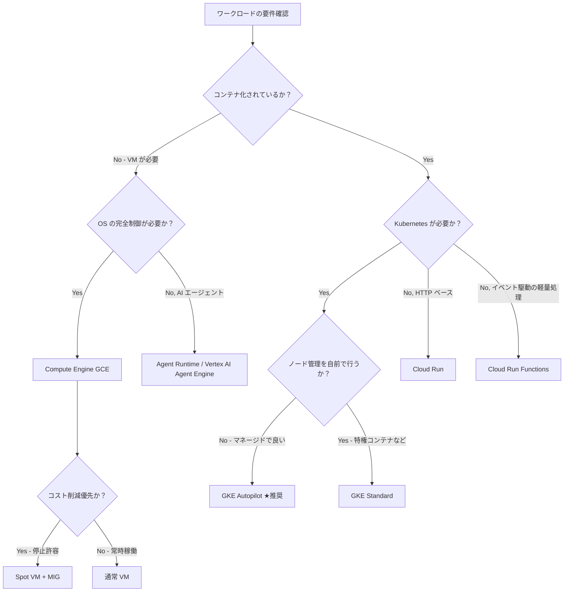
```mermaid
flowchart TD
    A[ワークロードの要件確認] --> B{コンテナ化されているか？}
    B -->|No - VM が必要| C{OS の完全制御が必要か？}
    B -->|Yes| D{Kubernetes が必要か？}
    C -->|Yes| E[Compute Engine GCE]
    C -->|No, AI エージェント| F[Agent Runtime / Vertex AI Agent Engine]
    D -->|Yes| G{ノード管理を自前で行うか？}
    D -->|No, HTTP ベース| H[Cloud Run]
    D -->|No, イベント駆動の軽量処理| I[Cloud Run Functions]
    G -->|No - マネージドで良い| J[GKE Autopilot ★推奨]
    G -->|Yes - 特権コンテナなど| K[GKE Standard]
    E --> L{コスト削減優先か？}
    L -->|Yes - 停止許容| M[Spot VM + MIG]
    L -->|No - 常時稼働| N[通常 VM]
```

### コンピューティングサービス比較表

| サービス | 管理レベル | 課金単位 | 最適なユースケース | 特記事項 |
|----------|-----------|----------|------------------|---------|
| **Compute Engine** | IaaS（完全制御） | vCPU/時 + メモリ/時 | レガシー移行、特定 OS・ライセンス | OS カーネルの変更が可能 |
| **Spot VM** | IaaS（完全制御） | 最大 91% 割引 | バッチ、ML トレーニング、レンダリング | プリエンプト（強制停止）あり |
| **GKE Autopilot** | フルマネージド | Pod リソース（vCPU/メモリ） | マイクロサービス、API サービス | **デフォルト推奨**、セキュリティ自動強化 |
| **GKE Standard** | 半マネージド | ノード（VM）単位 | 特権コンテナ、DaemonSet、GPU/TPU | ノードプールを直接管理 |
| **Cloud Run** | サーバーレス | リクエスト/CPU 秒 | HTTP API、イベント処理、ゼロスケール | 第2世代推奨、Direct VPC Egress |
| **Cloud Run Functions** | サーバーレス | 呼び出し回数 + 時間 | 軽量グルーロジック、Webhook | イベント駆動の最小単位 |
| **Agent Runtime** | フルマネージド | vCPU 時 + GiB 時 | AI エージェントの実行基盤 | Python フレームワーク対応 |

> 🔗 **参考**: https://cloud.google.com/blog/topics/developers-practitioners/where-should-i-run-my-stuff-choosing-google-cloud-compute-option

---

## 1-2. Compute Engine の詳細設定

### マシンファミリーの選択

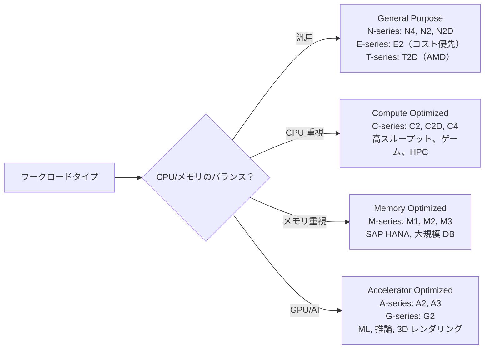
```mermaid
flowchart LR
    A[ワークロードタイプ] --> B{CPU/メモリのバランス？}
    B -->|汎用| C["General Purpose
    N-series: N4, N2, N2D
    E-series: E2（コスト優先）
    T-series: T2D（AMD）"]
    B -->|CPU 重視| D["Compute Optimized
    C-series: C2, C2D, C4
    高スループット、ゲーム、HPC"]
    B -->|メモリ重視| E["Memory Optimized
    M-series: M1, M2, M3
    SAP HANA, 大規模 DB"]
    B -->|GPU/AI| F["Accelerator Optimized
    A-series: A2, A3
    G-series: G2
    ML, 推論, 3D レンダリング"]
```

### VM 可用性ポリシー（Availability Policy）

VM の動作に直接影響する重要な設定です。

| ポリシー項目 | 設定値 | 説明 |
|------------|--------|------|
| **ホストのメンテナンス時の動作** | `MIGRATE`（デフォルト） | ライブマイグレーションで別ホストに移行（ダウンタイムなし） |
| **ホストのメンテナンス時の動作** | `TERMINATE` | VM を停止させる（GPU/TPU 搭載 VM は強制設定） |
| **自動再起動** | `true`（デフォルト） | 障害や Google によるメンテナンス後に自動再起動 |
| **プリエンプティビリティ** | `SPOT` | Spot VM として起動（コスト削減、プリエンプトあり） |

```bash
# 可用性ポリシーを指定して VM を起動
gcloud compute instances create my-vm \
  --machine-type=n2-standard-4 \
  --zone=asia-northeast1-a \
  --maintenance-policy=MIGRATE \
  --restart-on-failure
```

### SSH キーの管理

| 方法 | 推奨度 | 説明 |
|------|--------|------|
| **OS Login** | ✅ 最推奨 | IAM でアクセス制御、退職時即時失効 |
| **プロジェクトレベルのメタデータ SSH キー** | ⚠️ 非推奨 | プロジェクト内全 VM に適用、棚卸しが困難 |
| **インスタンスレベルのメタデータ SSH キー** | ⚠️ 限定使用 | 特定インスタンスのみ、OS Login と組み合わせ可 |

> **試験の罠**: OS Login が有効な場合、メタデータのプロジェクトレベル SSH キーは**無視**されます。

> 🔗 **参考**: https://docs.cloud.google.com/compute/docs/connect/ssh-best-practices/login-access

---

## 1-3. ストレージ選択（Compute Engine 向け）

### Hyperdisk vs Persistent Disk vs Local SSD

2025年6月版の試験ガイドでは **Google Cloud Hyperdisk** が新たに明示されました。

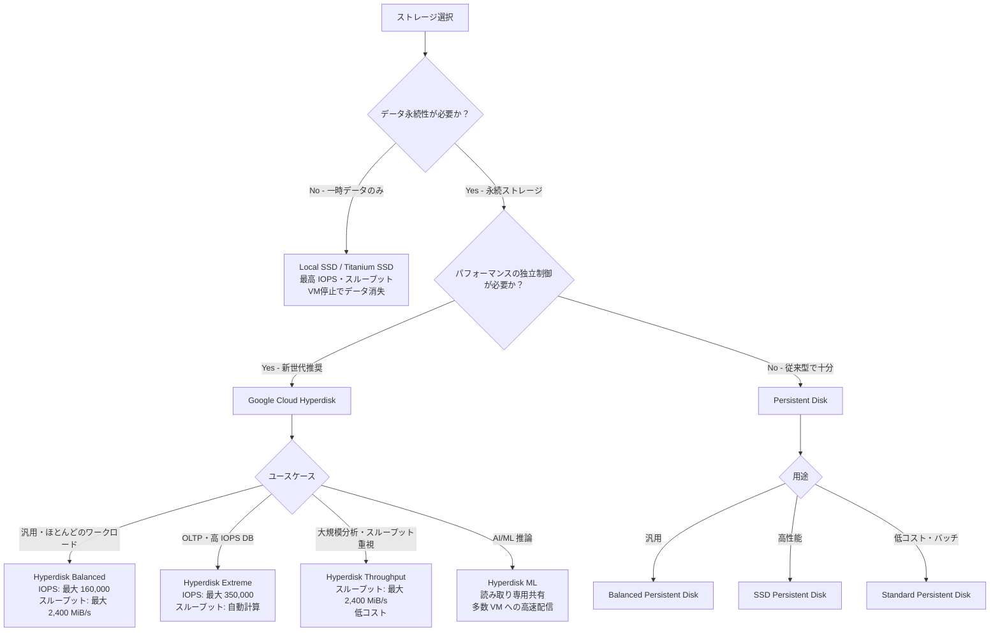
```mermaid
flowchart TD
    A[ストレージ選択] --> B{データ永続性が必要か？}
    B -->|No - 一時データのみ| C["Local SSD / Titanium SSD
    最高 IOPS・スループット
    VM停止でデータ消失"]
    B -->|Yes - 永続ストレージ| D{パフォーマンスの独立制御が必要か？}
    D -->|Yes - 新世代推奨| E[Google Cloud Hyperdisk]
    D -->|No - 従来型で十分| F[Persistent Disk]
    E --> G{ユースケース}
    G -->|汎用・ほとんどのワークロード| H["Hyperdisk Balanced
    IOPS: 最大 160,000
    スループット: 最大 2,400 MiB/s"]
    G -->|OLTP・高 IOPS DB| I["Hyperdisk Extreme
    IOPS: 最大 350,000
    スループット: 自動計算"]
    G -->|大規模分析・スループット重視| J["Hyperdisk Throughput
    スループット: 最大 2,400 MiB/s
    低コスト"]
    G -->|AI/ML 推論| K["Hyperdisk ML
    読み取り専用共有
    多数 VM への高速配信"]
    F --> L{用途}
    L -->|汎用| M[Balanced Persistent Disk]
    L -->|高性能| N[SSD Persistent Disk]
    L -->|低コスト・バッチ| O[Standard Persistent Disk]
```

### ストレージ種別詳細比較

| ストレージタイプ | 最大 IOPS | 最大スループット | 永続性 | 特徴 |
|----------------|---------|----------------|--------|------|
| **Hyperdisk Balanced** | 160,000 | 2,400 MiB/s | ✅ 永続 | **推奨**。性能とコストのバランス。ベースライン 3,000 IOPS / 140 MiB/s が無料 |
| **Hyperdisk Extreme** | 350,000 | 5,000 MiB/s（IOPS 連動） | ✅ 永続 | OLTP、ミッションクリティカル DB |
| **Hyperdisk Throughput** | 低い | 2,400 MiB/s | ✅ 永続 | 分析、スループット重視、低コスト |
| **Hyperdisk ML** | 高い（読み取り） | 高い（読み取り） | ✅ 永続 | AI/ML モデルの高速配信、読み取り専用共有 |
| **Balanced Persistent Disk** | 80,000 | 1,200 MiB/s | ✅ 永続 | 従来型。容量に依存した性能 |
| **SSD Persistent Disk** | 100,000 | 1,200 MiB/s | ✅ 永続 | 高 IOPS 従来型 |
| **Standard Persistent Disk** | 7,500 | 400 MiB/s | ✅ 永続 | 最安。バッチ、コールドデータ |
| **Local SSD（Titanium SSD）** | 2,400,000+ | 超高速 | ❌ 一時 | VM停止でデータ消失。キャッシュ、一時処理のみ |

### Hyperdisk の重要な特性

> **Hyperdisk の最大の優位点**: **性能（IOPS/スループット）と容量を独立してプロビジョニング可能**。  
> Persistent Disk は容量を増やさないと性能が上がらないが、Hyperdisk はサイズを変えずに性能だけ増減できる。

```bash
# Hyperdisk Balanced の作成例（IOPS と スループットを独立指定）
gcloud compute disks create my-hyperdisk \
  --type=hyperdisk-balanced \
  --size=500GB \
  --provisioned-iops=10000 \      # 容量と独立して指定可能
  --provisioned-throughput=500 \  # MiB/s 単位
  --zone=asia-northeast1-a
```

### Zonal vs Regional Persistent Disk

| 項目 | Zonal PD | Regional PD |
|------|----------|-------------|
| レプリケーション | 1ゾーン内 | 2ゾーン間で同期レプリケーション |
| 可用性 | ゾーン障害でアクセス不可 | 1ゾーン障害でも継続 |
| コスト | 低い | 約2倍 |
| 推奨用途 | 開発・テスト | 本番 DB、HA 構成 |

> 🔗 **参考**: https://docs.cloud.google.com/compute/docs/disks/hyperdisks  
> 🔗 **参考**: https://docs.cloud.google.com/compute/docs/disks

---

## 1-4. Managed Instance Group (MIG)

### MIG の役割と構成

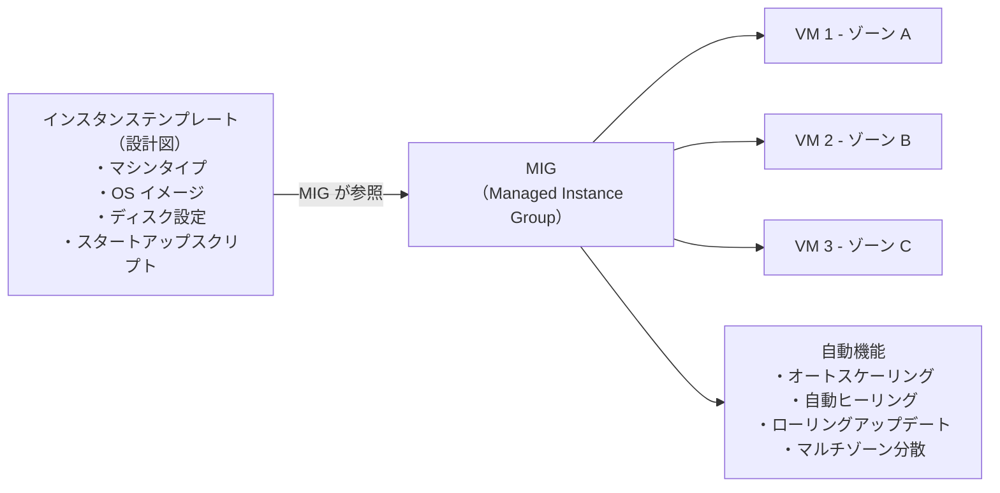
```mermaid
flowchart LR
    T["インスタンステンプレート
    （設計図）
    ・マシンタイプ
    ・OS イメージ
    ・ディスク設定
    ・スタートアップスクリプト"] -->|MIG が参照| M

    M["MIG
    （Managed Instance Group）"]
    M --> V1[VM 1 - ゾーン A]
    M --> V2[VM 2 - ゾーン B]
    M --> V3[VM 3 - ゾーン C]
    M --> AUTO["自動機能
    ・オートスケーリング
    ・自動ヒーリング
    ・ローリングアップデート
    ・マルチゾーン分散"]
```

### MIG 作成の基本フロー

```bash
# Step 1: インスタンステンプレートの作成
gcloud compute instance-templates create web-template \
  --machine-type=n2-standard-4 \
  --image-family=debian-12 \
  --image-project=debian-cloud \
  --boot-disk-size=50GB \
  --boot-disk-type=hyperdisk-balanced \
  --service-account=web-sa@PROJECT_ID.iam.gserviceaccount.com \
  --scopes=cloud-platform \
  --metadata=startup-script-url=gs://my-bucket/startup.sh \
  --tags=web-server

# Step 2: リージョン MIG の作成（本番環境推奨）
gcloud compute instance-groups managed create web-mig \
  --template=web-template \
  --size=3 \
  --region=asia-northeast1

# Step 3: オートスケーリングの設定
gcloud compute instance-groups managed set-autoscaling web-mig \
  --region=asia-northeast1 \
  --max-num-replicas=10 \
  --min-num-replicas=3 \
  --target-cpu-utilization=0.6 \
  --cool-down-period=90

# Step 4: ヘルスチェック + 自動ヒーリングの設定
gcloud compute health-checks create http web-health-check \
  --port=8080 \
  --request-path=/healthz \
  --check-interval=30s \
  --timeout=10s \
  --unhealthy-threshold=3

gcloud compute instance-groups managed set-autohealing web-mig \
  --region=asia-northeast1 \
  --health-check=web-health-check \
  --initial-delay=300
```

### ゾーン MIG vs リージョン MIG

| 項目 | ゾーン MIG | リージョン MIG |
|------|-----------|-------------|
| 展開範囲 | 1ゾーン | 最大3ゾーンに均等分散 |
| 耐障害性 | 低い（ゾーン障害で全停止） | 高い（1ゾーン障害でも継続） |
| 推奨環境 | 開発・テスト | **本番環境** |

### ベストプラクティス: MIG

- 本番環境は**リージョン MIG** でゾーン障害に備える
- `--max-num-replicas` に**上限を設ける**（コスト暴走防止）
- ローリングアップデート時は `--max-unavailable=0` でゼロダウンタイムを実現
- Spot VM との組み合わせでバッチ処理のコストを大幅削減（`--provisioning-model=SPOT`）

> 🔗 **参考**: https://docs.cloud.google.com/compute/docs/instance-groups/creating-groups-of-managed-instances

---

## 1-5. OS Login と VM Manager

### OS Login

OS Login は IAM ポリシーを通じて SSH アクセスを一元管理します。

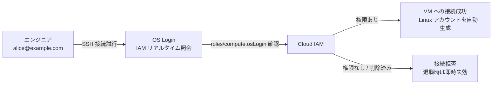
```mermaid
flowchart LR
    User["エンジニア
    alice@example.com"] -->|SSH 接続試行| OSL["OS Login
    IAM リアルタイム照会"]
    OSL -->|roles/compute.osLogin 確認| IAM["Cloud IAM"]
    IAM -->|権限あり| VM["VM への接続成功
    Linux アカウントを自動生成"]
    IAM -->|権限なし / 削除済み| DENY["接続拒否
    退職時は即時失効"]
```

**設定コマンド**:
```bash
# プロジェクト全体で OS Login を有効化
gcloud compute project-info add-metadata \
  --metadata enable-oslogin=TRUE

# 本番環境では 2FA も必須化
gcloud compute project-info add-metadata \
  --metadata enable-oslogin-2fa=TRUE

# ユーザーに SSH 権限を付与（sudo なし）
gcloud projects add-iam-policy-binding PROJECT_ID \
  --member="user:alice@example.com" \
  --role="roles/compute.osLogin"

# sudo 権限が必要な場合
gcloud projects add-iam-policy-binding PROJECT_ID \
  --member="user:alice@example.com" \
  --role="roles/compute.osAdminLogin"
```

| OS Login ロール | sudo 権限 | ユースケース |
|----------------|----------|------------|
| `roles/compute.osLogin` | なし | 一般オペレーター |
| `roles/compute.osAdminLogin` | あり | システム管理者 |

> 🔗 **参考**: https://docs.cloud.google.com/compute/docs/oslogin/set-up-oslogin

### VM Manager（OS パッチ管理・設定管理）

VM Manager は大規模な VM フリートの OS パッチ適用・インベントリ管理・設定管理を自動化するスイートです。

| 機能 | 説明 |
|------|------|
| **OS パッチ管理** | パッチの定期スケジュール設定、ゾーン単位のローリング適用 |
| **OS インベントリ管理** | インストール済みパッケージ・OS 情報の自動収集 |
| **OS 設定管理** | エージェントの大規模展開、設定の強制適用 |

```bash
# プロジェクトレベルで VM Manager を有効化
gcloud compute project-info add-metadata \
  --metadata=enable-osconfig=TRUE

# パッチデプロイメントのスケジュール作成（毎週日曜 AM 2:00）
gcloud compute os-config patch-deployments create weekly-patch \
  --file=patch-deployment.yaml
```

**パッチデプロイメント YAML の例**:
```yaml
instanceFilter:
  all: true
patchConfig:
  rebootConfig: DEFAULT
  apt:
    type: DIST
recurringSchedule:
  frequency: WEEKLY
  weekly:
    dayOfWeek: SUNDAY
  timeOfDay:
    hours: 2
  timeZone:
    id: Asia/Tokyo
rollout:
  mode: ZONE_BY_ZONE
  disruptionBudget:
    percent: 25
```

> 🔗 **参考**: https://docs.cloud.google.com/compute/vm-manager/docs/patch

---

## 1-6. Spot VM とカスタムマシンタイプ

### Spot VM の仕組みと設計原則

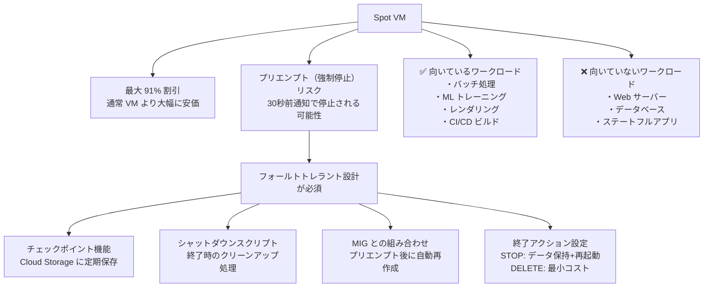
```mermaid
flowchart TD
    SV["Spot VM"] --> ADV["最大 91% 割引
    通常 VM より大幅に安価"]
    SV --> RISK["プリエンプト（強制停止）リスク
    30秒前通知で停止される可能性"]

    RISK --> DESIGN["フォールトトレラント設計が必須"]
    DESIGN --> CP["チェックポイント機能
    Cloud Storage に定期保存"]
    DESIGN --> SS["シャットダウンスクリプト
    終了時のクリーンアップ処理"]
    DESIGN --> MIG_COMBO["MIG との組み合わせ
    プリエンプト後に自動再作成"]
    DESIGN --> TA["終了アクション設定
    STOP: データ保持+再起動
    DELETE: 最小コスト"]

    SV --> GOOD["✅ 向いているワークロード
    ・バッチ処理
    ・ML トレーニング
    ・レンダリング
    ・CI/CD ビルド"]
    SV --> BAD["❌ 向いていないワークロード
    ・Web サーバー
    ・データベース
    ・ステートフルアプリ"]
```

```bash
# Spot VM の作成
gcloud compute instances create my-spot-vm \
  --machine-type=n2-standard-4 \
  --zone=asia-northeast1-a \
  --provisioning-model=SPOT \
  --instance-termination-action=STOP  # STOP or DELETE
```

### カスタムマシンタイプ

標準マシンタイプでは要件を満たせない場合、vCPU とメモリを独立して指定できます。

```bash
# カスタムマシンタイプの例（6 vCPU、20GB メモリ）
gcloud compute instances create custom-vm \
  --custom-cpu=6 \
  --custom-memory=20GB \
  --zone=asia-northeast1-a

# 拡張メモリ（Extended Memory）も指定可能
gcloud compute instances create highmem-vm \
  --custom-cpu=4 \
  --custom-memory=32GB \
  --custom-extensions         # 拡張メモリを有効化
```

**カスタムタイプを選ぶ判断基準**:
- 標準タイプの vCPU/メモリ比率（1:1、1:4、1:8）に当てはまらない要件
- コストを最適化したい場合（不要なリソースに課金しない）
- ただし、`E2` などの特定ファミリーはカスタムタイプをサポートしない

> 🔗 **参考**: https://docs.cloud.google.com/compute/docs/instances/create-use-spot

---

## 1-7. GKE の展開設定

### GKE Autopilot vs Standard の選択

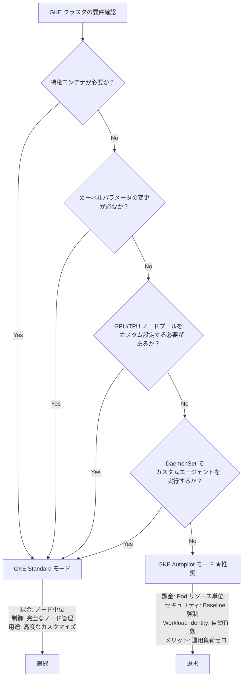
```mermaid
flowchart TD
    Start[GKE クラスタの要件確認] --> Q1{特権コンテナが必要か？}
    Q1 -->|Yes| S[GKE Standard モード]
    Q1 -->|No| Q2{カーネルパラメータの変更が必要か？}
    Q2 -->|Yes| S
    Q2 -->|No| Q3{GPU/TPU ノードプールを
    カスタム設定する必要があるか？}
    Q3 -->|Yes| S
    Q3 -->|No| Q4{DaemonSet で
    カスタムエージェントを実行するか？}
    Q4 -->|Yes| S
    Q4 -->|No| A[GKE Autopilot モード ★推奨]

    A -->|"課金: Pod リソース単位
    セキュリティ: Baseline 強制
    Workload Identity: 自動有効
    メリット: 運用負荷ゼロ"| AP_NOTE[選択]
    S -->|"課金: ノード単位
    制御: 完全なノード管理
    用途: 高度なカスタマイズ"| S_NOTE[選択]
```

### GKE クラスタの主要設定オプション

| 設定項目 | Autopilot | Standard | 説明 |
|----------|-----------|----------|------|
| **リージョナルクラスタ** | ✅ 推奨 | ✅ 推奨 | コントロールプレーンを複数ゾーンに分散（HA） |
| **プライベートクラスタ** | ✅ 対応 | ✅ 対応 | ノードに外部 IP を付与しない（セキュリティ強化） |
| **Workload Identity** | 自動有効 | 手動設定 | Pod が JSON キーなしで GCP API にアクセス |
| **Binary Authorization** | 推奨 | 推奨 | 署名済みイメージのみデプロイ許可 |

### kubectl のインストールと設定

```bash
# Google Cloud SDK 経由で kubectl をインストール
gcloud components install kubectl

# クラスタの認証情報を取得（.kubeconfig に追記）
gcloud container clusters get-credentials my-cluster \
  --region=asia-northeast1

# コンテキストの切り替え
kubectl config use-context gke_PROJECT_ID_asia-northeast1_my-cluster

# クラスタ作成コマンド（Autopilot）
gcloud container clusters create-auto my-autopilot-cluster \
  --region=asia-northeast1 \
  --enable-private-nodes \
  --master-ipv4-cidr=172.16.0.0/28

# クラスタ作成コマンド（Standard - プライベートクラスタ）
gcloud container clusters create my-standard-cluster \
  --machine-type=n2-standard-4 \
  --num-nodes=3 \
  --region=asia-northeast1 \
  --enable-autoscaling \
  --min-nodes=1 \
  --max-nodes=10 \
  --workload-pool=PROJECT_ID.svc.id.goog \
  --enable-private-nodes \
  --master-ipv4-cidr=172.16.0.0/28
```

### コンテナ化アプリケーションの GKE デプロイ

```bash
# コンテナイメージのデプロイ
kubectl create deployment my-app \
  --image=gcr.io/PROJECT_ID/my-app:v1 \
  --replicas=3

# サービスの公開（ロードバランサ経由）
kubectl expose deployment my-app \
  --type=LoadBalancer \
  --port=80 \
  --target-port=8080

# デプロイメントの確認
kubectl get deployments
kubectl get pods -o wide
kubectl get services
```

> 🔗 **参考**: https://docs.cloud.google.com/kubernetes-engine/docs/concepts/autopilot-security  
> 🔗 **参考**: https://docs.cloud.google.com/kubernetes-engine/docs/resources/autopilot-standard-feature-comparison

---

## 1-8. サーバーレスコンピューティング

### Cloud Run のネットワーキングアーキテクチャ

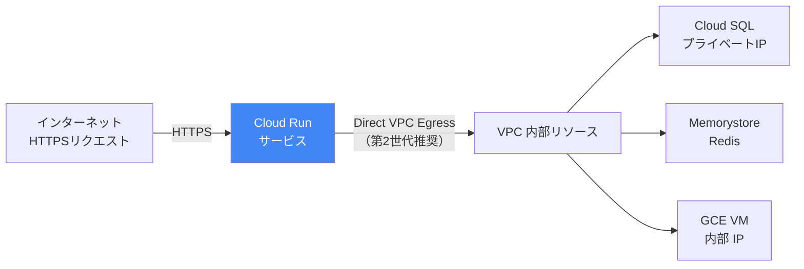
```mermaid
flowchart LR
    Internet["インターネット
    HTTPSリクエスト"] -->|HTTPS| CR["Cloud Run
    サービス"]
    CR -->|"Direct VPC Egress
    （第2世代推奨）"| VPC["VPC 内部リソース"]
    VPC --> SQL["Cloud SQL
    プライベートIP"]
    VPC --> MEM["Memorystore
    Redis"]
    VPC --> GCE["GCE VM
    内部 IP"]

    style CR fill:#4285f4,color:#fff
```

```bash
# Cloud Run のデプロイ（第2世代 + Direct VPC Egress）
gcloud run deploy my-service \
  --image=gcr.io/PROJECT_ID/my-app:latest \
  --region=asia-northeast1 \
  --execution-environment=gen2 \
  --vpc-egress=all-traffic \
  --network=my-vpc \
  --subnet=my-subnet \
  --min-instances=1 \         # コールドスタート対策
  --max-instances=100 \       # コスト暴走防止
  --concurrency=80 \          # 同時リクエスト数
  --timeout=300s

# Eventarc トリガーの設定（Pub/Sub イベント）
gcloud eventarc triggers create my-trigger \
  --location=asia-northeast1 \
  --service-account=trigger-sa@PROJECT_ID.iam.gserviceaccount.com \
  --destination-run-service=my-service \
  --destination-run-region=asia-northeast1 \
  --transport-topic=my-topic \
  --event-filters="type=google.cloud.pubsub.topic.v1.messagePublished"
```

### イベント処理のトリガー種別

| トリガー種別 | ユースケース | 設定方法 |
|------------|------------|---------|
| **Pub/Sub メッセージ** | 非同期処理、キューイング | Eventarc / 直接 Pub/Sub push |
| **Cloud Storage 変更通知** | ファイルアップロード処理 | Eventarc |
| **HTTP リクエスト** | REST API、Webhook | 直接 HTTPS エンドポイント |
| **Cloud Scheduler** | 定期バッチ処理 | Scheduler → Pub/Sub → Cloud Run |
| **Firebase イベント** | モバイルバックエンド | Eventarc |

### Cloud Run Functions のトリガー設定

```bash
# HTTP トリガー（第2世代）
gcloud functions deploy my-function \
  --gen2 \
  --runtime=python312 \
  --trigger-http \
  --allow-unauthenticated \
  --region=asia-northeast1 \
  --entry-point=main \
  --memory=512MB \
  --timeout=300s

# Pub/Sub トリガー（イベント駆動）
gcloud functions deploy process-message \
  --gen2 \
  --runtime=python312 \
  --trigger-topic=my-topic \
  --region=asia-northeast1 \
  --entry-point=process_pubsub

# Cloud Storage トリガー
gcloud functions deploy process-upload \
  --gen2 \
  --runtime=python312 \
  --trigger-event=google.cloud.storage.object.v1.finalized \
  --trigger-resource=my-bucket \
  --region=asia-northeast1 \
  --entry-point=process_file
```

> 🔗 **参考**: https://docs.cloud.google.com/run/docs/configuring/networking-best-practices

---

## 1-9. GPU と TPU の選択基準

2025年版の試験ガイドで**明示的に追加**されたトピックです。

### GPU vs TPU の選択フローチャート

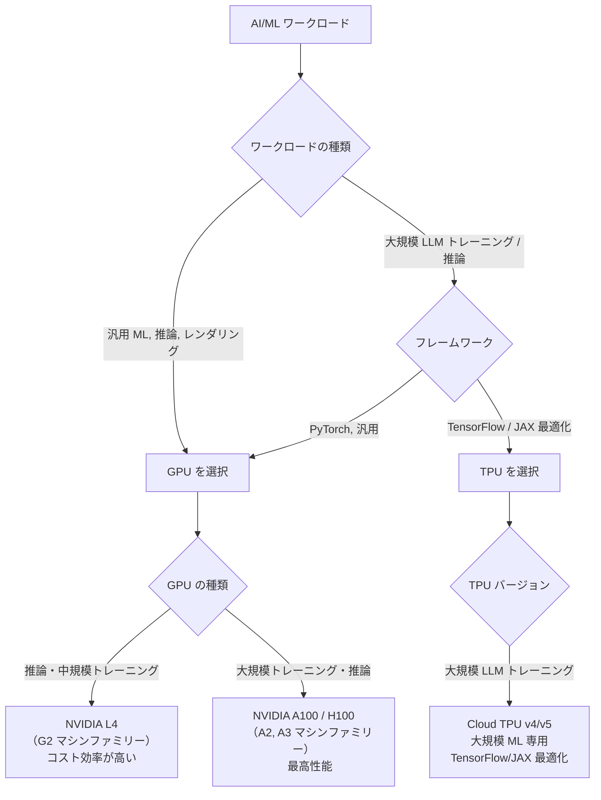
```mermaid
flowchart TD
    A[AI/ML ワークロード] --> B{ワークロードの種類}
    B -->|汎用 ML, 推論, レンダリング| C[GPU を選択]
    B -->|大規模 LLM トレーニング / 推論| D{フレームワーク}
    D -->|TensorFlow / JAX 最適化| E[TPU を選択]
    D -->|PyTorch, 汎用| C
    C --> F{GPU の種類}
    F -->|推論・中規模トレーニング| G["NVIDIA L4
    （G2 マシンファミリー）
    コスト効率が高い"]
    F -->|大規模トレーニング・推論| H["NVIDIA A100 / H100
    （A2, A3 マシンファミリー）
    最高性能"]
    E --> I{TPU バージョン}
    I -->|大規模 LLM トレーニング| J["Cloud TPU v4/v5
    大規模 ML 専用
    TensorFlow/JAX 最適化"]
```

| アクセラレータ | マシンファミリー | ユースケース | 特記事項 |
|-------------|---------------|------------|---------|
| **NVIDIA L4** | G2 | コスト効率の良い推論、動画処理 | 汎用 GPU の中でコスパ最高 |
| **NVIDIA A100** | A2 | 大規模 ML トレーニング、科学計算 | HBM メモリ搭載 |
| **NVIDIA H100** | A3 | 最先端 LLM トレーニング | 最高性能 GPU |
| **Cloud TPU v4** | 専用 Pod | 大規模 TensorFlow/JAX モデル | Google 独自設計 |
| **Cloud TPU v5** | 専用 Pod | 超大規模 LLM | 最新世代 |

> **試験のポイント**: GPU 搭載 VM は `--maintenance-policy=TERMINATE` が**強制**です（ライブマイグレーション不可）。

> 🔗 **参考**: https://docs.cloud.google.com/compute/docs/gpus

---

## 1-10. Agent Runtime on Gemini Enterprise Agent Platform

2025年6月版の試験ガイドで**新規追加**されたトピックです（旧名: Vertex AI Agent Engine）。

### Agent Runtime の概要

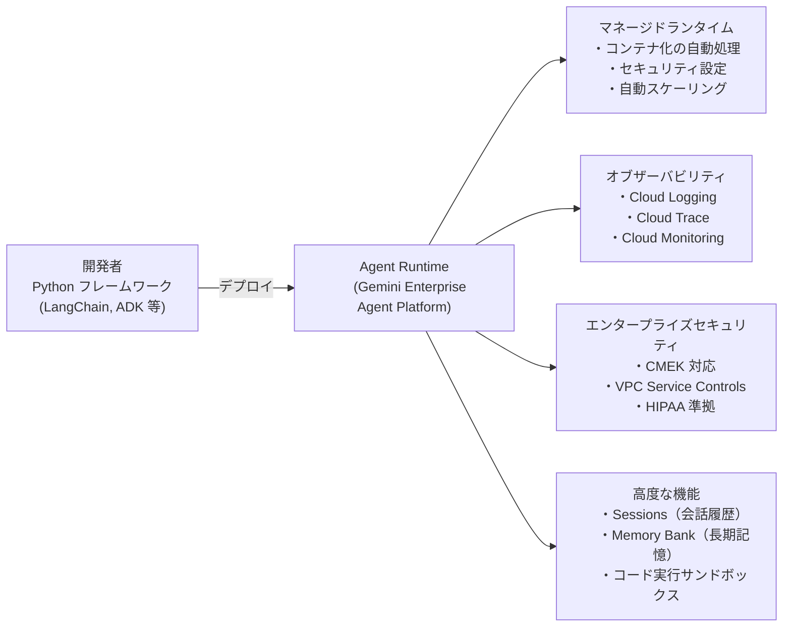
```mermaid
flowchart LR
    Dev["開発者
    Python フレームワーク
    (LangChain, ADK 等)"] -->|デプロイ| AR["Agent Runtime
    (Gemini Enterprise Agent Platform)"]
    AR --> M["マネージドランタイム
    ・コンテナ化の自動処理
    ・セキュリティ設定
    ・自動スケーリング"]
    AR --> OBS["オブザーバビリティ
    ・Cloud Logging
    ・Cloud Trace
    ・Cloud Monitoring"]
    AR --> SEC["エンタープライズセキュリティ
    ・CMEK 対応
    ・VPC Service Controls
    ・HIPAA 準拠"]
    AR --> FEAT["高度な機能
    ・Sessions（会話履歴）
    ・Memory Bank（長期記憶）
    ・コード実行サンドボックス"]
```

| 機能 | 説明 |
|------|------|
| **マネージドランタイム** | コンテナ化・デプロイを自動処理、スケーリングも管理不要 |
| **Sessions** | 会話履歴を管理、マルチターン会話をサポート |
| **Memory Bank** | 会話から長期記憶を抽出、パーソナライズを実現 |
| **コード実行** | セキュアなサンドボックス環境でコードを実行 |
| **課金モデル** | vCPU 時 + GiB 時（使用リソースに応じた課金） |

> 🔗 **参考**: https://cloud.google.com/products/gemini-enterprise-agent-platform

---

## Section 2.2

# Section 2.2: ストレージとデータソリューションの計画と実装

---

## 2-1. データベースサービスの選択と展開

### データベース選択フローチャート

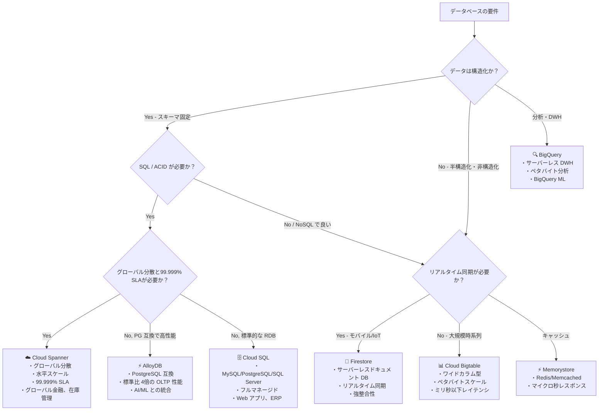
```mermaid
flowchart TD
    A[データベースの要件] --> B{データは構造化か？}
    B -->|Yes - スキーマ固定| C{SQL / ACID が必要か？}
    B -->|No - 半構造化・非構造化| D{リアルタイム同期が必要か？}
    C -->|Yes| E{グローバル分散と99.999% SLAが必要か？}
    C -->|No / NoSQL で良い| D
    E -->|Yes| F["☁️ Cloud Spanner
    ・グローバル分散
    ・水平スケール
    ・99.999% SLA
    ・グローバル金融、在庫管理"]
    E -->|No, PG 互換で高性能| G["⚡ AlloyDB
    ・PostgreSQL 互換
    ・標準比 4倍の OLTP 性能
    ・AI/ML との統合"]
    E -->|No, 標準的な RDB| H["🗄️ Cloud SQL
    ・MySQL/PostgreSQL/SQL Server
    ・フルマネージド
    ・Web アプリ、ERP"]
    D -->|Yes - モバイル/IoT| I["📱 Firestore
    ・サーバーレスドキュメント DB
    ・リアルタイム同期
    ・強整合性"]
    D -->|No - 大規模時系列| J["📊 Cloud Bigtable
    ・ワイドカラム型
    ・ペタバイトスケール
    ・ミリ秒以下レイテンシ"]
    B -->|分析・DWH| K["🔍 BigQuery
    ・サーバーレス DWH
    ・ペタバイト分析
    ・BigQuery ML"]
    D -->|キャッシュ| L["⚡ Memorystore
    ・Redis/Memcached
    ・マイクロ秒レスポンス"]
```

### データベースサービス完全比較表

| サービス | 種別 | スケール | 整合性 | ユースケース | 新機能（2025）|
|----------|------|----------|--------|------------|-------------|
| **Cloud SQL** | リレーショナル | 中規模 | 強整合性 | Web アプリ、ERP | - |
| **Cloud Spanner** | リレーショナル | グローバル水平 | 外部整合性 | 金融、グローバル在庫 | - |
| **AlloyDB** | リレーショナル（PG互換） | 大規模 | 強整合性 | HTAP、高性能 OLTP | pgvector でベクトル検索 |
| **Firestore** | ドキュメント型 | 自動 | 強整合性（デフォルト）| モバイル、IoT | - |
| **Cloud Bigtable** | ワイドカラム型 | ペタバイト | 結果整合性 | 時系列、IoT、広告 | - |
| **Memorystore** | インメモリ | 中規模 | - | キャッシュ、セッション | Managed Kafka 対応 |
| **BigQuery** | DWH | ペタバイト | - | 分析、BI | BigQuery ML、Omni |
| **Dataflow** | ストリーム/バッチ処理 | 自動スケール | - | ETL/ELT パイプライン | - |
| **Pub/Sub** | メッセージング | 大規模 | - | 非同期通信、イベント | - |
| **Managed Kafka** | ストリーミング | 大規模 | - | Kafka 互換ストリーミング | **2025年新サービス** |

### Managed Kafka（2025年追加）

Google Cloud Managed Service for Apache Kafka は、フルマネージドの Kafka 互換ストリーミングサービスです。

```bash
# Managed Kafka クラスタの作成
gcloud managed-kafka clusters create my-kafka-cluster \
  --location=asia-northeast1 \
  --cpu=3 \
  --memory=3GiB
```

> 🔗 **参考**: https://cloud.google.com/managed-kafka/docs/overview

---

## 2-2. ストレージサービスの選択と展開

### Cloud Storage ストレージクラスの選択

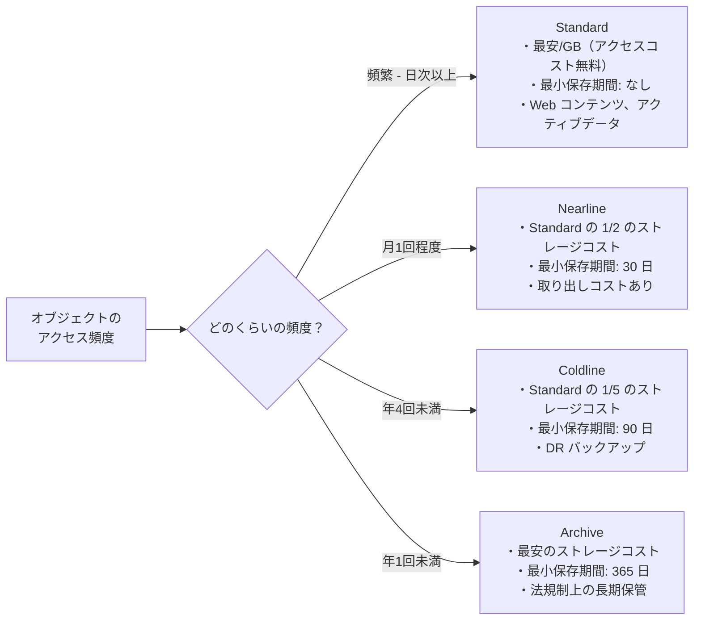
```mermaid
flowchart LR
    A[オブジェクトの
    アクセス頻度] --> B{どのくらいの頻度？}
    B -->|頻繁 - 日次以上| C["Standard
    ・最安/GB（アクセスコスト無料）
    ・最小保存期間: なし
    ・Web コンテンツ、アクティブデータ"]
    B -->|月1回程度| D["Nearline
    ・Standard の 1/2 のストレージコスト
    ・最小保存期間: 30 日
    ・取り出しコストあり"]
    B -->|年4回未満| E["Coldline
    ・Standard の 1/5 のストレージコスト
    ・最小保存期間: 90 日
    ・DR バックアップ"]
    B -->|年1回未満| F["Archive
    ・最安のストレージコスト
    ・最小保存期間: 365 日
    ・法規制上の長期保管"]
```

### ファイルストレージサービスの比較（2025年版）

2025年版では **Google Cloud Managed Lustre** と **Google Cloud NetApp Volumes** が試験範囲に追加されました。

| サービス | プロトコル | パフォーマンス | ユースケース | 特徴 |
|----------|-----------|-------------|------------|------|
| **Filestore** | NFS | 高い | GKE 共有ストレージ、CMS | スケール: GiB〜100TiB |
| **Google Cloud Managed Lustre** | Lustre（並列FS） | 超高速（ペタバイト） | HPC、ML トレーニング、大規模科学計算 | 複数 VM からの並列アクセス |
| **Google Cloud NetApp Volumes** | NFS / SMB / iSCSI | 高い | エンタープライズ、Windows/Linux 混在 | ONTAP 互換、データ保護機能が豊富 |

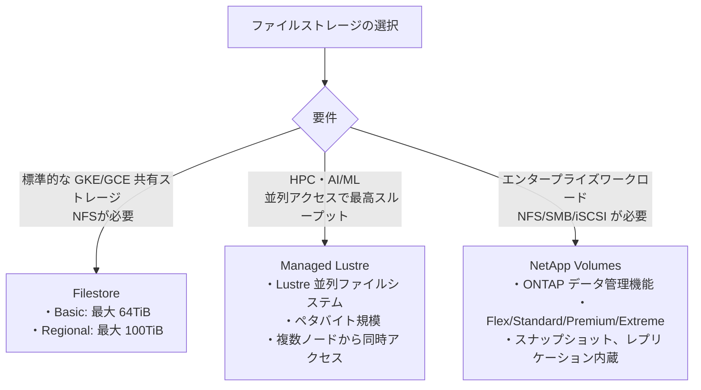
```mermaid
flowchart TD
    F[ファイルストレージの選択] --> P{要件}
    P -->|"標準的な GKE/GCE 共有ストレージ
    NFSが必要"| FS["Filestore
    ・Basic: 最大 64TiB
    ・Regional: 最大 100TiB"]
    P -->|"HPC・AI/ML
    並列アクセスで最高スループット"| ML["Managed Lustre
    ・Lustre 並列ファイルシステム
    ・ペタバイト規模
    ・複数ノードから同時アクセス"]
    P -->|"エンタープライズワークロード
    NFS/SMB/iSCSI が必要"| NV["NetApp Volumes
    ・ONTAP データ管理機能
    ・Flex/Standard/Premium/Extreme
    ・スナップショット、レプリケーション内蔵"]
```

> 🔗 **参考 (Filestore)**: https://cloud.google.com/filestore/docs  
> 🔗 **参考 (Managed Lustre)**: https://cloud.google.com/products/managed-lustre  
> 🔗 **参考 (NetApp Volumes)**: https://cloud.google.com/netapp-volumes

---

## 2-3. データのロード方法

### データロード手法の比較

| 方法 | ユースケース | 特徴 |
|------|------------|------|
| **コマンドライン（gsutil / gcloud storage）** | 小〜中規模のファイル転送 | シンプル、スクリプト化が容易 |
| **Cloud Storage からのロード** | BigQuery、Bigtable への一括ロード | 最も効率的なバルクロード手法 |
| **Storage Transfer Service** | 他クラウド/オンプレミスからの移行 | スケジュール設定、大規模データ移行 |
| **Transfer Appliance** | 数 PB 規模のオフライン移行 | 物理デバイスを使ったデータ移送 |
| **Dataflow** | ストリーミング/バッチ ETL | リアルタイム変換、複雑なパイプライン |
| **BigQuery Data Transfer Service** | SaaS からの定期取り込み | Google Analytics、Ads など |

```bash
# Cloud Storage へのアップロード（コマンドライン）
gcloud storage cp local-file.csv gs://my-bucket/data/

# ディレクトリの再帰的コピー
gcloud storage cp -r ./data/ gs://my-bucket/data/

# BigQuery へのデータロード（Cloud Storage 経由）
bq load \
  --source_format=CSV \
  --skip_leading_rows=1 \
  my_dataset.my_table \
  gs://my-bucket/data/*.csv \
  schema.json

# Storage Transfer Service によるスケジュール転送
gcloud transfer jobs create \
  s3://aws-bucket my-gcs-bucket \
  --source-creds-file=aws-creds.json \
  --schedule-starts=2025-07-01T02:00:00Z \
  --schedule-repeats-every=24h
```

---

## 2-4. マルチリージョン冗長性

### データ冗長性の設計パターン

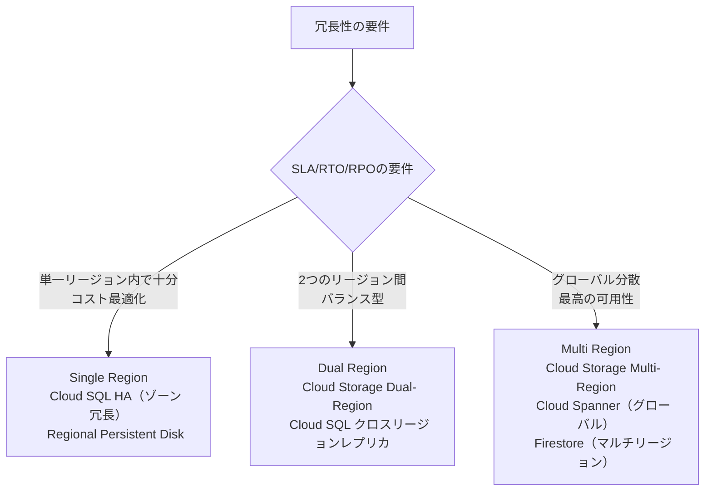
```mermaid
flowchart TD
    R[冗長性の要件] --> D{SLA/RTO/RPOの要件}
    D -->|"単一リージョン内で十分
    コスト最適化"| SR["Single Region
    Cloud SQL HA（ゾーン冗長）
    Regional Persistent Disk"]
    D -->|"2つのリージョン間
    バランス型"| DR["Dual Region
    Cloud Storage Dual-Region
    Cloud SQL クロスリージョンレプリカ"]
    D -->|"グローバル分散
    最高の可用性"| MR["Multi Region
    Cloud Storage Multi-Region
    Cloud Spanner（グローバル）
    Firestore（マルチリージョン）"]
```

| サービス | Single Region | Dual Region | Multi Region |
|----------|--------------|-------------|-------------|
| **Cloud Storage** | ✅ | ✅（2リージョン） | ✅（US/EU/ASIA） |
| **Cloud SQL** | HA（同一リージョン2ゾーン） | クロスリージョンレプリカ（読み取り専用） | ❌ |
| **Cloud Spanner** | ✅ | ✅ | ✅（真のグローバル分散） |
| **Firestore** | ✅ | ❌ | ✅ |
| **BigQuery** | ✅ | ✅ | ✅ |

> 🔗 **参考**: https://cloud.google.com/storage/docs/locations

---

## Section 2.3

# Section 2.3: ネットワークリソースの計画と実装

---

## 3-1. VPC とサブネットの設計

### VPC ネットワークの種類

| VPC モード | 説明 | 推奨用途 |
|-----------|------|---------|
| **Auto Mode** | 各リージョンにサブネットを自動作成（10.128.0.0/9） | 学習・PoC |
| **Custom Mode** | サブネットの IP レンジを手動設計 | **本番環境（推奨）** |

```bash
# カスタムモード VPC の作成
gcloud compute networks create my-vpc \
  --subnet-mode=custom \
  --bgp-routing-mode=regional

# サブネットの作成（Private Google Access を有効化）
gcloud compute networks subnets create web-subnet \
  --network=my-vpc \
  --region=asia-northeast1 \
  --range=10.1.1.0/24 \
  --enable-private-ip-google-access  # 外部 IP なしで GCP API にアクセス可能
```

### Shared VPC vs VPC Network Peering

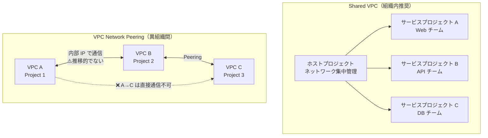
```mermaid
flowchart TB
    subgraph SVPC ["Shared VPC（組織内推奨）"]
        HP["ホストプロジェクト
        ネットワーク集中管理"] --> SA["サービスプロジェクト A
        Web チーム"]
        HP --> SB["サービスプロジェクト B
        API チーム"]
        HP --> SC["サービスプロジェクト C
        DB チーム"]
    end

    subgraph PEER ["VPC Network Peering（異組織間）"]
        VA["VPC A
        Project 1"] <-->|"内部 IP で通信
        ⚠️推移的でない"| VB["VPC B
        Project 2"]
        VB <-->|Peering| VC["VPC C
        Project 3"]
        VA -.->|"❌ A→C は直接通信不可"| VC
    end
```

| 比較項目 | Shared VPC | VPC Network Peering |
|---------|-----------|-------------------|
| **管理の一元化** | ✅ ホストプロジェクトで集中管理 | ❌ 各 VPC で個別管理 |
| **推移性** | ✅ ホストのサブネットへのアクセス | ❌ **推移的でない**（A-B-C は A-C 通信不可） |
| **異組織間** | ❌ 同一組織内のみ | ✅ 異組織間も可能 |
| **IP 重複** | 管理可能 | ❌ 重複した IP レンジは Peering 不可 |
| **推奨用途** | 大規模企業の標準構成 | 外部パートナーとの接続 |

> 🔗 **参考**: https://docs.cloud.google.com/vpc/docs/shared-vpc  
> 🔗 **参考**: https://docs.cloud.google.com/architecture/best-practices-vpc-design

---

## 3-2. ファイアウォールルールと Cloud NGFW

### ファイアウォールの種類（2025年版）

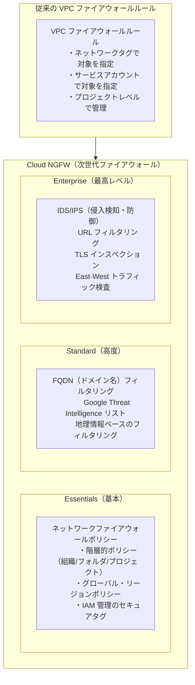
```mermaid
flowchart TB
    subgraph OLD ["従来の VPC ファイアウォールルール"]
        VFR["VPC ファイアウォールルール
        ・ネットワークタグで対象を指定
        ・サービスアカウントで対象を指定
        ・プロジェクトレベルで管理"]
    end

    subgraph NEW ["Cloud NGFW（次世代ファイアウォール）"]
        subgraph TIER_E ["Essentials（基本）"]
            FP["ネットワークファイアウォールポリシー
            ・階層的ポリシー（組織/フォルダ/プロジェクト）
            ・グローバル・リージョンポリシー
            ・IAM 管理のセキュアタグ"]
        end
        subgraph TIER_S ["Standard（高度）"]
            FQDN["FQDN（ドメイン名）フィルタリング
            Google Threat Intelligence リスト
            地理情報ベースのフィルタリング"]
        end
        subgraph TIER_ENT ["Enterprise（最高レベル）"]
            IPS["IDS/IPS（侵入検知・防御）
            URL フィルタリング
            TLS インスペクション
            East-West トラフィック検査"]
        end
    end

    OLD --> NEW
```

### VPC ファイアウォールルールの構成要素

```bash
# Web サーバーへの HTTP/HTTPS 許可（タグベース）
gcloud compute firewall-rules create allow-http-https \
  --network=my-vpc \
  --direction=INGRESS \
  --priority=1000 \
  --action=ALLOW \
  --rules=tcp:80,tcp:443 \
  --target-tags=web-server \
  --source-ranges=0.0.0.0/0

# SSH は IAP からのみ許可（セキュリティ強化）
gcloud compute firewall-rules create allow-ssh-iap \
  --network=my-vpc \
  --direction=INGRESS \
  --priority=1000 \
  --action=ALLOW \
  --rules=tcp:22 \
  --target-tags=ssh-allowed \
  --source-ranges=35.235.240.0/20   # IAP の IP レンジ

# Egress ルール（特定 IP への通信を拒否）
gcloud compute firewall-rules create deny-egress-to-malicious \
  --network=my-vpc \
  --direction=EGRESS \
  --priority=500 \
  --action=DENY \
  --rules=all \
  --destination-ranges=203.0.113.100/32
```

### Cloud NGFW のセキュアタグ（Secure Tags）

セキュアタグは IAM で管理される ID ベースのラベルで、ネットワークタグより強力なセキュリティを提供します。

| 比較項目 | ネットワークタグ（従来） | セキュアタグ（Cloud NGFW） |
|---------|--------------------|-----------------------|
| **管理** | VM のメタデータに直接設定 | 組織/プロジェクトレベルで IAM 管理 |
| **セキュリティ** | ユーザーが自由に変更可能 | タグの付与・変更に IAM 権限が必要 |
| **スコープ** | ネットワーク内 | **組織全体**に適用可能 |
| **推移性** | なし | VPC Peering 経由でも機能 |
| **ファイアウォール適用** | VPC ファイアウォールルール | Cloud NGFW ポリシー |

```bash
# セキュアタグキーの作成
gcloud resource-manager tags keys create webserver \
  --parent=organizations/ORG_ID \
  --purpose=GCE_FIREWALL \
  --purpose-data=network=//compute.googleapis.com/projects/PROJECT/global/networks/my-vpc

# セキュアタグ値の作成
gcloud resource-manager tags values create prod \
  --parent=organizations/ORG_ID/tagKeys/tagkeys/webserver

# ネットワークファイアウォールポリシーの作成
gcloud compute network-firewall-policies create my-policy \
  --global

# ルールの追加（セキュアタグを使用）
gcloud compute network-firewall-policies rules create 1000 \
  --firewall-policy=my-policy \
  --global-firewall-policy \
  --direction=INGRESS \
  --action=allow \
  --layer4-configs=tcp:80 \
  --target-secure-tags=tagValues/VALUE_ID
```

> 🔗 **参考**: https://docs.cloud.google.com/firewall/docs/about-firewalls  
> 🔗 **参考**: https://docs.cloud.google.com/firewall/docs/tags-firewalls-overview

---

## 3-3. ネットワーク接続の確立

### 接続オプションの比較

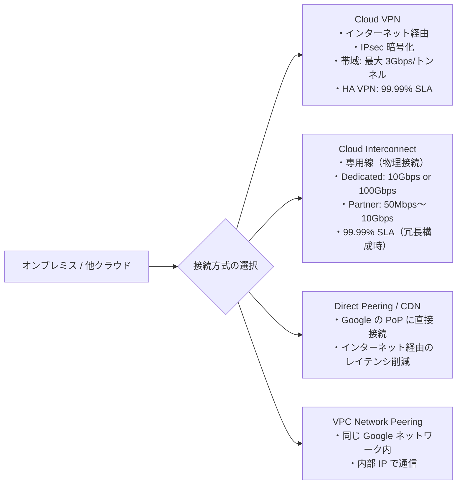
```mermaid
flowchart LR
    OnPrem["オンプレミス / 他クラウド"] --> OPT{接続方式の選択}
    OPT --> VPN["Cloud VPN
    ・インターネット経由
    ・IPsec 暗号化
    ・帯域: 最大 3Gbps/トンネル
    ・HA VPN: 99.99% SLA"]
    OPT --> IC["Cloud Interconnect
    ・専用線（物理接続）
    ・Dedicated: 10Gbps or 100Gbps
    ・Partner: 50Mbps〜10Gbps
    ・99.99% SLA（冗長構成時）"]
    OPT --> PEER["Direct Peering / CDN
    ・Google の PoP に直接接続
    ・インターネット経由のレイテンシ削減"]
    OPT --> VPC_PEER["VPC Network Peering
    ・同じ Google ネットワーク内
    ・内部 IP で通信"]
```

| 接続方法 | 帯域 | SLA | コスト | ユースケース |
|---------|------|-----|--------|------------|
| **HA VPN** | 最大 3Gbps/トンネル | 99.99%（HA 構成） | 低い | オンプレミス接続の標準 |
| **Cloud Interconnect (Dedicated)** | 10G or 100Gbps | 99.99% | 高い | 大規模・ミッションクリティカル |
| **Cloud Interconnect (Partner)** | 50Mbps〜10Gbps | 99.99% | 中程度 | 専用線が引けない場合 |
| **VPC Network Peering** | ネットワーク上限まで | - | なし | 同一 GCP 内の VPC 間 |

```bash
# HA VPN ゲートウェイの作成
gcloud compute vpn-gateways create my-ha-vpn \
  --network=my-vpc \
  --region=asia-northeast1

# Cloud Router の作成（HA VPN に必要）
gcloud compute routers create my-router \
  --network=my-vpc \
  --region=asia-northeast1 \
  --asn=65001          # BGP の AS 番号
```

---

## 3-4. ロードバランサの選定

### ロードバランサ選択フローチャート

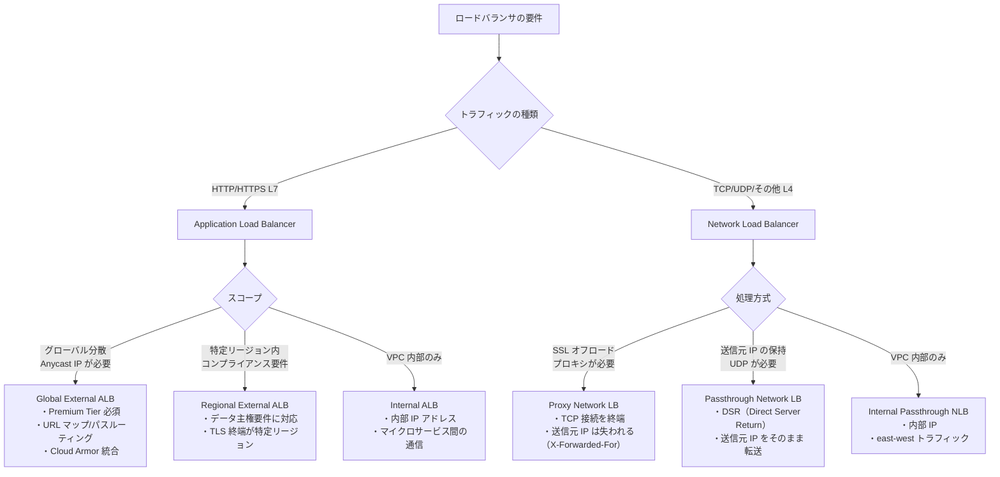
```mermaid
flowchart TD
    A[ロードバランサの要件] --> B{トラフィックの種類}
    B -->|HTTP/HTTPS L7| C[Application Load Balancer]
    B -->|TCP/UDP/その他 L4| D[Network Load Balancer]
    C --> E{スコープ}
    E -->|"グローバル分散
    Anycast IP が必要"| F["Global External ALB
    ・Premium Tier 必須
    ・URL マップ/パスルーティング
    ・Cloud Armor 統合"]
    E -->|"特定リージョン内
    コンプライアンス要件"| G["Regional External ALB
    ・データ主権要件に対応
    ・TLS 終端が特定リージョン"]
    E -->|VPC 内部のみ| H["Internal ALB
    ・内部 IP アドレス
    ・マイクロサービス間の通信"]
    D --> I{処理方式}
    I -->|"SSL オフロード
    プロキシが必要"| J["Proxy Network LB
    ・TCP 接続を終端
    ・送信元 IP は失われる（X-Forwarded-For）"]
    I -->|"送信元 IP の保持
    UDP が必要"| K["Passthrough Network LB
    ・DSR（Direct Server Return）
    ・送信元 IP をそのまま転送"]
    I -->|VPC 内部のみ| L["Internal Passthrough NLB
    ・内部 IP
    ・east-west トラフィック"]
```

### ロードバランサ詳細比較

| ロードバランサ | レイヤ | スコープ | 送信元 IP 保持 | SSL 終端 | Cloud Armor |
|-------------|--------|---------|-------------|---------|------------|
| **Global External ALB** | L7 | グローバル | ❌ | ✅ エッジ | ✅ |
| **Regional External ALB** | L7 | リージョン | ❌ | ✅ リージョン | ✅ |
| **Internal ALB** | L7 | VPC 内部 | ❌ | ✅ | ❌ |
| **Proxy Network LB** | L4 | リージョン | ❌ | ✅ | ❌ |
| **Passthrough Network LB** | L4 | リージョン | ✅ | ❌ | ❌ |
| **Internal Passthrough NLB** | L4 | VPC 内部 | ✅ | ❌ | ❌ |

> **試験頻出の罠**:  
> - コンプライアンス要件（データを特定リージョンに留める）がある場合は **Regional LB** を選択  
> - Proxy 型 NLB は送信元 IP が失われる（`X-Forwarded-For` ヘッダーで補完）  
> - UDP が必要な場合は **Passthrough Network LB** のみ対応

> 🔗 **参考**: https://docs.cloud.google.com/load-balancing/docs/choosing-load-balancer

---

## 3-5. ネットワークサービスティア

2025年版の試験ガイドで明示的に追加されたトピックです。

| ティア | コスト | パフォーマンス | 特徴 |
|--------|--------|------------|------|
| **Premium Tier** | 高い | 最高 | Google のグローバルバックボーンを使用。Global ALB、低レイテンシ |
| **Standard Tier** | 低い | 通常 | インターネット経由でルーティング。リージョン単位の処理。Global ALB は使用不可 |

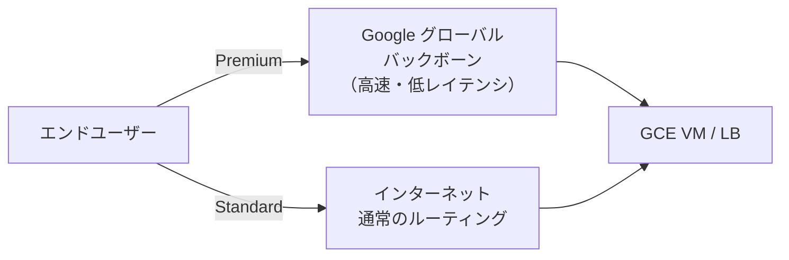
```mermaid
flowchart LR
    User["エンドユーザー"] -->|Premium| GNET["Google グローバル
    バックボーン
    （高速・低レイテンシ）"] --> GCE["GCE VM / LB"]
    User -->|Standard| Internet["インターネット
    通常のルーティング"] --> GCE
```

> **重要**: `Global External ALB` は **Premium Tier** でのみ真のグローバル配信が可能。Standard Tier では Regional として動作する。

> 🔗 **参考**: https://cloud.google.com/network-tiers/docs/overview

---

## Section 2.4

# Section 2.4: ツールを用いたリソースの計画と実装

---

## 4-1. Infrastructure as Code ツール

### IaC ツールの比較（2025年版）

2025年版の試験ガイドでは **Fabric FAST** と **Helm** が明示的に追加されました。

| ツール | 特性 | 主な用途 |
|--------|------|---------|
| **Terraform** | 宣言的 IaC、プロバイダーエコシステム | GCP リソースの全般的な管理 |
| **Fabric FAST** | Terraform ベースのエンタープライズ Landing Zone | 組織全体の基盤構築、Google PSO 推奨 |
| **Config Connector** | Kubernetes CRD で GCP リソースを管理 | GKE 環境での GCP リソース管理 |
| **Helm** | Kubernetes パッケージマネージャー | GKE アプリケーションのデプロイ管理 |

### Terraform の運用ベストプラクティス

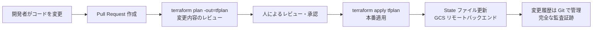
```mermaid
flowchart LR
    DEV["開発者がコードを変更"] --> PR["Pull Request 作成"]
    PR --> PLAN["terraform plan -out=tfplan
    変更内容のレビュー"]
    PLAN --> REVIEW["人によるレビュー・承認"]
    REVIEW --> APPLY["terraform apply tfplan
    本番適用"]
    APPLY --> STATE["State ファイル更新
    GCS リモートバックエンド"]
    STATE --> AUDIT["変更履歴は Git で管理
    完全な監査証跡"]
```

**State ファイルのリモートバックエンド設定**:
```hcl
# backend.tf
terraform {
  backend "gcs" {
    bucket  = "my-terraform-state-bucket"
    prefix  = "terraform/state"
  }
}
```

```bash
# State バケットの作成（バージョニング必須）
gcloud storage buckets create gs://my-terraform-state-bucket \
  --location=asia-northeast1 \
  --uniform-bucket-level-access

gcloud storage buckets update gs://my-terraform-state-bucket \
  --versioning

# Terraform の初期化とデプロイ
terraform init
terraform plan -out=tfplan
terraform apply tfplan
```

### Fabric FAST（Foundation and Security Toolkit）

Fabric FAST は Google Cloud の Professional Services Organization が開発した、エンタープライズグレードの GCP 組織を段階的に構築するための Terraform ベースのツールキットです。

```mermaid
flowchart LR
    S0["Stage 0: Bootstrap
    ・Terraform の実行基盤
    ・State バケット
    ・CI/CD プロジェクト"] --> S1["Stage 1: Organization
    ・フォルダ階層
    ・組織ポリシー
    ・ロギング"] --> S2["Stage 2: Networking
    ・Shared VPC
    ・Hub-and-Spoke
    ・DNS 設計"] --> S3["Stage 3: Projects
    ・プロジェクトファクトリ
    ・YAML ベースの宣言"]
```

**Fabric FAST の主な特徴**:
- YAML ファクトリ: サブネット、ファイアウォールルール、プロジェクトを YAML で宣言的に管理
- エンタープライズベストプラクティスが組み込み済み
- Google PSO の実績ある設計パターンを採用

> 🔗 **参考**: https://github.com/GoogleCloudPlatform/cloud-foundation-fabric/tree/master/fast

### Config Connector（GKE 環境での GCP リソース管理）

```yaml
# Config Connector で Cloud SQL を Kubernetes リソースとして管理
apiVersion: sql.cnrm.cloud.google.com/v1beta1
kind: SQLInstance
metadata:
  name: my-sql-instance
  namespace: my-namespace
spec:
  databaseVersion: POSTGRES_15
  region: asia-northeast1
  settings:
    tier: db-n1-standard-4
    availabilityType: REGIONAL  # HA 構成
    backupConfiguration:
      enabled: true
      startTime: "02:00"
```

### Helm による GKE アプリケーション管理

```bash
# Helm リポジトリの追加
helm repo add stable https://charts.helm.sh/stable
helm repo update

# Helm チャートのインストール
helm install my-release stable/nginx-ingress \
  --namespace my-namespace \
  --create-namespace \
  --set controller.replicaCount=3

# Helm チャートのアップグレード
helm upgrade my-release stable/nginx-ingress \
  --set controller.image.tag=v1.1.0

# Helm チャートのロールバック
helm rollback my-release 1   # バージョン 1 にロールバック
```

> 🔗 **参考**: https://docs.cloud.google.com/docs/terraform/best-practices/operations  
> 🔗 **参考**: https://cloud.google.com/config-connector/docs/overview

---

## 4-2. AI 支援による計画と実装

2025年版の試験ガイドで追加された新しいカテゴリです。

### AI ツールの比較

| ツール | 主な機能 | ユースケース |
|--------|---------|------------|
| **Gemini Cloud Assist** | Cloud Console 内の AI アシスタント | アーキテクチャ設計、トラブルシューティング、RCA |
| **Gemini CLI** | コマンドライン AI インターフェース | ターミナルから自然言語で GCP を操作 |
| **Application Design Center** | アプリケーション設計の可視化・管理 | マイクロサービスアーキテクチャの設計 |
| **Google Antigravity** | クラウドマイグレーション支援 AI | 既存ワークロードの GCP 移行計画 |

### Gemini Cloud Assist の主要機能

```mermaid
flowchart LR
    GCA["Gemini Cloud Assist"] --> ARCH["アーキテクチャ図の自動生成
    ・自然言語プロンプトから生成
    ・Terraform テンプレートの提案"]
    GCA --> TROUBLE["トラブルシューティング
    ・ログ横断分析
    ・メトリクス解析
    ・根本原因分析（RCA）"]
    GCA --> COST["FinOps 支援
    ・コスト最適化の提案
    ・無駄なリソースの検出"]
    GCA --> MON["Cloud Monitoring 統合
    ・自然言語でアラートを作成
    ・クエリの自動生成"]
```

**活用例**:
```
Gemini Cloud Assist への入力例:
「asia-northeast1 の Cloud Run が過去 1 時間で 503 エラーを返しています。
 原因を調査し、修正方法を提案してください。」

→ Gemini が以下を自動分析:
  ・Cloud Logging のエラーログ
  ・Cloud Monitoring のメトリクス
  ・Cloud Asset Inventory の設定変更履歴
  ・根本原因と修正コマンドを日本語で提示
```

> 🔗 **参考**: https://docs.cloud.google.com/cloud-assist/overview

---

## 試験対策まとめ

# 試験対策まとめ

---

## 頻出パターン別 解法ガイド

### パターン A: 「最適なコンピューティングサービスを選べ」

| 問題文のキーワード | 正解サービス |
|-----------------|------------|
| 「VM の完全制御が必要」「特定 OS・ライセンス」 | Compute Engine |
| 「コスト最小化」「バッチ処理」「停止されても可」 | Spot VM + MIG |
| 「コンテナ」「Kubernetes」「運用負荷を減らしたい」 | **GKE Autopilot** |
| 「コンテナ」「特権コンテナ」「DaemonSet」「GPU」 | GKE Standard |
| 「HTTP API」「ゼロスケール」「サーバーレス」 | Cloud Run |
| 「イベント駆動」「軽量処理」「Webhook」 | Cloud Run Functions |
| 「AI エージェント」「Python フレームワーク」 | Agent Runtime |

### パターン B: 「最適なデータベースを選べ」

| 問題文のキーワード | 正解サービス |
|-----------------|------------|
| 「グローバル分散」「99.999%」「水平スケール」 | **Cloud Spanner** |
| 「PostgreSQL 互換」「高性能」「HTAP」 | **AlloyDB** |
| 「MySQL/PostgreSQL」「標準的な Web アプリ」 | Cloud SQL |
| 「ペタバイト」「時系列」「IoT」「ミリ秒以下」 | Cloud Bigtable |
| 「リアルタイム同期」「モバイルアプリ」「サーバーレス DB」 | Firestore |
| 「マイクロ秒」「キャッシュ」「セッション」 | Memorystore（Redis） |
| 「DWH」「SQL 分析」「ペタバイト分析」 | BigQuery |
| 「Kafka 互換」「ストリーミング」 | Managed Kafka |

### パターン C: 「最適なファイアウォール/ネットワークを選べ」

| 問題文のキーワード | 正解設定 |
|-----------------|---------|
| 「VM の SSH アクセスを IAM で管理したい」 | OS Login |
| 「SSH を安全に、外部 IP なしで接続したい」 | IAP トンネル + OS Login |
| 「組織全体にファイアウォールポリシーを適用」 | 階層型ファイアウォールポリシー（Cloud NGFW） |
| 「ID ベースのマイクロセグメンテーション」 | Secure Tags（Cloud NGFW） |
| 「データを特定リージョンに限定したい」 | Regional LB + 組織ポリシー |
| 「複数プロジェクトでネットワークを共有したい」 | Shared VPC |

### パターン D: 「最適なストレージを選べ」

| 問題文のキーワード | 正解ストレージ |
|-----------------|-------------|
| 「新しいブロックストレージ」「IOPS/スループットを独立制御」 | **Hyperdisk Balanced** |
| 「最高 IOPS」「ミッションクリティカル DB」 | Hyperdisk Extreme |
| 「HPC」「並列ファイルシステム」「多数 VM から同時アクセス」 | Managed Lustre |
| 「NFS/SMB 両方」「エンタープライズ」「ONTAP」 | NetApp Volumes |
| 「VM の一時データ」「最高速」「停止でデータ消失OK」 | Local SSD |

---

## Section 2.1 ベストプラクティス集

| # | ベストプラクティス | 根拠 |
|---|-----------------|------|
| 1 | **GKE は Autopilot をデフォルト選択**（特別な要件がなければ） | 運用負荷ゼロ、セキュリティ自動強化、Pod 課金でコスト効率が高い |
| 2 | **Compute Engine の SSH は OS Login + 2FA を必須化** | 退職者の鍵管理不要、IAM と統合、詳細監査ログ |
| 3 | **VM Manager でパッチ管理を自動化** | 大規模フリートの脆弱性対応を一元化、ゾーン別ローリング適用 |
| 4 | **MIG は本番環境でリージョン MIG を選択** | ゾーン障害への耐性 |
| 5 | **Spot VM + MIG の組み合わせ** | バッチ/ML のコストを最大 91% 削減しながら耐障害性を確保 |
| 6 | **新しいブロックストレージは Hyperdisk Balanced を選択** | 性能と容量の独立制御、ベースライン性能が無料 |
| 7 | **GPU 搭載 VM の Maintenance Policy は TERMINATE** | ライブマイグレーション不可のため必須 |

## Section 2.2 ベストプラクティス集

| # | ベストプラクティス | 根拠 |
|---|-----------------|------|
| 1 | **OLM（Object Lifecycle Management）を必ず設定** | Standard → Nearline → Coldline → Archive への自動移行でコスト最適化 |
| 2 | **バケット名に PII・機密情報を含めない** | バケット名は URL として公開される |
| 3 | **Cloud SQL は本番環境で HA 構成（REGIONAL）** | ゾーン内での自動フェイルオーバー |
| 4 | **Cloud Spanner はグローバル分散と強整合性が必要な場合のみ** | コストが高いため、要件が揃った場合のみ選択 |
| 5 | **BigQuery のデータは Cloud Storage からロード** | 最も効率的なバルクロード手法 |
| 6 | **HPC/AI のファイルストレージは Managed Lustre** | 並列 I/O で最高のスループット |

## Section 2.3 ベストプラクティス集

| # | ベストプラクティス | 根拠 |
|---|-----------------|------|
| 1 | **本番環境の VPC は Custom Mode で設計** | IP レンジの計画的設計、VPC Peering 時の重複防止 |
| 2 | **ファイアウォールはネットワークタグよりセキュアタグ（Cloud NGFW）を優先** | IAM 管理、組織全体への適用、変更権限の制御 |
| 3 | **VM に外部 IP を付与しない**（Cloud NAT でアウトバウンドを確保） | 攻撃面の最小化 |
| 4 | **グローバル配信には Global ALB + Premium Tier** | Anycast IP、エッジでの SSL 終端 |
| 5 | **コンプライアンス要件がある場合は Regional LB** | データが特定リージョン外に出ない |
| 6 | **VPC Peering は推移的でないことを設計段階で考慮** | A-B-C でも A-C の直接通信が必要なら追加 Peering が必要 |

## Section 2.4 ベストプラクティス集

| # | ベストプラクティス | 根拠 |
|---|-----------------|------|
| 1 | **Terraform State は GCS リモートバックエンドで管理** | チームでの並行作業による競合防止 |
| 2 | **`terraform plan -out=tfplan` を必ず実施してレビュー** | 意図しない変更の防止 |
| 3 | **State ファイルを手動編集しない** | 設定破損によるリソース再作成リスク |
| 4 | **CI/CD 認証は Workload Identity Federation を使用** | JSON キー不要、セキュリティリスクの根本排除 |
| 5 | **大規模組織の基盤構築には Fabric FAST を活用** | Google PSO のベストプラクティスが組み込み済み |
| 6 | **Gemini Cloud Assist を障害調査に活用** | ログ・メトリクス・設定変更を横断分析して RCA を高速化 |

---

## 試験直前チェックリスト（Section 2）

### 2.1 コンピューティング

- [ ] GKE Autopilot vs Standard の使い分け基準を説明できる
- [ ] Spot VM のプリエンプト対応設計（チェックポイント、シャットダウンスクリプト）を知っている
- [ ] Hyperdisk Balanced が Persistent Disk より優れている点（性能と容量の独立制御）を説明できる
- [ ] OS Login が静的 SSH キーより推奨される理由を説明できる
- [ ] VM Manager の OS Patch Management の主要機能を知っている
- [ ] Cloud Run のトリガー種別（HTTP、Pub/Sub、Eventarc、Cloud Storage）を知っている
- [ ] GPU 搭載 VM は Maintenance Policy が TERMINATE であることを知っている
- [ ] Agent Runtime が Python エージェントのマネージド実行基盤であることを知っている

### 2.2 ストレージとデータ

- [ ] Cloud Storage の 4 クラスと最小保存期間を言える
- [ ] Cloud SQL / Spanner / AlloyDB / Bigtable / Firestore の使い分けを即答できる
- [ ] Managed Lustre と NetApp Volumes の違いを説明できる
- [ ] BigQuery へのデータロードは Cloud Storage 経由が最も効率的であることを知っている
- [ ] マルチリージョン vs デュアルリージョン vs シングルリージョンの使い分けを知っている

### 2.3 ネットワーク

- [ ] Shared VPC vs VPC Network Peering の使い分けを説明できる
- [ ] VPC Peering が推移的でないことを知っている（A-B-C でも A-C は直接通信不可）
- [ ] ネットワークタグ vs セキュアタグ（Cloud NGFW）の違いを説明できる
- [ ] コンプライアンス要件（データ主権）がある場合は Regional LB を選ぶことを知っている
- [ ] Passthrough Network LB が送信元 IP を保持する唯一の LB であることを知っている
- [ ] Premium Tier vs Standard Tier の違いを説明できる

### 2.4 IaC とツール

- [ ] Terraform の State ファイルをリモートバックエンド（GCS）で管理する理由を説明できる
- [ ] Fabric FAST が Google PSO 推奨のエンタープライズ Landing Zone ツールであることを知っている
- [ ] Config Connector が Kubernetes CRD で GCP リソースを管理することを知っている
- [ ] Helm が GKE のパッケージマネージャーであることを知っている
- [ ] Gemini Cloud Assist の主要機能（RCA、IaC 生成、コスト最適化）を知っている

---

## 参考リソース一覧

| トピック | 公式ドキュメント URL |
|---------|-------------------|
| **ACE 試験公式ページ** | https://cloud.google.com/learn/certification/cloud-engineer?hl=en |
| **試験ガイド PDF（2025年6月版）** | https://services.google.com/fh/files/misc/063026_associate_cloud_engineer_exam_guide_english.pdf |
| **Google Cloud Hyperdisk** | https://docs.cloud.google.com/compute/docs/disks/hyperdisks |
| **Hyperdisk Balanced** | https://docs.cloud.google.com/compute/docs/disks/hd-types/hyperdisk-balanced |
| **Persistent Disk 選択ガイド** | https://docs.cloud.google.com/compute/docs/disks |
| **GKE Autopilot セキュリティ** | https://docs.cloud.google.com/kubernetes-engine/docs/concepts/autopilot-security |
| **GKE Autopilot vs Standard** | https://docs.cloud.google.com/kubernetes-engine/docs/resources/autopilot-standard-feature-comparison |
| **Cloud Run ネットワーキング** | https://docs.cloud.google.com/run/docs/configuring/networking-best-practices |
| **VM Manager（OS パッチ）** | https://docs.cloud.google.com/compute/vm-manager/docs/patch |
| **OS Login の設定** | https://docs.cloud.google.com/compute/docs/oslogin/set-up-oslogin |
| **SSH ベストプラクティス** | https://docs.cloud.google.com/compute/docs/connect/ssh-best-practices/login-access |
| **Spot VM** | https://docs.cloud.google.com/compute/docs/instances/create-use-spot |
| **Spot VM ベストプラクティス** | https://cloud.google.com/blog/products/compute/google-cloud-spot-vm-use-cases-and-best-practices |
| **Managed Instance Group** | https://docs.cloud.google.com/compute/docs/instance-groups/creating-groups-of-managed-instances |
| **Cloud NGFW 概要** | https://docs.cloud.google.com/firewall/docs/about-firewalls |
| **Secure Tags** | https://docs.cloud.google.com/firewall/docs/tags-firewalls-overview |
| **Cloud NGFW Tiers** | https://docs.cloud.google.com/firewall/docs/ngfw_tiers |
| **Shared VPC** | https://docs.cloud.google.com/vpc/docs/shared-vpc |
| **VPC 設計ベストプラクティス** | https://docs.cloud.google.com/architecture/best-practices-vpc-design |
| **ロードバランサ選定** | https://docs.cloud.google.com/load-balancing/docs/choosing-load-balancer |
| **ネットワークサービスティア** | https://cloud.google.com/network-tiers/docs/overview |
| **Terraform ベストプラクティス** | https://docs.cloud.google.com/docs/terraform/best-practices/operations |
| **Fabric FAST（GitHub）** | https://github.com/GoogleCloudPlatform/cloud-foundation-fabric/tree/master/fast |
| **Config Connector** | https://cloud.google.com/config-connector/docs/overview |
| **Gemini Cloud Assist** | https://docs.cloud.google.com/cloud-assist/overview |
| **Cloud Storage ベストプラクティス** | https://docs.cloud.google.com/storage/docs/best-practices |
| **Cloud Storage ロケーション** | https://cloud.google.com/storage/docs/locations |
| **Google Cloud Managed Lustre** | https://cloud.google.com/products/managed-lustre |
| **Google Cloud NetApp Volumes** | https://cloud.google.com/netapp-volumes |
| **Agent Runtime** | https://cloud.google.com/products/gemini-enterprise-agent-platform |
| **Managed Kafka** | https://cloud.google.com/managed-kafka/docs/overview |
| **DB 選定ガイド（ブログ）** | https://cloud.google.com/blog/topics/developers-practitioners/your-google-cloud-database-options-explained |