# Section 4: Configuring Access and Security

## Google Cloud ACE 試験対策 — 完全詳細解説ガイド

> **対象読者**: Google Cloud 中級者〜上級者  
> **試験配点**: 全体の約 **20%**（Standard Exam: 50〜60問中 約10〜12問）  
> **適用試験ガイド**: [2025年6月30日施行版](https://services.google.com/fh/files/misc/063026_associate_cloud_engineer_exam_guide_english.pdf)  
> **公式認定ページ**: https://cloud.google.com/learn/certification/cloud-engineer?hl=en

---

## 📋 Section 4 の全体マップ

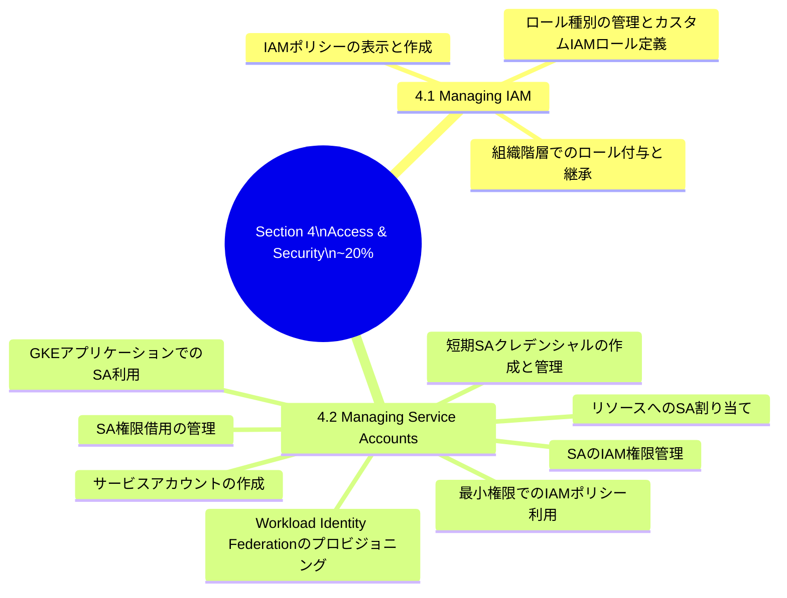

---

## 📚 目次

1. [セキュリティ設計の基本原則](#chapter1)
2. [4.1: IAMの管理](#chapter2)
   - [2.1 IAMポリシーの表示と作成](#section21)
   - [2.2 組織階層でのロール付与と継承](#section22)
   - [2.3 ロール種別の管理とカスタムIAMロールの定義](#section23)
3. [4.2: サービスアカウントの管理](#chapter3)
   - [3.1 サービスアカウントの作成](#section31)
   - [3.2 最小権限でのIAMポリシー利用](#section32)
   - [3.3 リソースへのサービスアカウント割り当て](#section33)
   - [3.4 サービスアカウントのIAM権限管理](#section34)
   - [3.5 サービスアカウント権限借用の管理](#section35)
   - [3.6 短期クレデンシャルの作成と管理](#section36)
   - [3.7 GKEアプリケーションでのサービスアカウント利用](#section37)
   - [3.8 Workload Identity Federationのプロビジョニング](#section38)
4. [試験頻出パターンと対策](#chapter4)
5. [Section 4 直前チェックリスト](#chapter5)
6. [参考リソース一覧](#chapter6)

---

<a name="chapter1"></a>

## Chapter 1: セキュリティ設計の基本原則

### 1.1 Google Cloudのセキュリティモデルの核心

Section 4 が問うのは「誰が何にアクセスできるか」を設計・実装・管理する能力です。試験では単純な暗記ではなく、**なぜその設計が安全なのか**を理解していることが問われます。

**3つの基本原則**

| 原則 | 説明 | Google Cloudでの実装 |
|------|------|---------------------|
| **最小特権（Least Privilege）** | 必要な権限だけを、必要な期間だけ付与する | 事前定義ロール・IAM Conditions |
| **職務分掌（Separation of Duties）** | 一人がすべての操作を単独で実行できない設計 | 承認フロー・PAM（Privileged Access Manager） |
| **深層防御（Defense in Depth）** | 複数のセキュリティ層を重ねる | IAM + VPC Firewall + Cloud Armor + KMS |

### 1.2 IAMとサービスアカウントの関係性

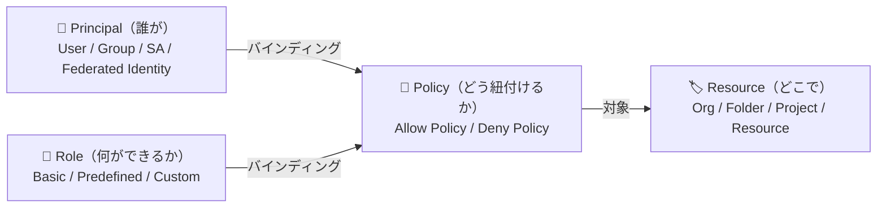

---

<a name="chapter2"></a>

## Chapter 2: 4.1 IAMの管理

<a name="section21"></a>

### 2.1 IAMポリシーの表示と作成

#### IAMポリシーの構造

IAMポリシーは **バインディング（Binding）** の集合体です。各バインディングは「誰に」「何のロールを」付与するかを定義します。

```json
{
  "version": 3,
  "bindings": [
    {
      "role": "roles/storage.objectViewer",
      "members": [
        "user:alice@example.com",
        "group:dev-team@example.com",
        "serviceAccount:my-app@project.iam.gserviceaccount.com"
      ]
    },
    {
      "role": "roles/compute.instanceAdmin.v1",
      "members": [
        "user:bob@example.com"
      ],
      "condition": {
        "title": "Business Hours Only",
        "expression": "request.time.getHours('Asia/Tokyo') >= 9 && request.time.getHours('Asia/Tokyo') < 18"
      }
    }
  ],
  "etag": "BwXxyzAbcde="
}
```

> **`version: 3`が必要な理由**: IAM Conditions（条件付きバインディング）を使う場合は、ポリシーのバージョンを `3` に設定する必要があります。バージョン `1` では条件を付与できません。

#### IAMポリシーの表示コマンド

```bash
# プロジェクトの IAM ポリシーを確認
gcloud projects get-iam-policy PROJECT_ID

# JSON 形式で出力（スクリプト処理向け）
gcloud projects get-iam-policy PROJECT_ID --format=json

# フォルダの IAM ポリシーを確認
gcloud resource-manager folders get-iam-policy FOLDER_ID

# 組織の IAM ポリシーを確認
gcloud organizations get-iam-policy ORG_ID

# 特定のリソース（Cloud Storage バケット）の IAM ポリシーを確認
gcloud storage buckets get-iam-policy gs://my-bucket

# Cloud Run サービスの IAM ポリシーを確認
gcloud run services get-iam-policy SERVICE_NAME --region=REGION
```

#### IAMポリシーの作成・変更コマンド

```bash
# ユーザーにロールを付与（add-iam-policy-binding）
gcloud projects add-iam-policy-binding PROJECT_ID \
  --member="user:alice@example.com" \
  --role="roles/compute.instanceAdmin.v1"

# グループにロールを付与（推奨）
gcloud projects add-iam-policy-binding PROJECT_ID \
  --member="group:dev-team@example.com" \
  --role="roles/run.developer"

# 条件付きロールバインディング（IAM Conditions）
gcloud projects add-iam-policy-binding PROJECT_ID \
  --member="user:contractor@example.com" \
  --role="roles/viewer" \
  --condition='title=Temporary Access,description=3ヶ月限定,expression=request.time < timestamp("2025-12-31T23:59:59Z")'

# ロールを削除
gcloud projects remove-iam-policy-binding PROJECT_ID \
  --member="user:alice@example.com" \
  --role="roles/compute.instanceAdmin.v1"

# ポリシーファイルを使った一括更新（注意：完全上書き）
gcloud projects set-iam-policy PROJECT_ID policy.json
```

> ⚠️ **`set-iam-policy`の危険性**: `add/remove-iam-policy-binding`は個別のバインディングを変更しますが、`set-iam-policy`はポリシー全体を上書きします。既存の設定を失う可能性があるため、必ず現在のポリシーを取得してから編集してください。

#### Deny Policy（拒否ポリシー）

2022年から利用可能になった新機能で、特定の権限を明示的に**拒否**できます。Allow Policyより優先されます。

```bash
# 拒否ポリシーの確認
gcloud iam policies list \
  --attachment-point=cloudresourcemanager.googleapis.com/projects/PROJECT_ID \
  --kind=denypolicies

# 拒否ポリシーの作成（JSON ファイルを使用）
gcloud iam policies create POLICY_ID \
  --attachment-point=cloudresourcemanager.googleapis.com/projects/PROJECT_ID \
  --kind=denypolicies \
  --policy-file=deny-policy.json
```

```json
{
  "displayName": "Deny delete on critical buckets",
  "rules": [
    {
      "description": "Prevent deletion of production buckets",
      "denyRule": {
        "deniedPrincipals": [
          "principalSet://goog/public:all"
        ],
        "deniedPermissions": [
          "storage.googleapis.com/buckets.delete"
        ],
        "exceptionPrincipals": [
          "principal://goog/subject/admin@example.com"
        ]
      }
    }
  ]
}
```

#### ✅ ベストプラクティス: IAMポリシーの管理

| # | ベストプラクティス | 根拠 |
|---|-------------------|------|
| 1 | **個人ではなくグループにロールを付与する** | メンバー変更時にIAMポリシーを変更せず済む |
| 2 | **`add/remove-iam-policy-binding`を優先し`set-iam-policy`は避ける** | 競合状態（Race Condition）と設定の上書きを防止 |
| 3 | **IAM Conditionsで有効期限・時間帯・リソースパスを制限する** | 永続的な過剰権限のリスクを排除 |
| 4 | **Policy Recommenderで不要な権限を定期的に削除する** | 権限のクリープ（肥大化）を防止 |
| 5 | **Deny Policyで重要リソースへの危険な操作を禁止する** | Allow Policyより優先されるため強力な保護になる |

> 📖 **参考**: https://docs.cloud.google.com/iam/docs/resource-hierarchy-access-control

---

<a name="section22"></a>

### 2.2 組織階層でのロール付与と継承

#### 継承メカニズムの全体像

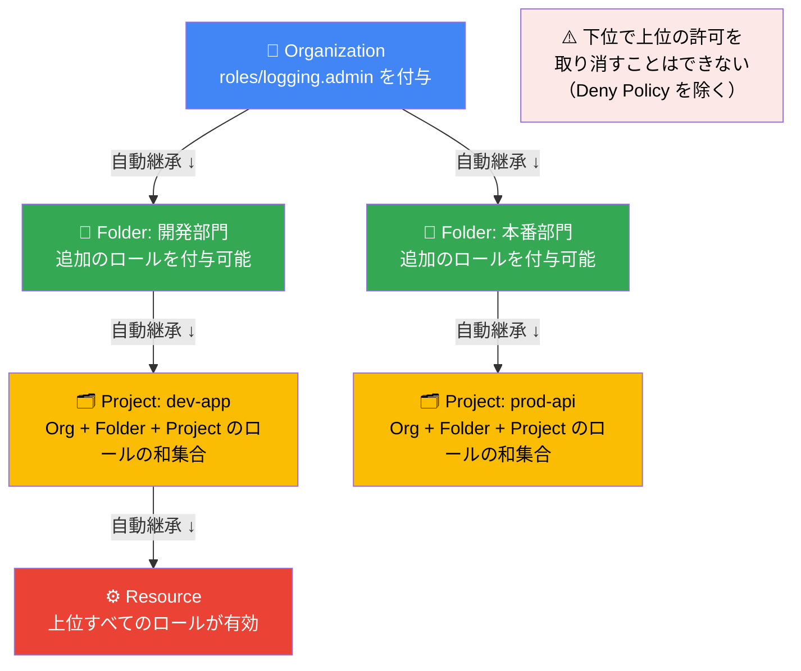

**継承の重要なルール**

- 有効な権限 = すべての祖先レベルで付与されたポリシーの **和集合（Union）**
- 下位レベルで上位の許可を「削除」することは **できない**（Deny Policy を除く）
- Organization レベルで付与されたロールは **全プロジェクト** に影響する

#### 各階層でのロール付与コマンド

```bash
# === 組織レベル ===
gcloud organizations add-iam-policy-binding ORG_ID \
  --member="group:security-team@example.com" \
  --role="roles/securitycenter.admin"

# === フォルダレベル ===
gcloud resource-manager folders add-iam-policy-binding FOLDER_ID \
  --member="group:dev-team@example.com" \
  --role="roles/editor"

# === プロジェクトレベル ===
gcloud projects add-iam-policy-binding PROJECT_ID \
  --member="user:alice@example.com" \
  --role="roles/run.developer"

# === リソースレベル（Cloud Storage バケット） ===
gcloud storage buckets add-iam-policy-binding gs://my-bucket \
  --member="serviceAccount:app@project.iam.gserviceaccount.com" \
  --role="roles/storage.objectViewer"

# === リソースレベル（Cloud Run サービス） ===
gcloud run services add-iam-policy-binding SERVICE_NAME \
  --region=asia-northeast1 \
  --member="serviceAccount:caller@project.iam.gserviceaccount.com" \
  --role="roles/run.invoker"
```

#### 継承の問題を解決するパターン

**問題**: 本番フォルダ配下で開発チームの書き込み権限を制限したい

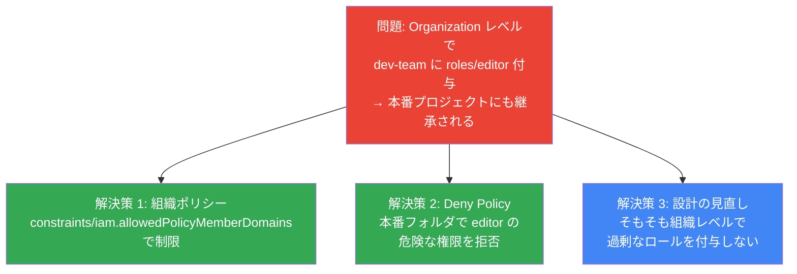

#### ✅ ベストプラクティス: 組織階層でのロール管理

| # | ベストプラクティス | 理由 |
|---|-------------------|------|
| 1 | **Organization レベルのロール付与は最小限に** | 影響範囲が最大のため慎重に管理する |
| 2 | **複数プロジェクト共通の権限は親フォルダで付与** | 個別設定の手間と設定漏れを防止 |
| 3 | **同一信頼境界のリソースを同一プロジェクトにまとめる** | セキュリティポリシーの一貫性を確保 |
| 4 | **環境（dev/prod）は別フォルダ・別プロジェクトで分離** | 本番環境への誤操作のリスクを低減 |

> 📖 **参考**: https://docs.cloud.google.com/iam/docs/resource-hierarchy-access-control  
> 📖 **参考**: https://docs.cloud.google.com/resource-manager/docs/access-control-org

---

<a name="section23"></a>

### 2.3 ロール種別の管理とカスタムIAMロールの定義

#### ロールの3分類

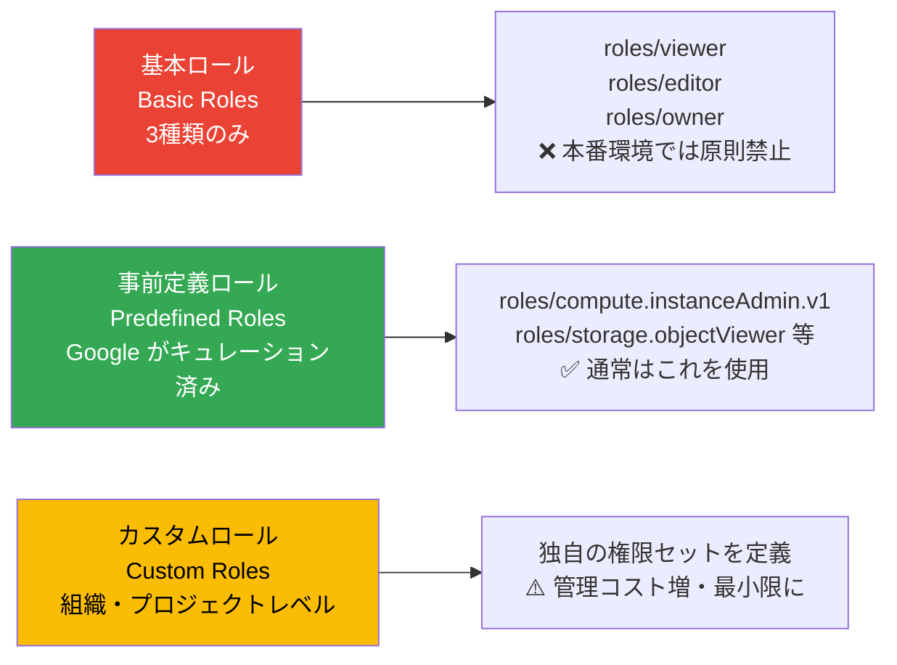

#### 基本ロールを使ってはいけない理由

`roles/editor`を付与した場合の意図しない権限の例：

| 意図した権限 | 意図しない権限（roles/editor に含まれる） |
|-------------|----------------------------------------|
| Cloud Run へのデプロイ | Cloud SQL の DB を削除 |
| Cloud Storage への書き込み | Secret Manager のシークレットを読み取り |
| | BigQuery のデータを削除 |
| | GKE クラスタを削除 |

#### 試験頻出の事前定義ロール一覧

**Compute Engine**

| ロール | 権限概要 |
|--------|---------|
| `roles/compute.admin` | Compute Engine の完全管理 |
| `roles/compute.instanceAdmin.v1` | VM の作成・管理（ネットワーク変更は不可） |
| `roles/compute.networkAdmin` | ネットワークリソースの管理 |
| `roles/compute.storageAdmin` | ディスク・スナップショット・イメージの管理 |
| `roles/compute.osLogin` | OS Login での SSH 接続（sudo なし） |
| `roles/compute.osAdminLogin` | OS Login での SSH 接続（sudo あり） |
| `roles/compute.viewer` | Compute Engine リソースの閲覧のみ |

**Cloud Storage**

| ロール | 権限概要 |
|--------|---------|
| `roles/storage.admin` | バケット・オブジェクトの完全管理 |
| `roles/storage.objectAdmin` | オブジェクトの完全管理（バケット設定変更は不可） |
| `roles/storage.objectCreator` | オブジェクトのアップロードのみ |
| `roles/storage.objectViewer` | オブジェクトの閲覧のみ |
| `roles/storage.legacyBucketReader` | バケットメタデータの読み取り |

**GKE**

| ロール | 権限概要 |
|--------|---------|
| `roles/container.admin` | GKE クラスタの完全管理 |
| `roles/container.developer` | ワークロード管理（クラスタ設定変更は不可） |
| `roles/container.clusterViewer` | クラスタ情報の閲覧のみ |

**IAM / サービスアカウント**

| ロール | 権限概要 |
|--------|---------|
| `roles/iam.securityAdmin` | IAM ポリシーの表示・設定 |
| `roles/iam.roleAdmin` | カスタムロールの作成・管理 |
| `roles/iam.serviceAccountAdmin` | サービスアカウントの作成・管理 |
| `roles/iam.serviceAccountUser` | SA を VM 等にアタッチする権限（actAs） |
| `roles/iam.serviceAccountTokenCreator` | SA の短期トークン生成（権限借用） |
| `roles/iam.workloadIdentityUser` | Workload Identity 経由での SA へのアクセス |

#### カスタムロールの作成

カスタムロールが必要なケース：
- 事前定義ロールでは権限が多すぎる（オーバースコープ）
- 複数サービスにまたがる特定の権限の組み合わせが必要
- 組織固有のセキュリティポリシーに準拠する必要がある

```bash
# === YAML ファイルでカスタムロールを定義 ===
cat > custom-deployer-role.yaml <<EOF
title: "Cloud Run Deployer"
description: "Cloud Run へのデプロイと Artifact Registry の読み取りのみ"
stage: "GA"
includedPermissions:
  - run.services.create
  - run.services.update
  - run.services.get
  - run.services.list
  - artifactregistry.repositories.get
  - artifactregistry.tags.get
  - artifactregistry.tags.list
  - storage.objects.get
  - storage.objects.list
EOF

# プロジェクトレベルでカスタムロールを作成
gcloud iam roles create cloudRunDeployer \
  --project=PROJECT_ID \
  --file=custom-deployer-role.yaml

# 組織レベルでカスタムロールを作成
gcloud iam roles create cloudRunDeployer \
  --organization=ORG_ID \
  --file=custom-deployer-role.yaml

# カスタムロールの一覧確認
gcloud iam roles list \
  --project=PROJECT_ID \
  --filter="name~customRoles"

# カスタムロールの詳細確認
gcloud iam roles describe cloudRunDeployer \
  --project=PROJECT_ID

# カスタムロールの更新（権限を追加）
gcloud iam roles update cloudRunDeployer \
  --project=PROJECT_ID \
  --add-permissions=run.routes.get

# カスタムロールの無効化（削除前のステップ）
gcloud iam roles update cloudRunDeployer \
  --project=PROJECT_ID \
  --stage=DISABLED

# カスタムロールの削除
gcloud iam roles delete cloudRunDeployer \
  --project=PROJECT_ID
```

#### カスタムロールのライフサイクル

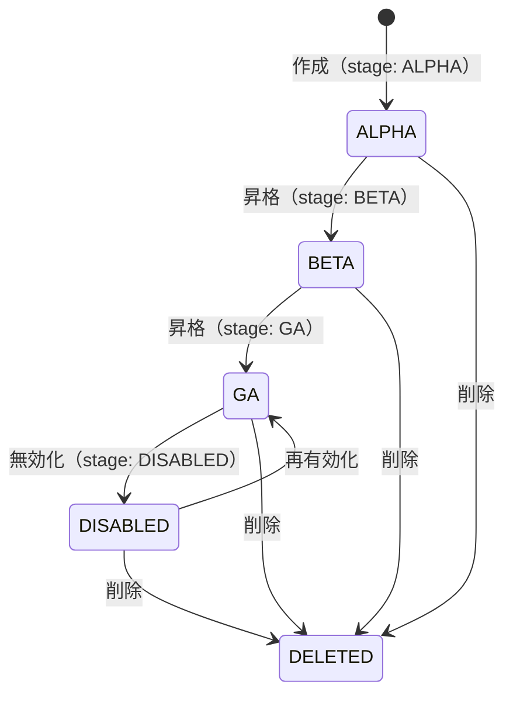

#### ✅ ベストプラクティス: ロール管理

| # | ベストプラクティス | 理由 |
|---|-------------------|------|
| 1 | **本番環境での基本ロール（Editor/Owner）使用を禁止** | 過剰権限によるセキュリティリスクの排除 |
| 2 | **事前定義ロールを優先し、カスタムロールは最小限に** | カスタムロールは管理コストが高い |
| 3 | **カスタムロールは ALPHA → BETA → GA の段階を踏む** | 予期せぬ権限の付与を防止 |
| 4 | **利用可能な権限を事前確認してからカスタムロールを設計** | 無効な権限を含めると作成に失敗する |
| 5 | **組織レベルのカスタムロールはプロジェクト間で再利用** | 重複したカスタムロールの乱立を防止 |

> 📖 **参考**: https://docs.cloud.google.com/iam/docs/creating-custom-roles  
> 📖 **参考**: https://docs.cloud.google.com/iam/docs/roles-overview

---

<a name="chapter3"></a>

## Chapter 3: 4.2 サービスアカウントの管理

<a name="section31"></a>

### 3.1 サービスアカウントの作成

#### サービスアカウントの基本概念

サービスアカウント（SA）はアプリケーション・ワークロードが使用するアカウントです。人間のユーザーアカウントとは異なり、主に自動化されたタスクのために使用されます。

**サービスアカウントの二重の役割**

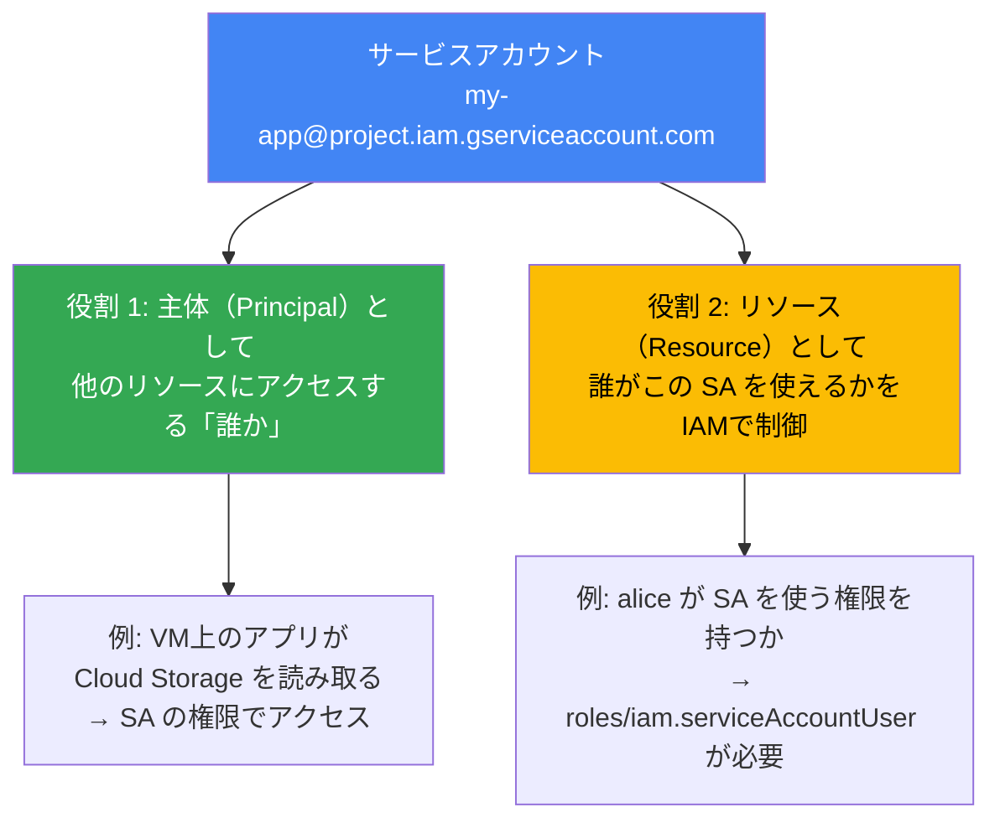

**サービスアカウントの種類**

| 種類 | 作成者 | 命名規則 | 注意事項 |
|------|--------|---------|----------|
| **ユーザー管理 SA** | ユーザーが作成 | `NAME@PROJECT_ID.iam.gserviceaccount.com` | アプリ・CI/CD・GKE Pod 用 |
| **デフォルト SA** | Google が自動作成 | `PROJECT_NUMBER-compute@developer.gserviceaccount.com` | **過剰権限のため本番では非推奨** |
| **Google 管理 SA** | Google が内部で使用 | `PROJECT_ID@cloudservices.gserviceaccount.com` | 直接操作は不可 |

> ⚠️ **デフォルトサービスアカウントの危険性**: Compute Engine と App Engine のデフォルト SA は `roles/editor` に近い過剰な権限を持ちます。本番環境では専用の最小権限 SA を作成して使用してください。

#### サービスアカウントの作成と命名規則

```bash
# === SA の作成（推奨：用途が分かる命名規則を使う） ===

# VM インスタンス用（vm- プレフィックス）
gcloud iam service-accounts create vm-web-server \
  --display-name="Web Server VM Service Account" \
  --description="Prod web server VM - reads from GCS and writes to Firestore"

# Workload Identity Federation 用（wlif- プレフィックス）
gcloud iam service-accounts create wlif-github-deploy \
  --display-name="GitHub Actions Deployment SA"

# GKE Workload Identity 用（wlifgke- プレフィックス）
gcloud iam service-accounts create wlifgke-api-backend \
  --display-name="GKE API Backend Service Account"

# SA の一覧確認
gcloud iam service-accounts list

# SA の詳細確認
gcloud iam service-accounts describe \
  vm-web-server@PROJECT_ID.iam.gserviceaccount.com

# SA の無効化
gcloud iam service-accounts disable \
  vm-web-server@PROJECT_ID.iam.gserviceaccount.com

# SA の有効化
gcloud iam service-accounts enable \
  vm-web-server@PROJECT_ID.iam.gserviceaccount.com

# SA の削除（30日間は復元可能）
gcloud iam service-accounts delete \
  vm-web-server@PROJECT_ID.iam.gserviceaccount.com

# SA の復元（削除後30日以内）
gcloud iam service-accounts undelete SA_UNIQUE_ID
```

#### Google 管理サービスアカウント

Cloud Run、Cloud Build、GKE などのマネージドサービスは、内部的に Google 管理のサービスアカウントを使用します。これらに権限を付与することが必要な場合があります。

```bash
# Cloud Build SA に Artifact Registry への書き込み権限を付与
gcloud projects add-iam-policy-binding PROJECT_ID \
  --member="serviceAccount:PROJECT_NUMBER@cloudbuild.gserviceaccount.com" \
  --role="roles/artifactregistry.writer"

# Cloud Run SA に Secret Manager のアクセス権限を付与
gcloud projects add-iam-policy-binding PROJECT_ID \
  --member="serviceAccount:PROJECT_NUMBER-compute@developer.gserviceaccount.com" \
  --role="roles/secretmanager.secretAccessor"
```

---

<a name="section32"></a>

### 3.2 最小権限でのIAMポリシー利用

#### SA のロール付与の考え方

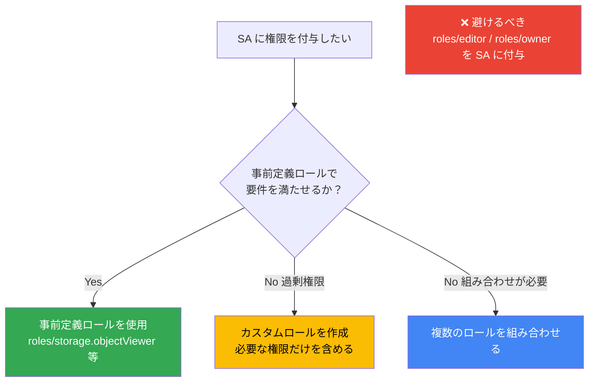

```bash
# SA に必要な権限だけを付与する例

# Cloud Storage への読み取りのみ
gcloud projects add-iam-policy-binding PROJECT_ID \
  --member="serviceAccount:my-app@PROJECT_ID.iam.gserviceaccount.com" \
  --role="roles/storage.objectViewer"

# BigQuery への読み取りのみ
gcloud projects add-iam-policy-binding PROJECT_ID \
  --member="serviceAccount:my-app@PROJECT_ID.iam.gserviceaccount.com" \
  --role="roles/bigquery.dataViewer"

# Secret Manager のシークレット読み取りのみ
gcloud projects add-iam-policy-binding PROJECT_ID \
  --member="serviceAccount:my-app@PROJECT_ID.iam.gserviceaccount.com" \
  --role="roles/secretmanager.secretAccessor"

# より細かい制御：特定のバケットのみにアクセスを制限
gcloud storage buckets add-iam-policy-binding gs://specific-bucket \
  --member="serviceAccount:my-app@PROJECT_ID.iam.gserviceaccount.com" \
  --role="roles/storage.objectViewer"
```

#### Policy Analyzerで権限を分析する

Policy Analyzer を使うと、特定のリソースにアクセスできる主体を特定できます。

```bash
# 特定のリソースにアクセスできる全 Identity を分析
gcloud asset analyze-iam-policy \
  --organization=ORG_ID \
  --full-resource-name="//storage.googleapis.com/projects/_/buckets/my-bucket"

# 特定の権限を持つ Principal を検索
gcloud asset analyze-iam-policy \
  --project=PROJECT_ID \
  --permissions="storage.objects.delete"
```

---

<a name="section33"></a>

### 3.3 リソースへのサービスアカウントの割り当て

#### VM インスタンスへの SA 割り当て

```bash
# VM 作成時に SA をアタッチ（推奨：専用 SA + 最小スコープ）
gcloud compute instances create my-vm \
  --zone=asia-northeast1-a \
  --machine-type=n2-standard-4 \
  --service-account=vm-web-server@PROJECT_ID.iam.gserviceaccount.com \
  --scopes=cloud-platform    # SA の IAM で制御するため cloud-platform スコープを使用

# 既存 VM の SA を変更（VM を停止してから実行）
gcloud compute instances stop my-vm --zone=asia-northeast1-a

gcloud compute instances set-service-account my-vm \
  --zone=asia-northeast1-a \
  --service-account=new-sa@PROJECT_ID.iam.gserviceaccount.com \
  --scopes=cloud-platform

gcloud compute instances start my-vm --zone=asia-northeast1-a
```

#### スコープ（Scope）の理解

スコープは VM インスタンスに対してアクセスできる API の範囲を制限する旧来のメカニズムです。現代では **SA + IAM の組み合わせで制御する** ことが推奨されます。

| スコープ | 説明 | 推奨度 |
|---------|------|--------|
| `cloud-platform` | すべての GCP API へのアクセスを SA の IAM で制御 | ✅ 推奨 |
| `https://www.googleapis.com/auth/storage.read_only` | Cloud Storage 読み取りのみ（旧来の方法） | ⚠️ 非推奨 |
| `default` | 一部の API のみデフォルトで有効 | ❌ 非推奨 |

> **なぜ `cloud-platform` スコープが推奨されるのか？** スコープではなく SA の IAM ロールで権限を制御することで、コンソールやgcloudから権限変更が即座に反映されます。スコープによる制限は VM の再起動が必要な場合があります。

#### Cloud Run / Cloud Functions への SA 割り当て

```bash
# Cloud Run サービスに SA をアタッチ
gcloud run deploy my-service \
  --image=gcr.io/PROJECT_ID/my-app:latest \
  --region=asia-northeast1 \
  --service-account=wlif-cloudrun@PROJECT_ID.iam.gserviceaccount.com

# Cloud Functions に SA をアタッチ
gcloud functions deploy my-function \
  --gen2 \
  --runtime=python312 \
  --trigger-http \
  --service-account=func-sa@PROJECT_ID.iam.gserviceaccount.com \
  --region=asia-northeast1
```

---

<a name="section34"></a>

### 3.4 サービスアカウントのIAM権限管理

SA のIAM権限管理には2つの側面があります。

**側面 1**: SA が GCP リソースにアクセスするための権限（前のセクションで説明）  
**側面 2**: **誰が SA を使えるか**（SA 自体に対する IAM 設定）

#### `iam.serviceAccounts.actAs` 権限の重要性

SA を VM にアタッチするには `roles/iam.serviceAccountUser`（`actAs` 権限を含む）が必要です。

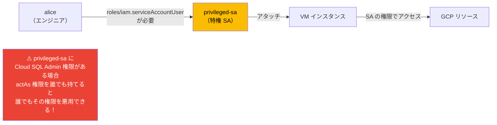

```bash
# SA への actAs 権限の付与（SA を VM にアタッチできるようにする）
gcloud iam service-accounts add-iam-policy-binding \
  privileged-sa@PROJECT_ID.iam.gserviceaccount.com \
  --member="user:alice@example.com" \
  --role="roles/iam.serviceAccountUser"

# SA の IAM ポリシー（誰がこの SA を使えるか）を確認
gcloud iam service-accounts get-iam-policy \
  privileged-sa@PROJECT_ID.iam.gserviceaccount.com

# SA の IAM ポリシーを更新
gcloud iam service-accounts set-iam-policy \
  privileged-sa@PROJECT_ID.iam.gserviceaccount.com \
  policy.json
```

---

<a name="section35"></a>

### 3.5 サービスアカウント権限借用の管理

#### 権限借用（Impersonation）とは

権限借用を使うと、ユーザー自身の権限を拡大することなく、一時的に SA の権限を借りて操作できます。

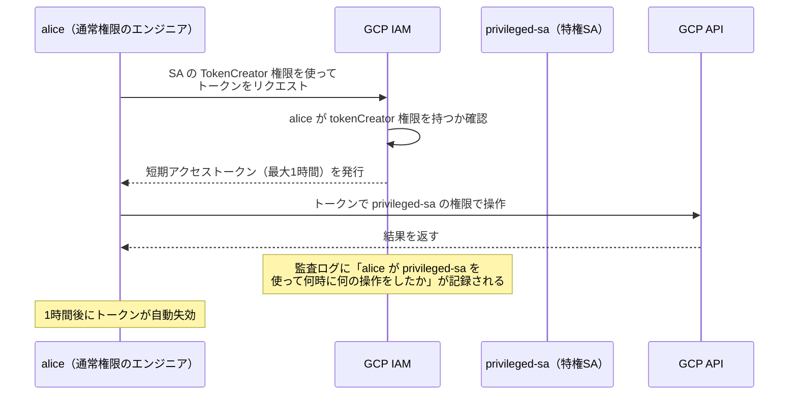

**通常の権限付与との違い**

| 方法 | 権限の永続性 | 監査性 | リスク |
|------|------------|--------|--------|
| 直接ロール付与 | 永続的 | 操作ログのみ | 高（常に特権を持つ） |
| SA 権限借用 | 一時的（最大1時間） | 誰がいつ借用したかが明確 | 低（時間制限あり） |
| PAM（Privileged Access Manager） | 承認制・時間制限 | 完全な監査証跡 | 最低 |

#### 権限借用の設定と実行

```bash
# Step 1: privileged-sa に必要な権限を付与
gcloud projects add-iam-policy-binding PROJECT_ID \
  --member="serviceAccount:privileged-sa@PROJECT_ID.iam.gserviceaccount.com" \
  --role="roles/storage.admin"

# Step 2: alice に SA のトークン作成権限を付与
gcloud iam service-accounts add-iam-policy-binding \
  privileged-sa@PROJECT_ID.iam.gserviceaccount.com \
  --member="user:alice@example.com" \
  --role="roles/iam.serviceAccountTokenCreator"

# Step 3a: alice が権限借用で操作（gcloud コマンド）
gcloud storage ls gs://my-bucket \
  --impersonate-service-account=privileged-sa@PROJECT_ID.iam.gserviceaccount.com

# Step 3b: 一時的なアクセストークンを生成
gcloud auth print-access-token \
  --impersonate-service-account=privileged-sa@PROJECT_ID.iam.gserviceaccount.com

# Step 3c: gcloud CLI のデフォルトで権限借用を設定
gcloud config set auth/impersonate_service_account \
  privileged-sa@PROJECT_ID.iam.gserviceaccount.com

# 設定を解除
gcloud config unset auth/impersonate_service_account
```

#### 権限借用の監査ログを確認

```bash
# 権限借用のイベントを Cloud Logging で検索
gcloud logging read \
  'protoPayload.methodName="GenerateAccessToken" AND
   protoPayload.request.name=~"privileged-sa"' \
  --limit=10 \
  --format=json
```

#### ✅ ベストプラクティス: 権限借用

| # | ベストプラクティス | 理由 |
|---|-------------------|------|
| 1 | **特権操作は直接ロール付与ではなく SA 権限借用を使う** | 一時的な権限 + 詳細な監査ログ |
| 2 | **TokenCreator ロールはプロジェクトレベルではなく SA リソースレベルで付与** | 影響範囲を特定の SA に限定 |
| 3 | **PAM（Privileged Access Manager）で承認フローを組み込む** | 承認なしに特権 SA を借用できないようにする |

> 📖 **参考**: https://docs.cloud.google.com/iam/docs/service-account-impersonation  
> 📖 **参考**: https://docs.cloud.google.com/iam/docs/service-account-permissions

---

<a name="section36"></a>

### 3.6 短期クレデンシャルの作成と管理

#### 短期クレデンシャルの種類

| 種類 | 用途 | 有効期限 | API |
|------|------|---------|-----|
| **OAuth 2.0 アクセストークン** | Google API 呼び出し | デフォルト1時間（最大12時間） | generateAccessToken |
| **OIDC ID トークン** | Cloud Run / API Gateway の認証 | 1時間 | generateIdToken |
| **自己署名 JWT** | 一部の Google API 認証 | 1時間 | signJwt |
| **自己署名バイナリオブジェクト** | カスタム認証 | 任意 | signBlob |

#### 短期クレデンシャルの生成

```bash
# OAuth 2.0 アクセストークンの生成（権限借用）
gcloud auth print-access-token \
  --impersonate-service-account=my-sa@PROJECT_ID.iam.gserviceaccount.com

# OIDC ID トークンの生成（Cloud Run のエンドポイント向け）
gcloud auth print-identity-token \
  --impersonate-service-account=my-sa@PROJECT_ID.iam.gserviceaccount.com \
  --audiences=https://my-cloud-run-service-url

# REST API を使ってアクセストークンを生成
curl -X POST \
  -H "Authorization: Bearer $(gcloud auth print-access-token)" \
  -H "Content-Type: application/json" \
  -d '{
    "scope": ["https://www.googleapis.com/auth/cloud-platform"]
  }' \
  "https://iamcredentials.googleapis.com/v1/projects/-/serviceAccounts/my-sa@PROJECT_ID.iam.gserviceaccount.com:generateAccessToken"
```

#### 委任チェーン（Delegation Chain）

複数の SA を経由してクレデンシャルを生成するパターンです。

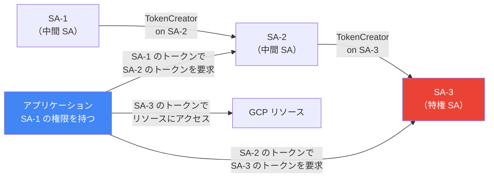

```bash
# 委任チェーンでトークンを生成
gcloud auth print-access-token \
  --impersonate-service-account=sa1@PROJECT.iam.gserviceaccount.com,sa2@PROJECT.iam.gserviceaccount.com,sa3@PROJECT.iam.gserviceaccount.com
```

#### 自己権限借用（Self-Impersonation）の禁止

IAM は以下の自己権限借用を**禁止**しています：

- SA の短期クレデンシャルを使って、同じ SA の新しいアクセストークンを生成する
- SA の短期クレデンシャルを使って、同じ SA のバイナリ署名や JWT 署名を実行する

これは盗まれたトークンを無限に更新する攻撃を防ぐためです。

#### ✅ ベストプラクティス: 短期クレデンシャル

| # | ベストプラクティス | 理由 |
|---|-------------------|------|
| 1 | **SA の静的 JSON キーより短期クレデンシャルを優先** | 自動失効するため漏洩リスクが低い |
| 2 | **アクセストークンの有効期限を最小限に設定** | デフォルト1時間を必要に応じて短縮 |
| 3 | **OIDC ID トークンは特定のオーディエンスに限定** | 他のサービスへの不正な転用を防止 |
| 4 | **委任チェーンは複雑になるため最小限に** | 複雑さが増すと監査が困難になる |

> 📖 **参考**: https://docs.cloud.google.com/iam/docs/create-short-lived-credentials-direct  
> 📖 **参考**: https://docs.cloud.google.com/iam/docs/service-account-creds

---

<a name="section37"></a>

### 3.7 GKEアプリケーションでのサービスアカウントの利用

#### Workload Identity Federation for GKE（旧称: Workload Identity）

GKE 環境での最も安全な SA 利用方法です。Kubernetes Service Account（KSA）と Google Cloud IAM Service Account（GSA）を紐付けます。

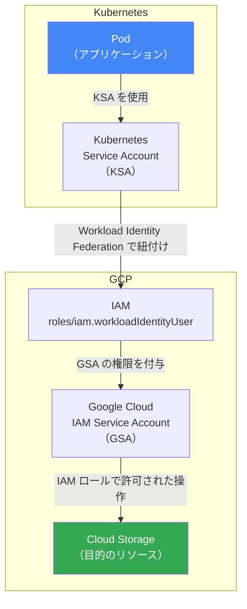

#### ❌ アンチパターン vs ✅ 推奨パターン

**❌ アンチパターン: JSON キーを Secret に保存**

```yaml
# 危険：JSON キーを Kubernetes Secret にマウントする方法
apiVersion: v1
kind: Secret
metadata:
  name: gcp-credentials
type: Opaque
data:
  key.json: <BASE64_ENCODED_JSON_KEY>  # ← 漏洩リスクが高い
---
apiVersion: v1
kind: Pod
spec:
  volumes:
  - name: gcp-credentials
    secret:
      secretName: gcp-credentials
  containers:
  - name: app
    env:
    - name: GOOGLE_APPLICATION_CREDENTIALS
      value: /var/secrets/google/key.json
    volumeMounts:
    - name: gcp-credentials
      mountPath: /var/secrets/google
```

**✅ 推奨パターン: Workload Identity Federation for GKE**

```bash
# Step 1: GKE クラスタで Workload Identity を有効化
gcloud container clusters update my-cluster \
  --workload-pool=PROJECT_ID.svc.id.goog \
  --region=asia-northeast1

# または新規クラスタ作成時に有効化
gcloud container clusters create-auto my-autopilot-cluster \
  --region=asia-northeast1
  # Autopilot では自動的に有効化される

# Step 2: GCP SA（GSA）を作成
gcloud iam service-accounts create wlifgke-api-backend \
  --display-name="GKE API Backend GSA"

# Step 3: GSA に必要な権限を付与
gcloud projects add-iam-policy-binding PROJECT_ID \
  --member="serviceAccount:wlifgke-api-backend@PROJECT_ID.iam.gserviceaccount.com" \
  --role="roles/storage.objectViewer"

# Step 4: KSA が GSA を使えるように IAM を設定
gcloud iam service-accounts add-iam-policy-binding \
  wlifgke-api-backend@PROJECT_ID.iam.gserviceaccount.com \
  --role=roles/iam.workloadIdentityUser \
  --member="serviceAccount:PROJECT_ID.svc.id.goog[NAMESPACE/KSA_NAME]"

# Step 5: KSA を作成して GSA にアノテーションを付ける
kubectl create serviceaccount my-ksa --namespace my-namespace

kubectl annotate serviceaccount my-ksa \
  --namespace my-namespace \
  iam.gke.io/gcp-service-account=wlifgke-api-backend@PROJECT_ID.iam.gserviceaccount.com
```

**Kubernetes マニフェスト**

```yaml
# Kubernetes Service Account の設定
apiVersion: v1
kind: ServiceAccount
metadata:
  name: my-ksa
  namespace: my-namespace
  annotations:
    # この KSA を使うと GSA の権限でアクセスできる
    iam.gke.io/gcp-service-account: wlifgke-api-backend@PROJECT_ID.iam.gserviceaccount.com
---
# Pod で KSA を使用
apiVersion: apps/v1
kind: Deployment
metadata:
  name: my-app
spec:
  template:
    spec:
      serviceAccountName: my-ksa  # ← KSA を指定するだけ（JSON キー不要）
      containers:
      - name: my-container
        image: gcr.io/PROJECT_ID/my-app:latest
        # GOOGLE_APPLICATION_CREDENTIALS の設定不要！
        # アプリケーションは自動的に Workload Identity を使用する
```

#### 直接リソースアクセス vs SA 権限借用

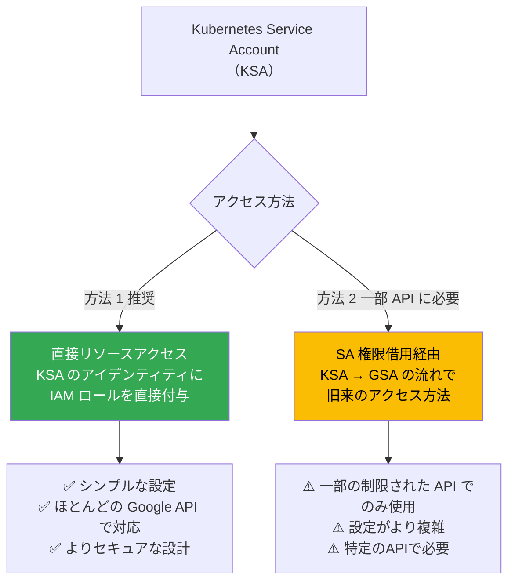

#### ✅ ベストプラクティス: GKE での SA 利用

| # | ベストプラクティス | 理由 |
|---|-------------------|------|
| 1 | **JSON キーは絶対に使わず Workload Identity を使用** | キー漏洩リスクを根本から排除 |
| 2 | **GKE Autopilot を使うと Workload Identity が自動有効** | 設定漏れを防止 |
| 3 | **Namespace 単位・Pod 単位で KSA を分離** | 最小権限の原則をコンテナレベルで適用 |
| 4 | **GSA の命名は `wlifgke-` プレフィックスを付ける** | Workload Identity 用 SA だと一目で分かる |
| 5 | **直接リソースアクセスを優先（SA 権限借用より）** | よりシンプルかつセキュア |

> 📖 **参考**: https://docs.cloud.google.com/iam/docs/workload-identities  
> 📖 **参考**: https://docs.cloud.google.com/kubernetes-engine/docs/concepts/autopilot-security

---

<a name="section38"></a>

### 3.8 Workload Identity Federationのプロビジョニング

#### Workload Identity Federation の全体像

GKE 以外の環境（GitHub Actions、AWS、Azure、オンプレミスなど）から SA キーなしで GCP リソースにアクセスする仕組みです。

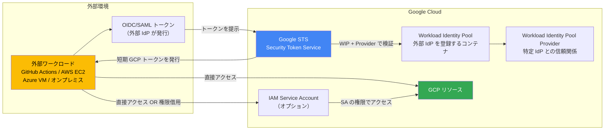

#### GitHub Actions との設定例（最もよく使われるパターン）

```bash
# Step 1: Workload Identity Pool を作成
gcloud iam workload-identity-pools create github-pool \
  --location=global \
  --display-name="GitHub Actions Pool" \
  --description="GitHub Actions Workload Identity Pool"

# Step 2: GitHub の OIDC Provider を登録
gcloud iam workload-identity-pools providers create-oidc github-provider \
  --location=global \
  --workload-identity-pool=github-pool \
  --display-name="GitHub OIDC Provider" \
  --issuer-uri="https://token.actions.githubusercontent.com" \
  --attribute-mapping="google.subject=assertion.sub,attribute.repository=assertion.repository,attribute.actor=assertion.actor,attribute.aud=assertion.aud" \
  --attribute-condition="assertion.repository_owner == 'my-org'"

# Step 3: GSA を作成
gcloud iam service-accounts create wlif-github-deploy \
  --display-name="GitHub Actions Deployment SA"

# Step 4: GSA に必要な権限を付与
gcloud projects add-iam-policy-binding PROJECT_ID \
  --member="serviceAccount:wlif-github-deploy@PROJECT_ID.iam.gserviceaccount.com" \
  --role="roles/run.developer"

# Step 5: Workload Identity Pool が GSA を権限借用できるように設定
WORKLOAD_IDENTITY_POOL_ID=$(gcloud iam workload-identity-pools describe github-pool \
  --location=global \
  --format="value(name)")

gcloud iam service-accounts add-iam-policy-binding \
  wlif-github-deploy@PROJECT_ID.iam.gserviceaccount.com \
  --role="roles/iam.workloadIdentityUser" \
  --member="principalSet://iam.googleapis.com/${WORKLOAD_IDENTITY_POOL_ID}/attribute.repository/my-org/my-repo"

# Pool の情報を確認（GitHub Actions ワークフローで使用）
echo "Workload Identity Provider:"
gcloud iam workload-identity-pools providers describe github-provider \
  --workload-identity-pool=github-pool \
  --location=global \
  --format="value(name)"
```

#### GitHub Actions ワークフロー設定

```yaml
# .github/workflows/deploy.yml
name: Deploy to Cloud Run

on:
  push:
    branches: [main]

permissions:
  contents: read
  id-token: write   # OIDC トークンの生成を許可（必須）

jobs:
  deploy:
    runs-on: ubuntu-latest
    steps:
      - uses: actions/checkout@v4

      # Workload Identity Federation で認証（SA キー不要！）
      - id: auth
        uses: google-github-actions/auth@v2
        with:
          workload_identity_provider: 'projects/PROJECT_NUMBER/locations/global/workloadIdentityPools/github-pool/providers/github-provider'
          service_account: 'wlif-github-deploy@PROJECT_ID.iam.gserviceaccount.com'
          # token_format: 'access_token'  # 必要に応じて

      # gcloud が自動的に上記で取得したトークンを使用
      - name: Deploy to Cloud Run
        run: |
          gcloud run deploy my-service \
            --image=gcr.io/PROJECT_ID/my-app:${{ github.sha }} \
            --region=asia-northeast1
```

#### AWS との設定例

```bash
# AWS 用 Workload Identity Pool Provider を作成
gcloud iam workload-identity-pools providers create-aws aws-provider \
  --location=global \
  --workload-identity-pool=aws-pool \
  --display-name="AWS Provider" \
  --account-id=AWS_ACCOUNT_ID

# AWS EC2 インスタンスが Pool を使えるように設定
gcloud iam service-accounts add-iam-policy-binding \
  wlif-aws-app@PROJECT_ID.iam.gserviceaccount.com \
  --role="roles/iam.workloadIdentityUser" \
  --member="principalSet://iam.googleapis.com/projects/PROJECT_NUMBER/locations/global/workloadIdentityPools/aws-pool/attribute.aws_role/arn:aws:sts::AWS_ACCOUNT_ID:assumed-role/MY_ROLE_NAME"
```

#### Workload Identity Federation の主要なセキュリティリスクと対策

| リスク | 対策 |
|--------|------|
| **なりすまし（Spoofing）** | `attribute-condition` で許可する外部 IdP を制限 |
| **権限昇格（Privilege Escalation）** | Pool Provider に最小限の属性マッピングを設定 |
| **否認不可性の欠如** | Cloud Audit Logs で権限借用イベントを監視 |

```bash
# セキュリティ強化のための attribute-condition の例

# GitHub Actions: 特定の Organization のリポジトリのみ許可
--attribute-condition="assertion.repository_owner == 'my-org'"

# GitHub Actions: 特定のリポジトリのみ許可
--attribute-condition="assertion.repository == 'my-org/my-repo'"

# AWS: 特定の IAM ロールのみ許可
--attribute-condition="attribute.aws_role == 'arn:aws:sts::ACCOUNT:assumed-role/ROLE'"
```

#### ✅ ベストプラクティス: Workload Identity Federation

| # | ベストプラクティス | 理由 |
|---|-------------------|------|
| 1 | **SA JSON キーの代わりに常に WIF を使用** | キー管理不要・自動失効・より安全 |
| 2 | **`attribute-condition` で外部 IdP の範囲を必ず限定** | なりすまし攻撃を防止 |
| 3 | **環境（dev/staging/prod）ごとに別の Pool を作成** | 環境間の分離を確保 |
| 4 | **直接リソースアクセスを SA 権限借用より優先** | シンプルで管理しやすい |
| 5 | **GSA の命名に `wlif-` プレフィックスを使用** | WIF 用 SA だと一目で識別できる |
| 6 | **Pool Provider は環境を表す意味のある名前にする** | 管理・監査が容易になる |

> 📖 **参考**: https://docs.cloud.google.com/iam/docs/workload-identity-federation  
> 📖 **参考**: https://docs.cloud.google.com/iam/docs/best-practices-for-using-workload-identity-federation  
> 📖 **参考**: https://docs.cloud.google.com/iam/docs/best-practices-for-using-service-accounts-in-deployment-pipelines

---

<a name="chapter4"></a>

## Chapter 4: 試験頻出パターンと対策

### 4.1 試験で問われる選択問題パターン

#### パターン①: ロール選択問題

```text
【問題文の例】
「あるエンジニアは Cloud Run サービスへのデプロイと、
 Artifact Registry からのイメージ読み取りだけができる必要がある。
 最小権限のアプローチで使うロールの組み合わせはどれか？」

【正解の考え方】
  必要な操作を特定：
    ① Cloud Run のデプロイ → roles/run.developer
    ② Artifact Registry の読み取り → roles/artifactregistry.reader

  不正解の典型パターン：
    ❌ roles/editor（過剰）
    ❌ roles/owner（過剰）
    ❌ roles/run.admin（管理権限が含まれ過剰）
```

#### パターン②: GKE でのサービスアカウント問題

```text
【問題文の例】
「GKE 上で動くアプリケーションが Cloud Storage バケットに
 アクセスする必要がある。最もセキュアな方法はどれか？」

【正解パターン】
  → Workload Identity Federation for GKE を設定する
  → KSA にアノテーション付与 → GSA に IAM ロール付与

【よくある誤答】
  ❌ SA の JSON キーを Kubernetes Secret に保存してマウントする
  ❌ Node の SA に権限を付与する（すべての Pod に影響する）
  ❌ アプリコード内に認証情報をハードコードする
```

#### パターン③: Workload Identity Federation 問題

```text
【問題文の例】
「GitHub Actions から GCP リソースを操作したい。
 SA JSON キーを使わない最もセキュアな方法はどれか？」

【正解パターン】
  → Workload Identity Federation を設定する
    1. Workload Identity Pool を作成
    2. GitHub の OIDC Provider を Pool に登録
    3. GSA に roles/iam.workloadIdentityUser を付与
    4. GitHub Actions で google-github-actions/auth@v2 を使用

【よくある誤答】
  ❌ SA JSON キーを GitHub Secrets に保存する（安全だが SA キーを使うのは非推奨）
  ❌ ADC を GitHub Actions 環境に設定する（GKE 等のコンピュート外では使えない）
```

#### パターン④: 短期クレデンシャル問題

```text
【問題文の例】
「あるユーザーが特定の管理タスクを一時的に実行する必要がある。
 最小権限の原則に従いながら監査証跡を残す最適な方法は？」

【正解パターン】
  → SA の権限借用（Impersonation）を使用する
    → roles/iam.serviceAccountTokenCreator を付与
    → gcloud --impersonate-service-account フラグで操作
    → 操作は監査ログに自動記録される
    → 1時間でトークンが自動失効

【よくある誤答】
  ❌ ユーザーに直接 roles/storage.admin を付与する（永続的で過剰）
  ❌ SA の JSON キーを一時的に渡す（キー管理が困難）
```

### 4.2 引っかけ問題パターン

| 引っかけ | 正しい理解 |
|---------|---------|
| 「SA JSON キーをローテーションすれば安全」 | ✅ キー自体を使わない WIF/短期クレデンシャルが最安全 |
| 「SA キーは90日で自動失効する」 | ❌ SA キーはデフォルトで失効しない（無期限） |
| 「基本ロール（Editor）は開発環境なら使っていい」 | ❌ 本番/開発問わず原則禁止。事前定義ロールを使う |
| 「下位階層でロールを削除すれば上位の権限を制限できる」 | ❌ 下位で削除しても上位の継承は無効にならない |
| 「カスタムロールは Project レベルと Organization レベルで共有できる」 | ❌ それぞれのレベルで独立して管理される |
| 「GKE Autopilot では Workload Identity は任意設定」 | ❌ GKE Autopilot では Workload Identity が自動有効化 |
---

<a name="chapter5"></a>

## Chapter 5: Section 4 直前チェックリスト

### 4.1 IAMの管理

- [ ] IAMポリシーのJSON構造（version, bindings, etag）を説明できる
- [ ] `add-iam-policy-binding` と `set-iam-policy` の違いと危険性を知っている
- [ ] 組織・フォルダ・プロジェクト・リソース各レベルでのロール付与コマンドを知っている
- [ ] IAM ポリシーが上位から下位へ継承され下位で上位を取り消せないことを知っている
- [ ] IAM Conditions で時間・日付・リソースパスの条件を付与できる
- [ ] Deny Policy が Allow Policy より優先されることを知っている
- [ ] 基本ロール（Editor/Owner）を本番環境で使うべきでない理由を説明できる
- [ ] カスタムロールのライフサイクル（ALPHA → BETA → GA → DISABLED → DELETED）を知っている
- [ ] `roles/iam.securityAdmin`, `roles/iam.roleAdmin`, `roles/iam.serviceAccountAdmin` の違いを知っている
- [ ] Policy Analyzer でアクセス権を分析できることを知っている

### 4.2 サービスアカウントの管理

- [ ] ユーザー管理 SA・デフォルト SA・Google 管理 SA の違いを説明できる
- [ ] デフォルト SA の過剰権限問題を知っており専用 SA を使う理由を説明できる
- [ ] `roles/iam.serviceAccountUser`（actAs）が必要なケースを説明できる
- [ ] `roles/iam.serviceAccountTokenCreator` が権限借用に必要なことを知っている
- [ ] SA 権限借用（Impersonation）のフロー（一時トークン・監査ログ・1時間失効）を説明できる
- [ ] 短期クレデンシャルの種類（OAuth2.0トークン・OIDC IDトークン・自己署名JWT）を知っている
- [ ] 自己権限借用が禁止されている理由を説明できる
- [ ] GKE での Workload Identity Federation の設定フロー（KSA・GSA紐付け）を説明できる
- [ ] `iam.gke.io/gcp-service-account` アノテーションの役割を知っている
- [ ] Workload Identity Federation の設定フロー（Pool・Provider・GSA）を説明できる
- [ ] `attribute-condition` でセキュリティを強化する方法を知っている
- [ ] GitHub Actions での WIF 設定と `id-token: write` permission の必要性を知っている
- [ ] SA JSON キーより WIF・短期クレデンシャル・Workload Identity が推奨される理由を説明できる
- [ ] 命名規則（`vm-`, `wlif-`, `wlifgke-`, `onprem-`）の目的を知っている

---

<a name="chapter6"></a>

## Chapter 6: 参考リソース一覧

| トピック | URL |
|---------|-----|
| **ACE 試験公式ページ** | https://cloud.google.com/learn/certification/cloud-engineer?hl=en |
| **試験ガイド PDF（2025年6月版）** | https://services.google.com/fh/files/misc/063026_associate_cloud_engineer_exam_guide_english.pdf |
| **IAM リソース階層とアクセス制御** | https://docs.cloud.google.com/iam/docs/resource-hierarchy-access-control |
| **IAM ロールの概要** | https://docs.cloud.google.com/iam/docs/roles-overview |
| **カスタムロールの作成と管理** | https://docs.cloud.google.com/iam/docs/creating-custom-roles |
| **Deny Policy** | https://docs.cloud.google.com/iam/docs/deny-overview |
| **IAM Conditions** | https://docs.cloud.google.com/iam/docs/conditions-overview |
| **SA のベストプラクティス** | https://docs.cloud.google.com/iam/docs/best-practices-service-accounts |
| **SA の権限借用** | https://docs.cloud.google.com/iam/docs/service-account-impersonation |
| **短期クレデンシャルの作成** | https://docs.cloud.google.com/iam/docs/create-short-lived-credentials-direct |
| **SA 権限のロール** | https://docs.cloud.google.com/iam/docs/service-account-permissions |
| **Workload Identity Federation 概要** | https://docs.cloud.google.com/iam/docs/workload-identity-federation |
| **WIF ベストプラクティス** | https://docs.cloud.google.com/iam/docs/best-practices-for-using-workload-identity-federation |
| **WIF for GKE（Workload Identities）** | https://docs.cloud.google.com/iam/docs/workload-identities |
| **デプロイパイプラインでの SA ベストプラクティス** | https://docs.cloud.google.com/iam/docs/best-practices-for-using-service-accounts-in-deployment-pipelines |
| **GKE Autopilot セキュリティ** | https://docs.cloud.google.com/kubernetes-engine/docs/concepts/autopilot-security |
| **組織レベルのアクセス制御** | https://docs.cloud.google.com/resource-manager/docs/access-control-org |
| **IAM ベストプラクティスガイド** | https://cloud.google.com/blog/products/identity-security/iam-best-practice-guides-available-now |

---

> 📝 **Section 4 学習の最終アドバイス**
>
> Section 4 はセキュリティ設計に関するドメインですが、配点は約20%です。
> 他のドメインと深く連携しており、GKE・Cloud Run・Terraform の文脈でも
> IAM・SA の知識が必ず問われます。
>
> **必ず押さえる5つのポイント**:
>
> **① SA JSON キーは使わない → WIF / 短期クレデンシャル / Workload Identity**  
> **② 基本ロール（Editor/Owner）は本番禁止 → 事前定義ロール**  
> **③ GKE での SA 利用は必ず Workload Identity Federation for GKE**  
> **④ 権限借用（Impersonation）で一時的な特権アクセスを管理**  
> **⑤ Workload Identity Federation で外部ワークロードのキーレス認証**
