# Google Cloud アプリ開発環境構築 完全ガイド
### Cloud Storage・IAM・Cloud Monitoring・Cloud Run functions・Pub/Sub で学ぶベストプラクティス

| 項目 | 内容 |
|---|---|
| 対象ラボ | Cloud Storage（Console／CLI）、IAM Qwik Start、Cloud Monitoring LAMP、Cloud Run functions（Console／Pub/Sub トリガー）、Pub/Sub（Console／CLI／Python）、Challenge Lab（GSP315 "Memories"） |
| 対象読者 | Google Cloud 初学者〜ジュニアクラウドエンジニア |
| 扱う技術要素 | Cloud Storage / IAM / Cloud Monitoring・Logging / Cloud Run functions（旧 Cloud Functions）/ Eventarc / Pub/Sub |
| 前提知識 | 特になし（`gcloud` の基本操作が分かるとより理解が深まります） |
| 最終更新 | 2026-07-01 |

---

## 目次

1. [このガイドについて](#1-このガイドについて)
2. [全体アーキテクチャとラーニングパス](#2-全体アーキテクチャとラーニングパス)
3. [Cloud Storage — オブジェクトストレージの基礎](#3-cloud-storage--オブジェクトストレージの基礎)
4. [IAM — アクセス制御の基礎](#4-iam--アクセス制御の基礎)
5. [Cloud Monitoring — 可観測性の基礎](#5-cloud-monitoring--可観測性の基礎)
6. [Cloud Run functions — イベント駆動サーバーレス](#6-cloud-run-functions--イベント駆動サーバーレス)
7. [Pub/Sub — 非同期メッセージング](#7-pubsub--非同期メッセージング)
8. [総合演習：Challenge Lab（GSP315）"Memories" サムネイル生成システム](#8-総合演習challenge-labgsp315-memories-サムネイル生成システム)
9. [サービス横断ベストプラクティス早見表](#9-サービス横断ベストプラクティス早見表)
10. [よくあるエラーとトラブルシューティング](#10-よくあるエラーとトラブルシューティング)
11. [参考ソース一覧](#11-参考ソース一覧)

---

## 1. このガイドについて

このガイドは、Google Cloud Skills Boost の一連のハンズオンラボ（Cloud Storage、IAM、Cloud Monitoring、Cloud Run functions、Pub/Sub、および総合 Challenge Lab「GSP315」）で学ぶ内容を、**初学者が迷わずステップバイステップで理解できる形**に再構成したものです。

単なる操作手順の再掲ではなく、以下の観点を必ず併記しています。

- **なぜそうするのか**（設計思想・裏側の仕組み）
- **本番運用でのベストプラクティス**（ラボの手順そのままでは不十分な点）
- **良い例（✅）と悪い例（❌）の対比**
- **一次情報源となる Google Cloud 公式ドキュメントの URL**

> [!TIP]
> 各章は独立して読めるように構成していますが、実際にはこれらのサービスは疎結合に連携し合います。特に第8章の Challenge Lab では、Cloud Storage・Pub/Sub・Cloud Run functions・IAM が1つのイベント駆動パイプラインとして統合される様子を確認できます。

---

## 2. 全体アーキテクチャとラーニングパス

このコースで扱う4つのコアサービスは、次のような依存関係で学習すると理解が深まります。

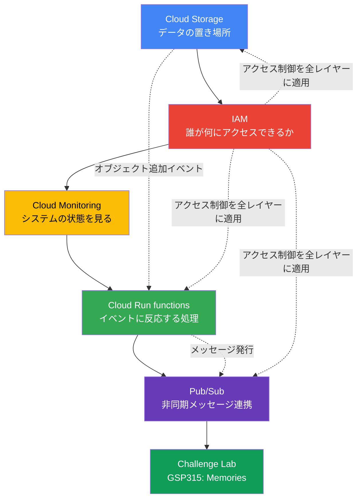

**なぜこの順序で学ぶのか**

| サービス | 役割 | このコースでの位置づけ |
|---|---|---|
| Cloud Storage | 非構造化データ（画像・ファイル）の格納 | すべてのイベントの起点になるデータレイク |
| IAM | 「誰が」「何に」「どこまで」アクセスできるかの制御 | 全サービス共通の横断的なセキュリティレイヤー |
| Cloud Monitoring | システムの健全性の可視化とアラート | 運用フェーズで異常を検知する仕組み |
| Cloud Run functions | イベントをトリガーに実行される軽量処理 | Storage や Pub/Sub のイベントに反応する「のり」の役割 |
| Pub/Sub | サービス間の非同期メッセージング | 疎結合なマイクロサービス連携を実現する基盤 |

---

## 3. Cloud Storage — オブジェクトストレージの基礎

### 3.1 定義

Cloud Storage は、世界規模でオブジェクト（ファイル）を格納・取得できるマネージド型のオブジェクトストレージサービスです。Web コンテンツの配信、アーカイブ／災害対策用のデータ保管、大容量データの配布など、幅広い用途に使えます。

### 3.2 理由（なぜバケットという概念があるのか）

Cloud Storage にデータを置くには、必ず**バケット**という入れ物を経由します。バケットはディレクトリのようにネストできず、フラットな名前空間の中でオブジェクトのキーとして「フォルダ風の階層」を疑似的に表現します。この設計により、Google は水平スケーラビリティと高い耐久性を両立させています。

### 3.3 バケット命名規則（重要）

バケット名は Cloud Storage の**単一のグローバル名前空間**を共有するため、プロジェクトをまたいで世界中で一意である必要があります。バケット名は小文字の英字、数字、ダッシュ（-）、アンダースコア（_）、ドット（.）のみを使用でき、スペースは使用できません。

| ルール | 内容 |
|---|---|
| 使用可能文字 | 小文字英数字、`-`、`_`、`.` のみ |
| 開始／終了文字 | 数字または英字で開始・終了する必要がある |
| 文字数 | 3〜63文字（ドットを含む場合は最大222文字、各セグメントは63文字まで） |
| IPアドレス形式 | ドット区切りの10進数表記（例: `192.168.5.4`）は不可 |
| 禁止プレフィックス | `goog` から始まる名前は不可 |
| 禁止文字列 | "google" や "g00gle" のような紛らわしい表記も使用不可 |
| 一意性 | グローバルに一意な名前空間を共有するため、既存の名前とは重複できない |

> [!WARNING]
> バケット名は公開情報として誰でも見ることができるため、ユーザーID・メールアドレス・プロジェクト名・個人を特定できる情報（PII）をバケット名に含めるべきではありません。プロジェクトIDをそのままバケット名に使うラボの手順は学習用としては簡便ですが、本番環境では推測されにくいランダムな接尾辞を付けるのが推奨されます。

✅ 良い例と❌ 悪い例：

| 観点 | ✅ 良い例 | ❌ 悪い例 |
|---|---|---|
| 命名 | `mycompany-prod-images-x7k2p` | `mysecretproject-bucket` |
| アクセス制御 | 用途ごとに最小権限のロールを付与 | プロジェクト全体に `allUsers` で公開 |
| 削除運用 | 不要になったら空にして保持を検討 | すぐに削除して名前を再利用可能にする |

### 3.4 コンソールでのバケット作成フロー

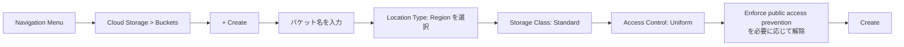

### 3.5 CLI でのベストプラクティス

```bash
# バケット作成（gcloud storage は gsutil の後継コマンド）
gcloud storage buckets create gs://<YOUR-BUCKET-NAME> \
  --location=REGION \
  --default-storage-class=STANDARD

# オブジェクトのアップロード
gcloud storage cp ada.jpg gs://YOUR-BUCKET-NAME

# フォルダ構造を模したコピー
gcloud storage cp gs://YOUR-BUCKET-NAME/ada.jpg gs://YOUR-BUCKET-NAME/image-folder/

# 一覧表示（詳細付き）
gcloud storage ls -l gs://YOUR-BUCKET-NAME
```

**なぜ `gcloud storage` を使うのか**：旧来の `gsutil` コマンドと同等の操作ができますが、`gcloud` CLI に統合されたことで認証・出力フォーマットの一貫性が高まっています。ラボの一部では `gsutil` も登場しますが、現在は `gcloud storage`系のコマンドが推奨されます。

### 3.6 公開アクセスとオブジェクト権限のベストプラクティス

ラボでは `allUsers` に `Storage Object Viewer` ロールを付与してオブジェクトを公開しますが、これは**学習目的の例**であり、本番運用では以下の原則を守る必要があります。

- オブジェクトを公開読み取り可能にする権限を使う際は、本当にそのオブジェクトを公開する意図があるかを必ず確認すること。一度「公開」されたデータはインターネット上のどこかにコピーされる可能性があり、実質的に読み取り制御を取り戻すことは不可能になる。
- 個々のユーザーを大量に列挙するより、グループを使う方が望ましい。スケールしやすく、大量のオブジェクトに対するアクセス制御を一括で効率的に更新できる。
- 均一バケットレベルアクセス（Uniform bucket-level access）を有効にし、オブジェクト単位の ACL 管理よりも IAM による一元管理を優先する。

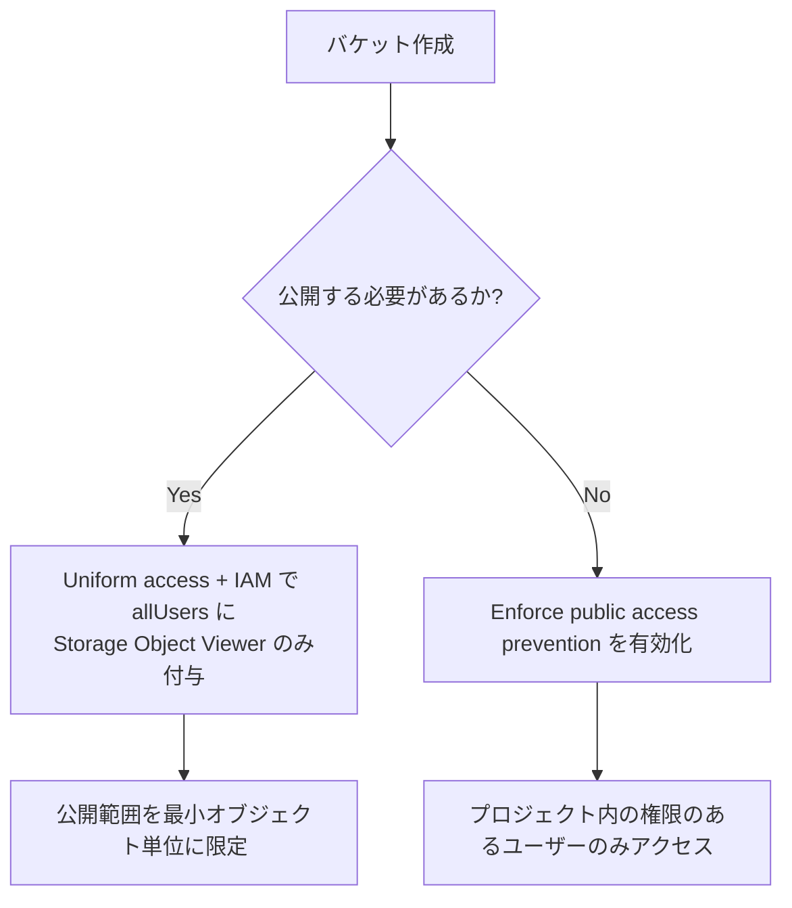

---

## 4. IAM — アクセス制御の基礎

### 4.1 定義

Identity and Access Management（IAM）は、「誰が（Identity）」「どのリソースに」「何ができるか（Role）」を一元管理する仕組みです。IAM ポリシーは、プリンシパル（ユーザー・グループ・サービスアカウント）にロール（権限の集合）を紐付けることで機能します。

### 4.2 基本ロール（Basic Roles）の理解

レガシーな基本ロールは Owner（roles/owner）、Editor（roles/editor）、Viewer（roles/viewer）の3つです。プリンシパルに基本ロールを付与すると、そのロールに含まれるすべての権限が付与されます。

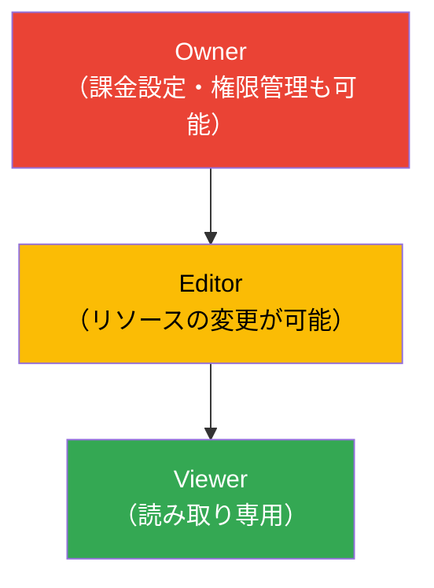

| ロール | できること |
|---|---|
| `roles/viewer` | リソースの閲覧のみ（状態を変更する操作は不可） |
| `roles/editor` | Viewer の全権限 ＋ 既存リソースの変更 |
| `roles/owner` | Editor の全権限 ＋ プロジェクトの権限管理・課金設定 |

> [!CAUTION]
> 基本ロール（Owner・Editor・Viewer）はすべての Google Cloud サービスにまたがる膨大な数の権限を含みます。本番環境では、代替手段がない場合を除き基本ロールを付与すべきではなく、必要最小限の事前定義ロールまたはカスタムロールを使用することが推奨されます。これは最小権限の原則（Principle of Least Privilege）と呼ばれ、IAM設計の最重要指針です。

### 4.3 事前定義ロールへの移行（本番運用のベストプラクティス）

ラボでは学習を簡単にするために基本ロールを使いますが、実運用では下表のようにサービス固有の事前定義ロールに置き換えるべきです。

| シナリオ | ❌ ラボでの簡易設定 | ✅ 本番運用でのベストプラクティス |
|---|---|---|
| Cloud Storage の読み取り専用アクセス | `roles/viewer`（プロジェクト全体） | `roles/storage.objectViewer`（バケット単位） |
| Pub/Sub へのメッセージ発行 | `roles/editor` | `roles/pubsub.publisher`（トピック単位） |
| Cloud Run functions のデプロイ | `roles/owner` | `roles/cloudfunctions.developer` + `roles/iam.serviceAccountUser` |

### 4.4 権限の伝播と反映時間

IAM ポリシーの変更は即座にではなく、システム全体に伝播するまで時間がかかることがあります。ラボの手順内でも「最大80秒程度かかる」という注記がありますが、これは Google のグローバルに分散したメタデータレイヤーの整合性モデルに起因します。

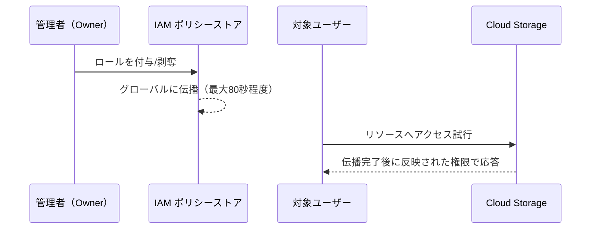

### 4.5 権限を絞り込むための実践フロー

プリンシパルに付与すべき事前定義ロールを見つけるには、まず本番環境では基本ロールを候補から除外し、サービスエージェント用のロール（名前が "Service Agent" で終わるもの）も除外した上で、必要な権限を含む最も限定的な事前定義ロールを選びます。

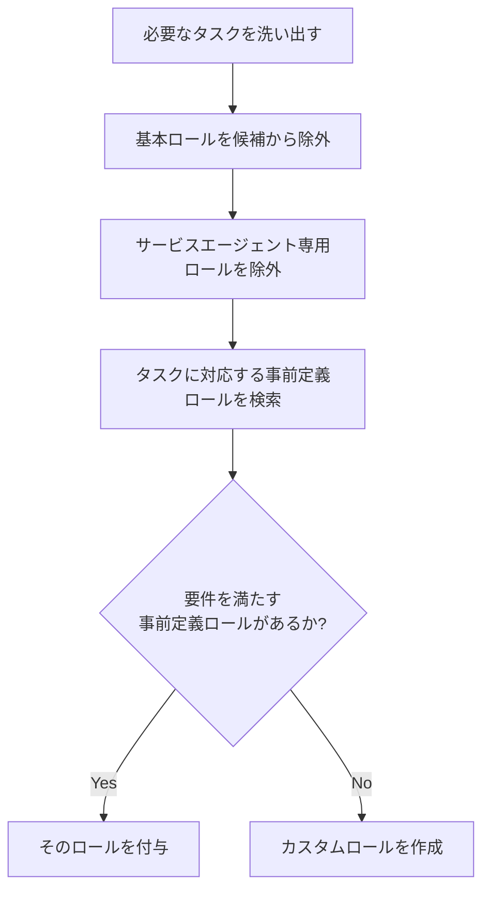

---

## 5. Cloud Monitoring — 可観測性の基礎

### 5.1 定義

Cloud Monitoring は、Google Cloud・AWS・オンプレミスのアプリケーションからメトリクス・イベント・メタデータを収集し、ダッシュボード・アラートを通じてシステムの健全性を可視化するサービスです。Cloud Logging と密に統合されており、両者を合わせて「Google Cloud Observability（旧 Operations Suite）」と呼びます。

### 5.2 なぜエージェントが必要なのか

Compute Engine の VM は、ハイパーバイザー経由で CPU 使用率やネットワークトラフィックなど一部のメトリクスを自動的に収集できますが、ディスク I/O の詳細やアプリケーション固有のログ・メトリクスを取得するには **Ops Agent** のインストールが必要です。

Ops Agent は Compute Engine インスタンス上でログとメトリクスを収集し、ログは Cloud Logging へ、メトリクスは Cloud Monitoring へ送信します。

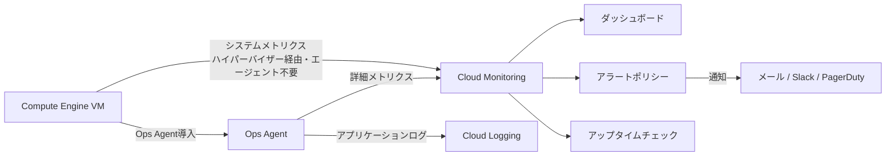

### 5.3 インストール手順（ベストプラクティス比較）

| 方法 | 適したシーン |
|---|---|
| VM作成時にチェックボックスで自動インストール | 新規VM、少数台のシンプルな運用 |
| インストールスクリプトを SSH 内で実行 | 既存VMへの後付け、ラボでの学習 |
| VM Extension Manager ポリシー | フリート全体への一括導入・自動アップグレード |

```bash
# Ops Agent のインストール（SSH ターミナル内）
curl -sSO https://dl.google.com/cloudagents/add-google-cloud-ops-agent-repo.sh
sudo bash add-google-cloud-ops-agent-repo.sh --also-install

# インストール状態の確認
sudo systemctl status google-cloud-ops-agent"*"
```

> [!NOTE]
> デフォルトでは Ops Agent は Compute Engine のデフォルトサービスアカウントを使用し、そのサービスアカウントにはログとメトリクスの書き込みに必要な Logs Writer（roles/logging.logWriter）と Monitoring Metric Writer のロールが付与されています。本番環境では最小権限の専用サービスアカウントを VM にアタッチすることが推奨されます（第4章参照）。

### 5.4 アップタイムチェックとアラートポリシーの設計

✅ 良い例と❌ 悪い例：

| 観点 | ✅ 良い例 | ❌ 悪い例 |
|---|---|---|
| チェック頻度 | サービスの SLA に応じて調整（1〜5分間隔） | 常に最小間隔にしてコストを無駄にする |
| 通知先 | オンコール担当者のチャンネル（Slack/PagerDuty） | 個人のメールアドレスのみで属人化 |
| しきい値 | 過去のベースラインを踏まえて設定 | 根拠のない値を仮置きしたまま放置 |
| 再テスト窓 | 一時的なスパイクを許容する適切な Retest window | 秒単位の揺らぎで誤検知を連発 |

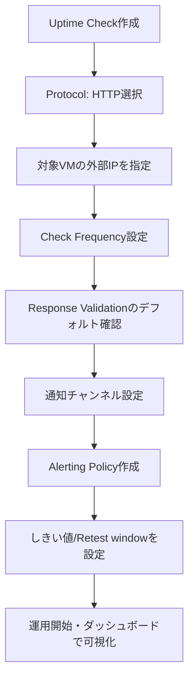

### 5.5 ダッシュボード設計の考え方

ラボでは CPU Load と Received Packets の2つのウィジェットを持つカスタムダッシュボードを作成します。実運用では、以下の「4大シグナル（Four Golden Signals）」を意識して設計すると効果的です。

| シグナル | 該当メトリクス例 |
|---|---|
| レイテンシ | リクエスト応答時間 |
| トラフィック | Received/Sent Packets |
| エラー率 | 5xx エラーレート |
| 飽和度 | CPU load、ディスク使用率 |

---

## 6. Cloud Run functions — イベント駆動サーバーレス

### 6.1 定義

Cloud Run function（旧称 Cloud Functions）は、HTTPリクエストやメッセージング、ファイルアップロードなどの「イベント」に応答して実行される単一目的のコードです。常時起動するサーバーが不要なため、突発的・断続的なワークロードに向いています。

### 6.2 トリガーの2種類

Cloud Run functions のイベント駆動トリガーは、Google Cloud プロジェクト内のイベントに反応します。これに対し HTTP トリガーは HTTP(S) リクエストに反応します。イベント駆動の関数をトリガーするには、CloudEvents 仕様の Google 実装である Eventarc を使う必要があります。

```mermaid
flowchart TD
    Trigger{トリガー種別}
    Trigger -->|HTTPトリガー| HTTP[HTTP(S)リクエスト<br/>run.app URL に直接アクセス]
    Trigger -->|イベント駆動トリガー| Eventarc[Eventarc経由]
    Eventarc --> GCS[Cloud Storageイベント<br/>object.finalized等]
    Eventarc --> PubSub[Pub/Subメッセージ<br/>受信]
    Eventarc --> Firestore[Firestore<br/>ドキュメント変更]
    HTTP --> Func[Cloud Run function 実行]
    GCS --> Func
    PubSub --> Func
    Firestore --> Func
```

> [!NOTE]
> Pub/Sub トリガーと Cloud Storage トリガーは、いずれも Eventarc トリガーの一種として実装されています。つまり「Pub/Sub トリガー」というラボのタスクは、内部的には Eventarc が Pub/Sub のイベントをフィルタリングして関数に配信する仕組みになっています。

### 6.3 コンソールでのデプロイフロー

```mermaid
flowchart LR
    A[Cloud Run > Services] --> B[WRITE A FUNCTION]
    B --> C[サービス名・リージョン設定]
    C --> D[認証: Allow public access<br/>または要認証を選択]
    D --> E[Execution Environment:<br/>第2世代 を選択]
    E --> F[Revision Scaling設定]
    F --> G[ソースコード編集]
    G --> H[SAVE and REDEPLOY]
    H --> I[TESTでイベントを模擬送信]
    I --> J[Observability > Logsで確認]
```

### 6.4 CLI でのデプロイと Pub/Sub トリガー

```bash
# 関数のデプロイ（Pub/Sub トリガー、第2世代）
gcloud functions deploy nodejs-pubsub-function \
  --gen2 \
  --runtime=nodejs22 \
  --region=REGION \
  --source=. \
  --entry-point=helloPubSub \
  --trigger-topic cf-demo \
  --stage-bucket PROJECT_ID-bucket \
  --service-account cloudfunctionsa@PROJECT_ID.iam.gserviceaccount.com \
  --allow-unauthenticated

# デプロイ状態の確認
gcloud functions describe nodejs-pubsub-function --region=REGION

# トピックにメッセージを発行してテスト
gcloud pubsub topics publish cf-demo --message="Cloud Function Gen2"

# ログの確認
gcloud functions logs read nodejs-pubsub-function --region=REGION
```

### 6.5 Cloud Storage トリガー作成のベストプラクティス

第8章の Challenge Lab で使う Cloud Storage トリガーは、次のように Eventarc の `google.cloud.storage.object.v1.finalized` イベントをフィルタリングして構築します。

```bash
gcloud eventarc triggers create TRIGGER_NAME \
  --location=REGION \
  --destination-run-service=SERVICE_NAME \
  --destination-run-region=REGION \
  --event-filters="type=google.cloud.storage.object.v1.finalized" \
  --event-filters="bucket=BUCKET_NAME" \
  --service-account=SERVICE_ACCOUNT_EMAIL
```

Eventarc トリガーの作成後、すぐに稼働するわけではなく、トリガーが完全に機能するまで最大2分ほどかかることがあります。ラボの手順で「サムネイル画像がすぐに反映されない」場合の多くは、この伝播待ちが原因です。

### 6.6 サービスアカウントとロールの整合性

Cloud Storage の直接イベントに対するトリガーを作成する前に、Cloud Storage のサービスエージェントに Pub/Sub パブリッシャーのロール（roles/pubsub.publisher）を付与する必要があります。これは、Cloud Storage の変更イベントが内部的に Pub/Sub 経由で Eventarc に配信される仕組みになっているためです。

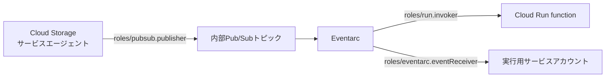

✅ 良い例と❌ 悪い例：

| 観点 | ✅ 良い例 | ❌ 悪い例 |
|---|---|---|
| サービスアカウント | 用途ごとに専用のサービスアカウントを作成 | デフォルトの Compute Engine SA をすべての関数で使い回す |
| 権限エラー対応 | 数分待って伝播を確認してから再試行 | エラーのたびに権限を過剰に付与して回避 |
| 認証設定 | 用途に応じて要認証（`--no-allow-unauthenticated`） | 常に `--allow-unauthenticated` で公開 |

---

## 7. Pub/Sub — 非同期メッセージング

### 7.1 定義

Pub/Sub は、メッセージの送信者（Publisher）と受信者（Subscriber）を分離した非同期・スケーラブルなメッセージングサービスです。レイテンシは通常100ミリ秒程度で、ストリーミング分析やデータ統合パイプラインでのデータのロード・配信によく使われます。

### 7.2 基本コンセプト

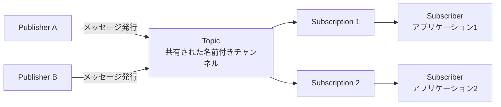

Publisher（Producer とも呼ばれる）はメッセージを作成し、指定したトピックに対してメッセージングサービスに送信（Publish）します。Subscription は特定のトピックのメッセージを受信する意思を表す名前付きのエンティティで、Subscriber（Consumer とも呼ばれる）は指定した Subscription からメッセージを受信します。

### 7.3 なぜ「先にサブスクリプションを作る」のか

サブスクリプションが接続されていないトピックに発行を開始すると、そのメッセージは保持されず、後から接続されたサブスクリプションに配信することはできません。ラボの手順で「トピックを作成 → サブスクリプションを作成 → メッセージを発行」という順序が徹底されているのは、このためです。

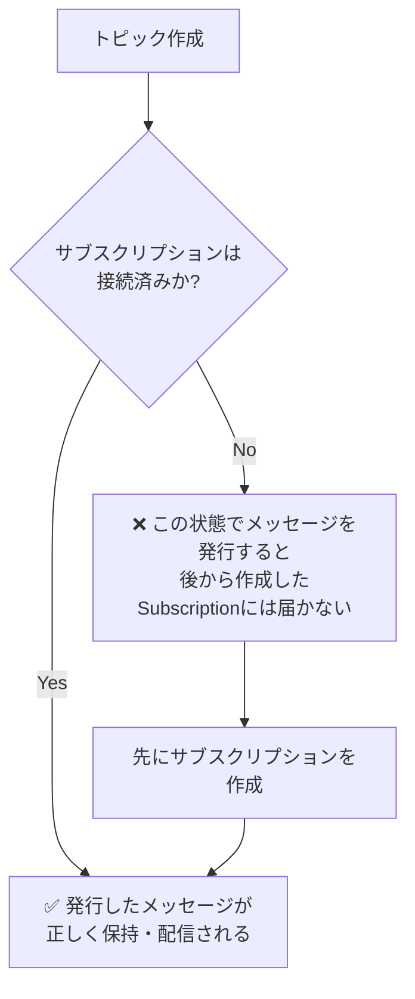

### 7.4 コンソール・CLI・Python の3つのアプローチ比較

| アプローチ | 主なコマンド／操作 | 向いている用途 |
|---|---|---|
| コンソール | Pub/Sub > Topics > Create topic | 学習・GUIでの動作確認 |
| gcloud CLI | `gcloud pubsub topics create` / `gcloud pubsub subscriptions pull` | スクリプト化・自動化・CI/CD |
| Python クライアントライブラリ | `publisher.py` / `subscriber.py`（公式サンプル） | アプリケーションへの組み込み |

```bash
# トピック作成
gcloud pubsub topics create myTopic

# サブスクリプション作成（Pull型）
gcloud pubsub subscriptions create --topic myTopic mySubscription

# メッセージ発行
gcloud pubsub topics publish myTopic --message "Hello World"

# メッセージのPull（自動ACK）
gcloud pubsub subscriptions pull mySubscription --auto-ack

# 複数メッセージをまとめてPull
gcloud pubsub subscriptions pull mySubscription --limit=3
```

> [!TIP]
> `--auto-ack` を付けずに Pull すると、メッセージは確認応答（ACK）されないまま残り続け、確認応答期限が過ぎると再配信されます。ラボで「同じメッセージが1つずつしか出てこない」という挙動は、`pull` コマンドがデフォルトで1件しか返さない仕様によるものです。

### 7.5 Publish / Subscribe のベストプラクティス

Pub/Sub client library でメッセージを発行する際は、リクエストごとに新しい Publisher クライアントを作るのではなく、同じ Publisher クライアントを再利用する方が効率的です。新しい Publisher クライアントを作成した後の最初の発行リクエストは、認証済み接続を確立するのに時間がかかるためです。

発行側でメッセージに順序キー（ordering key）を付けて同一リージョンに送信している場合、Subscriber 側でもそのSubscriptionに対して順序付き配信を有効にすることで、メッセージを順序どおりに受信できます。

✅ 良い例と❌ 悪い例：

| 観点 | ✅ 良い例 | ❌ 悪い例 |
|---|---|---|
| クライアント管理 | Publisher/Subscriberクライアントを使い回す | リクエストのたびに新規クライアントを生成 |
| メッセージ順序 | 順序が必要な場合のみ ordering key を使用 | 全メッセージに不要な順序制御を強制しスループット低下 |
| 重複耐性 | アプリケーション側で重複配信に耐えられる設計にする | 重複が来ない前提でロジックを書く |
| Pull運用 | `--limit` を用途に応じて調整 | デフォルトの1件Pullを繰り返しポーリングして非効率に処理 |

### 7.6 信頼性設計（マルチゾーン／マルチリージョン）

Pub/Sub はゾーン間レプリケーションを組み込みで備えており、サービス自体の単一ゾール障害への対処は不要ですが、クライアント側やネットワークの障害に対する耐性を持たせるには、リージョン内の複数ゾーンで十分なキャパシティを持つ Publisher と Subscriber を運用することがベストプラクティスです。

---

## 8. 総合演習：Challenge Lab（GSP315）"Memories" サムネイル生成システム

### 8.1 シナリオ

新設された "Memories" チーム向けに、写真をアップロードすると自動でサムネイルを生成するパイプラインを構築します。これは第3〜7章で学んだ全サービスの統合演習です。

### 8.2 統合アーキテクチャ

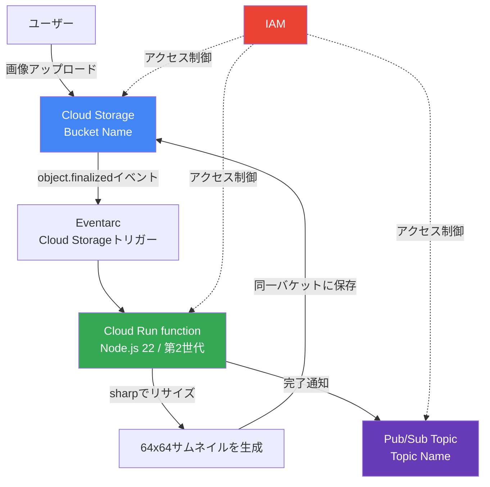

### 8.3 タスクごとの実装ポイント

**タスク1：バケット作成**

```bash
gcloud storage buckets create gs://<Bucket Name> \
  --location=REGION
```

指定された `REGION` / `ZONE` に必ず合わせて作成することが採点上のポイントです。標準サイズ（`e2-micro`／`e2-medium`）とリージョン指定はコスト管理の観点からも重要です。

**タスク2：Pub/Sub トピック作成**

```bash
gcloud pubsub topics create <Topic Name>
```

このトピックは、サムネイル生成完了後に Cloud Run function から通知を発行するために使われます（第7章参照）。

**タスク3：Cloud Run function（サムネイル生成）**

- Entry point：関数名（イベントを処理する関数）
- Trigger：Cloud Storage（第6章の Eventarc トリガーと同じ仕組み）
- ランタイム：Node.js 22、第2世代（Execution environment）

コード内の要点：

```javascript
functions.cloudEvent('', async cloudEvent => {
  const event = cloudEvent.data;
  const fileName = event.name;
  const bucketName = event.bucket;
  // ファイル名にすでに "64x64_thumbnail" が含まれていないかチェックする
  // → これは無限ループ（サムネイルからさらにサムネイルを作る）を防ぐガード
  if (fileName.search("64x64_thumbnail") === -1) {
    // sharpでリサイズしてサムネイルを生成
    // 生成後、Pub/Subトピックに完了メッセージを発行
  }
});
```

> [!IMPORTANT]
> この「すでにサムネイルかどうかをファイル名でチェックする」ロジックは、イベント駆動アーキテクチャで頻出する**無限ループ防止パターン**です。サムネイル生成が新しいオブジェクトを同じバケットに書き込むと、それ自体が新たな `object.finalized` イベントを発火させてしまうため、処理対象を判定するガード条件が不可欠です。

**タスク4：前任エンジニアのアクセス除去（第4章の実践）**

```bash
# Username 2（Viewerロール）からアクセスを除去
gcloud projects remove-iam-policy-binding PROJECT_ID \
  --member="user:PREVIOUS_ENGINEER_EMAIL" \
  --role="roles/viewer"
```

これは第4章で学んだ「最小権限の原則」の実践であり、退職・異動したメンバーのアクセスを速やかに取り消すことは、セキュリティ運用の基本です。

### 8.4 必要な IAM ロールの整理

Cloud Run function サービスアカウントに roles/run.invoker（呼び出し許可）と roles/eventarc.eventReceiver（イベント受信許可）を付与し、Cloud Storage のサービスアカウントには roles/pubsub.publisher を付与して、オブジェクトがアップロードされた際にイベントを発行できるようにする必要があります。

| サービスアカウント | 付与するロール | 目的 |
|---|---|---|
| Cloud Run function 用 SA | `roles/eventarc.eventReceiver` | Eventarc からイベントを受信 |
| Cloud Run function 用 SA | `roles/run.invoker` | 関数（サービス）を呼び出し可能にする |
| Cloud Storage サービスエージェント | `roles/pubsub.publisher` | オブジェクトイベントをEventarcに転送 |
| Cloud Run function 用 SA | `roles/pubsub.publisher`（トピック単位） | 処理完了メッセージを発行 |

---

## 9. サービス横断ベストプラクティス早見表

| カテゴリ | ベストプラクティス | 該当章 |
|---|---|---|
| コスト | リージョン・ゾーンを指定し、不要なマルチリージョン設定を避ける | 3, 8 |
| コスト | VM サイズは要件に応じて `e2-micro`／`e2-medium` を選択 | 5, 8 |
| セキュリティ | 基本ロール（Owner/Editor/Viewer）は本番で極力使わない | 4 |
| セキュリティ | 公開アクセスは範囲を最小限に、意図を明確にしてから設定 | 3 |
| セキュリティ | 用途ごとに専用サービスアカウントを作成する | 6, 8 |
| 可用性 | アップタイムチェックとアラートで異常を早期検知 | 5 |
| 可用性 | Pub/Sub Publisher/Subscriber をマルチゾーンで運用 | 7 |
| 開発効率 | Publisher/Subscriber クライアントを再利用する | 7 |
| 開発効率 | イベント駆動関数には無限ループ防止のガード条件を入れる | 6, 8 |
| 運用 | 退職・異動したメンバーのIAMロールを速やかに除去する | 4, 8 |

---

## 10. よくあるエラーとトラブルシューティング

| 症状 | 原因 | 対処 |
|---|---|---|
| バケット作成時に `409 Conflict` | バケット名がグローバルに重複している | より一意性の高い名前（ランダムなサフィックス付き）に変更 |
| IAM 権限変更後もアクセスが変わらない | ポリシーの伝播待ち（最大80秒程度） | 数分待って再試行、または再ログイン |
| Cloud Run function の Eventarc トリガーが発火しない | トリガー作成直後で伝播が完了していない、または権限不足 | 最大2分待つ、`roles/pubsub.publisher` 等の権限を確認 |
| `AccessDeniedException`（Pub/Sub 経由の Storage 操作） | サービスエージェントへのロール付与が反映されていない | 1分程度待って再実行 |
| Pub/Sub の `pull` で0件しか返らない | サブスクリプションが未接続の状態でメッセージを発行した、または既にACK済み | 先にサブスクリプションを作成してから発行する運用に変更 |
| Ops Agent のステータスが "Not detected" | サービスアカウントの権限不足、またはエージェント未起動 | `roles/logging.logWriter`／Monitoring 関連ロールを確認しエージェントを再起動 |

---

## 11. 参考ソース一覧

### Cloud Storage

| タイトル | URL |
|---|---|
| About Cloud Storage buckets（バケット命名規則） | https://docs.cloud.google.com/storage/docs/buckets |
| Best practices for Cloud Storage | https://cloud.google.com/storage/docs/best-practices |
| Create a bucket | https://cloud.google.com/storage/docs/creating-buckets |

### IAM

| タイトル | URL |
|---|---|
| Roles and permissions（基本ロールの定義） | https://docs.cloud.google.com/iam/docs/roles-overview |
| Find the right predefined roles（最小権限の原則の実践） | https://docs.cloud.google.com/iam/docs/choose-predefined-roles |
| IAM roles for Cloud Storage | https://docs.cloud.google.com/storage/docs/access-control/iam-roles |

### Cloud Monitoring

| タイトル | URL |
|---|---|
| Installing the Ops Agent on individual VMs | https://docs.cloud.google.com/monitoring/agent/ops-agent/installation |
| Install the Ops Agent during VM creation | https://docs.cloud.google.com/monitoring/agent/ops-agent/install-agent-vm-creation |
| Install and manage the Ops Agent via VM Extension Manager | https://docs.cloud.google.com/monitoring/agent/ops-agent/agent-vmem-policies |

### Cloud Run functions / Eventarc

| タイトル | URL |
|---|---|
| Cloud Run function triggers（トリガー種別の全体像） | https://docs.cloud.google.com/run/docs/function-triggers |
| Trigger functions from Cloud Storage using Eventarc | https://docs.cloud.google.com/run/docs/tutorials/trigger-functions-storage |
| Trigger functions from Pub/Sub using Eventarc | https://docs.cloud.google.com/run/docs/tutorials/pubsub-eventdriven |
| Use Eventarc to receive events from Cloud Storage | https://docs.cloud.google.com/run/docs/tutorials/eventarc |
| Create triggers from Cloud Storage events | https://docs.cloud.google.com/run/docs/triggering/storage-triggers |

### Pub/Sub

| タイトル | URL |
|---|---|
| Overview of the Pub/Sub service（基本コンセプト） | https://docs.cloud.google.com/pubsub/docs/pubsub-basics |
| What is Pub/Sub?（ユースケースと設計思想） | https://docs.cloud.google.com/pubsub/docs/overview |
| Best practices to publish to a Pub/Sub topic | https://docs.cloud.google.com/pubsub/docs/publish-best-practices |
| Best practices to subscribe to a Pub/Sub topic | https://docs.cloud.google.com/pubsub/docs/subscribe-best-practices |
| Pub/Sub: Introduction to reliability | https://docs.cloud.google.com/pubsub/docs/reliability-intro |
| Publish messages to topics | https://docs.cloud.google.com/pubsub/docs/publisher |

### Challenge Lab（GSP315）関連の実装参考

| タイトル | URL |
|---|---|
| Triggering Event Processing from Cloud Storage using Eventarc（類似構成のCodelab） | https://codelabs.developers.google.com/triggering-cloud-functions-from-cloud-storage |
| Getting Started with Event-driven Cloud Run functions | https://codelabs.developers.google.com/codelabs/getting-started-cloud-run-functions-event-driven |

---

**このガイドの使い方**：各章末の公式ドキュメントURLは、ラボの手順だけでは触れられていない「なぜ」の部分を裏付ける一次情報源です。実際にプロジェクトへ適用する際は、必ず最新のドキュメントを確認し、ラボの簡易設定（基本ロールの多用、`allUsers` への公開など）をそのまま本番環境に持ち込まないよう注意してください。