# Google Cloud Professional Cloud Architect 試験対策ガイド

## セクション1：クラウドソリューションアーキテクチャの設計と計画（配点 約25%）

> 本ガイドは、Google Cloud 公式の [Professional Cloud Architect Certification exam guide (v6.1)](https://services.google.com/fh/files/misc/professional_cloud_architect_exam_guide_english.pdf) および [認定ページ](https://cloud.google.com/learn/certification/cloud-architect?hl=en) に基づき、試験6セクション中もっとも配点比率が高い「セクション1：クラウドソリューションアーキテクチャの設計と計画」を初学者向けに解説したものです。各項目には、根拠となる Google Cloud 公式ドキュメントの URL を脚注として付記しています。

---

## 目次

1. [このセクションの全体像](#part1)
2. [前提知識：Google Cloud Well-Architected Framework](#part2)
3. [1.1 ビジネス要件を満たすクラウドソリューションインフラの設計](#part3)
4. [1.2 技術要件を満たすクラウドソリューションインフラの設計](#part4)
5. [1.3 ネットワーク・ストレージ・コンピュートリソースの設計](#part5)
6. [1.4 移行計画（マイグレーションプラン）の作成](#part6)
7. [1.5 将来のソリューション改善の構想](#part7)
8. [公式ケーススタディとセクション1の関係](#part8)
9. [学習チェックリスト](#part9)
10. [参考文献一覧](#part10)

---

## 1. このセクションの全体像

Professional Cloud Architect（PCA）試験は6つのセクションで構成されており、そのうち「セクション1：クラウドソリューションアーキテクチャの設計と計画」は**約25%**と最大の配点を占めます。試験ガイドでは、このセクションは以下の5つのサブトピックに分かれています。

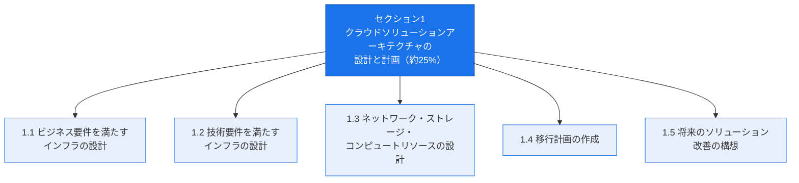

以下は**標準試験（初回受験）**の条件です。標準試験は50〜60問の多肢選択・複数選択問題で構成され、そのうち20〜30%は公式ケーススタディに基づく設問です。公式ケーススタディは4種類（Altostrat Media、Cymbal Retail、EHR Healthcare、KnightMotives Automotive）が公開されていますが、1回の試験で出題対象となるのはそのうち2つです。どの2つが選ばれるかは事前に分からないため、4種類すべてを準備しておく必要があります。試験時間は2時間、受験料は200米ドル（税別）、対応言語は英語と日本語です。なお**更新試験（Recertification exam）は問題数・試験時間・受験料が標準試験と異なる**ため、更新受験の場合は公式ページで最新の条件を確認してください。[^1]

> **出典**：[Professional Cloud Architect Certification | Google Cloud](https://cloud.google.com/learn/certification/cloud-architect?hl=en)

---

## 2. 前提知識：Google Cloud Well-Architected Framework

2025年10月30日改訂版（v6.1）の試験ガイドから、**Google Cloud Well-Architected Framework（WAF）への習熟が明示的な出題範囲**として追加されました。WAF はセクション1だけでなく試験全体を貫く設計思想であるため、まず全体像を押さえておく必要があります。[^2]

WAF は「非機能要件（Non-Functional Requirement）」を扱うための6本の柱（ピラー）で構成されます。

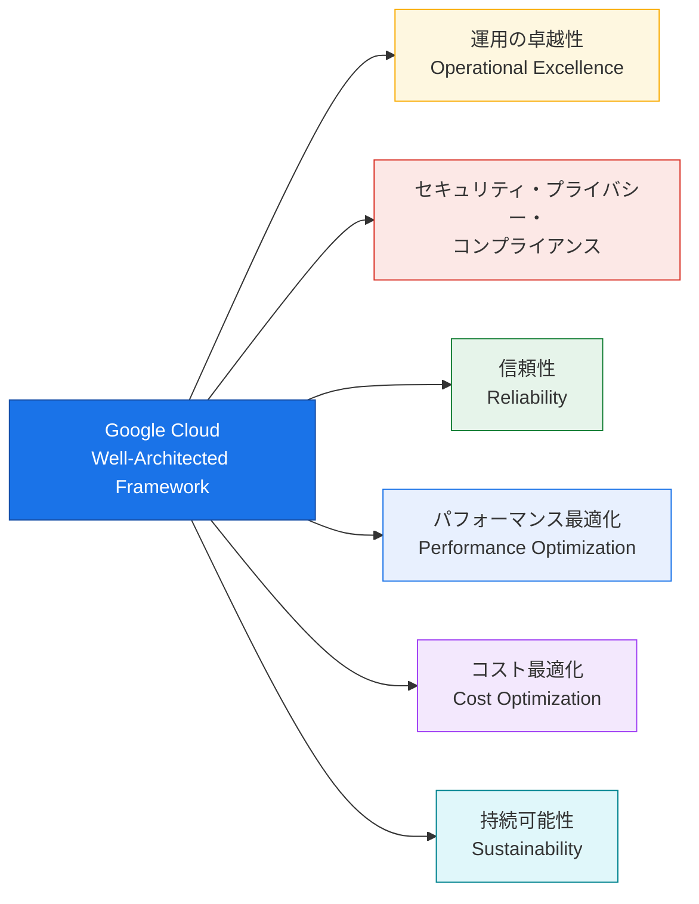

| ピラー | 目的 | 中核となる原則（例） |
| --- | --- | --- |
| 運用の卓越性 | ワークロードを効率的にデプロイ・運用・監視・管理する | SLO 定義に基づく CloudOps、継続的改善の文化 [^3] |
| セキュリティ・プライバシー・コンプライアンス | 要件を満たしつつ安全にワークロードを設計・デプロイ・運用する | セキュリティ・バイ・デザイン、ゼロトラスト、シフトレフト・セキュリティ [^4] |
| 信頼性 | 定義された条件下で意図した機能を継続的に発揮させる | 冗長化、フォールトトレラント設計、自動復旧 [^5] |
| パフォーマンス最適化 | 需要変化に対応してリソースを効率的に利用する | オートスケーリングによる予測可能な性能確保 [^6] |
| コスト最適化 | ビジネス価値に見合った支出でクラウドを運用する | ビジネス価値との整合、コスト意識の文化、継続的最適化 [^7] |
| 持続可能性 | エネルギー効率と環境負荷を考慮した設計を行う | サーバーレスによるスケールゼロ、リソースのライトサイジング [^8] |

> **ベストプラクティス**：PCA試験の設問は「技術的に正しい選択肢が複数ある」ケースが多く、最終的な正解は**WAFの6ピラーのバランス**（特にコストと信頼性のトレードオフ）で決まることが多い。設問を読む際は「どのピラーが最優先されているか」を意識すると選択肢を絞りやすい。
>
> **出典**：
> - [Google Cloud Well-Architected Framework](https://docs.cloud.google.com/architecture/framework)
> - [運用の卓越性ピラー](https://docs.cloud.google.com/architecture/framework/operational-excellence)
> - [セキュリティ・プライバシー・コンプライアンスピラー](https://docs.cloud.google.com/architecture/framework/security)
> - [信頼性ピラー](https://docs.cloud.google.com/architecture/framework/reliability)
> - [パフォーマンス最適化ピラー](https://docs.cloud.google.com/architecture/framework/performance-optimization)
> - [コスト最適化ピラー](https://docs.cloud.google.com/architecture/framework/cost-optimization)
> - [持続可能性ピラー](https://docs.cloud.google.com/architecture/framework/sustainability)

---

## 3. 1.1 ビジネス要件を満たすクラウドソリューションインフラの設計

このタスクでは、「技術」よりも先に「ビジネス」の観点からインフラ設計を評価する能力が問われます。試験ガイド原文では以下の12項目が列挙されています。[^1]

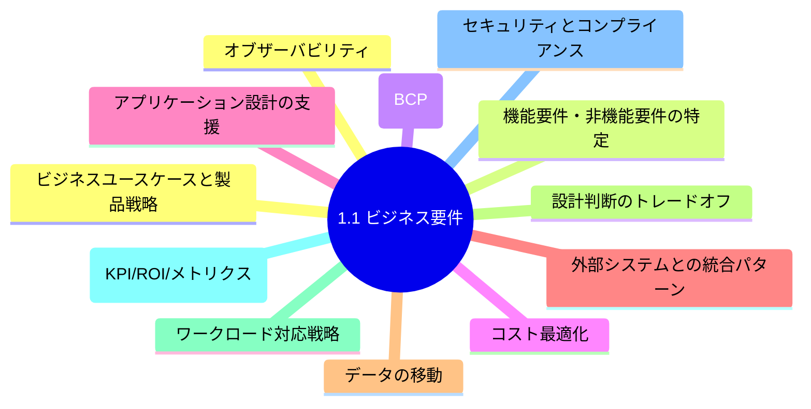

### 3.1 ビジネスユースケースと製品戦略

クラウドアーキテクトは技術者である前に、ビジネスの「なぜ」を理解する必要があります。試験では「顧客の事業目標」が明示されたシナリオに対し、それを達成する最も適したアーキテクチャを選ぶ設問が頻出します。

**ベストプラクティス**

- 要件定義の最初のステップとして、ステークホルダー（アプリケーションオーナー、セキュリティアーキテクト、運用管理者など）を特定し、要求を集約する。[^9]
- ビジネス上の成功指標（後述のKPI/ROI）と技術選定を紐づけて説明できるようにする。

### 3.2 機能要件と非機能要件の特定

| 種別 | 定義 | 具体例 |
| --- | --- | --- |
| 機能要件（Functional Requirement） | システムが「何をするか」を定義する要件 | ユーザー認証、注文処理、レコメンデーション生成 |
| 非機能要件（Non-Functional Requirement） | システムが「どのように動作するか」の品質特性 | 可用性99.99%、レイテンシ100ms以内、GDPR準拠 |

非機能要件は WAF の6ピラー（信頼性・パフォーマンス・セキュリティ・コスト・運用・持続可能性）にほぼ対応します。試験では、シナリオ文中に埋め込まれた数値（RTO/RPO、SLA、応答時間など）を見逃さずに拾い、それを満たす製品を選ぶ設問が多く出題されます。

### 3.3 事業継続計画（Business Continuity Plan）

事業継続計画は、災害や障害発生時にもビジネスを継続させるための包括的な計画で、技術的な災害復旧（DR）計画はその一部です。

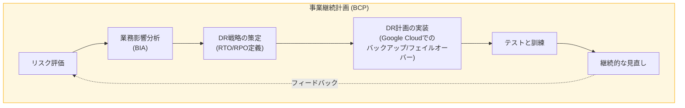

DR計画を策定する際の核となる指標は次の2つです。

| 指標 | 定義 | 設計上の意味 |
| --- | --- | --- |
| RTO（Recovery Time Objective） | 障害発生からサービス復旧までに許容される時間 | RTOが短いほど、ホットスタンバイなど高コストな構成が必要 |
| RPO（Recovery Point Objective） | 障害発生時に許容されるデータ損失量（時間換算） | RPOが短いほど、同期レプリケーションなど高頻度なバックアップが必要 |

**ベストプラクティス**

- DR計画のタスクは「シェルを開いて `/home/example/restore.sh` を実行する」のように、曖昧さのない具体的な手順に落とし込む。[^10]
- バックアップの保管場所と復旧権限者を明確にし、監査可能な形にする。[^10]
- Compute Engine・Cloud SQL・AlloyDB・VMware Engine 等のワークロードには **Backup and DR Service** を用い、ポリシーベースのバックアップと、変更・削除不可（Immutable/Indelible）なバックアップボールトを利用する。[^11]

> **出典**：
> - [Disaster recovery planning guide](https://docs.cloud.google.com/architecture/dr-scenarios-planning-guide)
> - [Architecting disaster recovery for cloud infrastructure outages](https://docs.cloud.google.com/architecture/disaster-recovery)
> - [Backup and DR Service overview](https://docs.cloud.google.com/backup-disaster-recovery/docs/concepts/backup-dr)

### 3.4 コスト最適化

コスト最適化は WAF の1ピラーであると同時に、1.1でも独立した評価項目です。オンプレミスの資本的支出（CapEx）中心のコストモデルに対し、クラウドはほとんどのリソースが従量課金の運用的支出（OpEx）である点が根本的な違いです。[^7]

**コスト最適化の中核原則**

1. クラウド支出をビジネス価値に整合させる（TCOで評価し、運用コストも含めて比較する）[^12]
2. 組織全体にコスト意識の文化を醸成する
3. リソース使用量を最適化する（必要な分だけプロビジョニングする）
4. 継続的に最適化する（利用状況とコストを継続的に監視し是正する）

**ベストプラクティス**

- Compute Engine のVMは一見安価に見えても、パッチ適用・スケーリングなどの運用オーバーヘッドを含めたTCOで比較する。[^12]
- Recommender（Active Assist）による自動リソース最適化提案、予算とアラートなどの **Cost Management** ツール群を活用する。

> **出典**：[Cost optimization pillar](https://docs.cloud.google.com/architecture/framework/cost-optimization)、[Align cloud spending with business value](https://docs.cloud.google.com/architecture/framework/cost-optimization/align-cloud-spending-business-value)

### 3.5 アプリケーション設計のサポート

インフラはアプリケーションアーキテクチャ（モノリシック、マイクロサービス、イベント駆動など）を支える基盤として設計する必要があります。試験では、アプリケーションのステートフル／ステートレスの性質に応じたコンピュート選択（後述1.3）が問われます。

### 3.6 外部システムとの統合パターン

外部システム（オンプレミス、SaaS、他クラウド、パートナーAPIなど）との統合方式は、同期・非同期の2大パターンに大別されます。

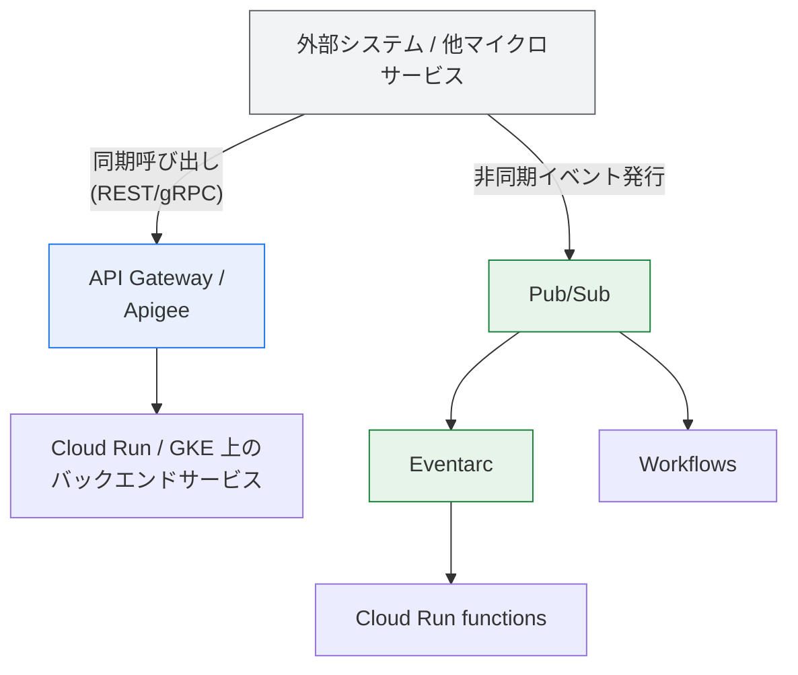

**ベストプラクティス**

- APIの外部公開・管理には **Apigee** を用い、APIライフサイクル全体（設計・セキュリティ・監視・収益化）を一元管理する。
- 疎結合なイベント駆動統合には **Pub/Sub**（メッセージング）と **Eventarc**（イベントルーティング）を組み合わせる。
- 複数サービスをまたぐオーケストレーションには **Workflows** を利用し、個々のサービスの実装詳細から統合ロジックを分離する。

### 3.7 データの移動

システム間・オンプレミスとクラウド間のデータ移動には、データ量・頻度・レイテンシ要件に応じて適切なサービスを選択します。

| ユースケース | 推奨サービス |
| --- | --- |
| オンライン/オンプレミスからCloud Storageへの継続的転送 | Storage Transfer Service |
| 大容量データを短期間で転送（オフライン。TA40は最大40TB、TA300は最大300TB。300TBを超える場合は複数台を併用） | Transfer Appliance |
| データベースの変更データキャプチャ（CDC）とレプリケーション | Datastream |
| リアルタイムのイベントストリーム取り込み | Pub/Sub + Dataflow |

> **出典**：[Storage Transfer Service](https://cloud.google.com/storage-transfer-service)、[Transfer Appliance](https://cloud.google.com/transfer-appliance/docs/4.0/overview)、[Datastream](https://cloud.google.com/datastream)

### 3.8 設計判断のトレードオフ

PCA試験の本質は「唯一の正解」を選ぶことではなく、**制約の中で最も適切なトレードオフ**を選ぶことです。典型的なトレードオフの軸は以下の通りです。

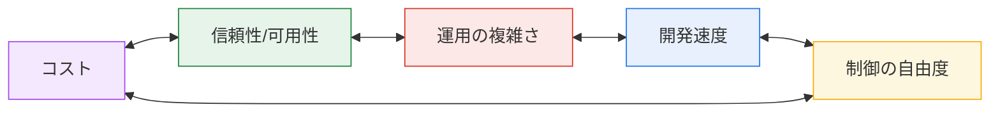

**ベストプラクティス**：シナリオ内の「必須要件（must-have）」と「努力目標（nice-to-have）」を区別する。要件に明記のない可用性・DRレベルを過剰に高く見積もる（オーバーエンジニアリング）ことは、コスト最適化ピラーに反するため誤答になりやすい。

### 3.9 ワークロード対応戦略（Build / Buy / Modify / Deprecate）

新しい要件が生じたとき、常にゼロから構築（Build）するのではなく、既存の選択肢を評価する必要があります。

| 戦略 | 内容 | 適用場面 |
| --- | --- | --- |
| Build（構築） | 独自に開発する | 差別化要因となるコア機能、既製品で要件を満たせない場合 |
| Buy（購入） | SaaS/マーケットプレイス製品を利用する | 汎用的な機能（CRM、決済等）で独自性が不要な場合 |
| Modify（変更） | 既存システムを改修・拡張する | レガシー資産に一定の価値が残っている場合 |
| Deprecate（廃止） | 使われなくなった機能・システムを廃止する | 運用コストに見合う価値を生んでいない場合 |

### 3.10 成功指標（KPI・ROI・メトリクス）

技術選定の妥当性は、最終的にビジネス指標で説明できる必要があります。

| 指標カテゴリ | 例 |
| --- | --- |
| KPI（重要業績評価指標） | 可用性(%)、平均復旧時間(MTTR)、デプロイ頻度、顧客満足度 |
| ROI（投資収益率） | クラウド移行による運用コスト削減額、新機能による売上増加 |
| その他メトリクス | レイテンシp99、エラーレート、スループット |

### 3.11 セキュリティとコンプライアンス

1.1では「ビジネス要件としてのセキュリティ・コンプライアンス」（規制、契約上の義務など）を扱います。技術的な実装の詳細はセクション3（設計と計画とは別枠）で扱われますが、試験ガイド上は1.1にも明記されているため、要件定義段階で規制要件（医療情報のプライバシー、PCI DSS等）を洗い出す視点が重要です。

### 3.12 オブザーバビリティ

システムの内部状態を外部から把握できる能力（オブザーバビリティ）は、運用の卓越性ピラーの土台です。Google Cloud Observability（Cloud Logging、Cloud Monitoring、Cloud Trace、Cloud Profiler）の活用がベストプラクティスとして位置づけられます（詳細はセクション6で扱う運用の卓越性の項を参照）。

---

## 4. 1.2 技術要件を満たすクラウドソリューションインフラの設計

1.1が「ビジネス」の視点だったのに対し、1.2は「技術」の視点から非機能要件を満たす設計を評価します。試験ガイド原文の項目は以下の7つです。[^1]

### 4.1 Google Cloud Well-Architected Framework への習熟

前述の第2章を参照。1.2ではWAFの原則を**具体的な設計判断に適用する能力**が問われます。

### 4.2 高可用性とフェイルオーバー設計

Google Cloud のリージョン・ゾーン構成を理解し、単一障害点（SPOF）を排除する設計が基本です。

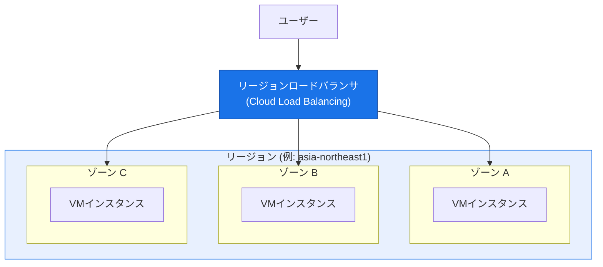

**ベストプラクティス**

- リージョンマネージドインスタンスグループ（Regional MIG）を用いて複数ゾーンにVMを分散させ、単一ゾーン障害に耐える構成にする。[^13]
- グローバルなユーザー基盤には、複数リージョンにまたがるアクティブ-アクティブ構成とグローバル外部ロードバランサを組み合わせる。
- ステートレスなアプリケーション層とステートフルなデータ層を分離し、ステートレス層は容易に水平スケール・フェイルオーバーできるようにする。[^14]

### 4.3 クラウドリソースの柔軟性

VM、コンテナ、サーバーレスなど複数の抽象化レベルを組み合わせ、ワークロードの性質に応じて柔軟にリソースを選択できる設計にする（詳細は1.3のコンピュート選択を参照）。

### 4.4 成長要件を満たすスケーラビリティ

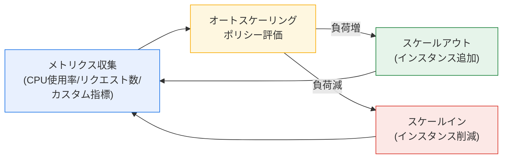

**ベストプラクティス**：オートスケーリングは性能とコストの両ピラーに効くレバーである。負荷増大時に予測可能な性能を提供しつつ、負荷減少時には未使用リソースを自動的に削減することで、パフォーマンス最適化とコスト最適化を同時に達成できる。[^6]

### 4.5 パフォーマンスとレイテンシ

ユーザーに近いリージョンへのデプロイ、CDN（Cloud CDN）によるコンテンツキャッシュ、データベースのリードレプリカ配置などが代表的な設計手段です。パフォーマンス最適化はコストとのトレードオフを伴うことが多い点に留意します。[^6]

### 4.6 Gemini Cloud Assist

Gemini Cloud Assist は、Google Cloud のアプリケーションライフサイクル全体（設計・デプロイ・トラブルシューティング・最適化）を支援する生成AIアシスタントです。[^15]

**主な機能**

- 自然言語の「意図」から、Application Design Center と連携してアーキテクチャ図や本番運用可能な Terraform／gcloud／kubectl のブルー プリントを生成する。[^16]
- ログ・メトリクス・トレース・構成情報を横断的に相関分析し、パフォーマンス／コスト異常のプロアクティブな調査を支援する（プレビュー機能を含む）。[^16]
- コンソール上の現在のページコンテキストを理解し、ハルシネーションを抑制したコンテキストに即した回答を提供する。[^17]

> **出典**：[Gemini Cloud Assist documentation](https://docs.cloud.google.com/cloud-assist)、[Gemini for Google Cloud overview](https://docs.cloud.google.com/cloud-assist/overview)

### 4.7 バックアップとリカバリ

3.3（事業継続計画）で述べたRTO/RPOを技術的に実現する手段です。

| 対象ワークロード | 推奨手段 |
| --- | --- |
| Compute Engine VM | Backup and DR Service によるバックアップボールト、または Persistent Disk スナップショット |
| Cloud SQL / AlloyDB | Backup and DR Service の自動バックアッププラン |
| Cloud Storage オブジェクト | オブジェクトバージョニング、マルチリージョンバケット |
| VMware Engine VM | Backup and DR Service（vSphere Storage APIsベース） |

**ベストプラクティス**：バックアップボールトは「不変性（Immutability）」と「削除不可性（Indelibility）」を持つため、ランサムウェア対策としても有効。

CMEK（顧客管理暗号鍵）によるバックアップの暗号化に対応するのは **Compute Engine・Persistent Disk・Cloud SQL** のワークロードに限られます。**AlloyDB と Google Cloud VMware Engine のバックアップは CMEK の対象外**であり、これらは Google 管理鍵で暗号化されます。

ただし、**どの鍵が使われるかはワークロードごとに異なります**。

| ワークロード | バックアップの暗号化に使われる鍵 |
| --- | --- |
| Compute Engine | **バックアップボールト側の CMEK**。ボールト作成時に鍵を指定し、作成後に変更・追加することはできない |
| Persistent Disk | **移行元ワークロード（ソースディスク）側の CMEK**。ソースが CMEK 暗号化されている場合、そのバックアップは **CMEK を設定していないボールト**に格納する必要がある |
| Cloud SQL | **移行元ワークロード（ソースインスタンス）側の CMEK** |

したがって「ボールト作成時に必ず鍵を指定する」という一律の運用にはできません。保護対象ワークロードの種類ごとに、ソース側の暗号化方式とボールト側の設定を設計段階で整合させておく必要があります。[^11]

> **出典**：[Backup and DR Service overview](https://docs.cloud.google.com/backup-disaster-recovery/docs/concepts/backup-dr)

---

## 5. 1.3 ネットワーク・ストレージ・コンピュートリソースの設計

このタスクは最も製品知識が問われる領域です。試験ガイド原文の7項目を順に解説します。[^1]

### 5.1 オンプレミス／マルチクラウド環境との統合

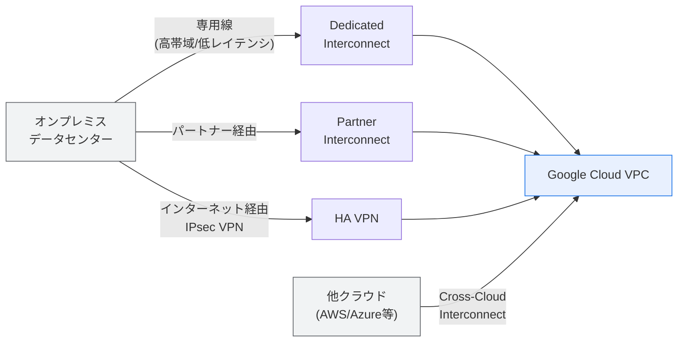

**ベストプラクティス**

- 帯域・パフォーマンス・セキュリティ・コスト・信頼性の要件に応じてハイブリッド／マルチクラウド接続方式を選定する。[^18]
- ハブアンドスポーク型の接続VPCを使い、複数VPCにまたがるシナリオをスケールさせる。[^19]
- Shared VPC を活用し、各サービスプロジェクトが個別に同じ接続ソリューションを複製する必要をなくす。[^19]
- ハイブリッドDNSのベストプラクティスに従い、オンプレミスとGoogle Cloud間で名前解決を統一する。[^18]

> **出典**：[Decide the network design for your Google Cloud landing zone](https://docs.cloud.google.com/architecture/landing-zones/decide-network-design)、[Best practices for VPC design](https://docs.cloud.google.com/architecture/best-practices-vpc-design)

### 5.2 Google Cloud AI/機械学習ソリューション

v6.1で新設された領域です。Vertex AI の各機能を統合・発展させたエージェント基盤である Gemini Enterprise Agent Platform が中核となります（Vertex AI 自体は引き続き提供されており、モデル学習・デプロイ・MLOps の基盤として利用できます）。[^20]

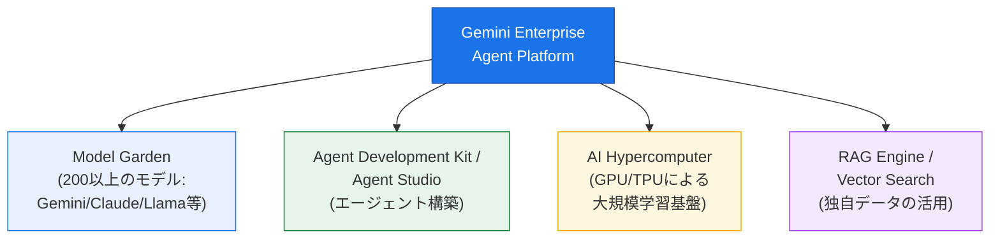

| コンポーネント | 役割 |
| --- | --- |
| Model Garden | Gemini・Gemma・Claude・Llama など200以上のモデルを一箇所から発見・テスト・デプロイ [^21] |
| Agent Builder（ADK/Agent Studio） | コードファースト（ADK）またはローコード（Agent Studio）でAIエージェントを構築 [^22] |
| AI Hypercomputer | GPU/TPUを統合した大規模モデル学習・推論向けインフラ |
| RAG Engine / Vector Search | 独自データを安全にLLMへ接続し、回答精度向上とハルシネーション低減を実現 [^20] |

> **出典**：[Agent Platform overview](https://docs.cloud.google.com/gemini-enterprise-agent-platform/overview)、[Overview of Model Garden](https://docs.cloud.google.com/vertex-ai/generative-ai/docs/model-garden/explore-models)

### 5.3 クラウドネイティブネットワーキング（VPC設計）

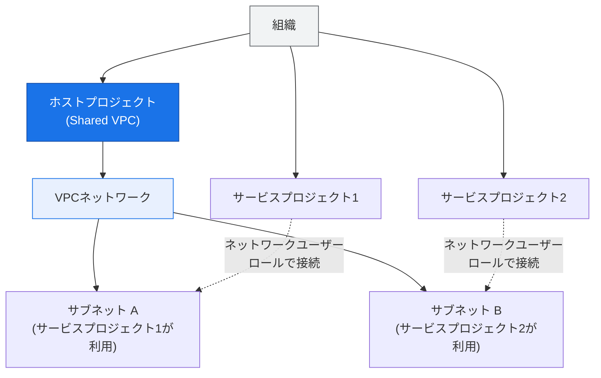

**ベストプラクティス**（[VPC設計のベストプラクティスとリファレンスアーキテクチャ](https://docs.cloud.google.com/architecture/best-practices-vpc-design)より）[^19]

- VPCネットワーク設計は早い段階から検討し、ステークホルダー・タイムライン・前提作業を明確にする。
- 「Keep it simple」の原則：単一のVPCで開始し、必要になった段階でShared VPCへ拡張する。
- 明確な命名規則を使用する。
- 単一プロジェクトのデフォルトクォータを超える成長が見込まれる場合、プロジェクトごとに単一のVPCネットワークを作成し、クォータをプロジェクト単位にマッピングする。
- 自律的なチームごとにVPCネットワークを分け、共通サービスは別のVPCネットワークに集約する。
- センシティブなデータは専用のVPCネットワークに分離する。
- ハイブリッド接続には動的ルーティング（Cloud Router）を可能な限り使用する。

| 要素 | 目的 |
| --- | --- |
| VPC ピアリング | プロジェクト間・組織間でプライベート接続する（推移的接続はできない点に注意） |
| ファイアウォールルール | ネットワークタグ／サービスアカウント単位でトラフィックを制御する |
| Cloud Load Balancing | グローバル／リージョナルなトラフィック分散 |
| Private Service Connect（PSC） | VPCとサービス間をプライベートかつ一方向に安全に接続する |

> **出典**：[Best practices and reference architectures for VPC design](https://docs.cloud.google.com/architecture/best-practices-vpc-design)、[VPC networks](https://docs.cloud.google.com/vpc/docs/vpc)

### 5.4 データ処理ソリューションの選択

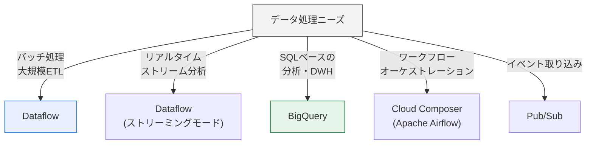

### 5.5 適切なストレージタイプの選択

Google Cloud のストレージは、データの構造とアクセスパターンに応じて大きく「オブジェクト」「ブロック」「ファイル」「データベース」の4種類に分かれます。[^23]

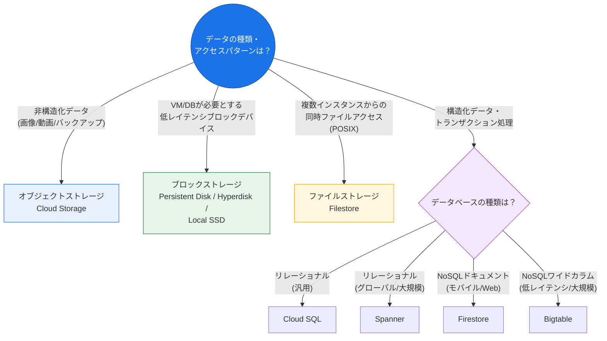

| ストレージ種別 | 主なサービス | 典型的なユースケース |
| --- | --- | --- |
| オブジェクトストレージ | Cloud Storage | 静的サイトのアセット、データレイク、バックアップ、動画配信 [^24] |
| ブロックストレージ | Persistent Disk、Hyperdisk、Local SSD | VMのブートディスク、データベースのローカルストレージ、低レイテンシキャッシュ [^25] |
| ファイルストレージ | Filestore | 複数VM/コンテナからの同時読み書き、レガシーアプリのPOSIX互換要件 [^26] |
| リレーショナルDB | Cloud SQL、AlloyDB、Spanner | トランザクション処理、グローバル規模の強整合性が必要な場合はSpanner |
| NoSQL DB | Firestore、Bigtable | モバイル/Webアプリのドキュメント指向データはFirestore、IoT/分析向け大規模低レイテンシはBigtable |

**ベストプラクティス**

- Persistent Diskは永続性が必要な用途に、Local SSDは揮発性を許容できる高速スクラッチ領域に使い分ける。[^25]
- Cloud Storageの **Autoclass** を使うとアクセス頻度に応じてストレージクラスが自動的に切り替わり、アクセスパターンが予測しにくいワークロードに適している。[^25]
- 「本番環境でDBエンジンをVM上のブロックストレージで自前運用するか、マネージドDBを使うか」は運用オーバーヘッドの観点で比較する。

> **出典**：[Object storage vs block storage vs file storage](https://cloud.google.com/blog/topics/developers-practitioners/map-storage-options-google-cloud)、[How Object vs Block vs File Storage differ](https://cloud.google.com/discover/object-vs-block-vs-file-storage)

### 5.6 コンピュートニーズのプラットフォーム製品へのマッピング

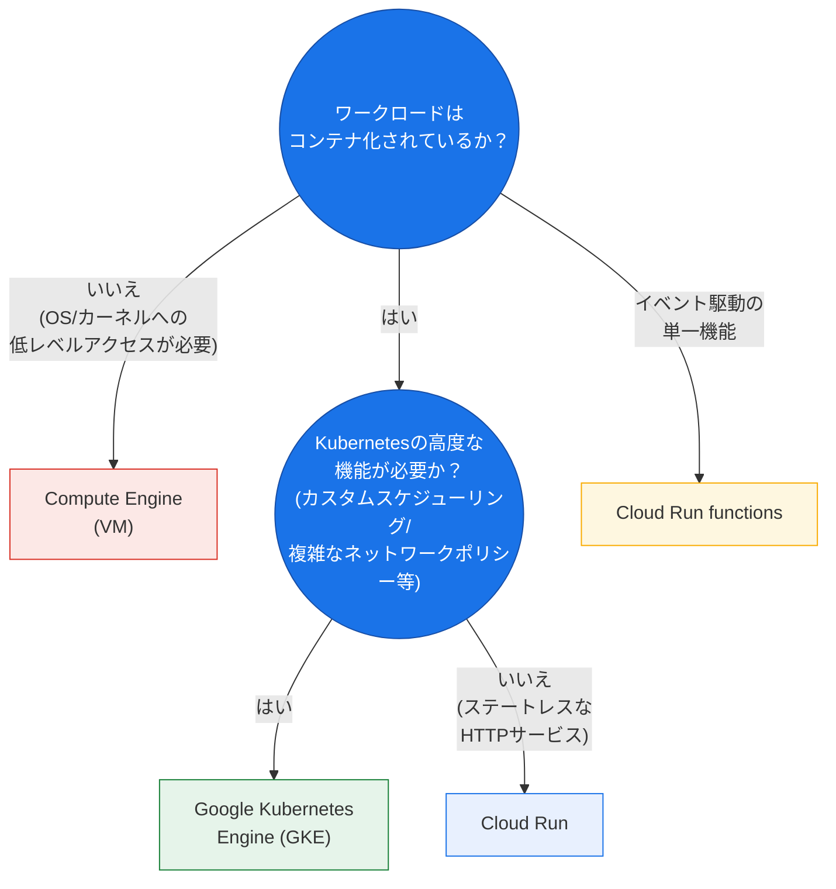

| プラットフォーム | 管理レベル | 適したワークロード |
| --- | --- | --- |
| Compute Engine | ユーザーがOS〜アプリまで管理 | カスタムカーネル/低レベルアクセスが必要なアプリ、リフト＆シフト移行 [^27] |
| GKE | Googleがコントロールプレーンを管理 | 複雑なマイクロサービス、既存のKubernetesワークロード、きめ細かい制御が必要な場合 [^28] |
| Cloud Run | フルマネージド（サーバーレス） | ステートレスでリクエスト駆動のコンテナサービス、スケールゼロが有効なワークロード [^27] |
| Cloud Run functions | フルマネージド（サーバーレス） | イベントドリブンな単機能処理（画像処理、Webhook等） [^27] |

**ベストプラクティス**：まず最もシンプルな Cloud Run から検討を始め、Kubernetes固有の機能が明確に必要になった時点で GKE へ、コンテナ化が困難またはOSレベルの制御が必須な場合のみ Compute Engine を選択する、という段階的アプローチが推奨される。[^29]

> **出典**：[Compute overview](https://docs.cloud.google.com/docs/compute-area/overview)、[Compute Engine overview](https://docs.cloud.google.com/compute/docs/overview)

### 5.7 コンピュートリソースの選択（Spot VM・カスタムマシンタイプ等）

| オプション | 特徴 | 適したユースケース |
| --- | --- | --- |
| Spot VM | 標準VMより大幅に安価だが、Googleにより随時回収され得る | バッチ処理、フォールトトレラントな分散処理、CI/CD |
| カスタムマシンタイプ | vCPU・メモリを個別に指定できる | 定義済みマシンタイプがワークロードに最適化されていない場合 |
| 専用ワークロード向けマシン（GPU/TPU） | AI/ML学習・推論、HPC向け | 大規模モデル学習、科学技術計算 |

---

## 6. 1.4 移行計画（マイグレーションプラン）の作成

試験ガイドでは「移行計画の作成（ドキュメントとアーキテクチャ図を含む）」として、以下の4項目が挙げられています。[^1]

### 6.1 既存システムとの統合

移行後のシステムが、移行が完了していない既存システム（オンプレミス側の残存システムなど）とどう連携し続けるかを設計段階で明確にする。

### 6.2 システム・データの評価と移行（Migration Center）

**Migration Center** は、オンプレミスや他クラウドからGoogle Cloudへの移行を加速するための統合プラットフォームです。[^30]

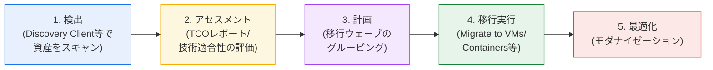

**主な機能**

- **コスト見積もり**：オンプレミス資産の規模・構成に基づき、将来のGoogle Cloudコストを迅速に見積もる（プレビュー含む）。[^30]
- **資産検出（Discovery）**：エージェントレスのディスカバリークライアントで物理サーバー/VMを自動検出し、必要なメトリクスを収集する。[^31]
- **TCOレポートと依存関係分析**：総保有コスト（TCO）レポートを生成し、アプリケーション／ネットワークの依存関係を特定して「一緒に移行すべきコンポーネント」を可視化する。[^30]
- **技術適合性アセスメント**：データドリブンな推奨により、各資産をどのGoogle Cloud製品に移行すべきかを提案する。[^30]

**ベストプラクティス**：移行計画は「発見」→「評価」→「計画」の順で進め、ワークロードをカタログ化し、インフラコンポーネントおよび依存関係とマッピングしたうえで、レホスト／リプラットフォーム／リファクター等の移行パスを高レベルで特定する。[^32]

> **出典**：[Migration Center overview](https://docs.cloud.google.com/migration-center/docs/migration-center-overview)、[About migration planning](https://docs.cloud.google.com/migration-center/docs/migration-planning-overview)

### 6.3 移行手法、ワークロードテスト、ネットワーク計画、依存関係計画

移行戦略は、一般に「6R」と呼ばれる分類で整理されます。

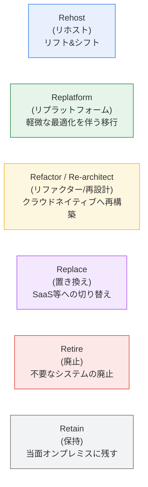

| 移行パス | 特徴 | 移行速度 | クラウド最適化度 |
| --- | --- | --- | --- |
| Rehost | Migrate to Virtual Machines等でそのまま移設 | 速い | 低い |
| Replatform | OSやミドルウェアなど一部をクラウド向けに調整して移設 | 中程度 | 中程度 |
| Refactor / Re-architect | コンテナ化・マネージドサービス化など抜本的に再設計 | 遅い | 高い |
| Replace | 既存機能をSaaSや Google Cloud のマネージド製品に置換 | ケースによる | 高い |
| Retire | 使われていないシステムを廃止する | - | - |
| Retain | 規制等の理由で当面オンプレミスに残す | - | - |

**移行に関わるツール**（実運用でGoogle Cloudのプロフェッショナルサービスチームが使用）[^33]

- **Migrate to Virtual Machines**：オンプレミス／他クラウドのVMをCompute Engineへ移行
- **Migrate to Containers**：VMワークロードをGKE上のコンテナへモダナイズしながら移行
- **Storage Transfer Service / Transfer Appliance**：データ移行（前述3.7参照）
- **Cloud Build / Artifact Registry**：CI/CDパイプラインの構築、コンテナイメージ管理

**ワークロードテスト**

移行手法を選んだあと、本番切り替え前に「移行後の環境が業務要件を満たすか」を検証する工程です。移行ウェーブごとに以下を実施し、結果をもって次のウェーブへ進むかを判断します。

| 検証観点 | 内容 |
| --- | --- |
| 代表的な負荷パターン | 平常時・ピーク時（月末バッチ、キャンペーン、始業時アクセス集中など）・想定される将来の成長分を再現した負荷をかける |
| 性能検証 | スループット、レイテンシ（p50/p95/p99）、リソース使用率を移行前のベースラインと比較する |
| フェイルオーバー | ゾーン／リージョン障害、インスタンス停止、DBのフェイルオーバーを意図的に発生させ、実測のRTO/RPOが設計値（3.3参照）以内に収まるかを確認する |
| データ整合性 | 移行前後でレコード件数・チェックサム・業務上のキー項目を突き合わせ、欠損・重複・文字コード変換の破損がないことを確認する |

**移行可否（Go/No-Go）の判定基準**：上記のうち、①性能が移行前ベースライン比で許容範囲内（例：p95レイテンシの劣化が事前に合意した閾値以内）、②実測RTO/RPOが設計値を満たす、③データ整合性チェックが完全一致、の3点をすべて満たした場合にのみ本番切り替えを実施します。1つでも満たさない場合はNo-Goとし、原因を解消してから再テストします。

**ロールバック条件**：切り替え後の監視期間（例：24〜72時間）内に、エラー率・レイテンシがあらかじめ定めた閾値を超えた場合、データ不整合が検出された場合、または業務が継続不能となった場合は、事前に用意したロールバック手順で移行元環境へ切り戻します。ロールバックを成立させるため、切り替え後も移行元環境を一定期間は稼働可能な状態で保持し、切り替え以降に発生した差分データの取り扱い（再同期するか破棄するか）を事前に決めておきます。

**ベストプラクティス**：ネットワーク計画では、移行期間中に発生する一時的なハイブリッド接続（オンプレミス⇔クラウド間の帯域・レイテンシ）を考慮し、依存関係計画では「一緒に移行しないと動かないコンポーネント」を移行ウェーブの単位として扱う。[^32]

> **出典**：[Migration tools](https://docs.cloud.google.com/migration-center/docs/migration-modernization-tools)、[RaMP overview](https://docs.cloud.google.com/migration-center/docs/ramp-overview)

### 6.4 ソフトウェアライセンスと財務影響の判断

- 既存のオンプレミスソフトウェアライセンス（Oracle、Microsoft SQL Server等）がクラウド環境でどう適用されるか（BYOL: Bring Your Own License、または従量課金ライセンス）を事前に確認する。
- 移行によるTCO変化（ハードウェア減価償却の終了、運用人件費の変化、クラウド従量課金への移行）を財務部門と共有できる形で提示する。

---

## 7. 1.5 将来のソリューション改善の構想

試験ガイド原文の3項目です。[^1]

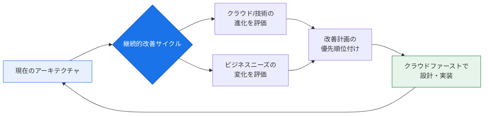

### 7.1 クラウドと技術の改善

Google Cloud は新サービス・新機能を継続的にリリースするため、アーキテクトは既存アーキテクチャが陳腐化していないかを定期的にレビューする責任があります。運用の卓越性ピラーでも「価格モデルや新機能を定期的に見直し、より良い選択肢を継続的に採用する」ことが推奨されています。[^34]

### 7.2 ビジネスニーズの進化

初期設計時の前提（トラフィック量、規制要件、組織構造）は時間とともに変化します。将来の拡張性を見据えつつも、現時点で不要な複雑さを持ち込まない（YAGNI: You Aren't Gonna Need It）バランス感覚が試験でも問われます。

### 7.3 クラウドファーストの設計アプローチ

新規ワークロードは「オンプレミスの制約に合わせてクラウドを使う」のではなく、「クラウドネイティブなサービス（マネージドDB、サーバーレスコンピュート、マネージドAI/ML）を前提に設計する」という考え方です。これはWAFの運用の卓越性・コスト最適化ピラーとも整合します。

> **出典**：[Manage and optimize cloud resources](https://docs.cloud.google.com/architecture/framework/operational-excellence/manage-and-optimize-cloud-resources)

---

## 8. 公式ケーススタディとセクション1の関係

2025年10月30日の試験改訂（v6.1）により、ケーススタディは以下の4種類に刷新され、**標準試験**では1回の試験でこのうち2つが出題対象になります（更新試験の出題構成は標準試験とは異なります）。複数のケーススタディに生成AI活用の要素が組み込まれています。[^35]

| ケーススタディ | 業種 | 既存技術環境の概要 | セクション1との関連ポイント |
| --- | --- | --- | --- |
| Altostrat Media | メディア | GKEでコンテンツ配信基盤を運用、Cloud Storageに映像/音声ライブラリ、BigQueryを分析基盤に利用、Cloud Run functionsでイベント駆動処理（トランスコード等） [^36] | 1.3のコンピュート選択（GKE/Cloud Run functions）、1.1のデータ移動、AI/ML活用（レコメンデーション） |
| Cymbal Retail | 小売 | 急成長中のオンライン小売業者。会話型コマース、パーソナライズ、カタログ管理の刷新を計画 [^37] | 1.1のビジネスユースケース、1.3のAI/MLソリューション（Discovery AI等） |
| EHR Healthcare | ヘルスケア | コロケーション環境からGoogle Cloudへ移行中のSaaS事業者。スケーラブルな基盤・DR・コンテナ化されたEHRソフトウェアの迅速なデプロイが課題 [^38] | 1.4の移行計画、1.1の事業継続計画・コンプライアンス（医療情報保護） |
| KnightMotives Automotive | 自動車 | コネクテッドカーサービス。車両からのテレメトリデータをバッチでオンプレミスに集約中で、リアルタイム性・スケーラビリティに課題 [^39] | 1.3のデータ処理ソリューション（Pub/Sub, Dataflow）、1.1のデータの移動 |

**ベストプラクティス**：試験本番ではケーススタディを画面分割で参照できます。すべての設問がケーススタディを必要とするわけではなく、多くの設問はケーススタディを読まずに一般原則だけで回答可能です。事前学習の際は、各ケーススタディの「現状の技術スタック」と「解決したい課題（ビジネス要件）」を1ページ程度に要約しておくと、試験本番で参照時間を節約できます。[^40]

> **出典**：[v6.1 Professional Cloud Architect Exam Guide](https://services.google.com/fh/files/misc/v6.1_pca_professional_cloud_architect_exam_guide_english.pdf)

---

## 9. 学習チェックリスト

- [ ] Well-Architected Framework の6ピラー（運用の卓越性・セキュリティ・信頼性・パフォーマンス・コスト・持続可能性）の目的をそれぞれ一言で説明できる
- [ ] 機能要件と非機能要件の違いを説明でき、シナリオ文から両者を切り分けて抽出できる
- [ ] RTO / RPO の定義と、それぞれが設計判断（レプリケーション頻度・スタンバイ構成）に与える影響を説明できる
- [ ] Build / Buy / Modify / Deprecate の4戦略を使い分ける判断基準を説明できる
- [ ] Pub/Sub・Eventarc・Workflows・Apigee の役割の違いを説明できる
- [ ] Compute Engine / GKE / Cloud Run / Cloud Run functions の選択基準を説明できる
- [ ] オブジェクト／ブロック／ファイル／データベースストレージの使い分けを説明できる
- [ ] Shared VPC・VPCピアリング・Private Service Connectの違いを説明できる
- [ ] Migration Center の主要機能（コスト見積もり・資産検出・依存関係分析）を説明できる
- [ ] 6R（Rehost/Replatform/Refactor/Replace/Retire/Retain）の移行戦略を説明できる
- [ ] Gemini Cloud Assist と Gemini Enterprise Agent Platform（Model Garden含む）の違いを説明できる
- [ ] 4つの公式ケーススタディの業種と主要な技術課題を要約できる

---

## 10. 参考文献一覧

### 公式試験情報

- [Professional Cloud Architect Certification | Google Cloud](https://cloud.google.com/learn/certification/cloud-architect?hl=en)
- [Professional Cloud Architect Exam Guide (v6.1, PDF)](https://services.google.com/fh/files/misc/v6.1_pca_professional_cloud_architect_exam_guide_english.pdf)
- [Professional Cloud Architect Exam Guide (PDF, 提供リンク)](https://services.google.com/fh/files/misc/professional_cloud_architect_exam_guide_english.pdf)

### Well-Architected Framework

- [Google Cloud Well-Architected Framework](https://docs.cloud.google.com/architecture/framework)
- [運用の卓越性ピラー](https://docs.cloud.google.com/architecture/framework/operational-excellence)
- [セキュリティ・プライバシー・コンプライアンスピラー](https://docs.cloud.google.com/architecture/framework/security)
- [信頼性ピラー](https://docs.cloud.google.com/architecture/framework/reliability)
- [パフォーマンス最適化ピラー](https://docs.cloud.google.com/architecture/framework/performance-optimization)
- [コスト最適化ピラー](https://docs.cloud.google.com/architecture/framework/cost-optimization)
- [持続可能性ピラー](https://docs.cloud.google.com/architecture/framework/sustainability)
- [Align cloud spending with business value](https://docs.cloud.google.com/architecture/framework/cost-optimization/align-cloud-spending-business-value)
- [Manage and optimize cloud resources](https://docs.cloud.google.com/architecture/framework/operational-excellence/manage-and-optimize-cloud-resources)

### 事業継続・災害復旧

- [Disaster recovery planning guide](https://docs.cloud.google.com/architecture/dr-scenarios-planning-guide)
- [Architecting disaster recovery for cloud infrastructure outages](https://docs.cloud.google.com/architecture/disaster-recovery)
- [Backup and DR Service overview](https://docs.cloud.google.com/backup-disaster-recovery/docs/concepts/backup-dr)

### ネットワーク

- [Best practices and reference architectures for VPC design](https://docs.cloud.google.com/architecture/best-practices-vpc-design)
- [Decide the network design for your Google Cloud landing zone](https://docs.cloud.google.com/architecture/landing-zones/decide-network-design)
- [VPC networks](https://docs.cloud.google.com/vpc/docs/vpc)

### ストレージ

- [Object storage vs block storage vs file storage](https://cloud.google.com/blog/topics/developers-practitioners/map-storage-options-google-cloud)
- [How Object vs Block vs File Storage differ](https://cloud.google.com/discover/object-vs-block-vs-file-storage)

### コンピュート

- [Compute overview](https://docs.cloud.google.com/docs/compute-area/overview)
- [Compute Engine overview](https://docs.cloud.google.com/compute/docs/overview)
- [Choose a Compute Engine deployment strategy](https://docs.cloud.google.com/compute/docs/choose-compute-deployment-option)

### AI / 生成AI

- [Gemini Cloud Assist documentation](https://docs.cloud.google.com/cloud-assist)
- [Gemini for Google Cloud overview](https://docs.cloud.google.com/cloud-assist/overview)
- [Agent Platform overview](https://docs.cloud.google.com/gemini-enterprise-agent-platform/overview)
- [Overview of Model Garden](https://docs.cloud.google.com/vertex-ai/generative-ai/docs/model-garden/explore-models)

### 移行

- [Migration Center overview](https://docs.cloud.google.com/migration-center/docs/migration-center-overview)
- [About migration planning](https://docs.cloud.google.com/migration-center/docs/migration-planning-overview)
- [Migration tools](https://docs.cloud.google.com/migration-center/docs/migration-modernization-tools)
- [RaMP overview](https://docs.cloud.google.com/migration-center/docs/ramp-overview)

### ケーススタディ

- [v6.1 Professional Cloud Architect Exam Guide（ケーススタディ一覧掲載）](https://services.google.com/fh/files/misc/v6.1_pca_professional_cloud_architect_exam_guide_english.pdf)

---

[^1]: [Professional Cloud Architect Exam Guide (v6.1, PDF)](https://services.google.com/fh/files/misc/v6.1_pca_professional_cloud_architect_exam_guide_english.pdf) — セクション1の出題項目一覧（原文）
[^2]: [v6.1 Exam Guide](https://services.google.com/fh/files/misc/v6.1_pca_professional_cloud_architect_exam_guide_english.pdf) — 「Familiarity with the Google Cloud Well-Architected Framework is a key requirement」の記載
[^3]: [運用の卓越性ピラー](https://docs.cloud.google.com/architecture/framework/operational-excellence)
[^4]: [セキュリティ・プライバシー・コンプライアンスピラー](https://docs.cloud.google.com/architecture/framework/security)
[^5]: [信頼性ピラー](https://docs.cloud.google.com/architecture/framework/reliability)
[^6]: [パフォーマンス最適化ピラー](https://docs.cloud.google.com/architecture/framework/performance-optimization)
[^7]: [コスト最適化ピラー](https://docs.cloud.google.com/architecture/framework/cost-optimization)
[^8]: [持続可能性ピラー](https://docs.cloud.google.com/architecture/framework/sustainability)
[^9]: [Best practices and reference architectures for VPC design](https://docs.cloud.google.com/architecture/best-practices-vpc-design) — ステークホルダー特定に関する一般原則
[^10]: [Disaster recovery planning guide](https://docs.cloud.google.com/architecture/dr-scenarios-planning-guide)
[^11]: [Backup and DR Service overview](https://docs.cloud.google.com/backup-disaster-recovery/docs/concepts/backup-dr)
[^12]: [Align cloud spending with business value](https://docs.cloud.google.com/architecture/framework/cost-optimization/align-cloud-spending-business-value)
[^13]: [Choose a Compute Engine deployment strategy](https://docs.cloud.google.com/compute/docs/choose-compute-deployment-option)
[^14]: [Well-Architected Framework](https://docs.cloud.google.com/architecture/framework) — ステートフル/ステートレスアプリケーションに関する記載
[^15]: [Gemini Cloud Assist documentation](https://docs.cloud.google.com/cloud-assist)
[^16]: [Gemini Cloud Assist: AI-assisted cloud operations and management](https://cloud.google.com/products/gemini/cloud-assist)
[^17]: [Gemini for Google Cloud overview](https://docs.cloud.google.com/cloud-assist/overview)
[^18]: [General best practices for hybrid/multicloud networking](https://docs.cloud.google.com/architecture/hybrid-multicloud-secure-networking-patterns/general-best-practices)
[^19]: [Best practices and reference architectures for VPC design](https://docs.cloud.google.com/architecture/best-practices-vpc-design)
[^20]: [Agent Platform overview](https://docs.cloud.google.com/gemini-enterprise-agent-platform/overview)
[^21]: [Overview of Model Garden](https://docs.cloud.google.com/vertex-ai/generative-ai/docs/model-garden/explore-models)
[^22]: [Agent Platform overview — ADK（コードファースト）と Agent Studio（ローコード）](https://docs.cloud.google.com/gemini-enterprise-agent-platform/overview)
[^23]: [Object storage vs block storage vs file storage](https://cloud.google.com/blog/topics/developers-practitioners/map-storage-options-google-cloud)
[^24]: [How Object vs Block vs File Storage differ](https://cloud.google.com/discover/object-vs-block-vs-file-storage)
[^25]: [Compute Engine overview](https://docs.cloud.google.com/compute/docs/overview) — ブロックストレージオプションに関する記載
[^26]: [Pick the right storage option on Google Cloud](https://cloud.google.com/blog/products/storage-data-transfer/pick-the-right-storage-option-on-google-cloud)
[^27]: [Compute overview](https://docs.cloud.google.com/docs/compute-area/overview)
[^28]: [Best practices for GKE networking](https://docs.cloud.google.com/kubernetes-engine/docs/best-practices/networking)
[^29]: 一般的なGoogle Cloudコンピュート選択のベストプラクティス（段階的アプローチ）— [Compute overview](https://docs.cloud.google.com/docs/compute-area/overview) の管理オーバーヘッドの記載に基づく整理
[^30]: [Migration Center overview](https://docs.cloud.google.com/migration-center/docs/migration-center-overview)
[^31]: [Migration Center discovery client overview](https://docs.cloud.google.com/migration-center/docs/discovery-client-overview)
[^32]: [About migration planning](https://docs.cloud.google.com/migration-center/docs/migration-planning-overview)
[^33]: [Migration tools](https://docs.cloud.google.com/migration-center/docs/migration-modernization-tools)
[^34]: [Manage and optimize cloud resources](https://docs.cloud.google.com/architecture/framework/operational-excellence/manage-and-optimize-cloud-resources)
[^35]: [v6.1 Professional Cloud Architect Exam Guide](https://services.google.com/fh/files/misc/v6.1_pca_professional_cloud_architect_exam_guide_english.pdf) — ケーススタディ一覧
[^36]: [Altostrat Media Case Study (PDF)](https://services.google.com/fh/files/misc/altostrat_media_case_study_english.pdf)
[^37]: [Cymbal Retail Case Study (PDF)](https://services.google.com/fh/files/misc/cymbal_retail_case_study_english.pdf)
[^38]: EHR Healthcare Case Study — 公式試験ガイドのケーススタディ一覧に基づく要約（[v6.1 Exam Guide](https://services.google.com/fh/files/misc/v6.1_pca_professional_cloud_architect_exam_guide_english.pdf)参照）
[^39]: KnightMotives Automotive Case Study — 公式試験ガイドのケーススタディ一覧に基づく要約（[v6.1 Exam Guide](https://services.google.com/fh/files/misc/v6.1_pca_professional_cloud_architect_exam_guide_english.pdf)参照）
[^40]: [Professional Cloud Architect Certification](https://cloud.google.com/learn/certification/cloud-architect?hl=en) — 「You can view the case studies on a split screen during the exam」の記載
