# Google Cloud Professional Cloud Architect（PCA）試験ガイド

## Section 2：クラウドソリューションインフラの管理とプロビジョニング（配点 約17.5%）

> 本ガイドは、Google Cloud公式の [Professional Cloud Architect 認定ページ](https://cloud.google.com/learn/certification/cloud-architect) および [公式Exam Guide（PDF）](https://services.google.com/fh/files/misc/professional_cloud_architect_exam_guide_english.pdf) の **Section 2: Managing and provisioning a cloud solution infrastructure** を基に、初学者がゼロから体系的に理解できるよう再構成した学習用ドキュメントです。
---

## 目次

- [この章について](#この章について)
- [2.1 ネットワークトポロジの構成](#21-ネットワークトポロジの構成)
  - [2.1.1 ハイブリッドネットワーキング：オンプレミスとの接続](#211-ハイブリッドネットワーキングオンプレミスとの接続)
  - [2.1.2 マルチクラウド環境への拡張](#212-マルチクラウド環境への拡張)
  - [2.1.3 セキュリティ保護（侵入防止・アクセス制御・ファイアウォール）](#213-セキュリティ保護侵入防止アクセス制御ファイアウォール)
  - [2.1.4 VPC設計とロードバランシング](#214-vpc設計とロードバランシング)
    - [VPCの基本設計方針](#vpcの基本設計方針)
    - [Private Service Connect（PSC）](#private-service-connectpsc)
    - [ロードバランサーの選択](#ロードバランサーの選択)
- [2.2 個別のストレージシステムの構成](#22-個別のストレージシステムの構成)
  - [2.2.1 オブジェクトストレージ（Cloud Storage）：クラスとライフサイクル管理](#221-オブジェクトストレージcloud-storageクラスとライフサイクル管理)
  - [2.2.2 データ処理とコンピュートのプロビジョニング／データベースの選択](#222-データ処理とコンピュートのプロビジョニングデータベースの選択)
  - [2.2.3 ブロックストレージとファイルストレージ](#223-ブロックストレージとファイルストレージ)
  - [2.2.4 データ保護（バックアップと復旧）](#224-データ保護バックアップと復旧)
- [2.3 コンピュートシステムの構成](#23-コンピュートシステムの構成)
  - [2.3.1 コンピュートリソースのプロビジョニング：マシンファミリーとカスタムマシンタイプ](#231-コンピュートリソースのプロビジョニングマシンファミリーとカスタムマシンタイプ)
  - [2.3.2 コンピュートのボラティリティ構成：Spot VM vs Standard VM](#232-コンピュートのボラティリティ構成spot-vm-vs-standard-vm)
  - [2.3.3 クラウドネイティブなネットワーク構成（Compute Engine／GKE／VMware Engine）](#233-クラウドネイティブなネットワーク構成compute-enginegkevmware-engine)
  - [2.3.4 インフラのオーケストレーション、リソース構成、パッチ管理](#234-インフラのオーケストレーションリソース構成パッチ管理)
    - [Infrastructure as Code（IaC）](#infrastructure-as-codeiac)
    - [パッチ管理（VM Manager）](#パッチ管理vm-manager)
  - [2.3.5 コンテナオーケストレーション：GKE Autopilot vs Standard](#235-コンテナオーケストレーションgke-autopilot-vs-standard)
  - [2.3.6 サーバーレスコンピューティング：Cloud Run](#236-サーバーレスコンピューティングcloud-run)
- [2.4 Gemini Enterprise Agent Platformを活用したエンドツーエンドMLワークフロー](#24-gemini-enterprise-agent-platformを活用したエンドツーエンドmlワークフロー)
  - [2.4.1 Gemini Enterprise Agent Platformの全体像](#241-gemini-enterprise-agent-platformの全体像)
  - [2.4.2 Agent Platform Pipelinesによる自動化とオーケストレーション](#242-agent-platform-pipelinesによる自動化とオーケストレーション)
  - [2.4.3 Agent Platformデータ統合の準備](#243-agent-platformデータ統合の準備)
  - [2.4.4 AI Hypercomputerの活用](#244-ai-hypercomputerの活用)
- [2.5 Agent Platformでの事前構築ソリューションまたはAPIの構成](#25-agent-platformでの事前構築ソリューションまたはapiの構成)
  - [2.5.1 Google AI APIの使い分け](#251-google-ai-apiの使い分け)
  - [2.5.2 Gemini Enterprise機能の統合（AI Agentsおよび NotebookLM）](#252-gemini-enterprise機能の統合ai-agentsおよび-notebooklm)
  - [2.5.3 Model GardenからのAIモデル統合](#253-model-gardenからのaiモデル統合)
- [Well-Architected Frameworkとの関連](#well-architected-frameworkとの関連)
- [学習チェックリスト](#学習チェックリスト)
- [参考文献](#参考文献)

---

## この章について

Section 1（設計と計画）で描いたアーキテクチャを、実際に「作って動かす」段階が Section 2 です。試験ガイドでは次の5つのタスクに分解されています。

| タスク番号 | タイトル | 主な内容 |
|---|---|---|
| 2.1 | ネットワークトポロジの構成 | ハイブリッド／マルチクラウド接続、セキュリティ保護、VPC設計とロードバランシング |
| 2.2 | 個別のストレージシステムの構成 | データ配置、処理・コンピュートのプロビジョニング、アクセス管理、転送・レイテンシ、保持・ライフサイクル、増加計画、データ保護 |
| 2.3 | コンピュートシステムの構成 | リソースプロビジョニング、spot/standardの選択、クラウドネイティブネットワーク構成、オーケストレーションとパッチ管理、コンテナ、サーバーレス |
| 2.4 | Gemini Enterprise Agent Platformを活用したエンドツーエンドMLワークフロー | Agent Platform Pipelines、データ統合、AI Hypercomputer |
| 2.5 | Agent Platformでの事前構築ソリューション／APIの構成 | Google AI API、Gemini Enterprise機能の統合、Model Gardenのモデル統合 |

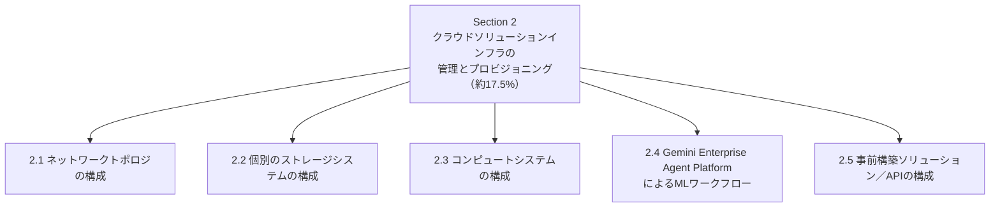

Section 1が「何を作るべきか」を決める工程だとすれば、Section 2は「それをどう実装し、日々の運用に載せるか」を問う領域です。試験では、[Altostrat Media、Cymbal Retail、EHR Healthcare、KnightMotives Automotive](https://cloud.google.com/learn/certification/cloud-architect) の4つの公式ケーススタディが、既存インフラの制約（レガシーシステム、コンプライアンス要件、予算上限など）として設問の背景に登場することがあります。Section 2の設問を解く際は「その設計が技術的に正しいか」だけでなく「そのケーススタディの制約下で実現可能か」を常に意識してください。

---

## 2.1 ネットワークトポロジの構成

このタスクは、以下の4つの観点で構成されています。

1. オンプレミス環境への拡張（ハイブリッドネットワーキング）
2. マルチクラウド環境への拡張（Google Cloud間通信を含む）
3. セキュリティ保護（侵入防止、アクセス制御、ファイアウォール）
4. VPC設計とロードバランシング

### 2.1.1 ハイブリッドネットワーキング：オンプレミスとの接続

Google Cloudは、オンプレミスデータセンターとの接続方式として主に4つのオプションを提供しています。帯域幅・コスト・SLA・セットアップ期間のトレードオフを理解することが、この分野の出題の核心です。

| 接続方式 | 帯域幅の目安 | 特徴 | 適したユースケース |
|---|---|---|---|
| Cloud VPN（HA VPN） | 1.5〜3.0 Gbps／トンネル | インターネット経由のIPsec暗号化トンネル。低コストで迅速に構築可能 | 低〜中程度のデータ量、迅速な立ち上げ、DR用のバックアップ回線 |
| Partner Interconnect | 50 Mbps〜50 Gbps | サービスプロバイダ経由でGoogleに接続。コロケーション不要 | 10Gbps未満の要件、またはGoogleのコロケーション拠点に物理アクセスできない場合 |
| Dedicated Interconnect | 10/100/400 Gbps（最大8回線で3.2Tbps） | コロケーション施設での物理的な相互接続。RFC1918プライベートIPで直接通信 | 大容量・低レイテンシ・安定した帯域が求められるエンタープライズ環境 |
| Cross-Cloud Interconnect | 10/100 Gbps | AWS・Azure・OCIなど他クラウドとの専用線接続 | マルチクラウドAI/データワークロード間の高性能プライベート接続 |

出典：[Hybrid Connectivity | Google Cloud](https://cloud.google.com/hybrid-connectivity)、[Google Cloud Hybrid Connectivity – IC, VPN & NCC](https://jayendrapatil.com/google-cloud-hybrid-connectivity/)

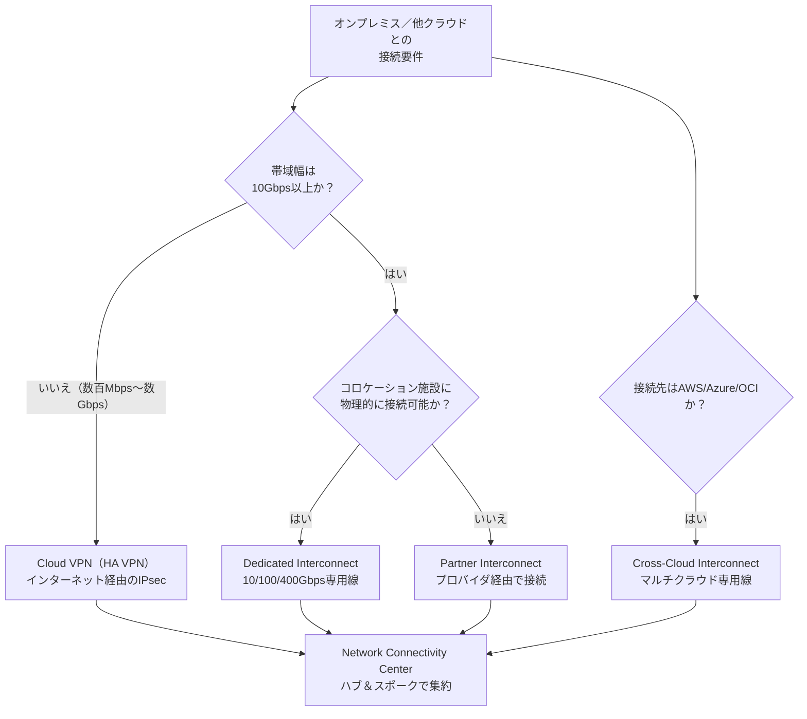

**ベストプラクティス**

- オンプレミスとVPC間のRFC1918通信にはHA VPNまたはCloud Interconnectを使用できます。高帯域・低レイテンシでインターネットを経由しない専用接続が必要な場合は、Dedicated InterconnectまたはPartner Interconnectを選択します。VPC間はVPC Network Peeringで接続でき、プライベートIPv4サブネットルートが常に交換されます[1]。
- HA VPNは静的・動的（BGP）ルーティングの両方に対応し、Classic VPNのBGPは非推奨（Deprecated）のため新規構築では避けます[1]。
- Cloud Interconnectは、リンク層暗号化のためMACsecをサポートし、VLANアタッチメントのトラフィックをIPsecで暗号化するHA VPN over Cloud Interconnectも構成可能です[1]。
- 本番環境では、Interconnectを主回線、HA VPNをフェイルオーバー用のバックアップ回線とする構成が一般的です[2]。
- MTU不一致はハイブリッド接続でパケットロスを引き起こす典型的な落とし穴です。オンプレミス側とVLANアタッチメント側でMTU設定を揃えます[2]。

### 2.1.2 マルチクラウド環境への拡張

複数のGoogle CloudプロジェクトやVPC、あるいは他クラウドとの接続を一元管理するには、**Network Connectivity Center（NCC）** を使ったハブ＆スポーク構成が推奨されます。

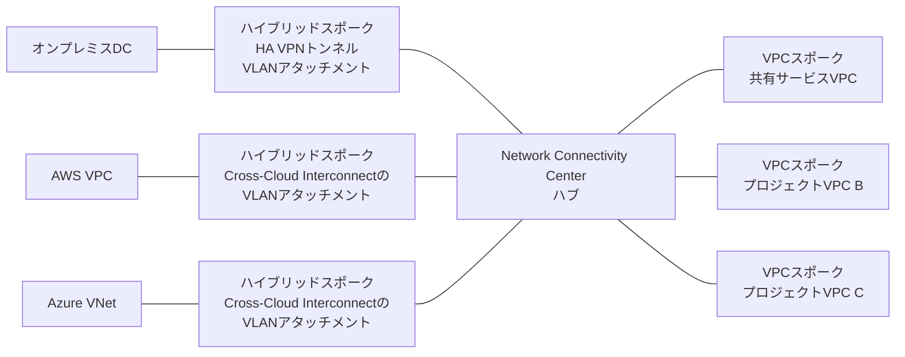

他クラウドのネットワークをハブへ直接アタッチすることはできません。AWS VPCやAzure VNetは、Cross-Cloud Interconnect のVLANアタッチメント（またはVPNトンネル）を**ハイブリッドスポーク**として登録することで接続します。

NCCは、Cloud VPN・Cloud Interconnect・ルーターアプライアンスをスポークとしてサポートし、あらかじめ定義済みのメッシュ／スター型トポロジ用の「スポークグループ」もサポートしています[1]。スポーク間の到達性には次の条件が付きます[1]。

- ハイブリッドスポーク同士が経路を交換し通信できるのは、ハブで **site-to-site data transfer** を有効にした場合だけです。無効の場合、ハイブリッドスポークはVPCスポークとの通信に限定されます。
- ハイブリッドスポークはリージョン単位のリソースであり、**リージョンをまたぐ経路交換にはCloud Routerのglobal dynamic routingが必要**です。
- VPCスポークにできるVPCネットワークは**1つのハブに対してのみ**であり、同一VPCを複数ハブのスポークにはできません。
- VPCスポークはエクスポートする(あるいは除外する)サブネット範囲を、ハイブリッドスポークはVLANアタッチメント・トンネル単位でフィルタ条件を指定して経路の公開範囲を絞り込みます。マルチクラウドのプライベート接続には Cross-Cloud Interconnect が推奨される方式であり、NCCと組み合わせることでマルチクラウドのハブ＆スポークアーキテクチャを構築できます[1]。ApplovinやEA、PayPal、UberのようなAIワークロードを持つ企業がCross-Cloud Networkを利用している例が公式に紹介されています[2]。

### 2.1.3 セキュリティ保護（侵入防止・アクセス制御・ファイアウォール）

ネットワークセキュリティは、単一の製品ではなく複数レイヤーの「多層防御（Defense in Depth）」として設計します。

トラフィックの経路は、エッジのCloud Armorとロードバランサを通り、バックエンドへ到達する直前にCloud NGFWの評価を受けます。

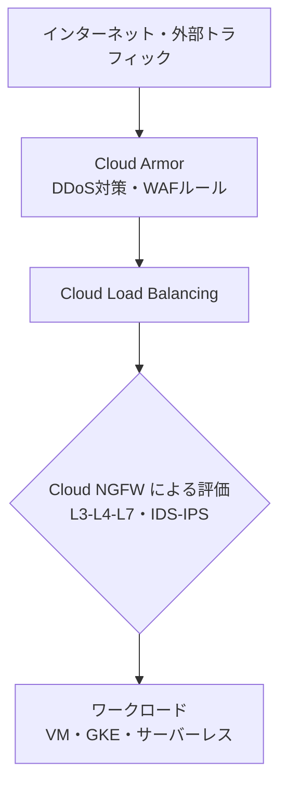

**注意**: ファイアウォールルールはロードバランサ自体ではなく、**バックエンドのインスタンスに適用**されます。したがってロードバランサ経由の通信を許可するには、バックエンドVMに対してヘルスチェック用の範囲とロードバランサの送信元範囲を許可する上りルールが必要です。

「Cloud NGFW」「ネットワークファイアウォールポリシー」「VPCファイアウォールルール」は直列のネットワークホップではなく、**同じパケットに対する評価レイヤー**です。評価は優先度順に進み、`ALLOW` / `DENY` のような終端アクションに一致した時点で終了します。`GOTO_NEXT` の場合のみ後続のレイヤーへ評価が進みます。

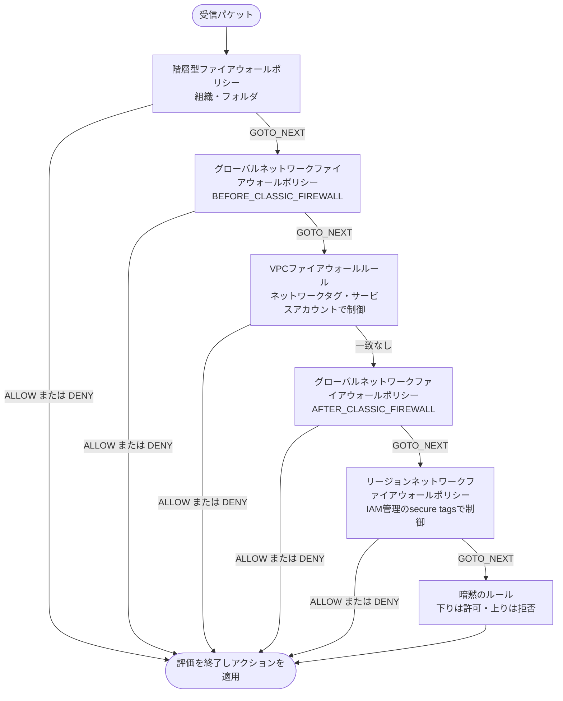

| コンポーネント | 役割 | ティア／モード |
|---|---|---|
| Cloud Armor | エッジでのDDoS対策とWebアプリケーションファイアウォール（WAF） | Standard／Managed Protection Plus |
| Cloud NGFW Essentials | ステートフル検査によるVPCファイアウォールルールとネットワークファイアウォールポリシー、secure tags、アドレスグループ | 全プロジェクトに標準搭載 |
| Cloud NGFW Standard | Essentialsに加え、FQDNオブジェクト、地理位置情報オブジェクト、脅威インテリジェンスによる制御 | 追加料金プラン |
| Cloud NGFW Enterprise | Standardに加え、Palo Alto Networksの脅威シグネチャによるL7 IDPS（侵入検知・防御）、URLフィルタリング、TLSインスペクション | 最上位プラン |

出典：[Cloud NGFW overview](https://docs.cloud.google.com/firewall/docs/about-firewalls)、[Configure intrusion detection and prevention service](https://docs.cloud.google.com/firewall/docs/configure-intrusion-prevention)

**ベストプラクティス**

- IDS/IPSはまず「検出モード」で導入し、誤検知（false positive）をチューニングしてから「防御モード」に切り替えるのが安全な導入手順です[3]。
- Cloud NGFWはNorth-South（VPCと外部間）だけでなくEast-West（VPC内のリソース間）トラフィックにも適用され、セキュアタグを用いたマイクロセグメンテーションでゼロトラストに近い構成を実現できます[4]。
- ファイアウォールの許可ルールは、必要なプロトコル・ポート・送信元・宛先だけに限定します。同じセキュリティ目的のルールは追跡可能で管理しやすい範囲に集約し、外部アクセスを最小化したうえで、機密データには専用のサービス境界（VPC Service Controls）を設定します[1]。
- VMの実行時アイデンティティにはサービスアカウントを使用します。VMが他のGoogle Cloud APIへアクセスする際の権限はサービスアカウントに付与されたIAMロールで決まるため、ここを最小権限で設計することが権限昇格リスクの抑制につながります[1]。
- 一方、secure tags（IAM-governed Tags）はアイデンティティを提供するものではなく、**IAMで管理されるファイアウォールポリシーの適用対象VMを指定するためのラベル**です。タグの付与・使用自体をIAMロールで統制できる点が、誰でも自由に付け替えられるネットワークタグとの違いであり、ファイアウォールの適用範囲を統制したい場合はネットワークタグではなくsecure tagsを使います[4]。

### 2.1.4 VPC設計とロードバランシング

#### VPCの基本設計方針

Google CloudのVPCはAWSやAzureと異なり、**グローバルリソース**です。1つのVPCが複数のリージョンにまたがるサブネットを持つことができ、リージョンをまたいだVPC Peeringを組む必要がありません[5]。

**ベストプラクティス（VPC設計）**[6, 7]

- 要件が共通するリソース群には、まず単一のVPCネットワークから始める。
- 複数チーム・複数プロジェクトでネットワークを一元管理したい場合は **共有VPC（Shared VPC）** を採用し、ネットワークユーザーロールをサブネット単位で付与する。
- 本番環境と非本番環境を同じ共有VPCに同居させることは避ける（管理者権限の分離が難しくなるため）。
- IPアドレス空間は将来の拡張を見込み、CIDRの重複がないよう事前に計画する。
- ファイアウォールルールは必要なプロトコルとポートだけを許可し、同じ目的のルールは管理しやすい範囲で集約する。タグやサービスアカウントで対象を必要最小限に絞り込む。

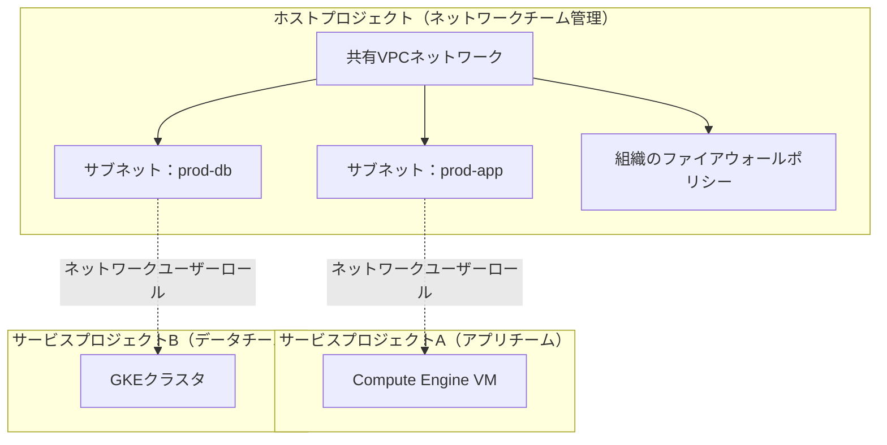

共有VPCでは、1つの「ホストプロジェクト」が持つネットワークを複数の「サービスプロジェクト」が利用します。ホストプロジェクトはサービスプロジェクトを兼ねることができず、サービスプロジェクトは1つのホストプロジェクトにのみ接続できます（複数ホストプロジェクトの構成自体は可能）[7]。この仕組みにより、ネットワーク管理者はネットワークとセキュリティを一元管理しつつ、各チームのプロジェクト管理者にはインスタンス作成などの限定的な権限のみを委譲でき、最小権限の原則を実現します[7, 8]。

#### Private Service Connect（PSC）

PSCは、VPCを越えてGoogle Cloudの管理サービス（Cloud SQL、BigQueryなど）やサードパーティSaaS、あるいは自社が公開するサービスに、インターネットを経由せずプライベートにアクセスするための仕組みです。

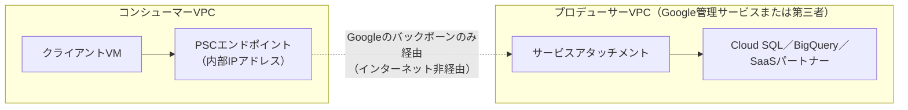

| PSCの機能 | 用途 |
|---|---|
| PSCエンドポイント | Google APIまたは他VPCの公開サービスに、内部IPアドレスでアクセスする（コンシューマー視点） |
| PSCバックエンド | ロードバランサーの背後にGoogle APIをターゲットとして配置する |
| PSCインターフェース | マネージドサービス側からコンシューマーVPCへ能動的に接続を開始する（プロデューサー視点） |

出典：[Private Service Connect | Virtual Private Cloud](https://docs.cloud.google.com/vpc/docs/private-service-connect)

**ベストプラクティス**：PSCを使うと、トラフィックはGoogle Cloud内部にとどまり公衆インターネットを経由しません。オンプレミスからGoogle APIにアクセスする際も、特定のIPアドレスとリージョンに向けてトラフィックを誘導でき、Private Google AccessやパブリックドメインでのAPIアクセスに代わる選択肢となります[9]。

#### ロードバランサーの選択

Cloud Load Balancingは「トラフィックの種類」「外部か内部か」「グローバルかリージョンか」の3軸で製品を選択します。

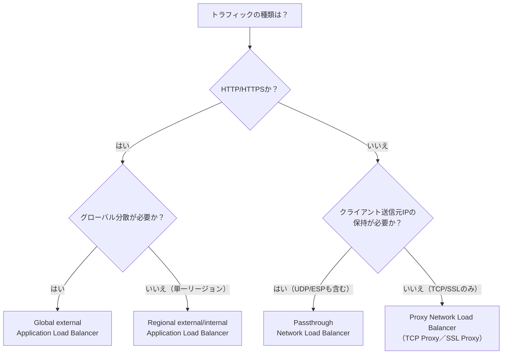

| ロードバランサー | レイヤー | スコープ | 主な用途 |
|---|---|---|---|
| Application Load Balancer（外部） | L7（HTTP/HTTPS） | グローバル／リージョン | Webアプリ、マイクロサービスのフロントエンド |
| Application Load Balancer（内部） | L7 | リージョン | VPC内部のマイクロサービス間通信 |
| Proxy Network Load Balancer | L4（TCP/SSL） | グローバル／リージョン | TLSオフロードを伴う非HTTPアプリ |
| Passthrough Network Load Balancer | L4（TCP/UDP/ESP/ICMP） | リージョン | 送信元IP保持が必須のワークロード、ゲームサーバー、データベース |

出典：[Choose a load balancer | Cloud Load Balancing](https://cloud.google.com/load-balancing/docs/choosing-load-balancer)、[External Application Load Balancer overview](https://docs.cloud.google.com/load-balancing/docs/https)

**ベストプラクティス**：グローバル外部Application Load Balancerは、リージョン別の外部Application Load Balancerと異なり、単一のエニーキャストIPを世界中に公開し、Google Front End（GFE）経由で最寄りの正常なバックエンドへ自動的にルーティングします。一方リージョン外部Application Load Balancerは、Envoyベースのマネージドプロキシとして実装されており、トラフィックミラーリングや加重トラフィック分割といった高度な機能を持ちます[10]。TLSをどこで終端させるかによっても選択が変わり、グローバルなSSL Proxy／HTTPS負荷分散はエッジに近い場所でTLSを終端するためレイテンシが下がりますが、TLS終端の場所をより細かく制御したい場合はリージョナルロードバランサーを検討します。

---

## 2.2 個別のストレージシステムの構成

このタスクは以下の7つの観点をカバーします。データ配置・処理／コンピュートのプロビジョニング・セキュリティ／アクセス管理・転送とレイテンシ・保持とライフサイクル・データ増加計画・データ保護（バックアップと復旧）。

### 2.2.1 オブジェクトストレージ（Cloud Storage）：クラスとライフサイクル管理

Cloud Storageは、アクセス頻度に応じた4つのストレージクラスを提供し、いずれも99.999999999%（イレブンナイン）の年間耐久性と単一のAPI、ミリ秒単位の低レイテンシを共有します。違いは価格・最小保存期間・取り出しコストです[11]。

| ストレージクラス | 想定アクセス頻度 | 最小保存期間の目安 | 主な用途 |
|---|---|---|---|
| Standard | 高頻度（日次〜） | なし | アクティブなWebコンテンツ、アプリのホットデータ |
| Nearline | 月1回程度 | 30日 | バックアップ、めったに使わないデータ |
| Coldline | 四半期に1回程度 | 90日 | 災害対策データ、コールドバックアップ |
| Archive | 年1回未満 | 365日 | 長期保存、コンプライアンス上のアーカイブ |

出典：[Object Lifecycle Management | Cloud Storage](https://docs.cloud.google.com/storage/docs/lifecycle)、[Options for controlling data lifecycles](https://docs.cloud.google.com/storage/docs/control-data-lifecycles)

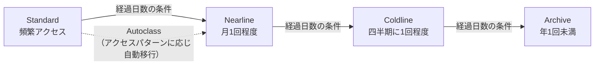

**オブジェクトライフサイクル管理（OLM）のアクション**

| アクション | 内容 |
|---|---|
| Delete | 条件を満たしたオブジェクトを削除（TTL設定などに使用） |
| SetStorageClass | ストレージクラスをより低コストなクラスへ変更 |
| AbortIncompleteMultipartUpload | 未完了のマルチパートアップロードを一定期間後に削除 |

**ベストプラクティス**

- アクセスパターンが予測しにくいバケットには **Autoclass** を有効化すると、Cloud Storageがオブジェクトごとのアクセス頻度を見てクラスを自動的に移行し、早期削除料金なしで最適化してくれます[12]。ただしAutoclassを有効にしたバケットではSetStorageClassアクションを併用できません[11]。
- **ソフトデリート**は新規バケットに既定で7日間の保持期間付きで適用されます。一律に有効化するのではなく、復旧要件と保持コストを基準に判断します。一時データや削除量の多いバケットでは、保持期間の短縮または無効化を検討できます[12]。
- 重要データには**オブジェクトバージョニング**を有効にし、OLMルールで「非最新バージョン」の保持期間も明示的に設定しておかないと、意図せずストレージコストが蓄積します[13]。
- ライフサイクルアクションの実行タイミングは保証されないため、アプリケーション側は「特定の時刻までに必ず移行される」という前提でロジックを組まないようにします[11]。
- 低レイテンシ・低コストを優先する場合は、バケットを計算リソースと同じリージョンに配置し、リージョンをまたぐ読み出しによる追加のegress課金とレイテンシを避けます。一方、高可用性やクロスリージョン冗長性、地理的分散、広域のデータレジデンシーが求められる場合はdual-regionまたはmulti-regionも選択できます[12]。

### 2.2.2 データ処理とコンピュートのプロビジョニング／データベースの選択

ストレージ／データベースサービスの選定は、PCA試験で最も頻出するトピックの1つです。ワークロードの性質（OLTPかOLAPか、リレーショナルかNoSQLか、スケール要件）から逆算して選びます。

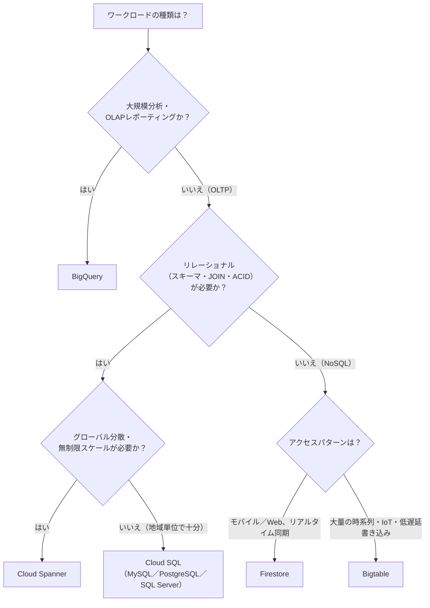

| サービス | データモデル | 一貫性 | 得意な領域 | 苦手な領域 |
|---|---|---|---|---|
| Cloud SQL | リレーショナル（MySQL/PostgreSQL/SQL Server） | 強整合性 | 既存アプリの移行、中規模OLTP | リージョンをまたぐ無制限のスケール |
| Cloud Spanner | リレーショナル（グローバル分散） | 外部整合性（TrueTime） | ミッションクリティカルなグローバルOLTP、金融台帳 | 小規模・低コスト志向のワークロード |
| Bigtable | ワイドカラム（NoSQL） | 単一クラスタルーティングは強整合性、マルチクラスタルーティングは結果整合性（read-your-writes整合性は単一クラスタルーティングで構成可能） | 大量書き込み・低レイテンシの時系列／IoT／広告技術 | 複雑なクエリ・JOIN・トランザクション |
| Firestore | ドキュメント（NoSQL） | 強整合性（ドキュメント単位） | モバイル／Webアプリのリアルタイム同期 | 数十TBを超える大規模データ |
| BigQuery | 列指向（OLAP） | 該当なし（分析用） | ペタバイト級のアドホック分析・レポーティング | 低レイテンシな単一レコードの読み書き |

出典：[GCP Database Decision Guide](https://www.thecloudguru.in/2025/11/03/gcp-database-decision-guide-cloud-sql-firestore-bigtable-or-spanner/)、[Cloud SQL vs Spanner vs Bigtable vs BigQuery vs Firestore](https://medium.com/@zaigam22/cloud-sql-vs-spanner-vs-bigtable-vs-bigquery-vs-firestore-48a74b031592)

**ベストプラクティス**：Cloud Spannerは、GPSと原子時計を用いたグローバル同期クロック「TrueTime」により、通常の強整合性よりも強い「外部整合性（external consistency）」を実現し、マルチリージョン構成では最大99.999%の可用性SLAを持ちます[14]。既存のMySQLアプリケーションを移行する場合、最も移行コストが低いのはCloud SQLであり、Spannerはグローバル規模でなければオーバースペックかつ高コストになりがちです[15]。

### 2.2.3 ブロックストレージとファイルストレージ

Compute EngineやGKEのワークロードに接続する永続ストレージには、Persistent Disk／Hyperdiskとファイル共有用のFilestoreがあります。

| 種類 | 概要 | 主な用途 |
|---|---|---|
| Persistent Disk（標準／SSD） | ゾーンまたはリージョンでレプリケートされるブロックストレージ。最大64TB | 汎用的なVM・GKEのブートディスク／データディスク |
| Hyperdisk | 次世代ブロックストレージ。IOPS／スループットを独立して調整可能 | 高性能データベース、AI推論・サービング（Hyperdisk ML） |
| Filestore | フルマネージドのNFSファイル共有 | 複数VM／Podで共有するファイルシステム、CMS、レンダリングファーム |

出典：[Persistent Disk: durable block storage](https://cloud.google.com/persistent-disk)

**ベストプラクティス**：Persistent Diskのデータ保護手段は用途ごとに使い分けます[16]。なお、ゾーン間の同期レプリケーションが行われるのはRegional Persistent Disk（およびHyperdisk Balanced High Availability）を選択した場合であり、すべてのディスクが自動的に複数ゾーンへ複製されるわけではありません。

| 手段 | レプリケーション/取得方式 | 主な用途 |
| --- | --- | --- |
| Regional Persistent Disk（リージョンディスク） / Hyperdisk Balanced High Availability | 同一リージョン内の2ゾーンへ**同期**レプリケーション | ゾーン障害時にもディスクを維持したい高可用性ワークロード |
| Asynchronous Replication | 別リージョンのディスクへ**非同期**レプリケーション | リージョン障害に備えたクロスリージョンDR |
| スナップショット（標準／アーカイブ） | 増分バックアップをリージョンまたはマルチリージョンに保存 | 定期バックアップ、長期保管（アーカイブ）、DR時の復旧元 |
| ディスククローン / Instant Snapshot | ソースディスクの時点コピーを即時作成 | テスト・デバッグ・解析用に本番相当データを複製する用途 |

1台のVMには複数のディスクをアタッチでき、通常は各ディスクを単一のファイルシステムとして使用します。容量や性能を拡張する場合は、既存ディスクのサイズ変更または追加ディスクのアタッチを選択します[16]。

### 2.2.4 データ保護（バックアップと復旧）

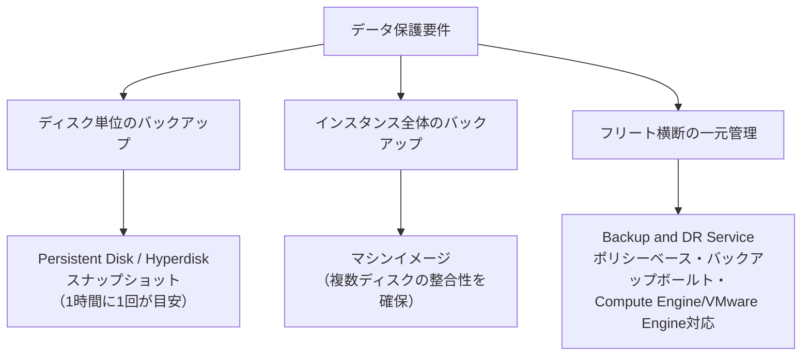

| 手段 | カバー範囲 | 適したケース |
|---|---|---|
| ディスクスナップショット | 単一のPersistent Disk／Hyperdisk | 個々のディスクの定期バックアップ |
| マシンイメージ | インスタンスにアタッチされた全ディスク＋構成情報 | インスタンス丸ごとの複製・DR用テンプレート |
| Filestoreスナップショット | Filestoreインスタンスのファイル共有全体 | ファイルサーバーの誤削除対策 |
| Backup and DR Service | Compute Engine、VMware Engine、Cloud SQL、AlloyDB、Filestoreなど複数プロジェクトを横断 | エンタープライズ規模でのポリシーベースの一元バックアップ管理 |

出典：[Data protection options for disks and instances](https://docs.cloud.google.com/compute/docs/disks/data-protection)、[Google Cloud Disaster Recovery Guide](https://www.eon.io/blog/google-cloud-disaster-recovery)

**ベストプラクティス**

- スナップショットは1時間に1回程度の頻度を目安とし、それより高頻度に取得しないようにします（スナップショットスケジュール機能を利用するのが簡便です）[17]。
- アプリケーションを実行したまま取得したスナップショットは「クラッシュコンシステント」に過ぎません。アプリケーションを一時停止し、メモリ上の保留書き込みをディスクにフラッシュしてから取得すると「アプリケーションコンシステント」なスナップショットになります[17]。
- スナップショットの読み取り／復元権限は強力な権限です。悪意のある第三者がこの権限を取得すると、自分の管理するプロジェクトにスナップショットを復元してデータを窃取できてしまうため、IAM権限は信頼できるプリンシパルのみに限定します[17]。
- 複数ディスクにまたがるVMは、個々のディスクスナップショットではなく**マシンイメージ**を使うことで、ディスク間の整合性を確保できます[18]。
- 複数プロジェクト・複数環境にまたがるバックアップを一元的なポリシーで管理したい場合は、Backup and DR Serviceの利用が推奨されます[18]。
- Backup and DR Serviceはスナップショットやバックアップボールトを提供しますが、VPC・ロードバランサー・IAMロール・DNSなどの「環境そのもの」は再現しません。これらはInfrastructure as Code（IaC）で別途管理する必要があります[19]。

---

## 2.3 コンピュートシステムの構成

このタスクは、コンピュートリソースのプロビジョニング、spot／standardの選択、クラウドネイティブなネットワーク構成、インフラのオーケストレーションとパッチ管理、コンテナオーケストレーション、サーバーレスコンピューティングの6項目で構成されます。

### 2.3.1 コンピュートリソースのプロビジョニング：マシンファミリーとカスタムマシンタイプ

Compute Engineのマシンタイプは「ファミリー」（用途）と「シリーズ」（世代）の組み合わせで構成されます。

| マシンファミリー | 特徴 | 代表シリーズ | 主な用途 |
|---|---|---|---|
| 汎用（General-purpose） | バランス型のCPU:メモリ比 | E2、N2、N2D、N4 | Webアプリ、開発・テスト環境、マイクロサービス |
| コンピュート最適化 | 高いクロック周波数・コア性能 | C2、C2D、C3、H3 | HPC、ゲームサーバー、科学技術計算 |
| メモリ最適化 | 大容量メモリ | M2、M3 | インメモリDB（SAP HANA等） |
| アクセラレータ最適化 | GPU／TPUを搭載 | A2、A3、G2 | 機械学習トレーニング／推論、グラフィックス処理 |

出典：[Machine families resource and comparison guide](https://docs.cloud.google.com/compute/docs/machine-resource)

**カスタムマシンタイプ**：定義済みのマシンタイプがワークロードに合わない場合（例：ソフトウェアライセンスがコア数に紐づくため、必要最小限のvCPU数に絞りたい）、E系列・N系列でvCPU数とメモリ量を個別に指定できます。カスタムマシンタイプは定義済みタイプに対してオンデマンド価格が5%程度割高になります[20, 21]。

**ベストプラクティス**：Cloud MonitoringのCPU・メモリ使用率データ（過去8日間）に基づき、Compute Engineはマシンタイプの「サイズ適正化（rightsizing）」を自動的に推奨してくれます。定期的にこの推奨事項を確認し、過剰プロビジョニングを是正します[22]。

### 2.3.2 コンピュートのボラティリティ構成：Spot VM vs Standard VM

| 項目 | Standard VM | Spot VM |
|---|---|---|
| 価格 | オンデマンド価格 | 最大91%オフ |
| 可用性 | 保証あり（SLA対象） | Compute Engineの余剰キャパシティに依存、いつでもプリエンプトされ得る |
| 実行時間の保証 | なし（自分で停止するまで継続） | 最小・最大実行時間の保証なし（事前に制限も可能） |
| プリエンプション通知 | なし | 最大30秒前に通知 |
| 適したワークロード | 常時稼働のステートフルサービス | フォールトトレラントなバッチ処理、CI/CD、ステートレスなワーカー |

出典：[Spot VMs | Compute Engine](https://docs.cloud.google.com/compute/docs/instances/spot)、[Create and use Spot VMs](https://docs.cloud.google.com/compute/docs/instances/create-use-spot)

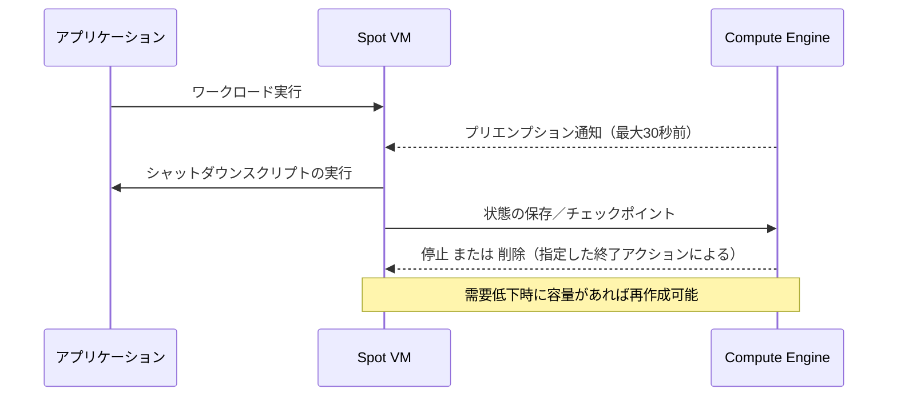

**ベストプラクティス**

- Spot VMを作成する前に、対象マシンタイプ・リージョンの過去のプリエンプション率と価格傾向を確認し、可用性の高い組み合わせを選びます[23]。
- 大規模なSpot VMクラスタは、Google Cloudのデータセンター負荷が下がる夜間・週末に実行すると成功率が上がります[23]。
- 1台ずつ作成するのではなく、インスタンステンプレートを使って同一構成のSpot VMを複数作成すると効率的です[23]。
- Spot価格は最大で1日1回変動する可能性があるため、コスト試算では過去の価格推移を確認します[23]。

### 2.3.3 クラウドネイティブなネットワーク構成（Compute Engine／GKE／VMware Engine）

コンピュートリソースの種類ごとに、ネットワーク構成の考慮点が異なります。

| コンピュート基盤 | ネットワークの考慮点 |
|---|---|
| Compute Engine | VPCネイティブのサブネット、内部/外部IP、Cloud NATによる送信専用アクセス |
| GKE | VPCネイティブクラスタ、エイリアスIP範囲によるPod/Serviceのアドレッシング、Dataplane V2（eBPF） |
| サーバーレス（Cloud Run等） | Direct VPC egressによるVPC内部リソースへのプライベート到達性を推奨。要件を満たせない場合はServerless VPC Accessコネクタを代替として使用 |
| Google Cloud VMware Engine | VMware EngineネットワークとVPC間のピアリング、Public IP Serviceまたは外部ロードバランサー経由のインターネット到達性 |

出典：[Google Cloud VMware Engine best practices for networking](https://docs.cloud.google.com/vmware-engine/docs/best-practices-security)

**Google Cloud VMware Engine（GCVE）** は、既存のVMware環境（vSphere/vCenter/NSX）をそのままGoogle Cloud上のベアメタルにリフト＆シフトするためのサービスです。データセンター移行、DR、VDI（仮想デスクトップ基盤）用途で使われます[24]。

**ベストプラクティス**

- カスタムのURLフィルタリング・IPS/IDS・トラフィックインスペクションが必要な場合、インターネット向けトラフィックはVMware Engineから直接出すのではなく、いったんVPC経由でルーティングして既存のセキュリティ機能を通します[24]。
- コンピュートリソースは1つのvCenterに集約しすぎず、VDIのような特定ワークロード用には専用のプライベートクラウド（専用vCenter）を検討します[24]。
- ワークロードVMのゲストOSパッチ適用・監視は引き続き利用者の責任範囲であり、VMware Engineが自動で行うのはハードウェア・ハイパーバイザー層のみです。

### 2.3.4 インフラのオーケストレーション、リソース構成、パッチ管理

#### Infrastructure as Code（IaC）

| ツール | アプローチ | 主な用途 |
|---|---|---|
| Terraform | HCLによる宣言的な構成、ステートファイルで管理 | マルチクラウド・大規模組織での標準的なIaC |
| Infrastructure Manager | Google CloudネイティブでTerraformを実行・管理するマネージドサービス | Terraformの実行基盤をGoogle Cloud側に持ちたい場合 |
| Config Connector | Kubernetes CRDとしてGoogle Cloudリソースを宣言 | GKEを中心としたGitOpsワークフロー |
| Cloud Foundation Toolkit | Google提供のオピニオン化されたTerraformモジュール群 | セキュアな本番導入をすばやく開始したい場合 |

出典：[Infrastructure as Code on Google Cloud](https://docs.cloud.google.com/docs/terraform/iac-overview)、[What is Infrastructure as Code (IaC)?](https://cloud.google.com/discover/what-is-infrastructure-as-code)

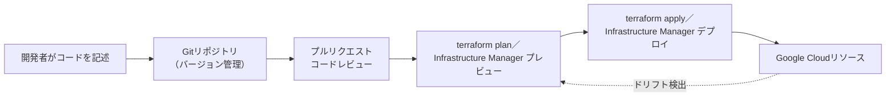

**ベストプラクティス**：本番環境は変更管理プロセスを経たIaCで管理することがベストプラクティスとされ、すべての構成変更履歴を監査・ロールバック可能にします[25]。Config Connectorは、Terraformのようなステートファイルに頼らず、Kubernetesの調整ループ（reconciliation loop）を使ってクラウドインフラを宣言された状態に近づけ続ける点がTerraformとの大きな違いです[26]。すでにGKEを中心にGitOpsを実践しているチームは、Config Sync等と組み合わせてConfig Connectorを採用すると、アプリケーションとインフラの両方を単一のワークフローで管理できます[25]。

#### パッチ管理（VM Manager）

VM Managerは、大規模なVMフリートのOSインベントリ・脆弱性・パッチ適用を統合管理するツール群です。

| サービス | 役割 |
|---|---|
| Patch | オンデマンド／スケジュールされたパッチ適用と、パッチコンプライアンスのレポート |
| OS inventory management | OS・カーネルバージョン、インストール済みパッケージ、利用可能な更新の可視化 |
| OS policies | 目的とする構成状態（パッケージ、ファイル、systemdユニット等）を宣言的に維持 |

出典：[About Patch | VM Manager](https://docs.cloud.google.com/compute/vm-manager/docs/patch)

**ベストプラクティス**

- ラベルを使ってVMフリートを役割（Web／DB）、環境（dev／test／prod）、OSファミリーなどでセグメント化し、パッチ適用のデプロイグループを作成します[27]。
- 「ディスラプション予算（disruption budget）」を設定し、一度に更新される（＝一時的に利用不可になる）インスタンス数の上限を制御することで、パッチ適用中もサービス全体の可用性を確保します[27]。例えば20台のWebサーバーがある場合、まず数台だけを更新し、残りのインスタンスで負荷を吸収できることを確認してから展開範囲を広げます。
- Google提供イメージ（ビルド日付v20200114以降）にはOS Configエージェントが標準搭載済みです。古いイメージやカスタムイメージでは手動インストールが必要です[28]。

### 2.3.5 コンテナオーケストレーション：GKE Autopilot vs Standard

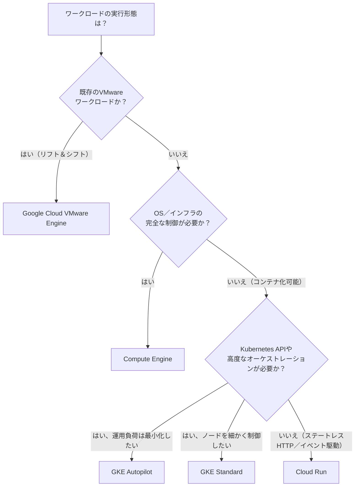

| 観点 | GKE Autopilot | GKE Standard |
|---|---|---|
| ノード管理 | Googleが完全管理（SSH不可） | 利用者がノードプールを構成・管理 |
| 課金単位 | Podが要求したvCPU／メモリ／エフェメラルストレージ | プロビジョニングしたVM（ノード）単位、稼働中は常時課金 |
| セキュリティ既定値 | Shielded GKE Nodes、Workload Identityなどがデフォルト有効 | 個別に設定が必要 |
| 特権コンテナ／DaemonSet | 制限あり（一部許可リストで対応） | 制約なし |
| 推奨用途 | ほとんどの新規プロジェクト、本番ワークロードの既定選択 | 高稼働率で細かくチューニングしたいクラスタ、特殊な要件のある環境 |

出典：[About GKE modes of operation](https://docs.cloud.google.com/kubernetes-engine/docs/concepts/choose-cluster-mode)、[GKE Autopilot overview](https://docs.cloud.google.com/kubernetes-engine/docs/concepts/autopilot-overview)

**ベストプラクティス**：GKEはクラスタ作成後にStandardからAutopilotへ変換することはできないため、モード選定はクラスタ作成前の重要な意思決定です[29]。GoogleはAutopilotを「ほとんどの本番ワークロードにおける推奨モード」と位置づけており、セキュリティ・スケーリング・ワークロードに関するベストプラクティスがデフォルトで実装されています[29]。特権アクセス、DaemonSetの自由な運用、特定のノード構成が必須要件にあたる場合のみ、Standardモードを検討します。

### 2.3.6 サーバーレスコンピューティング：Cloud Run

Cloud Runは、コンテナイメージをそのままステートレスなHTTPサービスまたはジョブとして実行できるフルマネージドなサーバーレスプラットフォームです。

| 比較軸 | Cloud Run | GKE |
|---|---|---|
| インフラ管理 | 不要（完全サーバーレス） | ノード・クラスタの管理が必要（Standardの場合） |
| スケーリング | リクエストに応じ自動でゼロから拡張 | HPA／Cluster Autoscalerで構成が必要 |
| 状態管理 | ステートレス前提 | ステートフルワークロード（DB等）にも対応 |
| 適したユースケース | API、Webフロントエンド、イベント駆動処理 | 複雑な依存関係を持つマイクロサービス群、GPU/TPU大規模処理 |

出典：[GKE and Cloud Run](https://docs.cloud.google.com/kubernetes-engine/docs/concepts/gke-and-cloud-run)

**ベストプラクティス**：Cloud RunとGKEは二者択一ではなく、コストとパフォーマンスに応じて併用するハイブリッド戦略が有効です。ステートレスなマイクロサービスはコスト効率とスケーラビリティを重視してCloud Runで実行し、深いカスタマイズが必要な複雑なステートフルアプリケーションはGKEで実行するという役割分担が推奨されています。両プラットフォームとも標準的なコンテナイメージをデプロイ形式とするため、ワークロードの移行にも高い可搬性があります[30]。

---

## 2.4 Gemini Enterprise Agent Platformを活用したエンドツーエンドMLワークフロー

> **用語の変遷に関する注記**：2026年4月22日のGoogle Cloud Next '26にて、これまで「Vertex AI」と呼ばれていたAI／MLプラットフォームは **Gemini Enterprise Agent Platform** としてブランドを刷新しました[31, 32]。既存のVertex AI顧客のコンソール表示は自動的に新ブランドに切り替わります[31]。互換性はレイヤーごとに分けて理解する必要があります。
>
> - **API**: 既存のVertex AI APIエンドポイントは後方互換性を維持したまま利用でき、リブランドに伴う呼び出しの書き換えは不要です[31]。
> - **SDK**: 旧Vertex AI SDKの一部（生成AI系モジュール）は非推奨化されており、該当部分を使っているコードは `google-genai` SDKへの移行が必要です。API互換性が保たれていることは、SDKが無変更で動き続けることを意味しません。
> - **モデル**: 個々のモデルには独自の提供終了日（shutdown date）があり、APIやSDKの互換性とは独立して後継モデルへの切り替えが必要になります。
>
> 今後のロードマップはすべてAgent Platformのブランドで提供されるとGoogleは発表しています[31]。本ガイドの執筆時点（2026年8月）でこれが最新の公式名称であるため、この名称で解説します。

### 2.4.1 Gemini Enterprise Agent Platformの全体像

Agent Platformは「構築（Build）」「拡張（Scale）」「ガバナンス（Govern）」「最適化（Optimize）」という4つの柱で構成されています[32]。

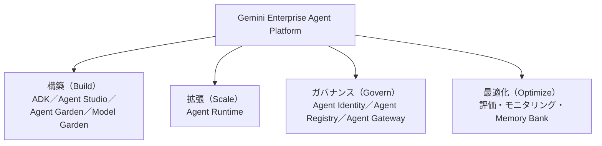

| 構成要素 | 概要 |
|---|---|
| Agent Development Kit（ADK） | モデルに依存しないモジュール式のフレームワークで、複雑な推論やツール利用を行うエージェントを構築 |
| Agent Studio | コードを書かずにエージェントの推論ループやワークフローを設計・試作できるローコードキャンバス |
| Agent Garden | RAGなどの一般的なパターンを備えた、事前構築済みエージェントサンプルのライブラリ |
| Model Garden | Gemini・Claude・Gemma・Grokなど200以上のモデルへのアクセス |
| RAG Engine | 社内データを安全にLLMへ接続し、回答精度を高めハルシネーションを抑制 |
| Agent Runtime | 構築したエージェントをマネージドかつスケーラブルに実行するランタイム（旧称 Vertex AI Agent Engine。APIリソース名は引き続き `reasoningEngines`） |
| Agent Identity | エージェントに対して人間の従業員と同様に、きめ細かな権限を付与する仕組み |

出典：[Agent Platform overview | Gemini Enterprise Agent Platform](https://docs.cloud.google.com/gemini-enterprise-agent-platform/overview)、[Introducing Gemini Enterprise Agent Platform](https://cloud.google.com/blog/products/ai-machine-learning/introducing-gemini-enterprise-agent-platform)

### 2.4.2 Agent Platform Pipelinesによる自動化とオーケストレーション

手作業でのモデルトレーニング・提供は時間がかかり、繰り返し行う場合はミスも起きやすくなります。Agent Platform Pipelines（旧Vertex AI Pipelines）は、Kubeflow Pipelines互換のサーバーレスなワークフローエンジンとして、ML/AIワークフローの自動化・監視・ガバナンスを実現します[33]。

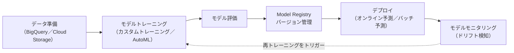

| コンポーネント | 役割 |
|---|---|
| Training | サーバーレスなカスタムトレーニング（オンデマンドでリソースをプロビジョニング）、またはハイパーパラメータチューニング |
| Model Registry | 学習済みモデルのバージョンを一元管理し、追跡・整理・再学習を効率化 |
| Feature Store | チーム間で再利用するML特徴量を一元的に保存・提供 |
| Model Monitoring | 本番投入後の入力データが学習データから乖離（ドリフト）していないかを継続監視 |

出典：[MLOps on Gemini Enterprise Agent Platform](https://docs.cloud.google.com/gemini-enterprise-agent-platform/machine-learning/start/introduction-mlops)

**ベストプラクティス**：パイプラインコンポーネントの再利用時はキャッシュを積極的に有効化し、開発サイクルを高速化します。各コンポーネントには処理内容に見合った適切なマシンタイプを選び、Cloud Storage上の古いパイプラインアーティファクトはライフサイクルポリシーで定期的にクリーンアップします。パイプライン自体もコードとして扱い、CI/CDワークフローに統合することが推奨されます[34]。

### 2.4.3 Agent Platformデータ統合の準備

エンドツーエンドのMLワークフローを組む前提として、以下のデータ統合ポイントを整理しておく必要があります。

- **データソースの特定**：BigQuery、Cloud Storage、Spanner、オンプレミスDBなど、学習・推論に使うデータの所在を明確にする。
- **アクセス制御**：Agent Platformのサービスアカウントに対し、データソースへの最小権限のIAMロールを付与する。
- **VPC Service Controls連携**：機密データを扱う場合、Agent PlatformのAPI呼び出しをサービス境界の内側に収める。
- **RAG Engine向けのデータ整備**：社内ドキュメントをベクトル検索可能な形式に変換し、回答のグラウンディングに利用する[32]。

### 2.4.4 AI Hypercomputerの活用

AI Hypercomputerは、最適化されたハードウェア・オープンソフトウェア・柔軟な消費モデルをシステムレベルで協調設計（co-design）した、Google CloudのAIインフラアーキテクチャです[35]。個々のコンポーネントを部分的に改善するのではなく、AIのトレーニング・チューニング・提供全体を通じて効率と生産性を高めることを目的としています[35]。

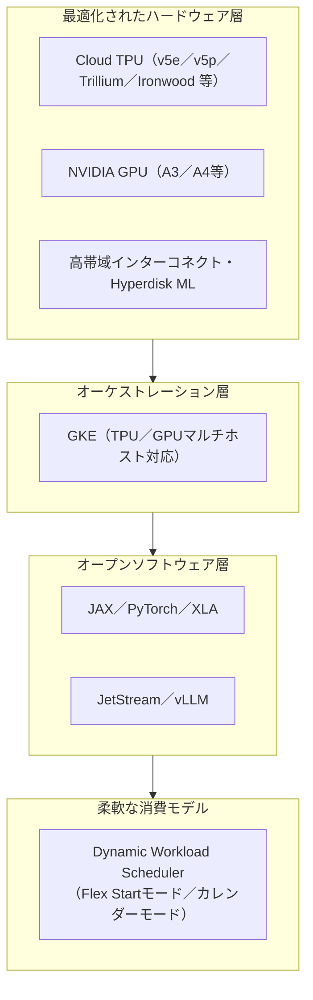

| 層 | 主なコンポーネント | 目的 |
|---|---|---|
| ハードウェア | Cloud TPU（v5e/v5p/Trillium/Ironwood等）、NVIDIA GPU（A3 Mega等）、Hyperdisk ML | トレーニング／推論に最適化された演算・ストレージ・ネットワーク基盤 |
| オーケストレーション | GKE（TPU/GPUのマルチホスト対応） | 大規模クラスタでのモデルサーバーを単一の論理ユニットとして一元管理 |
| ソフトウェア | JAX、PyTorch/XLA、JetStream、vLLM on TPU | オープンなMLフレームワークとGoogle製・コミュニティ製の推論エンジン |
| 消費モデル | Dynamic Workload Scheduler（Flex Start／カレンダーモード） | 開始時刻の保証やコスト最適化に応じた柔軟なリソース調達 |

出典：[Enabling next-generation AI workloads: Announcing TPU v5p and AI Hypercomputer](https://cloud.google.com/blog/products/ai-machine-learning/introducing-cloud-tpu-v5p-and-ai-hypercomputer)、[AI Hypercomputer inference updates](https://cloud.google.com/blog/products/compute/ai-hypercomputer-inference-updates-for-google-cloud-tpu-and-gpu)

**TPUとGPUの使い分け**

| 観点 | Cloud TPU | NVIDIA GPU |
|---|---|---|
| 得意な領域 | 大規模な行列演算、Googleの学習済みフレームワーク（JAX中心）との親和性 | エコシステムの広さ、CUDA資産の再利用、柔軟なモデルアーキテクチャ |
| 利用可能な経路 | Compute Engine、GKE、Agent Platform | Compute Engine、GKE、Agent Platform |
| 制約 | Google Cloud以外では利用不可（ベンダーロックインの懸念） | 複数クラウド・オンプレミスでも利用可能 |

出典：[TPU architecture | Google Cloud](https://docs.cloud.google.com/tpu/docs/system-architecture-tpu-vm)、[Google TPU Architecture: 7 Generations Explained](https://introl.com/blog/google-tpu-architecture-complete-guide-7-generations)

**ベストプラクティス**：推論のワークロードでは、TPU向けにはJetStreamやvLLM on TPU、GPU向けにはvLLMやNVIDIA Dynamoといった推論エンジンを選択することで、価格性能比を最適化できます[36]。学習開始のタイミングを保証したい場合はDynamic Workload Schedulerのカレンダーモードを、コスト効率を優先する場合はFlex Startモードを検討します[35]。

---

## 2.5 Agent Platformでの事前構築ソリューションまたはAPIの構成

### 2.5.1 Google AI APIの使い分け

すべてのAI活用がカスタムモデルの学習を必要とするわけではありません。Google Cloudは、画像・動画・音声・テキストのそれぞれに特化した事前学習済みAPIを提供しており、多くのユースケースではこれらを組み合わせるだけで実装が完了します。

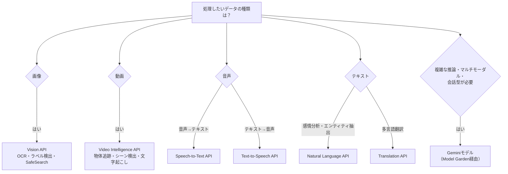

| API | 主な機能 | 代表的なユースケース |
|---|---|---|
| Vision | ラベル検出、OCR（文字認識）、SafeSearch、顔検出 | 商品画像タグ付け、文書のデジタル化、コンテンツモデレーション |
| Video Intelligence | 物体追跡、シーン検出、音声の文字起こし | 動画アーカイブの検索性向上、字幕生成 |
| Speech-to-Text | 85以上の言語での音声認識、話者分離 | コールセンターの音声分析、会議の文字起こし |
| Text-to-Speech | 自然な音声合成 | 音声アシスタント、オーディオブック、アクセシビリティ |
| Natural Language | 感情分析、エンティティ抽出、構文解析 | レビュー分析、文書分類、チャットボットの意図理解 |
| Translation | 100以上の言語への翻訳 | 多言語コンテンツのローカライズ |

出典：[Speech-to-Text: AI voice typing & transcription](https://cloud.google.com/speech-to-text)、[A Guide to Google's Powerful Pre-Trained AI APIs](https://kartaca.com/en/a-guide-to-googles-powerful-pre-trained-ai-apis/)

**ベストプラクティス**：Video Intelligence APIの音声文字起こし機能は英語（米国）のみをサポートしているため、他言語の音声を扱う場合はより広い言語をカバーするSpeech-to-Text APIを使う必要があります[37]。動画から音声のみを分析したい場合と、映像内の物体やシーンも同時に分析したい場合とで、Speech-to-Text単体を使うかVideo Intelligence APIを使うかを判断します。

### 2.5.2 Gemini Enterprise機能の統合（AI Agentsおよび NotebookLM）

Gemini Enterpriseアプリ（旧称の一部はDuet AI/Gemini for Workspaceの流れを汲む）は、Agent Platformで構築したエージェントをエンドユーザーに届ける「フロントドア」の役割を果たします[33]。

| 機能 | 概要 |
|---|---|
| Gemini Enterprise AI Agents | Agent Platform上で構築したエージェントを、社内ユーザー向けのチャットUIとして展開 |
| NotebookLM（Enterprise連携） | 社内ドキュメントを情報源としたリサーチ・要約アシスタントで、Gemini Enterpriseのデータストアとして統合可能 |
| Google Chat連携 | カスタムツールを通じてChatメッセージ送信など、既存のワークフローにエージェントを組み込み |
| Model Context Protocol（MCP）連携 | Google管理のAgent Search MCPサーバーなどを通じ、社外のツール・データソースとエージェントを接続 |

出典：[Integrate Gemini Enterprise Agents with Google Workspace](https://codelabs.developers.google.com/ge-gws-agents)

**ベストプラクティス**：エージェントをGemini Enterpriseアプリに統合する際は、「ブリング・ユア・オウン（bring-your-own）」機能を使ってAgent Runtime上のエージェントを登録・設定する流れになります。データと操作の両面（例：Calendar、Gmail、Drive、NotebookLMのデータストア）を明確に定義し、Google検索や社内データソースとどう組み合わせるかを設計段階で決めておくことが重要です[33]。

### 2.5.3 Model GardenからのAIモデル統合

Model Gardenは、Google・パートナー・オープンソースのモデルを一箇所で発見・検証・デプロイできるカタログです[38]。

| モデル分類 | 例 |
|---|---|
| Googleのフラッグシップモデル | Gemini（マルチモーダル・推論）、Gemma（オープンウェイト）、Veo（動画生成）、Lyria（音楽生成） |
| サードパーティモデル | Anthropic Claude、xAI Grok、Mistral AI など |
| オープンウェイトモデル | DeepSeek、Llama、Qwen など |

出典：[Model Garden on Gemini Enterprise Agent Platform](https://cloud.google.com/model-garden)、[Overview of models on Agent Platform](https://docs.cloud.google.com/gemini-enterprise-agent-platform/models)

**ベストプラクティス**

- Model Gardenは、モデルごとに一貫したデプロイパターンを提供し、モデルチューニング・評価・提供といったAgent Platformの他機能とシームレスに連携します[39]。
- オープンソースモデルを利用する場合、課金対象は「モデルのチューニング」「モデルのデプロイ（エンドポイントの計算リソース）」「Colab Enterpriseの利用」に分かれるため、コスト試算の際はこれらを個別に見積もります[39]。
- 組織ポリシーを使い、Model Gardenで利用可能なモデルを事前に検証済みのものだけに制限し、それ以外へのアクセスを拒否することができます。ガバナンス要件が厳しい業界（医療・金融など）では特に重要な設定です[39]。
- Agent Garden（プリビルドエージェントのライブラリ）を使うと、RAGパターンなど典型的なユースケースをゼロから実装せずに済み、GitHub上のソースコードを参照して深いカスタマイズも可能です[40]。

---

## Well-Architected Frameworkとの関連

Section 2で扱う「管理とプロビジョニング」の意思決定は、[Well-Architected Framework](https://cloud.google.com/architecture/framework)の6つの柱すべてに関わります。特に強く関連する柱を整理すると次のとおりです。

| 柱 | Section 2での主な関連ポイント |
|---|---|
| 信頼性（Reliability） | HA VPN/Interconnectの冗長構成、リージョン間レプリケーション、バックアップとDR |
| セキュリティ（Security） | Cloud NGFW/Cloud Armorによる多層防御、共有VPCでの最小権限、Agent Identityによるエージェントのガバナンス |
| コスト最適化（Cost Optimization） | Spot VM、ストレージのライフサイクル管理、GKE Autopilot対Standardの選択 |
| パフォーマンス最適化（Performance Optimization） | ロードバランサーの選択、カスタムマシンタイプ、AI Hypercomputerでのアクセラレータ選択 |
| 運用の卓越性（Operational Excellence） | IaCによる変更管理、VM Managerによるパッチ管理の自動化、Agent Platform Pipelinesによるガバナンス |
| 持続可能性（Sustainability） | ストレージクラスの最適化、需要が低い時間帯でのSpot VM活用 |

---

## 学習チェックリスト

- [ ] Cloud VPN・Dedicated/Partner/Cross-Cloud Interconnectの帯域幅・用途の違いを説明できる
- [ ] Network Connectivity Centerのハブ＆スポーク構成を図で説明できる
- [ ] 共有VPCのホストプロジェクトとサービスプロジェクトの役割分担を説明できる
- [ ] Private Service Connectのエンドポイント・バックエンド・インターフェースの違いを説明できる
- [ ] 4種類のロードバランサーを「トラフィック種別」「グローバル/リージョン」で分類できる
- [ ] Cloud NGFWの3ティア（Essentials/Standard/Enterprise）とCloud Armorの役割分担を説明できる
- [ ] Cloud Storageの4つのストレージクラスとAutoclassの違いを説明できる
- [ ] Cloud SQL・Spanner・Bigtable・Firestore・BigQueryを要件から選択できる
- [ ] スナップショット・マシンイメージ・Backup and DR Serviceの使い分けを説明できる
- [ ] Spot VMのプリエンプションの仕組みと適したワークロードを説明できる
- [ ] GKE AutopilotとStandardの違いと選択基準を説明できる
- [ ] Cloud RunとGKEのハイブリッド活用パターンを説明できる
- [ ] Terraform・Infrastructure Manager・Config ConnectorというIaCツールの違いを説明できる
- [ ] VM Managerによるパッチ管理のベストプラクティス（ラベル・ディスラプション予算）を説明できる
- [ ] Gemini Enterprise Agent Platformの4つの柱（Build/Scale/Govern/Optimize）を説明できる
- [ ] AI Hypercomputerの階層構造（ハードウェア／オーケストレーション／ソフトウェア／消費モデル）を説明できる
- [ ] 画像・動画・音声・テキストそれぞれに適したGoogle AI APIを選べる
- [ ] Model GardenとAgent Gardenの違いを説明できる

---

## 参考文献

1. [Best practices and reference architectures for VPC design](https://docs.cloud.google.com/architecture/best-practices-vpc-design)
2. [Hybrid Cloud Connectivity: Cloud Interconnect vs. HA VPN for Modernisation](https://medium.com/google-cloud/hybrid-cloud-connectivity-cloud-interconnect-vs-ha-vpn-for-modernisation-4ed9729c8bb7)
3. [How to Deploy Cloud Next Generation Firewall with Intrusion Detection](https://oneuptime.com/blog/post/2026-02-17-how-to-deploy-cloud-next-generation-firewall-with-intrusion-detection-on-google-cloud/view)
4. [Cloud NGFW overview | Cloud Next Generation Firewall](https://docs.cloud.google.com/firewall/docs/about-firewalls)
5. [GCP Networking Best Practices: Global VPC, Shared VPC, and Cloud Interconnect](https://quabyt.com/blog/gcp-networking-best-practices)
6. [VPC design considerations for Google Cloud](https://medium.com/@pbijjala/vpc-design-considerations-for-google-cloud-71ce67427256)
7. [Shared VPC | Virtual Private Cloud](https://docs.cloud.google.com/vpc/docs/shared-vpc)
8. [Shared VPC (Compute Engine XPN documentation)](https://docs.cloud.google.com/compute/docs/xpn)
9. [Private access options for services | Virtual Private Cloud](https://docs.cloud.google.com/vpc/docs/private-access-options)
10. [External Application Load Balancer overview](https://docs.cloud.google.com/load-balancing/docs/https)
11. [Object Lifecycle Management | Cloud Storage](https://docs.cloud.google.com/storage/docs/lifecycle)
12. [Cloud Storage in Google Cloud Platform (GCP): The 2026 Complete Guide](https://dev.to/andrewll/cloud-storage-in-google-cloud-platform-gcp-the-2026-complete-guide-3f6a)
13. [GCS Storage Classes & Lifecycle | CloudToolStack](https://cloudtoolstack.com/learn/gcp-storage-classes-lifecycle)
14. [Cloud SQL vs Spanner vs Bigtable vs BigQuery vs Firestore](https://medium.com/@zaigam22/cloud-sql-vs-spanner-vs-bigtable-vs-bigquery-vs-firestore-48a74b031592)
15. [GCP ACE Prep: Choosing the Right Database](https://www.gcpexams.com/topics/planning/product-choice-sql/cloudsql-bigquery-firestore-spanner-bigtable.html)
16. [Persistent Disk: durable block storage](https://cloud.google.com/persistent-disk)
17. [Best practices for Compute Engine disk snapshots](https://docs.cloud.google.com/compute/docs/disks/snapshot-best-practices)
18. [Data protection options for disks and instances](https://docs.cloud.google.com/compute/docs/disks/data-protection)
19. [Google Cloud Disaster Recovery Explained (2026)](https://www.firefly.ai/academy/google-cloud-disaster-recovery)
20. [Machine families resource and comparison guide](https://docs.cloud.google.com/compute/docs/machine-resource)
21. [Create a VM with a custom machine type](https://docs.cloud.google.com/compute/docs/instances/creating-instance-with-custom-machine-type)
22. [Apply machine type recommendations to VM instances](https://docs.cloud.google.com/compute/docs/instances/apply-machine-type-recommendations-for-instances)
23. [Create and use Spot VMs](https://docs.cloud.google.com/compute/docs/instances/create-use-spot)
24. [Best practices for VMware Engine security](https://cloud.google.com/vmware-engine/docs/best-practices-security)
25. [Infrastructure as Code on Google Cloud](https://docs.cloud.google.com/docs/terraform/iac-overview)
26. [Config Connector: An easy way to manage your infrastructure in Google Cloud](https://cloud.google.com/blog/products/devops-sre/how-config-connector-compares-for-infrastructure-management)
27. [Best practices for OS patch management on Compute Engine](https://cloud.google.com/blog/products/management-tools/best-practices-for-os-patch-management-on-compute-engine/)
28. [How to Set Up Automatic OS Patch Management Across a Fleet of Compute Engine VMs](https://oneuptime.com/blog/post/2026-02-17-how-to-set-up-automatic-os-patch-management-across-a-fleet-of-compute-engine-vms/view)
29. [About GKE modes of operation](https://docs.cloud.google.com/kubernetes-engine/docs/concepts/choose-cluster-mode)
30. [GKE and Cloud Run](https://docs.cloud.google.com/kubernetes-engine/docs/concepts/gke-and-cloud-run)
31. [Gemini Enterprise Agent Platform: Google Unifies Enterprise AI Agents (Next '26)](https://pasqualepillitteri.it/en/news/1311/gemini-enterprise-agent-platform-google-next-2026)
32. [Introducing Gemini Enterprise Agent Platform | Google Cloud Blog](https://cloud.google.com/blog/products/ai-machine-learning/introducing-gemini-enterprise-agent-platform)
33. [The new Gemini Enterprise: one platform for agent development](https://cloud.google.com/blog/products/ai-machine-learning/the-new-gemini-enterprise-one-platform-for-agent-development)
34. [MLOps on Gemini Enterprise Agent Platform](https://docs.cloud.google.com/gemini-enterprise-agent-platform/machine-learning/start/introduction-mlops)
35. [Enabling next-generation AI workloads: Announcing TPU v5p and AI Hypercomputer](https://cloud.google.com/blog/products/ai-machine-learning/introducing-cloud-tpu-v5p-and-ai-hypercomputer)
36. [AI Hypercomputer inference updates for Google Cloud TPU and GPU](https://cloud.google.com/blog/products/compute/ai-hypercomputer-inference-updates-for-google-cloud-tpu-and-gpu)
37. [Speech transcription | Video Intelligence API](https://docs.cloud.google.com/video-intelligence/docs/feature-speech-transcription)
38. [Overview of models on Agent Platform](https://docs.cloud.google.com/gemini-enterprise-agent-platform/models)
39. [Overview of Model Garden | Gemini Enterprise Agent Platform](https://docs.cloud.google.com/gemini-enterprise-agent-platform/models/model-garden/explore-models)
40. [Agent Garden | Gemini Enterprise Agent Platform](https://docs.cloud.google.com/gemini-enterprise-agent-platform/build/agent-garden)
41. [Professional Cloud Architect Certification | Learn | Google Cloud](https://cloud.google.com/learn/certification/cloud-architect)
42. [Professional Cloud Architect Exam Guide (PDF)](https://services.google.com/fh/files/misc/professional_cloud_architect_exam_guide_english.pdf)
