# Google Cloud Professional Cloud Architect 試験対策ガイド

## Section 3: セキュリティとコンプライアンスの設計（配点 約17.5%）

> **対象**: Google Cloud Professional Cloud Architect（PCA）認定試験を初めて学習する方
> **本ガイドの範囲**: 公式 [Exam Guide](https://services.google.com/fh/files/misc/professional_cloud_architect_exam_guide_english.pdf) の **Section 3: Designing for security and compliance** に完全準拠
> **前提知識**: GCPの基本操作（プロジェクト作成、Cloud Consoleの利用）ができる方を想定し、専門用語は初出時に必ず解説します

Professional Cloud Architect試験の6セクションの中で、Section 3は約17.5%の配点を持つ「設計と計画」（Section 1、約25%）に次いで重要性の高い分野です。IAM、リソース階層、暗号鍵管理、ネットワークセキュリティ制御、AIセキュリティ、そしてコンプライアンス対応まで、クラウドアーキテクトが実務で最も頻繁に判断を求められる領域を横断的にカバーします。

---

## 目次

1. [Section 3 の全体像](#section-3-の全体像)
2. [3.1 セキュリティの設計](#31-セキュリティの設計)
    - [3.1.1 Identity and Access Management（IAM）](#311-identity-and-access-managementiam)
    - [3.1.2 リソース階層（組織・フォルダ・プロジェクト）](#312-リソース階層組織フォルダプロジェクト)
    - [3.1.3 データセキュリティ（鍵管理・暗号化・シークレット管理）](#313-データセキュリティ鍵管理暗号化シークレット管理)
    - [3.1.4 職務分掌（Separation of Duties）](#314-職務分掌separation-of-duties)
    - [3.1.5 セキュリティ制御（監査・VPC Service Controls・コンテキストアウェアアクセス・組織ポリシー・階層ファイアウォールポリシー）](#315-セキュリティ制御監査vpc-service-controlsコンテキストアウェアアクセス組織ポリシー階層ファイアウォールポリシー)
    - [3.1.6 Cloud KMSによる顧客管理暗号鍵（CMEK）の管理](#316-cloud-kmsによる顧客管理暗号鍵cmekの管理)
    - [3.1.7 セキュアなリモートアクセス](#317-セキュアなリモートアクセス)
    - [3.1.8 ソフトウェアサプライチェーンのセキュリティ確保](#318-ソフトウェアサプライチェーンのセキュリティ確保)
    - [3.1.9 AIのセキュリティ確保](#319-aiのセキュリティ確保)
3. [3.2 コンプライアンスの設計](#32-コンプライアンスの設計)
    - [3.2.1 法令・規制](#321-法令規制)
    - [3.2.2 商用データの取り扱い](#322-商用データの取り扱い)
    - [3.2.3 業界認証](#323-業界認証)
    - [3.2.4 監査（ログを含む）](#324-監査ログを含む)
4. [Well-Architected Frameworkセキュリティピラーとの関係](#well-architected-frameworkセキュリティピラーとの関係)
5. [学習チェックリスト](#学習チェックリスト)
6. [参考文献](#参考文献)

---

## Section 3 の全体像

公式Exam Guideでは、Section 3は2つの主要タスクに分かれています。

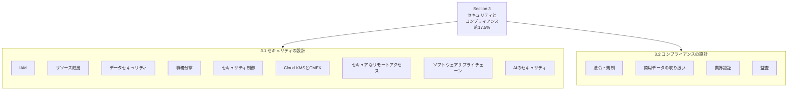
```mermaid
flowchart TB
    ROOT["Section 3<br/>セキュリティと<br/>コンプライアンス<br/>約17.5%"]
    subgraph S1["3.1 セキュリティの設計"]
        direction TB
        A1[IAM]
        A2[リソース階層]
        A3[データセキュリティ]
        A4[職務分掌]
        A5[セキュリティ制御]
        A6[Cloud KMSとCMEK]
        A7[セキュアなリモートアクセス]
        A8[ソフトウェアサプライチェーン]
        A9[AIのセキュリティ]
    end
    subgraph S2["3.2 コンプライアンスの設計"]
        direction TB
        B1[法令・規制]
        B2[商用データの取り扱い]
        B3[業界認証]
        B4[監査]
    end
    ROOT --> S1
    ROOT --> S2
```

| タスク | 内容 | 主要サービス・機能 |
| --- | --- | --- |
| 3.1 セキュリティの設計 | Identity and Access Management（IAM）、リソース階層、データセキュリティ、職務分掌、セキュリティ制御、Cloud KMSによるCMEK管理、セキュアなリモートアクセス、ソフトウェアサプライチェーンのセキュリティ、AIのセキュリティ | IAM、Resource Manager、Cloud KMS、Secret Manager、Cloud Audit Logs、VPC Service Controls、Context-Aware Access、Organization Policy Service、階層ファイアウォールポリシー、IAP、Workload Identity Federation、Chrome Enterprise Premium、Binary Authorization、Model Armor、Sensitive Data Protection |
| 3.2 コンプライアンスの設計 | 法令・規制（健康記録のプライバシー、児童のプライバシー、データプライバシー、データ所有権、データ主権）、商用データ（クレジットカード情報、PII）、業界認証（SOC 2など）、監査（ログを含む） | Assured Workloads、Cloud Audit Logs、Access Transparency、Access Approval、Compliance resource center |

出典: 公式Exam Guide PDF「Section 3: Designing for security and compliance (~17.5% of the exam)」[^1]

---

## 3.1 セキュリティの設計

### 3.1.1 Identity and Access Management（IAM）

IAMは「誰が（Who）」「何に対して（Which resource）」「どのような操作を（What access)」行えるかを制御する、Google Cloudのセキュリティの根幹をなす仕組みです。試験ではIAMの構成要素の理解に加え、最小権限の原則（Principle of Least Privilege）をどう実践するかが繰り返し問われます。

#### IAMの基本構成要素

| 要素 | 説明 |
| --- | --- |
| プリンシパル（Principal） | リソースにアクセスする主体。ユーザー、Googleグループ、サービスアカウント、Cloud Identityドメインなど |
| ロール（Role） | 一連の権限（permission）の集合。「compute.instances.list」のような個々の権限を束ねたもの |
| 許可ポリシー（Allow Policy） | 「どのプリンシパルに」「どのロールを」「どのリソースに対して」付与するかを定義するバインディングの集合 |
| 条件（IAM Conditions） | 許可ポリシーに時間・リソース属性などの条件式（CEL: Common Expression Language）を付加し、動的な権限制御を実現 |
| 拒否ポリシー（Deny Policy） | 許可ポリシーとは独立して、特定の権限を明示的に拒否する。許可ポリシーより優先される |

#### ロールの3分類

| ロール種別 | 特徴 | 推奨度 |
| --- | --- | --- |
| 基本ロール（Basic roles） | Owner・Editor・Viewerなど。プロジェクト内の広範な権限を一括付与 | 本番環境では非推奨。数千に及ぶ権限を含むため最小権限の原則に反する[^18] |
| 事前定義ロール（Predefined roles） | Google Cloudが職務単位で用意したロール（例: roles/compute.instanceAdmin.v1） | 多くのユースケースで推奨 |
| カスタムロール（Custom roles） | 組織独自に権限を組み合わせて作成するロール | 事前定義ロールで要件を満たせない場合に使用 |

#### IAMポリシーの評価フロー

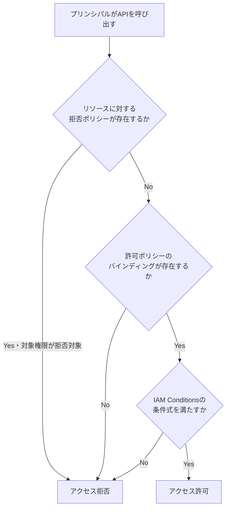
```mermaid
flowchart TD
    A[プリンシパルがAPIを呼び出す] --> B{リソースに対する<br/>拒否ポリシーが存在するか}
    B -- Yes・対象権限が拒否対象 --> C[アクセス拒否]
    B -- No --> D{許可ポリシーの<br/>バインディングが存在するか}
    D -- No --> C
    D -- Yes --> E{IAM Conditionsの<br/>条件式を満たすか}
    E -- No --> C
    E -- Yes --> F[アクセス許可]
```

拒否ポリシーは許可ポリシーより優先して評価されるため、「特定の高権限操作を組織全体で禁止する」といった防御多層化（defense in depth）に有効です[^49]。

#### リソース階層でのアクセス制御

IAMの許可ポリシーは組織 → フォルダ → プロジェクト → 個別リソースの階層に沿って**継承**されます。上位で付与したロールは下位のすべての子リソースに自動的に伝播します（詳細は[3.1.2](#312-リソース階層組織フォルダプロジェクト)）[^7]。

#### IAMのベストプラクティス

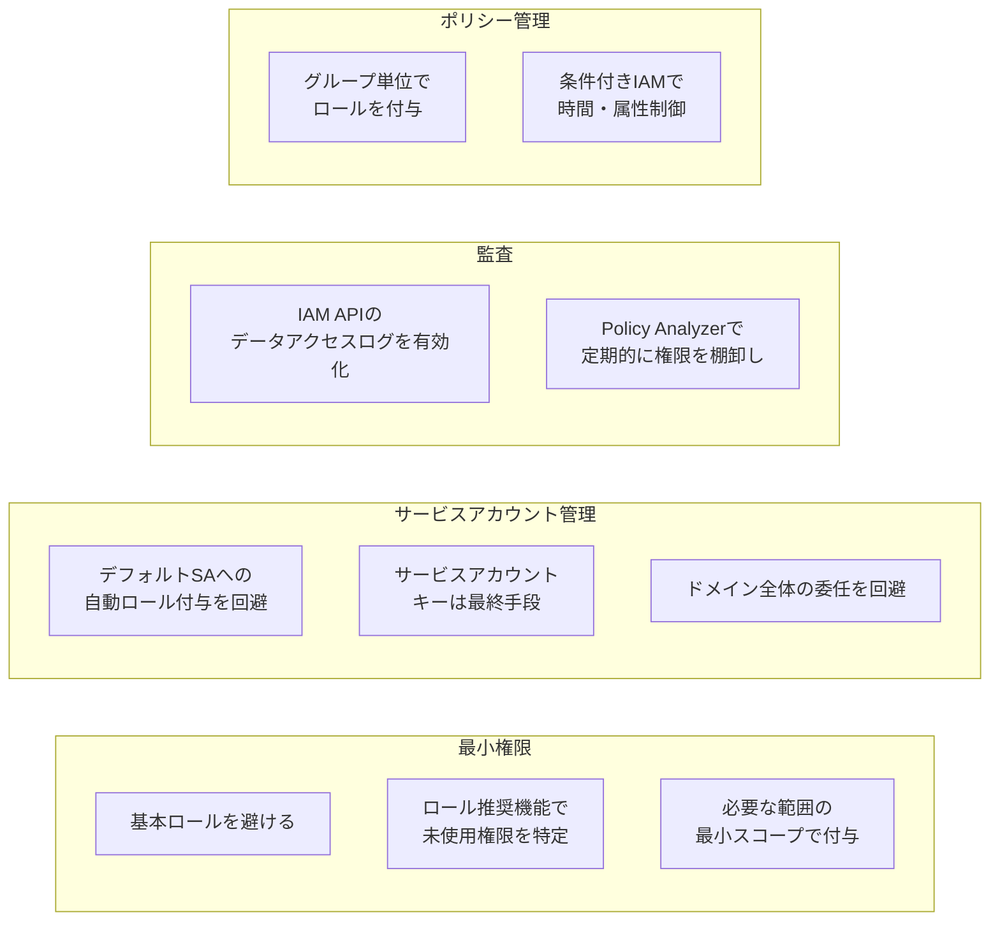
```mermaid
flowchart LR
    subgraph LP["最小権限"]
        LP1[基本ロールを避ける]
        LP2[ロール推奨機能で<br/>未使用権限を特定]
        LP3[必要な範囲の<br/>最小スコープで付与]
    end
    subgraph SA["サービスアカウント管理"]
        SA1[デフォルトSAへの<br/>自動ロール付与を回避]
        SA2[サービスアカウント<br/>キーは最終手段]
        SA3[ドメイン全体の委任を回避]
    end
    subgraph AU["監査"]
        AU1[IAM APIの<br/>データアクセスログを有効化]
        AU2[Policy Analyzerで<br/>定期的に権限を棚卸し]
    end
    subgraph PM["ポリシー管理"]
        PM1[グループ単位で<br/>ロールを付与]
        PM2[条件付きIAMで<br/>時間・属性制御]
    end
```

| ベストプラクティス | 具体的な実践方法 | 出典 |
| --- | --- | --- |
| 最小権限の原則を徹底する | 基本ロールを避け、事前定義ロールまたはカスタムロールを使用。ロール推奨（Role Recommender）で未使用権限を継続的に削減 | [^18][^14] |
| 個人ではなくグループに権限を付与する | Google Groupsを介してロールをバインドし、メンバー変更時のIAMポリシー更新を不要にする | [^151] |
| デフォルトサービスアカウントへの自動ロール付与を無効化する | 組織ポリシーでEditorロールの自動付与を制御。サービスにはサービスエージェントを利用させ、デフォルトSAに依存しない | [^14] |
| サービスアカウントキーの利用を最小化する | Compute Engine・GKE・Cloud Run functionsなどではメタデータサーバー経由の認証を利用し、キーのエクスポートを避ける。他クラウドからはWorkload Identity Federationを使用（[3.1.7](#317-セキュアなリモートアクセス)参照） | [^14][^13] |
| Privileged Access Managerで昇格権限を時限化する | 常時特権ではなく、必要な時だけ条件付きIAMバインディングで一時的に昇格権限を付与し、自動失効させる | [^12] |
| IAM Denyポリシーで防御を多層化する | 開発環境でのIAMロール変更・組織ポリシー変更・課金情報アクセスなど高権限操作を、許可ポリシーとは独立して拒否 | [^49] |
| ワークロードIDフェデレーションを優先する | 外部ワークロード（GitHub Actions、AWS、オンプレミス等）からのアクセスにはサービスアカウントキーではなく、短期的な認証情報を発行するWorkload Identity Federationを使用 | [^13] |

---

### 3.1.2 リソース階層（組織・フォルダ・プロジェクト）

Google Cloudのすべてのリソースは、単一のルートを持つ木構造（ツリー構造）に編成されます。この構造を**リソース階層（Resource Hierarchy）**と呼び、IAM許可ポリシーと組織ポリシーの両方がこの階層に沿って継承される、いわば「ガバナンスの背骨」です[^23]。

#### 階層構造

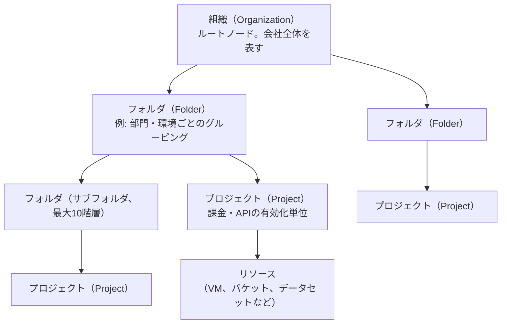
```mermaid
flowchart TD
    ORG["組織（Organization）<br/>ルートノード。会社全体を表す"]
    F1["フォルダ（Folder）<br/>例: 部門・環境ごとのグルーピング"]
    F2["フォルダ（Folder）"]
    F3["フォルダ（サブフォルダ、最大10階層）"]
    P1["プロジェクト（Project）<br/>課金・APIの有効化単位"]
    P2["プロジェクト（Project）"]
    P3["プロジェクト（Project）"]
    R1["リソース<br/>（VM、バケット、データセットなど）"]

    ORG --> F1
    ORG --> F2
    F1 --> F3
    F1 --> P1
    F2 --> P2
    F3 --> P3
    P1 --> R1
```

| 階層レベル | 役割 | 主な特徴 |
| --- | --- | --- |
| 組織（Organization） | リソース階層のルート。会社全体を表す | Google WorkspaceまたはCloud Identityアカウントに紐づく。組織レベルのIAM/組織ポリシーはすべての子リソースに継承される[^23] |
| フォルダ（Folder） | プロジェクトやフォルダをグルーピングする任意の中間層 | 最大10階層までネスト可能。1つの親フォルダに直接持てる子フォルダは300個まで[^25] |
| プロジェクト（Project） | 実際のリソース（VM、バケット等）を保持する基本単位であり、課金・API有効化・信頼境界の単位 | プロジェクト内のサービスはデフォルトで相互に一定の信頼関係を持つ[^21] |
| リソース（Resource） | Compute Engineインスタンス、Cloud Storageバケット、Pub/Subトピックなど個々のサービスリソース | 一部のリソースはリソースレベルでのIAMロール付与にも対応 |

#### 階層構造がもたらす3つの利点

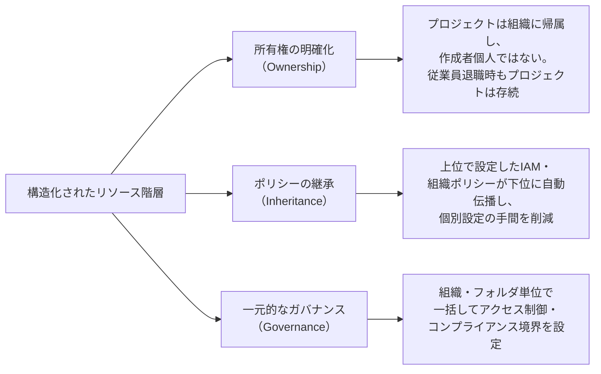
```mermaid
flowchart LR
    A[構造化されたリソース階層] --> B["所有権の明確化<br/>（Ownership）"]
    A --> C["ポリシーの継承<br/>（Inheritance）"]
    A --> D["一元的なガバナンス<br/>（Governance）"]
    B --> B1["プロジェクトは組織に帰属し、<br/>作成者個人ではない。<br/>従業員退職時もプロジェクトは存続"]
    C --> C1["上位で設定したIAM・<br/>組織ポリシーが下位に自動伝播し、<br/>個別設定の手間を削減"]
    D --> D1["組織・フォルダ単位で<br/>一括してアクセス制御・<br/>コンプライアンス境界を設定"]
```

出典: [^23]

#### リソース階層設計のベストプラクティス

| ベストプラクティス | 説明 |
| --- | --- |
| 組織構造・環境・コンプライアンス境界に合わせてフォルダを設計する | 部門・チーム・製品単位、または本番/検証/開発などの環境単位でフォルダを分割し、IAMと組織ポリシーの適用範囲を明確化する[^26] |
| 複数プロジェクトにまたがるロールはフォルダレベルで付与する | ユーザーやグループが複数プロジェクトへのアクセスを必要とする場合、個々のプロジェクトへの重複設定を避けフォルダレベルでロールを設定する[^21] |
| ラベルとタグを併用してリソースをアノテーションする | 階層による構造化に加え、ラベル（課金分析用）とタグ（条件付きポリシー適用用）できめ細かい管理を実現する[^21] |
| サンドボックスフォルダから始める | 本番導入前に単一のサンドボックスフォルダで階層設計を試行し、組織に最適な構成を検証する[^25] |
| プロジェクトを信頼境界として扱う | 同一プロジェクト内のサービスはデフォルトで一定の信頼関係を持つため、機密度の異なるワークロードは別プロジェクトに分離する[^21] |

---

### 3.1.3 データセキュリティ（鍵管理・暗号化・シークレット管理）

Google Cloudでは保存データ（data at rest）はデフォルトですべて暗号化されますが、規制要件や独自のセキュリティポリシーに応じて、暗号化方式や鍵の管理主体を選択できます。

#### 暗号化オプションの比較

| 方式 | 鍵の生成・管理主体 | 主な用途 |
| --- | --- | --- |
| デフォルト暗号化（Google-managed keys） | Google | 追加設定不要。多くのワークロードで十分な保護レベル |
| 顧客管理暗号鍵（CMEK: Customer-Managed Encryption Keys） | 顧客がCloud KMS上で鍵を作成・管理 | 鍵のローテーション・無効化・削除（クリプトシュレッディング）を顧客が制御したい場合 |
| 顧客提供暗号鍵（CSEK: Customer-Supplied Encryption Keys） | 顧客がGoogle Cloud外で鍵を保持し、リクエスト時に提供 | 鍵をGoogle Cloud上に一切保存したくない場合。一部サービスのみ対応 |
| 外部鍵管理（Cloud EKM: External Key Manager） | 顧客がGoogle Cloud外部のサードパーティKMSで鍵を管理 | 主権要件が特に厳しい場合や、Google Cloud外に鍵の物理的な管理を残したい場合[^35] |

CMEKを選択すべき典型的な要件は次のとおりです。

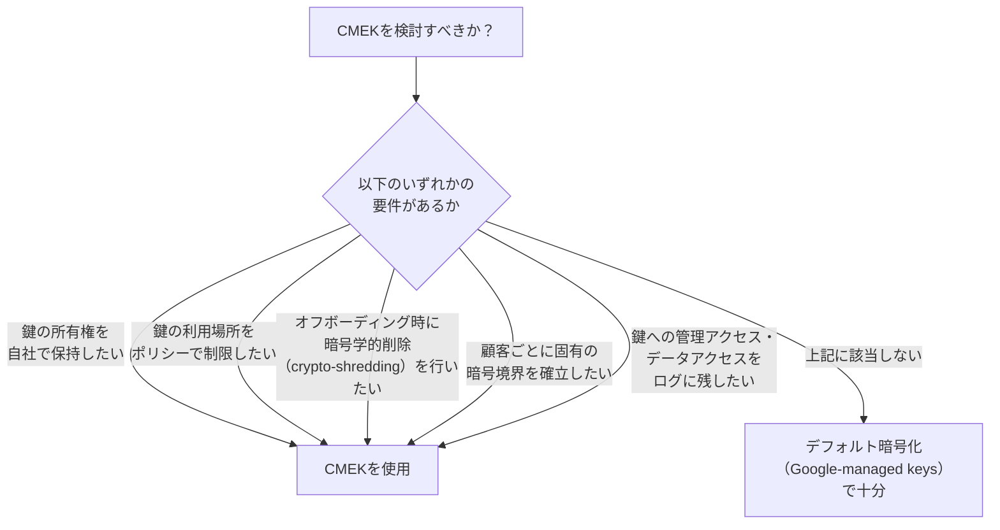
```mermaid
flowchart TD
    A["CMEKを検討すべきか？"] --> B{以下のいずれかの<br/>要件があるか}
    B -->|鍵の所有権を<br/>自社で保持したい| C[CMEKを使用]
    B -->|鍵の利用場所を<br/>ポリシーで制限したい| C
    B -->|オフボーディング時に<br/>暗号学的削除<br/>（crypto-shredding）を行いたい| C
    B -->|顧客ごとに固有の<br/>暗号境界を確立したい| C
    B -->|鍵への管理アクセス・<br/>データアクセスを<br/>ログに残したい| C
    B -->|上記に該当しない| D[デフォルト暗号化<br/>（Google-managed keys）で十分]
```

出典: [^30]

#### 封筒暗号化（Envelope Encryption）の仕組み

CMEKはCloud KMS上の鍵暗号化鍵（KEK: Key Encryption Key）でデータ暗号化鍵（DEK: Data Encryption Key）をラップする「封筒暗号化」方式を採用しています。

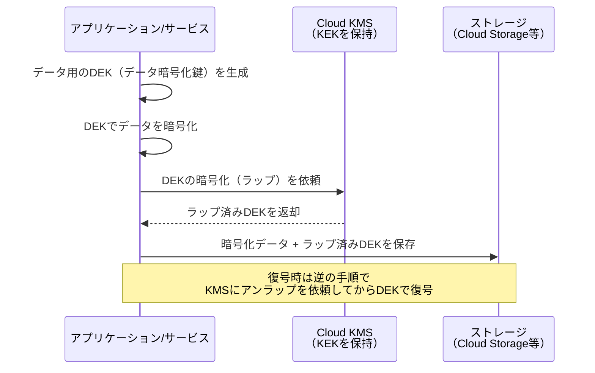
```mermaid
sequenceDiagram
    participant App as アプリケーション/サービス
    participant KMS as Cloud KMS<br/>（KEKを保持）
    participant Store as ストレージ<br/>（Cloud Storage等）

    App->>App: データ用のDEK（データ暗号化鍵）を生成
    App->>App: DEKでデータを暗号化
    App->>KMS: DEKの暗号化（ラップ）を依頼
    KMS-->>App: ラップ済みDEKを返却
    App->>Store: 暗号化データ + ラップ済みDEKを保存
    Note over App,Store: 復号時は逆の手順で<br/>KMSにアンラップを依頼してからDEKで復号
```

出典: [^35]

#### Secret Managerによるシークレット管理

APIキー・パスワード・証明書などの機密性の高い設定値は、コードやコンテナイメージに埋め込まず、**Secret Manager**で一元管理することが推奨されます。

| 特徴 | 内容 |
| --- | --- |
| 保管時の暗号化 | AES-256で自動的に暗号化。追加設定は不要[^42] |
| バージョニング | シークレットの変更履歴をバージョンとして保持し、ロールバックが可能[^42] |
| レプリケーションポリシー | 自動（Google Cloudが最適リージョンを選択）またはユーザー管理（リージョンを指定、データ主権要件に対応）を選択可能[^42] |
| アクセス制御 | IAMのきめ細かいロール（Secret Accessor / Secret Version Manager等）とIAM Conditionsで、閲覧・管理・監査の職責を分離可能[^38] |
| 自動ローテーション | 有効期限に応じた自動ローテーション通知（Pub/Sub連携）を設定可能[^42] |

Cloud KMSとSecret Managerの違いを理解することも重要です。

| 比較項目 | Cloud KMS | Secret Manager |
| --- | --- | --- |
| 主な用途 | 暗号鍵そのものの生成・保管・ローテーション・利用制御 | パスワードやAPIキーなど「シークレット値」そのものの保管・バージョニング |
| 典型的な利用形態 | 他のGoogle CloudサービスのCMEK統合や、アプリケーションからの暗号/復号API呼び出し | アプリケーションが起動時にシークレット値を取得して利用 |
| 暗号化方式 | 鍵管理サービス自体（KMS上の鍵はHSMまたはソフトウェアで保護） | 内部的にはGoogleが管理する鍵でAES-256暗号化（顧客はCMEKで保護することも可能） |

#### データセキュリティのベストプラクティス

| ベストプラクティス | 説明 | 出典 |
| --- | --- | --- |
| シークレットをファイルシステムや環境変数に平置きしない | ディレクトリトラバーサル攻撃やデバッグエンドポイントからの漏えいリスクを避け、Secret Manager APIを直接呼び出す | [^44] |
| シークレットへのアクセスはシークレット単位で最小権限を付与する | プロジェクトレベルでSecret Accessorロールを付与すると全シークレットが閲覧可能になるため、個別シークレットへのIAMバインディングを行う | [^41] |
| 組織所有権はセキュアな管理者アカウントに限定する | 組織全体の管理権限を持つアカウントを最小限に絞り、環境（ステージング/本番）ごとにプロジェクトを分離する | [^44] |
| Cloud Asset Inventoryでシークレット・鍵の設定状況を継続監視する | ローテーション・暗号化設定・所在地の組織要件への非準拠を検知する | [^38] |
| VPC Service Controlsでネットワークベースの制御を追加する | IAMに加え、Secret Manager APIへのアクセスをサービス境界で制限し、データ持ち出しリスクを低減する | [^38] |

---

### 3.1.4 職務分掌（Separation of Duties）

職務分掌（SoD: Separation of Duties）は、単独の担当者が不正・誤操作を行うリスクを低減するために、重要な業務を複数の役割に分割し、それぞれ異なる担当者に割り当てる統制です[^145]。

#### Google Cloudにおける職務分掌の実現手段

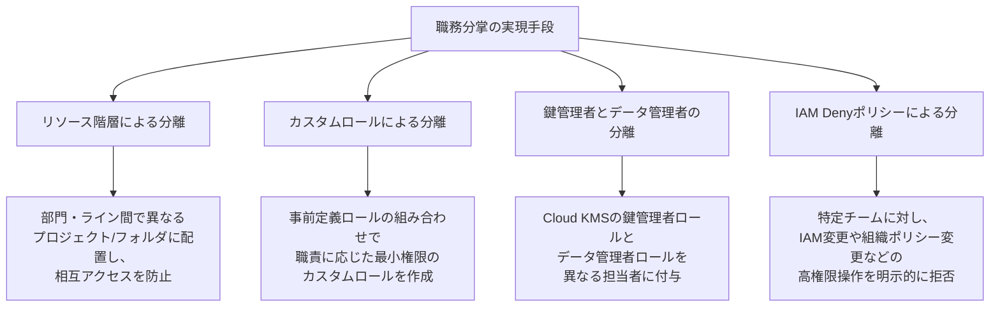
```mermaid
flowchart TD
    A[職務分掌の実現手段] --> B["リソース階層による分離"]
    A --> C["カスタムロールによる分離"]
    A --> D["鍵管理者とデータ管理者の分離"]
    A --> E["IAM Denyポリシーによる分離"]
    B --> B1["部門・ライン間で異なる<br/>プロジェクト/フォルダに配置し、<br/>相互アクセスを防止"]
    C --> C1["事前定義ロールの組み合わせで<br/>職責に応じた最小権限の<br/>カスタムロールを作成"]
    D --> D1["Cloud KMSの鍵管理者ロールと<br/>データ管理者ロールを<br/>異なる担当者に付与"]
    E --> E1["特定チームに対し、<br/>IAM変更や組織ポリシー変更などの<br/>高権限操作を明示的に拒否"]
```

出典: [^145][^148]

#### Cloud KMSにおける鍵管理モデルの選択

Cloud KMSでは、鍵管理者とデータ利用者の職責を分離するために、2つの管理モデルが提供されています。

| モデル | 特徴 | 適した組織 |
| --- | --- | --- |
| 集中管理モデル（Centralized / Dedicated-project） | 鍵を専用の「鍵管理プロジェクト」に集約し、中央のセキュリティチームが鍵の管理権限を持つ。リソースを含むプロジェクトの担当者は鍵プロジェクトへのアクセス権を持たない | 中央集権的なセキュリティチームを持つ組織、または鍵材料の厳格な分離が求められる組織[^146] |
| 委任管理モデル（Delegated / Same-project） | CMEKをリソースと同一プロジェクトに保管する | 開発者の俊敏性を優先し、中央セキュリティチームとのやり取りを減らしたい組織[^146] |

両モデルは環境ごとに使い分けることも可能で、例えば本番環境は集中管理モデル、開発・検証環境は委任管理モデルとする構成が一般的です[^146]。

#### 職務分掌の実例（サービスアカウント関連ロール）

| アンチパターン | 問題点 | 是正策 |
| --- | --- | --- |
| 同一プリンシパルにService Account AdminとService Account Userの両方を付与 | サービスアカウントの作成者が、そのサービスアカウントを利用したなりすまし操作まで単独で行えてしまう | 作成・管理を行う担当者と、実際にサービスアカウントを利用してリソースを操作する担当者を分離する[^150] |
| 鍵管理者がデータへの直接アクセス権も保有 | 鍵の無効化権限とデータの読み取り権限が同一人物に集中し、内部不正のリスクが高まる | 集中管理モデルを採用し、鍵プロジェクトのオーナー権限をデータプロジェクトの担当者から分離する[^33] |

---

### 3.1.5 セキュリティ制御（監査・VPC Service Controls・コンテキストアウェアアクセス・組織ポリシー・階層ファイアウォールポリシー）

このセクションは3.1の中でも扱う機能が最も多く、試験でも頻出のテーマです。それぞれの制御が「何を」「どのレイヤーで」保護するのかを対比しながら理解することが重要です。

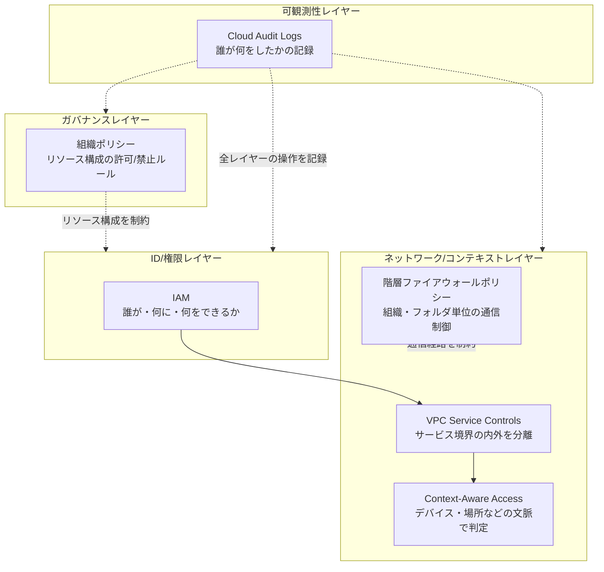
```mermaid
flowchart TD
    subgraph L1["ID/権限レイヤー"]
        IAM["IAM<br/>誰が・何に・何をできるか"]
    end
    subgraph L2["ネットワーク/コンテキストレイヤー"]
        VPCSC["VPC Service Controls<br/>サービス境界の内外を分離"]
        CAA["Context-Aware Access<br/>デバイス・場所などの文脈で判定"]
        HFW["階層ファイアウォールポリシー<br/>組織・フォルダ単位の通信制御"]
    end
    subgraph L3["ガバナンスレイヤー"]
        ORGPOL["組織ポリシー<br/>リソース構成の許可/禁止ルール"]
    end
    subgraph L4["可観測性レイヤー"]
        AUDIT["Cloud Audit Logs<br/>誰が何をしたかの記録"]
    end
    IAM --> VPCSC
    VPCSC --> CAA
    ORGPOL -.->|リソース構成を制約| L1
    HFW -.->|通信経路を制約| L2
    AUDIT -.->|全レイヤーの操作を記録| L1
    AUDIT -.-> L2
    AUDIT -.-> L3
```

#### (1) Cloud Audit Logs

Cloud Audit Logsは「誰が」「いつ」「どのリソースに対して」「どのAPIを呼び出したか」を記録する証跡です。4種類のログタイプがあります。Admin Activity・System Event・Policy Deniedはコントロールプレーン（構成変更やポリシー適用）の記録ですが、**Data Accessはコントロールプレーンに限定されず、リソースのメタデータの読み取りに加えて、ユーザー提供データそのものの読み取り・書き込みも記録します**。

| ログタイプ | 内容 | デフォルトで有効か | 既定の保存先ログバケット |
| --- | --- | --- | --- |
| Admin Activity（管理アクティビティ） | リソースの構成・メタデータを変更するAPI呼び出し（例: IAM権限の変更、VM作成） | 常時有効・無効化不可 | `_Required` |
| Data Access（データアクセス） | リソースの構成・メタデータの読み取り、およびユーザー提供データの作成・変更・読み取り | BigQueryを除き**デフォルトで無効**。サービスごと・データアクセスタイプごとに個別の有効化が必要 | `_Default` |
| System Event（システムイベント） | Google Cloudのシステムによって自動的に生成される変更（Compute Engineのライブマイグレーション等） | 常時有効・無効化不可 | `_Required` |
| Policy Denied（ポリシー拒否） | セキュリティポリシー（VPC Service Controls等）違反によりアクセスが拒否された記録 | デフォルトで有効 | `_Default` |

**保持期間はログタイプ固有の値ではなく、ログが保存されるログバケットの設定で決まります**。

| ログバケット | 保持期間 | 変更可否 |
| --- | --- | --- |
| `_Required` | 400日 | **変更不可** |
| `_Default` | 既定30日 | 変更可能（1日〜3650日の範囲で設定でき、既定を超える保持には料金が発生する） |

したがって、Data AccessログやPolicy Deniedログを30日より長く保持したい場合は、`_Default`バケットの保持期間を延長するか、専用のログバケット／BigQuery・Cloud Storageへのシンクを構成する必要があります。

出典: [^73][^74][^79]

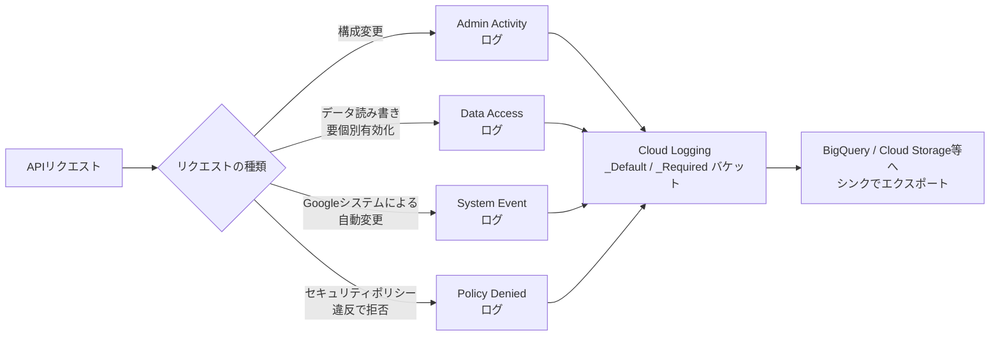
```mermaid
flowchart LR
    A[APIリクエスト] --> B{リクエストの種類}
    B -->|構成変更| C[Admin Activity<br/>ログ]
    B -->|データ読み書き<br/>要個別有効化| D[Data Access<br/>ログ]
    B -->|Googleシステムによる<br/>自動変更| E[System Event<br/>ログ]
    B -->|セキュリティポリシー<br/>違反で拒否| F[Policy Denied<br/>ログ]
    C --> G[Cloud Logging<br/>_Default / _Required バケット]
    D --> G
    E --> G
    F --> G
    G --> H[BigQuery / Cloud Storage等へ<br/>シンクでエクスポート]
```

**監査ログのベストプラクティス**

| ベストプラクティス | 説明 |
| --- | --- |
| 機密データを扱うサービスでData Accessログを個別に有効化する | Cloud Storageの機密バケット、Secret Manager、BigQueryの規制対象データセットなど、優先度の高い領域から有効化する[^79][^80] |
| ログシンクを事前に設定する | シンクは過去のログを遡って取り込まないため、必要になる前にCloud Storage・BigQuery・Log Bucketへのエクスポート設定を行う[^79] |
| IAM変更やサービスアカウントキー作成をアラート対象にする | `SetIamPolicy`やサービスアカウントキー作成イベントなど高リスク操作を監視し、異常検知に活用する[^79] |
| Access TransparencyログとあわせてGoogle人員によるアクセスも監査する | 顧客側の操作記録（Cloud Audit Logs）とGoogle人員の操作記録（Access Transparency）を併用し、完全な証跡を確保する（詳細は[3.2.4](#324-監査ログを含む)） |

#### (2) VPC Service Controls

VPC Service Controlsは、IAMとは独立した「サービス境界（Service Perimeter）」を構成し、Cloud StorageやBigQueryなどのGoogle管理サービスへのアクセスを、境界の内外という文脈で制御する仕組みです。主な目的はデータ持ち出し（exfiltration）リスクの低減です[^46]。

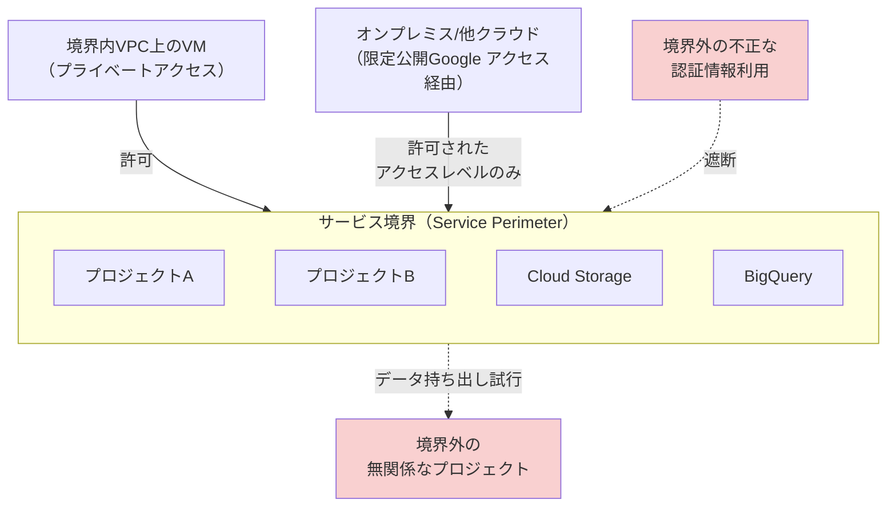
```mermaid
flowchart TB
    subgraph Perimeter["サービス境界（Service Perimeter）"]
        direction TB
        P1[プロジェクトA]
        P2[プロジェクトB]
        GCS[Cloud Storage]
        BQ[BigQuery]
    end
    VM["境界内VPC上のVM<br/>（プライベートアクセス）"] -->|許可| Perimeter
    OnPrem["オンプレミス/他クラウド<br/>（限定公開Google アクセス経由）"] -->|許可された<br/>アクセスレベルのみ| Perimeter
    Attacker["境界外の不正な<br/>認証情報利用"] -.->|遮断| Perimeter
    Perimeter -.->|データ持ち出し試行| External["境界外の<br/>無関係なプロジェクト"]
    style Attacker fill:#f9d0d0
    style External fill:#f9d0d0
```

VPC Service Controlsが緩和する代表的なリスクは次の2つです[^46]。

| リスク | VPC Service Controlsによる緩和策 |
| --- | --- |
| 盗まれたOAuth・サービスアカウント認証情報による境界外からのアクセス | 境界に対して明示的に許可されたコンテキスト（アクセスレベル・ingressルール）からのリクエストのみを許可し、正規の認証情報であっても許可されていない発信元からのアクセスを拒否 |
| 内部関係者や侵害されたコードによるデータの持ち出し | 境界内のクライアントが境界外リソースへ読み書きすることを防止し、ネットワーク的な出口制御を補完 |

**VPCネットワークは前提条件ではない**：VPC Service Controlsのサービス境界は、**プロジェクト（およびVPCネットワーク）を単位として保護対象サービスへのAPIアクセスを制御する仕組み**であり、アクセス元がVPCネットワーク内にあることを必須とはしません。VPCを経由しない構成では、Access Context Managerで定義する**アクセスレベル**（許可する外部IP範囲、デバイス条件、地域など）や、境界の**ingressルール**（許可するIAMプリンシパルと対象サービス／メソッド）で、どのアクセスを境界内へ通すかを指定します。上図の「境界内VPC上のVMからのプライベートアクセス」は、あくまで代表的な構成例の1つです。

なお、次の3つは役割が異なるため混同しないでください。

| 仕組み | レイヤ | 役割 |
| --- | --- | --- |
| VPC Service Controls | サービス（API）境界 | 保護対象サービスのAPIに対し、どのコンテキストからのアクセスを許可するかを制御する |
| 限定公開のGoogleアクセス（Private Google Access）／`restricted.googleapis.com` VIP | 接続経路 | 外部IPを持たないVMやオンプレミスから、Google APIへ内部経路で到達するための経路を提供する。restricted VIPはVPC Service Controls非対応サービスへの到達を遮断する |
| VPCファイアウォールルール／階層ファイアウォールポリシー | ネットワーク通信 | 送信元・宛先IP、ポート、プロトコル単位でパケットの通過を制御する |

**運用モード**

| モード | 説明 |
| --- | --- |
| Dry-run（試行）モード | 違反をログに記録するが、実際のアクセスはブロックしない。本番導入前の影響確認に使用[^51] |
| Enforced（強制）モード | 違反したリクエストを実際に拒否する。デフォルトのモード[^51] |

#### (3) コンテキストアウェアアクセス（Identity-Aware Proxy / Access Context Manager）

コンテキストアウェアアクセスは、ユーザーIDに加えて「どのネットワークから」「どのデバイスから」「いつ」アクセスしているかという**文脈情報**に基づいてアクセスを許可・拒否する仕組みです。VPNのような「ネットワークにいるか否か」の二択（全か無か）ではなく、より粒度の細かい制御を実現します[^57]。

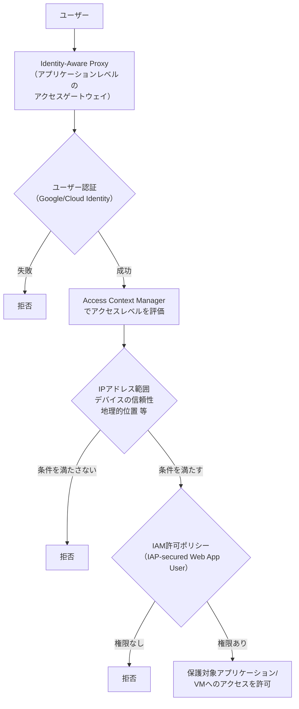
```mermaid
flowchart TD
    U[ユーザー] --> IAP["Identity-Aware Proxy<br/>（アプリケーションレベルの<br/>アクセスゲートウェイ）"]
    IAP --> Auth{"ユーザー認証<br/>（Google/Cloud Identity）"}
    Auth -->|失敗| Deny1[拒否]
    Auth -->|成功| ACM["Access Context Manager<br/>でアクセスレベルを評価"]
    ACM --> Check{"IPアドレス範囲<br/>デバイスの信頼性<br/>地理的位置 等"}
    Check -->|条件を満たさない| Deny2[拒否]
    Check -->|条件を満たす| IAMCheck{"IAM許可ポリシー<br/>（IAP-secured Web App User）"}
    IAMCheck -->|権限なし| Deny3[拒否]
    IAMCheck -->|権限あり| Allow["保護対象アプリケーション/<br/>VMへのアクセスを許可"]
```

出典: [^55][^58]

| 構成要素 | 役割 |
| --- | --- |
| Identity-Aware Proxy（IAP） | HTTPS経由のアプリケーションおよびTCPフォワーディング（VM への SSH/RDP）に対する中央集権的な認可レイヤー。ネットワークレベルのファイアウォールに代わりアプリケーションレベルでアクセス制御する[^55] |
| Access Context Manager | IPアドレス範囲やデバイス属性に基づく「アクセスレベル」を定義するルールエンジン[^58] |
| IAM Conditions | URLパス・日時などに基づく追加の制約をIAMバインディングに付加[^58] |

#### (4) 組織ポリシーサービス（Organization Policy Service）

組織ポリシーサービスは、IAMのように「誰が」ではなく「**リソースをどのように構成できるか**」を制御する、プログラマティックなガードレールです。例えば「外部IPアドレスを持つVMの作成を禁止する」「特定のリージョン以外へのリソース作成を禁止する」といった制約（constraint）を組織・フォルダ・プロジェクト単位で適用できます[^67]。

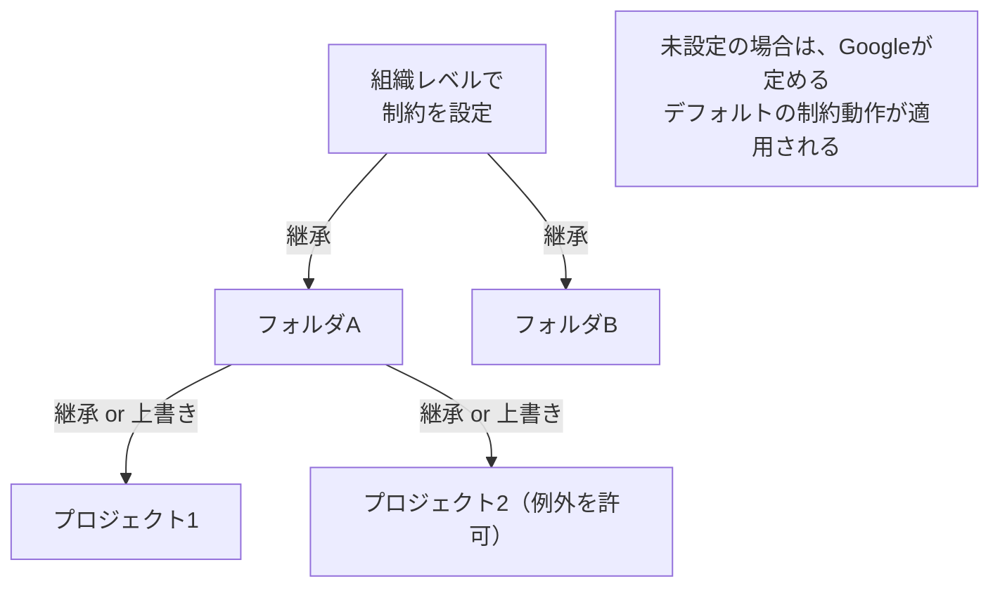
```mermaid
flowchart TD
    ORG["組織レベルで<br/>制約を設定"] -->|継承| F["フォルダA"]
    ORG -->|継承| F2["フォルダB"]
    F -->|継承 or 上書き| P1["プロジェクト1"]
    F -->|継承 or 上書き| P2["プロジェクト2（例外を許可）"]
    Note["未設定の場合は、Googleが定める<br/>デフォルトの制約動作が適用される"]
```

出典: [^67][^69]

| 組織ポリシー制約の例 | 目的 |
| --- | --- |
| `constraints/iam.disableServiceAccountKeyCreation` | サービスアカウントキーの作成自体を組織全体で禁止し、Workload Identity Federation等の利用を強制 |
| `constraints/compute.vmExternalIpAccess` | 外部IPを持つVMインスタンスの作成を制限 |
| `constraints/gcp.resourceLocations` | リソースを作成できるリージョンを制限し、データ主権要件に対応 |
| `constraints/iam.allowedPolicyMemberDomains` | IAMポリシーに追加できるドメインを制限し、外部ドメインへの誤った権限付与を防止 |

#### (5) 階層ファイアウォールポリシー（Hierarchical Firewall Policies）

VPCファイアウォールルールがVPCネットワーク単位で適用されるのに対し、**階層ファイアウォールポリシー**は組織またはフォルダのレベルでファイアウォールルールを定義し、配下のすべてのプロジェクトのVMに一括適用する仕組みです[^64]。

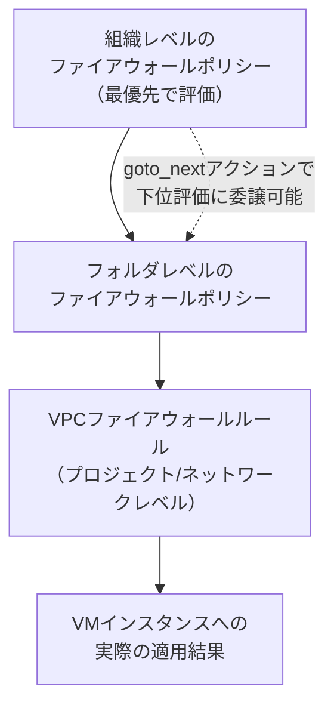
```mermaid
flowchart TD
    Rule1["組織レベルの<br/>ファイアウォールポリシー<br/>（最優先で評価）"] --> Rule2["フォルダレベルの<br/>ファイアウォールポリシー"]
    Rule2 --> Rule3["VPCファイアウォールルール<br/>（プロジェクト/ネットワークレベル）"]
    Rule3 --> VM["VMインスタンスへの<br/>実際の適用結果"]
    Rule1 -.->|goto_nextアクションで<br/>下位評価に委譲可能| Rule2
```

出典: [^64][^70]

| 特徴 | 内容 |
| --- | --- |
| 評価順序 | 組織レベル → フォルダレベル（上位から下位）→ VPCファイアウォールルールの順で評価される[^64] |
| `goto_next`アクション | 組織レベルでは「絶対に必須の要件」（既知の不正IP遮断、ヘルスチェック許可等）のみを強制し、それ以外は下位レベルの判断に委譲する設計が推奨される[^70] |
| ターゲット指定 | 階層ファイアウォールポリシーはネットワークタグではなく、ターゲットVPCネットワークまたはターゲットサービスアカウントで対象を指定する[^65] |
| Layer 7検査との統合 | `apply_security_profile_group`アクションにより、Cloud Next Generation FirewallのURLフィルタリングや侵入検知・防止サービスと連携可能[^64] |

**セキュリティ制御5機能の使い分けまとめ**

| 制御 | 主な保護対象 | 判定基準 |
| --- | --- | --- |
| Cloud Audit Logs | 可視性・証跡 | 誰が・何を・いつ行ったか |
| VPC Service Controls | データ持ち出し防止 | サービス境界の内外 |
| コンテキストアウェアアクセス（IAP） | アプリケーション/VMへのアクセス | ID + デバイス + ネットワークの文脈 |
| 組織ポリシー | リソースの構成可能性 | リソース属性・設定値の許可/禁止 |
| 階層ファイアウォールポリシー | ネットワーク通信 | 送信元/宛先IP・ポート・プロトコル |

---

### 3.1.6 Cloud KMSによる顧客管理暗号鍵（CMEK）の管理

[3.1.3](#313-データセキュリティ鍵管理暗号化シークレット管理)で暗号化オプションの全体像を扱いましたが、ここではCloud KMSを用いたCMEKの実装・運用面をさらに掘り下げます。

#### 鍵の保護レベル（Protection Level）

| 保護レベル | 説明 | 用途 |
| --- | --- | --- |
| ソフトウェア鍵（Software） | Cloud KMS内でソフトウェア的に保護される鍵。すべてのGoogle Cloudロケーションで利用可能 | 一般的なCMEK要件 |
| Cloud HSM（マルチテナント） | FIPS 140-2レベル3準拠のハードウェアセキュリティモジュールで保護 | より高いコンプライアンス要件（金融・医療等） |
| Cloud HSM（シングルテナント） | 専有のHSMインスタンスを利用 | 最も厳格な分離要件 |
| Cloud EKM（外部鍵管理） | Google Cloud外部のサードパーティKMSで鍵材料を保持 | 鍵材料をGoogle Cloud上に一切置きたくない主権要件 |

出典: [^35]

#### Cloud KMS Autokey

手動でのCMEKプロビジョニングでは、Cloud KMS管理者が事前にキーリングと鍵の種類、サービスエージェントへのIAMロール付与を計画する必要がありました。**Cloud KMS Autokey**はこのプロセスを自動化し、リソース作成時にオンデマンドでキーリング・鍵を生成し、必要なIAMロールも自動付与します[^32]。

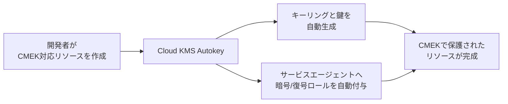
```mermaid
flowchart LR
    Dev["開発者が<br/>CMEK対応リソースを作成"] --> Autokey["Cloud KMS Autokey"]
    Autokey --> KR["キーリングと鍵を<br/>自動生成"]
    Autokey --> IAMGrant["サービスエージェントへ<br/>暗号/復号ロールを自動付与"]
    KR --> Resource["CMEKで保護された<br/>リソースが完成"]
    IAMGrant --> Resource
```

Autokeyで生成される鍵は、ロケーションの整合性、鍵の粒度、マルチテナントHSM保護レベル、ローテーションスケジュール、職務分掌といった業界標準のベストプラクティスに自動的に準拠するよう設計されています[^32]。

#### CMEK運用のベストプラクティス

| ベストプラクティス | 説明 | 出典 |
| --- | --- | --- |
| 要件に基づきCMEKの要否を判断する | 鍵の所有権・利用場所の制御・クリプトシュレッディング・監査ログが不要であれば、デフォルト暗号化で十分と判断する | [^30] |
| 鍵とデータのロケーションを一致させる | Cloud KMSリソースはプロジェクト内のロケーションに作成されるため、保護対象データと同一リージョンに鍵を配置し、レイテンシと主権要件を両立させる | [^30] |
| 鍵管理モデル（集中/委任）を組織要件に合わせて選択する | 中央セキュリティチームがある場合は集中管理モデル、開発速度を優先する場合は委任管理モデルを選択（[3.1.4](#314-職務分掌separation-of-duties)参照） | [^146] |
| 組織ポリシーでCMEKの使用を強制する | `constraints/gcp.restrictNonCmekServices`等を用いて、対応リソースがCMEKで暗号化されることを組織ポリシーで保証する。ただしこの制約が適用されるのは**対応サービスの新規リソース作成時のみで、既存リソースには遡及適用されない**。ポリシー適用前から存在するリソースはGoogle管理鍵のまま残るため、別途棚卸しを行い、CMEKで再作成・移行する計画を立てる必要がある | [^35] |
| ローテーションポリシーを定義する | 対称鍵は自動ローテーションに対応。ローテーション後も旧バージョンで暗号化されたデータの復号は可能なため、鍵バージョンのライフサイクル管理方針を明確にする | [^37] |
| Autokeyを既定の選択肢として検討する | Autokeyが要件を満たす場合、手動プロビジョニングよりシンプルかつベストプラクティス準拠になるため優先的に採用する | [^32] |

---

### 3.1.7 セキュアなリモートアクセス

従来型の「VPNで社内ネットワークに接続すればすべて信頼する」というペリメータ型セキュリティモデルに代わり、Google Cloudは**ゼロトラスト（Zero Trust）**モデルを採用しています。ゼロトラストの原則は「ネットワークの場所によってアクセスを決定しない」「ユーザーとデバイスの文脈に基づいてアクセスを許可する」「すべてのアクセスを認証・認可・暗号化する」の3点に要約されます[^109]。

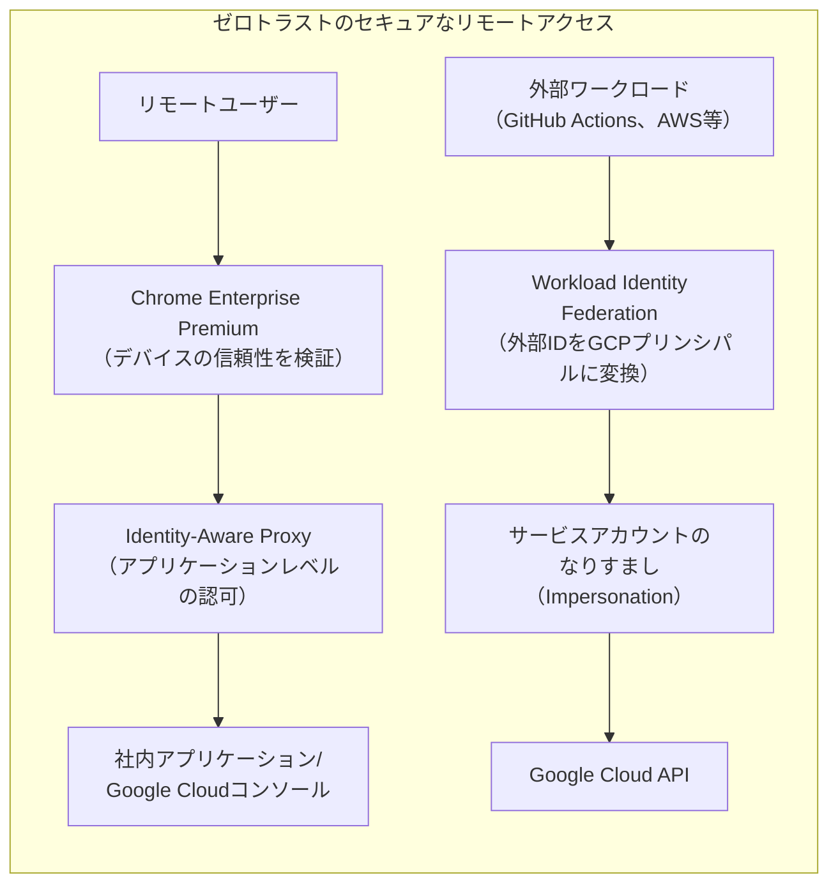
```mermaid
flowchart TB
    subgraph ZT["ゼロトラストのセキュアなリモートアクセス"]
        direction TB
        User["リモートユーザー"] --> CEP["Chrome Enterprise Premium<br/>（デバイスの信頼性を検証）"]
        CEP --> IAP2["Identity-Aware Proxy<br/>（アプリケーションレベルの認可）"]
        IAP2 --> App["社内アプリケーション/<br/>Google Cloudコンソール"]
        Ext["外部ワークロード<br/>（GitHub Actions、AWS等）"] --> WIF["Workload Identity<br/>Federation<br/>（外部IDをGCPプリンシパルに変換）"]
        WIF --> SAImp["サービスアカウントの<br/>なりすまし（Impersonation）"]
        SAImp --> GCPAPI["Google Cloud API"]
    end
```

#### (1) Identity-Aware Proxy（IAP）

[3.1.5](#315-セキュリティ制御監査vpc-service-controlsコンテキストアウェアアクセス組織ポリシー階層ファイアウォールポリシー)で解説したとおり、IAPはHTTPS経由のアプリケーションアクセスを中央集権的に制御する仕組みです。加えてIAPの**TCPフォワーディング機能**を使うことで、VMに外部IPを割り当てることなくSSH/RDPによる管理アクセスを実現できます[^57]。これによりパブリックIPの露出や踏み台サーバーの管理コストを削減できます。

#### (2) サービスアカウントのなりすまし（Service Account Impersonation）

サービスアカウントキー（JSON形式の長期認証情報）のエクスポート・利用は、漏えいリスクが高いため最終手段とすべきとされています[^14]。代わりに推奨されるのが**サービスアカウントのなりすまし**です。

| 方式 | 認証情報の性質 | リスク |
| --- | --- | --- |
| サービスアカウントキーのエクスポート | 長期間有効な秘密鍵。ローテーションされない限り無期限に有効 | 漏えい時の影響が大きく、監査も困難 |
| サービスアカウントのなりすまし（Impersonation） | 権限を持つ既存プリンシパルが、IAM Credentials APIを介して短期間有効なトークンを発行 | 発行元プリンシパルの操作としてCloud Audit Logsに記録され、追跡性が高い |

IAM Credentials APIを利用した一時的権限昇格は、鍵のエクスポートを伴わずに済むため、Cloud Audit Logsの`serviceAccountDelegationInfo`フィールドで「誰が」「どのサービスアカウントに」なりすましたかを追跡できます[^14]。

#### (3) Workload Identity Federation

Workload Identity Federationは、AWS・Azure・オンプレミスのIdP・GitHub Actionsなど**外部のワークロードID**を、サービスアカウントキーを発行することなくGoogle CloudのIAMプリンシパルとして扱う仕組みです。

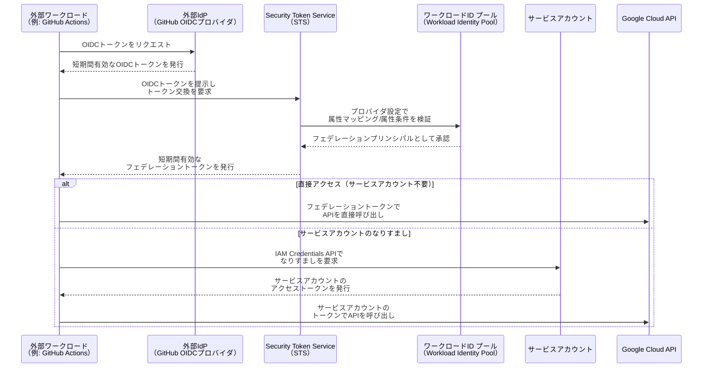
```mermaid
sequenceDiagram
    participant Ext as 外部ワークロード<br/>（例: GitHub Actions）
    participant IdP as 外部IdP<br/>（GitHub OIDCプロバイダ）
    participant STS as Security Token Service<br/>（STS）
    participant Pool as ワークロードID プール<br/>（Workload Identity Pool）
    participant SA as サービスアカウント
    participant API as Google Cloud API

    Ext->>IdP: OIDCトークンをリクエスト
    IdP-->>Ext: 短期間有効なOIDCトークンを発行
    Ext->>STS: OIDCトークンを提示し<br/>トークン交換を要求
    STS->>Pool: プロバイダ設定で<br/>属性マッピング/属性条件を検証
    Pool-->>STS: フェデレーションプリンシパルとして承認
    STS-->>Ext: 短期間有効な<br/>フェデレーショントークンを発行

    alt 直接アクセス（サービスアカウント不要）
        Ext->>API: フェデレーショントークンで<br/>APIを直接呼び出し
    else サービスアカウントのなりすまし
        Ext->>SA: IAM Credentials APIで<br/>なりすましを要求
        SA-->>Ext: サービスアカウントの<br/>アクセストークンを発行
        Ext->>API: サービスアカウントの<br/>トークンでAPIを呼び出し
    end
```

外部IDはSTSでの交換によって`principal://`／`principalSet://`形式のフェデレーションプリンシパルになります。**このプリンシパルに直接IAMロールを付与すれば、サービスアカウントを介さずにGoogle Cloudリソースへアクセスできます**（直接リソースアクセス）。サービスアカウントのなりすましは、フェデレーションプリンシパルを直接サポートしないサービスを利用する場合や、既存のサービスアカウント権限を再利用したい場合の選択肢であり、必須の経路ではありません。

出典: [^13]

**Workload Identity Federationのベストプラクティス**

| ベストプラクティス | 説明 |
| --- | --- |
| GitHubなどマルチテナントIdPとの連携では属性条件を使用する | ワークロードIDプールは外部IDの「ビュー」に過ぎず、設定によっては複数の外部IDが同一のIAMプリンシパルにマッピングされうる。属性条件でなりすまし攻撃のリスクを低減する[^13] |
| ワークロードIDプールの管理を専用プロジェクトに集約する | プール・プロバイダの管理を一元化し、誤設定のリスクを下げる[^13] |
| なりすましを使う場合はSTS APIとIAM Credentials APIのData Accessログを有効化する | サービスアカウントのなりすましを行う構成では、Security Token Service API（`sts.googleapis.com`）とIAM Service Account Credentials API（`iamcredentials.googleapis.com`）のData Accessログを有効化し、トークン交換となりすましの証跡を確保する。**直接リソースアクセスの構成ではなりすましが発生しない**ため、この観点は該当しない[^13] |
| 一意なサブジェクトマッピングを使用する | 外部IDとGoogle Cloudプリンシパルの対応関係を明確にし、非否認性（non-repudiation）のある監査証跡を維持する[^13] |

#### (4) Chrome Enterprise Premium

Chrome Enterprise Premium（旧称BeyondCorp Enterprise）は、BeyondCorpセキュリティモデルに基づき、デバイスの状態やユーザーの文脈に応じて、VPNなしでアプリケーションへの安全なアクセスを実現するソリューションです[^110]。

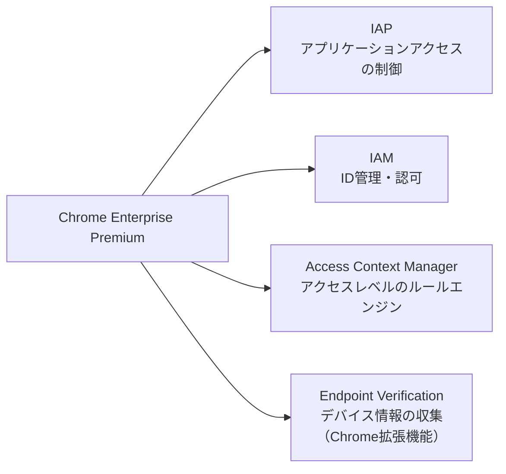
```mermaid
flowchart LR
    CEP["Chrome Enterprise Premium"] --> IAP3["IAP<br/>アプリケーションアクセスの制御"]
    CEP --> IAMc["IAM<br/>ID管理・認可"]
    CEP --> ACM2["Access Context Manager<br/>アクセスレベルのルールエンジン"]
    CEP --> EV["Endpoint Verification<br/>デバイス情報の収集<br/>（Chrome拡張機能）"]
```

出典: [^110]

| 構成する4つの機能 | 役割 |
| --- | --- |
| Identity-Aware Proxy（IAP） | VPNなしで社内アプリケーションへのアクセスを実現するプロキシ |
| IAM | ID管理・認可の基盤 |
| Access Context Manager | デバイス・場所などのきめ細かい条件でアクセスレベルを定義 |
| Endpoint Verification | 暗号化状況・OSバージョン・ユーザー情報などのデバイス属性をChrome拡張機能で収集 |

Chrome Enterprise Premiumを使うことで、例えば「管理対象デバイスかつ最新パッチ適用済みであれば、どのネットワークからでもアクセス許可」「管理者はコーポレートネットワークからのみコンソールにアクセス許可」といったポリシーを実現できます[^110]。

---

### 3.1.8 ソフトウェアサプライチェーンのセキュリティ確保

SolarWinds事件などを契機に、ソースコードからビルド、依存関係、デプロイに至るまでの一連の「ソフトウェアサプライチェーン」全体を保護する重要性が高まっています。Google Cloudでは、SLSA（Supply-chain Levels for Software Artifacts）フレームワークに沿った成熟度モデルと、それを支える一連のサービス群を提供しています[^89]。

#### SLSAフレームワークの成熟度レベル

SLSA v1.2では、レベルが単一の連番ではなく**トラック（track）ごとに定義**されます。ビルド工程を対象とする**Build track（Build L0〜L3）**と、ソース管理工程を対象とする**Source track（Source L1〜L4）**は独立しており、「SLSAレベル3」のようにトラックを省略した表記は曖昧です。必ず`Build L3`のようにトラックを添えて表現します。

**Build track（ビルドの完全性）**

| レベル | 要件の概要 |
| --- | --- |
| Build L0 | 保証なし。SLSAの要件を満たしていない状態 |
| Build L1 | ビルドプロセスが自動化されており、ソース・ビルド手順に関するプロベナンス（来歴情報）メタデータが生成・配布される |
| Build L2 | ホスト型のビルドサービスを使用し、プロベナンスが署名されて改ざんを検出できる |
| Build L3（最高レベル） | ビルド環境が改ざん耐性を持ち、ビルドごとに分離（isolated）され、署名鍵がユーザー定義のビルドステップから隔離される |

**Source track（ソースの完全性）**

| レベル | 要件の概要 |
| --- | --- |
| Source L1 | ソースがバージョン管理され、リビジョンが一意に識別できる |
| Source L2 | ブランチと履歴が保護され、ソースプロベナンスが生成される |
| Source L3 | ソース管理プラットフォームが改ざんに耐性を持ち、検証可能なソースプロベナンスを提供する |
| Source L4（最高レベル） | すべての変更に対する**2名以上のレビュー（two-party review）**を要求する最も厳格なレベル |

出典: [^87]

#### ソフトウェアサプライチェーンを保護するパイプライン

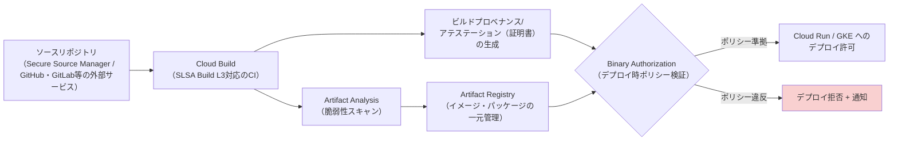
```mermaid
flowchart LR
    Src["ソースリポジトリ<br/>（Secure Source Manager /<br/>GitHub・GitLab等の外部サービス）"] --> Build["Cloud Build<br/>（SLSA Build L3対応のCI）"]
    Build --> Scan["Artifact Analysis<br/>（脆弱性スキャン）"]
    Scan --> AR["Artifact Registry<br/>（イメージ・パッケージの<br/>一元管理）"]
    Build --> Attest["ビルドプロベナンス/<br/>アテステーション（証明書）の生成"]
    Attest --> BinAuthz{"Binary Authorization<br/>（デプロイ時ポリシー検証）"}
    AR --> BinAuthz
    BinAuthz -->|ポリシー準拠| Deploy["Cloud Run / GKE への<br/>デプロイ許可"]
    BinAuthz -->|ポリシー違反| Block["デプロイ拒否 + 通知"]
    style Block fill:#f9d0d0
```

**ソースリポジトリの選択について**：Cloud Source Repositoriesは新規顧客に提供されておらず、これから構築する環境の選択肢にはなりません。既にCloud Source Repositoriesを利用している組織は、**Secure Source Manager**（Google Cloudのマネージドなソース管理サービス）またはGitHub・GitLabなどの外部サービスへ移行することになります。

出典: [^82][^86]

#### 主要コンポーネントの役割

| コンポーネント | 役割 |
| --- | --- |
| Artifact Registry | コンテナイメージやパッケージを一元的に保存・管理するリポジトリ。Cloud Buildなど CI/CDシステムと統合[^83] |
| Artifact Analysis（Container Analysis） | 保存されたイメージを自動・オンデマンドでスキャンし、脆弱性情報や信頼済みメタデータを蓄積[^84] |
| Cloud Build | マネージドCI基盤。SLSA Build L3ビルドを標準でサポートし、VPC Service Controls・分離されたエフェメラルなビルド環境などのセキュリティ機能を備える[^84] |
| Binary Authorization | アテステーション（証明書）に基づく信頼のチェーンを確立・検証・維持するデプロイ時ゲートキーパー。ポリシーに準拠したイメージのみのデプロイを許可する[^86] |
| Assured Open Source Software（Assured OSS） | Googleがキュレーション・テスト済みのOSSパッケージを信頼できる供給源として提供し、依存関係のセキュリティを強化[^84] |

#### Binary Authorizationの2つの動作モード

| モード | 説明 |
| --- | --- |
| モニターモード（Continuous Validation） | 実行中のPodに紐づくコンテナイメージが定義済みポリシーに準拠しているかを定期的に監視し、非準拠の場合はCloud Loggingにログを記録する（Preview機能）[^86] |
| エンフォースモード | デプロイ時にポリシーを強制適用し、アテステーションがポリシーの基準を満たさないイメージのデプロイをブロックする[^86] |

#### ソフトウェアサプライチェーンセキュリティのベストプラクティス

| ベストプラクティス | 説明 |
| --- | --- |
| ビルドプロセスを完全に自動化する | 手動ビルドを排除し、Cloud Buildのようなホスト型CIで検証可能なプロベナンスを生成することがSLSA準拠の出発点となる[^89] |
| 本番デプロイは中央管理されたリポジトリからのみ許可する | 開発・検証環境では開発者に裁量を与えつつ、本番環境ではBinary Authorizationで承認済みイメージのみのデプロイを強制する[^83] |
| 依存関係にもスキャンと信頼済みソースを適用する | Assured OSSを活用し、サプライチェーンの上流（OSS依存関係）まで含めてリスクを低減する[^84] |
| ビルド環境自体もセキュアにする | Cloud Workstationsを用いて、VPC Service Controls・プライベートIngress/Egressで保護された開発環境を提供し、開発ライフサイクルの左側（shift-left）からセキュリティを組み込む[^82] |

---

### 3.1.9 AIのセキュリティ確保

生成AI・エージェント型AIの普及に伴い、プロンプトインジェクション、機密情報の漏えい、有害コンテンツ生成といった従来のアプリケーションセキュリティでは想定されていなかった新たなリスクへの対応が求められています。

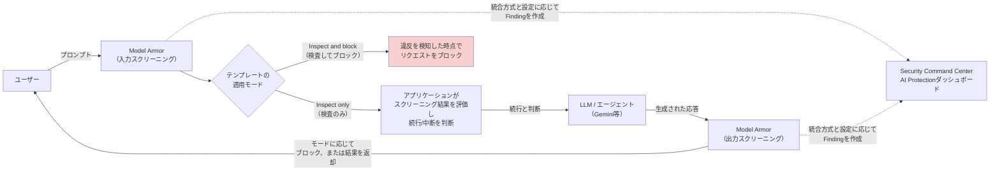
```mermaid
flowchart LR
    User["ユーザー"] -->|プロンプト| MA1["Model Armor<br/>（入力スクリーニング）"]
    MA1 --> Mode{"テンプレートの<br/>適用モード"}
    Mode -->|Inspect only<br/>（検査のみ）| App["アプリケーションが<br/>スクリーニング結果を評価し<br/>続行/中断を判断"]
    Mode -->|Inspect and block<br/>（検査してブロック）| Blk["違反を検知した時点で<br/>リクエストをブロック"]
    App -->|続行と判断| LLM["LLM / エージェント<br/>（Gemini等）"]
    LLM -->|生成された応答| MA2["Model Armor<br/>（出力スクリーニング）"]
    MA2 -->|モードに応じて<br/>ブロック、または結果を返却| User
    MA1 -.->|統合方式と設定に応じて<br/>Findingを作成| SCC["Security Command Center<br/>AI Protectionダッシュボード"]
    MA2 -.->|統合方式と設定に応じて<br/>Findingを作成| SCC
    style Blk fill:#f9d0d0
```

出典: [^99]

#### (1) Model Armor

Model Armorは、LLMのプロンプトと応答の両方をリアルタイムでスクリーニングするマネージドサービスです。特定のモデルやクラウドに依存せず、マルチクラウド・マルチモデル環境でも利用できます[^95]。

**常にブロックするわけではない点に注意が必要です。** テンプレートの適用モードには「Inspect only（検査のみ）」と「Inspect and block（検査してブロック）」があります。汎用のスクリーニングAPI（`sanitizeUserPrompt` / `sanitizeModelResponse`）を直接呼び出す構成では、Model Armorは検査結果を返すだけであり、**その結果を受けて処理を続行するか中断するかはアプリケーション側の実装責任**です。Security Command Centerへの検出結果（Finding）の作成も自動的に常時行われるわけではなく、統合方式（インライン統合か汎用APIか）と設定に依存します。

| 5つの主要機能 | 内容 |
| --- | --- |
| プロンプトインジェクション・ジェイルブレイク検知 | LLMに指示や安全フィルタを無視させようとする操作を検知・ブロック[^92] |
| 機密データ保護 | プロンプトと応答の双方でPII・財務情報・認証情報などの漏えいを検知・防止（Sensitive Data Protectionと連携）[^92] |
| 悪意あるURL検知 | プロンプト・応答内のフィッシング・悪意あるリンクをスキャン[^92] |
| コンテンツ安全フィルタ | ヘイトスピーチ、ハラスメント、性的表現、危険なトピックなどをきめ細かく制御[^93] |
| Responsible AI信頼度しきい値 | アプリケーションの文脈やリスク許容度に応じて、検知の確信度しきい値を調整可能[^93] |

**フロア設定（Floor Settings）**によって、Model Armorテンプレートが満たすべき組織全体の最低限のセキュリティ・安全基準を、組織またはフォルダレベルで一元的に強制できます[^92]。

#### (2) Sensitive Data Protection（旧Cloud DLP）

Sensitive Data Protectionは、構造化・非構造化データの両方から機密情報を発見・分類・秘匿化するプラットフォームです。Model Armorの機密データ保護機能の内部でも利用されています[^99]。

| 機能 | 内容 |
| --- | --- |
| 検査（Inspect） | 200種類以上の組み込みInfoType検出器（クレジットカード番号、SSN等）に加え、辞書・正規表現・文脈要素によるカスタムInfoTypeを定義可能[^101] |
| 秘匿化（De-identify） | マスキング、リダクション（削除）、バケット化、日付シフト、トークン化（形式保持暗号化）などの手法で機密要素を変換[^103] |
| 再識別（Re-identify） | 可逆的な変換方式を用いた場合、認可されたプロセスでのみ元の値へ復元可能[^107] |
| リスク分析 | BigQueryの構造化データを分析し、再識別リスクを可視化[^100] |

```mermaid
flowchart TD
    Data["生データ<br/>（BigQuery / Cloud Storage / ストリーム）"] --> Inspect["検査ジョブ<br/>InfoType検出"]
    Inspect --> Findings["検出結果<br/>（種類・確信度・位置）"]
    Findings --> Deidentify["秘匿化<br/>マスキング/トークン化/日付シフト"]
    Deidentify --> Safe["秘匿化済みコピー<br/>（AI学習・分析等に利用可能）"]
```

出典: [^100][^103]

#### (3) セキュアなモデルデプロイ

AIモデルそのものを保護するための考慮事項も、Section 3の範囲に含まれます。

| 観点 | 実践方法 |
| --- | --- |
| デプロイパイプラインの保護 | モデルアーティファクトもコンテナイメージと同様にArtifact Registryで管理し、Binary Authorizationでポリシー準拠を検証する（[3.1.8](#318-ソフトウェアサプライチェーンのセキュリティ確保)参照） |
| モデルエンドポイントへのアクセス制御 | IAM・VPC Service Controls・IAPを用いて、モデル推論エンドポイントへのアクセスを最小権限かつコンテキストアウェアに制御する |
| トレーニングデータの保護 | Sensitive Data Protectionで学習データセットから機密情報を事前に秘匿化し、モデルが機密情報を記憶・再現するリスクを低減する |
| 実行時の入出力スクリーニング | Model Armorをアプリケーション層またはAPI Gateway（Apigee等）に組み込み、本番運用中も継続的にプロンプト・応答を保護する |

---

## 3.2 コンプライアンスの設計

クラウドアーキテクトは、技術的なセキュリティ制御だけでなく、業界規制・法令に準拠したアーキテクチャを設計する責任も担います。ここで鍵となる考え方が**共有責任モデル（Shared Responsibility Model）**です。

```mermaid
flowchart TD
    subgraph Google["Googleの責任範囲"]
        G1["物理的なデータセンターのセキュリティ"]
        G2["インフラストラクチャの<br/>ハードウェア・ソフトウェア"]
        G3["Google Cloudサービス自体の<br/>コンプライアンス認証取得"]
    end
    subgraph Shared["共有の責任範囲"]
        S1["ネットワーク制御の一部設定"]
        S2["ID・アクセス管理の一部設定"]
    end
    subgraph Customer["顧客の責任範囲"]
        C1["データの分類・取り扱い"]
        C2["IAM・組織ポリシーの設定"]
        C3["自社サービスとしての<br/>コンプライアンス適合性の証明"]
        C4["アプリケーションレベルの<br/>セキュリティ実装"]
    end
```

出典: [^153]

Googleは自社サービスのコンプライアンス認証取得やセキュリティ機能の提供を担いますが、それらの機能を**どう構成し、どう運用するか**は顧客の責任です。これは「共有ファイト（Shared Fate）」という考え方にも発展しており、Googleは単なる責任分界点の提示にとどまらず、ベストプラクティス・ブループリント・自動化ツールを通じて顧客のセキュリティ達成を積極的に支援します[^153]。

### 3.2.1 法令・規制

試験ガイドが例示する法令・規制領域は「健康記録のプライバシー」「児童のプライバシー」「データプライバシー」「データ所有権」「データ主権」です。

| 規制領域 | 代表的な法令・要件 | Google Cloudの対応 |
| --- | --- | --- |
| 健康記録のプライバシー | 米国 HIPAA（Health Insurance Portability and Accountability Act） | Business Associate Agreement（BAA）の締結により、対象サービスでのPHI（保護対象保健情報）取り扱いをサポート。ただしHIPAA準拠の認定制度自体は存在せず、責任共有モデルの下で顧客が最終的な準拠責任を負う[^136][^138] |
| 児童のプライバシー | 米国 COPPA（Children's Online Privacy Protection Act）等 | 児童データを扱うサービス設計では、同意取得・データ収集最小化などの要件をアプリケーション層で実装する必要がある（Googleのプラットフォーム機能はこれを支援するが、準拠の主体は顧客） |
| データプライバシー | EU GDPR（General Data Protection Regulation）等 | Cloud Data Processing Addendum（DPA）、Sensitive Data Protectionによるデータ最小化・秘匿化、Assured Workloadsによる地域データ境界の実現 |
| データ所有権 | 契約上のデータ所有権の明確化 | Google Cloudの利用規約において、顧客データの所有権は顧客に帰属することが明記されている |
| データ主権 | 特定国・地域内でのデータ保存・処理・運用の主権確保 | Assured Workloads（後述）による、リージョン制限・人員アクセス制限・鍵管理の主権対応 |

#### データ主権とAssured Workloads

Assured Workloadsは、規制の厳しいワークロード向けに、データ常駐地（residency）・人員アクセス・暗号鍵管理の境界を、事前定義された「コントロールパッケージ」としてフォルダ単位で適用する仕組みです[^126]。

```mermaid
flowchart TD
    A["Assured Workloadsフォルダを作成"] --> B["コントロールパッケージを選択"]
    B --> C1["地域データ境界<br/>（Regional Data Boundary）"]
    B --> C2["規制データ境界<br/>（Regulatory Data Boundary）"]
    B --> C3["パートナーによる主権制御<br/>（Sovereign Controls by Partners）"]
    C1 --> D["組織ポリシー制約が<br/>自動適用され、<br/>フォルダ配下の全リソースに<br/>ガードレールが及ぶ"]
    C2 --> D
    C3 --> D
```

出典: [^128]

| コントロールパッケージの種類 | 提供する制御 |
| --- | --- |
| 地域データ境界 | データ常駐地要件を満たすため、リソースの保存地理的範囲を制限。一部のパッケージではGoogleのデータアクセス自体への独立した承認制御も提供[^128] |
| 規制データ境界 | 特定の規制・コンプライアンス法令の要件を満たすよう調整された、認証済みの制御セット[^128] |
| パートナーによる主権制御 | データ常駐地・人員制御・地域サポートに加え、Cloud External Key Manager（Cloud EKM）・Cloud HSM・Key Access Justificationsといった強化されたデータ主権制御を提供[^128] |

---

### 3.2.2 商用データの取り扱い

試験ガイドでは「クレジットカード情報の取り扱い」や「PII（個人を特定できる情報）」が商用データの例として挙げられています。

#### PCI DSS（クレジットカード情報）

PCI DSS（Payment Card Industry Data Security Standard）は、カード会員データを扱うすべての事業者に適用される業界標準です。クラウド環境における責任は、Googleと顧客の間で明確に分担されます[^155]。

```mermaid
flowchart TD
    PCI["PCI DSS要件"] --> Google2["Googleが単独で<br/>責任を負う要件<br/>（QSAにより検証済み）"]
    PCI --> Shared2["顧客とGoogleの<br/>共有責任となる要件"]
    PCI --> Customer2["顧客が単独で<br/>責任を負う要件<br/>（GCPの範囲外）"]
    Google2 --> G2ex["例: データセンターの<br/>物理セキュリティ"]
    Shared2 --> Sex["例: 暗号鍵の管理、<br/>脆弱性管理プロセス"]
    Customer2 --> Cex["例: アプリケーション層の<br/>カード会員データの取り扱い"]
```

出典: [^155][^156]

| 実装レイヤー | PCI DSS対応における主な検討事項 |
| --- | --- |
| リソース階層とIAM | カード会員データ環境（CDE）を独立したプロジェクト/フォルダに分離し、アクセスを最小権限で制御[^154] |
| ネットワーク | VPC・階層ファイアウォールポリシー・Cloud Armorで、CDEとその他のネットワークセグメントを分離[^154] |
| データ保護 | Sensitive Data Protection（旧Cloud DLP）でカード会員データを検出・秘匿化し、意図しない保存・伝播を防止[^154] |
| アクセス制御・可観測性 | IAP・Security Command Centerで、CDEへのアクセスを可視化・制御[^154] |

#### PII（個人を特定できる情報）の取り扱い

PIIの取り扱いにおいては、Sensitive Data Protectionによる「検出 → 分類 → 秘匿化」のワークフローが中核となります（詳細は[3.1.9](#319-aiのセキュリティ確保)）。加えて、次のような設計上の考慮が求められます。

| 考慮事項 | 実践方法 |
| --- | --- |
| データ収集の最小化 | 業務上必要なPIIのみを収集・保存する設計をアプリケーション層で徹底する |
| 匿名化・仮名化の使い分け | 分析用途にはトークン化（仮名化、可逆）またはバケット化（匿名化、不可逆）を用途に応じて選択する |
| アクセスの追跡可能性 | Data Accessログを有効化し、誰がPIIにアクセスしたかを監査可能にする |

---

### 3.2.3 業界認証

Google Cloudは、第三者機関による監査を通じて幅広い業界標準への準拠を継続的に証明しています。試験ガイドはSOC 2を例示していますが、実務ではISO/IEC認証群との組み合わせで理解しておくことが重要です。

| 認証・レポート | 概要 |
| --- | --- |
| SOC 2（Service Organization Controls 2） | AICPA（米国公認会計士協会）のTrust Services Criteria（セキュリティ、可用性、処理の整合性、機密性、プライバシー）に基づき、第三者監査人が統制の有効性を評価したレポート[^122] |
| SOC 1 / SOC 3 | SOC 1は財務報告に関連する統制、SOC 3はSOC 2の一般公開向けサマリー版[^119] |
| ISO/IEC 27001 | 情報セキュリティマネジメントシステム（ISMS）の国際規格 |
| ISO/IEC 27017 | クラウドサービスに特化した情報セキュリティ管理策 |
| ISO/IEC 27018 | クラウド上の個人情報（PII）保護に特化した管理策 |
| ISO/IEC 27701 | プライバシー情報マネジメントシステム（PIMS）の拡張規格 |
| PCI DSS | [3.2.2](#322-商用データの取り扱い)を参照 |
| FedRAMP | 米国政府機関向けクラウドサービスのセキュリティ認証制度 |

出典: [^117][^120]

```mermaid
flowchart TD
    Audit["第三者監査機関による評価"] --> SOC["SOC 1 / 2 / 3<br/>（AICPA SSAE 18準拠）"]
    Audit --> ISO["ISO/IEC 27001/17/18/701<br/>（情報セキュリティ/<br/>クラウド/プライバシー）"]
    Audit --> PCI2["PCI DSS<br/>（カード会員データ）"]
    Audit --> FedRAMP["FedRAMP<br/>（米国政府機関向け）"]
    SOC --> CRM["Compliance Reports Manager<br/>で顧客がオンデマンドに<br/>証跡を取得可能"]
    ISO --> CRM
```

出典: [^121]

コンプライアンス担当者・アーキテクトは、**Compliance resource center**および**Compliance Reports Manager**を通じて、最新のISO証明書・SOCレポート・自己評価資料を追加費用なしで取得できます[^120][^121]。

---

### 3.2.4 監査（ログを含む）

コンプライアンスにおける「監査」は、顧客自身の操作記録に加え、**Google人員による顧客データへのアクセス記録**まで含めて考える必要があります。

ただし、これらの仕組みが記録できる範囲には次の前提があり、「あらゆる操作が自動的に残る」わけではありません。

| 前提 | 内容 |
| --- | --- |
| 対応サービスの範囲 | Cloud Audit Logs・Access Transparencyのいずれも、対応しているサービスの操作のみが記録される。未対応のサービスは記録対象外となる |
| 明示的な有効化 | Access Transparencyは対象の課金アカウント／サポートプランを満たしたうえで有効化する必要がある。Data Access audit logsはBigQueryを除き**既定で無効**で、サービスごとに有効化しなければ記録されない |
| 保存先と保持期間 | ログはCloud Loggingのログバケットに保存され、保持期間はバケット設定に従う（`_Default`は標準30日、`_Required`は400日で変更不可）。監査要件がこれを超える場合は保持期間の延長かシンクによるエクスポートが必要 |

```mermaid
flowchart TD
    subgraph CustomerAudit["顧客側の操作の監査"]
        CAL["Cloud Audit Logs<br/>（Admin Activity / Data Access /<br/>System Event / Policy Denied）"]
    end
    subgraph GoogleAudit["Google人員によるアクセスの監査"]
        AT["Access Transparency<br/>（いつ・誰が・なぜアクセスしたかを記録）"]
        AA["Access Approval<br/>（アクセス要求を顧客が事前承認）"]
    end
    CAL --> SIEM["SIEM/セキュリティ運用<br/>への統合"]
    AT --> SIEM
    AA -.->|承認/拒否の判断| AT
```

出典: [^170][^175]

| 機能 | 目的 | 特徴 |
| --- | --- | --- |
| Cloud Audit Logs | 顧客組織内のメンバー（人・サービスアカウント）による操作を記録 | 詳細は[3.1.5](#315-セキュリティ制御監査vpc-service-controlsコンテキストアウェアアクセス組織ポリシー階層ファイアウォールポリシー)を参照 |
| Access Transparency | Google従業員が顧客データにアクセスした際の操作（対象リソース・アクション・理由・アクセス者の所在地や職種等）を記録 | サポート対応・障害対応など正当な業務理由でのアクセスであることを検証する目的で利用[^170] |
| Access Approval | Google従業員による顧客データへのアクセス要求について、顧客が事前に承認・拒否を行う仕組み | 「顧客対応起因（CUSTOMER_INITIATED_SUPPORT）」など特定の正当化理由を持つリクエストのみを許可するといった運用が可能[^171] |
| Key Access Justifications | CMEKで保護されたデータへのアクセス要求ごとに、その正当化理由を可視化・制御 | 主権要件が特に厳しいAssured Workloadsのコントロールパッケージと組み合わせて利用[^175] |

#### 監査対応のベストプラクティス

| ベストプラクティス | 説明 |
| --- | --- |
| Cloud Audit LogsとAccess Transparencyを併用する | 顧客側の操作とGoogle側のアクセスの両方を記録し、両者の対応サービス範囲内で監査証跡を確保する。監査要件と対応サービスの差分は、事前に洗い出して代替統制を検討する[^170] |
| SIEMへログを統合する | Access TransparencyログをSIEMに取り込み、Security Command Centerの検出結果と突き合わせて分析する[^170] |
| Access Approvalで緊急アクセスの取り扱いを明確化する | 緊急時のアクセスも「自動承認済み」ステータスとして記録され、監査の連続性が保たれる設計になっている[^171] |
| Assured Workloadsと組み合わせて主権要件に対応する | より高いデータ管理要件がある場合は、Access Transparency/Access Approval単体ではなくAssured Workloadsの利用を検討する[^171] |

---

## Well-Architected Frameworkセキュリティピラーとの関係

公式Exam Guideの序文にあるとおり、Well-Architected Frameworkの6本柱（運用の卓越性・セキュリティ・信頼性・パフォーマンス最適化・コスト最適化・持続可能性）は試験全体に暗黙的・明示的に織り込まれています[^1]。特に「セキュリティ、プライバシー、コンプライアンス」ピラーはSection 3と直接対応しており、その中核原則は本ガイドで扱った各機能と次のように対応します[^163]。

| WAFセキュリティピラーの原則 | 本ガイドでの対応セクション |
| --- | --- |
| セキュリティ・バイ・デザインを実装する（設計段階からセキュリティを組み込む） | [3.1.1](#311-identity-and-access-managementiam) IAM、[3.1.2](#312-リソース階層組織フォルダプロジェクト) リソース階層 |
| ゼロトラストを実装する（「決して信頼せず、常に検証する」） | [3.1.7](#317-セキュアなリモートアクセス) セキュアなリモートアクセス |
| シフトレフト・セキュリティを実装する（開発ライフサイクル早期からの統制） | [3.1.8](#318-ソフトウェアサプライチェーンのセキュリティ確保) ソフトウェアサプライチェーン |
| 多層防御を実装する | [3.1.5](#315-セキュリティ制御監査vpc-service-controlsコンテキストアウェアアクセス組織ポリシー階層ファイアウォールポリシー) セキュリティ制御群 |
| データを保護する（暗号化・分類・秘匿化） | [3.1.3](#313-データセキュリティ鍵管理暗号化シークレット管理)・[3.1.6](#316-cloud-kmsによる顧客管理暗号鍵cmekの管理) データセキュリティ・CMEK |
| コンプライアンス・プライバシー要件と整合させる | [3.2](#32-コンプライアンスの設計) コンプライアンスの設計全般 |

出典: [^162][^163]

---

## 学習チェックリスト

以下は本セクションの理解度を自己確認するためのチェックリストです。すべて自信を持って説明できる状態を目指してください。

- [ ] IAMのプリンシパル・ロール・許可ポリシー・拒否ポリシー・条件の違いを説明できる
- [ ] 基本ロール・事前定義ロール・カスタムロールの使い分けと、基本ロールが推奨されない理由を説明できる
- [ ] リソース階層（組織・フォルダ・プロジェクト）の継承の仕組みと、フォルダ設計のベストプラクティスを説明できる
- [ ] CMEK・CSEK・Cloud EKM・デフォルト暗号化の違いと、それぞれを選択する基準を説明できる
- [ ] 封筒暗号化（KEKとDEK）の仕組みを図で説明できる
- [ ] Secret ManagerとCloud KMSの役割の違いを説明できる
- [ ] 職務分掌の考え方と、Cloud KMSの集中管理モデル/委任管理モデルの違いを説明できる
- [ ] Cloud Audit Logsの4種類（Admin Activity、Data Access、System Event、Policy Denied）の違いとデフォルトの有効化状況を説明できる
- [ ] VPC Service ControlsがIAMと独立した防御レイヤーとして機能する理由を説明できる
- [ ] コンテキストアウェアアクセス（IAP + Access Context Manager）の仕組みを説明できる
- [ ] 組織ポリシーサービスと階層ファイアウォールポリシーの違いと、それぞれの継承ルールを説明できる
- [ ] Cloud KMS Autokeyが手動プロビジョニングと比べて何を自動化するかを説明できる
- [ ] サービスアカウントキーのエクスポートよりも、なりすまし（Impersonation）とWorkload Identity Federationが推奨される理由を説明できる
- [ ] Chrome Enterprise Premiumを構成する4つの機能を挙げられる
- [ ] SLSAフレームワークの目的と、Binary Authorizationがどのようにデプロイ時のゲートキーパーとして機能するかを説明できる
- [ ] Model ArmorとSensitive Data Protectionの役割分担を説明できる
- [ ] 共有責任モデルにおける、Google・共有・顧客それぞれの責任範囲の考え方を説明できる
- [ ] Assured Workloadsの3種類のコントロールパッケージ（地域データ境界・規制データ境界・パートナーによる主権制御）を説明できる
- [ ] HIPAAには公式な認証・認定制度が存在せず、BAAの締結と責任共有モデルの下で顧客が最終的な準拠責任を負うことを説明できる
- [ ] PCI DSSはHIPAAと異なり、QSAによる評価とROC／SAQという正式な評価制度が存在すること、およびGoogleと顧客の責任分担（責任共有マトリクス）を説明できる
- [ ] Cloud Audit LogsとAccess Transparency / Access Approvalの違いを説明できる

---

## 参考文献

本ガイドの内容は、以下の一次情報源（Google Cloud公式ドキュメント・公式ブログ）を主軸に、技術検証を行った上で作成しています。

**公式試験情報**

[^1]: [Professional Cloud Architect Certification exam guide (PDF)](https://services.google.com/fh/files/misc/professional_cloud_architect_exam_guide_english.pdf) — Google Cloud

**IAM**

[^7]: [Using resource hierarchy for access control](https://docs.cloud.google.com/iam/docs/resource-hierarchy-access-control) — Google Cloud Documentation
[^12]: [Best practices for Privileged Access Manager](https://docs.cloud.google.com/iam/docs/pam-best-practices) — Google Cloud Documentation
[^13]: [Best practices for using Workload Identity Federation](https://docs.cloud.google.com/iam/docs/best-practices-for-using-workload-identity-federation) — Google Cloud Documentation
[^14]: [Best practices for using service accounts securely](https://docs.cloud.google.com/iam/docs/best-practices-service-accounts) — Google Cloud Documentation
[^18]: [GCP IAM Best Practices: A Guide To IAM On Google Cloud](https://www.d3vtech.com/insights/gcp-iam-best-practices-a-guide-to-iam-on-google-cloud/) — d3v Technology Solutions
[^21]: [Using resource hierarchy for access control](https://docs.cloud.google.com/iam/docs/resource-hierarchy-access-control) — Google Cloud Documentation
[^151]: [Scaling the IAM mountain: An in-depth guide to identity in Google Cloud](https://cloud.google.com/blog/products/identity-security/scaling-the-iam-mountain-an-in-depth-guide-to-identity-in-google-cloud) — Google Cloud Blog

**リソース階層**

[^23]: [About resource hierarchy](https://docs.cloud.google.com/resource-manager/docs/cloud-platform-resource-hierarchy) — Resource Manager, Google Cloud Documentation
[^25]: [Create folders](https://docs.cloud.google.com/resource-manager/docs/creating-managing-folders) — Resource Manager, Google Cloud Documentation
[^26]: [Organize resources](https://docs.cloud.google.com/docs/get-started/organize-resources) — Google Cloud Documentation

**データセキュリティ・Cloud KMS・Secret Manager**

[^30]: [Best practices for using CMEKs](https://docs.cloud.google.com/kms/docs/cmek-best-practices) — Cloud Key Management Service, Google Cloud Documentation
[^32]: [Customer-managed encryption keys (CMEK)](https://docs.cloud.google.com/kms/docs/cmek) — Cloud Key Management Service, Google Cloud Documentation
[^33]: [Cloud Key Management Service encryption](https://docs.cloud.google.com/docs/security/key-management-deep-dive) — Security, Google Cloud Documentation
[^35]: [Cloud Key Management Service overview](https://docs.cloud.google.com/kms/docs/key-management-service) — Google Cloud Documentation
[^37]: [How to Use Customer-Managed Encryption Keys Across All Google Cloud Services](https://oneuptime.com/blog/post/2026-02-17-how-to-implement-customer-managed-encryption-keys-across-all-google-cloud-services/view) — OneUptime Blog
[^38]: [Secret Manager best practices](https://docs.cloud.google.com/secret-manager/docs/best-practices) — Google Cloud Documentation
[^41]: [Google Cloud Secret Manager: Complete Tutorial](https://computingforgeeks.com/google-cloud-secret-manager-tutorial/) — ComputingForGeeks
[^42]: [Secret Manager overview](https://docs.cloud.google.com/secret-manager/docs/overview) — Google Cloud Documentation
[^44]: [Secret Manager best practices (regional secrets)](https://docs.cloud.google.com/secret-manager/regional-secrets/best-practices-rs) — Google Cloud Documentation
[^146]: [Separation of duties](https://docs.cloud.google.com/kms/docs/separation-of-duties) — Cloud Key Management Service, Google Cloud Documentation

**セキュリティ制御（監査・VPC Service Controls・コンテキストアウェアアクセス・組織ポリシー・ファイアウォールポリシー）**

[^46]: [Overview of VPC Service Controls](https://docs.cloud.google.com/vpc-service-controls/docs/overview) — Google Cloud Documentation
[^49]: [Just say no: Build defense in depth with IAM Deny and Org Policies](https://cloud.google.com/blog/products/identity-security/just-say-no-build-defense-in-depth-with-iam-deny-and-org-policies) — Google Cloud Blog
[^51]: [Service perimeter details and configuration](https://docs.cloud.google.com/vpc-service-controls/docs/service-perimeters) — VPC Service Controls, Google Cloud Documentation
[^55]: [Identity-Aware Proxy overview](https://docs.cloud.google.com/iap/docs/concepts-overview) — Google Cloud Documentation
[^57]: [Protecting your cloud VMs with Cloud IAP context-aware access controls](https://cloud.google.com/blog/products/identity-security/protecting-your-cloud-vms-with-cloud-iap-context-aware-access-controls) — Google Cloud Blog
[^58]: [Setting up context-aware access with Identity-Aware Proxy](https://docs.cloud.google.com/iap/docs/cloud-iap-context-aware-access-howto) — Google Cloud Documentation
[^64]: [Hierarchical firewall policies](https://docs.cloud.google.com/firewall/docs/firewall-policies) — Cloud Next Generation Firewall, Google Cloud Documentation
[^65]: [Create hierarchical firewall policies and rules](https://cloud.google.com/firewall/docs/using-firewall-policies) — Google Cloud Documentation
[^67]: [Organization Policy overview](https://docs.cloud.google.com/organization-policy/overview) — Google Cloud Documentation
[^69]: [Organization policy constraints](https://docs.cloud.google.com/organization-policy/reference/org-policy-constraints) — Organization Policy, Google Cloud Documentation
[^70]: [How to Create Hierarchical Firewall Policies at the Organization Level](https://oneuptime.com/blog/post/2026-02-17-how-to-create-hierarchical-firewall-policies-at-the-organization-level-on-google-cloud/view) — OneUptime Blog
[^73]: [Google Cloud Audit Logs](https://docs.datadoghq.com/integrations/google-cloud-audit-logs/) — Datadog Documentation
[^74]: [Cloud Audit Logs overview](https://docs.cloud.google.com/logging/docs/audit) — Cloud Logging, Google Cloud Documentation
[^79]: [GCP Cloud Audit Logs Explained: Types, Retention, and Use Cases](https://cloudwebschool.com/docs/gcp/security/cloud-audit-logs/) — CloudWebSchool
[^80]: [GCP Log Types Explained: Audit Logs, VPC Flow Logs, Firewall Logs, and Application Logs](https://cloudwebschool.com/docs/gcp/security/log-types-in-gcp/) — CloudWebSchool
[^148]: [Just say no: Build defense in depth with IAM Deny and Org Policies](https://cloud.google.com/blog/products/identity-security/just-say-no-build-defense-in-depth-with-iam-deny-and-org-policies) — Google Cloud Blog

**職務分掌**

[^145]: [Identity and security: Identity and access governance](https://cloud.google.com/blog/products/identity-security/achieving-identity-and-access-governance-on-google-cloud/) — Google Cloud Blog
[^150]: [Enforce Separation of Duties for Service-Account Related Roles](https://www.trendmicro.com/cloudoneconformity/knowledge-base/gcp/CloudIAM/enforce-separation-of-duties-for-service-account-roles.html) — Trend Micro Cloud One Conformity

**セキュアなリモートアクセス**

[^109]: [BeyondCorp Zero Trust Enterprise Security](https://cloud.google.com/beyondcorp?hl=en) — Google Cloud
[^110]: [Chrome Enterprise Premium access protection overview](https://docs.cloud.google.com/chrome-enterprise-premium/docs/access-protection) — Google Cloud Documentation

**ソフトウェアサプライチェーンのセキュリティ**

[^82]: [Software supply chain security](https://docs.cloud.google.com/software-supply-chain-security/docs/overview) — Google Cloud Documentation
[^83]: [Securing Cloud Run Deployments with Binary Authorization](https://cloud.google.com/blog/topics/developers-practitioners/securing-cloud-run-deployments-binary-authorization/) — Google Cloud Blog
[^84]: [Software supply chain security](https://cloud.google.com/security/solutions/software-supply-chain-security) — Google Cloud
[^86]: [Binary Authorization overview](https://docs.cloud.google.com/binary-authorization/docs/overview) — Google Cloud Documentation
[^87]: [Unlocking SLSA Level 3 — A Practical Guide for Google Cloud Platform](https://medium.com/meghgen/unlocking-slsa-level-3-a-practical-guide-for-google-cloud-platform-3f4bf40b2258) — MeghGen, Medium
[^89]: [Google introduces SLSA framework](https://cloud.google.com/blog/products/application-development/google-introduces-slsa-framework) — Google Cloud Blog

**AIのセキュリティ**

[^92]: [How Model Armor can help protect your AI apps](https://cloud.google.com/blog/products/identity-security/how-model-armor-can-help-protect-your-ai-apps) — Google Cloud Blog
[^93]: [Model Armor](https://cloud.google.com/security/products/model-armor) — Google Cloud
[^95]: [Shielding Your AI Models: A Dive into Google Cloud Model Armor for Securing LLMs](https://azeezz.medium.com/shielding-your-ai-models-a-dive-into-google-cloud-model-armor-for-securing-llms-3f92ba2a66cd) — Medium
[^99]: [Model Armor overview](https://docs.cloud.google.com/security-command-center/docs/model-armor-overview) — Security Command Center, Google Cloud Documentation
[^100]: [Sensitive Data Protection overview](https://docs.cloud.google.com/sensitive-data-protection/docs/sensitive-data-protection-overview) — Google Cloud Documentation
[^101]: [Sensitive Data Protection documentation](https://docs.cloud.google.com/sensitive-data-protection/docs) — Google Cloud Documentation
[^103]: [De-identifying sensitive data](https://docs.cloud.google.com/sensitive-data-protection/docs/deidentify-sensitive-data) — Sensitive Data Protection, Google Cloud Documentation
[^107]: [Google Cloud DLP — A Practitioner's Guide to Securing Sensitive Data](https://medium.com/devsecops-ai/google-cloud-dlp-a-practitioners-guide-to-securing-sensitive-data-bcb5e74e6d4f) — Medium

**コンプライアンス — 全般・法令規制・データ主権**

[^117]: [Trust Center - Security and Compliance](https://cloud.google.com/trust-center) — Google Cloud
[^119]: [Data Protection Law Compliance](https://business.safety.google/compliance/) — Google Safety Center
[^120]: [Cloud compliance and regulations resources](https://cloud.google.com/compliance?hl=en) — Google Cloud
[^121]: [Compliance reports manager](https://cloud.google.com/security/compliance/compliance-reports-manager) — Google Cloud
[^122]: [SOC 2: compliance](https://cloud.google.com/security/compliance/soc-2) — Google Cloud
[^126]: [Overview of Assured Workloads](https://docs.cloud.google.com/assured-workloads/docs/overview) — Google Cloud Documentation
[^128]: [Control packages | Assured Workloads](https://docs.cloud.google.com/assured-workloads/docs/control-packages) — Google Cloud Documentation
[^136]: [HIPAA Compliance on Google Cloud](https://cloud.google.com/security/compliance/hipaa) — Google Cloud
[^138]: [HIPAA - Compliance](https://cloud.google.com/security/compliance/hipaa-compliance) — Google Cloud
[^153]: [Shared responsibilities and shared fate on Google Cloud](https://docs.cloud.google.com/architecture/framework/security/shared-responsibility-shared-fate) — Cloud Architecture Center, Google Cloud Documentation

**コンプライアンス — 商用データ・PCI DSS**

[^154]: [PCI DSS compliance on GKE](https://docs.cloud.google.com/architecture/pci-dss-and-gke-guide) — Cloud Architecture Center, Google Cloud Documentation
[^155]: [PCI DSS - Compliance](https://cloud.google.com/security/compliance/pci-dss) — Google Cloud
[^156]: [Google Cloud Platform: PCI DSS v4.0.1 Shared Responsibility Matrix (PDF)](https://services.google.com/fh/files/misc/gcp_pci_dss_v4_responsibility_matrix.pdf) — Google Cloud

**Well-Architected Framework**

[^162]: [Implement security by design](https://docs.cloud.google.com/architecture/framework/security/implement-security-by-design) — Cloud Architecture Center, Google Cloud Documentation
[^163]: [Well-Architected Framework: Security, privacy, and compliance pillar](https://docs.cloud.google.com/architecture/framework/security) — Cloud Architecture Center, Google Cloud Documentation

**監査（Access Transparency / Access Approval）**

[^170]: [Overview of Access Transparency](https://docs.cloud.google.com/assured-workloads/access-transparency/docs/overview) — Google Cloud Documentation
[^171]: [Understanding and using Access Transparency logs](https://cloud.google.com/cloud-provider-access-management/access-transparency/docs/reading-logs) — Google Cloud Documentation
[^175]: [Access Approval audit logging information](https://docs.cloud.google.com/assured-workloads/access-approval/docs/audit-logging) — Google Cloud Documentation

---

*本ガイドは学習補助を目的として作成されています。試験の出題範囲・配点は変更される可能性があるため、必ず[公式Exam Guide](https://services.google.com/fh/files/misc/professional_cloud_architect_exam_guide_english.pdf)および[公式認定ページ](https://cloud.google.com/learn/certification/cloud-architect)で最新情報をご確認ください。*
