# Google Cloud Professional Cloud Architect認定試験 Section 4「技術的・ビジネスプロセスの分析と最適化」学習ガイド

## 目次

- [このガイドについて](#このガイドについて)
- [1. Section 4の全体像](#1-section-4の全体像)
  - [1.1 配点と出題範囲](#11-配点と出題範囲)
  - [1.2 Well-Architected Frameworkとの関係](#12-well-architected-frameworkとの関係)
- [2. 4.1 技術的プロセスの分析と定義](#2-41-技術的プロセスの分析と定義)
  - [2.1 ソフトウェア開発ライフサイクル（SDLC）](#21-ソフトウェア開発ライフサイクルsdlc)
  - [2.2 継続的インテグレーション/継続的デリバリー（CI/CD）](#22-継続的インテグレーション継続的デリバリーcicd)
  - [2.3 トラブルシューティングと根本原因分析（RCA）のベストプラクティス](#23-トラブルシューティングと根本原因分析rcaのベストプラクティス)
  - [2.4 ソフトウェアとインフラのテストと検証](#24-ソフトウェアとインフラのテストと検証)
  - [2.5 サービスカタログとプロビジョニング](#25-サービスカタログとプロビジョニング)
  - [2.6 ディザスタリカバリ（DR）](#26-ディザスタリカバリdr)
- [3. 4.2 ビジネスプロセスの分析と定義](#3-42-ビジネスプロセスの分析と定義)
  - [3.1 ステークホルダー管理（影響力とファシリテーション）](#31-ステークホルダー管理影響力とファシリテーション)
  - [3.2 チェンジマネジメント](#32-チェンジマネジメント)
  - [3.3 チームアセスメントとスキルレディネス](#33-チームアセスメントとスキルレディネス)
  - [3.4 意思決定プロセス](#34-意思決定プロセス)
  - [3.5 カスタマーサクセスマネジメント](#35-カスタマーサクセスマネジメント)
  - [3.6 コスト最適化・リソース最適化（CapEx／OpEx）](#36-コスト最適化リソース最適化capexopex)
  - [3.7 事業継続性（ビジネスコンティニュイティ）](#37-事業継続性ビジネスコンティニュイティ)
- [4. ケーススタディへの適用](#4-ケーススタディへの適用)
- [5. 学習チェックリスト](#5-学習チェックリスト)
- [6. まとめ](#6-まとめ)
- [7. 参考文献](#7-参考文献)

## このガイドについて

本ガイドは、Google Cloud認定資格「Professional Cloud Architect（PCA）」の出題範囲のうち、**Section 4: Analyzing and optimizing technical and business processes（技術的・ビジネスプロセスの分析と最適化、配点約15%）** に焦点を絞った初学者向け学習教材です。

Professional Cloud ArchitectはGoogle Cloud技術を活用して、堅牢・安全・スケーラブル・効率的・費用対効果が高く・可用性が高く・柔軟なソリューションを設計・開発・管理できる人材を認定する資格です[^1]。試験では、単なる個々のプロダクトの機能知識だけでなく、**組織のプロセス（技術プロセスとビジネスプロセスの両方）をどう分析し、最適化するか**という、アーキテクトに求められる「橋渡し役」としての視点が問われます。

Section 4は6つのセクションの中では配点が比較的小さい部類（約15%）ですが、以下の理由で軽視できません。

- **4.1（技術的プロセス）** はSDLC・CI/CD・トラブルシューティング・テスト・サービスカタログ・ディザスタリカバリという、他セクション（Section 2「管理とプロビジョニング」、Section 5「実装の管理」、Section 6「運用の卓越性」）と深く関連する横断的テーマです。
- **4.2（ビジネスプロセス）** は技術知識だけでは測れない、アーキテクトの「非技術スキル」（ステークホルダー管理、チェンジマネジメント、意思決定など）を問う、PCA試験の特徴的な領域です。

出典として、以下の公式資料を使用しています。

- Professional Cloud Architect Certification（認定資格ページ）[^1]
- Professional Cloud Architect Certification exam guide（公式試験ガイドPDF）[^2]

---

## 1. Section 4の全体像

### 1.1 配点と出題範囲

公式試験ガイドによると、Section 4は次の2つのタスク領域（4.1と4.2）で構成されます[^2]。

| タスク番号 | タスク名 | 主な考慮事項 |
|---|---|---|
| 4.1 | 技術的プロセスの分析と定義 | ソフトウェア開発ライフサイクル（SDLC）／CI・CD／トラブルシューティングと根本原因分析のベストプラクティス／ソフトウェアとインフラのテストと検証／サービスカタログとプロビジョニング／ディザスタリカバリ |
| 4.2 | ビジネスプロセスの分析と定義 | ステークホルダー管理（影響力とファシリテーション）／チェンジマネジメント／チームアセスメント・スキルレディネス／意思決定プロセス／カスタマーサクセスマネジメント／コスト最適化・リソース最適化（CapEx／OpEx）／事業継続性 |

Section 4はSection 1（設計と計画、約25%）やSection 2（管理とプロビジョニング、約17.5%）に比べると配点は小さいものの、試験全体（Section 1〜6）における「プロセス」を扱う唯一のセクションであり、以下のようにアーキテクトのライフサイクル全体をつなぐ役割を持っています。

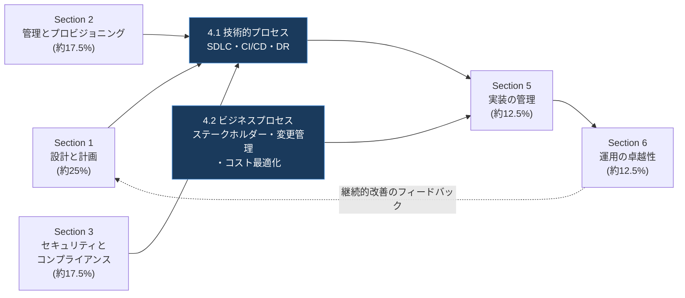

### 1.2 Well-Architected Frameworkとの関係

Google Cloud Well-Architected Frameworkは、信頼性が高く、安全で、効率的、かつコスト最適化されたワークロードをGoogle Cloud上で設計・構築・運用するための指針とベストプラクティスを提供するフレームワークであり、その原則は試験の出題範囲全体に暗黙的・明示的に織り込まれています[^2]。Section 4の各項目は、6本柱のうち特に「運用の卓越性（Operational Excellence）」「信頼性（Reliability）」「コスト最適化（Cost Optimization）」の3本柱と強く関連します。

| Well-Architected Frameworkの柱 | Section 4との関連 |
|---|---|
| 運用の卓越性（Operational Excellence） | SDLC、CI/CD、トラブルシューティング/RCA、テストと検証、サービスカタログはすべてこの柱の中核テーマ[^3] |
| 信頼性（Reliability） | ディザスタリカバリ、事業継続性はこの柱の可用性・耐障害性の原則と直結[^25] |
| コスト最適化（Cost Optimization） | CapEx/OpExモデルの転換、コスト・リソース最適化はこの柱の原則そのもの[^29] |
| セキュリティ、プライバシー、コンプライアンス | ソフトウェアサプライチェーンのセキュリティ（Section 3で詳述）はCI/CDプロセスと密接に関連 |
| パフォーマンス最適化 | 負荷テスト、カナリアデプロイによる段階的な検証と関連 |

運用の卓越性の柱は、経営層・リーダー層には投資価値の実現とビジネス目標達成のためのフレームワークを、クラウド運用チームにはインシデント・問題管理やキャパシティプランニング、変更管理のガイダンスを、SREにはモニタリングやインシデント対応、自動化など高い信頼性を実現するベストプラクティスを提供します[^3]。この「マネージャー」「運用チーム」「SRE」という3つの読者層を意識することは、Section 4の技術的プロセスとビジネスプロセスの両方を理解するうえで役立ちます。

---

## 2. 4.1 技術的プロセスの分析と定義

### 2.1 ソフトウェア開発ライフサイクル（SDLC）

**SDLC（Software Development Lifecycle）** とは、要件定義から設計、開発、テスト、デプロイ、保守に至るソフトウェア開発の一連の工程を体系化した、反復的かつ構造化されたアプローチです。SDLCを整備することで、プロジェクトの目標設定、実装計画の詳細化、そして期日通りの成功裏のリリースを実現できます。

SDLCの各フェーズは一般的に以下のように整理されます。

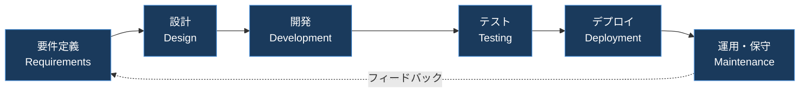

テストフェーズは特に重要で、単体テスト・統合テスト・システムテストなど複数の種類のテストを通じて、欠陥や不具合を洗い出し、ユーザーへのデプロイ前に意図通り動作することを確認します。デプロイ後はベータテストや限定的なパイロットローンチを経てから本番展開されることが一般的です。

| SDLCモデル | 特徴 | 適したユースケース |
|---|---|---|
| ウォーターフォール | 各フェーズを順番に完了させる直線的モデル | 要件が明確で変更が少ない小規模プロジェクト |
| アジャイル（スクラム/カンバン） | 短いイテレーションで反復的に開発 | 要件が変化しやすいプロダクト開発 |
| DevOps／継続的デリバリー | 開発と運用を統合し、自動化されたパイプラインで高頻度リリース | クラウドネイティブなSaaS、マイクロサービス |

Google Cloudにおいては、SDLCの各フェーズにマッピングされるツール群が存在し、コード管理からビルド、テスト、デプロイ、監視までを一気通貫でサポートします。

| SDLCフェーズ | 対応するGoogle Cloud関連ツール |
|---|---|
| ソースコード管理 | GitHubやGitLabなどの外部リポジトリ、Cloud Build トリガー連携 |
| ビルド・テスト | Cloud Build（サーバーレスCI/CDプラットフォーム）[^5] |
| コンテナイメージ管理 | Artifact Registry |
| デプロイ | Cloud Deploy（継続的デリバリーサービス）[^6] |
| インフラのコード化 | Terraform、Infrastructure Manager |
| 監視・可観測性 | Cloud Monitoring、Cloud Logging、Error Reporting |

**ベストプラクティス**

> コードは中央のコードリポジトリに保存し、バージョン管理と変更履歴のラベリングを行う。CI/CDを活用してアジャイルなワークフローを支援し、Infrastructure as Code（IaC）ツールでインフラをプロビジョニング・管理する。単体テスト・統合テスト・システムテスト・負荷テストをソフトウェア配信ライフサイクル全体に組み込み、テスト環境ごとに個別のGoogle Cloudプロジェクトを使用する。[^4] [^18]

### 2.2 継続的インテグレーション/継続的デリバリー（CI/CD）

**CI（継続的インテグレーション）** は、開発者が加えたコード変更を頻繁に共有リポジトリへ統合し、自動ビルド・自動テストを実行するプラクティスです。**CD（継続的デリバリー/デプロイ）** は、そのビルド済み成果物を自動的にステージング環境や本番環境へ配信するプラクティスです。Google Cloudでは、この2つを組み合わせたCI/CDパイプラインを、主に**Cloud Build**（ビルドとテストの自動化）と**Cloud Deploy**（GKE・Cloud Run等へのデリバリー管理）で実現します[^5][^6]。

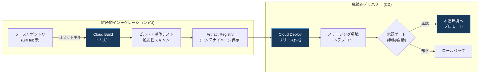

Cloud Buildは、Google独自のグローバルネットワークに接続されたマシンでビルドを実行し、脆弱性スキャンや来歴（provenance）情報を活用した監査、SLSAレベル3準拠のビルドによるソフトウェアサプライチェーン攻撃対策をサポートします[^5]。ビルドステップはGKE、Cloud Run、App Engine、Cloud Run functions、Firebaseへの組み込みデプロイ統合を持ちます[^5]。

Cloud Deployは、デリバリーパイプラインとターゲット（デプロイ先環境）という概念で構成されます。デプロイ戦略には主に次の種類があります[^6][^7]。

| デプロイ戦略 | 概要 | ロールバックの容易さ | リスク |
|---|---|---|---|
| 標準（Standard） | 新バージョンを一度にターゲットへデプロイ。旧新バージョンのトラフィック分割は行わない | 容易 | 変更の影響を受けるユーザー数が最大 |
| カナリア（Canary） | 新バージョンへ段階的にトラフィックを割り振り、監視しながら拡大する漸進的ロールアウト | 容易（初期段階で停止可能） | 低い（影響範囲を限定できる） |
| Blue-Green | 新環境（Green）を旧環境（Blue）と並行稼働させ、準備完了後に一括切り替え | 非常に容易（Blueに戻すだけ） | 中程度（切替時の一括影響） |

カナリアデプロイでは、新バージョンへのトラフィック配分を段階的なフェーズ（例：10% → 25% → 50% → 75% → 100%）で引き上げながら、アプリケーションのパフォーマンスを監視し、問題があれば早期に検知してユーザーへの影響を最小化します[^7][^8]。

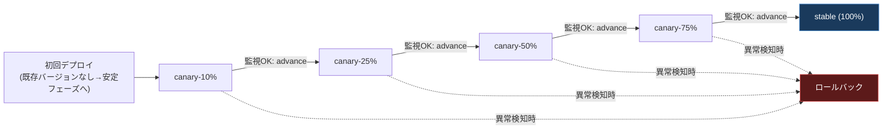

CI/CDパイプラインの成熟度を測る指標として、Googleが買収した独立研究組織であるDORA（DevOps Research and Assessment）チームが提唱した**「Four Keys（4つの主要指標）」**が広く使われています。DORAチームは6年間の研究を通じて、ソフトウェア開発チームのパフォーマンスを示す4つの主要指標を特定しました[^9]。

| 指標 | 定義 | 意味 |
|---|---|---|
| デプロイ頻度（Deployment Frequency） | 組織が本番環境へ正常にリリースする頻度 | 高いほど小さなバッチでの迅速な価値提供が可能 |
| 変更のリードタイム（Lead Time for Changes） | コミットが本番環境に反映されるまでの所要時間 | 短いほど開発サイクルが高速 |
| 変更失敗率（Change Failure Rate） | デプロイのうち本番障害を引き起こす割合 | 低いほど品質・安定性が高い |
| サービス復元時間（Time to Restore Service） | 本番障害から復旧するまでの所要時間 | 短いほど障害からの回復力が高い |

これらの指標は、GitHubやGitLabの開発データを取り込んでダッシュボード化するオープンソースプロジェクト「Four Keys」でも実践的に計測できます[^10]。

**ベストプラクティス**

> コードリポジトリを中心にCI/CDを構成し、Cloud Buildで自動ビルド・自動テスト・脆弱性スキャンを実施する。カナリアやBlue-Greenなどの段階的デプロイ戦略を用いてリスクを低減し、いつでも前のリリースへ迅速にロールバックできる体制を整える。DORAの4指標（デプロイ頻度・リードタイム・変更失敗率・復元時間）を計測し、継続的にパイプラインを改善する。[^5][^6][^9]

### 2.3 トラブルシューティングと根本原因分析（RCA）のベストプラクティス

本番環境で問題が発生した際、まず影響を止める応急処置（ロールバックなど）を行い、その後**根本原因分析（Root Cause Analysis, RCA）**によって、問題を引き起こしたコード・設定・プロセスを特定します[^14]。RCAは、同じ問題を再発させないために不可欠なステップです。

Google Cloudの可観測性（Observability）ツール群は、この調査プロセスを支援します。

| ツール | 役割 |
|---|---|
| Cloud Monitoring | メトリクスの収集・可視化とアラート。異常検知の起点 |
| Error Reporting | スタックトレースを持つエラーを集約・グルーピングし、ダッシュボードで再発状況を追跡[^11] |
| Cloud Logging | サービス横断のログを収集し、問題発生前後の操作シーケンスを調査[^15] |
| Cloud Trace | 分散システムにおけるリクエストのレイテンシをサービス間で追跡し、ボトルネックを特定 |
| Cloud Profiler | 本番環境のCPU・メモリ使用状況を継続的にプロファイリング |

Error Reportingは、Error Reporting APIへの直接送信、またはCloud Loggingへの整形されたログ出力から自動的にエラーイベントを推論し、同一の根本原因を持つと判断されたエラーイベントをグルーピングして表示します[^11][^12]。これにより、大量のログの中から「最も頻発している新しいエラー」を素早く見つけ出し、修正の優先順位付けができます。

分散アプリケーションのトラブルシューティングでは、Cloud TraceとCloud Loggingを組み合わせることで、問題の発生箇所を特定し、ロールバックなどの緩和策だけでは不十分な場合に根本原因分析を進めることができます[^13]。

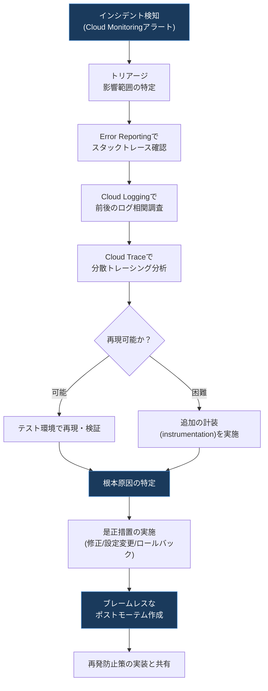

RCAのプロセスを組織文化として定着させるうえで重要な概念が、Google SREの**「ブレームレスポストモーテム（Blameless Postmortem）文化」**です。これは、あらゆる「失敗」をシステムを強化する機会と捉える環境を作るという考え方で、個人を非難するのではなく、システムやプロセスの改善に焦点を当てます[^16]。ポストモーテムは形式的な記録ではなく、エンジニアがシステム全体のレジリエンスを高めるための重要な学習機会として位置づけられます[^17]。

| ポストモーテムの構成要素 | 目的 |
|---|---|
| インシデントの概要とタイムライン | 何が、いつ、どのように発生したかを客観的に記録 |
| 影響範囲（ユーザー影響・ビジネス影響） | 深刻度と優先順位の判断材料 |
| 根本原因（Root Cause） | 「なぜ」を繰り返し問い、真因まで掘り下げる |
| 対応した内容（What went well / What went wrong） | 良かった点と改善点を公平に評価 |
| アクションアイテム（再発防止策） | 担当者と期限を明記し、確実に実行・追跡する |

**ベストプラクティス**

> インシデント発生時はまず影響緩和（ロールバック等）を優先し、その後Error Reporting・Cloud Logging・Cloud Traceを組み合わせて根本原因を特定する。ポストモーテムは個人を非難せず、システムとプロセスの改善に焦点を当てるブレームレス文化で運用し、アクションアイテムには担当者と期限を明記して確実にクローズする。[^13][^16][^17]

### 2.4 ソフトウェアとインフラのテストと検証

Well-Architected Frameworkの運用の卓越性の柱が推奨する重要な実践の一つが、「ソフトウェア配信ライフサイクル全体を通じたテストの組み込み」です。単体テスト・統合テスト・システムテスト・負荷テストを実施することが推奨されています[^4]。

インフラのコード（Terraform等）についても、アプリケーションコードと同様のテスト原則が適用されますが、実際のリソースを作成・変更・破棄するため、時間とコストがかかる点に注意が必要です[^18]。そのため、コストと実行時間の昇順で以下のような段階的なテスト手法を組み合わせるアプローチが推奨されます[^18]。

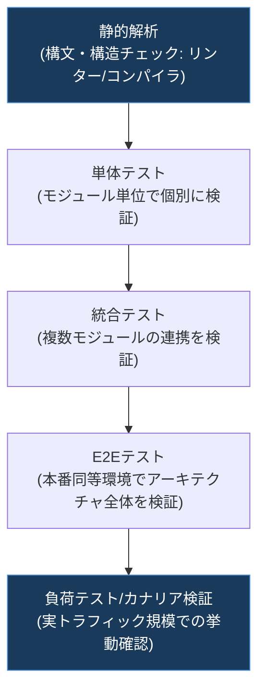

エンドツーエンドテストは、本番環境に近い新規のテスト環境に、アーキテクチャを構成するすべてのモジュールをデプロイして確認する手法で、コストは高いものの本番環境への影響を防ぐという点で最も高い信頼性を提供します[^18]。テストはビルドの失敗を早期に検出する「fail fast」アプローチで、小さく軽量なテストから複雑なテストへと段階的に積み上げていくことが推奨されます[^18]。

| テスト種別 | 目的 | 関連するGoogle Cloudの仕組み |
|---|---|---|
| 静的解析 | 構文・構造の誤りを実行前に検出 | linter、コンパイラ、`terraform validate` |
| 単体テスト | 個別モジュール・関数の振る舞いを検証 | 各言語のテストフレームワーク（実リソースを作成しない） |
| 統合テスト | 複数モジュールの連携を検証 | 分離されたテスト用Google Cloudプロジェクト |
| E2Eテスト | アーキテクチャ全体を本番同等環境で検証 | 専用のステージング環境、Cloud Deployのステージングターゲット |
| 負荷テスト | 実際のトラフィック規模でのスケーリング・ボトルネックを検証 | Cloud Run負荷テストのベストプラクティス[^19]、Cloud Monitoringでの計測 |

負荷テストは、スケーリングを妨げる非効率なコードやボトルネックの両方を発見するのに役立ちます。たとえば、データベースへのテーブルレベルロックに依存する処理は、一度に1つのトランザクションしか実行できないため、Cloud Runサービスのスケーリングを妨げるボトルネックになり得ます[^19]。負荷テストを行う前に、開発環境や小規模なテスト環境で同時実行性（concurrency）の問題を特定・解消しておくことがベストプラクティスとされています[^19]。

**ベストプラクティス**

> テストはコストと実行時間の低いものから高いものへ段階的に実施する（静的解析→単体→統合→E2E→負荷テスト）。テスト環境ごとに独立したGoogle Cloudプロジェクトを使い、本番環境への影響を排除する。負荷テストの前に小規模環境で同時実行性の問題を解消しておく。[^4][^18][^19]

### 2.5 サービスカタログとプロビジョニング

**Service Catalog**は、開発者やクラウド管理者が自組織内のエンドユーザーに対して、自分たちのソリューションを発見可能にするためのGoogle Cloudサービスです。ソリューションを発見可能にすると同時に、管理者はその配布をコントロールし、コンプライアンスとガバナンスを確保できます[^20]。

クラウド管理者は組織配下に「カタログ（Catalog）」を作成し、信頼できるソリューション（Terraformテンプレート等）の一覧を管理して、組織内のユーザーへ共有します。共有されたカタログとそのソリューションは、権限を持つ組織内の他のユーザーが閲覧・利用できます[^20]。

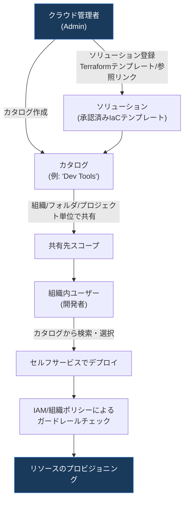

| 用語 | 説明 |
|---|---|
| カタログ（Catalog） | 管理者がキュレーションした、信頼できるソリューションの一覧 |
| ソリューション（Solution） | カタログに登録される、デプロイ可能なテンプレート（Deployment Manager／Terraformベース）や参照リンク |
| Form Schema | ソリューションのデプロイUIを定義し、リージョンやマシンタイプなどの制約（予算超過防止等）を指定する仕組み |
| 共有（Sharing） | 組織・フォルダ・プロジェクト単位でカタログへのアクセスを制御する仕組み |

Service Catalogは、コンピュートリソースやネットワーキングそのものを提供するサービスではなく、あくまで**ガバナンスとセルフサービス型プロビジョニングのための「発見と統制」のレイヤー**である点に注意が必要です。実際の権限モデルはGoogle Cloudのリソース階層（組織・フォルダ・プロジェクト）に沿ってIAMと連携します。

| 観点 | Service Catalog | Infrastructure Manager | Google Cloud Marketplace |
|---|---|---|---|
| 主な目的 | 社内向けソリューションの発見と統制 | Terraform構成のマネージド実行・状態管理 | サードパーティ／Google製品の発見・購入・デプロイ |
| 対象読者 | 組織内のエンドユーザー・開発者 | インフラ運用者 | 全Google Cloudユーザー・組織外含む |
| ガバナンスの主体 | クラウド管理者によるキュレーション | IAMとTerraformステートによる管理 | Marketplace運営者・パブリッシャー |

**ベストプラクティス**

> 標準化されたTerraformテンプレートをService Catalogのソリューションとして登録し、Form Schemaでリージョンやマシンタイプなど予算・コンプライアンスに関わるパラメータを制約する。組織・フォルダ・プロジェクト単位での共有範囲を最小権限の原則に従って設計し、ドキュメントへのリンクを必ず添付してセルフサービス利用時の混乱を防ぐ。[^20][^21]

### 2.6 ディザスタリカバリ（DR）

**ディザスタリカバリ（DR）** は、電源障害、サイバー攻撃、自然災害といったサービス中断を引き起こすイベントの後に、組織のITインフラへのアクセスと機能を復元するプロセスです。DRは**事業継続計画（Business Continuity Planning, BCP）の一部**として位置づけられます[^22][^26]。

Googleの重要な設計原則の一つは「障害に備えて計画する（plan for failure）」ことです。Google Cloudが提供する信頼性の高いサービスであっても、自然災害・光ファイバーの切断・複雑で予測不能なインフラ障害などにより、災害は避けられないものとして起こり得ます[^23]。

DR計画は、以下の2つの重要指標を定義する**ビジネスインパクト分析（Business Impact Analysis, BIA）**から始まります[^22]。

| 指標 | 定義 |
|---|---|
| RTO（Recovery Time Objective：目標復旧時間） | アプリケーションがオフラインでいることが許容される最大時間。通常、より大きなSLA（サービスレベル契約）の一部として定義される[^22] |
| RPO（Recovery Point Objective：目標復旧時点） | 大規模インシデントによって失われることが許容される最大データ量（時間で測定）。データの使われ方によって異なり、頻繁に更新されるユーザーデータはRPOが数分、重要度の低いデータは数時間となる場合がある[^22] |

一般的に、RTOとRPOの値が小さいほど、それを達成するためのコスト・アプリケーションの複雑性・運用負荷は増加するというトレードオフの関係にあります。

Google Cloudのインフラを対象にDRを設計する際は、業界標準のRTO/RPOの概念をGoogle Cloudインフラにマッピングして考えます。ビジネスクリティカルな操作については、継続的にデータプレーンの処理を担うコンポーネントのみに依存するよう設計し、VM作成APIやIAM権限の更新のような管理プレーン操作には依存しないようにすることが推奨されます[^23]。

DRパターンは、RTO/RPOの要件とコストのバランスに応じて、以下のように整理できます。

| DRパターン | 概要 | 相対的なRTO/RPO | 相対コスト |
|---|---|---|---|
| Cold（バックアップと復元） | 定期的なバックアップからリソースを新規作成して復旧 | 大（時間〜日単位） | 低 |
| Warm（縮小版スタンバイ） | 縮小構成の環境を常時起動しておき、災害時にスケールアップ | 中 | 中 |
| Hot（マルチサイト/Active-Passive） | フル構成のスタンバイ環境を別リージョンに常時稼働 | 小（分単位） | 高 |
| Active-Active（マルチリージョン） | 複数リージョンで同時にトラフィックを処理し、片方が落ちても即座に継続 | 最小（ほぼゼロ） | 最高 |

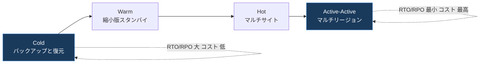

DR計画は一度作って終わりではなく、継続的なプロセスとして運用する必要があります。

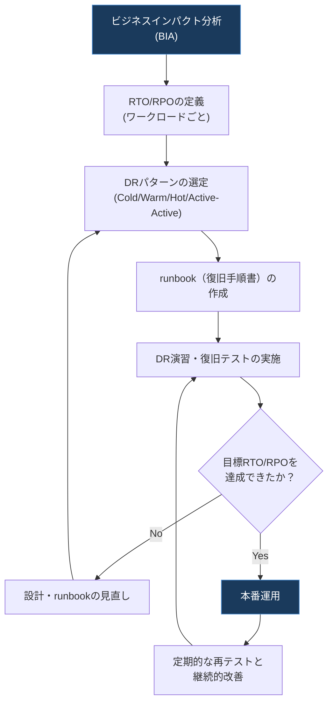

DR runbookは「復元スクリプトを実行する」のような曖昧な指示ではなく、具体的で実行可能なアクションで構成することが重要です。また、CI/CDパイプライン自体もビジネスクリティカルなアプリケーションをビルド・デプロイする責務を担うため、アプリケーションインフラと同様にDR・事業継続性の計画対象に含める必要があります[^24]。

**ベストプラクティス**

> ワークロードごとにビジネスへの影響に基づいてRTO/RPOを定義し、それに見合ったDRパターン（Cold/Warm/Hot/Active-Active）を選択する。ビジネスクリティカルな処理は管理プレーンのAPIに依存しない設計にする。DR runbookは具体的な実行可能な手順で記述し、定期的に復旧演習を実施して実測RTO/RPOを検証する。CI/CDパイプライン自体もDR計画の対象に含める。[^22][^23][^24]

---

## 3. 4.2 ビジネスプロセスの分析と定義

4.2は、アーキテクトが単なる技術者ではなく、組織全体を横断してクラウド導入を成功に導く「変革の推進者」であることを求める領域です。ここでは、Google Cloud Adoption Frameworkをはじめとする公式ガイダンスをベースに、7つの考慮事項を解説します。

### 3.1 ステークホルダー管理（影響力とファシリテーション）

アーキテクチャの意思決定は、経営層、開発チーム、運用チーム、セキュリティ・コンプライアンス部門、外部パートナーなど、多様な利害関係者（ステークホルダー）に影響します。アーキテクトには、技術的な正しさだけでなく、これらのステークホルダーに**影響を与え（influencing）、合意形成をファシリテートする（facilitation）**能力が求められます。

ステークホルダーを効果的に管理する第一歩は、関心度（Interest）と影響力（Power/Influence）の2軸でステークホルダーをマッピングし、それぞれに適したコミュニケーション戦略を設計することです。

| 関心度\影響力 | 影響力：低 | 影響力：高 |
|---|---|---|
| 関心度：低 | 最小限のモニタリングで十分 | 満足度を維持する（Keep Satisfied）：定期的な要約報告 |
| 関心度：高 | 情報を提供し続ける（Keep Informed）：進捗共有 | 密接に管理する（Manage Closely）：意思決定プロセスへの積極的関与 |

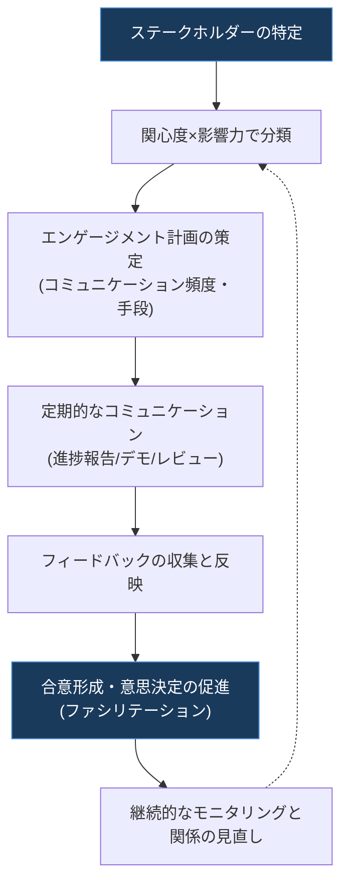

**ベストプラクティス**

| プラクティス | 説明 |
|---|---|
| 早期かつ継続的な関与 | 設計初期段階からステークホルダーを巻き込み、後工程での手戻りを防ぐ |
| 共通言語の確立 | 技術用語をビジネス価値（コスト・リスク・スピード）に翻訳して説明する |
| 透明性のある進捗共有 | 定例レビューやダッシュボードで状況を可視化し、驚きを生まない |
| ファシリテーションスキル | 対立する意見を持つステークホルダー間の合意形成を中立的に導く |

### 3.2 チェンジマネジメント

チェンジマネジメント（変更管理）には、大きく分けて2つの側面があります。

1. **技術的な変更管理**：インフラやアプリケーションへの変更を安全かつ追跡可能に行うプロセス
2. **組織的な変更管理**：クラウド移行に伴う働き方・組織文化の変化に、人々が適応できるよう支援するプロセス

技術的な変更管理では、Infrastructure as Code（IaC）の採用が変革的なアプローチとなります。Terraformのようなツールを使ってクラウドインフラを宣言的に定義・管理することで、一貫性・再現性・変更管理の簡素化を実現し、より迅速で信頼性の高いデプロイを可能にします[^4]。GitのようなバージョンコントロールシステムはIaCプロセスの重要な構成要素であり、堅牢な変更管理とリスク軽減能力を提供するため広く採用されています。IaCコードや構成への変更を追跡することで、変更の進化を可視化し、変更の影響を理解しやすくし、潜在的な問題を特定しやすくします。また、多くのバージョン管理システムは必要に応じて変更を簡単にロールバックできるため、意図しない影響やエラーのリスクを軽減するのに役立ちます[^4]。

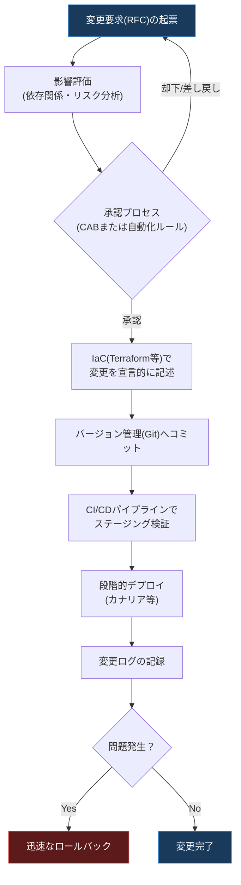

一方、組織的な変更管理については、Google Cloud Adoption Frameworkが指針を示しています。クラウド移行の多くは技術面の変化に注目が集まりがちですが、同様に複雑で影響の大きい「文化的な変化」が見落とされがちです。従業員が変化を受け入れられるよう、適切なプロセスで支援し、適切なスキルを身につけさせることが、技術面の移行と同じくらい重要です[^28]。

| 変更管理の原則 | 説明 |
|---|---|
| 小さく頻繁な変更 | 大きな一括変更よりも、小さく検証可能な変更を積み重ねる方がリスクが低い |
| 可逆性の確保 | すべての変更にロールバック手順を用意し、失敗を前提とした設計にする |
| 変更の可視化と追跡 | Gitなどのバージョン管理ですべての変更履歴を記録し、監査可能にする |
| 人への配慮 | 技術変更だけでなく、組織・人へのインパクトも計画に含める[^28] |

**ベストプラクティス**

> インフラの変更はIaCとバージョン管理を通じて宣言的・追跡可能に行い、CI/CDパイプラインで段階的に検証してから本番反映する。組織的な変更管理では、技術移行と並行して、従業員のスキルアップと文化的な適応を支援するプログラムを計画する。[^4][^28]

### 3.3 チームアセスメントとスキルレディネス

クラウド導入の成功は、技術そのものよりも「人」の準備状況に左右されることが少なくありません。Google Cloud Adoption Frameworkは、組織のクラウド成熟度を評価するための「People（人材）」領域を定義しており、その目的は、クラウド導入者が新しい役割・スキル・パフォーマンス指標に適切に整合するよう、必要な組織構造を定義することです[^27]。

組織構造、人材、パフォーマンス指標の整合は、チームが変化を受け入れ、新しい職務を全うできる態勢を整えるために不可欠です。たとえ多額の投資をしてクラウド移行を行っても、IT・運用・関連するビジネスリソースがお互いの働き方や期待される役割を理解していなければ、混乱が生じ、投資対効果（ROI）に悪影響を及ぼす可能性があります[^27]。

Google Cloud Adoption Frameworkは、組織のクラウド成熟度を3段階のスケールで評価します。

| 成熟度レベル | 特徴 |
|---|---|
| Tactical（戦術的） | 個々のワークロードは存在するが、全体を包括する一貫した計画・戦略がない。コスト削減と迅速な移行が主眼で、作業は場当たり的 |
| Strategic（戦略的） | 将来のニーズと拡張性を見据えた広いビジョンを持つ。コスト削減だけでなく、イノベーションとビジネス成長も重視し、チームはクラウド活用の価値を理解し始めている |
| Transformational（変革的） | クラウド運用がスムーズに機能し、組織全体でクラウドの価値を最大限に活用している |

スキルギャップとプロセスギャップの両方に対応することが、最適化されたソリューション、継続的な稼働時間、ビジネス価値を確保するために必要です[^27]。組織は、より多くのクラウド中心のスキルを持つ人材を採用する方向にシフトしつつも、既存のITスキルを再配置し、リスキリング（学び直し）を進める取り組みも並行して行っています[^27]。

**ベストプラクティス**

| プラクティス | 説明 |
|---|---|
| スキルギャップの可視化 | チームの現在のスキルセットと、目標アーキテクチャに必要なスキルセットの差分を評価する |
| 学習プログラムの設計 | Google Cloud認定資格やハンズオンラボなどを活用し、体系的な育成計画を立てる |
| 役割と責任の明確化 | クラウド運用における新しい役割（例：プラットフォームチーム、SRE）を定義し、期待値を明確化する |
| 段階的な権限委譲 | チームの習熟度に応じて、セルフサービスの範囲を段階的に拡大する |

### 3.4 意思決定プロセス

アーキテクチャに関する意思決定は、多くの場合、複数の技術的トレードオフとビジネス上の制約が絡み合う複雑な作業です。効果的な意思決定プロセスを設計することで、決定の質とスピードの両方を高めることができます。

意思決定における役割分担を明確化するためのフレームワークとして、RACIとDACIがよく用いられます。

| フレームワーク | 役割の構成 | 主眼 |
|---|---|---|
| RACI | Responsible（実行責任）、Accountable（説明責任）、Consulted（相談先）、Informed（報告先） | タスクの実行責任の所在を明確化する |
| DACI | Driver（推進者）、Approver（承認者）、Contributors（貢献者）、Informed（報告先） | 意思決定そのものの推進と最終決定権を明確化する |

DACIモデルでは、Driverが議論を推進し選択肢を整理する役割を担い、Contributorsが専門的なインプットを提供し、最終的にApproverが決定を下し、Informedには決定内容が共有されます。

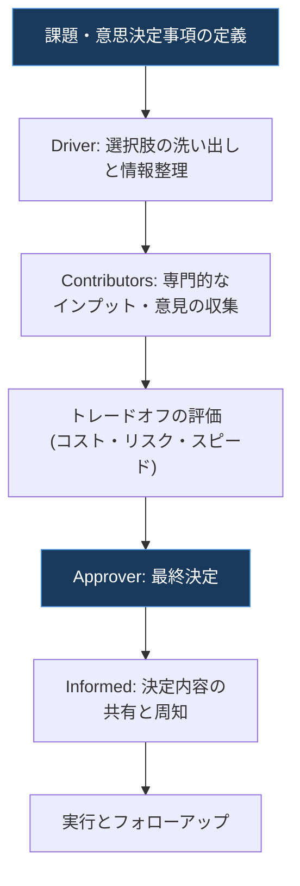

アーキテクチャ設計における意思決定の透明性を確保するには、**アーキテクチャ決定記録（Architecture Decision Record, ADR）**のように、決定の背景・検討した選択肢・トレードオフ・最終判断を文書化する習慣も有効です。これにより、後から参加したメンバーや将来の自分自身が、なぜその決定がなされたのかを追跡できるようになります。

**ベストプラクティス**

| プラクティス | 説明 |
|---|---|
| 役割の明確化 | RACIまたはDACIで、誰が推進し、誰が最終決定するのかを事前に合意しておく |
| 意思決定の文書化 | 決定の背景・選択肢・トレードオフを記録し、後から参照可能にする |
| 期限の設定 | 意思決定が長引かないよう、明確な期限を設けて合意形成を促す |
| 可逆な決定は素早く | 影響が小さく後で修正可能な決定は、迅速に進めてスピードを優先する |

### 3.5 カスタマーサクセスマネジメント

カスタマーサクセスマネジメントとは、顧客（社内の場合は他チーム、対外的な場合はエンドユーザー企業）がソリューションから継続的に価値を引き出せるよう支援するプロセスです。Google Cloud自身も、専門サービス組織（Professional Services Organization, PSO）を顧客成功戦略の基盤として位置づけ、リージョンごとに実践ベースのモデルで組織し、顧客のオンボーディングやデプロイの迅速化、業界ニーズに合わせたソリューション専門性の提供を行っています[^31]。

顧客とのエンゲージメントにおいては、パーソナライズされた文脈に即したコミュニケーションが顧客の共感を得るうえで重要であるという調査結果もあり、単なる製品提供にとどまらない継続的な価値提供の戦略が求められます[^31]。Google Cloudのカスタマーサクセス組織は、モニタリング・予防・迅速な影響緩和を可能にするプレミアムサポートやミッションクリティカルサポートといった提供形態を通じて、顧客の成功に投資しています[^32]。

| カスタマーサクセスの構成要素 | 説明 |
|---|---|
| オンボーディング | 新規顧客・新規チームがソリューションを迅速かつ円滑に使い始められるよう支援 |
| 継続的なエンゲージメント | 定期的なビジネスレビュー、成功指標のトラッキング、フィードバック収集 |
| プロアクティブなサポート | 問題が顕在化する前に予兆を検知し、先回りして対応する |
| 段階的な支援モデル | セルフサービス（標準）から専任担当者によるハイタッチ支援（エキスパート）まで、顧客のニーズに応じた階層を用意 |

アーキテクトの視点では、カスタマーサクセスマネジメントは技術選定にも影響します。たとえば、アーキテクチャの複雑さや運用負荷が顧客（社内の他チームを含む）のオンボーディング速度や自走可能性にどう影響するかを考慮することは、「顧客に価値を届け続ける」という観点で重要な設計判断です。

**ベストプラクティス**

> ソリューションの導入初期からオンボーディング計画を用意し、成功指標（採用率、利用状況、満足度など）を定義してトラッキングする。顧客の声を継続的に収集し、プロダクト・アーキテクチャの改善にフィードバックする仕組みを構築する。サポートの階層を顧客のニーズに応じて設計し、重要度の高い顧客には専任の窓口を用意する。[^31][^32]

### 3.6 コスト最適化・リソース最適化（CapEx／OpEx）

オンプレミスとクラウドでは、ITコストの構造が根本的に異なります。オンプレミスのITコストは**資本的支出（CapEx: Capital Expenditure）**と**運用的支出（OpEx: Operating Expenditure）**で構成され、オンプレミスのハードウェア・ソフトウェア資産は取得され、その取得コストは資産の稼働期間にわたって減価償却されます[^29]。一方、クラウドでは、ほとんどのクラウドリソースのコストはOpExとして扱われ、リソースが消費された時点でコストが発生します[^29]。

| 観点 | CapEx（資本的支出） | OpEx（運用的支出） |
|---|---|---|
| 支払いタイミング | 大きな初期投資（前払い） | 利用に応じた継続的な小額支払い |
| 会計処理 | 資産として計上し、耐用年数にわたり減価償却 | 発生した期間の費用として即時計上 |
| 典型例（オンプレミス） | データセンター、サーバー、ネットワーク機器の購入 | 電気代、保守契約、人件費 |
| クラウドでの扱い | 基本的に発生しない（従量課金が中心） | Compute Engineの稼働時間課金、ストレージ使用量課金など、消費ベースの支払いが中心[^29] |

このCapExからOpExへの転換は、俊敏性（必要な時に必要なだけリソースを調達できる）という大きなメリットをもたらす一方、統制がないと無秩序な支出（「Wild West」状態）に陥るリスクも指摘されています。エンジニアリングチームが予算やアラートなどの標準化されたガードレールなしにリソースを起動してしまう問題が典型例です[^30]。

コスト最適化の柱が示す中核原則の一つは、**「コストと業務価値を整合させる」**ことです。クラウドリソースが測定可能なビジネス価値をもたらすようにし、収益・顧客満足度・業務効率に直接貢献する投資を優先します。もう一つの重要原則が**「コスト意識の文化を醸成する」**ことで、組織全体の人々が自分の意思決定や活動がコストに与える影響を考慮するようにし、チームに情報に基づいたコスト意識のある選択をするための可視性と情報を提供します[^29]。

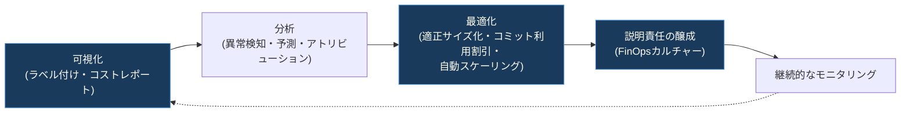

| コスト最適化のベストプラクティス | 説明 |
|---|---|
| 予算アラートの設定とプログラムによる追跡 | Pub/SubやCloud Runなどを活用し、閾値超過時に自動通知・自動対応を実装する |
| リソースクォータによる provisioning 制御 | 意図しない過剰プロビジョニングを防ぎ、レイテンシ要件を満たす最も低コストなリージョンを選択する |
| コミット利用割引の活用 | 予測可能なワークロードに対して確約利用割引（Committed Use Discounts）を適用する |
| ラベルによるコスト追跡の自動化 | env・team・appなどのメタデータでリソースにラベル付けし、100%のコストアトリビューションを目指す |
| コスト意識の文化醸成 | 開発者・運用者にクラウドインフラのコスト構造についてトレーニングを実施する |

**ベストプラクティス**

> オンプレミスのCapEx中心の発想から、クラウドのOpEx中心の従量課金モデルへ組織のコスト管理プロセスを転換する。ラベリングによるコスト可視化、予算アラートによる異常検知、コミット利用割引による適正化を組み合わせ、「コスト意識の文化」をチーム全体に浸透させる。[^29][^30]

### 3.7 事業継続性（ビジネスコンティニュイティ）

**事業継続計画（BCP）**は、災害やインシデントが発生した際にも、組織の重要な業務機能を維持し、効果的に復旧するための包括的な計画です。ディザスタリカバリ（DR）は、このBCPの中でもITシステムの復旧に焦点を当てた「サブセット」です[^22][^26]。

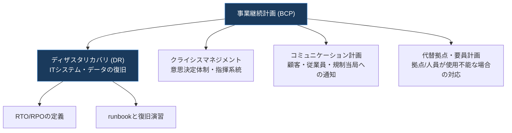

BCPは技術インフラだけでなく、組織や人に関わる側面も含む包括的な取り組みです。Googleが自社のプラットフォームに対して行っているBCP/DRの取り組みは参考になるプラクティスを示しています。Google Information Securityチームが事業レジリエンシープログラムの監督責任を持ち、輪番制のインシデントコマンダーがすべてのインシデントの管理と解決に責任を持ちます。インシデントコマンダーは常時オンコール体制の運用・エンジニアリング担当者と、取るべきすべてのアクションに対するプレイブックを備えています[^26]。GoogleはBCP/DR計画を少なくとも年次で見直し・更新しており、インシデント、製品変更、業界標準、リスク分析活動、BCP/DRテストから得られた情報を計画の更新に活用しています[^26]。

さらに、パンデミックのような広域disruptionに備えた計画（pandemic plan）もBCP/DRの一部として組み込まれており、24時間365日のグローバルサポート体制や、リモートワークを前提としたクラウドベースのツール活用など、地理的に分散した対応力を確保する取り組みが行われています[^26]。

CI/CDパイプラインの事業継続性という観点も見落とされがちです。CI/CDパイプラインはビジネスクリティカルなアプリケーションのビルドとデプロイを担う責務を持つため、アプリケーションインフラと同様にDR・事業継続性の計画対象に含める必要があります。ソフトウェア配信・運用サイクルの各フェーズを理解し、それらがどのように機能するかを把握することが、CI/CDにおけるBCP策定の出発点です[^24]。

| 事業継続性のプラクティス | 説明 |
|---|---|
| ビジネスインパクト分析（BIA）の実施 | 業務機能ごとの重要度と、中断時の影響を評価する |
| 定期的なリスク評価 | 少なくとも年次でリスクとBCP/DR計画を見直す[^26] |
| インシデント指揮系統の明確化 | 輪番制のインシデントコマンダー等、明確な意思決定権限を事前に定義する[^26] |
| コミュニケーション計画の整備 | 顧客・従業員・規制当局への通知手順をあらかじめ準備する |
| CI/CDパイプライン自体のBCP | パイプラインそのものの可用性・復旧計画も対象に含める[^24] |

| BCPとDRの違い | BCP（事業継続計画） | DR（ディザスタリカバリ） |
|---|---|---|
| スコープ | 組織全体の業務継続（人・拠点・コミュニケーションを含む） | 主にITシステムとデータの復旧 |
| 主な指標 | 業務機能の継続性・復旧優先順位 | RTO・RPO |
| 関係性 | 上位概念 | BCPのサブセット[^22][^26] |

**ベストプラクティス**

> DRはBCPのサブセットであるという位置づけを理解したうえで、ITシステムの復旧計画だけでなく、意思決定体制・コミュニケーション計画・代替要員計画までを含めた包括的なBCPを策定する。BCP/DR計画は少なくとも年次で見直し、インシデントや業界標準の変化を反映する。CI/CDパイプライン自体の可用性もBCPの対象に含める。[^22][^24][^26]

---

## 4. ケーススタディへの適用

Professional Cloud Architect試験では、いくつかの設問が架空の企業と課題を描いた「ケーススタディ」を参照する形で出題されます。これらのケーススタディはGoogle Cloudの生成AIソリューションを活用して実世界の課題を解決する企業を含んでおり、解答の際の追加コンテキストを提供する目的があります[^2]。試験対象となる公式ケーススタディは以下の4つです[^2]。

| ケーススタディ | 概要 |
|---|---|
| Altostrat Media | メディア業界の企業を想定したケーススタディ |
| Cymbal Retail | 小売業界の企業を想定したケーススタディ |
| EHR Healthcare | ヘルスケア業界の企業を想定したケーススタディ |
| KnightMotives Automotive | 自動車業界の企業を想定したケーススタディ |

Section 4の観点でケーススタディを読み解く際は、以下のような問いを意識すると設問への対応力が高まります。

- 企業のSDLCやリリースプロセスは、記載されている技術的負債や課題（レガシーシステム、手動デプロイなど）にどう対応すべきか
- 記載されている可用性要件・SLAから、どのDRパターン（Cold/Warm/Hot/Active-Active）が適切か、RTO/RPOをどう見積もるか
- 経営層・ビジネス部門が挙げているビジネス上のゴール（コスト削減、成長、コンプライアンス対応など）は、どのステークホルダー管理・コスト最適化のアプローチと整合するか
- 組織のクラウド成熟度（Tactical/Strategic/Transformational）はどの段階にあり、チームのスキルレディネスにどんなギャップがあるか

ケーススタディを扱う設問では、多くの場合「最も技術的に高度な答え」ではなく、**そのケーススタディに記載されたビジネス要件・制約・優先順位に最も整合する答え**が正解になる点に注意してください。

---

## 5. 学習チェックリスト

以下のチェックリストを使って、Section 4の理解度をセルフチェックしてください。

- [ ] SDLCの主要フェーズ（要件定義・設計・開発・テスト・デプロイ・保守）を説明できる
- [ ] Cloud BuildとCloud Deployの役割の違いを説明できる
- [ ] 標準デプロイ・カナリアデプロイ・Blue-Greenデプロイの違いとそれぞれのリスク特性を説明できる
- [ ] DORAのFour Keys（デプロイ頻度・リードタイム・変更失敗率・復元時間）を列挙できる
- [ ] Error Reporting・Cloud Logging・Cloud Traceを組み合わせた根本原因分析（RCA）の流れを説明できる
- [ ] ブレームレスポストモーテム文化の目的を説明できる
- [ ] テストピラミッド（静的解析→単体→統合→E2E→負荷テスト）の段階を説明できる
- [ ] Service Catalogの目的（発見可能性とガバナンス）を説明できる
- [ ] RTOとRPOの定義の違いを説明できる
- [ ] Cold/Warm/Hot/Active-ActiveのDRパターンをコストとRTO/RPOの観点で比較できる
- [ ] DRがBCPのサブセットであるという関係性を説明できる
- [ ] ステークホルダーを関心度×影響力でマッピングする方法を説明できる
- [ ] IaCとバージョン管理が技術的な変更管理にどう寄与するかを説明できる
- [ ] Google Cloud Adoption Frameworkの3段階の成熟度（Tactical/Strategic/Transformational）を説明できる
- [ ] RACIとDACIの違いを説明できる
- [ ] カスタマーサクセスマネジメントの主要な構成要素を説明できる
- [ ] CapExとOpExの違いと、クラウド移行がもたらすコストモデルの転換を説明できる
- [ ] コスト最適化における「可視化→分析→最適化→説明責任の醸成」のサイクルを説明できる
- [ ] BCPとDRの関係性、および事業継続性計画に含めるべき要素を説明できる
- [ ] 4つの公式ケーススタディ（Altostrat Media / Cymbal Retail / EHR Healthcare / KnightMotives Automotive）の存在を把握している

---

## 6. まとめ

Section 4「プロセス分析と最適化」は、配点こそ約15%と他セクションより小さいものの、Professional Cloud Architectという資格が単なる「技術の目利き」ではなく、**組織全体のプロセスを分析し、継続的に最適化できるアーキテクト**を認定するものであることを象徴するセクションです。

4.1で扱うSDLC・CI/CD・RCA・テスト・サービスカタログ・DRは、いずれもWell-Architected Frameworkの「運用の卓越性」と「信頼性」の柱を実践レベルに落とし込んだものです。一方、4.2で扱うステークホルダー管理・チェンジマネジメント・チームアセスメント・意思決定プロセス・カスタマーサクセス・コスト最適化・事業継続性は、技術知識だけでは測れない、アーキテクトに求められる「人と組織を動かす力」を反映しています。

この2つの領域は独立しているのではなく、互いに補完し合う関係にあります。たとえば、技術的に優れたDR計画も、ステークホルダーの合意とチームのスキルレディネスがなければ実行できません。逆に、優れたチェンジマネジメントのプロセスがあっても、その土台となるCI/CDパイプラインやIaCの技術基盤がなければ、変更を安全かつ迅速に届けることはできません。試験対策としても、実務のアーキテクト業務としても、この技術とビジネスの両輪を意識した学習を進めてください。

---

## 7. 参考文献

[^1]: Professional Cloud Architect Certification | Learn | Google Cloud. https://cloud.google.com/learn/certification/cloud-architect
[^2]: Professional Cloud Architect Certification exam guide (PDF). https://services.google.com/fh/files/misc/professional_cloud_architect_exam_guide_english.pdf
[^3]: Well-Architected Framework: Operational excellence pillar | Cloud Architecture Center | Google Cloud Documentation. https://docs.cloud.google.com/architecture/framework/operational-excellence
[^4]: Automate and manage change | Cloud Architecture Center | Google Cloud Documentation. https://docs.cloud.google.com/architecture/framework/operational-excellence/automate-and-manage-change
[^5]: Cloud Build serverless CI/CD platform | Google Cloud. https://cloud.google.com/build
[^6]: Use a deployment strategy | Cloud Deploy | Google Cloud Documentation. https://docs.cloud.google.com/deploy/docs/deployment-strategies
[^7]: Use a canary deployment strategy | Cloud Deploy | Google Cloud Documentation. https://docs.cloud.google.com/deploy/docs/deployment-strategies/canary
[^8]: Canary Deployments to Cloud Run | Google Cloud Documentation. https://docs.cloud.google.com/deploy/docs/deployment-strategies/canary/cloud-run
[^9]: Use Four Keys metrics like change failure rate to measure your DevOps performance | Google Cloud Blog. https://cloud.google.com/blog/products/devops-sre/using-the-four-keys-to-measure-your-devops-performance
[^10]: dora-team/fourkeys: Platform for monitoring the four key software delivery metrics | GitHub. https://github.com/dora-team/fourkeys
[^11]: Error Reporting documentation | Google Cloud Documentation. https://docs.cloud.google.com/error-reporting/docs
[^12]: Error Reporting overview: Grouping errors | Google Cloud Documentation. https://docs.cloud.google.com/error-reporting/docs/grouping-errors
[^13]: Using Cloud Trace and Cloud Logging for root cause analysis | Google Cloud Blog. https://cloud.google.com/blog/products/devops-sre/using-cloud-trace-and-cloud-logging-for-root-cause-analysis
[^14]: Tutorial: Local troubleshooting of a Cloud Run service | Google Cloud Documentation. https://docs.cloud.google.com/run/docs/tutorials/local-troubleshooting
[^15]: Troubleshoot Logging | Google Cloud Documentation. https://docs.cloud.google.com/logging/docs/troubleshooting
[^16]: Postmortem Culture: Learning from Failure | Site Reliability Engineering, Google. https://sre.google/sre-book/postmortem-culture/
[^17]: Postmortem Practices for Incident Management | SRE Workbook, Google. https://sre.google/workbook/postmortem-culture/
[^18]: Best practices for testing | Terraform on Google Cloud | Google Cloud Documentation. https://docs.cloud.google.com/docs/terraform/best-practices/testing
[^19]: Load testing best practices | Cloud Run | Google Cloud Documentation. https://docs.cloud.google.com/run/docs/about-load-testing
[^20]: Overview of Service Catalog | Google Cloud Documentation. https://docs.cloud.google.com/service-catalog/docs/overview
[^21]: Concepts | Service Catalog | Google Cloud Documentation. https://docs.cloud.google.com/service-catalog/docs/concepts
[^22]: Disaster recovery planning guide | Cloud Architecture Center | Google Cloud Documentation. https://docs.cloud.google.com/architecture/dr-scenarios-planning-guide
[^23]: Architecting disaster recovery for cloud infrastructure outages | Cloud Architecture Center | Google Cloud Documentation. https://docs.cloud.google.com/architecture/disaster-recovery
[^24]: Business continuity with CI/CD on Google Cloud | Cloud Architecture Center | Google Cloud Documentation. https://docs.cloud.google.com/architecture/business-continuity-with-cicd-on-google-cloud
[^25]: Well-Architected Framework: Reliability pillar | Cloud Architecture Center | Google Cloud Documentation. https://docs.cloud.google.com/architecture/framework/reliability
[^26]: Business continuity planning and disaster recovery | Apigee | Google Cloud Documentation. https://docs.cloud.google.com/apigee/docs/api-platform/reference/business-continuity
[^27]: The Google Cloud Adoption Framework (whitepaper PDF). https://services.google.com/fh/files/misc/google_cloud_adoption_framework_whitepaper.pdf
[^28]: Managing Change in the Cloud: Helping your people thrive in the cloud (whitepaper PDF). https://services.google.com/fh/files/misc/managing_change_in_the_cloud.pdf
[^29]: Well-Architected Framework: Cost optimization pillar | Cloud Architecture Center | Google Cloud Documentation. https://docs.cloud.google.com/architecture/framework/cost-optimization
[^30]: Principles of cloud cost optimization | Google Cloud Blog. https://cloud.google.com/blog/topics/cost-management/principles-of-cloud-cost-optimization
[^31]: Delivering Ongoing Customer Value with a Deliberate Customer Success Strategy (IDC whitepaper, distributed via Google Cloud). https://services.google.com/fh/files/misc/google_cloud_delivering_ongoing_customer_value_with_a_deliberate_customer_success_strategy_idc.pdf
[^32]: Creating the industry's best customer success teams | Google Cloud Blog. https://cloud.google.com/blog/topics/customers/creating-the-industrys-best-customer-success-teams
