# Google Cloud Professional Cloud Architect試験 Section 5: 実装の管理（Managing Implementation）学習ガイド

> 本ガイドはGoogle Cloud Professional Cloud Architect（PCA）認定試験の**Section 5: Managing implementation（実装の管理、配点約12.5%）**を対象とした、初学者向けの技術文書です。公式認定ページ[^19]と公式Exam Guide PDF[^18]の出題範囲に沿って、各タスクの詳細な解説とベストプラクティス、根拠となる公式ソースを提示します。

## 目次

- [このガイドについて](#このガイドについて)
- [Well-Architected Frameworkとの関連](#well-architected-frameworkとの関連)
- [5.1 開発・運用チームへのアドバイスとソリューションの成功裏のデプロイ支援](#51-開発運用チームへのアドバイスとソリューションの成功裏のデプロイ支援)
  - [5.1.1 アプリケーションとインフラストラクチャのデプロイ](#511-アプリケーションとインフラストラクチャのデプロイ)
  - [5.1.2 API管理のベストプラクティス（Apigee）](#512-api管理のベストプラクティスapigee)
  - [5.1.3 テストフレームワーク（負荷/単体/統合テスト）](#513-テストフレームワーク負荷単体統合テスト)
  - [5.1.4 データとシステムの移行・管理ツール](#514-データとシステムの移行管理ツール)
  - [5.1.5 Gemini Cloud Assist](#515-gemini-cloud-assist)
- [5.2 Google Cloudとのプログラムによる対話](#52-google-cloudとのプログラムによる対話)
  - [5.2.1 Cloud Shell Editor、Cloud Code、Cloud Shell Terminal](#521-cloud-shell-editorcloud-codecloud-shell-terminal)
  - [5.2.2 Google Cloud SDK（gcloud、gsutil、bq）](#522-google-cloud-sdkgcloudgsutilbq)
  - [5.2.3 Cloudエミュレータ（Bigtable、Spanner、Pub/Sub、Firestore）](#523-cloudエミュレータbigtablespannerpubsubfirestore)
  - [5.2.4 Infrastructure as Code（IaC、Terraform）](#524-infrastructure-as-codeiacterraform)
  - [5.2.5 Google APIへのアクセスのベストプラクティス](#525-google-apiへのアクセスのベストプラクティス)
  - [5.2.6 Google APIクライアントライブラリ](#526-google-apiクライアントライブラリ)
- [実装ツールチェーンの全体像](#実装ツールチェーンの全体像)
- [ケーススタディ適用の視点](#ケーススタディ適用の視点)
- [学習チェックリスト](#学習チェックリスト)
- [参考文献](#参考文献)

---

## このガイドについて

Section 5は、設計されたクラウドソリューションを実際に**開発・運用チームが実装していく段階**を対象とする領域です。PCA試験全体の中では配点比率こそ12.5%とSection 1（約25%）ほど大きくありませんが、「設計を現実のデプロイに落とし込む」実務スキルを問う実践的なセクションであり、以下の2つのタスクで構成されています。

| タスク | 名称 | 主な内容 |
|---|---|---|
| 5.1 | 開発・運用チームへのアドバイスとソリューションの成功裏のデプロイ支援 | アプリケーション/インフラのデプロイ、API管理（Apigee）、テストフレームワーク、データ・システム移行ツール、Gemini Cloud Assist |
| 5.2 | Google Cloudとのプログラムによる対話 | Cloud Shell Editor/Code/Terminal、Google Cloud SDK（gcloud/gsutil/bq）、Cloudエミュレータ、Infrastructure as Code（Terraform）、Google APIアクセスのベストプラクティス、APIクライアントライブラリ |

この2つのタスクに共通するテーマは、「アーキテクトが設計したものを、開発・運用チームがどのようなツールとプロセスで安全かつ再現可能に実装するか」です。PCAは自らコードを書く役割ではありませんが、開発チームに適切なツール・パターンを助言できるだけの実務知識が求められます。

## Well-Architected Frameworkとの関連

Google Cloud Well-Architected Framework（WAF）の6本柱のうち、Section 5は特に**運用の卓越性（Operational Excellence）**と密接に関連します。また、IaCによる一貫したプロビジョニングは信頼性・セキュリティの両面にも寄与します。

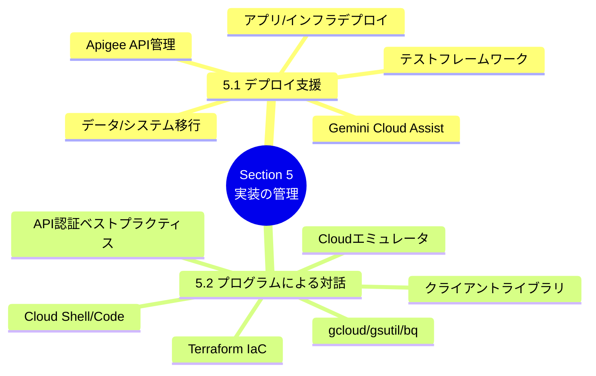

| WAFの柱 | Section 5との関連度 | 関連する主な要素 |
|---|---|---|
| 運用の卓越性 | 非常に高い | CI/CDパイプライン、IaC、監視可能なデプロイプロセス |
| セキュリティ | 高い | サービスアカウント認証、APIキー管理、Secret Manager連携 |
| 信頼性 | 中程度 | テストフレームワーク、段階的デプロイ、ロールバック |
| パフォーマンス最適化 | 中程度 | 負荷テスト、APIゲートウェイのキャッシュ・スロットリング |
| コスト最適化 | 低〜中程度 | エミュレータによる開発コスト削減、Terraformでの環境使い捨て |
| サステナビリティ | 低い | 直接的な関連は薄い |

---

## 5.1 開発・運用チームへのアドバイスとソリューションの成功裏のデプロイ支援

タスク5.1は、アーキテクトが設計したソリューションを実際に本番環境へ届けるまでの「実装フェーズ」を扱います。PCAはコードを書く担当者ではありませんが、開発・運用チームに対して適切なツール選定とベストプラクティスを助言できる必要があります。

### 5.1.1 アプリケーションとインフラストラクチャのデプロイ

Google Cloudにおけるデプロイは、大きく「**アプリケーションのデプロイ**」と「**インフラストラクチャのデプロイ**」に分けて考えると理解しやすくなります。前者はコンテナイメージやソースコードを実行環境に配置すること、後者はVPC・GKEクラスタ・Cloud SQLインスタンスなどの土台となるリソースを構築することを指します。

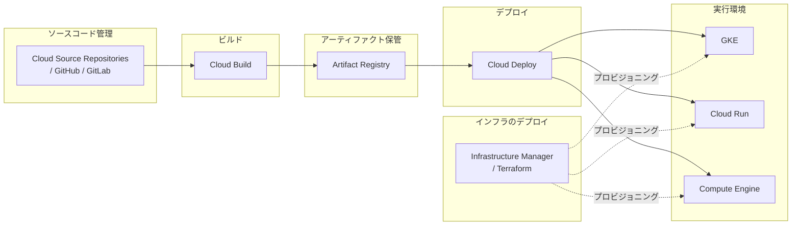

代表的なデプロイ関連サービスの役割分担は次のとおりです。

| サービス | 主な役割 | 対象レイヤー |
|---|---|---|
| Cloud Build | ソースからコンテナイメージやビルド成果物を生成するCI基盤 | アプリケーション（ビルド） |
| Artifact Registry | コンテナイメージ・言語パッケージの一元管理 | アプリケーション（成果物保管） |
| Cloud Deploy | GKE/Cloud Run向けのマネージドCDパイプライン | アプリケーション（デリバリー） |
| Infrastructure Manager | Terraform構成をGoogle Cloudがマネージドで実行するサービス | インフラストラクチャ |
| Config Connector | KubernetesのCRDとしてGoogle Cloudリソースを宣言的に管理 | インフラストラクチャ（GKE運用者向け） |
| Deployment Manager | レガシーなGoogle Cloudネイティブのテンプレートベースプロビジョニング（新規は非推奨、Infrastructure Manager/Terraformが推奨） | インフラストラクチャ（旧世代） |

**ベストプラクティス**

- アプリケーションのデプロイとインフラのデプロイは、それぞれ独立したパイプラインとリポジトリで管理し、変更の影響範囲を明確に分離する。
- Cloud Deployでは**デプロイポリシー**を用いて、特定の時間帯やチャンネルへのデプロイを制限し、変更管理プロセスと整合させる[^1]。
- 本番環境へのロールアウトは、カナリアやBlue-Greenなど段階的デプロイ戦略をCloud Deployの組み込み機能で自動化し、手動オペレーションのミスを排除する[^2]。
- Infrastructure Managerを使う場合でも、Terraform構成そのものはソースリポジトリでバージョン管理し、レビューを経てから適用する運用を徹底する[^3]。

### 5.1.2 API管理のベストプラクティス（Apigee）

企業がAPIを外部パートナーや複数の内部チームに公開する場合、単にCloud RunやGKEでバックエンドを稼働させるだけでは「認証」「レート制限」「バージョニング」「アナリティクス」といった横断的関心事に対応できません。**Apigee**はこれらを一元的に扱うフルライフサイクルAPI管理プラットフォームです[^4]。

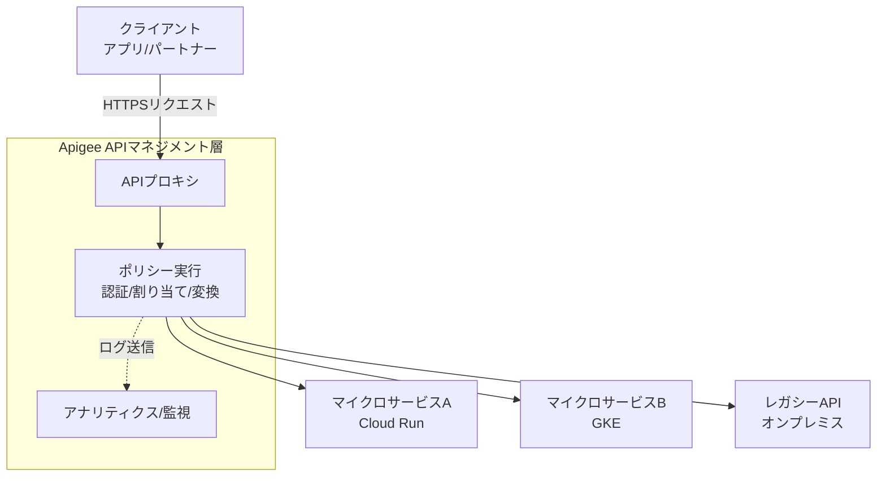

Apigeeが提供する主な機能は次のとおりです。

| 機能カテゴリ | 内容 |
|---|---|
| APIプロキシ | バックエンドサービスの前面に立ち、URL・プロトコルを抽象化する |
| ポリシー | OAuth 2.0/APIキー検証、クォータ、スパイクアレスト（急激なトラフィック抑制）、メッセージ変換などをコード不要で設定 |
| デベロッパーポータル | 外部開発者がAPIドキュメントを閲覧し、APIキーを自己発行できるセルフサービスポータル |
| モニタイゼーション | API利用量に応じた課金プランの設計 |
| アナリティクス | APIトラフィック、レイテンシ、エラー率の可視化 |
| Apigee hybrid | 管理プレーンはGoogle Cloud、ランタイムはオンプレミス/他クラウドに配置するハイブリッド構成 |

**ベストプラクティス**

- 新規APIには必ず**バージョニング戦略**（URLパスバージョニングが一般的）を定め、破壊的変更が既存クライアントに影響しないようにする[^4]。
- レート制限（クォータ）とスパイクアレストポリシーを組み合わせ、バックエンドサービスを過負荷から保護する[^5]。
- APIキーやOAuthトークンの検証は必ずApigeeのポリシー層で行い、バックエンドサービスに認証ロジックを重複実装させない。
- 大規模組織では、複数チームがAPIプロキシを独立して開発・デプロイできるよう、Apigeeの**環境（Environment）**と**環境グループ（Environment Group）**を用いてテナント分離を設計する[^4]。

### 5.1.3 テストフレームワーク（負荷/単体/統合テスト）

ソリューションを安全にデプロイするためには、実装の各レイヤーで適切なテストを組み込む必要があります。PCA試験では「テストの種類とその使い分け」を理解しているかが問われます。

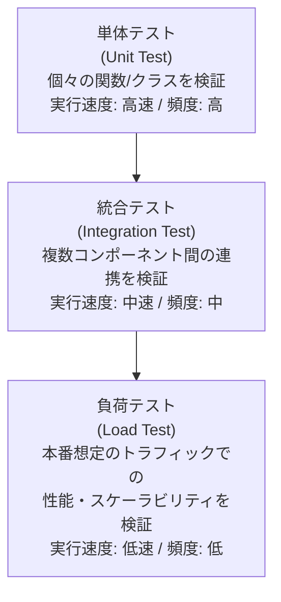

上図はいわゆる「テストピラミッド」の考え方をGoogle Cloud文脈に当てはめたものです。下層ほど数を多く、高頻度に実行し、上層に行くほど数を絞り込んで実行するのが一般的な指針です。

| テスト種別 | 目的 | Google Cloudでの代表的な実施方法 |
|---|---|---|
| 単体テスト | 個々の関数・メソッドのロジック検証 | Cloud Build上でのCI実行（言語標準のテストフレームワークを利用） |
| 統合テスト | サービス間のAPI呼び出し・データフローの検証 | Cloud Buildのステップ内でエミュレータやステージング環境を利用 |
| 負荷テスト | 想定ピーク時のスループット・レイテンシ・エラー率の検証 | Cloud Load Testing（旧称含む）や、OSSツール（Locust、k6、JMeter）をGKE/Compute Engine上で実行 |
| カナリア分析 | 新バージョンのメトリクスを旧バージョンと自動比較 | Cloud Deployのカナリアデプロイ＋Cloud Monitoringによる自動判定 |

**ベストプラクティス**

- CI/CDパイプラインの各ステージ（ビルド後、ステージング環境デプロイ後、本番デプロイ前）に応じて実行するテストレベルを変え、フィードバックループを最短化する。
- 負荷テストは本番と同等のインフラ構成（マシンタイプ、ネットワークトポロジ）を使った専用のステージング環境で実施し、結果の信頼性を担保する。
- 統合テストでは可能な限り実際のマネージドサービスではなく、後述する**Cloudエミュレータ**を利用してテストコストと実行時間を削減する。
- テスト結果はCloud Buildのビルドログおよび品質ゲートと連携させ、閾値未達の場合は自動的にデプロイをブロックする。

### 5.1.4 データとシステムの移行・管理ツール

Section 1のタスク1.4（移行計画の作成）が「計画」にフォーカスするのに対し、Section 5のこの項目は「**実際に移行を実行するためのツール**」にフォーカスします。

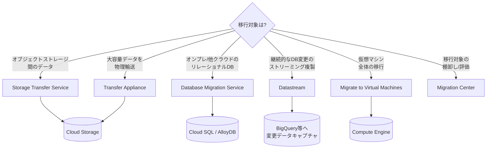

| ツール | 用途 | 特徴 |
|---|---|---|
| Storage Transfer Service | オンライン上のオブジェクトストレージ間のデータ転送 | S3・Azure Blob・オンプレHTTP/HDFSソースに対応、スケジュール転送が可能 |
| Transfer Appliance | ネットワーク帯域が限られる環境での大容量データ移行 | 物理デバイスにデータを書き込みGoogleへ配送するオフライン転送 |
| Database Migration Service (DMS) | MySQL/PostgreSQL/SQL ServerからCloud SQL・AlloyDBへの移行 | 継続的レプリケーションによる最小ダウンタイム移行に対応 |
| Datastream | データベースの変更データキャプチャ（CDC）をBigQuery等へストリーミング | 分析基盤へのリアルタイムデータ連携に利用 |
| Migrate to Virtual Machines | オンプレミス/他クラウドVMのCompute Engineへのリフト＆シフト移行 | ライブ移行に対応し、ダウンタイムを最小化 |
| Migration Center | 移行対象資産の可視化・アセスメント・コスト見積もり | 移行計画立案の起点となる統合ハブ[^6] |

**ベストプラクティス**

- 移行ツールの選定前に必ずMigration Centerでアセスメントを実施し、依存関係とサイジングを把握してから個別ツールに落とし込む[^6]。
- データベース移行では、業務影響を最小化するためDMSの継続的レプリケーション機能を用い、カットオーバーのタイミングを business側と合意の上で決定する。
- 大量データ（目安として帯域で数週間以上かかる規模）はTransfer Applianceのようなオフライン手段を検討し、オンライン転送とのコスト・時間トレードオフを比較する。
- 移行後もDatastreamのようなCDCパイプラインを残し、分析基盤への継続的なデータ同期を維持する設計を検討する。

### 5.1.5 Gemini Cloud Assist

**Gemini Cloud Assist**は、Google CloudコンソールやAPI経由で利用できる生成AIベースの支援機能で、設計・トラブルシューティング・コスト分析など、クラウド運用の様々な場面でアーキテクトと運用チームを支援します[^7]。

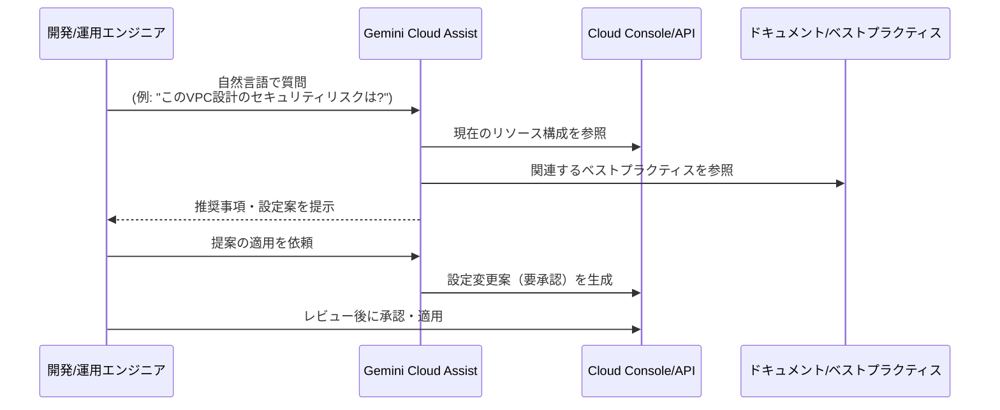

| 活用シーン | できること |
|---|---|
| アーキテクチャ設計支援 | 要件を伝えると構成案やアーキテクチャ図のドラフトを生成 |
| トラブルシューティング | エラーログやアラートの原因分析、修正案の提示 |
| コスト最適化 | 使用状況に基づくリソースサイジングの見直し提案 |
| コード/IaC生成補助 | Terraform構成やgcloudコマンドのドラフト生成 |

**ベストプラクティス**

- Gemini Cloud Assistの提案は**必ず人間がレビューしてから本番環境に適用**する。特にIAMやネットワーク設定の変更提案は影響範囲が大きいため慎重に検証する。
- 組織のセキュリティ・コンプライアンス要件を事前にコンテキストとして共有し、提案の精度を高める。
- Gemini Cloud Assistを日常的なトラブルシューティングの一次窓口として位置づけ、エスカレーション前の初期切り分けに活用し、運用チームの負荷を軽減する。

---

## 5.2 Google Cloudとのプログラムによる対話

タスク5.2は、開発者やアーキテクトが**ブラウザのコンソール画面を使わずに**Google Cloudを操作・開発するための各種インターフェースを扱います。CLI、SDK、エミュレータ、IaC、APIクライアントライブラリまで、プログラマティックなアクセス手段を体系的に理解することが求められます。

### 5.2.1 Cloud Shell Editor、Cloud Code、Cloud Shell Terminal

Google Cloudには、ブラウザだけで完結する開発環境として**Cloud Shell**が提供されています。Cloud ShellにはターミナルとVS Codeベースのエディタ（Cloud Shell Editor）が統合されており、追加のローカル環境構築なしにGoogle Cloudの操作・開発ができます[^8]。

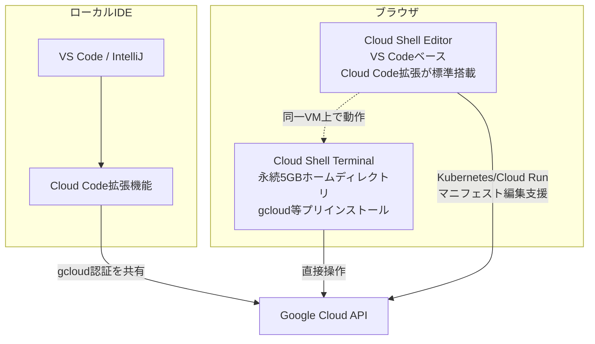

| ツール | 特徴 | 主なユースケース |
|---|---|---|
| Cloud Shell Terminal | ブラウザ上のマネージドLinux環境、gcloud/kubectl/Terraform等がプリインストール | 一時的な検証、緊急時のCLI操作、学習用途 |
| Cloud Shell Editor | Cloud Shell上で動くコードエディタ、Cloud Codeが標準搭載 | 軽量なマニフェスト編集、簡易デバッグ |
| Cloud Code | VS Code/IntelliJ向け拡張機能。ローカルIDEからKubernetes/Cloud Runの開発・デプロイ・デバッグが可能[^9] | 本格的なアプリケーション開発、ローカルでのKubernetesデバッグ |

**ベストプラクティス**

- Cloud Shellのホームディレクトリは永続化されるが**5GBの容量制限**があるため、大きな成果物はCloud Storageなど別の永続ストレージに保存する。
- 本格的な開発はCloud Code拡張機能を使い、使い慣れたローカルIDE（VS Code/IntelliJ）でKubernetesリソースの作成・デプロイ・ライブデバッグを行う。
- Cloud Shellはアイドル状態が続くとVMが回収される点を理解し、恒久的な作業環境としてではなく一時的な操作環境として位置づける。

### 5.2.2 Google Cloud SDK（gcloud、gsutil、bq）

Google Cloud SDK（現在はGoogle Cloud CLIとも呼ばれる）は、コマンドラインからGoogle Cloudリソースを操作するための中核ツール群です。

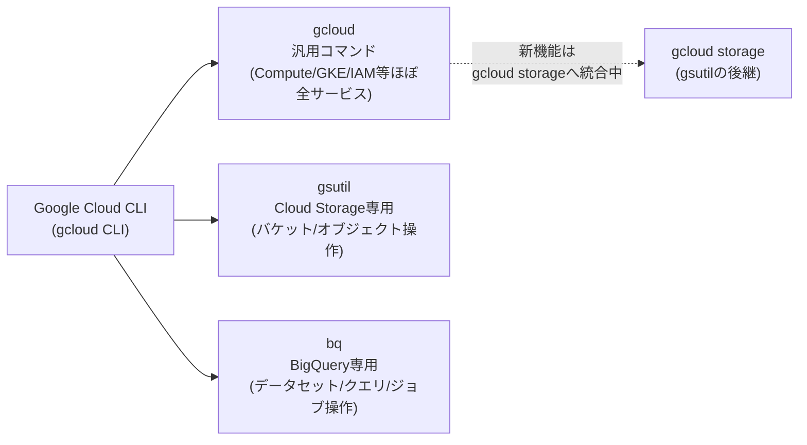

| コマンド | 主な対象 | 代表的なサブコマンド例 |
|---|---|---|
| gcloud | Compute Engine、GKE、IAM、ネットワーキング等、ほぼ全サービス | `gcloud compute instances create`、`gcloud container clusters get-credentials` |
| gsutil | Cloud Storageのバケット・オブジェクト操作 | `gsutil cp`、`gsutil rsync`、`gsutil iam` |
| bq | BigQueryのデータセット・テーブル・クエリジョブ操作 | `bq query`、`bq load`、`bq mk` |
| gcloud storage | gsutilの後継として開発が進むCloud Storage操作コマンド | `gcloud storage cp`、`gcloud storage buckets create` |

**ベストプラクティス**

- 新規のCloud Storage操作スクリプトでは、Googleが今後の主軸として開発を進める`gcloud storage`コマンドの利用を優先的に検討する[^10]。
- CI/CDパイプラインでは、サービスアカウントキーの直接配布を避け、Workload Identity連携やApplication Default Credentials（ADC）を使ってgcloudを認証する。
- `gcloud config configurations`を使い、プロジェクトごとに設定プロファイルを分離することで、誤った環境への操作を防止する。
- スクリプトから呼び出す際は`--format=json`や`--format=value(...)`を使い、出力を構造化してパースしやすくする。

### 5.2.3 Cloudエミュレータ（Bigtable、Spanner、Pub/Sub、Firestore）

一部のマネージドサービスには、**ローカル環境で本番同等のAPIを模倣するエミュレータ**が提供されています。これにより、開発中に実際の課金対象リソースを作成せずに統合テストを実施できます[^11]。

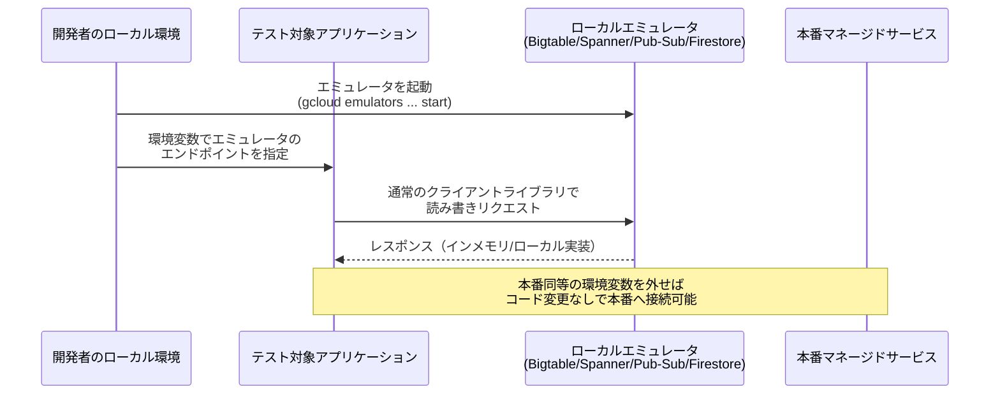

| サービス | エミュレータの特徴 |
|---|---|
| Bigtable | `cbt`ツールやAPI互換のローカルサーバーを提供し、スキーマ設計の検証に利用 |
| Spanner | ローカルでSpanner互換APIを提供し、トランザクション・スキーマのテストに利用（一部の高度な機能は非対応） |
| Pub/Sub | トピック・サブスクリプションのpublish/subscribeフローをローカルで再現 |
| Firestore | ローカルでFirestoreのドキュメント/コレクション操作をエミュレート、セキュリティルールのテストも可能 |

**ベストプラクティス**

- CI環境の統合テストステージでは、実際のマネージドインスタンスの代わりにエミュレータをコンテナとして起動し、テストごとの課金コストとプロビジョニング時間を削減する。
- エミュレータは本番の全機能を完全に再現するわけではない（特にSpannerの一部整合性動作やレイテンシ特性）ため、最終的な性能検証は必ずステージング環境の実サービスで行う。
- アプリケーションコードでは、エンドポイントを環境変数で切り替えられるように設計し、エミュレータ/本番を同一コードパスでテストできるようにする。

### 5.2.4 Infrastructure as Code（IaC、Terraform）

Infrastructure as Code（IaC）は、インフラ構成をコードとして宣言的に記述し、バージョン管理・レビュー・自動適用の対象とするプラクティスです。Google Cloudでは**Terraform**が事実上の標準ツールとして広く採用されています[^12]。

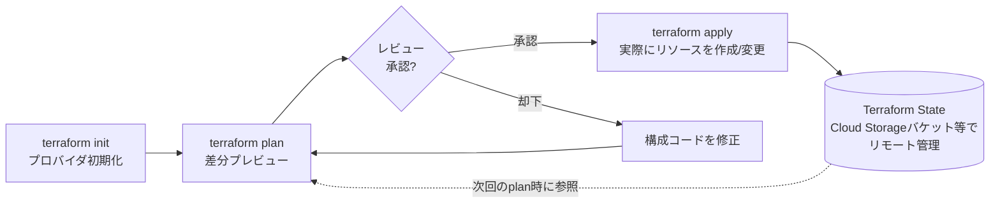

| ツール/概念 | 説明 |
|---|---|
| Terraform構成ファイル（.tf） | リソースを宣言的に記述するHCL形式のファイル |
| Terraform State | 現在管理しているリソースの状態を記録するファイル。Cloud Storageなどにリモート保存し、チームで共有・ロックする |
| モジュール | 再利用可能なTerraform構成の単位。VPCやGKEクラスタなど典型的な構成をモジュール化して組織内で標準化する |
| Infrastructure Manager | GoogleがマネージドでTerraform実行を代行するサービス。State管理やCI/CD連携をGoogle Cloud側に任せられる[^13] |
| Config Connector | Kubernetesのカスタムリソース（CRD）としてGoogle Cloudリソースを宣言的に管理する仕組み。GitOpsとの親和性が高い[^14] |

**ベストプラクティス**

- Terraform Stateは必ずリモートバックエンド（Cloud Storage＋状態ロック）で管理し、ローカルファイルとしての運用を避ける[^12]。
- 環境（開発/ステージング/本番）ごとにStateとワークスペースを分離し、誤って本番環境に開発用の変更を適用するリスクを減らす。
- 頻出パターン（VPC、GKE、IAMバインディング等）はモジュール化し、組織全体で一貫した構成を再利用できるようにする。
- Terraform実行はCI/CDパイプライン（Cloud Buildなど）に組み込み、`plan`の結果を人間がレビューしてから`apply`する2段階の承認フローを設ける。
- 素のTerraform運用が難しいチームには、State管理やスケジュール実行をGoogle側に委譲できるInfrastructure Managerの採用を検討する[^13]。

### 5.2.5 Google APIへのアクセスのベストプラクティス

Google CloudのほぼすべてのサービスはREST/gRPC APIとして公開されており、コンソールやCLIもすべて内部的にはこれらのAPIを呼び出しています。プログラムからAPIへ安全にアクセスするための認証パターンを理解することが重要です[^15]。

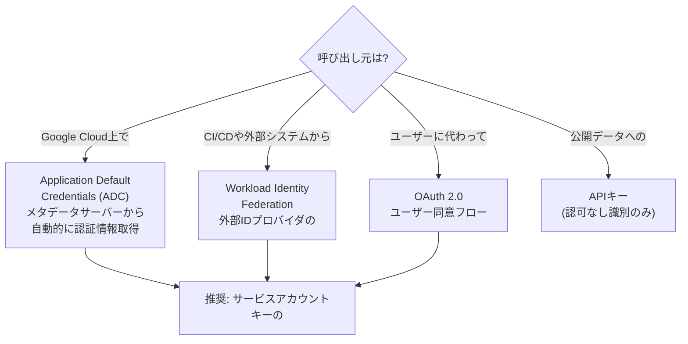

| 認証方式 | 適するケース | 注意点 |
|---|---|---|
| Application Default Credentials（ADC） | Compute Engine/GKE/Cloud Run等、Google Cloud上で動作するワークロード | メタデータサーバーやWorkload Identityから自動取得され、キー管理が不要 |
| Workload Identity Federation | 他クラウドやオンプレミス、CI/CDからの認証 | サービスアカウントキーの発行を回避できる推奨パターン[^16] |
| OAuth 2.0 | ユーザーに代わってGoogle Cloud/Workspaceリソースへアクセスするアプリ | 同意画面とスコープ管理が必要 |
| APIキー | 認可を伴わない公開APIへの単純なアクセス制御・識別 | 機密性の高い操作には使用しない、HTTPリファラ/IP制限を併用する |
| サービスアカウントキー（JSON） | 上記が使えないレガシー環境向けの最終手段 | 漏洩リスクが高く、可能な限り避けて定期ローテーションと保管管理を徹底する |

**ベストプラクティス**

- 可能な限り**サービスアカウントキーの発行を避け**、ADCまたはWorkload Identity Federationを優先する[^16]。
- APIキーは認証ではなく識別のための仕組みであることを理解し、機微なデータや変更操作には使用しない。
- クライアントには最小権限のIAMロールを付与し、APIごとに個別のサービスアカウントを分離して影響範囲を限定する。
- APIクォータとレート制限を事前に確認し、指数バックオフを伴うリトライロジックをクライアント側に実装する。

### 5.2.6 Google APIクライアントライブラリ

Google Cloud APIクライアントライブラリは、各言語向けにイディオマティックなインターフェースを提供し、認証・リトライ・ページネーションといった定型処理を隠蔽してくれます[^17]。

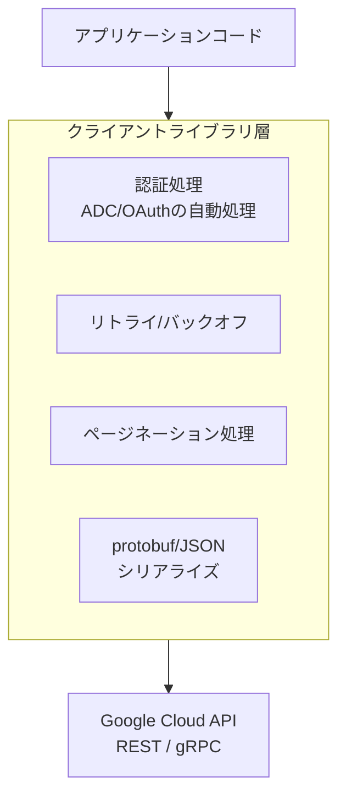

| ライブラリ種別 | 特徴 |
|---|---|
| Cloud Client Libraries | Google Cloudの各サービス向けに提供される、言語イディオマティックな公式ライブラリ（Python/Java/Go/Node.js/C#等） |
| Google API Client Libraries | Cloud Client Librariesがまだ存在しないAPIも含め、より広範なGoogle APIをカバーする汎用クライアント |
| gRPCベースAPI | 高スループット・低レイテンシが求められるサービス（Bigtable/Spanner等）で採用される通信方式 |

**ベストプラクティス**

- 対象サービスにCloud Client Libraryが存在する場合は、汎用のGoogle API Client Libraryよりも優先して使用し、よりイディオマティックでメンテナンス性の高いコードを書く。
- クライアントライブラリが提供する自動リトライ・指数バックオフの設定値を、アプリケーションのSLA要件に合わせて調整する。
- 認証情報はコードにハードコーディングせず、ADCやシークレットマネージャー経由でクライアントライブラリに渡す。
- gRPCベースのAPIを使う際は、コネクションプーリングやチャネルの再利用を意識し、接続確立のオーバーヘッドを最小化する。

---

## 実装ツールチェーンの全体像

5.1と5.2で見てきた要素を1枚に統合すると、以下のような全体像になります。PCA試験では個別ツールの機能だけでなく、「どのツールがどの段階で組み合わさるか」という全体観が問われることが多いため、ここで一度整理しておきましょう。

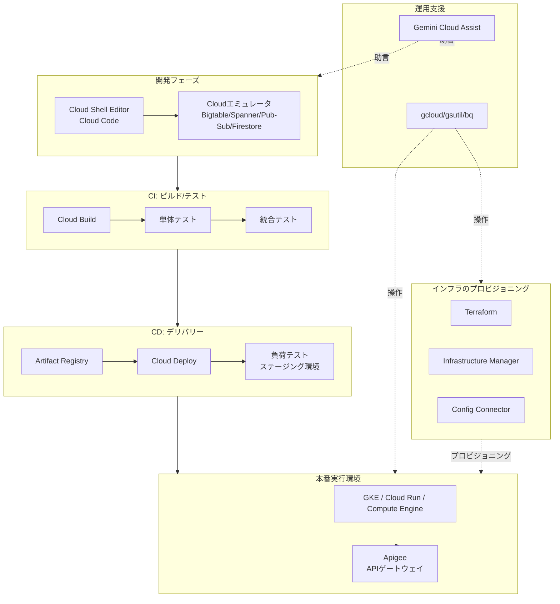

| フェーズ | 主な関心事 | 代表サービス |
|---|---|---|
| 開発 | ローカルでの高速な反復開発 | Cloud Shell Editor、Cloud Code、Cloudエミュレータ |
| CI（継続的インテグレーション） | コード変更のビルドと自動テスト | Cloud Build、単体/統合テスト |
| CD（継続的デリバリー） | 安全な段階的リリース | Artifact Registry、Cloud Deploy、負荷テスト |
| インフラプロビジョニング | 環境の再現可能な構築 | Terraform、Infrastructure Manager、Config Connector |
| 本番実行 | アプリケーションとAPIの提供 | GKE/Cloud Run/Compute Engine、Apigee |
| 運用支援 | 日々の操作とトラブルシューティング | gcloud/gsutil/bq、Gemini Cloud Assist |

---

## ケーススタディ適用の視点

PCA試験の各セクションは、公式ケーススタディ（Altostrat Media、Cymbal Retail、EHR Healthcare、KnightMotives Automotive）と組み合わせて出題されることがあります。Section 5の技術要素がそれぞれのケーススタディでどう問われうるか、学習の視点として整理します（以下は各ケーススタディの一般的な業種特性から想定される学習ポイントであり、試験本番の設問内容を示すものではありません）。

| ケーススタディ | 業種の特性 | Section 5の技術要素との接点（学習の視点） |
|---|---|---|
| Altostrat Media | メディア/コンテンツ配信、AIによるメタデータ抽出・モデレーション | パートナー向けAPI公開でのApigee活用、コンテンツ処理パイプラインのCI/CD設計 |
| Cymbal Retail | 小売、パーソナライゼーションと在庫最適化 | 繁忙期に向けた負荷テスト設計、需要変動に対応するデプロイ戦略 |
| EHR Healthcare | 医療記録管理、厳格なコンプライアンス要件 | レガシーオンプレミスDBからのデータ移行ツール選定、変更管理を伴う慎重なデプロイポリシー |
| KnightMotives Automotive | コネクテッドカー、グローバルなテレメトリデータ収集 | Pub/Subエミュレータを用いたテレメトリ取り込みのテスト、Terraformによるマルチリージョンインフラの一貫した展開 |

**学習のポイント**: ケーススタディの詳細を丸暗記する必要はありませんが、「この業種ならどんな制約（コンプライアンス、データローカリティ、トラフィックの急増など）が生じ、Section 5のどのツールで対応するか」を自分の言葉で説明できるようにしておくと、シナリオ問題への対応力が高まります。

---

## 学習チェックリスト

以下のチェックリストで、Section 5の理解度を自己確認してください。

- [ ] Cloud Build、Artifact Registry、Cloud Deployの役割分担をアプリデプロイの文脈で説明できる
- [ ] Infrastructure Manager／Config Connector／Deployment Managerの違いと使い分けを説明できる
- [ ] Cloud Deployのカナリア/Blue-Greenデプロイ戦略の違いを説明できる
- [ ] Apigeeが提供する主要機能（プロキシ、ポリシー、デベロッパーポータル、アナリティクス）を列挙できる
- [ ] Spike ArrestポリシーとQuotaポリシーの違いを説明できる
- [ ] 単体テスト・統合テスト・負荷テストの目的と実施タイミングの違いを説明できる
- [ ] Storage Transfer Service、Transfer Appliance、DMS、Datastream、Migrate to Virtual Machines、Migration Centerの使い分けを説明できる
- [ ] Gemini Cloud Assistが支援できる代表的なユースケースを3つ以上挙げられる
- [ ] Cloud Shell Terminal、Cloud Shell Editor、Cloud Codeの違いを説明できる
- [ ] gcloud、gsutil（およびgcloud storage）、bqのそれぞれの主対象サービスを説明できる
- [ ] Bigtable/Spanner/Pub-Sub/Firestoreエミュレータを使う目的とメリットを説明できる
- [ ] Terraformのinit/plan/applyのワークフローとStateのリモート管理の重要性を説明できる
- [ ] ADC、Workload Identity Federation、OAuth 2.0、APIキーの適切な使い分けを説明できる
- [ ] サービスアカウントキーを避けるべき理由と代替手段を説明できる
- [ ] Cloud Client LibrariesとGoogle API Client Librariesの違いを説明できる
- [ ] 4つの公式ケーススタディそれぞれの業種特性とSection 5の技術要素の接点を大まかに説明できる

---

## 参考文献

本ガイドの記述は、以下の公式ドキュメントおよび公式試験ガイドを根拠としています。

[^1]: Google Cloud Documentation. "Restrict deploy behavior using policies." https://cloud.google.com/deploy/docs/deploy-policy
[^2]: Google Cloud Documentation. "Use a deployment strategy." https://cloud.google.com/deploy/docs/deployment-strategies
[^3]: Google Cloud Documentation. "Infrastructure Manager overview." https://cloud.google.com/infrastructure-manager/docs/overview
[^4]: Google Cloud Documentation. "What is Apigee?" https://cloud.google.com/apigee/docs/api-platform/get-started/what-apigee
[^5]: Google Cloud Documentation. "Add the SpikeArrest policy to your API." https://cloud.google.com/apigee/docs/api-platform/tutorials/add-spike-arrest
[^6]: Google Cloud Documentation. "Migration Center overview." https://cloud.google.com/migration-center/docs/migration-center-overview
[^7]: Google Cloud. "Gemini Cloud Assist: AI-assisted cloud operations and management." https://cloud.google.com/products/gemini/cloud-assist
[^8]: Google Cloud Documentation. "Cloud Shell Editor interface overview." https://cloud.google.com/shell/docs/editor-overview
[^9]: Google Cloud Documentation. "Cloud Code overview." https://cloud.google.com/code/docs/vscode/overview
[^10]: Google Cloud Documentation. "gsutil tool." https://cloud.google.com/storage/docs/gsutil
[^11]: Google Cloud Documentation. "gcloud emulators." https://cloud.google.com/sdk/gcloud/reference/emulators
[^12]: Google Cloud Documentation. "Best practices for Terraform operations." https://cloud.google.com/docs/terraform/best-practices/operations
[^13]: Google Cloud Documentation. "Infrastructure Manager overview." https://cloud.google.com/infrastructure-manager/docs/overview
[^14]: Google Cloud Documentation. "Config Connector overview." https://cloud.google.com/config-connector/docs/overview
[^15]: Google Cloud Documentation. "Authentication for Google Cloud APIs and services." https://cloud.google.com/docs/authentication
[^16]: Google Cloud Documentation. "Workload Identity Federation." https://cloud.google.com/iam/docs/workload-identity-federation
[^17]: Google Cloud Documentation. "Client libraries and Cloud APIs explained." https://cloud.google.com/apis/docs/client-libraries-explained
[^18]: Google Cloud. "Professional Cloud Architect Certification exam guide." https://services.google.com/fh/files/misc/professional_cloud_architect_exam_guide_english.pdf
[^19]: Google Cloud. "Professional Cloud Architect Certification | Learn." https://cloud.google.com/learn/certification/cloud-architect
