# Google Cloud Professional Cloud Architect試験 Section 6: ソリューションと運用の卓越性の確保

> 本ガイドはGoogle Cloud公式の[Professional Cloud Architect認定ページ](https://cloud.google.com/learn/certification/cloud-architect)[^2]および[公式Exam Guide(PDF)](https://services.google.com/fh/files/misc/professional_cloud_architect_exam_guide_english.pdf)[^1]に基づき、試験の**Section 6: Ensuring solution and operations excellence(ソリューションと運用の卓越性の確保、配点約12.5%)**の出題内容を初学者向けに解説するものです。Section 6は6.1〜6.6の6つのタスク領域で構成されており、Well-Architected Frameworkの「運用の卓越性の柱」を土台に、オブザーバビリティ、デプロイ管理、サポート、品質管理、本番信頼性という運用ライフサイクル全体をカバーします。

## 目次

- [このセクションについて](#このセクションについて)
- [6.1 運用の卓越性の柱の原則と推奨事項](#61-運用の卓越性の柱の原則と推奨事項)
  - [Well-Architected Frameworkにおける位置づけ](#well-architected-frameworkにおける位置づけ)
  - [運用準備の4つのフォーカスエリア](#運用準備の4つのフォーカスエリア)
  - [核となる原則1: CloudOpsによる運用準備とパフォーマンスの確保](#核となる原則1-cloudopsによる運用準備とパフォーマンスの確保)
  - [核となる原則2: インシデントと問題の管理](#核となる原則2-インシデントと問題の管理)
  - [核となる原則3: クラウドリソースの管理と最適化](#核となる原則3-クラウドリソースの管理と最適化)
  - [核となる原則4: 変更の自動化と管理](#核となる原則4-変更の自動化と管理)
  - [核となる原則5: 継続的な改善とイノベーション](#核となる原則5-継続的な改善とイノベーション)
- [6.2 Google Cloud Observability](#62-google-cloud-observability)
  - [オブザーバビリティの全体像](#オブザーバビリティの全体像)
  - [モニタリングとロギング](#モニタリングとロギング)
  - [プロファイリングとベンチマーキング](#プロファイリングとベンチマーキング)
  - [アラート戦略](#アラート戦略)
- [6.3 デプロイとリリース管理](#63-デプロイとリリース管理)
  - [Cloud Deployの基本構造](#cloud-deployの基本構造)
  - [デプロイ戦略](#デプロイ戦略)
  - [承認・プロモーション・ロールバック](#承認プロモーションロールバック)
- [6.4 デプロイ済みソリューションのサポート支援](#64-デプロイ済みソリューションのサポート支援)
  - [Google Cloudサポートティア](#google-cloudサポートティア)
  - [Active AssistとRecommender](#active-assistとrecommender)
  - [Personalized Service Health](#personalized-service-health)
- [6.5 品質管理の評価](#65-品質管理の評価)
  - [CI/CDパイプラインにおける品質ゲート](#cicdパイプラインにおける品質ゲート)
  - [エラーバジェットによるリリースゲーティング](#エラーバジェットによるリリースゲーティング)
  - [ブレームレスポストモーテム文化](#ブレームレスポストモーテム文化)
- [6.6 本番環境における信頼性の確保](#66-本番環境における信頼性の確保)
  - [カオスエンジニアリング](#カオスエンジニアリング)
  - [ペネトレーションテスト](#ペネトレーションテスト)
  - [負荷テスト](#負荷テスト)
- [ケーススタディへの適用の視点](#ケーススタディへの適用の視点)
- [Well-Architected Framework対応表](#well-architected-framework対応表)
- [学習チェックリスト](#学習チェックリスト)
- [参考文献](#参考文献)

## このセクションについて

公式Exam Guideは、Professional Cloud Architectについて「エンタープライズのクラウド戦略、ソリューション設計、ワークロードの移行方式、デプロイとオーケストレーション、最適化、アーキテクチャのベストプラクティスに精通していること」を求めており、その大前提として**Google Cloud Well-Architected Frameworkへの習熟**を明示的な要件として挙げています[^1]。Well-Architected Frameworkの6本の柱(運用の卓越性、セキュリティ・プライバシー・コンプライアンス、信頼性、コスト最適化、パフォーマンス最適化、サステナビリティ)は、試験全体の出題に暗黙的・明示的に織り込まれているとされています[^1]。

Section 6はこのうち「運用の卓越性の柱」に最も直接的に対応するセクションであり、以下の6つのタスクで構成されます[^1]。

| タスク | 内容 |
| --- | --- |
| 6.1 | Well-Architected Frameworkの運用の卓越性の柱の原則と推奨事項の理解 |
| 6.2 | Google Cloud Observabilityソリューションへの精通(モニタリングとロギング、プロファイリングとベンチマーキング、アラート戦略) |
| 6.3 | デプロイとリリース管理 |
| 6.4 | デプロイ済みソリューションのサポート支援 |
| 6.5 | 品質管理措置の評価 |
| 6.6 | 本番環境におけるソリューションの信頼性確保(カオスエンジニアリング、ペネトレーションテスト、負荷テストなど) |

出題では、Altostrat Media・Cymbal Retail・EHR Healthcare・KnightMotives Automotiveという4つの公式ケーススタディが参照されることがあります[^1]。各ケーススタディは業種やビジネス要件が異なるため、同じ技術要素(例: アラート戦略やデプロイ戦略)でも、どのような制約(規制対応、ダウンタイム許容度、コスト感度など)のもとで最適解が変わるかを意識して学習することが重要です。

## 6.1 運用の卓越性の柱の原則と推奨事項

### Well-Architected Frameworkにおける位置づけ

Well-Architected Frameworkは、アーキテクト・開発者・管理者などクラウド関係者が、安全で効率的、レジリエントで高性能、そしてコスト効率の良いクラウドトポロジーを設計・運用するための推奨事項を提供するものです[^3][^4]。推奨事項は「柱(pillar)」と呼ばれる6つの非機能領域に整理されています[^3]。

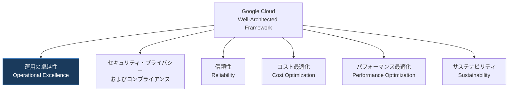

「運用の卓越性の柱」は、クラウドワークロードを効率的にデプロイ・運用・モニタリング・管理するための推奨事項を提供します[^5]。単なる技術的なオペレーション能力にとどまらず、継続的な学習と実験を奨励する文化的な変革も含むとされており、チームがアイデアを共有し、前提を疑い、改善を推進できる協働的な環境づくりが重要視されています[^5]。

運用の卓越性の柱は、次の5つの読者層に向けて書かれています[^5]。

| 対象読者 | この柱が提供するもの |
| --- | --- |
| マネージャー・リーダー | クラウド投資がビジネス目標を支援する価値を提供し続けるための、運用卓越性の確立・維持フレームワーク |
| クラウド運用チーム | インシデントと問題の管理、キャパシティプランニング、パフォーマンス最適化、変更管理に関するガイダンス |
| サイト信頼性エンジニア(SRE) | モニタリング、インシデント対応、自動化を含む高いサービス信頼性を達成するためのベストプラクティス |
| クラウドアーキテクト・エンジニア | 設計・実装フェーズにおける運用要件とベストプラクティス |
| DevOpsチーム | 自動化、CI/CDパイプライン、変更管理に関するガイダンス |

### 運用準備の4つのフォーカスエリア

運用の卓越性の柱を理解するうえで鍵となるのが「運用準備(Operational Readiness)」という考え方です。これは、組織がGoogle Cloud上で複雑なワークロードを稼働させるために、Day-1(稼働開始)とDay-2(継続運用、通称CloudOps)の両方をどう準備するかを指します[^6]。運用準備は次の4つのフォーカスエリアに分解されます[^6]。

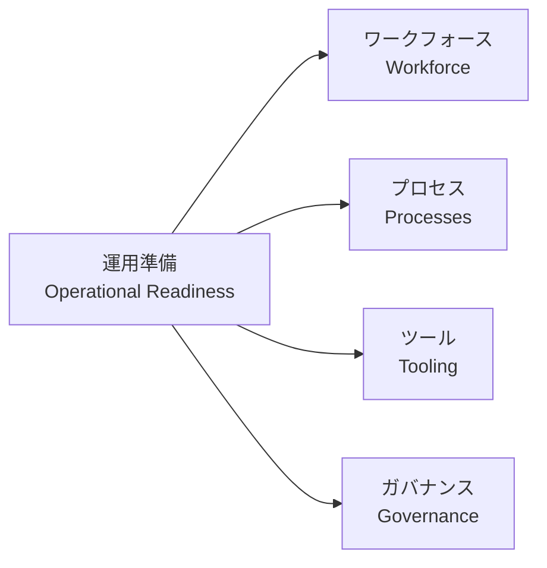

| フォーカスエリア | 主な活動・構成要素 |
| --- | --- |
| ワークフォース | クラウドリソースを管理・運用するチームの役割と責任の明確化、必要スキルの確保、学習プログラムの整備、チーム構造の確立、人材採用 |
| プロセス | オブザーバビリティ、サービス障害の管理、クラウドデリバリー、コアなクラウド運用 |
| ツール | CloudOpsプロセスを支えるために必要なツール群 |
| ガバナンス | サービスレベルとレポーティング、クラウド財務、クラウド運用モデル、アーキテクチャレビュー/ガバナンスボード、クラウドアーキテクチャとコンプライアンス |

以降で紹介する5つの核となる原則は、いずれもこの4つのフォーカスエリアのいずれか(または複数)にマッピングされています[^6]。

### 核となる原則1: CloudOpsによる運用準備とパフォーマンスの確保

この原則は、サービスパフォーマンスに関する明確な期待値とコミットメントの設定、堅牢なモニタリングとアラート、パフォーマンステストの実施、キャパシティニーズの事前計画を重視します[^6]。

**SLOとSLAの定義**: クラウド運用チームの中心的な責務の一つが、すべての重要なワークロードについてサービスレベル目標(SLO)とサービスレベル契約(SLA)を定義することです[^6]。SLOはSMART基準を満たす必要があるとされています[^6]。

| SMART基準 | 説明 |
| --- | --- |
| Specific(具体的) | 求めるサービスレベルとパフォーマンスを明確に記述する |
| Measurable(測定可能) | 定量化・追跡が可能である |
| Achievable(達成可能) | 組織の能力とリソースの範囲内で到達可能である |
| Relevant(関連性がある) | ビジネス目標・優先事項と整合している |
| Time-bound(期限が明確) | 測定・評価の期間が定義されている |

例えば「可用性99.9%」「平均応答時間200ミリ秒未満」といったSLOが挙げられます[^6]。Cloud Monitoringとサービスレベル指標(SLI)は、SLO/SLAの定義・追跡を支援するツールです[^6]。SLAは顧客に対するコミットメントであり、提供サービスの詳細、期待されるサービスレベル、双方の責任、非準拠時のペナルティや救済策を含む契約上の合意として機能します[^6]。

**包括的なオブザーバビリティの実装**: リアルタイムの可視性を得るために、Google Cloud Observabilityツールとサードパーティソリューションを組み合わせて使うことが推奨されています[^6]。CPU使用率、メモリ使用量、ネットワークトラフィック、ディスクI/O、アプリケーション応答時間といったシステムヘルス指標に加え、ビジネス固有の指標も監視対象とすべきです[^6]。詳細は[6.2 Google Cloud Observability](#62-google-cloud-observability)で扱います。

**パフォーマンステストと負荷テスト**: クラウドベースのアプリケーションとインフラがピーク負荷に耐え、最適なパフォーマンスを維持できることを確認するために、定期的なパフォーマンステストが推奨されます[^6]。負荷テストは現実的なトラフィックパターンをシミュレートし、ストレステストはシステムを限界まで押し上げてボトルネックを特定します[^6]。Cloud Load Balancingや負荷テストサービスを用いて実際のトラフィックパターンをシミュレートできます[^6]。

**キャパシティの計画と管理**: 将来のキャパシティニーズを事前に計画することは、クラウドベースシステムのスムーズな運用とスケーラビリティを確保するために欠かせません[^6]。これにはコンピューティングインスタンス、ストレージ、APIリクエストなどのクォータの理解と管理が含まれます[^6]。過去の利用パターン、成長予測、ビジネス要件を分析し、Cloud MonitoringやBigQueryを用いて将来の需要を予測します[^6]。季節変動(ホリデーシーズンなど)や計画イベント(製品ローンチ、マーケティングキャンペーン)による一時的な需要急増も考慮し、災害対策(DR)システムが優雅なフェイルオーバーを行えるだけのキャパシティも計画しておく必要があります[^6]。オートスケーリングは、ワークロードの変動に応じてリソースを動的に調整するための重要な戦略です[^6]。

**継続的なモニタリングと最適化**: パフォーマンス指標を継続的にモニタリング・分析するプロセスを確立することが求められます[^6]。ログとトレースの定期的なレビュー、キャッシング・データベース最適化・コードプロファイリングといったパフォーマンスチューニング技法の適用が挙げられています[^6]。

### 核となる原則2: インシデントと問題の管理

インシデント管理と問題管理は、機能する運用環境の重要な構成要素です[^7]。この原則が扱う内容の多くは信頼性の柱でも詳しく説明されており、補足資料としてGoogle SRE Bookが推奨されています[^7]。

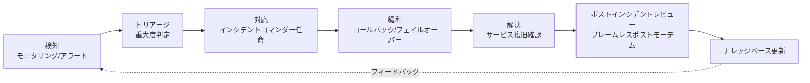

主な推奨事項は次のとおりです[^7]。

| 推奨事項 | 概要 |
| --- | --- |
| 明確なインシデント対応手順の確立 | インシデントコマンダー・調査担当・コミュニケーション担当・技術専門家など役割を定義し、エスカレーションパスを整備。ランブック/プレイブックとして文書化し定期的に見直す |
| インシデント管理の一元化 | 一元化されたインシデント管理システムにより可視性向上・部門間の協調強化・アカウンタビリティの明確化を実現 |
| 徹底したポストインシデントレビュー(PIR/ポストモーテム)の実施 | 学際的なチームが根本原因分析を行い、ブレームレス文化のもとで報告書を作成・共有する |
| ナレッジベースの維持 | 既知の問題・解決策・トラブルシューティングガイドを蓄積し、エスカレーションの必要性を減らして効率を高める |
| インシデント対応の自動化 | Cloud Run functionsやCloud Runなどを用いて検知・診断情報収集・アラート・修復アクションを自動化し、検知/解決時間を短縮する |

### 核となる原則3: クラウドリソースの管理と最適化

この原則は、実際の使用状況と需要に基づいたリソースの適正サイジング、動的なリソース割り当てのためのオートスケーリング活用、コスト最適化戦略の実装、リソース利用状況とコストの定期的なレビューを扱います[^8]。詳細はコスト最適化の柱でも扱われますが、運用の卓越性の観点では「効率性」「パフォーマンス」「スケーラビリティ」という3つの目標のバランスが重視されます[^8]。

| 推奨事項 | 主なツール・手法 |
| --- | --- |
| 適正サイジング(Right-sizing) | Cloud Monitoringによるリアルタイムの使用率可視化、Recommenderによる最適化提案、カスタム指標に基づく自動アクション |
| オートスケーリング | Compute Engineのマネージドインスタンスグループ(MIG)、GKEのCluster Autoscaler/Horizontal Pod Autoscaler/Vertical Pod Autoscaler/Node Auto-Provisioning、Cloud Runの組み込みオートスケーリング |
| コスト最適化戦略 | 確約利用割引(CUD)、継続利用割引、Spot VM |
| リソース使用状況とコストの追跡 | タグ・ラベル付けによる分類、Cloud Billingとコスト管理ツールによる可視化、カスタムダッシュボード |
| コスト配分と予算管理 | チーム/プロジェクト単位のコスト配分・チャージバック、Cloud Billingの予算とアラート機能 |

### 核となる原則4: 変更の自動化と管理

変更管理と自動化は、クラウド環境内でのスムーズかつ制御された移行を確保するうえで重要な役割を果たします[^9]。この原則は次の4つの基礎要素の上に成り立っています[^9]。


| 基礎要素 | 内容 |
| --- | --- |
| 変更ガバナンス | 承認プロセスやコミュニケーション計画を含む、変更管理のための明確なポリシーと手続きの確立 |
| リスクアセスメント | 変更に伴う潜在的リスクの特定とリスク管理技法による低減 |
| テストと検証 | 変更が機能要件・パフォーマンス要件を満たし、リグレッションを防止することの徹底検証 |
| 制御されたデプロイ | ロールバック機構を備えた、利用者へのシームレスな移行を伴う制御されたデプロイ |

具体的な推奨事項は次のとおりです[^9]。

| 推奨事項 | 概要 |
| --- | --- |
| IaC(Infrastructure as Code)の採用 | Terraformなどを用いてクラウドインフラを宣言的に定義・管理し、一貫性・再現性・変更管理の簡素化を実現 |
| バージョン管理システムの導入 | Gitなどにより変更履歴の可視化、コラボレーション促進、ロールバック容易性を確保 |
| CI/CDパイプラインの構築 | Cloud BuildとCloud Deployを用いて、ビルド・テスト・デプロイの各段階を自動化し、より速く頻度の高いリリースと品質管理の向上を実現 |
| 構成管理ツールの活用 | Puppet、Chef、Ansible、VM Managerなどによりリソースの一貫性とコンプライアンスを確保し、手動エラーのリスクを低減 |
| 自動テストの統合 | 単体テスト・統合テスト・E2Eテストを組み合わせ、デプロイ前に変更を検証してエラーとリグレッションのリスクを低減 |

### 核となる原則5: 継続的な改善とイノベーション

クラウドにおいて継続的に改善・イノベーションを進めるには、継続的な学習、実験、適応への注力が必要です[^10]。これにより、新技術の探索や既存プロセスの最適化を通じて、組織が業界リーダーシップを維持できるような卓越性の文化が醸成されます[^10]。

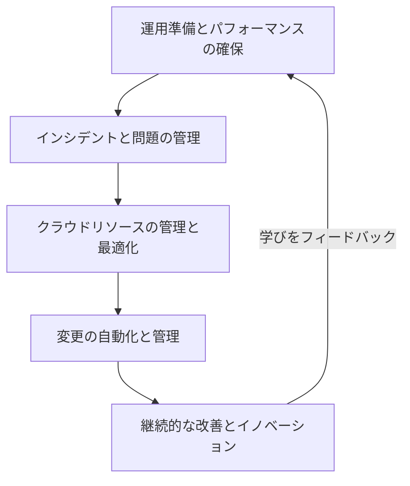

この原則を通じて達成できる主な目標は次のとおりです[^10]。

| 目標 | 内容 |
| --- | --- |
| イノベーションの加速 | 新しい技術・サービスを探索し、能力向上と差別化を推進する |
| コストの削減 | プロセス改善の取り組みを通じて非効率を特定・排除する |
| アジリティの向上 | 変化する市場ニーズや顧客要求に迅速に適応する |
| 意思決定の改善 | データと分析からの洞察により、データドリブンな意思決定を行う |

主にワークフォースのフォーカスエリアにマッピングされる原則であり、学習の文化がチームに新しいツールや技術を実験する余地を与え、能力の拡張とコスト削減につながるとされています[^10]。具体的には、失敗を成長機会と捉えるブレームレス文化のもとでチームの実験と知識共有を奨励し、フォーマル/インフォーマルな学習セッションや社内カンファレンスを通じて組織全体の学習機会を創出することが推奨されています[^10]。

## 6.2 Google Cloud Observability

### オブザーバビリティの全体像

Google Cloud Observability(旧称Stackdriver)は、Google Cloud上のアプリケーションやシステム、さらにはオンプレミスや他クラウド上のワークロードに対しても、統合されたモニタリング・ロギング・トレースのマネージドサービス群を提供します[^11]。中核となるプロダクトは次のとおりです。

| プロダクト | 役割 |
| --- | --- |
| Cloud Monitoring | メトリクス・イベント・メタデータを収集し、ダッシュボードとアラートで可視化する[^11][^12] |
| Cloud Logging | 監査ログ・プラットフォームログ・アプリケーションログを一元的に収集・保存・検索・分析する[^12] |
| Cloud Trace | 分散システムにおけるリクエストのレイテンシデータを収集するトレーシングシステム[^12] |
| Cloud Profiler | 本番アプリケーションのCPU使用率とメモリ割り当てを低オーバーヘッドで継続的に収集する統計的プロファイラ[^12] |
| Error Reporting | アプリケーションで発生したエラーを集約・表示する |

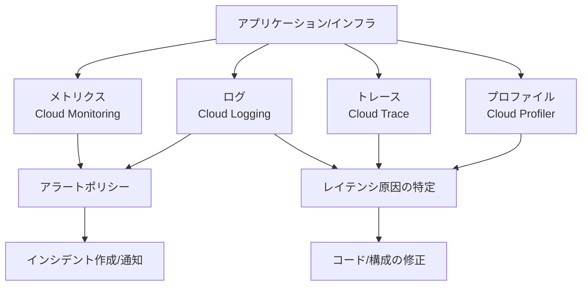

一般的な障害解析のワークフローとしては、Cloud Monitoringで高レイテンシのアラートを検知し、Cloud Traceでどのサービスが遅いのかを特定し、Cloud Loggingで詳細なエラーメッセージとコンテキストを確認するという流れが典型的です。

### モニタリングとロギング

Cloud Monitoringはリソースの使用率、パフォーマンス特性、全体的なヘルス状態への洞察を提供し、Cloud Loggingはすべてのサービスからのログへの一元的なアクセスを提供します。両者を組み合わせることで、システムの内部状態を外部から観測可能にする「オブザーバビリティ」が実現されます。運用準備の原則(6.1)で述べたとおり、CPU使用率・メモリ使用量・ネットワークトラフィック・ディスクI/O・応答時間などのシステムヘルス指標に加え、ビジネス固有の指標もあわせて監視することが推奨されます[^6]。

### プロファイリングとベンチマーキング

**Cloud Profiler**は、本番環境で稼働しているアプリケーションからCPU使用率とヒープ割り当て情報を継続的に収集する統計的な低オーバーヘッドプロファイラです[^18]。単一インスタンス・単一ゾーンに対して通常10秒間のプロファイリングを1分ごとに実施し、収集したデータをコンソールのProfilerインターフェースで確認できます[^18]。データ収集時のCPU・ヒープ割り当てプロファイリングのオーバーヘッドは5%未満であり、実行時間全体・複数レプリカに分散されるため、実際には0.5%未満に抑えられるとされています[^18]。プロファイルデータは30日間保持されます[^18]。

| プロファイルタイプ | 説明 |
| --- | --- |
| CPU time | スレッドのCPU時間サンプリング |
| Heap(使用中ヒープ) | プロファイル収集時点で生存しているアロケーションのスナップショット[^19] |
| Heap allocation(割り当てヒープ) | プロファイル収集期間中に行われたすべてのアロケーションの集計(収集終了までに解放されたものも含む)[^19] |
| Wall time | 壁時計時間のサンプリング |
| Contention | 同期の競合状況のプロファイル |

壁時計時間(wall time)がCPU時間より長い場合はコードが待機している時間が多いことを示し、両者が近い場合はコードがCPUに支配的であることを示します[^19]。長時間実行されるCPU集中的なコードブロックは最適化の候補になり得ます[^19]。

**ベンチマーキング**の観点では、Googleが公開しているオープンソースツール**PerfKit Benchmarker**が、クラウド間の性能を比較するための一貫した測定方法を提供します[^20]。VM間のレイテンシ、スループット、プロビジョニングにかかるエンドツーエンドの時間など、100種類以上の業界標準ベンチマークツールをラップしており、Google Cloud・AWS・Azureなど複数のクラウドプロバイダに対して同一の条件でベンチマークを実行できます[^20][^21]。

負荷テストについては、Cloud Runのようなマネージドサービスに対する負荷テストのベストプラクティスとして、コンテナの同時実行数の計測やコールドスタートの検証を先に済ませたうえで小規模から段階的にスケールさせること、Pub/Subのようにレートを制御できないツールで負荷を生成しないことなどが推奨されています[^22]。Cloud Load Balancing配下のバックエンドサービスに対する負荷テストでは、単一のVMやGKE Podで小規模なテストケースを作成してサーバー自体の性能限界を計測し、クライアント側やネットワーク層のボトルネックと混同しないようにすることが推奨されています[^23]。

### アラート戦略

Cloud Monitoringのアラートプロセスは、次の3つの要素で構成されます[^13]。

| 要素 | 説明 |
| --- | --- |
| アラートポリシー | どのような状況でアラートを出すか、どう通知するかを記述する。Monitoringに保存された時系列データ、またはCloud Loggingに保存されたログを監視できる[^13] |
| インシデント | アラートポリシーの条件が満たされたときに作成される、監視対象データの種類と条件が満たされた時刻の記録[^13] |
| 通知チャネル | メール、Slack、PagerDuty、Pub/Subなど、インシデント発生時にどのように通知を受け取るかを定義する[^13] |

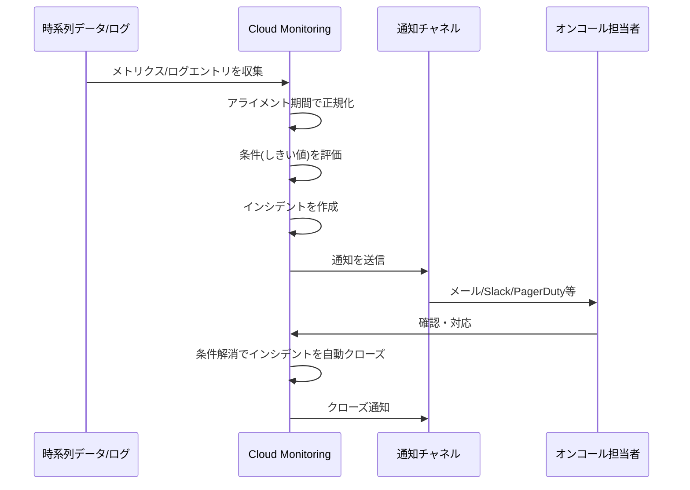

アラートポリシーの条件は、時系列データを「アライメント期間」で正規化(規則的な間隔にバケット化)したうえで評価されます[^14]。1つのアラートポリシーには最大6つの条件を設定でき、欠損データの扱いについても複数のオプションが用意されています[^14]。しきい値ベースの条件はコンソールのアラート作成UIから設定するほか、Monitoring Query Language(MQL)を使った条件や、Cloud Monitoring APIを用いた作成も可能です[^17]。ポリシーを変更すると、インシデント判定に使う事前計算済みデータが破棄され、インシデントの履歴情報が失われる点に注意が必要です[^16]。

**コスト管理の観点**では、Monitoringはディメンション型のメトリクスシステムを採用しており、メトリクスの総カーディナリティは「監視対象リソース数 × ラベルの組み合わせ数」で決まります。例えば100台のVMが10ラベル×10値のメトリクスを送信する場合、カーディナリティは100×10×10=10,000となり、生データに対して直接アラートを設定するとコストが非常に高くなる可能性があります[^15]。そのため、可能な限り1つのアラートポリシーで複数のリソースを監視し(リソースごとに個別のポリシーを作らない)、目的に応じた適切な粒度(例: CPU使用率ならVM+CPUレベル、レイテンシならサービスレベル)にデータを集約することが推奨されます[^15]。

運用の卓越性の観点では、単純なしきい値アラートに加えて、SLOの「エラーバジェット」の消費速度(バーンレート)に基づくアラート戦略も重要です。これは[6.5 品質管理の評価](#65-品質管理の評価)で詳しく扱います。

## 6.3 デプロイとリリース管理

### Cloud Deployの基本構造

**Cloud Deploy**は、定義済みのプロモーションシーケンスに沿って一連のターゲット環境へアプリケーションを配信するマネージドサービスです[^24]。アプリケーションを更新してデプロイしたいとき、「リリース」を作成し、そのライフサイクルは「デリバリーパイプライン」によって管理されます[^24]。

| 用語 | 説明 |
| --- | --- |
| デリバリーパイプライン | 名前・説明、デプロイ先ターゲットへのプロモーションシーケンス(順序)を定義する設定[^24] |
| ターゲット | dev/staging/productionなど、アプリケーションのデプロイ先となる個別の実行環境[^24] |
| リリース | 各ターゲット向けにレンダリングされたマニフェストを表すリソース。CI側が生成したコンテナイメージへの参照を含む[^24] |
| ロールアウト | リリースを特定のターゲット環境に関連付けるリソース。最初のリリース作成時に自動生成される[^24] |

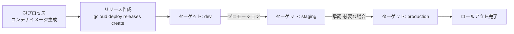

CI側の処理はコンテナイメージを1つ以上出力するものであれば任意のツールを利用できます[^24]。リリース作成とデリバリーパイプラインの呼び出しは、必ずしもCIツールから行う必要はありません[^24]。

### デプロイ戦略

Cloud Deployは複数のデプロイ戦略をサポートしています[^25][^26]。

| 戦略 | 概要 | 主な用途 |
| --- | --- | --- |
| 標準デプロイ | 進行的なロールアウトやトラフィック分割を行わずに、1つ以上のターゲットランタイムへ一括デプロイする。ロールバック・検証・複数ターゲットへの同時デプロイが可能[^25] | シンプルなデプロイ、迅速なリリースサイクル |
| 自動カナリア | Cloud Deployが指定したパーセンテージのシーケンスに従い、新旧バージョン間のトラフィック配分を自動で操作する[^26] | Cloud Run、サービスネットワーキング、Gateway APIへのデプロイ |
| カスタム自動カナリア | トラフィック配分はCloud Deployに任せつつ、フェーズ名・目標割合・Skaffoldプロファイル・検証ジョブの有無などを個別に指定する[^26] | より柔軟なフェーズ制御が必要な場合 |
| フルカスタムカナリア | フェーズ設定に加え、トラフィックバランシングの構成まですべて自前で提供する[^26] | すべてのターゲットタイプに対応、高度なカスタマイズが必要な場合 |

カナリアデプロイは、アプリケーションの新バージョンを最初にインフラの一部だけに展開し、そこでテストしてから段階的に展開範囲を広げていく進行的なデプロイ手法です[^26]。例えばCloud Runへの50%カナリアデプロイでは、トラフィックの半分が新リビジョンへ、残り半分が旧リビジョンへ送られ、安定性を確認したうえで100%まで昇格させます[^26]。

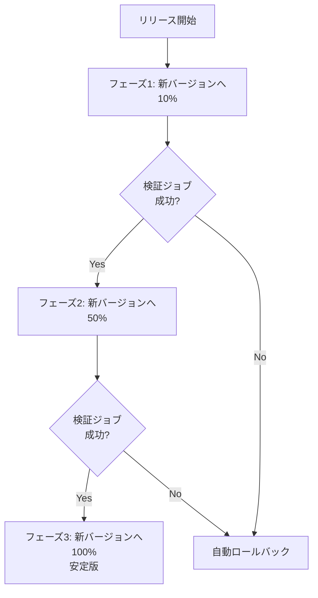

各フェーズに検証(verify)ジョブを組み込むことができ、`advanceRolloutRule`のような自動化と組み合わせることで、検証結果に応じてロールアウトを自動的に次のフェーズへ進めることも可能です[^26]。

### 承認・プロモーション・ロールバック

リリースが特定のターゲットへデプロイされると、パイプラインの可視化画面でその状態を確認できます[^27]。ターゲットごとに承認を必須に設定でき、`roles/clouddeploy.approver`ロール(または同等の権限)を持つユーザーがマニフェストの差分(Manifest diff)を確認したうえでロールアウトを承認・却下できます[^27]。

```bash
gcloud deploy releases promote --release=RELEASE_NAME \
    --delivery-pipeline=PIPELINE_NAME \
    --region=REGION
```

上記のように既存のリリースを次のターゲットへ手動でプロモートすることも、特定のターゲットへ直接デプロイすることも可能です[^27][^28]。通常運用ではプロモーションシーケンスに沿って順番にデプロイされますが、任意の定義済みターゲットへ手動でデプロイすることもできます[^28]。ロールアウトに問題が見つかった場合は、リリースを以前のターゲットへ戻す、あるいはコンソールのデリバリーパイプライン可視化画面からロールバックを実行することで、旧バージョンへ迅速に戻すことができます。

デプロイとリリース管理におけるベストプラクティスは次のとおりです。

| ベストプラクティス | 理由 |
| --- | --- |
| 本番ターゲットには承認ゲートを設定する | 意図しない変更の本番反映を防ぎ、変更管理ガバナンス(6.1)を実現する |
| カナリアや検証ジョブを組み込む | 障害の影響範囲(ブラストラディウス)を限定し、早期に問題を検知する |
| ロールバック手順を定期的にリハーサルする | 本番障害時に確実かつ迅速に切り戻せることを事前に確認する |
| リリースの変更をIaC・バージョン管理と連携させる | デプロイの再現性とトレーサビリティを確保する(6.1の変更管理原則と整合) |

## 6.4 デプロイ済みソリューションのサポート支援

### Google Cloudサポートティア

すべてのGoogle Cloud顧客にはBasic Supportが含まれており、ドキュメント・コミュニティサポート・Cloud Billingサポート・Active Assistの推奨事項へのアクセスが提供されます[^29][^33]。それより上位のサポートは、組織の規模やワークロードの重要度に応じて選択します[^29]。Standard Supportは、開発中のワークロードを持つ組織が最初にサポート契約を検討する際の入口として位置づけられています[^30]。

| サポートティア | 対象 | 主な特徴 |
| --- | --- | --- |
| Basic Support | 全顧客に標準で付帯 | ドキュメント、コミュニティサポート、Cloud Billingサポート、Active Assist推奨事項[^29] |
| Standard Support | 開発中のワークロードを持つ中小規模組織 | 1:1技術サポート、Cloud Support API、Active Assist推奨事項、P2(優先度2)ケースへの4時間以内の応答[^29] |
| Enhanced Support | 本番稼働する中〜大規模組織 | より高速な応答、Cloud Support API、サードパーティ技術サポート、Recommenderなどのインテリジェントサービス[^29] |
| Premium Support | 優先度の高いワークロードを持つエンタープライズ | 高速応答、プラットフォーム安定性、Customer Aware Support、専任のテクニカルアカウントマネージャー(TAM)[^29] |

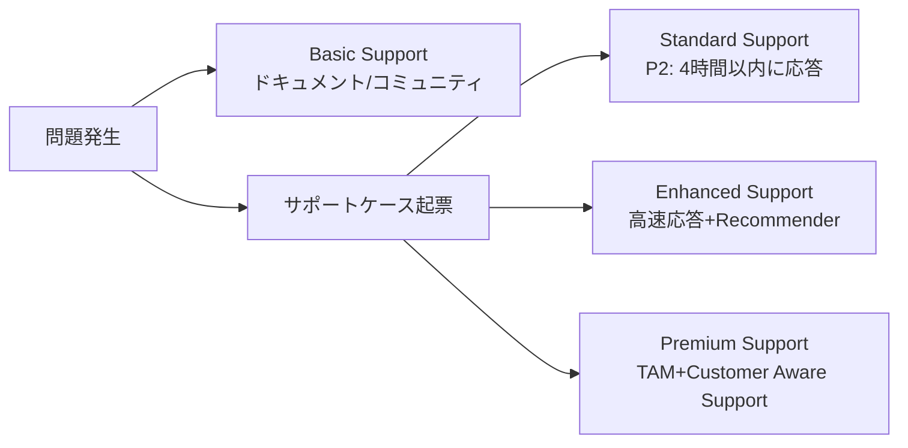

Premium SupportとEnhanced Supportでは、規制対応が必要な環境向けにAssured Supportというオプションも提供されており、米国・EU・カナダ・イスラエル・オーストラリアの地理的所在地・人的要件に基づくコンプライアンス層として機能します[^31][^32]。

### Active AssistとRecommender

**Active Assist**は、Google Cloudプロジェクトを最適化するための推奨事項とインサイトを生成する一連のツール群の総称です[^34]。推奨事項は、コスト・セキュリティ・パフォーマンス・信頼性・マネジャビリティ・サステナビリティという6つの価値ピラーに分類されます[^35]。

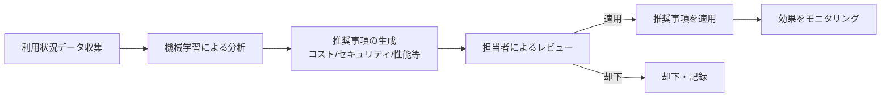

推奨事項を適用する前には、組織内でその影響を正しく評価できる担当者によるレビューを行うことが推奨されています。評価なしに推奨事項を適用すると、パフォーマンス低下、信頼性の悪化、必要な権限の喪失といった予期しない変更が生じる可能性があるためです[^36]。人によるレビューを介さずに適用する運用を選ぶ場合は、事前にロールバック手順を用意しておく必要があります[^36]。エンタープライズがActive Assistをスケールさせる際は、まずコンソールでのレビュー、次にBigQueryへのエクスポート、Recommender APIの利用、DevOpsパイプラインへの統合という段階的なアプローチが推奨されています[^37]。

### Personalized Service Health

**Personalized Service Health**は、自分のプロジェクトに関連するGoogle Cloudのサービスヘルスイベント(障害・性能劣化など)を一元的に把握するための機能です[^38]。全体に影響する障害情報だけでなく、自分のプロジェクトやリソースに実際に関連するイベントだけをフィルタリングして表示します[^38]。

| アクセス方法 | 内容 |
| --- | --- |
| Service Healthダッシュボード | Google Cloudコンソール上で、プロジェクトに関連するアクティブ/過去のインシデントを追跡[^38][^39] |
| Service Health API | プロジェクト単位・組織単位でサービスヘルスイベントをプログラムから取得[^38] |
| アラート | Cloud Loggingのログに基づき、Cloud Monitoringの通知チャネル(メール、Pub/Sub、Webhook、Slack、PagerDutyなど)を通じて通知[^38] |

Personalized Service Healthは、問題が自プロジェクト側の設定に起因するのか、Google Cloud側の障害に起因するのかを切り分けるのに役立ち、適切なインシデント対応を実施するための一次情報源として位置づけられています[^38]。これは6.1で述べた「インシデント管理の一元化」や「明確なインシデント対応手順の確立」を支える具体的な仕組みの一つです。

## 6.5 品質管理の評価

品質管理措置の評価は、6.1で扱った「変更の自動化と管理」の実践(CI/CD、自動テスト)と、SREのエラーバジェットに基づく運用ガバナンスを組み合わせて理解すると整理しやすくなります。

### CI/CDパイプラインにおける品質ゲート

6.1で述べたとおり、CI/CDパイプラインへの自動テストの統合は、デプロイ前に変更を検証してエラーとリグレッションのリスクを低減する効果があります[^9]。

| テスト種別 | 目的 |
| --- | --- |
| 単体テスト | 関数やメソッドなど、個々のコード単位が期待どおりに動作することを確認する[^9] |
| 統合テスト | アプリケーションの異なるコンポーネント/モジュール間の連携が正しく機能することを検証する[^9] |
| E2E(エンドツーエンド)テスト | 実際のシナリオをシミュレートし、アプリケーション全体がエンドユーザーの要件を満たすことを確認する[^9] |

自動テストを組み込む主な効果は、開発プロセスの早い段階でバグや欠陥を検出できること、そして一定の基準やベストプラクティスに沿った高品質なコードを維持できることです[^9]。効果的に統合するには、適切なテストツール・フレームワークの選定に加え、テスト種別・実施頻度・合否基準を含む明確なテスト戦略の策定が必要です[^9]。

### エラーバジェットによるリリースゲーティング

SREの実践では、SLOの裏返しとして「エラーバジェット」という考え方が用いられます。SLOが99.9%の可用性であれば、エラーバジェットはその残り0.1%、つまり「使ってよい失敗の割合」です[^40]。四半期のSLOが99.999%であれば、エラーバジェットはその四半期における失敗率0.001%となり、ある問題が期待クエリの0.0002%を失敗させた場合、その問題は四半期のエラーバジェットの20%を消費したことになります[^40]。

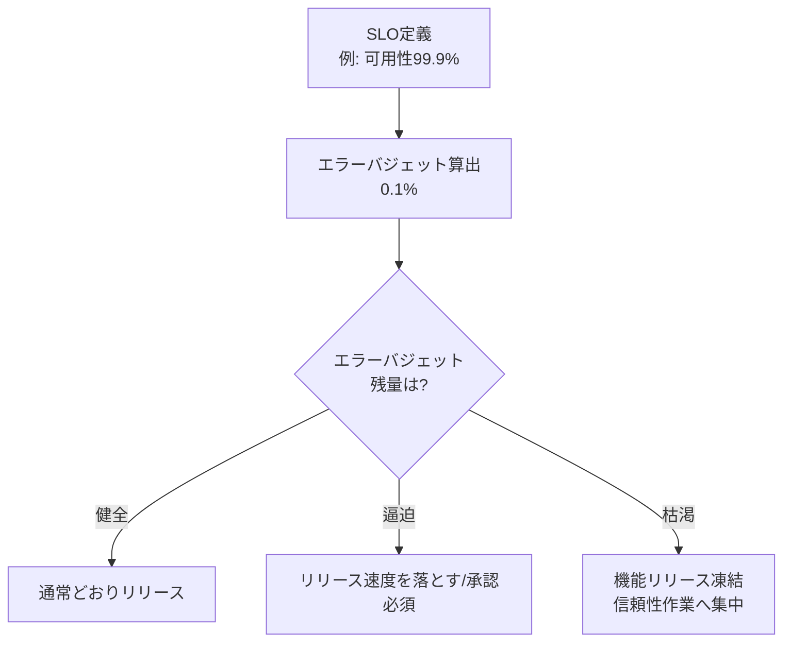

エラーバジェットが残っている限り新しいリリースを継続でき、逆にバジェットが尽きた場合はリリース頻度を落とす、あるいはロールバックするといった、より繊細なコントロールが可能になります[^40]。エラーバジェットの本質的な利点は、プロダクト開発チームとSREチームの双方にとって、イノベーションと信頼性のバランスを取るための客観的で共通のインセンティブを提供する点にあります[^40]。

多くのエラーバジェットポリシーでは、直近4週間のウィンドウでエラーバジェットを使い切った場合、P0(最優先)課題やセキュリティ修正を除くすべての変更・リリースを一時停止するという運用が採用されています[^41]。この停止措置は懲罰的な意味を持つものではなく、データが「信頼性を他の機能よりも優先すべき」と示しているときにチームがそこへ集中する許可を与えるものと位置づけられています[^41]。1件のインシデントで4週間のエラーバジェットの20%以上を消費した場合はポストモーテムの実施が、四半期で20%以上を消費するような障害クラスがあった場合は四半期計画にその是正のためのP0項目を含めることが、典型的なポリシーの一例として挙げられています[^41]。

エラーバジェットポリシーの承認プロセス自体が、SLOが本当に適切な水準に設定されているかを検証する良いテストになります。SRE側がSLOを「過度なトイルなしには防御できない」と感じればSLOの緩和を主張でき、逆に開発チーム・プロダクトマネージャーが信頼性強化のためにリソースを割くとリリース速度が許容水準を下回ると感じれば、同様に緩和を主張できます[^42]。

### ブレームレスポストモーテム文化

品質管理の評価には、インシデントやリグレッションが発生した際の学習プロセスも含まれます。Googleでは、重大なインシデントの後に包括的なポストモーテムを作成することが文化的な規範として定着しており、継続的な投資によってダウンタイムの減少とユーザー体験の改善につながっているとされています[^43]。


ポストモーテムが真にブレームレスであるためには、個人やチームの不適切な行動を非難することなく、インシデントの寄与要因を特定することに焦点を当てなければならないとされています[^44]。ポストモーテムの標準的な構成要素には、サマリー、タイムライン、根本原因分析、影響範囲の評価、担当者と期限付きの是正アクション項目が含まれます。個々のインシデント対応(トリアージ・調整・コミュニケーション)については、緊急対応組織のベストプラクティスを参考にした手法が多くのテック企業で採用されています[^45][^46]。

品質管理の評価に関するベストプラクティスをまとめると、次のようになります。

| チェック項目 | 目的 |
| --- | --- |
| CI/CDパイプラインに単体/統合/E2Eテストを組み込む | デプロイ前にリグレッションを検出する[^9] |
| エラーバジェットに基づくリリースゲートを設ける | 信頼性が損なわれている時期に機能リリースの速度を自動的に抑制する[^40][^41] |
| ポストモーテムをブレームレスな文化のもとで作成・共有する | 同種のインシデントの再発を防ぎ、組織的な学習につなげる[^43][^44] |
| ナレッジベースと連携させる | ポストモーテムから得られた知見を将来のインシデント対応に活かす[^7] |

## 6.6 本番環境における信頼性の確保

Exam Guideは6.6の具体例として、カオスエンジニアリング、ペネトレーションテスト、負荷テストの3つを挙げています[^1]。これらはいずれも「本番相当の環境やトラフィックに対して意図的に負荷や障害を発生させ、システムが実際にどう振る舞うかを検証する」というアプローチを共有しています。

### カオスエンジニアリング

カオスエンジニアリングは、システムが本番環境で乱気流のような不安定な状況に耐えられるという確信を築くために、システムに対して実験を行う手法です[^47]。Netflixが2010年に開発した「Chaos Monkey」がこの分野の先駆けとして知られていますが、Google社内でも同時期に「DiRT(Disaster Resilience Testing)」という、事業・システム・データの災害対応力を継続的かつ自動的にテストする取り組みが導入されていました[^47]。

カオスエンジニアリングの基本的な流れは次のとおりです[^48]。

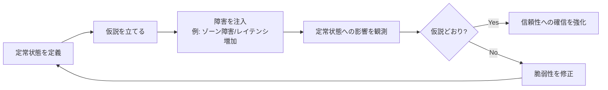

まずシステムの「定常状態(steady state)」、つまり正常で測定可能かつ健全な出力状態を理解することから始めます[^48]。次に、特定の乱気流条件(障害)が発生してもこの定常状態が持続するという仮説を立て、CPUリソースの枯渇、ネットワークレイテンシの追加、VMの強制終了といった特定の障害を意図的に注入する「制御されたアクション」を実行します[^48]。これにより、DR(災害復旧)計画のような仮説を実際のデータで裏付けられた手法へと転換できます[^48]。

Google内部でも、Spannerのようなミッションクリティカルなデータベースに対して、意図的に障害を注入するカオステストを毎週1,000件以上実行しており、これによりハッピーパスのテストだけでは見つからないバグを継続的に発見しています[^49]。GKEやCompute Engine、Pub/Subなどを対象にGoogle CloudのPSO(プロフェッショナルサービス)チームが公開しているChaos Toolkit拡張機能を使うと、GCP環境向けのカオス実験を実施できます[^50]。

### ペネトレーションテスト

ペネトレーションテストは、実際の攻撃者と同じ手法でシステムの脆弱性を悪用しようと試み、不正アクセス・権限昇格・機密データへのアクセスが実際に可能かどうかを確認する検証です。自動化された脆弱性スキャンとは異なり、人手による深掘りや複数の脆弱性を連鎖させた攻撃シナリオの検証を伴う点が特徴です。

Google CloudはAWSと異なり、顧客が自社のGCP環境に対してペネトレーションテストを実施する際に事前の許可申請を必須とはしていません[^51][^52]。ただし、次の条件を満たす必要があります。

| 条件 | 内容 |
| --- | --- |
| 対象範囲 | 自分自身のGoogle Cloudプロジェクト・リソースのみを対象とする |
| 他顧客への影響 | 他のGoogle Cloud顧客のアプリケーションやリソースに影響を与えないこと |
| 準拠すべきポリシー | Google Cloud Platform Acceptable Use Policy(利用規約)に従うこと[^51] |
| 脆弱性の報告 | 発見した脆弱性はVulnerability Reward Program経由で報告する[^52] |

Acceptable Use Policyでは、他の顧客・リセラー・利用者によるサービス利用を妨害・中断させる目的での不正アクセスや、サービス提供に使われる機器を無効化・妨害・回避する行為を明示的に禁止しています[^51]。ペネトレーションテストは自組織の管理下にあるプロジェクトの範囲内で、この利用規約の枠内で実施する必要があります。

### 負荷テスト

負荷テストは、実運用を想定したトラフィックパターンをシステムに与え、期待どおりにスケールできるか、ボトルネックがどこにあるかを検証する手法です。6.2で紹介したとおり、Cloud Runサービスに対する負荷テストでは、まず開発環境や小規模テスト環境で同時実行数の問題を洗い出し、コンテナの同時実行数を計測してから、手動スケーリングに近い小刻みなインクリメンタルテストを行うことが推奨されています[^22]。Cloud Runの最大インスタンス数のデフォルトは100であり、これを超える規模の負荷テストを行う場合はアカウントチームとの事前調整やクォータ引き上げ申請が必要です[^22]。

Cloud Load Balancing配下のバックエンドサービスについては、単一のVMやGKE Podで小規模なテストケースを作成し、サーバー自体の性能限界を計測することが推奨されています[^23]。過剰なサーバーキャパシティのもとでテストを行うと、サービス自体の限界ではなく、クライアントホストやネットワーク層のボトルネックを検出してしまうリスクがあるためです[^23]。

本番環境の信頼性確保に関するベストプラクティスをまとめると、次のとおりです。

| 手法 | 主な確認事項 | 実施上の注意 |
| --- | --- | --- |
| カオスエンジニアリング | 障害注入時にも定常状態(SLO)を維持できるか | 小規模かつ影響範囲を限定した実験から始め、仮説と成功基準を明確にする[^48] |
| ペネトレーションテスト | 実際の攻撃シナリオでのIAM/データ/アプリケーションの脆弱性 | 自プロジェクトの範囲内でAUPを遵守し、発見した脆弱性はVulnerability Reward Programへ報告する[^51][^52] |
| 負荷テスト | ピーク時のスループット・レイテンシ・自動スケーリングの挙動 | 小規模テストでサーバー側の限界を先に特定し、大規模テストは事前にクォータ・アカウントチームと調整する[^22][^23] |

## ケーススタディへの適用の視点

公式ケーススタディはSection 6の出題でも参照される可能性があります。運用の卓越性というテーマは特定の技術選定というより「どの水準のSLO/SLA・アラート戦略・デプロイ戦略・サポート体制が、そのビジネスの制約に適合するか」という判断を問う形で出題されやすい領域です。学習の際は、各ケーススタディが持つビジネス要件・技術要件を、本ガイドで扱った各トピックと結びつけて確認すると理解が深まります。

| 観点 | 確認するとよいポイント |
| --- | --- |
| SLO/SLAの水準 | 業種(医療、小売、自動車、メディアなど)によって許容されるダウンタイムやレイテンシの基準はどう変わるか |
| デプロイ戦略の選択 | リスク許容度の低いワークロードにはカナリアや承認ゲート付きのパイプラインが適するか |
| サポートティアの選定 | 24時間稼働が必須の基幹システムにはEnhanced/Premium Supportが適切か |
| インシデント対応体制 | 規制業種(医療・金融など)では監査ログやポストモーテムの共有範囲にどのような制約があるか |
| 信頼性検証の頻度 | ミッションクリティカルなシステムほど、カオスエンジニアリングやペネトレーションテストの実施頻度・範囲をどう設計すべきか |

## Well-Architected Framework対応表

Section 6の各タスクは、運用の卓越性の柱の核となる原則と次のように対応しています。

| Section 6のタスク | 主に対応する核となる原則 |
| --- | --- |
| 6.1 運用の卓越性の柱の原則 | 5つの核となる原則すべての土台 |
| 6.2 Observability | CloudOpsによる運用準備とパフォーマンスの確保/インシデントと問題の管理 |
| 6.3 デプロイとリリース管理 | 変更の自動化と管理 |
| 6.4 サポート支援 | インシデントと問題の管理/クラウドリソースの管理と最適化 |
| 6.5 品質管理の評価 | 変更の自動化と管理/継続的な改善とイノベーション |
| 6.6 本番環境の信頼性確保 | インシデントと問題の管理/継続的な改善とイノベーション(信頼性の柱とも密接に関連) |

## 学習チェックリスト

- [ ] Well-Architected Frameworkの6本の柱と、運用の卓越性の柱が対象とする5つの読者層を説明できる
- [ ] 運用準備(Operational Readiness)の4つのフォーカスエリア(ワークフォース/プロセス/ツール/ガバナンス)を挙げられる
- [ ] SLO策定におけるSMART基準を説明できる
- [ ] インシデント管理のライフサイクル(検知→トリアージ→対応→緩和→解決→PIR)を説明できる
- [ ] Cloud Monitoring・Cloud Logging・Cloud Trace・Cloud Profilerの役割の違いを説明できる
- [ ] Cloud Profilerのプロファイルタイプ(CPU time/Heap/Heap allocation/Wall time)の違いを説明できる
- [ ] アラートポリシー・インシデント・通知チャネルの3要素を説明できる
- [ ] アラートのコスト管理(カーディナリティ、集約粒度)の考え方を説明できる
- [ ] Cloud Deployのデリバリーパイプライン・ターゲット・リリース・ロールアウトの関係を説明できる
- [ ] 標準デプロイとカナリアデプロイ(自動/カスタム自動/フルカスタム)の違いを説明できる
- [ ] Google CloudのサポートティアをBasic〜Premiumまで比較できる
- [ ] Active Assistの6つの価値ピラーとレビュープロセスの重要性を説明できる
- [ ] Personalized Service Healthが提供する3つのアクセス方法を挙げられる
- [ ] エラーバジェットの考え方とリリースゲーティングへの応用を説明できる
- [ ] ブレームレスポストモーテムの目的と標準的な構成要素を説明できる
- [ ] カオスエンジニアリングの基本サイクル(定常状態→仮説→障害注入→観測)を説明できる
- [ ] Google Cloud上でペネトレーションテストを行う際に遵守すべき条件を説明できる
- [ ] 負荷テストを実施する際に、サーバー側のボトルネックとクライアント/ネットワーク側のボトルネックを混同しないための注意点を説明できる

## 参考文献

[^1]: [Professional Cloud Architect Certification exam guide (PDF)](https://services.google.com/fh/files/misc/professional_cloud_architect_exam_guide_english.pdf) — Google Cloud
[^2]: [Professional Cloud Architect Certification](https://cloud.google.com/learn/certification/cloud-architect) — Google Cloud
[^3]: [About the Well-Architected Framework](https://docs.cloud.google.com/docs/get-started/well-architected-framework) — Google Cloud Documentation
[^4]: [Google Cloud Well-Architected Framework](https://docs.cloud.google.com/architecture/framework) — Cloud Architecture Center
[^5]: [Well-Architected Framework: Operational excellence pillar](https://docs.cloud.google.com/architecture/framework/operational-excellence) — Cloud Architecture Center
[^6]: [Ensure operational readiness and performance using CloudOps](https://docs.cloud.google.com/architecture/framework/operational-excellence/operational-readiness-and-performance-using-cloudops) — Cloud Architecture Center
[^7]: [Manage incidents and problems](https://docs.cloud.google.com/architecture/framework/operational-excellence/manage-incidents-and-problems) — Cloud Architecture Center
[^8]: [Manage and optimize cloud resources](https://docs.cloud.google.com/architecture/framework/operational-excellence/manage-and-optimize-cloud-resources) — Cloud Architecture Center
[^9]: [Automate and manage change](https://docs.cloud.google.com/architecture/framework/operational-excellence/automate-and-manage-change) — Cloud Architecture Center
[^10]: [Continuously improve and innovate](https://docs.cloud.google.com/architecture/framework/operational-excellence/continuously-improve-and-innovate) — Cloud Architecture Center
[^11]: [Observability and monitoring](https://docs.cloud.google.com/docs/observability) — Google Cloud Documentation
[^12]: [Google Cloud Observability](https://cloud.google.com/products/observability) — Google Cloud
[^13]: [Alerting overview](https://docs.cloud.google.com/monitoring/alerts) — Cloud Monitoring Documentation
[^14]: [Behavior of metric-based alerting policies](https://docs.cloud.google.com/monitoring/alerts/concepts-indepth) — Cloud Monitoring Documentation
[^15]: [Manage alerting costs](https://docs.cloud.google.com/monitoring/alerts/cost-control) — Cloud Monitoring Documentation
[^16]: [Manage alerting policies](https://docs.cloud.google.com/monitoring/alerts/manage-alerts) — Cloud Monitoring Documentation
[^17]: [Create metric-threshold alerting policies](https://docs.cloud.google.com/monitoring/alerts/using-alerting-ui) — Cloud Monitoring Documentation
[^18]: [Cloud Profiler overview](https://docs.cloud.google.com/profiler/docs/about-profiler) — Cloud Profiler Documentation
[^19]: [Profiling concepts](https://docs.cloud.google.com/profiler/docs/concepts-profiling) — Cloud Profiler Documentation
[^20]: [PerfKit Benchmarker for evaluating cloud network performance](https://cloud.google.com/blog/products/networking/perfkit-benchmarker-for-evaluating-cloud-network-performance) — Google Cloud Blog
[^21]: [PerfKitBenchmarker (GitHub)](https://github.com/GoogleCloudPlatform/PerfKitBenchmarker) — GoogleCloudPlatform
[^22]: [Load testing best practices](https://docs.cloud.google.com/run/docs/about-load-testing) — Cloud Run Documentation
[^23]: [Guidelines for load testing backend services with Application Load Balancers](https://docs.cloud.google.com/load-balancing/docs/backend-service-load-testing) — Cloud Load Balancing Documentation
[^24]: [Overview of Cloud Deploy](https://docs.cloud.google.com/deploy/docs/overview) — Cloud Deploy Documentation
[^25]: [Use a deployment strategy](https://docs.cloud.google.com/deploy/docs/deployment-strategies) — Cloud Deploy Documentation
[^26]: [Use a canary deployment strategy](https://docs.cloud.google.com/deploy/docs/deployment-strategies/canary) — Cloud Deploy Documentation
[^27]: [Promote your release and manage approvals](https://docs.cloud.google.com/deploy/docs/promote-release) — Cloud Deploy Documentation
[^28]: [Deploy manually](https://docs.cloud.google.com/deploy/docs/deploy-manually) — Cloud Deploy Documentation
[^29]: [Get support with Cloud Customer Care](https://docs.cloud.google.com/support/docs/overview) — Google Cloud Documentation
[^30]: [Standard Support](https://cloud.google.com/support/standard) — Google Cloud
[^31]: [Enhanced Support overview](https://docs.cloud.google.com/support/docs/enhanced) — Cloud Customer Care Documentation
[^32]: [Premium Support overview](https://docs.cloud.google.com/support/docs/premium) — Cloud Customer Care Documentation
[^33]: [Getting support](https://docs.cloud.google.com/docs/get-started/getting-support) — Google Cloud Documentation
[^34]: [What is Active Assist](https://docs.cloud.google.com/recommender/docs/whatis-activeassist) — Recommender Documentation
[^35]: [Active Assist dashboard overview](https://docs.cloud.google.com/recommender/docs/active-assist/dashboard-overview) — Recommender Documentation
[^36]: [Find recommendations with Active Assist](https://docs.cloud.google.com/recommender/docs/quickstart-active-assist) — Recommender Documentation
[^37]: [Patterns for using Active Assist at scale](https://docs.cloud.google.com/recommender/docs/patterns-for-using-active-assist-at-scale) — Recommender Documentation
[^38]: [Personalized Service Health overview](https://docs.cloud.google.com/service-health/docs/overview) — Google Cloud Documentation
[^39]: [Personalized Service Health concepts](https://docs.cloud.google.com/service-health/docs/concepts) — Google Cloud Documentation
[^40]: [Site Reliability Engineering — Embracing Risk](https://sre.google/sre-book/embracing-risk/) — Google SRE Book
[^41]: [SRE Workbook — Error Budget Policy](https://sre.google/workbook/error-budget-policy/) — Google SRE Workbook
[^42]: [SRE Workbook — Implementing SLOs](https://sre.google/workbook/implementing-slos/) — Google SRE Workbook
[^43]: [Site Reliability Engineering — Postmortem Culture](https://sre.google/sre-book/postmortem-culture/) — Google SRE Book
[^44]: [SRE Workbook — Postmortem Culture: Learning from Failure](https://sre.google/workbook/postmortem-culture/) — Google SRE Workbook
[^45]: [SRE Workbook — Incident Response](https://sre.google/workbook/incident-response/) — Google SRE Workbook
[^46]: [SRE incident management guide](https://sre.google/resources/practices-and-processes/incident-management-guide/) — Google SRE
[^47]: [Getting started with chaos engineering](https://cloud.google.com/blog/products/devops-sre/getting-started-with-chaos-engineering) — Google Cloud Blog
[^48]: [Using chaos engineering to test DR plans](https://cloud.google.com/blog/products/devops-sre/using-chaos-engineering-to-test-dr-plans) — Google Cloud Blog
[^49]: [Chaos testing Spanner improves reliability](https://cloud.google.com/blog/products/databases/chaos-testing-spanner-improves-reiliability) — Google Cloud Blog
[^50]: [chaos-engineering (GitHub)](https://github.com/GoogleCloudPlatform/chaos-engineering) — GoogleCloudPlatform
[^51]: [Google Cloud Platform Acceptable Use Policy](https://cloud.google.com/terms/aup) — Google Cloud
[^52]: [Cloud Security FAQ](https://support.google.com/cloud/answer/6262505) — Google Cloud Platform Console Help