# Google Cloud Professional Cloud Network Engineer 対策ガイド S5: ネットワークセキュリティの設計と実装

> 対象: Google Cloud Professional Cloud Network Engineer(PCNE)認定試験
> 対応範囲: 公式Exam Guide **Section 6「Configuring, implementing and managing a cloud network security solution」(出題比率 約13%)**
> レベル: 中級者〜上級者
> 図解方針: ASCIIアートは使用せず、フローチャートは全てMermaid、図解・比較表は全てMarkdown表で記述

## この章の対象範囲(スコープ対応表)

公式Exam Guideの原文タスクと、本ガイドのPartの対応関係は以下の通りです。

| Exam Guide タスク番号 | 原文タイトル | 本ガイドでの構成 |
|---|---|---|
| 6.1 Configuring Google Cloud Armor policies | エッジ/バックエンドセキュリティポリシー、WAFルール、DDoS/Adaptive Protection、レート制限、bot管理、Threat Intelligence | Part 1 |
| 6.2 Configuring and managing NGFW policies and VPC Firewall rules | ファイアウォール戦略、階層評価、GKE/LB対応、L7検査、移行、ルール基準、ロギング、マイクロセグメンテーション、階層(Essentials/Standard/Enterprise) | Part 2 |
| 6.3 Configuring and securing internet egress traffic using Public Cloud NAT and Secure Web Proxy | Cloud NAT IPアドレッシング、ポート割り当て、Secure Web Proxy構成 | Part 3 |
| 6.4 Configuring self-managed network virtual appliance and Packet Mirroring | マルチNIC VMルーティング、ILBネクストホップ、ポリシーベースルート、アウトオブバンド統合、Packet Mirroring | Part 4 |

> **出典**: [Professional Cloud Network Engineer Certification exam guide (PDF)](https://services.google.com/fh/files/misc/professional_cloud_network_engineer_exam_guide_english.pdf)

---

## 目次

1. [Part 1: Google Cloud Armorポリシーの構成](#part-1-google-cloud-armorポリシーの構成)
   - [1.1 Cloud Armorのアーキテクチャと適用ポイント](#11-cloud-armorのアーキテクチャと適用ポイント)
   - [1.2 セキュリティポリシーの評価順序とルール構造](#12-セキュリティポリシーの評価順序とルール構造)
   - [1.3 プリコンフィグドWAFルール(OWASP CRS)](#13-プリコンフィグドwafルールowasp-crs)
   - [1.4 高度なネットワークDDoS防御とAdaptive Protection](#14-高度なネットワークddos防御とadaptive-protection)
   - [1.5 レート制限](#15-レート制限)
   - [1.6 Bot管理(reCAPTCHA連携)](#16-bot管理recaptcha連携)
   - [1.7 Google Threat Intelligence](#17-google-threat-intelligence)
   - [1.8 Part 1 ベストプラクティス一覧](#18-part-1-ベストプラクティス一覧)
2. [Part 2: Cloud NGFW / VPCファイアウォールルールの構成と管理](#part-2-cloud-ngfw--vpcファイアウォールルールの構成と管理)
   - [2.1 ファイアウォール戦略とポリシー種別](#21-ファイアウォール戦略とポリシー種別)
   - [2.2 ファイアウォールルールの評価順序](#22-ファイアウォールルールの評価順序)
   - [2.3 階層ファイアウォールポリシーとEffective Rules](#23-階層ファイアウォールポリシーとeffective-rules)
   - [2.4 Cloud NGFWの3つの階層(Essentials/Standard/Enterprise)](#24-cloud-ngfwの3つの階層essentialsstandardenterprise)
   - [2.5 レイヤー7検査: TLS Inspection・URLフィルタリング・IDPS](#25-レイヤー7検査-tls-inspectionurlフィルタリングidps)
   - [2.6 ファイアウォールルールの基準(criteria)](#26-ファイアウォールルールの基準criteria)
   - [2.7 Secure Tags と Network Tags によるマイクロセグメンテーション](#27-secure-tags-と-network-tags-によるマイクロセグメンテーション)
   - [2.8 ファイアウォールルールロギング](#28-ファイアウォールルールロギング)
   - [2.9 VPCファイアウォールルールからCloud NGFWポリシーへの移行](#29-vpcファイアウォールルールからcloud-ngfwポリシーへの移行)
   - [2.10 GKEおよびCloud Load BalancingでのCloud NGFWサポート](#210-gkeおよびcloud-load-balancingでのcloud-ngfwサポート)
   - [2.11 Part 2 ベストプラクティス一覧](#211-part-2-ベストプラクティス一覧)
3. [Part 3: インターネットEgressの構成と保護 — Public Cloud NATとSecure Web Proxy](#part-3-インターネットegressの構成と保護--public-cloud-natとsecure-web-proxy)
   - [3.1 Cloud NATのIPアドレッシング](#31-cloud-natのipアドレッシング)
   - [3.2 ポート割り当て(静的/動的)](#32-ポート割り当て静的動的)
   - [3.3 Secure Web Proxyの概要とデプロイモード](#33-secure-web-proxyの概要とデプロイモード)
   - [3.4 Secure Web Proxyポリシーの構成](#34-secure-web-proxyポリシーの構成)
   - [3.5 Part 3 ベストプラクティス一覧](#35-part-3-ベストプラクティス一覧)
4. [Part 4: セルフマネージドNVAとPacket Mirroringの構成](#part-4-セルフマネージドnvaとpacket-mirroringの構成)
   - [4.1 マルチNIC VMによるVPC間トラフィックのルーティングと検査](#41-マルチnic-vmによるvpc間トラフィックのルーティングと検査)
   - [4.2 HA構成: 内部パススルーNLBをネクストホップにする](#42-ha構成-内部パススルーnlbをネクストホップにする)
   - [4.3 HA マルチNIC VMルーティングのためのポリシーベースルート](#43-ha-マルチnic-vmルーティングのためのポリシーベースルート)
   - [4.4 アウトオブバンドのNetwork Security Integration戦略](#44-アウトオブバンドのnetwork-security-integration戦略)
   - [4.5 Packet Mirroring(セルフマネージドコレクター)](#45-packet-mirroringセルフマネージドコレクター)
   - [4.6 Part 4 ベストプラクティス一覧](#46-part-4-ベストプラクティス一覧)
5. [設計・実装チェックリスト](#設計実装チェックリスト)
6. [参考文献](#参考文献)

---

## Part 1: Google Cloud Armorポリシーの構成

### 1.1 Cloud Armorのアーキテクチャと適用ポイント

Cloud Armorは、Googleのグローバルネットワークのエッジ(Point of Presence, PoP)で動作するセキュリティサービスです。リクエストがバックエンドに到達する前に、可能な限りソースに近い場所でフィルタリング・レート制限・リダイレクトを行うことで、不要なトラフィックがVPCネットワークやバックエンドリソースを消費するのを防ぎます。

Cloud Armorのセキュリティポリシーには複数の種類があり、それぞれ適用対象(アタッチ先)が異なります。

| ポリシー種別 | type フラグ | アタッチ先 | 主な用途 |
|---|---|---|---|
| バックエンドセキュリティポリシー | 省略時のデフォルト | 外部ALB・内部リージョンALB・グローバル外部プロキシNLBのバックエンドサービス/バックエンドバケット | WAF、L7フィルタリング、レート制限、bot管理 |
| エッジセキュリティポリシー | `CLOUD_ARMOR_EDGE` | バックエンドバケットやキャッシュ可能コンテンツ | キャッシュされたコンテンツの保護 |
| ネットワークエッジセキュリティポリシー | `CLOUD_ARMOR_NETWORK` | リージョンの「ネットワークエッジセキュリティサービス」 | 外部パススルーNLB・プロトコルフォワーディング・パブリックIP VMへの高度なネットワークDDoS防御 |
| 内部サービスセキュリティポリシー | — | Cloud Service MeshのエンドポイントポリシーB | Service Mesh内でのフェアシェアレート制限 |

対応するロードバランサーの種類は以下の通りです。

| ロードバランサー種別 | Cloud Armor(バックエンドポリシー)対応 |
|---|---|
| グローバル外部Application Load Balancer(Classic含む) | ○ |
| リージョン内部Application Load Balancer | ○ |
| グローバル外部プロキシNetwork Load Balancer(TCP/SSL) | ○ |
| 外部パススルーNetwork Load Balancer | △(ネットワークエッジセキュリティポリシー経由でDDoS防御のみ) |

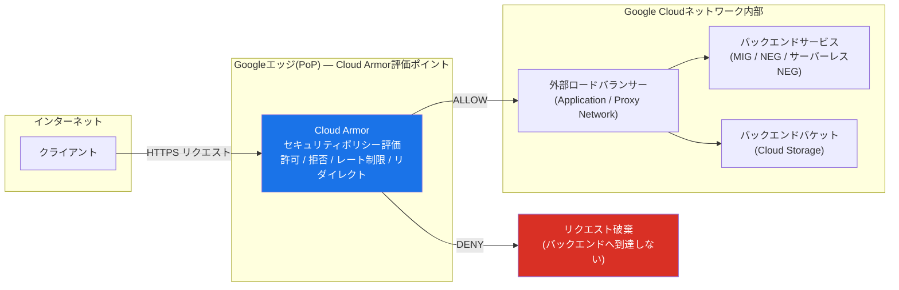

> **出典**:
> - [Cloud Armor overview](https://docs.cloud.google.com/armor/docs/cloud-armor-overview)
> - [Security policy overview](https://docs.cloud.google.com/armor/docs/security-policy-overview)
> - [Use cases for security policies](https://docs.cloud.google.com/armor/docs/common-use-cases)

> **ベストプラクティス**: バックエンドサービスを新規作成した際は、必ずCloud Armorセキュリティポリシーのアタッチ漏れがないか確認してください。アタッチされていないバックエンドサービスはCloud Armorの保護対象外となり、既知の攻撃パターンに対して無防備な状態になります。

---

### 1.2 セキュリティポリシーの評価順序とルール構造

Cloud Armorのルール評価順序は**優先度(priority)の数値が小さいほど高優先度**で、最も低い数値のルールから順に評価されます。マッチしたルールのアクションが即座に適用され、それ以降のルールは評価されません。

| アクション | 説明 |
|---|---|
| `allow` | トラフィックを許可し、バックエンドへ転送 |
| `deny(403/404/502等)` | 指定したHTTPステータスコードでリクエストを拒否 |
| `rate_based_ban` | 閾値を超えたクライアントを一定時間バン |
| `throttle` | 閾値を超えたリクエストをスロットリング(一部を許可) |
| `redirect` | reCAPTCHA評価や別URLへのリダイレクト |

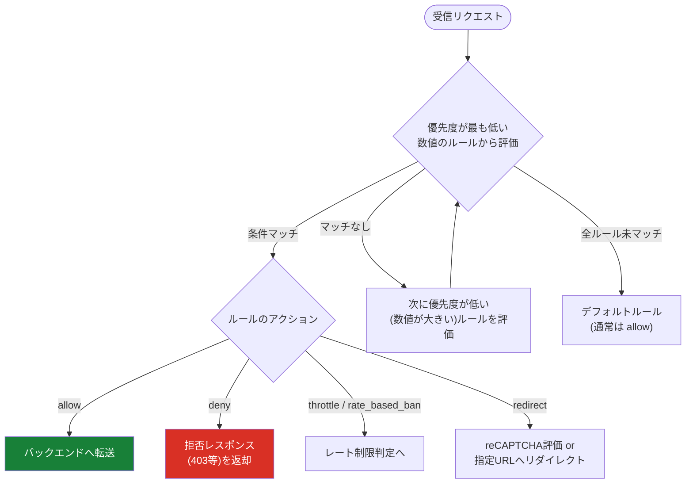

> **出典**: [Create and manage security policies](https://docs.cloud.google.com/armor/docs/configure-security-policies)

> **ベストプラクティス**: ルールの優先度は100, 1000, 2000のように間隔を空けて採番し、後から緊急ルールを既存ルールの間に挿入できる余地を残してください。国コード(ISO 3166-1 alpha-2)による地域制限を行う場合は、各コードが独立して評価される点に注意し、意図しない許可漏れがないかテストしてください。

---

### 1.3 プリコンフィグドWAFルール(OWASP CRS)

Cloud Armorのプリコンフィグド(事前構成済み)WAFルールは、OWASP ModSecurity Core Rule Set(CRS)をベースにした署名(シグネチャ)群です。SQLインジェクション(sqli)、クロスサイトスクリプティング(xss)、リモートファイルインクルージョン(rfi)、ローカルファイルインクルージョン(lfi)、リモートコード実行(rce)、スキャナー検出(scannerdetection)など、OWASP Top 10に対応する攻撃カテゴリごとにルールが用意されています。

ルール名の形式は `<攻撃カテゴリ>-<CRSバージョン>-<バージョンフィールド>` です(例: `xss-v422-stable`、`sqli-v33-stable`)。Googleは最新の保護のためCRS **4.22** の使用を推奨しており、CRS 3.0系は非推奨です。

各シグネチャには**感度レベル(sensitivity level)0〜4**が設定されており、OWASPのパラノイアレベルに対応します。

| 感度レベル | 特性 |
|---|---|
| 0 | ルール無効(デフォルトでは何も有効化されない) |
| 1(低) | 高確信度シグネチャのみ。誤検知(false positive)が最も少ない |
| 2〜3(中) | セキュリティと誤検知リスクのバランス |
| 4(高、デフォルト) | 有効化時に全シグネチャを評価。誤検知リスクが最も高い |

```
# 感度レベル1でSQLiルールをプレビューモードで作成する例
evaluatePreconfiguredWaf('sqli-v33-stable', {'sensitivity': 1})

# 特定のシグネチャIDを除外(誤検知対策)
evaluatePreconfiguredWaf('xss-v422-stable', {'opt_out_rule_ids': ['owasp-crs-v042200-id941100-xss']})
```

> **出典**:
> - [Preconfigured WAF rules overview](https://docs.cloud.google.com/armor/docs/waf-rules)
> - [Tune Cloud Armor preconfigured WAF rules](https://docs.cloud.google.com/armor/docs/rule-tuning)
> - [Configure custom rules language attributes](https://docs.cloud.google.com/armor/docs/rules-language-reference)

> **ベストプラクティス**: 本番環境への適用前に、必ず**プレビューモード**(`--preview`)で数週間ルールを稼働させ、誤検知の有無をログで確認してください。感度レベルは1から開始し、段階的に引き上げることで、正規トラフィックの誤ブロックを避けながらセキュリティレベルを高められます。

> **注意**: 感度レベルを4(デフォルト)のまま本番運用に投入すると、レガシーAPIやリッチテキスト入力を許可するアプリケーションで想定以上の誤検知が発生する可能性があります。

---

### 1.4 高度なネットワークDDoS防御とAdaptive Protection

Cloud ArmorのDDoS防御は、**ネットワーク層**(L3/L4)と**アプリケーション層**(L7)の2系統に分かれます。

#### ネットワーク層: 標準保護 vs 高度なネットワークDDoS防御

| 項目 | 標準ネットワークDDoS防御 | 高度なネットワークDDoS防御 |
|---|---|---|
| 有効化 | 常時有効(操作不要) | Cloud Armor Enterpriseへの加入とリージョン単位の明示的な設定が必要 |
| 対象 | Google Cloud基盤の安定性維持が目的。クォータ超過トラフィックのスロットリングのみ | 外部パススルーNLB・プロトコルフォワーディング・パブリックIP VMへの標的型攻撃検知・緩和 |
| 攻撃シグネチャ検知 | なし | あり(常時オンの volumetric attack detection) |
| 適用単位 | Google Cloud全体 | リージョン単位(ネットワークエッジセキュリティサービスに関連付け) |

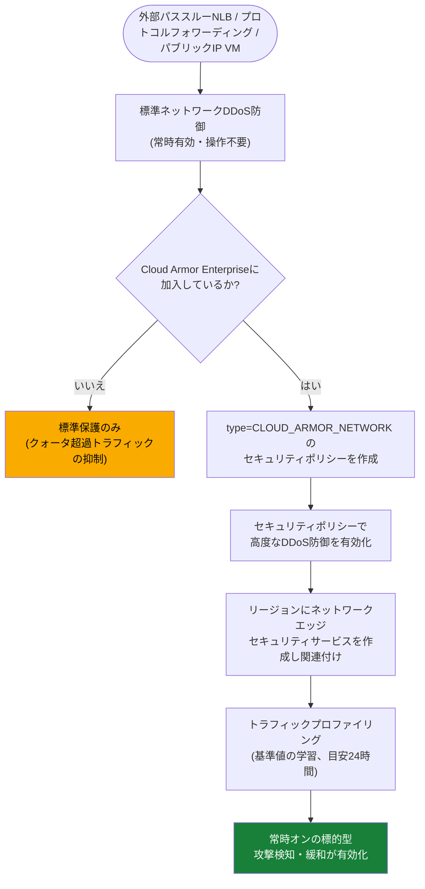

> **出典**:
> - [Configure advanced network DDoS protection](https://docs.cloud.google.com/armor/docs/advanced-network-ddos)
> - [Configure network edge security policies](https://docs.cloud.google.com/armor/docs/network-edge-policies)

#### アプリケーション層: Adaptive Protection

Adaptive Protectionは、機械学習によりバックエンドサービスへのトラフィックパターンの「正常な基準値(baseline)」を学習し、そこからの逸脱をL7 DDoS攻撃(HTTPフラッド等)として検知・アラートするCloud Armor Enterpriseの機能です。

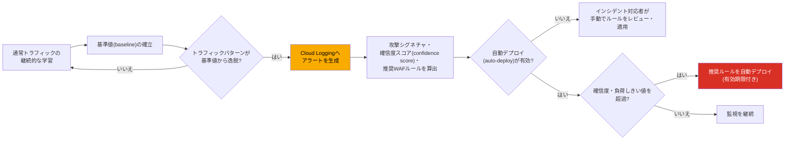

Adaptive Protectionのアラートには以下の情報が含まれます。

| 項目 | 内容 |
|---|---|
| 確信度スコア(confidence score) | トラフィックパターンの変化が異常である確からしさ(0〜1) |
| 攻撃シグネチャ | 悪意あるHTTPヘッダー、クライアントの地理情報などの特徴 |
| 想定影響ベースライン率(impacted baseline rate) | 推奨ルールを適用した場合にブロックされる正常トラフィックの割合 |
| 推奨WAFルール | 攻撃シグネチャに一致するCloud Armorルール案 |

> **出典**:
> - [Adaptive Protection overview](https://docs.cloud.google.com/armor/docs/adaptive-protection-overview)
> - [Adaptive Protection use cases](https://docs.cloud.google.com/armor/docs/adaptive-protection-use-cases)
> - [Automatically deploy Adaptive Protection suggested rules](https://docs.cloud.google.com/armor/docs/adaptive-protection-auto-deploy)

> **ベストプラクティス**: アラートポリシーの確信度しきい値は**0.5程度の低い値から開始**し、潜在的な攻撃の見逃しを避けてください。誤検知の許容範囲を確認しながら段階的に引き上げます。自動デプロイ(auto-deploy)を有効化する場合は、確信度しきい値を0.8以上、想定影響ベースライン率を0.01以下といった保守的な値に設定し、有効期限(2〜4時間程度)を必ず設定してください。まずは自動デプロイを無効にした手動レビュー運用で数週間の実績を積んでから自動化することを推奨します。

---

### 1.5 レート制限

レート制限ルールは、指定した集計キー(IPアドレス、reCAPTCHAトークン、HTTPヘッダー等)ごとにリクエスト数を集計し、しきい値超過時に`throttle`(一部リクエストの間引き)または`rate_based_ban`(一定時間の完全ブロック)を適用します。

| アクション | 動作 |
|---|---|
| `throttle` | しきい値を超えたリクエストの一部を拒否し、許可レートまで抑制 |
| `rate_based_ban` | しきい値を超えたクライアントを、指定した期間にわたって完全にブロック |

カスタムエラーレスポンスを設定することで、レート制限時にエンドユーザーへ独自のエラーメッセージを返すことも可能です。

> **出典**: [Rate limiting overview](https://docs.cloud.google.com/armor/docs/rate-limiting-overview)、[Configure rate limiting](https://docs.cloud.google.com/armor/docs/configure-rate-limiting)

> **ベストプラクティス**: 初期波状攻撃(initial wave)への対処には`throttle`、それでも継続する攻撃者には`rate_based_ban`という2段階の防御を組み合わせてください。reCAPTCHA連携時は、アクショントークン・セッショントークン・免除Cookieの再利用によるトークン濫用を防ぐため、それぞれに対するレート制限ルールを個別に設定することが推奨されます。

---

### 1.6 Bot管理(reCAPTCHA連携)

Cloud Armorのbot管理は、reCAPTCHA Enterpriseと統合し、高度なリスク分析によって人間のユーザーと自動化クライアントを区別します。reCAPTCHAはリクエストのリスク属性を暗号化トークンとして発行し、Cloud Armorはこのトークンをインラインで復号します(reCAPTCHAサービスへの追加リクエストは不要)。トークンの属性に基づき、トラフィックを許可・拒否・レート制限・リダイレクトできます。

レート制限ルールはbot管理機能と組み合わせ可能で、しきい値超過時にreCAPTCHA評価へのリダイレクトや、免除Cookie・トークンを悪用するクライアントのバンといった制御ができます。

> **出典**: [Bot management overview](https://docs.cloud.google.com/armor/docs/bot-management)

> **ベストプラクティス**: reCAPTCHA免除Cookieやトークンを使い回すクライアント(トークン濫用)を防ぐため、アクショントークン・セッショントークン・免除Cookieそれぞれをキーとしたレート制限ルールを設定してください。クレデンシャルスタッフィングやスクレイピング、在庫買い占め攻撃などの不正取引対策として、reCAPTCHA Enterpriseのスコアベース評価と組み合わせることで検知精度が向上します。

---

### 1.7 Google Threat Intelligence

Google Threat Intelligenceは、Cloud Armor Enterpriseの購読者向けに、Google/Mandiantが継続的に更新する脅威データフィードに基づいてトラフィックを許可・拒否できる機能です。`evaluateThreatIntelligence('FEED_NAME')`というマッチ式を用いて構成します。

| カテゴリ(フィード) | 説明 |
|---|---|
| Torエグジットノード | 匿名通信を可能にするTorネットワークの出口ポイントのIPアドレス |
| 既知の悪意あるIPアドレス | Webアプリケーションへの攻撃の発信元として実績のあるIPアドレス |
| Bad bots | 悪意のあるボット由来と判定されたトラフィック |
| パブリッククラウドエンドポイント | 主要パブリッククラウドプロバイダーのIPレンジ |

フィード内の情報は継続的に更新されるため、追加の運用作業なしに新しい脅威に対する保護が維持されます。

> **出典**: [Apply Google Threat Intelligence](https://docs.cloud.google.com/armor/docs/threat-intelligence)

> **ベストプラクティス**: Torエグジットノードやパブリッククラウドエンドポイントの一律ブロックは、正規のプライバシー重視ユーザーや正規のクラウド間トラフィックを誤って遮断するリスクがあるため、まずは`throttle`や監視目的のログ記録から開始し、業務要件に応じて`deny`へ段階的に移行することを検討してください。

---

### 1.8 Part 1 ベストプラクティス一覧

| 領域 | ベストプラクティス |
|---|---|
| ポリシー適用漏れ防止 | 新規バックエンドサービス作成時は必ずCloud Armorポリシーのアタッチを確認する |
| ルール優先度設計 | 優先度番号は100・1000単位で間隔を空け、緊急ルール挿入の余地を残す |
| WAFルール導入 | プレビューモードで数週間検証してから本番適用。感度レベルは1から段階的に引き上げる |
| DDoS防御 | 外部パススルーNLB/プロトコルフォワーディング/パブリックIP VMを保護する場合は高度なネットワークDDoS防御への加入を検討する |
| Adaptive Protection | 確信度0.5から監視を開始し、自動デプロイは保守的なしきい値(確信度0.8以上)かつ有効期限付きで運用する |
| レート制限 | throttleとrate_based_banを段階的に組み合わせ、reCAPTCHAトークンの再利用も監視する |
| Threat Intelligence | 一律ブロックの前に監視・throttleで影響範囲を確認する |
| 監視 | Adaptive Protectionイベント・Cloud Armorログ・Security Command CenterのCloud Armorカードを定期的にレビューする |

---

## Part 2: Cloud NGFW / VPCファイアウォールルールの構成と管理

### 2.1 ファイアウォール戦略とポリシー種別

Google Cloudのファイアウォールは、Andromedaネットワーク仮想化スタックの一部として**完全分散型・ホストベース**で実装されており、各VMのネットワークインターフェースに対して直接プログラムされます。ポリシーの種類ごとに適用範囲とIAM統合の粒度が異なります。

| ポリシー種別 | 適用範囲 | Secure Tags対応 | Network Tags対応 | 課金(有料機能利用時) |
|---|---|---|---|---|
| 階層ファイアウォールポリシー | 組織・フォルダ全体(複数VPC・複数プロジェクトに横断適用) | ○ | × | 機能に応じて課金 |
| リージョンシステムファイアウォールポリシー | Google管理(GKE等の自動生成ルール) | — | — | 課金なし |
| VPCファイアウォールルール(classic) | 単一のVPCネットワーク | × | ○ | Essentials機能のみで課金なし |
| グローバルネットワークファイアウォールポリシー | 単一VPCの全リージョン | ○ | × | 機能に応じて課金 |
| リージョンネットワークファイアウォールポリシー | 単一VPCの特定リージョン | ○ | × | 機能に応じて課金 |

**ファイアウォール戦略の設計指針**:

1. **組織全体で強制すべき絶対要件**(既知の悪意あるIP範囲のブロック、ヘルスチェックの許可等)は階層ファイアウォールポリシーで一元管理する。
2. **VPCネットワーク単位・リージョン単位の柔軟なルール**はグローバル/リージョンネットワークファイアウォールポリシーで管理する。
3. **レガシー環境やシンプルな単一VPC構成**では引き続きVPCファイアウォールルールを使うことも可能だが、Googleは新規機能をすべてファイアウォールポリシー側にのみ追加する方針であり、長期的にはネットワークファイアウォールポリシーへの移行が推奨される。

> **出典**:
> - [Firewall policies and rules](https://docs.cloud.google.com/firewall/docs/firewall-policies-overview)
> - [Cloud NGFW overview](https://docs.cloud.google.com/firewall/docs/about-firewalls)

---

### 2.2 ファイアウォールルールの評価順序

VPCネットワークには**ネットワークファイアウォールポリシー適用順序**(network firewall policy enforcement order)という設定があり、グローバル/リージョンネットワークファイアウォールポリシーをVPCファイアウォールルールより前に評価するか後に評価するかを制御します。

| 適用順序 | デフォルト | 説明 |
|---|---|---|
| `AFTER_CLASSIC_FIREWALL` | ○(デフォルト) | VPCファイアウォールルールを、グローバル/リージョンネットワークファイアウォールポリシーより先に評価 |
| `BEFORE_CLASSIC_FIREWALL` | — | グローバル/リージョンネットワークファイアウォールポリシーを、VPCファイアウォールルールより先に評価 |

階層ファイアウォールポリシーとリージョンシステムファイアウォールポリシーは、適用順序の設定に関わらず**常に最初に評価**されます。

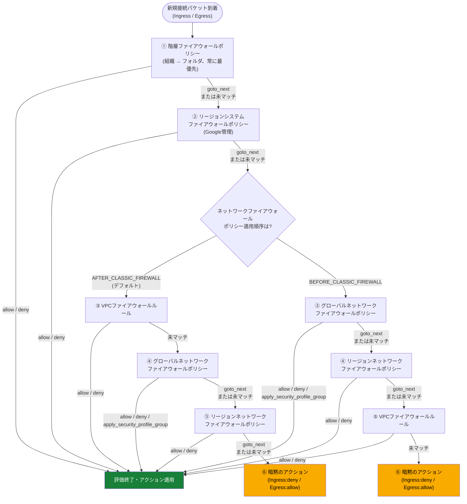

各ステップにおける評価ロジックは共通しており、次の3段階で処理されます。

1. ターゲットが一致しないルールを除外する。
2. パケットの方向(ingress/egress)が一致しないルールを除外する。
3. 残ったルールを優先度の高い順(数値が小さい順)に評価し、ターゲットに適用されるルールがマッチするか、マッチするルールがなくなるまで続ける。

最終ステップの**暗黙のアクション**(implied action)は方向とターゲットによって異なります。

| トラフィック方向 | ターゲット | 暗黙のアクション |
|---|---|---|
| Ingress | VMインスタンスのネットワークインターフェース | `deny` |
| Ingress | 内部ALB/内部プロキシNLBのフォワーディングルール | `allow` |
| Egress | (すべて) | `allow` |

VPCファイアウォールルールで2つのルールが同一優先度でマッチした場合、`deny`ルールが`allow`ルールより優先して適用されます。

> **出典**: [Evaluation order for firewall policies and rules](https://docs.cloud.google.com/firewall/docs/firewall-policies-rule-eval-order)

> **ベストプラクティス**: 適用順序を変更する強い理由がない限り、デフォルトの`AFTER_CLASSIC_FIREWALL`を維持してください。新規に大規模なファイアウォール基盤を構築する場合、レガシーなVPCファイアウォールルールへの依存を避け、ネットワークファイアウォールポリシー(グローバル/リージョナル)へ統一することで、Secure Tagsによる一貫したIAM統制と将来の機能追加の恩恵を受けられます。

---

### 2.3 階層ファイアウォールポリシーとEffective Rules

階層ファイアウォールポリシーは組織・フォルダに関連付けられるコンテナで、下位のポリシーやVPCファイアウォールルールへ評価を委譲する`goto_next`アクションを持つのが特徴です。組織レベルの上位ルールは、下位のフォルダ・プロジェクトのルールで上書きできません。

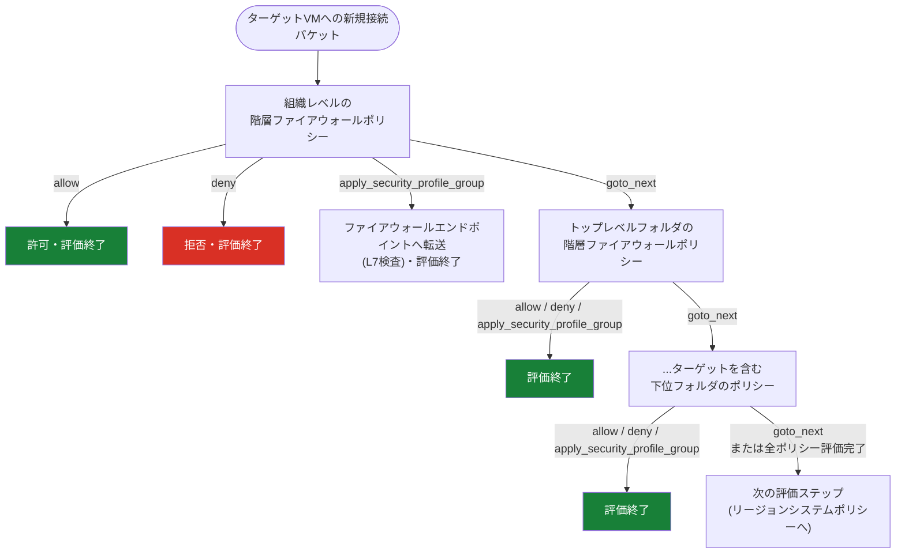

**Effective Firewall Rules**(実効ファイアウォールルール)は、あるVPCネットワークやVMインターフェースに実際に適用されているルール群を可視化する機能です。階層ファイアウォールポリシー由来のルール、VPCファイアウォールルール、グローバル/リージョンネットワークファイアウォールポリシー由来のルールを、組織レベルからVPCネットワークまでの順序で一覧表示します。

```bash
# ネットワーク全体の実効ファイアウォールルールを表示
gcloud compute networks get-effective-firewalls NETWORK_NAME
```

> **出典**:
> - [Hierarchical firewall policies](https://docs.cloud.google.com/firewall/docs/firewall-policies)
> - [Manage hierarchical firewall policies and rules](https://docs.cloud.google.com/firewall/docs/manage-hierarchical-firewall-policies)
> - [Create hierarchical firewall policies and rules](https://docs.cloud.google.com/firewall/docs/using-firewall-policies)

> **ベストプラクティス**: 組織レベルのポリシーは「絶対に守るべき最小限のルール」に留め、`goto_next`を積極的に使って評価を下位へ委譲してください。過度に制限的な組織ポリシーは、各チームの自律的な運用を妨げる摩擦の原因になります。トラブルシューティング時は必ずEffective Firewall Rulesで実際の適用状況を確認し、想定と異なる階層でルールがブロックされていないか検証してください。

---

### 2.4 Cloud NGFWの3つの階層(Essentials/Standard/Enterprise)

Cloud NGFWは3つの階層(ティア)で提供され、階層が上がるほど高度な機能と、それに応じた課金体系が適用されます。

| ティア | 主な機能 | 課金対象トラフィック |
|---|---|---|
| **Essentials** | 標準的なネットワーク属性(IPレンジ・ポート・プロトコル)によるルール、Secure Tags、アドレスグループ、階層/グローバル/リージョンポリシー基盤 | 課金なし(無料) |
| **Standard** | Essentialsの全機能 + FQDNオブジェクト、ジオロケーションオブジェクト、Google Threat Intelligence(NGFW版) | 南北トラフィック(インターネット⇔VM)のみ課金 |
| **Enterprise** | Standardの全機能 + レイヤー7検査(URLフィルタリングサービス、侵入検知防止サービス IDPS) | 南北 + 東西トラフィック(Google Cloudリソース間)を課金 |

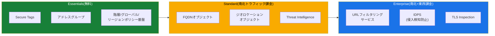

**コスト最適化パターン**: 課金はルールが評価された時点(トラフィックフローが有料機能を含むルールによって評価された時点)で発生するため、Essentials機能のみを使うルールを**より高い優先度**(小さい数値)に配置し、大部分のトラフィックをそこで処理させることで、有料ティアの評価対象を必要最小限に絞り込めます。

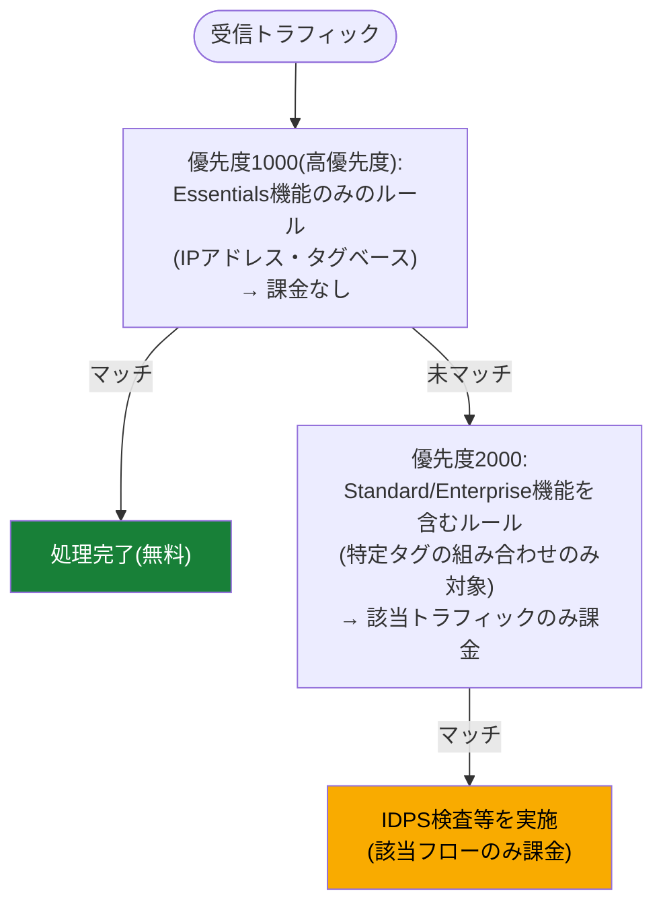

> **出典**:
> - [Cloud NGFW tiers](https://docs.cloud.google.com/firewall/docs/ngfw_tiers)
> - [Cloud Next Generation Firewall pricing](https://cloud.google.com/firewall/pricing)
> - [Key terms](https://docs.cloud.google.com/firewall/docs/key-terms)

> **ベストプラクティス**: データベース層など重要度の高いワークロードにのみIDPS検査(Enterprise機能)を適用し、東西トラフィック全体を無差別に検査対象にしないでください。Essentialsルールを高優先度に配置しバルクトラフィックを無料で処理する設計は、機能面だけでなくコスト面でも重要な設計判断です。

---

### 2.5 レイヤー7検査: TLS Inspection・URLフィルタリング・IDPS

Cloud NGFW Enterpriseのレイヤー7検査機能は、**ファイアウォールエンドポイント**と**セキュリティプロファイル**という2つの構成要素で実現されます。

| 構成要素 | 役割 |
|---|---|
| ファイアウォールエンドポイント | 組織レベルのゾーンリソース。1つ以上のVPCに関連付けて傍受トラフィックを検査 |
| セキュリティプロファイル | `url-filtering`(URLフィルタリングルール定義)または`threat-prevention`(IDPS設定)のいずれかの種別を持つ検査設定 |
| セキュリティプロファイルグループ | 各種別1つずつのセキュリティプロファイルを含むコンテナ。`apply_security_profile_group`アクションで参照 |
| TLS Inspectionポリシー | Certificate Authority Service(CAS)を用いて暗号化トラフィックを復号し、L7検査を可能にする設定 |

TLS Inspectionは、GoogleマネージドのCAS経由で短命の中間証明書を生成し、傍受したTLSトラフィックを復号 → L7検査(URLフィルタリング・IDPS) → 再暗号化して送信先へ転送、という流れで動作します。プロトコルバージョンはTLS 1.0〜1.3をサポートしますが、HTTP/2・QUIC・HTTP/3・PROXYプロトコルはTLS Inspectionと併用できません。

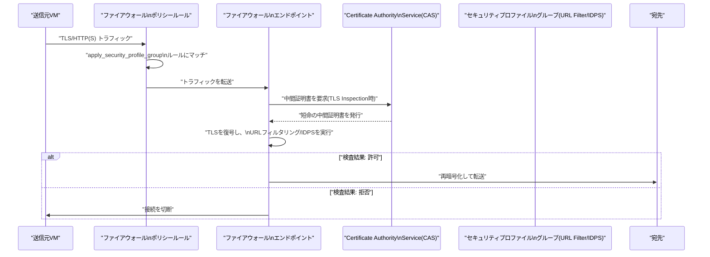

URLフィルタリングは、TLS Inspectionが無効な場合でもTLSネゴシエーション時のSNI(Server Name Indication)を用いてドメインマッチングが可能です。ただし完全なURLパスでのフィルタリングにはTLS Inspectionが必要です。

> **出典**:
> - [Application layer inspection overview](https://docs.cloud.google.com/firewall/docs/about-app-layer-inspection)
> - [URL filtering service overview](https://docs.cloud.google.com/firewall/docs/about-url-filtering)
> - [TLS inspection overview](https://docs.cloud.google.com/firewall/docs/about-tls-inspection)
> - [Create and manage URL filtering security profiles](https://docs.cloud.google.com/firewall/docs/configure-urlf-security-profiles)

> **ベストプラクティス**: URLフィルタリングのマッチャー文字列は優先度順に評価され、SNI/ドメイン情報を持たないトラフィックの扱いは最高優先度のURLフィルタ(明示的ALLOWまたは暗黙のDENY)によって決まります。ポリシーの末尾に優先度`2147483647`のワイルドカード拒否ルールを配置し、意図しない許可漏れを防ぐ「暗黙のdeny-all」を明示的に設計してください。Secure Web Proxy(Part 3参照)と組み合わせる場合は、NGFW EnterpriseとSWPの双方でTLS Inspectionを重複させないよう、NGFW側の`tls_inspect`を無効化することを検討してください。

---

### 2.6 ファイアウォールルールの基準(criteria)

ファイアウォールルール(VPCファイアウォールルール・ファイアウォールポリシールール共通)の主要な構成基準は以下の通りです。

| 基準 | 説明 |
|---|---|
| 優先度(priority) | 0〜65535の整数。数値が小さいほど高優先度。ポリシー内で一意である必要がある |
| 方向(direction) | ingress(受信)またはegress(送信) |
| プロトコル/ポート | TCP/UDP/ICMP等のプロトコルと、任意でポート範囲を指定 |
| 送信元(ingressの場合) | IPレンジ、Secure Tags/Network Tags、サービスアカウント、FQDNオブジェクト(Standard以上)、ジオロケーション(Standard以上) |
| 宛先(egressの場合) | 同上 |
| ターゲット | ルールを適用するリソース(全インスタンス、特定のSecure Tags/Network Tags、特定のサービスアカウント) |
| アクション | allow / deny / apply_security_profile_group / goto_next(階層ポリシーのみ) |
| ロギング | ルールごとに有効/無効を設定可能(`goto_next`ルールはロギング不可) |

REST APIで階層ファイアウォールポリシールールを直接作成する場合は方向を明示的に指定する必要がありますが、gcloud CLIでは方向省略時のデフォルトは`INGRESS`です。

> **出典**: [Manage hierarchical firewall policies and rules](https://docs.cloud.google.com/firewall/docs/manage-hierarchical-firewall-policies)

> **ベストプラクティス**: ルールには必ず`description`フィールドで意図を記録してください。半年後に見返した際、なぜそのルールが存在するのかをチーム全員が理解できることが、大規模組織でのファイアウォール運用の生命線になります。

---

### 2.7 Secure Tags と Network Tags によるマイクロセグメンテーション

Google Cloudには2種類の「タグ」があり、対応するポリシー種別が異なります。

| 項目 | Secure Tags(IAM-governed tags) | Network Tags(従来のタグ) |
|---|---|---|
| 管理場所 | Resource Managerでキー・値のペアとして管理 | VMインスタンス/インスタンステンプレートに直接付与する文字列 |
| アクセス制御 | あり(IAMで誰がタグを作成・付与できるか統制可能) | なし(単なる文字列、アクセス制御機構を持たない) |
| 対応ポリシー | 階層ファイアウォールポリシー、グローバル/リージョンネットワークファイアウォールポリシー | VPCファイアウォールルール(classic)のみ |
| VPCファイアウォールルールでの利用 | 不可 | 可能 |
| 適用範囲 | 組織全体で一意なキー(最大1,000個のユニークな値を参照可能) | VPCネットワークごとに独立した文字列 |

Secure Tagsは、IAMによる厳格なアクセス制御のもとで、リージョン・ネットワーク構成に関わらずワークロードに一貫したポリシーを適用できるため、大規模なマイクロセグメンテーション基盤に適しています。GKEワークロードに対してもSecure Tagsを付与できます。

> **出典**: [Secure tags for firewalls](https://docs.cloud.google.com/firewall/docs/tags-firewalls-overview)

> **ベストプラクティス**: 新規に大規模なマイクロセグメンテーション設計を行う場合は、アクセス制御の効かないNetwork Tagsではなく、Secure Tagsを起点に設計してください。「誰がタグを付与できるか」をIAMで統制できることは、多数のチームが同じVPCを共有するShared VPC環境において特に重要な統制ポイントになります。

---

### 2.8 ファイアウォールルールロギング

ファイアウォールルールロギングは、ルールごとに有効化する任意設定で、そのルールにマッチしたトラフィックの詳細(接続情報)をCloud Loggingへ記録します。VPCファイアウォールルールとファイアウォールポリシールールでログフォーマットが異なるため、ログ基盤側でのパース処理は両方に対応させる必要があります。

| ロギング種別 | 対象 | 主な用途 |
|---|---|---|
| VPCファイアウォールルールロギング | classic VPCファイアウォールルール | レガシー環境のトラフィック可視化 |
| ファイアウォールポリシールールロギング | 階層/グローバル/リージョンネットワークファイアウォールポリシー | 統合的なトラフィック監査・コンプライアンス証跡 |
| Firewall Insights | 全ポリシー種別 | 過度に許可的なルール・未使用ルール・シャドウルールの検出と改善提案 |

> **出典**: [Logging for firewall policy rules](https://docs.cloud.google.com/firewall/docs/firewall-policy-rules-logging-overview)

> **ベストプラクティス**: すべてのdeny/allowルールでロギングを有効化するとログ量とコストが増大するため、コンプライアンス上重要な境界(組織/フォルダレベルのdenyルール、機密ワークロードへのアクセスを許可するルール)を優先的にロギング対象とし、内部の高頻度な東西トラフィックは必要に応じてサンプリングやFirewall Insightsによる定期レビューで補完してください。

---

### 2.9 VPCファイアウォールルールからCloud NGFWポリシーへの移行

Googleは移行ツール(`gcloud beta compute firewall-rules migrate`)を提供しており、既存のVPCファイアウォールルールをグローバルネットワークファイアウォールポリシーへ自動変換できます。

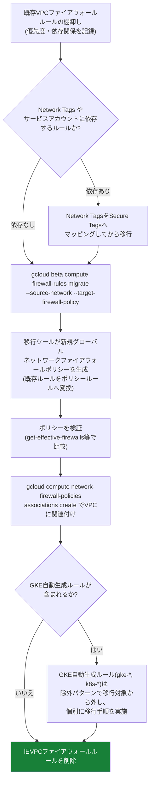

移行によって得られる主な利点は、Secure Tagsを用いたIAM統制、バッチ編集による一括ルール更新、FQDNオブジェクト・ジオロケーションオブジェクト・Threat Intelligenceといった高度な属性の利用、そして複数VPCへの単一ポリシーの共有です。

> **出典**:
> - [VPC firewall rules migration overview](https://cloud.google.com/firewall/docs/migrate-vpc-firewall-rules-overview)
> - [Migrate VPC firewall rules that don't use network tags and service accounts](https://cloud.google.com/firewall/docs/migrate-firewall-rules-no-dependencies)
> - [From VPC firewall rules to Cloud NGFW network firewall policies](https://cloud.google.com/blog/products/networking/from-vpc-firewall-rules-to-cloud-ngfw-network-firewall-policies)

> **ベストプラクティス**: GKEが自動生成するVPCファイアウォールルール(`gke-(.+)-ipv6-all`、`k8s-fw-*`等の正規表現にマッチするルール)は移行ツールの対象から除外し、GKEサービスIP向けのingressルールを個別に手動作成した上で、既存の自動生成allowルールを無効化する専用手順に従ってください。移行直後はすぐに旧ルールを削除せず、Effective Firewall Rulesで新旧ポリシーの評価結果が一致することを確認してから削除作業に進むことを推奨します。

---

### 2.10 GKEおよびCloud Load BalancingでのCloud NGFWサポート

Cloud NGFWはGKEワークロードとCloud Load Balancingの双方に対応しています。

| ワークロード種別 | 対応内容 |
|---|---|
| GKE Podレベル | Secure TagsをPodに付与し、ネットワークポリシーと組み合わせたマイクロセグメンテーションが可能 |
| GKEノードレベル | Essentials/Standard/Enterpriseいずれの機能もノードのVMインターフェースに適用可能 |
| 内部ALB/内部プロキシNLB | マネージドEnvoyプロキシに対してもファイアウォールルールがingress対象として適用される |
| 外部ALB(グローバル/リージョン) | グローバル/リージョンネットワークファイアウォールポリシーでバックエンドを保護可能(Cloud Armorと併用可能) |

> **出典**: [Firewall policies and rules](https://docs.cloud.google.com/firewall/docs/firewall-policies-overview)

> **ベストプラクティス**: GKEクラスタでSecure Tagsベースのマイクロセグメンテーションを導入する際は、GKEのネットワークポリシー(Kubernetes NetworkPolicyリソース、Dataplane V2)とCloud NGFWのファイアウォールポリシーが二重に競合しないよう、責任分界(Podレベルの制御はKubernetes NetworkPolicy、ノード/クラスタ境界の制御はCloud NGFW)を明確にしてください。

---

### 2.11 Part 2 ベストプラクティス一覧

| 領域 | ベストプラクティス |
|---|---|
| ポリシー戦略 | 組織全体の絶対要件は階層ポリシー、柔軟なルールはグローバル/リージョンネットワークポリシーで管理する |
| 評価順序 | 特段の理由がなければデフォルトの`AFTER_CLASSIC_FIREWALL`を維持する |
| 階層ポリシー | 組織レベルは最小限に留め、`goto_next`で下位への委譲を積極的に活用する |
| コスト最適化 | Essentials機能のルールを高優先度に配置し、有料ティアの評価対象を絞り込む |
| L7検査 | Enterprise階層のIDPS/URLフィルタリングは重要ワークロードに限定して適用する |
| マイクロセグメンテーション | 新規設計はNetwork TagsではなくSecure Tagsを起点にする |
| ロギング | コンプライアンス上重要な境界を優先し、全ルール一律のロギングは避ける |
| 移行 | GKE自動生成ルールを除外し、Effective Firewall Rulesで新旧の一致を確認してから旧ルールを削除する |
| GKE統合 | Podレベルの制御はKubernetes NetworkPolicy、ノード/クラスタ境界はCloud NGFWと責任分界を明確にする |

---

## Part 3: インターネットEgressの構成と保護 — Public Cloud NATとSecure Web Proxy

### 3.1 Cloud NATのIPアドレッシング

Public Cloud NATは、外部IPを持たないVMやGKEノードに対してソースNAT(SNAT)を行い、インターネットへのegress接続を可能にするリージョンサービスです。NAT IPアドレスの割り当て方式には2種類あります。

| 割り当て方式 | 動作 | 予測可能性 | 主な用途 |
|---|---|---|---|
| 自動(Automatic) | VM数・必要ポート数に応じてGoogle Cloudが静的外部IPを自動的に追加/削除。選択したネットワーク階層(Premium/Standard)のIPが割り当てられる | 不可(次に割り当てられるIPを事前に予測できない) | スケーラビリティを優先する一般的なワークロード |
| 手動(Manual) | 管理者が予約済み静的外部IPアドレスを明示的に指定 | 可能 | サードパーティAPIのIP許可リスト(allowlist)登録が必要なワークロード |

自動割り当てのNAT IPは、そのIP上のポートを使用するVMが1つもなくなるまで解放されません(使用中のVMがある限りIPはアクティブなまま保持され、Cloud NATはVMを別IPへ動的に再割り当てすることはありません。これは既存の接続を破壊しないための設計です)。

> **出典**: [IP addresses and ports](https://docs.cloud.google.com/nat/docs/ports-and-addresses)、[Quickstart: Set up and manage network address translation with Public NAT](https://docs.cloud.google.com/nat/docs/set-up-manage-network-address-translation)

> **ベストプラクティス**: サードパーティのAPIやパートナーシステムがIP許可リストを要求する場合は、必ず手動IP割り当てを選択し、静的予約IPを使用してください。自動割り当てのままでは、IPが変更された際に相手先での許可リスト更新が必要になり、予期しない接続断が発生するリスクがあります。

---

### 3.2 ポート割り当て(静的/動的)

Cloud NAT IPアドレス1つあたり、TCP/UDPそれぞれ64,512個のソースポート(0〜1,023のウェルノウンポートを除く65,536個から算出)が利用可能です。ポート割り当て方式には静的と動的の2種類があります。

| 割り当て方式 | 動作 | デフォルト値 |
|---|---|---|
| 静的ポート割り当て | 全VMに対して固定数のポートを一律割り当て | 最小64ポート/VM |
| 動的ポート割り当て | VMごとの実際の使用量に応じて異なる数のポートを動的に割り当て。初期値は最小ポート数からスタートし、必要に応じて最大値まで増加 | 環境により最小/最大を設定(推奨値: 最小2048、最大4096など、ワークロードにより調整) |

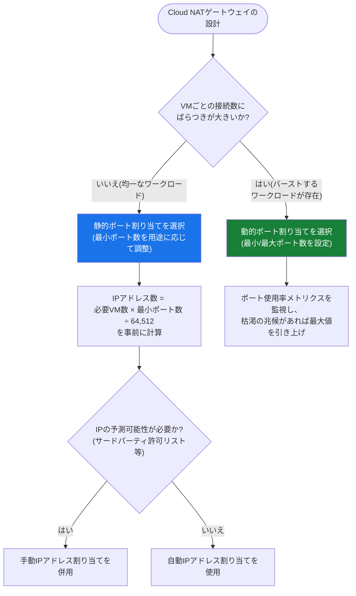

ポート割り当て方式の変更や、静的方式でのポート数の**減少**は既存のNAT接続を切断する可能性があるため、変更前に「IPアドレスのドレイン(段階的な切り離し)」の検討が必要です。一方、ポート数の**増加**(静的・動的いずれも)は既存接続を中断しません。

> **出典**: [IP addresses and ports](https://docs.cloud.google.com/nat/docs/ports-and-addresses)、[Quickstart: Set up and manage network address translation with Public NAT](https://docs.cloud.google.com/nat/docs/set-up-manage-network-address-translation)

> **ベストプラクティス**: ポート枯渇によるNATエラー(`allocation_status="DROPPED"`)をCloud Loggingで継続的に監視してください。バーストする可能性のあるワークロードには動的ポート割り当てを採用し、固定サイズのワークロードには静的割り当てでリソースを予測可能に保つという使い分けが基本方針になります。IPアドレスを変更する際は、必ず「外部IPアドレスのドレイン」手順に従い、既存接続を保護してください。

---

### 3.3 Secure Web Proxyの概要とデプロイモード

Secure Web Proxy(Cloud SWP)は、egressのWeb(HTTP/HTTPS)トラフィックに対して、送信元アイデンティティ(Secure Tags・サービスアカウント・IPアドレス)、宛先(ドメイン・URL・URLリスト)、リクエスト属性(メソッド・ヘッダー)に基づく粒度の高いアクセスポリシーを適用するサービスです。

トラフィックの発信元として、VMインスタンス、コンテナ、サーバーレスVPCアクセスコネクタ経由のサーバーレス環境、Cloud VPN/Cloud Interconnect経由のオンプレミスワークロードをサポートします。

| デプロイモード | 説明 |
|---|---|
| 明示的プロキシルーティングモード | クライアント側でSecure Web Proxyを明示的にプロキシサーバーとして構成。クライアントに代わって新しいTCP接続を作成し、インターネットから分離する |

Secure Web ProxyはCertificate Authority Service(CAS)を用いたTLS Inspectionを統合的に提供し、暗号化されたリクエストの内容(完全なURLパス、HTTPヘッダー)まで検査できます。クライアント-プロキシ間のトンネルもTLSで保護可能で、HTTP/HTTPS CONNECTによるクライアント起点のエンドツーエンドTLS接続もサポートします。

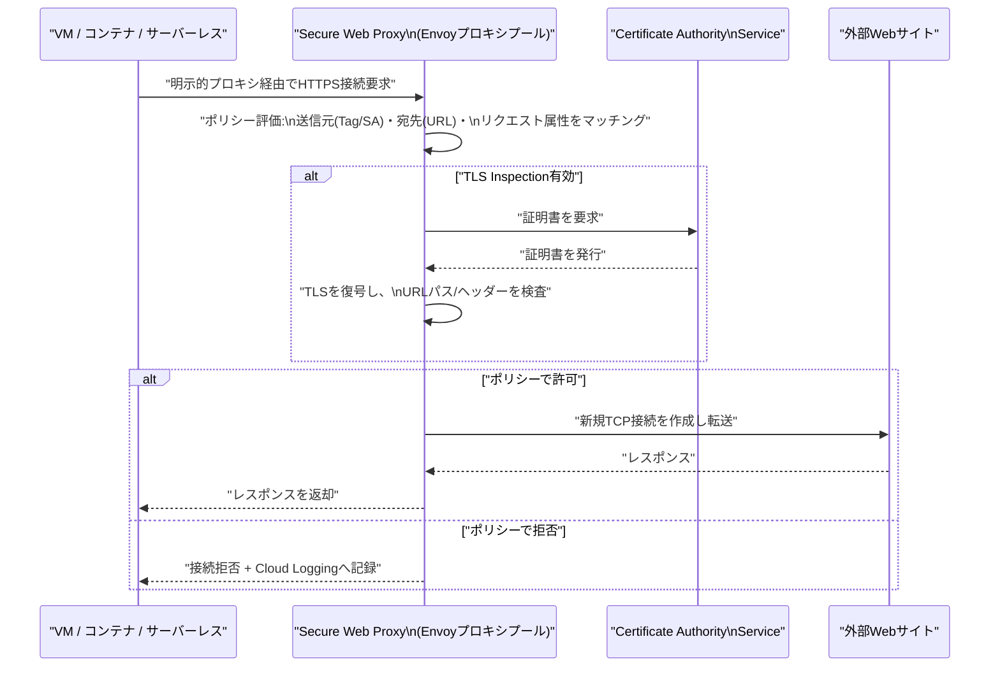

> **出典**:
> - [Secure Web Proxy overview](https://docs.cloud.google.com/secure-web-proxy/docs/overview)
> - [TLS inspection overview | Secure Web Proxy](https://docs.cloud.google.com/secure-web-proxy/docs/tls-inspection-overview)
> - [Secure Web Proxy (SWP)](https://cloud.google.com/security/products/secure-web-proxy)

> **ベストプラクティス**: TLS InspectionはクライアントデバイスがSecure Web Proxyのプライベート認証局(内部CA)を信頼済みルートとして事前インストールしている、管理下のデバイス(マネージドVM等)でのみ有効に機能します。証明書ピンニングを行うアプリケーション(特定の公開鍵/CAチェーンをハードコードしたクライアント)はTLS Inspection経由で通信できない場合があるため、事前に対象アプリケーションの互換性を確認してください。

---

### 3.4 Secure Web Proxyポリシーの構成

Secure Web Proxyのポリシーは**デフォルトで全てのegress Webトラフィックを拒否**し、明示的なルールで許可した通信のみを通す「ホワイトリスト方式」で動作します。

| 属性カテゴリ | 利用可能な識別子 |
|---|---|
| 送信元(source) | サービスアカウント、Secure Tags(Resource Managerタグ)、IPアドレス(社内固定IPやGoogle Cloud静的IP) |
| 宛先(destination) | 宛先ドメイン、完全URLパス(TLS Inspection有効時)、URLリスト、宛先ポート |
| リクエスト属性 | HTTPメソッド、ヘッダー、URL(ワイルドカード・パターンで指定可能) |

URLリストは複数のポリシーから再利用できるモジュール化されたオブジェクトであり、中央管理者が定義したリストを、各チームが自身のポリシーから参照する運用が可能です。

Secure Web ProxyのegressトラフィックはPublic Cloud NAT経由でインターネットへ出るため、固定の送信元IPアドレスが必要な場合は、Cloud NAT側の設定を「自動(推奨)」から「手動」へ変更し、静的予約IPを割り当てます。

> **出典**:
> - [Secure Web Proxy policies overview](https://docs.cloud.google.com/secure-web-proxy/docs/policies-overview)
> - [Assign static IP addresses for outbound traffic](https://docs.cloud.google.com/secure-web-proxy/docs/assign-static-ip-addresses-for-egress-traffic)

> **ベストプラクティス**: Secure Web Proxyのegress IPを固定化する場合、Cloud NAT側で動的ポート割り当てを有効化し(推奨値: 最小2048ポート/VM、最大4096ポート/VM)、限られた静的IPプールを効率的に利用してください。VPC Service Controlsと組み合わせることで、Cloud StorageやBigQueryなどのGoogle Cloudサービスからのデータ持ち出し(exfiltration)防止も同時に実現できます。

---

### 3.5 Part 3 ベストプラクティス一覧

| 領域 | ベストプラクティス |
|---|---|
| IPアドレッシング | サードパーティのIP許可リスト連携が必要な場合は手動IP割り当てを使用する |
| ポート割り当て | 均一なワークロードは静的、バーストするワークロードは動的ポート割り当てを選択する |
| 監視 | `allocation_status="DROPPED"`ログを継続監視し、ポート枯渇を早期検知する |
| IP変更 | 変更前に外部IPアドレスのドレイン手順を実施し、既存接続への影響を最小化する |
| SWP TLS Inspection | 証明書ピンニングを行うアプリケーションの互換性を事前確認する |
| SWPポリシー | デフォルト拒否の原則を維持し、必要な宛先のみを明示的に許可する |
| SWP × Cloud NAT | 固定送信元IPが必要な場合はCloud NAT側を手動割り当て + 動的ポート割り当てに構成する |
| データ保護 | VPC Service Controlsと組み合わせてデータ持ち出しリスクを低減する |

---

## Part 4: セルフマネージドNVAとPacket Mirroringの構成

### 4.1 マルチNIC VMによるVPC間トラフィックのルーティングと検査

セルフマネージドのネットワーク仮想アプライアンス(NVA)は、複数のネットワークインターフェース(マルチNIC)を持つCompute Engine VMとして構成され、異なるVPCネットワーク間のトラフィックを検査・ルーティングする役割を担います。サードパーティ製のNGFWアプライアンス(FortiGate、Palo Alto Networks VM-Series等)や自作のルーティング/ゲートウェイソフトウェアが該当します。

典型的な構成は、ハブVPCに配置したマルチNIC NVAのインスタンスグループが、複数のスポークVPCからのトラフィックを集約・検査するハブアンドスポーク型です。

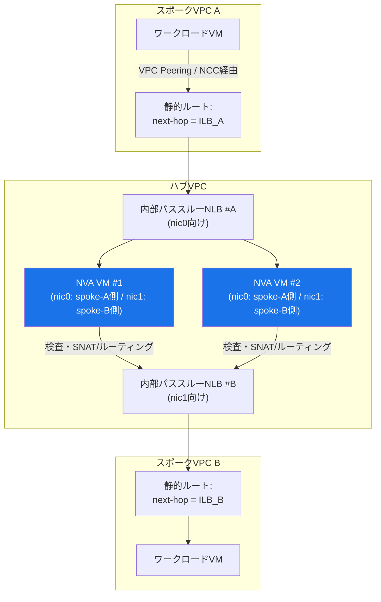

> **出典**: [Internal passthrough Network Load Balancers as next hops](https://docs.cloud.google.com/load-balancing/docs/internal/ilb-next-hop-overview)

> **ベストプラクティス**: マルチNIC NVAを自前で構築・運用する前に、Cloud NGFW Enterprise(Part 2参照)やNetwork Security Integration(本Partの4.4節参照)で同等の要件を満たせないか検討してください。セルフマネージドNVAはGoogle管理サービスに比べて構成・パッチ適用・スケーリングの運用負荷が高く、可能な限りマネージドサービスへの移行を優先することが長期的な運用コストの削減につながります。

---

### 4.2 HA構成: 内部パススルーNLBをネクストホップにする

内部パススルーNetwork Load Balancer(ILB)は、静的ルートのネクストホップとして指定できます。これにより、マルチNIC NVAを冗長構成(インスタンスグループの複数VM)にした上で、ヘルスチェックによる自動フェイルオーバーを実現できます。

| 用途 | 説明 |
|---|---|
| デフォルトルートのネクストホップ | インターネットへのトラフィックを、負荷分散されたゲートウェイVM群経由でルーティング |
| 複数方向へのトラフィック分散 | 同一のマルチNIC VMセットを、方向ごとに異なるILB(nic0向け・nic1向け)の背後に配置し、双方向トラフィックを処理 |
| タグベースの複数ネクストホップ | Network Tagsを使い、クライアントVMごとに異なるILBネクストホップへ振り分け(ECMPは同一優先度・同一タグの複数ルート間では非対応) |

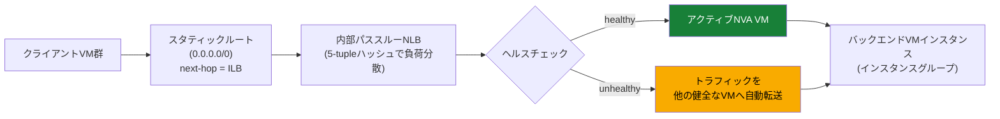

ILBネクストホップの背後にあるバックエンドVMは、**IP転送(IP forwarding)を有効化**する必要があります。ILBがネクストホップの場合、クライアントVM側のゲストOSには特別な設定は不要です(クライアントはロードバランサーの背後にあるバックエンドを経由してパケットを送信するだけです)。

> **出典**:
> - [Internal passthrough Network Load Balancers as next hops](https://docs.cloud.google.com/load-balancing/docs/internal/ilb-next-hop-overview)
> - [Deploy a hub-and-spoke network by using a load balancer as the next hop](https://docs.cloud.google.com/load-balancing/docs/internal/deploying-ilb-next-hop-vm)
> - [Set up an internal passthrough Network Load Balancer as next hop (with tags)](https://docs.cloud.google.com/load-balancing/docs/internal/setting-up-internal-next-hop-tags)

> **ベストプラクティス**: FortiGateなど商用NVAのHAクラスタを構成する場合、アクティブ/パッシブの判定にベンダー固有のヘルスチェックプローブレスポンダー(アクティブなクラスタメンバーのみが応答するプローブ)を使用し、Cloud Load Balancingのヘルスチェックと連携させてください。フェイルオーバー時の既存TCP接続の維持には、Cloud Load Balancingのコネクショントラッキング機能が有効に機能します。タグベースのネクストホップルートはVPC Network Peering経由ではエクスポート/インポートされない点に注意し、Peering先での経路設計を別途検討してください。

---

### 4.3 HA マルチNIC VMルーティングのためのポリシーベースルート

ポリシーベースルート(Policy-Based Routes, PBR)は、パケットの**宛先IPアドレスだけでなく、プロトコルや送信元IPアドレスも加味して**ネクストホップを選択できるルーティング機構です。

| 項目 | 仕様 |
|---|---|
| マッチ条件 | 宛先IP、プロトコル、送信元IPアドレス |
| 適用対象 | 同一VPC内の全VMインスタンス/Interconnect VLANアタッチメント/VPNトンネル、または特定のNetwork Tagsを持つVMのみ、または特定リージョンのVLANアタッチメントのみ |
| ネクストホップ | 有効な内部パススルーNLBである必要がある(同一VPC、またはVPC Network Peering接続先のVPC) |
| バックエンド要件 | ネクストホップILBの背後のVMインスタンスはIP転送を有効化する必要がある |
| 評価順序 | サブネットルート・スタティックルート・ダイナミックルートより先、特殊経路(special routing paths)より後に評価される |
| 同一優先度の競合 | 複数のポリシーベースルートが同一優先度でマッチする場合、Google Cloudが内部アルゴリズムで1つを選択(最も詳細なマッチが選ばれるとは限らない) |

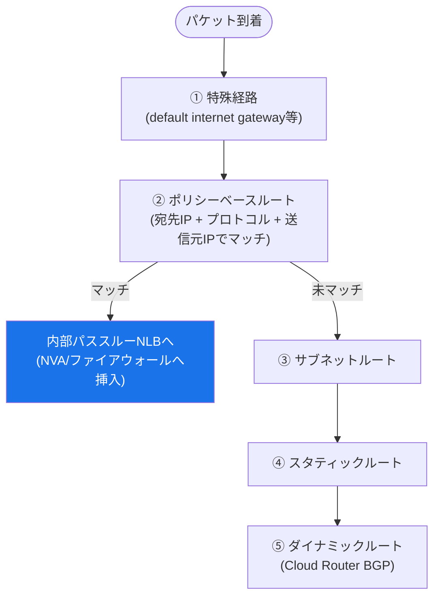

ポリシーベースルートは、通常のスタティックルート(宛先IPのみでマッチ)よりも粒度の高い制御が必要な場合、たとえば「特定のプロトコル(TCP/443のみ)や特定の送信元サブネットのトラフィックのみをNVA経由でインスペクションしたい」といったユースケースで使用します。

> **出典**: [Policy-based routes](https://docs.cloud.google.com/vpc/docs/policy-based-routes)

> **ベストプラクティス**: マルチNIC NVAをHA構成にする際は、ポリシーベースルートのネクストホップにも内部パススルーNLBを指定し、静的ルート(4.2節)と組み合わせることで、プロトコル/送信元単位の柔軟なトラフィック挿入と、ロードバランサーによる自動フェイルオーバーの両方を実現してください。同一優先度でのルート競合は選択結果が保証されないため、意図した経路制御には優先度を明示的に分離してください。

---

### 4.4 アウトオブバンドのNetwork Security Integration戦略

Network Security Integration(NSI)のアウトオブバンド統合は、Packet Mirroring技術を基盤としつつ、**プロデューサー(検査サービス提供側)とコンシューマー(トラフィックを検査してほしい側)を分離したモデル**を提供する、よりスケーラブルなアーキテクチャです。トラフィックはGeneveカプセル化によって元のパケットを保持したまま転送され、VPCネットワーク識別子が付与されるため、重複するIPアドレス範囲を持つ複数VPCが存在する環境でも正しく識別できます。

| コンポーネント | 役割 |
|---|---|
| ミラーリングデプロイグループ(プロデューサー側) | 複数ゾーンにまたがるミラーリングデプロイの集合。プロデューサーの検査サービスを表すグローバルなプロジェクトレベルリソース |
| ミラーリングエンドポイントグループ(コンシューマー側) | プロデューサーのデプロイグループを参照するコンシューマー側リソース |
| ミラーリングエンドポイントグループアソシエーション | エンドポイントグループを特定のVPCネットワークに関連付け、そのVPCのトラフィックを検査対象にする |
| カスタムミラーリングセキュリティプロファイル | ミラーリングエンドポイントグループを参照する検査設定。セキュリティプロファイルグループに含めてファイアウォールルールの`MIRROR`アクションから参照 |

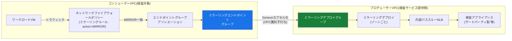

NSIアウトオブバンド統合は、**ミラーリングコレクターのサービス化**という運用モデルもサポートします。セキュリティ管理者が所有する専用プロジェクトでミラーリングデプロイグループを一元運用し、各アプリケーションチームのVPC(コンシューマー)がそれをサービスとして利用する、という責任分界が可能です。

> **出典**:
> - [Out-of-band integration overview](https://docs.cloud.google.com/network-security-integration/docs/out-of-band/out-of-band-integration-overview)
> - [Mirroring endpoint groups overview](https://cloud.google.com/network-security-integration/docs/out-of-band/endpoint-groups-overview)
> - [Mirroring deployment groups overview](https://cloud.google.com/network-security-integration/docs/out-of-band/deployment-groups-overview)
> - [Set up out-of-band integration for a producer-consumer model](https://cloud.google.com/network-security-integration/docs/tutorial/out-of-band-integration-tutorial)

> **ベストプラクティス**: 複数のアプリケーションチームが同じ検査基盤(IDS/NTAツール等)を共有する組織では、従来のPacket Mirroring(4.5節)よりも、プロデューサー/コンシューマーモデルのNetwork Security Integrationを優先的に検討してください。検査アプライアンスの運用をセキュリティチームに集約しつつ、各チームのVPCからはサービスとして疎結合に利用できるため、大規模組織でのスケーラビリティと運用分離の両方を実現できます。regional network firewall policiesはPacket Mirroringに対応していない点にも留意してください。

---

### 4.5 Packet Mirroring(セルフマネージドコレクター)

従来のPacket Mirroring機能は、指定したVPC内のミラーリング対象インスタンス(mirrored sources)のトラフィックを複製し、内部パススルーNLBの背後にあるコレクターインスタンスグループへ転送します。ペイロードとヘッダーを含む全トラフィックをエクスポートするため、サンプリングベースのVPC Flow Logsでは検出できない詳細な脅威分析やアプリケーションパフォーマンス分析が可能です。

| 設定項目 | 内容 |
|---|---|
| ミラーリング対象(source) | サブネット、Network Tags、インスタンス名のいずれかで指定。複数指定した場合、いずれかにマッチするインスタンスが対象 |
| キャプチャ方向 | ingressのみ・egressのみ・両方向、を選択可能 |
| コレクター destination | 内部パススルーNLBの背後にあるインスタンスグループ(コレクターインスタンス) |
| スコープの制約 | ミラーリング対象は同一プロジェクト・同一VPCネットワーク・同一リージョン内である必要がある |

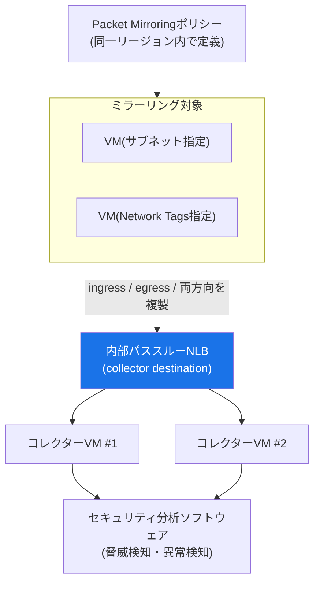

コレクターインスタンスは、ミラーリング対象からのトラフィックとGoogle Cloudヘルスチェックシステムからのトラフィックを受信できるファイアウォールルールが必要です。また、コレクターにはインターネットトラフィックが到達しないよう、内部IPアドレスのみを割り当てることが推奨されます。

VPC Flow Logsはミラーリングされたパケット自体をログに記録しませんが、コレクターインスタンスが配置されたサブネットでVPC Flow Logsが有効な場合、コレクター宛ての直接トラフィック(元の宛先IPがコレクターのIPと一致するフロー)はログに記録されます。

> **出典**:
> - [Packet Mirroring](https://docs.cloud.google.com/vpc/docs/packet-mirroring)
> - [Use Packet Mirroring](https://docs.cloud.google.com/vpc/docs/using-packet-mirroring)

> **ベストプラクティス**: ミラーリング対象・コレクターともに同一プロジェクト・同一VPC・同一リージョンという制約があるため、複数リージョンにまたがる大規模環境では、リージョンごとに独立したPacket Mirroringポリシーとコレクター基盤を設計する必要があります。組織横断的な集約検査基盤が必要な場合は、4.4節のNetwork Security Integration(アウトオブバンド統合)への移行を検討してください。ミラーリングはVM側で追加の帯域を消費する点も、キャパシティプランニング時に考慮してください。

---

### 4.6 Part 4 ベストプラクティス一覧

| 領域 | ベストプラクティス |
|---|---|
| NVA導入の判断 | セルフマネージドNVAの前に、Cloud NGFW EnterpriseやNSIで要件を満たせないか検討する |
| HA設計 | 内部パススルーNLBをネクストホップにし、ヘルスチェックによる自動フェイルオーバーを構成する |
| IP転送 | ネクストホップILB背後のバックエンドVMでは必ずIP転送を有効化する |
| ポリシーベースルート | プロトコル/送信元単位の細かい制御が必要な場合はPBRを、シンプルなデフォルトルート挿入には静的ルートを使い分ける |
| タグベースルート | VPC Network Peering越しにはタグ付きルートがエクスポートされない点を設計に織り込む |
| 検査基盤の選定 | 複数チーム共有の検査基盤はNSI(プロデューサー/コンシューマーモデル)を優先し、単純な単一VPC内検査には従来のPacket Mirroringを使う |
| スコープ制約 | Packet Mirroringはプロジェクト/VPC/リージョンの境界を越えられないため、マルチリージョン環境ではリージョンごとに設計する |
| コレクター保護 | コレクターインスタンスには内部IPのみを割り当て、インターネットからの直接到達を防ぐ |

---

## 設計・実装チェックリスト

以下は、Section 6「ネットワークセキュリティの設計と実装」に関する設計・実装レビュー用のチェックリストです。

### Cloud Armor(6.1)
- [ ] 全ての公開バックエンドサービス/バックエンドバケットにCloud Armorセキュリティポリシーがアタッチされているか
- [ ] プリコンフィグドWAFルールをプレビューモードで検証済みか、感度レベルは段階的に設定されているか
- [ ] 外部パススルーNLB/プロトコルフォワーディング/パブリックIP VMを保護する場合、高度なネットワークDDoS防御への加入を検討したか
- [ ] Adaptive Protectionのアラートしきい値・自動デプロイ条件が保守的に設定されているか
- [ ] レート制限ルール(throttle/rate_based_ban)がAPIエンドポイントの特性に応じて設計されているか
- [ ] Bot管理・reCAPTCHA連携が必要なエンドポイントで有効化されているか
- [ ] Google Threat Intelligenceの適用範囲(Tor/悪意あるIP/bot/パブリッククラウド)が業務要件と整合しているか

### Cloud NGFW / VPCファイアウォール(6.2)
- [ ] ファイアウォール戦略(階層 vs グローバル/リージョンネットワーク vs VPC classic)が組織のガバナンス方針と整合しているか
- [ ] ネットワークファイアウォールポリシー適用順序(AFTER/BEFORE_CLASSIC_FIREWALL)を意図的に選択しているか
- [ ] 階層ファイアウォールポリシーの組織レベルルールが最小限に設計され、`goto_next`で下位へ適切に委譲されているか
- [ ] Cloud NGFWの利用ティア(Essentials/Standard/Enterprise)が要件とコストのバランスを考慮して選定されているか
- [ ] Essentials機能のルールが高優先度に配置され、有料ティアの評価対象が絞り込まれているか
- [ ] L7検査(TLS Inspection・URLフィルタリング・IDPS)が重要ワークロードに限定して適用されているか
- [ ] マイクロセグメンテーションの主軸としてSecure Tagsが採用されているか(Network Tagsへの新規依存を避けているか)
- [ ] ファイアウォールルールロギングがコンプライアンス上重要な境界に対して有効化されているか
- [ ] VPCファイアウォールルールからの移行計画がGKE自動生成ルールの除外を考慮しているか
- [ ] GKEワークロードにおけるPodレベル制御(NetworkPolicy)とクラスタ境界制御(Cloud NGFW)の責任分界が明確か

### Cloud NAT・Secure Web Proxy(6.3)
- [ ] サードパーティ連携でIP許可リストが必要な場合、手動IPアドレス割り当てが選択されているか
- [ ] ポート割り当て方式(静的/動的)がワークロードの接続パターンに応じて選定されているか
- [ ] NATポート枯渇(`allocation_status="DROPPED"`)の監視・アラートが設定されているか
- [ ] IPアドレス変更時のドレイン手順が運用手順書に含まれているか
- [ ] Secure Web Proxyのデフォルト拒否ポリシーの例外(許可ルール)が最小権限で設計されているか
- [ ] Secure Web ProxyのTLS Inspectionと証明書ピンニングを行うアプリケーションとの互換性が確認済みか

### セルフマネージドNVA・Packet Mirroring(6.4)
- [ ] セルフマネージドNVA導入前にCloud NGFW Enterprise/NSIでの代替可能性を検討したか
- [ ] マルチNIC NVAのHA構成で内部パススルーNLBネクストホップとヘルスチェックが構成されているか
- [ ] ネクストホップILB背後のバックエンドVMでIP転送が有効化されているか
- [ ] ポリシーベースルートと静的ルートの使い分けが要件(プロトコル/送信元単位の制御要否)に基づいているか
- [ ] 複数チーム共有の検査基盤にNetwork Security Integration(プロデューサー/コンシューマーモデル)が検討されているか
- [ ] Packet Mirroringのスコープ制約(同一プロジェクト/VPC/リージョン)がマルチリージョン設計に織り込まれているか
- [ ] コレクターインスタンスに内部IPのみが割り当てられ、インターネットから直接到達不可能になっているか

---

## 参考文献

### Cloud Armor
- [Cloud Armor overview](https://docs.cloud.google.com/armor/docs/cloud-armor-overview)
- [Security policy overview](https://docs.cloud.google.com/armor/docs/security-policy-overview)
- [Use cases for security policies](https://docs.cloud.google.com/armor/docs/common-use-cases)
- [Create and manage security policies](https://docs.cloud.google.com/armor/docs/configure-security-policies)
- [Preconfigured WAF rules overview](https://docs.cloud.google.com/armor/docs/waf-rules)
- [Tune Cloud Armor preconfigured WAF rules](https://docs.cloud.google.com/armor/docs/rule-tuning)
- [Configure custom rules language attributes](https://docs.cloud.google.com/armor/docs/rules-language-reference)
- [Configure advanced network DDoS protection](https://docs.cloud.google.com/armor/docs/advanced-network-ddos)
- [Configure network edge security policies](https://docs.cloud.google.com/armor/docs/network-edge-policies)
- [Adaptive Protection overview](https://docs.cloud.google.com/armor/docs/adaptive-protection-overview)
- [Adaptive Protection use cases](https://docs.cloud.google.com/armor/docs/adaptive-protection-use-cases)
- [Automatically deploy Adaptive Protection suggested rules](https://docs.cloud.google.com/armor/docs/adaptive-protection-auto-deploy)
- [Rate limiting overview](https://docs.cloud.google.com/armor/docs/rate-limiting-overview)
- [Configure rate limiting](https://docs.cloud.google.com/armor/docs/configure-rate-limiting)
- [Bot management overview](https://docs.cloud.google.com/armor/docs/bot-management)
- [Apply Google Threat Intelligence](https://docs.cloud.google.com/armor/docs/threat-intelligence)

### Cloud NGFW / VPCファイアウォール
- [Cloud NGFW overview](https://docs.cloud.google.com/firewall/docs/about-firewalls)
- [Key terms](https://docs.cloud.google.com/firewall/docs/key-terms)
- [Firewall policies and rules](https://docs.cloud.google.com/firewall/docs/firewall-policies-overview)
- [Evaluation order for firewall policies and rules](https://docs.cloud.google.com/firewall/docs/firewall-policies-rule-eval-order)
- [Hierarchical firewall policies](https://docs.cloud.google.com/firewall/docs/firewall-policies)
- [Create hierarchical firewall policies and rules](https://docs.cloud.google.com/firewall/docs/using-firewall-policies)
- [Manage hierarchical firewall policies and rules](https://docs.cloud.google.com/firewall/docs/manage-hierarchical-firewall-policies)
- [Cloud NGFW tiers](https://docs.cloud.google.com/firewall/docs/ngfw_tiers)
- [Cloud Next Generation Firewall pricing](https://cloud.google.com/firewall/pricing)
- [Application layer inspection overview](https://docs.cloud.google.com/firewall/docs/about-app-layer-inspection)
- [URL filtering service overview](https://docs.cloud.google.com/firewall/docs/about-url-filtering)
- [Create and manage URL filtering security profiles](https://docs.cloud.google.com/firewall/docs/configure-urlf-security-profiles)
- [TLS inspection overview](https://docs.cloud.google.com/firewall/docs/about-tls-inspection)
- [Secure tags for firewalls](https://docs.cloud.google.com/firewall/docs/tags-firewalls-overview)
- [Logging for firewall policy rules](https://docs.cloud.google.com/firewall/docs/firewall-policy-rules-logging-overview)
- [VPC firewall rules migration overview](https://cloud.google.com/firewall/docs/migrate-vpc-firewall-rules-overview)
- [Migrate VPC firewall rules that don't use network tags and service accounts](https://cloud.google.com/firewall/docs/migrate-firewall-rules-no-dependencies)
- [From VPC firewall rules to Cloud NGFW network firewall policies (blog)](https://cloud.google.com/blog/products/networking/from-vpc-firewall-rules-to-cloud-ngfw-network-firewall-policies)

### Cloud NAT・Secure Web Proxy
- [IP addresses and ports | Cloud NAT](https://docs.cloud.google.com/nat/docs/ports-and-addresses)
- [Quickstart: Set up and manage network address translation with Public NAT](https://docs.cloud.google.com/nat/docs/set-up-manage-network-address-translation)
- [Secure Web Proxy overview](https://docs.cloud.google.com/secure-web-proxy/docs/overview)
- [Secure Web Proxy policies overview](https://docs.cloud.google.com/secure-web-proxy/docs/policies-overview)
- [TLS inspection overview | Secure Web Proxy](https://docs.cloud.google.com/secure-web-proxy/docs/tls-inspection-overview)
- [Assign static IP addresses for outbound traffic](https://docs.cloud.google.com/secure-web-proxy/docs/assign-static-ip-addresses-for-egress-traffic)
- [Secure Web Proxy (SWP) — product page](https://cloud.google.com/security/products/secure-web-proxy)

### セルフマネージドNVA・Packet Mirroring・Network Security Integration
- [Internal passthrough Network Load Balancers as next hops](https://docs.cloud.google.com/load-balancing/docs/internal/ilb-next-hop-overview)
- [Deploy a hub-and-spoke network by using a load balancer as the next hop](https://docs.cloud.google.com/load-balancing/docs/internal/deploying-ilb-next-hop-vm)
- [Set up an internal passthrough Network Load Balancer as next hop (with tags)](https://docs.cloud.google.com/load-balancing/docs/internal/setting-up-internal-next-hop-tags)
- [Policy-based routes](https://docs.cloud.google.com/vpc/docs/policy-based-routes)
- [Packet Mirroring](https://docs.cloud.google.com/vpc/docs/packet-mirroring)
- [Use Packet Mirroring](https://docs.cloud.google.com/vpc/docs/using-packet-mirroring)
- [Out-of-band integration overview | Network Security Integration](https://docs.cloud.google.com/network-security-integration/docs/out-of-band/out-of-band-integration-overview)
- [Mirroring endpoint groups overview](https://cloud.google.com/network-security-integration/docs/out-of-band/endpoint-groups-overview)
- [Mirroring deployment groups overview](https://cloud.google.com/network-security-integration/docs/out-of-band/deployment-groups-overview)
- [Set up out-of-band integration for a producer-consumer model](https://cloud.google.com/network-security-integration/docs/tutorial/out-of-band-integration-tutorial)

### 試験ガイド・認定情報

- [Google Cloud Certified - Professional Cloud Network Engineer](https://cloud.google.com/learn/certification/cloud-network-engineer)
- [Professional Cloud Network Engineer Certification exam guide (PDF)](https://services.google.com/fh/files/misc/professional_cloud_network_engineer_exam_guide_english.pdf)
