# Google Cloud Professional Cloud Developer（PCD）認定試験 学習ガイド

初学者〜中級者向けに、Professional Cloud Developer 認定試験の出題範囲を項目ごとに解説し、各サービス・機能のベストプラクティスと公式ソースをまとめたガイドです。

> **対象読者**: Google Cloud 上でクラウドネイティブなアプリケーションを設計・構築・デプロイ・運用するソフトウェアエンジニア。
> **本ガイドの前提資料**:
> - 公式認定ページ: [cloud.google.com/learn/certification/cloud-developer](https://cloud.google.com/learn/certification/cloud-developer)
> - 公式 Exam Guide PDF: [services.google.com/fh/files/misc/professional_cloud_developer_exam_guide_english.pdf](https://services.google.com/fh/files/misc/professional_cloud_developer_exam_guide_english.pdf)

---

## 0. 試験の概要

Professional Cloud Developer は、Google 推奨のツールとベストプラクティスを使ってスケーラブルかつセキュアなアプリケーションを構築・構成できる開発者を認定する試験です。設計からビルド・テスト、デプロイ、Google Cloud サービスとの統合まで、開発ライフサイクル全体をカバーします。

| 項目 | 内容 |
|---|---|
| 試験時間 | 2時間 |
| 受験料 | $200（税別途） |
| 出題言語 | 英語・日本語 |
| 出題形式 | 選択式・複数選択式 50〜60問 |
| 前提条件 | なし |
| 推奨経験 | 業界経験3年以上（うちGoogle Cloudでの設計・運用経験1年以上） |
| 受験方法 | オンライン監督付き、またはテストセンターでの受験 |

### 出題範囲（4セクション）

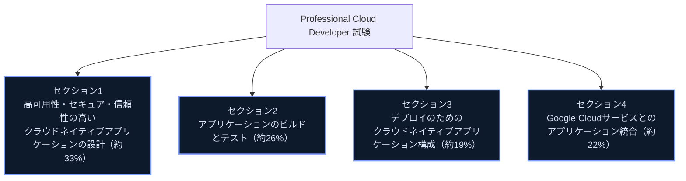

> **出典**: [Professional Cloud Developer Certification exam guide](https://services.google.com/fh/files/misc/professional_cloud_developer_exam_guide_english.pdf)、[Professional Cloud Developer Certification | Google Cloud](https://cloud.google.com/learn/certification/cloud-developer)

### 目次

1. [セクション1: 高可用性・セキュア・信頼性の高いクラウドネイティブアプリケーションの設計（約33%）](#section1)
   - 1.1 高性能アプリケーションとAPIの設計
   - 1.2 セキュアなアプリケーションの設計
   - 1.3 データの保存とアクセス
2. [セクション2: アプリケーションのビルドとテスト（約26%）](#section2)
   - 2.1 開発環境のセットアップ
   - 2.2 ビルド
   - 2.3 テスト
3. [セクション3: デプロイのためのクラウドネイティブアプリケーション構成（約19%）](#section3)
   - 3.1 Cloud Runへのアプリケーションデプロイ
   - 3.2 GKEへのコンテナデプロイ
4. [セクション4: Google Cloudサービスとのアプリケーション統合（約22%）](#section4)
   - 4.1 データ・ストレージサービスとの統合
   - 4.2 Google Cloud APIの利用
   - 4.3 トラブルシューティングとオブザーバビリティ
5. [学習チェックリスト](#checklist)
6. [参考文献](#references)

---

## 1. セクション1: 高可用性、セキュア、信頼性の高いクラウドネイティブアプリケーションの設計（約33%）

### 1.1 高性能アプリケーションとAPIの設計

#### コンピューティングプラットフォームの選択

Compute Engine・GKE・Cloud Run のどれを選ぶかは、必要な制御レベルとワークロードの性質で決まります。

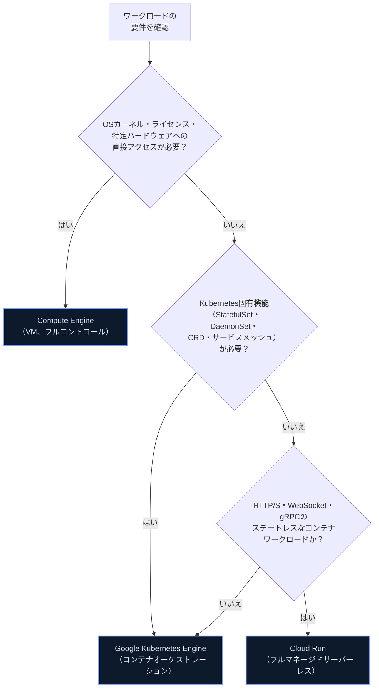

| プラットフォーム | 運用負荷 | 適したユースケース |
|---|---|---|
| Compute Engine | 高（OS・パッチ・スケーリングを自前管理） | レガシーアプリの移行、特定OS/カーネル/ライセンス要件、SAP HANAなど |
| GKE | 中〜高（クラスタ管理は必要だがKubernetesが自動化） | マイクロサービス、複雑な組み合わせのステートフル/ステートレス混在ワークロード、マルチクラウド/ハイブリッド展開 |
| Cloud Run | 低（フルマネージド、スケールtoゼロ） | ステートレスなHTTP/gRPCサービス、イベント駆動処理、可変トラフィックのAPI |

> **ベストプラクティス**: 新規のステートレスHTTPサービスは、まず Cloud Run をデフォルトの選択肢として検討する。Kubernetes固有の機能（カスタムコントローラ、サービスメッシュ、DaemonSetなど）が明確に必要になった時点で GKE への移行を検討する。
> **出典**: [Where should I run my stuff? | Google Cloud Blog](https://cloud.google.com/blog/topics/developers-practitioners/where-should-i-run-my-stuff-choosing-google-cloud-compute-option)

コンテナのビルド・リファクタリングは Cloud Build（後述 2.2）で行い、`gcloud run deploy --source` によるソースからの直接デプロイ、または事前ビルド済みイメージのデプロイのいずれも可能です（詳細は 3.1 で扱います）。

#### 地理的分散とロードバランサ

Google Cloud のサービスにはグローバル（例: Cloud Load Balancing の一部）、リージョナル、ゾーナルの3種類のスコープがあります。リージョン間・ゾーン間のレイテンシとサービスの可用性要件を踏まえてアーキテクチャを設計する必要があります。

| ロードバランサの種類 | ユースケース |
|---|---|
| グローバル外部アプリケーション ロードバランサ | 複数リージョンにまたがるHTTP(S)トラフィックの分散、CDN連携 |
| リージョン外部/内部アプリケーション ロードバランサ | リージョン内で完結するHTTP(S)サービス |
| 内部パススルー ネットワークロードバランサ | 内部TCP/UDPトラフィックの低レイテンシ分散 |
| Cloud Run/GKEの組み込みロードバランシング | Cloud Runはリージョナルサービス。マルチリージョン配信には複数リージョンへデプロイし、その前段にグローバル外部アプリケーション ロードバランサを構成する。GKEはService/Ingressで制御 |

**セッションアフィニティ**: 同一クライアントのリクエストを同じバックエンドインスタンスにルーティングし続けたい場合（例: ステートフルなWebSocket接続）に有効化します。ただしCloud Runのセッションアフィニティは**ベストエフォート**であり、インスタンスが終了したときや処理能力を超えたときには別のインスタンスへリクエストが振り向けられます。セッション状態はMemorystoreなどの外部ストアで共有し、WebSocketなどのステートフルな接続は再接続を前提に実装してください。Cloud Runでトラフィック分割と併用する場合は、セッションアフィニティがトラフィック比率の実際の分配に影響する点にも注意が必要です。

> **出典**: [Rollbacks, gradual rollouts, and traffic migration | Cloud Run](https://docs.cloud.google.com/run/docs/rollouts-rollbacks-traffic-migration)

#### キャッシング（Memorystore）

Memorystore（Redis/Valkey/Memcached互換）を使い、頻繁に読み取られるデータをサブミリ秒でアクセスできるようキャッシュします。データベースへの負荷軽減とレイテンシ短縮が主目的です。なお**Memorystore for Memcachedは非推奨（deprecated）**であり、新規設計ではMemorystore for Valkeyを優先します。Memorystore への呼び出しでも、5xx・429エラーに対しては指数バックオフでのリトライが推奨されます。

> **出典**: [Exponential backoff | Memorystore for Redis](https://docs.cloud.google.com/memorystore/docs/redis/exponential-backoff)

#### APIの作成: REST と gRPC

| 観点 | REST（HTTP/JSON） | gRPC |
|---|---|---|
| プロトコル | HTTP/1.1が主流 | HTTP/2ベース |
| データ形式 | 人間可読なJSON | バイナリのProtocol Buffers |
| 契約定義 | OpenAPI等（任意） | `.proto`ファイルで厳密に定義 |
| ストリーミング | 限定的（SSE等） | 双方向ストリーミングをネイティブサポート |
| 向いている用途 | 公開API、ブラウザ直叩き、シンプルなCRUD | マイクロサービス間の高頻度通信、低レイテンシ要件、多言語間の型安全な契約 |

Google自身もCloud APIの設計にはREST的な考え方を取り入れたRPC（gRPC）スタイルを推奨しており、Cloud Endpointsの多くもこの設計指針に従っています。

> **ベストプラクティス**: サービス間（内部）通信で低レイテンシ・強い型付けが必要ならgRPC、外部公開APIや幅広いクライアント互換性が必要ならRESTを選ぶ。両方が必要な場合はgRPCで定義しHTTP/JSONトランスコーディングを併用する設計も可能。
> **出典**: [API Design Guide | Google Cloud](https://docs.cloud.google.com/apis/design)、[gRPC vs REST | Google Cloud Blog](https://cloud.google.com/blog/products/api-management/understanding-grpc-openapi-and-rest-and-when-to-use-them)

#### レート制限・認証・オブザーバビリティ: API Gateway と Apigee

| 観点 | API Gateway | Apigee |
|---|---|---|
| 位置づけ | 軽量なゲートウェイ（ルーティング・認証・基本レート制限） | フル機能のAPI管理プラットフォーム |
| 認証 | APIキー、IAM、JWT | OAuth2、SAML、APIキー等の高度な認証 |
| 開発者ポータル | なし | あり（外部開発者向け公開に有効） |
| マネタイズ・分析 | 基本的なCloud Monitoring/Logging連携のみ | 詳細な分析、マネタイズ、トラフィック変換 |
| 適したケース | Google Cloudのサーバーレスサービス向けのシンプルなフロントドア | APIをビジネス資産として外部提供する場合、高度なトラフィック制御が必要な場合 |

> **ベストプラクティス**: 内部マイクロサービスの認証・クォータ・監視だけで十分なら API Gateway（またはCloud Endpoints）を使う。外部開発者へのAPI公開、収益化、高度なセキュリティポリシーが必要になった時点でApigeeを検討する。過剰な機能を持つApigeeを最初から選ぶと運用コストが増える。
> **出典**: [About API Gateway | Google Cloud](https://docs.cloud.google.com/api-gateway/docs/concepts)

#### 非同期・イベント駆動統合とオーケストレーション

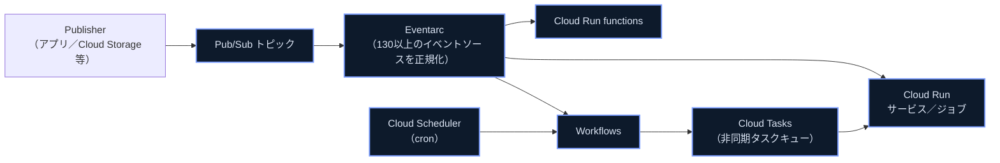

- **Eventarc**: Pub/Sub、Cloud Storage、Cloud Audit Logs など130以上のイベントソースを CloudEvents 形式に正規化し、Cloud Run・GKE・Workflows にルーティングする。Pub/Subトランスポート経由のため少なくとも1回配信が保証され、イベントハンドラは冪等に実装する必要がある。
- **Pub/Sub**: メッセージング基盤そのもの。Eventarcより細かい制御（サブスクリプションのフィルタ、デッドレタートピック等）が必要な場合は直接利用する。
- **Workflows**: 複数サービス・APIの呼び出し順序を宣言的に定義するフルマネージドオーケストレーションサービス。HTTP呼び出し、Pub/Sub、Cloud Schedulerからトリガー可能。
- **Cloud Tasks**: 配信タイミングの制御・レート制御・リトライ設定ができる非同期タスクキュー。配信は**少なくとも1回**であり、タスク名の指定は同名タスクの重複追加を抑止するものであって、実行時の重複配信を防ぐものではない。
- **Cloud Scheduler**: cron形式でWorkflows・Pub/Sub・HTTPエンドポイントを定期実行する。

> **ベストプラクティス**: Eventarcは「イベントが発生したら実行する」宣言的なルーティングに、Cloud Tasksは「特定のタイミング・レートで確実に実行したい」制御されたディスパッチに使い分ける。ただしCloud Tasksも少なくとも1回配信であり、1回だけ実行されることは保証されない。イベントハンドラとタスクハンドラは常に冪等に実装し、CloudEventのIDやタスク名で重複を検出する。
> **出典**: [Create triggers with Eventarc | Cloud Run](https://docs.cloud.google.com/run/docs/triggering/trigger-with-events)、[Workflows overview](https://docs.cloud.google.com/workflows/docs/overview)、[Understand Cloud Tasks](https://docs.cloud.google.com/tasks/docs/dual-overview)、[Cloud Scheduler documentation](https://docs.cloud.google.com/scheduler/docs)

#### トラフィック分割戦略（段階的ロールアウト・ロールバック・A/Bテスト）

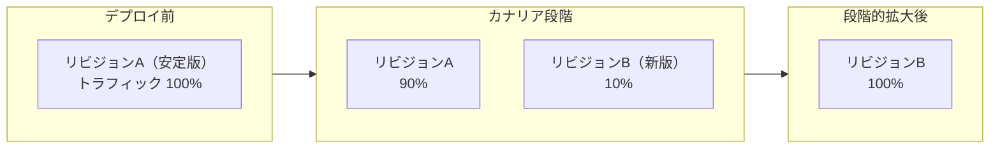

Cloud Runはリビジョン単位でトラフィックを分割でき、`gcloud run services update-traffic` でパーセンテージを指定するだけでカナリアデプロイ・Blue-Greenデプロイ・A/Bテストが実現できます。問題があれば旧リビジョンへ100%戻すことでロールバックできます。ただし切り替えは瞬時ではなく反映には時間がかかり、移行中の新規リクエストは新旧いずれかのリビジョンへ送られ、処理中のリクエストは割り当てられたリビジョンで完了します。

> **ベストプラクティス**: 新リビジョンには最初トラフィック0%〜少量を割り当て、Cloud Monitoringでエラー率・レイテンシを確認しながら段階的に拡大する。両リビジョンが並行稼働する間はリソース課金も両方に発生するため、カナリア期間は必要以上に長引かせない。
> **出典**: [Rollbacks, gradual rollouts, and traffic migration | Cloud Run](https://docs.cloud.google.com/run/docs/rollouts-rollbacks-traffic-migration)、[Manage revisions | Cloud Run](https://docs.cloud.google.com/run/docs/managing/revisions)

#### リソース要件の定義とコスト最適化

CPU・メモリのリクエストとリミットを実測に基づいて適切に設定し、過剰プロビジョニングを避けます。Cloud Runでは最小インスタンス数（コールドスタート回避）と最大インスタンス数（コスト上限）のバランスを取ります。GKEでは Vertical Pod Autoscaler（VPA）と Horizontal Pod Autoscaler（HPA）を組み合わせ、余剰リソースを削減します。

#### ゾーン・リージョンフェイルオーバーのためのデータレプリケーション

AlloyDB・Cloud SQL・Spanner・Bigtable・Cloud Storage はそれぞれ異なるレプリケーション/可用性モデルを持ちます（詳細は 1.3）。アプリケーション層では、リージョン障害時にどのデータストアがフェイルオーバーし、RPO/RTOがどうなるかを設計段階で明確にしておく必要があります。

---

### 1.2 セキュアなアプリケーションの設計

#### データ保持・組織化ポリシー

Cloud Storage の **Object Lifecycle Management** は、オブジェクトの経過日数などの条件に応じてストレージクラスの変更や削除を自動化します。**保持ポリシー（Retention Policy）** はバケット内のオブジェクトが一定期間削除・上書きできないことを保証し、ロック（Retention Policy Lock）をかけると保持ポリシー自体も変更不可になります。

| 機能 | 目的 |
|---|---|
| Object Lifecycle Management | 経過日数・ストレージクラス等の条件でオブジェクトを自動的に削除／クラス変更 |
| 保持ポリシー（Retention Policy） | 指定期間内のオブジェクトの削除・上書きを禁止 |
| 保持ポリシーのロック | 保持ポリシー自体を恒久的に変更不可にする（コンプライアンス要件向け） |
| オブジェクトホールド | 個別オブジェクトの削除を一時的に禁止 |

> **ベストプラクティス**: 署名付きURLで一時アップロードを許可するバケットでは、Object Lifecycle Managementの削除期限と保持ポリシーの期間を一致させ、意図しない削除・保持の矛盾を避ける。
> **出典**: [Object Lifecycle Management | Cloud Storage](https://docs.cloud.google.com/storage/docs/lifecycle)

#### 脆弱性の特定と保護

- **Identity-Aware Proxy（IAP）**: HTTPSでアクセスするアプリケーションに対し、ネットワークファイアウォールではなくアプリケーションレベルのアクセス制御（IAMベース）を提供する。VPNや公開IPを不要にし、コンテキストアウェアなアクセス（デバイスの状態、位置情報等）も可能。
- **Web Security Scanner**: App Engine・GKE・Compute Engine上のWebアプリに対してXSS、Flash Injection、混合コンテンツなどの一般的な脆弱性をスキャンする。

> **出典**: [Identity-Aware Proxy overview](https://docs.cloud.google.com/iap/docs/concepts-overview)

#### 脆弱性への対応

- **Artifact Analysis**: Artifact Registry / Container Registry内のコンテナイメージをスキャンし、既知の脆弱性（CVE）を検出する。Cloud Buildのビルド来歴（provenance）情報もここに保存される。
- **Security Command Center（SCC）**: Security Health AnalyticsやWeb Security Scannerが検出した脆弱性ファインディングを一元的に可視化するダッシュボード。組織全体のセキュリティ体制を横断的に把握できる。

> **出典**: [Vulnerability findings | Security Command Center](https://docs.cloud.google.com/security-command-center/docs/concepts-vulnerabilities-findings)

#### シークレット・認証情報・暗号鍵の保管とローテーション

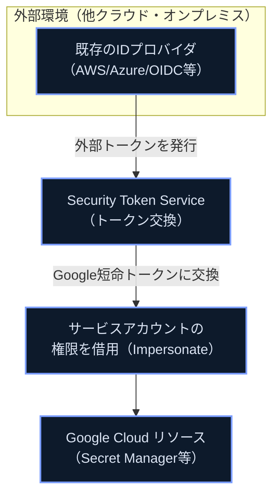

| サービス | 用途 |
|---|---|
| Secret Manager | APIキー、パスワード、証明書などのシークレットを一元管理・バージョニング・IAMで保護 |
| Cloud Key Management Service（KMS） | 暗号鍵の作成・ローテーション・利用（CMEK等） |
| Workload Identity Federation（WIF） | 外部IDプロバイダのトークンをGoogle Cloudの認証情報に交換し、サービスアカウントキーを不要にする |

> **ベストプラクティス**:
>
> - サービスアカウントキーのエクスポートは避け、GKEやCompute Engineでは組み込みのWorkload Identity、他クラウド/オンプレミスではWorkload Identity Federationを使う（管理すべきシークレットの数を減らせる）。
> - Secret Managerではシークレットを `latest` エイリアスではなく特定のバージョン番号で参照し、既存のリリースプロセスでバージョンを更新する。
> - シークレットをファイルシステムや環境変数経由でアプリに渡すのは避け、Secret Managerのクライアントライブラリで直接取得する。
> **出典**: [Secret Manager best practices](https://docs.cloud.google.com/secret-manager/docs/best-practices)、[Best practices for using Workload Identity Federation](https://docs.cloud.google.com/iam/docs/best-practices-for-using-workload-identity-federation)

#### Google Cloudサービスへの認証方法

| 方式 | 説明 | 主な用途 |
|---|---|---|
| Application Default Credentials（ADC） | 環境（GKE/Cloud Run/ローカル等）に応じて自動的に適切な認証情報を検出 | Google Cloud上で動くアプリのデフォルト認証 |
| JSON Web Token（JWT） | 署名済みトークンでIDを主張 | サービス間認証、IAP経由のユーザー認証 |
| OAuth 2.0 | 認可フレームワーク | ユーザーの代理でAPIを呼び出す場合 |
| Cloud SQL Auth Proxy / AlloyDB Auth Proxy | IAM認証情報を使ってmTLSでデータベースに安全に接続するローカルプロキシ | Cloud SQL / AlloyDB へのアプリ接続 |
| Identity Platform | 顧客向けアプリの認証・ユーザー管理（CIAM） | エンドユーザー向けログイン機能の実装 |
| Workload Identity Federation | 外部IDをGoogle Cloudの短命トークンに交換 | 他クラウド・オンプレミス・CI/CDからの認証 |

> **出典**: [About the Cloud SQL Auth Proxy | Cloud SQL for MySQL](https://docs.cloud.google.com/sql/docs/mysql/sql-proxy)、[About the AlloyDB Auth Proxy](https://docs.cloud.google.com/alloydb/docs/auth-proxy/overview)

#### サービスアカウントのIAMロールによるリソース保護と最小権限

> **ベストプラクティス**:
>
> - サービスやユースケースごとに専用のサービスアカウントを作成し、必要なリソースへのアクセスのみを付与する（最小権限の原則）。
> - Editor/Ownerなどの基本ロールは避け、事前定義ロールまたはカスタムロールを使う。
> - サービスアカウントキーの管理より、IAM Credentials APIによる一時的な権限昇格やCredential Access Boundariesによるトークンのダウンスコープを優先する。
> **出典**: [Best practices for using service accounts securely](https://docs.cloud.google.com/iam/docs/best-practices-service-accounts)、[Best practices for managing service account keys](https://docs.cloud.google.com/iam/docs/best-practices-for-managing-service-account-keys)

#### セキュアなサービス間通信

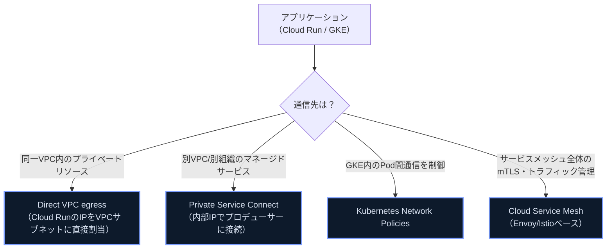

| 手段 | 概要 |
|---|---|
| Direct VPC egress | Serverless VPC Accessコネクタ不要でCloud RunからVPCへ直接接続。インスタンスあたり最大1Gbpsのスループット |
| Kubernetes Network Policies | GKE内のPod間通信をラベルベースで許可・拒否 |
| Cloud Service Mesh | Envoy/Istioベースのフルマネージドサービスメッシュ。mTLS、トラフィック管理、可観測性を提供 |
| Private Service Connect（PSC） | 消費者VPCとプロデューサーVPC間を内部IPで接続し、IPアドレスの重複を気にせず疎結合に連携 |

> **出典**: [Direct VPC egress with a VPC network | Cloud Run](https://docs.cloud.google.com/run/docs/configuring/vpc-direct-vpc)、[Private networking and Cloud Run](https://docs.cloud.google.com/run/docs/securing/private-networking)、[Private Service Connect | VPC](https://cloud.google.com/vpc/docs/private-service-connect)、[Configure Cloud Service Mesh for Cloud Run](https://docs.cloud.google.com/service-mesh/docs/configure-cloud-service-mesh-for-cloud-run)

#### Binary Authorizationによるアプリケーションアーティファクトの保護

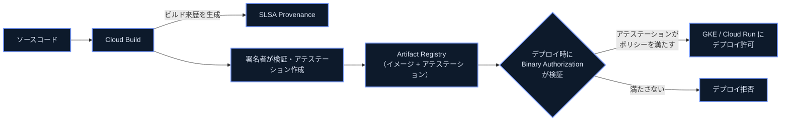

Binary Authorizationはデプロイ時のセキュリティ制御で、信頼できるオーソリティ（アテスター）が事前に定義されたプロセス（脆弱性スキャン通過、承認レビュー等）を経たイメージにのみ署名（アテステーション）を許可し、その署名がない、あるいはポリシーを満たさないイメージのデプロイをGKE・Cloud Runで拒否します。

> **ベストプラクティス**: アテステーションは全てのチェック（脆弱性スキャン、テスト、必要なレビュー）が完了した後にCIパイプラインの最後で作成する。Cloud Buildで生成したイメージのみを許可する `built-by-cloud-build` アテスターを使うと、ビルドパイプラインを経由しないイメージのデプロイを一括で防げる。
> **出典**: [Binary Authorization overview](https://docs.cloud.google.com/binary-authorization/docs/overview)、[Binary Authorization concepts](https://docs.cloud.google.com/binary-authorization/docs/key-concepts)、[Attestations overview](https://docs.cloud.google.com/binary-authorization/docs/attestations)

---

### 1.3 データの保存とアクセス

#### ストレージシステムの選定

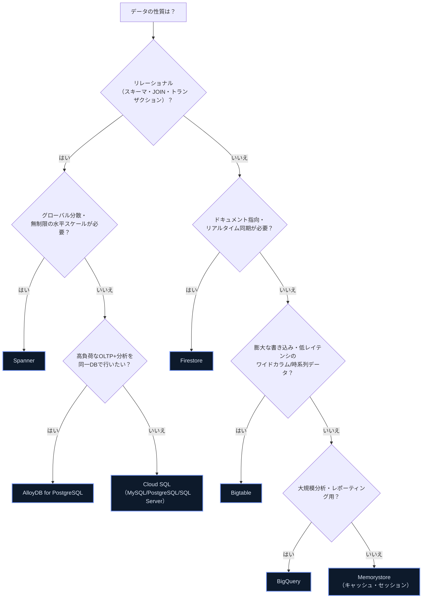

| データストア | データモデル | 主な用途 |
|---|---|---|
| AlloyDB for PostgreSQL | リレーショナル（PostgreSQL互換） | 高性能なOLTP、HTAP（トランザクション+分析） |
| Spanner | リレーショナル（グローバル分散） | 金融台帳、グローバル在庫、99.999%可用性が必要なミッションクリティカルOLTP |
| Cloud SQL | リレーショナル（MySQL/PostgreSQL/SQL Server） | 一般的な単一リージョンのOLTP、リフト&シフト移行 |
| Firestore | ドキュメント（NoSQL） | モバイル/Webアプリのバックエンド、リアルタイム同期 |
| Bigtable | ワイドカラム（NoSQL） | IoTテレメトリ、時系列データ、大規模低レイテンシ処理 |
| BigQuery | 列指向（analytics） | データウェアハウス、SQLベースの大規模分析・機械学習 |
| Memorystore | インメモリ（Valkey/Redis。Memcachedは非推奨） | キャッシュ、セッションストア |

> **出典**: [Google Cloud databases](https://cloud.google.com/products/databases)、[Databases on Google Cloud part 2 | Google Cloud Blog](https://cloud.google.com/blog/topics/developers-practitioners/databases-google-cloud-part-2-options-glance/)

#### 構造化・非構造化データベースのスキーマ設計

- **Spanner**: 単調増加するキー（タイムスタンプ等）を主キーの先頭に使うと、書き込みが単一サーバーに集中する「ホットスポット」が発生する。UUID（特にランダム性の高いv4）を主キーに使う、または関連行を同じ分割（split）に配置するインターリーブ設計を検討する。
- **Bigtable**: 行キー設計がクエリパフォーマンスを決定づける。関連データをまとめて読み書きできるようキー設計を工夫し、ホットスポットを避けるためタイムスタンプを先頭に使わない。
- **Firestore**: スキーマレスだが、クエリしやすくするため同種のドキュメントでは同じフィールド構成に揃える。深いネストクエリは避け、必要に応じてデータを非正規化する。複合クエリには複合インデックスが必要。

> **出典**: [Schema design best practices | Spanner](https://docs.cloud.google.com/spanner/docs/schema-design)、[Best practices for Cloud Firestore](https://firebase.google.com/docs/firestore/best-practices)

#### 結果整合性と強整合性

| データストア | 整合性モデル |
|---|---|
| Spanner | 外部整合性（External Consistency）— TrueTimeによるグローバルな強整合性、業界最高水準 |
| AlloyDB / Cloud SQL | 強整合性（単一プライマリ内）。リードレプリカは結果整合性 |
| Bigtable | シングルクラスタは強整合性、マルチクラスタ（レプリケーション時）は結果整合性がデフォルト |
| Cloud Storage | オブジェクトの作成・上書き・削除に対して強い一貫性（strong consistency）を提供 |

> **ベストプラクティス**: グローバルにレプリケーションされたシステムでリードレプリカを使う場合、読み取り直後の書き込み反映（read-your-writes）が必要な操作にはプライマリへの読み取りを強制する、あるいは強整合性を持つサービス（Spannerなど）へ設計を寄せる。

#### 署名付きURLの作成

Cloud Storageの署名付きURL（Signed URL）は、Googleアカウントを持たない第三者に対しても、有効期限付きで特定オブジェクトへのアクセス（GET/PUT等）を許可します。署名にはサービスアカウントの鍵を使いますが、**秘密鍵をエクスポートする必要はありません**。ADCで認証したうえでサービスアカウントの権限を借用（impersonate）し、IAMの `signBlob` で署名するキーレスな方法を優先します（前述のサービスアカウントキーを持たない方針と揃えます）。期限を過ぎるとURLは自動的に失効します。

> **ベストプラクティス**: 有効期限はユースケースに対して可能な限り短く設定する。アップロード先バケットにはObject Lifecycle Managementを設定し、未完了・不要なアップロードを自動削除する。より細かいアップロード条件（サイズ、Content-Type等）を強制したい場合はSigned Policy Documentを使う。
> **出典**: [Object Lifecycle Management | Cloud Storage](https://docs.cloud.google.com/storage/docs/lifecycle)

#### BigQueryへのデータ書き込み（分析・AI/MLワークロード向け）

| 方式 | 特徴 |
|---|---|
| バッチロード | 低コスト、レイテンシは分〜時間単位 |
| レガシーストリーミング（`tabledata.insertAll`） | 後方互換のため残存、新規プロジェクトには非推奨 |
| Storage Write API（推奨） | gRPCベース、低レイテンシ、exactly-once配信をサポート、レガシーより低コスト |

> **ベストプラクティス**: 新規のストリーミング取り込みにはStorage Write APIを使う。exactly-onceが必要な場合はコミット型ストリームとオフセットを使う。単なる運用分析でデータの一部欠損が許容できるなら、リトライ数回で諦めて後続処理（Pub/Subへの退避等）に回す設計にする。
> **出典**: [Stream data using the Storage Write API | BigQuery](https://docs.cloud.google.com/bigquery/docs/write-api-streaming)、[Introduction to the Storage Write API (gRPC)](https://docs.cloud.google.com/bigquery/docs/write-api-grpc)

---

## 2. セクション2: アプリケーションのビルドとテスト（約26%）

### 2.1 開発環境のセットアップ

#### ローカル開発とエミュレーション

`gcloud` CLIには多くのGoogle Cloudサービス（Pub/Sub、Firestore、Spanner、Bigtable等）のローカルエミュレータが同梱されており、実際のクラウドリソースを作成せずにローカルで単体テスト・統合テストが行えます。

| ツール | 役割 |
|---|---|
| Google Cloud コンソール | Webベースの管理・監視UI |
| Cloud SDK（`gcloud`/`gsutil`/`bq`） | コマンドラインからのリソース管理、エミュレータ起動 |
| Cloud Code | VS Code/JetBrains/Cloud Shell Editor向けのIDE拡張機能。Kubernetes/Cloud Runアプリのローカルデバッグ（Skaffold統合） |
| Gemini Cloud Assist / Gemini Code Assist | コード補完、チャットアシスタント、デプロイコマンドの提案などのAI支援 |
| Cloud Shell | ブラウザから使えるプリインストール済みのシェル環境 |
| Cloud Workstations | VPC内で動くフルマネージドの開発環境。ソースコードをローカル端末に置かないポリシーの実現や、本番同等のセキュリティ制御（VPC Service Controls等）を開発環境にも適用できる |

> **ベストプラクティス**: IDEにはCloud SDK連携とAIコーディングアシスタント（MCPサーバー経由の拡張含む）を設定し、コンテキストスイッチを減らす。エミュレータでの単体テストを開発フローに組み込み、実クラウドリソースへの依存を最小化してからCloud Buildでの統合テストに進む。
> **出典**: [gcloud | Google Cloud SDK](https://docs.cloud.google.com/sdk/gcloud/reference)、[Cloud Workstations](https://cloud.google.com/workstations)、[Cloud Code](https://cloud.google.com/code)、[Gemini Code Assist Standard and Enterprise overview](https://docs.cloud.google.com/gemini/docs/codeassist/overview)

---

### 2.2 ビルド

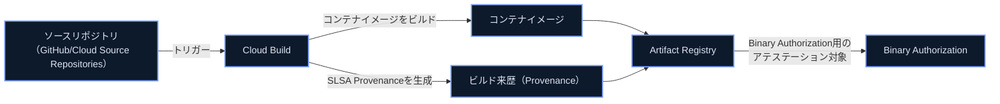

**Cloud Build と Artifact Registry**: ソースコードからコンテナイメージをビルドし、Artifact Registryに格納する一連の流れをCI基盤として構成します。ビルドステップは `cloudbuild.yaml` で定義します。

**Cloud Buildでのprovenance（来歴）設定**: `options.requestedVerifyOption: VERIFIED` を指定することで、Cloud BuildがSLSA準拠のビルド来歴メタデータを生成し、Artifact Registryのイメージに関連付けます。この来歴情報は「どのソースリポジトリの、どのコミットから、どのビルダーでビルドされたか」を検証可能にし、Binary AuthorizationのSLSAチェックで「Cloud Buildでビルドされたイメージのみデプロイを許可する」といったポリシーを強制する材料になります。

| SLSAレベル | 要件 |
|---|---|
| レベル1 | ビルド来歴が利用可能であること |
| レベル2 | 来歴データがビルドサービスにより生成され、改ざん検知（署名）が可能であること |
| レベル3 | ビルド定義のエントリポイントとユーザー制御下のパラメータも来歴に含まれること |

> **ベストプラクティス**: `requestedVerifyOption: VERIFIED` を全てのビルドで有効化し、Binary AuthorizationのSLSAチェックと組み合わせて「Cloud Build以外からのイメージ」を機械的に排除する。
> **出典**: [Generate and validate build provenance | Cloud Build](https://docs.cloud.google.com/build/docs/securing-builds/generate-validate-build-provenance)、[Safeguard builds | Software supply chain security](https://docs.cloud.google.com/software-supply-chain-security/docs/safeguard-builds)、[Use the SLSA check | Binary Authorization](https://docs.cloud.google.com/binary-authorization/docs/cv-slsa-check)、[Overview of Cloud Build](https://docs.cloud.google.com/build/docs/overview)

---

### 2.3 テスト

#### AIコーディングアシスタントによる単体テストの作成

Gemini Code Assist等のAIコーディングアシスタントは、既存コードからテストケースを自動生成し、エッジケースの網羅性を高める補助として使えます。ただし生成されたテストの妥当性（アサーションが実際に意図した振る舞いを検証しているか）は人間のレビューが必要です。

#### Cloud Buildでの自動化された統合テストの実行

`cloudbuild.yaml` にテストステップを追加し、単体テスト・統合テストをビルドパイプラインの一部として自動実行します。ローカルエミュレータ（Pub/Sub、Firestore等）をCloud Buildのステップ内で起動し、実クラウド環境を作らずに統合テストを完結させる構成が一般的です。

> **ベストプラクティス**: ビルドが失敗条件（テスト失敗）を正しく伝播するよう、各テストステップの終了コードを確認する。統合テストで実クラウドリソースを使う場合は、テスト専用プロジェクト・専用サービスアカウントを用意し本番環境から隔離する。

---

## 3. セクション3: デプロイのためのクラウドネイティブアプリケーション構成（約19%）

### 3.1 Cloud Runへのアプリケーションデプロイ

#### ソースコードからのデプロイ

`gcloud run deploy --source .` を使うと、Dockerfileの有無に関わらずCloud Native Buildpacksでソースコードから直接コンテナイメージがビルド・デプロイされます。裏側ではCloud Buildが呼び出されます。

#### トリガーによるCloud Runサービスの起動

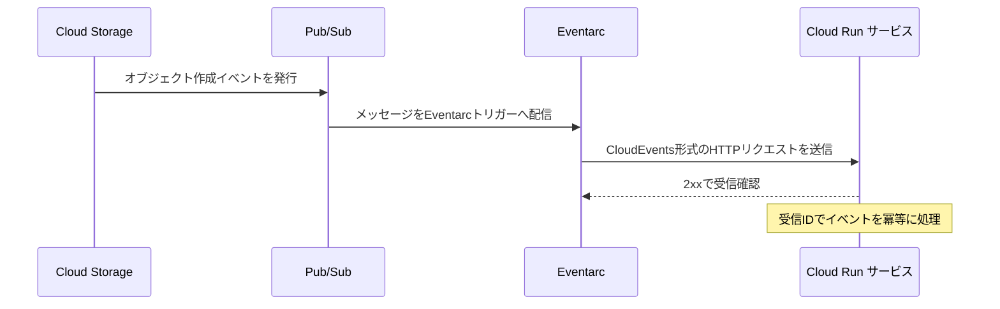

Eventarc・Pub/Subトリガーにより、ストレージイベント、Pub/Subメッセージ、Cloud Audit Logsなど多様なイベントソースからCloud Runサービスを起動できます。トリガーには呼び出し権限を持つサービスアカウントを関連付ける必要があります（`roles/run.invoker`）。

#### イベントレシーバの構成

Cloud RunサービスはEventarcからのリクエストを通常のHTTPリクエストとして受け取ります。CloudEvents形式のヘッダー・ボディをパースし、イベントタイプに応じた処理を行うハンドラを実装します。

#### APIのバージョニング・公開・保護（Apigee）

Cloud Run上でホストするAPIを外部公開する場合、Apigeeをフロントに配置してバージョニング（URLパスやヘッダーによる）、OAuth2/APIキーによる保護、レート制限、トラフィック変換を一元管理できます。

> **出典**: [Route Cloud Pub/Sub events to Cloud Run | Eventarc Standard](https://docs.cloud.google.com/eventarc/standard/docs/run/route-trigger-cloud-pubsub)、[Create triggers with Eventarc | Cloud Run](https://docs.cloud.google.com/run/docs/triggering/trigger-with-events)

---

### 3.2 GKEへのコンテナデプロイ

#### コンテナ化アプリケーションのデプロイ

Deployment・Service・Ingress（またはGateway API）のマニフェストを作成し、`kubectl apply` またはCloud Deployのようなマネージド継続的デリバリーサービスでGKEクラスタにデプロイします。

#### Kubernetesヘルスチェックの実装

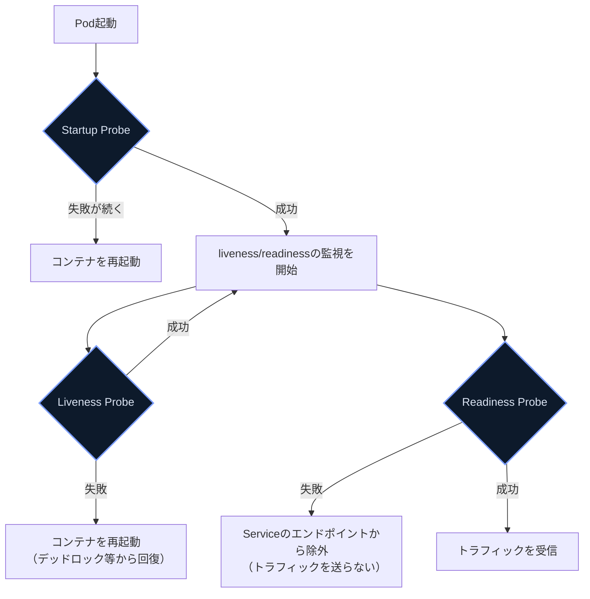

| プローブ | 目的 | 失敗時の挙動 |
|---|---|---|
| Startup Probe | 起動が遅いアプリの初期化完了を待つ | 成功するまでliveness/readinessを開始しない。失敗が続くとコンテナ再起動 |
| Liveness Probe | プロセスが生きている（デッドロックしていない）ことを確認 | コンテナを再起動 |
| Readiness Probe | トラフィックを受け付けられる状態か確認 | Serviceのロードバランシング対象から一時的に除外（再起動はしない） |

> **ベストプラクティス**: Livenessプローブは「本当に回復不能な障害」だけを検知するよう慎重に設定する。誤検知（過度に厳しいタイムアウト等）はカスケード障害を招く。起動に時間がかかるアプリにはStartup Probeを設定し、Liveness/Readinessの初期猶予時間を長く取りすぎないようにする。
> **出典**: [Liveness, Readiness, and Startup Probes | Kubernetes](https://kubernetes.io/docs/concepts/workloads/pods/probes/)、[Configure Liveness, Readiness and Startup Probes | Kubernetes](https://kubernetes.io/docs/tasks/configure-pod-container/configure-liveness-readiness-startup-probes/)

#### Horizontal Pod Autoscaler（HPA）属性の組み込み

HPAはCPU使用率・メモリ使用率・カスタムメトリクス（Cloud MonitoringやPub/Subのキュー長など）に基づいてPodのレプリカ数を自動的に増減します。

> **ベストプラクティス**:
>
> - リソースリクエスト・リミットを正しく設定してからHPAのターゲット使用率を決める。
> - スパイク時に対応できるようターゲット使用率にバッファを持たせる（ただしバッファを大きくしすぎるとコスト増）。
> - アプリの起動を高速化し、Readiness/Livenessプローブを適切に設定してスケールアップ・ダウンが正しく完了するようにする。
> - クライアント側にも一時的な過負荷に備えた指数リトライを実装するよう伝える。
> **出典**: [Best practices for running cost-optimized Kubernetes applications on GKE](https://docs.cloud.google.com/architecture/best-practices-for-running-cost-effective-kubernetes-applications-on-gke)

---

## 4. セクション4: Google Cloudサービスとのアプリケーション統合（約22%）

### 4.1 データ・ストレージサービスとの統合

| データストア | 主な接続方法 |
|---|---|
| Cloud SQL | Cloud SQL Auth Proxy（IAM認証・mTLS）、またはCloud SQL Connectorライブラリ |
| Firestore | クライアントライブラリ（gRPCベース）、Application Default Credentialsで認証 |
| Cloud Storage | クライアントライブラリまたはREST/XML API、署名付きURLで一時アクセスも可能 |

> **ベストプラクティス**: 本番環境ではCloud SQL Auth Proxy（またはそのGoライブラリ版であるCloud SQL Connector）を使い、パブリックIPの許可リスト管理やTLS証明書の手動更新を避ける。接続プーリングを適切に設定し、コネクション数の枯渇を防ぐ。
> **出典**: [About the Cloud SQL Auth Proxy | Cloud SQL for MySQL](https://docs.cloud.google.com/sql/docs/mysql/sql-proxy)

**メッセージングサービスを使ったpublish/consume**: Pub/Subのクライアントライブラリでトピックへのpublishとサブスクリプションからのconsumeを実装します。少なくとも1回配信が基本のため、コンシューマ側は冪等な処理を前提に設計します。

---

### 4.2 Google Cloud APIの利用

#### Google Cloudサービスの有効化

利用するAPIはプロジェクトで明示的に有効化する必要があります（`gcloud services enable` またはコンソール）。

#### サポートされるオプションでのAPI呼び出し

| 手段 | 特徴 |
|---|---|
| Cloud Client Libraries | 各言語向けの高レベルライブラリ。リトライ・ページネーション等が組み込み済み（推奨） |
| REST API | HTTP/JSONで直接呼び出し。言語非依存だが自前でリトライ等を実装する必要がある場合がある |
| gRPC | 低レイテンシ・ストリーミング対応。多くのクライアントライブラリの内部実装としても使われる |
| APIエクスプローラ | ブラウザ上でAPIを試験的に呼び出せるツール |

以下は呼び出し時に考慮すべき点です。

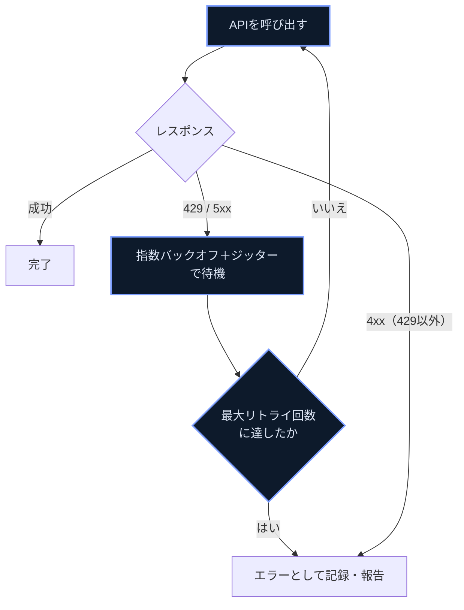

| 考慮事項 | 内容 |
|---|---|
| バッチ処理 | 複数の操作を1回のリクエストにまとめ、APIコール数とレイテンシを削減する |
| 返却データの制限 | フィールドマスク等で必要なフィールドのみ返却させ、帯域とパース時間を節約する |
| ページネーション | `list` 系メソッドの結果は必ずページングし、一度に大量データを取得しない（ショートポーリングも避ける） |
| キャッシュ | 変化が少ないデータはクライアント側でキャッシュし、APIコール自体を減らす |
| エラー処理（指数バックオフ） | 429・5xx系のエラーには、待機時間を指数的に増やしジッターを加えたリトライを実装する |

> **ベストプラクティス**: 常にリトライループの中で指数バックオフを使い、短いポーリングではなく長時間操作（Operation）の完了待機（wait）メソッドを使う。クライアントライブラリの組み込みリトライ設定（初期遅延・最大遅延・最大試行回数）をワークロードに合わせて調整する。
> **出典**: [Best practices for the Compute Engine API](https://docs.cloud.google.com/compute/docs/api/best-practices)、[Retry strategy | Cloud Storage](https://docs.cloud.google.com/storage/docs/retry-strategy)、[Exponential backoff | Memorystore for Redis](https://docs.cloud.google.com/memorystore/docs/redis/exponential-backoff)

#### サービスアカウントを使ったCloud API呼び出し

アプリケーションからGoogle Cloud APIを呼び出す際は、専用のサービスアカウントに必要最小限のIAMロールを付与し、Application Default Credentialsで自動的に認証情報を解決させます（GKEならWorkload Identity、Cloud Runなら実行サービスアカウント）。

---

### 4.3 トラブルシューティングとオブザーバビリティ

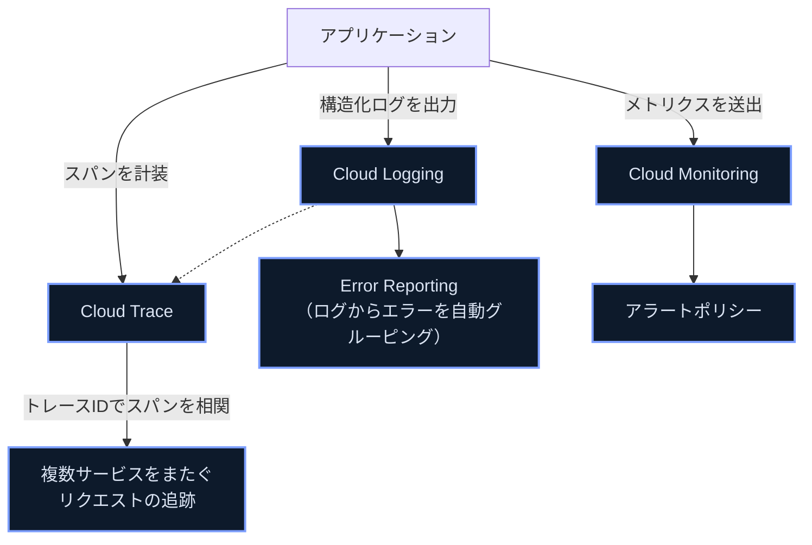

#### メトリクス・ログ・トレースによるコードのインストルメンテーション

Googleは、ベンダー固有のクライアントライブラリではなく、オープンソースでベンダーニュートラルな **OpenTelemetry** を使ったインストルメンテーションを推奨しています。ログはJSON形式で標準出力に書き出すと、Cloud Loggingが構造化ログとして自動的に取り込みます。

| シグナル | 役割 |
|---|---|
| メトリクス | リクエストレート・エラーレートなどSLIに使える数値測定値 |
| ログ | 障害・エラー・状態変化のタイムスタンプ付き記録 |
| トレース | 単一リクエストが複数サービスを通過する経路の可視化 |

#### 問題の特定と解決（Google Cloud Observability）

Cloud Monitoringのダッシュボード・SLO監視・アラートポリシーを使い、事後対応だけでなく問題発生前の予兆検知を目指します。

#### Error Reportingによるアプリケーション問題の管理

Error Reportingは Cloud Logging のログエントリを解析し、似たスタックトレースを持つエラーを自動的にグルーピングします。新規エラーの発生や既知エラーの再発をリアルタイムに検知できます。

#### トレースIDを使ったスパンの相関

マイクロサービス間をまたぐリクエストでは、共通のトレースIDをヘッダー（例: `traceparent`）で伝播させることで、Cloud Trace上で複数サービスにまたがる1つのリクエストの経路とレイテンシ内訳を可視化できます。

#### AI支援型オブザーバビリティ

Gemini Cloud Assistなどのアシスタント機能は、ログ・メトリクス・トレースの異常検知やインシデントの根本原因分析（RCA）候補の提示を支援します。人間のレビューを前提に、初動調査の時間短縮に活用します。

> **出典**: [Observability in Google Cloud](https://docs.cloud.google.com/stackdriver/docs)、[Instrumentation and observability](https://docs.cloud.google.com/stackdriver/docs/instrumentation/overview)、[Detect potential failures by using observability | Cloud Architecture Center](https://docs.cloud.google.com/architecture/framework/reliability/observability)

---

## 5. 学習チェックリスト

- [ ] Compute Engine・GKE・Cloud Runの選定基準を、コンテナ/VM要件・運用負荷の観点で説明できる
- [ ] Cloud Runのトラフィック分割でカナリアデプロイ・Blue-Greenデプロイ・ロールバックを実装できる
- [ ] REST APIとgRPC APIの使い分け、API GatewayとApigeeの使い分けを説明できる
- [ ] Eventarc・Pub/Sub・Workflows・Cloud Tasks・Cloud Schedulerの役割の違いを理解している
- [ ] Object Lifecycle Managementと保持ポリシーの違い・組み合わせ方を説明できる
- [ ] IAP・Web Security Scanner・Artifact Analysis・Security Command Centerそれぞれの役割を説明できる
- [ ] Secret Manager・Cloud KMS・Workload Identity Federationを使ったシークレット管理のベストプラクティスを説明できる
- [ ] ADC・JWT・OAuth2.0・Cloud SQL/AlloyDB Auth Proxy・Identity Platform・WIFの使い分けができる
- [ ] サービスアカウントの最小権限運用（専用アカウント、キー管理のベストプラクティス）を説明できる
- [ ] Direct VPC egress・Kubernetes Network Policies・Cloud Service Mesh・Private Service Connectの違いを理解している
- [ ] Binary Authorizationのアテステーション・SLSA・provenanceの流れを説明できる
- [ ] AlloyDB・Spanner・Cloud SQL・Firestore・Bigtable・BigQuery・Memorystoreの使い分けができる
- [ ] Spanner/Bigtable/Firestoreそれぞれのスキーマ設計上の注意点（ホットスポット回避等）を理解している
- [ ] 結果整合性と強整合性の違いを主要データストアごとに説明できる
- [ ] 署名付きURLの作成方法と有効期限設計を理解している
- [ ] BigQueryへのストリーミング書き込み（Storage Write API）の使い方を理解している
- [ ] gcloudエミュレータ・Cloud Code・Cloud Workstations・Gemini Code Assistの役割を説明できる
- [ ] Cloud BuildとArtifact Registryを使ったビルドパイプラインを構成できる
- [ ] Cloud Buildでprovenance（SLSA）を生成し、Binary Authorizationと連携できる
- [ ] Cloud Buildで自動化された統合テストを実行するパイプラインを構成できる
- [ ] Cloud Runへのソースからのデプロイ、Eventarc/Pub/Subトリガーの設定ができる
- [ ] Kubernetesのliveness/readiness/startupプローブを適切に設定できる
- [ ] HPAのベストプラクティス（リソースリクエストの正しい設定、バッファの確保等）を理解している
- [ ] Cloud SQL Auth Proxy等を使ったデータストアへの安全な接続を実装できる
- [ ] APIコール時のバッチ処理・フィールド制限・ページネーション・キャッシュ・指数バックオフを実装できる
- [ ] メトリクス・ログ・トレースの違いとOpenTelemetryによるインストルメンテーションを理解している
- [ ] Error Reportingとトレースの相関を使ったトラブルシューティングの流れを説明できる

---

## 6. 参考文献

### 公式試験情報

- [Professional Cloud Developer Certification exam guide (PDF)](https://services.google.com/fh/files/misc/professional_cloud_developer_exam_guide_english.pdf)
- [Professional Cloud Developer Certification | Google Cloud](https://cloud.google.com/learn/certification/cloud-developer)

### コンピューティングプラットフォーム

- [Where should I run my stuff? | Google Cloud Blog](https://cloud.google.com/blog/topics/developers-practitioners/where-should-i-run-my-stuff-choosing-google-cloud-compute-option)
- [Rollbacks, gradual rollouts, and traffic migration | Cloud Run](https://docs.cloud.google.com/run/docs/rollouts-rollbacks-traffic-migration)
- [Manage revisions | Cloud Run](https://docs.cloud.google.com/run/docs/managing/revisions)

### API設計・API管理

- [API Design Guide | Google Cloud](https://docs.cloud.google.com/apis/design)
- [gRPC vs REST | Google Cloud Blog](https://cloud.google.com/blog/products/api-management/understanding-grpc-openapi-and-rest-and-when-to-use-them)
- [About API Gateway | Google Cloud](https://docs.cloud.google.com/api-gateway/docs/concepts)

### イベント駆動・オーケストレーション

- [Create triggers with Eventarc | Cloud Run](https://docs.cloud.google.com/run/docs/triggering/trigger-with-events)
- [Create triggers from Pub/Sub events | Cloud Run](https://docs.cloud.google.com/run/docs/triggering/pubsub-triggers)
- [Route Cloud Pub/Sub events to Cloud Run | Eventarc Standard](https://docs.cloud.google.com/eventarc/standard/docs/run/route-trigger-cloud-pubsub)
- [Workflows overview](https://docs.cloud.google.com/workflows/docs/overview)
- [Understand Cloud Tasks](https://docs.cloud.google.com/tasks/docs/dual-overview)
- [Cloud Scheduler documentation](https://docs.cloud.google.com/scheduler/docs)

### セキュリティ

- [Object Lifecycle Management | Cloud Storage](https://docs.cloud.google.com/storage/docs/lifecycle)
- [Identity-Aware Proxy overview](https://docs.cloud.google.com/iap/docs/concepts-overview)
- [Vulnerability findings | Security Command Center](https://docs.cloud.google.com/security-command-center/docs/concepts-vulnerabilities-findings)
- [Secret Manager best practices](https://docs.cloud.google.com/secret-manager/docs/best-practices)
- [Best practices for using Workload Identity Federation](https://docs.cloud.google.com/iam/docs/best-practices-for-using-workload-identity-federation)
- [Best practices for using service accounts securely](https://docs.cloud.google.com/iam/docs/best-practices-service-accounts)
- [Best practices for managing service account keys](https://docs.cloud.google.com/iam/docs/best-practices-for-managing-service-account-keys)
- [Binary Authorization overview](https://docs.cloud.google.com/binary-authorization/docs/overview)
- [Binary Authorization concepts](https://docs.cloud.google.com/binary-authorization/docs/key-concepts)
- [Attestations overview | Binary Authorization](https://docs.cloud.google.com/binary-authorization/docs/attestations)

### ネットワーキング

- [Direct VPC egress with a VPC network | Cloud Run](https://docs.cloud.google.com/run/docs/configuring/vpc-direct-vpc)
- [Private networking and Cloud Run](https://docs.cloud.google.com/run/docs/securing/private-networking)
- [Private Service Connect | VPC](https://cloud.google.com/vpc/docs/private-service-connect)
- [Configure Cloud Service Mesh for Cloud Run](https://docs.cloud.google.com/service-mesh/docs/configure-cloud-service-mesh-for-cloud-run)

### データベース・ストレージ

- [Google Cloud databases](https://cloud.google.com/products/databases)
- [Databases on Google Cloud part 2 | Google Cloud Blog](https://cloud.google.com/blog/topics/developers-practitioners/databases-google-cloud-part-2-options-glance/)
- [Schema design best practices | Spanner](https://docs.cloud.google.com/spanner/docs/schema-design)
- [Best practices for Cloud Firestore](https://firebase.google.com/docs/firestore/best-practices)
- [About the Cloud SQL Auth Proxy | Cloud SQL for MySQL](https://docs.cloud.google.com/sql/docs/mysql/sql-proxy)
- [About the AlloyDB Auth Proxy](https://docs.cloud.google.com/alloydb/docs/auth-proxy/overview)
- [Stream data using the Storage Write API | BigQuery](https://docs.cloud.google.com/bigquery/docs/write-api-streaming)
- [Introduction to the Storage Write API (gRPC) | BigQuery](https://docs.cloud.google.com/bigquery/docs/write-api-grpc)

### 開発環境・ビルド・テスト

- [gcloud | Google Cloud SDK](https://docs.cloud.google.com/sdk/gcloud/reference)
- [Cloud Workstations](https://cloud.google.com/workstations)
- [Cloud Code](https://cloud.google.com/code)
- [Gemini Code Assist Standard and Enterprise overview](https://docs.cloud.google.com/gemini/docs/codeassist/overview)
- [Overview of Cloud Build](https://docs.cloud.google.com/build/docs/overview)
- [Generate and validate build provenance | Cloud Build](https://docs.cloud.google.com/build/docs/securing-builds/generate-validate-build-provenance)
- [Safeguard builds | Software supply chain security](https://docs.cloud.google.com/software-supply-chain-security/docs/safeguard-builds)
- [Use the SLSA check | Binary Authorization](https://docs.cloud.google.com/binary-authorization/docs/cv-slsa-check)

### デプロイ・GKE

- [Liveness, Readiness, and Startup Probes | Kubernetes](https://kubernetes.io/docs/concepts/workloads/pods/probes/)
- [Configure Liveness, Readiness and Startup Probes | Kubernetes](https://kubernetes.io/docs/tasks/configure-pod-container/configure-liveness-readiness-startup-probes/)
- [Best practices for running cost-optimized Kubernetes applications on GKE](https://docs.cloud.google.com/architecture/best-practices-for-running-cost-effective-kubernetes-applications-on-gke)

### API呼び出し・オブザーバビリティ

- [Best practices for the Compute Engine API](https://docs.cloud.google.com/compute/docs/api/best-practices)
- [Retry strategy | Cloud Storage](https://docs.cloud.google.com/storage/docs/retry-strategy)
- [Exponential backoff | Memorystore for Redis](https://docs.cloud.google.com/memorystore/docs/redis/exponential-backoff)
- [Observability in Google Cloud](https://docs.cloud.google.com/stackdriver/docs)
- [Instrumentation and observability](https://docs.cloud.google.com/stackdriver/docs/instrumentation/overview)
- [Detect potential failures by using observability | Cloud Architecture Center](https://docs.cloud.google.com/architecture/framework/reliability/observability)
