# Google Cloud Professional Cloud Developer 試験対策ガイド

## Section 1: 高可用性・セキュア・信頼性の高いクラウドネイティブアプリケーションの設計（配点 約32%）

> 本ガイドは、Google Cloud 公式の [Professional Cloud Developer 認定ページ](https://cloud.google.com/learn/certification/cloud-developer) および [公式 Exam Guide (PDF)](https://services.google.com/fh/files/misc/professional_cloud_developer_exam_guide_english.pdf) の **Section 1** に記載された出題項目に基づき、各トピックを初学者向けにステップバイステップで解説したものです。Section 1 は試験全体の約32%を占める最大の出題領域であり、「1.1 高性能なアプリケーションと API の設計」「1.2 セキュアなアプリケーションの設計」「1.3 データの保存とアクセス」の3つのサブセクションで構成されます。

---

## 目次

- [1.1 高性能なアプリケーションと API の設計](#11-高性能なアプリケーションと-api-の設計)
  - [1.1.1 コンピューティングプラットフォームの選定](#111-コンピューティングプラットフォームの選定compute-engine--gke--cloud-run)
  - [1.1.2 アプリケーションコンテナのビルド・改修・デプロイ](#112-アプリケーションコンテナのビルド改修デプロイcloud-run--gke)
  - [1.1.3 Google Cloud の地理的分散の理解](#113-google-cloud-の地理的分散の理解)
  - [1.1.4 ロードバランサーのユースケース](#114-ロードバランサーのユースケース)
  - [1.1.5 セッションアフィニティの有効化](#115-セッションアフィニティの有効化)
  - [1.1.6 キャッシュソリューションの実装（Memorystore）](#116-キャッシュソリューションの実装memorystore)
  - [1.1.7 API の作成とデプロイ（REST / gRPC）](#117-api-の作成とデプロイrest--grpc)
  - [1.1.8 レート制限・認証・オブザーバビリティ（Apigee / API Gateway）](#118-レート制限認証オブザーバビリティapigee--api-gateway)
  - [1.1.9 非同期・イベント駆動統合（Eventarc / Pub/Sub）](#119-非同期イベント駆動統合eventarc--pubsub)
  - [1.1.10 ワークロードのリソース要件定義](#1110-ワークロードのリソース要件定義)
  - [1.1.11 コストとリソース使用量の最適化](#1111-コストとリソース使用量の最適化)
  - [1.1.12 データレプリケーションとゾーン/リージョンフェイルオーバー](#1112-データレプリケーションとゾーンリージョンフェイルオーバー)
  - [1.1.13 トラフィック分割戦略](#1113-トラフィック分割戦略段階的ロールアウトロールバックabテスト)
  - [1.1.14 Workflows・Eventarc・Cloud Tasks・Cloud Scheduler によるオーケストレーション](#1114-workflowseventarccloud-taskscloud-scheduler-によるオーケストレーション)
- [1.2 セキュアなアプリケーションの設計](#12-セキュアなアプリケーションの設計)
  - [1.2.1 データ保持・整理ポリシーの実装](#121-データ保持整理ポリシーの実装)
  - [1.2.2 脆弱性を識別・保護するセキュリティ機構](#122-脆弱性を識別保護するセキュリティ機構iapweb-security-scanner)
  - [1.2.3 脆弱性への対応と解決](#123-脆弱性への対応と解決artifact-analysissecurity-command-center)
  - [1.2.4 シークレット・認証情報・暗号鍵の管理](#124-シークレット認証情報暗号鍵の管理)
  - [1.2.5 Google Cloud サービスへの認証](#125-google-cloud-サービスへの認証)
  - [1.2.6 サービスアカウントの IAM ロールによるリソース保護](#126-サービスアカウントの-iam-ロールによるリソース保護)
  - [1.2.7 セキュアなサービス間通信](#127-セキュアなサービス間通信)
  - [1.2.8 最小権限でのサービス実行](#128-最小権限でのサービス実行)
  - [1.2.9 Binary Authorization によるアプリケーションアーティファクトの保護](#129-binary-authorization-によるアプリケーションアーティファクトの保護)
- [1.3 データの保存とアクセス](#13-データの保存とアクセス)
  - [1.3.1 適切なストレージシステムの選択](#131-適切なストレージシステムの選択)
  - [1.3.2 構造化/非構造化データベースのスキーマ設計](#132-構造化非構造化データベースのスキーマ設計)
  - [1.3.3 レプリケーションの整合性モデルの理解](#133-レプリケーションの整合性モデルの理解)
  - [1.3.4 署名付き URL による Cloud Storage オブジェクトへのアクセス許可](#134-署名付き-url-による-cloud-storage-オブジェクトへのアクセス許可)
  - [1.3.5 分析・AI/ML ワークロード向け BigQuery へのデータ書き込み](#135-分析aiml-ワークロード向け-bigquery-へのデータ書き込み)
- [試験対策チェックリスト](#試験対策チェックリスト)
- [参考文献](#参考文献)

---

## 1.1 高性能なアプリケーションと API の設計

### 1.1.1 コンピューティングプラットフォームの選定（Compute Engine / GKE / Cloud Run）

Google Cloud には複数のコンピューティングサービスが存在し、PCD 試験では「ユースケースと要件に基づいて適切なプラットフォームを選択できるか」が問われます。初学者がまず押さえるべきは、**管理レベル（Google がどこまで面倒を見てくれるか）** と **ワークロードの性質（ステートレスかステートフルか、標準的な HTTP/gRPC かカスタムプロトコルか）** という2つの軸です。

Google Cloud のマネージド コンテナ ランタイムは、大きく「フルマネージド（Cloud Run / GKE Autopilot）」と「ユーザー管理を伴う（GKE Standard / Compute Engine）」に分類されます。フルマネージドのランタイムはノードやクラスタ管理を Google に委ねられる一方、GKE Standard や Compute Engine は柔軟性とカスタマイズ性が高い代わりに運用負荷が高くなります。GKE Standard は最大 65,000 ノードまでの単一クラスタスケーラビリティを持ちエンタープライズ向けに最適化されている一方、Cloud Run と GKE Autopilot は基盤となるコンピューティング インフラをユーザーが管理する必要のないオプションです。

- **Compute Engine（VM）**: OS レベルの完全な制御、永続的なローカル状態、コンテナ化できないレガシーアプリケーションが必要な場合に選択します。Windows ベースのアプリケーション、ゲノミクス処理、SAP HANA のような特定のライセンス・OS・カーネル・ネットワーキング要件を持つレガシーアプリケーションの移行に適しています。
- **GKE（Google Kubernetes Engine）**: StatefulSet・DaemonSet・CRD・サービスメッシュなど、Kubernetes 固有の機能やプラットフォームレベルのオーケストレーションが必要な場合に選択します。HTTP/S を超えたネットワークプロトコルや特定の OS が必要な場合にも GKE が適しています。
- **Cloud Run**: 新規のステートレス HTTP サービス、イベント駆動ワークロード、スケジュールジョブに対するデフォルトの選択肢です。Kubernetes の名前空間やノード割り当て・管理を必要としないステートレスなコンテナ化マイクロサービスに理想的なサーバーレスプラットフォームです。

以下の意思決定木は、試験で問われる代表的な判断基準を整理したものです。

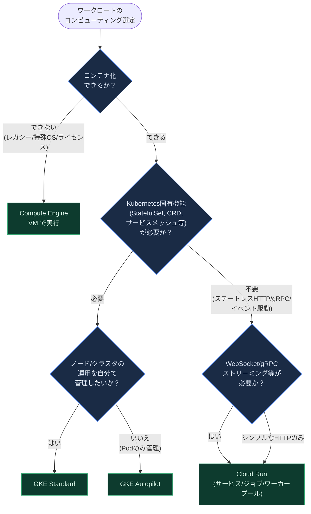

#### プラットフォーム比較表

| 観点 | Compute Engine | GKE (Standard/Autopilot) | Cloud Run |
|---|---|---|---|
| 管理レベル | ユーザーが VM・OS・ネットワークを管理 | Standard は Node、Autopilot は Pod 単位まで Google 管理 | フルマネージド（サーバーレス） |
| 適したワークロード | レガシー/特殊 OS/ライセンス依存アプリWindows-based applications, genomics processing, SAP HANA | ステートフル・マイクロサービス・複雑なオーケストレーション | ステートレス HTTP/gRPC/イベント駆動 |
| スケーリング | 手動 or マネージドインスタンスグループ | HPA / Cluster Autoscaler / Autopilot 自動スケール | リクエスト駆動でゼロまで自動スケール |
| 課金単位 | 秒単位（起動している間） | ノードまたは Pod リソース単位 | リクエスト処理時間・CPU/メモリ割当 |
| 代表的な出題観点 | いつ VM が正解になるか（コンテナ化不可なケース） | Kubernetes 機能要件の有無 | サーバーレスの既定選択肢としての位置づけ |

> **ベストプラクティス**: 新規サービスで判断に迷った場合は、まず Cloud Run を検討し、Kubernetes 固有の機能（カスタムスケジューリング、DaemonSet、サービスメッシュの高度な機能など）が明確に必要になった時点で GKE への移行を検討するのが実務上のセーフティネットです。Cloud Run のコンテナは変更を加えずに GKE へ移行できるため、初期選択のやり直しコストは低く抑えられます。

---

### 1.1.2 アプリケーションコンテナのビルド・改修・デプロイ（Cloud Run / GKE）

コンテナのビルドとデプロイは、ソースコードから直接デプロイする方法と、事前にビルドしたコンテナイメージをデプロイする方法の2系統があります。Cloud Run はソースコードから直接デプロイする機能をサポートしており、内部的に Cloud Build（Buildpacks）を使ってコンテナイメージを自動生成します。GKE では通常、CI パイプライン（Cloud Build や他の CI ツール）でビルドしたイメージを Artifact Registry に push し、Kubernetes マニフェストや Skaffold 経由でデプロイします。

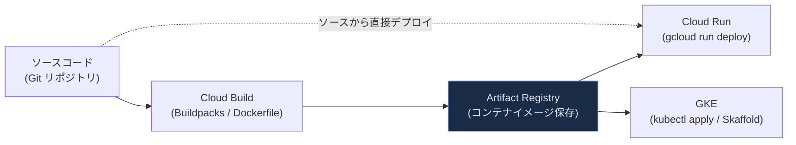

改修（リファクタリング）の観点では、モノリシックなアプリケーションをコンテナ化する際に、12-Factor App の原則（設定の外部化、ステートレス化、ログの標準出力化など）に沿って書き換えることが推奨されます。これにより Cloud Run のようなステートレス実行環境や GKE の Pod 再スケジューリングに耐えられる設計になります。

> **ベストプラクティス**: コンテナイメージは Artifact Registry で一元管理し、Cloud Build の構成ファイル（`cloudbuild.yaml`）でビルド〜プッシュ〜デプロイをパイプライン化します。同一イメージを Cloud Run と GKE の両方にデプロイできるようにしておくと、後述の 1.1.1 のプラットフォーム移行判断が容易になります。

---

### 1.1.3 Google Cloud の地理的分散の理解

Google Cloud のインフラは**リージョン**と**ゾーン**という論理的な単位に分かれています。リージョンは複数のゾーンから構成される独立した地理的エリアであり、ゾーンとリージョンは1つ以上の物理データセンターに存在する基盤物理リソースの論理的な抽象化です。Google Cloud は一般的なリージョンにおいて、物理的・論理的に異なる最低3つのアベイラビリティゾーンを提供することを意図しています。2026年8月時点でGoogle Cloud は43のリージョンと130のゾーンにわたってワークロードをデプロイでき、SLA に裏付けられたリージョンによってデータレジデンシーを損なうことなくグローバルにイノベーションを行えます。

リソースは以下のいずれかのスコープを持ちます。

| スコープ | 説明 | 代表例 |
|---|---|---|
| ゾーンリソース | 単一ゾーン内でのみ動作。そのゾーンの障害で影響を受けるゾーンリソースは単一ゾーン内で動作し、ゾーン障害はそのゾーン内のリソースの一部または全部に影響する | Compute Engine VM インスタンス |
| リージョンリソース | リージョン内の複数ゾーンにまたがって冗長化 | リージョン永続ディスク、リージョン MIG |
| マルチリージョン/グローバルリソース | Google によって複数リージョンにまたがって冗長化・分散管理される単一リージョンの損失後も機能できるよう設計されている | Spanner マルチリージョン構成、Cloud Storage マルチリージョンバケット |

レイテンシの観点では、ユーザーに地理的に近いリージョンにワークロードを配置することで、Google のグローバルネットワークを活用してエンドユーザーのレイテンシを削減できます。これらのサービスは可用性・パフォーマンス・リソース効率を最適化するため、レイテンシと整合性モデルの間でトレードオフが必要になる場合があり、これらのトレードオフはサービスごとに文書化されています。

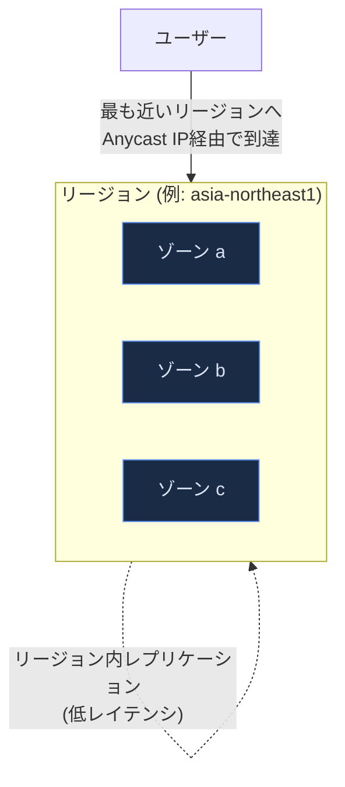

> **ベストプラクティス**: レイテンシ要件が厳しいアプリケーションでは、Performance Dashboard を使って主要ユーザー層とリージョン間の実測レイテンシを確認したうえでリージョンを選定します。Performance Dashboard はプロジェクトのリソースのレイテンシとパケットロスに関する可視性を提供し、都市から Google Cloud リージョンまでのレイテンシを把握するために利用できます。可用性要件が高い場合はゾーン冗長構成（リージョン MIG、リージョン永続ディスク）を、グローバル規模の可用性が必要な場合は Spanner のマルチリージョン構成のようなグローバルサービスを検討します。

---

### 1.1.4 ロードバランサーのユースケース

Cloud Load Balancing は、Maglev・Andromeda・Google Front Ends・Envoy といった、Google 自身のプロダクトを支えるのと同じ信頼性の高い高性能技術の上に構築されています。単一の Anycast IP アドレスがすべてのバックエンドインスタンスに対するフロントエンドとなり、クロスリージョンの自動マルチリージョンフェイルオーバーを含むクロスリージョン負荷分散を提供します。

PCD 試験では「どのロードバランサーをいつ使うか」という判断軸が重要です。代表的なユースケースとして、3層 Web サービスのアーキテクチャがあります。Web 層ではインターネットからのトラフィックが外部 Application Load Balancer で負荷分散され、アプリケーション層はリージョン内部 Application Load Balancer で、データベース層は内部パススルー Network Load Balancer でスケールされます。

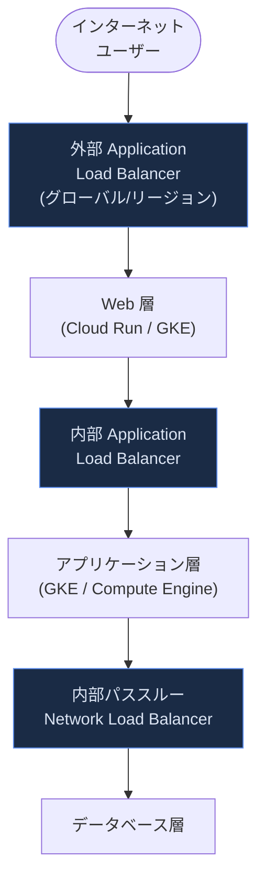

#### ロードバランサー種別と主なユースケース

| 種別 | レイヤー | 主なユースケース |
|---|---|---|
| 外部 Application Load Balancer | L7 (HTTP/S) | インターネット向け Web アプリ、URL マップによるパスベースルーティングHTTP/HTTPS トラフィックを Compute Engine・GKE・Cloud Storage などのバックエンドに分散するプロキシベースの L7 ロードバランサー |
| 内部 Application Load Balancer | L7 (HTTP/S) | VPC 内マイクロサービス間の HTTP ルーティング |
| 外部/内部パススルー Network Load Balancer | L4 | TCP/UDP の高性能・低レイテンシ転送、送信元 IP の保持が必要な場合 |
| Cloud Service Mesh (高度な負荷分散) | L7 | サービスメッシュ内での重み付けトラフィック管理、オーバーフロー処理オンプレミス計算リソースを表すハイブリッド接続 NEG を、Google Cloud にオーバーフローする前に完全に使用させるようなユースケース |

> **ベストプラクティス**: 静的コンテンツを配信する部分は Cloud CDN 対応のバックエンドサービスを使い、セッションアフィニティに依存しない設計にします静的コンテンツを多くのユーザーに配信している部分はセッションアフィニティの恩恵を受けにくいため、Cloud CDN 対応バックエンドサービスでキャッシュされたレスポンスを配信すべきです。1つの URL マップから複数のバックエンドサービスを参照できるため、部分ごとに異なるロードバランシング戦略を組み合わせられます。

---

### 1.1.5 セッションアフィニティの有効化

セッションアフィニティは、正常なバックエンドインスタンス/エンドポイントの数が一定である限り、特定のクライアントからのリクエストを同じバックエンドに送るベストエフォートの試みです。デフォルトでは、セッションアフィニティが NONE の場合でも実際にはハッシュが常に計算されており、5-タプルハッシュ（送信元 IP、送信元ポート、プロトコル、宛先 IP、宛先ポート）を使ってバックエンドが選択されます。

主なセッションアフィニティのタイプ：

| タイプ | ハッシュ対象 | 特徴 |
|---|---|---|
| NONE（デフォルト） | 5-タプル | 送信元IP・送信元ポート・プロトコル・宛先IP・宛先ポートの5-タプルハッシュを使用 |
| CLIENT_IP | 送信元・宛先 IP（2-タプル） | 同一クライアントIPからのすべてのリクエストを、バックエンドに空きがあり正常である限り同じバックエンドに転送 |
| HEADER_FIELD | HTTP ヘッダー値 | consistentHash 設定内で指定した HTTP ヘッダーの値に基づいてリクエストをバックエンドにルーティング |

セッションアフィニティは万能ではありません。バックエンドのヘルスチェック状態の変化、バックエンドの追加/削除、バックエンドウェイトの変更、balancing mode によって測定されるバックエンドの充足度の変化といった要因によってセッションアフィニティが破られる可能性があります。また、セッションアフィニティを使った負荷分散は、ユニークな接続数がバックエンド数の何倍もある、比較的大きな分散がある場合にうまく機能します。

> **ベストプラクティス**: セッションアフィニティは認証やセキュリティ目的で使用しないでください。ステートフルな処理が必要な場合でも、可能な限りアプリケーション自体をステートレス化し、セッション状態は Memorystore などの外部ストアに保持する設計の方が、水平スケーラビリティとフェイルオーバー耐性の面で優れています。セッションアフィニティはあくまで「パフォーマンス最適化のための最善努力」であり、正確性を担保する仕組みではないことを理解しておく必要があります。

---

### 1.1.6 キャッシュソリューションの実装（Memorystore）

Memorystore は、Valkey・Redis Cluster・Redis・Memcached という最も人気のあるオープンソースキャッシュエンジンから選択できるフルマネージドサービスです。ディスクベースのバックエンドストアからデータにアクセスする場合と比較して、頻繁にアクセスされるデータに対して低レイテンシアクセスと高スループットを提供します。

代表的なキャッシュパターンは以下の通りです。頻繁に実行されるクエリが即座にアプリに反映される必要のない結果セットを返す場合、その結果をキャッシュできます。後続のリクエストはまずキャッシュを確認し、結果が存在しないか古い場合にのみデータベースにクエリを実行します。

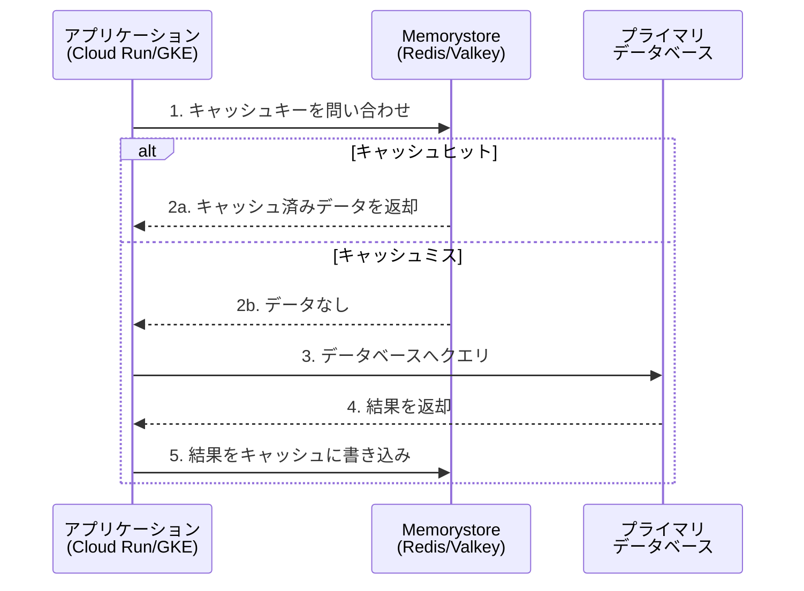

代表的なユースケース：Web コンテンツキャッシュ、セッションストア、分散ロック、ストリーム処理、レコメンデーション、キャパシティキャッシュ、ゲームのリーダーボード、不正・脅威検知、パーソナライゼーション、広告テクノロジーなど多岐にわたります。

> **ベストプラクティス**: Memorystore for Valkey / Redis Cluster ではゼロダウンタイムスケーリング、ゾーンをまたいで自動的に分散されるレプリカ、自動フェイルオーバーを備え、99.99% の SLA を提供します。VPC ネットワーク内のプライベート IP でのみアクセス可能にし、IAM 統合でアクセスを保護しますMemorystore は VPC ネットワークとプライベート IP を使ってインターネットから保護されており、データを保護する IAM 統合を備えています。キャッシュの TTL（有効期限）設計を誤ると、古いデータの配信（stale data）や、Cache Stampede（大量の同時キャッシュミス）につながるため、書き込み時キャッシュ無効化（write-through/write-invalidate）戦略も併せて検討します。

---

### 1.1.7 API の作成とデプロイ（REST / gRPC）

Cloud Run および GKE 上のアプリケーションは、REST（HTTP/JSON）と gRPC の両方をサポートします。REST API、GraphQL API、あるいは HTTP や gRPC を介して通信するプライベートマイクロサービスを構築できます。gRPC は Protocol Buffers を IDL として使用し、Google 社内で開発された高性能 RPC フレームワークで、Netflix・Cisco・Square などの企業で従来型ワークロードやエッジで広く使われています。

Cloud Run における gRPC のユースケース（繁体字ドキュメントより要約）としては、内部マイクロサービス間の高効率な通信、プロトコルバッファを利用した高データ量のやり取り（REST 呼び出しより高速）、フルクライアントライブラリを書かずに済むシンプルなサービス定義、ストリーミング gRPC によるレスポンシブなアプリケーション構築が挙げられます。Cloud Run は32 MB を超えるレスポンスの送信、サーバーストリーミング RPC を伴う gRPC サービスの実行、HTML5 の EventSource API で消費可能なサーバー送信イベント（SSE）への対応もサポートしています。

#### REST vs gRPC 比較表

| 観点 | REST (HTTP/JSON) | gRPC |
|---|---|---|
| ペイロード形式 | JSON（人間可読） | Protocol Buffers（バイナリ、高効率） |
| 通信方式 | リクエスト/レスポンス | 単項・サーバーストリーミング・クライアントストリーミング・双方向ストリーミング |
| 適したユースケース | 外部公開 API、ブラウザ直接呼び出し | 内部マイクロサービス間通信、高スループット要求 |
| Cloud Run 対応 | ネイティブサポート | HTTP/2 設定が必要ストリーミング gRPC を使用する場合、サービスを HTTP/2 を使用するよう設定する必要がある。HTTP/2 は gRPC ストリーミングの転送方法 |
| ブラウザからの直接利用 | 容易 | API Gateway 等でのトランスコーディングが必要API Gateway は特別なマッピングルールを指定することで、RESTful JSON over HTTP を gRPC リクエストに変換します |

> **ベストプラクティス**: 外部公開・パブリック API には REST（必要に応じて API Gateway で gRPC バックエンドを JSON にトランスコーディング）を、内部マイクロサービス間通信には gRPC を採用するハイブリッド構成が一般的です。gRPC サービスをブラウザから直接呼び出したい場合は API Gateway による HTTP/JSON ⇔ gRPC のトランスコーディングを活用します。

---

### 1.1.8 レート制限・認証・オブザーバビリティ（Apigee / API Gateway）

API 管理には Apigee と Cloud API Gateway の2つの選択肢があります。Apigee は50以上のポリシーからロバストなセットを構成でき、あらゆる API のふるまい・トラフィック・セキュリティ・QoS を制御できます。API Gateway は主にサーバーレスバックエンド（Cloud Run / Cloud Functions）向けの軽量な API 管理レイヤーです。

レート制限には主に2つのポリシーがあります。Quota ポリシーは、開発者アプリや開発者が特定期間内に行える API プロキシ呼び出し数を制限するために使用し、正確なカウントが求められる日・週・月単位のような長い時間間隔でのレート制限に最適です。一方 SpikeArrest ポリシーは、秒や分といった短い期間における全消費者に対する API 呼び出し数を制限するために使用します。

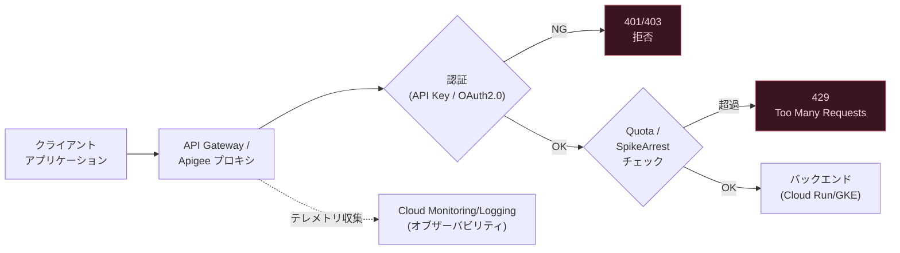

#### Apigee と API Gateway の使い分け

| 観点 | Cloud API Gateway | Apigee |
|---|---|---|
| 規模 | 軽量・サーバーレスバックエンド向け | エンタープライズ規模の API 管理 |
| ポリシー数 | 限定的 | 50 以上のポリシー、カスタムスクリプト対応 |
| 開発者ポータル | なし | 組み込みの開発者ポータルを公開可能 |
| AI ゲートウェイ機能 | なし | プロンプトインジェクション防御、LLM トークンクォータ、モデルルーティング、セマンティックキャッシュなどの AI ゲートウェイ機能 |
| 適したケース | Cloud Run/Functions 向けのシンプルな API 公開 | API 製品化、パートナーエコシステム、複雑なレート制限要件 |

> **ベストプラクティス**: LLM/生成 AI ワークロードを API 経由で公開する場合、Apigee のLLM トークンに基づくクォータ設定や、意味的に類似したクエリに対してキャッシュされたレスポンスを提供するセマンティックキャッシュを活用してコストとレイテンシを最適化します。単純な内部マイクロサービスの管理には軽量な API Gateway で十分なケースが多く、過剰な機能を持つ Apigee を導入するとオーバーヘッドになる点に注意してください。

---

### 1.1.9 非同期・イベント駆動統合（Eventarc / Pub/Sub）

同期的な API 呼び出しではなく、イベントをトリガーとしてサービス間を疎結合に連携させる設計は、クラウドネイティブアプリケーションの重要な柱です。イベント駆動アーキテクチャでは、イベントプロデューサーがイベントルーター（ブローカー）にイベントを送り、ルーターがサブスクリプション条件に基づいて適切なイベントコンシューマーへ配信します。これら3つのコンポーネント（プロデューサー・ルーター・コンシューマー）は互いに疎結合であり、独立してデプロイ・更新・スケールできます。

Eventarc は Standard と Advanced の2つのエディションを提供します。Standard は 130 以上の Google プロバイダーからのイベントをサポートし、Cloud Storage の更新や Pub/Sub トピックへのメッセージ送信のようなイベントを、ソースから直接、または Cloud Audit Logs のエントリを経由して受け取り、Pub/Sub をトランスポート層として使用します。Advanced は複数の Pub/Sub トピックや Kafka キューなど、より複雑なイベンティング要件を持つ組織向けに、中央バスへのイベント集約・変換・複数宛先へのルーティングを可能にします。

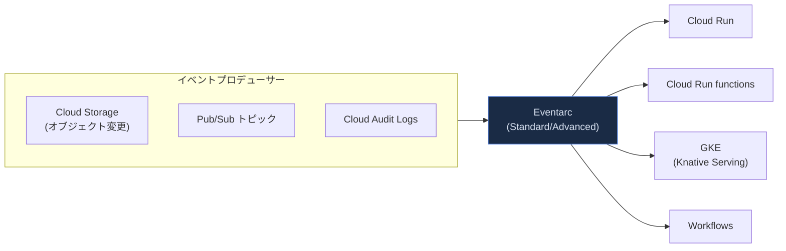

Pub/Sub は、メッセージ指向ミドルウェアとしてサービス間の非同期通信を実現し、パブリッシャーはイベントの処理方法やタイミングを気にせずトピックへイベントを送信します。Pub/Sub はレイテンシがおおよそ100ミリ秒オーダーの非同期通信のほか、ストリーミング分析やデータ統合パイプラインでのデータの取り込み・配信にも用いられます。

Eventarc は Cloud Events 形式でイベントを配信するため、言語ごとの Cloud Events SDK を使ってイベントを一貫した方法で読み取れます。Workflows を宛先とする場合、Workflows サービスがイベントを JSON オブジェクトに変換し、実行時引数としてワークフロー実行に渡します。

> **ベストプラクティス**: リージョンやプロジェクトをまたいだイベントルーティングも構成可能です。Pub/Sub はメッセージをグローバルにルーティングするため、あるリージョン/プロジェクトで発行されたメッセージは任意のリージョンのサブスクライバーから pull できます。クロスプロジェクトでルーティングする場合は、宛先プロジェクトに Pub/Sub トピックを作成し、そのトピックを Cloud Run サービスの Pub/Sub トリガーに接続します。イベントスキーマの互換性を保つため CloudEvents の標準フォーマットに準拠したペイロード設計を行うことで、コンシューマー側の実装ポータビリティが高まります。

---

### 1.1.10 ワークロードのリソース要件定義

Cloud Run のサービス・ジョブ・ワーカープールでは、CPU とメモリの構成が密接に連動しています。CPU を 1 vCPU 未満に設定する場合と、4 vCPU 以上を設定する場合とでは、必要な最小メモリ量の制約が異なります。例えば 4 CPU を設定する場合は最低 2Gi のメモリが要求されます。メモリの上限は 32 GiB（32 Gi）です。

単一スレッドのアプリケーションでは、メモリ要件によって複数 vCPU の構成を選ばざるを得ない場合、「vCPU ホットスポット」と呼ばれる非効率な CPU ベースのオートスケーリングが発生する可能性があります。そのため、メモリ要件が許す限り 1 vCPU から開始することが推奨されます。この場合、より良い CPU ベースのオートスケーリングが実現できます。高いメモリ要件のために複数 CPU の選択を余儀なくされる場合は、同時実行数（concurrency）設定のチューニングが重要になります。

GKE においては、Pod の `resources.requests` と `resources.limits` によって CPU/メモリを定義し、Kubernetes スケジューラがこれに基づいてノードへの配置を決定します。Autopilot ではコンピュートクラスを選択することで、特定のハードウェア要件（GPU、Scale-Out クラスなど）を持つワークロードを配置できます。

#### CPU/メモリ設定のガイドライン（Cloud Run）

| ワークロードの性質 | 推奨される初期設定 | 補足 |
|---|---|---|
| 単一スレッド・軽量な HTTP API | 1 vCPU から開始 | メモリ要件が許せば複数 CPU を避けることで CPU ベースのオートスケーリングが改善する |
| CPU 集約型・並列処理 | 実測に基づき段階的に増加 | CPU 使用率をモニタリングしながら調整する |
| 高メモリ・低 CPU（データ処理バッファ等） | メモリ要件から CPU 下限が自動的に決まる | 4 CPU 設定時は最低 2Gi のメモリが必要という制約に注意 |

> **ベストプラクティス**: 初期のベースライン CPU/メモリ構成を確立し、負荷テスト中の Cloud Monitoring の CPU 使用率メトリクスを観察しながら調整します。ピーク負荷時に CPU 使用率が一貫して低い場合は vCPU 割り当てを削減し、レイテンシが高い場合は vCPU 割り当てを増やします。過剰なリソースのプロビジョニングはコスト増加に直結するため、Cloud Hub の最適化ページでコストデータ・使用率データ・コスト最適化の推奨事項を定期的に確認することが推奨されます。

---

### 1.1.11 コストとリソース使用量の最適化

コスト最適化は、Cloud Run/GKE のリソース設定だけでなく、インスタンスのスケーリング上限設定にも関わります。最大インスタンス数の最適な値を決定するには、サービスの呼び出し時間、想定される平均呼び出し数、ピーク時の呼び出し頻度、呼び出し失敗に対する耐障害性といった要因を考慮する必要があります。

Compute Engine では、確約利用割引（Committed Use Discounts）、継続利用割引（Sustained Use Discounts）、Spot VM の活用がコスト最適化の主要な手段です。GKE では Cluster Autoscaler や Autopilot によるリソース最適化に加え、適切なコンピュートクラス選択によって過剰プロビジョニングを避けられます。

#### コスト最適化の主な手段（サービス別）

| サービス | 主な最適化手段 |
|---|---|
| Cloud Run | 適切な CPU/メモリ割当、最大インスタンス数の調整、CPU の「リクエスト処理中のみ割り当て」設定の活用 |
| GKE | Cluster Autoscaler、Autopilot のコンピュートクラス選択、Spot Pod の活用、ノードプールの適正化 |
| Compute Engine | 確約利用割引、継続利用割引、Spot VM、適切なマシンタイプ選定 |
| 全般 | Cloud Billing のレポート・予算アラート、Recommender による使用率ベースの推奨事項の適用 |

> **ベストプラクティス**: 「まず小さく始めて実測に基づきスケールアップする」アプローチを徹底します。過剰にプロビジョニングされたリソースはコストを増加させるだけでなく、パフォーマンス上のメリットがないケースも多いため、Cloud Monitoring のメトリクスに基づいた継続的なリソースサイジングの見直しをリリースサイクルに組み込むことが推奨されます。

---

### 1.1.12 データレプリケーションとゾーン/リージョンフェイルオーバー

ゾーン障害に耐えるためのデータレプリケーション戦略として、Compute Engine のリージョン永続ディスク（Regional Persistent Disk）や Hyperdisk Balanced High Availability があります。これらは同一リージョン内の2つのゾーンにデータを同期レプリケーションし、1つのゾーン障害までを許容する高可用性（HA）を実現します。低い RPO（目標復旧時点）と RTO（目標復旧時間）が求められるワークロード向けに設計されています。

ゾーン障害が発生した場合、正常なゾーンのレプリカへフェイルオーバーする処理が可能です。この際、障害が発生したゾーンからディスクを切り離す（detach）操作が完了できない場合は、フォースアタッチ（force-attach）と呼ばれる手順で、正常なゾーンのセカンダリレプリカを新しいコンピュートインスタンスに直接アタッチできます。

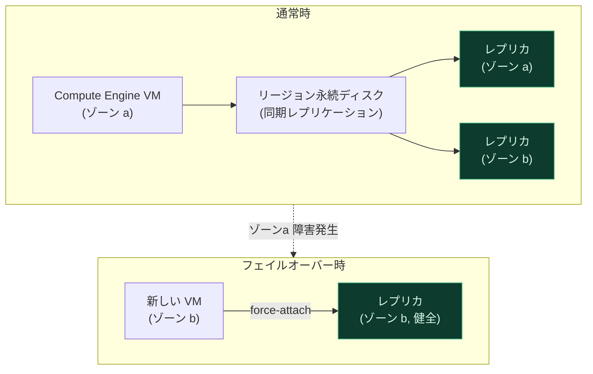

負荷分散層では、Cloud Load Balancing が自動マルチリージョンフェイルオーバーによってバックエンドが異常な場合にトラフィックをフェイルオーバーバックエンドへ移動させます。Cloud Run においても、複数リージョンにサービスをデプロイし readiness probe・トラフィック分割・最小インスタンス数を組み合わせることで、安全な段階的ロールアウトとリージョン単位のヘルスベースフェイルオーバーを実現できます。ある地域のインスタンスの 60% 以上が readiness probe に合格していればそのリージョンは健全と判断され、正常でなくなった場合はロードバランサーが自動的にトラフィックを健全なリージョンへ再ルーティングします。

> **ベストプラクティス**: 注意点として、リージョンディスクや Cloud Storage のレプリケーションだけでは障害・データ破損から保護するには不十分であり、アプリケーション・ファイルシステム、あるいはその他のソフトウェアコンポーネントがクラッシュコンシステント（整合性を保った状態でクラッシュから復旧できる）であるか、何らかの静止化（quiescing）処理を行う必要があります。ディスクレプリケーションはあくまでディスクの高可用性を提供するものであり、ゾーン障害は VM やその他のコンポーネントにも影響し得る点を理解しておく必要があります。

---

### 1.1.13 トラフィック分割戦略（段階的ロールアウト・ロールバック・A/Bテスト）

Cloud Run はリビジョン間でトラフィックを分割する機能をネイティブにサポートしています。特定のリビジョンが受け取るトラフィックの割合を指定でき、これにより以前のリビジョンへのロールバック、新しいリビジョンの段階的デプロイ（カナリアデプロイ）、複数リビジョン間でのトラフィック分割が可能になります。トラフィックのルーティング調整は瞬時には行われず、処理中のすべてのリクエストは完了まで継続されるため、進行中のリクエストがドロップされることはありません。

カナリアデプロイは、新バージョンのアプリケーションをアプリケーションのパフォーマンスをモニタリングしながら徐々にトラフィック比率を高めていく段階的なロールアウト手法です。これにより問題を早期に検出し、ユーザーへの影響を最小限に抑えられます。Cloud Deploy を使うと、カナリアデプロイを単一ステージまたは複数ステージで構成できます。

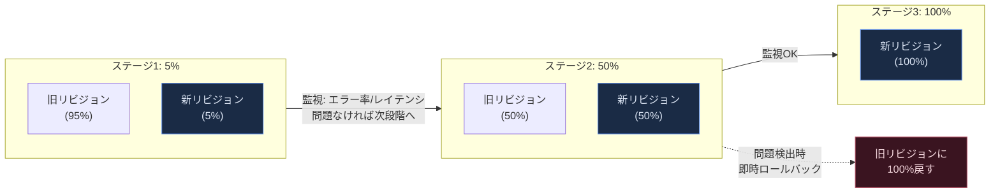

セッションアフィニティを有効にした状態でトラフィック分割を行う場合は、両者の相互作用に注意する必要があります。セッションアフィニティが有効な場合、既に特定のリビジョンに割り当てられたクライアントは、トラフィック分割比率の変更後もそのリビジョンに固定され続ける可能性があるためです。

> **ベストプラクティス**: リビジョンタグを活用すると、トラフィックを受け取らない状態のリビジョンをテストできます。GKE でのカナリアデプロイの場合、Cloud Deploy はトラフィックバランシング設定をユーザー側で全て指定するフルカスタムカナリアもサポートしています。A/B テストの実施時は、統計的に有意な判断ができるだけの十分なサンプルサイズ（トラフィック量）を各バリアントに割り当てることが重要です。

---

### 1.1.14 Workflows・Eventarc・Cloud Tasks・Cloud Scheduler によるオーケストレーション

複数サービスの連携パターンには、大きく分けて「オーケストレーション」と「コレオグラフィー」の2つのアプローチがあります。オーケストレーションでは、サービス同士が中央のオーケストレーターを介して相互作用し、このオーケストレーターがビジネスプロセス全体を俯瞰し実行状況の追跡やトラブルシューティングを可能にします。Google Cloud では Workflows がこのオーケストレーションの役割を担います。一方、コレオグラフィーでは Pub/Sub や Eventarc がイベント駆動サービス間の疎結合な連携に適しています。マイクロサービスの境界づけられたコンテキスト内ではオーケストレーションを、コンテキスト間ではコレオグラフィーを優先するのが一般的な指針です。

4つのサービスの役割分担は以下の通りです。

| サービス | 役割 |
|---|---|
| Workflows | サービス呼び出しの順序を明示的に定義し、長時間実行される操作の完了を待機できる中央オーケストレーター。コールバックにより外部イベントを数日〜数か月単位で待機可能 |
| Eventarc | Google Cloud サービス・カスタムアプリケーション・SaaS・サードパーティサービス間のイベントルーティング（コレオグラフィー） |
| Cloud Tasks | 個々のタスク（HTTP リクエストなど）をキューに追加し、非同期・分散的に処理を実行。ワーカーサービスへのディスパッチ制御、レート制限、リトライを提供 |
| Cloud Scheduler | 定義された時刻または一定間隔でのスケジュール実行（cron ジョブ）。Workflows のトリガーや Pub/Sub メッセージの生成に利用 |

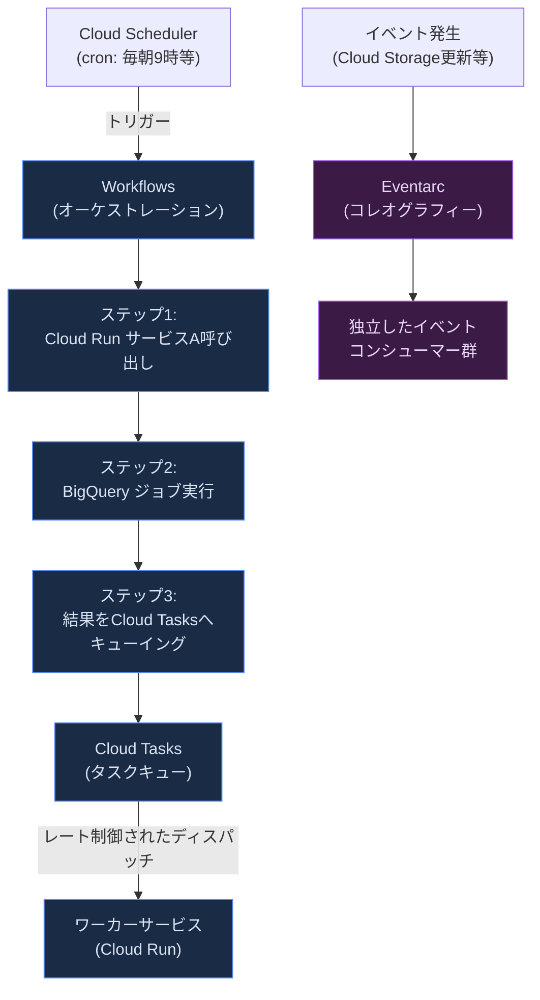

Cloud Tasks の典型的なユースケースとしては、予期しない障害からリクエストを保護すること、ユーザーに直接関係しないタスクを遅延させることでトラフィックスパイクを平滑化すること、データベース更新やバッチ処理のような遅い処理を別サービスに委譲することでユーザーの応答時間を改善すること、データベースやサードパーティ API といったバックエンドサービスへの呼び出しレートを制限することが挙げられます。

Cloud Scheduler のジョブは、ジョブがまだ実行中またはターゲットからのレスポンス待ちの場合、そのジョブの他のスケジュール実行はスキップされます。そのため、リクエストハンドラは冪等性を持たせ、同じジョブが複数回実行されても有害な副作用が生じないようにコードを設計する必要があります。

> **ベストプラクティス**: 「いつ Workflows の YAML/JSON ステップを使い、いつ独立したサービス（Cloud Run サービスや関数）を作るべきか」の判断基準は、Workflows がサービス呼び出し・レスポンスの解析・他の連携サービスへの入力構築を扱うのに対して、複雑なビジネスロジックや大量の計算処理は専用サービスに実装すべきという点です。Cloud Tasks を Workflows と組み合わせることで、Workflows の実行数制限を超える可能性のあるリクエストをバッファリングし、非同期にワークフロー実行をキューイングできます。

---

## 1.2 セキュアなアプリケーションの設計

### 1.2.1 データ保持・整理ポリシーの実装

Cloud Storage のオブジェクトライフサイクル管理（Object Lifecycle Management）は、オブジェクトの経過時間や世代などの条件に基づいて、ストレージクラスの自動変更やオブジェクトの自動削除を行う仕組みです。これによりコンプライアンス要件を満たしながらストレージコストを最適化できます。

保持ポリシー（Retention Policy）は、指定した期間が経過するまでオブジェクトの削除や上書きを禁止する仕組みで、規制対応や監査証跡の保全に利用されます。さらに保持ポリシーに「ロック」をかけることで、そのポリシー自体を緩和・削除できないようにし、WORM（Write Once Read Many）的な不変性を実現できます。これは金融・医療などの規制業界でよく求められる要件です。

#### データ保持設計の選択肢

| 要件 | 適した機能 |
|---|---|
| 一定期間経過後に自動的に安価なストレージクラスへ移行したい | Object Lifecycle Management（Nearline/Coldline/Archive への自動移行ルール） |
| 一定期間は削除・上書きを禁止したい | 保持ポリシー（Retention Policy） |
| 保持ポリシー自体の改変も禁止したい（規制対応） | 保持ポリシーのロック |
| 特定バージョンのみ保持したい | オブジェクトのバージョニング + ライフサイクルルール |

> **ベストプラクティス**: ライフサイクルルールと保持ポリシーは組み合わせて使用できます。例えば「作成から90日間は削除禁止（保持ポリシー）、365日経過後にArchiveクラスへ移行（ライフサイクルルール）」という設計が可能です。規制上重要なデータについては、誤操作や内部不正による削除を防ぐため、保持ポリシーのロックを本番運用前に必ず検討してください。ロックは取り消せない操作であるため、要件を十分に確認したうえで適用する必要があります。

---

### 1.2.2 脆弱性を識別・保護するセキュリティ機構（IAP・Web Security Scanner）

Identity-Aware Proxy（IAP）は、HTTPS でアクセスされるアプリケーションに対して中央集権的な認可レイヤーを確立し、ネットワークレベルのファイアウォールに頼るのではなくアプリケーションレベルのアクセス制御モデルを使えるようにする仕組みです。IAP のポリシーは組織全体にスケールし、中央でアクセスポリシーを定義してすべてのアプリケーション・リソースに適用できます。専任チームにポリシーの作成・適用を任せることで、個々のアプリケーションでの不適切なポリシー定義や実装のリスクからプロジェクトを保護できます。

IAP を有効にすると、自動的に OAuth 2.0 クライアント ID とシークレットが作成されます。ユーザーがリクエストを送ると、IAP がまず認証を行い、その後関連する IAM ポリシーを適用してユーザーが要求されたリソースへアクセスする権限を持つかを確認します。TCP フォワーディングを使えば、Google Cloud 上で動作する VM への SSH/RDP アクセスも IAP で保護できます。

Web Security Scanner は、App Engine・GKE・Compute Engine 上の Web アプリケーションにおけるセキュリティの脆弱性と設定ミスを識別するツールです。アプリケーションをクロールし、スコープ内のすべてのリンクをたどって脆弱性を検出します。マネージドスキャンは Security Command Center によって構成・管理され、認証なしで公開 Web エンドポイントを検出・スキャンするために毎週自動実行されます。マネージドスキャンは GET のみのリクエストを送信するため、稼働中の Web サイト上でフォームを送信することはありません。

注意点として、Web Security Scanner はアプリケーションの信頼性に悪影響を与える可能性があるため、本番環境での使用には適さない場合があります。より網羅的な情報を得るにはカスタムスキャンの利用が推奨されます。

> **ベストプラクティス**: IAP は VPN の代替として位置づけられ、開発者はアプリケーションロジックに集中でき、IAP が認証・認可を担います。ユーザー ID・デバイスのセキュリティ状態・IP アドレスといった属性に基づいた、きめ細かなアクセス制御ポリシーを管理者が作成・適用できます。Web Security Scanner のカスタムスキャンは、ステージング環境など本番に影響を与えない環境で先に実行し、検出された問題を修正してから本番環境のマネージドスキャンで継続的に監視する運用が安全です。

---

### 1.2.3 脆弱性への対応と解決（Artifact Analysis・Security Command Center）

Artifact Analysis は、Artifact Registry にプッシュされたコンテナイメージに対する脆弱性スキャンを提供します。自動スキャンは新しいイメージがプッシュされるたびに自動的にトリガーされ、新しい脆弱性が発見されるたびに継続的に脆弱性情報が更新されます。加えて、アプリケーション言語パッケージのスキャンにも対応しています。

Security Command Center は、Artifact Registry のスキャン結果を含む脆弱性の検出結果を集約し、実行中のワークロードにおけるコンテナイメージの脆弱性を、他のセキュリティリスクと並べてプロジェクト横断で可視化します。組織レベルで有効化すると、個々のプロジェクトチームを巻き込むことなく、組織内のプロジェクトに対する基本的な Web アプリケーション脆弱性検出を一元管理できます。検出結果が見つかった場合は、該当チームと連携してより包括的なカスタムスキャンを設定する運用フローが推奨されています。

Artifact Guard という機能では、脆弱性の種類に基づいて柔軟な例外オプションを持つ精密なルールを定義でき、ビルド時のポリシー適用（Artifact Registry や CI/CD パイプラインへの統合による安全でないイメージのデプロイ前ブロック）と、実行時の高度な適用（リアルタイムスキャンとセキュリティ態勢の全体像の把握）の両方を提供します。

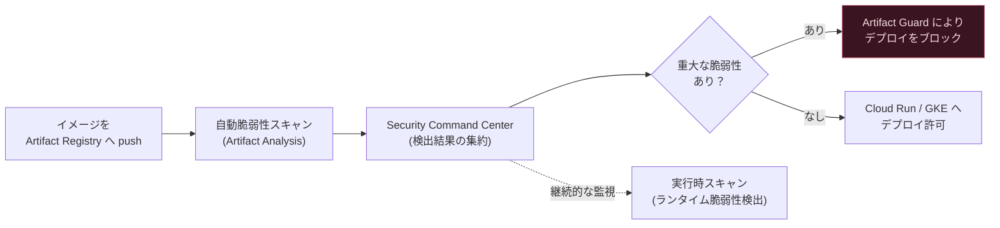

> **ベストプラクティス**: 脆弱性対応のライフサイクルは「ビルド時（CI/CD パイプラインへの脆弱性スキャン統合）」「デプロイ時（Binary Authorization との連携によるゲート）」「実行時（継続的なランタイムスキャン）」の3段階で捉えると設計しやすくなります。「コードからクラウドまで」の統合されたセキュリティグラフによって、ビルド時・アーティファクト分析・実行時スキャンからのデータを相関させ、脆弱性の発見から修正までのリードタイムを短縮できます。

---

### 1.2.4 シークレット・認証情報・暗号鍵の管理

アプリケーションが必要とする API キー・パスワード・証明書などの機密データは Secret Manager で一元管理します。Secret Manager は、Google 自身の暗号化データに使用しているのと同じ堅牢な鍵管理システムを使ってサーバーサイドの暗号鍵を管理し、厳格な鍵アクセス制御と監査を提供します。デフォルトでは AES-256 によってユーザーデータを保存時に暗号化します。

シークレットのバージョン管理により、ロールバックや緊急時のリカバリ、監査が可能になります。シークレットが誤って変更されたり侵害されたりした場合、以前の既知の状態のバージョンに戻すことでダウンタイムやセキュリティ侵害を最小化できます。より高いレベルの保護が必要な場合は、CMEK（顧客管理暗号鍵）を有効にし、Cloud KMS に保存した自分自身の暗号鍵で Secret Manager 内のシークレットを保護できます。Cloud KMS の鍵を使うことで、保護レベル・ロケーション・ローテーションスケジュール・使用状況とアクセス権限・暗号境界を制御でき、鍵の使用状況の追跡や監査ログの閲覧、鍵のライフサイクル制御も可能になります。

Workload Identity Federation（WIF）は、オンプレミスやマルチクラウドのワークロードに対して、サービスアカウントキーを使わずに連携された ID を用いて Google Cloud リソースへのアクセスを提供する仕組みです。サービスアカウントキーは強力な認証情報であり、適切に管理されない場合はセキュリティリスクとなり得ますが、WIF はサービスアカウントキーの管理・セキュリティ上の負担を排除します。WIF では、ワークロード ID プールで管理される連携された ID に対して IAM ロールを直接付与する方法（直接アクセス）と、サービスアカウントへのアクセスを許可しそのサービスアカウントを介してリソースにアクセスする方法（サービスアカウントのなりすまし）があります。

GKE では、Workload Identity Federation for GKE を使うことで、Kubernetes の Pod が Google Cloud サービスへ安全にアクセスできます。Secret Manager のアドオンを有効にすると、Secret Manager のシークレットを Kubernetes Pod にボリュームとしてマウントでき、Pod のワークロード ID を使って Secret Manager API への認証を行います。

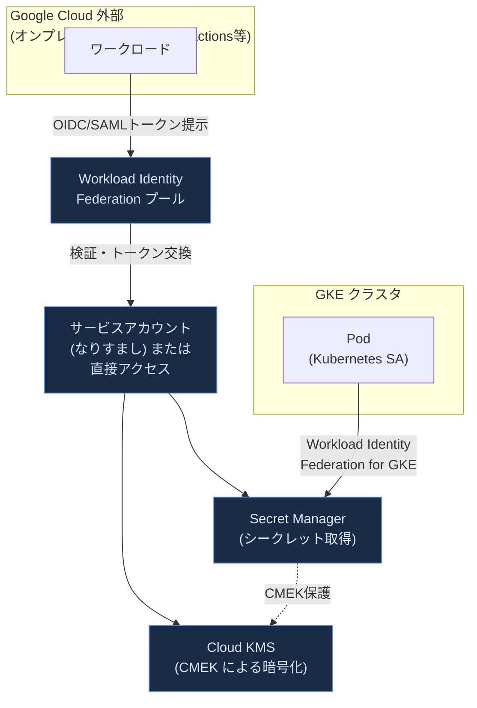

> **ベストプラクティス**: 最小権限の原則を適用するため、外部 ID がワークロード ID プールになりすませる範囲を制限し、サービスアカウントがアクセスできるリソースを制限します。過度に許可的な構成は、悪意ある第三者が外部 ID を使って権限昇格を行い、本来アクセスできないはずのリソースにアクセスするリスクにつながります。既存の ID プロバイダが発行したトークンを WIF 経由で Google 認証情報と交換する方式は、サービスアカウントキーを別のシークレットとして保存する方式に比べてシークレットの数を減らせるため、シークレットローテーションの簡素化とセキュリティ向上につながります。

---

### 1.2.5 Google Cloud サービスへの認証

アプリケーションが Google Cloud の API を呼び出す際の認証方式には複数の選択肢があり、実行環境と用途に応じて使い分けます。

**Application Default Credentials（ADC）** は、認証ライブラリがアプリケーションの実行環境に基づいて自動的に認証情報を見つけるための戦略です。認証ライブラリはこれらの認証情報を Cloud クライアントライブラリで利用可能にします。ADC が認証情報を探すロケーションの順序は、各ロケーションの相対的な価値とは関係がありません。ローカル開発では `gcloud auth application-default login` コマンドで、Compute Engine/GKE/Cloud Run 上ではその環境にアタッチされたサービスアカウントの認証情報が自動的に使われます。

**JWT（JSON Web Token）** は署名付きトークンとして、サービスアカウントの秘密鍵を使って自己署名し、Google のトークンエンドポイントと交換することなく直接 API 呼び出しに使用できる場合があります。

**OAuth 2.0** は、ユーザーの代理でアプリケーションがリソースにアクセスするための業界標準的な認可フレームワークで、スコープによってアクセス範囲を限定できます。グローバルスコープ（`https://www.googleapis.com/auth/cloud-platform`）と、サービスがサポートしていればより制限されたスコープを選択できます。制限されたスコープを使うことで、侵害されたトークンが懸念されるモバイルアプリなどの環境でリスクを低減できます。

**Cloud SQL Auth Proxy / AlloyDB Auth Proxy** は、データベースへの安全な暗号化接続を確立するコネクタです。IAM プリンシパルの認証情報と権限を使って接続を認可（IAM ベースの接続認可）し、プロキシを実行している IAM プリンシパルに基づいてデータベースユーザーを自動的に認証できます（自動 IAM 認証）。クライアントとインスタンス間で mTLS 1.3・256-bit AES 暗号を用いたセキュアな暗号化通信を自動的に確立・維持します。本番環境では永続的なサービスとして（systemd などで）実行し、プロキシプロセスが停止しても自動的に再起動されるようにすることが推奨されています。

**Identity Platform** は、顧客向けアプリケーション（CIAM: Customer Identity and Access Management）向けの認証サービスで、メール/パスワード認証、ソーシャルログイン、SAML/OIDC ベースのエンタープライズ ID 連携などをサポートします。

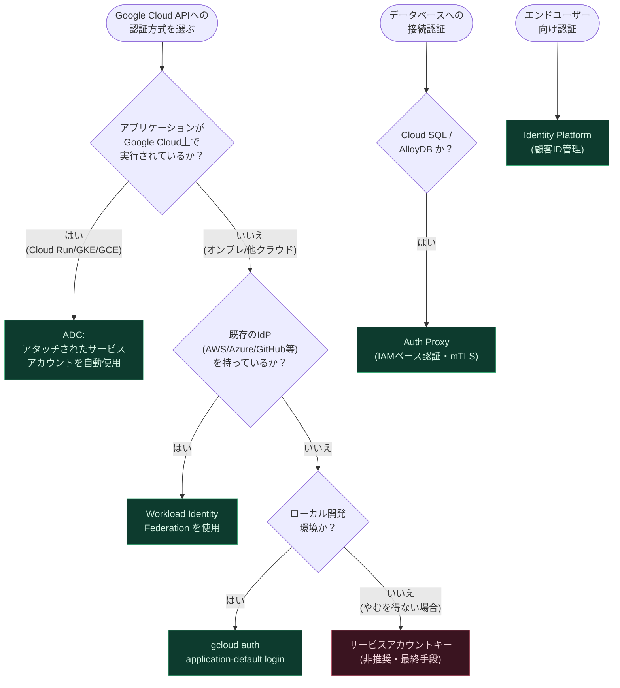

> **ベストプラクティス**: サービスアカウントキーの作成・利用は最終手段と位置づけ、Compute Engine/GKE/Cloud Run 上で稼働するワークロードには常にアタッチされたサービスアカウントによる ADC を、外部環境からのアクセスには Workload Identity Federation を優先します。データベース接続には Cloud SQL Auth Proxy / AlloyDB Auth Proxy、または各言語向けコネクタライブラリを使うことで、mTLS による暗号化と IAM ベースの認可を同時に得られます。

---

### 1.2.6 サービスアカウントの IAM ロールによるリソース保護

サービスアカウントはワークロードの ID であり、そのワークロードがアクセスできる Google Cloud リソースの範囲を IAM ロールによって制御します。多くの Google Cloud サービスは API を初めて有効化した際にデフォルトサービスアカウントを自動作成しますが、組織のポリシー設定によってはこれらに Editor ロール（プロジェクト内のすべてのリソースを読み書きできる強力なロール）が自動付与される場合があります。このロールは利便性のために付与されるものであり、サービスの動作に本質的に必要というわけではありません。

デフォルトサービスアカウントへの自動ロール付与に頼るべきではなく、ワークロードごとに専用のサービスアカウントを作成し、必要最小限の権限のみを付与することが推奨されます。VM インスタンスにサービスアカウントをアタッチする際にアクセススコープに依存すべきではなく、代わりに IAM ロールによるきめ細かい制御を用います。ドメイン全体の委任（Domain-wide Delegation）は強力な権限であるため、使用は避けるべきとされています。

一時的な権限昇格が必要な場合は IAM Credentials API を使い、アクセストークンをダウンスコープするには Credential Access Boundaries を利用します。未使用の権限を特定するにはロールの推奨事項（Role Recommendations）を、横方向の移動（lateral movement）のリスクを制限するには lateral movement insights を活用します。

サービスアカウントキーを使う場合の best practice として、キーをファイルシステムに保存することは避け、HSM や TPM でのキー保存、あるいはソフトウェアベースのキーストアの利用が推奨されます。サービスアカウントキー作成をキーの作成・アップロードが許可されているプロジェクトでは Editor ロールを使わないこと、ドメイン全体の委任にサービスアカウントキーを使わないことも重要な指針です。

#### IAM 最小権限のための実践チェックリスト

| 項目 | 内容 |
|---|---|
| デフォルトサービスアカウントの権限 | 自動ロール付与に頼らず、必要な権限のみを明示的に付与する |
| サービスアカウントの粒度 | ワークロードごとに専用のサービスアカウントを作成する |
| アクセススコープ | VM アタッチ時のアクセススコープに依存せず IAM ロールで制御する |
| 一時的権限昇格 | IAM Credentials API を使用する |
| トークンのダウンスコープ | Credential Access Boundaries を使用する |
| 未使用権限の可視化 | IAM Recommender のロール推奨事項を定期的に確認する |
| ドメイン全体の委任 | 可能な限り避ける |

> **ベストプラクティス**: Google の社内調査では、管理者によって付与された権限の大半が90日間の観測期間内で実際には使用されていないことが分かっています。最小権限を実現するための第一歩は、ユーザーが現在持っている権限と直近で実際に使用された権限を把握することです。IAM Recommender はこの分析を自動化し、安全でコンテキストに応じた実行可能な変更提案を継続的に行います。定期的な棚卸しをリリースサイクルやセキュリティレビューに組み込むことが重要です。

---

### 1.2.7 セキュアなサービス間通信

マイクロサービス間の通信をセキュアにする手段は、レイヤーとスコープによって複数存在し、それぞれ組み合わせて多層防御（defense in depth）を実現します。

**VPC ファイアウォールルール** は L4（トランスポート層）の制御をノード/VM の送受信トラフィックに適用します。サービスアカウントやネットワークタグに基づいて VM にファイアウォールルールを適用できます。

**Kubernetes Network Policies** は、GKE クラスタ内で Pod レベルのファイアウォールルールを作成し、どの Pod・Service が相互に通信できるかを制御します。デフォルトでは、クラスタ内のすべての Pod は自由に通信できるため、ネットワークポリシーによる制御は、多層防御を実現するための重要な機能です。ネットワークポリシーは名前空間にスコープされ、名前空間内の特定の Pod にさらに細かくスコープすることもできます。

**Cloud Service Mesh** は、L7（アプリケーション層）でのトラフィック管理とセキュリティを提供し、mTLS によるサービス間の暗号化・相互認証、認可ポリシーによるきめ細かなアクセス制御を実現します。Egress Gateway パターンでは、メッシュ内の Pod からの外部への通信を専用の Egress Gateway プロキシ経由に強制することで、ワークロードが直接外部ホストに到達することを防ぎます。

**Direct VPC egress** は、Cloud Run・App Engine スタンダード・Cloud Run functions の環境から VPC ネットワーク内の内部 IPv4 アドレスへパケットを送信できるようにする仕組みです。Serverless VPC Access コネクタを使わずに VPC ネットワークへトラフィックを送信でき、セットアップの簡素化・ネットワークタグを使ったよりきめ細かなネットワークセキュリティ・低いレイテンシと高いスループットといった利点があります。

**Private Service Connect / プライベートサービス接続性** は、VPC Service Controls の境界を越えずに Google のマネージドサービスやパートナーサービスへプライベートにアクセスするための仕組みで、公開インターネットを経由しないサービス間通信を実現します。

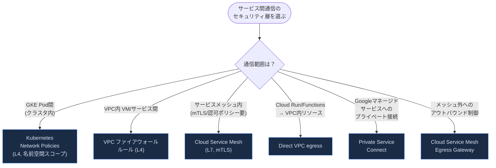

#### セキュアな通信手段の比較

| 手段 | レイヤー | スコープ | 主な用途 |
|---|---|---|---|
| VPC ファイアウォールルール | L4 | VPCネットワーク全体/サービスアカウント/タグ単位 | ノード間の粗い粒度のトラフィック制御 |
| Kubernetes Network Policies | L4 | 名前空間/Pod単位 | GKE クラスタ内 Pod 間通信の制御 |
| Cloud Service Mesh (mTLS) | L7 | メッシュ内サービス | サービス間の暗号化・相互認証・認可ポリシー |
| Direct VPC egress | L3/L4 | Cloud Run/Functions → VPC | サーバーレスから VPC 内リソースへの低レイテンシアクセス |
| Private Service Connect | L3 | プロジェクト/VPC間 | インターネットを経由しないマネージドサービスへのプライベート接続 |

> **ベストプラクティス**: 単一のレイヤーに依存せず、VPC ファイアウォール・Kubernetes Network Policies・Cloud Service Mesh の認可ポリシーを組み合わせた多層防御を構築します。異なるサービスアカウントを持つ GKE ノードプールを使い分けることで、ノードプールごとに異なるファイアウォールルールを適用できます。ネットワーク管理者は Egress Gateway のデプロイと外部ホストへのルーティング構成を専用の名前空間で管理し、ワークロードが直接外部ホストに到達できないよう VPC ファイアウォールルールと組み合わせることが推奨されます。

---

### 1.2.8 最小権限でのサービス実行

最小権限の原則（Principle of Least Privilege）は、ユーザーやアプリケーションが本来行うべき以上のことをできないように制限する一連のチェック項目として整理されます。この原則は 1.2.6 で述べたサービスアカウントの権限設計だけでなく、実行環境全体に適用されるべき横断的な設計指針です。

具体的な適用例として、Cloud Functions（Cloud Run functions）のケースでは、関数ごとに一意のサービスアカウントを作成・バインドし、その関数の実行に必要な最小限の権限セットのみを付与することが推奨されます。事前定義済みロールがしばしば必要以上の権限を含んでしまう場合は、正確に必要な権限のみを含むカスタムロールを作成して対応します。

Terraform などの IaC（Infrastructure as Code）ツールを実行する際も、最小権限の原則を適用すべきです。ユーザーのアクセス権限を Terraform コードに応じて直接制限する代わりに、サービスアカウントのなりすまし（impersonation）を使って Terraform コードを実行する方法があります。これにより管理者はサービスアカウントキーを発行する必要がなくなり、権限は IAM を通じて Service Account Token Creator ロールを介して管理されるため、サービスアカウントキーの管理・ローテーション・作成・削除のプロセスを実装する必要がなくなります。

Privileged Access Manager（PAM）を使うことで、必要な時にだけ・必要な範囲だけの一時的な権限昇格（Just-In-Time アクセス）を IAM の条件付きロールバインディングとして付与できます。これにより、常時高い権限を持つアカウントを維持するリスクを避けられます。

> **ベストプラクティス**: 最小権限の実装は「一度設定して終わり」ではなく継続的なプロセスとして扱います。IAM Recommender を定期的にレビューし、未使用の権限を段階的に削減していく運用サイクルを確立することが、実務上もっとも効果的な最小権限戦略です。特に `iam.serviceAccounts.actAs` 権限をプロジェクトやサービスアカウントに付与するロールバインディングは、横方向の移動（lateral movement）による脅威につながりやすいため、優先的にレビューする対象として位置づけられています。

---

### 1.2.9 Binary Authorization によるアプリケーションアーティファクトの保護

Binary Authorization は、デプロイ時の制約をアプリケーションに強制する Google Cloud のサービスです。GKE との統合により、Kubernetes クラスタにデプロイされるコンテナが信頼された機関によって暗号署名され、Binary Authorization のアテスター（attestor）によって検証されたものだけであることを強制できます。GKE だけでなく Cloud Run・Google Distributed Cloud・Cloud Service Mesh でもサポートされています。

**アテステーション（attestation）** は、特定のイメージが以前のステージ（ビルド・テスト・QA レビューなど）を完了したことを証明するデジタル文書です。デプロイ時に、以前のステージで完了した活動を繰り返す代わりに、Binary Authorization はアテスターを使ってアテステーションを検証します。すべてのアテステーションが検証されれば、イメージのデプロイが許可されます。

アテステーションの主なユースケースとして、ビルド検証（Binary Authorization がアテステーションを使って、イメージが特定のビルドシステムや CI パイプラインによってビルドされたことを検証する）と、手動チェック（QA 担当者のような人間がアテステーションを手動で作成する）が挙げられます。Cloud Build ユーザーは、built-by-cloud-build アテスターを使うことで、Cloud Build によってビルドされたイメージのみをデプロイするよう設定できます。

Binary Authorization は**ポリシーモデル**を実装しており、ポリシーとはコンテナイメージのデプロイを管理する一連のルールです。ポリシー内のルールは、イメージがデプロイされる前に満たすべき具体的な基準を提供します。ポリシーごとにデフォルトルールがあり、これは特定のルールにマッチしないすべてのデプロイリクエストに適用されます。加えて、特定のクラスタ・サービスアカウント・ID にデプロイされるイメージに適用される特定のルールを1つ以上追加できます。

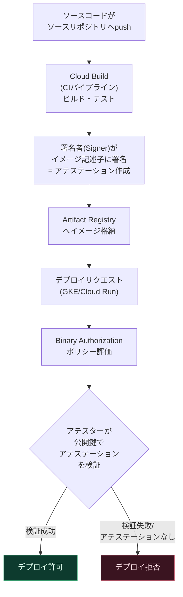

Continuous Validation（CV）は、実行中の Pod がポリシーに準拠しているかを継続的に監視する機能です。Binary Authorization の強制（enforcement）と CV の監視（monitoring）を両方使いたい場合は、強制用のプロジェクト単一ポリシーとアテスターを構成し、監視用のプラットフォームポリシーを同じノートと公開鍵に基づいたシンプルシグニング アテステーションチェックとともに作成することが推奨されています。

> **ベストプラクティス**: マルチプロジェクト構成では、ポリシーを構成する「デプロイヤープロジェクト」と、アテスターを保管する「アテスタープロジェクト」を分離することで、職務分離（Separation of Duties）を実現できます。PKIX 鍵ペアは Cloud KMS で PKIX 互換形式で生成することで、鍵管理を Cloud KMS に一元化できます。CI/CD パイプラインの中に、脆弱性スキャン（Artifact Analysis / Security Command Center）の結果をゲート条件としてアテステーション作成に組み込むことで、「重大な脆弱性が検出されなかったイメージのみが署名され、デプロイ可能になる」という自動化されたセキュリティゲートを構築できます。

---

## 1.3 データの保存とアクセス

### 1.3.1 適切なストレージシステムの選択

Google Cloud には100を超えるサービス・ツールが存在し、その多くがストレージとデータベースに特化しています。適切なストレージを選ぶには、データ量・パフォーマンス要件・スキーマの柔軟性・整合性要件・アクセスパターンといった複数の軸で検討する必要があります。

クラウドアーキテクトがワークロードのストレージ計画を立てる際には、まずワークロードの機能的特性・セキュリティ制約・レジリエンス要件・パフォーマンス期待値・コスト目標を検討し、次に利用可能な Google Cloud のストレージサービスと機能をレビューし、最後に要件と選択肢に基づいて必要なストレージサービスと機能を選定するという順序が推奨されています。

判断軸を整理すると次のようになります。

- **固定スキーマが必要か、柔軟なスキーマが必要か**: リレーショナル（固定スキーマ）か NoSQL（柔軟/スキーマレス）かの選択に直結します。
- **どの程度のトランザクション特性（原子性・一貫性）が必要か**: 強整合性が必須なら Spanner や Cloud SQL/AlloyDB のようなリレーショナルデータベース、行内一貫性で十分なら Bigtable のような NoSQL データベースが候補になります。
- **求めるレイテンシはどの程度か**: サブミリ秒が必要ならインメモリの Memorystore、ミリ秒単位なら Bigtable/Firestore、ある程度の許容があれば Cloud SQL/AlloyDB/Spanner。
- **想定されるトランザクション量**: 数百〜数千 TPS ならリレーショナルデータベース、数百万 TPS 規模ならBigtable のような水平スケール型 NoSQL データベース。
- **保存されるデータ量**: MB〜GB 規模、TB 規模、PB 規模でそれぞれ適したサービスが異なります（例えば分析ワークロードで PB 規模になる場合は BigQuery が候補になります）。

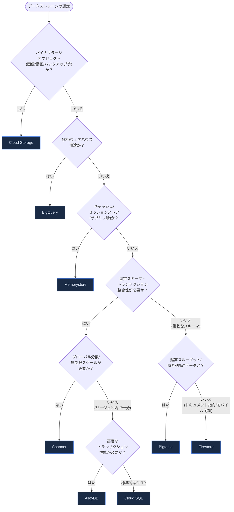

#### データベース種別ごとの位置づけ

| データベース | 分類 | 特徴 |
|---|---|---|
| Cloud SQL | リレーショナル (OLTP) | フルマネージド MySQL/PostgreSQL/SQL Server 互換 |
| AlloyDB | リレーショナル (OLTP) | PostgreSQL 互換、トランザクション処理向けに高速化、最大20の自動スケーリング読み取りレプリカプール |
| Spanner | リレーショナル+NoSQLのハイブリッド | グローバル分散・強整合性・99.999% 可用性 SLA |
| Bigtable | NoSQL (ワイドカラム) | 超大規模・低レイテンシ・高スループットの NoSQL、SQL 非対応 |
| Firestore | NoSQL (ドキュメント指向) | リアルタイム同期・オフラインアクセス・柔軟なクエリ |
| Memorystore | インメモリ (Redis/Valkey/Memcached) | サブミリ秒のキャッシュ・セッションストア |
| BigQuery | データウェアハウス | サーバーレスの分析エンジン、エクサバイト規模のデータをハンドリング可能 |

> **ベストプラクティス**: 判断に迷った際は、まず「読み取りと書き込みのどちらが支配的か」「トランザクションの整合性要件はどの程度厳格か」「将来的な地理的分散の必要性」の3点から絞り込みます。1つのプロジェクトで単一のデータベースサービスに固執する必要はなく、用途に応じて複数のデータベースサービスを併用するポリグロット永続化（Polyglot Persistence）が一般的です。例えばトランザクション処理には Cloud SQL/AlloyDB、セッション管理には Memorystore、分析には BigQuery を組み合わせるといった設計です。

---

### 1.3.2 構造化/非構造化データベースのスキーマ設計

**構造化データベース（AlloyDB / Spanner）** のスキーマ設計では、リレーショナルデータベース特有の設計原則に加え、Spanner 特有のホットスポット回避の考慮が重要になります。

Spanner のスキーマ設計における最重要原則は、「書き込み頻度の高いテーブルでは、最初のキー部分に単調増加/単調減少する値を選んではならない」という点です。例えば自動採番の連番 ID やタイムスタンプをそのまま主キーの先頭に使うと、新しい行が常にキー空間の末尾に挿入され、単一のサーバーにすべての書き込みが集中する「ホットスポット」が発生します。この対策として、RFC 9562 で定義される UUID を主キーとして使う方法が推奨されています。一方、直近のエントリを逆時系列順に読み取りたいクエリ（例えば「最新N件を取得する」）では、タイムスタンプキーを降順（DESC）で保存する設計がむしろ効率的です。

AlloyDB は PostgreSQL 互換のスキーマ設計手法がそのまま適用でき、加えて自動スケーリングする読み取りレプリカプール（最大20ノード）による水平的な読み取りスケーリングが可能です。読み取り専用のクエリを自動的に読み取りプールへフォワードする Transparent Query Forwarding のような機能もあり、読み取りと書き込みの分離を意識したアプリケーション設計と組み合わせることで、プライマリインスタンスの負荷を軽減できます。

**非構造化データベース（Bigtable / Firestore）** のスキーマ設計は、リレーショナルデータベースとは根本的に異なり、事前に定義されたスキーマオブジェクトではなく、アプリケーションロジックとクエリパターンによってスキーマが決まります。

Bigtable のスキーマ設計は「計画しているクエリ（読み取りリクエスト）に基づいて設計する」ことが鍵となります。行範囲の読み取りが最も高速なアクセス方法であるため、行キーはこの行範囲読み取りを最適化するように設計すべきです。時系列データについては、タイムスタンプ値をそのまま行キーの先頭（プレフィックス）に使うことは避けるべきとされています。これは Spanner のホットスポット問題と同じ理由によるもので、代わりに「タイムバケット」パターン（時間の単位ごとに行を代表させ、非タイムスタンプの識別子と組み合わせる）などが推奨されます。

Firestore はドキュメント指向の NoSQL データベースで、データはコレクションの階層構造で整理されたドキュメントに保存されます。コレクション階層とドキュメント ID は、各ドキュメントに対する単一のキーへと変換され、ドキュメントはこのキーによって辞書式に順序付けられて論理的に保存されます。急激なトラフィック増加時の「ホットスポット」を避けるため、コレクション内で高いレートの新規ドキュメント作成を行う場合や、辞書式に近接するドキュメントへの高頻度な読み書きを行う場合には注意が必要です。この対策として「500/50/5 ルール」（データベースに 500 操作/秒のトラフィックがある状態から、5分ごとに最大50%ずつトラフィックを増やしていく段階的なランプアップ）が推奨されています。ドキュメント ID には単調増加する値（Customer1, Customer2, Customer3 のような連番）を使うべきではありません。

#### スキーマ設計の要点比較

| データベース | スキーマ設計の鍵 | ホットスポット回避策 |
|---|---|---|
| Spanner | 主キー選択がパフォーマンスを左右する | UUID 等の非単調キーを先頭キー部分に使用。降順が有利な場合は DESC を指定 |
| AlloyDB / Cloud SQL | 標準的な正規化・インデックス設計（PostgreSQL/MySQL 準拠） | 読み取りレプリカプールによる読み取り分散 |
| Bigtable | クエリ主導で行キー・列ファミリーを設計 | タイムスタンプを行キー先頭に使わない、タイムバケットパターンの活用 |
| Firestore | コレクション階層とドキュメント ID の設計 | 500/50/5 ルールでのトラフィックランプアップ、単調増加 ID の回避 |

> **ベストプラクティス**: Bigtable のスキーマ設計は「まずクエリを定義し、次にそのクエリに最適な行キーを逆算する」という順序で進めます。Key Visualizer ツールを使うことで、スキーマ設計や使用パターンがホットスポットのような望ましくない結果を引き起こしていないかを確認できます。少なくとも30GBのテストデータをロードした上でパフォーマンスをテストし、必要に応じてスキーマを反復的に改善するプロセスが推奨されています。

---

### 1.3.3 レプリケーションの整合性モデルの理解

データベースのレプリケーション方式には大きく分けて「強整合性（Strong Consistency）」と「結果整合性（Eventual Consistency）」があり、それぞれにトレードオフがあります。強整合性を持つシステムは、データへの最新の変更を行、リージョン、大陸をまたいで読み取れることを保証し、開発者はデータベース全体の一貫した状態をどの時点でも読み取れるようになります。これに対し、結果整合性モデルでは、新しい更新がないと仮定した場合に、最終的にはすべての読み取りが最新の更新値を返すことが理論上保証されますが、更新直後は古い値が返る可能性があります。

Google Cloud の主要なデータベースサービスにおける整合性の特徴は以下の通りです。

| サービス | 整合性モデル | 補足 |
|---|---|---|
| Spanner | 外部整合性（External Consistency） | 行・リージョン・大陸をまたいで直列化可能な強整合性を提供。読み取り専用トランザクションはロック不要で高速・スケーラブル |
| Cloud SQL | プライマリは強整合性、読み取りレプリカは結果整合性 | 読み取りレプリカへの変更反映はほぼリアルタイムだが、レプリケーション遅延が生じ得る |
| AlloyDB | プライマリは強整合性、読み取りプールは結果整合性（低遅延） | Transparent Query Forwarding により read-your-writes 整合性を維持しつつ読み取りプールへ転送可能 |
| Bigtable | 行内で強整合性 | 単一行内の操作はアトミックだが、複数行にまたがるトランザクションは非対応 |
| Firestore | ドキュメント/オブジェクト単位で強整合性、クエリによっては結果整合性 | 祖先クエリ（ancestor query）以外では、更新直後のクエリ結果に古い値が含まれる可能性がある |
| Cloud Storage | 書き込み操作は強い全体整合性 | アップロード・合成・コピー時、書き込みリクエストへの成功レスポンスを受け取った時点でオブジェクトは読み取り・メタデータ操作が可能。ただしキャッシュ可能な公開オブジェクトは Cache-Control 設定次第でキャッシュが更新されるまで古い内容が返る場合がある |

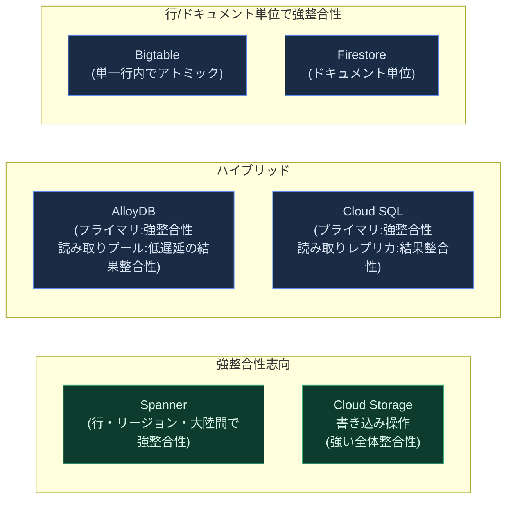

> **ベストプラクティス**: 「結果整合性で十分なユースケースに強整合性を無理に適用するとパフォーマンスコストが過大になる」という懸念は一部のシステムでは真実ですが、選択肢があること自体が重要であり、データベースが不必要な複雑さやアプリケーションバグの原因を持ち込まない限り、選択の自由は良いことだと捉えられています。可能な限り強整合性を選ぶことで、アプリケーションコード側で「どのユースケースにどの整合性モードを使うべきか」を判断し、硬直したトランザクションロジックをハードコードする必要がなくなり、結果として保守性の高いソフトウェアにつながります。読み取りレプリカ/読み取りプールを使う場合は、read-your-writes（自分の書き込みを即座に読み取れること）が必要なクエリパスとそうでないパスを設計段階で明確に分離することが推奨されます。

---

### 1.3.4 署名付き URL による Cloud Storage オブジェクトへのアクセス許可

署名付き URL（Signed URL）は、署名を使って特定の Cloud Storage リソースへの時間制限付きアクセスを許可する URL です。署名付き URL を保持している人は誰でも、それが有効な間、アカウントの有無にかかわらず使用できます。署名付き URL には、クエリ文字列の中に署名を含む認証情報が含まれており、これによって認証情報を持たないユーザーでもリソースに対する特定のアクションを実行できます。

署名付き URL を生成する際は、その生成しようとしているリクエストを実行するのに十分な権限を持つアカウントを指定する必要があります。生成後は、有効期限に達するか署名に使った鍵がローテーションされるまで、URL を知っている人は誰でもそのリソースにアクセスできます。

典型的なユースケースは、エンドユーザーに Google Cloud のアカウントを持たせることなく Cloud Storage へのアクセスを許可したい場合で、かつアプリケーション固有のロジックでアクセスを制御したい場合です。一般的な対応方法は、ユーザーに署名付き URL を提供し、それによって指定された期間、特定のリソースへの読み取り・書き込み・削除アクセスを与えることです。アップロードとダウンロードが署名付き URL の最も一般的な用途です。

署名付き URL は Cloud Storage の XML API エンドポイントを通じてのみリソースにアクセスするために使用できる点に注意が必要です。

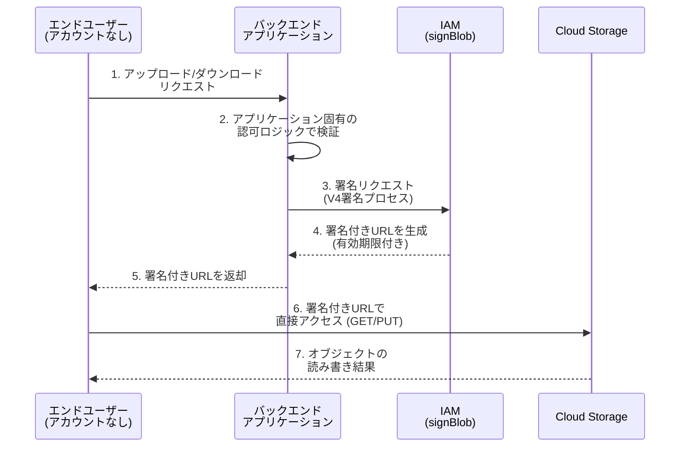

> **ベストプラクティス**: 署名付き URL の有効期限は、実際のユースケースに必要な最短時間に設定します。アップロード用の PUT 署名付き URL では `Content-Type` などの拡張ヘッダーを署名に含めることで、意図しないファイル種別のアップロードを防げます。V4 署名プロセスでは、Cloud Storage クライアントライブラリを使うことで多くの一般的なプログラミング言語向けに署名付き URL を生成できるため、独自のリクエスト署名アルゴリズムを実装するよりもクライアントライブラリの利用を優先することが推奨されます。署名鍵のローテーションポリシーも忘れずに設計し、鍵が漏洩した場合に迅速に無効化できる体制を整えておくことが重要です。

---

### 1.3.5 分析・AI/ML ワークロード向け BigQuery へのデータ書き込み

BigQuery へのデータ取り込み方法は、ワークロードの性質によって使い分けます。一度限りのロードジョブや、バッチレイテンシが問題にならない定期的なバッチジョブには BigQuery Data Transfer Service や BigQuery Load Job が適しています。一方、それ以外のほとんどのケースでは BigQuery Storage Write API が推奨される取り込み方法です。

BigQuery Load Job は主に Cloud Storage から BigQuery へのバッチのみのワークロードに適していますが、バッチモードの挿入であるためジョブの実行に時間がかかり、取り込みパフォーマンスは割り当てられた計算リソースに比例するという制約があります。つまり Load Job は、データソースから BigQuery へ低レイテンシで直接データを取り込むことはできません。

BigQuery Storage Write API は、Load Job と比較して次のような利点を提供します。ストリームレベルのトランザクション（1つのストリームは一度しかコミットできないため、安全なリトライが可能）、Cloud Storage へのエクスポートと BigQuery へのロードという2段階を経ずに BigQuery ストレージへ直接書き込めるシンプルなワークフロー、クエリジョブなど他の既存 BigQuery API と同レベルの SLO です。

ストリーミングシナリオでは、アプリケーションが必要とする保証のレベルを検討する必要があります。少なくとも1回（at-least-once）のセマンティクスで十分な場合はデフォルトストリームを使用し、正確に1回（exactly-once）のセマンティクスが必要な場合はコミット型（committed type）のストリームを1つ以上作成し、ストリームオフセットを使って正確に1回の書き込みを保証します。デフォルトストリームもコミット型を使用しますが、正確に1回の保証は提供しません。アプリケーションが宛先での重複レコードの可能性を許容できる場合は、ストリーミングシナリオにはデフォルトストリームの使用が推奨されます。

バッチロードシナリオでは、アプリケーションがデータを書き込み、単一のアトミックなトランザクションとしてコミットします。この場合は保留型（pending type）のストリームを1つ以上作成します。保留型はストリームレベルのトランザクションをサポートし、レコードはストリームをコミットするまで保留状態でバッファリングされます。

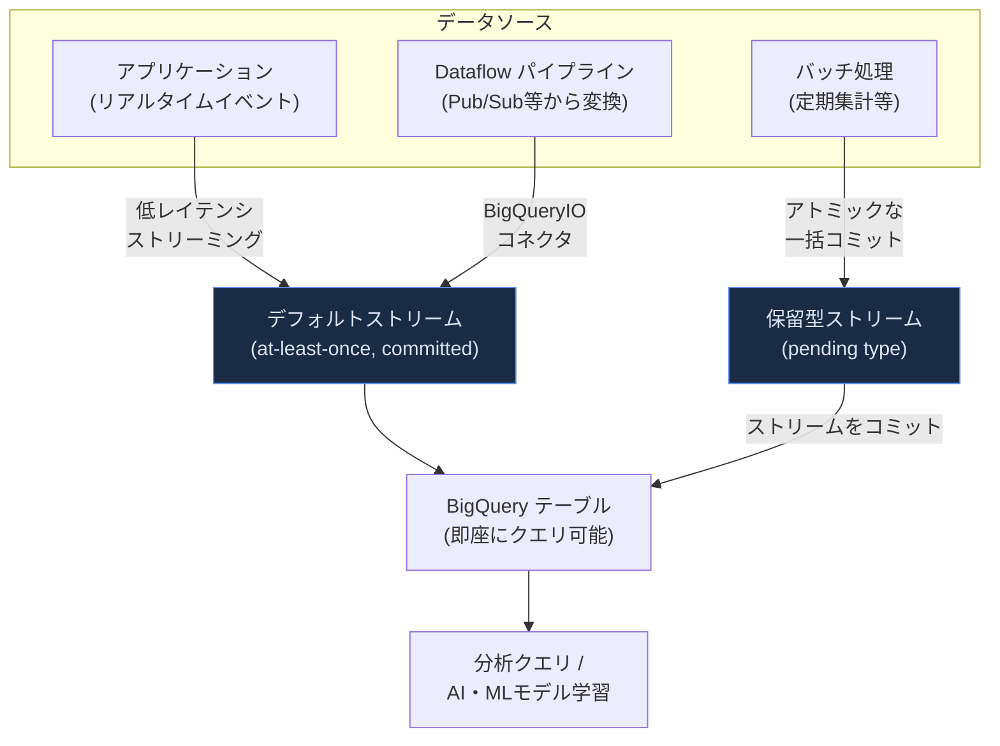

#### 取り込み方法の使い分け

| 取り込み方法 | 適したシナリオ | 特徴 |
|---|---|---|
| BigQuery Load Job | 一度限りの取り込み、バッチレイテンシが問題にならない定期実行 | Cloud Storage からのバッチロードに最適、実行に時間がかかる |
| Storage Write API（デフォルトストリーム） | リアルタイムに近いストリーミング、重複を許容できる場合 | 最も低いレイテンシ、at-least-once セマンティクス |
| Storage Write API（コミット型・アプリ作成ストリーム） | 正確に1回の書き込みが必要なストリーミング | ストリームオフセットで exactly-once を保証 |
| Storage Write API（保留型） | バッチワークロード（Load Job の代替） | アトミックなトランザクションコミット |
| Dataflow（BigQueryIO） | Pub/Sub 等からの変換を伴うストリーミングパイプライン | 内部的に Storage Write API を使用、大規模並列処理向け |

> **ベストプラクティス**: ストリームを作成する前に、まずデフォルトストリームで要件を満たせるかを検討します。デフォルトストリームはクォータ制限が少なく、ストリーミングシナリオにおいてアプリケーション作成ストリームより優れたスケーラビリティを持ちます。アプリケーション作成ストリームを使う場合は、追加のストリームを作成する前に各ストリームの最大スループットを使い切るようにし（例えば非同期書き込みを利用する）、`CreateWriteStream` を高頻度で呼び出すことは避けます。一般的に、1秒あたり40〜50回を超える呼び出しを行うと API 呼び出しのレイテンシが大幅に増加する（25秒を超える場合がある）ため注意が必要です。テーブルスキーマにペイロードで新しいフィールドを送りたい場合は、先に BigQuery 側のテーブルスキーマを更新する必要があり、Storage Write API はスキーマの変更を数分程度の短い時間で検知します。

---

## 試験対策チェックリスト

Section 1 の学習を終えたら、以下のチェックリストで理解度を自己確認してください。

- [ ] Compute Engine・GKE・Cloud Run のどれを選ぶべきか、ワークロードの特性（コンテナ化可否、Kubernetes 固有機能の要否、ステートレス性）から判断できる
- [ ] リージョンとゾーンの違い、およびゾーン/リージョン/マルチリージョンリソースのスコープの違いを説明できる
- [ ] 外部/内部 Application Load Balancer と Network Load Balancer の使い分けを説明できる
- [ ] セッションアフィニティが「ベストエフォート」であり認証・セキュリティ目的に使うべきでない理由を説明できる
- [ ] Memorystore のキャッシュアサイドパターン（キャッシュミス時にDBへフォールバック）を図で説明できる
- [ ] REST と gRPC の使い分け、および API Gateway によるトランスコーディングの役割を説明できる
- [ ] Apigee の Quota ポリシーと SpikeArrest ポリシーの違いを説明できる
- [ ] Eventarc（Standard/Advanced）と Pub/Sub の役割の違いを説明できる
- [ ] Cloud Run の CPU/メモリ設定における vCPU ホットスポットの回避策を説明できる
- [ ] リージョン永続ディスクによるゾーン障害耐性と、force-attach によるフェイルオーバー手順を説明できる
- [ ] Cloud Run のトラフィック分割によるカナリアデプロイ・ロールバックの仕組みを説明できる
- [ ] Workflows（オーケストレーション）と Eventarc/Pub-Sub（コレオグラフィー）の使い分け、および Cloud Tasks・Cloud Scheduler の役割を説明できる
- [ ] Object Lifecycle Management と保持ポリシー（ロック含む）の違いを説明できる
- [ ] IAP と Web Security Scanner がそれぞれ何を保護するかを説明できる
- [ ] Artifact Analysis と Security Command Center による脆弱性管理のライフサイクルを説明できる
- [ ] Secret Manager・Cloud KMS（CMEK）・Workload Identity Federation の関係を説明できる
- [ ] ADC・JWT・OAuth2.0・Auth Proxy・Identity Platform・WIF のそれぞれがどの認証シナリオに適するかを説明できる
- [ ] デフォルトサービスアカウントの自動権限付与に頼らず、最小権限の専用サービスアカウントを設計できる
- [ ] Kubernetes Network Policies・VPC ファイアウォール・Cloud Service Mesh・Direct VPC egress・Private Service Connect の使い分けを説明できる
- [ ] Binary Authorization のアテステーション・アテスター・ポリシーの関係を説明できる
- [ ] データ量・整合性要件・レイテンシ要件からストレージシステムを選定できる
- [ ] Spanner/Bigtable/Firestore におけるホットスポット回避の設計原則（単調キーの回避）を説明できる
- [ ] 強整合性と結果整合性のトレードオフ、および各データベースサービスの整合性特性を説明できる
- [ ] 署名付き URL の仕組みと、認証情報を持たないユーザーへのアクセス許可のユースケースを説明できる
- [ ] BigQuery Storage Write API のデフォルトストリーム/コミット型/保留型の使い分けを説明できる

---

## 参考文献

以下は本ガイドの内容の根拠となる Google Cloud 公式ドキュメント等のソース一覧です（カテゴリ別）。

### 認定試験・全体像

- [Professional Cloud Developer 認定ページ](https://cloud.google.com/learn/certification/cloud-developer)
- [Professional Cloud Developer Exam Guide (PDF)](https://services.google.com/fh/files/misc/professional_cloud_developer_exam_guide_english.pdf)

### コンピューティングプラットフォーム選定

- [Choose a managed container runtime environment](https://docs.cloud.google.com/architecture/select-managed-container-runtime-environment)
- [Where should I run my stuff? Choosing a Google Cloud compute option](https://cloud.google.com/blog/topics/developers-practitioners/where-should-i-run-my-stuff-choosing-google-cloud-compute-option)
- [Cloud Run overview](https://cloud.google.com/run/docs/overview/what-is-cloud-run)

### 地理的分散・リージョン/ゾーン

- [Geography and regions](https://cloud.google.com/docs/geography-and-regions)
- [Google Cloud locations](https://cloud.google.com/about/locations)
- [Performance Dashboard](https://cloud.google.com/network-intelligence-center/docs/performance-dashboard/concepts/overview)

### ロードバランシング・セッションアフィニティ

- [Cloud Load Balancing overview](https://cloud.google.com/load-balancing/docs/load-balancing-overview)
- [Session affinity](https://cloud.google.com/load-balancing/docs/backend-service#session_affinity)
- [Three-tier web app architecture using load balancers](https://cloud.google.com/architecture/application-layer-load-balancers-network-tier)

### キャッシュ（Memorystore）

- [Memorystore overview](https://cloud.google.com/memorystore/docs/overview)
- [Memorystore for Valkey overview](https://cloud.google.com/memorystore/docs/valkey/overview)
- [Caching strategies overview](https://cloud.google.com/architecture/caching-overview)

### API 設計・gRPC・API 管理

- [Cloud Run gRPC services overview](https://cloud.google.com/run/docs/triggering/grpc)
- [About gRPC | API Gateway](https://cloud.google.com/api-gateway/docs/grpc-overview)
- [Apigee overview](https://cloud.google.com/apigee/docs/api-platform/get-started/what-apigee)
- [Rate limiting with the Quota policy](https://cloud.google.com/apigee/docs/api-platform/reference/policies/quota-policy)
- [Rate limiting with the SpikeArrest policy](https://cloud.google.com/apigee/docs/api-platform/reference/policies/spike-arrest-policy)
- [Apigee AI-related capabilities](https://cloud.google.com/apigee/docs/api-platform/ai/ai-overview)

### イベント駆動・オーケストレーション

- [Eventarc overview](https://cloud.google.com/eventarc/standard/docs/overview)
- [Pub/Sub overview](https://cloud.google.com/pubsub/docs/overview)
- [Workflows overview](https://cloud.google.com/workflows/docs/overview)
- [Cloud Tasks overview](https://cloud.google.com/tasks/docs/overview)
- [Cloud Scheduler overview](https://cloud.google.com/scheduler/docs/overview)
- [Orchestration and choreography patterns](https://cloud.google.com/architecture/application-integration/orchestration-choreography)

### リソース設定・コスト最適化

- [Configure containers - CPU and memory (Cloud Run services)](https://cloud.google.com/run/docs/configuring/services/cpu)
- [General development tips (Cloud Run)](https://cloud.google.com/run/docs/tips/general)
- [Cost optimization in Google Cloud](https://cloud.google.com/architecture/framework/cost-optimization)

### データレプリケーション・フェイルオーバー・トラフィック分割

- [Regional persistent disks](https://cloud.google.com/compute/docs/disks/regional-persistent-disk)
- [Force-attach a regional persistent disk](https://cloud.google.com/compute/docs/disks/regional-persistent-disk#force-attach)
- [Cloud Load Balancing automatic failover](https://cloud.google.com/load-balancing/docs/backend-service#cross-region_load_balancing)
- [Managing traffic (Cloud Run)](https://cloud.google.com/run/docs/rollouts-rollbacks-traffic-migration)
- [About canary deployments (Cloud Deploy)](https://cloud.google.com/deploy/docs/deployment-strategies/canary)

### データ保持・脆弱性管理

- [Object Lifecycle Management](https://cloud.google.com/storage/docs/lifecycle)
- [Retention policies and retention policy locks](https://cloud.google.com/storage/docs/bucket-lock)
- [Identity-Aware Proxy overview](https://cloud.google.com/iap/docs/concepts-overview)
- [Overview of Web Security Scanner](https://docs.cloud.google.com/security-command-center/docs/concepts-web-security-scanner-overview)
- [Artifact Analysis overview](https://docs.cloud.google.com/artifact-analysis/docs/artifact-analysis)
- [Artifact guard overview](https://docs.cloud.google.com/security-command-center/docs/artifact-guard-overview)

### シークレット・鍵管理・認証

- [Secret Manager overview](https://docs.cloud.google.com/secret-manager/docs/overview)
- [Enable customer-managed encryption keys for Secret Manager](https://docs.cloud.google.com/secret-manager/docs/cmek)
- [Workload Identity Federation](https://docs.cloud.google.com/iam/docs/workload-identity-federation)
- [Best practices for using Workload Identity Federation](https://docs.cloud.google.com/iam/docs/best-practices-for-using-workload-identity-federation)
- [How Application Default Credentials works](https://docs.cloud.google.com/docs/authentication/application-default-credentials)
- [Authentication for Google Cloud APIs and services](https://cloud.google.com/docs/authentication/production)
- [About the AlloyDB Auth Proxy](https://docs.cloud.google.com/alloydb/docs/auth-proxy/overview)
- [Best practices for using the AlloyDB Auth Proxy](https://docs.cloud.google.com/alloydb/docs/auth-proxy/best-practices)
- [Connect using the Cloud SQL Auth Proxy](https://docs.cloud.google.com/sql/docs/mysql/connect-auth-proxy)
- [About Workload Identity Federation for GKE](https://docs.cloud.google.com/kubernetes-engine/docs/concepts/workload-identity)

### IAM・最小権限

- [Best practices for using service accounts securely](https://docs.cloud.google.com/iam/docs/best-practices-service-accounts)
- [Best practices for managing service account keys](https://docs.cloud.google.com/iam/docs/best-practices-for-managing-service-account-keys)
- [IAM Recommender: least privilege with less effort](https://cloud.google.com/blog/products/identity-security/achieve-least-privilege-with-less-effort-using-iam-recommender/)
- [Best practices for Privileged Access Manager](https://docs.cloud.google.com/iam/docs/pam-best-practices)
- [Least privilege for Cloud Functions using Cloud IAM](https://cloud.google.com/blog/products/application-development/least-privilege-for-cloud-functions-using-cloud-iam)
- [Running Infrastructure-as-Code with the least privilege possible](https://cloud.google.com/blog/products/devops-sre/running-infrastructure-code-least-privilege-possible)

### セキュアなサービス間通信

- [Control communication between Pods and Services using network policies](https://docs.cloud.google.com/kubernetes-engine/docs/how-to/network-policy)
- [Best Practices for using Cloud Service Mesh egress gateways on GKE clusters](https://docs.cloud.google.com/service-mesh/docs/security/egress-gateways-best-practices)
- [Private access options for services](https://docs.cloud.google.com/vpc/docs/private-access-options)
- [Compare Direct VPC egress and VPC connectors](https://cloud.google.com/run/docs/configuring/connecting-vpc)
- [Direct VPC egress with a Shared VPC network](https://docs.cloud.google.com/run/docs/configuring/shared-vpc-direct-vpc)

### Binary Authorization

- [Binary Authorization overview](https://docs.cloud.google.com/binary-authorization/docs/overview)
- [Binary Authorization concepts](https://cloud.google.com/binary-authorization/docs/key-concepts)
- [Attestations overview](https://docs.cloud.google.com/binary-authorization/docs/attestations)
- [Continuous validation overview](https://docs.cloud.google.com/binary-authorization/docs/overview-cv)
- [Create a Binary Authorization attestation in a Cloud Build pipeline](https://docs.cloud.google.com/binary-authorization/docs/cloud-build)

### ストレージ選定・データベース

- [Design an optimal storage strategy for your cloud workload](https://cloud.google.com/architecture/storage-advisor)
- [Pick the right storage option on Google Cloud](https://cloud.google.com/blog/products/storage-data-transfer/pick-the-right-storage-option-on-google-cloud)
- [Google Cloud databases overview](https://cloud.google.com/products/databases)
- [Why you should pick strong consistency, whenever possible](https://cloud.google.com/blog/products/databases/why-you-should-pick-strong-consistency-whenever-possible)

### スキーマ設計

- [Spanner: Schema design best practices](https://docs.cloud.google.com/spanner/docs/schema-design)
- [Bigtable: Schema design best practices](https://cloud.google.com/bigtable/docs/schema-design)
- [Bigtable: Schema design for time series data](https://cloud.google.com/bigtable/docs/schema-design-time-series)
- [Firestore: Best practices](https://cloud.google.com/firestore/docs/best-practices)
- [Firestore: Understand reads and writes at scale](https://cloud.google.com/firestore/docs/understand-reads-writes-scale)
- [AlloyDB for PostgreSQL product page](https://cloud.google.com/products/alloydb)
- [AlloyDB cross-region replication overview](https://docs.cloud.google.com/alloydb/docs/cross-region-replication/about-cross-region-replication)

### 署名付き URL・BigQuery データ書き込み

- [Signed URLs (Cloud Storage)](https://docs.cloud.google.com/storage/docs/access-control/signed-urls)
- [Cloud Storage consistency](https://docs.cloud.google.com/storage/docs/consistency)
- [Introduction to the Storage Write API (BigQuery)](https://cloud.google.com/bigquery/docs/write-api)
- [Stream data using the Storage Write API](https://docs.cloud.google.com/bigquery/docs/write-api-streaming)
- [BigQuery Storage Write API best practices](https://docs.cloud.google.com/bigquery/docs/write-api-best-practices)
- [Batch load data using the Storage Write API](https://docs.cloud.google.com/bigquery/docs/write-api-batch)
- [BigQuery Write API explained: An overview of the Write API](https://cloud.google.com/blog/topics/developers-practitioners/bigquery-write-api-explained-overview-write-api)

---

*本ガイドは Google Cloud 公式ドキュメントを基に作成した学習補助資料です。試験内容は変更される可能性があるため、必ず公式の [Exam Guide](https://services.google.com/fh/files/misc/professional_cloud_developer_exam_guide_english.pdf) と各サービスの最新ドキュメントを併せてご確認ください。*