# Google Cloud セキュリティ基礎 完全ガイド
## IAM / カスタムロール / サービスアカウント / VPC Peering / IAP / Cloud KMS / Private GKE

> **対象読者**: Google Cloud を触り始めたばかりのエンジニア、Skill Boost のラボを一通りこなしたが「なぜそうするのか」を体系的に理解したい方
> **前提知識**: Google Cloud コンソールの基本操作、`gcloud` コマンドの雛形が読める程度
> **到達目標**: 「最小権限の原則(Principle of Least Privilege)」を軸に、IAM・ネットワーク・暗号化の各レイヤーで安全な構成を自力で設計・説明できるようになる

---

## 目次

1. [この教材の全体像](#0-この教材の全体像)
2. [Chapter 1: IAM基礎 — 誰が・何に・何をできるか](#chapter-1-iam基礎--誰が何に何をできるか)
3. [Chapter 2: IAMカスタムロール — 権限を自分でデザインする](#chapter-2-iamカスタムロール--権限を自分でデザインする)
4. [Chapter 3: サービスアカウント — 人間ではないIDの管理](#chapter-3-サービスアカウント--人間ではないidの管理)
5. [Chapter 4: VPC Network Peering — プロジェクトをまたぐ内部通信](#chapter-4-vpc-network-peering--プロジェクトをまたぐ内部通信)
6. [Chapter 5: Identity-Aware Proxy (IAP) — アプリ層のゼロトラスト](#chapter-5-identity-aware-proxy-iap--アプリ層のゼロトラスト)
7. [Chapter 6: Cloud KMS — 鍵管理と暗号化](#chapter-6-cloud-kms--鍵管理と暗号化)
8. [Chapter 7: Private GKE クラスタ — Kubernetesのネットワーク隔離](#chapter-7-private-gke-クラスタ--kubernetesのネットワーク隔離)
9. [Chapter 8: 総合演習 — 全レイヤーを統合したセキュアなクラスタ設計](#chapter-8-総合演習--全レイヤーを統合したセキュアなクラスタ設計)
10. [ベストプラクティス総まとめ表](#ベストプラクティス総まとめ表)
11. [参考文献 / 公式ドキュメント一覧](#参考文献--公式ドキュメント一覧)

---

## 0. この教材の全体像

このガイドは、Google Cloud の「Implement Cloud Security Fundamentals」系スキルバッジで扱う8つのハンズオンラボ(IAM基礎/IAMカスタムロール/サービスアカウント/VPCピアリング/IAP/Cloud KMS/Private GKE/総合チャレンジラボ)を、単なる手順書ではなく **「なぜその設定が必要なのか」** という観点で再構成したものです。

全体を貫く思想はただ一つ、**最小権限の原則(Principle of Least Privilege)** です。各章はこの原則を異なるレイヤー(誰が/何に対して/どの経路で)に適用したものだと考えると、バラバラに見える8つのラボが1本の線でつながります。

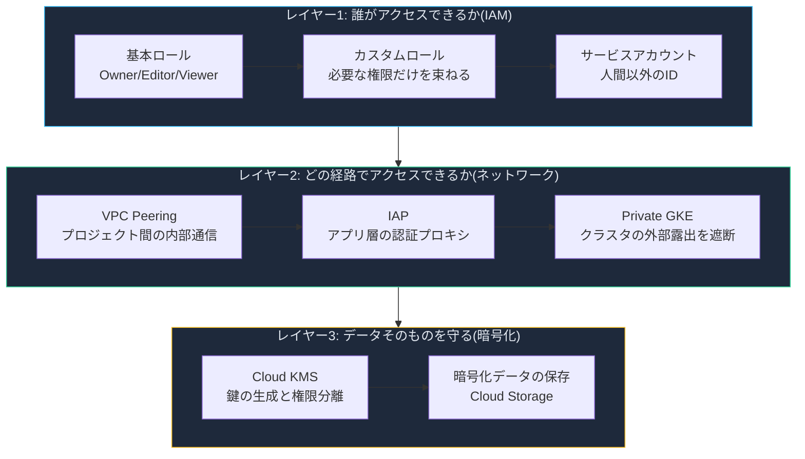

> 💡 **読み方のコツ**: 各章の冒頭に「到達目標レベル」を記載しています。これは ISTQB のようなK-Level(知識レベル)の考え方を借りたもので、K1=記憶している、K2=理由を説明できる、K3=自分の要件に合わせて設計できる、を意味します。

---

## Chapter 1: IAM基礎 — 誰が・何に・何をできるか

**到達目標レベル: K1(記憶)→ K2(理解)**

### 1.1 定義

Cloud IAM(Identity and Access Management)は、Google Cloud上のあらゆる操作に対して「誰が(Principal)」「何に(Resource)」「何を(Role = 権限の集合)」できるかを一元管理する仕組みです。ユーザーに直接パーミッションを渡すのではなく、**ロールという権限の束を経由して**付与する設計になっている点が最大の特徴です。

### 1.2 なぜこの設計なのか

もしパーミッションを1つずつユーザーへ割り当てる方式だったら、数百人の組織では「誰が何をできるか」を追跡することが事実上不可能になります。ロールという中間層を挟むことで、次のことが可能になります。

- 「経理担当」「インフラ担当」のような**職務ベースでロールをグループに割り当てられる**
- 新しい機能が追加されたとき、Google側が事前定義ロールの権限を自動更新してくれる
- 監査時に「このロールに何が含まれるか」を1箇所確認すればよい

### 1.3 基本ロール(Primitive Roles)の一覧

IAM導入以前から存在する4つの基本ロールは、今でもラボでよく登場します。実務では基本的に**使用を避けるべき**ロールですが、仕組みを理解するために整理します。

| ロール名 | ロールID | できること |
|---|---|---|
| ブラウザ | `roles/browser` | フォルダ・組織階層の閲覧のみ。プロジェクト内のリソース自体は見えない |
| 閲覧者 (Viewer) | `roles/viewer` | 状態を変更しない読み取り専用操作(既存リソースの閲覧) |
| 編集者 (Editor) | `roles/editor` | Viewerの全権限 + リソースの作成・変更・削除 |
| オーナー (Owner) | `roles/owner` | Editorの全権限 + 権限管理(IAMポリシー変更)+ 課金設定 |

> ⚠️ **なぜOwner/Editor/Viewerを避けるべきか**
> これらは数千もの権限をサービス横断でまとめて付与してしまいます。たとえば「Cloud Storageのファイルを見せたいだけ」の相手にViewerを渡すと、BigQueryやCompute Engineの情報まで見えてしまいます。本番環境では事前定義ロール(例: `roles/storage.objectViewer`)またはカスタムロールを使うのが定石です。

### 1.4 権限が伝播する仕組み

IAMのポリシーはリソース階層(組織 → フォルダ → プロジェクト → 個々のリソース)に沿って**継承**されます。上位で付与したロールは下位のすべての子リソースに効きます。

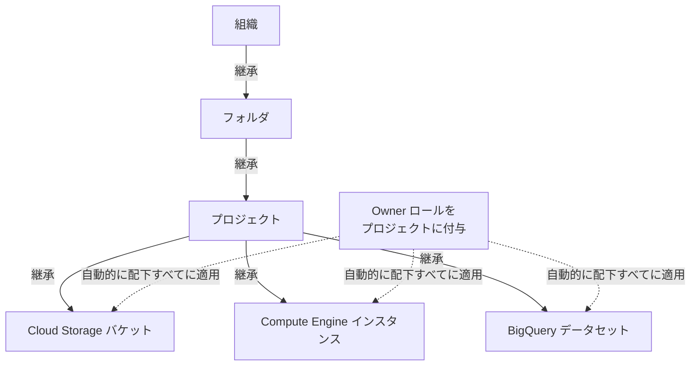

### 1.5 ハンズオンで確認する2つの挙動

ラボでは2つのユーザー(Owner権限のUser1、Viewer権限のUser2)を使って以下を体験します。

1. **Viewerロールを持つユーザーはIAMページの「アクセス権を付与」ボタン自体が押せない**
   → `resourcemanager.projects.setIamPolicy` 権限がないため。権限管理を行うにはOwnerまたはそれに準ずるIAM関連ロールが必要。
2. **プロジェクトロールを剥奪しても、リソース個別のロールが残っていればアクセスは可能**
   → プロジェクトのViewerロールを削除しても、Cloud Storageバケットに個別に `roles/storage.objectViewer` を付与しておけば、そのバケットだけは引き続き閲覧できます。これは「プロジェクト全体の閲覧権限」と「個別リソースの権限」が独立して管理できることを示す重要な挙動です。

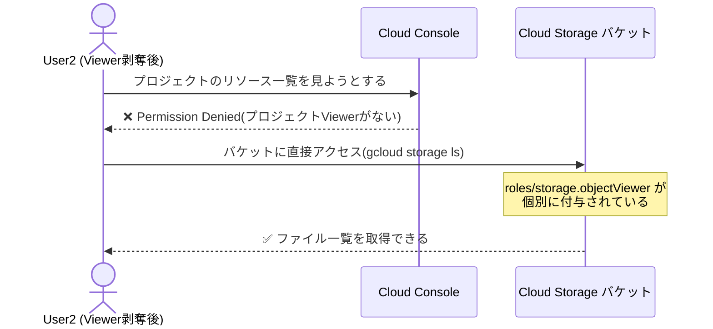

### 1.6 ベストプラクティス

| ✅ 推奨 | ❌ 避けるべき |
|---|---|
| 事前定義ロール(例: `roles/storage.objectViewer`)を使う | 基本ロール(Owner/Editor/Viewer)を安易に付与する |
| 必要な範囲(バケット単位・データセット単位)にロールを絞る | プロジェクト全体にまとめてロールを付与する |
| 権限変更後は反映まで最大80秒程度かかることを見込んで検証する | 変更直後にエラーだと即座に「壊れた」と判断する |
| 定期的にIAMポリシーの棚卸し(誰が何を持っているか)を行う | 一度付与した権限を放置する |

---

## Chapter 2: IAMカスタムロール — 権限を自分でデザインする

**到達目標レベル: K2(理解)→ K3(適用)**

### 2.1 定義

カスタムロールとは、Google が用意した事前定義ロールでは粒度が合わない場合に、**自分で権限(Permission)を1つずつ選んで束ねて作るロール**です。組織レベルまたはプロジェクトレベルで作成でき、Googleによる自動更新の対象にはなりません(自分でメンテナンスする必要があります)。

### 2.2 権限の命名規則を理解する

Cloud IAMの権限はすべて `<サービス>.<リソース>.<動詞>` という統一フォーマットに従います。

```text
compute.instances.list   → Compute Engine の instances リソースを一覧表示できる
compute.instances.stop   → Compute Engine の instances リソースを停止できる
storage.buckets.get      → Cloud Storage の bucket 情報を取得できる
pubsub.topics.publish     → Pub/Sub の topic にメッセージを発行できる
```

多くの場合、1つの権限が1つのREST APIメソッドに対応しています。つまり「どのAPIを呼びたいか」から逆算して必要な権限を洗い出すことができます。

### 2.3 事前定義ロール vs カスタムロールの比較

| 観点 | 事前定義ロール | カスタムロール |
|---|---|---|
| 管理主体 | Google | 自分(プロジェクト/組織の管理者) |
| 新機能追加時の更新 | 自動 | 手動でメンテナンスが必要 |
| 粒度 | サービス単位で比較的大きい | 権限を1つずつ自由に選択できる |
| 付与できる階層 | 全階層 | 組織レベル or プロジェクトレベル(フォルダレベル不可) |
| こんな時に使う | 一般的な職務にそのまま当てはまる時 | 「このサービスのこの操作だけ許可したい」という細かい要件がある時 |

> 📌 **プロジェクトレベルの制約に注意**
> プロジェクトレベルのカスタムロールには、組織やフォルダでしか意味を持たない権限を含めることはできません。IAMの権限は階層を下方向にしか継承されないため、プロジェクトで付与した権限を上位のフォルダ/組織に対して使うことができないからです。

### 2.4 カスタムロールを作る2つの方法

**方法A: YAMLファイルによる定義**

```yaml
title: "Role Editor"
description: "App Versionsへの編集アクセス"
stage: "ALPHA"
includedPermissions:
- appengine.versions.create
- appengine.versions.delete
```

```bash
gcloud iam roles create editor \
  --project $DEVSHELL_PROJECT_ID \
  --file role-definition.yaml
```

**方法B: フラグによる直接指定**

```bash
gcloud iam roles create viewer \
  --project $DEVSHELL_PROJECT_ID \
  --title "Role Viewer" \
  --description "カスタムロールの説明" \
  --permissions compute.instances.get,compute.instances.list \
  --stage ALPHA
```

どちらの方法でも `stage` フィールドで役割のライフサイクル段階(ALPHA / BETA / GA / DISABLED)を宣言する点が共通しています。

### 2.5 etag による楽観的ロック

複数の管理者が同時にロールを更新しようとすると、片方の変更が意図せず上書きされる恐れがあります。Cloud IAMはこれを防ぐために `etag` というバージョン識別子を使います。

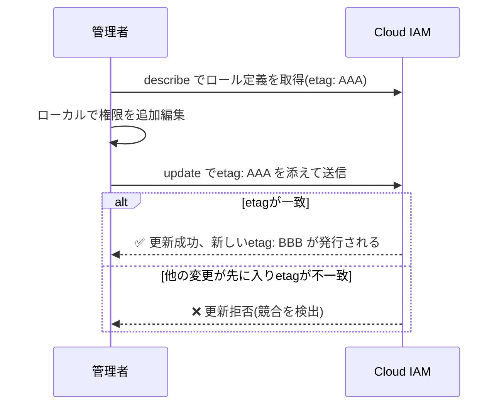

この仕組みにより「読み取り→ローカルで変更→書き込み」という一般的な更新パターン(Read-Modify-Write)を安全に行えます。

### 2.6 カスタムロールのライフサイクル

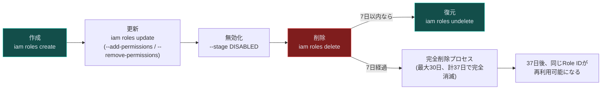

> ⚠️ **無効化と削除の違い**: `DISABLED` にしても既存のポリシーバインディングは残ったまま(効果が無くなるだけ)です。誤って権限が広がりすぎたロールを一時停止したい場合は、削除より先に無効化を検討すると安全です。

### 2.7 ベストプラクティス

| ✅ 推奨 | ❌ 避けるべき |
|---|---|
| 「本当に必要な権限」だけをリストアップしてから作成する | とりあえず広めの権限を付与して後で絞ろうとする |
| 更新前に必ず `describe` して最新のetagを確認する | ローカルにキャッシュした古い定義を使い回して更新する |
| 説明文に「どの事前定義ロールを参考にしたか」を書いておく | 説明が空欄のまま放置する(半年後に誰も意図を追えなくなる) |
| ロールを廃止する際は `DEPRECATED` にして移行先を案内する | 突然削除して依存しているユーザーを詰まらせる |

---

## Chapter 3: サービスアカウント — 人間ではないIDの管理

**到達目標レベル: K2(理解)→ K3(適用)**

### 3.1 定義

サービスアカウントとは、人間ではなく**アプリケーションやVMのためのGoogleアカウント**です。APIを呼び出す際、エンドユーザーを介さずに「アプリそのもの」として認証・認可を行うために使われます。一意なメールアドレス形式の識別子を持ちます。

### 3.2 なぜ人間のアカウントを使い回してはいけないのか

もしVMやバッチ処理が個人アカウントの認証情報を使っていたら、次のような問題が起こります。

- そのユーザーが退職・異動すると処理が止まる
- 個人アカウントに紐づく過剰な権限がそのままアプリに渡ってしまう
- 「誰が」「何の目的で」実行したログなのかが曖昧になる

サービスアカウントを使うことで、アプリの識別・権限管理・監査ログのすべてが「アプリ専用のID」に紐づき、人間のライフサイクルと分離できます。

### 3.3 サービスアカウントの種類

| 種類 | 例 | 説明 |
|---|---|---|
| Compute Engine デフォルトSA | `PROJECT_NUMBER-compute@developer.gserviceaccount.com` | Compute Engine APIを有効化すると自動作成 |
| App Engine デフォルトSA | `PROJECT_ID@appspot.gserviceaccount.com` | App Engineアプリを含むプロジェクトに自動作成 |
| ユーザー管理SA | `任意の名前@PROJECT_ID.iam.gserviceaccount.com` | 開発者が明示的に作成。1プロジェクトにつき最大100個程度まで作成可 |
| Google管理SA(サービスエージェント) | `PROJECT_NUMBER@cloudservices.gserviceaccount.com` | Google内部処理用。デフォルトでEditorロールを持つため変更・削除は非推奨 |

### 3.4 「ID」としての利用と「リソース」としての利用

サービスアカウントは**2つの立場**で登場する点が初学者にとって混乱しやすいポイントです。

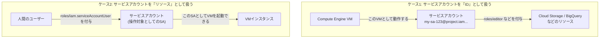

- **ケース1**: 「このVMはこのSAとして動く。SAにはこの権限を与える」→ アプリからGoogle Cloud APIを呼ぶための権限設計
- **ケース2**: 「このユーザーは、このSAを使ってVMを起動する権限を持つ」→ 誰がそのSAを“着られる”かのアクセス制御

この2つを分けて設計することで、「VMを起動できる人」と「VMが実際に持つ権限」を独立してコントロールできます。

### 3.5 実例: BigQueryにアクセスするサービスアカウント

ラボの流れを整理すると以下のようになります。

1. `bigquery-qwiklab` という名前でサービスアカウントを作成
2. `BigQuery Data Viewer` と `BigQuery User` のロールを付与(BigQueryを使うのに必要十分な権限だけ)
3. Compute Engineインスタンス作成時、このサービスアカウントをVMにアタッチ（接続）し、アクセススコープ（Access Scope）を個別に設定する（アクセス制御をIAMに一任するため「すべてのCloud APIへのフルアクセスを許可」に設定することを推奨）
4. VM内のPythonコードは `compute_engine.Credentials(service_account_email=...)` で認証情報を取得し、ユーザーの介在なしにBigQueryへクエリを実行する

> 💡 **サービスアカウントのアタッチとアクセススコープの分離**
> サービスアカウントを VM に紐付ける（アタッチする）ことと、アクセススコープを設定することは別概念です。
> - **サービスアカウントのアタッチ**: VM が API を呼び出す際の「アイデンティティ（ID）」を定義します。
> - **アクセススコープ**: VM から Google Cloud API へのレガシーな認限制限フィルターです。現在のベストプラクティスでは、アクセススコープは「すべての API へのフルアクセス（Allow full access to all Cloud APIs）」とし、実際の権限はアタッチしたサービスアカウントに付与された IAM ロールのみで厳密に制御（最小権限の原則）します。

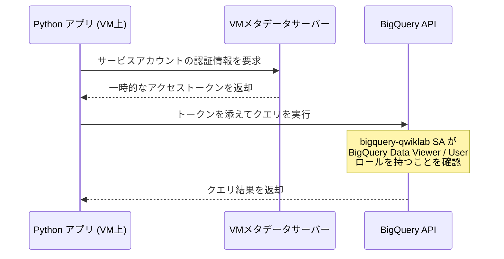

### 3.6 ベストプラクティス

| ✅ 推奨 | ❌ 避けるべき |
|---|---|
| ワークロードごとに専用のサービスアカウントを作成する | すべてのVM/アプリでデフォルトSA(強い権限を持つ)を使い回す |
| SAには必要最小限のロールだけを付与する(例: BigQueryだけならその2ロールのみ) | とりあえずEditorやOwnerを付与する |
| 90日以上認証実績がないSAは無効化・削除を検討する | 使われなくなったSAを放置する(攻撃対象領域が増える) |
| 誰がそのSAを「使える」か(`serviceAccountUser`)を明示的に管理する | SAの鍵をローカルにダウンロードして共有する |

---

## Chapter 4: VPC Network Peering — プロジェクトをまたぐ内部通信

**到達目標レベル: K2(理解)→ K3(適用)**

### 4.1 定義

VPC Network Peeringは、2つのVPCネットワーク(同一プロジェクト内・別プロジェクト・別組織のいずれでも可)を、**内部IPアドレスだけで直接接続する**仕組みです。ゲートウェイやVPN機器を経由せず、まるで同じネットワーク内にいるかのように通信できます。

### 4.2 なぜVPNや外部IPより優れているのか

| 観点 | 外部IP経由の通信 | VPN | VPC Peering |
|---|---|---|---|
| レイテンシ | 高い(インターネット経由) | 中程度(暗号化オーバーヘッド) | 低い(同一ネットワーク内相当) |
| セキュリティ | サービスがインターネットに露出 | 内部化されるが構成が複雑 | 内部化され、露出面がない |
| コスト | 通常の帯域課金 | トンネル維持コストが発生 | 内部IP通信のため送信元课金が有利 |

SaaS的なアーキテクチャ(1つのプロバイダVPCを複数の顧客VPCに公開する等)を組む際、VPC Peeringは代表的な選択肢の一つです。

### 4.3 双方向の設定が必要という重要な特性

VPC Peeringで最もつまずきやすいポイントは、**片側だけの設定では有効化されない**ことです。

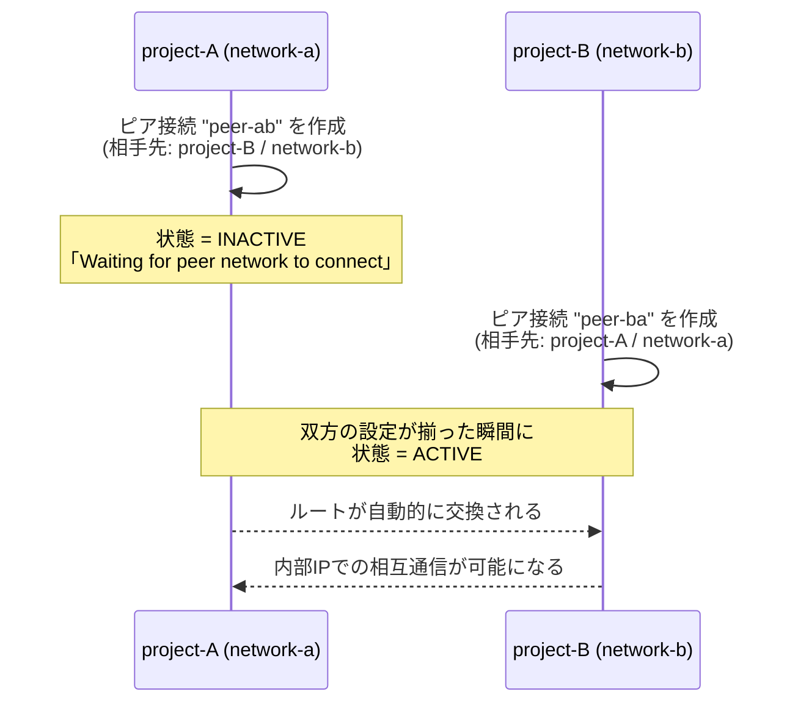

> 📌 **なぜこの設計なのか**: ピア接続の作成は、相手のVPCに対するIAMロールを一切付与しません。つまり「あなたのネットワークに繋ぎたい」という一方的な申請にすぎず、相手側の管理者が同意(＝自分の側にも同じ接続を作成)することで初めて成立します。これは、他人のネットワークに勝手に接続できてしまう事態を防ぐための安全設計です。

### 4.4 疎通確認までの流れ

1. `project-A` に `network-a`(サブネット `10.0.0.0/16`)を作成し、VM `vm-a` を配置
2. `project-B` に `network-b`(サブネット `10.8.0.0/16`)を作成し、VM `vm-b` を配置
3. SSH/ICMPを許可するファイアウォールルールをそれぞれ作成
4. 双方向のピア接続(`peer-ab` / `peer-ba`)を作成し `ACTIVE` になったことを確認
5. `vm-b` から `vm-a` の内部IPへ `ping` を実行し、パケットロス0%であることを確認

```bash
# project-A側
gcloud compute networks subnets create network-a-subnet --network network-a \
    --range 10.0.0.0/16 --region "REGION 1"

# project-B側
gcloud compute networks subnets create network-b-subnet --network network-b \
    --range 10.8.0.0/16 --region "REGION 2"
```

> ⚠️ **サブネットのIP範囲重複に注意**: ピア接続先とサブネットの範囲が重複していると、ピアリング自体が失敗します。設計段階でIPアドレス計画を必ず立てましょう。

### 4.5 ベストプラクティス

| ✅ 推奨 | ❌ 避けるべき |
|---|---|
| ピアリング前にIPアドレス範囲の重複がないか確認する | とりあえずデフォルトのCIDRで作成して後から気づく |
| 両側で名前(peer-ab / peer-ba)を対応付けて管理しやすくする | 名前をランダムにして後から追跡できなくする |
| 必要な通信だけをファイアウォールルールで許可する | ピアリング=無制限アクセスだと誤解して全許可にする |
| 重要なサービスの接続には consensus モードの利用を検討する | 誰でも片側から一方的にピア接続を削除できる状態を放置する |

---

## Chapter 5: Identity-Aware Proxy (IAP) — アプリ層のゼロトラスト

**到達目標レベル: K2(理解)→ K3(適用)**

### 5.1 定義

IAP(Identity-Aware Proxy)は、HTTPSでアクセスするアプリケーションの手前に立ち、**ネットワークレベルのファイアウォールではなく、アプリケーションレベルの認証・認可**でアクセス制御を行うGoogle Cloudのサービスです。VPNを使わずにゼロトラストアクセスを実現します。

### 5.2 なぜVPNではなくIAPなのか

従来型のVPNは「一度ネットワークに入れば内部は信頼される」という前提に立っています。しかしこれは、VPN経由で侵入されると内部のあらゆるリソースへ横展開されるリスクを抱えています。IAPは**リクエストごと・ユーザーごとに認証と認可を行う**ため、境界(ネットワーク)ではなくID(誰がアクセスしているか)を信頼の基準にします。

### 5.3 認証・認可・ヘッダー伝播の流れ

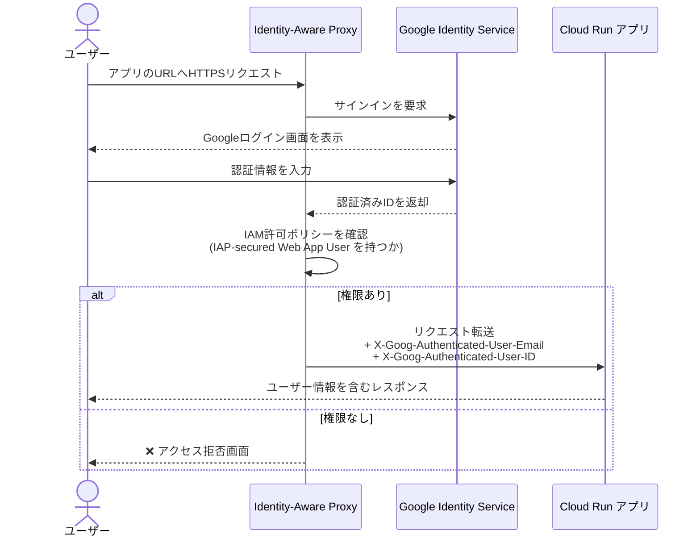

IAPが有効な間、アプリはリクエストヘッダーからユーザーのメールアドレスや永続IDを取得できます。

```python
user_email = request.headers.get('X-Goog-Authenticated-User-Email')
user_id = request.headers.get('X-Goog-Authenticated-User-ID')
```

### 5.4 「なりすまし」の危険性とJWT暗号検証

ここが本チャプターの一番重要なポイントです。**IAPが無効化・バイパスされた場合、アプリはそれを検知できません。** IAPがオフの状態で同じヘッダー名を偽装したリクエストを送ると、アプリはそれを正規のIAP経由のリクエストだと誤認してしまいます。

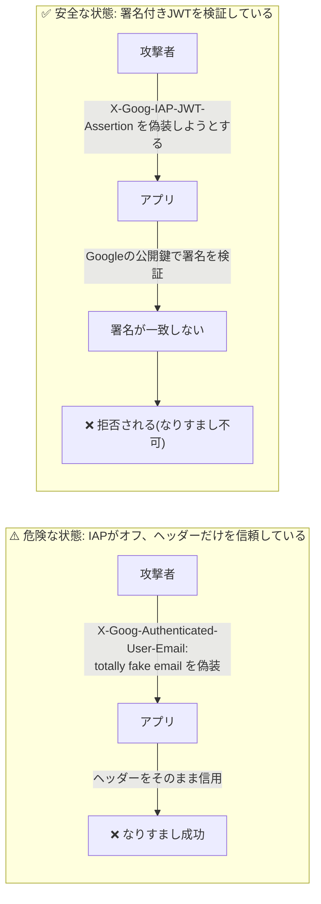

対策として `X-Goog-IAP-JWT-Assertion` ヘッダーに含まれる**暗号署名付きのアサーション**をアプリ側で検証する方法があります。この署名はGoogleの秘密鍵でしか生成できないため、IAPを経由していないリクエストは検証に失敗します。

```python
def user():
    assertion = request.headers.get('X-Goog-IAP-JWT-Assertion')
    if assertion is None:
        return None, None
    info = jwt.decode(
        assertion,
        keys(),               # Googleの公開鍵セット
        algorithms=['ES256'],
        audience=audience()   # 保護対象アプリを表すオーディエンス
    )
    return info['email'], info['sub']
```

### 5.5 素のヘッダー参照 vs JWT暗号検証の比較

| 観点 | ヘッダーをそのまま参照 | JWTを暗号検証 |
|---|---|---|
| 実装の手間 | 低い(ヘッダーを読むだけ) | やや高い(公開鍵取得・署名検証の実装が必要) |
| IAPがオフ/迂回された場合の安全性 | ❌ 偽装されたヘッダーをそのまま信用してしまう | ✅ 署名検証に失敗し、なりすましを検知できる |
| 推奨される用途 | リスクが低い社内ツールの試作段階 | 機密性の高いデータを扱う本番アプリケーション |

### 5.6 ベストプラクティス

| ✅ 推奨 | ❌ 避けるべき |
|---|---|
| 機密性の高いアプリではJWTアサーションを検証する | ヘッダーの値を無条件に信頼する |
| IAPを有効化したロードバランサ配下のバックエンドは、IAP経由以外からのアクセスもファイアウォールで遮断する | IAPさえ設定すればバックエンドへの直接アクセス経路を放置してよいと考える |
| `IAP-secured Web App User` ロールは必要なユーザー/グループだけに絞る | 組織全体に大盤振る舞いする |
| Cloud Runの場合、`run.app` の直接URLを無効化しロードバランサ経由を強制する | IAP設定後もデフォルトURLが誰でも叩ける状態を放置する |

---

## Chapter 6: Cloud KMS — 鍵管理と暗号化

**到達目標レベル: K2(理解)→ K3(適用)**

### 6.1 定義

Cloud KMS(Key Management Service)は、Google Cloud上のサービスや自作アプリケーションで使う**暗号鍵をクラウド上で一元的に生成・管理・利用するサービス**です。KeyRing(鍵のグループ)とCryptoKey(実際の鍵)という2階層のリソースモデルを持ちます。

### 6.2 リソース階層

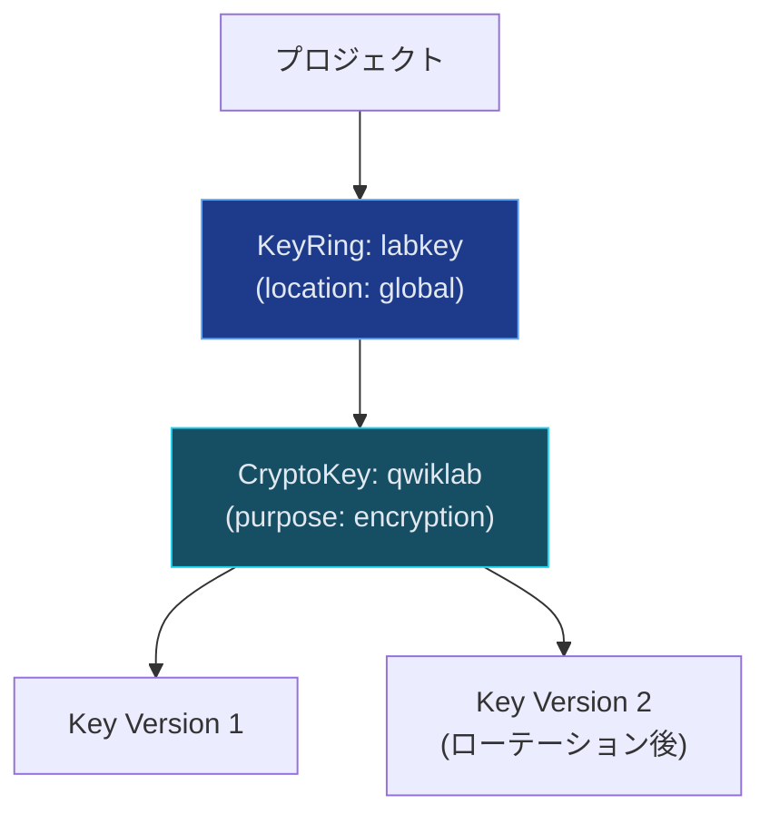

- **KeyRing**: 特定のロケーションに鍵をグループ化する入れ物。環境別(test/staging/prod)やデータの機密度別に分けるのが一般的。**一度作成すると削除できません**が、コストは発生しません。
- **CryptoKey**: 実際に暗号化/復号に使われる鍵。複数の**Key Version**を持つことができ、ローテーションのたびに新バージョンが追加されます。

### 6.3 暗号化・復号のワークフロー

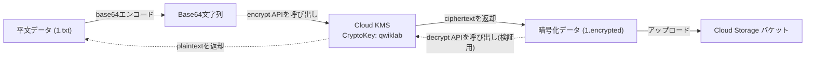

```bash
# 平文をbase64エンコード
PLAINTEXT=$(cat 1.txt | base64 -w0)

# encryptエンドポイントを呼び出し、結果からciphertextだけ抽出
curl -v "https://cloudkms.googleapis.com/v1/projects/$DEVSHELL_PROJECT_ID/locations/global/keyRings/$KEYRING_NAME/cryptoKeys/$CRYPTOKEY_NAME:encrypt" \
  -d "{\"plaintext\":\"$PLAINTEXT\"}" \
  -H "Authorization:Bearer $(gcloud auth application-default print-access-token)" \
  -H "Content-Type:application/json" \
| jq .ciphertext -r > 1.encrypted
```

> 💡 **重要な性質**: Cloud KMSは確率的暗号化を採用しているため、**同じ平文を同じ鍵で2回暗号化しても異なる暗号文になります**。これは暗号文からパターンを推測されるリスクを下げるための仕様です。

### 6.4 権限分離: 「鍵の管理」と「鍵の使用」は別の権限

KMSを理解する上で最も重要な設計思想が、**鍵の管理者(admin)と鍵の利用者(encrypter/decrypter)を役割として分離できる**ことです。

| ロール | 権限ID | できること |
|---|---|---|
| Cloud KMS 管理者 | `roles/cloudkms.admin` | KeyRingの作成、CryptoKeyの作成・無効化・破棄などの管理操作 |
| 暗号化・復号 実行者 | `roles/cloudkms.cryptoKeyEncrypterDecrypter` | 実際に `encrypt` / `decrypt` APIを呼び出せる(鍵そのものの管理はできない) |

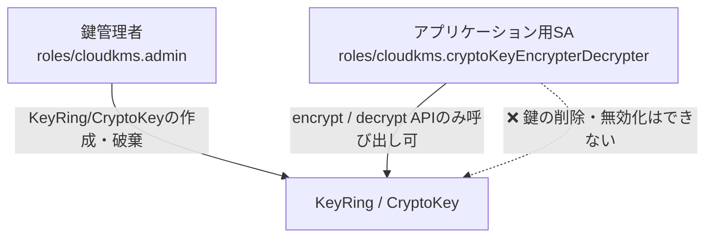

この分離により、「暗号化処理を実装するアプリケーション」が誤って(あるいは侵害された結果)鍵そのものを破壊してしまうリスクを防げます。さらに、上位リソース(プロジェクトのOwnerなど)の権限は下位のKeyRing/CryptoKeyにも継承される点にも注意が必要です。

```bash
# 鍵管理権限を付与
gcloud kms keyrings add-iam-policy-binding $KEYRING_NAME \
    --location global --member user:$USER_EMAIL \
    --role roles/cloudkms.admin

# 暗号化/復号の実行権限を別途付与
gcloud kms keyrings add-iam-policy-binding $KEYRING_NAME \
    --location global --member user:$USER_EMAIL \
    --role roles/cloudkms.cryptoKeyEncrypterDecrypter
```

### 6.5 鍵のライフサイクルと監査

- CryptoKeyとKeyRingは**削除不可**(命名の衝突を防ぐため)。実質的に無効化するには「キーバージョンの破棄(destroy)」を行います。
- 鍵のローテーションは**既存の暗号化データを自動で再暗号化しません**。古いキーバージョンが有効である限り復号は可能ですが、鍵の漏洩が疑われる場合はデータの再暗号化・IAMアクセスの取り消し・キーバージョンの破棄をセットで行う必要があります。
- Cloud Audit Logs(Admin Activity / Data Access)を使うことで「誰が・いつ・どの鍵に対して何をしたか」を追跡できます。

### 6.6 ベストプラクティス

| ✅ 推奨 | ❌ 避けるべき |
|---|---|
| 鍵の管理権限とアプリの暗号化実行権限を別ロールで分離する | 同じサービスアカウントに `cloudkms.admin` と実行権限の両方を渡す |
| 環境やデータの機密度別にKeyRingを分ける | 全環境の鍵を1つのKeyRingに雑多にまとめる |
| 鍵侵害の疑いがある場合はIAMアクセス取り消し+再暗号化+鍵破棄をセットで行う | ローテーションだけすれば安全だと誤解する |
| Cloud Audit Logsで鍵の利用状況を定期的に確認する | 監査ログを見ずに「設定したから安全」で放置する |

---

## Chapter 7: Private GKE クラスタ — Kubernetesのネットワーク隔離

**到達目標レベル: K2(理解)→ K3(適用)**

### 7.1 定義

**Private GKEクラスタ（プライベートクラスター）**とは、クラスタ内のすべての**ノードにパブリックIPを割り当てず、プライベートIPのみを持たせる**ことで、ノードをインターネットから直接露出させずにネットワーク的に隔離したクラスタです。ノードとコントロールプレーン（マスター）間の通信は、自動的に構成される VPC ネットワークピアリングを経由して行われます。

コントロールプレーン側の接続エンドポイントは、以下の設定によってコントロールプレーン自体へのアクセス元を制御します。これらはプライベートノードの構成とは独立して設計されます。

- **プライベートエンドポイント（`--enable-private-endpoint`）**:
  コントロールプレーンにパブリックIPを割り当てず、インターネットからの到達性を完全に遮断します。クラスタの管理（kubectlの実行など）は、同じVPC内、またはVPN/Interconnect等を経由したオンプレミス環境など、内部ネットワークからのみに限定されます。
- **パブリックエンドポイント（デフォルト / `--no-enable-private-endpoint`）**:
  コントロールプレーンにパブリックIPが割り当てられ、外部からも到達可能です。このパブリックIPへの接続は、後述の「Master Authorized Networks（承認済みネットワーク）」で厳密に発信元制限をかけることで安全性を確保します。

### 7.2 なぜノードに外部IPを持たせないのか

通常のKubernetesクラスタでは、ノードが外部IPを持つと、インターネットから直接ノードのポートへアクセスされるリスクが生まれます。プライベートノードにすることで、**攻撃対象領域(Attack Surface)をVPC内部に限定**できます。

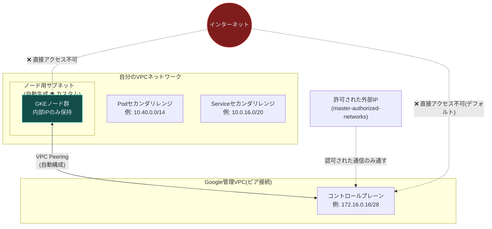

### 7.3 Master Authorized Networks(承認済みネットワーク)

プライベートクラスタでも、管理者はどこかからkubectlでクラスタを操作する必要があります。そこで使うのが**Master Authorized Networks**で、「このCIDR範囲からのみコントロールプレーンへのアクセスを許可する」という許可リストです。

```bash
gcloud container clusters create private-cluster \
    --enable-private-nodes \
    --master-ipv4-cidr 172.16.0.16/28 \
    --enable-ip-alias \
    --create-subnetwork "" \
    --machine-type e2-medium

# 特定の外部IP(例: 自分のVMのNAT IP)だけを許可
gcloud container clusters update private-cluster \
    --enable-master-authorized-networks \
    --master-authorized-networks <MY_EXTERNAL_RANGE>/32
```

### 7.4 パブリックエンドポイントを完全に無効化する `--enable-private-endpoint`

さらにセキュリティレベルを上げたい場合、コントロールプレーンの**パブリックエンドポイント自体を無効化**できます。この設定を行うと、VPC外部からは一切コントロールプレーンに到達できなくなり、同じVPC内の踏み台ホスト(bastion/jumphost)経由でのみ操作可能になります。

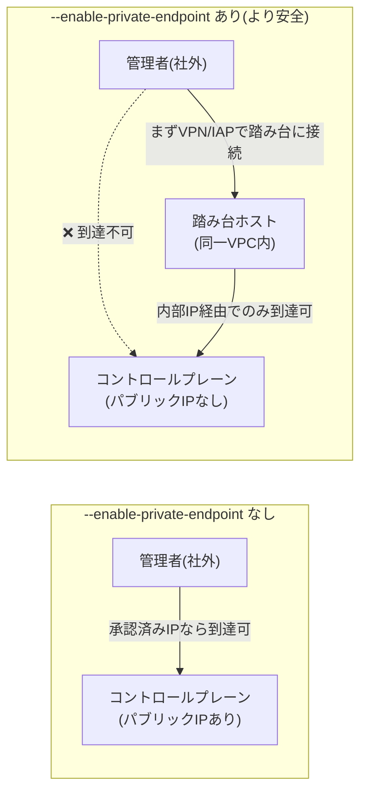

> 📌 **`--internal-ip` フラグを忘れずに**: パブリックエンドポイントを無効化したクラスタでは、`gcloud container clusters get-credentials` の際に `--internal-ip` を付けないと、そもそも存在しないパブリックIPへ接続しようとして失敗します。

### 7.5 カスタムサブネットとセカンダリレンジ

自動生成に任せず、自分でサブネットとセカンダリレンジ(Pod用/Service用)を設計するケースもよくあります。

```bash
gcloud compute networks subnets create my-subnet \
    --network default \
    --range 10.0.4.0/22 \
    --enable-private-ip-google-access \
    --region=$REGION \
    --secondary-range my-svc-range=10.0.32.0/20,my-pod-range=10.4.0.0/14
```

`--enable-private-ip-google-access` を有効にすることで、外部IPを持たないノードでも(パブリックエンドポイント経由の)Google API群に到達できるようになります。

### 7.6 ベストプラクティス

| ✅ 推奨 | ❌ 避けるべき |
|---|---|
| 本番クラスタは `--enable-private-nodes` を基本設定にする | ノードに外部IPを持たせたまま本番運用する |
| 機密性の高いワークロードは `--enable-private-endpoint` も検討する | パブリックエンドポイントを無条件に許可し続ける |
| Master Authorized Networksは `/32` などできるだけ狭い範囲で許可する | `0.0.0.0/0` のような広すぎる範囲を許可してしまう |
| IPアドレス計画を事前に立て、他のVPC/オンプレと重複しないようにする | セカンダリレンジを行き当たりばったりで割り当てる |

---

## Chapter 8: 総合演習 — 全レイヤーを統合したセキュアなクラスタ設計

**到達目標レベル: K3(適用)**

ここまでの7つの要素(IAM基礎/カスタムロール/サービスアカウント/VPC Peering/IAP/KMS/Private GKE)を統合すると、実際の「チャレンジラボ」で問われるような設計課題を解けるようになります。題材は、架空の企業「Jooli Inc.」のOrcaチームが、開発チーム向けに安全なGKEクラスタを構築するというシナリオです。

### 8.1 要件の整理

| # | 要件 | 対応するChapter |
|---|---|---|
| 1 | クラスタは専用の最小権限サービスアカウントを使う | Chapter 3(サービスアカウント) |
| 2 | Storage操作用にカスタムロールを作成し、SAへバインドする | Chapter 2(カスタムロール) |
| 3 | クラスタはPrivateクラスタとし、パブリックエンドポイントも無効化する | Chapter 7(Private GKE) |
| 4 | Master Authorized Networksには管理用jumphostのIPだけを登録する | Chapter 7(Private GKE) |
| 5 | クラスタは指定のカスタムサブネット(orca-build-subnet)に配置する | Chapter 7 / VPC設計 |
| 6 | jumphostからkubectlでの疎通を確認する | Chapter 4(VPC設計)+ Chapter 7 |

### 8.2 統合アーキテクチャ図

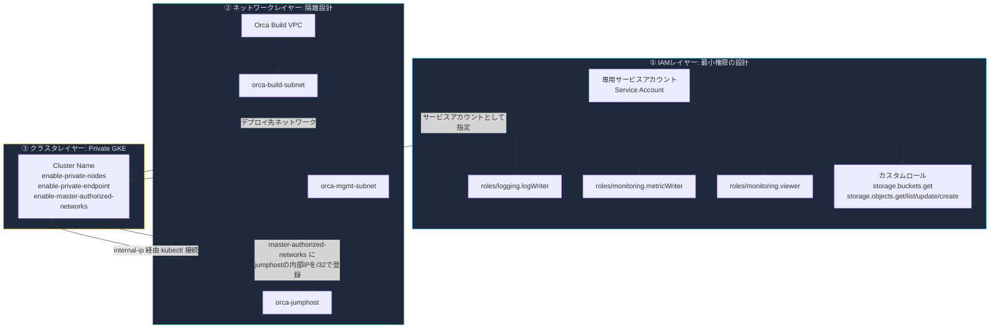

### 8.3 手順の骨格(gcloudコマンド抜粋)

```bash
# 1. カスタムロールの作成(Storage操作に限定)
gcloud iam roles create orca_custom_role \
    --project $DEVSHELL_PROJECT_ID \
    --title "Custom Security Role" \
    --permissions storage.buckets.get,storage.objects.get,storage.objects.list,storage.objects.update,storage.objects.create

# 2. 専用サービスアカウントの作成
gcloud iam service-accounts create orca-sa --display-name "orca-cluster-sa"

# 3. 3つの組込みロール + カスタムロールをバインド
gcloud projects add-iam-policy-binding $DEVSHELL_PROJECT_ID \
    --member="serviceAccount:orca-sa@$DEVSHELL_PROJECT_ID.iam.gserviceaccount.com" \
    --role="roles/monitoring.viewer"
# (monitoring.metricWriter / logging.logWriter / カスタムロールも同様に付与)

# 4. Privateクラスタの作成(パブリックエンドポイントも無効化)
gcloud container clusters create orca-cluster-name \
    --service-account=orca-sa@$DEVSHELL_PROJECT_ID.iam.gserviceaccount.com \
    --subnetwork=orca-build-subnet \
    --enable-private-nodes \
    --enable-private-endpoint \
    --enable-master-authorized-networks \
    --enable-ip-alias \
    --zone=ZONE

# 5. jumphostの内部IPをMaster Authorized Networksに追加
gcloud container clusters update orca-cluster-name \
    --enable-master-authorized-networks \
    --master-authorized-networks=<JUMPHOST_INTERNAL_IP>/32 \
    --zone=ZONE

# 6. jumphostから internal-ip 経由で認証情報を取得
gcloud container clusters get-credentials orca-cluster-name \
    --internal-ip --zone=ZONE --project=$DEVSHELL_PROJECT_ID

# 7. 疎通テスト用の簡易アプリをデプロイ
kubectl create deployment hello-server --image=gcr.io/google-samples/hello-app:1.0
```

### 8.4 このシナリオが示す設計原則

1. **権限は役割ごとに最小の粒度で分離する**(監視用の組込みロール3つ + Storage操作用のカスタムロール1つ、を1つのSAにまとめて必要十分な権限を構成)
2. **ネットワークの露出面を段階的に絞り込む**(ノードのプライベート化 → パブリックエンドポイント無効化 → 許可IPの`/32`限定)
3. **管理経路自体も専用の踏み台(jumphost)に限定する**ことで、「誰が」「どこから」触れるかを一箇所に集約する

この3つはそれぞれ Chapter 1〜3(IAM)、Chapter 4〜5(ネットワーク露出)、Chapter 7(クラスタ隔離)で学んだ内容の応用そのものです。

---

## ベストプラクティス総まとめ表

| レイヤー | 原則 | 具体的な実践 |
|---|---|---|
| IAM全般 | 最小権限の原則 | 基本ロールを避け、事前定義ロール/カスタムロールで必要な権限だけを付与する |
| カスタムロール | 変更管理の徹底 | etagで競合を防ぎ、廃止時はDEPRECATEDで移行猶予を設ける |
| サービスアカウント | ID/リソースの分離設計 | ワークロードごとに専用SAを作り、「誰が使えるか」と「何ができるか」を別々に管理する |
| VPC Peering | 双方向合意の原則 | 両側の管理者が明示的に接続を作成した場合のみ有効化される設計を活用し、IP設計を事前に行う |
| IAP | ゼロトラスト | ネットワーク境界ではなくIDを信頼の基準にし、機密データはJWT署名検証まで行う |
| Cloud KMS | 権限分離 | 鍵の管理者と利用者のロールを分け、侵害時は「取り消し+再暗号化+鍵破棄」をセットで行う |
| Private GKE | 露出面の最小化 | ノードのプライベート化、パブリックエンドポイントの無効化、承認済みネットワークの`/32`運用を段階的に組み合わせる |
| 全体 | 監査可能性 | Cloud Audit Logsで「誰が・いつ・何を」変更したかを常に追跡できる状態を保つ |

---

## 参考文献 / 公式ドキュメント一覧

### IAM基礎・カスタムロール・サービスアカウント

- IAM overview — https://cloud.google.com/iam/docs/overview
- Roles and permissions(基本ロール・事前定義ロール) — https://cloud.google.com/iam/docs/roles-overview
- Create and manage custom roles — https://cloud.google.com/iam/docs/creating-custom-roles
- Service accounts overview — https://cloud.google.com/iam/docs/service-account-overview
- Quickstart: Grant an IAM role — https://cloud.google.com/iam/docs/grant-role-console
- Access control for organization resources(etag / Read-Modify-Write) — https://cloud.google.com/resource-manager/docs/access-control-org
- gcloud iam roles リファレンス — https://cloud.google.com/sdk/gcloud/reference/iam/roles

### VPC Network Peering

- VPC Network Peering 概要 — https://cloud.google.com/vpc/docs/vpc-peering
- Set up and manage VPC Network Peering — https://cloud.google.com/vpc/docs/using-vpc-peering
- About peering connections(接続モード・状態) — https://cloud.google.com/vpc/docs/about-peering-connections
- VPC networks overview — https://cloud.google.com/vpc/docs/vpc

### Identity-Aware Proxy (IAP)

- IAP overview(概念) — https://cloud.google.com/iap/docs/concepts-overview
- IAP documentation トップ — https://cloud.google.com/iap/docs
- Using IAP for TCP forwarding — https://cloud.google.com/iap/docs/using-tcp-forwarding
- IAP Concepts一覧(ベストプラクティス等へのリンク集) — https://cloud.google.com/iap/docs/concepts

### Cloud KMS

- Cloud Key Management Service overview — https://cloud.google.com/kms/docs/key-management-service
- Cloud KMS resources(KeyRing / CryptoKey の構造) — https://cloud.google.com/kms/docs/resource-hierarchy
- Cloud KMS FAQ(削除不可・ローテーションの挙動など) — https://cloud.google.com/kms/docs/faq
- Cloud KMS documentation トップ — https://cloud.google.com/kms/docs

### Private GKE クラスタ

- Best practices for GKE networking — https://cloud.google.com/kubernetes-engine/docs/best-practices/networking
- About network isolation in GKE(承認済みネットワーク等) — https://cloud.google.com/kubernetes-engine/docs/how-to/authorized-networks
- Best practices for hardening your cluster's security(最小権限SAの指針) — https://cloud.google.com/kubernetes-engine/docs/how-to/hardening-your-cluster
- GKE security overview — https://cloud.google.com/kubernetes-engine/docs/concepts/security-overview
- Protecting cluster metadata(ノード用最小権限SAの作り方) — https://cloud.google.com/kubernetes-engine/docs/how-to/protecting-cluster-metadata

---

> 📝 **このガイドの使い方**: 各Chapterは独立して読めるように書いていますが、Chapter 8(総合演習)で全体がどうつながるかを体感すると、点在していた知識が線になります。実際に自分のプロジェクトで手を動かしながら、各表の「✅ 推奨」列をチェックリストとして使ってみてください。