# Google Cloud Professional Cloud Architect（PCA）認定試験 完全対策ガイド

> 本ガイドはGoogle Cloud公式の[認定ページ](https://cloud.google.com/learn/certification/cloud-architect)および[公式Exam Guide PDF](https://services.google.com/fh/files/misc/professional_cloud_architect_exam_guide_english.pdf)（2025年改訂版）の出題範囲に厳密に対応して構成しています。初学者の方でも迷わず学習できるよう、各項目を「何を問われるか」「関連するGoogle Cloudサービス」「試験で問われやすいベストプラクティス」の3点セットで解説します。

## 目次

- [この試験について](#この試験について)
  - [試験の基本情報](#試験の基本情報)
  - [出題セクションと配点](#出題セクションと配点)
  - [Google Cloud Well-Architected Framework（WAF）を理解することが合格の鍵](#google-cloud-well-architected-frameworkwafを理解することが合格の鍵)
  - [ケーススタディの扱い方](#ケーススタディの扱い方)
- [Section 1: クラウドソリューションアーキテクチャの設計と計画（約25%）](#section-1-クラウドソリューションアーキテクチャの設計と計画約25)
  - [1.1 ビジネス要件を満たすクラウドソリューションインフラの設計](#11-ビジネス要件を満たすクラウドソリューションインフラの設計)
  - [1.2 技術要件を満たすクラウドソリューションインフラの設計](#12-技術要件を満たすクラウドソリューションインフラの設計)
  - [1.3 ネットワーク・ストレージ・コンピューティングリソースの設計](#13-ネットワークストレージコンピューティングリソースの設計)
  - [1.4 移行計画の作成](#14-移行計画の作成)
  - [1.5 将来の解決策の改善を見据える](#15-将来の解決策の改善を見据える)
- [Section 2: クラウドソリューションインフラの管理とプロビジョニング（約17.5%）](#section-2-クラウドソリューションインフラの管理とプロビジョニング約175)
  - [2.1 ネットワークトポロジの構成](#21-ネットワークトポロジの構成)
  - [2.2 個別ストレージシステムの構成](#22-個別ストレージシステムの構成)
  - [2.3 コンピュートシステムの構成](#23-コンピュートシステムの構成)
  - [2.4 Gemini Enterprise Agent Platformを活用したエンドツーエンドMLワークフロー](#24-gemini-enterprise-agent-platformを活用したエンドツーエンドmlワークフロー)
  - [2.5 Agent Platformでの事前構築ソリューション・APIの構成](#25-agent-platformでの事前構築ソリューションapiの構成)
- [Section 3: セキュリティとコンプライアンスの設計（約17.5%）](#section-3-セキュリティとコンプライアンスの設計約175)
  - [3.1 セキュリティの設計](#31-セキュリティの設計)
  - [3.2 コンプライアンスの設計](#32-コンプライアンスの設計)
- [Section 4: 技術・ビジネスプロセスの分析と最適化（約15%）](#section-4-技術ビジネスプロセスの分析と最適化約15)
  - [4.1 技術プロセスの分析と定義](#41-技術プロセスの分析と定義)
  - [4.2 ビジネスプロセスの分析と定義](#42-ビジネスプロセスの分析と定義)
- [Section 5: 実装の管理（約12.5%）](#section-5-実装の管理約125)
  - [5.1 開発・運用チームへのアドバイスによるソリューションの確実なデプロイ](#51-開発運用チームへのアドバイスによるソリューションの確実なデプロイ)
  - [5.2 Google Cloudとのプログラム的なやり取り](#52-google-cloudとのプログラム的なやり取り)
- [Section 6: ソリューションと運用の卓越性の確保（約12.5%）](#section-6-ソリューションと運用の卓越性の確保約125)
  - [6.1 Well-Architected Frameworkの運用の卓越性の柱](#61-well-architected-frameworkの運用の卓越性の柱)
  - [6.2 Google Cloud Observabilityソリューションへの精通](#62-google-cloud-observabilityソリューションへの精通)
  - [6.3 デプロイとリリース管理](#63-デプロイとリリース管理)
  - [6.4 デプロイ済みソリューションのサポート支援](#64-デプロイ済みソリューションのサポート支援)
  - [6.5 品質管理措置の評価](#65-品質管理措置の評価)
  - [6.6 本番環境における信頼性の確保](#66-本番環境における信頼性の確保)
- [学習チェックリスト](#学習チェックリスト)
- [まとめ: 合格のための5つの原則](#まとめ-合格のための5つの原則)
- [参考文献](#参考文献)

---

## この試験について

Professional Cloud Architect（PCA）は、Google Cloudの技術を活用して**堅牢・安全・スケーラブル・効率的・費用対効果が高く・可用性が高く・柔軟な**ソリューションを設計・開発・管理できる能力を証明する認定資格です。単なるサービスの知識だけでなく、**ビジネス要件を技術要件に翻訳する力**が問われる点が最大の特徴です。

### 試験の基本情報

| 項目 | 内容 |
|---|---|
| 試験時間 | 2時間 |
| 受験料 | $200（税別） |
| 出題形式 | 選択式・複数選択式 50〜60問 |
| 言語 | 英語・日本語 |
| ケーススタディ | 2つ（出題全体の20〜30%を占める） |
| 有効期間 | 2年間 |
| 前提条件 | なし（推奨: 業界経験3年以上、うちGoogle Cloudでの設計・運用経験1年以上） |

> **出典**: [Professional Cloud Architect Certification｜Google Cloud](https://cloud.google.com/learn/certification/cloud-architect)

### 出題セクションと配点

公式Exam Guideでは、試験は6つの大分類（セクション）に分かれており、それぞれに出題比率が明示されています。まずは全体像を掴みましょう。

| セクション | 出題比率 | テーマ |
|---|---|---|
| 1. クラウドソリューションアーキテクチャの設計と計画 | 約25% | 要件分析、WAF、ネットワーク/ストレージ/コンピュート設計、移行計画 |
| 2. クラウドソリューションインフラの管理とプロビジョニング | 約17.5% | ネットワーク構成、ストレージ構成、コンピュート構成、AI/MLプラットフォーム |
| 3. セキュリティとコンプライアンスの設計 | 約17.5% | IAM、リソース階層、データセキュリティ、コンプライアンス |
| 4. 技術・ビジネスプロセスの分析と最適化 | 約15% | SDLC、CI/CD、ステークホルダー管理、コスト最適化 |
| 5. 実装の管理 | 約12.5% | デプロイ支援、IaC、Google Cloud SDK/API活用 |
| 6. ソリューションと運用の卓越性の確保 | 約12.5% | Observability、リリース管理、信頼性テスト |

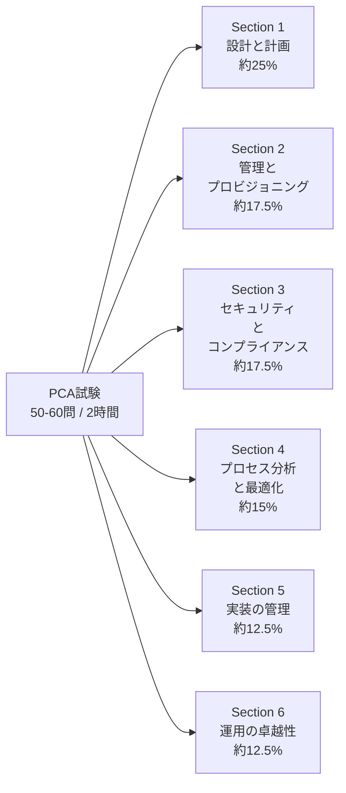

> **出典**: [Professional Cloud Architect Exam Guide（PDF）](https://services.google.com/fh/files/misc/professional_cloud_architect_exam_guide_english.pdf)

### Google Cloud Well-Architected Framework（WAF）を理解することが合格の鍵

公式Exam Guideは、**Well-Architected Frameworkへの精通が本資格の中核要件である**と明言しています。6つの柱（Pillar）は試験全体に暗黙的・明示的に織り込まれているため、最初に押さえておくべき土台です。

| 柱（Pillar） | 概要 | 代表的な問い |
|---|---|---|
| 運用の卓越性（Operational Excellence） | 効率的な運用・デプロイ・モニタリングの仕組み | 障害発生時に迅速に検知・復旧できるか |
| セキュリティ（Security） | 情報・システム・資産の保護 | 最小権限が徹底されているか |
| 信頼性（Reliability） | 期待通りに一貫して機能し続ける能力 | 単一障害点(SPOF)は排除されているか |
| パフォーマンス最適化（Performance Optimization） | リソースを効率的に活用し要件を満たす | リージョン選定やキャッシュ戦略は適切か |
| コスト最適化（Cost Optimization） | 不要な支出を避け価値を最大化 | 過剰プロビジョニングはないか |
| 持続可能性（Sustainability） | 環境負荷を最小化する設計 | リージョン選択でカーボンフットプリントを考慮したか |

> **ベストプラクティス**: 試験問題の多くは「どの選択肢が最もコストが低いか」ではなく「ビジネス要件と技術要件の両方を満たしつつ、WAFの複数の柱をバランスよく満たす選択肢はどれか」を問う設計になっています。単一の正解軸（例：コストだけ）で選択肢を絞り込まないようにしましょう。
>
> **出典**: [Google Cloud Architecture Framework](https://cloud.google.com/architecture/framework)

### ケーススタディの扱い方

試験問題の20〜30%は、**架空の企業のビジネス背景・既存システム・技術要件・将来要件**を記述したケーススタディに基づいて出題されます。試験中は分割画面でケーススタディを参照できます。

| ケーススタディ | 業種 |
|---|---|
| Altostrat Media | メディア |
| Cymbal Retail | 小売 |
| EHR Healthcare | ヘルスケア |
| KnightMotives Automotive | 自動車 |

> **ベストプラクティス**: 試験前に4つのケーススタディを一度読み込んでおくと、本番で「このケーススタディはこういう制約がある会社だ」とすぐに思い出せて時間短縮になります。ケーススタディ関連の問題は、一般知識だけで解こうとせず、必ず「この企業の制約・目標に照らして最適な選択肢はどれか」という視点で選びましょう。
>
> **出典**: [Professional Cloud Architect Exam Guide（PDF）](https://services.google.com/fh/files/misc/professional_cloud_architect_exam_guide_english.pdf)

---

## Section 1: クラウドソリューションアーキテクチャの設計と計画（約25%）

試験全体で最も配点が高いセクションです。5つのタスク（1.1〜1.5）に分かれており、「ビジネス要件」「技術要件」「リソース設計」「移行計画」「将来構想」という設計の一連の流れを問われます。

### 1.1 ビジネス要件を満たすクラウドソリューションインフラの設計

アーキテクトの仕事は技術選定の前に「何を達成したいのか」を正しく定義することから始まります。このタスクでは、ビジネス側の要求を技術設計に落とし込む力が問われます。

**押さえるべき考慮事項**

- ビジネスユースケースとプロダクト戦略
- 機能要件と非機能要件の識別
- ビジネス継続計画（BCP）
- コスト最適化
- アプリケーション設計のサポート
- 外部システムとの統合パターン
- データの移動
- 設計判断のトレードオフ
- ワークロード処遇戦略（構築・購入・改修・廃止）
- 成功指標（KPI、ROI、メトリクス）
- セキュリティとコンプライアンス
- Observability（可観測性）

**機能要件 vs 非機能要件**

| 種別 | 定義 | 具体例 |
|---|---|---|
| 機能要件 | システムが「何をするか」 | ユーザー登録機能、決済処理、レポート出力 |
| 非機能要件 | システムが「どのように動作するか」 | 可用性99.99%、レイテンシ200ms以下、月間コスト上限 |

> **ベストプラクティス**: 非機能要件（特に可用性・レイテンシ・コスト上限）を先に数値化してから設計に入ると、後工程での手戻りを防げます。試験問題でも「〇〇msのレイテンシ要件がある」「予算は月額〇〇ドル以内」といった非機能要件が正解を絞り込む決め手になることが多いです。

**ワークロード処遇戦略（Disposition Strategy）**

既存システムをクラウド化する際、すべてを同じ方法で移行する必要はありません。

| 戦略 | 内容 | 適するケース |
|---|---|---|
| Build（構築） | クラウドネイティブに新規開発 | 差別化価値の高いコア機能 |
| Buy（購入） | SaaS/マーケットプレイス製品を採用 | 汎用的な業務機能（CRM等） |
| Modify（改修） | 既存資産を一部改修して移行 | レガシーだが刷新コストが見合わないシステム |
| Deprecate（廃止） | 利用停止・統合 | 重複機能や利用実績のないシステム |

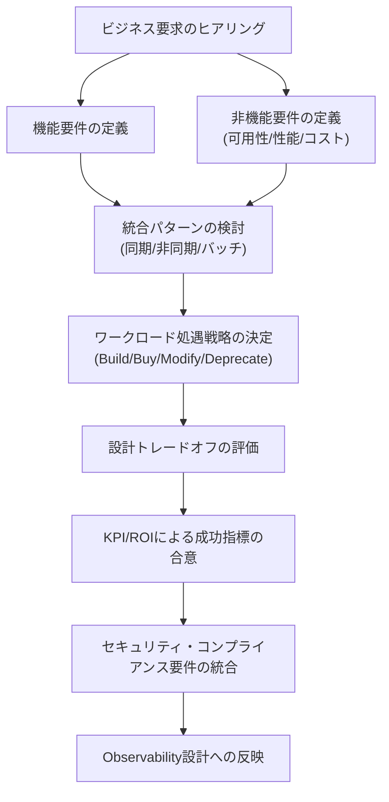

**統合パターン**: 外部システムとの連携は、同期API呼び出しだけでなく、Pub/Subによる非同期メッセージング、Eventarcによるイベント駆動連携、Cloud Data Fusion/Dataflowによるバッチ・ストリーミング統合など、要件に応じた選択が必要です。

> **ベストプラクティス**: システム間の結合度を下げたい場合はPub/Subなどの非同期メッセージングを優先します。強い一貫性が必要な同期的トランザクションにのみ同期APIを使うと、可用性・拡張性の両面で有利になります。
>
> **出典**: [Google Cloud Architecture Framework: システム設計の考慮事項](https://cloud.google.com/architecture/framework/system-design) / [アプリケーション統合の設計パターン](https://cloud.google.com/architecture/application-integration)

### 1.2 技術要件を満たすクラウドソリューションインフラの設計

ビジネス要件が固まったら、それを実現する技術アーキテクチャに落とし込みます。

**押さえるべき考慮事項**

- Well-Architected Frameworkへの精通
- 高可用性（HA）とフェイルオーバー設計
- クラウドリソースの柔軟性
- 成長要件を満たすスケーラビリティ
- パフォーマンスとレイテンシ
- Gemini Cloud Assist
- バックアップとリカバリ

**高可用性設計の基本パターン**

Google Cloudのリソース階層（リージョン・ゾーン）を理解することがHA設計の出発点です。

| 障害範囲 | 対策 | 実現手段の例 |
|---|---|---|
| ゾーン障害 | マルチゾーン構成 | リージョナルMIG（マネージドインスタンスグループ）、リージョナルGKEクラスタ |
| リージョン障害 | マルチリージョン構成 | グローバル外部ロードバランサ＋複数リージョンのバックエンド、Spannerのマルチリージョン構成 |
| データ損失 | バックアップ/レプリケーション | Cloud SQLの自動バックアップ＋ポイントインタイムリカバリ、Cloud Storageのマルチリージョンバケット |
| ゾーン内の単一VM障害 | 自動再起動/自動修復 | Compute Engineの自動再起動、MIGのヘルスチェック自動修復 |

**RPO/RTOという2軸で考える**

バックアップ・リカバリ設計では、次の2つの指標を要件として明確化することが出発点です。

| 指標 | 意味 | 短くするための代表的な手段 |
|---|---|---|
| RPO（目標復旧時点） | どこまでデータ損失を許容できるか | 高頻度スナップショット、非同期/同期レプリケーション |
| RTO（目標復旧時間） | どれだけ早くサービスを復旧させる必要があるか | ホットスタンバイ、自動フェイルオーバー、Infrastructure as Codeによる即時再構築 |

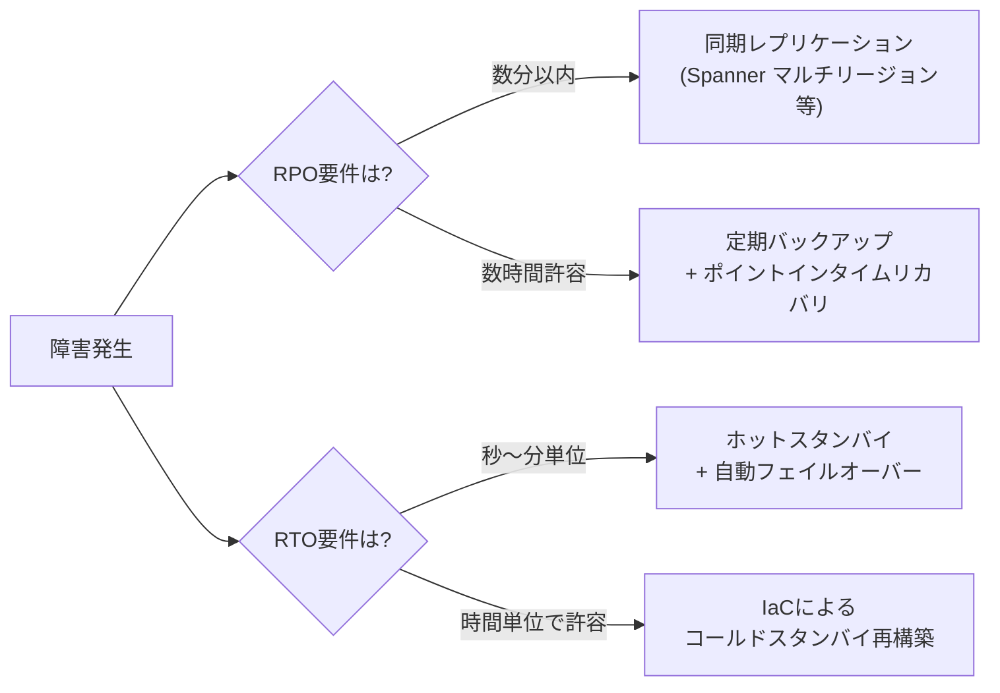

> **ベストプラクティス**: 「可用性を上げる＝コストを上げる」という単純な二項対立ではなく、RPO/RTO要件に対して**過剰でも過小でもない**設計を選ぶことが試験・実務双方で評価されます。全システムを常にマルチリージョン構成にする必要はありません。

**Gemini Cloud Assist**: コンソールやコード内でGoogle Cloudのアーキテクチャ提案・トラブルシューティング・コスト分析を支援するAIアシスタント機能です。設計レビューや既存環境の問題診断を効率化する目的で近年の出題範囲に追加されました。

> **出典**: [信頼性の柱 - Architecture Framework](https://cloud.google.com/architecture/framework/reliability) / [Gemini Cloud Assist の概要](https://cloud.google.com/gemini/docs/cloud-assist/overview) / [Disaster recovery planning guide](https://cloud.google.com/architecture/dr-scenarios-planning-guide)

### 1.3 ネットワーク・ストレージ・コンピューティングリソースの設計

具体的なリソース選定に踏み込むタスクです。PCAの出題の中でも実務的な判断力が最も問われる領域といえます。

**クラウドネイティブネットワーキングの基本構成要素**

| 要素 | 役割 |
|---|---|
| VPC（Virtual Private Cloud） | 1つのプロジェクト内で利用するグローバルな仮想ネットワーク |
| VPCピアリング | 2つのVPC間をGoogleのバックボーンnet経由で直接接続（推移的接続不可） |
| Shared VPC（共有VPC） | ホストプロジェクトのVPCを複数のサービスプロジェクトから共有利用 |
| Private Service Connect（PSC） | VPCを跨いでプライベートIPのみでサービスに接続する仕組み |
| Cloud Load Balancing | グローバル/リージョナル、外部/内部のロードバランサ群 |
| 階層型ファイアウォールポリシー | Organization/Folderレベルで一括適用するファイアウォールルール |

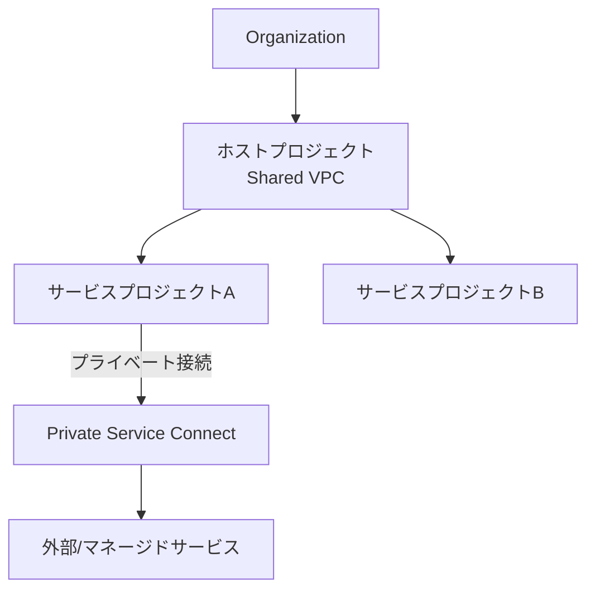

> **ベストプラクティス**: 複数チーム・複数プロジェクトでネットワークを一元管理したい場合はShared VPCが定石です。VPCピアリングは推移性がない（AとBが繋がり、BとCが繋がっていても、AとCは自動的には繋がらない）点が頻出の引っかけポイントです。多数のVPCを相互接続したい場合はVPCピアリングの組み合わせよりもNetwork Connectivity Center（NCC）のハブ&スポーク構成を検討します。

**コンピュートプラットフォームの選定（決定木）**

「どのワークロードをどのコンピュートサービスに載せるか」は頻出テーマです。

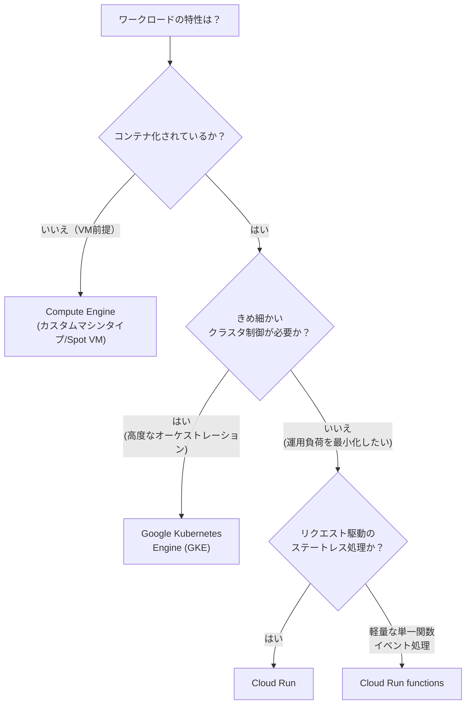

| サービス | 適するケース | 運用負荷 |
|---|---|---|
| Compute Engine | レガシーアプリの移行、特殊なOS/カーネル要件、GPU/TPUを直接制御 | 高（自己管理） |
| GKE | マイクロサービス基盤、マルチクラウド前提、複雑なオーケストレーション要件 | 中（Autopilotなら低） |
| Cloud Run | コンテナ化されたステートレスAPI/Webサービス | 低（フルマネージド） |
| Cloud Run functions | 単発イベント処理、軽量な関数実行 | 最低（フルマネージド） |

**ストレージタイプの選定**

| ストレージ種別 | サービス例 | 適するユースケース |
|---|---|---|
| オブジェクトストレージ | Cloud Storage | 静的コンテンツ、バックアップ、データレイク |
| ファイルストレージ | Filestore | 共有ファイルシステムが必要なレガシーアプリ、HPC |
| ブロックストレージ | Persistent Disk、Local SSD | VMのOS/データディスク、高IOPS要件 |
| リレーショナルDB（トランザクション） | Cloud SQL、AlloyDB | 一般的なOLTP、PostgreSQL互換の高性能要件 |
| グローバル分散RDB | Spanner | グローバル規模の強整合性トランザクション |
| NoSQL（ドキュメント） | Firestore | モバイル/Webアプリのリアルタイムデータ |
| NoSQL（ワイドカラム） | Bigtable | 大規模・低レイテンシの時系列/IoTデータ |
| 分析用DWH | BigQuery | ペタバイト級の分析クエリ |
| インメモリ | Memorystore | セッションキャッシュ、リアルタイムランキング |

> **ベストプラクティス**: 「強整合性が必要かつグローバル分散か」→Spanner、「PostgreSQL互換で垂直スケールが必要」→AlloyDB、「スキーマレスでモバイルからのリアルタイム同期が必要」→Firestore、という対応関係は頻出です。単に「NoSQLだから」という理由だけでBigtableとFirestoreを混同しないよう、アクセスパターン（単一エンティティの高頻度読み書きか、大規模スキャン分析か）で判断しましょう。

**AI/MLソリューションの位置づけ**: Gemini LLM、Agent Builder、Model Garden、Gemini modelsといった生成AI関連サービスや、大規模学習・推論基盤であるAI Hypercomputerも設計対象に含まれます（詳細はSection 2.4/2.5で扱います）。

> **出典**: [VPCの概要](https://cloud.google.com/vpc/docs/vpc) / [Shared VPCの概要](https://cloud.google.com/vpc/docs/shared-vpc) / [Private Service Connectの概要](https://cloud.google.com/vpc/docs/private-service-connect) / [ストレージオプションの選択](https://cloud.google.com/architecture/storage-options) / [コンピュートオプションの選択](https://cloud.google.com/architecture/compute-options)

### 1.4 移行計画の作成

既存システムをGoogle Cloudに移行するためのドキュメント・アーキテクチャ図の作成方法が問われます。

**Google Cloud Migration Center**: オンプレミス/他クラウド資産を可視化し、移行の評価・計画・コスト試算を支援するツールです。移行対象のインベントリ作成からTCO試算、移行戦略の提案までを一元的にサポートします。

**移行の標準的な進め方**

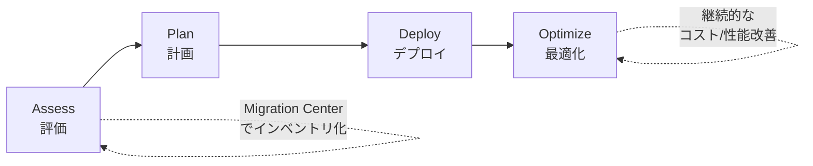

| フェーズ | 主な活動 |
|---|---|
| Assess（評価） | 既存資産の棚卸し、依存関係マッピング、TCO試算 |
| Plan（計画） | 移行方式（リホスト/リプラットフォーム/リファクタ等）の決定、ネットワーク計画、移行順序の決定 |
| Deploy（デプロイ） | ワークロードの移行実行、データ移行、切替テスト |
| Optimize（最適化） | パフォーマンスチューニング、コスト最適化、運用プロセスの定着 |

**考慮すべき事項**

- 既存システムとの統合（移行期間中のハイブリッド運用）
- ワークロードテスト、ネットワーク計画、依存関係計画
- ソフトウェアライセンスへの影響（BYOL、ソケット/コア課金体系の違い）と財務的インパクト

> **ベストプラクティス**: 移行計画では「一度に全部切り替える」ビッグバン移行よりも、依存関係の少ないワークロードから段階的に移行するアプローチがリスクを抑えられます。ネットワーク帯域や既存システムとの接続要件（ハイブリッド接続）を移行計画の初期段階で明確化しておくことが、後工程の手戻りを防ぐ鍵です。
>
> **出典**: [Migration Centerの概要](https://cloud.google.com/migration-center/docs/migration-center-overview) / [クラウド移行の基本ガイド](https://cloud.google.com/architecture/migration-to-google-cloud-building-your-foundation)

### 1.5 将来の解決策の改善を見据える

クラウドは一度作って終わりではなく、継続的に進化させる前提で設計します。

- クラウド・テクノロジーの進化への追従（新サービス、新料金体系、新リージョンの活用）
- ビジネスニーズの変化への対応（スケール変化、新規事業要件）
- クラウドファーストな設計アプローチ（オンプレミス前提の制約に縛られない設計判断）

> **ベストプラクティス**: 設計時点で「将来この部分をどう進化させられるか」を疎結合なアーキテクチャ（マイクロサービス化、IaC化、抽象化されたAPI境界）によって担保しておくと、将来の技術更新をシステム全体の作り直しなしに取り込めます。
>
> **出典**: [Google Cloud Architecture Center](https://cloud.google.com/architecture)

---

## Section 2: クラウドソリューションインフラの管理とプロビジョニング（約17.5%）

Section 1で設計したアーキテクチャを、実際にどう構成・プロビジョニングするかを問うセクションです。

### 2.1 ネットワークトポロジの構成

**押さえるべき考慮事項**

- オンプレミス環境への拡張（ハイブリッドネットワーキング）
- マルチクラウド環境への拡張（Google Cloud間通信を含む）
- セキュリティ保護（侵入防御、アクセス制御、ファイアウォール）
- VPC設計とロードバランシング

**ハイブリッド/マルチクラウド接続の選択肢**

| 接続方式 | 帯域/用途 | 特徴 |
|---|---|---|
| Cloud VPN（HA VPN） | トンネルあたり最大250,000pps（平均パケットサイズにより約1〜3Gbps） | インターネット経由のIPsec暗号化トンネル。実効帯域はパケットサイズなどに依存 |
| Dedicated Interconnect | VLAN attachmentあたり50Mbps〜400Gbps | 物理回線容量（10/100Gbps回線など）とVLAN attachment容量を分けて設計する |
| Partner Interconnect | VLAN attachmentあたり50Mbps〜50Gbps | パートナー回線とVLAN attachmentの容量を分けて設計する |
| Cross-Cloud Interconnect | 接続先ごとにAWS/OCIは最大400Gbps、Azure/Alibaba Cloudは最大100Gbps | 他クラウドプロバイダとの専用接続。接続先と構成により上限が異なる |
| Network Connectivity Center（NCC） | — | ハブ&スポーク型で複数拠点/複数クラウドを一元的にオーケストレーション |

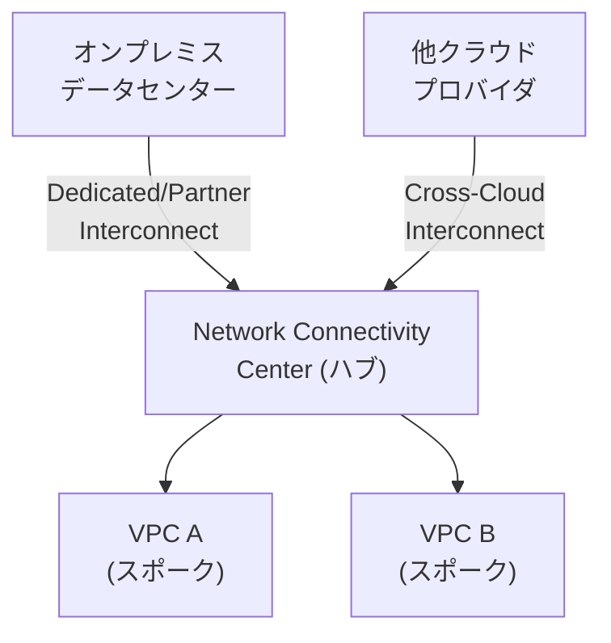

**セキュリティ保護**: Cloud Armor（WAF/DDoS対策）、階層型ファイアウォールポリシー、Cloud IDS（侵入検知）などをネットワーク層に組み込みます。

> **ベストプラクティス**: 帯域とSLAの要件が明確な基幹接続にはDedicated/Partner Interconnectを、多数の拠点・クラウドを段階的に統合したい場合はNCCのハブ&スポーク構成を優先します。VPNは構築の速さと引き換えに帯域・レイテンシの制約があるため、恒久的な大容量接続には不向きです。
>
> **出典**: [ハイブリッド接続の概要](https://cloud.google.com/hybrid-connectivity) / [Cloud Interconnect FAQ](https://cloud.google.com/network-connectivity/docs/interconnect/support/faq) / [Network Connectivity Centerの概要](https://cloud.google.com/network-connectivity-center/docs/overview)

### 2.2 個別ストレージシステムの構成

**押さえるべき考慮事項**

- データストレージの割り当て
- データ処理とコンピュートのプロビジョニング
- セキュリティとアクセス管理
- データ転送・レイテンシの構成
- データ保持とライフサイクル管理
- データ成長の計画
- データ保護（バックアップ・リカバリ）

**ライフサイクル管理の例（Cloud Storage）**

| 用途 | ストレージクラス | 想定アクセス頻度 |
|---|---|---|
| 頻繁にアクセス | Standard | 月に複数回以上 |
| 月1回程度 | Nearline | 30日に1回未満 |
| 四半期に1回程度 | Coldline | 90日に1回未満 |
| 長期アーカイブ | Archive | 年1回未満 |

> **ベストプラクティス**: Object Lifecycle Managementルールを使い、経過日数に応じて自動的にStandard→Nearline→Coldline→Archiveへ移行させることで、手動運用なしにストレージコストを継続的に最適化できます。データ保護の観点では、リージョナルではなくマルチリージョン/デュアルリージョンバケットを使うことでリージョン障害時の耐性を高められます。
>
> **出典**: [Cloud Storageクラスの選択](https://cloud.google.com/storage/docs/storage-classes) / [オブジェクトのライフサイクル管理](https://cloud.google.com/storage/docs/lifecycle)

### 2.3 コンピュートシステムの構成

**押さえるべき考慮事項**

- コンピュートリソースのプロビジョニング
- コンピュートの揮発性設定（Spot vs 標準）
- コンピュートリソースのクラウドネイティブなネットワーク構成（Compute Engine、GKE、サーバーレス、Google Cloud VMware Engine）
- インフラのオーケストレーション、リソース構成、パッチ管理
- コンテナオーケストレーション
- サーバーレスコンピューティング

**Spot VM vs 標準VM**

| 項目 | 標準VM | Spot VM |
|---|---|---|
| 価格 | 定価 | 大幅割引（60〜91%程度） |
| 中断リスク | なし | あり（Googleが容量を必要とする際に30秒前通知で中断） |
| 適するワークロード | 本番の常時稼働サービス | バッチ処理、フォールトトレラントな分散処理、CI/CD |

**IaCによるプロビジョニングとパッチ管理の標準フロー**

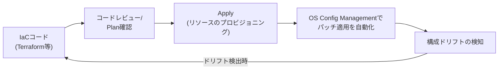

> **ベストプラクティス**: 中断耐性のあるワークロード（バッチ処理・ステートレスな分散計算）は積極的にSpot VMへ寄せることで大幅なコスト最適化が図れます。パッチ管理はOS Config Managementで自動化し、手動SSHでのパッチ適用を避けることで構成ドリフトを防止します。
>
> **出典**: [Spot VM の概要](https://cloud.google.com/compute/docs/instances/spot) / [VM Manager（パッチ管理）](https://cloud.google.com/compute/docs/vm-manager)

### 2.4 Gemini Enterprise Agent Platformを活用したエンドツーエンドMLワークフロー

**押さえるべき考慮事項**

- Agent Platform PipelinesによるMLライフサイクルの自動化・オーケストレーション
- Agent Platformのデータ統合の準備
- AI Hypercomputerの活用（GPU/TPUを用いたモデル学習・推論の最適化、大規模AIモデル学習の実行）

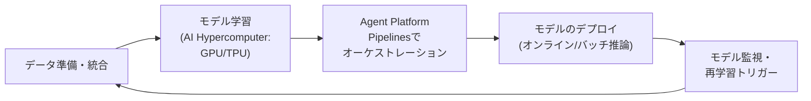

> **ベストプラクティス**: 学習と推論でワークロード特性が異なるため、GPU/TPUの選定は「学習は高スループットのTPU、リアルタイム推論は低レイテンシのGPU」のように用途で使い分けを検討します。パイプライン化によって、データ準備からデプロイまでの再現性を確保することが重要です。
>
> **出典**: [AI Hypercomputer の概要](https://cloud.google.com/ai-hypercomputer/docs/overview) / [Gemini Enterprise Agent Platform](https://cloud.google.com/products/gemini-enterprise-agent-platform)

### 2.5 Agent Platformでの事前構築ソリューション・APIの構成

**押さえるべき考慮事項**

- Google AI API群の使い分け（Search、Conversation、Vision、Image、Video、Audio）
- Gemini Enterprise機能（AI Agents、NotebookLM）の統合によるワークフロー強化
- Model GardenからのAIモデル統合

| API/機能 | 用途 |
|---|---|
| Vision AI | 画像内のオブジェクト検出・OCR・不適切コンテンツ検出 |
| Video Intelligence | 動画内のオブジェクト・シーン認識 |
| Speech-to-Text / Text-to-Speech | 音声認識・音声合成 |
| Translation AI | 多言語翻訳 |
| Model Garden | 200種類以上のGoogle/パートナー製モデルを検索・デプロイ |
| NotebookLM | ドキュメントを情報源としたAI要約・Q&A |

> **ベストプラクティス**: 独自モデルの学習コストをかける前に、まずModel GardenやGoogle AI APIで要件を満たせないか検討するのが費用対効果の観点で定石です。試験では「ゼロからモデルを構築する」選択肢よりも「既存の事前構築済みAPI/モデルを活用する」選択肢が正解になりやすい傾向があります。
>
> **出典**: [Model Gardenの概要](https://cloud.google.com/vertex-ai/generative-ai/docs/model-garden/explore-models) / [Google Cloud AI・機械学習製品](https://cloud.google.com/products/ai)

---

## Section 3: セキュリティとコンプライアンスの設計（約17.5%）

Section 2に次いで配点が高く、実務でも最重要のセクションです。技術的なセキュリティ制御とガバナンス・コンプライアンスの両面が問われます。

### 3.1 セキュリティの設計

**押さえるべき考慮事項**

- Identity and Access Management（IAM）
- リソース階層（組織、フォルダ、プロジェクト）
- データセキュリティ（鍵管理、暗号化、シークレット管理）
- 職務分離
- セキュリティ制御（監査、VPC Service Controls、コンテキストアウェアアクセス、組織のポリシー、階層型ファイアウォールポリシー）
- Cloud KMSによる顧客管理暗号鍵（CMEK）の管理
- セキュアなリモートアクセス（Identity-Aware Proxy、サービスアカウントの権限借用、Chrome Enterprise Premium、Workload Identity Federation）
- ソフトウェアサプライチェーンのセキュリティ
- AIのセキュリティ（Model Armor、Sensitive Data Protection、安全なモデルデプロイ）

**リソース階層とポリシー継承**

Google Cloudのリソースは階層構造を持ち、上位で設定したIAMポリシーやOrganization Policyは下位に継承されます。

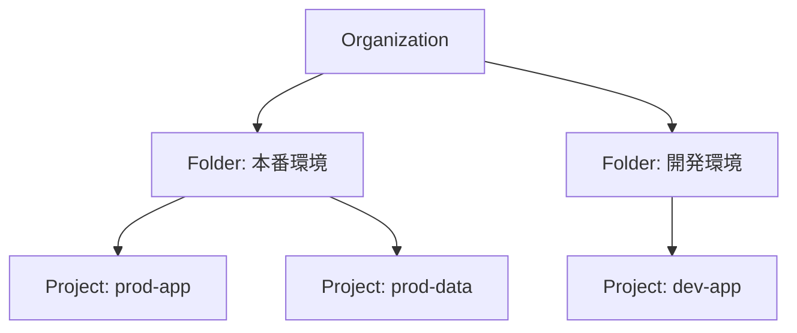

> **ベストプラクティス**: 本番環境と開発環境をフォルダで明確に分離し、フォルダ単位でOrganization Policy（例: 外部IP付与の禁止）を適用すると、プロジェクト個別設定より一貫性の高いガバナンスが実現できます。IAMは「誰が何にアクセスできるか」の最小権限を徹底し、基本ロールではなくきめ細かい事前定義ロール・カスタムロールを使用します。

**IAMの基本原則**

| 原則 | 内容 |
|---|---|
| 最小権限の原則 | 必要な操作に必要な範囲の権限のみ付与 |
| 職務分離 | 承認者と実行者を分ける（例: 本番デプロイの承認と実行を別担当者に） |
| サービスアカウントの権限借用 | 個人アカウントの鍵をダウンロードせず、一時的にサービスアカウントの権限を借用して操作 |
| Workload Identity Federation | 他クラウド/オンプレミスのワークロードがサービスアカウント鍵なしにGoogle Cloudリソースへアクセス |

**データセキュリティと鍵管理**

| 手段 | 用途 |
|---|---|
| Cloud KMS | 暗号鍵の作成・ローテーション・アクセス制御 |
| CMEK（顧客管理暗号鍵） | Google管理ではなく自社管理の鍵でデータを暗号化 |
| CSEK（顧客提供暗号鍵） | 自社で保持する鍵をリクエスト時に提供して暗号化 |
| Secret Manager | APIキー・パスワード等のシークレットの一元管理 |
| Sensitive Data Protection（旧DLP） | 機密データ（PII等）の検出・分類・マスキング |

**セキュアなリモートアクセス**

- **Identity-Aware Proxy（IAP）**: パブリックIPやVPNなしに、IAMベースのアクセス制御でVM/アプリへのアクセスを保護
- **Chrome Enterprise Premium**: ゼロトラストの文脈に基づくアクセス制御をブラウザレベルで実現
- **Context-Aware Access**: ユーザーの属性（デバイスの状態、IPアドレス、場所）に基づいてアクセス可否を動的に判定

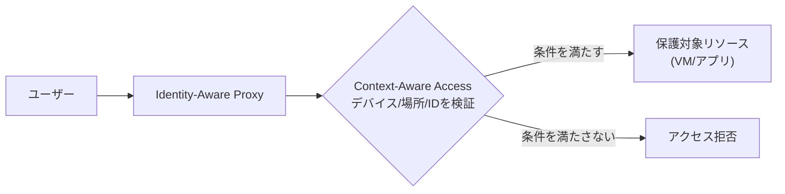

**AIのセキュリティ**: Model Armor（生成AIの入出力に対するプロンプトインジェクション対策等）、Sensitive Data Protectionと連携した機密情報の漏洩防止、モデルのデプロイ時のアクセス制御が近年の出題範囲に加わっています。

**ソフトウェアサプライチェーンのセキュリティ**: Artifact Analysisがコンテナイメージの脆弱性スキャンを担当し、スキャン合格後に署名付きattestationを作成します。Binary Authorizationはそのattestationを検証し、対応するattestorをポリシーで必須化することで、条件を満たしたイメージだけをデプロイできるよう制御します。

> **ベストプラクティス**: 「多層防御（Defense in Depth）」の考え方に基づき、サービス境界によるデータ流出制御（VPC Service Controls）、ID層（IAM/Context-Aware Access）、データ層（暗号化/DLP）、ソフトウェアサプライチェーンおよびデプロイ時ポリシー制御（Binary Authorization）の各レベルで独立した防御を重ねることが試験・実務ともに評価される設計です。
>
> **出典**: [IAMの概要](https://cloud.google.com/iam/docs/overview) / [リソース階層の理解](https://cloud.google.com/resource-manager/docs/cloud-platform-resource-hierarchy) / [Cloud KMSの概要](https://cloud.google.com/kms/docs/key-management-service) / [VPC Service Controlsの概要](https://cloud.google.com/vpc-service-controls/docs/overview) / [Model Armorの概要](https://cloud.google.com/security-command-center/docs/model-armor-overview)

### 3.2 コンプライアンスの設計

**押さえるべき考慮事項**

- 法規制（医療記録のプライバシー、児童のプライバシー、データプライバシー、データの所有権、データ主権）
- 商用要件（クレジットカード情報等の機密データの取り扱い、個人識別情報[PII]）
- 業界認証（SOC 2等）
- 監査（ログを含む）

| 規制・基準 | 対象領域 |
|---|---|
| HIPAA | 米国の医療記録プライバシー |
| COPPA | 児童のオンラインプライバシー保護（米国） |
| PCI DSS | クレジットカード情報の取り扱い |
| GDPR | EU域内の個人データ保護 |
| SOC 2 | サービス組織のセキュリティ統制に関する第三者監査基準 |

**データ主権（Data Sovereignty）**: データが特定の地理的・法的管轄内に留まることを求める要件です。Google CloudではAssured Workloadsやリージョン制限のOrganization Policyで、データの保存・処理場所を制御できます。

**監査ログ**: Cloud Auditログには「管理アクティビティ」「データアクセス」「システムイベント」「ポリシー拒否」の4種類があり、これらをBigQueryやCloud Storageにエクスポートして長期保存・分析することがコンプライアンス対応の基本です。

> **ベストプラクティス**: 業界別の規制要件（医療ならHIPAA、決済ならPCI DSS）を洗い出したうえで、Assured WorkloadsやOrganization Policyで技術的に強制する仕組みに落とし込むことが「口頭ルールに頼らないコンプライアンス」の実現方法です。監査ログは既定で一定期間保持されますが、長期保持が必要な場合は明示的にログシンクを設定してエクスポートします。
>
> **出典**: [Assured Workloadsの概要](https://cloud.google.com/assured-workloads/docs/overview) / [Cloud Auditログの概要](https://cloud.google.com/logging/docs/audit) / [コンプライアンスリソースセンター](https://cloud.google.com/compliance)

---

## Section 4: 技術・ビジネスプロセスの分析と最適化（約15%）

技術的な知識だけでなく、組織・プロセスに関する「ソフトスキル寄り」の判断力が問われるユニークなセクションです。

### 4.1 技術プロセスの分析と定義

**押さえるべき考慮事項**

- ソフトウェア開発ライフサイクル（SDLC）
- 継続的インテグレーション/継続的デプロイ（CI/CD）
- トラブルシューティング/根本原因分析のベストプラクティス
- ソフトウェアとインフラのテスト・検証
- サービスカタログとプロビジョニング
- 災害復旧

**CI/CDパイプラインの基本フロー**

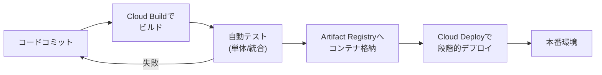

**テストの種類**

| テスト種別 | 目的 |
|---|---|
| 単体テスト | 個別の関数・モジュール単位の正しさを検証 |
| 統合テスト | 複数コンポーネント間の連携を検証 |
| 負荷テスト | 想定トラフィックでの性能・限界を検証 |

**根本原因分析（RCA）**: 障害発生時に、表面的な症状ではなく根本原因を特定するプロセスです。Cloud Logging/Cloud Traceによる分散トレーシング、ポストモーテム（振り返り）文化の醸成が実務上のベストプラクティスとされます。

> **ベストプラクティス**: 障害対応では「誰が悪いか」ではなく「なぜ仕組みが障害を防げなかったか」に焦点を当てるBlameless Postmortem（非難なき事後検証）の文化が、SRE的な運用の卓越性につながります。
>
> **出典**: [Cloud Buildの概要](https://cloud.google.com/build/docs/overview) / [SRE本 - ポストモーテムの文化](https://sre.google/sre-book/postmortem-culture/)

### 4.2 ビジネスプロセスの分析と定義

**押さえるべき考慮事項**

- ステークホルダー管理（影響力の行使とファシリテーション）
- 変更管理
- チームアセスメント/スキルの準備状況
- 意思決定プロセス
- カスタマーサクセスマネジメント
- コスト最適化/リソース最適化（CapEx/OpEx）
- 事業継続性

**CapEx（資本的支出）とOpEx（運用支出）の違い**

| 区分 | 従来のオンプレミス | クラウド |
|---|---|---|
| 支出モデル | CapEx中心（先行投資でハードウェア購入） | OpEx中心（従量課金で利用した分だけ支払い） |
| メリット | 長期的な単価は下がる場合がある | 初期投資が不要、需要に応じた即応が可能 |

> **ベストプラクティス**: 経営層への説明では、クラウド移行がCapExからOpExへの転換であることを明確に伝えると合意形成がしやすくなります。試験では「予算承認プロセス」や「変更管理プロセス」に関する記述問題があり、技術的な正しさだけでなく組織的なプロセスを踏まえた選択肢が問われる点に注意しましょう。
>
> **出典**: [コスト最適化の柱 - Architecture Framework](https://cloud.google.com/architecture/framework/cost-optimization)

---

## Section 5: 実装の管理（約12.5%）

設計されたアーキテクチャを実際に開発・運用チームがどう実装していくかを支援する能力が問われます。

### 5.1 開発・運用チームへのアドバイスによるソリューションの確実なデプロイ

**押さえるべき考慮事項**

- アプリケーションとインフラのデプロイ
- APIマネジメントのベストプラクティス（Apigee）
- テストフレームワーク（負荷/単体/統合）
- データ・システムの移行・管理ツール
- Gemini Cloud Assist

**Apigeeによる APIマネジメント**: APIのライフサイクル全体（設計、セキュリティ、レート制限、分析、マネタイズ）を管理するプラットフォームです。バックエンドサービスを直接公開せず、Apigeeをゲートウェイとして挟むことで、認証・スロットリング・バージョニングを一元管理できます。

> **ベストプラクティス**: 社内外に公開するAPIが増えてきた組織では、個別サービスごとに認証・レート制限を実装するのではなく、Apigeeのようなゲートウェイ層で横断的に管理することで、一貫したセキュリティポリシーとAPI利用状況の可視化が実現できます。
>
> **出典**: [Apigeeの概要](https://cloud.google.com/apigee/docs/api-platform/get-started/what-apigee)

### 5.2 Google Cloudとのプログラム的なやり取り

**押さえるべき考慮事項**

- Cloud Shell Editor、Cloud Code、Cloud Shellターミナル
- Google Cloud SDK（gcloud、gsutil、bq）
- クラウドエミュレータ（Bigtable、Spanner、Pub/Sub、Firestore）
- Infrastructure as Code（IaC、Terraform）
- Google APIへのアクセスのベストプラクティス
- Google APIクライアントライブラリ

| ツール | 用途 |
|---|---|
| gcloud | Google Cloudリソース全般の操作用CLI |
| gsutil | Cloud Storageの操作用CLI |
| bq | BigQueryの操作用CLI |
| Cloud Code | VS Code/JetBrains向けのGoogle Cloud/Kubernetes開発支援拡張機能 |
| クラウドエミュレータ | ローカル環境でBigtable/Spanner/Pub/Sub/Firestoreの動作を再現し、クラウド接続なしに開発・テストが可能 |

**IaC（Terraform）による構成管理の基本フロー**

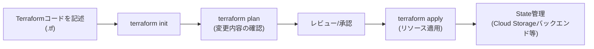

> **ベストプラクティス**: 手動でのコンソール操作（ClickOps）は再現性・監査性に欠けるため、本番環境の構成変更は必ずTerraform等のIaCとバージョン管理システムを通して行うのが定石です。Terraform StateはローカルではなくCloud Storageバケット等のリモートバックエンドで管理し、チームでの競合を防ぎます。ローカル開発ではクラウドエミュレータを活用することで、開発時のクラウドコストとネットワーク遅延を削減できます。
>
> **出典**: [Google CloudにおけるTerraformの利用](https://cloud.google.com/docs/terraform) / [gcloud CLIの概要](https://cloud.google.com/sdk/gcloud) / [ローカルエミュレータの一覧](https://cloud.google.com/sdk/gcloud/reference/emulators)

---

## Section 6: ソリューションと運用の卓越性の確保（約12.5%）

システムを本番稼働させた後の「運用」フェーズにフォーカスしたセクションです。

### 6.1 Well-Architected Frameworkの運用の卓越性の柱

Section 1.2で触れたWAFの6つの柱のうち、「運用の卓越性（Operational Excellence）」の原則・推奨事項への精通が明示的に求められます。効率的なモニタリング、自動化されたデプロイ、継続的な改善サイクルがこの柱の中心です。

### 6.2 Google Cloud Observabilityソリューションへの精通

**押さえるべき考慮事項**

- モニタリングとロギング
- プロファイリングとベンチマーキング
- アラート戦略

| サービス | 役割 |
|---|---|
| Cloud Monitoring | メトリクス収集・ダッシュボード・アラート |
| Cloud Logging | ログの収集・検索・エクスポート |
| Cloud Trace | 分散システムのレイテンシ・リクエストトレーシング |
| Cloud Profiler | CPU/メモリ使用量のプロファイリング |
| Error Reporting | アプリケーションエラーの集計・分析 |
| Managed Service for Prometheus | Prometheus形式メトリクスのマネージド収集 |

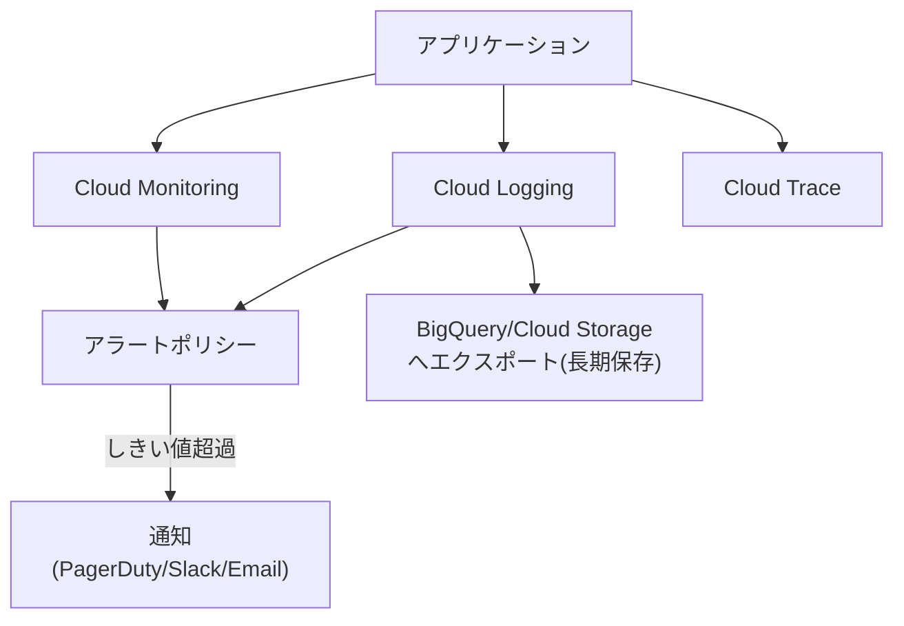

**アラート戦略**: すべてのメトリクスに閾値アラートを設定するのではなく、SLO（サービスレベル目標）のエラーバジェット消費速度に基づくアラート（バーンレートアラート）を設計することが、アラート疲れ（Alert Fatigue）を防ぐ現代的なプラクティスです。

> **ベストプラクティス**: 「原因系（CPU使用率など）」ではなく「結果系（ユーザーが体感するレイテンシ・エラー率などのSLI）」を軸にアラートを設計すると、ノイズの多い通知を減らしつつ実際に対応が必要な問題を確実に捕捉できます。
>
> **出典**: [Cloud Observabilityの概要](https://cloud.google.com/stackdriver/docs) / [SLOに基づくアラート設計](https://cloud.google.com/architecture/monitoring-slo-alerting-with-events)

### 6.3 デプロイとリリース管理

段階的なリリース手法を理解し、リスクを抑えたデプロイ戦略を選択できることが求められます。

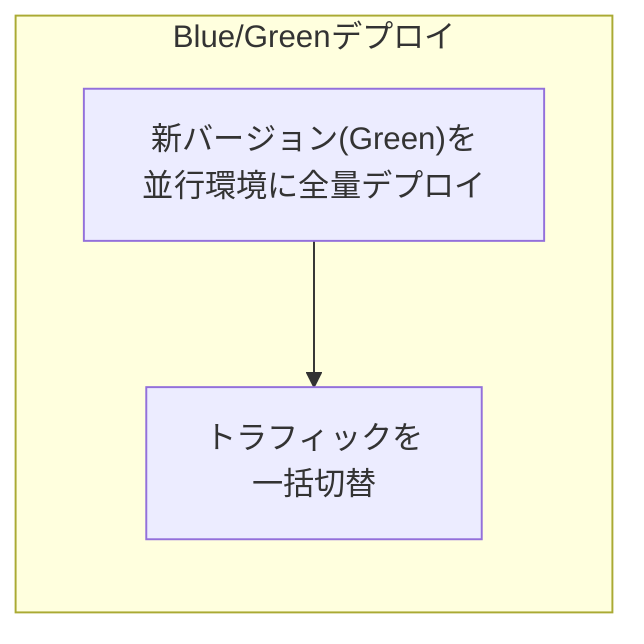

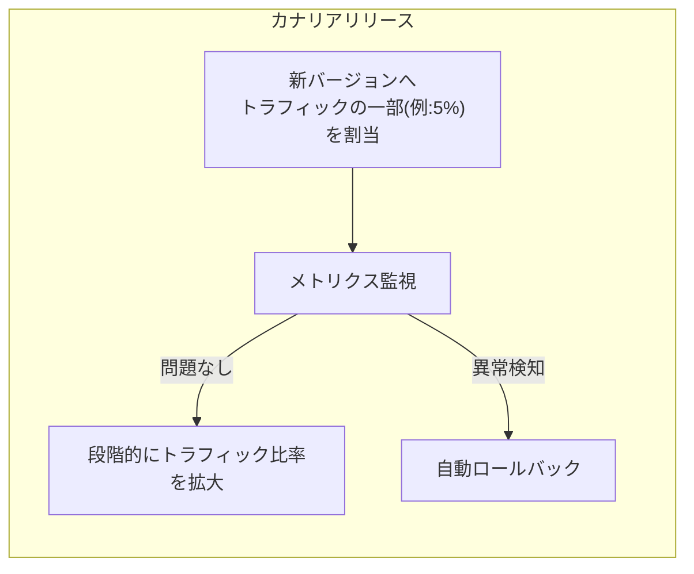

| 手法 | 特徴 | 適するケース |
|---|---|---|
| Blue/Green | 新環境を丸ごと用意し一括切替、ロールバックが容易 | 切替タイミングを明確に管理したい場合 |
| カナリアリリース | 一部トラフィックのみ新バージョンへ、段階的に拡大 | 本番影響を最小化しながら検証したい場合 |
| ローリングアップデート | インスタンスを順次入れ替え | ダウンタイムを避けつつシンプルに更新したい場合 |

> **出典**: [デプロイ戦略の比較](https://cloud.google.com/architecture/application-deployment-and-testing-strategies)

### 6.4 デプロイ済みソリューションのサポート支援

本番稼働後のインシデント対応、オンコール体制、エスカレーションフローの整備が含まれます。SLA/SLO/SLIの関係を正しく理解しておくことが重要です。

| 用語 | 意味 |
|---|---|
| SLI（サービスレベル指標） | 実際に計測する指標（例: 成功リクエスト率） |
| SLO（サービスレベル目標） | SLIの目標値（例: 成功率99.9%） |
| SLA（サービスレベル契約） | SLOを満たせなかった場合の契約上の合意（違約金等を含む対外的な約束） |

### 6.5 品質管理措置の評価

コードレビュー基準、静的解析ツールの導入、リリース前チェックリストの整備など、品質を継続的に担保する仕組みの評価能力が問われます。

### 6.6 本番環境における信頼性の確保

**カオスエンジニアリング**: 本番相当の環境に意図的に障害を注入し、システムの耐障害性を検証する手法です。

**ペネトレーションテスト**: セキュリティの脆弱性を実際の攻撃者視点で検証するテストです。

**負荷テスト**: 想定を超えるトラフィックをかけ、システムの限界点とスケーリング挙動を検証します。

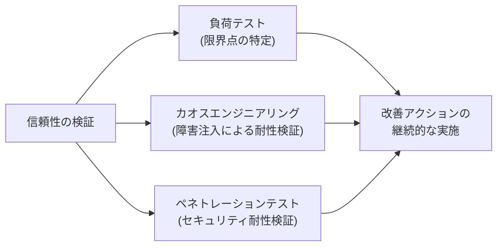

> **ベストプラクティス**: これらのテストは「一度実施して終わり」ではなく、リリースサイクルに組み込んで継続的に実施することで、システムの変化に追従した信頼性担保が可能になります。
>
> **出典**: [信頼性の柱 - Architecture Framework](https://cloud.google.com/architecture/framework/reliability) / [SRE本 - カオスエンジニアリング](https://sre.google/sre-book/introduction/)

---

## 学習チェックリスト

以下の項目を一通り「説明できる」状態になっているか確認しましょう。

- [ ] Well-Architected Frameworkの6つの柱をそれぞれ一言で説明できる
- [ ] 機能要件と非機能要件の違いを具体例とともに説明できる
- [ ] Shared VPC・VPCピアリング・Private Service Connect・NCCの使い分けを説明できる
- [ ] Compute Engine・GKE・Cloud Run・Cloud Run functionsの選定基準を説明できる
- [ ] Cloud SQL・AlloyDB・Spanner・Firestore・Bigtableの使い分けを説明できる
- [ ] RPO/RTOの定義と、それぞれを短縮する代表的な手段を説明できる
- [ ] Migration Centerを用いた移行の4フェーズ(Assess/Plan/Deploy/Optimize)を説明できる
- [ ] リソース階層(Organization/Folder/Project)とポリシー継承の仕組みを説明できる
- [ ] IAM・IAP・Context-Aware Access・Workload Identity Federationの役割の違いを説明できる
- [ ] CMEK/CSEK/Secret Manager/Sensitive Data Protectionの使い分けを説明できる
- [ ] VPC Service Controlsが何を防ぐための仕組みかを説明できる
- [ ] SLI/SLO/SLAの関係を正しく説明できる
- [ ] Blue/Greenデプロイとカナリアリリースの違いとそれぞれの利点を説明できる
- [ ] CapExとOpExの違いをクラウド移行の文脈で説明できる
- [ ] 4つのケーススタディ(Altostrat Media/Cymbal Retail/EHR Healthcare/KnightMotives Automotive)の業種と概要を把握している

## まとめ: 合格のための5つの原則

1. **ビジネス要件を最優先で読み解く**: 技術選定の前に、必ず「何のためにこのシステムが存在するのか」というビジネス要件・非機能要件を明確化する癖をつけましょう。
2. **WAFの6つの柱でバランスを取る**: コストだけ、可用性だけといった単一軸で判断せず、常に複数の柱のトレードオフを意識して選択肢を評価しましょう。
3. **過不足のない設計を選ぶ**: 「常に最も可用性が高い構成」や「常に最も安い構成」が正解とは限りません。要件に対して過剰でも過小でもない設計が高く評価されます。
4. **ケーススタディの制約を尊重する**: ケーススタディが絡む問題では、一般的な最適解ではなく、その企業固有の制約・目標に照らした最適解を選びましょう。
5. **マネージド・自動化を優先する**: 手動運用(ClickOpsや個別パッチ適用)よりも、IaC・自動パッチ管理・マネージドサービスを優先する選択肢が、運用の卓越性の観点で評価されやすい傾向にあります。

## 参考文献

**公式試験情報**

- [Professional Cloud Architect Certification｜Google Cloud](https://cloud.google.com/learn/certification/cloud-architect)
- [Professional Cloud Architect Exam Guide（PDF）](https://services.google.com/fh/files/misc/professional_cloud_architect_exam_guide_english.pdf)
- [Professional Cloud Architect Renewal Exam Guide（PDF）](https://services.google.com/fh/files/misc/professional_cloud_architect_renewal_exam_guide_eng.pdf)
- [Professional Cloud Architect Learning Path](https://www.cloudskillsboost.google/paths/12)

**Architecture Framework（Well-Architected Framework）**

- [Google Cloud Architecture Framework](https://cloud.google.com/architecture/framework)
- [System design considerations](https://cloud.google.com/architecture/framework/system-design)
- [信頼性の柱](https://cloud.google.com/architecture/framework/reliability)
- [コスト最適化の柱](https://cloud.google.com/architecture/framework/cost-optimization)

**ネットワーク・コンピュート・ストレージ**

- [VPCの概要](https://cloud.google.com/vpc/docs/vpc)
- [Shared VPCの概要](https://cloud.google.com/vpc/docs/shared-vpc)
- [Private Service Connectの概要](https://cloud.google.com/vpc/docs/private-service-connect)
- [Network Connectivity Centerの概要](https://cloud.google.com/network-connectivity-center/docs/overview)
- [ハイブリッド接続の概要](https://cloud.google.com/hybrid-connectivity)
- [ストレージオプションの選択](https://cloud.google.com/architecture/storage-options)
- [コンピュートオプションの選択](https://cloud.google.com/architecture/compute-options)
- [Spot VMの概要](https://cloud.google.com/compute/docs/instances/spot)

**移行とAI/ML**

- [Migration Centerの概要](https://cloud.google.com/migration-center/docs/migration-center-overview)
- [クラウド移行の基本ガイド](https://cloud.google.com/architecture/migration-to-google-cloud-building-your-foundation)
- [AI Hypercomputerの概要](https://cloud.google.com/ai-hypercomputer/docs/overview)
- [Model Gardenの概要](https://cloud.google.com/vertex-ai/generative-ai/docs/model-garden/explore-models)
- [Gemini Cloud Assistの概要](https://cloud.google.com/gemini/docs/cloud-assist/overview)

**セキュリティとコンプライアンス**

- [IAMの概要](https://cloud.google.com/iam/docs/overview)
- [リソース階層の理解](https://cloud.google.com/resource-manager/docs/cloud-platform-resource-hierarchy)
- [Cloud KMSの概要](https://cloud.google.com/kms/docs/key-management-service)
- [VPC Service Controlsの概要](https://cloud.google.com/vpc-service-controls/docs/overview)
- [Model Armorの概要](https://cloud.google.com/security-command-center/docs/model-armor-overview)
- [Assured Workloadsの概要](https://cloud.google.com/assured-workloads/docs/overview)
- [Cloud Auditログの概要](https://cloud.google.com/logging/docs/audit)
- [コンプライアンスリソースセンター](https://cloud.google.com/compliance)

**実装とオペレーション**

- [Google CloudにおけるTerraformの利用](https://cloud.google.com/docs/terraform)
- [gcloud CLIの概要](https://cloud.google.com/sdk/gcloud)
- [Apigeeの概要](https://cloud.google.com/apigee/docs/api-platform/get-started/what-apigee)
- [Cloud Buildの概要](https://cloud.google.com/build/docs/overview)
- [Cloud Observabilityの概要](https://cloud.google.com/stackdriver/docs)
- [デプロイ戦略の比較](https://cloud.google.com/architecture/application-deployment-and-testing-strategies)
- [SRE本（Google Site Reliability Engineering）](https://sre.google/sre-book/table-of-contents/)
