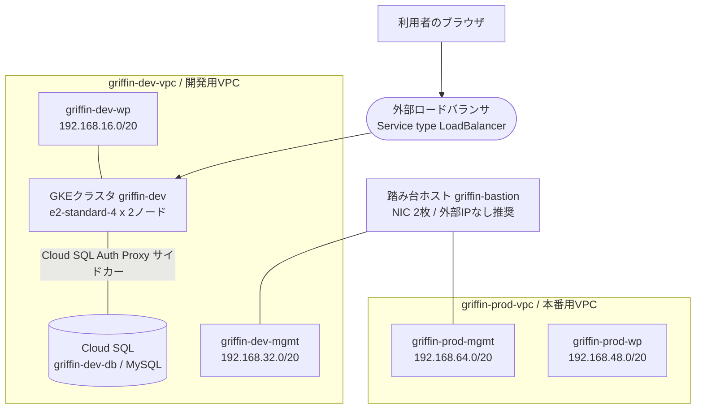
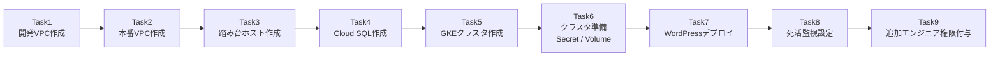
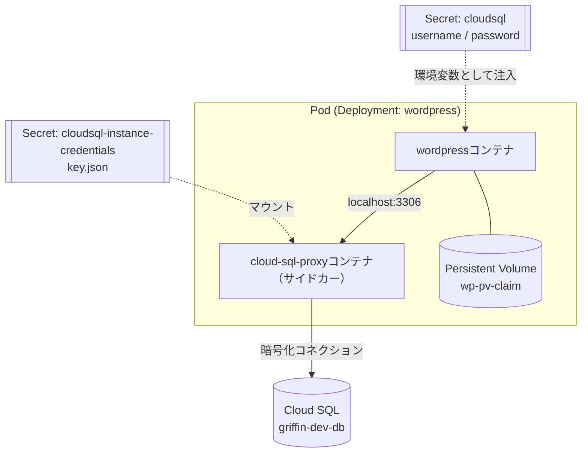

# Team Griffin インフラ構築チャレンジラボ 完全解説ガイド

## VPC / 踏み台ホスト / Cloud SQL / GKE / WordPress / モニタリング / IAM を初学者向けにベストプラクティスで読み解く

---

## 0. このガイドについて

このガイドは、Google Cloud の「Develop your Google Cloud Network」スキルバッジ相当のチャレンジラボ（Jooli Inc. の Team Griffin シナリオ）を題材に、各タスクを **なぜそうするのか（Why）** まで含めて解説するものです。チャレンジラボは手順書がなく自力で進める形式のため、各タスクの背景にあるベストプラクティスを理解しておくことが、ラボ攻略だけでなく実務でも役立ちます。

対象読者はネットワーク・Kubernetes・Cloud SQL の基礎用語をある程度知っている初学者を想定しています。各タスクには次の情報を必ず添えています。

- 目的（なぜこの作業が必要か）
- 実際のコマンド／手順
- ベストプラクティスとその根拠（公式ドキュメントのURL付き）
- 初学者がつまずきやすいポイント

> 本ガイド中の `REGION` と `ZONE` はラボが指定するリージョン・ゾーンに置き換えてください。

---

## 1. 全体アーキテクチャ

Team Griffin の環境は「開発用VPC」と「本番用VPC」を分離し、両方に踏み台ホストからアクセスできる構成です。WordPress は開発用VPCの中に構築した GKE クラスタ上で動作し、データは Cloud SQL に保存します。



ポイントは次の3つです。

1. 開発VPCと本番VPCは **完全に分離** されており、直接ピアリングはしません。両者をまたぐ唯一の経路が踏み台ホストです。
2. GKE クラスタは `griffin-dev-wp` サブネットに配置し、データベースへのアクセスは Pod 内の Cloud SQL Auth Proxy サイドカー経由にすることで、Cloud SQL 側のファイアウォール管理を簡略化します。
3. 外部公開は WordPress の `Service`（type: LoadBalancer）が生成する Google Cloud の外部ロードバランサのみです。

---

## 2. タスクの全体フロー



依存関係として重要なのは、Task6（Secret作成）が Task4（DBユーザー作成）と Task5（クラスタ作成）の両方が完了していないと進められない点、Task7 が Task4 で確認する「インスタンス接続名」に依存する点です。順番を守らずに進めるとエラーの原因究明に時間を取られるため、上図の順序を推奨します。

---

## 3. 事前準備：Jooli Inc. の標準を理解する

作業に入る前に、ラボが提示する社内標準を一覧化しておきます。

| 項目 | 標準 |
|---|---|
| リージョン・ゾーン | 指定がない限り `REGION` / `ZONE` を使用 |
| 使用するVPC | プロジェクト内に作成する専用VPC（デフォルトVPCは使わない） |
| 命名規則 | `チーム名-リソース名`（例: `griffin-webserver1`） |
| インスタンスサイズ | 特別な指定がない限り `e2-medium`（コスト効率重視） |

この「コスト効率重視」という制約は、実務でも非常に重要な観点です。過剰なリソース確保はコスト超過やプロジェクト停止のリスクになるため、要件が明示されていない箇所は最小構成から始めるのが定石です。

---

## 4. Task 1：開発用VPCを手動作成する

### 目的

`griffin-dev-vpc` を作成し、サブネット `griffin-dev-wp`（192.168.16.0/20）と `griffin-dev-mgmt`（192.168.32.0/20）のみを持たせます。

### 手順

```bash
# custom モードでVPCを作成（自動モードは使わない）
gcloud compute networks create griffin-dev-vpc \
  --subnet-mode=custom

# WordPressワークロード用サブネット
gcloud compute networks subnets create griffin-dev-wp \
  --network=griffin-dev-vpc \
  --region=REGION \
  --range=192.168.16.0/20

# 管理（踏み台）用サブネット
gcloud compute networks subnets create griffin-dev-mgmt \
  --network=griffin-dev-vpc \
  --region=REGION \
  --range=192.168.32.0/20
```

### ベストプラクティスの根拠

- **`--subnet-mode=custom` を必ず指定する**：自動モードVPCは各リージョンに `10.128.0.0/9` 範囲のサブネットを自動生成してしまい、要件で指定された CIDR（192.168.16.0/20 等）と競合します。本番運用に適しているのもカスタムモードであると公式ドキュメントで明言されています。
- カスタムモードVPCは作成直後サブネットが0個の状態から始まるため、「指定されたサブネットのみを持たせる」という要件を満たしやすい構造になっています。

### 初学者がつまずきやすいポイント

- 新規プロジェクトにはデフォルトで `default` という自動モードVPCが存在します。今回のタスクで使うのは新しく作る `griffin-dev-vpc` であり、`default` を編集しないよう注意してください。
- サブネットはリージョンリソースです。`--region` の指定ミスはあとで GKE クラスタ作成時のサブネット選択で気づくことが多いので、この段階で `REGION` を統一しておきましょう。

### 参考ソース

- [VPC networks（自動モード/カスタムモードの違い） - Google Cloud](https://cloud.google.com/vpc/docs/vpc)
- [Subnets（サブネットの概念） - Google Cloud](https://cloud.google.com/vpc/docs/subnets)
- [Quickstart: Create and manage VPC networks - Google Cloud](https://cloud.google.com/vpc/docs/create-modify-vpc-networks)

---

## 5. Task 2：本番用VPCを手動作成する

### 目的

`griffin-prod-vpc` を作成し、`griffin-prod-wp`（192.168.48.0/20）と `griffin-prod-mgmt`（192.168.64.0/20）のみを持たせます。

### 手順

```bash
gcloud compute networks create griffin-prod-vpc \
  --subnet-mode=custom

gcloud compute networks subnets create griffin-prod-wp \
  --network=griffin-prod-vpc \
  --region=REGION \
  --range=192.168.48.0/20

gcloud compute networks subnets create griffin-prod-mgmt \
  --network=griffin-prod-vpc \
  --region=REGION \
  --range=192.168.64.0/20
```

### ベストプラクティスの根拠

Task 1 と同じ理由でカスタムモードを使用します。加えて、開発と本番でVPCそのものを分離しているのは、環境ごとに障害影響範囲やアクセス制御を独立させるという定番のネットワーク設計パターンです。IPアドレス帯を重複させていない（16.0/20, 32.0/20, 48.0/20, 64.0/20 と連続かつ非重複で採番されている）点も、将来的にVPCピアリングやハイブリッド接続を行う際にCIDR重複エラーを避けるための設計として理解しておくとよいでしょう。

### 初学者がつまずきやすいポイント

- Task 1 との違いは名前とCIDRだけです。コピー&ペーストでの入力ミス（`dev` と `prod` の書き間違い）が最も多い失敗パターンなので、作成後は `gcloud compute networks subnets list` で必ず確認してください。

### 参考ソース

- [VPC networks - Google Cloud](https://cloud.google.com/vpc/docs/vpc)
- [Subnets - Google Cloud](https://cloud.google.com/vpc/docs/subnets)

---

## 6. Task 3：踏み台（bastion）ホストを作成する

### 目的

`griffin-dev-mgmt` と `griffin-prod-mgmt` の両方に接続されたNICを2枚持つ踏み台ホストを作成し、SSH接続できる状態にします。

### 手順

```bash
# 2枚のNIC(外部IPなし)を持つVMを作成
gcloud compute instances create griffin-bastion \
  --zone=ZONE \
  --machine-type=e2-medium \
  --network-interface=subnet=griffin-dev-mgmt,no-address \
  --network-interface=subnet=griffin-prod-mgmt,no-address

# IAP経由のSSHを許可するファイアウォールルール（各VPCに1本ずつ）
gcloud compute firewall-rules create allow-iap-ssh-dev \
  --network=griffin-dev-vpc \
  --direction=INGRESS \
  --action=ALLOW \
  --rules=tcp:22 \
  --source-ranges=35.235.240.0/20

gcloud compute firewall-rules create allow-iap-ssh-prod \
  --network=griffin-prod-vpc \
  --direction=INGRESS \
  --action=ALLOW \
  --rules=tcp:22 \
  --source-ranges=35.235.240.0/20

# IAP TCPフォワーディング経由でSSH接続
gcloud compute ssh griffin-bastion --zone=ZONE --tunnel-through-iap
```

### ベストプラクティスの根拠

- **外部IPを持たせず、Identity-Aware Proxy (IAP) のTCPフォワーディングでSSHする** のが Google Cloud 公式が推奨する構成です。IAPは認証・認可・監査ログを一元化しつつ、VMを外部IPなしで安全に運用できる仕組みとして案内されています。踏み台ホスト自体が持つセキュリティリスク（インターネットに公開されたSSHポート）を、IAPを使うことで大きく減らせます。
- IAPのTCPフォワーディングを使う際は、送信元を IAP専用のIP範囲 `35.235.240.0/20` に限定したファイアウォールルールが必須です。これがないとIAPからVMへ到達できません。
- 2枚のNICを異なるVPCのサブネットに接続することで、1台のVMが両方のネットワークの「橋渡し役」になります。これはVPCピアリングを使わずに管理トラフィックだけを中継したい場合の典型的な構成です。

### 初学者がつまずきやすいポイント

- 「SSHできること」を確認する際、外部IPを付けて `gcloud compute ssh` するだけで満足してしまいがちですが、ベストプラクティスとしては `--tunnel-through-iap` フラグを使う構成を優先してください。
- ファイアウォールルールを1つのVPCにしか作らないと、もう片方のVPC側からのSSHがタイムアウトします。両方のVPCに同様のルールが必要です。
- NICの並び順（`nic0` / `nic1`）はVM作成時の `--network-interface` フラグの指定順で決まります。あとから調べるときは `gcloud compute instances describe` で確認しましょう。

### 参考ソース

- [Best practices for controlling SSH network access - Google Cloud](https://cloud.google.com/compute/docs/connect/ssh-best-practices/network-access)
- [TCP forwarding overview - Identity-Aware Proxy - Google Cloud](https://cloud.google.com/iap/docs/tcp-forwarding-overview)
- [Use IAP for TCP forwarding - Google Cloud](https://cloud.google.com/iap/docs/using-tcp-forwarding)

---

## 7. Task 4：Cloud SQL インスタンスの作成とWordPress用DBの準備

### 目的

MySQLのCloud SQLインスタンス `griffin-dev-db` を作成し、WordPress用のデータベースとユーザーを用意します。

### 手順

```bash
# コスト効率の良い最小構成でMySQLインスタンスを作成
gcloud sql instances create griffin-dev-db \
  --database-version=MYSQL_8_0 \
  --tier=db-g1-small \
  --region=REGION \
  --root-password=<ROOT_PASSWORD>

# インスタンスに接続
gcloud sql connect griffin-dev-db --user=root
```

接続後、以下のSQLを実行します。

```sql
CREATE DATABASE wordpress;
CREATE USER 'wp_user'@'%' IDENTIFIED BY 'stormwind_rules';
GRANT ALL PRIVILEGES ON wordpress.* TO 'wp_user'@'%';
FLUSH PRIVILEGES;
```

### ベストプラクティスの根拠

- Cloud SQL インスタンス作成では、ワークロードに見合った最小サイズを選ぶことがコスト管理の基本です。公式ドキュメントでも用途に応じたマシンタイプ・エディションの選択が案内されています。開発環境では `db-g1-small` のような軽量ティアで十分です。
- ユーザー名・パスワードは後続の Task 6 で Kubernetes Secret として利用するため、ここで作成した認証情報（`wp_user` / `stormwind_rules`）を正確にメモしておく必要があります。
- GKEからの接続方式として、この後のタスクでは **Cloud SQL Auth Proxy** を使う設計になっています。Auth Proxyを使う場合、IAM認可と暗号化されたトンネルで接続できるため、Cloud SQL側で個々のクライアントIPを許可リストに追加する必要がありません。これは「承認済みネットワーク」方式より安全で運用の手間も少ない、公式に推奨されるパターンです。

### 初学者がつまずきやすいポイント

- `gcloud sql connect` はCloud Shellから接続する際にCloud SQL Admin APIを経由して一時的にクライアントIPを許可するため、実行環境によっては数十秒待たされることがあります。
- ユーザー名・ホスト名・パスワードは、SQL文中では単一引用符で囲んでください。二重引用符やバッククォートには置き換えず、上記のSQLをそのまま実行します。

### 参考ソース

- [Create instances - Cloud SQL for MySQL - Google Cloud](https://cloud.google.com/sql/docs/mysql/create-instance)
- [Connect to Cloud SQL from Google Kubernetes Engine - Cloud SQL for MySQL - Google Cloud](https://cloud.google.com/sql/docs/mysql/connect-kubernetes-engine)

---

## 8. Task 5：Kubernetesクラスタの作成

### 目的

`griffin-dev-wp` サブネット内、`ZONE` に、`e2-standard-4` ノード2台からなるゾーンクラスタ `griffin-dev` を作成します。

### 手順

```bash
gcloud container clusters create griffin-dev \
  --zone=ZONE \
  --num-nodes=2 \
  --machine-type=e2-standard-4 \
  --network=griffin-dev-vpc \
  --subnetwork=griffin-dev-wp
```

### ベストプラクティスの根拠

- **ゾーンクラスタ（Zonal cluster）** を選ぶのは、要件で単一ゾーンへの配置が指定されており、かつ開発環境では単一障害点を許容してコストを抑える方が合理的だからです。公式ドキュメントでも、ゾーンクラスタはコントロールプレーンが単一ゾーンに存在し、可用性より低コストを優先するユースケース向けとされています（本番相当の高可用性が必要な場合はリージョンクラスタが推奨されます）。
- `--network` と `--subnetwork` を明示的に指定するのは、デフォルトVPCではなく `griffin-dev-vpc` の `griffin-dev-wp` サブネットにノードを配置するためです。指定を省略するとデフォルトVPCにクラスタが作成されてしまい、要件を満たせません。

### 初学者がつまずきやすいポイント

- クラスタ作成には数分かかります。タイムアウトのように見えても、コンソールやgcloudでステータスを確認しながら気長に待ちましょう。
- ノードプールのマシンタイプはクラスタ作成後に直接変更できません。サイズを変える場合は新しいノードプールを追加する必要があります。

### 参考ソース

- [Creating a zonal cluster - Google Kubernetes Engine (GKE) - Google Cloud](https://cloud.google.com/kubernetes-engine/docs/how-to/creating-a-zonal-cluster)
- [About cluster configuration choices - Google Kubernetes Engine (GKE) - Google Cloud](https://cloud.google.com/kubernetes-engine/docs/concepts/configuration-overview)

---

## 9. Task 6：Kubernetesクラスタの準備（Secret・Volumeの構成）

### 目的

WordPressコンテナが Cloud SQL に安全に接続できるよう、認証情報を Kubernetes Secret として登録し、永続化のための Volume を用意します。

### アーキテクチャ（Pod内部の構成）



### 手順

```bash
# 1. Cloud Shellにサンプルマニフェストをコピー
gcloud storage cp -r gs://spls/gsp321/wp-k8s .
cd wp-k8s

# 2. wp-env.yaml を編集し、username を wp_user、password を stormwind_rules に設定してから適用
kubectl apply -f wp-env.yaml

# 3. Cloud SQL Proxy用サービスアカウントの鍵を発行し、Secretとして登録
gcloud iam service-accounts keys create key.json \
  --iam-account=cloud-sql-proxy@$GOOGLE_CLOUD_PROJECT.iam.gserviceaccount.com

kubectl create secret generic cloudsql-instance-credentials \
  --from-file key.json
```

### ベストプラクティスの根拠

- **認証情報をSecretとして分離する**のはKubernetesの基本原則です。パスワードやサービスアカウント鍵をマニフェストやコンテナイメージに直接埋め込まず、Secretリソースとして管理することで、権限管理・ローテーション・監査がしやすくなります。
- **Cloud SQL Auth Proxy をサイドカーコンテナとして同じPodに配置する**構成は、Google Cloud公式が推奨するパターンです。アプリケーションコンテナは `localhost` 経由でProxyコンテナに接続するだけでよく、通信の暗号化とIAM認可はProxyが担うため、アプリ側でTLS証明書やネットワーク許可リストを管理する必要がありません。
- **WordPressの作業ファイルをPersistent Volumeに保存する**のは、Pod自体はスケジューリングによって再作成・移動されうる一時的な存在であり、コンテナのローカルファイルシステムに保存したデータはPodの再作成時に失われてしまうためです。GKEはデフォルトで永続ディスク（Compute Engine persistent disk）を裏付けとする StorageClass を自動生成しており、PersistentVolumeClaimを作るだけで動的に永続ディスクをプロビジョニングできます。

### 発展的なベストプラクティス（このラボの手順との違い）

このタスクではサービスアカウントの **JSONキーファイルを発行してSecretにマウントする** 方式を使います。これは動作しますが、Google Cloudの公式ベストプラクティスでは、キーファイルは漏えいリスクのある長期的な認証情報であるため **できる限り避けるべき** とされています。GKEでは代替として「GKE向け Workload Identity Federation」を有効化し、Kubernetes Service AccountとGoogle Cloud Service Accountを紐付けることで、キーファイルなしで短期的な認証情報を自動的に払い出す方式が推奨されています。本番環境を構築する際はこちらへの移行を検討してください。

### 初学者がつまずきやすいポイント

- `wp-env.yaml` を編集せずに適用すると、プレースホルダーの認証情報のままDBに接続できずWordPressのインストーラーがエラーになります。適用前に必ず値を書き換えてください。
- `cloud-sql-proxy` という名前のサービスアカウントは事前に用意されている前提です。存在しない場合は事前準備の手順（IAMページでの作成）を見直してください。
- `key.json` はローカル（Cloud Shell）に一時的に作成されるファイルです。Secret登録後は不要なので、ラボ終了時や本番運用では削除・ローテーションを忘れないようにしましょう。

### 参考ソース

- [Secrets - Kubernetes 公式ドキュメント](https://kubernetes.io/docs/concepts/configuration/secret/)
- [Connect to Cloud SQL from Google Kubernetes Engine - Cloud SQL for MySQL - Google Cloud](https://cloud.google.com/sql/docs/mysql/connect-kubernetes-engine)
- [GKE persistent volumes & provisioning - Google Cloud](https://cloud.google.com/kubernetes-engine/docs/concepts/persistent-volumes)
- [About Workload Identity Federation for GKE - Google Cloud](https://cloud.google.com/kubernetes-engine/docs/concepts/workload-identity)
- [Best practices for using service accounts securely - Google Cloud](https://cloud.google.com/iam/docs/best-practices-service-accounts)

---

## 10. Task 7：WordPressデプロイメントの作成

### 目的

準備したSecretとVolumeを使ってWordPressのDeploymentを作成し、外部からアクセスできるServiceを公開します。

### 手順

```bash
# 1. wp-deployment.yaml の YOUR_SQL_INSTANCE を
#    griffin-dev-db の「インスタンス接続名」に置き換える
#    （例: PROJECT_ID:REGION:griffin-dev-db）
kubectl apply -f wp-deployment.yaml

# 2. Serviceを作成して外部公開する
kubectl apply -f wp-service.yaml

# 3. 外部IPが割り当てられるまで待機
kubectl get service wordpress --watch
```

### ベストプラクティスの根拠

- **インスタンス接続名（`PROJECT_ID:REGION:INSTANCE_NAME`）を使う**のは、Cloud SQL Auth Proxyがこの一意な識別子をもとにインスタンスを特定し、IAMベースで安全に接続を確立する仕組みになっているためです。IPアドレスを直接指定する方式より、インスタンスのIP変更に強い構成です。
- **`Service` の `type: LoadBalancer` を使う**ことで、GKEはGoogle Cloudの外部ネットワークロードバランサを自動的にプロビジョニングします。手動でロードバランサやファイアウォールルールを個別に組み立てるより設定ミスが起きにくく、Kubernetesのマニフェストだけで完結する点が推奨される理由です。

### 初学者がつまずきやすいポイント

- 外部IPが割り当てられるまで数分かかることがあります。`EXTERNAL-IP` が `<pending>` のままでも異常ではないので、焦らず待ちましょう。
- `YOUR_SQL_INSTANCE` の置き換えを忘れると、Podは起動してもCloud SQL Proxyコンテナがクラッシュループします。`kubectl logs <pod> -c cloudsql-proxy` でログを確認すると原因の切り分けに役立ちます。
- サイトにアクセスしてWordPressインストーラーが表示された時点でこのタスクは完了です。実際のインストール作業（管理者アカウント作成など）は開発チームの担当であり、このラボのスコープ外です。

### 参考ソース

- [Connect to Cloud SQL from Google Kubernetes Engine - Cloud SQL for MySQL - Google Cloud](https://cloud.google.com/sql/docs/mysql/connect-kubernetes-engine)
- [GKE persistent volumes & provisioning - Google Cloud](https://cloud.google.com/kubernetes-engine/docs/concepts/persistent-volumes)

---

## 11. Task 8：モニタリング（稼働時間チェック）の有効化

### 目的

開発環境のWordPressサイトに対する稼働時間チェック（Uptime Check）を作成します。

### 手順

1. Google Cloud コンソールで **Monitoring > Uptime checks** に移動します。
2. **Create Uptime Check** をクリックします。
3. プロトコルに `HTTP`、対象のホスト名に WordPress の外部IP（またはドメイン）を指定します。
4. チェック間隔・チェッカーのリージョンを設定し、作成します。

gcloudから作成する場合はAPI経由で以下のような呼び出しになります（詳細な項目はコンソールでの確認を推奨します）。

```bash
gcloud monitoring uptime create wordpress-uptime-check \
  --resource-type=uptime-url \
  --resource-labels=host=<WORDPRESSの外部IP> \
  --protocol=http \
  --port=80
```

### ベストプラクティスの根拠

- Cloud Monitoringの稼働時間チェックは、世界各地のチェッカーから対象URLに定期的にリクエストを送り、応答の有無・レスポンスコードを記録する仕組みです。これにより、外形監視（ユーザー視点での可用性監視）が実現できます。公式ドキュメントでも、パブリックに公開されたURLやGoogle Cloudリソースの死活監視に用いる標準的な方法として案内されています。
- GKE自体についても、クラスタ作成時にデフォルトでCloud MonitoringとCloud Loggingが統合されています。稼働時間チェックのような「外側からの疎通確認」と、GKEのオブザーバビリティ機能による「内側のワークロードの健全性監視」を組み合わせることで、より網羅的な監視体制になります。

### 初学者がつまずきやすいポイント

- 稼働時間チェックの対象にIPアドレスを指定した場合、WordPress側のロードバランサIPが変わると監視が壊れます。可能であれば安定したドメイン名を割り当てて監視対象にするのが望ましいです。
- チェックが失敗し続ける場合、対象のファイアウォールルールが `0.0.0.0/0` からのHTTPアクセスを許可しているか（`Service` type LoadBalancer は基本的に許可される）を確認してください。

### 参考ソース

- [Create public uptime checks - Cloud Monitoring - Google Cloud](https://cloud.google.com/monitoring/uptime-checks)
- [Manage uptime checks - Cloud Monitoring - Google Cloud](https://cloud.google.com/monitoring/uptime-checks/manage)
- [Observability for GKE - Google Cloud](https://cloud.google.com/kubernetes-engine/docs/concepts/observability)

---

## 12. Task 9：追加エンジニアへのアクセス権限付与

### 目的

新しく参加するエンジニア（ラボの2つ目のユーザーアカウント）に、プロジェクトへの Editor ロールを付与します。

### 手順

```bash
gcloud projects add-iam-policy-binding <PROJECT_ID> \
  --member="user:<追加エンジニアのメールアドレス>" \
  --role="roles/editor"
```

### ベストプラクティスの根拠

- IAMには「基本ロール（Owner / Editor / Viewer）」「事前定義ロール」「カスタムロール」の3種類があります。基本ロールはIAM導入以前から存在するレガシーなロールで、プロジェクト内の全サービスに対して広範な権限を一括付与するため、最小権限の原則には沿わないと公式ドキュメントでも位置づけられています。
- 今回のタスクはラボの要件として明示的に Editor ロールの付与を求めているため、それに従います。ただし実務では、対象エンジニアが実際に必要とする作業範囲（例: GKE運用のみなら `roles/container.admin`、ネットワーク運用のみなら `roles/compute.networkAdmin` など）に応じた事前定義ロールやカスタムロールを組み合わせ、Editor / Owner のような広範なロールの使用は最小限にとどめるのが望ましいとされています。

### 初学者がつまずきやすいポイント

- `--member` の書式は `user:`、`serviceAccount:`、`group:` などプレフィックスを間違えるとエラーになります。個人ユーザーアカウントの場合は `user:` を忘れないようにしてください。
- ロールの付与はほぼ即座に反映されますが、コンソール上の表示が更新されるまで数十秒のタイムラグがある場合があります。

### 参考ソース

- [Roles and permissions - Identity and Access Management (IAM) - Google Cloud](https://cloud.google.com/iam/docs/roles-overview)

---

## 13. まとめ表：タスク一覧とベストプラクティス早見表

| Task | 作成する主なリソース | 押さえるべきベストプラクティス | 参考ソース |
|---|---|---|---|
| 1 | `griffin-dev-vpc` + 2サブネット | カスタムモードVPCを使い、要件通りのCIDRのみ持たせる | [VPC networks](https://cloud.google.com/vpc/docs/vpc) |
| 2 | `griffin-prod-vpc` + 2サブネット | 開発／本番でVPCを分離し、CIDR重複を避ける | [Subnets](https://cloud.google.com/vpc/docs/subnets) |
| 3 | `griffin-bastion`（NIC2枚） | 外部IPなし + IAP TCPフォワーディングでSSH | [SSH best practices](https://cloud.google.com/compute/docs/connect/ssh-best-practices/network-access) |
| 4 | `griffin-dev-db`（Cloud SQL） | 用途に見合った最小ティア、Auth Proxy前提の設計 | [Create instances](https://cloud.google.com/sql/docs/mysql/create-instance) |
| 5 | `griffin-dev`（GKEクラスタ） | 要件のVPC/サブネットを明示指定、ゾーンクラスタでコスト最適化 | [Creating a zonal cluster](https://cloud.google.com/kubernetes-engine/docs/how-to/creating-a-zonal-cluster) |
| 6 | Secret / PersistentVolume | 認証情報はSecretで分離、DB接続はサイドカーProxy経由 | [Secrets（Kubernetes）](https://kubernetes.io/docs/concepts/configuration/secret/) |
| 7 | WordPress Deployment / Service | インスタンス接続名を使用、type LoadBalancerで公開 | [Connect from GKE](https://cloud.google.com/sql/docs/mysql/connect-kubernetes-engine) |
| 8 | Uptime Check | 外形監視でユーザー視点の可用性を継続確認 | [Create uptime checks](https://cloud.google.com/monitoring/uptime-checks) |
| 9 | IAMポリシーバインディング | 要件に従いつつ、実務では最小権限ロールを優先検討 | [Roles and permissions](https://cloud.google.com/iam/docs/roles-overview) |

---

## 14. 参考文献一覧（全ソース）

### ネットワーク（VPC / サブネット）

- [VPC networks - Virtual Private Cloud - Google Cloud](https://cloud.google.com/vpc/docs/vpc)
- [Subnets - Virtual Private Cloud - Google Cloud](https://cloud.google.com/vpc/docs/subnets)
- [Quickstart: Create and manage VPC networks - Google Cloud](https://cloud.google.com/vpc/docs/create-modify-vpc-networks)

### 踏み台ホスト / IAP

- [Best practices for controlling SSH network access - Compute Engine - Google Cloud](https://cloud.google.com/compute/docs/connect/ssh-best-practices/network-access)
- [TCP forwarding overview - Identity-Aware Proxy - Google Cloud](https://cloud.google.com/iap/docs/tcp-forwarding-overview)
- [Use IAP for TCP forwarding - Identity-Aware Proxy - Google Cloud](https://cloud.google.com/iap/docs/using-tcp-forwarding)

### Cloud SQL

- [Create instances - Cloud SQL for MySQL - Google Cloud](https://cloud.google.com/sql/docs/mysql/create-instance)
- [Connect to Cloud SQL from Google Kubernetes Engine - Cloud SQL for MySQL - Google Cloud](https://cloud.google.com/sql/docs/mysql/connect-kubernetes-engine)

### GKE / Kubernetes

- [Creating a zonal cluster - Google Kubernetes Engine (GKE) - Google Cloud](https://cloud.google.com/kubernetes-engine/docs/how-to/creating-a-zonal-cluster)
- [About cluster configuration choices - Google Kubernetes Engine (GKE) - Google Cloud](https://cloud.google.com/kubernetes-engine/docs/concepts/configuration-overview)
- [Secrets - Kubernetes 公式ドキュメント](https://kubernetes.io/docs/concepts/configuration/secret/)
- [GKE persistent volumes & provisioning - Google Kubernetes Engine (GKE) - Google Cloud](https://cloud.google.com/kubernetes-engine/docs/concepts/persistent-volumes)
- [About Workload Identity Federation for GKE - Google Kubernetes Engine (GKE) - Google Cloud](https://cloud.google.com/kubernetes-engine/docs/concepts/workload-identity)
- [Best practices for using service accounts securely - IAM - Google Cloud](https://cloud.google.com/iam/docs/best-practices-service-accounts)

### モニタリング

- [Create public uptime checks - Cloud Monitoring - Google Cloud](https://cloud.google.com/monitoring/uptime-checks)
- [Manage uptime checks - Cloud Monitoring - Google Cloud](https://cloud.google.com/monitoring/uptime-checks/manage)
- [Observability for GKE - Google Kubernetes Engine (GKE) - Google Cloud](https://cloud.google.com/kubernetes-engine/docs/concepts/observability)

### IAM

- [Roles and permissions - Identity and Access Management (IAM) - Google Cloud](https://cloud.google.com/iam/docs/roles-overview)

---

## 15. 総括

このチャレンジラボは、単なる「手順の暗記」ではなく、Google Cloudの基本原則（最小権限、外部公開面の最小化、認証情報の分離、コスト効率）を1つの実践的なシナリオの中で横断的に問う構成になっています。特に次の3点は実務でもそのまま応用できる考え方です。

1. **ネットワークは環境ごとに分離し、必要な経路だけを明示的に開ける**（踏み台ホスト + IAP）。
2. **アプリケーションとデータベースの接続はサイドカー構成で抽象化し、認証情報はSecretで管理する**。
3. **監視は「外側からの死活監視」と「内側のオブザーバビリティ」を両輪で整備する**。

ラボの `Check my progress` で緑のチェックが付かない場合は、まず本ガイドの該当タスクの「初学者がつまずきやすいポイント」を確認し、それでも解決しない場合は各リソースの実際の設定値（サブネットのCIDR、Secretの中身、インスタンス接続名など）を1つずつ見直すことをおすすめします。
