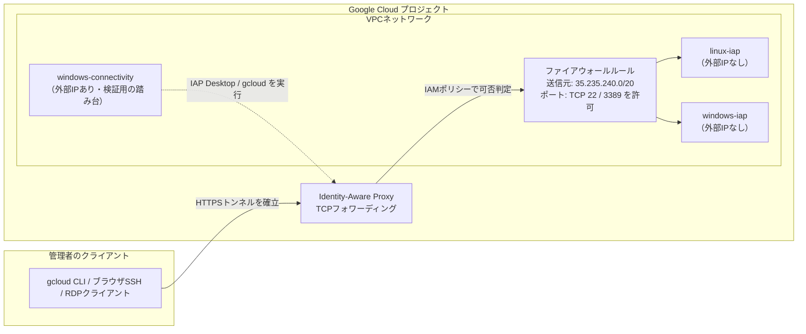
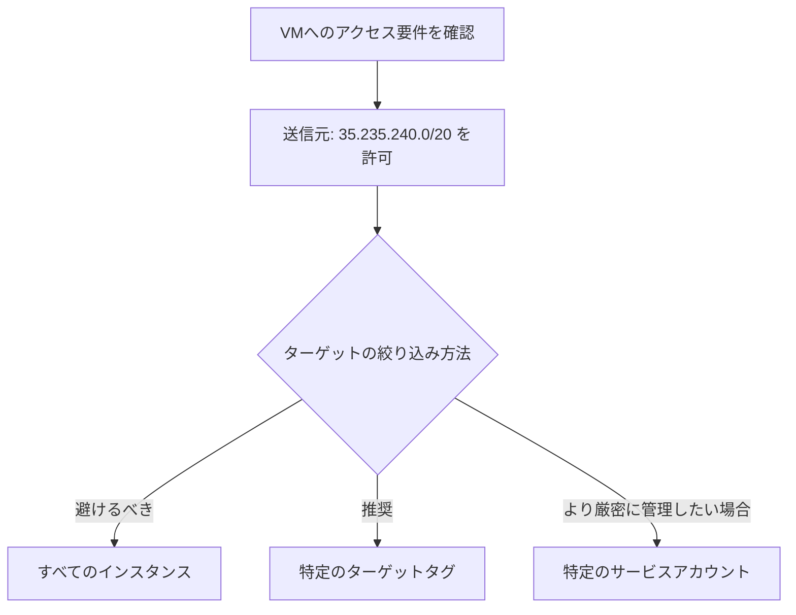
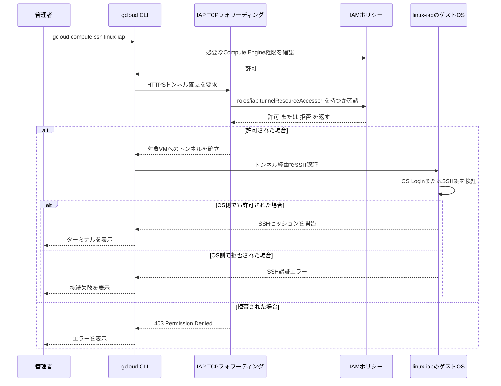
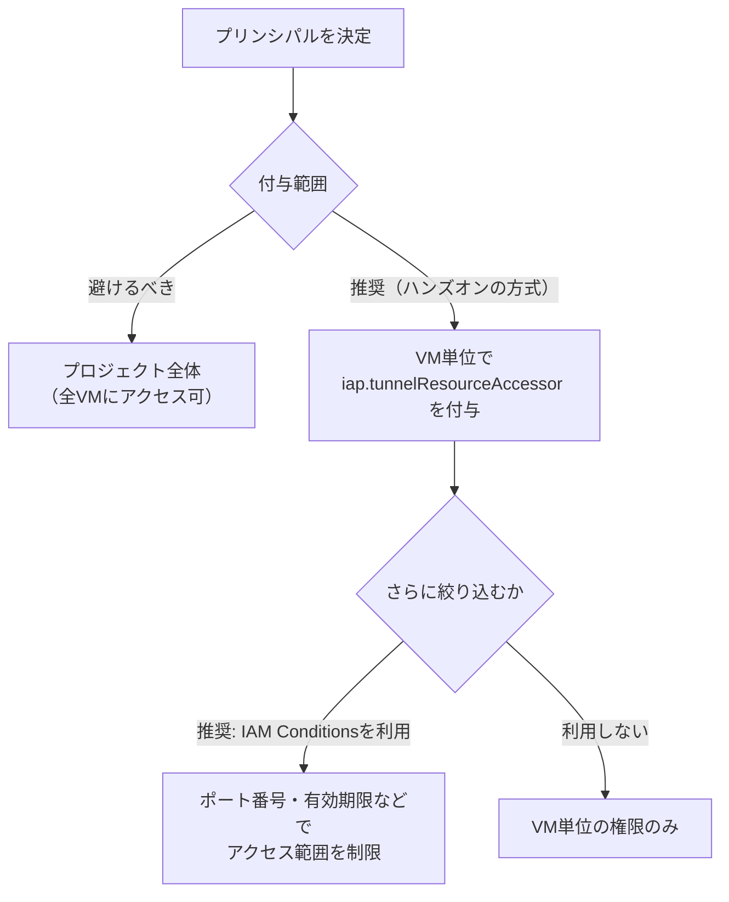
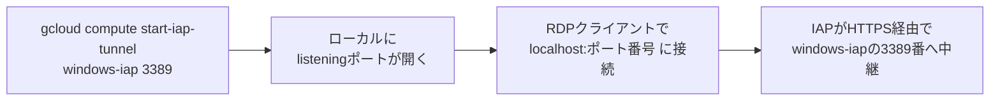
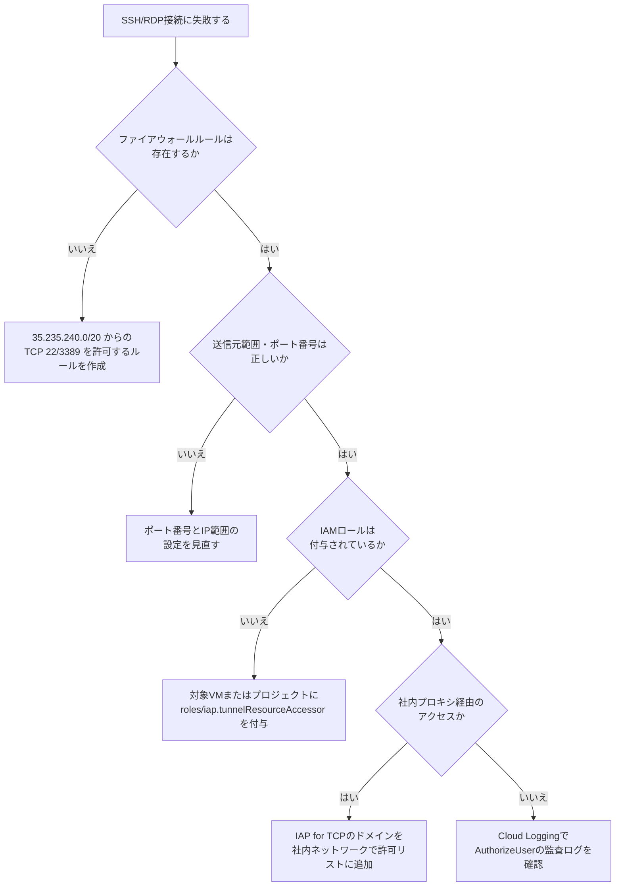

# IAP（Identity-Aware Proxy）TCP フォワーディングによる安全なVMアクセス ベストプラクティスガイド

対象読者: Google Cloud を学び始めた初学者〜実務でVMの踏み台構成を見直したいエンジニア
前提知識: Google Cloud コンソールの基本操作、VPC・ファイアウォールの初歩的な用語

---

## 1. このガイドについて

このガイドは、「外部IPアドレスを持たないVM（Linux/Windows）に、Identity-Aware Proxy（IAP）のTCPフォワーディング機能を使って安全にSSH/RDP接続する」というハンズオン内容を題材に、**実務で使うベストプラクティス**の観点から解説し直したものです。

ハンズオンそのものは学習用に単純化されているため、本ガイドでは各ステップについて

1. ハンズオンで行っている操作の意味
2. 本番環境で採用すべきベストプラクティス（ハンズオンとの差分がある場合は明記）
3. 公式ドキュメントなど根拠となる出典URL

の3点をセットで示します。

---

## 2. IAPとは何か、なぜ使うのか

### 2.1 課題: 「踏み台サーバー」と外部IPのリスク

従来型のインフラでは、社内ネットワークの外からVMに接続するために、以下のいずれかが必要でした。

- VMに外部IPアドレスを割り当てて直接SSH/RDPを開放する
- 踏み台（Bastion）サーバーを外部公開し、そこを経由して内部VMへ接続する

どちらの方式も、**インターネットに露出するポートが常に存在する**という点で攻撃対象領域（アタックサーフェス）を広げてしまいます。

### 2.2 IAPというアプローチ

IAP TCP フォワーディングは、Google が提唱する **BeyondCorp（ゼロトラストネットワーク）** の考え方に基づく機能です。VM側にはポートを外部公開せず、代わりに次の流れでアクセスを仲介します。

- クライアント（gcloud CLI・ブラウザ・IAP Desktopなど）がIAPに対してHTTPSでトンネル確立を要求する
- IAPは要求元のIDに対して **IAMポリシー**（「誰が」「どのVMに」アクセスできるか）を判定する
- 許可された場合のみ、HTTPSでラップされたTCPトラフィック（SSHやRDP）をVMの内部IPへ中継する

つまり「ネットワークの位置（社内かどうか）」ではなく「**IDと権限**」でアクセス可否を決めるのがIAPの本質です。この仕組みにより、VMは外部IPアドレスを一切持たずに運用できます。

> 参考: [TCP forwarding overview（Google Cloud公式）](https://docs.cloud.google.com/iap/docs/tcp-forwarding-overview)

---

## 3. 全体アーキテクチャ

ハンズオンで構築する構成は次の通りです。



- `linux-iap` と `windows-iap` は**外部IPアドレスを持たない**デモ用インスタンスです。
- `windows-connectivity` は、学習のために外部IPを持たせた検証専用VMで、ここから `gcloud` やIAP Desktopを操作してIAP経由の接続を確認します。
- 実際の本番運用では、この「踏み台的に使うクライアント」自体も管理者の手元PC（会社支給端末など）に置き換えることができます。

---

## 4. 作業の全体像

| # | タスク | 目的 |
|---|--------|------|
| 1 | IAP TCP forwarding APIの有効化 | プロジェクトでIAPのTCP機能を使えるようにする |
| 2 | VMインスタンスの作成 | 外部IPなしのVM2台＋検証用VM1台を用意する |
| 3 | 接続不可であることの確認 | 「外部IPがないと直接は繋がらない」ことを体感する |
| 4 | ファイアウォールルールの作成 | IAPの送信元IP範囲からの通信のみを許可する |
| 5 | IAM権限の付与 | 「誰が」IAPトンネルを使えるかを最小権限で設定する |
| 6 | IAP Desktopでの接続 | GUIツールでSSH/RDP接続を体験する |
| 7 | gcloud CLIでのトンネリング | CLIでSSHトンネル・RDPトンネルを手動で張る |

---

## 5. ステップ別解説

### 5.1 Task 1: IAP TCP forwarding APIの有効化

**操作**: ナビゲーションメニュー → 「APIとサービス」→「ライブラリ」→「Cloud Identity-Aware Proxy API」を検索して有効化する。

**ポイント**: IAPは「HTTPS経由でIAP対応アプリを保護する機能」と「TCPフォワーディングでVMに接続する機能」の2つの側面がありますが、どちらも同じ `Cloud Identity-Aware Proxy API` の有効化が前提になります。API自体の有効化は課金を発生させるものではなく、以降の設定（ファイアウォール・IAM）が本体です。

> 参考: [Identity-Aware Proxy ドキュメント（Google Cloud公式）](https://docs.cloud.google.com/iap/docs)

---

### 5.2 Task 2: VMインスタンスの作成（ベストプラクティス注記）

ハンズオンでは3台のVMを作成します。

- `linux-iap`: Linux、外部IPなし
- `windows-iap`: Windows Server、外部IPなし
- `windows-connectivity`: 検証用、外部IPあり、フルアクセスのアクセススコープ

**本番運用でのベストプラクティス**:

| 項目 | ハンズオンの設定 | 本番でのベストプラクティス |
|------|------------------|----------------------------|
| 外部IP | 業務VMは「なし」に設定 | 同様に「なし」を徹底し、必要な外向き通信はCloud NATで代替する |
| サービスアカウントのアクセススコープ | 検証VMのみ「Cloud APIへのフルアクセス」を許可 | 本番VMでは用途に応じた**最小限のスコープ**、または専用サービスアカウント＋IAMロールの組み合わせを使う |
| ネットワークタグ | 特に設定なし | ファイアウォールルールの対象を絞るため、役割ごとにネットワークタグを付与しておく |

「フルアクセス」のアクセススコープはハンズオンを単純化するためのものであり、本番環境では権限の過剰付与（Over-Privilege）につながるため推奨されません。

---

### 5.3 Task 3: 接続不可であることの確認

外部IPを持たない `linux-iap` にSSHボタンで接続しようとするとエラーになり、`windows-iap` へのRDPも同様に失敗します。これは**設計通りの動作**です。

**学びのポイント**: SSH/RDPボタン自体はクリックできる状態でも、実際には「外部IPアドレスがないため接続できません」というメッセージが表示されます。これは、外部IPの有無とコンソールUIの見た目が必ずしも一致しないため、VM詳細ページでボタンにカーソルを合わせて明示的に確認する習慣が重要であることを示しています。

---

### 5.4 Task 4: ファイアウォールルールの作成（重要な差分あり）

ハンズオンの設定はこちらです。

| 項目 | 設定値 |
|------|--------|
| 名前 | allow-ingress-from-iap |
| トラフィックの方向 | Ingress |
| ターゲット | ネットワーク内のすべてのインスタンス |
| ソースフィルタ | IPv4範囲 |
| ソースIPv4範囲 | `35.235.240.0/20` |
| プロトコルとポート | TCP 22（SSH）、3389（RDP） |

`35.235.240.0/20` は **IAPがTCPフォワーディングに使用する固定のIPアドレス範囲**であり、この範囲以外からの通信を許可しても、IAP経由の接続は成立しません。IPv6環境の場合は `2600:2d00:1:7::/64` を使用します。

> 参考: [Use IAP for TCP forwarding（Google Cloud公式）](https://docs.cloud.google.com/iap/docs/using-tcp-forwarding)

**ベストプラクティスとの差分**: ハンズオンでは学習を簡単にするため「ネットワーク内のすべてのインスタンス」をターゲットにしていますが、これはGoogle自身が「多くの場合、避けるべき選択肢」と明言している設定です。理由は、対象を絞らないと、本来意図していない他のVMまでこのルールの影響範囲に入ってしまうためです。



| 方式 | 特徴 | 向いているケース |
|------|------|-------------------|
| すべてのインスタンス | 設定は簡単だが、意図しないVMにも適用されるリスクがある | 検証・学習環境のみ |
| ターゲットタグ | ワークロードの役割ごとにグルーピングしやすい | 多くの本番環境での標準的な選択 |
| ターゲットサービスアカウント | タグより厳格。編集権限だけでなく該当サービスアカウントの使用権限も必要になるため改ざんされにくい | ワークロードIDベースでアクセス制御したい環境 |

> 参考:
> - [VPC firewall rules（Google Cloud公式・ターゲットの絞り込み方針）](https://docs.cloud.google.com/firewall/docs/firewalls)
> - [Google Cloud Security Best Practices（GitLab Handbook）](https://handbook.gitlab.com/handbook/security/best-practices/google-cloud-security-best-practices/)

---

### 5.5 Task 5: IAM権限の付与（最小権限の原則）

ハンズオンでは、「セキュリティ」→「Identity-Aware Proxy」の「SSH and TCP Resources」タブから、**VM単位で** `windows-connectivity` のサービスアカウントと学習用アカウントに `roles/iap.tunnelResourceAccessor`（IAP-Secured Tunnel User）ロールを付与します。このロールが許可するのは、対象VMへの **IAPトンネルの作成のみ**であり、SSH/RDPのログオン自体は許可しません。

`gcloud compute ssh` で接続するには、IAP権限とは別に必要なCompute Engine権限があり、さらにゲストOS側でOS LoginまたはSSH鍵メタデータによる認可が必要です。RDP接続にも、WindowsのOS認証情報とリモートログオン権限が別途必要です。



**このハンズオンが既に良い点**: `roles/iap.tunnelResourceAccessor` を**プロジェクト全体ではなくVM単位**で付与している点は、IAPトンネルを作成できる対象を絞るという意味で、最小権限の原則（Principle of Least Privilege）に沿ったベストプラクティスです。この付与は、ゲストOSへのSSH/RDPログオン権限の付与を代替するものではありません。

**さらに踏み込んだベストプラクティス**: 本番環境では、VM単位の付与に加えて **IAM条件（IAM Conditions）** を使い、特定のポート番号のみに限定したり、コントラクター向けに有効期限付きでアクセスを許可したりすることが推奨されます。



CLIで同等のIAPトンネル権限を設定する代表的なコマンドは次の通りです（値は環境に合わせて置き換えてください）。このコマンドだけではSSH/RDP接続は完了しないため、利用する接続方式に応じてCompute Engine権限とゲストOS側の認可も設定してください。

```bash
gcloud compute instances add-iam-policy-binding INSTANCE_NAME \
  --zone=ZONE \
  --member="user:EMAIL" \
  --role="roles/iap.tunnelResourceAccessor"
```

さらにポートを絞り込む場合は `--condition` を付与します。

```bash
gcloud compute instances add-iam-policy-binding INSTANCE_NAME \
  --zone=ZONE \
  --member="group:EMAIL" \
  --role="roles/iap.tunnelResourceAccessor" \
  --condition="expression=destination.port==22,title=ssh-only"
```

> 参考:
> - [Use IAP for TCP forwarding（ロール付与のガイド・Google Cloud公式）](https://docs.cloud.google.com/iap/docs/using-tcp-forwarding)
> - [Identity-Aware Proxy roles and permissions（Google Cloud公式）](https://docs.cloud.google.com/iam/docs/roles-permissions/iap)
> - [How to Restrict IAP TCP Tunneling to Specific VM Instances and Ports（IAM Conditionsの実践例）](https://oneuptime.com/blog/post/2026-02-17-how-to-restrict-iap-tcp-tunneling-to-specific-vm-instances-and-ports-using-iam-conditions-in-gcp/view)

---

### 5.6 Task 6: IAP Desktopでの接続

IAP Desktopは、GoogleのSolutions Architectsチームが開発するオープンソースのWindowsアプリケーションで、IAP TCPフォワーディングを使ってSSH/RDP接続をGUIで管理できます（Googleの公式サポート対象製品ではない点に注意してください）。

**接続までの流れ**:

1. `windows-connectivity` インスタンスへRDP接続する
2. デスクトップ上のIAP Desktopを起動し、Googleアカウントでサインインする
3. 接続先プロジェクトを追加する
4. 対象VM（`windows-iap`）をダブルクリックし、初回接続時は「Generate new credentials」で認証情報を生成する

IAP Desktop自体も内部的にはIAP TCPフォワーディングを利用しているため、**Task 4のファイアウォールルールとTask 5のIAMロールが正しく設定されていることが前提**になります。加えて、RDPではWindowsのOS認証情報とリモートログオン権限が必要です。

> 参考:
> - [IAP Desktop 公式GitHubリポジトリ](https://github.com/GoogleCloudPlatform/iap-desktop)
> - [Control access to VMs（IAP Desktop公式ドキュメント）](https://googlecloudplatform.github.io/iap-desktop/control-access-to-vms/)

---

### 5.7 Task 7: gcloud CLIによるSSH/RDPトンネリング

**SSH接続の場合**は、`gcloud compute ssh` コマンドが自動的にIAP経由のトンネルを検知して利用します。

```bash
gcloud compute ssh linux-iap --zone=ZONE
```

**RDP接続の場合**は、RDPプロトコル自体がgcloudに組み込まれていないため、**手動でローカルにトンネルを張り**、Windowsのリモートデスクトップ接続アプリからそのトンネル（`localhost:ポート番号`）へ接続します。

```bash
gcloud compute start-iap-tunnel windows-iap 3389 \
  --local-host-port=localhost:0 \
  --zone=ZONE
```

`--local-host-port=localhost:0` はローカルの空きポートを自動的に割り当てる指定です。表示された `Listening on port [XXXX]` のポート番号を、リモートデスクトップ接続アプリの接続先に `localhost:XXXX` として入力します。



> 参考: [gcloud compute start-iap-tunnel リファレンス（Google Cloud公式）](https://docs.cloud.google.com/sdk/gcloud/reference/compute/start-iap-tunnel)

---

## 6. 本番環境への適用時のベストプラクティスまとめ

| 領域 | ハンズオンの内容 | 本番運用でのベストプラクティス | 根拠 |
|------|------------------|-------------------------------|------|
| 外部IP | デモVMは外部IPなし | 全ての内部向けVMで外部IPを持たない方針を徹底 | [TCP forwarding overview](https://docs.cloud.google.com/iap/docs/tcp-forwarding-overview) |
| ファイアウォールのターゲット | すべてのインスタンス | ターゲットタグ、またはより厳密にはターゲットサービスアカウントで絞り込む | [VPC firewall rules](https://docs.cloud.google.com/firewall/docs/firewalls) |
| ファイアウォールの送信元 | `35.235.240.0/20`（IPv4） | 同左。IPv6環境では `2600:2d00:1:7::/64` も追加 | [Use IAP for TCP forwarding](https://docs.cloud.google.com/iap/docs/using-tcp-forwarding) |
| IAMロールの付与範囲 | VM単位で付与（既にベストプラクティス） | VM単位の付与に加えIAM Conditionsでポート・期限を制限 | [Identity-Aware Proxy roles and permissions](https://docs.cloud.google.com/iam/docs/roles-permissions/iap) |
| サービスアカウントのスコープ | 検証VMにフルアクセスを許可 | 用途ごとの最小権限スコープ、または専用サービスアカウント運用 | [Google Cloud Security Best Practices](https://handbook.gitlab.com/handbook/security/best-practices/google-cloud-security-best-practices/) |
| 監査 | 特に扱っていない | Cloud LoggingでIAPトンネルの接続ログ（誰が・いつ・どのVMへ）を記録・監視する | [How to Restrict IAP TCP Tunneling...（監査ログの例）](https://oneuptime.com/blog/post/2026-02-17-how-to-restrict-iap-tcp-tunneling-to-specific-vm-instances-and-ports-using-iam-conditions-in-gcp/view) |

---

## 7. トラブルシューティング



| 症状 | 主な原因 | 対処 |
|------|----------|------|
| SSH/RDPボタンを押しても接続できない | 外部IPがない状態でIAP未設定 | Task 4・Task 5の設定を確認 |
| ファイアウォールルールはあるのに繋がらない | 送信元範囲やポート番号の記載ミス | `35.235.240.0/20` とポート22/3389を再確認 |
| 「Permission denied」エラー | IAMロールが未付与、または付与先の粒度が誤っている | 該当プリンシパルに対象VM単位で `roles/iap.tunnelResourceAccessor` を付与 |
| 社内ネットワークからだけ繋がらない | 社内プロキシがIAP用ドメインをブロックしている | IAP for TCP用ドメインを社内プロキシの許可リストに追加 |

> 参考: [Use IAP for TCP forwarding（社内プロキシに関する注意事項）](https://docs.cloud.google.com/iap/docs/using-tcp-forwarding)

---

## 8. まとめ

- IAP TCPフォワーディングは、VMに外部IPを持たせずに「IDと権限」でSSH/RDPアクセスを制御する、ゼロトラストに基づいた仕組みである
- 最低限必要なのは「①API有効化」「②IAPのIP範囲からのファイアウォール許可」「③IAM `roles/iap.tunnelResourceAccessor` の付与」の3点
- ハンズオンの設定をそのまま本番へ持ち込むと、**ファイアウォールのターゲットが広すぎる**（すべてのインスタンス）という点が主な改善ポイントになる
- IAM側は既にVM単位で権限を絞る良い設計になっており、さらにIAM Conditionsでポートや期限を絞ることで、より安全な運用に近づけられる

---

## 9. 参考文献

- [TCP forwarding overview（Identity-Aware Proxy）](https://docs.cloud.google.com/iap/docs/tcp-forwarding-overview)
- [Identity-Aware Proxy documentation（目次ページ）](https://docs.cloud.google.com/iap/docs)
- [Use IAP for TCP forwarding](https://docs.cloud.google.com/iap/docs/using-tcp-forwarding)
- [Securing virtual machines with IAP（Chrome Enterprise Premium）](https://docs.cloud.google.com/chrome-enterprise-premium/docs/securing-virtual-machines)
- [Set up IAP TCP forwarding（IP/FQDN・Destination Group）](https://docs.cloud.google.com/iap/docs/tcp-by-host)
- [gcloud compute start-iap-tunnel リファレンス](https://docs.cloud.google.com/sdk/gcloud/reference/compute/start-iap-tunnel)
- [Identity-Aware Proxy roles and permissions](https://docs.cloud.google.com/iam/docs/roles-permissions/iap)
- [VPC firewall rules（ターゲットの絞り込み方針）](https://docs.cloud.google.com/firewall/docs/firewalls)
- [Add network tags（Virtual Private Cloud）](https://cloud.google.com/vpc/docs/add-remove-network-tags)
- [Google Cloud Security Best Practices（GitLab Handbook）](https://handbook.gitlab.com/handbook/security/best-practices/google-cloud-security-best-practices/)
- [How to Restrict IAP TCP Tunneling to Specific VM Instances and Ports（IAM Conditions実践例）](https://oneuptime.com/blog/post/2026-02-17-how-to-restrict-iap-tcp-tunneling-to-specific-vm-instances-and-ports-using-iam-conditions-in-gcp/view)
- [IAP Desktop 公式GitHubリポジトリ](https://github.com/GoogleCloudPlatform/iap-desktop)
- [Control access to VMs（IAP Desktop公式ドキュメント）](https://googlecloudplatform.github.io/iap-desktop/control-access-to-vms/)
- [Installation（IAP Desktop公式ドキュメント・ファイアウォールルール作成コマンド例）](https://github.com/GoogleCloudPlatform/iap-desktop/wiki/Installation)
