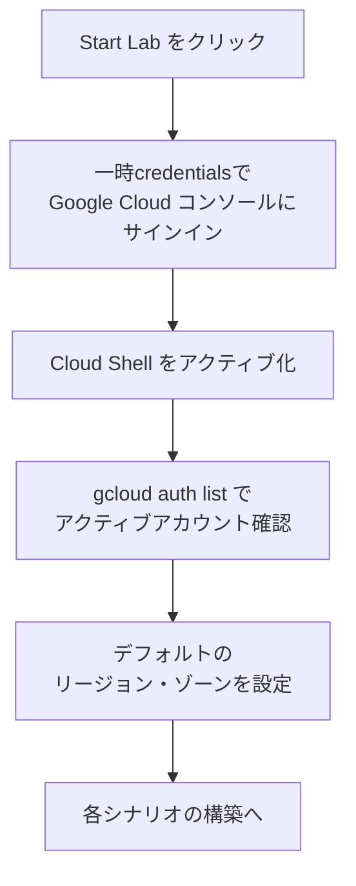
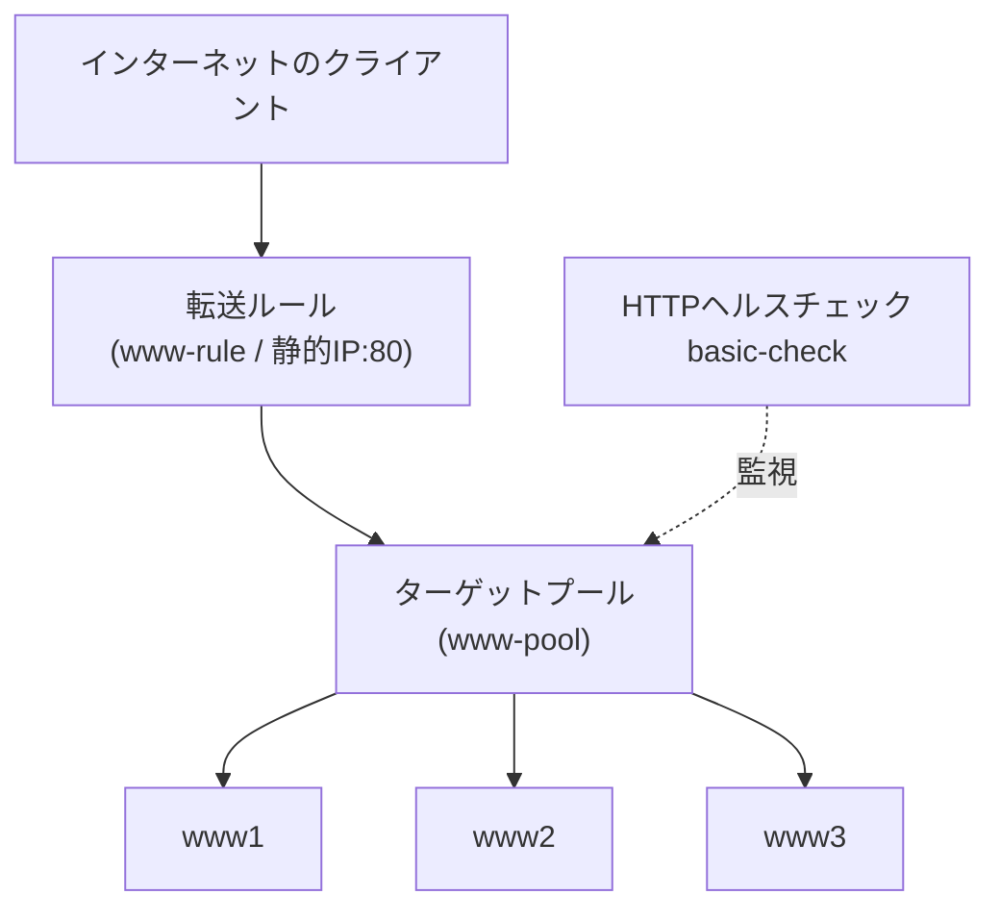
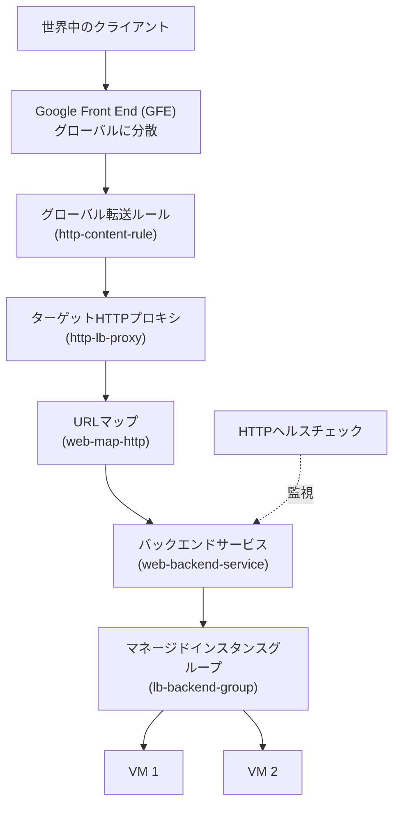
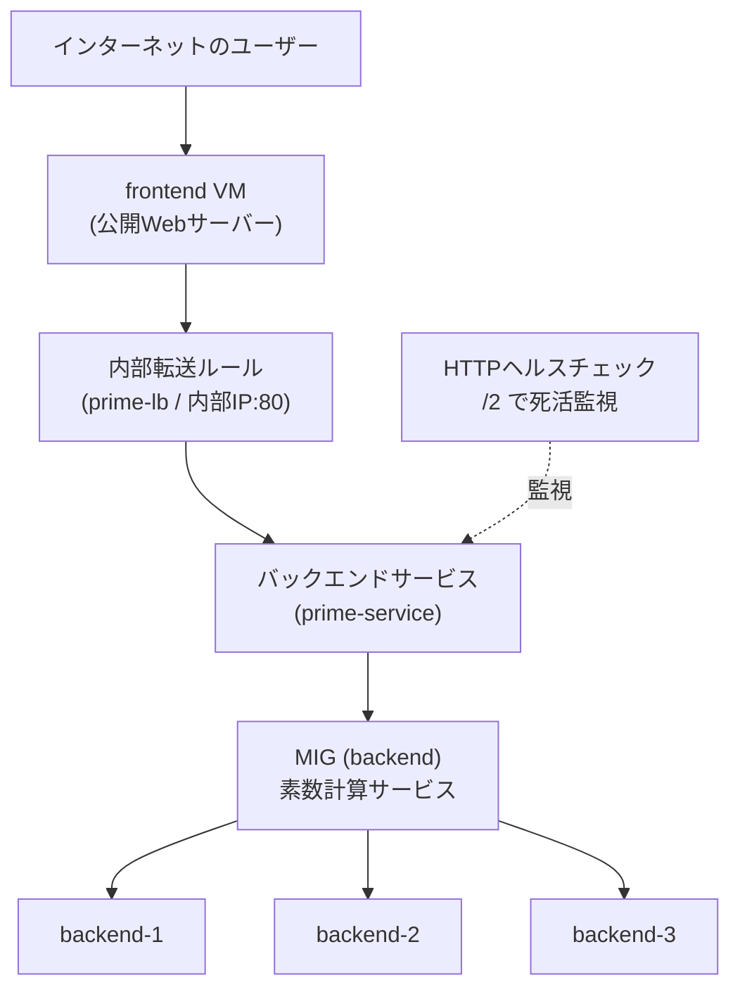
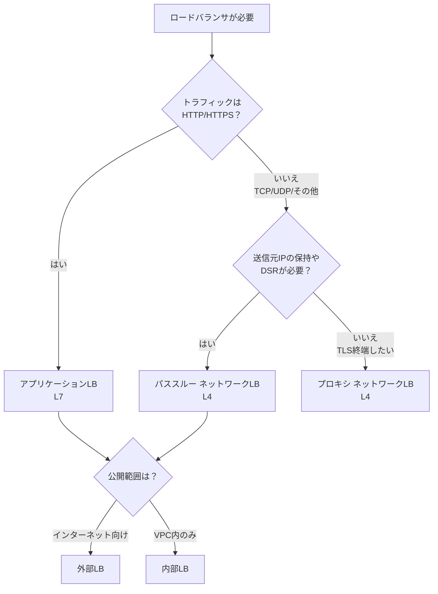

# Google Cloud ロードバランシング 完全入門ガイド
## 〜パススルーNLB・アプリケーションLB・内部LBをハンズオンで理解する〜

> 対象読者: Compute Engine と基本的なネットワーク（IPアドレス・ポート）を触ったことがある初学者
> ゴール: 「どのロードバランサをいつ・なぜ使うか」を理解し、`gcloud` で実際に構築できるようになること

---

## 0. このガイドの全体像

ロードバランサ（負荷分散装置）は、**1つの入り口（IPアドレス）に来たトラフィックを、複数のサーバーに振り分ける仕組み**です。これにより「1台が落ちてもサービスが止まらない（高可用性）」「アクセスが増えても捌ける（スケーラビリティ）」を実現します。

本ガイドでは、難易度順に4つのシナリオを扱います。

| 章 | 構築するもの | レイヤー | 公開範囲 | 主な用途 |
|----|------------|---------|---------|---------|
| 第2章 | パススルー ネットワークLB | L4 | 外部（インターネット向け） | IP/ポート単位の高速振り分け |
| 第3章 | アプリケーション ロードバランサ | L7 | 外部（グローバル） | URL/ヘッダー単位のHTTP振り分け |
| 第4章 | 内部パススルー ネットワークLB | L4 | 内部（VPC内のみ） | 社内・サービス間通信 |
| 第5章 | チャレンジ（総合演習） | L4 + L7 | 外部 | 学んだ内容の実践 |

---

## 1. 事前準備（全シナリオ共通）

### 1.1 用語の整理

Google Cloud のロードバランサは、大きく2系統 × 2方式に分類されます。これを最初に押さえると全体が一気に見通せます。

| | アプリケーションLB（L7） | ネットワークLB（L4） |
|---|---|---|
| 判断材料 | URL・ヘッダー・Cookie・コンテンツ | IPアドレス・プロトコル・ポート |
| 中身を見るか | **見る**（HTTP/HTTPSを解釈） | **見ない**（パケットをそのまま転送） |
| 方式 | プロキシ型のみ | プロキシ型 / パススルー型 |

「Layer 4（L4）はIPアドレスとポート番号などのネットワークレベル情報でトラフィックを扱い、中身は見ない」のに対し、「Layer 7（L7）はHTTP(S)を理解し、URL・ヘッダー・Cookie・リクエスト内容に基づいてルーティングを判断できる」という違いが核心です。

> 💡 **パススルー型 vs プロキシ型**
> Google公式ドキュメントによれば、プロキシ型LBはクライアント接続をLB側で一旦終端し、新しい接続をバックエンドに張り直します。<cite index="7-1">一方パススルー型LBはクライアント接続を終端せず、パケットの送信元・宛先・ポート情報を変えずにバックエンドVMへ届け、応答はLBを経由せずクライアントへ直接戻ります（ダイレクトサーバーリターン=DSR）</cite>。クライアントの送信元IPを保持したい場合はパススルー型が向いています。

### 1.2 共通セットアップの流れ



### 1.3 リージョンとゾーンの設定

すべてのシナリオは、まずデフォルトのリージョン（地域）とゾーン（地域内の区画）を設定するところから始めます。

```bash
# デフォルトのリージョンを設定（例: us-central1）
gcloud config set compute/region REGION

# デフォルトのゾーンを設定（例: us-central1-a）
gcloud config set compute/zone ZONE
```

> ⚠️ **ベストプラクティス**: Cloud Shell では設定がセッションをまたいで保持されません。再接続のたびに `gcloud config set` を実行する必要があります（自分のPCの `gcloud` では永続化されます）。

---

## 2. 【L4】外部パススルー ネットワークロードバランサ

### 2.1 何を作るのか

3台のWebサーバー（VM）を用意し、その前段にL4ロードバランサを置いて、インターネットからのアクセスを3台に振り分けます。



### 2.2 コンポーネントの役割

| コンポーネント | 役割 |
|--------------|------|
| 転送ルール（Forwarding Rule） | LBの「フロントエンド」。受け付けるIP・プロトコル・ポートを定義 |
| ターゲットプール（Target Pool） | トラフィックを受け取るバックエンドVMのグループ |
| ヘルスチェック（Health Check） | 各VMが正常かを定期監視し、健全なVMにのみ振り分ける |

> 📌 **重要な制約**: <cite index="14-1">ターゲットプールベースのLBはレガシーHTTPヘルスチェックしか使えません。新しいTCPヘルスチェックを使いたい場合はバックエンドサービスベースのLBが必要です</cite>。本シナリオはラボの構成に合わせてターゲットプール方式で解説します。

### 2.3 ステップバイステップ

#### ステップ1: 3台のWebサーバーを作成

各VMに `network-lb-tag` タグを付けるのがポイントです。**タグを付けておくと、後でファイアウォールルールを「このタグが付いたVM全部」に一括適用できます**。

```bash
# www1 を作成（www2, www3 も同様に名前だけ変えて作成）
gcloud compute instances create www1 \
  --zone=ZONE \
  --tags=network-lb-tag \
  --machine-type=e2-small \
  --image-family=debian-12 \
  --image-project=debian-cloud \
  --metadata=startup-script='#!/bin/bash
    apt-get update
    apt-get install apache2 -y
    service apache2 restart
    echo "<h3>Web Server: www1</h3>" | tee /var/www/html/index.html'
```

> 🔍 `startup-script` は **VM起動時に自動実行されるスクリプト**です。ここでApacheをインストールし、どのサーバーが応答したか分かるようにホスト名入りのページを置いています。

#### ステップ2: ファイアウォールルールでHTTPを許可

```bash
gcloud compute firewall-rules create www-firewall-network-lb \
  --target-tags network-lb-tag --allow tcp:80
```

#### ステップ3: 動作確認

```bash
# 各VMの外部IPを確認
gcloud compute instances list

# curl で各VMに直接アクセスして応答を確認
curl http://[IP_ADDRESS]
```

#### ステップ4: ロードバランシングサービスの構成

```bash
# 1. 静的外部IPを予約
gcloud compute addresses create network-lb-ip-1 --region REGION

# 2. レガシーHTTPヘルスチェックを作成
gcloud compute http-health-checks create basic-check

# 3. ターゲットプールを作成（ヘルスチェックを紐付け）
gcloud compute target-pools create www-pool \
  --region REGION --http-health-check basic-check

# 4. 3台のVMをプールに追加
gcloud compute target-pools add-instances www-pool \
  --instances www1,www2,www3

# 5. 転送ルールを作成（80番ポート → プールへ）
gcloud compute forwarding-rules create www-rule \
  --region REGION --ports 80 \
  --address network-lb-ip-1 --target-pool www-pool
```

#### ステップ5: トラフィックを流して確認

```bash
# 転送ルールの外部IPを変数に取得
IPADDRESS=$(gcloud compute forwarding-rules describe www-rule \
  --region REGION --format="json" | jq -r .IPAddress)

# 繰り返しアクセスして、3台に振り分けられる様子を観察（Ctrl+Cで停止）
while true; do curl -m1 $IPADDRESS; done
```

応答が www1/www2/www3 の間でランダムに切り替われば成功です。最初は失敗することがありますが、**約30秒待ってVMがhealthyになるのを待つ**のがコツです。

---

## 3. 【L7】外部アプリケーションロードバランサ

### 3.1 何を作るのか

第2章との最大の違いは、**マネージドインスタンスグループ（MIG）** と **グローバル配信** を使う点です。



### 3.2 なぜグローバルなのか

> <cite index="2-1">アプリケーションロードバランシングは Google Front End（GFE）上に実装されており、GFEは世界中に分散して、Googleのグローバルネットワークと制御プレーンで連携して動作します</cite>。リクエストは原則として**ユーザーに最も近いインスタンスグループ**へルーティングされ、そのグループに十分な空きがあれば優先されます。空きが足りなければ、次に近い空きのあるグループに送られます。

### 3.3 コンポーネントの役割

| コンポーネント | 役割 |
|--------------|------|
| インスタンステンプレート | VMの「設計図」（マシンタイプ・イメージ・起動スクリプト） |
| マネージドインスタンスグループ（MIG） | テンプレートから同一VMを複製。オートスケール・自動修復が可能 |
| バックエンドサービス | トラフィックをどう分配するかを定義（ヘルスチェック含む） |
| URLマップ | URLに応じてどのバックエンドへ送るかのルーティング表 |
| ターゲットHTTPプロキシ | URLマップに従ってリクエストを処理 |
| グローバル転送ルール | グローバル外部IPでリクエストを受け付ける入り口 |

> 💡 **MIGの価値**: マネージドインスタンスグループは、オートスケーリング・自動修復（autohealing）・複数ゾーン展開・自動アップデートといった機能で、ワークロードをスケーラブルかつ高可用にします。

### 3.4 ステップバイステップ

```bash
# 1. インスタンステンプレート（VMの設計図）を作成
gcloud compute instance-templates create lb-backend-template \
  --region=REGION --network=default --subnet=default \
  --tags=allow-health-check --machine-type=e2-medium \
  --image-family=debian-12 --image-project=debian-cloud \
  --metadata=startup-script='#!/bin/bash
    apt-get update
    apt-get install apache2 -y
    a2ensite default-ssl
    a2enmod ssl
    vm_hostname="$(curl -H "Metadata-Flavor:Google" \
    http://169.254.169.254/computeMetadata/v1/instance/name)"
    echo "Page served from: $vm_hostname" | tee /var/www/html/index.html
    systemctl restart apache2'

# 2. テンプレートからMIGを作成（VM 2台）
gcloud compute instance-groups managed create lb-backend-group \
  --template=lb-backend-template --size=2 --zone=ZONE

# 3. ヘルスチェック用のファイアウォールルールを作成
gcloud compute firewall-rules create fw-allow-health-check \
  --network=default --action=allow --direction=ingress \
  --source-ranges=130.211.0.0/22,35.191.0.0/16 \
  --target-tags=allow-health-check --rules=tcp:80

# 4. グローバル静的外部IPを予約
gcloud compute addresses create lb-ipv4-1 --ip-version=IPV4 --global

# 5. ヘルスチェックを作成
gcloud compute health-checks create http http-basic-check --port 80

# 6. バックエンドサービスを作成
gcloud compute backend-services create web-backend-service \
  --protocol=HTTP --port-name=http \
  --health-checks=http-basic-check --global

# 7. MIGをバックエンドサービスに追加
gcloud compute backend-services add-backend web-backend-service \
  --instance-group=lb-backend-group \
  --instance-group-zone=ZONE --global

# 8. URLマップを作成
gcloud compute url-maps create web-map-http \
  --default-service web-backend-service

# 9. ターゲットHTTPプロキシを作成
gcloud compute target-http-proxies create http-lb-proxy \
  --url-map web-map-http

# 10. グローバル転送ルールを作成
gcloud compute forwarding-rules create http-content-rule \
  --address=lb-ipv4-1 --global \
  --target-http-proxy=http-lb-proxy --ports=80
```

> ⚠️ **重要なIPレンジ**: `130.211.0.0/22` と `35.191.0.0/16` は **Googleのヘルスチェックシステムの送信元IP**です。このレンジからのトラフィックを許可しないと、ヘルスチェックが失敗してVMが「不健全」と判定され、トラフィックが流れません。

### 3.5 動作確認

コンソールの「ロードバランシング」から `web-map-http` を開き、バックエンドのVMが **Healthy** になっているのを確認してから、ブラウザで `http://[IP_ADDRESS]/` にアクセスします。

> 📌 反映には **3〜5分**かかることがあります。`Page served from: lb-backend-group-xxxx` のようにVM名が表示されれば成功です。

---

## 4. 【L4・内部】内部パススルー ネットワークロードバランサ

### 4.1 何を作るのか

これまでと違い、**インターネットに公開しない**内部専用のLBです。よくある2層アーキテクチャを構築します。

- **Webティア（公開）**: ユーザー向けWebサーバー
- **内部サービスティア（非公開）**: 素数計算サービス（複数台に分散）



> 📝 **用語の注意**: このラボの本文では「内部アプリケーションロードバランサ」と表現されていますが、実際の `gcloud` コマンドは `--load-balancing-scheme internal` と `--protocol tcp`、L4のバックエンドサービスを使っており、技術的には**内部パススルー ネットワークロードバランサ（L4）**を構築しています。<cite index="6-1">内部パススルーNLBは、同一リージョン内の内部VMにトラフィックを分散し、同じVPCネットワーク内（または接続されたネットワーク）からのみアクセス可能な内部IPの背後でサービスを運用・スケールできるようにするものです</cite>。

### 4.2 内部LBの3つの構成要素

| コンポーネント | 役割 |
|--------------|------|
| 転送ルール | 他の内部サービスがリクエストを送る**プライベートIPアドレス** |
| バックエンドサービス | VMへの分配方法を定義（ヘルスチェックを含む） |
| ヘルスチェック | バックエンドVMの健全性を継続的に監視 |

### 4.3 ステップバイステップ（要点）

```bash
# ── バックエンド（素数計算サービス）の準備 ──

# 1. 内部VM用テンプレート（--no-address で公開IPなし＝セキュア）
gcloud compute instance-templates create primecalc \
  --metadata-from-file startup-script=backend.sh \
  --no-address --tags backend --machine-type=e2-medium

# 2. ポート80を内部向けに開放
gcloud compute firewall-rules create http --network default \
  --allow=tcp:80 --source-ranges IP --target-tags backend

# 3. MIG（3台）を作成
gcloud compute instance-groups managed create backend \
  --size 3 --template primecalc --zone ZONE

# ── 内部ロードバランサの構築 ──

# 4. ヘルスチェック（/2 にアクセスして200 OKかを確認）
gcloud compute health-checks create http ilb-health --request-path /2

# 5. 内部バックエンドサービス（scheme=internal, protocol=tcp）
gcloud compute backend-services create prime-service \
  --load-balancing-scheme internal --region=REGION \
  --protocol tcp --health-checks ilb-health

# 6. MIGをバックエンドサービスに追加
gcloud compute backend-services add-backend prime-service \
  --instance-group backend --instance-group-zone=ZONE --region=REGION

# 7. 内部転送ルール（静的内部IP）を作成
gcloud compute forwarding-rules create prime-lb \
  --load-balancing-scheme internal --ports 80 --network default \
  --region=REGION --address IP --backend-service prime-service
```

> 🔒 **セキュリティのベストプラクティス**: バックエンドVMには `--no-address`（公開IPなし）を付けています。**内部サービスは外部から直接到達できないようにし、公開フロントエンド経由でのみアクセスさせる**のが鉄則です。

### 4.4 テスト方法

内部LBは**VPC内からしかアクセスできない**ため、Cloud Shell（VPC外）からは直接叩けません。同じネットワークにテスト用VMを作ってSSHし、内部IPに `curl` します。

```bash
# テスト用VMを作成してSSH
gcloud compute instances create testinstance \
  --machine-type=e2-standard-2 --zone ZONE
gcloud compute ssh testinstance --zone ZONE

# VM内部から内部LBへ（2と5はTrue=素数、4はFalse）
curl IP/2   # True
curl IP/4   # False
curl IP/5   # True
```

> ✅ 2と5が素数（True）、4が非素数（False）と正しく返れば、内部LBがバックエンドに正常に振り分けられている証拠です。確認後は `testinstance` を削除しておきましょう。

---

## 5. 【総合演習】チャレンジラボの攻略方針

チャレンジラボは手順書がなく、**学んだスキルを応用して自力で解く**形式です。第2〜4章の知識を組み合わせます。

### 5.1 タスク分解と対応表


| タスク | 参照する章 | 必須リソース名 |
|-------|----------|--------------|
| 1. Webサーバー作成 | 第2章 | `web1` `web2` `web3` / タグ `network-lb-tag` / FW `www-firewall-network-lb` |
| 2. L4ロードバランシング | 第2章 | 静的IP `network-lb-ip-1` / プール `www-pool` / ポート80 |
| 3. L7 HTTPロードバランサ | 第3章 | `lb-backend-template` / `lb-backend-group` / `lb-ipv4-1` / `http-basic-check` / `web-map-http` / `http-lb-proxy` |

### 5.2 チャレンジ攻略のコツ

| つまずきポイント | 対処 |
|----------------|------|
| リソース名が指定と違う | 採点はリソース名を厳密にチェック。**指定どおりに命名** |
| イメージファミリーの指定 | このラボは `debian-12` / `debian-cloud` を使用 |
| ヘルスチェックが通らない | `130.211.0.0/22` と `35.191.0.0/16` をFWで許可したか確認 |
| すぐ反映されない | L7は3〜5分、VMのhealthy化に30秒程度待つ |
| エラーが出る | **エラーメッセージを読んで調べる**のも採点対象のスキル |

---

## 6. ロードバランサ選定の早見チャート



> 公式の選定指針: <cite index="9-1">HTTP(S)トラフィックのアプリにはL7のアプリケーションLBを、TLSオフロード（プロキシ型）やTCP/UDP/ESP/GRE/ICMPなどのIPプロトコルが必要な場合はL4のネットワークLBを選びます</cite>。<cite index="7-1">クライアントの送信元IPを保持したい、プロキシのオーバーヘッドを避けたい、UDP/ESP/ICMPなどに対応したい場合はパススルー型を選びます</cite>。

---

## 7. ベストプラクティス総まとめ

| 観点 | ベストプラクティス |
|------|------------------|
| ヘルスチェック | 必ず設定し、`130.211.0.0/22`・`35.191.0.0/16` をFWで許可する |
| タグ設計 | VMにタグを付け、FWルールをタグ単位で一括管理する |
| 最小公開 | 内部サービスは `--no-address` で公開IPを持たせない |
| 命名規則 | リソース名は一貫したルールで（チャレンジでは指定厳守） |
| 静的IP | 外部公開用は静的IPを予約し、変動を防ぐ |
| スケール | 本番はMIG＋オートスケーリングで弾力性を確保 |
| リージョン整合 | L4はリージョナル。全コンポーネントを同一リージョンに揃える |
| 反映待ち | 構築直後は数分待ってからテストする |

---

## 8. 参考ソース（公式ドキュメント）

| トピック | URL |
|---------|-----|
| Cloud Load Balancing 概要 | https://docs.cloud.google.com/load-balancing/docs/load-balancing-overview |
| ロードバランサの選び方 | https://docs.cloud.google.com/load-balancing/docs/choosing-load-balancer |
| ロードバランサのリソースモデル | https://docs.cloud.google.com/load-balancing/docs/load-balancer-resource-model |
| パススルー ネットワークLB 概要 | https://docs.cloud.google.com/load-balancing/docs/passthrough-network-load-balancer |
| 内部パススルー ネットワークLB 概要 | https://docs.cloud.google.com/load-balancing/docs/internal |
| 外部パススルーNLB のセットアップ | https://cloud.google.com/load-balancing/docs/network/setting-up-network-backend-service |
| Cloud Load Balancing 製品ページ | https://cloud.google.com/load-balancing |
| リリースノート | https://docs.cloud.google.com/load-balancing/docs/release-notes |

> ℹ️ **命名の変遷について**: 旧称「ネットワークロードバランサ」は現在「パススルー ネットワークロードバランサ」、旧称「HTTP(S)ロードバランサ」は「アプリケーションロードバランサ」に整理されています。ラボ教材によっては旧称が残っている場合があるため、公式ドキュメントの最新表記を基準にすると混乱しません。
