# Infrastructure as Code 実践ガイド ― 初学者のためのステップバイステップ・ベストプラクティス

> 本ガイドは、Kief Morris 著『Infrastructure as Code』(O'Reilly Media)の考え方を土台に、2026年8月時点の最新エコシステム(Terraform / OpenTofu / Pulumi / GitOps / Policy as Code など)を踏まえて再構成した、初学者向けの実践ガイドです。書籍そのものの文章を引用するのではなく、書籍が提示する原則・パターン・プラクティスの「考え方」を自分の言葉で解説し、現在の業界標準ツールに当てはめて説明します。書籍原本: [Infrastructure as Code, 3rd Edition — O'Reilly](https://www.oreilly.com/library/view/infrastructure-as-code/9781098150341/)(初版: [1st Edition](https://www.oreilly.com/library/view/infrastructure-as-code/9781491924334/))

## この記事の対象読者

- サーバーやクラウドリソースを「手作業(クリック運用)」で構築・変更してきたが、そろそろコード化したいと考えているエンジニア
- Terraform や CloudFormation を触り始めたばかりで、「動くコード」は書けるが「壊れにくいコード」の書き方が分からない人
- チームでインフラコードを共同管理する上でのベストプラクティスを体系的に学びたい人

## 目次

- 第0部: Infrastructure as Code とは何か、なぜ必要か
- 第1部 基礎編: IaC の土台となる考え方
  - 第1章: Infrastructure as Code とは何か
  - 第2章: クラウド時代のインフラ原則
  - 第3章: インフラプラットフォームを理解する
  - 第4章: IaC のツールと言語
- 第2部 設計編: 壊れにくいインフラコードを設計する
  - 第5章: 設計原則と CUPID プロパティ
  - 第6章: インフラコンポーネントとスタック
  - 第7章: デプロイ可能なスタックの設計パターン
  - 第8章: 設定管理とシークレットの取り扱い
  - 第9章: スタック間の連携
  - 第10章: コードライブラリ(モジュール)の設計パターン
  - 第11章: サーバーをコードとして構築する
  - 第12章: 環境(Environment)の設計
- 第3部 デリバリー編: 安全に届け、変更し続ける
  - 第13章: コアインフラデリバリーワークフロー
  - 第14章: パイプラインの構築と組織化
  - 第15章: インフラコードのテスト戦略
  - 第16章: テストの実装
  - 第17章: インフラのデプロイ
  - 第18章: 既存インフラを安全に変更する
  - 第19章: ガバナンスとコンプライアンス(Shift Left)
- 第4部 実践編: 2026年の IaC エコシステム
  - 第20章: ツール選定(Terraform / OpenTofu / Pulumi / AWS CDK)
  - 第21章: GitOps による継続的デリバリー
  - 第22章: Policy as Code によるガバナンス自動化
- 第5部: はじめての IaC ― ステップバイステップ実践ロードマップ
- ベストプラクティス総まとめチェックリスト
- 参考文献

---

## 第0部: Infrastructure as Code とは何か、なぜ必要か

Infrastructure as Code(IaC)とは、サーバー・ネットワーク・データベースといったインフラリソースを、**コンソール画面のクリック操作ではなく、コードとして定義し、バージョン管理し、自動化された仕組みで適用する**アプローチです。

Kief Morris は著書の中で、仮想化・クラウド・コンテナ・SDN(Software-Defined Networking)といった技術は本来 IT 運用をシンプルにするはずだったのに、多くの組織ではむしろ「管理しきれないシステムの乱立(スプロール)」を招いてしまったと指摘しています。IaC は、この問題を解決するために DevOps ムーブメントが生み出した原則・プラクティス・パターンを、クラウド時代のインフラ管理に適用する考え方です。

### なぜ今さら IaC なのか(2026年の視点)

「クラウドを使っている」ことと「IaC を実践している」ことはイコールではありません。マネジメントコンソールで数百個のリソースをポチポチ作った環境は、たとえクラウド上にあっても、書籍が警告する「スノーフレークシステム(世界に一つしかない、再現不能な環境)」そのものです。

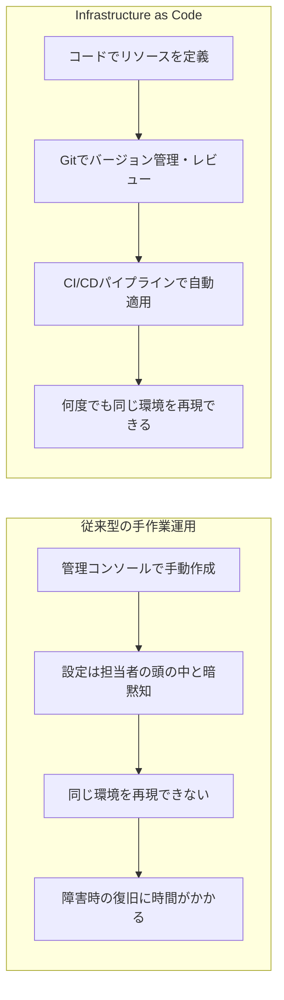

### コアプラクティス(書籍が定義する3本柱)

Kief Morris は IaC の核心を、次の3つのコアプラクティスに整理しています。初学者はまずこの3つを覚えるだけで、IaC の目的の8割を理解できます。

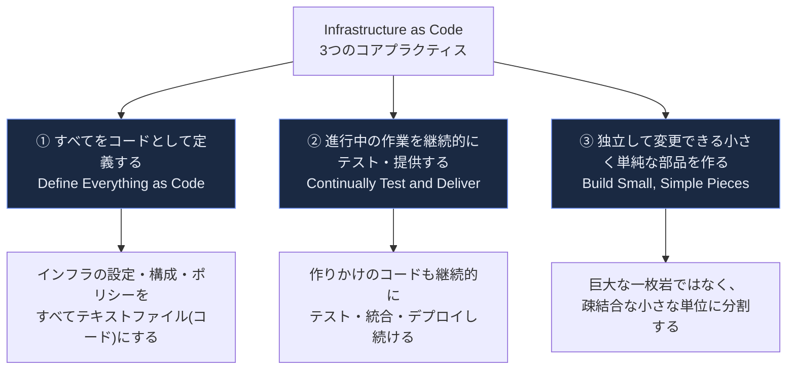

> **ベストプラクティス**
> - IaC 導入の最初のステップは「ツール選び」ではなく「何をコード化するかの範囲を決めること」から始める
> - いきなり本番の巨大インフラを一括コード化しようとせず、新規リソースや影響範囲の小さい部分から始める
> - 手作業での変更(いわゆる "ClickOps")を許すと、コードと実態が乖離する「ドリフト(Drift)」が発生するため、早い段階でチームのルールとして禁止する

### よくある3つの誤解

書籍では、IaC 導入を妨げる典型的な思い込みを「神話(Myth)」として3つ挙げています。

| 神話 | 実際のところ |
|---|---|
| インフラはそう頻繁に変わらない | クラウド時代はスケーリング・パッチ適用・構成変更が日常的に発生し、変更こそが常態である |
| インフラは先に構築してから、あとで自動化すればいい | 後付けの自動化は「今動いている状態」を正として逆算する必要があり、最初からコード化するより遥かにコストが高い |
| スピードと品質はトレードオフである | 自動化されたテストとデリバリーパイプラインがあれば、変更を高速化しながら品質(信頼性)も同時に高められる |

### DORA Four Keys ― 「速いか安全か」ではなく両方測る

3つ目の神話(速度と品質のトレードオフ)を定量的に裏付けるのが、Google Cloud の DevOps Research and Assessment(DORA)チームによる調査です。DORA は、書籍 *Accelerate*(Nicole Forsgren, Jez Humble, Gene Kim 著)を通じて、ソフトウェアデリバリーのパフォーマンスを4つの指標で測定できることを示しました。

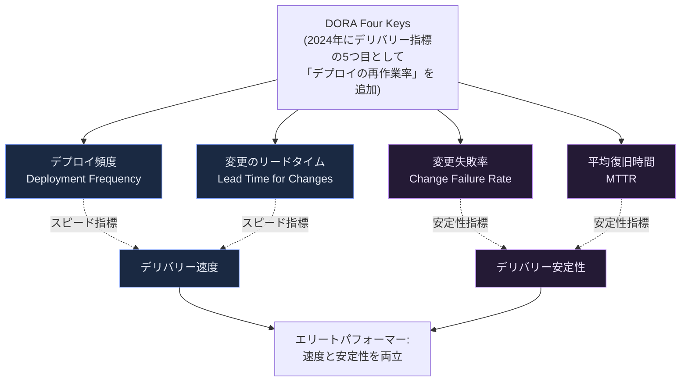

なお、2024年版で追加された5つ目のデリバリー指標は「デプロイの再作業率(rework rate)」であり、信頼性(Reliability)はデリバリー指標ではなく運用パフォーマンスの指標として別枠で扱われます。

DORA の 2024 State of DevOps Report では、エリートパフォーマーはオンデマンドで複数回デプロイし、リードタイムは1日未満、変更失敗率は5%前後、障害復旧は1時間以内という水準にあると報告されています。ただし、DORA の 2025 年のレポート(State of AI-assisted Software Development)では、AI 活用の広がりに伴ってスループット(デプロイ頻度・リードタイム)と不安定性(変更失敗率など)をどう両立させるかが主要な論点として取り上げられています。デプロイ頻度・リードタイムだけを見て開発生産性を判断せず、DORAはあくまで「土台」として捉え、他の指標と組み合わせて評価するのが実務上の潮流です。

---

## 第1部 基礎編: IaC の土台となる考え方

### 第1章: Infrastructure as Code とは何か

#### 鉄器時代からクラウド時代へ

書籍は、インフラの歴史を「鉄器時代(Iron Age)」から「クラウド時代(Cloud Age)」への移行として描いています。物理サーバーを1台ずつ手作業でセットアップしていた時代から、API 経由でオンデマンドにリソースを生成・破棄できる時代への変化です。この変化が持つ本質的な意味は、「インフラの変更コストが劇的に下がった」ことにあります。

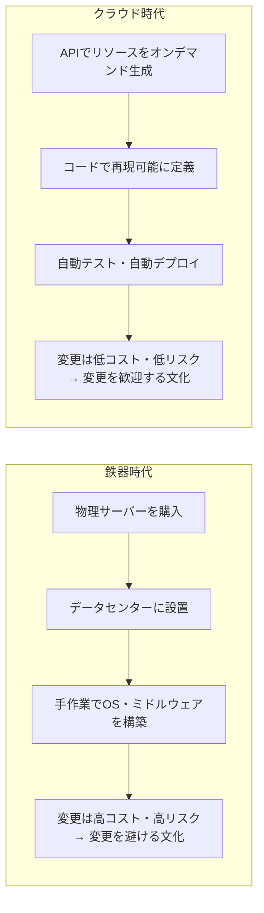

#### 戦略目標とアーキテクチャ目標

IaC は目的ではなく手段です。書籍は IaC がもたらす価値を、組織の戦略目標(コスト最適化、成長への対応、コンプライアンス遵守)とシステムアーキテクチャ目標(回復性、スケーラビリティ、セキュリティ)の両方に結びつけて説明しています。初学者がここで押さえるべきなのは、「変更を最適化する(Optimize for Change)」という一貫した思想です。変更を安全・迅速・確実に行えるようにすることが、あらゆる IaC プラクティスの根底にあります。

> **ベストプラクティス**
> - IaC 導入を提案するときは、「クールだから」ではなく「変更のリードタイムをどれだけ短縮できるか」「障害復旧時間をどれだけ短縮できるか」という具体的な指標で語る
> - チームや経営層に対しては、DORA Four Keys のような定量指標で Before/After を示すと説得力が増す

### 第2章: クラウド時代のインフラ原則

書籍第2章では、クラウドインフラを扱う上で前提とすべき6つの原則が示されています。初学者はこれを「クラウドあるある」の裏返しとして理解すると覚えやすいです。

| 原則 | 意味 | 具体例 |
|---|---|---|
| システムは信頼できないと想定する | ハードウェア障害・ネットワーク分断は日常的に起こる前提で設計する | Auto Scaling グループ、マルチAZ配置 |
| すべてを再現可能にする | 同じコードから何度でも同じ環境を作れるようにする | 設定・プロバイダー・外部の状態が安定していれば、Terraform の `apply` の再実行で望ましい状態へ収束する(コード外で変更が加わった場合は再適用時に差分が生じ得る) |
| スノーフレークシステムを避ける | 手作業のパッチが積み重なった「世界に一つだけの」環境を作らない | 手動SSHでの設定変更を禁止し、必ずコード変更経由にする |
| 使い捨て可能なものを作る | サーバーやコンテナは壊れたら再作成すればよい対象として扱う | Immutable Server(イミュータブルサーバー)パターン |
| バリエーションを最小化する | 環境ごとの差異(dev/staging/prodの違い)を極力減らす | 同じモジュールをパラメータだけ変えて複数環境に適用 |
| あらゆる手順を繰り返し可能にする | 一度きりの手作業手順ではなく、何度でも実行できる手順にする | 手順書(Runbook)をスクリプト化する |

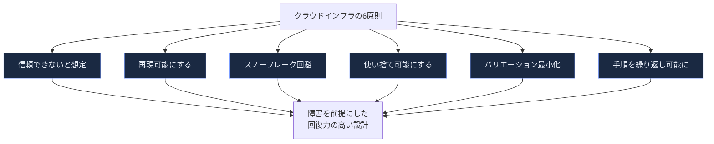

さらに書籍は、これらの原則を実現する手段として「ソフトウェア設計の原則」をインフラコードにも適用すべきだと述べています。これは第5章の CUPID プロパティに直結する重要な布石です。

### 第3章: インフラプラットフォームを理解する

「プラットフォーム」という言葉は曖昧に使われがちですが、書籍では **インフラプラットフォーム = アプリケーションやサービスを実行するために必要なリソース群一式** と定義しています。IaC を学ぶ上では、自分が扱っている対象がどのレイヤーのプラットフォームなのかを意識することが重要です。

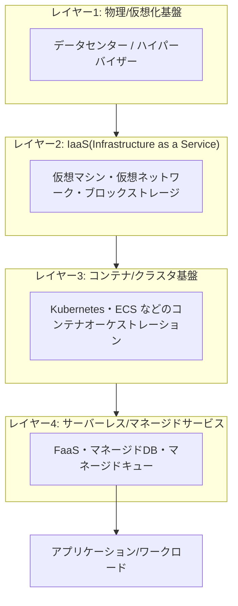

書籍はまた、プラットフォームが提供すべき4種類のサービス(プラットフォームデリバリーサービス、アプリケーションデリバリーサービス、インフラデリバリーサービス、プラットフォーム管理サービス)を整理しています。初学者向けに単純化すると、「プラットフォームチームは “道具を配る人” であり、アプリケーションチームは “道具を使う人”」という役割分担のイメージを持つと理解しやすいです。近年の**プラットフォームエンジニアリング(Platform Engineering)**という潮流は、まさにこの考え方を体系化したものです。

> **ベストプラクティス**
> - マルチクラウド戦略を検討する際は「本当に複数クラウドを同時運用する必要があるか」を精査する。書籍も、マルチクラウドは複雑性のコストに見合うメリットがある場合のみ採用すべきだと警告している
> - プラットフォームチームを作る場合は、アプリケーションチームがセルフサービスで使える「ゴールデンパス」を用意し、個別対応の依頼を減らす

### 第4章: IaC のツールと言語

#### コードで書けるもの・書けないもの

初学者がまず混乱しやすいのが「コードなのか設定なのか」という線引きです。書籍は、タスクベースのスクリプト(「これをやれ、次にこれをやれ」という手続き)から脱却し、インフラのあるべき状態を宣言的に記述する方向へ進化してきた歴史を説明しています。

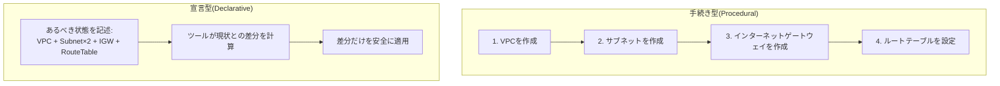

| 観点 | 手続き型(Imperative) | 宣言型(Declarative) |
|---|---|---|
| 記述内容 | 実行する「手順」 | あるべき「状態」 |
| 差分計算 | 開発者が自分で考える必要がある | ツールが自動計算する(例: `terraform plan`) |
| 代表的なツール | Bash スクリプト、Ansible の一部機能 | Terraform、OpenTofu、CloudFormation、Pulumi(宣言的に使う場合) |
| 向いている用途 | 一度きりの複雑な移行処理 | 継続的に管理するインフラ全般 |

#### コード実行のタイミングと状態管理

IaC ツールを使う上で必ず理解すべき概念が「いつコードが実行されるか」と「インフラの状態(State)をどう管理するか」です。多くの初学者がつまずくのはここです。

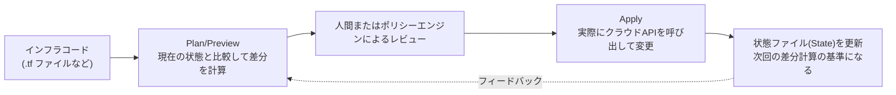

> **ベストプラクティス**
> - 状態ファイル(Terraform の `terraform.tfstate` など)は「インフラの中で最も危険なファイル」と心得る。リソースID・出力値・場合によっては平文シークレットが含まれるため、ローカルや Git に直接コミットしない
> - **リモートバックエンド**で共有する(S3、Azure Blob Storage、GCS、HCP Terraform など)。チーム全員が同じ State を参照でき、バージョニングやアクセス制御をバックエンド側の機能に任せられる
> - **保存時暗号化**を有効にする。バックエンド側の暗号化(S3 のサーバーサイド暗号化など)に加え、OpenTofu では State と plan ファイル自体をクライアント側で暗号化する **State Encryption** 機能が使える(これはバックエンドの一種ではなく、任意のバックエンドの上に重ねる暗号化機能で、Terraform には同等の機能がない)。ただし State Encryption は鍵を失うと State も plan も復号できなくなるため、有効化する **前に** 鍵管理と復旧の手順を必ず整備する: ① 鍵の保管場所(KMS / Vault など)を文書化する、② 鍵を冗長にバックアップし、State バックエンドとは別の障害ドメインに保管する、③ 鍵ローテーションの手順と頻度を定める、④ バックアップ鍵からの復号・復旧を定期的にリハーサルして手順が機能することを確認する
> - **State locking** で同時実行による破損を防ぐ。Terraform の S3 backend では現行のロック方法は `use_lockfile = true`(S3 のコンディショナルライトを使うネイティブロック)であり、従来の `dynamodb_table` によるロックは非推奨で将来のマイナーバージョンで削除予定
> - `plan` の結果を必ず人間または自動ポリシーチェックがレビューしてから `apply` する運用を徹底する。CI パイプラインで `apply` を自動実行する場合も、承認ステップを挟む
> - ツール選定よりも先に「状態管理の方針」を決める。ツールを乗り換えても状態管理の失敗は同じ形で繰り返される

---

## 第2部 設計編: 壊れにくいインフラコードを設計する

インフラコードも所詮は「コード」です。書籍の最大の主張の一つは、**ソフトウェア工学で培われた設計原則をインフラコードにも適用すべき**というものです。第2部では、この設計思想を具体的なパターンに落とし込んでいきます。

### 第5章: 設計原則と CUPID プロパティ

#### なぜ SOLID ではなく CUPID なのか

書籍は、インフラコードの設計指針として、著名なソフトウェアデザインコンサルタント **Dan North** が提唱した **CUPID プロパティ**を採用しています。CUPID は、オブジェクト指向設計で有名な SOLID 原則の「次の一手」として提案されたもので、「厳格なルール」ではなく「コードが持つべき性質(プロパティ)」として設計を評価する考え方です。

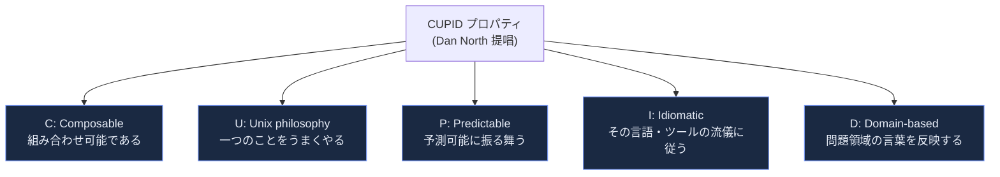

初学者向けに超訳すると、「一つのモジュールに何でも詰め込まず、名前から中身が予測でき、他のモジュールと自由に組み合わせられる部品を作る」ということです。この考え方は Azure や AWS が公式に提供する検証済みモジュール群(Verified/Reference Modules)の設計原則としても参照されています。

#### 凝集度と結合度

CUPID と並んで重要なのが、**凝集度(Cohesion)** と **結合度(Coupling)** です。

| 概念 | 望ましい状態 | 望ましくない状態 |
|---|---|---|
| 凝集度(Cohesion) | 高い: 一つのモジュール内の要素が強く関連し、一つの目的に集中している | 低い: 無関係な機能が一つのモジュールに雑多に詰め込まれている |
| 結合度(Coupling) | 低い: モジュール間の依存が最小限で、一方の変更が他方に波及しにくい | 高い: モジュール同士が密結合し、一箇所の変更が連鎖的に他へ影響する |

> **ベストプラクティス**
> - モジュールを設計するときは「このモジュールが変更される理由は一つに絞れているか?」を自問する
> - モジュール間のインターフェース(入力変数・出力値)は最小限かつ明示的にし、内部実装の詳細を外部に漏らさない(Facade パターン、第10章で詳述)

### 第6章: インフラコンポーネントとスタック

#### ワークロード駆動の設計

書籍は、インフラ設計の出発点は「インフラそのもの」ではなく「そのインフラが支えるワークロード(アプリケーションやサービス)」であるべきだと述べています。この考え方を「アプリケーション駆動インフラ設計」と呼びます。

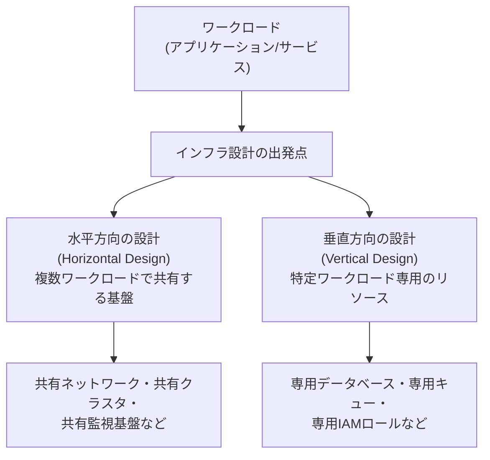

#### インフラデプロイメントスタックとは

「スタック」とは、一度のデプロイ操作(`terraform apply` など)で一括して作成・更新・削除される、ひとまとまりのインフラリソース群を指します。書籍はスタックを IaC 設計の基本単位として位置づけています。

> **ベストプラクティス**
> - スタックの境界は「一緒に変更される頻度が高いリソース」でまとめる。変更頻度が異なるリソース(例: 滅多に変わらないネットワーク基盤と、頻繁に変わるアプリケーション設定)は別スタックに分離する
> - コードライブラリ(モジュール)とスタックを混同しない。モジュールは「再利用可能な設計図」、スタックは「実際にデプロイされる実体」である

### 第7章: デプロイ可能なスタックの設計パターン

書籍第7章では、スタックのサイズと構造に関する複数のパターンが紹介されています。初学者にとって最も実務的な意思決定ポイントがここです。

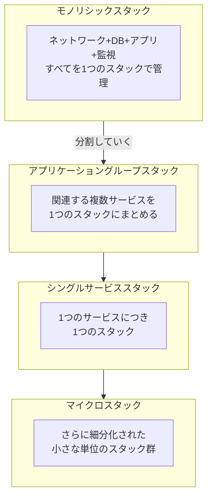

| パターン | メリット | デメリット | 向いている場面 |
|---|---|---|---|
| モノリシックスタック | シンプルで依存関係の管理が容易 | 変更のたびに巨大な `plan` が走り、影響範囲の把握が困難、チーム間の競合が起きやすい | 小規模プロジェクト、PoC |
| アプリケーショングループスタック | 関連サービスをまとめて一貫性を保てる | グループの粒度設計を誤ると結局モノリシックに近づく | 密結合なマイクロサービス群 |
| シングルサービススタック | サービス単位でチームの所有権を明確化できる | サービス間の依存関係(第9章)を別途管理する必要がある | サービス単位でチームが分かれた組織 |
| マイクロスタック | 変更の影響範囲を最小化できる | スタック数が増えすぎると管理オーバーヘッドが増大する | 非常に大規模かつ変更頻度の高いシステム |

書籍はさらに、複数インスタンス化のためのパターンとして「マルチ環境スタック(同じコードを dev/staging/prod に適用)」「再利用可能スタック(汎用モジュールとして複数チームに配布)」も紹介しています。

> **ベストプラクティス**
> - 最初から細かく分割しすぎない。モノリシックから始め、実際にチーム間の競合やデプロイ時間の問題が顕在化してから段階的に分割する「進化的な分割」が現実的
> - スタックの粒度を決める基準は「技術的な美しさ」ではなく「誰が、どの頻度で、何を変更するか」というチームトポロジーの観点で判断する

### 第8章: 設定管理とシークレットの取り扱い

#### スタックパラメータの原則

スタックを複数の環境(dev/staging/prod)にインスタンス化する際、環境ごとの差異は「パラメータ」として外部化します。書籍はここで重要な原則を示しています。**パラメータはシンプルに保つ**ことです。複雑な条件分岐をパラメータ経由で埋め込むと、コード自体よりもパラメータの組み合わせを追跡する方が難しくなります。

| 設定方法 | 特徴 |
|---|---|
| 手動パラメータ入力 | 最もシンプルだが、ヒューマンエラーのリスクが高く自動化に向かない |
| 環境変数 | CI/CD パイプラインとの親和性が高い |
| スクリプトによる動的パラメータ生成 | 柔軟だが、ロジックが複雑化しやすい |
| 設定ファイル(YAML/JSON/tfvars) | 可読性が高くレビューしやすい。最も一般的 |
| パイプラインのステージパラメータ | パイプラインのステージごとに値を切り替える |
| 設定レジストリ(Parameter Store 等) | 一元管理でき、複数スタックから参照可能 |

#### シークレット管理

パスワードや API キーなどのシークレットは、通常のパラメータと同列に扱ってはいけません。書籍は複数のアプローチを比較しています。

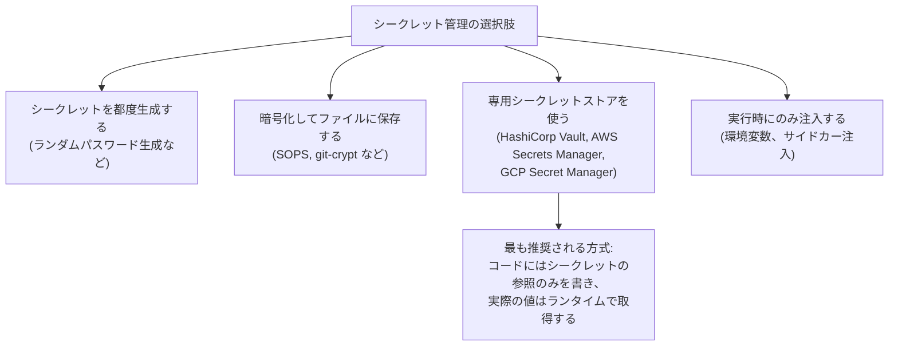

> **ベストプラクティス**
> - 平文シークレットを絶対に Git リポジトリにコミットしない。誤ってコミットした場合は「削除」ではなく「値そのものをローテーション(無効化して再発行)」する
> - 専用のシークレット管理サービス(Vault、Secrets Manager など)を使い、インフラコードには参照(ARN や Secret ID)のみを記述する
> - CI/CD パイプラインの実行ログにシークレットの値が出力されないよう、マスキング設定を必ず有効にする

### 第9章: スタック間の連携

複数のスタックに分割すると、必然的に「スタックAが作ったリソースの情報を、スタックBがどう参照するか」という統合の問題が発生します。書籍はこれを **リソースディスカバリー(Resource Discovery)** の問題として整理しています。

| パターン | 仕組み | トレードオフ |
|---|---|---|
| リソースマッチング | タグや命名規則からクラウド API 経由で動的に検索する | 柔軟だが、命名規則が崩れると誤検出のリスクがある |
| スタック状態の参照 | 他スタックの State ファイルから出力値を直接読み込む(`terraform_remote_state` など) | シンプルだが、スタック間に強い結合が生まれ、State 全体への読み取り権限が必要になる |
| 統合レジストリの参照 | Parameter Store 等の中央レジストリに値を書き込み・読み込みする | 疎結合を保てるが、レジストリ自体が単一障害点になりうる |
| コンポジションによる結線 | 上位のオーケストレーションコードで複数スタックの出力・入力を明示的に配線する | 依存関係が明示的になるが、コンポジション層の管理コストが発生する |

> **ベストプラクティス**
> - スタック間の依存は「暗黙の名前規則」に頼らず、可能な限り明示的な出力(Output)と入力(Input)として定義する
> - `terraform_remote_state` は参照側に **State スナップショット全体への読み取り権限** を要求する。State や Output にパスワード・API キーなどの秘密が含まれていると、それらが参照側スタックへそのまま公開されるため、そもそも秘密を State や Output に置かない方針を徹底する(秘密は Secrets Manager 等の専用ストアに置き、参照側がそこから直接取得する)
> - HCP Terraform を使う場合は、State 全体ではなく特定の Output だけを参照できる `tfe_outputs` データソースを用いて、露出範囲を限定する
> - 依存関係が複雑になりすぎたら、それはスタック分割の粒度が細かすぎるサインとして再検討する

### 第10章: コードライブラリ(モジュール)の設計パターン

第10章は、いわゆる「Terraform モジュール」や「Pulumi コンポーネント」をどう設計するかについて、ソフトウェアのデザインパターンを応用した具体的な型を提示しています。

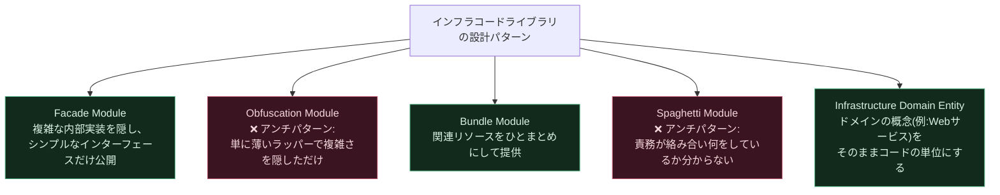

| パターン名 | 目的 | 使い所 |
|---|---|---|
| Facade Module | 複雑な複数リソースの組み合わせを、シンプルな入出力インターフェースの背後に隠す | チーム外への配布用モジュール |
| Unshared Module | あえて共有せず、単一の用途に特化させる | 汎用化のコストが再利用のメリットを上回る場合 |
| Bundle Module | 常に一緒に使われるリソース群をパッケージ化する | 「Webサーバー+ロードバランサー+ヘルスチェック」のような定番構成 |
| Infrastructure Domain Entity | ビジネスドメインの概念をそのままインフラの単位として表現する | 「顧客ごとのテナント環境」のようなドメイン特化型の抽象化 |
| Modular Monolith | 内部はモジュール分割しつつ、デプロイ単位は1つにまとめる | 過度な分割によるオーバーヘッドを避けたい中規模チーム |
| Obfuscation Module(アンチパターン) | 見た目だけシンプルにして複雑さを覆い隠す | 避けるべき: 中身を理解せず使うと事故のもとになる |
| Spaghetti Module(アンチパターン) | 責務が絡み合い、変更の影響範囲が予測できない | 避けるべき: リファクタリング対象 |

> **ベストプラクティス**
> - モジュールの入力変数(Variables)は最小限に絞り、デフォルト値を適切に設定して「呼び出し側が意識すべきこと」を減らす
> - モジュールを公開・共有する前に、README とサンプルコードを必ず整備する。Terraform Registry や社内モジュールカタログのように、検索・発見しやすい場所に置く
> - 「とりあえず薄くラップしただけ」の Obfuscation Module にならないよう、モジュール化によって本当に複雑さが減っているかを定期的に見直す

### 第11章: サーバーをコードとして構築する

コンテナやサーバーレスが主流になった今でも、多くのシステムは何らかの形で仮想マシン(サーバー)を必要とします。書籍は、サーバーの構成方法を大きく2つの軸で整理しています。

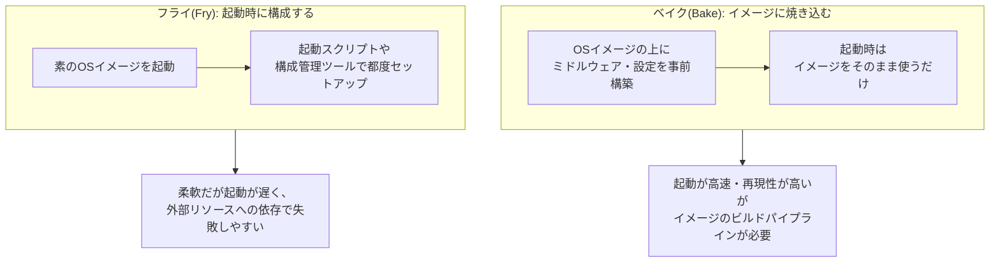

さらにサーバーの更新方法についても、書籍は明確な優先順位を示しています。

| 更新方式 | 説明 | 評価 |
|---|---|---|
| Push on Change(変更時にプッシュ) | 変更があるたびに構成管理ツールを実行して反映 | シンプルだが構成ドリフトが起きやすい |
| 継続的構成同期(Continuous Configuration Synchronization) | エージェントが定期的にあるべき状態と現状を同期し続ける | ドリフトを自動的に是正できる |
| **Immutable Server(イミュータブルサーバー)** | サーバーを直接変更せず、新しいイメージから作り直して置き換える | 最も推奨。再現性が高く、インスタンス内部の設定ドリフトを抑え込める |

> **ベストプラクティス**
> - 可能な限り Immutable Server パターンを採用し、「サーバーにログインして直接修正する」運用を根絶する
> - サーバーへの SSH アクセスは緊急時のデバッグ用に限定し、通常運用では利用しないルールを設ける(そもそもアクセスできない設計が理想)
> - コンテナベースのワークロードでは、この考え方はそのままイミュータブルなコンテナイメージの原則として引き継がれる

### 第12章: 環境(Environment)の設計

#### マルチ環境アーキテクチャ

「環境」という言葉も曖昧に使われがちですが、書籍は環境を **デリバリー環境(開発・ステージング・本番)** と **環境レプリカ(地理的分散、ユーザー層別)** に分けて整理しています。

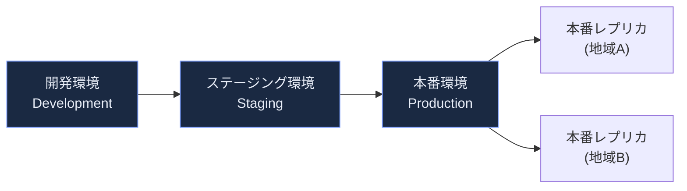

環境を分割する軸としては、システムアーキテクチャに沿った分割、組織構造に沿った分割、ガバナンス要件(規制・コンプライアンス)に沿った分割の3種類が紹介されています。

> **ベストプラクティス**
> - dev/staging/prod の環境間で「バリエーションを最小化する」原則(第2章)を徹底し、本番だけ特別な構成になっていないか定期的に検証する
> - 環境を増やす際は、増やすことによる恩恵(安全性の向上)と管理コスト(環境数 × 変更適用の手間)を天秤にかける

---

## 第3部 デリバリー編: 安全に届け、変更し続ける

### 第13章: コアインフラデリバリーワークフロー

書籍は継続的デリバリーの原則をインフラコードに適用し、9つの原則を挙げていますが、初学者にとって特に重要なのは次の4つです。

| 原則 | 内容 |
|---|---|
| プロセス全体を自動化する | 手動ステップが1つでも残っていると、そこがボトルネックと事故の温床になる |
| 自動化されたプロセス以外での変更を禁止する | 「緊急だから直接コンソールで直した」を許容しない文化を作る |
| 変更を包括的に届ける | コードの一部だけでなく、関連する設定・ドキュメント・テストも一緒に届ける |
| デリバリーサイクルを短く保つ | 変更をまとめて大きくするほど、リスクと切り分けの難しさが増す |

これらの原則の上に、書籍は開発 → ビルド → テスト → リリース → 実行という基本的なワークフローサイクルを定義しています。

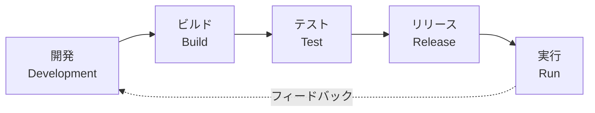

### 第14章: パイプラインの構築と組織化

#### ビルドとデプロイの2つの戦略

書籍は、コードのビルドとデプロイをいつ結びつけるかについて、2つの代表的なワークフローを比較しています。

| 戦略 | 説明 | メリット | デメリット |
|---|---|---|---|
| Build on Deploy | デプロイのたびにビルド(パッケージ化)も行う | シンプルで学習コストが低い | デプロイのたびに依存関係が変わるリスクがある(再現性が低い) |
| Build Once, Deploy Many | 一度ビルドした成果物を、複数の環境に順番にデプロイする | 全環境で全く同じ成果物が使われるため再現性が高い | ビルド成果物の保管・バージョン管理の仕組みが別途必要 |

書籍は、テスト済みの成果物をそのまま昇格させる **Build Once, Deploy Many** を強く推奨しています。これは、アプリケーションのコンテナイメージを一度ビルドして dev → staging → prod と昇格させる、一般的な CI/CD のベストプラクティスと同じ発想です。

#### ローカル開発とパイプラインの設計

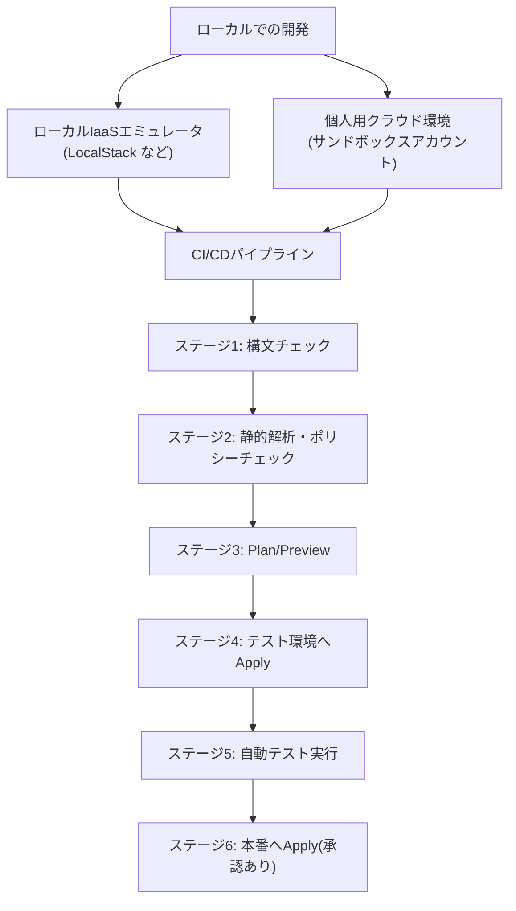

> **ベストプラクティス**
> - パイプラインのステージは、失敗コストが低い(実行時間が短く、影響範囲が狭い)チェックほど早い段階に置く「シフトレフト」の考え方に従う
> - 「Just Enough Environment(必要十分な環境)」の原則で、ローカル開発環境は完全な本番レプリカである必要はなく、開発に必要な最小限の構成にとどめる

### 第15章: インフラコードのテスト戦略

#### なぜインフラコードのテストは難しいのか

書籍は、インフラコードのテストが通常のアプリケーションコードのテストより難しい理由を複数挙げています。宣言的なコードに対する単体テストは価値が低いことが多い、テスト自体が実際にクラウドリソースを作るため遅い、外部依存(他のスタックや外部サービス)がテストを複雑にする、といった点です。

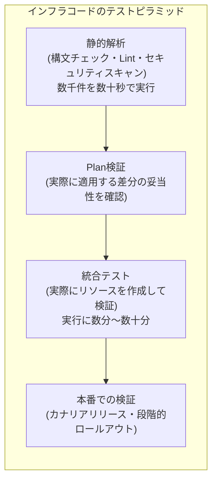

書籍は、単純なピラミッド型だけでなく「Swiss Cheese Testing Model(スイスチーズテストモデル)」も紹介しています。これは、単一のテスト層に完全性を求めるのではなく、複数の不完全なテスト層を重ねることで、穴(見逃し)を塞いでいくという考え方です。ジェームズ・リーズン教授が提唱した「スイスチーズモデル」の安全工学の考え方を、テスト戦略に応用したものです。

> **ベストプラクティス**
> - 「本番でテストする(Testing in Production)」ことを恐れず、正しく管理する。カナリアリリースや機能フラグを使えば、本番環境でしか検証できない事象(実際のトラフィックパターンなど)を安全に確認できる
> - すべてを1つのテスト層に頼らない。静的解析・Plan検証・統合テストの各層でそれぞれ異なる種類の問題を検出する設計にする

### 第16章: テストの実装

#### オフラインテストとオンラインテスト

書籍はテストのステージを、クラウド API を呼び出さない「オフラインテスト」と、実際にリソースを作成・変更する「オンラインテスト」に分類しています。

| 分類 | テストの種類 | 目的 | 代表的なツール |
|---|---|---|---|
| オフライン | 構文チェック | HCL および `.tf.json` 形式の構成ファイルの文法・整合性エラー検出 | `terraform validate`, `tofu validate` |
| オフライン | 静的コード解析(オフライン) | ベストプラクティス違反・セキュリティ設定ミスの検出 | tflint, Checkov, tfsec(Trivy に統合) |
| オフライン | サプライチェーンチェック | 依存モジュール・プロバイダーの脆弱性・改ざんの検出 | チェックサム検証、SBOM生成 |
| オンライン | 静的コード解析(クラウド接続あり) | 実際のクラウドAPIのスキーマと突き合わせた検証 | クラウドプロバイダーのAPIバリデーション |
| オンライン | Plan/Preview | 実際に適用される変更内容の事前確認 | `terraform plan`, `tofu plan` |
| オンライン | 検証(Verification) | 作成されたリソースの状態に対するアサーション | Terratest, InSpec |
| オンライン | 成果検証(Outcomes) | インフラが実際に機能要件を満たしているかの検証 | エンドツーエンドテスト、スモークテスト |

Checkov のような静的解析ツールは、重大度の高いセキュリティ設定ミス(パブリックS3バケット、暗号化の欠落、過剰な権限のIAMポリシーなど)を早期に検出できます。Zop.dev の報告では、事前スキャンを行っていないチームのコードに対して1,000行あたり平均14件という目安が示されていますが、これはあくまでその条件下での数値であり、既にスキャンを運用しているチームやルールセットの異なる環境にそのまま当てはまるものではありません。実行時間もコード量・ルールセット・実行環境に左右されますが、一般に pre-commit フックで回せる程度に軽量なため、tflint と組み合わせて pre-commit フックと CI パイプラインの両方に組み込むのが実務上のデファクトスタンダードです。

#### テストインスタンスのライフサイクル

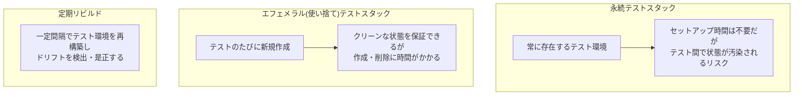

> **ベストプラクティス**
> - テストフィクスチャを使って外部依存(他チームのスタック、外部API)を切り離し、テスト対象を独立して検証できるようにする
> - CI パイプラインに依存しすぎたテストコードを書かない。ローカルでも同じテストを実行できるようにし、開発者がパイプラインを待たずに検証できるようにする

### 第17章: インフラのデプロイ

#### デプロイ戦略の理解

書籍は、ソフトウェアのデプロイ戦略(Push型、Pull型、GitOps型)をインフラのデプロイにも適用できることを示しています。

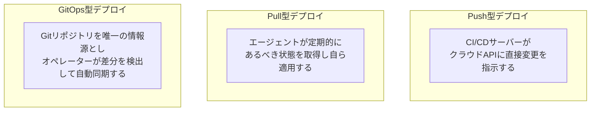

#### デプロイの実行元

| 実行元 | 特徴 | リスク |
|---|---|---|
| 開発者のローカルPCから直接デプロイ | 最も手軽 | 個人の環境差異による事故、認証情報の管理が煩雑になる |
| 中央サービスから実行 | チームで一元管理できる | サービス自体の可用性がボトルネックになりうる |
| デリバリーパイプラインから実行 | 監査ログ・承認フローと統合しやすい | パイプライン自体のセキュリティ強化が必須 |
| 専用のインフラデプロイサービスを利用 | HCP Terraform、Spacelift、env0 など | ベンダーロックインの検討が必要 |

> **ベストプラクティス**
> - 手元のPCから本番環境へ直接 `apply` する運用は極力避け、必ずパイプラインまたは専用サービス経由にする(認証情報の集中管理・監査ログのため)
> - デプロイのトリガーは「手動トリガー」と「自動トリガー」を明確に使い分ける。本番への自動適用は、十分なテストとポリシーチェックを通過した場合に限定する

### 第18章: 既存インフラを安全に変更する

#### 変更を小さく分割する

書籍は、大きな変更を一度に適用するのではなく、インクリメンタル(段階的)に分割することの重要性を強調しています。この章の核心は **Expand and Contract(拡張と収縮)パターン** です。

```mermaid
flowchart LR
    Old["旧構成のみ存在"] --> Expand["Expand:<br/>新旧両方の構成を並行稼働させる"]
    Expand --> Migrate["トラフィック/データを<br/>段階的に新構成へ移行"]
    Migrate --> Contract["Contract:<br/>旧構成を安全に削除する"]
```

このパターンは、データベースのスキーマ変更(カラムのリネームなど)や、ネットワーク構成の変更など、「一瞬で切り替えると壊れるが、段階的になら安全に移行できる」変更に広く応用できます。

#### デプロイ時の停止時間を最小化する

| 戦略 | 仕組み |
|---|---|
| Blue-Green デプロイ | 新旧2つの環境を用意し、トラフィックを一括で切り替える。切り戻しが容易 |
| ローリングアップグレード | インスタンスを少数ずつ順番に入れ替えていく |
| カナリアリリース | ごく一部のトラフィックだけを新バージョンに流し、問題がなければ徐々に拡大する |

#### データを扱うインフラの変更

ステートレスなインフラと違い、データベースなどステートフルなリソースの変更は特に慎重さが求められます。書籍は「Store and Load」「継続的データ転送」「データインフラの分離」「継続的災害復旧」といった手法を紹介しています。

> **ベストプラクティス**
> - 破壊的な変更(削除を伴う変更)は、必ず一度「非推奨化(Deprecation)」の期間を設け、実際に参照がなくなったことを確認してから削除する
> - ステートフルなリソースの変更前には、変更内容に関わらず必ずバックアップ/スナップショットを取得する運用をパイプラインに組み込む

### 第19章: ガバナンスとコンプライアンス(Shift Left)

#### シフトレフトの考え方

「シフトレフト」とは、本来リリース後やレビュー段階で行っていたチェック(セキュリティ・コンプライアンス・コスト管理)を、開発サイクルのより早い段階に前倒しすることを指します。

```mermaid
flowchart LR
    subgraph Before["従来: シフトライトな運用"]
        B1["開発"] --> B2["デプロイ"] --> B3["監査人が事後チェック"] --> B4["問題発覚 → 手戻り"]
    end
    subgraph After["シフトレフト後"]
        A1["コーディング時にIDEでチェック"] --> A2["コミット時にpre-commitフックでチェック"]
        A2 --> A3["CI段階でPolicy as Codeが自動判定"]
        A3 --> A4["問題があればマージ前にブロック"]
    end
```

#### コンポーネント設計レイヤー別の統制

書籍は、ガバナンスの統制(コントロール)を、コード自体・ワークフロー(パイプライン)・実行時の3つのレイヤーに分けて設計すべきだとしています。

| レイヤー | 統制の例 |
|---|---|
| コンポーネント設計レイヤー | 承認済みモジュールのみ使用を許可するモジュールカタログ |
| ワークフローレイヤー | パイプライン内での Policy as Code チェック、承認フロー |
| 実行時レイヤー | クラウドプロバイダー自体のガードレール(AWS Organizations SCP、Azure Policy など) |

> **ベストプラクティス**
> - コンプライアンス要件を文書(Word や PDF)にとどめず、可能な限り自動テスト可能なポリシーコードに変換する(第22章の Policy as Code で詳述)
> - 統制を1つのレイヤーに集中させず、コード・パイプライン・実行時の複数レイヤーで多重に(スイスチーズモデル的に)防御する

---

## 第4部 実践編: 2026年の IaC エコシステム

ここまでの原則・パターンは、特定のツールに依存しない普遍的な考え方でした。第4部では、2026年8月時点で実際に採用を検討すべき具体的なツールとエコシステムの状況を、Web検索で確認した最新情報に基づいて解説します。

### 第20章: ツール選定(Terraform / OpenTofu / Pulumi / AWS CDK)

#### ライセンス変更と OpenTofu の誕生という転換点

2026年時点の IaC ツール選定を理解する上で欠かせない前提が、2023年8月に起きたライセンス変更です。HashiCorp が Terraform のライセンスを、オープンソースライセンスである MPL 2.0 から、Business Source License(BSL)1.1 へ変更しました。BSL 1.1 は商用利用全般を禁じるものではなく、組織内での利用や通常の商用利用は引き続き認めた上で、HashiCorp の有償版と大きく競合する製品を第三者へホスト型・組込み型で提供する行為を制限するものです。これに対し、Linux Foundation の傘下で、**OpenTofu** が MPL 2.0 ライセンス下にあった最後の Terraform のコミットからフォークされ、2024年1月に安定版(GA)がリリースされました。

```mermaid
flowchart TB
    T2023["2023年8月<br/>HashiCorpがTerraformを<br/>MPL 2.0 → BSL 1.1へ変更"] --> Fork["Linux Foundation配下で<br/>最後のMPL 2.0版Terraformの<br/>コミットからOpenTofuがフォーク"]
    Fork --> GA["2024年1月<br/>OpenTofu 安定版(1.6.0)リリース"]
    GA --> Diverge["機能面でも分岐が進行<br/>(State暗号化、Provider-defined Functionsなど)"]
    T2023 --> IBM["2025年<br/>IBMがHashiCorpを買収完了"]

    classDef eventFill fill:#1a2942,stroke:#7c9eff,color:#e8edf7
    class T2023,Fork,GA,Diverge,IBM eventFill
```

2026年時点では、OpenTofu は単なる「無料の代替品」ではなく、Terraform が未実装の機能(ネイティブな State 暗号化など)を先行して提供するなど、機能面でも独自の進化を遂げています。移行自体は「ほぼドロップイン」なケースが多いとされていますが、実際には次の順序で進めます。① State ファイルとコードのバックアップを取得する(State のバージョニングが有効なリモートバックエンドであることを確認する)。② 現在の Terraform のバージョンと各プロバイダーのバージョンを確認し、移行先の OpenTofu が対応しているかを互換性表で突き合わせる。③ OpenTofu 公式の移行手順に従って `tofu init` を実行する。④ `tofu plan` を実行し、予期しない差分が出ていないことを確認する。⑤ 予期しない差分がなければ、差分がゼロ(No changes)の場合でも `tofu apply` を実行して State の書き込みを OpenTofu 側で一度通し、移行を完了させる。予期しない差分がある場合はここで実行を止め、プロバイダーのバージョン差やコードの互換性など原因を解消してから ④ に戻る。なお、機能差が広がるにつれてこの移行の容易さの「賞味期限」は徐々に短くなっているとの指摘もあります。

#### 主要ツールの比較

| ツール | 言語/形式 | ライセンス/ガバナンス | 特徴 |
|---|---|---|---|
| Terraform | HCL(宣言型DSL) | BSL 1.1(HashiCorp、IBM傘下) | 業界標準としての導入実績が最大。HCP Terraform でのマネージドサービスが充実 |
| OpenTofu | HCL(Terraformと高い互換性) | MPL 2.0(Linux Foundation) | オープンソースであることの確実性を重視するチームの新規プロジェクトでの第一候補になりつつある |
| Pulumi | TypeScript/Python/Go/Javaなど汎用言語 | オープンソース中核部分+商用SaaS | HCLを使わず汎用言語で記述するため、既存のテストフレームワークでユニットテストが書ける |
| AWS CDK | TypeScript/Python/Javaなど(CloudFormationにコンパイル) | Apache 2.0(AWS) | AWS環境に閉じるならアプリ開発者に馴染みやすい構文で書ける |
| Ansible | YAML(手続き寄りだが冪等性を意識した設計) | GPL系(Red Hat) | サーバー構成管理・アプリケーションデプロイとの親和性が高い |

Pulumi の優位点は言語選択そのものではなく「テスト容易性」にあるとの指摘があります。Pulumi のプログラムは、実際にクラウドリソースをプロビジョニングせずに、各言語の標準的なテストフレームワーク(Jest、pytest、Go の testing など)でユニットテストを書けます。一方の HCL 側も、Terraform 1.6 で導入された `terraform test`(`.tftest.hcl` によるテストファイル)と、Terraform 1.7 以降の `mock_provider`(プロバイダーやリソース、データソースの応答をモックする機能)により、実環境にリソースを作らずにモジュールをテストできるようになっています。OpenTofu も 1.6 でテストフレームワーク(`.tftest.hcl` によるテストファイルと `run` ブロック)を、1.7 で `mock_provider` を導入しており、基本的な書き方は共通です。ただし両者は完全互換ではなく、たとえば Terraform 1.7 以降が `mock_provider` ブロック内にネストして記述できる `override_resource` / `override_data` を OpenTofu はサポートしていません。OpenTofu では `mock_provider` 内の `mock_resource` / `mock_data`、またはトップレベルの `override_resource` / `override_data` へ書き換える必要があり、既存のテスト資産を移行する際はこの差分ぶんのテスト再構成が発生します。したがって「HCL にはテスト手段がない」わけではなく、既存の言語エコシステム(アサーションライブラリ、カバレッジ、モックフレームワーク)をそのまま使えるかどうかが実質的な差になります。一方で、宣言型で確立されたワークフロー(HCLベース)に慣れているチームにとっては、Terraform・OpenTofu も依然として効果的に機能し続けています。

> **ベストプラクティス**
> - ツール選定に時間をかけすぎない。書籍が繰り返し強調するように「原則・パターン・プラクティス」はツールを問わず適用できるため、既存のチームスキルセットや周辺エコシステム(モジュールの入手性、社内の知見)を優先して選ぶ
> - 新規プロジェクトで、まだ大きな社内資産(既存の Terraform コード)がない場合は、ライセンスの確実性という観点から OpenTofu を検討する価値がある
> - 既存の大規模な Terraform 資産を持つチームは、無理に移行を急がず、State 暗号化などの新機能が本当に必要になったタイミングで移行を評価する

### 第21章: GitOps による継続的デリバリー

#### GitOps の基本ループ

GitOps は、第17章で紹介した「Pull型デプロイ」の考え方を、Kubernetes を中心としたクラウドネイティブ環境に特化して発展させたものです。Git リポジトリを唯一の信頼できる情報源(Single Source of Truth)とし、オペレーター(コントローラー)が継続的にクラスタの実際の状態と Git 上のあるべき状態を比較・同期します。

```mermaid
flowchart LR
    Dev["開発者がコード変更"] --> PR["プルリクエスト"]
    PR --> Review["レビュー・承認"]
    Review --> Merge["Gitリポジトリへマージ"]
    Merge --> Detect["GitOpsオペレーターが<br/>差分を検知"]
    Detect --> Sync["クラスタへ自動適用(同期)"]
    Sync --> Report["同期状況をレポート"]
    Report -.状態確認.-> Detect
```

GitOps の2大 CNCF(Cloud Native Computing Foundation)卒業プロジェクトが **Argo CD** と **Flux** です。CNCF の2025年の調査では、回答者が管理する Kubernetes クラスターのうち Argo CD が使われているものが60%を超えると報告されています。これは Argo CD という単一ツールの利用割合であり、GitOps 全体の普及率を示す数値ではない点に注意が必要です。

| 観点 | Argo CD | Flux |
|---|---|---|
| アーキテクチャ | 単一のアプリケーションとして動作し、UIとAPIサーバーを持つ | Source/Kustomize/Helm/Notificationなど複数の軽量コントローラーの集合体 |
| UI | リッチなWeb UIを標準搭載 | CLI中心(サードパーティのダッシュボードと組み合わせ可能) |
| 向いている組織 | 複数クラスタを一元管理したい、非エンジニアにも可視性を提供したいプラットフォームチーム | 攻撃対象領域を最小化したい、Kubernetesネイティブなツールを好むチーム |
| 進行的デリバリー連携 | Argo Rollouts(カナリア・Blue-Green) | Flagger |

実務では、両者を「アプリケーションデリバリーは Argo CD、プラットフォーム/インフラレベルの GitOps(証明書管理・監視基盤など)は Flux」という形で使い分ける組織もあります。ただし、2つの GitOps エンジンを並行運用することは運用の複雑性を増すため、明確なチーム境界と十分な運用成熟度がある組織にのみ推奨されるアプローチです。

> **ベストプラクティス**
> - GitOps 導入の第一歩は、まず「Git 上のマニフェストが承認済みの desired state(あるべき状態)であり、クラスタ上の actual state(実際の状態)はそこへ収束させる対象である」という関係を、1つのクラスタ・1つのアプリケーションから始めて確立すること。オペレーターが両者の差分を検知し、reconciliation によって actual state を desired state に合わせる(ドリフトした実態を Git へ書き戻すのではない)
> - GitOps オペレーター自体のセキュリティ(RBAC設定、Secret管理)を、通常のアプリケーションと同等以上の水準で監査する

### 第22章: Policy as Code によるガバナンス自動化

#### 3種類のポリシーツールの使い分け

第19章で触れた「シフトレフトなガバナンス」を実現する具体的な技術が Policy as Code です。2026年時点では、目的の異なる3種類のツールを組み合わせて使うのが実務上の定石になっています。

```mermaid
flowchart TB
    Gate["インフラ変更のパイプラインゲート"]
    Gate --> Scanner["セキュリティスキャナー<br/>(Checkov, Trivy/tfsec)"]
    Gate --> Engine["汎用ポリシーエンジン<br/>(OPA + Rego + Conftest)"]
    Gate --> Vendor["ベンダー固有エンジン<br/>(HashiCorp Sentinel)"]

    Scanner --> S1["数千件の既知の設定ミスを<br/>ノーコストで即座に検出"]
    Engine --> E1["組織固有のルール<br/>(命名規則・許可リージョン・<br/>タグ必須化など)をRegoで記述"]
    Vendor --> V1["HCP Terraform/Enterprise環境で<br/>ネイティブに統合"]

    classDef gateFill fill:#1a2942,stroke:#7c9eff,color:#e8edf7
    class Scanner,Engine,Vendor gateFill
```

| ツール分類 | 代表例 | 得意なこと | 弱点 |
|---|---|---|---|
| セキュリティスキャナー | Checkov, tfsec(現Trivyに統合) | 既製の大量ルールセットで即座にセキュリティ・コンプライアンス欠陥を検出 | 組織固有のビジネスルールは表現しにくい |
| 汎用ポリシーエンジン | Open Policy Agent(OPA)+ Rego + Conftest | Terraform/OpenTofu だけでなく Kubernetes Admission Control など複数プラットフォームで同じエンジンを使い回せる | ルールを自前で書く必要があり学習コストが発生する |
| ベンダー統合エンジン | HashiCorp Sentinel | HCP Terraform/Enterpriseのワークスペースにネイティブ統合され、Plan/State/実行環境の情報を直接参照できる | HCP Terraform/Enterprise 利用が前提 |

Sentinel は Terraform の実行環境に深く統合されているだけでなく、単体テストの記述もサポートしており、ポリシー自体をコードとして検証できる点が実務上重要なベストプラクティスとして位置づけられています。一方 OPA は Terraform に限らず Kubernetes を含む複数プラットフォームに対応する「一つのエンジンで統一する」universal な性質を持つ点が評価されています。

#### ポリシーの強制レベル

Policy as Code 導入で最も失敗しやすいポイントは、ツール選びではなく「強制レベル」の設計だと指摘されています。

| 強制レベル | 挙動 | 向いている段階 |
|---|---|---|
| Advisory(助言のみ) | 違反があっても警告のみで `apply` は継続できる | 導入初期、ルールの精度を検証している段階 |
| Soft-mandatory(条件付き強制) | 違反時は承認者の明示的な承認があれば適用できる | ルールが安定してきた中間段階 |
| Hard-mandatory(強制) | 違反時は `apply` 自体をブロックする | ルールが十分に検証された成熟段階 |

> **ベストプラクティス**
> - 最初から Hard-mandatory で導入せず、Advisory → Soft-mandatory → Hard-mandatory と段階的に強制レベルを引き上げ、誤検知(False Positive)によるチームの反発を避ける
> - 正当な例外(レガシーシステムの一時的な許容など)は、理由・承認者・見直し期限を明記したコード内コメントやチケットとして記録し、「なぜ例外を許したか」を追跡可能にする
> - ネイティブの Terraform 機能(変数の`validation`ブロック、`precondition`/`postcondition`、`check`ブロック)だけでもポリシー課題の一定割合(3割程度という報告もある)は解決できるため、外部ツール導入前にまずネイティブ機能を使い切る
> - ただしネイティブ機能は強制力が一様ではない。`validation`・`precondition`・`postcondition` はアサーションが失敗すると **エラーとなり plan/apply がそこで停止する** のに対し、`check`ブロックのアサーション失敗は **警告(Warning)を出すだけで plan/apply 自体は継続する**。したがって `check` は単独ではガードレールにならず、Advisory 相当と考える
> - `check`の警告を実質的な強制に変えたい場合は、(a) CI 側で `terraform plan` の出力(`-json` の`@level == "warn"` など)を解析して警告検出時にジョブを失敗させる、または (b) 停止させたい条件はそもそも OPA/Conftest や Sentinel などの外部ポリシーエンジン側で Hard-mandatory ルールとして表現する、のいずれかを選ぶ。両者は役割が異なるため混同しない

---

## 第5部: はじめての IaC ― ステップバイステップ実践ロードマップ

ここまでの原則を踏まえ、初学者が実際にゼロから IaC を導入する際の現実的な進め方を、ステップバイステップで示します。いきなり全社のインフラをコード化しようとせず、小さく始めて信頼を積み重ねることが最大のコツです。

```mermaid
flowchart TB
    S1["Step 1<br/>影響範囲の小さい対象を選ぶ<br/>(新規プロジェクトや検証環境)"] --> S2["Step 2<br/>ツールを1つ選定し、使い捨てのサンドボックスで<br/>State管理を体験する(秘密情報は扱わない)<br/>実リソース作成前にリモートバックエンドへ移行する"]
    S2 --> S3["Step 3<br/>単一スタックとして最小構成をコード化<br/>(モノリシックスタックでよい)"]
    S3 --> S4["Step 4<br/>Gitリポジトリでバージョン管理を開始し<br/>プルリクエストレビューを必須化する"]
    S4 --> S5["Step 5<br/>CIパイプラインにformat/validate/lintを組み込む"]
    S5 --> S6["Step 6<br/>静的セキュリティスキャン(Checkov等)を追加"]
    S6 --> S7["Step 7<br/>Plan結果を人間がレビューする運用を確立"]
    S7 --> S8["Step 8<br/>テスト環境への自動Applyを導入"]
    S8 --> S9["Step 9<br/>本番Applyには承認ステップを設けて自動化"]
    S9 --> S10["Step 10<br/>手作業変更(ClickOps)を禁止するルールを徹底"]
    S10 --> S11["Step 11<br/>スタックが肥大化してきたら<br/>チーム境界に沿って段階的に分割する"]
    S11 --> S12["Step 12<br/>Policy as Codeを<br/>Advisoryモードから段階導入する"]

    classDef stepFill fill:#1a2942,stroke:#7c9eff,color:#e8edf7
    class S1,S2,S3,S4,S5,S6,S7,S8,S9,S10,S11,S12 stepFill
```

### 各ステップの補足

1. **影響範囲の小さい対象を選ぶ**: 本番の基幹システムではなく、新しい検証環境や、まだ手作業構築されていないプロジェクトから始めます。成功体験を積むことがチームの信頼獲得に直結します。
2. **ツールを1つ選定する**: 第20章の比較表を参考に、チームの既存スキルセットに最も合うものを選びます。迷ったら Terraform か OpenTofu から始めるのが学習リソースの豊富さの観点で無難です。
3. **最小構成をコード化**: 最初から完璧なモジュール分割を目指さず、まず動く1つのスタックとしてコード化します。
4. **バージョン管理とレビュー**: Git 上でのプルリクエストレビューを必須化することで、暗黙知が個人に閉じることを防ぎます。
5. **CIでの基礎チェック**: `terraform fmt` / `tofu fmt`(整形)、`terraform validate` / `tofu validate`(構文検証)、tflint(Lint)は最も低コストで最初に導入すべきチェックです。
6. **セキュリティスキャン**: Checkov などを追加し、既知のセキュリティ設定ミスを自動検出します。
7. **Plan レビューの運用確立**: `plan` の出力を必ず人間(またはポリシーエンジン)がレビューしてから `apply` する文化を作ります。
8. **テスト環境への自動適用**: テスト環境に対してはパイプラインからの自動 `apply` を許可し、フィードバックサイクルを高速化します。
9. **本番適用の自動化(承認付き)**: 本番への適用は、テストと承認を経た変更のみ自動的に適用されるようにします。
10. **手作業変更の禁止**: これが徹底できて初めて、コードが「真実の情報源(Source of Truth)」として機能します。
11. **段階的なスタック分割**: チームが複数に分かれ、1つのスタックへの変更が競合し始めたら、第7章のパターンに沿って段階的に分割します。
12. **Policy as Code の段階導入**: 第22章の強制レベルの考え方に沿って、Advisory から始めます。

---

## ベストプラクティス総まとめチェックリスト

- [ ] すべてのインフラ変更はコードとして記述し、Gitでバージョン管理している
- [ ] 手作業でのコンソール変更(ClickOps)を組織のルールとして禁止している
- [ ] State ファイルはリモートバックエンドで管理し、暗号化・ロック機構を有効にしている
- [ ] シークレットは専用のシークレットストアで管理し、コードには参照のみを記述している
- [ ] モジュールは高凝集・低結合を意識し、入力インターフェースを最小限にしている
- [ ] スタックの粒度は「誰が・どの頻度で変更するか」というチームトポロジーの観点で設計している
- [ ] `plan`(差分プレビュー)の結果を、`apply` の前に必ず人間またはポリシーエンジンがレビューしている
- [ ] CI パイプラインに構文チェック・Lint・セキュリティスキャンを組み込んでいる
- [ ] 静的解析・Plan検証・統合テストなど、複数のテスト層を重ねている(スイスチーズモデル)
- [ ] 破壊的な変更には Expand and Contract パターンや非推奨化期間を設けている
- [ ] Policy as Code を段階的な強制レベル(Advisory → Soft-mandatory → Hard-mandatory)で導入している
- [ ] サーバーは可能な限り Immutable Server パターンで運用し、直接ログインしての変更を避けている
- [ ] dev/staging/prod 環境間の構成差異(バリエーション)を最小化している
- [ ] DORA Four Keys など定量指標でデリバリーパフォーマンスを定期的に計測している

---

## 参考文献

本ガイドは以下の情報源を参照して作成しました(2026年8月27日時点でWeb検索により内容を確認)。書籍の原著者・著名な国際的開発者・各クラウドベンダーの公式情報を優先して参照しています。

1. Kief Morris, *Infrastructure as Code, 3rd Edition* — O'Reilly Media. <https://www.oreilly.com/library/view/infrastructure-as-code/9781098150341/>
2. Kief Morris, *Infrastructure as Code, 1st Edition* — O'Reilly Media(本ガイドの起点として指定された原本URL). <https://www.oreilly.com/library/view/infrastructure-as-code/9781491924334/>
3. Kief Morris(ThoughtWorks Distinguished Engineer), 公式サイト・ブログ *Infrastructure as Code*. <https://infrastructure-as-code.com/>
4. Kief Morris, "Unpacking Dan North's CUPID properties for joyful coding" — CUPID プロパティのインフラコードへの応用. <https://infrastructure-as-code.com/posts/cupid-for-infrastructure.html>
5. Kief Morris 個人プロフィール — ThoughtWorks Distinguished Engineer. <https://kief.com/>
6. Yevgeniy Brikman(Gruntwork共同創業者), *Terraform: Up & Running* 公式サイト. <https://www.terraformupandrunning.com/>
7. Yevgeniy Brikman, "A Comprehensive Guide to Terraform" — Gruntwork Blog. <https://blog.gruntwork.io/a-comprehensive-guide-to-terraform-b3d32832baca>
8. Yevgeniy Brikman, "How to create reusable infrastructure with Terraform modules" — Gruntwork Blog. <https://blog.gruntwork.io/how-to-create-reusable-infrastructure-with-terraform-modules-25526d65f73d>
9. AWS Well-Architected Framework(公式ドキュメント). <https://docs.aws.amazon.com/wellarchitected/2022-03-31/framework/conclusion.html>
10. Google Cloud Architecture Center, *Well-Architected Framework*(2026年1月更新). <https://docs.cloud.google.com/architecture/framework>
11. Google Cloud Blog, DORA チーム "Use Four Keys metrics like change failure rate to measure your DevOps performance". <https://cloud.google.com/blog/products/devops-sre/using-the-four-keys-to-measure-your-devops-performance>
12. Nicole Forsgren, Jez Humble, Gene Kim, *Accelerate*(DORA調査の書籍化) — IT Revolution. <https://itrevolution.com/product/accelerate/>
13. DX(getdx.com), "DORA metrics: the complete guide to measuring DevOps performance in the AI era"(2026年7月). <https://getdx.com/blog/dora-metrics/>
14. Pulumi Blog, "Best Infrastructure as Code Tools in 2026". <https://www.pulumi.com/blog/infrastructure-as-code-tools/>
15. Zop.dev, "Infrastructure as Code Best Practices: Terraform, Pulumi, and OpenTofu in 2026"(2026年4月). <https://zop.dev/resources/blogs/infrastructure-as-code-best-practices-terraform-pulumi-and-opentofu-in-2026/>
16. DEV Community, "Infrastructure as Code Best Practices: Terraform, Pulumi, and OpenTofu in 2026". <https://dev.to/muskan_8abedcc7e12/infrastructure-as-code-best-practices-terraform-pulumi-and-opentofu-in-2026-4nc1>
17. Expeditious Software, "Infrastructure as Code in 2026: Drift, Policy, and the Terraform vs OpenTofu Decision"(2026年6月). <https://es.nl/2026/infrastructure-as-code-drift-policy-terraform-vs-opentofu/>
18. Clanker Cloud Blog, "Terraform Latest Trends 2026: Infrastructure as Code in a Fractured Ecosystem"(2026年4月). <https://clankercloud.ai/blog/terraform-latest-trends-2026-infrastructure-as-code>
19. computingforgeeks.com, "Best Infrastructure as Code (IaC) and Cloud Automation Tools in 2026"(2026年4月). <https://computingforgeeks.com/best-infrastructure-as-code-iac-cloud-automation-tools/>
20. DEV Community, "ArgoCD vs FluxCD: Which GitOps Tool Should You Use in 2026?"(2026年3月). <https://dev.to/mechcloud_academy/the-gitops-standard-in-2026-a-comparative-research-analysis-of-argocd-and-fluxcd-46d8>
21. Railway Blog, "The Best GitOps Deployment Platforms in 2026"(2026年5月). <https://blog.railway.com/p/best-gitops-deployment-platforms-2026>
22. Tasrie IT Services, "ArgoCD vs Flux: We Run Both in Production - Here's What Won (2026)"(2026年2月). <https://tasrieit.com/blog/argocd-vs-flux-gitops-comparison-2026>
23. Scalr, "OPA vs Sentinel vs Scalr: Policy as Code for Terraform"(2026年3月/6月更新). <https://scalr.com/learning-center/enforcing-policy-as-code-in-terraform-a-comprehensive-guide>
24. Spacelift, "Enforcing Policy as Code in Terraform with Sentinel & OPA". <https://spacelift.io/blog/terraform-policy-as-code>
25. Coding Protocols, "Terraform Policy as Code (2026): OPA/Conftest vs Sentinel vs Checkov". <https://codingprotocols.com/blog/terraform-policy-as-code-opa-sentinel-checkov>
26. Yuri Kan, "Policy as Code Testing: OPA vs Sentinel in 2026". <https://yrkan.com/blog/policy-as-code-testing-opa-sentinel/>
27. Medium(Jukka Koskelin), "Azure Verified Module Design Principles"(CUPIDプロパティのAzureモジュールへの応用). <https://medium.com/@merten_66723/azure-verified-module-design-principles-ba4fb18aecf2>
28. Google Cloud / DORA, *State of AI-assisted Software Development*(2025年版レポート). <https://dora.dev/research/2025/dora-report/>
29. DORA, "Balancing act: the tensions of AI-assisted software development"(AI活用におけるスループットと不安定性の論点). <https://dora.dev/insights/balancing-ai-tensions/>

> 補足: 本ガイドは書籍の文章を逐語的に引用せず、Kief Morris が提示する原則・パターン・プラクティスの考え方を独自の言葉で再構成し、2026年時点の実際のツールエコシステムに接続する形で解説しています。書籍の正式な章立てと詳細な解説については、上記1・2の O'Reilly 公式ページ、またはオンライン学習プラットフォーム(O'Reilly Online Learning)でのご購読・購入をおすすめします。
