# Kubernetes in Action, Second Edition 完全解説ガイド ― 初学者のためのステップバイステップ入門

> 原著: *Kubernetes in Action, Second Edition*（Marko Lukša, Kevin Conner 著／Manning Publications／O'Reilly掲載）
> 対象読者: コンテナ技術・Kubernetesにこれから入門するソフトウェアエンジニア／QAエンジニア／インフラエンジニア
> 本ガイドの目的: 原著の章構成に沿いながら、初学者がつまずきやすいポイントを補足し、2026年8月時点の最新エコシステム動向（Kubernetes 1.37、Gateway API、DRAなど）を統合した実践ガイドとして再構成したものです。

---

## この記事について

*Kubernetes in Action, Second Edition*（ISBN 9781617297618）は、Red HatでKubernetesに深く関わってきたMarko LukšaとKevin Connerによる、Kubernetesの定番入門書です。第1版は全世界で数万人の開発者に読まれ、第2版ではKubernetes APIそのものの解説やGateway APIなど、2020年代後半のKubernetesエコシステムに合わせた大幅な刷新が行われています。

原著は以下の5部・18章構成です（O'Reilly公式掲載ページおよびManning公式ページの目次で確認済み）。

| Part | 章 | タイトル（原題） | 本ガイドでの扱い |
|---|---|---|---|
| Part 1: Getting started | 1〜4 | Kubernetesの導入、コンテナの理解、初回デプロイ、APIとオブジェクトモデル | 第1部 |
| Part 2: Running applications in Kubernetes | 5〜7 | Pod、ライフサイクル、名前空間とラベル | 第2部 |
| Part 3: Application configuration and storage | 8〜10 | ConfigMap/Secret、ボリューム、PersistentVolume | 第3部 |
| Part 4: Connecting and exposing applications | 11〜13 | Service、Ingress、Gateway API | 第4部 |
| Part 5: Managing applications at scale | 14〜18 | ReplicaSet、Deployment、StatefulSet、DaemonSet、Job/CronJob | 第5部 |

本ガイドではこれに加えて、原著の範囲外である**2026年8月時点の最新動向**（第6部）、学習ロードマップ、ベストプラクティスチェックリスト、用語集、参考文献を独自に追加しています。原著は688ページ・20時間44分（O'Reilly記載）の分量があるため、本ガイドは各章の要点と実践的な落とし穴を凝縮した「地図」として使い、詳細な検証は原著・公式ドキュメントで補うことを想定しています。

**出典：** O'Reilly公式書籍ページ (https://www.oreilly.com/library/view/kubernetes-in-action/9781617297618/) および目次ページ (https://www.oreilly.com/library/view/kubernetes-in-action/9781617297618/Text/contents.html)、Manning公式書籍ページ (https://www.manning.com/books/kubernetes-in-action-second-edition)

---

## 目次

- [第0部: コンテナ技術の基礎（本書の前提知識）](#part0)
  - [0.1 コンテナとVMの違い](#0-1)
  - [0.2 Dockerとコンテナランタイム](#0-2)
  - [0.3 OCI標準とコンテナ代替ツール](#0-3)
- [第1部: Kubernetesを始める（原著Part 1: 第1〜4章）](#part1)
  - [1.1 Kubernetesとは何か](#1-1)
  - [1.2 Kubernetesクラスタのアーキテクチャ](#1-2)
  - [1.3 最初のアプリケーションをデプロイする](#1-3)
  - [1.4 Kubernetes APIとオブジェクトモデル](#1-4)
- [第2部: Podでアプリケーションを実行する（原著Part 2: 第5〜7章）](#part2)
  - [2.1 Podの基本](#2-1)
  - [2.2 Podのライフサイクルとヘルスチェック](#2-2)
  - [2.3 名前空間・ラベル・アノテーションによる整理](#2-3)
- [第3部: アプリケーションの設定とストレージ（原著Part 3: 第8〜10章）](#part3)
  - [3.1 ConfigMapとSecret](#3-1)
  - [3.2 ボリューム](#3-2)
  - [3.3 PersistentVolumeによる永続化](#3-3)
- [第4部: アプリケーションの接続と公開（原著Part 4: 第11〜13章）](#part4)
  - [4.1 Service](#4-1)
  - [4.2 Ingress](#4-2)
  - [4.3 Gateway API](#4-3)
- [第5部: 大規模運用のためのアプリケーション管理（原著Part 5: 第14〜18章）](#part5)
  - [5.1 ReplicaSet](#5-1)
  - [5.2 Deployment](#5-2)
  - [5.3 StatefulSet](#5-3)
  - [5.4 DaemonSet](#5-4)
  - [5.5 JobとCronJob](#5-5)
- [第6部: 2026年8月時点の最新動向（原著範囲外・独自追加）](#part6)
  - [6.1 Kubernetes 1.37とリリースサイクル](#6-1)
  - [6.2 Dynamic Resource Allocation（DRA）とAIワークロード](#6-2)
  - [6.3 In-Place Pod Resize（無停止リサイズ）](#6-3)
  - [6.4 Ingress-NGINX終了とGateway API移行](#6-4)
  - [6.5 ネイティブサイドカーコンテナ](#6-5)
  - [6.6 CNCF調査に見るKubernetes導入状況](#6-6)
- [学習ロードマップと認定資格](#roadmap)
- [ベストプラクティスチェックリスト](#checklist)
- [用語集](#glossary)
- [参考文献](#references)

---

<a id="part0"></a>

## 第0部: コンテナ技術の基礎（本書の前提知識）

原著は「読者にDockerやコンテナの経験は不要」と明言していますが（O'Reillyページの About the Reader: *"Written for intermediate software developers. No prior experience with Kubernetes or containers is required."*）、第2章でコンテナの基礎をかなり丁寧に扱っています。本ガイドでもまずコンテナの基礎から入り、Kubernetesの必然性を理解できるようにします。

<a id="0-1"></a>

### 0.1 コンテナとVMの違い

仮想マシン（VM）はハイパーバイザー上でゲストOS全体を仮想化するのに対し、コンテナはホストOSのカーネル機能（Linux Namespaces・cgroups）を使ってプロセスを隔離する軽量な仮想化技術です。原著2.1.1節「Comparing containers to VMs」で扱われる通り、コンテナはVMに比べて起動が速く、オーバーヘッドが小さいという特徴があります。

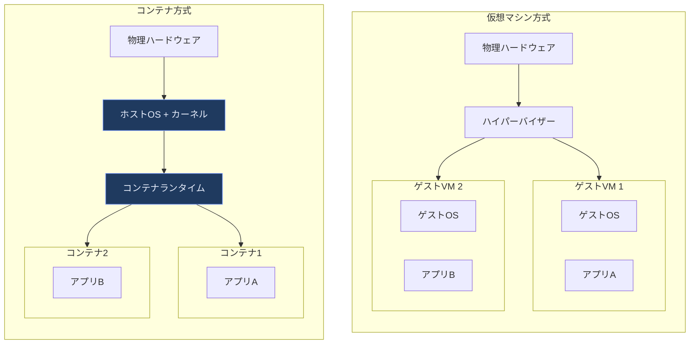

**ベストプラクティス（原著2.3節準拠）**
- コンテナはプロセスの隔離であってVMのような完全な隔離ではないため、マルチテナント環境では追加のセキュリティ境界（gVisor、Kata Containersなど）の採用を検討する。
- 1コンテナ1プロセス（1責務）を基本原則とし、コンテナ内でinitシステムやSSHデーモンを常駐させない。

<a id="0-2"></a>

### 0.2 Dockerとコンテナランタイム

原著2.1.2〜2.1.3節では、Dockerを使ってHello, Worldコンテナを起動する体験から始まり、2.2節で本書全体を通して使う実践的な題材アプリケーション「Kiada（Kubernetes in Action Demo Application）」の構築へと進みます。Kiadaは、原著全編を通して機能を段階的に拡張していくNode.jsベースのデモアプリケーションです。

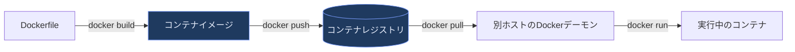

<a id="0-3"></a>

### 0.3 OCI標準とコンテナ代替ツール

原著2.1.4節では、Docker以外のコンテナツール（Podman、Buildahなど）とOpen Container Initiative（OCI）によるイメージ・ランタイムの標準化について触れています。Kubernetes自体はDockerを直接のコンテナランタイムとして使うDockershimを2020年12月のv1.20で非推奨化し、2022年5月のv1.24で削除しており、containerdやCRI-OなどCRI（Container Runtime Interface）準拠のランタイムを使うのが2026年時点の標準です。

| ツール | 役割 | 備考 |
|---|---|---|
| Docker Engine | イメージビルド・実行 | `docker` CLIの提供元。Kubernetesのノード上ランタイムとしては非推奨 |
| containerd | 軽量なコンテナランタイム | 多くのマネージドKubernetes（EKS、GKEなど）の既定ランタイム |
| CRI-O | Kubernetes専用ランタイム | Red Hat OpenShiftなどで採用 |
| Podman | デーモンレスなコンテナ管理CLI | rootlessコンテナに強み |
| Buildah | OCIイメージビルド専用ツール | Dockerfileなしでもビルド可能 |

**ベストプラクティス**
- ローカル開発ではDocker Desktop／Podman Desktopのどちらでも良いが、本番クラスタのノードランタイムはcontainerdかCRI-Oに統一する。
- イメージはOCIイメージ仕様に準拠したレジストリ（Docker Hub、GitHub Container Registry、Amazon ECR、Google Artifact Registryなど）で管理し、タグに`latest`を使わずセマンティックバージョンまたはコミットハッシュで固定する。


---

<a id="part1"></a>

## 第1部: Kubernetesを始める（原著Part 1: 第1〜4章）

<a id="1-1"></a>

### 1.1 Kubernetesとは何か（原著第1章）

**Kubernetes**はギリシャ語で「操舵手（helmsman）」を意味します。原著1章のまとめでも触れられている通り、船長（あなた）がクラスタ全体を統括し、Kubernetesという操舵手が日々の運用（コンテナの再起動、ノード障害時の再配置、負荷分散など）を担うというメタファーです。発音は「クーバネティス」（koo-ber-NET-eez）が一般的で、しばしば「K8s（ケーエイツ）」と略されます（KとSの間の8文字を数字の8に置き換えた略記）。

Kubernetesは、Googleが自社の大規模クラスタ管理システム「Borg」で得た知見をもとに開発し、2014年にオープンソース化したプロジェクトです。現在はCloud Native Computing Foundation（CNCF）がホストする最重要プロジェクトの一つとなっています。

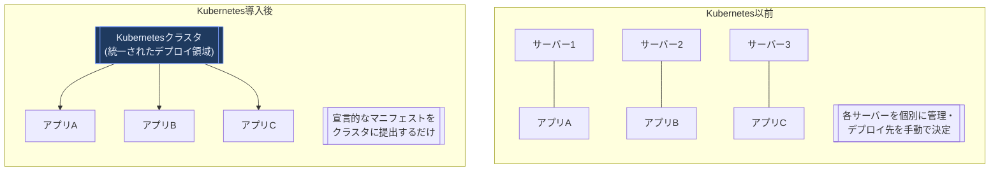

原著1.2.1節が強調するのは、Kubernetesが**個々のマシンではなくクラスタ全体を1つのデプロイ領域として抽象化する**という点です。開発者は「どのサーバーで動かすか」を意識せず、「どういう状態で動いてほしいか」だけを宣言します。

**Kubernetesを使う主なメリット（原著1.2.2節）**

| メリット | 内容 |
|---|---|
| セルフサービス化 | 開発者がインフラ管理者の介入なしにアプリをデプロイできる |
| コスト削減 | 複数アプリのリソースを効率よくビンパッキングし、ハードウェア利用率を上げる |
| 自動スケーリング | 負荷に応じてPodやノード数を自動調整する |
| 自己修復 | コンテナクラッシュやノード障害時に自動的に再配置する |
| ポータビリティ | オンプレミス・複数クラウド間で同じAPIを使い回せる（ベンダーロックイン低減） |

**組織導入時の判断基準（原著1.3節）**

原著1.3.4節「Should you even use Kubernetes?」は初学者が見落としがちな重要な問いです。すべてのワークロードにKubernetesが必要なわけではありません。

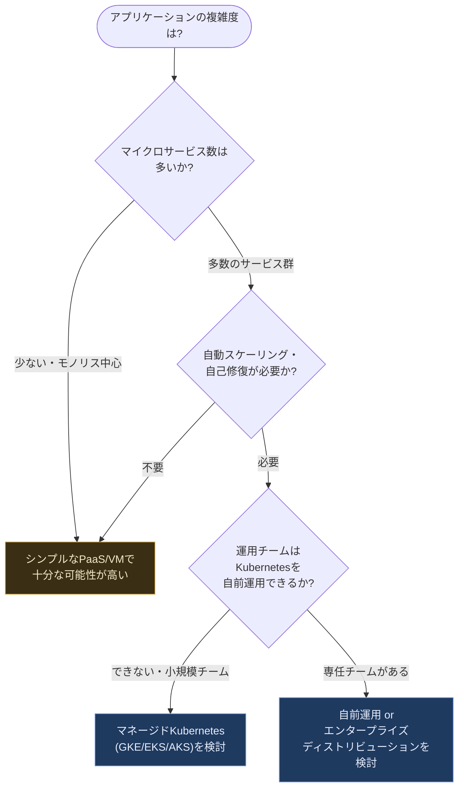

**ベストプラクティス**
- 小規模なチームや単一のモノリシックアプリケーションでは、まずマネージドKubernetes（GKE Autopilot、EKS Fargate、AKSなど）から始め、運用負荷を最小化する。
- 自前でKubernetesクラスタ全体（コントロールプレーンを含む）を運用するのは非常に難易度が高いため、専任のプラットフォームチームなしに選択すべきではない、と原著は繰り返し強調している。

<a id="1-2"></a>

### 1.2 Kubernetesクラスタのアーキテクチャ（原著第1章・第3章）

Kubernetesクラスタは大きく**コントロールプレーン**と**ワーカーノード（ワークロードプレーン）**の2つの平面に分かれます（原著1.2.3節）。

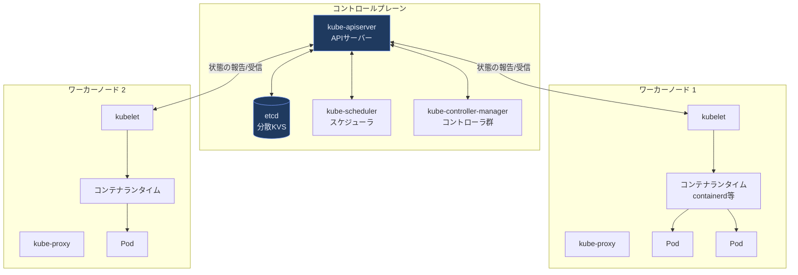

各コンポーネントの役割は次の通りです（原著1.2.3節に対応）。

| コンポーネント | 配置 | 役割 |
|---|---|---|
| kube-apiserver | コントロールプレーン | クラスタの唯一の入口。REST APIを公開し、全ての操作はここを経由する |
| etcd | コントロールプレーン | クラスタ全体の状態を保存する分散キーバリューストア |
| kube-scheduler | コントロールプレーン | 未配置のPodを、条件に合うワーカーノードへ割り当てる |
| kube-controller-manager | コントロールプレーン | ReplicaSetコントローラ等、各種コントローラをまとめて実行する |
| kubelet | ワーカーノード | ノード上でPodのライフサイクルを管理し、APIサーバーと通信する |
| kube-proxy | ワーカーノード | Serviceへのトラフィックをノード上でルーティングする |
| コンテナランタイム | ワーカーノード | 実際にコンテナを起動・停止する（containerd、CRI-Oなど） |

**Kubernetesがアプリケーションを実行する流れ（原著1.2.4節）**

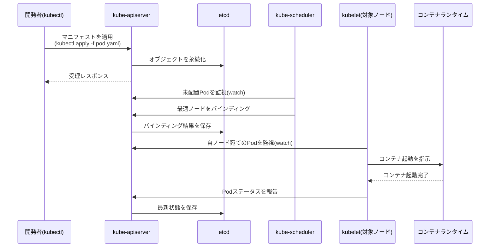

**ベストプラクティス**
- コントロールプレーンは通常、可用性のため奇数（3・5台等）のノードで冗長化し、etcdのリーダー選出クォーラムを確保する。マネージドサービスを使う場合はこの管理をクラウドプロバイダに委任できる。
- `kubectl get events`や`kubectl describe`は、宣言と実際の状態のズレをデバッグする際の最初の一手として習慣化する。

<a id="1-3"></a>

### 1.3 最初のアプリケーションをデプロイする（原著第3章）

原著3章では、ローカル環境（Docker Desktop内蔵Kubernetes、Minikube、kind）からマネージドクラウド（GKE、EKS）、さらには手動構築のマルチノードクラスタまで、複数のクラスタ構築方法を比較しています。

| 方法 | 用途 | 特徴 |
|---|---|---|
| Docker Desktop内蔵K8s | ローカル学習 | GUIから有効化でき最も手軽 |
| Minikube | ローカル学習・検証 | 単一VM/コンテナ内に1ノードクラスタを構築、アドオンが豊富 |
| kind (Kubernetes in Docker) | ローカル・CI | Dockerコンテナをノードに見立てるため多ノードクラスタもCI上で高速に作れる |
| GKE (Google Kubernetes Engine) | 本番・学習 | Googleのマネージドサービス、Autopilotモードでノード管理も不要 |
| Amazon EKS | 本番 | AWSのマネージドコントロールプレーン、ワーカーはEC2/Fargate |
| 手動構築（kubeadm等） | 学習・オンプレミス | 全コンポーネントを自分で構築し理解を深めるのに最適 |

**kubectlの基本操作フロー**

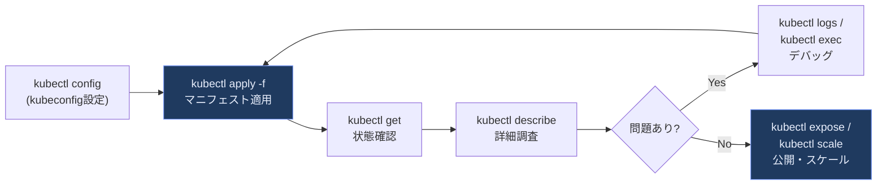

原著3.3節では、最初のアプリケーションを`kubectl create deployment`で作成し、`kubectl expose`でServiceを作成し、`kubectl scale`で水平スケールするという一連の流れを体験します。`kubectl expose`が行うのはServiceの作成であり、それ自体が自動的に外部公開を行うわけではありません（既定では`ClusterIP`でクラスタ内部からのみ到達可能）。クラスタ外部からアクセスさせたい場合は`--type=NodePort`または`--type=LoadBalancer`を明示的に指定します。これは第5部（Deployment、Service）で扱う概念の実践的な入り口になっています。

**ベストプラクティス**
- 学習段階ではkindまたはMinikubeでローカルに複数ノードクラスタを再現し、Podのスケジューリングやノード障害時の挙動を安全に試す。
- `kubectl config use-context`でクラスタを切り替える際は、`kubectl config current-context`で必ず現在の接続先を確認してから破壊的な操作を行う（本番クラスタへの誤操作防止）。

<a id="1-4"></a>

### 1.4 Kubernetes APIとオブジェクトモデル（原著第4章）

原著4章は第2版で大きく拡充されたパートです。Kubernetesを深く理解する上で欠かせない「すべてがAPIオブジェクトである」という設計思想を扱います。

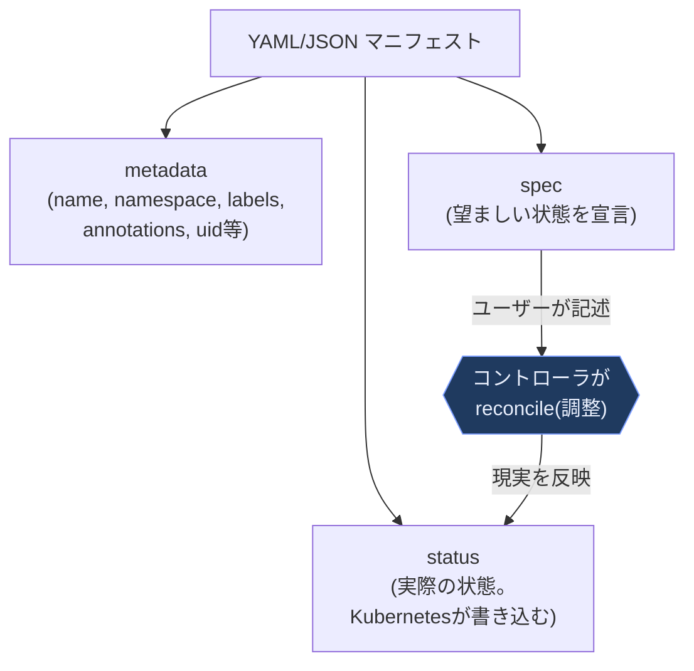

Kubernetesオブジェクトのマニフェストは`apiVersion`・`kind`・`metadata`を共通で持ち、多くのオブジェクトはこれに加えて`spec`（および`status`）を持ちます。ただし`spec`はすべてのオブジェクトに必須の共通フィールドではありません。例えば`ConfigMap`は`spec`を持たず、`data`・`binaryData`・`immutable`をトップレベルのフィールドとして使います（`Secret`も同様に`data`/`stringData`を使います）。`spec`は「あるべき姿」をユーザーが宣言する部分であり、`status`はコントローラが実際の観測結果を書き込む部分です。この分離こそが、Kubernetesの**宣言的（declarative）**なモデルの核心です。

**Event オブジェクト（原著4.3節）**

クラスタ内で発生したイベント（Podのスケジューリング成功、イメージPull失敗など）は`Event`オブジェクトとして記録されます。`kubectl describe`コマンドの出力末尾に表示される「Events」セクションは、このEventオブジェクトを整形して表示したものです。

**ベストプラクティス**
- 未知のリソース種別に遭遇したら`kubectl explain <kind>`（例: `kubectl explain pod.spec.containers`）でフィールドの説明とAPIバージョンをその場で確認する習慣をつける。
- `kubectl describe`で表示されるstatus conditions（`Ready`, `PodScheduled`など）を読み解けるようになると、トラブルシューティングの速度が大きく向上する。


---

<a id="part2"></a>

## 第2部: Podでアプリケーションを実行する（原著Part 2: 第5〜7章）

<a id="2-1"></a>

### 2.1 Podの基本（原著第5章）

**Pod**はKubernetesにおけるデプロイの最小単位です。1つ以上のコンテナのグループであり、同じネットワーク名前空間（同一IPアドレス、`localhost`経由の通信）とストレージボリュームを共有します。

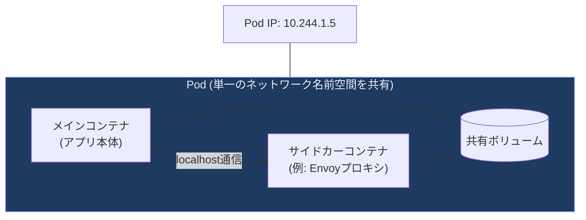

原著5.1.2節が強調するのは、「複数コンテナを1つのPodに詰め込みすぎない」という原則です。基本は1コンテナ1責務ですが、密結合したヘルパー（ログ収集、プロキシなど）は同じPodに配置します。

**マルチコンテナPodの構成パターン（原著5.4〜5.5節）**

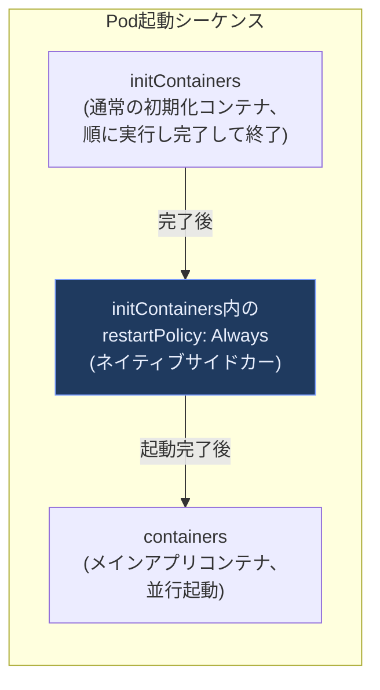

原著5.5.4節「Kubernetes native sidecar containers」は、`initContainers`に`restartPolicy: Always`を指定することでサイドカーをネイティブにサポートする仕組みを解説しています（Kubernetes 1.28でアルファ導入、1.29でデフォルト有効化、1.33で安定版。詳細は[6.5節](#6-5)を参照）。これにより、従来のサイドカーパターンで課題だった「Jobのサイドカーがいつまでも終了せず、Jobの完了判定をブロックしてしまう」問題が解消されました。

**ベストプラクティス（原著5.3〜5.6節）**
- Pod内のコンテナとやり取りする際は`kubectl exec -it <pod> -- sh`より先に`kubectl logs`で挙動を確認し、本番環境への`exec`は最小限にとどめる。
- デバッグ専用の`ephemeralContainers`（原著5.3.6節）を使えば、実行中のPodに影響を与えずにデバッグ用ツールコンテナを一時的に注入できる。distrolessイメージなどシェルを含まない本番イメージのデバッグに有効。
- `kubectl delete pods --all`のような広範囲削除コマンドは、必ず`-n <namespace>`でスコープを絞ってから実行する。

<a id="2-2"></a>

### 2.2 Podのライフサイクルとヘルスチェック（原著第6章）

Podには`phase`（大まかな状態）と、より詳細な`conditions`（複数のブール値の集合）があります。

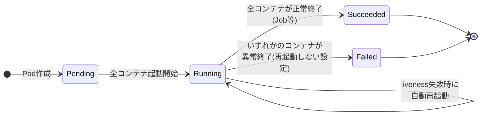

**3種類のプローブ（原著6.2節）**

| プローブ種別 | 目的 | 失敗時の挙動 |
|---|---|---|
| Liveness Probe | コンテナが生きているか（デッドロック等の検知） | コンテナを再起動する |
| Readiness Probe | リクエストを受け付けられる状態か | Serviceのエンドポイントから除外する（再起動はしない） |
| Startup Probe | 起動が遅いアプリの初期化完了を待つ | Liveness/Readinessの評価を遅らせる |

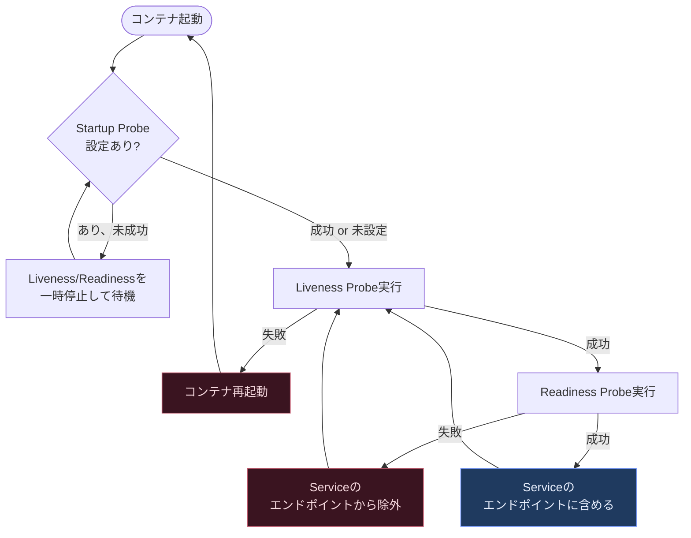

原著6.3節では、`postStart`フック（コンテナ起動直後に実行）と`preStop`フック（終了直前に実行）にも触れています。特に`preStop`はグレースフルシャットダウンの実装に欠かせません。

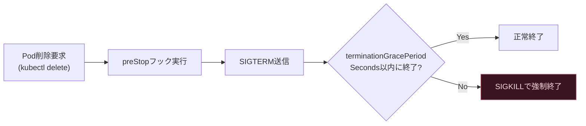

**ベストプラクティス（原著6.2.7節「Creating effective liveness probe handlers」）**
- Liveness Probeは「アプリが応答するか」だけを軽量にチェックし、データベース接続など外部依存のチェックはReadiness Probeに任せる。Liveness Probeが外部依存の障害で失敗すると、無意味な再起動ループを引き起こす。
- Startup Probeを使わずに長いLiveness Probeの`initialDelaySeconds`だけに頼ると、起動の遅いアプリと本当にハングしたアプリを区別できない。起動時間が不安定なアプリには必ずStartup Probeを設定する。
- `preStop`フックの遅延（数秒のsleep等）は、エンドポイントやロードバランサーからPodが切り離されたことを確認するものではない。安全にドレインするには、遅延に加えて（1）遅延とアプリの終了処理を収容できる`terminationGracePeriodSeconds`、（2）新規接続を止めて処理中のリクエストを完了させるアプリ側のグレースフルシャットダウン、（3）利用中のロードバランサー実装ごとの切り離し所要時間の実測と検証、の3点をそろえる必要がある。

<a id="2-3"></a>

### 2.3 名前空間・ラベル・アノテーションによる整理（原著第7章）

**Namespace**はクラスタ内のリソースを論理的に分割する仕組みです。ただし原著7.1.4節が明確に警告する通り、Namespaceは**ネットワーク的な隔離を提供しません**（NetworkPolicyなど別の仕組みと組み合わせない限り、異なるNamespace間のPodは自由に通信できます）。

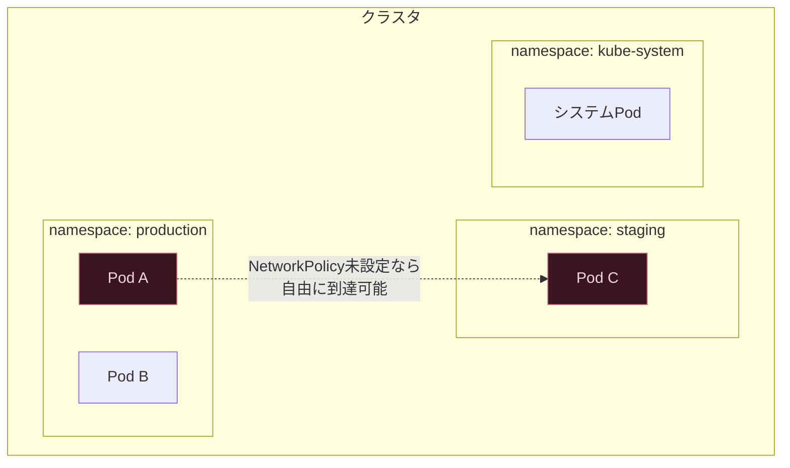

**ラベルとラベルセレクタ（原著7.2〜7.3節）**は、Kubernetesにおけるオブジェクトのグルーピングの基本メカニズムです。Service、ReplicaSet、Deploymentなど、多くのコントローラがラベルセレクタで「どのPodを対象にするか」を決定します。

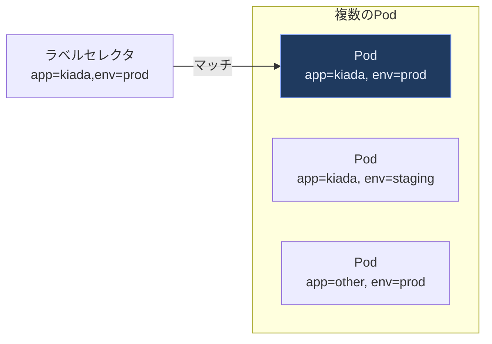

アノテーション（原著7.5節）はラベルと似ていますが、セレクタの対象にはならず、任意の（非識別用途の）メタデータ（ビルド情報、ツール固有の設定値など）を格納するために使います。

**ベストプラクティス**
- Kubernetes公式が定める[推奨ラベル](https://kubernetes.io/docs/concepts/overview/working-with-objects/common-labels/)（`app.kubernetes.io/name`、`app.kubernetes.io/version`など）に準拠し、ツール間の相互運用性を高める。
- Namespace単位でResourceQuota・LimitRangeを設定し、1チーム／1環境がクラスタ全体のリソースを食い潰さないようにする。
- 機密性の高いワークロード同士は同一Namespaceであっても信頼せず、NetworkPolicyでデフォルト拒否（default-deny）を基本方針にする。


---

<a id="part3"></a>

## 第3部: アプリケーションの設定とストレージ（原著Part 3: 第8〜10章）

<a id="3-1"></a>

### 3.1 ConfigMapとSecret（原著第8章）

コンテナイメージから設定を分離する（Twelve-Factor Appの原則）ために、KubernetesはConfigMap（機密でない設定値）とSecret（機密データ）という2種類のオブジェクトを提供します。

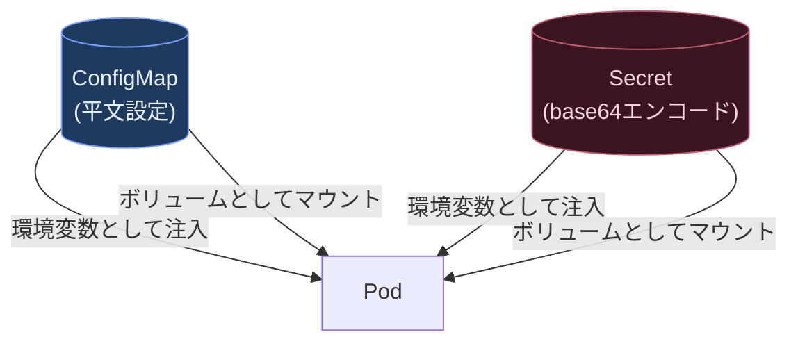

原著8.3.4節「Understanding why Secrets aren't always secure」は初学者が誤解しがちな重要ポイントです。SecretはデフォルトではBase64エンコードされているだけで**暗号化されていません**。etcdへの保存時に暗号化する（Encryption at Rest）よう明示的に設定しない限り、etcdへのアクセス権限があれば誰でも復号できてしまいます。

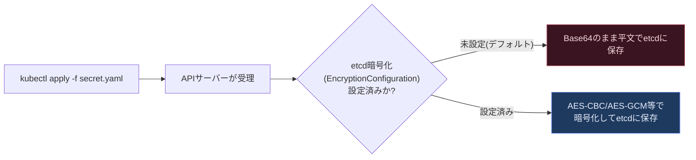

**Downward API（原著8.4節）**は、Pod自身のメタデータ（名前、Namespace、ラベル、リソース制限値など）をコンテナ内の環境変数やファイルとして注入する仕組みです。

**ベストプラクティス**
- SecretはetcdのEncryption at Restを有効化し、加えて可能であればHashiCorp VaultやAWS Secrets Manager、External Secrets Operatorなど外部シークレット管理システムとの連携を検討する。
- ConfigMap/Secretを更新しても、既に起動済みのPodへの環境変数注入は自動反映されない（再起動が必要）。ボリュームマウントの場合は多くのケースで自動的にファイル内容が更新されるが、アプリ側がファイル変更を検知して再読み込みする実装になっているか確認する。
- Secretの中身をGitリポジトリに平文でコミットしない。Sealed SecretsやSOPS、External Secrets Operatorなどでの暗号化管理をGitOpsパイプラインに組み込む。

<a id="3-2"></a>

### 3.2 ボリューム（原著第9章）

Kubernetesの**ボリューム**は、コンテナのファイルシステムより長生きするストレージ（少なくともPodのライフサイクル分）を提供します。

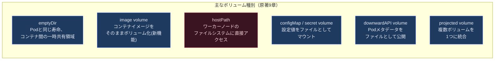

`emptyDir`はPodが削除されると内容も消える一時ボリュームで、コンテナ間のファイル共有（例: メインコンテナが書いたログをサイドカーが読む）によく使われます。一方`hostPath`はノードのローカルディスクに直接アクセスするため、Pod再スケジュール時にデータの整合性が保てず、セキュリティリスクも高いため、原著でも「特別な用途（DaemonSetでノード上のログファイルを読むなど）に限定すべき」と位置づけられています。

**ベストプラクティス**
- `hostPath`はノード固有のリソース（例: DaemonSetからホストのログファイルを読み取り専用でマウントする）以外では避け、一般的なアプリケーションの永続化にはPersistentVolume（3.3節）を使う。
- 複数のConfigMap/Secret/DownwardAPIを1つのマウントポイントに統合したい場合は`projected`ボリュームを使い、Podのボリューム定義をシンプルに保つ。

<a id="3-3"></a>

### 3.3 PersistentVolumeによる永続化（原著第10章）

Pod自体は使い捨て（ephemeral）ですが、データベースなどのステートフルなワークロードにはPodのライフサイクルを超えて存続するストレージが必要です。Kubernetesはこれを**PersistentVolume（PV）**と**PersistentVolumeClaim（PVC）**という2つのオブジェクトで抽象化します。

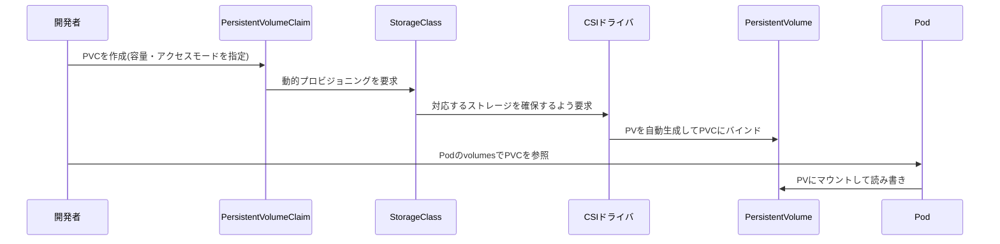

**アクセスモード（原著10.2.4節）**

| アクセスモード | 略称 | 意味 |
|---|---|---|
| ReadWriteOnce | RWO | 単一ノードから読み書き可能 |
| ReadOnlyMany | ROX | 複数ノードから読み取り専用でマウント可能 |
| ReadWriteMany | RWX | 複数ノードから同時に読み書き可能 |
| ReadWriteOncePod | RWOP | 単一Podからのみ読み書き可能（1.29でGA、より厳格な排他制御） |

**StorageClassとCSIドライバ（原著10.2.5〜10.2.6節）**は、クラウドプロバイダやストレージベンダーごとの実装差異を吸収する仕組みです。StorageClassを指定するだけで、背後のCSI（Container Storage Interface）ドライバが実際のディスクをプロビジョニングします。

**静的プロビジョニング vs 動的プロビジョニング（原著10.1.2節）**

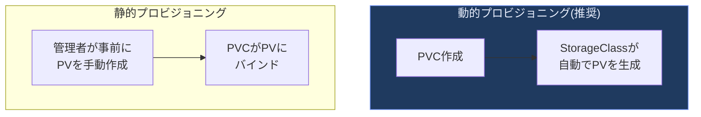

**ベストプラクティス**
- 特別な理由がない限り動的プロビジョニング（StorageClass + PVC）を使い、静的プロビジョニングはノードローカルストレージなど特殊なケースに限定する。
- PVCのリサイズ（原著10.4.1節）に対応したStorageClass（`allowVolumeExpansion: true`）を選ぶ。ただしこのフラグは拡張を許可するだけであり、Podを再作成せずにファイルシステムまで広げるには、CSIドライバとファイルシステムの双方がオンライン拡張に対応している必要がある。
- 定期的なスナップショット（原著10.4.2〜10.4.3節）をVolumeSnapshotリソースで自動化し、災害復旧（DR）計画に組み込む。


---

<a id="part4"></a>

## 第4部: アプリケーションの接続と公開（原著Part 4: 第11〜13章）

<a id="4-1"></a>

### 4.1 Service（原著第11章）

Podは再作成されるたびにIPアドレスが変わるため、Podに直接依存した通信は成立しません。**Service**は、ラベルセレクタにマッチするPod群への安定したアクセス経路（仮想IP + DNS名）を提供します。

```mermaid
flowchart TB
    SVC["Service<br/>clusterIP: 10.96.0.42<br/>selector: app=kiada"]
    subgraph PODS["ラベル app=kiada のPod群"]
        P1["Pod A<br/>10.244.1.5"]
        P2["Pod B<br/>10.244.2.7"]
        P3["Pod C<br/>10.244.3.9"]
    end
    EP["EndpointSlice<br/>(自動更新される<br/>IPアドレス一覧)"]

    SVC --> EP
    EP --> P1
    EP --> P2
    EP --> P3

    classDef highlightFill fill:#1f3a5f,stroke:#7c9eff,color:#e8eefc
    class SVC,EP highlightFill
```

**Serviceの種類（原著11.1〜11.2節）**

```mermaid
flowchart TD
    START([外部公開の要件は?]) --> Q1{クラスタ内部のみで<br/>十分か?}
    Q1 -->|Yes| CIP["ClusterIP<br/>(既定。クラスタ内DNS経由)"]
    Q1 -->|No、外部公開が必要| Q2{クラウドロード<br/>バランサーを使えるか?}
    Q2 -->|Yes| LB["LoadBalancer<br/>(クラウドLBを自動プロビジョニング)"]
    Q2 -->|No、学習・オンプレミス| NP["NodePort<br/>(全ノードの固定ポートで公開)"]

    classDef highlightFill fill:#1f3a5f,stroke:#7c9eff,color:#e8eefc
    class CIP,LB highlightFill
```

原著11.4.2節の**ヘッドレスサービス**（`clusterIP: None`）は、仮想IPを持たずDNSがPod個々のIPを直接返す特殊なServiceで、StatefulSet（5.3節）と組み合わせて各Podに個別のDNS名を割り当てる際に使われます。

原著11.5節「Configuring services to route traffic to nearby endpoints」は、大規模クラスタでのレイテンシとコスト最適化に関わる実践的なトピックです。`internalTrafficPolicy: Local`やTopology Aware Hintsを使うと、可能な限り同一ノード・同一ゾーン内のPodへトラフィックを優先的にルーティングし、ノード間・ゾーン間の通信コストを削減できます。

**ベストプラクティス**
- Readiness Probe（2.2節）を必ず設定し、起動途中や過負荷のPodがServiceのエンドポイントに含まれないようにする。
- マルチAZ構成のクラスタでは、Topology Aware Routing（旧称Topology Aware Hints）を有効化し、ゾーンをまたぐ不要なトラフィックとコストを削減する。
- `externalTrafficPolicy: Local`を使うとクライアントIPを保持できる反面、ノードによって負荷が偏る可能性があるため、ヘルスチェックの設計とセットで検討する。

<a id="4-2"></a>

### 4.2 Ingress（原著第12章）

**Ingress**は、複数のServiceへのHTTP/HTTPSルーティングを1つのエントリーポイントに集約するAPIです。LoadBalancer Serviceを個々のマイクロサービスごとに用意するとクラウドの課金・IP管理コストが増大するため、Ingressで一元化するのが一般的です。

```mermaid
flowchart TB
    CLIENT["クライアント"] --> LB["クラウドロードバランサー"]
    LB --> ING_CTRL["Ingressコントローラ<br/>(リバースプロキシ)"]
    ING_CTRL -->|"/api/*"| SVC_A["Service: api"]
    ING_CTRL -->|"/web/*"| SVC_B["Service: web"]
    ING_CTRL -->|"api.example.com"| SVC_A
    ING_CTRL -->|"www.example.com"| SVC_B

    classDef highlightFill fill:#1f3a5f,stroke:#7c9eff,color:#e8eefc
    class ING_CTRL highlightFill
```

重要なのは、原著12.1.2節が明記する通り、**Ingressオブジェクトそのものはルーティングを実行しません**。実際にトラフィックを処理するのは別途デプロイする**Ingressコントローラ**（NGINX Ingress Controller、Traefik、HAProxy等）です。Ingressオブジェクトはコントローラに対する「設定の宣言」に過ぎません。

2026年時点で特に重要なのは、コミュニティ版**Ingress-NGINX Controller**が終了に向かっているという点です。詳細は[6.4節](#6-4)で扱いますが、原著12章の内容自体は今も有効な一方、これから新規にIngressコントローラを選定する場合はGateway API（4.3節）への移行を前提に計画することが強く推奨されています。

**ベストプラクティス（原著12.4節）**
- Ingressアノテーションはコントローラ実装ごとに非互換であるため（例: NGINX用のアノテーションはTraefikでは動かない）、複数コントローラの並行運用や移行を想定する場合は特に注意する。
- TLS証明書の自動更新にはcert-managerを併用し、証明書の手動更新運用を排除する。

<a id="4-3"></a>

### 4.3 Gateway API（原著第13章）

**Gateway API**は、Ingressの後継として設計された、より表現力の高いL4/L7トラフィックルーティングAPI群です。原著第2版で新規に追加された第13章がまるまる1章を割いて解説しているのは、Gateway APIが2026年時点のKubernetesネットワーキングにおける事実上の標準になりつつあることの裏返しです。

```mermaid
flowchart TB
    subgraph ROLES["ロール別のリソース分離(原著13.1節)"]
        direction TB
        GC["GatewayClass<br/>(インフラ提供者が定義<br/>実装の種類を指定)"]
        GW["Gateway<br/>(クラスタ運用者が作成<br/>リスナー・証明書を設定)"]
        HR["HTTPRoute / GRPCRoute /<br/>TCPRoute / UDPRoute<br/>(アプリチームが作成<br/>ルーティングルールを定義)"]
        GC --> GW
        GW --> HR
    end

    classDef highlightFill fill:#1f3a5f,stroke:#7c9eff,color:#e8eefc
    class GC,GW,HR highlightFill
```

Ingressとの決定的な違いは、この**ロールベースの権限分離**です。Ingressでは1つのオブジェクトに全ての設定が混在するため、アプリチームがインフラ設定まで触れてしまう、あるいは逆にインフラチームがボトルネックになるという課題がありました。Gateway APIはGatewayClass（インフラ提供者）・Gateway（クラスタ運用者）・Route（HTTPRouteなど、アプリチーム）の3層に権限を分割します。

**IngressとGateway APIの比較**

| 観点 | Ingress | Gateway API |
|---|---|---|
| 設定の分離 | 1オブジェクトに集約 | GatewayClass/Gateway/Routeに分離 |
| プロトコル対応 | 実質HTTP/HTTPSのみ | HTTP, gRPC, TCP, UDP, TLS(pass-through)に対応 |
| ベンダー拡張の方法 | 非互換なアノテーション | 標準化されたフィルタ・ポリシーアタッチメント |
| トラフィック分割 | コントローラ依存の独自拡張 | `HTTPRoute`のweight指定で標準的にサポート |
| 2026年時点の位置づけ | 機能凍結（feature-frozen） | 積極的に開発が続く標準API |

```mermaid
flowchart LR
    subgraph CANARY["トラフィック分割の例(原著13.3.2節)"]
        direction LR
        ROUTE["HTTPRoute"]
        V1["Service: app-v1<br/>weight: 90"]
        V2["Service: app-v2<br/>weight: 10"]
        ROUTE -->|90%| V1
        ROUTE -->|10%| V2
    end

    classDef highlightFill fill:#1f3a5f,stroke:#7c9eff,color:#e8eefc
    class ROUTE highlightFill
```

原著13.7節「From ingress gateways to service mesh」は、Gateway APIが単なるIngress後継にとどまらず、サービスメッシュ（東西トラフィック）まで統一的にモデル化しようとする方向性（GAMMA Initiative）に触れています。

**ベストプラクティス**
- 新規にKubernetesクラスタでHTTPルーティングを構築する場合は、原著13.1.3節が例示するIstioに限らず、Envoy Gateway・Cilium・クラウドマネージドのGateway API実装（GKE Gateway、AWS Gateway API Controllerなど）の中から要件に合うものを選び、最初からGateway APIで構築する。
- 既存のIngressからの移行は、`ingress2gateway`のような変換ツールで叩き台を生成した上で、アノテーションに依存していた挙動を手動で`HTTPRoute`のフィルタ機能に置き換える。
- GatewayとHTTPRouteをNamespaceで分離する運用（原著13.6節）を活用し、インフラチームがGatewayのTLS設定を管理しつつ、アプリチームは自Namespace内のHTTPRouteだけを変更できるようにする。

**出典：** Kubernetes SIG Network公式アナウンス「Ingress-NGINX Controller」終了に関するGoogle Open Source Blog (https://opensource.googleblog.com/2026/02/the-end-of-an-era-transitioning-away-from-ingress-nginx.html)、Gateway API公式リポジトリ (https://github.com/kubernetes-sigs/gateway-api)


---

<a id="part5"></a>

## 第5部: 大規模運用のためのアプリケーション管理（原著Part 5: 第14〜18章）

<a id="5-1"></a>

### 5.1 ReplicaSet（原著第14章）

**ReplicaSet**は、指定した数のPodレプリカが常に稼働し続けることを保証するコントローラです。原著14.3.1節が説明する**reconciliation control loop（調整ループ）**は、Kubernetes全体を貫く最重要概念の1つです。

```mermaid
flowchart LR
    OBSERVE["観測<br/>(現在のPod数を確認)"] --> DIFF{"望ましい状態(replicas)と<br/>差分があるか?"}
    DIFF -->|"実際 < 望ましい"| CREATE["不足分のPodを作成"]
    DIFF -->|"実際 > 望ましい"| DELETE["超過分のPodを削除"]
    DIFF -->|一致| WAIT["待機"]
    CREATE --> OBSERVE
    DELETE --> OBSERVE
    WAIT --> OBSERVE

    classDef highlightFill fill:#1f3a5f,stroke:#7c9eff,color:#e8eefc
    class OBSERVE highlightFill
```

このループは常時（イベント駆動 + 定期的な再同期）動き続けており、誰かが手動でPodを削除しても、ReplicaSetが即座に代わりのPodを作成します。原著14.1.3節「Understanding pod ownership」では、`ownerReferences`フィールドによってPodがどのReplicaSetに所属するかが管理されている点を解説しています。

**ベストプラクティス**
- 通常、ReplicaSetを直接作成することは稀で、後述のDeploymentが内部的にReplicaSetを管理する。ReplicaSetを直接操作するのは、ローリングアップデートの仕組みを理解する学習目的か、非常に特殊な運用ニーズに限られる。
- `kubectl delete replicaset --cascade=orphan`を使えば、ReplicaSetだけを削除してPodを残すことができる（原著14.4.2節）。緊急時の切り離し手段として覚えておく。

<a id="5-2"></a>

### 5.2 Deployment（原著第15章）

**Deployment**はReplicaSetをさらにラップし、宣言的なローリングアップデート・ロールバックを可能にするコントローラです。実務でステートレスアプリケーションをデプロイする際、最も頻繁に使うオブジェクトです。

```mermaid
flowchart TB
    DEPLOY["Deployment"] --> RS_OLD["ReplicaSet(旧バージョン)<br/>replicas: 0"]
    DEPLOY --> RS_NEW["ReplicaSet(新バージョン)<br/>replicas: 3"]
    RS_NEW --> P1["Pod v2"]
    RS_NEW --> P2["Pod v2"]
    RS_NEW --> P3["Pod v2"]

    classDef highlightFill fill:#1f3a5f,stroke:#7c9eff,color:#e8eefc
    class DEPLOY,RS_NEW highlightFill
```

**更新戦略（原著15.2節）**

| 戦略 | 挙動 | ダウンタイム |
|---|---|---|
| Recreate | 旧Podを全て削除してから新Podを作成 | あり |
| RollingUpdate（既定） | 新旧Podを段階的に入れ替える | なし（正しく設定すれば） |

```mermaid
sequenceDiagram
    participant D as Deployment
    participant RSOLD as ReplicaSet(v1)
    participant RSNEW as ReplicaSet(v2)

    Note over D: RollingUpdate開始<br/>maxSurge/maxUnavailableに従う
    D->>RSNEW: replicas +1
    RSNEW-->>D: 新Podがreadyになるまで待機
    D->>RSOLD: replicas -1
    D->>RSNEW: replicas +1
    RSNEW-->>D: readyを確認
    D->>RSOLD: replicas -1
    Note over D: 全Podの入れ替えが完了するまで繰り返す
```

**その他のデプロイ戦略（原著15.3節）**

原著15.3節は、Deploymentのビルトイン機能を超えた高度なデプロイパターンを紹介しています。これらはDeployment単体では実現できず、Service重みづけやサービスメッシュ、あるいはArgo RolloutsのようなCRDベースのツールと組み合わせて実現します。

```mermaid
flowchart TB
    subgraph STRATS["デプロイ戦略の比較"]
        direction TB
        CANARY["カナリアリリース<br/>一部のトラフィックだけ<br/>新バージョンへ流す"]
        AB["A/Bテスト<br/>ユーザー属性に基づいて<br/>バージョンを振り分ける"]
        BG["Blue/Green<br/>新旧環境を並行稼働させ<br/>一斉に切り替える"]
        SHADOW["トラフィックシャドウイング<br/>本番トラフィックを複製して<br/>新バージョンへも送るが<br/>応答は使わない"]
    end

    classDef highlightFill fill:#1f3a5f,stroke:#7c9eff,color:#e8eefc
    class CANARY highlightFill
```

**ベストプラクティス**
- `maxUnavailable`と`maxSurge`は、可用性重視なら`maxUnavailable: 0`、リソース制約が厳しいなら`maxSurge: 0`のように、クラスタのリソース余裕とSLAに応じて調整する。
- Readiness Probeが正しく設定されていないと、ローリングアップデート中に「まだ準備できていない新Pod」にトラフィックが流れ、実質的なダウンタイムを引き起こす。Deploymentの安全なローリングアップデートはReadiness Probeとセットで初めて成立する。
- `kubectl rollout undo`で即座にロールバックできるよう、`revisionHistoryLimit`で保持するReplicaSet履歴数を意図的に設定しておく。

<a id="5-3"></a>

### 5.3 StatefulSet（原著第16章）

Deploymentが管理するPodは互換性があり順不同（interchangeable）であるのに対し、**StatefulSet**はデータベースのようにPodごとに固有のアイデンティティ（安定したネットワーク識別子・専用の永続ストレージ）が必要なワークロード向けのコントローラです。

```mermaid
flowchart TB
    SS["StatefulSet: mongodb"]
    HS["ヘッドレスService"]
    subgraph PODS["順序付きPod"]
        direction LR
        P0["mongodb-0<br/>PVC: data-mongodb-0"]
        P1["mongodb-1<br/>PVC: data-mongodb-1"]
        P2["mongodb-2<br/>PVC: data-mongodb-2"]
    end
    SS --> HS
    HS --> P0
    HS --> P1
    HS --> P2
    P0 -.->|"mongodb-0.mongodb<br/>固定DNS名"| P1

    classDef highlightFill fill:#1f3a5f,stroke:#7c9eff,color:#e8eefc
    class SS,HS highlightFill
```

**StatefulSetの3つの特性（原著16.1.1節）**

1. **安定したネットワークID**: 各Podは`<statefulset名>-<序数>`という固定名を持ち、ヘッドレスServiceを通じて`<pod名>.<service名>`という固定DNS名でアクセスできる。
2. **安定した永続ストレージ**: 各Podは専用のPVCを持ち、Podが再作成されても同じPVC（＝同じデータ）に再アタッチされる。
3. **順序保証**: 既定では`OrderedReady`ポリシーにより、Pod-0が起動・Readyになってから Pod-1が起動する（スケールアップ・ダウンとも順序を守る）。

```mermaid
flowchart LR
    A["mongodb-0起動"] -->|Ready後| B["mongodb-1起動"]
    B -->|Ready後| C["mongodb-2起動"]

    classDef highlightFill fill:#1f3a5f,stroke:#7c9eff,color:#e8eefc
    class A highlightFill
```

原著16.4節では、MongoDB Community Operatorを例に**Kubernetes Operator**パターンを紹介しています。OperatorはStatefulSetをさらに一段抽象化し、「レプリカセットの初期化」「フェイルオーバー」「バックアップ」のようなアプリケーション固有の運用知識をコントローラとしてコード化したものです。

**ベストプラクティス**
- 本番のステートフルワークロード（データベース等）は、可能な限り実績のあるOperator（PostgreSQLのCloudNativePG、MongoDBのCommunity/Enterprise Operatorなど）を使い、StatefulSetを手で運用する範囲を最小化する。
- PVC保持ポリシー（原著16.2.4節、`persistentVolumeClaimRetentionPolicy`）を明示的に設定し、StatefulSet削除時にPVCを残すか削除するかを意図した挙動にする。

<a id="5-4"></a>

### 5.4 DaemonSet（原著第17章）

**DaemonSet**は、クラスタ内の（条件に合う）全ノードにちょうど1つのPodを配置するコントローラです。ログ収集エージェント、ノードモニタリングエージェント、CNIプラグインなど、ノード単位で常駐すべきインフラコンポーネントに使われます。

```mermaid
flowchart TB
    DS["DaemonSet: fluentd"]
    subgraph N1["ノード1"]
        DP1["fluentd Pod"]
    end
    subgraph N2["ノード2"]
        DP2["fluentd Pod"]
    end
    subgraph N3["ノード3(新規追加)"]
        DP3["fluentd Pod<br/>(自動的に配置される)"]
    end
    DS --> DP1
    DS --> DP2
    DS -.->|"ノード追加時に自動配置"| DP3

    classDef highlightFill fill:#1f3a5f,stroke:#7c9eff,color:#e8eefc
    class DS highlightFill
```

原著17.2節では、DaemonSetのPodがしばしば必要とする特別な権限（ホストネットワークの利用、ノードファイルシステムへのアクセス、OSカーネルへのアクセス）を扱っています。これらは通常のアプリケーションPodには不要かつ危険な権限であるため、DaemonSet専用の設計判断として明確に区別することが重要です。

**ベストプラクティス**
- DaemonSetは`nodeSelector`や`tolerations`と組み合わせ、コントロールプレーンノードを含む全ノードに配置すべきか、特定ラベルを持つノードに限定すべきかを明示的に設計する。
- ノードエージェントに`hostNetwork: true`や特権コンテナ（`privileged: true`）が必要な場合は、その理由をコメントで明記し、Pod Security Admissionのポリシーで許可範囲を最小化する。

<a id="5-5"></a>

### 5.5 JobとCronJob（原著第18章）

**Job**は「完了」という概念を持つワークロード（バッチ処理、データマイグレーションなど）向けのコントローラです。Deployment/ReplicaSetが「常に一定数のPodを稼働させ続ける」のに対し、Jobは「指定回数の正常終了」を目標にします。

```mermaid
flowchart TB
    JOB["Job: data-migration<br/>completions: 5<br/>parallelism: 2"]
    subgraph RUN["実行中"]
        direction LR
        P1["Pod 1<br/>実行中"]
        P2["Pod 2<br/>実行中"]
    end
    JOB --> RUN
    RUN -->|"正常終了(Succeeded)<br/>×5回に達するまで"| DONE["Job完了"]

    classDef highlightFill fill:#1f3a5f,stroke:#7c9eff,color:#e8eefc
    class DONE highlightFill
```

**CronJob**はJobをスケジュール実行するためのラッパーで、Unix cron形式のスケジュール文字列（例: `0 2 * * *`＝毎日2時）でJobを定期生成します。

```mermaid
flowchart LR
    CJ["CronJob<br/>schedule: '0 2 * * *'"] -->|毎日2:00に生成| J1["Job (2026-08-27実行分)"]
    CJ -->|翌日2:00に生成| J2["Job (2026-08-28実行分)"]
    J1 --> P1["Pod"]
    J2 --> P2["Pod"]

    classDef highlightFill fill:#1f3a5f,stroke:#7c9eff,color:#e8eefc
    class CJ highlightFill
```

原著18.2.5〜18.2.6節では、`startingDeadlineSeconds`（コントロールプレーンの一時停止などでスケジュールを逃した場合の許容遅延）と`concurrencyPolicy`（前回のJobが終わっていない場合の挙動: `Allow`/`Forbid`/`Replace`）という、実運用で必ず遭遇する設定を扱っています。

**ベストプラクティス**
- 冪等でないバッチ処理（重複実行が許されない処理）には`concurrencyPolicy: Forbid`を設定し、前回のJobが完了する前に新しいJobが起動しないようにする。ただし`Forbid`はスケジュール時点の同時実行を抑止するだけで、重複実行を根本的に防ぐものではない（Jobコントローラの再試行やPodの再スケジュールにより、同じ処理が複数回走ることはある）。また実行中のJobがあるとその回のスケジュールはスキップされるため、実行の欠落も起こりうる。重複が許容できない処理は、処理自体を冪等に設計するか、外部ストア上の重複排除キー（実行IDによる排他ロックや一意制約）で二重実行を弾く仕組みを実装する。
- `activeDeadlineSeconds`でJobの最大実行時間を設定し、ハングしたバッチ処理がリソースを専有し続けるのを防ぐ。
- `ttlSecondsAfterFinished`（原著18.2.4節）を設定し、完了済みJob/Podがクラスタに溜まり続けてAPIサーバーやetcdの負荷にならないようにする。


---

<a id="part6"></a>

## 第6部: 2026年8月時点の最新動向（原著範囲外・独自追加）

原著『Kubernetes in Action, Second Edition』は2026年3月刊行ですが、Kubernetes自体のリリースサイクルは3〜4ヶ月に1回と非常に速く、書籍が扱いきれない最新動向が常に存在します。本部では、2026年8月29日時点でWeb検索により確認できた最新のエコシステム動向を、著名な国際的発信元を優先して整理します。

<a id="6-1"></a>

### 6.1 Kubernetes 1.37とリリースサイクル

Kubernetesは年3回（おおむね4ヶ月おき）のマイナーバージョンリリースサイクルを採用しています。2026年8月26日、最新版の**Kubernetes v1.37「Garhwal」**が正式リリースされました。これは2026年で2回目のマイナーリリース（1回目はv1.36、4月リリース）にあたります。

| バージョン | 状態(2026/8/29時点) | リリース日 | サポート終了予定(EOL) |
|---|---|---|---|
| v1.37 (Garhwal) | 最新・サポート中 | 2026-08-26 | 2027-10-28 |
| v1.36 | サポート中 | 2026年4月 | 2027-06-28 |
| v1.35 | サポート中 | 2025年後半 | 2027-02-28 |
| v1.34 (Of Wind & Will) | メンテナンスモード（標準サポート終了） | 2025-08-27 | 2026-10-27 |
| v1.33 | サポート終了（EOL済み） | - | 2026-06-28 |

**出典：** Kubernetes公式リリースページ (https://kubernetes.io/releases/)、Kubernetes v1.37公式リリース情報 (https://kubernetes.io/releases/1.37/)、Network World「Kubernetes 1.37 advances workload-aware scheduling and cluster networking」(https://www.networkworld.com/article/4214824/kubernetes-1-37-advances-workload-aware-scheduling-and-cluster-networking.html)

```mermaid
flowchart LR
    subgraph CYCLE["Kubernetesのリリースサイクル(年3回)"]
        direction LR
        A["拡張機能<br/>フリーズ"] --> B["コード/テスト<br/>フリーズ"]
        B --> C["ドキュメント<br/>フリーズ"]
        C --> D["GAリリース"]
        D -->|約4ヶ月後| A
    end

    classDef highlightFill fill:#1f3a5f,stroke:#7c9eff,color:#e8eefc
    class D highlightFill
```

Network World誌の報道によれば、v1.37のリリースリードを務めたDipesh Rawat氏は、開発・テスト期間を確保するため、リリース間の準備期間を短縮する運用変更を行ったと説明しています。v1.37の主な特徴は、v1.35で開始されたkube-proxyの**IPVSモードからnftablesモードへの移行**の継続、そしてワークロードスケジューリングの強化です。

**ベストプラクティス**
- 公式・大手クラウドベンダーは「最新から1〜2バージョン前（N-1〜N-2）」の追従を推奨している。最新バージョンへの飛びつきよりも、エコシステム（CNI、CSI、サービスメッシュ等）の対応状況を見極めてから段階的にアップグレードする。
- `kubectl version`と各マネージドサービス（GKE/EKS/AKS）のサポートバージョン表を定期的に照合し、サポート終了（EOL）前にアップグレード計画を立てる。

<a id="6-2"></a>

### 6.2 Dynamic Resource Allocation（DRA）とAIワークロード

**Dynamic Resource Allocation（DRA）**は、GPU・FPGA・NICなどの特殊なハードウェアデバイスを`ResourceClaim`という新しいAPIオブジェクトを通じて、柔軟かつ標準化された方法でPodに割り当てる仕組みです。原著18章までのバッチ処理の議論はCPU/メモリを前提としていますが、2026年のKubernetesワークロードの主戦場はAI/MLトレーニング・推論基盤へと大きくシフトしています。

```mermaid
flowchart LR
    subgraph OLD["従来のデバイス割り当て(Device Plugin)"]
        direction LR
        POD_OLD["Pod"] -->|"resources.limits:<br/>nvidia.com/gpu: 1"| DEV_OLD["GPUをそのまま<br/>丸ごと1枚割り当て"]
    end
    subgraph NEW["DRAによる割り当て"]
        direction LR
        RC["ResourceClaim<br/>(GPUの種類・共有方法を<br/>柔軟に指定)"]
        POD_NEW["Pod"] --> RC
        RC -->|"Just-In-Timeで<br/>最適なデバイスを選択"| DEV_NEW["GPU / FPGA / NIC"]
    end

    classDef highlightFill fill:#1f3a5f,stroke:#7c9eff,color:#e8eefc
    class RC highlightFill
```

DRAはKubernetes v1.34で**GA（正式版）** に到達しました。The New Stack誌は「v1.34の最も目立つ変化の1つがDRAのGA化」であると報じ、GPUスケジューリングの柔軟性向上と引き換えに、新たな運用上の「死角（blind spots）」が生じる可能性にも注意を促しています。v1.37ではDRAの周辺機能の成熟度が機能ごとに異なり、デバイスレベルのTaint/TolerationはStable（GA）、Derived AttributesはAlphaという段階にあります。

**ベストプラクティス**
- GPU等の高価なリソースをDRAで共有・分割する場合、`ResourceClaimTemplate`によるPod単位の要求と、クラスタ全体のクォータ管理を組み合わせ、コスト超過を防ぐガードレールを敷く。
- DRAは比較的新しい機能であるため、本番導入前にステージング環境で十分な負荷試験を行い、ドライバ（vendor提供のDRA Driver）の対応バージョンを確認する。

**出典：** The New Stack「Kubernetes v1.34 Introduces Benefits but Also New Blind Spots」(https://thenewstack.io/kubernetes-v1-34-introduces-benefits-but-also-new-blind-spots/)、Kubernetes v1.34公式リリースブログ (https://kubernetes.io/blog/2025/08/27/kubernetes-v1-34-release/)

<a id="6-3"></a>

### 6.3 In-Place Pod Resize（無停止リサイズ）

原著15章までのアプリケーション更新の議論は、基本的に「Podを作り直す」ことを前提としています。しかし2027年に向けて重要なのが、**In-Place Pod Resize**（Pod内リソースの無停止変更）機能です。この機能は2023年（Kubernetes 1.27）にアルファとして初登場し、2025年4月のv1.33でベータに、そして2025年12月のv1.35で**GA（安定版）**に到達しました。

```mermaid
flowchart TB
    subgraph BEFORE["v1.34以前: リソース変更は原則Pod再作成"]
        direction LR
        B1["spec.resources変更"] --> B2["Pod再作成"] --> B3["接続切断・<br/>ステート消失"]
    end
    subgraph AFTER["v1.35以降: In-Place Resize (GA)"]
        direction LR
        A1["spec.resources変更"] --> A2["kubeletがcgroup設定を<br/>動的に更新"] --> A3["対応するリソースは<br/>Pod再作成なしで反映<br/>(resizePolicy次第で<br/>コンテナ再起動)"]
    end

    classDef highlightFill fill:#1f3a5f,stroke:#7c9eff,color:#e8eefc
    classDef dangerFill fill:#3a1420,stroke:#c05a6e,color:#f5d8de
    class A2,A3 highlightFill
    class B2,B3 dangerFill
```

Kubernetes公式ブログは、この機能が「6年以上の歳月を経てGAに到達した」重要なマイルストーンであると位置づけています。CPU変更は多くの場合コンテナ再起動なしに反映できる一方、メモリ制限の変更は`resizePolicy`の設定次第でコンテナ再起動を伴う場合がある点に注意が必要です。

**ベストプラクティス**
- ステートフルなワークロード（データベース、長時間実行バッチジョブ）ほどIn-Place Resizeの恩恵が大きい。VerticalPodAutoscaler（VPA）v1.4以降の`InPlaceOrRecreate`モードと組み合わせて推奨リソース値を適用する運用を検討する。ただし無停止が保証されるわけではない：モード名のとおり、In-Placeでの更新に失敗した場合はPodのEvictionと再作成にフォールバックするため、StatefulSetや長時間実行ジョブでは再起動・既存コネクションの切断が起こりうる。PodDisruptionBudgetの設定と再起動耐性の確認を前提に適用する。
- JVMベースのアプリケーションなど、メモリ上限変更が自動的にヒープサイズへ反映されないランタイムでは、In-Place Resizeだけに頼らずアプリケーション側の設定連携も確認する。

**出典：** Kubernetes公式ブログ「Kubernetes v1.35: In-Place Pod Resize Graduates to Stable」(https://kubernetes.io/blog/2025/12/19/kubernetes-v1-35-in-place-pod-resize-ga)

<a id="6-4"></a>

### 6.4 Ingress-NGINX終了とGateway API移行

原著第12章はIngressを、第13章はGateway APIを解説していますが、2026年の実務においてこの2つの重要性は大きく逆転しつつあります。Kubernetes SIG NetworkとSecurity Response Committeeは2025年11月11日、コミュニティ版**Ingress-NGINX Controller**（多くのディストリビューションで既定のIngress実装として使われてきたプロジェクト）の**終了（retirement）**を正式にアナウンスしました。ベストエフォートでのメンテナンスは2026年3月31日で終了しています。

```mermaid
flowchart TB
    T1["2025年11月11日<br/>SIG Network + Security<br/>Response Committeeが<br/>終了を発表"] --> T2["2026年3月31日<br/>ベストエフォート<br/>メンテナンス終了"]
    T2 --> T3["以降: セキュリティパッチ・<br/>バグ修正・新機能提供なし"]
    T3 --> T4["既存デプロイは動作継続するが<br/>新規CVEに対して脆弱"]

    classDef dangerFill fill:#3a1420,stroke:#c05a6e,color:#f5d8de
    class T3,T4 dangerFill
```

なお、Kubernetes本体の**Ingress API自体**（`networking.k8s.io/v1`）が廃止されたわけではありません。Google Open Source Blogが明確にしている通り、Ingress APIは今も利用可能ですが、「feature-frozen（新機能開発の凍結）」状態であり、今後の投資はすべてGateway APIに向けられています。Amazon EKSの公式ドキュメントも「Gateway APIまたはサードパーティ製Ingressコントローラへの移行検討」を明示的にユーザーへ呼びかけています。

**主要Ingressコントローラの対応状況（2026年8月時点の各社ブログ・ドキュメントより）**

| 実装 | Gateway API対応 |
|---|---|
| Istio | Ambient含め対応済み、GatewayをIstioのIngressとして利用可能 |
| Envoy Gateway | Gateway APIネイティブ実装 |
| Cilium | Gateway API対応済み |
| Traefik / Contour / HAProxy | 各社対応済み（Kong社ブログ等で確認） |
| GKE Gateway / AWS Gateway API Controller / Azure Application Gateway for Containers | 各クラウドのマネージドGateway API実装 |

**ベストプラクティス**
- 既存クラスタでは次の順に棚卸しする。① `kubectl get ingress -A`でIngressリソースの全体像を把握する。② `kubectl get pods -A -l app.kubernetes.io/name=ingress-nginx`（必要に応じて`kubectl get deploy,svc -A -l app.kubernetes.io/name=ingress-nginx`）でIngress-NGINXコントローラPodの有無と稼働している名前空間を特定する。③ `kubectl get ingressclass`で`nginx`のIngressClassが定義・既定化されていないかを確認する。④ `kubectl describe ingress <name> -n <namespace>`で個々のIngressの詳細（ホスト、パス、TLS、アノテーション）を確認する。特にNGINX固有アノテーション（`nginx.ingress.kubernetes.io/*`）に依存した設定は、Gateway APIのフィルタ機能への置き換えが必要になる。
- 新規クラスタ構築時はIngressを新たに採用せず、最初からGateway API + 実装（Envoy Gateway、Cilium、クラウドマネージド実装等）で構築する。
- Kubernetesの資格試験（CKA/CKAD）のシラバスにも2026年にGateway APIの出題範囲が追加されている点からも、エンジニアとしての学習優先度が上がっていることがわかる。

**出典：** Google Open Source Blog「The End of an Era: Transitioning Away from Ingress NGINX」(https://opensource.googleblog.com/2026/02/the-end-of-an-era-transitioning-away-from-ingress-nginx.html)、Amazon EKS公式ドキュメント「Review release notes for Kubernetes versions」(https://docs.aws.amazon.com/eks/latest/userguide/kubernetes-versions-standard.html)

<a id="6-5"></a>

### 6.5 ネイティブサイドカーコンテナ

2.1節で触れた**ネイティブサイドカーコンテナ**（`initContainers`に`restartPolicy: Always`を指定するパターン）は、2023年8月のv1.28でアルファ導入されて以降、着実に成熟しています。2025年4月のKubernetes v1.33で**GA（安定版）** に到達し、2026年8月時点でサポートされている全てのマイナーバージョン（v1.34〜v1.37）がこの機能を標準搭載しています。

```mermaid
flowchart LR
    A["v1.28 (2023/8)<br/>アルファ導入"] --> B["v1.29 (2023/12)<br/>ベータ・既定で有効"] --> C["v1.33 (2025/4)<br/>GA(安定版)"]

    classDef highlightFill fill:#1f3a5f,stroke:#7c9eff,color:#e8eefc
    class C highlightFill
```

ネイティブサイドカーへの対応状況と推奨デプロイモデルは製品ごとに異なるため、一律に「サービスメッシュはネイティブサイドカー推奨」と捉えないでください。

| 製品 | ネイティブサイドカー対応 | 公式ドキュメントに基づく推奨デプロイモデル |
|---|---|---|
| Istio | サイドカーモードで対応（1.22以降、Kubernetes 1.29+が前提） | サイドカーモードとAmbientモード（ztunnel + waypointによるサイドカーレス構成、1.24でGA）の2つを提供し、要件に応じた選択を案内している。サイドカー一択ではない |
| Linkerd | 対応（ネイティブサイドカー対応は2.15以降。Kubernetes 1.29+ではデフォルトで有効） | プロキシをネイティブサイドカーとして注入する構成 |
| Cilium Service Mesh | サイドカーを前提としないため該当しない | eBPFとノード単位のEnvoyによるサイドカーレスモデル |

各製品の対応バージョンとモードは更新が速いため、導入前に必ず公式ドキュメントで最新の記載を確認してください。なお、Fluent BitやOpenTelemetry Collectorのようなログ・可観測性エージェントについては、ネイティブサイドカーとして動かすパターンが一般的になっています。

**従来のサイドカーパターンとの違い**

| 観点 | 従来のサイドカー(通常コンテナとして追加) | ネイティブサイドカー(v1.33+) |
|---|---|---|
| 起動順序 | メインコンテナと同時に起動（保証なし） | メインコンテナより先に起動完了 |
| 終了順序 | メインコンテナと同時にSIGTERM | 全メインコンテナ終了後にSIGTERM |
| Jobでの挙動 | サイドカーが残り続けJobの完了をブロックしうる | メインコンテナ終了で自動的に完了扱い |
| ヘルスチェック | 通常のコンテナと同様 | startup/readiness/livenessすべて対応 |

**ベストプラクティス**
- Kubernetes 1.29以降のクラスタでは、新規に追加するプロキシ・ログ収集系のサイドカーは原則としてネイティブサイドカー（`initContainers` + `restartPolicy: Always`）で実装する。
- v1.29〜v1.32のクラスタ（ベータ扱い・既に公式サポート外）を使っている場合は、機能自体は使えるがサポート切れのバージョンであるため、優先的にアップグレードを検討する。

**出典：** Kubernetes公式ドキュメント「Sidecar Containers」(https://kubernetes.io/docs/concepts/workloads/pods/sidecar-containers/)、Kubernetes公式ブログ「Kubernetes v1.28: Introducing native sidecar containers」(https://kubernetes.io/blog/2023/08/25/native-sidecar-containers/)

<a id="6-6"></a>

### 6.6 CNCF調査に見るKubernetes導入状況

CNCF（Cloud Native Computing Foundation）が2026年1月20日に発表した年次調査（Linux Foundation Researchが2025年9月に628名のIT専門家を対象に実施）は、Kubernetesの成熟度を裏付ける複数の指標を示しています。

```mermaid
flowchart TB
    subgraph STATS["CNCF Annual Cloud Native Survey (2026年1月発表)"]
        direction TB
        S1["クラウドネイティブ技術の<br/>組織導入率: 98%"]
        S2["コンテナ利用者のうち<br/>本番環境でKubernetesを<br/>稼働: 82%(2023年は66%)"]
        S3["AI導入企業のうち<br/>Kubernetes上で推論<br/>ワークロードを稼働: 66%"]
        S4["Fortune 100企業のうち<br/>本番稼働: 77%"]
    end

    classDef highlightFill fill:#1f3a5f,stroke:#7c9eff,color:#e8eefc
    class S2 highlightFill
```

CNCF発表資料でLinux Foundation Researchのシニアバイスプレジデント、Hilary Carter氏は「企業がKubernetesに軸足を置いているのは、それが最新の、AIを含む本番グレードのシステムを大規模にデプロイするための最も効果的で信頼性の高いプラットフォームであると証明されているから」とコメントしています。一方で同調査は、AI活用の実態には温度差があることも示しており、「AIモデルを毎日デプロイしている組織はわずか7%」「半数以上がモデルの訓練自体を行っていない」という数字も報告されています。

**ベストプラクティス**
- Kubernetes導入の意思決定においては、「Kubernetesを使うこと」自体が目的化しないよう、[1.1節](#1-1)のフローチャートに立ち返り、自組織のワークロード特性（マイクロサービス数、スケーリング要件、AI/MLワークロードの有無）に照らして投資対効果を評価する。
- AIワークロードをKubernetes上で稼働させる場合は、DRA（6.2節）やGPUノードプールの専用管理など、CPU/メモリ中心の従来型ワークロードとは異なる運用ノウハウが必要になることを前提に計画する。

**出典：** CNCF公式アナウンス「Kubernetes Established as the De Facto 'Operating System' for AI as Production Use Hits 82% in 2025 CNCF Annual Cloud Native Survey」(https://www.cncf.io/announcements/2026/01/20/kubernetes-established-as-the-de-facto-operating-system-for-ai-as-production-use-hits-82-in-2025-cncf-annual-cloud-native-survey/)、Linux Foundation公式ブログ (https://www.linuxfoundation.org/blog/kubernetes-fuels-ai-growth-organizational-culture-remains-the-decisive-factor)


---

<a id="roadmap"></a>

## 学習ロードマップと認定資格

原著は688ページ・20時間44分（O'Reilly記載）というボリュームがあり、初学者が最初から通読するのは大変です。以下のロードマップは、本ガイドの部構成に沿って無理なく学習を進めるための目安です。

```mermaid
flowchart TB
    STEP0["Step 0: コンテナの基礎<br/>(第0部)<br/>Docker Desktopで<br/>Hello Worldコンテナを起動"] --> STEP1
    STEP1["Step 1: クラスタの仕組みを知る<br/>(第1部)<br/>kindでローカルクラスタを構築し<br/>kubectlの基本操作に慣れる"] --> STEP2
    STEP2["Step 2: Podを動かす<br/>(第2部)<br/>マルチコンテナPod・<br/>ヘルスチェックを実装する"] --> STEP3
    STEP3["Step 3: 設定を外出しする<br/>(第3部)<br/>ConfigMap/Secret/PVCを使って<br/>ステートフルなアプリを構築"] --> STEP4
    STEP4["Step 4: 外部公開する<br/>(第4部)<br/>ServiceとGateway APIで<br/>アプリを公開する"] --> STEP5
    STEP5["Step 5: 本番運用の型を学ぶ<br/>(第5部)<br/>Deployment/StatefulSetで<br/>ローリングアップデートを体験"] --> STEP6
    STEP6["Step 6: 最新動向を追う<br/>(第6部)<br/>DRA・In-Place Resize等<br/>2026年時点の変化を把握"]

    classDef highlightFill fill:#1f3a5f,stroke:#7c9eff,color:#e8eefc
    class STEP1,STEP4 highlightFill
```

**認定資格の活用**

Kubernetes関連の実務スキルを客観的に示す手段として、Linux Foundation / CNCFが提供する認定資格があります。

| 資格 | 略称 | 対象レベル | 2026年時点の傾向 |
|---|---|---|---|
| Certified Kubernetes Application Developer | CKAD | アプリ開発者 | 出題範囲にGateway APIが追加(2026年半ば) |
| Certified Kubernetes Administrator | CKA | クラスタ管理者 | 出題範囲にGateway APIが追加(2026年初頭) |
| Certified Kubernetes Security Specialist | CKS | セキュリティ担当 | CKA取得が前提要件 |

本ガイドの第1〜5部は主にCKAD、第1部後半〜第5部の運用寄りの内容はCKAの学習範囲と重なります。

---

<a id="checklist"></a>

## ベストプラクティスチェックリスト

本ガイド全体で紹介したベストプラクティスを、実務で確認しやすいチェックリスト形式にまとめました。

- [ ] コンテナイメージのタグに`latest`を使わず、セマンティックバージョンまたはコミットハッシュで固定している（第0部）
- [ ] コントロールプレーンを冗長化し、`kubectl describe`／`kubectl get events`をトラブルシューティングの第一手として習慣化している（第1部）
- [ ] `kubectl explain`でリソースの仕様をその場で確認する習慣がある（第1部）
- [ ] Liveness ProbeとReadiness Probeの役割を分離し、外部依存の障害でLiveness Probeが失敗しないようにしている（第2部）
- [ ] 起動が遅いアプリケーションにはStartup Probeを設定している（第2部）
- [ ] `preStop`フックでグレースフルシャットダウンの猶予を設けている（第2部）
- [ ] NamespaceだけでなくNetworkPolicyでデフォルト拒否のネットワーク境界を敷いている（第2部）
- [ ] SecretのEncryption at Restを有効化し、Gitに平文のSecretをコミットしていない（第3部）
- [ ] `hostPath`ボリュームの利用を最小限に限定している（第3部）
- [ ] PersistentVolumeのスナップショットを定期取得し、DR計画に組み込んでいる（第3部）
- [ ] Topology Aware Routingでゾーンをまたぐ不要な通信を削減している（第4部）
- [ ] 新規構築するクラスタではIngressではなくGateway APIを採用している（第4部・第6部）
- [ ] Deploymentの`maxUnavailable`/`maxSurge`をSLAとリソース制約に応じて調整している（第5部）
- [ ] ステートフルワークロードは可能な限り実績のあるOperatorに任せている（第5部）
- [ ] DaemonSetの特権設定（`hostNetwork`、`privileged`）を必要最小限にし、理由を明記している（第5部）
- [ ] 冪等でないバッチJobには`concurrencyPolicy: Forbid`を設定している（第5部）
- [ ] クラスタのKubernetesバージョンをN-1〜N-2で維持し、EOL前にアップグレードを計画している（第6部）
- [ ] Ingress-NGINX Controllerへの依存有無を棚卸しし、移行計画を持っている（第6部）
- [ ] 新規のプロキシ・ログ収集サイドカーはネイティブサイドカー方式で実装している（第6部）

---

<a id="glossary"></a>

## 用語集

| 用語 | 説明 |
|---|---|
| Pod | Kubernetesにおけるデプロイの最小単位。1つ以上のコンテナがネットワークとストレージを共有するグループ |
| コントロールプレーン | APIサーバー・etcd・スケジューラ・コントローラマネージャで構成される、クラスタの「頭脳」 |
| kubelet | 各ワーカーノードで動作し、APIサーバーの指示に基づきコンテナを起動・監視するエージェント |
| ReplicaSet | 指定した数のPodレプリカが常に稼働することを保証するコントローラ |
| Deployment | ReplicaSetをラップし、宣言的なローリングアップデートとロールバックを提供するコントローラ |
| StatefulSet | 安定したネットワークID・永続ストレージ・起動順序が必要なステートフルワークロード向けコントローラ |
| DaemonSet | クラスタ内の全て（または条件に合う）のノードにPodを1つずつ配置するコントローラ |
| Job / CronJob | 完了を目標とするバッチ処理向けコントローラ。CronJobはこれをスケジュール実行する |
| Service | ラベルセレクタにマッチするPod群への安定したアクセス経路（仮想IP + DNS名）を提供するオブジェクト |
| Ingress | 複数のServiceへのHTTP/HTTPSルーティングを集約するAPI（2026年時点でGateway APIへ移行推奨） |
| Gateway API | Ingressの後継となる、ロールベースで拡張性の高いL4/L7トラフィックルーティングAPI群 |
| ConfigMap | 機密でない設定値をコンテナイメージから分離して管理するオブジェクト |
| Secret | 機密データ（認証情報等）を管理するオブジェクト。既定ではBase64エンコードのみで暗号化されない |
| PersistentVolume (PV) | クラスタ内の実際のストレージリソースを表すオブジェクト |
| PersistentVolumeClaim (PVC) | アプリケーションがストレージを要求するためのオブジェクト。PVにバインドされる |
| StorageClass | 動的プロビジョニング時に使用するストレージの種類・パラメータを定義するオブジェクト |
| CSI (Container Storage Interface) | ストレージベンダーの実装をKubernetesから抽象化する標準インターフェース |
| Namespace | クラスタ内のリソースを論理的に分割する仕組み（ネットワーク隔離は提供しない） |
| ラベルセレクタ | ラベルの値に基づいてオブジェクトの集合を絞り込む仕組み |
| Reconciliation Loop（調整ループ） | 望ましい状態(spec)と実際の状態(status)の差分を継続的に監視し、実際の状態を望ましい状態に近づけるコントローラの基本動作原理 |
| ネイティブサイドカーコンテナ | `initContainers`に`restartPolicy: Always`を指定して実装する、ライフサイクル管理が組み込まれたサイドカーパターン(v1.33でGA) |
| DRA (Dynamic Resource Allocation) | GPU等の特殊デバイスを`ResourceClaim`経由で柔軟に割り当てる仕組み(v1.34でGA) |
| In-Place Pod Resize | 実行中のPodのCPU/メモリ割り当てを、Podを再作成せずに変更できる機能(v1.35でGA)。コンテナごとの`resizePolicy`が`RestartContainer`の場合はコンテナ再起動を伴う |
| Operator | アプリケーション固有の運用知識をコントローラとしてコード化したKubernetes拡張パターン |
| kubectl | Kubernetesクラスタを操作するための公式コマンドラインツール |

---

<a id="references"></a>

## 参考文献

書籍本体および目次の情報源:

1. O'Reilly Online Learning「Kubernetes in Action, Second Edition」書籍ページ — https://www.oreilly.com/library/view/kubernetes-in-action/9781617297618/
2. O'Reilly Online Learning「Kubernetes in Action, Second Edition」目次ページ — https://www.oreilly.com/library/view/kubernetes-in-action/9781617297618/Text/contents.html
3. Manning Publications「Kubernetes in Action, Second Edition」公式書籍ページ — https://www.manning.com/books/kubernetes-in-action-second-edition
4. Manning Publications「Kubernetes in Action, Second Edition」章プレビュー（全章目次・第1章全文） — https://www.manning.com/preview/kubernetes-in-action-second-edition/chapter-1
5. Marko Lukša（原著者）公式GitHubリポジトリ「kubernetes-in-action-2nd-edition」（サンプルコード） — https://github.com/luksa/kubernetes-in-action-2nd-edition

Kubernetes公式・CNCF公式の情報源:

6. Kubernetes公式サイト「Releases」（バージョン一覧・EOL情報） — https://kubernetes.io/releases/
7. Kubernetes公式サイト「Kubernetes 1.37」リリースページ — https://kubernetes.io/releases/1.37/
8. Kubernetes公式サイト「Kubernetes 1.34」リリースページ — https://kubernetes.io/releases/1.34
9. Kubernetes公式ブログ「Kubernetes v1.34: Of Wind & Will (O' WaW)」 — https://kubernetes.io/blog/2025/08/27/kubernetes-v1-34-release/
10. Kubernetes公式ブログ「Kubernetes v1.35: In-Place Pod Resize Graduates to Stable」 — https://kubernetes.io/blog/2025/12/19/kubernetes-v1-35-in-place-pod-resize-ga
11. Kubernetes公式ブログ「Kubernetes v1.33: In-Place Pod Resize Graduated to Beta」 — https://kubernetes.io/blog/2025/05/16/kubernetes-v1-33-in-place-pod-resize-beta/
12. Kubernetes公式ブログ「Kubernetes v1.28: Introducing native sidecar containers」 — https://kubernetes.io/blog/2023/08/25/native-sidecar-containers/
13. Kubernetes公式ドキュメント「Sidecar Containers」 — https://kubernetes.io/docs/concepts/workloads/pods/sidecar-containers/
14. Kubernetes Contributors公式サイト「Kubernetes v1.37 Release Information」（リリーススケジュール、リリースリードDipesh Rawat氏の情報） — https://www.kubernetes.dev/resources/release/
15. kubernetes/sig-release公式GitHubリポジトリ「release-1.37」 — https://github.com/kubernetes/sig-release/tree/master/releases/release-1.37
16. kubernetes-sigs/gateway-api公式GitHubリポジトリ（Releases） — https://github.com/kubernetes-sigs/gateway-api/releases
17. CNCF公式アナウンス「Kubernetes Established as the De Facto 'Operating System' for AI as Production Use Hits 82% in 2025 CNCF Annual Cloud Native Survey」 — https://www.cncf.io/announcements/2026/01/20/kubernetes-established-as-the-de-facto-operating-system-for-ai-as-production-use-hits-82-in-2025-cncf-annual-cloud-native-survey/
18. Linux Foundation公式ブログ「Kubernetes Fuels AI Growth; Organizational Culture Remains the Decisive Factor」 — https://www.linuxfoundation.org/blog/kubernetes-fuels-ai-growth-organizational-culture-remains-the-decisive-factor
19. Google Open Source Blog「The End of an Era: Transitioning Away from Ingress NGINX」 — https://opensource.googleblog.com/2026/02/the-end-of-an-era-transitioning-away-from-ingress-nginx.html
20. Amazon Web Services公式EKSドキュメント「Review release notes for Kubernetes versions on standard support」 — https://docs.aws.amazon.com/eks/latest/userguide/kubernetes-versions-standard.html

業界メディア・専門家による分析記事:

21. Network World「Kubernetes 1.37 advances workload-aware scheduling and cluster networking」（Kubernetes 1.37リリースリードDipesh Rawat氏へのインタビューを含む） — https://www.networkworld.com/article/4214824/kubernetes-1-37-advances-workload-aware-scheduling-and-cluster-networking.html
22. The New Stack「Kubernetes v1.34 Introduces Benefits but Also New Blind Spots」（Darryl K. Taft記者） — https://thenewstack.io/kubernetes-v1-34-introduces-benefits-but-also-new-blind-spots/
23. Cloudsmith「Kubernetes 1.37: What You Need to Know」 — https://cloudsmith.com/blog/kubernetes-1-37-what-you-need-to-know
24. Fairwinds「Kubernetes 1.34 Released: What's New and When to Upgrade」 — https://www.fairwinds.com/blog/kubernetes-1.34-released-whats-new-upgrade
25. Kong Inc.公式ブログ「Gateway API vs Ingress: The Future of Kubernetes Networking」 — https://konghq.com/blog/engineering/gateway-api-vs-ingress
26. Palark Tech Blog「In-place Pod resizing in Kubernetes: How it works and how to use it」 — https://palark.com/blog/in-place-pod-resizing-kubernetes/
27. Palark Tech Blog「Kubernetes 1.37: Deep dive into new alpha features」 — https://palark.com/blog/kubernetes-1-37-release-features/

---

*本ガイドは2026年8月29日時点のWeb検索結果に基づいて作成されています。Kubernetesはリリースサイクルが速いプロジェクトのため、特に第6部の内容は今後のバージョンアップで更新される可能性があります。最新情報は必ず[kubernetes.io公式ドキュメント](https://kubernetes.io/docs/)を参照してください。*
