# Operating Systems: Three Easy Pieces（OSTEP）初学者向け学習ガイド

> 原著: *Operating Systems: Three Easy Pieces*（バージョン1.10、2023年11月改訂）
> 著者: Remzi H. Arpaci-Dusseau / Andrea C. Arpaci-Dusseau（University of Wisconsin-Madison）、セキュリティ章: Peter Reiher（UCLA）
> 原著公開ページ: https://pages.cs.wisc.edu/~remzi/OSTEP/
> 本ガイド作成日: 2026年8月29日時点の情報に基づく

---

## この記事について

OSTEP（発音は「オー・ステップ」）は、Wisconsin大学マディソン校のRemziとAndreaのArpaci-Dusseau夫妻が20年以上のOS講義の経験をもとに書き上げた、**無料で全文公開されているオペレーティングシステムの教科書**です。通称「コメット本（the comet book）」「彗星本（the asteroid book）」とも呼ばれ、表紙にハレー彗星のイラストが描かれています。

本書は「教科書は無料であるべきだ」という著者らの強い信念のもとに公開されており、PDF版は今後も無償で提供され続けることが明言されています。同時に、有償のハードカバー・ソフトカバー・電子書籍版（目次のハイパーリンクや索引付き）も販売されており、収益は書籍の改善に還元されています。

本ガイドは、OSTEP全57章＋付録を初学者が挫折せずに読み通せるよう、**原著の構成に沿いながら独自の言葉で再構成し、図解（Mermaid）と表を多用して整理し直したもの**です。原文の逐語的な引用は避け、概念の要点・相互関係・実務との接続を中心にまとめています。学習の際は、必ず原著（無料PDF）も並行して参照してください。

## 対象読者

- OSやコンピュータの低レイヤーに初めて触れる学生・エンジニア
- 「プロセスとスレッドの違いが曖昧」「malloc の裏側がわからない」「ファイルシステムがブラックボックス」と感じている人
- xv6・Linuxカーネル・データベースエンジン・分散システムなど、より高度な学習に進む前の土台を固めたい人
- C言語の基本文法（ポインタ、構造体、システムコール呼び出し程度）を理解している、または並行して学ぶ意欲がある人

## 本書の三本柱

OSTEPというタイトルの「Three Easy Pieces」は、物理学者リチャード・ファインマンの講義録『Six Easy Pieces』へのオマージュです。OSが提供する主要な役割を、以下の3つの概念に分解して説明します。

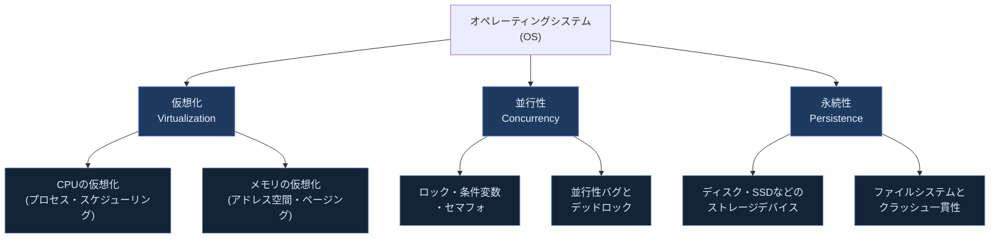

| 柱 | 一言でいうと | 主な問い |
|---|---|---|
| 仮想化（Virtualization） | 1つの物理資源を、多数のプログラムが専有しているかのように見せる技術 | CPUをどう時分割するか？　メモリ空間をどう独立させるか？ |
| 並行性（Concurrency） | 複数の実行の流れ（スレッド）が共有資源に安全にアクセスするための仕組み | ロックはどう実装する？　デッドロックはなぜ起きる？ |
| 永続性（Persistence） | 電源が落ちてもデータを失わずに保持する技術 | ディスクI/Oはどう発行する？　クラッシュ時の一貫性はどう保証する？ |

これら3つに加えて、原著には2020年に追加された**セキュリティ章（Web版限定）**があり、本ガイドでは第5部として扱います。

## メカニズムとポリシー：OSTEP全体を貫く合言葉

OSTEPを通読するうえで最も重要な設計原則が「**メカニズム（mechanism）とポリシー（policy）の分離**」です。これはOSに限らずソフトウェア設計全般に通じる考え方なので、最初に押さえておきましょう。

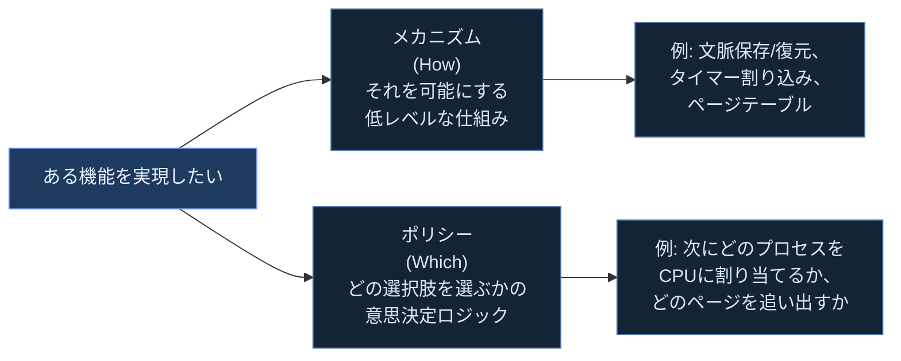

メカニズムとポリシーを分離しておくと、下位の仕組み（メカニズム）を変えずに、上位の判断基準（ポリシー）だけを差し替えられます。CPUスケジューリングでもメモリ置換でも、この分離思想が繰り返し登場します。

## 学習環境の準備

原著の宿題・プロジェクトは主にC言語とLinux/macOS環境を前提としています。

| 用途 | 必要なもの | 備考 |
|---|---|---|
| 本文の宿題シミュレータ | Python 3 | `cpu-sched`や`vm-paging`などの章末シミュレータはPythonスクリプトとして配布 |
| C言語プロジェクト（初期ユーティリティ等） | gcc、標準Cライブラリ、POSIXスレッド（`-pthread`） | ostep-projects リポジトリで公開 |
| xv6ラボ課題 | qemu、RISC-V向けクロスコンパイラ | MIT 6.1810（旧6.828）が提供する`xv6-riscv`を利用することが多い |


---

## 目次

- [第0部：始める前に — OSとコンピュータの基礎](#第0部始める前に--osとコンピュータの基礎)
- [第1部：仮想化 — CPU（第3〜11章）](#第1部仮想化--cpu第311章)
- [第2部：仮想化 — メモリ（第12〜24章）](#第2部仮想化--メモリ第1224章)
- [第3部：並行性（第25〜34章）](#第3部並行性第2534章)
- [第4部：永続性（第35〜51章）](#第4部永続性第3551章)
- [第5部：セキュリティ（第52〜57章、Web版限定の追加章）](#第5部セキュリティ第5257章web版限定の追加章)
- [第6部：付録とラボ課題](#第6部付録とラボ課題)
- [第7部：2026年8月時点の最新動向とOSTEPの学び方](#第7部2026年8月時点の最新動向とostepの学び方)
- [学習ロードマップ](#学習ロードマップ)
- [学習チェックリスト](#学習チェックリスト)
- [用語集](#用語集)
- [参考文献・出典](#参考文献出典)

---

# 第0部：始める前に — OSとコンピュータの基礎

## 0.1 オペレーティングシステムとは何か

オペレーティングシステム（OS）は、ハードウェアとアプリケーションプログラムの間に位置し、以下の役割を担うソフトウェア層です。

- **資源管理者（resource manager）**：CPU・メモリ・ディスクといった有限の物理資源を、複数のプログラムに公平かつ効率的に配分する。
- **抽象化の提供者**：物理的で複雑なハードウェアを、扱いやすい抽象（プロセス、仮想メモリ、ファイル）に変換する。
- **標準化されたインターフェースの提供者**：システムコールという形で、アプリケーションがハードウェアの詳細を意識せずに機能を利用できるようにする。

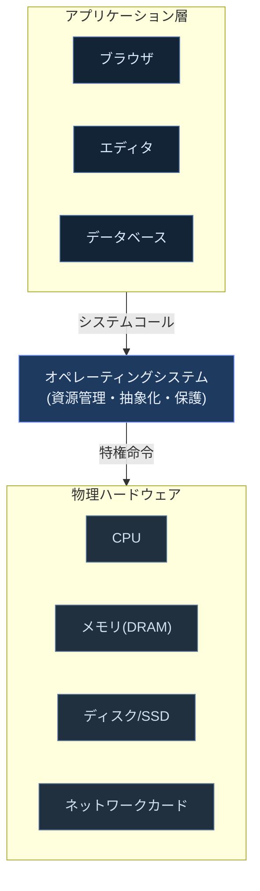

## 0.2 歴史的背景（第1〜2章：対話とイントロダクション）

原著は各パートの冒頭に「対話（Dialogue）」という架空の教師と生徒の会話形式の短い章を置き、その後の内容への導入とする独自のスタイルを採用しています。第2章「Introduction」では、コンピュータの利用形態の変遷を通じてOSが生まれた必然性を説明します。


**ベストプラクティス**
- OSTEPの各部冒頭の「対話」章は読み飛ばしたくなるが、次章以降で扱う核心的な疑問（crux of the problem）を平易な言葉で先出ししてくれるため、実は最初に読むと理解が早まる。
- 第2章の「歴史」を暗記する必要はない。重要なのは「なぜマルチプログラミングが必要だったか」「なぜ保護（protection）の概念が生まれたか」という**因果関係**を掴むこと。

## 0.3 OSの3大目標（再掲・第2章より）

第2章で提示される目標を、実務に近い言葉で言い換えると次の通りです。

| 目標 | 原著での表現 | 実務での言い換え |
|---|---|---|
| 仮想化（Virtualize） | 物理資源を仮想化し、使いやすい抽象を提供する | 1台のマシンで複数プロセスが「自分専用のCPUとメモリ」を持っているかのように動かす |
| 並行性のサポート | 共有資源への並行アクセスを正しく扱う | マルチスレッドプログラムでレースコンディションを起こさない仕組みを用意する |
| 永続性の保証 | ハードウェアの永続記憶を安全に管理する | 電源断やクラッシュが起きてもファイルの内容を失わない |
| 効率性（Efficiency） | オーバーヘッドを最小化する | 仮想化のコストで実マシンの性能を無駄にしない |
| セキュリティ/保護（Protection） | プロセス同士・ユーザー同士を隔離する | 悪意あるプログラムや不具合のあるプログラムが他人の領域を破壊しない |

---

# 第1部：仮想化 — CPU（第3〜11章）

## 1.1 プロセスとは何か（第4章 Processes）

**プロセス（process）**とは、「実行中のプログラム」を表すOSの抽象概念です。プログラム自体はディスク上の静的なバイナリファイルにすぎませんが、OSがそれをメモリにロードし、レジスタやプログラムカウンタなどの実行状態を割り当てることで、初めて「動いているもの」＝プロセスになります。


プロセスが持つ主な機械状態（machine state）は次の通りです。

| 構成要素 | 内容 |
|---|---|
| アドレス空間 | プロセス専用に見えるメモリ領域（コード・データ・ヒープ・スタック） |
| レジスタ | プログラムカウンタ（次に実行する命令のアドレス）、スタックポインタなど |
| I/O情報 | 開いているファイルディスクリプタの一覧 |

### プロセスの状態遷移

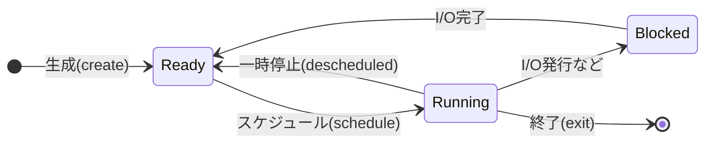

原著では、この3状態（Running / Ready / Blocked）に加え、生成直後の「Initial」や終了処理中の「Final(Zombie)」状態も紹介されますが、初学者はまずこの3状態の遷移条件を押さえれば十分です。

**ベストプラクティス**
- 「プロセス」と「プログラム」を混同しない。同じプログラムから複数のプロセスを生成できる（例：同じ`bash`バイナリから何十個ものシェルプロセスが動く）。
- OSはプロセスの状態を**プロセス制御ブロック（PCB, Process Control Block）**、Linuxでは`task_struct`と呼ばれる構造体で管理している、という対応関係を覚えておくと後のカーネル学習に活きる。

## 1.2 プロセスAPI（第5章 Process API）

UNIX系OSがプロセス生成に採用した`fork()` / `exec()` / `wait()`の組み合わせは、OS設計における最も有名な発明の1つです。

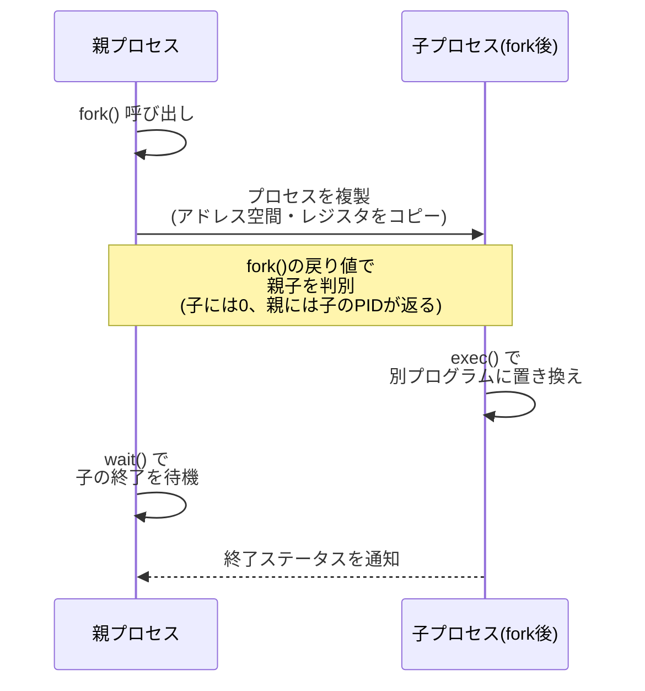

| API | 役割 | 戻り値のポイント |
|---|---|---|
| `fork()` | 呼び出し元プロセスとほぼ同一のコピーを新規プロセスとして生成する | 親には子のPID、子には0が返る（この非対称性が親子判別の鍵） |
| `exec()` | 現在のプロセスのアドレス空間を、指定した別プログラムで置き換える | 成功時は戻ってこない（元のコードには戻らない） |
| `wait()` | 子プロセスの終了を待ち、終了ステータスを回収する | ゾンビプロセス化を防ぐために重要 |

**ベストプラクティス**
- 「なぜ`fork()`と`exec()`を分けたのか？」という設計思想を理解することが最重要。分離することで、`fork()`直後・`exec()`前の間にリダイレクトやパイプの設定（ファイルディスクリプタの操作）を挟み込める。これがUNIXシェルのパイプ（`|`）を実現する仕組みの根幹。
- `wait()`を呼ばない実装は、子プロセス終了後もPCBがゾンビとして残り続ける「ゾンビプロセス」問題を引き起こす。

## 1.3 制限付き直接実行（第6章 Limited Direct Execution）

CPUを仮想化する際、OSは2つの相反する目標のバランスを取らねばなりません。

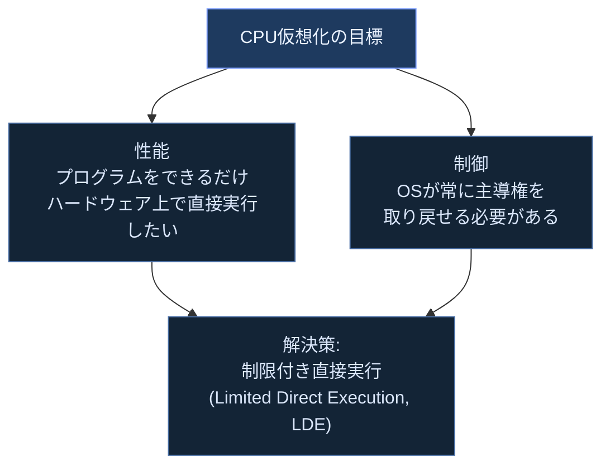

LDEは、プログラムを直接CPU上で走らせつつ、要所で制御をOSに戻す仕組みです。主要なメカニズムは以下の2つです。


| 用語 | 説明 |
|---|---|
| ユーザーモード / カーネルモード | CPUの特権レベル。ユーザーモードでは特権命令（I/O発行など）が制限される |
| トラップテーブル（trap table） | ブート時にOSがハードウェアへ登録する、割り込み・例外・システムコールごとのハンドラアドレス一覧 |
| コンテキストスイッチ | 実行中プロセスのレジスタをPCBに保存し、次のプロセスのレジスタを復元する処理 |

**ベストプラクティス**
- 悪意あるプログラムが無限ループでCPUを独占するのを防いでいるのは「タイマー割り込み」である、という事実は必ず押さえる。タイマー割り込みがなければ、協調的なシステムコール呼び出しに頼るしかなく、OSはプログラムの善意に依存してしまう。
- コンテキストスイッチには2種類の「保存/復元」がある：(1)割り込み発生時にハードウェアが行うレジスタ保存、(2)スケジューラが別プロセスへ切り替える際にOSが行うレジスタ保存。この2段階を区別できると原著の説明が格段に分かりやすくなる。

## 1.4 CPUスケジューリング方針（第7章 CPU Scheduling）

スケジューリングは「複数のRunnableなプロセスのうち、次にどれをCPUに割り当てるか」というポリシーの問題です。評価指標として、主に以下の2つが使われます。

| 指標 | 定義 | 重視する観点 |
|---|---|---|
| ターンアラウンドタイム（turnaround time） | ジョブの完了時刻 − 到着時刻 | スループット重視のバッチ処理 |
| 応答時間（response time） | 最初にCPUを割り当てられた時刻 − 到着時刻 | 対話的な使用感 |

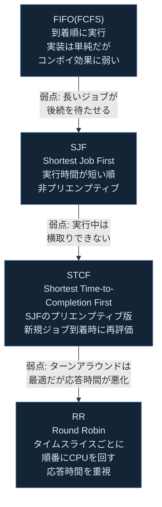

**トレードオフの本質**：ターンアラウンドタイムを最適化する政策（STCF）と、応答時間を最適化する政策（RR）は、しばしば相反します。RRはタイムスライスを短くするほど応答性は上がりますが、コンテキストスイッチのオーバーヘッドが増えてターンアラウンドが悪化します。

**ベストプラクティス**
- スケジューリングアルゴリズムを丸暗記するのではなく、原著が採用する「ワークロードの仮定を1つずつ緩和していく」という説明の流れ（各ジョブの実行時間が既知→未知、ジョブが一括到着→逐次到着、I/Oを行わない→行う）を追体験すること。これにより、なぜ次々と新しいアルゴリズムが必要になるのかが腑に落ちる。

## 1.5 マルチレベルフィードバックキュー（第8章 MLFQ）

現実には「ジョブの実行時間は事前にはわからない」という制約があります。MLFQ（Multi-Level Feedback Queue）は、過去の実行履歴から将来の挙動を推測し、SJF/STCFに近い挙動を実現しようとするアルゴリズムです。

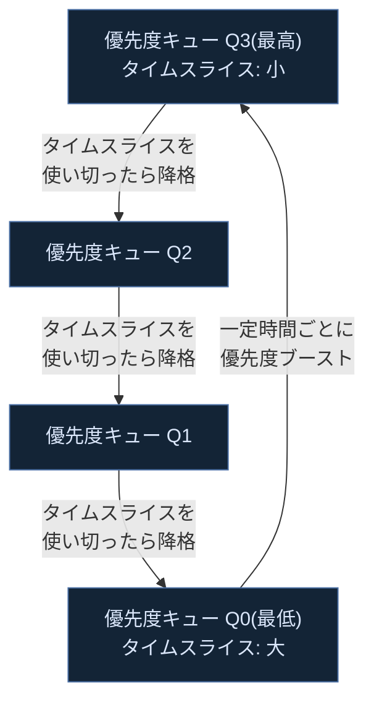

MLFQの基本ルールは次のように整理できます。

| ルール | 内容 |
|---|---|
| Rule 1 | 優先度Aのジョブは優先度Bのジョブより優先される（A > B） |
| Rule 2 | 同一優先度のジョブはラウンドロビンで実行される |
| Rule 3 | ジョブ生成時は最高優先度キューに配置される |
| Rule 4 | 割り当てられたタイムスライスを使い切ったら優先度を1段階下げる（I/Oで自発的に手放した場合は据え置き） |
| Rule 5 | 一定時間ごとに全ジョブを最高優先度に戻す（優先度ブースト。飢餓状態とゲーミング対策） |

**ベストプラクティス**
- MLFQは「CPUを大量に消費するジョブ（バッチ的）」を自動的に低優先度へ追いやり、「短時間だけCPUを使ってすぐI/Oを発行するジョブ（対話的）」を高優先度に保つ、という**過去の挙動から未来を予測する**発想が核心。
- 優先度ブーストがない設計だと、長時間実行され続けるジョブが低優先度に固定され続け「飢餓（starvation）」に陥る、という弱点も併せて理解しておく。

## 1.6 くじ引きスケジューリングと比例配分（第9章 Lottery Scheduling）

MLFQのような優先度ベースの方式とは異なるアプローチとして、**比例配分スケジューリング（proportional-share scheduling）**があります。くじ引きスケジューリング（lottery scheduling）はその代表例です。


| 概念 | 内容 |
|---|---|
| チケット通貨（ticket currency） | ユーザーが自分のチケットを部分プロセスに独自の「通貨」で再配分できる仕組み |
| チケット譲渡（ticket transfer） | プロセスが一時的に自分のチケットを他プロセス（例：待たせているサーバプロセス）へ譲渡できる |
| チケット膨張（ticket inflation） | 信頼できるプロセス同士の間で、自分のチケット数を一時的に増減させる |
| ストライドスケジューリング（stride scheduling） | くじ引きの確率的な公平性を、決定的（deterministic）なアルゴリズムに置き換えたもの |

**ベストプラクティス**
- くじ引きスケジューリングの最大の利点は「乱数を使うことでエッジケースの処理を省略でき、実装がシンプルになる」という点。長期的には統計的に公平になるが、短期的な保証はない、というトレードオフを理解する。

## 1.7 マルチCPUスケジューリング（第10章 Multiprocessor Scheduling）

マルチコア時代のスケジューリングでは、単一CPUの延長では済まない新たな課題が生じます。

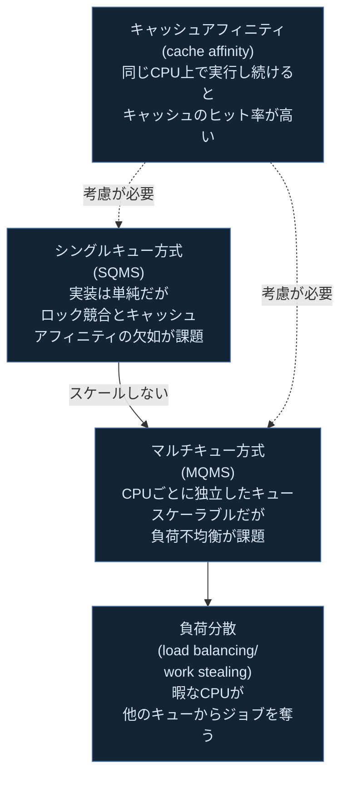

Linuxの実例として、原著（v1.0以降）はO(1)スケジューラ、Completely Fair Scheduler（CFS）、BFS（Brain Fuck Scheduler）を比較しています。CFSは「仮想実行時間（vruntime）」に基づく赤黒木でプロセスを管理し、比例配分スケジューリングの考え方に近いアプローチを取っています。

**ベストプラクティス**
- マルチコアCPUを学ぶ際は「1つのCPU向けアルゴリズムをコア数だけ並べれば良い」という単純な発想では不十分で、コア間のキャッシュ効率と負荷分散のトレードオフが本質的な難しさであると理解する。

## 1.8 CPU仮想化のまとめ（第11章）

第3〜10章の内容は、原著の対話形式の「まとめ（Summary）」章で振り返られます。以下の対応表で全体像を整理しておきましょう。

| 章 | テーマ | 一言まとめ |
|---|---|---|
| 4 | プロセス | 「実行中のプログラム」という抽象、状態遷移 |
| 5 | プロセスAPI | `fork`/`exec`/`wait`の分離設計 |
| 6 | 制限付き直接実行 | trapとタイマー割り込みで性能と制御を両立 |
| 7 | CPUスケジューリング | FIFO→SJF→STCF→RRとワークロード仮定の緩和 |
| 8 | MLFQ | 過去の挙動から優先度を動的に調整 |
| 9 | くじ引き/比例配分 | 乱数を使った公平性の実現 |
| 10 | マルチCPUスケジューリング | キャッシュアフィニティと負荷分散 |

---

# 第2部：仮想化 — メモリ（第12〜24章）

## 2.1 アドレス空間（第13章 Address Spaces）

メモリの仮想化とは、各プロセスに「自分だけがメモリ全体を専有している」という幻想（illusion）を与える仕組みです。この幻想の単位を**アドレス空間（address space）**と呼びます。

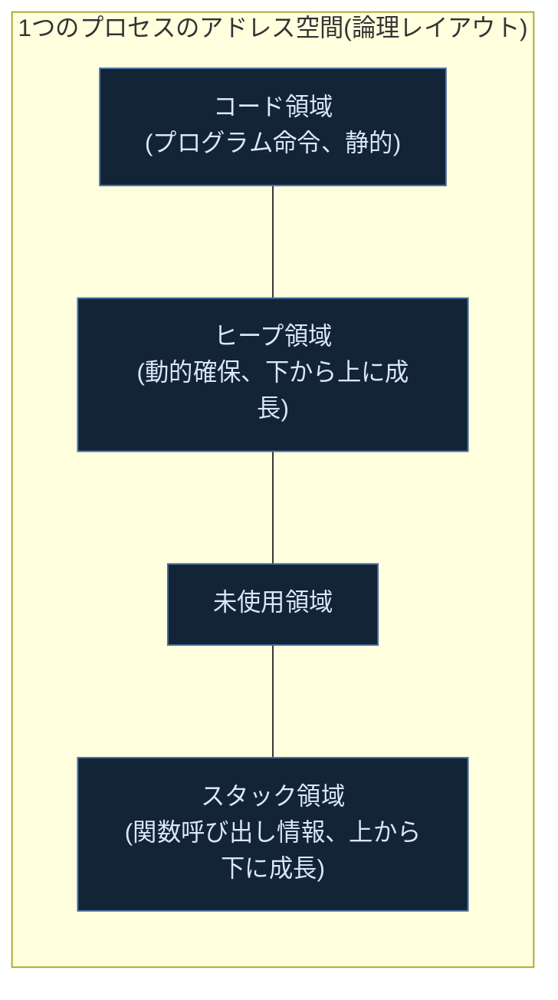

OSはこの仮想アドレス空間を**物理メモリへ透過的に変換（address translation）**することで、複数プロセスが同じ仮想アドレス（例：0番地）を使っても、実際には異なる物理メモリ上に配置できるようにしています。

| 用語 | 内容 |
|---|---|
| 仮想化のゴール：透過性 | プログラムは自分が仮想化されていることに気づかない |
| 仮想化のゴール：効率性 | 時間・空間のオーバーヘッドを最小化する |
| 仮想化のゴール：保護 | あるプロセスが他のプロセスや OS 自身のメモリに触れない |

## 2.2 メモリAPI（第14章 Memory API）

C言語における動的メモリ管理の基本APIと、よくあるバグのパターンを整理します。

| API | 役割 |
|---|---|
| `malloc(size)` | ヒープから指定バイト数の領域を確保し、先頭アドレスを返す |
| `free(ptr)` | 確保した領域を解放する |
| `calloc()` | ゼロ初期化して確保する |
| `realloc()` | 確保済み領域のサイズを変更する |


**ベストプラクティス**
- `malloc`/`free`はシステムコールではなく**ライブラリ関数**であり、内部では`brk`/`sbrk`や`mmap`といったシステムコールでOSからメモリ領域を獲得している、という階層関係を理解する。
- Valgrindのようなツールでメモリバグを検出する習慣は、本章の内容を実務に接続する第一歩になる。

## 2.3 アドレス変換の基礎：ベース＆バウンド（第15章 Address Translation）

**ハードウェアによるメモリ仮想化（hardware-based address translation）**の最も単純な形が、ベース＆バウンド方式（動的リロケーション）です。


| レジスタ | 役割 |
|---|---|
| ベースレジスタ（base） | プロセスの物理メモリ上の開始位置 |
| バウンドレジスタ（bound/limit） | アドレス空間のサイズ（範囲外アクセスを検出するため） |

この方式はハードウェアのMMU（Memory Management Unit）による**ダイナミックリロケーション**を可能にしますが、プロセスのアドレス空間全体を1つの連続領域として扱うため、ヒープとスタックの間の未使用領域まで物理メモリを占有してしまう「内部的な無駄」が生じます。この課題を解決するのが次のセグメンテーションです。

## 2.4 セグメンテーション（第16章 Segmentation）

セグメンテーションは、アドレス空間を「コード」「ヒープ」「スタック」といった論理的な単位（セグメント）に分割し、それぞれに独立したベース＆バウンドのペアを用意する方式です。

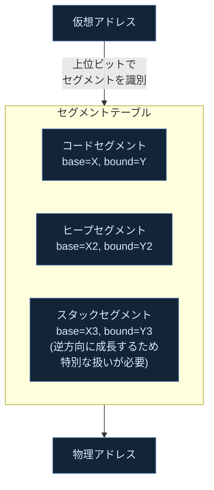

セグメンテーションにより未使用領域を物理メモリに割り当てずに済むようになりますが、各セグメント自体のサイズが可変であるため、**外部フラグメンテーション（external fragmentation）**という新たな問題が生じます。

## 2.5 空き領域管理（第17章 Free-Space Management）

可変サイズの割り当てを扱うヒープマネージャは、空き領域リストを管理し、外部フラグメンテーションを最小化するための戦略を選択します。

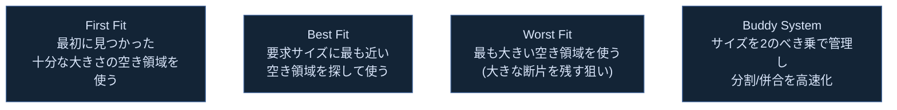

| 戦略 | 長所 | 短所 |
|---|---|---|
| First Fit | 実装が単純で高速 | 断片化がリストの先頭に集中しやすい |
| Best Fit | 無駄になる断片を最小化しようとする | 探索コストが高く、極小の断片を大量に生む |
| Worst Fit | 大きな断片を意図的に残す | 大きな空き領域をすぐに使い切ってしまう |
| Buddy System | 併合（コアレッシング）が高速 | 内部フラグメンテーションが発生しやすい |

**ベストプラクティス**
- どの戦略にも一長一短があり、「唯一絶対の正解」は存在しない、という原著のスタンスを理解する。実務ではjemalloc・tcmallocなど、スレッドごとにアリーナを分けるなどの発展的な設計がなされている。

## 2.6 ページングの導入（第18章 Paging）

セグメンテーションの外部フラグメンテーション問題を根本的に解決するのが**ページング（paging）**です。アドレス空間を固定長の「ページ（page）」に分割し、物理メモリも同サイズの「ページフレーム（page frame）」に分割して対応付けます。

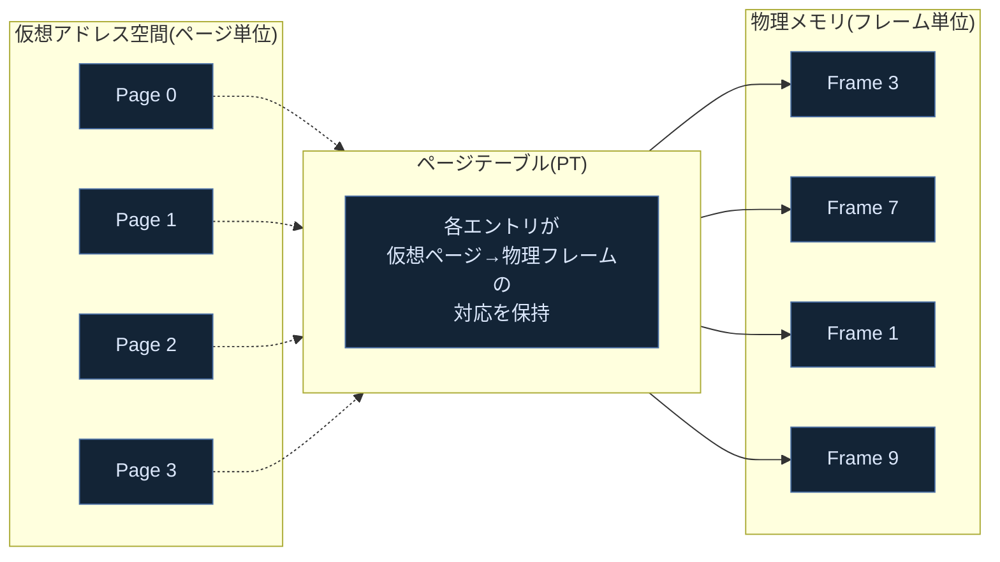

固定長ページを使うことで外部フラグメンテーションは解消されますが、代わりにページテーブル自体のメモリ消費（各プロセスごとに巨大なテーブルが必要）という新たな課題が生まれます。ページテーブルエントリ（PTE）には、物理フレーム番号のほか、有効ビット・保護ビット（読み書き実行権限）・参照ビット・ダーティビットといった付加情報が含まれます。

## 2.7 高速化：TLB（第19章 Translation Lookaside Buffers）

ページングは全メモリアクセスのたびにページテーブル参照という追加のメモリアクセスを発生させ、性能を大きく劣化させます。この問題を解決するのがハードウェアキャッシュである**TLB（Translation Lookaside Buffer）**です。

```mermaid
flowchart TD
    Start["メモリアクセス発生"] --> TLBCheck{"TLBに<br/>該当エントリあり?"}
    TLBCheck -->|"ヒット<br/>(TLB Hit)"| Fast["高速に物理アドレス取得"]
    TLBCheck -->|"ミス<br/>(TLB Miss)"| Slow["ページテーブルを参照<br/>(ソフトウェア/ハードウェア方式)"]
    Slow --> Update["TLBにエントリを追加"]
    Update --> Retry["命令を再実行"]

    classDef box fill:#132436,stroke:#4a6fa5,color:#dbe7fb
    class Start,Fast,Slow,Update,Retry box
    classDef decision fill:#1e3a5f,stroke:#7c9eff,color:#eaf2ff
    class TLBCheck decision
```

| 概念 | 内容 |
|---|---|
| TLBヒット率 | プログラムの空間的・時間的局所性が高いほど向上する |
| コンテキストスイッチ時のTLBフラッシュ | プロセスが切り替わるとTLBの内容が別プロセスのものと衝突するため無効化が必要（ASID/PCIDで回避する実装もある） |
| ソフトウェア管理TLB | MIPSなどはTLBミス時にOSがハンドラで処理（柔軟性が高い） |
| ハードウェア管理TLB | x86などはCPUがページテーブルウォークを自動実行（OSの介入不要で高速） |

## 2.8 高度なページテーブル（第20章 Advanced Page Tables）

単純な線形ページテーブルはサイズが大きすぎるため、実用上は以下の工夫が必要です。

```mermaid
flowchart TB
    Linear["線形ページテーブル<br/>(単純だが巨大)"]
    Multi["多階層ページテーブル<br/>(multi-level)<br/>使われていない領域の<br/>テーブルを丸ごと省略"]
    Inverted["逆ページテーブル<br/>(inverted page table)<br/>物理フレームごとに1エントリ<br/>(仮想アドレスの数に依存しない)"]
    Hybrid["ハイブリッドアプローチ<br/>(多階層+TLB+デマンドページング)<br/>現代のOSで広く採用"]

    Linear -->|"空間効率の改善"| Multi
    Linear -->|"別アプローチ"| Inverted
    Multi --> Hybrid
    Inverted --> Hybrid

    classDef box fill:#132436,stroke:#4a6fa5,color:#dbe7fb
    class Linear,Multi,Inverted,Hybrid box
```

多階層ページテーブルは、x86-64の4段（PML4→PDPT→PD→PT）や、ARM64の複数レベル構成として実際のOSで広く採用されています。トレードオフとして、TLBミス時に複数回のメモリアクセス（ページテーブルウォーク）が必要になる点が挙げられます。

## 2.9 スワッピング：メカニズム（第21章 Beyond Physical Memory: Mechanisms）

物理メモリの総量を超えるアドレス空間を扱うため、OSはページの一部をディスク（スワップ領域）へ退避させる**スワッピング（swapping）**を行います。

```mermaid
sequenceDiagram
    participant CPU as CPU
    participant PT as ページテーブル
    participant Mem as 物理メモリ
    participant Disk as ディスク(スワップ領域)

    CPU->>PT: 仮想アドレスへアクセス
    PT-->>CPU: 有効ビットOFF(ページフォールト)
    CPU->>PT: OSのページフォールトハンドラを起動
    PT->>Disk: 対象ページを検索
    Disk-->>Mem: ページをメモリへ読み込み
    Mem->>PT: ページテーブルエントリを更新
    PT-->>CPU: 命令を再実行し継続
```

**ページフォールト（page fault）**は例外の一種で、ハードウェアが検出し、OSのページフォールトハンドラが処理を担当します。ページがメモリ上に存在しない場合、ディスクI/Oが発生するためレイテンシが大きく（ミリ秒オーダー）、他のプロセスへ切り替えて待ち時間を有効活用するのが一般的です。

## 2.10 スワッピング：ポリシー（第22章 Beyond Physical Memory: Policies）

物理メモリが枯渇した際、どのページを追い出す（evict）かを決めるのがページ置換ポリシーです。

```mermaid
flowchart TB
    Opt["最適方針(OPT)<br/>将来最も遠い未来に<br/>使われるページを追い出す<br/>(理論上限、実装不可)"]
    FIFO["FIFO<br/>最も古くロードされた<br/>ページを追い出す<br/>(Beladyの異常が起きうる)"]
    LRU["LRU<br/>最も長く<br/>使われていないページを<br/>追い出す(局所性を活用)"]
    Clock["クロックアルゴリズム<br/>(近似LRU)<br/>参照ビットを使って<br/>低コストにLRUを近似"]

    Opt -.->|"理論上の目標"| LRU
    FIFO -->|"改善"| LRU
    LRU -->|"実装コストの低減"| Clock

    classDef box fill:#132436,stroke:#4a6fa5,color:#dbe7fb
    class Opt,FIFO,LRU,Clock box
```

| 用語 | 内容 |
|---|---|
| Beladyの異常（Belady's Anomaly） | FIFOではキャッシュ（メモリ）を増やしたのにミス率が悪化する場合がある現象 |
| サッシング（thrashing） | ワーキングセットが物理メモリに収まらず、ページフォールトが頻発して性能が急落する状態 |

**ベストプラクティス**
- 理論上最適なOPTアルゴリズムを「ものさし」として、FIFO・LRU・近似LRUの性能を比較する、という原著の学習フレームを意識する。実装不可能な理想を知ることで、現実的なアルゴリズムの評価軸が明確になる。

## 2.11 完全なVMシステム（第23章 Complete Virtual Memory Systems）

原著はDEC VAX/VMSと現代のLinuxを例に、実システムがこれまでの理論をどう統合しているかを解説します。

```mermaid
flowchart LR
    subgraph VAX["VAX/VMS(歴史的な設計)"]
        V1["セグメント+ページングの<br/>ハイブリッド"]
        V2["OS自身も仮想メモリに<br/>配置(オーバーヘッド削減)"]
    end
    subgraph Linux["現代のLinux"]
        L1["多階層ページテーブル<br/>+ Huge Pages対応"]
        L2["デマンドゼロページ<br/>(demand zeroing)"]
        L3["Copy-on-Write(COW)<br/>fork()の高速化"]
    end

    classDef box fill:#132436,stroke:#4a6fa5,color:#dbe7fb
    class V1,V2,L1,L2,L3 box
```

**Copy-on-Write（COW）**は、`fork()`直後に親子のアドレス空間を物理的にコピーせず、書き込みが発生した時点で初めて実ページを複製する最適化です。読み取り専用アクセスが大半を占める実際のワークロードにおいて、大幅な性能改善をもたらします。

## 2.12 メモリ仮想化のまとめ（第24章）

| 章 | テーマ | 一言まとめ |
|---|---|---|
| 13 | アドレス空間 | プロセスごとの独立したメモリ幻想 |
| 14 | メモリAPI | malloc/freeとよくあるバグ |
| 15 | アドレス変換 | ベース＆バウンドによる動的リロケーション |
| 16 | セグメンテーション | 論理単位でのアドレス空間分割 |
| 17 | 空き領域管理 | First/Best/Worst Fit、Buddy System |
| 18 | ページング | 固定長ページによる外部フラグメンテーション解消 |
| 19 | TLB | アドレス変換のハードウェアキャッシュ |
| 20 | 高度なページテーブル | 多階層・逆ページテーブル |
| 21 | スワッピング：メカニズム | ページフォールトとディスクI/O |
| 22 | スワッピング：ポリシー | FIFO/LRU/クロックアルゴリズム |
| 23 | 完全なVMシステム | VAX/VMSとLinuxの実装統合 |

---

# 第3部：並行性（第25〜34章）

## 3.1 スレッドと並行性の導入（第26章 Concurrency and Threads）

**スレッド（thread）**は、1つのプロセス内に複数の独立した実行の流れを持たせるための仕組みです。プロセスとの違いを整理しておきましょう。

```mermaid
flowchart TB
    subgraph SingleProc["マルチスレッドの1プロセス"]
        direction TB
        Shared["共有: アドレス空間<br/>(コード・ヒープ・グローバル変数)"]
        T1["スレッド1<br/>独自のスタック・レジスタ・PC"]
        T2["スレッド2<br/>独自のスタック・レジスタ・PC"]
        T3["スレッド3<br/>独自のスタック・レジスタ・PC"]
    end
    Shared --- T1
    Shared --- T2
    Shared --- T3

    classDef shared fill:#1e3a5f,stroke:#7c9eff,color:#eaf2ff
    classDef thread fill:#132436,stroke:#4a6fa5,color:#dbe7fb
    class Shared shared
    class T1,T2,T3 thread
```

複数プロセスに分割する場合と異なり、スレッド間ではアドレス空間（特にヒープ上のデータ）を直接共有できるため、プロセス間通信（IPC）のコストなしにデータをやり取りできます。一方で、この「共有」こそが並行性バグの温床にもなります。

**レースコンディション（race condition）**とは、複数のスレッドが共有データに同時アクセスし、実行順序によって結果が変わってしまう現象です。共有変数へのアクセスを含むコード区間を**クリティカルセクション（critical section）**と呼び、これを保護する性質を**相互排他（mutual exclusion）**と呼びます。

## 3.2 スレッドAPI（第27章 Thread API）

POSIXスレッド（Pthreads）の主要APIです。

| API | 役割 |
|---|---|
| `pthread_create()` | 新しいスレッドを生成し、指定した関数の実行を開始する |
| `pthread_join()` | 指定したスレッドの終了を待つ |
| `pthread_mutex_lock/unlock()` | ロックの獲得・解放 |
| `pthread_cond_wait/signal()` | 条件変数を使った待機・通知 |

**ベストプラクティス**
- スレッド関連のバグは「毎回起きるわけではない」タイミング依存性を持つため再現が難しい。原著は「常にコードをレビューし、ロックの獲得順序を統一する」といった規律ある習慣の重要性を強調している。

## 3.3 ロック（第28章 Locks）

ロックは相互排他を実現するための基本的な同期プリミティブです。理想的なロックは以下の性質を満たします。

| 評価基準 | 内容 |
|---|---|
| 正確性（correctness） | 相互排他を保証すること |
| 公平性（fairness） | 各スレッドが飢餓状態にならず、いずれロックを獲得できること |
| 性能（performance） | ロック獲得・解放のオーバーヘッドが小さいこと |

```mermaid
flowchart TB
    Naive["割り込み無効化<br/>(uniprocessor限定、危険)"]
    TAS["Test-And-Set<br/>ハードウェア命令による<br/>スピンロック"]
    CAS["Compare-And-Swap<br/>より柔軟なアトミック命令"]
    Ticket["チケットロック<br/>(Ticket Lock)<br/>FIFO順を保証し<br/>飢餓を防止"]
    Park["park/unparkによる<br/>ブロッキングロック<br/>(スピンせずOSに制御を返す)"]
    Futex["Linuxのfutex<br/>ユーザー空間で完結する<br/>高速パス+競合時のみ<br/>カーネルへ問い合わせ"]

    TAS --> Ticket
    CAS -.->|"同様の目的で利用"| Ticket
    Ticket -->|"CPU浪費を避けるため"| Park
    Park --> Futex

    classDef box fill:#132436,stroke:#4a6fa5,color:#dbe7fb
    class Naive,TAS,CAS,Ticket,Park,Futex box
```

**ベストプラクティス**
- スピンロックは「待ち時間が極めて短い」ケースでは高速だが、待ち時間が長くなるとCPUサイクルを浪費し続けるため、実用システムでは「まず少しスピンし、それでもダメならOSにブロッキングを依頼する」といったハイブリッド方式（Linuxのfutexなど）が採用される。この段階的な設計思想を押さえる。

## 3.4 ロックを使ったデータ構造（第29章 Lock-based Concurrent Data Structures）

既存のシーケンシャルなデータ構造にロックを追加し、スレッドセーフにする際の設計指針を整理します。

```mermaid
flowchart LR
    Coarse["粗粒度ロック<br/>(coarse-grained)<br/>構造体全体を1つの<br/>ロックで保護<br/>実装は単純だが並行度が低い"]
    Fine["細粒度ロック<br/>(fine-grained)<br/>ハッシュテーブルの<br/>バケット単位など<br/>部分ごとにロック<br/>実装は複雑だが並行度が高い"]

    Coarse -->|"性能要件が<br/>厳しい場合"| Fine

    classDef box fill:#132436,stroke:#4a6fa5,color:#dbe7fb
    class Coarse,Fine box
```

| データ構造 | 並行化の工夫 |
|---|---|
| カウンタ | 近似カウンタ（sloppy counter）でCPUごとにローカルカウンタを持ち、定期的にグローバルへ同期する |
| 連結リスト | ハンド・オーバー・ハンド・ロッキング（各ノードごとにロック）で並行度を高める |
| キュー | 先頭用と末尾用に別々のロックを用意する（Michael & Scott Queue） |
| ハッシュテーブル | バケットごとに独立したロックを持たせる |

## 3.5 条件変数（第30章 Condition Variables）

ロックだけでは「あるスレッドが特定の条件が満たされるまで待つ」というパターンを効率よく実現できません。**条件変数（condition variable）**は、この「待機と通知」を扱うための同期プリミティブです。

```mermaid
sequenceDiagram
    participant P as プロデューサー
    participant Buf as 共有バッファ
    participant C as コンシューマー

    C->>Buf: ロック獲得
    C->>Buf: バッファが空か確認
    C->>C: 空ならcond_wait()で待機<br/>(ロックを自動的に解放)
    P->>Buf: ロック獲得しデータを追加
    P->>C: cond_signal()で通知
    P->>Buf: ロック解放
    C->>C: cond_waitから復帰し<br/>ロックを再獲得
    C->>Buf: 条件を再チェック(while文推奨)
    C->>Buf: データを取り出しロック解放
```

**ベストプラクティス**
- `if`文ではなく**必ず`while`文で条件を再チェックする**こと（Mesa流セマンティクス）。`signal`から復帰した時点で条件が本当に満たされているとは限らない（他のスレッドが先にバッファを空にしてしまう可能性がある）ため、必須のイディオムとなる。
- Producer/Consumerパターンはマルチスレッドプログラミングの最頻出パターンであり、原著のコード例を実際に書いて動かすことを強く推奨する。

## 3.6 セマフォ（第31章 Semaphores）

**セマフォ（semaphore）**は、整数値のカウンタと2つの操作（`sem_wait()`/`sem_post()`、歴史的にはP操作/V操作）から構成される汎用的な同期プリミティブで、ロックと条件変数の両方の役割を1つの構造体で表現できます。

| 用途 | 初期値 | 使い方 |
|---|---|---|
| バイナリセマフォ（ロック代替） | 1 | 相互排他を実現 |
| 順序制御 | 0 | あるスレッドが完了するまで別スレッドを待たせる |
| 資源カウンタ | N | 同時にアクセスできるスレッド数をN個に制限する |

```mermaid
flowchart LR
    subgraph Producer["プロデューサー側"]
        Full["sem_wait(empty)<br/>空きスロット待ち"]
        Fill["データ投入"]
        Post1["sem_post(full)"]
    end
    subgraph Consumer["コンシューマー側"]
        Wait["sem_wait(full)<br/>データ到着待ち"]
        Take["データ取得"]
        Post2["sem_post(empty)"]
    end

    Full --> Fill --> Post1
    Wait --> Take --> Post2

    classDef box fill:#132436,stroke:#4a6fa5,color:#dbe7fb
    class Full,Fill,Post1,Wait,Take,Post2 box
```

## 3.7 並行性バグ（第32章 Concurrency Bugs）

実システム（MySQL・Apache・OpenOfficeなど）を対象にした研究に基づき、原著は並行性バグを2種類に分類します。

```mermaid
flowchart TB
    Bugs["並行性バグ"]
    NonDead["非デッドロックバグ<br/>(Non-Deadlock Bugs)"]
    Dead["デッドロックバグ<br/>(Deadlock Bugs)"]

    Bugs --> NonDead
    Bugs --> Dead

    NonDead --> A1["違反アトミシティ<br/>(atomicity violation)"]
    NonDead --> A2["違反順序<br/>(order violation)"]

    classDef cat fill:#1e3a5f,stroke:#7c9eff,color:#eaf2ff
    classDef box fill:#132436,stroke:#4a6fa5,color:#dbe7fb
    class Bugs,NonDead,Dead cat
    class A1,A2 box
```

**デッドロック（deadlock）**が発生するには、以下の4条件がすべて同時に成立する必要があります。

| 条件 | 内容 |
|---|---|
| 相互排他（mutual exclusion） | 資源は同時に1スレッドしか保持できない |
| 保持と待機（hold-and-wait） | 資源を保持したまま別の資源を待つ |
| 横取り不可（no preemption） | 資源は保持者が自発的に解放するまで奪えない |
| 循環待機（circular wait） | スレッド同士が環状に互いの資源を待つ |

```mermaid
flowchart LR
    T1["スレッド1<br/>ロックA保持"] -->|"ロックB待ち"| T2["スレッド2<br/>ロックB保持"]
    T2 -->|"ロックA待ち"| T1

    classDef bug fill:#3a1420,stroke:#c05a6e,color:#f5d8de
    class T1,T2 bug
```

**デッドロックへの対処法**

| アプローチ | 内容 |
|---|---|
| 回避（prevention） | 4条件のいずれかを崩す設計にする（例：ロック取得順序を全体で統一する） |
| 検出と回復（detection & recovery） | 定期的にデッドロックを検出し、必要ならプロセスを強制終了する |
| 回避（avoidance、スケジューラレベル） | 資源要求を事前に把握し、デッドロックに陥らないようスケジューリングする（銀行家のアルゴリズム等） |
| 無視（ignore） | 現実的な発生頻度の低さから「ダチョウのアルゴリズム」として無視する（多くのOSが採用） |

## 3.8 イベントベース並行性（第33章 Event-based Concurrency）

スレッドを使わずに並行性を実現するアプローチとして、**イベントベース並行性（event-based concurrency）**があります。

```mermaid
flowchart TB
    Loop["イベントループ"]
    Loop --> Poll["select()/poll()/epoll()で<br/>複数のディスクリプタを監視"]
    Poll --> Ready{"イベント発生?"}
    Ready -->|"Yes"| Handle["対応するハンドラを<br/>順番に実行(単一スレッド)"]
    Handle --> Loop
    Ready -->|"No(ブロック)"| Poll

    classDef box fill:#132436,stroke:#4a6fa5,color:#dbe7fb
    class Loop,Poll,Handle box
    classDef decision fill:#1e3a5f,stroke:#7c9eff,color:#eaf2ff
    class Ready decision
```

| 比較軸 | マルチスレッド | イベントベース |
|---|---|---|
| 並行処理の単位 | OSスレッド | 単一スレッドのイベントループ |
| ロックの必要性 | 必要（共有状態の保護） | 基本的に不要（シングルスレッドのため） |
| ブロッキングI/Oの扱い | 各スレッドが個別にブロックしてもOK | 非同期I/O（あるいは別スレッドプールへのオフロード）が必須 |
| マルチコア活用 | 容易 | 単純な実装では困難（工夫が必要） |

**ベストプラクティス**
- Node.jsのイベントループ、Nginxのワーカープロセス、Redisのシングルスレッド設計など、現代の高性能サーバーの多くがこのモデルを採用している。「なぜロックを使わずに高い並行性を実現できるのか」を、本章の内容と結びつけて理解しておくと実務での技術選定に役立つ。

## 3.9 並行性のまとめ（第34章）

| 章 | テーマ | 一言まとめ |
|---|---|---|
| 26 | スレッドと並行性 | 共有アドレス空間を持つ複数の実行フロー |
| 27 | スレッドAPI | pthread_create/join/mutex |
| 28 | ロック | スピンロックからfutexまでの進化 |
| 29 | ロックを使ったデータ構造 | 粗粒度から細粒度へ |
| 30 | 条件変数 | 待機と通知、while文での再チェック |
| 31 | セマフォ | ロックと条件制御を統一的に扱う |
| 32 | 並行性バグ | デッドロックの4条件と対処法 |
| 33 | イベントベース並行性 | ロック不要の単一スレッドモデル |

---

# 第4部：永続性（第35〜51章）

## 4.1 I/Oデバイス（第36章 I/O Devices）

OSはCPU・メモリだけでなく、多種多様なI/Oデバイスも抽象化して扱う必要があります。

```mermaid
flowchart TB
    subgraph CanonicalDevice["標準的なデバイスの構造"]
        Interface["インターフェース<br/>(status/command/dataレジスタ)"]
        Internals["内部実装<br/>(ファームウェア+専用ロジック)"]
    end
    Interface --- Internals

    classDef box fill:#132436,stroke:#4a6fa5,color:#dbe7fb
    class Interface,Internals box
```

```mermaid
sequenceDiagram
    participant OS as OS(デバイスドライバ)
    participant Dev as I/Oデバイス

    OS->>Dev: statusレジスタをポーリングし<br/>ビジー状態か確認
    OS->>Dev: dataレジスタへデータを書き込み
    OS->>Dev: commandレジスタへコマンド発行
    Dev-->>OS: 処理完了後に割り込み(interrupt)通知
    OS->>OS: 割り込みハンドラで<br/>後続処理を実行
```

| 方式 | 内容 | トレードオフ |
|---|---|---|
| ポーリング（polling） | OSがステータスレジスタを繰り返し確認する | 実装は単純だがCPUを浪費する |
| 割り込み（interrupt） | デバイス側から完了を通知し、CPUは他の処理を続けられる | 割り込みハンドラのオーバーヘッドがある。高頻度I/Oでは逆に非効率（割り込み駆動とポーリングを組み合わせるハイブリッド方式も使われる） |
| DMA（Direct Memory Access） | 専用コントローラがCPUを介さずメモリとデバイス間でデータ転送する | 大量データ転送時のCPU負荷を大幅に削減 |

## 4.2 ハードディスクドライブ（第37章 Hard Disk Drives）

HDDは、回転するプラッタ（platter）上をヘッド（head）が移動してデータを読み書きする機械的なデバイスです。

```mermaid
flowchart LR
    Req["I/O要求"]
    Seek["シーク時間<br/>(seek time)<br/>目的のトラックまで<br/>ヘッドを移動"]
    Rotate["回転待ち時間<br/>(rotational latency)<br/>目的のセクタが<br/>ヘッド下に来るまで待つ"]
    Transfer["転送時間<br/>(transfer time)<br/>実際のデータ読み書き"]

    Req --> Seek --> Rotate --> Transfer

    classDef box fill:#132436,stroke:#4a6fa5,color:#dbe7fb
    class Req,Seek,Rotate,Transfer box
```

| ディスクスケジューリングアルゴリズム | 内容 |
|---|---|
| SSTF（Shortest Seek Time First） | 現在位置から最も近いリクエストを優先 |
| SCAN（エレベーターアルゴリズム） | ヘッドを一方向に動かしながら通過順にリクエストを処理し、端に達したら折り返す |
| C-SCAN | 一方向のみ処理し、端に達したら先頭に戻って再度同方向に処理する（待ち時間の公平性を改善） |

**ベストプラクティス**：機械的なシーク・回転待ちのコストが支配的であるという性質から、「ランダムI/OよりシーケンシャルI/Oが圧倒的に高速」というHDDの特性を理解する。この特性が、後述のFFSやログ構造化ファイルシステムの設計動機に直結する。

## 4.3 RAID（第38章 Redundant Arrays of Inexpensive Disks）

RAIDは複数の物理ディスクを束ね、性能・容量・信頼性を向上させる技術です。

```mermaid
flowchart TB
    R0["RAID 0<br/>ストライピング<br/>性能・容量は最大化<br/>冗長性なし(1台故障で全損)"]
    R1["RAID 1<br/>ミラーリング<br/>信頼性は高いが<br/>容量効率は50%"]
    R4["RAID 4<br/>専用パリティディスク<br/>パリティディスクが<br/>ボトルネックになりやすい"]
    R5["RAID 5<br/>分散パリティ<br/>パリティを全ディスクに分散し<br/>書き込みボトルネックを解消"]

    classDef box fill:#132436,stroke:#4a6fa5,color:#dbe7fb
    class R0,R1,R4,R5 box
```

| RAIDレベル | 容量効率(Nディスク時) | 耐障害性 | 特徴 |
|---|---|---|---|
| RAID 0 | 100% | なし | 性能最優先、冗長性なし |
| RAID 1 | 50% | 1台の故障まで耐えられる | シンプルな複製 |
| RAID 4 | (N-1)/N | 1台の故障まで耐えられる | パリティディスク集中でボトルネック化 |
| RAID 5 | (N-1)/N | 1台の故障まで耐えられる | パリティを分散し書き込み性能を改善 |

評価軸として、原著は常に「容量（capacity）」「信頼性（reliability）」「性能（performance）」の3つのトレードオフでRAIDレベルを比較する手法を採っています。

## 4.4 ファイルとディレクトリ（第39章 Files and Directories）

ファイルシステムが提供する2つの基本抽象が「ファイル」と「ディレクトリ」です。

```mermaid
flowchart TB
    Inode["inode<br/>(ファイルのメタデータ:<br/>サイズ・所有者・権限・<br/>データブロックへのポインタ)"]
    Dir["ディレクトリ<br/>(ファイル名 → inode番号<br/>の対応表)"]
    Data["データブロック<br/>(実際のファイル内容)"]

    Dir -->|"name → inode#"| Inode
    Inode -->|"ポインタ"| Data

    classDef box fill:#132436,stroke:#4a6fa5,color:#dbe7fb
    class Inode,Dir,Data box
```

| 概念 | 内容 |
|---|---|
| ファイルディスクリプタ | プロセスごとに管理される、開いているファイルへのハンドル（番号） |
| オープンファイルテーブル | ファイルオフセットなど、開いている状態を保持するカーネル側の構造（プロセス間・ファイルディスクリプタ間で共有される場合がある） |
| ハードリンク | 同一inodeを複数のファイル名で参照する仕組み |
| シンボリックリンク | パス文字列を格納した別ファイル。参照先が消えると「壊れたリンク」になる |
| `fsync()` | バッファキャッシュ上のデータを強制的にディスクへ書き出す |

## 4.5 ファイルシステム実装（第40章 File System Implementation）

原著は「VSFS（Very Simple File System）」という教育用の簡略化したファイルシステムを題材に、実装の基本構造を解説します。

```mermaid
flowchart LR
    SB["スーパーブロック<br/>(全体のメタデータ)"]
    IB["inodeビットマップ<br/>(空きinode管理)"]
    DB["データビットマップ<br/>(空きブロック管理)"]
    IT["inodeテーブル"]
    DBlocks["データブロック領域"]

    SB --- IB --- DB --- IT --- DBlocks

    classDef box fill:#132436,stroke:#4a6fa5,color:#dbe7fb
    class SB,IB,DB,IT,DBlocks box
```

ファイル読み込み・書き込みの際、実際には複数回のディスクI/O（ディレクトリの探索、inodeの読み込み、データブロックの読み書き、ビットマップの更新）が発生する、という具体的なI/Oパスの理解が本章の要点です。

## 4.6 高速化：Fast File System（第41章 FFS）

初期のUNIXファイルシステムは、ディスク上にデータが分散配置されるため断片化に弱いという問題を抱えていました。**FFS（Fast File System）**はこれを改善するために「シリンダグループ（cylinder group）」という考え方を導入しました。

```mermaid
flowchart TB
    Disk["ディスク全体"]
    CG1["シリンダグループ1<br/>(inode+データを近接配置)"]
    CG2["シリンダグループ2"]
    CG3["シリンダグループ3"]

    Disk --> CG1
    Disk --> CG2
    Disk --> CG3

    classDef box fill:#132436,stroke:#4a6fa5,color:#dbe7fb
    class Disk,CG1,CG2,CG3 box
```

同一ディレクトリ内のファイルとそのinodeを近接するシリンダグループへ配置する「局所性を意識した配置ポリシー」により、シーク時間を削減しています。

## 4.7 クラッシュ一貫性：FSCKとジャーナリング（第42章）

複数ブロックの更新中に電源断が起きると、ファイルシステムの整合性が崩れる「クラッシュ一貫性問題（crash-consistency problem）」が発生します。

```mermaid
flowchart LR
    FSCK["fsck方式<br/>(事後チェック)<br/>ブート時に<br/>ファイルシステム全体を<br/>スキャンし矛盾を修復<br/>大容量ディスクでは低速"]
    Journal["ジャーナリング方式<br/>(先行記録/write-ahead logging)<br/>更新内容を先に<br/>ジャーナル領域へ記録し<br/>クラッシュ時はジャーナルのみ確認<br/>※図はデータも記録する<br/>フルデータジャーナリングの場合"]

    FSCK -->|"性能面での改善"| Journal

    classDef box fill:#132436,stroke:#4a6fa5,color:#dbe7fb
    class FSCK,Journal box
```

```mermaid
sequenceDiagram
    participant App as アプリケーション
    participant FS as ファイルシステム
    participant Journal as ジャーナル領域
    participant Data as 実データ領域

    App->>FS: ファイル更新要求
    FS->>Journal: TxBegin + 更新内容を書き込み
    FS->>Journal: TxEnd(コミットブロック)を書き込み
    Note over Journal: 必要なジャーナル書き込みが<br/>fsync/フラッシュ/バリアにより<br/>不揮発媒体へ永続化されて初めて<br/>電源断からの復旧が保証される
    FS->>Data: チェックポイント<br/>(実データ領域へ反映)
    FS->>Journal: ジャーナル領域を解放
```

**ベストプラクティス**：ジャーナリングは「なぜコミットブロックの書き込み順序が重要なのか」を理解することが核心。順序保証がないと、途中まで書かれたジャーナルを完了済みと誤認し、不完全な更新を実データへ反映してしまう危険がある。ext3/ext4のデータジャーナリング・順序付きジャーナリング・ライトバックジャーナリングという3モードの違いも押さえておくと良い。

## 4.8 ログ構造化ファイルシステム（第43章 Log-structured File System, LFS）

ジャーナリングが「更新をログにも書く」アプローチだったのに対し、LFSは発想を転換し「**ディスクへのすべての書き込みをログの追記のみで完結させる**」設計です。

```mermaid
flowchart TB
    Write["書き込み要求"]
    Buffer["メモリ上でバッファリング<br/>(複数の更新をまとめる)"]
    Seg["セグメント単位で<br/>シーケンシャルに<br/>ディスクへ追記"]
    GC["ガベージコレクション<br/>(古いセグメントの<br/>有効データを回収)"]

    Write --> Buffer --> Seg --> GC

    classDef box fill:#132436,stroke:#4a6fa5,color:#dbe7fb
    class Write,Buffer,Seg,GC box
```

LFSは書き込みを常にシーケンシャルにすることで書き込み性能を最大化しますが、「どのデータブロックが最新か」を追跡するための**インデックス構造（inode map）**と、古くなったセグメントを回収する**ガベージコレクション**という追加の複雑さを引き受けています。

## 4.9 フラッシュベースSSD（第44章 Flash-based SSDs）

SSDはHDDと異なり機械可動部を持たず、NANDフラッシュメモリにデータを記録します。

```mermaid
flowchart LR
    Read["読み込み<br/>(ページ単位、高速)"]
    Prog["書き込み(プログラム)<br/>(ページ単位<br/>1度書いたページは<br/>上書きできない)"]
    Erase["消去(erase)<br/>(ブロック単位、低速<br/>複数ページをまとめて消去)"]

    Prog -.->|"再書き込みには<br/>事前の消去が必要"| Erase

    classDef box fill:#132436,stroke:#4a6fa5,color:#dbe7fb
    class Read,Prog,Erase box
```

| 用語 | 内容 |
|---|---|
| FTL（Flash Translation Layer） | 論理ブロックアドレスを物理NANDページへマッピングし、上書き不可制約を隠蔽するファームウェア層 |
| ウェアレベリング（wear leveling） | 特定のブロックだけが消去回数の上限に達しないよう、書き込みをデバイス全体に分散させる技術 |
| ガベージコレクション | LFSと同様、無効になったページを回収し新たな消去済みブロックを確保する処理 |
| TRIM/UNMAP | OSがファイル削除時にSSDへ「このブロックはもう不要」と通知し、ガベージコレクションを効率化する仕組み |

## 4.10 データ整合性と保護（第45章 Data Integrity and Protection）

ディスクやSSDは「静かなデータ破損（silent data corruption）」やビット腐敗（bit rot）を起こす場合があり、これを検出・訂正する仕組みが必要です。

```mermaid
flowchart LR
    Checksum["チェックサム<br/>(checksum)<br/>データの改変を検出<br/>(例: Fletcher checksum, CRC)"]
    Scrub["ディスクスクラビング<br/>(disk scrubbing)<br/>定期的に全データを読み<br/>チェックサムを検証"]
    Redundancy["冗長化<br/>(RAID等との併用)<br/>破損を検出したデータを<br/>他のコピーから復元"]

    Checksum --> Scrub --> Redundancy

    classDef box fill:#132436,stroke:#4a6fa5,color:#dbe7fb
    class Checksum,Scrub,Redundancy box
```

ZFSやBtrfsなど現代のファイルシステムは、チェックサムをファイルシステム自体に統合し、RAIDと組み合わせて破損データの自動修復まで実現しています。

## 4.11 永続性（ローカルファイルシステム）のまとめ（第46章）

| 章 | テーマ | 一言まとめ |
|---|---|---|
| 36 | I/Oデバイス | ポーリング・割り込み・DMA |
| 37 | ハードディスク | シーク・回転待ち・シーケンシャルI/Oの優位性 |
| 38 | RAID | 容量・信頼性・性能のトレードオフ |
| 39 | ファイルとディレクトリ | inodeとディレクトリの対応関係 |
| 40 | ファイルシステム実装 | VSFSによる基本構造の理解 |
| 41 | FFS | シリンダグループによる局所性配置 |
| 42 | FSCK/ジャーナリング | クラッシュ一貫性の確保 |
| 43 | LFS | シーケンシャル追記書き込み |
| 44 | フラッシュSSD | FTL・ウェアレベリング |
| 45 | データ整合性 | チェックサムとスクラビング |

## 4.12 分散システム入門（第48章 Distributed Systems）

原著の永続性パートは、単一マシンのストレージから、ネットワーク越しの分散ストレージへと発展します。分散システム特有の課題として、**通信の失敗（信頼できないネットワーク）**が中心テーマになります。

```mermaid
flowchart TB
    Fail["ネットワーク通信の失敗パターン"]
    F1["パケットロス<br/>(packet loss)"]
    F2["遅延<br/>(latency/reordering)"]
    F3["部分的な故障<br/>(partial failure)<br/>一部のノードだけ<br/>停止/応答不能になる"]

    Fail --> F1
    Fail --> F2
    Fail --> F3

    classDef cat fill:#1e3a5f,stroke:#7c9eff,color:#eaf2ff
    classDef box fill:#132436,stroke:#4a6fa5,color:#dbe7fb
    class Fail cat
    class F1,F2,F3 box
```

信頼性の低い通信の上に信頼できる通信を構築する手法として、原著は再送（retry）とタイムアウトを核とした基本パターンを解説します。

## 4.13 Network File System（第49章 NFS）

NFSはSun Microsystemsが開発した、UNIXの初期から広く使われてきた分散ファイルシステムです。

```mermaid
flowchart LR
    Client["NFSクライアント"]
    Server["NFSサーバー"]
    Client -->|"ファイル操作要求<br/>(RPC経由)"| Server
    Server -->|"応答"| Client

    classDef box fill:#132436,stroke:#4a6fa5,color:#dbe7fb
    class Client,Server box
```

NFS（**NFSv2/v3**）の設計で特に重要なのが**サーバーステートレス性（server statelessness）**という考え方です。サーバーはクライアントごとの状態を保持しないため、サーバークラッシュ後の復旧が単純になりますが、キャッシュ一貫性の保証は弱くなります（`close-to-open`セマンティクスなどで妥協）。一方**NFSv4はステートフル**で、オープン状態・ロック・セッションをサーバーが管理します。そのため復旧はクライアントとのステート回復手続きを伴い、デリゲーションによる強い一貫性が得られる代わりに、v3のような「再送するだけで済む」単純さは失われます。

| 概念 | 内容 |
|---|---|
| ステートレスプロトコル（NFSv2/v3） | 各要求が単独で完結し、サーバーはクライアントの状態を記憶しない |
| ステートフルプロトコル（NFSv4） | オープン・ロック・セッションをサーバーが保持し、復旧時はステート回復手続きを行う |
| べき等性（idempotency） | 同じ要求を複数回送っても結果が変わらない設計にすることで、再送による不整合を防ぐ（ステートレスなv2/v3の再送戦略の前提） |

## 4.14 Andrew File System（第50章 AFS）

AFSはNFSとは対照的な設計思想を持つ分散ファイルシステムで、**クライアント側の全ファイルキャッシュ**を重視しました。

```mermaid
flowchart TB
    Open["ファイルオープン"] --> Cache{"クライアントの<br/>ローカルディスクに<br/>キャッシュあり?"}
    Cache -->|"Yes(有効)"| Local["ローカルコピーを使用<br/>(サーバーへ問い合わせ不要)"]
    Cache -->|"No/無効"| Fetch["サーバーから<br/>ファイル全体を取得し<br/>ローカルにキャッシュ"]
    Fetch --> Local

    classDef box fill:#132436,stroke:#4a6fa5,color:#dbe7fb
    class Open,Local,Fetch box
    classDef decision fill:#1e3a5f,stroke:#7c9eff,color:#eaf2ff
    class Cache decision
```

AFSは**コールバック（callback）**という仕組みで、サーバーがキャッシュの無効化をクライアントへ能動的に通知します。これにより、NFSよりもサーバー負荷を抑えつつキャッシュ一貫性を高めています。

| 比較軸 | NFS | AFS |
|---|---|---|
| 設計思想 | サーバーステートレス | クライアントキャッシュ重視、サーバーはステートを保持 |
| キャッシュ単位 | ブロック単位（クライアントキャッシュはあるが弱い一貫性） | ファイル全体を丸ごとローカルキャッシュ |
| スケーラビリティ | サーバー負荷が高くなりがち | コールバックによりサーバー負荷を抑制、大規模環境向け |

## 4.15 分散ストレージのまとめ（第51章）

分散ファイルシステムの学習を通じて、単一マシンの永続性（クラッシュ一貫性）の議論が、ネットワーク越しの複数マシン間の一貫性という、より大きな分散システムの問題領域へと接続していくことを意識してください。この先には、DDIA（Designing Data-Intensive Applications）やGoogle SREのような、より発展的な分散システムの教科書が待っています。

---

# 第5部：セキュリティ（第52〜57章、Web版限定の追加章）

この章群は2020年7月にPeter Reiher（UCLA）によって新たに追加され、原著サイトのみで公開されています（印刷版・電子書籍PDF版には未収録）。他のパートと異なり比較的新しい章のため、章末の宿題シミュレータは用意されていません。

```mermaid
flowchart TB
    Sec["セキュリティパート(第52〜57章)"]
    S1["イントロダクション<br/>(脅威モデル)"]
    S2["認証<br/>(Authentication)"]
    S3["アクセス制御<br/>(Access Control)"]
    S4["暗号<br/>(Cryptography)"]
    S5["分散システムの<br/>セキュリティ"]

    Sec --> S1 --> S2 --> S3 --> S4 --> S5

    classDef cat fill:#1e3a5f,stroke:#7c9eff,color:#eaf2ff
    classDef box fill:#132436,stroke:#4a6fa5,color:#dbe7fb
    class Sec cat
    class S1,S2,S3,S4,S5 box
```

## 5.1 セキュリティ入門（第53章）

セキュリティの議論はまず「何から何を守るのか」という**脅威モデル（threat model）**を定義することから始まります。OSの文脈では、悪意あるプログラムからの他プロセス保護、悪意あるユーザーからの他ユーザー保護、そしてOSカーネル自体への攻撃（権限昇格）が主な脅威です。

| 概念 | 内容 |
|---|---|
| CIA triad | 機密性（Confidentiality）・完全性（Integrity）・可用性（Availability）というセキュリティの3要素 |
| 攻撃対象領域（attack surface） | 攻撃者が悪用できるシステムの入り口（システムコール、ネットワークポートなど）の総体 |
| 最小権限の原則（principle of least privilege） | 主体には必要最小限の権限のみを与える設計思想 |

## 5.2 認証（第54章 Authentication）

認証は「あなたは誰か」を確認するプロセスです。

```mermaid
flowchart LR
    Know["知識による認証<br/>(something you know)<br/>パスワード"]
    Have["所有物による認証<br/>(something you have)<br/>スマートフォン、<br/>セキュリティキー"]
    Are["生体情報による認証<br/>(something you are)<br/>指紋、顔認証"]
    MFA["多要素認証<br/>(Multi-Factor<br/>Authentication, MFA)<br/>複数を組み合わせる"]

    Know --> MFA
    Have --> MFA
    Are --> MFA

    classDef box fill:#132436,stroke:#4a6fa5,color:#dbe7fb
    class Know,Have,Are,MFA box
```

パスワード認証の実装では、平文保存を避けるために**ソルト付きハッシュ（salted hash）**を使う、というのが実務上の要点です。ソルトはレインボーテーブル攻撃（事前計算済みハッシュ表による総当たり攻撃）を無効化します。ただしソルトだけでは総当たり自体の速度を落とせないため、ハッシュ関数にはSHA-256のような高速ハッシュではなく、**Argon2id・scrypt・bcrypt・PBKDF2といった意図的に低速なパスワードKDF**を、十分なワークファクタ（メモリ量・反復回数）とともに用いる必要があります。

## 5.3 アクセス制御（第55章 Access Control）

「認証（誰であるか）」で本人確認をした後、「その主体が何をしてよいか」を管理するのがアクセス制御です。

```mermaid
flowchart TB
    ACL["アクセス制御リスト<br/>(Access Control List, ACL)<br/>資源ごとに<br/>「誰が何をできるか」を保持"]
    Cap["ケーパビリティ<br/>(Capability)<br/>主体ごとに<br/>「何にアクセスできるか」の<br/>チケットを保持"]
    RBAC["ロールベースアクセス制御<br/>(RBAC)<br/>ユーザーにロールを割り当て<br/>ロールに権限を紐付ける"]

    classDef box fill:#132436,stroke:#4a6fa5,color:#dbe7fb
    class ACL,Cap,RBAC box
```

UNIX系OSのファイルパーミッション（`rwx`、所有者/グループ/その他）は、簡略化されたACLの一種と捉えることができます。

**TOCTTOU攻撃（Time-Of-Check-To-Time-Of-Use）**は、権限チェックの時点と実際の利用の時点の間に時間差があることを悪用する攻撃で、原著でも重要な事例として取り上げられています。

## 5.4 暗号（第56章 Cryptography）

OSセキュリティにおける暗号技術の基礎を整理します。

```mermaid
flowchart LR
    Sym["対称鍵暗号<br/>(symmetric)<br/>暗号化/復号に<br/>同一の鍵を使う<br/>例: AES"]
    Asym["公開鍵暗号<br/>(asymmetric)<br/>公開鍵/秘密鍵の<br/>ペアを使う<br/>例: RSA"]
    Hash["暗号学的ハッシュ関数<br/>(cryptographic hash)<br/>一方向性・衝突耐性を持つ<br/>例: SHA-256"]

    classDef box fill:#132436,stroke:#4a6fa5,color:#dbe7fb
    class Sym,Asym,Hash box
```

| 用途 | 使う技術 |
|---|---|
| 大容量データの暗号化 | 対称鍵暗号（高速） |
| 鍵交換・デジタル署名 | 公開鍵暗号（低速だが鍵配送問題を解決） |
| データの完全性検証、パスワード保存 | 暗号学的ハッシュ関数 |

## 5.5 分散システムのセキュリティ（第57章）

分散環境では、ネットワークの盗聴・改ざん・なりすましといった追加の脅威に対処する必要があります。TLS/SSLによる通信路の暗号化、証明書によるサーバー認証、Kerberosのようなチケットベース認証プロトコルなどが代表例として扱われます。

---

# 第6部：付録とラボ課題

## 6.1 仮想マシン（Virtual Machines、付録）

OSがハードウェアを仮想化してプロセスに提供するのと同様に、**ハイパーバイザ（hypervisor）**はハードウェア全体を仮想化して、その上で複数のOS（ゲストOS）を動作させます。

```mermaid
flowchart TB
    subgraph Type1["Type 1(ベアメタル型)"]
        HV1["ハイパーバイザ<br/>(ハードウェア上で直接動作)"]
        G1["ゲストOS 1"]
        G2["ゲストOS 2"]
        HV1 --> G1
        HV1 --> G2
    end
    subgraph Type2["Type 2(ホスト型)"]
        HostOS["ホストOS"]
        HV2["ハイパーバイザ<br/>(ホストOS上のアプリとして動作)"]
        G3["ゲストOS"]
        HostOS --> HV2 --> G3
    end

    classDef box fill:#132436,stroke:#4a6fa5,color:#dbe7fb
    class HV1,G1,G2,HostOS,HV2,G3 box
```

CPU仮想化・メモリ仮想化と同様、ハイパーバイザも「トラップ＆エミュレート（trap-and-emulate）」の考え方を応用しますが、ゲストOS自体が特権命令を発行しようとする点が課題となり、準仮想化（paravirtualization）やハードウェア支援仮想化（Intel VT-x/AMD-Vなど）といった解決策が発展してきました。

## 6.2 モニタ（Monitors、付録）

**モニタ（monitor）**は、ロックと条件変数を統合した、より高水準な並行処理の抽象化です。Javaの`synchronized`キーワードはモニタの考え方を言語機能として直接サポートした例です。

## 6.3 ラボチュートリアルとプロジェクト課題

原著は座学だけでなく、実際に手を動かすラボ課題を重視しています。

```mermaid
flowchart TB
    Tutorial["Lab Tutorial<br/>(C言語・UNIX環境の<br/>基礎チュートリアル)"]
    SystemsLabs["Systems Labs<br/>(初期ユーティリティ、<br/>シェル実装など<br/>C/Linuxベースの課題)"]
    Xv6Labs["xv6 Labs<br/>(教育用UNIX風カーネル<br/>xv6を拡張する課題)"]

    Tutorial --> SystemsLabs
    Tutorial --> Xv6Labs

    classDef box fill:#132436,stroke:#4a6fa5,color:#dbe7fb
    class Tutorial,SystemsLabs,Xv6Labs box
```

| リポジトリ | 内容 |
|---|---|
| `remzi-arpacidusseau/ostep-code` | 本文中で紹介されるコード例 |
| `remzi-arpacidusseau/ostep-homework` | 章末の宿題用シミュレータ（Python） |
| `remzi-arpacidusseau/ostep-projects` | C言語ベースの初期ユーティリティ・xv6ベースのプロジェクト課題 |

**xv6との関係について**：OSTEP自体のxv6ラボはWisconsin大学の授業に基づくものですが、xv6という教育用カーネル自体はMIT PDOSグループ（Frans Kaashoek、Robert Morris、Russ Coxら）が開発したものです。現在はMITの授業「6.1810（Operating System Engineering、旧称6.828/6.S081）」がRISC-V版xv6（`xv6-riscv`）の開発元として最新版を公開しており、多くの大学がOSTEPの概念パートとxv6の実装パートを組み合わせてOS入門コースを構成しています。

---

# 第7部：2026年8月時点の最新動向とOSTEPの学び方

OSTEP本体は2023年11月にバージョン1.10へ小規模な改訂が行われて以降、大きな内容変更はなく安定しています（誤字修正など細かなメンテナンスは`ostep-typos`リポジトリで継続的に管理）。教科書としての完成度は高い一方、刊行から日が浅くない章もあるため、2026年時点で学ぶ際は以下の最新動向と関連づけると理解が深まります。

```mermaid
flowchart TB
    OSTEP["OSTEPの概念<br/>(普遍的な設計原理)"]
    Modern["2026年の実システム"]

    OSTEP -->|"第7〜10章<br/>CPUスケジューリング"| M1["EEVDF(Linux 6.6〜)と<br/>sched_ext(eBPF, Linux 6.12〜)<br/>カーネル本体を変更せず<br/>スケジューラを<br/>プラグイン可能に"]
    OSTEP -->|"第33章<br/>イベントベース並行性"| M2["io_uring<br/>(Jens Axboe)<br/>真の非同期I/Oを<br/>汎用化した新世代インターフェース"]
    OSTEP -->|"第44章<br/>フラッシュSSD"| M3["NVMeプロトコルの普及<br/>PCIe直結による<br/>低レイテンシ化"]
    OSTEP -->|"第28章<br/>ロック"| M4["futex2/futex_waitv<br/>複数futexの<br/>同時待機に対応"]
    OSTEP -->|"全体の設計思想"| M5["Rust for Linux<br/>メモリ安全な言語による<br/>ドライバ/サブシステム実装の模索"]

    classDef left fill:#1e3a5f,stroke:#7c9eff,color:#eaf2ff
    classDef right fill:#132436,stroke:#4a6fa5,color:#dbe7fb
    class OSTEP left
    class M1,M2,M3,M4,M5 right
```

| OSTEPの章 | 2026年時点で押さえておきたい関連動向 |
|---|---|
| 第7〜9章（CPUスケジューリング全般） | LinuxのCPUスケジューラは、**Linux 6.6でマージされたEEVDF（Earliest Eligible Virtual Deadline First、Peter Zijlstra氏らが開発）**により、CFS（Completely Fair Scheduler）からの移行が始まっている。EEVDFはCFSのコード基盤（`sched_fair`）を引き継ぎながら選択アルゴリズムを置き換えるもので、その後のリリースでも継続的に調整が加えられている段階的な移行である。さらに**Linux 6.12でマージされたsched_ext**（eBPFベースのプラガブルスケジューラ基盤）により、MLFQやくじ引きスケジューリングに近い独自ポリシーをカーネル再コンパイルなしに実験できる時代になった |
| 第26〜34章（並行性全般） | Node.js・Nginx・Redisなどのイベントベースアーキテクチャに加え、Linuxの`io_uring`（Jens Axboe氏が開発）が「システムコールのオーバーヘッドを避けつつ真の非同期I/Oを実現する」次世代インターフェースとして普及が進んでいる。第33章の`select`/`poll`/`epoll`の発展形として位置づけて学ぶと理解しやすい |
| 第37章・第44章（HDD・SSD） | データセンターの主戦場はすでにNVMe接続のSSDへ完全に移行しており、原著が前提とする「回転待ち・シーク時間が支配的」なHDDの特性は、コールドストレージやアーカイブ用途を除き実務での比重が下がっている。とはいえ「シーケンシャルI/O優位」の教訓自体はSSD/NVMeでも（消去単位の制約という形で）形を変えて生き続けている |
| 第42〜43章（クラッシュ一貫性） | ZFS・Btrfs・(Windows)ReFSのようなチェックサム内蔵型・Copy-on-Writeファイルシステムが一般化し、原著のFSCK/ジャーナリングの議論は「なぜCoW設計が求められるようになったか」の前提知識として活きる |
| 全体（低レイヤーの実装言語） | 2025年12月のKernel Maintainers Summitで、Linuxカーネルの**Rust for Linux**実験的サポートを巡る議論が続いている。C言語中心だったOS実装の世界にメモリ安全な言語を取り入れる動きは、OSTEPが前提とするC言語ベースの実装モデルへの補完的な視点として押さえておく価値がある |

## 7.1 コミュニティでの学習リソース（2026年）

OSTEPは刊行から10年以上経った現在も、世界中の開発者コミュニティで継続的に読まれ続けています。

- **Software Internals Book Club**（主催: Phil Eaton氏、データベース・分散システム分野で著名なエンジニア/ブロガー）は2026年1月から12月にかけて、OSTEP全51章（セキュリティ章を除く）を毎週1〜2章ずつ読み進める輪読会を実施しており、2026年8月28日時点で第32章（並行性バグ）まで進行している。国際的な参加者（LinkedIn上のプロフィールが公開されている限りでも欧州・北米・アジア各地の実務エンジニア）が議論に加わっている
- **MIT 6.1810（Operating System Engineering）**は毎年秋学期に開講され、xv6-riscvを使った実装課題を提供し続けている。2026年時点でも`xv6-riscv`・`xv6-riscv-book`リポジトリはMIT PDOSグループにより保守されている
- **OSSU（Open Source Society University）**のカリキュラムでも、OSTEPは「自習可能な最良のOS入門コース」として引き続き推薦されている
- GitHub上では`ostep`トピックタグの付いたリポジトリが継続的に更新されており、学習者による宿題・プロジェクトの実装例、読書メモが日々公開されている

**ベストプラクティス**：OSTEPのような息の長い教科書は、原著本体は安定していても、周辺のコミュニティ活動（輪読会、実装例、講義資料）が学習のモチベーション維持と理解の深化に大きく貢献する。孤独に読み進めるのではなく、上記のような輪読会やオンラインコミュニティを積極的に活用することを推奨する。

---

# 学習ロードマップ

OSSU（Open Source Society University）のOS入門コースは、OSTEPを使った学習に「ベースコース（約80時間）」と「拡張コース（200時間以上）」の2つの水準を提示しています。本ガイドではこれを踏まえ、以下の3段階ロードマップを提案します。

```mermaid
flowchart TB
    Stage0["Stage 0: 前提知識<br/>C言語の基礎<br/>UNIX/Linuxコマンドライン<br/>コンピュータアーキテクチャの初歩"]
    Stage1["Stage 1: ベースコース(目安80時間)<br/>第0〜5部を通読<br/>各章末の宿題シミュレータ(Python)を実施<br/>ostep-projectsの初期Cプロジェクトに挑戦"]
    Stage2["Stage 2: 拡張コース(目安200時間以上)<br/>xv6-riscvのソースコードを読む<br/>MIT 6.1810のxv6ラボ課題を実装<br/>(システムコール追加、ページテーブル操作、<br/>COW fork、マルチスレッドカーネル、<br/>ネットワークドライバ、ファイルシステム拡張等)"]
    Stage3["Stage 3: 発展学習<br/>Linuxカーネルソースを読む<br/>(第7部と接続)<br/>データベース/分散システムの<br/>教科書へ進む(DDIA等)"]

    Stage0 --> Stage1 --> Stage2 --> Stage3

    classDef box fill:#132436,stroke:#4a6fa5,color:#dbe7fb
    class Stage0,Stage1,Stage2,Stage3 box
```

| 段階 | 目安期間 | 到達目標 |
|---|---|---|
| Stage 0 | 1〜2週間 | Cのポインタ・構造体・システムコール呼び出しに抵抗がない状態 |
| Stage 1 | 2〜3ヶ月（週5〜8時間） | 仮想化・並行性・永続性の基本概念をすべて説明できる状態 |
| Stage 2 | 3〜6ヶ月（週5〜10時間） | xv6のソースを読み、簡単な機能追加ができる状態 |
| Stage 3 | 継続的 | 実際のLinuxカーネルや大規模分散システムの設計判断を、OSTEPの概念で説明できる状態 |

---

# 学習チェックリスト

- [ ] 第0部：メカニズムとポリシーの違いを、自分の言葉で説明できる
- [ ] 第0部：バッチ処理→マルチプログラミング→タイムシェアリングの歴史的必然性を理解した
- [ ] 第1部：`fork()`/`exec()`/`wait()`を使った簡単なCプログラムを自分で書いて動かした
- [ ] 第1部：制限付き直接実行における「trap」と「タイマー割り込み」の役割の違いを説明できる
- [ ] 第1部：FIFO/SJF/STCF/RR/MLFQ/くじ引きスケジューリングの長所・短所を比較できる
- [ ] 第2部：アドレス空間・セグメンテーション・ページングの発展の流れを図で説明できる
- [ ] 第2部：TLBミス時に何が起きるかをステップごとに説明できる
- [ ] 第2部：FIFO/LRU/クロックアルゴリズムのページ置換方針を比較できる
- [ ] 第3部：レースコンディションが起きるコード例を自分で書き、ロックで修正できる
- [ ] 第3部：条件変数を`while`文で使うべき理由を説明できる
- [ ] 第3部：デッドロックの4条件をすべて挙げられる
- [ ] 第4部：HDDのシーク・回転待ちとRAIDレベルごとのトレードオフを説明できる
- [ ] 第4部：ジャーナリングによってクラッシュ一貫性がどう保証されるかを説明できる
- [ ] 第4部：NFSとAFSの設計思想の違い（ステートレス vs キャッシュ重視）を説明できる
- [ ] 第5部：認証・アクセス制御・暗号の役割の違いを説明できる
- [ ] 第6部：xv6-riscvのソースコードを一部読み、OSTEPの概念と対応づけられた
- [ ] 第7部：EEVDF/sched_ext/io_uringなど、OSTEPの概念が現代システムでどう発展しているか説明できる

---

# 用語集

| 用語 | 説明 |
|---|---|
| メカニズム（Mechanism） | ある機能をどう実現するかという低レベルな仕組み |
| ポリシー（Policy） | 複数の選択肢の中からどれを選ぶかという意思決定ロジック |
| プロセス（Process） | 実行中のプログラムを表すOSの抽象概念 |
| コンテキストスイッチ（Context Switch） | 実行するプロセス/スレッドを切り替える処理 |
| 制限付き直接実行（LDE） | プログラムをCPU上で直接動かしつつ、trapとタイマー割り込みでOSが制御を取り戻せるようにする仕組み |
| ターンアラウンドタイム | ジョブが到着してから完了するまでの時間 |
| 応答時間 | ジョブが到着してから最初にCPUを割り当てられるまでの時間 |
| MLFQ | 過去の実行履歴に基づき優先度を動的に調整するスケジューリングアルゴリズム |
| アドレス空間 | プロセスに割り当てられる、独立して見える仮想メモリ領域 |
| ページング | メモリを固定長の単位（ページ）に分割して管理する仮想メモリ方式 |
| TLB | アドレス変換結果をキャッシュするハードウェア機構 |
| サッシング（Thrashing） | ワーキングセットが物理メモリに収まらずページフォールトが頻発する状態 |
| クリティカルセクション | 共有データへアクセスするコード領域 |
| 相互排他 | 同時に1つの実行フローしかクリティカルセクションへ入れないようにする性質 |
| デッドロック | 複数の実行フローが互いの資源を待ち合い、永久に進行不能になる状態 |
| クラッシュ一貫性 | 電源断やクラッシュが起きてもファイルシステムの整合性が保たれる性質 |
| ジャーナリング | 更新内容を先にログへ記録してからデータ本体を更新する、クラッシュ一貫性の実現手法 |
| FTL | SSDの論理アドレスと物理NANDページを対応づけるファームウェア層 |
| RPC | ネットワーク越しに関数呼び出しのような形で処理を依頼する通信方式 |
| xv6 | MIT PDOSグループが開発した教育用のUNIX v6再実装カーネル |

---

# 参考文献・出典

本ガイドの作成にあたり、2026年8月29日時点で以下の一次情報・信頼できる情報源を参照しました。

1. Operating Systems: Three Easy Pieces（公式サイト、目次・書誌情報・バージョン履歴） — https://pages.cs.wisc.edu/~remzi/OSTEP/
2. OSTEP: Errata and Book News（バージョン1.10の改訂履歴） — https://pages.cs.wisc.edu/~remzi/OSTEP/combined.html
3. ostep-projects（Remzi Arpaci-Dusseau、C言語プロジェクト課題） — https://github.com/remzi-arpacidusseau/ostep-projects
4. Operating Systems: Three Easy Pieces（Amazon書誌情報、著者略歴） — https://www.amazon.com/Operating-Systems-Three-Easy-Pieces/dp/198508659X
5. Software Internals Book Club: Operating Systems: Three Easy Pieces（Phil Eaton、2026年輪読会スケジュール） — https://eatonphil.com/2026-ostep.html
6. xv6, a simple Unix-like teaching operating system（MIT PDOS、6.1810 Fall 2026） — https://pdos.csail.mit.edu/6.828/2026/xv6.html
7. mit-pdos/xv6-riscv（GitHubリポジトリ） — https://github.com/mit-pdos/xv6-riscv
8. 6.1810 / Operating System Engineering（MIT OpenCourseWare、コース概要） — https://ocw.mit.edu/courses/6-1810-operating-system-engineering-fall-2023
9. Xv6（Wikipedia、開発者・バージョン情報） — https://en.wikipedia.org/wiki/Xv6
10. Operating Systems: Three Easy Pieces（cs.ossu.dev、OSSUカリキュラムでの推薦文） — http://cs.ossu.dev/coursepages/ostep/
11. Hacker News: "Operating Systems: Three Easy Pieces"（開発者コミュニティでの評価・スケジューリング章への評価コメント） — https://news.ycombinator.com/item?id=18104600
12. Hacker News: "Operating Systems: Three Easy Pieces"（体験談スレッド） — https://news.ycombinator.com/item?id=30486644

**注記**：本ガイドは上記出典および筆者の知識に基づき独自にまとめた学習補助教材であり、OSTEP原著の文章を逐語的に転載したものではありません。学習の際は必ず原著（無料PDF）を一次情報として参照してください。原著の章立て・図表・演習問題の著作権は著者であるRemzi H. Arpaci-Dusseau氏およびAndrea C. Arpaci-Dusseau氏（セキュリティ章はPeter Reiher氏）に帰属します。
