# Google Cloud Professional Cloud Network Engineer 学習ガイド S2:ハイブリッド接続・ネットワーク相互接続

> 本ガイドは Google Cloud 認定資格「Professional Cloud Network Engineer (PCNE)」の学習シリーズ第2弾です。公式 Exam Guide 上では **Section 4「Configuring and implementing hybrid and multicloud network interconnectivity」(出題比率 約16%)** に対応する内容を、実装レベルで中級者〜上級者向けに詳解します。前作(S1)で扱った「1.3 設計」が判断基準の話だったのに対し、本ガイド(S2)は「4.1〜4.4 実装」、つまり実際にどのリソースを、どういう順序で、どんなパラメータで構成するかにフォーカスします。

## この章の位置づけ

| 項目 | 内容 |
|---|---|
| 対応する公式セクション | Section 4: Configuring and implementing hybrid and multicloud network interconnectivity |
| 出題比率 | 約16%(6セクション中、Section 1 の21%、Section 2 の20%に次ぐ配点) |
| 前提となる設計知識 | S1: Section 1.3(ハイブリッド/マルチクラウドネットワークの設計) |
| 主要サービス | Cloud Interconnect(Dedicated/Partner/Cross-Cloud)、Cloud VPN(HA VPN/Classic VPN)、Cloud Router、Network Connectivity Center(NCC) |
| 試験ガイド公式ソース | [Professional Cloud Network Engineer Exam Guide (PDF)](https://services.google.com/fh/files/misc/professional_cloud_network_engineer_exam_guide_english.pdf) |
| 認定ページ | [Google Cloud 認定 - Cloud Network Engineer](https://cloud.google.com/learn/certification/cloud-network-engineer) |

## 目次

1. [4.1 Cloud Interconnect の構成](#41-cloud-interconnect-の構成)
2. [4.2 サイト間 IPSec VPN の構成](#42-サイト間-ipsec-vpn-の構成)
3. [4.3 Cloud Router の構成](#43-cloud-router-の構成)
4. [4.4 Network Connectivity Center の構成](#44-network-connectivity-center-の構成)
5. [設計・実装チェックリスト](#設計実装チェックリスト)
6. [まとめ](#まとめ)
7. [参考文献](#参考文献)

---

## 4.1 Cloud Interconnect の構成

### 4.1.0 接続方式の全体比較

ハイブリッド/マルチクラウド接続を実装する際、最初に決めるべきは「どの接続方式を使うか」です。以下は主要な選択肢の比較です。

| 方式 | レイヤ | 帯域 | 暗号化(デフォルト) | 主な用途 |
|---|---|---|---|---|
| Dedicated Interconnect | L2(物理専用線) | 10 Gbps 単位 (10G/100G) | なし(MACsec任意) | 大容量・低遅延が必要な大企業拠点 |
| Partner Interconnect(L2) | L2(BGPは自分で設定) | 50 Mbps〜50 Gbps | なし(MACsecはPartner区間) | コロケーション拠点を持たない中規模拠点 |
| Partner Interconnect(L3) | L3(BGPはプロバイダが代行) | 50 Mbps〜50 Gbps | なし | BGP運用リソースを持たない拠点 |
| Cross-Cloud Interconnect | L2(物理専用線) | 10G/100G | なし(HA VPN重畳可) | GCPと他クラウド(AWS/Azure/OCI/Alibaba)間の直結 |
| HA VPN | L3(IPsec) | トンネルあたり最大 3 Gbps | IPsec(常時) | インターネット経由の暗号化接続、迅速な立ち上げ |
| Classic VPN | L3(IPsec、静的ルーティングのみ) | トンネル依存 | IPsec(常時) | BGP非対応機器向けのレガシー互換 |

<blockquote>

**出典**: [Choosing a Network Connectivity product](https://cloud.google.com/network-connectivity/docs/how-to/choose-product) / [Cross-Cloud Interconnect overview](https://docs.cloud.google.com/network-connectivity/docs/interconnect/concepts/cci-overview)

</blockquote>

### 4.1.1 接続方式選定フローチャート

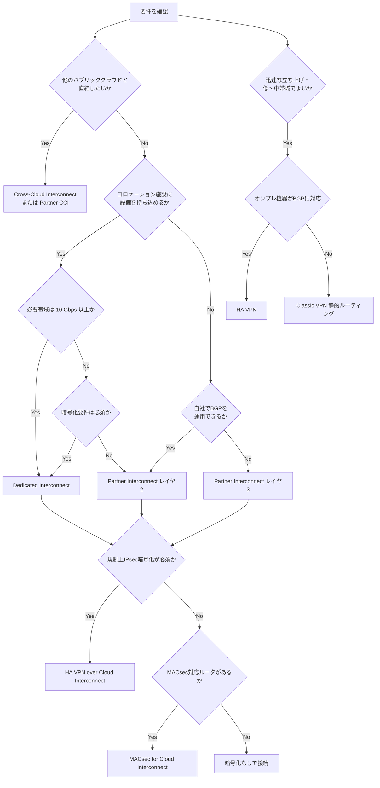

**ベストプラクティス**

- 帯域要件が明確でない初期フェーズでは **HA VPN で暫定接続し、トラフィックが増えたら Cloud Interconnect へ移行**する段階的アプローチが有効です。
- 複数拠点がある場合、拠点ごとに個別最適するのではなく、**Network Connectivity Center のハブ&スポーク構成**を前提にトポロジ全体を設計してから個々の接続方式を決定してください(詳細は 4.4 節)。
- マルチクラウド接続では、まず **Cross-Cloud Interconnect の対応ロケーション**(GCPリージョンと相手クラウドのペアリング地点)を確認してから帯域・冗長構成を検討します。

### 4.1.2 Dedicated Interconnect

Dedicated Interconnect は、Google のコロケーション施設内でオンプレミスのルータと Google のエッジルータを **物理的な専用線(レイヤ2)** で直結する方式です。10 Gbps または 100 Gbps 単位の物理ポートを確保し、その上に **VLAN Attachment(802.1Q VLAN)** を作成することで論理的に分割し、複数の VPC ネットワークやプロジェクトに接続できます。

**主な実装ステップ**

1. Google Cloud コンソールで Interconnect 接続をリクエストし、LOA-CFA(Letter of Authorization – Connecting Facility Assignment)を受け取る。
2. コロケーション施設内でクロスコネクトを物理的に敷設する(パートナー施設運営者に依頼)。
3. VLAN Attachment を作成し、Cloud Router と紐付けて BGP セッションを確立する。
4. オンプレミス側ルータで対向の BGP 設定を行う。

**ベストプラクティス**

- VLAN Attachment 単位で **MTU を統一**する(Cloud Interconnect は 1440〜1500 バイトに加え、Cross-Site Interconnect では 9,000 バイトの Jumbo Frame にも対応)。
- 単一障害点を避けるため、**同一メトロ内でも異なるエッジ可用性ドメイン(edge availability domain)に接続を分散**する。
- 帯域増強が見込まれる場合は、後から VLAN Attachment の帯域(capacity)を変更できるため、**契約時点で物理ポートの上限に余裕を持たせる**。

<blockquote>

**出典**: [Dedicated Interconnect overview](https://docs.cloud.google.com/network-connectivity/docs/interconnect/concepts/dedicated-overview)

</blockquote>

### 4.1.3 Partner Interconnect(レイヤ2 / レイヤ3の違い)

Partner Interconnect は、Google と既に物理接続を持つサービスプロバイダを経由して接続する方式です。コロケーション施設に自社設備を持ち込めない拠点や、10 Gbps 未満(50 Mbps〜50 Gbps)の帯域で十分な場合に選択します。

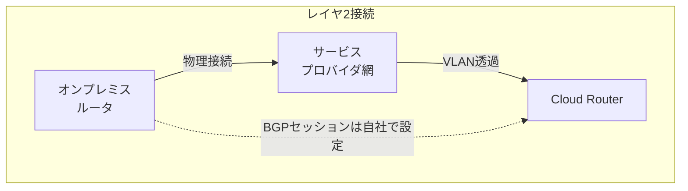

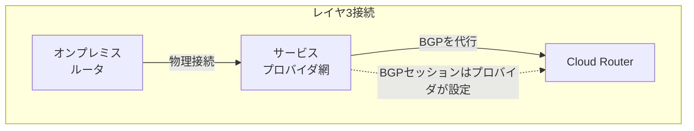

| 観点 | レイヤ2 | レイヤ3 |
|---|---|---|
| BGPセッションの設定者 | 利用者自身(オンプレルータ ⇔ Cloud Router) | サービスプロバイダが代行 |
| ルーティング制御の自由度 | 高い(MEDやAS-Path調整が可能) | 低い(プロバイダのポリシーに依存) |
| 事前有効化(pre-activation) | メリットなし | 有効(プロバイダがBGP設定を自動化するため接続後すぐ有効化できる) |
| 適した利用者 | 自社にBGP運用スキルがある組織 | BGP対応ルータ・運用リソースがない組織 |

**ベストプラクティス**

- レイヤ2はルーティング制御の自由度が高いため、**MEDによるトラフィックエンジニアリングが必要な本番環境ではレイヤ2を優先**します。
- レイヤ3は「相手プロバイダがすでにネットワークを持っている」構成のため、**マルチプロバイダでのフェイルオーバー(プライマリ/バックアップを異なるプロバイダに分散)が組みやすい**というメリットもあります。

<blockquote>

**出典**: [Partner Interconnect overview](https://docs.cloud.google.com/network-connectivity/docs/interconnect/concepts/partner-overview) / [Key terms](https://docs.cloud.google.com/network-connectivity/docs/interconnect/concepts/terminology)

</blockquote>

### 4.1.4 Cross-Cloud Interconnect

Cross-Cloud Interconnect は、他のクラウドプロバイダ(AWS・Azure・OCI・Alibaba Cloud)のネットワークと Google Cloud を **物理専用線で直結**するサービスです。中間にサービスプロバイダを挟まずに Google が物理接続をプロビジョニングします。2026年には、双方のクラウド上でオンデマンドかつ冗長性を内包した形で提供する **Partner Cross-Cloud Interconnect(AWS向けなど)** も登場し、利用者自身が冗長構成を設計・維持する負担を軽減できるようになりました。

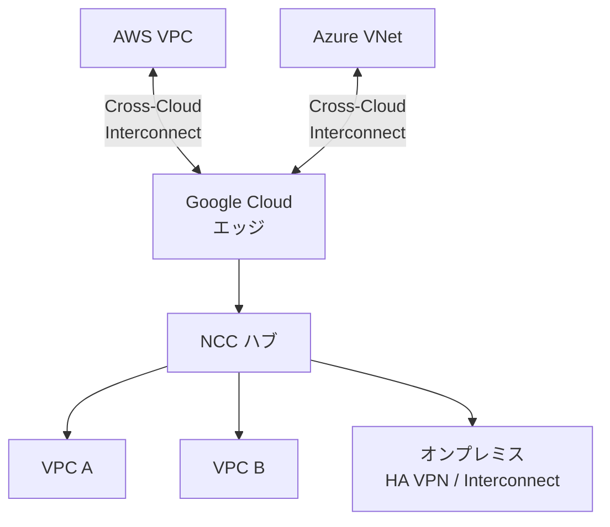

**利用パターン**

- **クラウド間ネットワーク接続**:Azure と AWS の両方を Cross-Cloud Interconnect で GCP に接続し、NCC のスポークとして構成することで、Google のネットワークを経由して Azure⇔AWS 間のデータ転送(サイト間データ転送)が可能になります。
- **オンプレミスから他クラウドへの接続**:オンプレミス拠点を Dedicated Interconnect や HA VPN で GCP に接続し、NCC ハブ経由で AWS/Azure 側のリソースにもアクセスできます。

**ベストプラクティス**

- Cross-Cloud Interconnect は **Cloud Interconnect の SLA がそのまま適用**されますが、SLA が保証するのは Google 側のエッジまでで、相手クラウド側のネットワークは対象外です。相手クラウド側のSLA(AWS Direct Connect SLAやAzure ExpressRoute SLA)も別途確認してください。
- 冗長性を自前で設計したくない場合は、Partner Cross-Cloud Interconnect(対応クラウド限定)の利用を検討します。

<blockquote>

**出典**: [Cross-Cloud Interconnect overview](https://docs.cloud.google.com/network-connectivity/docs/interconnect/concepts/cci-overview) / [Patterns for connecting other CSPs with Google Cloud](https://docs.cloud.google.com/architecture/patterns-for-connecting-other-csps-with-gcp) / [Partner Cross-Cloud Interconnect for AWS overview](https://docs.cloud.google.com/network-connectivity/docs/interconnect/concepts/partner-cci-for-aws-overview)

</blockquote>

### 4.1.5 SLA トポロジ(99.9% / 99.99%)

Cloud Interconnect の SLA は「契約すれば自動的に付与される」ものではなく、**規定のトポロジ要件を満たした構成にのみ適用**されます。

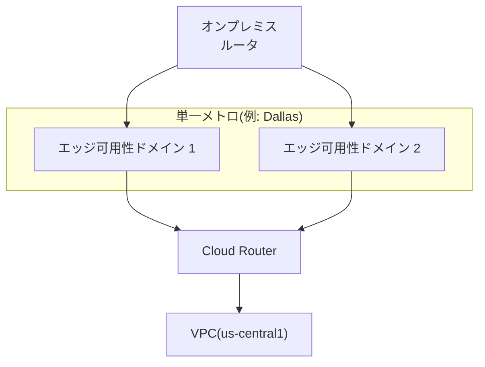
*99.9% 構成:単一リージョン・単一メトロ内で、異なるエッジ可用性ドメインに2本の接続。*

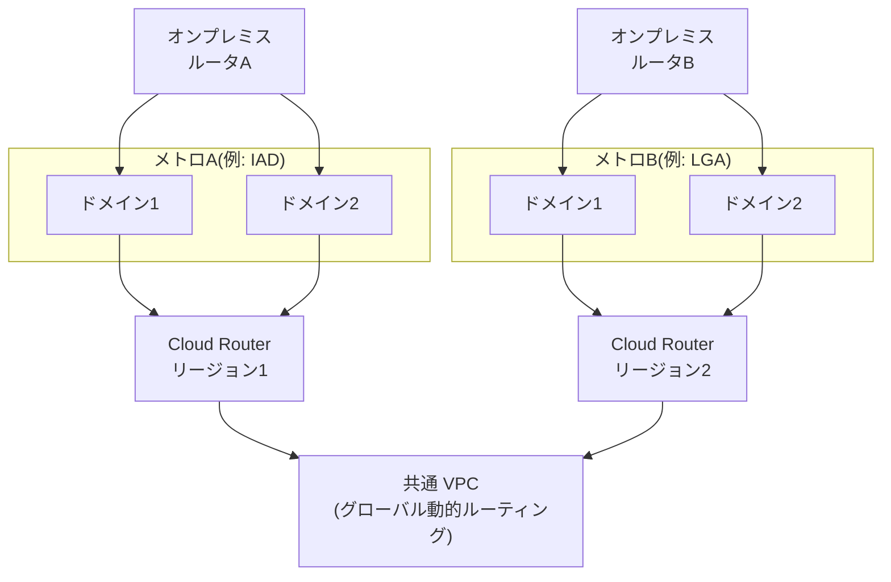
*99.99% 構成:2つの異なるメトロ、各メトロ内2ドメイン、合計4接続。グローバル動的ルーティングが必須。*

| 可用性レベル | 必要な接続数 | メトロ数 | Cloud Router数 | 適用ワークロード |
|---|---|---|---|---|
| 99.9%(非クリティカル) | 2 | 1 | 1台で要件を満たすが、冗長化のため2台構成も許容 | バッチアップロード等、遅延許容度が高い処理 |
| 99.99%(クリティカル本番) | 4 | 2(異なるメトロ) | 2台以上(Cloud Router追加は可用性向上に寄与しない点に注意) | 本番稼働のミッションクリティカルなワークロード |

**ベストプラクティス**

- 2026年時点では単一リージョンでも 99.99% を満たせる **Single-region Critical production SLA トポロジ**が一部メトロで利用可能になっています。マルチリージョン構成が難しい場合は対応可否を確認してください。
- SLA要件を満たしているかどうかを手動で追跡するのではなく、**Interconnect connection group(接続グループ)機能**を使って意図する可用性レベルを宣言し、Google Cloud 側にチェックさせるのがベストプラクティスです。
- オンプレミス側ルータは、**同一プレフィックスを全リンクで広告**しつつ、MED値でトラフィックの優先経路を制御します。

<blockquote>

**出典**: [Topology for non-critical applications overview](https://docs.cloud.google.com/network-connectivity/docs/interconnect/tutorials/non-critical-overview) / [Topology for production-level applications overview](https://docs.cloud.google.com/network-connectivity/docs/interconnect/tutorials/production-level-overview) / [Establish 99.99% availability for Dedicated Interconnect](https://docs.cloud.google.com/network-connectivity/docs/interconnect/tutorials/dedicated-creating-9999-availability) / [Establish 99.99% availability for Partner Interconnect](https://cloud.google.com/network-connectivity/docs/interconnect/tutorials/partner-creating-9999-availability) / [Cloud Interconnect SLA](https://cloud.google.com/network-connectivity/docs/interconnect/sla)

</blockquote>

### 4.1.6 暗号化オプション:MACsec と HA VPN over Cloud Interconnect

Cloud Interconnect は **デフォルトでは暗号化されません**。規制要件などで暗号化が必要な場合、2つの選択肢があります。

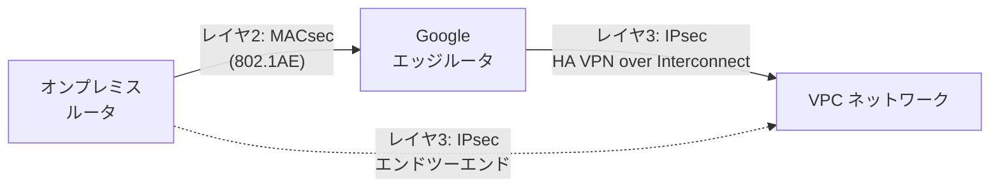

| 観点 | MACsec for Cloud Interconnect | HA VPN over Cloud Interconnect |
|---|---|---|
| 暗号化レイヤ | L2(オンプレルータ⇔Googleエッジルータ間) | L3(IPsec、VLAN Attachment全体) |
| Google網内部の扱い | 暗号化されない(Google内部は別途保護) | Attachmentの区間はIPsecで暗号化 |
| 対応帯域 | 10G/100G/400G回線(10Gは要問い合わせ) | VPNトンネル1本あたり最大3Gbps、複数トンネルで積み上げ |
| 追加コスト | なし | Cloud VPNの課金が別途発生 |
| 必要な設定 | 対応ルータでのCAK/CKN鍵設定 | 暗号化VLAN Attachment作成時にIPsecを選択(後から追加不可)、専用Cloud Router(encrypted_interconnect_router)が必要 |
| Partner Interconnectでの扱い | プロバイダ区間はプロバイダ側で対応が必要 | Dedicated/Partnerいずれも対応 |

**ベストプラクティス**

- より強固なセキュリティが必要な場合は、**MACsec(L2)と HA VPN over Cloud Interconnect(L3 IPsec)を併用**する多層防御が推奨されています。MACsecはあくまでGoogleのピアリングエッジまでの区間保護であり、単体でエンドツーエンドの暗号化にはなりません。
- 暗号化 VLAN Attachment は **作成時にIPsecを選択する必要があり、既存の非暗号化Attachmentへの後付けはできません**。設計段階で暗号化要否を確定させておく必要があります。
- 同一の Interconnect 接続上に **暗号化Attachmentと非暗号化Attachmentを混在**させることが可能なので、VPNトンネル数は暗号化Attachmentの容量分だけで計算します。
- HA VPN over Cloud Interconnect では **BFDを有効にしても検出速度は向上しません**(下層のInterconnect自体の障害検出とは独立しているため)。高速フェイルオーバーが必要な場合は Interconnect 側のBFD設計(4.3節)を優先します。

<blockquote>

**出典**: [MACsec for Cloud Interconnect overview](https://docs.cloud.google.com/network-connectivity/docs/interconnect/concepts/macsec-overview) / [HA VPN over Cloud Interconnect overview](https://docs.cloud.google.com/network-connectivity/docs/interconnect/concepts/ha-vpn-interconnect) / [Deploy HA VPN over Cloud Interconnect](https://docs.cloud.google.com/network-connectivity/docs/interconnect/how-to/ha-vpn-interconnect-deploy-process) / [Configure HA VPN over Cloud Interconnect](https://docs.cloud.google.com/network-connectivity/docs/interconnect/how-to/configure-ha-vpn-interconnect)

</blockquote>

---

## 4.2 サイト間 IPSec VPN の構成

### 4.2.1 HA VPN の基本構成

HA VPN(High Availability VPN)は、Google Cloud が推奨する標準の VPN ソリューションです。1つの HA VPN ゲートウェイは **固定で2つのインターフェース**を持ち、それぞれに自動採番された外部 IPv4 アドレスが割り当てられます(内部IPを使う HA VPN over Cloud Interconnect の場合は例外)。

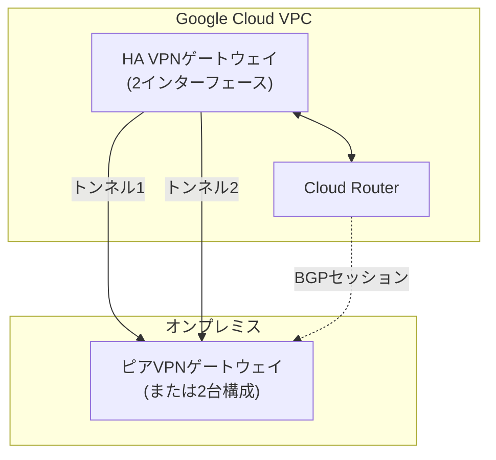

**HA VPN の2つの利用パターン**

1. **オンプレミスVPNゲートウェイへの接続**:オンプレ側がBGP対応ルータであれば、99.99% SLAを満たすHA構成が可能です。
2. **他のGoogle Cloud VPCへの接続**:VPC Network Peeringが使えない状況(IPレンジの重複を許容したい、暗号化が必要、Peeringの推移不可制約を回避したい等)で、2つのVPC間をHA VPNトンネルで接続します。

**ベストプラクティス**

- 高可用性を得るには **トンネルをペアで作成**し、オンプレ側ゲートウェイも冗長構成(2台)にするのが基本です。
- オンプレ側が単一デバイスの場合でも、HA VPNゲートウェイの2インターフェースの両方をそのデバイスに向けることで一定の可用性向上が得られますが、真の99.99% SLAには対向側の冗長化が前提です。
- **等コストマルチパス(ECMP)を活用する場合**、ピアゲートウェイが両トンネルに同一MED値で経路広告することを確認します。片方だけをアクティブにしたい場合はMED値を意図的に変えます。

<blockquote>

**出典**: [Cloud VPN overview](https://docs.cloud.google.com/network-connectivity/docs/vpn/concepts/overview)

</blockquote>

### 4.2.2 Classic VPN(ルートベース/ポリシーベース)と非推奨化の動向

Classic VPN は単一インターフェース・単一外部IPのレガシーゲートウェイで、**ルートベース**(宛先IPで転送)と**ポリシーベース**(送信元/宛先IPの組み合わせで暗号化対象を限定するトラフィックセレクタ方式)の静的ルーティングに対応します。

> **重要な仕様変更**:2025年8月1日をもって、Classic VPN における **動的ルーティング(BGP)の新規作成はサポート終了**しました。既存のBGP対応Classic VPNトンネルは動作を継続しますが、SLAの対象外となります。新規にBGPを使いたい場合は必ずHA VPNを使う必要があります。

| 観点 | HA VPN | Classic VPN |
|---|---|---|
| インターフェース数 | 2(固定) | 1 |
| SLA | 99.99%(適切なトポロジ時) | 99.9%(静的ルーティングのみ) |
| ルーティング | 動的(BGP)のみ | 静的(ルートベース/ポリシーベース)、BGPは新規作成不可(2025年8月1日以降) |
| IPv6 | 対応 | 非対応 |
| 推奨状況 | 現行の標準 | オンプレ機器がBGP非対応の場合のみ許容されるレガシー用途 |

**ベストプラクティス**

- 新規構築では **原則としてHA VPNを選択**します。Classic VPNは「オンプレ側の機器がBGPに対応していない」場合の代替手段としてのみ検討してください。
- 既存のClassic VPN(BGP使用)を運用している場合、**計画的にHA VPNへ移行**します。移行時はトンネル削除→HA VPNゲートウェイ作成→Cloud Router再設定→カスタム静的ルートの削除、という順序を踏みます。

<blockquote>

**出典**: [Classic VPN dynamic routing deprecation](https://docs.cloud.google.com/network-connectivity/docs/vpn/deprecations/classic-vpn-deprecation) / [Move from Classic VPN to HA VPN](https://cloud.google.com/network-connectivity/docs/vpn/how-to/moving-to-ha-vpn) / [Cloud VPN overview](https://docs.cloud.google.com/network-connectivity/docs/vpn/concepts/overview)

</blockquote>

---

## 4.3 Cloud Router の構成

Cloud Router は Google Cloud における BGP の実装であり、Dedicated/Partner/Cross-Cloud Interconnect、HA VPN、Router Appliance のすべてで **動的ルーティングの基盤**として必須または推奨されるリソースです。

### 4.3.1 BGP 属性の実装

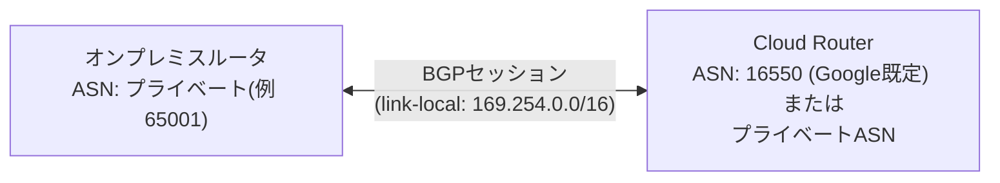

| BGP属性 | 説明 | 実装上のポイント |
|---|---|---|
| ASN(自律システム番号) | Cloud RouterのASNはプライベートASN(64512–65534、または4バイトASNの4200000000–4294967294)を指定可能 | 同一Cloud Router上の全BGPセッションで共通のGoogle側ASNを使用。作成後の変更は不可 |
| ルート優先度 / MED | Multi-Exit Discriminator。値が小さいほど優先される | 明示的に設定しない場合、内部的に既定値100が適用される |
| リンクローカルアドレス | Dedicated/Partner InterconnectのBGPセッションは 169.254.0.0/16 の /29 が既定 | RFC 5549相当の考え方でIPv4リンクローカルを使用 |
| 認証 | BGPセッションのMD5認証に対応 | オンプレ側ルータと共有鍵を設定して盗聴・なりすましを防止 |

**ベストプラクティス**

- 複数のInterconnect/VPN経路がある場合、**MED値を意図的にずらす**ことでプライマリ/バックアップの優先順位を明示します(同値であればECMPで負荷分散されます)。
- ASNは一度設定すると変更できないため、**組織全体でASN採番計画を事前に策定**してから展開します。

<blockquote>

**出典**: [Cloud Router overview](https://docs.cloud.google.com/network-connectivity/docs/router/concepts/overview) / [Configure BGP for Google Cloud Connections](https://docs.packetfabric.com/cr/bgp/bgp_google/) / [Specify and manage custom learned routes](https://cloud.google.com/network-connectivity/docs/router/how-to/configure-custom-learned-routes)

</blockquote>

### 4.3.2 BFD(Bidirectional Forwarding Detection)

BFD は障害検出を高速化するプロトコルです。**既定のBGPのみによる障害検出は約60秒**かかるのに対し、**BFDを有効にすると既定設定で約5秒**まで短縮できます。

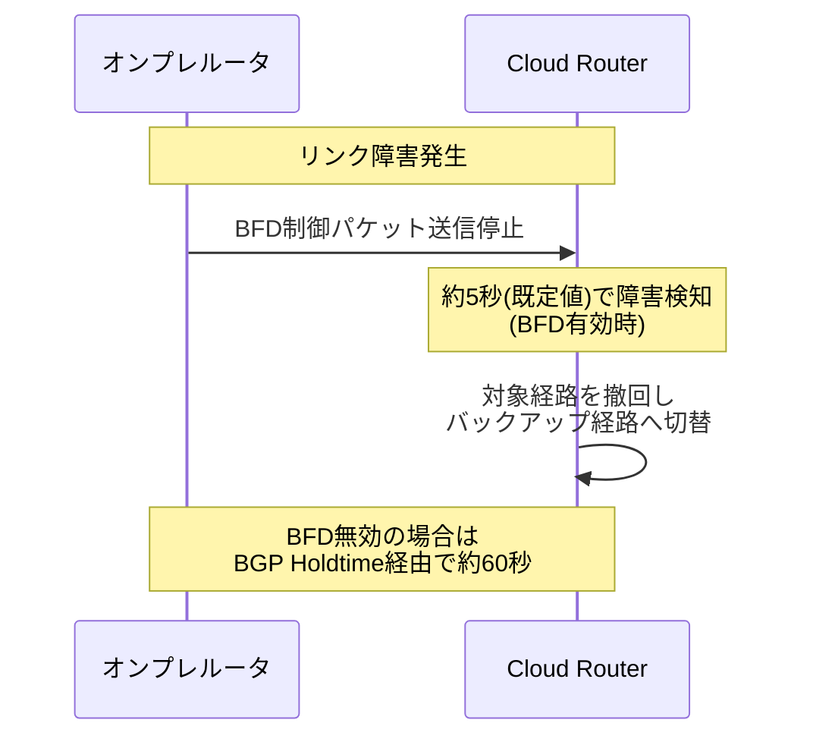

**BFD の対応範囲(重要な試験ポイント)**

| 接続方式 | BFD対応 |
|---|---|
| Dedicated Interconnect の VLAN Attachment | ✅ 対応(Dataplane v2のAttachmentのみ) |
| Partner Interconnect の VLAN Attachment | ✅ 対応(Dataplane v2のAttachmentのみ) |
| HA VPN トンネル | ❌ 非対応 |
| Router Appliance(NCC) のBGPセッション | ❌ 非対応 |

**ベストプラクティス**

- BFDは **Active/Passive/Disabled** の3モードがあり、少なくとも片側(Cloud Routerまたはオンプレ側)を Active に設定する必要があります。既定はDisabledです。
- BFDを有効化する前に、対象のVLAN AttachmentがDataplane version 2であることを確認してください(古いAttachmentでは有効化できません)。
- BGPのGraceful Restartと組み合わせる場合、**オンプレ側ルータのベンダー設定により挙動が変わる**ため、BFDインターフェース障害時に即座にフェイルオーバーする設定になっているかをベンダードキュメントで確認します。

<blockquote>

**出典**: [Bidirectional Forwarding Detection (BFD) overview](https://docs.cloud.google.com/network-connectivity/docs/router/concepts/bfd) / [BFD diagnostic messages and session states](https://docs.cloud.google.com/network-connectivity/docs/router/concepts/bfd-states) / [Configure BFD for Cloud Router](https://docs.cloud.google.com/network-connectivity/docs/router/how-to/configuring-bfd)

</blockquote>

### 4.3.3 カスタム広告ルート / カスタム学習ルート

Cloud Router は既定でVPCのサブネット範囲を自動広告しますが、要件に応じてカスタマイズできます。

- **カスタム広告ルート(custom advertised routes)**:デフォルトの自動広告を無効化し、特定のプレフィックスのみをオンプレミス側に広告する、または広告対象を追加する設定です。要約(サマライズ)広告や、意図的な経路の非公開に使います。
- **カスタム学習ルート(custom learned routes)**:オンプレミス側から受信するプレフィックスに対してGoogle Cloud側で独自にMED値を上書きする設定です。同一プレフィックスが複数の学習ルートで定義されている場合、**MED値が小さい方が優先**されます(既定値100)。

**ベストプラクティス**

- マルチリージョン・マルチメトロ構成では、**リージョンごとにMEDを変えたカスタム学習ルート**を設定することで、地理的に近い経路を優先させるトラフィックエンジニアリングが可能です。
- カスタム広告ルートで想定外の広範なCIDR(例:0.0.0.0/0相当)を誤って広告しないよう、**変更後は必ずConnectivity Testsで実際の経路を検証**します(詳細はSection 5)。

### 4.3.4 グローバル / リージョナル動的ルーティングモードとBGPベストパス選択

VPCの動的ルーティングモードは **REGIONAL**(既定)または **GLOBAL** から選択します。GLOBALモードでは、Cloud Routerが学習した経路がすべてのリージョンで利用可能になり、99.99% SLAのマルチリージョン構成で必須です。

さらに、Cloud RouterのBGPベストパス選択には **legacy** と **standard** の2モードがあります。

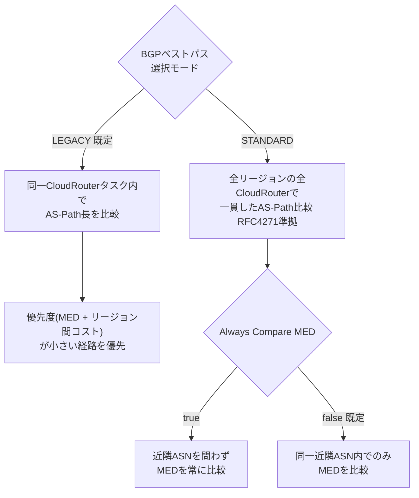

| 観点 | Legacy(既定) | Standard |
|---|---|---|
| AS-Path比較の一貫性 | Cloud Routerタスク単位でローカルに比較 | 全リージョンで一貫比較(RFC 4271準拠) |
| MED比較のカスタマイズ | 不可 | `--bgp-bps-always-compare-med` で制御可能 |
| リージョン間コストの扱い | 常にMEDに加算 | `--bgp-bps-inter-region-cost` で DEFAULT/ADD-COST-TO-MED を選択可能 |
| BGP Route Policiesとの組み合わせ | 制限あり | AS-Pathプリペンドによる経路制御と好相性 |
| 推奨 | 特別な要件がなければ既定のまま | AS-Pathベースの精密なトラフィックエンジニアリングが必要な場合に切り替え |

**ベストプラクティス**

- Google公式ドキュメントは「特別な理由がない限りLegacyモードを推奨」としています。Standardモードへの切り替えは、**マルチリージョン構成でAS-Pathプリペンドによる経路誘導が必要**な場合など、明確な要件がある場合に限定します。
- Standardモードでは、**BGP Route Policies(GA)と組み合わせてMED書き換えやフィルタリング**を行うことで、より高度なトラフィックエンジニアリングが可能になります。

<blockquote>

**出典**: [Set routing and best path selection modes](https://docs.cloud.google.com/network-connectivity/docs/router/how-to/create-network-set-modes) / [Learned routes](https://docs.cloud.google.com/network-connectivity/docs/router/concepts/learned-routes) / [Google Cloud Router: Introduction to BGP Policies](https://medium.com/google-cloud/google-cloud-router-introduction-to-bgp-policies-9983ac7ab484)

</blockquote>

---

## 4.4 Network Connectivity Center の構成

Network Connectivity Center(NCC)は、VPCネットワーク・オンプレミス拠点・他クラウドを「スポーク」として単一の「ハブ」に接続し、一元的にネットワークトポロジを管理するサービスです。

### 4.4.1 スポークの種類

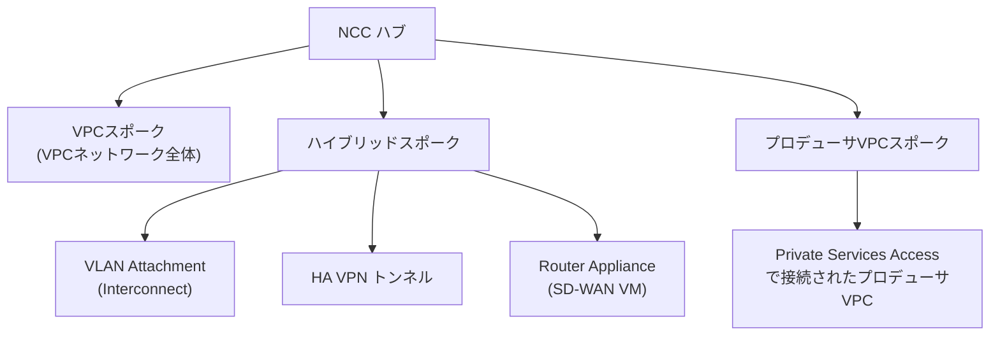

| スポークタイプ | 内容 | 主なユースケース |
|---|---|---|
| VPC スポーク | Google Cloud の VPC ネットワークそのもの | 複数VPC間のメッシュ/スター接続、ハブ経由でのオンプレミスアクセス |
| ハイブリッドスポーク | VLAN Attachment、HA VPNトンネル、Router Applianceのいずれか | オンプレミス拠点や他クラウドとの接続点 |
| プロデューサ VPC スポーク | Private Services Access(サービスプロデューサ)で接続されたVPC | Cloud SQLなどのマネージドサービスVPCをハブに参加させ、他スポークからアクセス可能にする |

**制約と注意点**

- VPC スポーク同士は **NCC単体では非トランジティブ**(直接の経路交換のみ)であり、静的ルートの交換もサポートされません。動的ルート(IPv4)はハイブリッドスポーク経由でのみVPCスポーク間を伝播します。
- 1つのハブに **ルーティングVPCネットワーク(ハイブリッドスポークを持つVPC)は基本的に1つ**が推奨されます。複数のルーティングVPCを構成する場合は、それらをVPCスポークとして参加させない設計を検討します。

<blockquote>

**出典**: [NCC overview](https://docs.cloud.google.com/network-connectivity/docs/network-connectivity-center/concepts/overview) / [VPC spokes overview](https://docs.cloud.google.com/network-connectivity/docs/network-connectivity-center/concepts/vpc-spokes-overview) / [Producer VPC spokes](https://docs.cloud.google.com/network-connectivity/docs/network-connectivity-center/concepts/producer-vpc-spokes-overview)

</blockquote>

### 4.4.2 トポロジパターン:スター / ハブ&スポーク / メッシュ

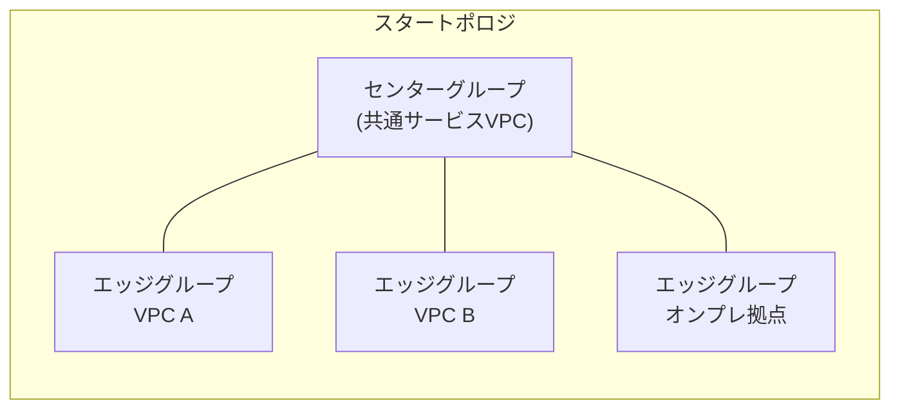

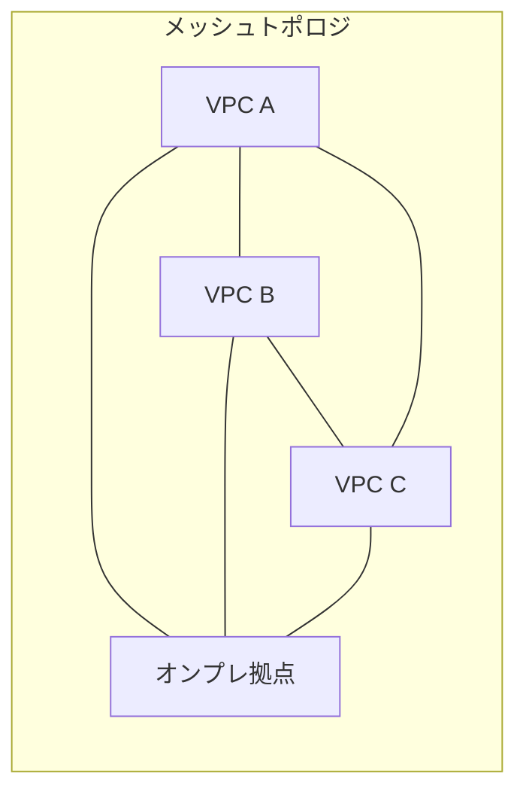

| トポロジ | 経路交換の範囲 | 適した用途 |
|---|---|---|
| スター(center/edge グループ) | センター⇔各エッジ間のみ経路交換。エッジ同士は非交換 | 共通サービスVPCを中心にした「ハブ&スポーク」的な構成、エッジ同士の直接通信を意図的に遮断したい場合 |
| メッシュ | 参加する全スポーク間で経路交換 | フラットに全VPC・全拠点が相互通信する必要がある場合 |

**ベストプラクティス**

- 大規模組織では、**セキュリティ境界を明確にするためスタートポロジ**(センターグループに検査VPCを置き、エッジ同士の通信をセンター経由で強制)を選ぶケースが多くあります。
- メッシュトポロジは柔軟な反面、**意図しない到達性(誤ったスポーク間通信)を防ぐためのファイアウォールポリシー設計**が別途必須です。

### 4.4.3 Private NAT と PSC 伝播(propagation)の構成

NCC ハブでは、**Private Service Connect(PSC)エンドポイントの伝播(propagation)** を有効にすることで、あるVPCスポークに作成したPSCエンドポイントを、同一ハブに接続された他のVPCスポークからも到達可能にできます。

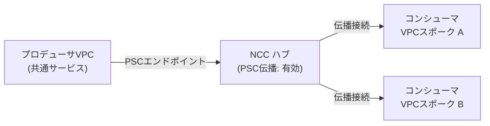

**ベストプラクティス・注意点**

- PSC伝播は **ハブ作成時、または `--export-psc` フラグで既存ハブに対して有効化**します。無効化すると既存の伝播接続は非同期に削除されます。
- スタートポロジの場合、**センターグループのPSCエンドポイントは全エッジグループへ伝播**されますが、エッジグループ同士のPSCエンドポイントは(センター経由であっても)相互伝播されない点に注意してください。
- PSCを提供するプロデューサVPCネットワーク自身が同時にコンシューマ側のVPCスポークである場合、**自分自身のエンドポイントは自分には伝播されません**(トポロジ上禁止されています)。
- サブネットごとのPSCエンドポイント数にはクォータがあるため、**各リージョンでPSCエンドポイント専用のサブネットを用意**しておくと運用がしやすくなります。
- Private NAT(プライベートNAT)は、VPCスポーク間やハイブリッドスポーク越しの通信でIPアドレス重複を回避するための変換機構として、NCCのハイブリッドスポーク構成と組み合わせて利用されます。IP/CIDRフィルタと合わせて、どの範囲を変換・伝播するかを明示的に設計します。

<blockquote>

**出典**: [Private Service Connect connection propagation through NCC](https://docs.cloud.google.com/network-connectivity/docs/network-connectivity-center/concepts/psc-propagated-connection-overview) / [About propagated connections](https://docs.cloud.google.com/vpc/docs/about-propagated-connections) / [Troubleshoot Network Connectivity Center](https://docs.cloud.google.com/network-connectivity/docs/network-connectivity-center/support/troubleshooting)

</blockquote>

### 4.4.4 IP/CIDR 範囲フィルタ(インポート/エクスポートフィルタ)

ハイブリッドスポーク(特にRouter Applianceスポーク)では、ハブとの間でどのルートを交換するかを **インポート/エクスポートフィルタ** で細かく制御できます。

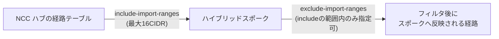

| パラメータ | 役割 |
|---|---|
| `include-import-ranges` | ハブからスポークへインポートしてよい範囲を許可リストで指定(既定はキーワード `ALL_IPV4_RANGES` 相当、または site-to-site データ転送有効時のみハブの他ハイブリッドスポークの経路) |
| `exclude-import-ranges` | includeで許可した範囲の中から、明示的にインポートしない範囲を指定(includeの範囲に完全に包含されている必要あり) |
| エクスポート側 | 同様の考え方で、スポークからハブへエクスポートする経路を制御 |

**ベストプラクティス**

- Router Applianceスポークで **site-to-site データ転送を有効にしない限り、既定のインポート範囲は空**です。オンプレ拠点同士でトラフィックを転送させたい場合は明示的に有効化が必要です。
- フィルタのCIDRは **重複不可・最大16件**という制約があるため、大規模な拠点構成では要約(サマライズ)したCIDR設計をあらかじめ用意しておきます。

<blockquote>

**出典**: [Work with hubs and spokes](https://docs.cloud.google.com/network-connectivity/docs/network-connectivity-center/how-to/working-with-hubs-spokes)

</blockquote>

### 4.4.5 Router Appliance(サードパーティ SD-WAN/ルータ VM)

Router Appliance スポークは、Cisco・Palo Alto・Aviatrix・Fortinet などの **サードパーティSD-WANまたはルータ仮想アプライアンス**をNCCハブに参加させるための仕組みです。

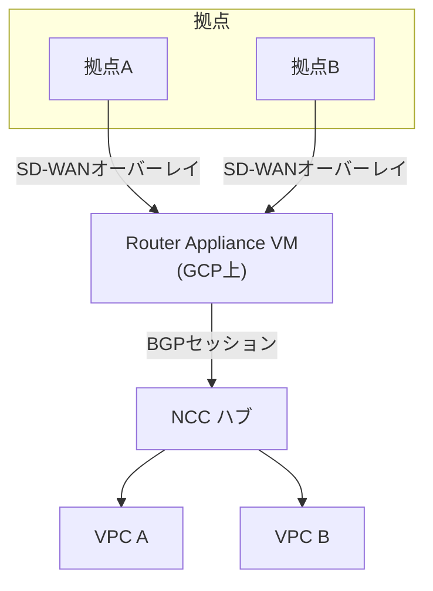

**実装のポイント**

- Router Appliance VM は通常 **マルチNIC構成**で、1つのNICをNCCハブとのBGPピアリング(内部ネットワークインターフェース)に、別のNICを拠点向けオーバーレイ(SD-WANトンネル終端)に使用します。
- Router Appliance スポークとしてハブに登録する際は、**VMのネットワークインターフェース(NIC)をスポークとして指定**し、BGPセッションをCloud Routerとの間に確立します。
- BFDは前述の通りRouter AppliancesのBGPセッションでは非対応のため、**高速フェイルオーバーはBGPタイマー(hold time)のチューニングやアプリケーション側の再試行設計**でカバーします。

**ベストプラクティス**

- サードパーティSD-WANベンダーのGoogle Cloud対応状況(NCC統合ガイド)を事前に確認し、**ベンダー推奨のCloud Router BGP設定値**(ASN、タイマー、経路広告範囲)に従います。
- Router Applianceの可用性を高めるため、**同一拠点に対して複数のRouter Appliance VMを異なるゾーンに配置**し、BGPマルチホーミングでフェイルオーバーを構成します。

<blockquote>

**出典**: [Network Connectivity Center | Google Cloud](https://cloud.google.com/network-connectivity-center) / [Building Hub-Spoke Network Topology with NCC](https://medium.com/google-cloud/building-hybrid-hub-spoke-network-topology-with-network-connectivity-center-ncc-on-gcp-cbd878e35574)

</blockquote>

### 4.4.6 サイト間データ転送とトランジティビティ(推移性)問題の解消

NCC が解決する代表的な課題が「複数拠点・複数VPCを **フルメッシュでVPC Peeringを組む煩雑さ**」です。

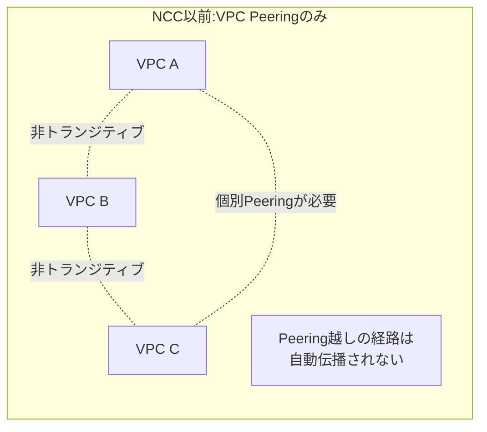

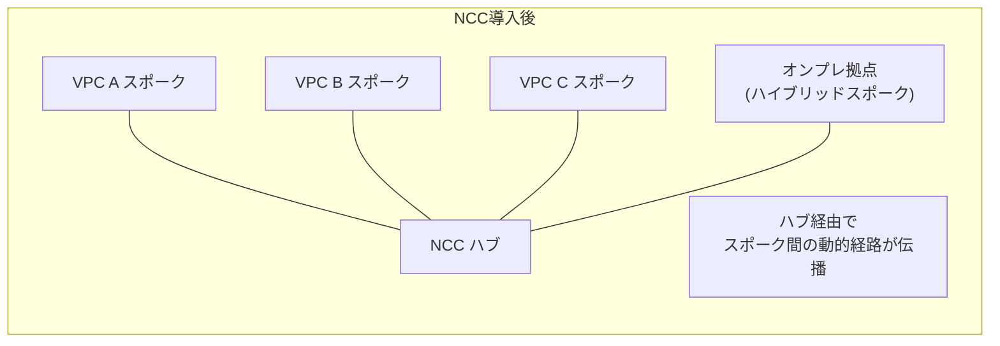

**よくある推移性(トランジティビティ)の落とし穴と対処**

| 症状 | 原因 | 対処 |
|---|---|---|
| VPCスポーク同士でオンプレミスの経路が見えない | ハイブリッドスポークのエクスポート/インポート設定が不足、またはVPCスポーク同士は静的ルートを交換しない仕様 | ハイブリッドスポークの動的学習ルートがVPCスポークへ伝播しているか確認、静的ルートはPeeringなど別経路で補完 |
| VPC Peering越しのオンプレアクセスができない | NCCとVPC Network Peeringを併用しているVPCで、Peering相手側にはハブの経路がそのままでは伝播しない | Cloud Routerのカスタム経路広告とPeeringのルート交換オプション(サブネットルート交換設定)を明示的に構成 |
| PSCエンドポイントがオンプレミスから見えない | PSC伝播は「ハブの単一ルーティングVPC」がVPCスポークとしても参加している場合のみオンプレミスへ伝播される仕様 | ルーティングVPCをVPCスポークとしても登録するか要件を再確認 |
| 拠点間(サイト間)通信ができない | Router Applianceスポークでsite-to-siteデータ転送が既定で無効(インポート範囲が空) | 該当スポークでsite-to-siteデータ転送を明示的に有効化し、フィルタ範囲を設定 |

**ベストプラクティス**

- 設計段階で「**VPCスポーク間は静的ルートを交換しない**」という制約を前提にし、静的ルートが必要な区間はVPC Network Peeringなど別の手段を組み合わせます。
- NCCのモニタリングでは、**BGPセッションのフラップ(flapping)がハイブリッドスポークの不安定さを示す代表的な指標**です。Cloud Monitoringでフラップ回数のアラートを設定しておきます。
- 複雑なトポロジでは、変更後に必ず **Network Intelligence Center の Connectivity Tests**(Section 5で詳解)で実際の到達性を検証します。

<blockquote>

**出典**: [VPC spokes overview](https://docs.cloud.google.com/network-connectivity/docs/network-connectivity-center/concepts/vpc-spokes-overview) / [How to Configure Network Connectivity Center for Hub-and-Spoke Topology](https://oneuptime.com/blog/post/2026-02-17-how-to-configure-network-connectivity-center-for-hub-and-spoke-topology-on-gcp/view) / [Resiliency with Network Connectivity Center](https://cloud.google.com/blog/products/networking/resiliency-with-network-connectivity-center)

</blockquote>

---

## 設計・実装チェックリスト

- [ ] 接続方式(Dedicated/Partner-L2/Partner-L3/Cross-Cloud/HA VPN/Classic VPN)を要件(帯域・拠点設備・BGP運用能力・マルチクラウド有無)に基づいて選定した
- [ ] 必要な可用性SLA(99.9% or 99.99%)を確定し、対応するトポロジ(接続数・メトロ数・リージョン数)を設計した
- [ ] SLA対象トポロジをInterconnect connection groupで宣言し、要件充足をGoogle Cloud側にチェックさせている
- [ ] 単一メトロ内では異なるエッジ可用性ドメインに、マルチリージョンでは異なるメトロに接続を分散した
- [ ] 99.99%構成ではVPCの動的ルーティングモードをGLOBALに設定した
- [ ] 暗号化要件を整理し、MACsec(L2)・HA VPN over Interconnect(L3)・併用のいずれかを選定した
- [ ] 暗号化VLAN Attachmentを作成前に確定した(後からの暗号化追加は不可のため)
- [ ] Cross-Cloud Interconnectを使う場合、相手クラウド側のSLA・対応ロケーションを個別に確認した
- [ ] Classic VPNで新規にBGPを構成していないこと(2025年8月1日以降廃止)を確認した
- [ ] 既存BGP Classic VPNが残っている場合、HA VPNへの移行計画を立てた
- [ ] Cloud RouterのASN採番計画を組織全体で統一した
- [ ] BGPセッションにMD5認証を設定した(必要な場合)
- [ ] Dedicated/Partner InterconnectのBGPセッションにBFDを設定し、対象VLAN AttachmentがDataplane v2であることを確認した
- [ ] HA VPNトンネルおよびRouter ApplianceのBGPセッションにはBFDが非対応であることを踏まえた障害検出設計をした
- [ ] MED値によるプライマリ/バックアップの優先順位付けを行った(複数経路がある場合)
- [ ] BGPベストパス選択モード(legacy/standard)の要否を判断し、必要な場合のみstandardへ切り替えた
- [ ] NCCハブのスポーク構成(VPC/ハイブリッド/プロデューサ)を全体トポロジ図として整理した
- [ ] NCCのトポロジ(スター/メッシュ)をセキュリティ要件に基づいて選定した
- [ ] PSC伝播の要否と、伝播対象となるルーティングVPCの位置づけを確認した
- [ ] ハイブリッドスポークのインポート/エクスポートフィルタ(include/exclude range)を設計した
- [ ] Router Applianceスポークでsite-to-siteデータ転送の要否を確認し、必要な場合は明示的に有効化した
- [ ] VPCスポーク間は静的ルートを交換しない制約を前提に、必要な区間はVPC Peering等で補完した
- [ ] BGPセッションフラップ検知のCloud Monitoringアラートを設定した
- [ ] 変更後にConnectivity Testsで実際の到達性を検証するプロセスを組み込んだ

## まとめ

本ガイド(S2)では、PCNE試験の Section 4「ハイブリッド/マルチクラウドネットワーク相互接続の構成と実装」を、以下の4つの実装領域に沿って解説しました。

1. **Cloud Interconnect(4.1)**:Dedicated/Partner(L2・L3)/Cross-Cloudの使い分け、99.9%/99.99% SLAトポロジの要件、MACsecとHA VPN over Interconnectによる暗号化オプション
2. **サイト間IPSec VPN(4.2)**:HA VPNの基本構成と2つの用途(オンプレ接続・VPC間接続)、Classic VPNのBGP廃止という現在進行中の重要な仕様変更
3. **Cloud Router(4.3)**:BGP属性(ASN・MED・link-local・認証)の実装、BFDによる高速障害検出とその対応範囲の限界、legacy/standardベストパス選択モードの違い
4. **Network Connectivity Center(4.4)**:VPC/ハイブリッド/プロデューサの3種類のスポーク、スター/メッシュのトポロジ設計、PSC伝播とIP/CIDRフィルタ、そして推移性(トランジティビティ)問題の典型的な落とし穴

S1(設計)で立てた方針を、実際にどのリソースでどう実現するかという「実装の解像度」まで踏み込んだ点が本ガイドの主眼です。次のガイドでは、これらの接続を前提とした運用・監視・トラブルシューティング(Section 5)、またはロードバランシング・DNSなどのマネージドネットワークサービス(Section 3)を扱う予定です。

---

## 参考文献

**Cloud Interconnect**
- [Cloud Interconnect overview](https://docs.cloud.google.com/network-connectivity/docs/interconnect/concepts/overview)
- [Dedicated Interconnect overview](https://docs.cloud.google.com/network-connectivity/docs/interconnect/concepts/dedicated-overview)
- [Partner Interconnect overview](https://docs.cloud.google.com/network-connectivity/docs/interconnect/concepts/partner-overview)
- [Key terms(Cloud Interconnect)](https://docs.cloud.google.com/network-connectivity/docs/interconnect/concepts/terminology)
- [Cloud Interconnect FAQ](https://docs.cloud.google.com/network-connectivity/docs/interconnect/support/faq)
- [Cloud Interconnect SLA](https://cloud.google.com/network-connectivity/docs/interconnect/sla)

**SLA トポロジ**
- [Topology for non-critical applications overview](https://docs.cloud.google.com/network-connectivity/docs/interconnect/tutorials/non-critical-overview)
- [Topology for production-level applications overview](https://docs.cloud.google.com/network-connectivity/docs/interconnect/tutorials/production-level-overview)
- [Establish 99.9% availability for Dedicated Interconnect](https://docs.cloud.google.com/network-connectivity/docs/interconnect/tutorials/dedicated-creating-999-availability)
- [Establish 99.99% availability for Dedicated Interconnect](https://docs.cloud.google.com/network-connectivity/docs/interconnect/tutorials/dedicated-creating-9999-availability)
- [Establish 99.9% availability for Partner Interconnect](https://docs.cloud.google.com/network-connectivity/docs/interconnect/tutorials/partner-creating-999-availability)
- [Establish 99.99% availability for Partner Interconnect](https://cloud.google.com/network-connectivity/docs/interconnect/tutorials/partner-creating-9999-availability)

**Cross-Cloud Interconnect**
- [Cross-Cloud Interconnect overview](https://docs.cloud.google.com/network-connectivity/docs/interconnect/concepts/cci-overview)
- [Partner Cross-Cloud Interconnect for AWS overview](https://docs.cloud.google.com/network-connectivity/docs/interconnect/concepts/partner-cci-for-aws-overview)
- [Choose your locations(Cross-Cloud Interconnect / Azure)](https://docs.cloud.google.com/network-connectivity/docs/interconnect/how-to/cci/azure/choose-locations)
- [Connect to Amazon Web Services](https://docs.cloud.google.com/network-connectivity/docs/interconnect/how-to/cci/aws/connectivity-overview)
- [Connect to Microsoft Azure](https://docs.cloud.google.com/network-connectivity/docs/interconnect/how-to/cci/azure/connectivity-overview)
- [Patterns for connecting other cloud service providers with Google Cloud](https://docs.cloud.google.com/architecture/patterns-for-connecting-other-csps-with-gcp)
- [Announcing Google Cloud Cross-Cloud Interconnect(Google Cloud Blog)](https://cloud.google.com/blog/products/networking/announcing-google-cloud-cross-cloud-interconnect)

**暗号化(MACsec / HA VPN over Interconnect)**
- [MACsec for Cloud Interconnect overview](https://docs.cloud.google.com/network-connectivity/docs/interconnect/concepts/macsec-overview)
- [HA VPN over Cloud Interconnect overview](https://docs.cloud.google.com/network-connectivity/docs/interconnect/concepts/ha-vpn-interconnect)
- [Deploy HA VPN over Cloud Interconnect](https://docs.cloud.google.com/network-connectivity/docs/interconnect/how-to/ha-vpn-interconnect-deploy-process)
- [Configure HA VPN over Cloud Interconnect](https://docs.cloud.google.com/network-connectivity/docs/interconnect/how-to/configure-ha-vpn-interconnect)

**Cloud VPN(HA VPN / Classic VPN)**
- [Cloud VPN overview](https://docs.cloud.google.com/network-connectivity/docs/vpn/concepts/overview)
- [Classic VPN dynamic routing deprecation](https://docs.cloud.google.com/network-connectivity/docs/vpn/deprecations/classic-vpn-deprecation)
- [Move from Classic VPN to HA VPN](https://cloud.google.com/network-connectivity/docs/vpn/how-to/moving-to-ha-vpn)

**Cloud Router / BGP / BFD**
- [Cloud Router overview](https://docs.cloud.google.com/network-connectivity/docs/router/concepts/overview)
- [Learned routes](https://docs.cloud.google.com/network-connectivity/docs/router/concepts/learned-routes)
- [Set routing and best path selection modes](https://docs.cloud.google.com/network-connectivity/docs/router/how-to/create-network-set-modes)
- [Specify and manage custom learned routes](https://cloud.google.com/network-connectivity/docs/router/how-to/configure-custom-learned-routes)
- [Bidirectional Forwarding Detection (BFD) overview](https://docs.cloud.google.com/network-connectivity/docs/router/concepts/bfd)
- [BFD diagnostic messages and session states](https://docs.cloud.google.com/network-connectivity/docs/router/concepts/bfd-states)
- [Configure BFD for Cloud Router](https://docs.cloud.google.com/network-connectivity/docs/router/how-to/configuring-bfd)
- [Cloud Router release notes](https://docs.cloud.google.com/network-connectivity/docs/router/release-notes)

**Network Connectivity Center**
- [NCC overview](https://docs.cloud.google.com/network-connectivity/docs/network-connectivity-center/concepts/overview)
- [VPC spokes overview](https://docs.cloud.google.com/network-connectivity/docs/network-connectivity-center/concepts/vpc-spokes-overview)
- [Producer VPC spokes](https://docs.cloud.google.com/network-connectivity/docs/network-connectivity-center/concepts/producer-vpc-spokes-overview)
- [Work with hubs and spokes](https://docs.cloud.google.com/network-connectivity/docs/network-connectivity-center/how-to/working-with-hubs-spokes)
- [Private Service Connect connection propagation through NCC](https://docs.cloud.google.com/network-connectivity/docs/network-connectivity-center/concepts/psc-propagated-connection-overview)
- [About propagated connections](https://docs.cloud.google.com/vpc/docs/about-propagated-connections)
- [Troubleshoot Network Connectivity Center](https://docs.cloud.google.com/network-connectivity/docs/network-connectivity-center/support/troubleshooting)
- [Network Connectivity Center release notes](https://docs.cloud.google.com/network-connectivity/docs/network-connectivity-center/release-notes)
- [Network Connectivity Center(製品ページ)](https://cloud.google.com/network-connectivity-center)
- [Resiliency with Network Connectivity Center(Google Cloud Blog)](https://cloud.google.com/blog/products/networking/resiliency-with-network-connectivity-center)

**試験ガイド・認定情報**
- [Professional Cloud Network Engineer Exam Guide (PDF)](https://services.google.com/fh/files/misc/professional_cloud_network_engineer_exam_guide_english.pdf)
- [Google Cloud 認定 - Cloud Network Engineer](https://cloud.google.com/learn/certification/cloud-network-engineer)
